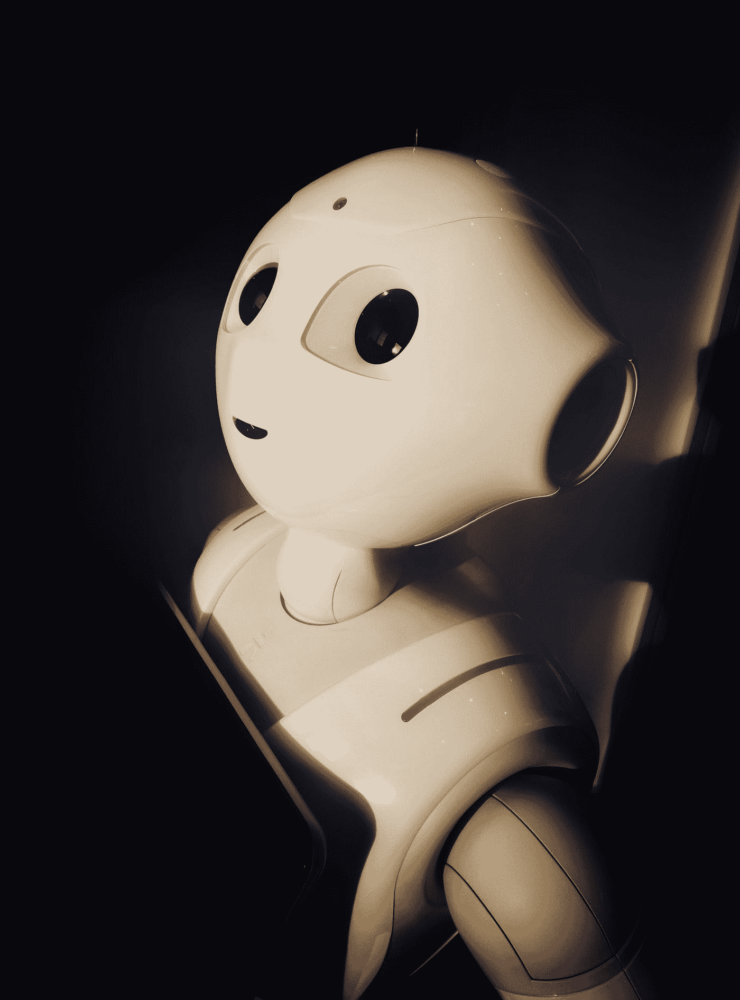

# 对机器学习的痴迷已经危险地接近爆发

> 原文：<https://medium.com/mlearning-ai/the-obsession-with-machine-learning-is-dangerously-close-to-exploding-dca5614e3b78?source=collection_archive---------1----------------------->

## “不要申请 ML 的博士项目。竞争太激烈了。”

Photo by [Possessed Photography](https://unsplash.com/@possessedphotography?utm_source=medium&utm_medium=referral) on [Unsplash](https://unsplash.com?utm_source=medium&utm_medium=referral)

就硅谷而言，“机器学习”已经成为当今的流行语。从计算机科学专业的一年级学生到行业专业人士，科技界的人们都对它的可能性着迷。