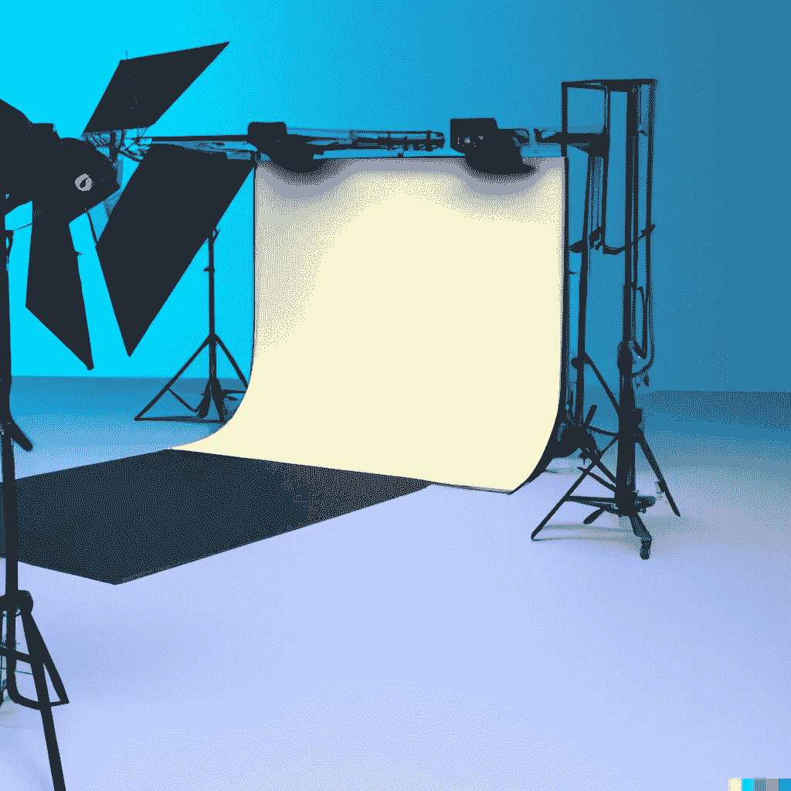

# 人工智能生成的 3D 场景中的正确照明

> 原文：<https://medium.com/mlearning-ai/the-right-lighting-in-ai-generated-3d-scenes-dbfb27f1f5e5?source=collection_archive---------2----------------------->

## [机器学习艺术](https://mlearning.substack.com/p/how-are-realistic-virtual-humans?r=z7zu8&s=w&utm_campaign=post&utm_medium=web)

## 光照估计的 GAN 方法| GITHUB 代码

[**background and realistically relit via panoramic lighting in real time**](https://mlearning.substack.com)

## 你如何照亮 3D 场景？

光线在**人工智能生成的 3D 场景**中的使用方式类似于它在摄影和电影制作中的使用方式。

## 3D 灯光艺术家是做什么的？