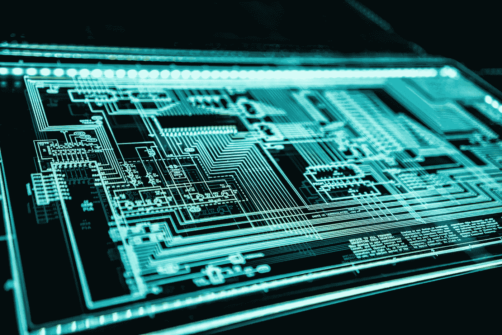

# 人工智能在未来技术中的作用

> 原文：<https://medium.com/mlearning-ai/the-role-of-artificial-intelligence-in-future-technology-2d6418f3fa4d?source=collection_archive---------4----------------------->

Photo by [Adi Goldstein](https://unsplash.com/@adigold1?utm_source=unsplash&utm_medium=referral&utm_content=creditCopyText) on [Unsplash](https://unsplash.com/s/photos/future-tech?utm_source=unsplash&utm_medium=referral&utm_content=creditCopyText).

# 介绍

人工智能是“创造机器的艺术，这些机器在由人执行时执行需要智能的功能。”(库兹韦尔，1990)。人工智能在过去几年里有了显著的发展，并在几个领域得到了应用。在几年内，人工智能预计将触及几乎所有的行业，人工智能有很多方式可以改变几个行业。人工智能目前正被用于各种技术，如增强现实、自动驾驶汽车和 5G。

# 增强现实中的人工智能

增强现实(AR)是现在巨大的技术趋势之一。AR 通过覆盖数字增强来增强现实世界的环境。随着越来越多的大公司开始采用 AR 来探索其在商业中的用途，在未来，这项技术将变得更加突出，并蔓延到生活的方方面面，如教育、零售、医疗保健和交通。AR 系统的一个基本技术是使用人工智能。人工智能将有所帮助，并且已经在许多方面帮助 AR 开发。例如，在 AR 中，要用数字增强覆盖一个对象，它必须首先检测该对象，这是 AR 中的一个基本概念，因此它使用了 AI 中的对象检测模型，如最先进的对象检测算法是 DINO(无标签的自蒸馏)(张等人，2022)，基于视觉变压器和知识蒸馏，或流行的对象检测算法 YOLOv4(你只看一次)，基于 CSPDarknet53 深度学习网络(邢奎等人，2020)。另一个作用是，当 AR 检测和读取文本以将其翻译成另一种语言，以将其覆盖到物理世界中时，它利用自然语言处理中的文本识别和翻译技术，如 BERT 模型(来自变压器的双向编码器表示)，该模型利用了变压器这种注意力机制(Devlin et al .，2018)。

# 自动驾驶汽车中的人工智能

自主车辆(AV)或自动驾驶汽车是一种适应车辆自动化的汽车；它能够感知周围的环境，执行必要的功能，并在没有任何人类干预的情况下自行操作。根据汽车工程师协会(SAE)的说法，从无自动化到完全自主，共有六个自动化级别，如图 1 所示。

Figure 1

它高度依赖于人工智能的使用，特别是在计算机视觉中，来感知世界并做出决策，以便实现自动化。例如，CV 在 AV 中的一个用途是语义分割。通过语义分割，汽车可以检测和分组相似的物体，像行人和汽车，使其能够安全导航；例如，U-net 是一种流行的语义分割模型(Ronneberger 等人，2015 年)，可用于自动驾驶汽车。AI 的另一个领域，强化学习，可用于交通控制系统和运动规划；例如，通过像深度逆强化学习(T. Fernando 等人，2021 年)这样的方法，AVs 可以准确预测其他路上车辆的行为，以便做出正确的行动。

# 5G 中的人工智能

5G 宽带蜂窝网络是继 4G 之后的下一个全球无线标准；它意味着更快、超低延迟、更高的可用性等等。然而，5G 生态系统的复杂性要求一定程度的服务保证，仅靠人力是不可能的；它必须依赖于一个智能系统。例如，5G 使用基于波束的覆盖进行部署，通过 ML 模型助手，5G 蜂窝基站可以计算出最佳波束。此外，AI 和 ML 模型可以通过检查网络活动模式和参数来实时检测可疑活动。例如，使用分类算法，可以通过观察网络参数(如吞吐量和网络错误日志)来捕获异常，而使用群集模型，可以将网络中的几种类型的威胁聚集在一起。此外，一些模型，如生成式对抗网络(GANs)，可以创建非真实数据来评估、开发、测试和实施新的安全措施和协议(Haider 等人，2020)。此外，借助 5G，多个物联网设备可以同时连接，从而产生大量数据，这些数据可以利用 ML 和 AI 处理各种任务，例如，识别动态变化并根据历史数据预测用户分布，预测流量、资源利用率，以及优化网络参数以进行扩展(Haidine 等人，2021)。

# 结论

总的来说，人工智能的应用正在彻底改变和增强各个行业。人工智能已经部署在许多最近的技术和即将到来的技术中，不仅仅是在 AR、AV 和 5G 中，还包括医疗保健、媒体和网络安全等其他一些技术，预计在不久的将来还会有更多的技术。

# 参考

库兹韦尔。(1990).*智能机器时代*。麻省理工出版社。

、刘石龙、、、、、沈向洋。(2022).*迪诺:DETR，使用改进的去噪锚盒进行端到端的目标检测* n. [arXiv:2203.03605](https://arxiv.org/abs/2203.03605) 。

Devlin，j .，Chang，m-w .，Lee，k .和 Toutanova，K. (2018 年)。 *BERT:用于语言理解的深度双向转换器的预训练*。 [arXiv:1810.04805](https://arxiv.org/abs/1810.04805) 。

赵奇舒昌路朱兴奎。(2020). *YOLOv4:物体检测的最佳速度和精度*。arXiv:2004.1094 。

奥拉夫·龙内贝格，菲利普·费舍尔，托马斯·布罗克斯。(2015). *U-Net:用于生物医学图像分割的卷积网络。* [arXiv:1505.04597](https://arxiv.org/abs/1505.04597) 。

T.费尔南多、s .登曼、s .斯里达哈兰和 c .福克斯。(2021).*用于自动驾驶中行为预测的深度逆强化学习:车辆运动的精确预测*。IEEE 信号处理杂志。

诺曼·海德尔，穆罕默德·齐山·贝格，穆罕默德·伊姆兰。(2020).*5G 网络安全中的人工智能和机器学习:机遇、优势和未来研究趋势。*[arXiv:2007.04490](https://arxiv.org/abs/2007.04490)。

Haidine，a .，Salmam，F. Z .，Aqqal，a .，& Dahbi，A. (2021)。5G 及以后的人工智能和机器学习:调查和展望。在(Ed。)，推动宽带移动通信向前发展——5G 智能技术及超越。IntechOpen。[https://doi.org/10.5772/intechopen.98517](https://doi.org/10.5772/intechopen.98517)。

 [## Mlearning.ai 提交建议

### 如何成为 Mlearning.ai 上的作家

medium.com](/mlearning-ai/mlearning-ai-submission-suggestions-b51e2b130bfb)