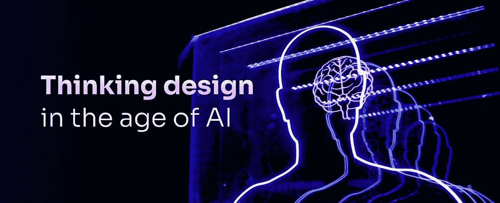
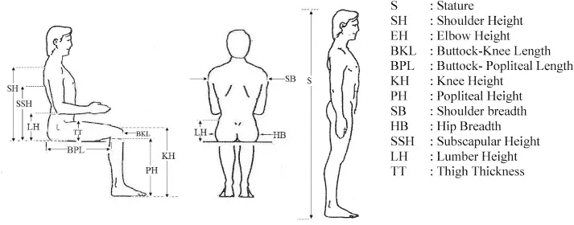
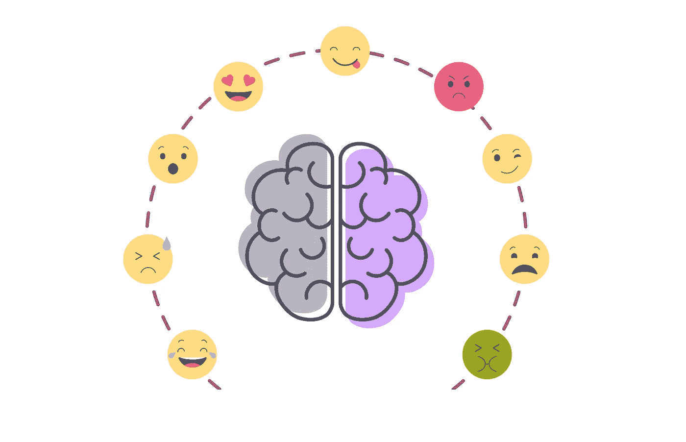
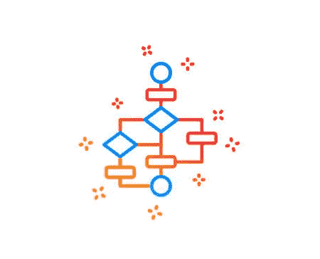
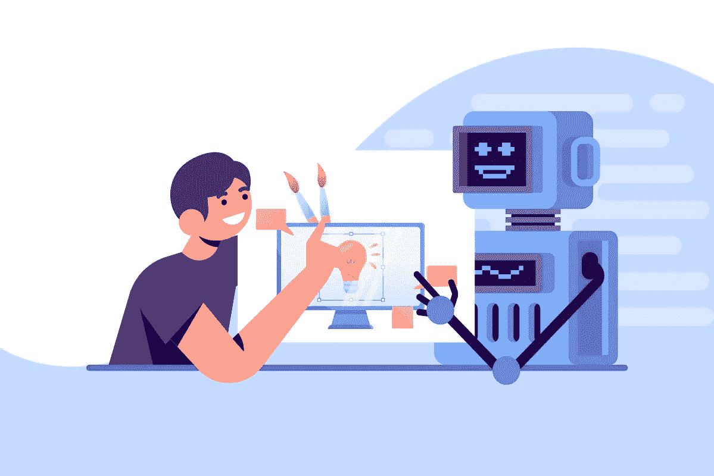

# 人工智能时代的思维设计

> 原文：<https://medium.com/mlearning-ai/thinking-design-in-the-age-of-ai-378dc5e5165f?source=collection_archive---------5----------------------->

终于，一天结束了！你有什么计划？躺在沙发上吃着零食看网飞，或者开车去咖啡馆，或者看埃隆·马斯克谈论航天飞机？无论做什么，设计无处不在。无论你看到的是缝制衣服的细针，还是将人类送上太空的航天飞机，一切都是设计好的，思考什么、为什么、在哪里、如何是窥视其根源所需要的心态。

# “我们可能听说过“好的设计是看不见的”。但要成为一名优秀的设计师，你必须发现并让我们日常生活中的事物变得可见。”

Anthropometric Data Points ( Image source Science Direct)

你知道吗，人体测量在不同的地理区域有很大的差异。想知道设计师如何平均计算你的门把手的合适厚度，或者你办公室里桌子的高度，甚至你使用的亭子的倾斜度？不仅是微观层面，设计对宏观层面也有影响。你有没有想过是谁设计了宗教和 cast 的概念，是谁设计了联合国，或者我们如何通过重新设计生命周期来影响环境？

设计师有批判性思考的能力，挑战现有的规范，重新定义他们周围的世界。无论你是设计 pixel perfect 应用程序、飞机、大型组织还是生命周期，带着好奇心思考设计的基本原则始终不变。随着时间的推移，执行所需的技能组合会发生什么变化。

Emotions (Image Credits: Steve Glaveski)

# “我们不只是设计像素或英寸；我们设计情感、联系和思想。”

在某个场合送给你妻子的一瓶酒，或者在你最好的朋友生日时送给你的一块蛋糕，或者你父母送给你挂在墙上的一幅画，这些不仅仅是产品，它们是分享的感情。有时，数据无法推测潜在的情绪，感知的使用环境可能与现实相去甚远。这也是为什么移情对设计师如此重要的原因之一。

Algorithm (Image Source 123RF Stock Images)

由人工智能、人工智能或 NLU 推动的算法技术的介入正在改变我们今天对设计和创新的看法。它已经影响了我们生活的几乎每一个方面，并且是被采用最快的技术之一。当我们听到人工智能时，我们通常会想到自动化操作，但事实并非如此。人工智能最重要的礼物是大规模的无监督学习，以有效地发现带有偏见和假设的数据中的洞察力。

我一直听到的问题是，AI 会改变我们思考设计的方式吗？如果是，会有什么变化？如果不是，那么 AI 会怎么做？在 3 年的时间里致力于数字和有形的人工智能解决方案，向我提供了数据，表明人工智能没有改变思维设计的基本原则。

# “在本质上，设计将永远是关于好奇、以人为本、绑架和迭代，而人工智能也将基于同样的理由工作。”

在本文的前面，我们讨论了如何在全球范围内测量不同的人体测量数据，以获得有效的人体工程学结果。到目前为止，这是一个容易出现人为错误的手动过程，但如果我们使用在现有数据集上训练的 AI & ML，它可以告诉我们最适合产品的人体工程学测量，这些测量可以得到验证并易于应用。

Designers & AI (Image Source: Graphic Design Institute)

设计师不仅可以使用人工智能分析量化数据，还可以生成和预测基本策略、美学、行为、政策等，而不是在现有案例上使用无监督学习。我们已经开始看到人工智能在设计和开发中的应用，初创公司专注于 VS 代码中的代码模板预测，Figma 中基于上下文的视觉布局生成，网飞建议中使用的行为分析，以及确定仓库中库存履行频率的模式识别。

那么，如果 AI 可以做到这一切，设计师们将何去何从？没有有效的数据，设计不容易，人工智能也不聪明。每个人和工具在我们的生活中都有自己独特的作用，但都有特定的局限性。作为设计师，我们的核心技能是发现潜在的问题，换位思考，理解价值观，做出假设，选择正确的策略，做出决策，并确保在附加的身体和认知约束下有效执行。虽然人工智能擅长假设或数据库分析、预测、建议、排列和组合，但更快的执行会带来更多漏洞，如偏见和非情绪判断。

在人工智能时代，设计师将成为领导者和决策者，而人工智能将扮演助理设计师的角色，共同打造一个无与伦比的团队。