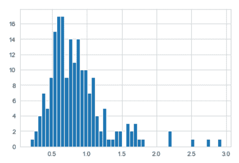
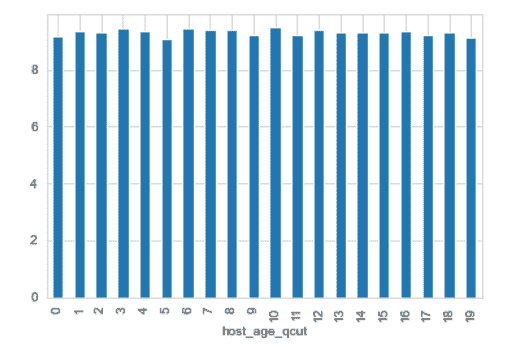
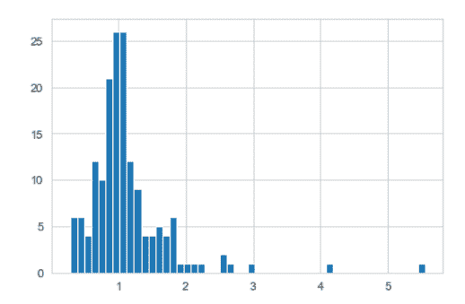

# 这会让你对 Airbnb 在美国的业务有所了解

> 原文：<https://medium.com/mlearning-ai/this-will-bring-you-insights-about-airbnbs-business-in-the-united-states-2288d932bbe2?source=collection_archive---------4----------------------->

When will we be able to travel to such places again?

虽然 Covid 在世界上的一些国家仍然存在，但旅游业还没有回到它的最佳时期。在像巴西和美国这样的国家，几乎每天都有一千多人死于这种疾病。最近被认为控制病毒的措施没有效果，所以人们问自己什么时候才能回到正常的社会生活。首先，旅游业是有风险的。

这场危机显然影响了 Airbnb 的业务，一些人声称这可能会使该公司放弃他们原计划在 2020 年进行的 IPO(最终在 12 月进行)。随着我们深入到 2021 年，成千上万的主机仍未能获得他们想要的结果。

也许，当流行病结束时，在被剥夺了他们曾经认为是理所当然的权利后，人们会耗尽他们这几个月来积累的所有旅行能量。此外，随着公司越来越适应远程工作，访问其他地方将不再是一个仅限于假期的选择。这些想法可能会让酒店老板和 Airbnb 房东充满希望，但目前来看，这只是希望。

也许看一看 Airbnb 过去的公开数据可以为我们提供未来会发生什么的见解。

在这篇文章中，我们将看看该公司 2016 年的上市数据，涉及美国的两个城市:波士顿和西雅图。在浏览了可用的数据集后，提出了以下问题:

1.  类似的房源，波士顿和西雅图的价格如何比较？(如果你曾经在美国生活过，这一点可能很明显，但我自己没有)
2.  *老主持人比新主持人的评论分数高吗？*随着时间的推移，主持人是否有“学习”如何使用 Airbnb 的趋势？
3.  *对于类似的上市，超级主播比非超级主播更成功吗？*为了衡量成功与否，我们将同时考虑实际价格和评论分数。也许，如果你是超级主播，你可能会比非超级主播收费更高，或者有更好的评价。

# **哪个城市更贵？**

让我们从波士顿和西雅图的比较开始。

可用数据来自三个数据集:日历、评论和列表。第一个基本上表示每个列表在整个时间内的可用性；第二个是 Airbnb 用户每次评论的日期数据；第三个，也是对我们的目的最有用的一个，使用公司提供的服务，带来了几十个关于用户可以在给定时间内预订的地方(房源)的列——除了房源的描述、评论分数和许多更有趣的信息之外，还提供了房源的物理属性，如卧室和浴室的数量。

为了对抗这两个城市之间的价格，我们首先需要能够对我们认为是**相似的**列表进行分组；将波士顿的合租公寓与西雅图的豪宅相提并论是不公平的，对吗？为了不让我们错过这种细节，有必要决定哪些数据将用于选择类似的地方。

为了对相似的地方进行分组，使用了以下列: *property_type* (公寓还是房子？)、*房型*(是包间还是合住？)，*住宿*(可能有多少人住在那里？)、*卫生间*、*卧室*、*床*(与房源物理空间相关)。

在决定如何对列表进行聚类之后，还需要处理价格列:*价格*、*周价格*和*月价格*。它们都是以一种格式提供的，这种格式对于执行分析来说是不理想的，例如值为“$250.00”。

为了比较波士顿和西雅图的价格，使用了 pandas 的 *pivot_table* 方法；因为目的是对三个不同的价格列执行完全相同的操作，所以为整个操作编写了一个 python 函数，使用中位数聚合作为标准。

相应地运行该函数后，我们得出了西雅图和波士顿价格比率的以下结果:

*   对于*价格*列(每日价格)，西雅图价格或者是波士顿价格的 75.3%(当取中值的中值时)，或者是 85.5%(当计算中值的平均值时)。这表明波士顿的价格高于西雅图，而且，由于平均值和中间值结果之间的对比，可能有相当数量的异常值。事实上，下面我们可以看一下比例'**西雅图价格对波士顿价格**'的分布情况(对于可比较的列表)。数值集中在 0.6 ~ 0.8 左右，一些异常值远在右侧。

Distribution (histogram) of median ‘Seattle price over Boston price’ for each group of similiar listings

*   对于 *weekly_price* 列，中值和平均值的结果分别为 81.0%和 88.5%；
*   对于 *monthly_price* 列，中位数和平均数的结果分别为 87.5%和 92.5%。

因此，我们得出了一个奇怪的结果:波士顿的价格高于西雅图，但这两个城市的价格差异在每周和每月的价格上更低——也就是说，西雅图的主人在每周和每月的住宿上提供的折扣平均低于波士顿。

现在，我们可以跟上回答我们的第二个问题。

# **年纪大的主持人是不是更好复习？**

为了回答这个问题，需要的数据争论稍微简单一些——分析一个总体趋势，不需要将相似的列表分组，或者在波士顿和西雅图之间以某种方式分割数据。

第一个任务是将 *host_since* 列转换为 datetime，然后创建 *host_age* 列。在这之后， *host_age* 列被分桶，使用 pandas *qcut* 方法。

然后，生成以下图，每个*主机年龄*时段的平均审查分数如下:

Average reviews_scores_value for the generated host_age buckets

主持人年龄和收到的评论平均分之间似乎没有明确的关系！

不幸的是，由于没有关于评论分数的历史数据，我们无法进行更完整的分析。我特别好奇的一件事是:在收到反馈后，评价差的主持人会随着时间变好吗？这篇文章将在以后的文章中讨论。

# 超级主机更成功吗？

所以，我们准备回答最后一个问题。

用于回答这个问题的数据争论实际上与第一部分中执行的非常相似——在这里，我们也对相似的列表进行分组，然后进行透视以比较聚合值(之前，透视了 *city* 列；现在，我们将透视 *host_is_superhost* 。比较了*价格*和*评审分数价值*列。

我们得出了以下结果:

*   对于*价格*列，当取中值的中值时，超高价格高出 1.5%，当计算中值的平均值时，超高价格高出 11.7%。这表明超级主机'价格略高于非超级主机'。正如我们对波士顿和西雅图价格的回答一样，平均值和中值结果之间的差异再次表明可能存在异常值。

Distribution (histogram) of median ‘Superhost price over Non-Superhost price’ for each group of similar listings

*   对于 *review_scores_value* 专栏，超级用户的价格比非超级用户的价格高 5.3%——中位数和平均数的结果非常相似。

所以，平均来说，超级发帖者的评论似乎比非超级发帖者稍好一些(高出约 5%)。然而，对于价格来说，超级主机似乎有更高的平均价格，这主要是由于异常值——超级主机的中值比率仅高出 1%。

# **最后的话**

在本文中，我们探索了一个公共数据集，并能够收集一些见解。我们的主要工具是 python 的 pandas 库，这对于数据争论是非常值得推荐的。

我希望这有助于您了解如何探索数据集并将数据转换为有用的信息！

如果你愿意，你可以在 Github 的 [**我的回购**](https://github.com/istoia9/udacity-data-scientist-nanodegree/tree/main/project_one_medium_post) 中查看这个项目使用的代码。