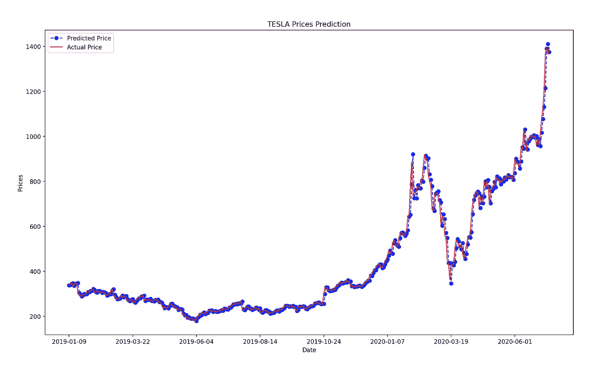

# 时间序列预测:使用 ARIMA 模型预测股票价格

> 原文：<https://medium.com/mlearning-ai/time-series-forecasting-predicting-stock-prices-using-an-arima-model-627db94590e6?source=collection_archive---------0----------------------->

## 在这篇文章中，我将向你展示如何使用预测 ARIMA 模型来预测特斯拉的股票价格

ARIMA model performance on the test set

# 1.介绍

## 1.1.时间序列和预测模型