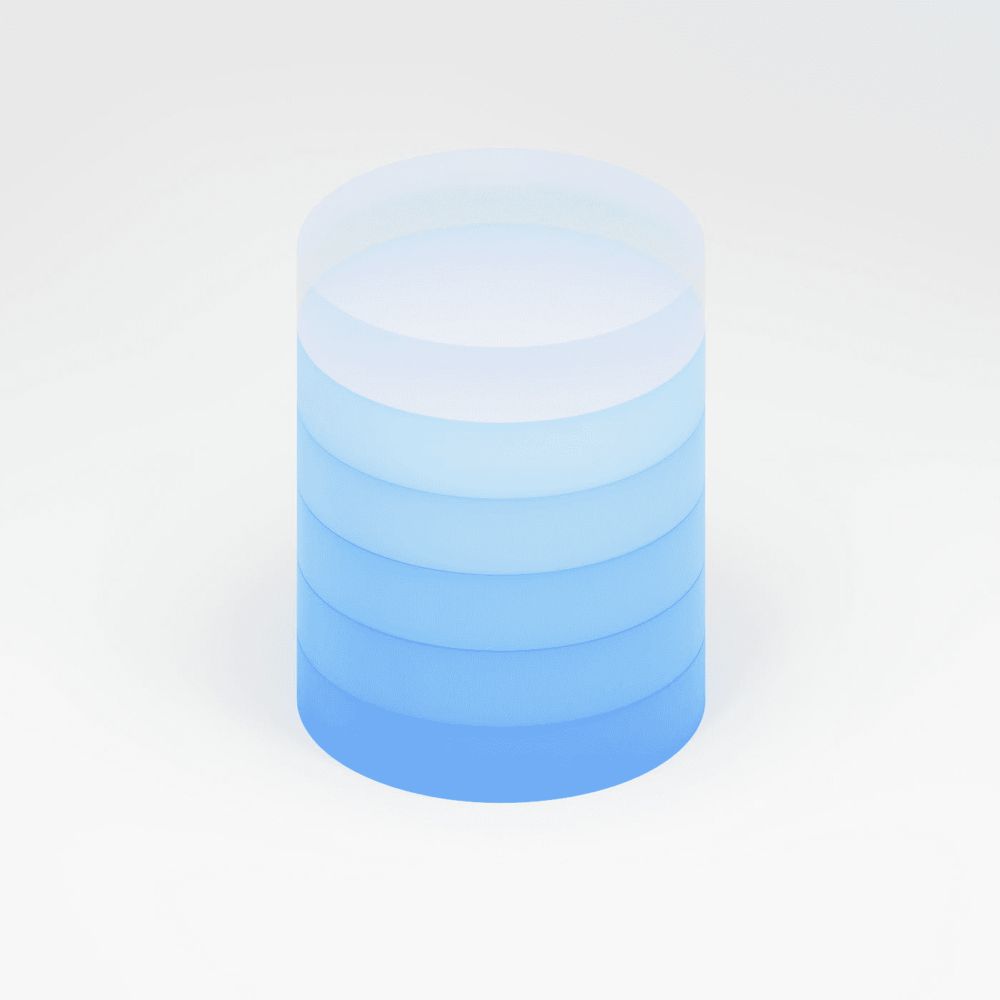

# 赢得数据科学访谈的 25 大 SQL 访谈问题

> 原文：<https://medium.com/mlearning-ai/top-25-sql-interview-questions-to-ace-the-data-science-interview-b01284ce7b6a?source=collection_archive---------0----------------------->

## 您可以为任何数据科学访谈准备的前 25 个 SQL 访谈问题

Photo by [Sunder Muthukumaran](https://unsplash.com/@sunder_2k25?utm_source=medium&utm_medium=referral) on [Unsplash](https://unsplash.com?utm_source=medium&utm_medium=referral)

大家好，我希望你们做得很好，在开始我们今天的文章之前，我只想告诉你们，我很抱歉延迟了这篇文章。

我已经有两个月没有上传或发表任何新文章了，因为我正在数据科学领域建立一些项目，比如机器学习预测模型和 NLP 项目，创建不同的数据仪表板等等，这就是为什么我不能发表任何新文章的原因

是的，我会把我建立机器学习预测模型和自然语言处理项目的全部经验，以及我在数据科学领域完成的一些不同的项目发表出来

比如，我会告诉你我按照哪些步骤来构建我的项目，以及我如何在机器学习预测模型上获得良好的准确性？

所以不用担心，伙计们，我会发布我的经验，关于我是如何构建项目的，但是现在，在今天的文章中，我们将看到 25 个最重要的问题，如果你想面对 SQL 面试，你应该做好准备

实际上，对于 SQL 访谈还有很多问题，但是在今天的文章中，我将告诉您 25 个您可以准备的问题

在下一篇文章中，我将告诉你另外 25 个问题，这些问题对于 SQL 面试来说是最重要的，这样你就可以准备好这些问题并赢得面试

因为当您[开始学习数据科学](/@aniketkardile/how-to-start-learning-data-science-from-scratch-116e4bf61922?source=user_profile---------17----------------------------)时，您将会遇到 SQL 主题，这是这个领域中最重要的主题

如果你肯定要面对任何数据科学的面试，你会被问到一些关于 SQL 的问题

我会说，如果你在接受数据分析师的采访，那么你可能会被问到关于 Python 和 SQL 的大部分问题

所以要破解这些面试，你必须知道一些与 SQL 主题相关的重要问题

在本文中，我将告诉您一些您可以准备的最重要的 25 个问题

所以，在不浪费您太多时间的情况下，让我们开始吧

# 赢得数据科学访谈的首要 SQL 访谈问题

在告诉你 SQL 面试问题之前，我想告诉你，我会试着用一种简单的方式回答所有的问题

这样您就可以很容易地理解基本概念以及与该问题相关的完整解决方案

对于一些问题，我也会尝试给出谷歌上的这个问题的技术定义

让我们开始吧

## 1.什么是 SQL？

结构化查询语言(SQL)是一种用于与数据库接口的编程语言

这是一种用于从数据库中检索、更新、插入和删除数据的通用编程语言

## 2.什么是局部和全局变量及其差异？

局部变量和全局变量背后的简单概念是，局部变量是可以在函数内部使用的变量。

全局变量是可以在整个程序中使用的变量

局部变量为其他函数所知，这些变量不能被引用或使用。

无论何时调用该函数，都可以创建这些变量

在 global 中声明的同一个变量不能在函数中使用

无论何时调用该函数，都不能创建全局变量

## 3.DELETE 和 TRUNCATE 命令有什么区别？

当我们谈到删除命令时，删除命令用于从表中删除行

在这里，WHERE 子句可以用于一组条件参数

此外，提交和回滚可以在 DELETE 语句之后执行

当我们谈到 TRUNCATE 时，TRUNCATE 会删除表中的所有行

同样重要的是，截断操作不能回滚

## 4.什么是触发器？

数据库触发器是数据库中的存储过程，每当数据库中发生特殊事件时，它就会自动调用

主要是，触发器有助于维护数据库的完整性

类似地，当行被插入到指定的表中时，或者当某些表列被更新时，可以调用触发器

例如，当一个新的学生被添加到学生数据库中时，新的记录应该在相关的表中创建，比如考试、分数和出勤表

## 5.什么是存储过程？

存储过程的简单定义是，存储过程是一个由许多访问数据库系统的 SQL 语句组成的函数

不同的 SQL 语句被整合到一个存储过程中，并在需要时随时随地执行

## 6.子查询有哪些类型？

有两种类型的子查询—相关的和非相关的

相关子查询只是意味着它不能被视为独立查询，但它可以引用主查询的 FROM 列表中列出的表中的列

其中，非相关子查询可以被视为独立查询，并且子查询的输出在主查询中被替换

## 7.什么是子查询？

子查询的简单定义是子查询是另一个查询中的一个查询

外部查询称为主查询，内部查询称为子查询

查询的执行过程是这样的，总是先执行一个子查询，然后将子查询的结果传递给主查询

## 8.什么是查询？

数据库查询什么都不是，但它是从数据库获取信息的代码

可以用这样的方式编写查询，使得结果集符合我们的预期

## 9.什么是关系，它们是什么？

数据库中表之间的连接称为数据库关系

以下是数据库关系的一些示例:

*   一对一的关系
*   一对多关系
*   多对一关系
*   引用关系

## 10.什么是光标？

数据库游标什么都不是，但它是一个允许您在表的行或记录之间导航的控件

这可以被认为是指向一组行中的单个行的指针

游标对于遍历数据库记录特别有用，例如检索、添加和删除

## 11.有哪些不同类型的索引？

主要有三种指数-

1.唯一索引

如果列是唯一索引的，这种索引可以防止字段中出现重复值

定义主键后，可以自动应用唯一索引

2.聚集索引

该索引对表的物理顺序进行了重新排序，并允许基于键值进行搜索

每个表只能有一个聚集索引

3.非聚集索引

非聚集索引不改变表的物理顺序，并保持数据的逻辑顺序

每个表最多有 999 个非聚集索引

## 12.什么是指数？

索引是一种性能调优方法，用于更快地从表中检索记录

索引为每个值建立一个条目，使数据检索更快

## 13.什么是视图？

视图是表示数据库中一部分数据的虚拟表

没有模拟视图，占用的存储空间更少

根据关系，一个或多个表中的数据可以与视图集成。

## 14.所有不同的标准化是什么？

标准形式分为五类，如下所述:

第一范式(1NF):

这应该会清除表中所有重复的列

创建相似数据的表，并标识唯一的列

第二范式(2NF):

满足第一范式的所有条件

将数据子集分成不同的表，主键用于创建表之间的关系

第三范式(3NF):

这应该满足所有 2NF 标准

删除不受主键约束的列

第四范式(3NF):

它应该满足第三范式的所有要求，并且没有多值依赖

## 15.什么是反规格化？

反规范化是一种数据库访问技术，它将数据从较高的范式转换为较低的范式

它也是将相关表中的数据合并到一个表中以增加冗余的技术

## 16.什么是正常化？

规范化是结构化数据库的列和表以减少冗余和依赖性的过程

规范化的主要目标是在单个表中添加、删除或编辑字段

## 17.连接和解释的类型有哪些？

根据表的关系，有几种联接可用于提取数据

内部联接:

当表之间至少有一行匹配时，内部联接将返回行

右连接:

右连接返回右侧表的所有行以及表之间的公共行

简单地说，它返回右侧表中的所有行，即使左侧表中没有匹配的行

左连接:

表和左侧表的所有行之间的公共行由左连接返回

简单地说，即使右边的表中没有匹配项，它也会返回左边表中的所有行

完全连接:

当任何表中有匹配的行时，完全连接将返回行

这意味着它从左侧和右侧的表中检索所有行

## 18.什么是联接？

该术语用于根据表的字段关系查询许多表中的数据

使用连接时，键非常重要

## 19.什么是主键？

主键是唯一标识数据库中记录的一组字段

这是一种特殊类型的唯一键，带有隐含的 NOT NULL 约束

它表示主键的值不能为空

## 20.什么是外键？

外键是可以链接到另一个表的主键的表

两个表之间的关系必须通过引用另一个表的主键的外键来建立

## 21.什么是唯一键？

数据库中的每条记录都由唯一的键约束来识别

这确保了列或列集合是唯一的

自动唯一约束被定义为主键约束

然而，在唯一键的情况下，情况并非如此

根据该表，可以定义几个唯一约束，但只能定义一个主键约束

## 22.什么是表和字段？

表是使用模型中的列和行组织的数据集合。

垂直列是垂直的，而水平行是水平的

一个表有一定数量的列，称为字段，但它可以包括任意数量的行，称为记录

## 23.什么是数据库？

数据库仅仅是数据的一种有组织的表示，它允许简单的数据访问、存储、检索和管理

这是一种结构化类型的数据，可以通过多种方式进行访问

## 24.什么是 RDBMS？

关系数据库管理系统是 RDBMS 的完整形式

RDBMS 包含一系列表中的数据，这些表由表的列之间的公共字段链接

它还有关系操作符，可以用来操作表中的数据

## 25.什么是数据库管理系统？

数据库管理系统(DBMS)是管理数据库的开发、维护和使用的软件应用程序

数据库管理系统(DBMS)是一种文件管理器，它处理数据库中的数据，而不是将数据保存到文件系统中

# 结论

因此，这些是在数据科学面试中胜出的 SQL 面试问题

我希望读完这些问题后，你对面试时可能面临的问题结构有了一个概念

我在这里写的问题的流程不是从容易到难的

我已经写下了所有这些问题，它们是如何进入我的脑海的，所以没有流向这些问题

但是，流程可能是从难到易，所以在阅读完顶部的问题后，你可能会觉得底部的问题比上面的问题更容易

还有一些更重要的 SQL 问题，我将在接下来的文章中告诉您

所以，非常感谢你花宝贵的时间来阅读这篇文章，并有一个美好的未来，再见

 [## Mlearning.ai 提交建议

### 如何成为 Mlearning.ai 上的作家

medium.com](/mlearning-ai/mlearning-ai-submission-suggestions-b51e2b130bfb)