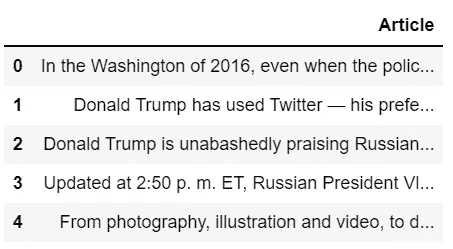
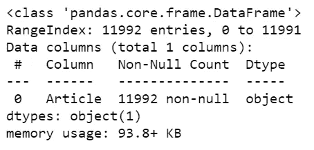
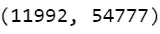
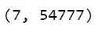
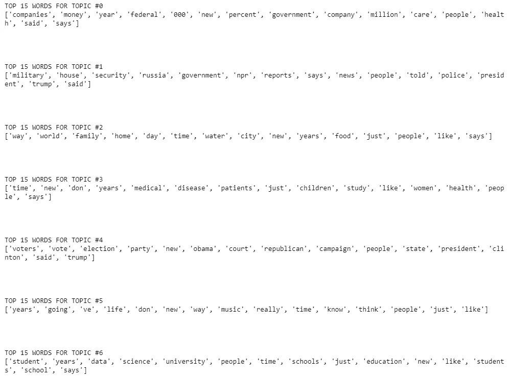
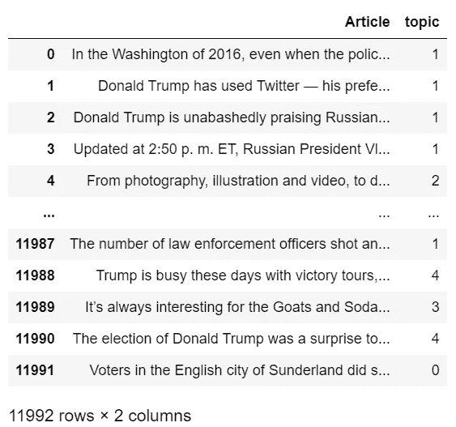

# 使用潜在狄利克雷分配的主题建模——最简单的方法——带源代码

> 原文：<https://medium.com/mlearning-ai/topic-modeling-using-latent-dirichlet-allocation-easiest-way-with-source-code-649df6d84427?source=collection_archive---------7----------------------->

所以在今天的博客中，我们将看到如何使用[潜在的狄利克雷分配](https://en.wikipedia.org/wiki/Latent_Dirichlet_allocation)来执行主题建模。我们在主题建模中所做的是试图根据一些相似的单词将不同的对象(在本例中是文档)组合在一起。这意味着如果两个文档包含相似的单词，那么它们很有可能属于同一类别。所以不用浪费任何时间。

点击此处查看视频—【https://youtu.be/a9WGoIiWwXg 

# 让我们开始吧…

## 步骤 1-导入所需的库。

```
import pandas as pd
import numpy as np
from sklearn.feature_extraction.text import CountVectorizer
from sklearn.decomposition import LatentDirichletAllocation
```

## 步骤 2 —读取输入数据。

```
articles = pd.read_csv('npr.csv')
articles.head()
```



## 步骤 3-检查我们数据的信息。

```
articles.info()
```

*   我们可以看到我们的数据只有一个名为**文章**的列，有 11992 个条目。



## 步骤 4-创建我们数据的文档术语矩阵。

```
cv = CountVectorizer(max_df=0.95,min_df=2,stop_words='english')
dtm = cv.fit_transform(articles['Article'])
dtm.shape
```

*   这里我们使用 [CountVectorizer](https://scikit-learn.org/stable/modules/generated/sklearn.feature_extraction.text.CountVectorizer.html) 将我们的文档转换成字数数组。
*   在这里，我们可以看到我们的 dtm 具有(11992，54777)的形状，其中 11992 表示我们的数据集中文档的数量，54777 表示我们的总词汇表中不同单词的数量。



## 步骤 5-初始化潜在的狄利克雷分配对象。

```
LDA = LatentDirichletAllocation(n_components=7,random_state=42)
topic_results = LDA.fit_transform(dtm)
LDA.components_.shape
```

*   让我们初始化[LatentDirichletAllocation](https://scikit-learn.org/stable/modules/generated/sklearn.decomposition.LatentDirichletAllocation.html)对象。
*   将此对象放在我们上面创建的文档术语矩阵中。
*   检查它的形状。
*   我们可以看到 LDA 组件的形状是(7，54777)，其中 7 是组件的数量，54777 是词汇的大小。



## 步骤 6-打印将要进行聚类的特征/单词的列表。

```
for i,arr in enumerate(LDA.components_):

    print(f'TOP 15 WORDS FOR TOPIC #{i}')
    print([cv.get_feature_names()[i] for i in arr.argsort()[-15:]]) 
    print('\n\n')
```

*   **arr.argsort()** 将根据单词在特定主题的文档中出现的概率，以升序对单词进行排序。我们采用了最后 15 个单词，这意味着 15 个最有可能出现在该主题中的单词。
*   **cv.get_feature_names** 只是我们语料库中所有单词的列表
*   看，**话题#0** 的前 15 个单词是公司、金钱、年百分比等。看来是金融集团。
*   **话题#1** 好像是政治团体。
*   **话题#3** 好像是健康话题。
*   T21 看起来是一个教育团体。



## 第 7 步—最终结果。

```
articles[‘topic’] = topic_results.argmax(axis=1)
articles
```

*   最后给文档指定主题号。



如果对这个话题有任何疑问，请通过电子邮件或 LinkedIn 联系我。我已经尽力解释这个代码了。

***探索更多机器学习、深度学习、计算机视觉、NLP、Flask 项目访问我的博客—*** [***机器学习项目***](https://machinelearningprojects.net/)

**如需进一步的代码解释和源代码，请访问此处**—[https://machine learning projects . net/latent-Dirichlet-allocation/](https://machinelearningprojects.net/latent-dirichlet-allocation/)

*所以这就是我写给这个博客的所有内容，感谢你阅读它，我希望你在阅读完这篇文章后会有所收获，直到下一次👋…*

***看我以前的帖子:*** [***用 SPACY 的话来向量——证明国王-男人+女人=女王***](https://machinelearningprojects.net/words-to-vectors-using-spacy/)

[](/mlearning-ai/mlearning-ai-submission-suggestions-b51e2b130bfb) [## Mlearning.ai 提交建议

### 如何成为 Mlearning.ai 上的作家

medium.com](/mlearning-ai/mlearning-ai-submission-suggestions-b51e2b130bfb)