# 在线讨论中的有毒评论检测

> 原文：<https://medium.com/mlearning-ai/toxic-comment-detection-in-online-discussions-7d0f22a1396f?source=collection_archive---------0----------------------->

***免责声明:*** *本文对含有亵渎、粗俗或攻击性内容的有毒网络评论进行分类。本文中显示的一些有毒评论是出于代表性目的从数据集中提取的样本，严格来说不代表作者的观点。*


Photo by [Sergey Zolkin](https://unsplash.com/@szolkin?utm_source=unsplash&utm_medium=referral&utm_content=creditCopyText) on [Unsplash](https://unsplash.com/s/photos/online-comment?utm_source=unsplash&utm_medium=referral&utm_content=creditCopyText)

# 介绍

在线论坛和社交媒体平台在过去几年越来越受欢迎。这些平台促进知识共享，帮助人们找到个人和教育问题的答案，并允许他们自由表达自己的观点、感受和观点。然而，粗鲁的、不敏感的或恶毒的评论偶尔会出现，使讨论变得不愉快。

# 商业问题

在线论坛的主持人面临的挑战是如何促进大规模的对话。由于论坛上张贴了大量的评论，许多人身攻击没有被注意到或没有任何警告。不幸的是，被骚扰的人最终会离开社区，因为他们感到不安全。在这种情况下，人工智能可能是有益的。虽然人类会花几个小时来检查数千条评论，但机器学习算法可以在几秒钟内检测出潜在的有毒评论。

以前有一些模型被用来识别在线评论中的毒性。然而，它们的分类性能很差，或者仅限于将评论分类为有毒/无毒。我们将在本文中尝试解决的商业问题是开发具有高精确度的机器学习算法，同时能够检测不同类型的毒性，如威胁、淫秽、侮辱和基于身份的仇恨。预测毒性的确切性质将允许平台在选择他们有兴趣限制的毒性类型方面有很大的灵活性。

# 数据来源

我们将要处理的数据集是由对话人工智能团队提供的。Conversation AI 是 Jigsaw 和谷歌创立的一项研究计划。作为这项挑战的一部分，我们可以访问维基百科谈话页面编辑的评论数据集。这些数据很容易被分成一个训练集和一个未知集进行测试，每个数据集中有超过 15 万条评论。

# 数据描述

以下是数据中各列的简要描述:

1.  **id:** 表示与数据集中的每个评论相关联的唯一 id。
2.  **comment_text** :需要处理的原始文本数据，并使用机器学习或深度学习算法的应用程序的特征表示将其转换为数字向量。
3.  **标签:**二进制的目标变量或自变量(1 表示存在，0 表示不存在)。我们对每个评论有六种不同的可能标签如下: ***有毒、严重 _ 有毒、淫秽、威胁、侮辱、身份 _ 仇恨。*** 当这些标签都标有“0”时，表示该评论无毒或干净。

# ML 问题公式化

从机器学习或数据科学的角度来看，我们有一个基于 NLP 的分类问题。此外，因为一个评论可能被分类为多种不同类型的毒性，所以我们有一个多标签分类任务。

# 模型评估

我们可以用来评估和测量我们的模型的性能指标是**均值列式 ROC AUC** ，其数学定义如下:

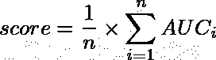

Mean Column-Wise AUC

简单地说，因为我们有多个标签，所以我们的度量只是每个预测列的单个 AUC 的平均值。AUC 指标是模型区分不同类别能力的指标。在我们的案例中，该指标定义了模型区分几种不同类型毒性的毒性和非毒性评论的能力。

# **探索性数据分析**


Photo by [M. B. M.](https://unsplash.com/@m_b_m?utm_source=unsplash&utm_medium=referral&utm_content=creditCopyText) on [Unsplash](https://unsplash.com/s/photos/data-analysis?utm_source=unsplash&utm_medium=referral&utm_content=creditCopyText)

广泛而有针对性的 EDA 对于解决任何机器学习问题的重要性怎么强调都不为过。在这一部分，我们将探索评论文本的不同方面，并深入研究不同的标签类型。

首先，让我们使用可视化直方图方法和百分比分析来理解我们的数据集中评论长度的分布。

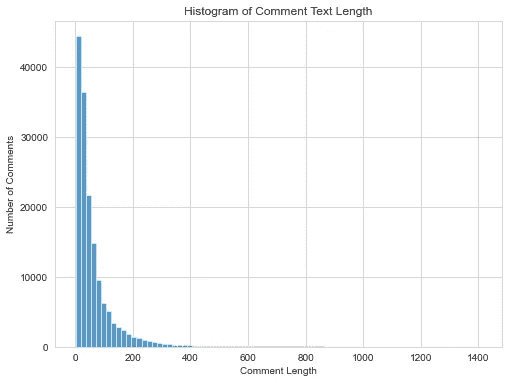

Comment Length Distribution

上面的图描述了我们语料库中评论长度的分布。从上面的图中可以观察到，大多数评论在 0-60 左右的字数很少。在少数情况下，我们可以看到评论超过 200 字。超过 200 字的评论很少见。一般来说，在线论坛上发表的评论长度遵循对数正态分布。基于我们的观察，我们还可以得出结论，我们的文档语料库的评论长度遵循对数正态分布，因为有大量的短评论和很少的长评论。让我们使用百分位数分析来进一步分析评论长度

```
**0th Percentile Value:** 1.0
**10th Percentile Value:** 8.0
**20th Percentile Value:** 14.0
**30th Percentile Value:** 20.0
**40th Percentile Value:** 27.0
**50th Percentile Value:** 36.0
**60th Percentile Value:** 47.0
**70th Percentile Value:** 63.0
**80th Percentile Value:** 91.0
**90th Percentile Value:** 152.0
**100th Percentile Value:** 1411.0
```

从上面的百分比分析可以看出，大约 90%的评论少于 150 个单词。第 90 和第 100 百分位值之间有很大的差距，因此我们将进一步放大。

```
**90th Percentile Value:** 152.0
**91st Percentile Value:** 163.0
**92nd Percentile Value:** 175.0
**93rd Percentile Value:** 188.0
**94th Percentile Value:** 207.0
**95th Percentile Value:** 230.0
**96th Percentile Value:** 258.0
**97th Percentile Value:** 302.0
**98th Percentile Value:** 386.0
**99th Percentile Value:** 567.0
**100th Percentile Value:** 1411.0
```

从放大分析中可以看出，训练语料库中 95%的评论都少于 230 个单词。再者，只有 1%的评论超过 500 字。这些发现将有助于后面的标记化和填充。

接下来我们来看看毒评论和干净评论的评论长度对比。

***注:“*** *毒性评论”此处的“毒性评论”是指附有任何形式毒性的评论。*

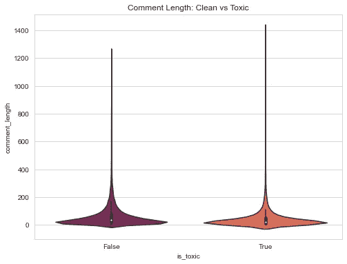

Comment Length by labels

上图比较了有毒评论和干净评论的评论字数分布。有毒评论的字数分布是右偏的。同样，对于干净或无毒的评论，大多数评论都限于几个词，很少有长评论的实例。基于以上观察，我们可以得出结论，有毒评论和干净评论之间在字数方面没有明显的模式。

现在，让我们从整体(有毒与清洁)水平以及不同毒性类型的角度，深入探讨分类标签的分布。

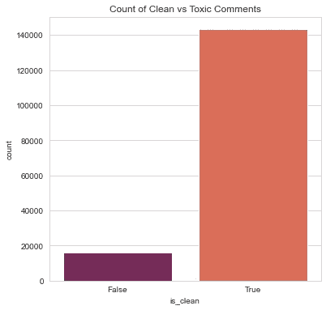

Distribution of class labels

上面的图比较了我们的训练数据中有毒注释和干净注释的计数。语料库中的有毒评论数量在 16k 左右。另一方面，有 14 万条干净评论，占总评论的 90%。因此，有毒评论与干净评论的比例大约为 1:9。基于图分析，我们可以得出结论，我们有一个非常不平衡的数据集在清洁与有毒的评论方面。这很直观，因为在网上论坛中，大多数评论都是带着积极的意图发布的。然而，就我们的分类问题而言，我们在创建模型时需要注意这种不平衡。

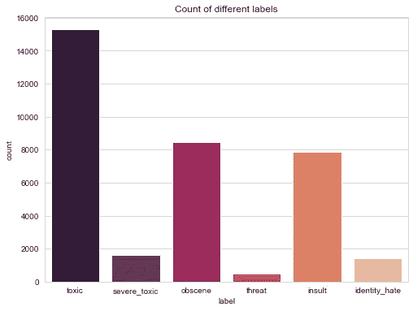

Distribution of toxic labels

上面的图表示我们的训练语料库中不同毒性标签的计数。在所有类别中,“有毒”标签出现的次数最多(约 15k)。带有淫秽和侮辱性内容的评论在数据集中具有大约 8k 的相同数量的计数。相反，基于威胁的评论很少，只有不到 1k 个实例。之前我们观察到干净和有毒评论之间存在不平衡。基于这些观察，我们可以进一步得出不同有毒标签的不平衡。

我们可以探究的另一个有趣的事实是每个评论所附带的标签数量。下面我们来看看同样的。

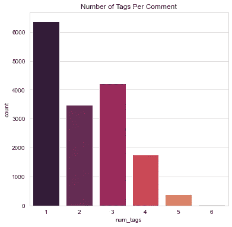

Labels per comment

上图显示了基于附加标签数量的评论文本的数量。从图中可以看出，大多数有毒评论都附有一个标签。然而，大约有 3.5k 和 4k+的评论分别带有 2 个和 3 个标签。此外，还有一部分评论将所有有毒标签都视为阳性。

现在，我们将利用词云，通过类别标签来可视化最常发现的词。

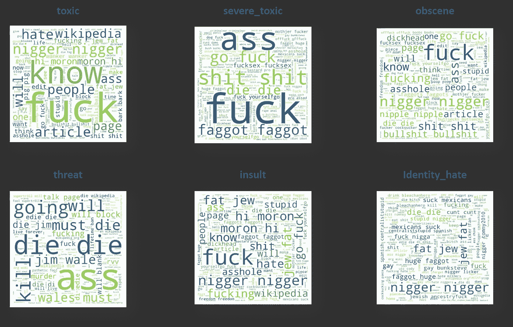

WordCloud by labels

上面的图代表了在我们的训练语料库中每种类型的标签最常见的单词。给定单词的字体越大，它在给定标签中出现的频率就越高。这些图描绘了各种标签的不同单词模式。正确编码这些模式对于解决我们的分类问题至关重要。

# 数据清理


Photo by [The Creative Exchange](https://unsplash.com/@thecreative_exchange?utm_source=unsplash&utm_medium=referral&utm_content=creditCopyText) on [Unsplash](https://unsplash.com/s/photos/cleaning?utm_source=unsplash&utm_medium=referral&utm_content=creditCopyText)

对于任何基于自然语言处理的分类任务，文本规范化对于构建高性能的模型是至关重要的。预处理文本数据有助于减少噪音和去除数据中无用的部分。忽略这一步可能会导致特征爆炸，并使模型难以学习各种单词和标签之间的相关性。基于对我们的数据语料库中文本低效的广泛探索，我们将应用以下处理步骤。我们将详细介绍每个阶段。

1.  亵渎词语映射前的处理
2.  替换模糊的亵渎或辱骂性词语
3.  最终处理功能

**亵渎映射前的处理**

作为处理阶段的一部分，我们打算使用自定义映射替换被操纵的亵渎性单词。然而，在进行这一步之前，我们需要清理我们的数据，而不影响通常用于操作的非字母数字字符。

在文本分类问题中，缩小特征空间的一种常用策略是扩展收缩。下面的例子说明了同样的情况。

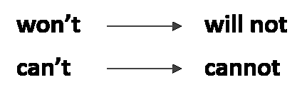

Expanding Contractions

语义短语“*不会*”和“*不会*”表示同一个事物。然而，在它们的原始格式中，机器学习模型会将*“不会”*和*“不会”*解释为不同的短语。扩展收缩确保了文本数据的一致性。

除了扩展缩写，我们将删除 HTML 链接/标签，删除不可打印的字符，将文本转换为小写，并删除停用词。这里的目的也是为了确保数据的一致性。

**替换混淆的亵渎词语**

有毒在线评论分类的一大障碍是文本数据的处理。拼写错误、错别字、缩写词在在线对话论坛中很常见。然而，这些有时被故意用来张贴辱骂性的内容。通过故意修改亵渎的词语，犯罪者可以绕过自动(基于人工智能的)版主，发布有害内容。

我们需要建立一个健壮的模型，能够处理这样的操作。最终，我们需要能够检测有毒的评论，并保护在线社区。

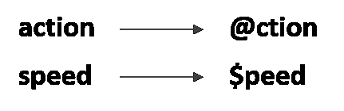

Text with special characters

上图显示了如何使用特殊字符来表示英文字符。人类能够将*" @ action "*解释为 *"action"* 或将*" $ speed*"解释为 *"speed "。另一方面，机器会认为这些是独立的表示。遇到这种情况的一种策略是使用基于距离度量的映射来替换被操纵的亵渎性单词。*

Fuzzy-wuzzy 是一个 python 库，它帮助我们使用 Levenshtein 距离来识别相似的字符串模式。给定两个字符串，它返回范围在 0 到 100 之间的令牌比率。令牌比率为 100 意味着两个输入字符串彼此完全匹配。使用一组已知的亵渎性单词并利用 fuzzy-wuzzy 库的功能，我们可以在语料库中识别被操纵的单词。

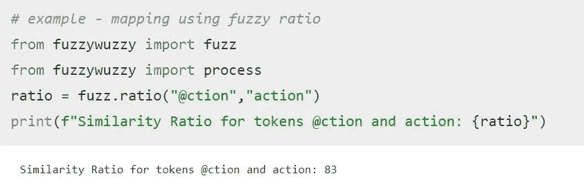

Fuzzy ratio example

我们将把替换混淆的亵渎词汇的任务分成以下几个阶段:

*   **载入亵渎的词:**首先我们将创建一组已知的亵渎的词。卡内基梅隆大学的计算机科学系提供了一份常见的冒犯性/亵渎性词汇的列表。

*   **独特词汇单词:**一旦我们创建了可能的亵渎单词的列表，下一步将是在我们的语料库中准备一组所有独特的标记。

*   **创建映射字典:**现在我们将创建一个映射字典，即对于每个攻击性的单词，我们将在我们的语料库中找到相似的(被操纵的)单词。只有当单词比率大于或等于 80 时，我们才会将词汇表中的单词与亵渎的单词进行映射。

*   **替换单词:**最后，使用映射字典，我们现在可以将语料库中被操纵的亵渎单词替换为它们的真实表示。对于我们数据集中的每个评论，我们试图搜索被操纵的亵渎性词语。找到的任何混淆的单词将使用映射字典替换。

**最终加工**

在第一个处理阶段，我们没有删除任何特殊字符(非字母数字字符)。既然我们已经映射并替换了被操纵的亵渎性词语，我们也可以继续清理这些特殊字符了。

# 要素制图表达


Photo by [Tyler Easton](https://unsplash.com/@tylerleeeaston?utm_source=unsplash&utm_medium=referral&utm_content=creditCopyText) on [Unsplash](https://unsplash.com/s/photos/numbers?utm_source=unsplash&utm_medium=referral&utm_content=creditCopyText)

对于任何机器学习或深度学习算法，我们都需要输入是数值数组的形式。在这一节中，我们将使用标记化和单词嵌入，用数字向量来表示文本数据。

**标记化和填充**

标记化意味着给我们词汇表中的每个独特的单词分配一个索引。假设我们的数据语料库中只有三个句子，如下所示。

```
sentence_1 = "this pasta is very good"
sentence_2 = "this pizza is not that good"
sentence_3 = "this pasta is delicious"
```

现在，我们将把上述语料库中的每个唯一标记表示为索引。我们总共有 9 个独特的词，可以映射到如下的索引。

```
{"this":      1, 
 "pasta":     2, 
 "is":        3, 
 "very":      4, 
 "good":      5, 
 "pizza":     6, 
 "not":       7, 
 "that":      8, 
 "delicious": 9}
```

根据上面的映射，我们现在可以将语料库中的每个句子表示为一个数值数组。

```
sentence_1 = [1 2 3 4 5]
sentence_2 = [1 6 3 7 8 5]
sentence_3 = [1 2 3 9]
```

类似地，使用 Tensorflow 的 tokenizer 类，我们将为词汇表中的每个单词分配一个唯一的索引，从而将我们的注释转换成一个索引数组。

然而，在分词的时候，我们不会给词汇表中的每个单词都分配一个索引。我们将只保留那些在我们的数据语料库中至少出现两次的单词。我们将忽略那些只出现一次的单词，因为它们不会提高我们模型的学习能力。

对我们的训练语料库的分析显示，在 105，000 个独特的单词中，大约 79，000 个单词出现不止一次。我们将为这 79k 个单词分配一个标记索引。剩余的单词将被分配一个令牌值“0”。

既然我们已经将每个注释转换成数字索引的向量，接下来我们需要确保这些序列的长度都相同。这对于确保我们在训练模型时传递一致的输入大小非常重要。虽然训练基于 RNN 的体系结构不需要输入大小的一致性，但仍然建议这样做，因为这有助于批量训练。

为了确定标准序列长度，我们将对训练序列的长度进行统计(百分位数)分析。

```
**0th percentile value** is 1.0
**10th percentile value** is 4.0
**20th percentile value** is 7.0
**30th percentile value** is 10.0
**40th percentile value** is 14.0
**50th percentile value** is 18.0
**60th percentile value** is 24.0
**70th percentile value** is 32.0
**80th percentile value** is 46.0
**90th percentile value** is 78.0
**100th percentile value** is 1250.0
```

正如所观察到的，在第 90 和第 100 百分位值之间有一个显著的跳跃，因此我们应该进一步放大这个范围来分析文档长度。

```
**90th percentile value** is 78.0
**91st percentile value** is 84.0
**92nd percentile value** is 91.0
**93rd percentile value** is 97.0
**94th percentile value** is 106.0
**95th percentile value** is 119.0
**96th percentile value** is 135.0
**97th percentile value** is 159.0
**98th percentile value** is 204.0
**99th percentile value** is 302.0
**100th percentile value** is 1250.0
```

如从上述百分位值观察到的，98%的文档具有大约 200 个标记的长度。我们可以认为这是填充序列的最大长度，因为我们可以保留大多数文档中的信息，并且不会对所需的计算能力产生太大影响。

我们将利用“pad_sequences”函数来确保我们的每个标记化注释的最大长度为 200 个标记。如果一个序列有超过 200 个记号，我们将从末尾截断多余的单词。相反，如果一个序列的长度小于预先确定的长度，我们将在末尾填充所需数量的零。

**单词嵌入**

为了训练像 CNN 和 RNNs (LSTM 和 GRU)这样的深度学习架构，我们需要密集或多维的表征。因此，我们将使用预定义的向量来获得这些表示。我们将尝试以下嵌入:

*   手套嵌入
*   快速文本

为了利用这些预定义的单词嵌入，我们需要在我们的模型架构中加入一个嵌入层。对于作为输入提供的每个标记索引，嵌入层返回相应的单词向量。嵌入层的主要成分是嵌入矩阵。嵌入矩阵中的每一行都对应于我们的记号的密集表示。

让我们看一个简单的例子来详细理解嵌入层是如何工作的。假设我们的语料库由以下两个句子组成。

```
the train arrived late yesterdaythe train is always late 
```

如前所述，这些将使用索引标记如下。

```
[1, 2, 3, 4, 5][1, 2, 6, 7, 4]
```

现在让我们假设我们只使用二维来表示语料库中的每个单词。下面是这种情况下嵌入矩阵的样子。

```
+-------+------------+
| Index | Embeddings |
+-------+------------+
|   1   | [0.5, 3.4] |
|   2   | [1.2, 1.6] |
|   3   | [2.5, 1.1] |
|   4   | [3.6, 1.2] |
|   5   | [0.9, 4.5] |
|   6   | [2.2, 0.4] |
|   7   | [1.2, 1.6] |
+-------+------------+
```

在模型训练期间，来自输入句子的每个单词将基于它们的标记索引被表示为一个热编码向量。这个向量的大小等于我们词汇中唯一单词的数量。

```
#the       --> [1,0,0,0,0,0,0] 
#train     --> [0,1,0,0,0,0,0]
#arrived   --> [0,0,1,0,0,0,0]
#late      --> [0,0,0,1,0,0,0]
#yesterday --> [0,0,0,0,1,0,0]
```

将这些独热码编码向量中的每一个与嵌入矩阵相乘将给出相应的单词嵌入。直观上，这只不过是我们的独热编码向量矩阵和嵌入矩阵之间的乘法。下面提供了相同的视觉表示。

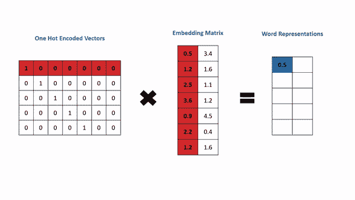

我们将创建两个嵌入矩阵:一个基于我们的手套向量，另一个使用快速文本嵌入。

已经在 42B 个标记上训练了在 300 个维度上表示的预定义手套向量。快速文本表示也已经在 300 个维度上被表示，并且已经在从维基百科提取的语料库的 16B 个标记上被训练。

# 建模


Photo by [JJ Ying](https://unsplash.com/@jjying?utm_source=unsplash&utm_medium=referral&utm_content=creditCopyText) on [Unsplash](https://unsplash.com/s/photos/neural-network?utm_source=unsplash&utm_medium=referral&utm_content=creditCopyText)

既然我们已经分析和理解了数据，执行了所需的数据处理/清理，并且用数字表示了我们的文本数据，我们就可以继续进行建模阶段了。作为这个问题的一部分，我们将尝试各种深度学习架构。在这一部分中，我们将训练下面的架构，并在我们未知的测试集上评估结果。

1.  **带 Conv1D 层的 CNN**
2.  **双向 LSTM**
3.  **带最大池的双向 GRU**

我们将使用 GloVe 和 Fasttext 嵌入来训练这些架构。最后，我们还将通过使用简单平均方法训练的所有模型的集合来测试性能。

**CNN 架构**

CNN 广泛用于图像分类任务，因为它们能够利用像素之间的局部相关性，即理解相邻像素之间的相关性。然而，CNN 的使用可以扩展到文本分类问题，因为在语言学中发现了类似的局部依赖性(句子中的相邻单词相互依赖)。

通常，在基于 CNN 的架构中，我们使用 Conv2D 层。通过在两个维度上滑动，将 2D 卷积核应用于输入矩阵。在我们的例子中，输入是文本数据，可以认为是一个时间序列。对于时间序列数据，使用在时间或空间维度上滑动的卷积滤波器更有意义。

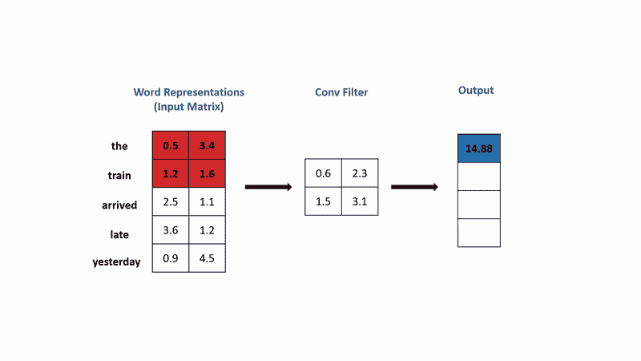

如上所述，1D 卷积滤波器查看时间维度上的幻灯片，并同时查看多个单词来提取特征。直观上，这可以被认为是 n-grams 表示——其中“n”只不过是内核的长度。当过滤器大小为 2 时，它将类似于二元语法，因为我们将一次考虑两个单词。

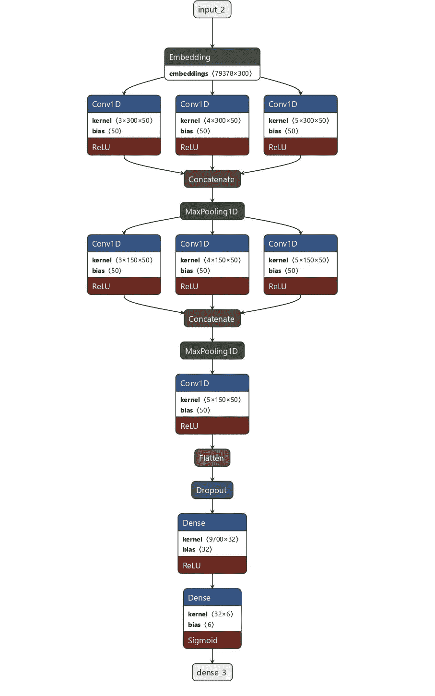

CNN Architecture

上图高度概括了我们基于 CNN 的 Conv1D 层架构。我们使用具有多个内核大小(3，4，5)的卷积滤波器，并连接输出。本质上，我们从嵌入的文本序列中提取基于 3-grams、4-grams 和 5-grams 的特征。我们在最后一层使用了六个单元的 sigmoid 激活函数。因此，我们的模型的最终输出将是一个 6 维向量，其中每个元素对应于类别概率。这里需要注意的一个重要细节是，这六个概率值是相互独立的，并且总和不会是 1。我们需要这些独立的概率值，因为我们正在解决一个多标签分类问题。

**双向 LSTM**

LSTM 是一种递归神经网络，广泛用于基于 NLP 的分类任务。LSTMs 更适合于顺序数据的原因是因为它们能够保持长期的依赖性。我们不能用传统的 RNN 架构训练深度网络，因为它不能保留来自早期时间戳的信息。我们将试验的第二种型号是双向 LSTM。双向模型允许信息在体系结构中双向流动:向前和向后。我们将使用双向架构而不是单向流，因为当我们有较长的注释时，它们会表现得更好，而且毒性通常出现在注释的早期句子中。

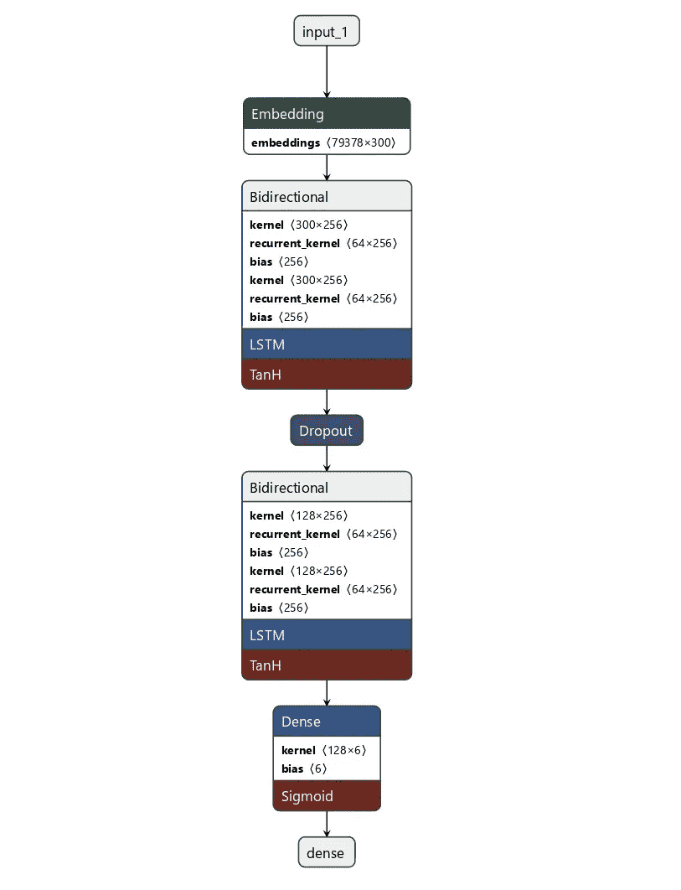

LSTM Architecture

如上图所示，我们将使用两层背靠背的双向 LSTM。对于我们的第一个 LSTM 层，我们将确保它返回每个时间戳的隐藏状态。然后，这些隐藏状态将被传递到下一个 LSTM 层，该层将在最后的时间戳返回隐藏状态。

**双向 GRU**

gru 也是递归神经网络的一种形式，并且在概念上类似于 LSTMs。GRUs 和 LSTMs 之间的主要区别在于，它们的架构不太复杂，因此训练速度更快，并且更适合于较小的数据集。这里，我们将再次使用双向 GRU。

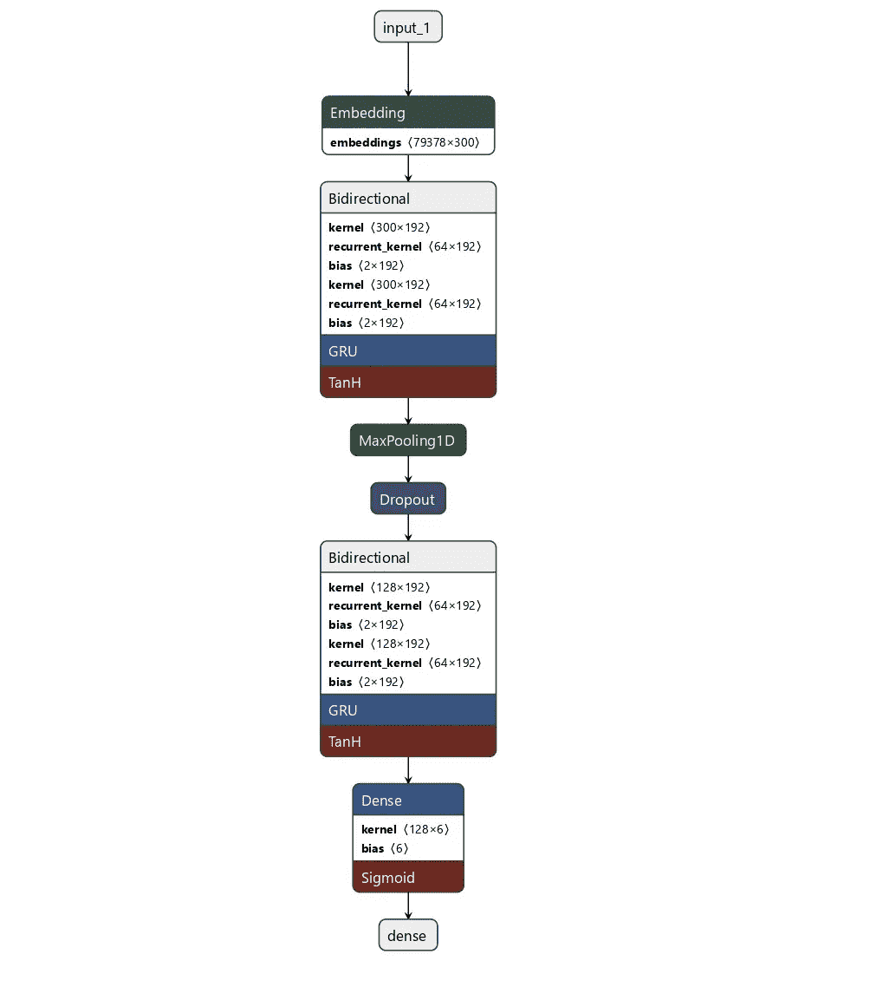

GRU Architecture

从上图可以看出，GRU 的建筑与之前解释的 LSTM 建筑非常相似。一个不同之处是，我们在两个 GRU 层之间加入了一个额外的 MaxPooling1D 层。MaxPooling 图层通过基于池大小在空间窗口内取最大值来帮助减小要素大小。

**预测集合**

除了训练和评估之前讨论的单个模型，我们还将通过使用基于简单平均技术的集合预测来测试性能。对于测试集中的每个观察值，我们将使用之前训练的所有单个模型来预测类别概率。然后，我们将对这些预测的概率取一个简单的平均值，以得到集合预测。下面提供了相同的视觉表示。

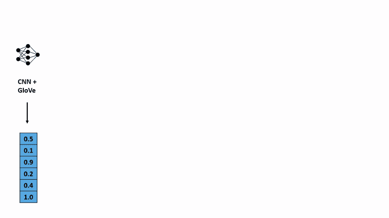

集合预测有助于结合我们所有基本模型的优点，并限制单个模型的缺点。

# 结果

一旦我们训练了我们的模型，我们将在测试集上评估它们。下表总结了之前讨论的所有模型的结果。

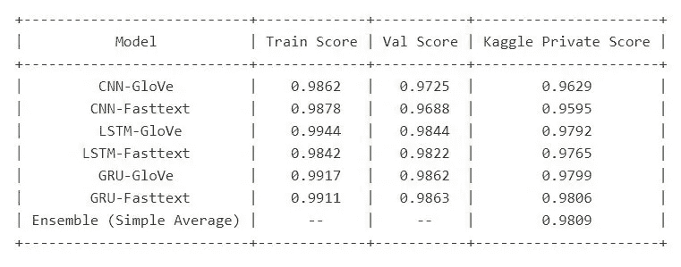

就单个模型而言，具有 FastText 嵌入的 GRU 架构为我们提供了在未知数据集上的最佳性能。总的来说，集合模型的性能最好。

# 部署

既然我们已经确定了性能最佳的模型，我们将继续部署该模型，以复制真实的生产环境。我们将使用 python 的 StreamLit 库进行部署。我们的应用程序的基本功能是接收一个评论文本作为输入，应用所需的处理函数，然后使用最佳模型来预测类概率。

让我们看几个例子，看看这个部署的模型是什么样子的。

```
#Example 1text = "There's no need to apologize. A Wikipedia article is made for reconciling knowledge about a subject from different sources, and you've done history studies and not archaeology studies, I guess. I could scan the page, e-mail it to you, and then you could ask someone to translate the page."class_labels = {toxic:         0,
                severe_toxic:  0, 
                obscene:       0, 
                threat:        0, 
                insult:        0,
                identity_hate: 0}
```

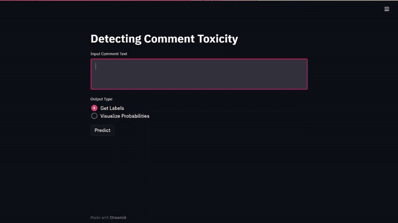

```
#Example 2text = "you gay motherfucker i know where you live,i am going to sand your face off,then i am to going to beat you to a pulp,you chicken shagger."class_labels = {toxic:         1,
                severe_toxic:  1, 
                obscene:       1, 
                threat:        0, 
                insult:        1,
                identity_hate: 1}
```

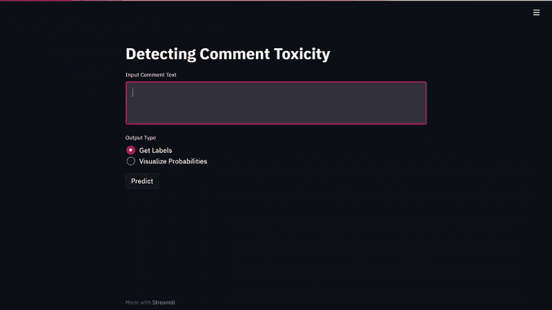

此外，如果用户决定这样做，我们可以选择输出类别概率。下面我们来看一个同样的例子。

```
#Example 3text = "You can't fucking block me for 3 months for fucking personal attacks or harassment! You fucking stupid hellhole, you better motherfucking let me vandalize Wikipedia again FRICKEN NOW!"class_labels = {toxic:         1,
                severe_toxic:  0, 
                obscene:       1, 
                threat:        0, 
                insult:        1,
                identity_hate: 0}
```

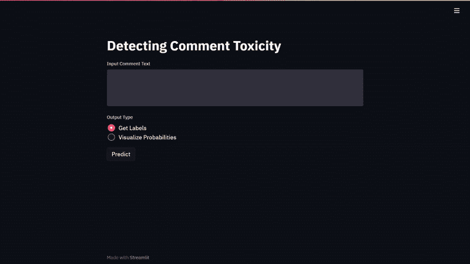

# 进一步的改进


Photo by [Alex Plesovskich](https://unsplash.com/@aples?utm_source=unsplash&utm_medium=referral&utm_content=creditCopyText) on [Unsplash](https://unsplash.com/s/photos/further?utm_source=unsplash&utm_medium=referral&utm_content=creditCopyText)

我们可以通过尝试以下额外的想法来进一步改进性能指标:

*   除了使用原始文本数据的特征表示，我们还可以使用附加的元特征，比如注释文本的长度、单词的大小写等等。
*   增加我们的训练数据的大小，并通过增加我们的文本数据来避免过度拟合。这可以通过把评论翻译成另一种语言再翻译回英文来实现。最终翻译的英语输出将与原始评论略有不同，这有助于我们实现文本扩充的目标。
*   目前，我们没有使用交叉验证策略来调整我们的神经网络架构的参数。我们也许可以通过优化超参数来提高性能，比如批量大小、学习速率。

# 参考

1.  [*https://www.appliedaicourse.com/*](https://www.appliedaicourse.com/)
2.  *[https://www . ka ggle . com/c/jigsaw-toxic-comment-class ification-challenge/](https://www.kaggle.com/c/jigsaw-toxic-comment-classification-challenge/overview)*
3.  *[https://conversationai.github.io/](https://conversationai.github.io/)*
4.  *[https://www.cs.cmu.edu/~biglou/resources/bad-words.txt](https://www.cs.cmu.edu/~biglou/resources/bad-words.txt)*
5.  *https://nlp.stanford.edu/projects/glove/*
6.  *【https://fasttext.cc/docs/en/english-vectors.html *
7.  *[https://machinelearningmastery.com](https://machinelearningmastery.com)*
8.  *[https://streamlit.io/](https://streamlit.io/)*

**这个项目的 jupyter 笔记本和部署脚本可以在这个*[***GitHub Repo***](https://github.com/mohammed-zoher/ToxicComment_Classification)*上找到。**

*[](https://www.linkedin.com/in/mohammedzoher/) [## Mohammed z .-Rubik on 实验室的初级数据科学家| LinkedIn

### 拥有 2 年以上专业经验的数据科学家，擅长从数据中创造商业价值…

www.linkedin.com](https://www.linkedin.com/in/mohammedzoher/)*