# Trafalgar，打破投资组合分析游戏的 python 库

> 原文：<https://medium.com/mlearning-ai/trafalgar-the-python-library-that-breaks-the-game-of-quantitative-and-portfolio-analysis-ff5b41a6cfda?source=collection_archive---------0----------------------->

嘿，这篇文章是对 Trafalgar 新增功能的更新。下面是我发表的第一篇文章:[https://it next . io/trafalgar-a-python-library-to-make-quantitative-finance-and-portfolio-analysis-fast-and-easy-24 B2 c0cb 29d 4](https://itnext.io/trafalgar-a-python-library-to-make-quantitative-finance-and-portfolio-analysis-faster-and-easier-24b2c0cb29d4)

我将重新解释一些事情，我纠正了一些错误，并增加了新功能。

希望你会喜欢！

# 特拉法尔加是什么？


Trafalgar 是一个 python 库，使投资组合分析的开发更快更容易。

我采取这一举措是因为作为一个对编码和财务感兴趣的人，我发现手工操作财务分析工具既困难又耗时。即使我们必须编码，也要花很多时间，而且经常是重复的。

这个库的目标是用几行代码使分析股票和投资组合变得更简单、更快速、更容易，而不是花几个小时去学习这些工具背后的数学概念，并寻求堆栈溢出方面的帮助。

目前，Trafalgar 主要专注于投资组合和股票分析。但我打算一点一点地整合量化金融工具。

这个库最大的优点之一是你不必担心获取数据集和所有的东西。只需键入您想要的股票名称，该库将从 yahoo finance 获取财务数据，并基于这些数据做出您想要的分析。

你可以在这里找到我在这个图书馆的全部作品:【https://github.com/ssantoshp/trafalgar 

# 装置🔥

要安装 Trafalgar，您应该:

```
pip install trafalgar.py
```

(【https://pypi.org/project/trafalgar.py/】T4)

对于 Anaconda 安装，您可以简单地运行下面的命令来安装所有 env 名为 Trafalgar 的依赖项。

```
conda env create --file environment.yaml
```

# 功能包括📈

*   在一行代码中获得收盘价、开盘价、调整收盘价、成交量和这些的图表！
*   用 3 行代码构建一个高效的前沿程序
*   对股票/投资组合进行定量分析(阿尔法、贝塔、偏斜、峰度、滚动波动……)
*   建立投资组合的资本资产定价模型
*   回溯测试投资组合，查看其统计数据，并将其与基准进行比较
*   许多其他事情…

下面是来自一个 google collab 的代码，你可以用它来跟随代码:[https://colab . research . Google . com/drive/13i 049 m2 kihk 3 wdklozxrhqf 1 jw 93 keb？usp =分享](https://colab.research.google.com/drive/13i049m2kIHK3WdklOZXrhqF1jw93kEBb?usp=sharing)

# 信用✌️

如果没有 Github，这个库就不会存在，并且:

*   投稿人@rslopes、@rakeshbhat9、@Haizzz 和@george-adams1
*   Quantopian 和他们不可思议的讲座([https://gist . github . com/ih 2502 MK/50 D8 f 7 feb 614 c 8676383431 b 056 f 4291](https://gist.github.com/ih2502mk/50d8f7feb614c8676383431b056f4291))
*   codingfinance.com 的作者
*   量子连接
*   @mrmushfiq 和他的回购【https://github.com/mrmushfiq/python_meets_finance T2

# 证明文件🚀

# 给图书馆打电话

首先，你应该做:

```
from trafalgar import*
```

# 股票收盘价的图表

```
#graph_close(stock, start_date, end_date)
graph_close(["FB"], "2020-01-01", "2021-01-01")
```


# 多只股票的收盘价图表

```
graph_close(["FB", "AAPL", "TSLA"], "2020-01-01", "2021-01-01")
```

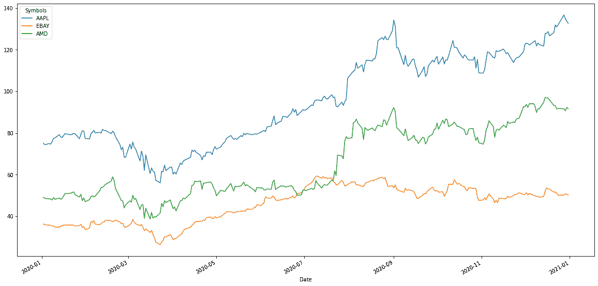

# 绘制体积图

```
#graph_volume(stock, start_date, end_date)#for one stock
graph_volume(["FB"], "2020-01-01", "2021-01-01")#for multiple stocks
graph_volume(["FB", "AAPL", "TSLA"], "2020-01-01", "2021-01-01")
```

# 绘制开盘价图表

```
#graph_open(stock, start_date, end_date)#for one stock
graph_open(["FB"], "2020-01-01", "2021-01-01")#for multiple stocks
graph_open(["FB", "AAPL", "TSLA"], "2020-01-01", "2021-01-01")
```

# 用图表表示调整后的收盘价

```
#graph_adj_close(stock, start_date, end_date)#for one stock
graph_adj_close(["FB"], "2020-01-01", "2021-01-01")#for multiple stocks
graph_adj_close(["FB", "AAPL", "TSLA"], "2020-01-01", "2021-01-01")
```

# 获取收盘价数据(数据帧格式)

```
#close(stock, start_date, end_date)
close(["AAPL"], "2020-01-01", "2021-01-01")
```

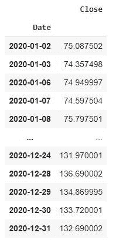

# 获取体积数据(数据帧格式)

```
#volume(stock, start_date, end_date)
volume(["AAPL"], "2020-01-01", "2021-01-01")
```

# 获取开盘价数据(数据帧格式)

```
#open(stock, start_date, end_date)
open(["AAPL"], "2020-01-01", "2021-01-01")
```

# 获取调整后的收盘价数据(数据框架格式)

```
#adj_close(stock, start_date, end_date)
adj_close(["AAPL"], "2020-01-01", "2021-01-01")
```

# 股票间的协方差

```
#covariance(stocks, start_date, end_date, days) -> usually, days = 252
covariance(["AAPL", "DIS", "AMD"], "2020-01-01", "2021-01-01", 252)
```

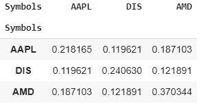

# 股票之间的相关性

```
#correlation(stocks, start_date, end_date)
correlation(["AAPL", "AMD", "TSLA", "AMZN", "DIS", "SBUX", "NFLX", "AMZN", "GOOG"], "2020-01-01", "2021-01-01")
```


# 股票之间的图形相关性

```
#graph_correlation(stocks, start_date, end_date)
graph_correlation(["AAPL", "AMD", "TSLA", "AMZN", "DIS", "SBUX", "NFLX", "AMZN", "GOOG"], "2020-01-01", "2021-01-01")
```

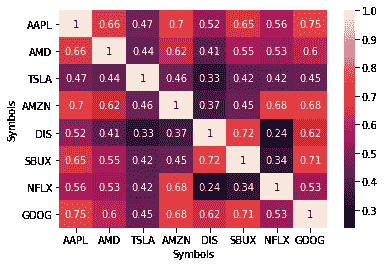

# 直接从 OHLCV 格式的库存中获取数据

```
#ohlcv(stock, start_date, end_date)
ohlcv("AAPL", "2020-01-01", "2021-01-01")
```

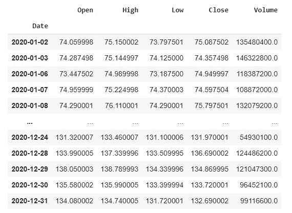

# 绘制回报图(每天)

```
#graph_returns(stock,wts, start_date, end_date)#for one stock
graph_returns(["AAPL"],1, "2020-01-01", "2021-01-01")
```

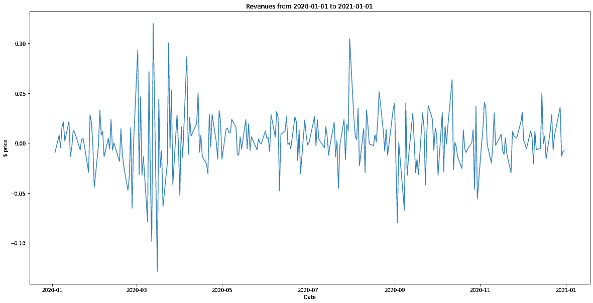

```
#for a portfolio
graph_returns(["AAPL", "AMD", "TSLA"], [0.25, 0.45, 0.3], "2020-01-01", "2021-01-01")
```

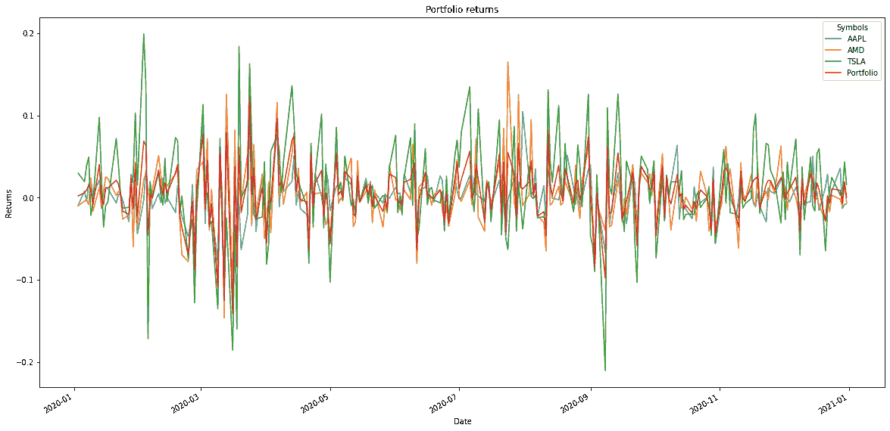

# 获取股票/投资组合的回报数据(数据帧格式)

```
#returns(stocks,wts, start_date, end_date)
# sum of wts(weights) should always be equal to 1, it represents the allocation of shares in your portfolio (1 = 100%)#for one stock
returns(["AAPL"],1, "2020-01-01", "2021-01-01")
```

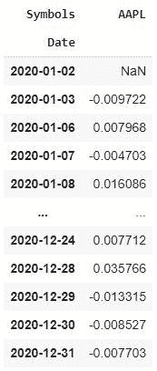

```
#for a portfolio
returns(["AAPL", "AMD", "TSLA"], [0.25, 0.45, 0.3], "2020-01-01", "2021-01-01")
```

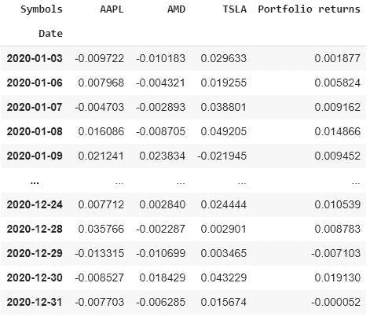

# 用图表表示股票/投资组合的累积回报

```
#graph_creturns(stock, wts, start_date, end_date)#for one stock
graph_creturns(["TSLA"], 1, "2020-01-01", "2021-01-01")
```

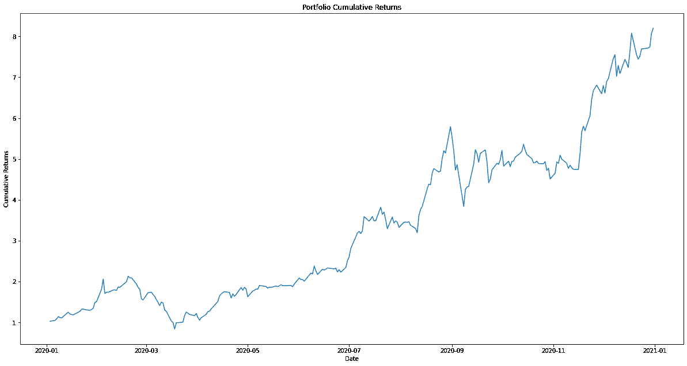

```
#for a portfolio
graph_creturns(["AAPL", "AMD", "TSLA"], [0.25, 0.45, 0.3], "2020-01-01", "2021-01-01")
```

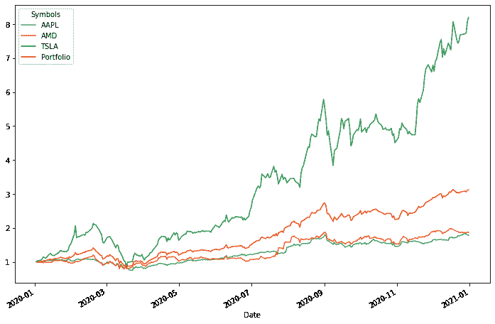

# 获取股票/投资组合的累积回报数据(数据框架格式)

```
#creturns(stock, wts, start_date, end_date)#for one stock
creturns(["TSLA"], 1, "2020-01-01", "2021-01-01")
```


```
#for a portfolio
creturns(["AAPL", "AMD", "TSLA"], [0.25, 0.45, 0.3], "2020-01-01", "2021-01-01")
```

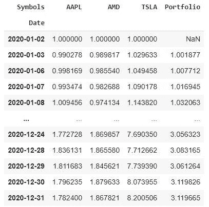

# 投资组合/股票的年度波动性

```
#annual_volatility(stocks, wts, start_date, end_date)#for one stock
annual_volatility(["TSLA"], 1, "2020-01-01", "2021-01-01")
#for multiple stocks
annual_volatility(["AAPL", "AMD", "TSLA"], [0.25, 0.45, 0.3], "2020-01-01", "2021-01-01")
```

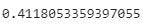

# 投资组合/股票的夏普比率

```
#sharpe_ratio(stocks, wts, start_date, end_date)#for one stock
sharpe_ratio(["TSLA"], 1, "2020-01-01", "2021-01-01")
#for multiple stocks
sharpe_ratio(["AAPL", "AMD", "TSLA"], [0.25, 0.45, 0.3], "2020-01-01", "2021-01-01")
```

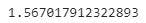

# 用图表表示投资组合/股票相对于基准的回报

```
#graph_rbenchmark(stocks, wts, benchmark, start_date, end_date)
#for a stock
graph_rbenchmark(["TSLA"], 1, "SPY", "2020-01-01", "2021-01-01")
```

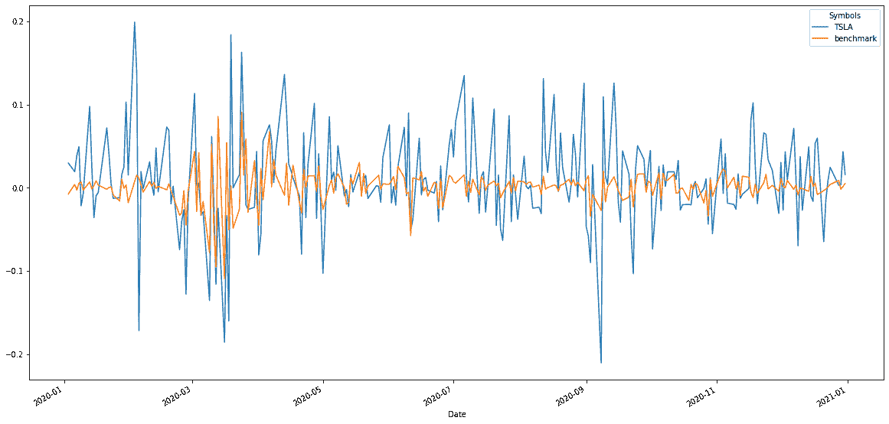

```
#for a portfolio
graph_rbenchmark(["AAPL", "AMD", "TSLA"], [0.25, 0.45, 0.3], "SPY",  "2020-01-01", "2021-01-01")
```

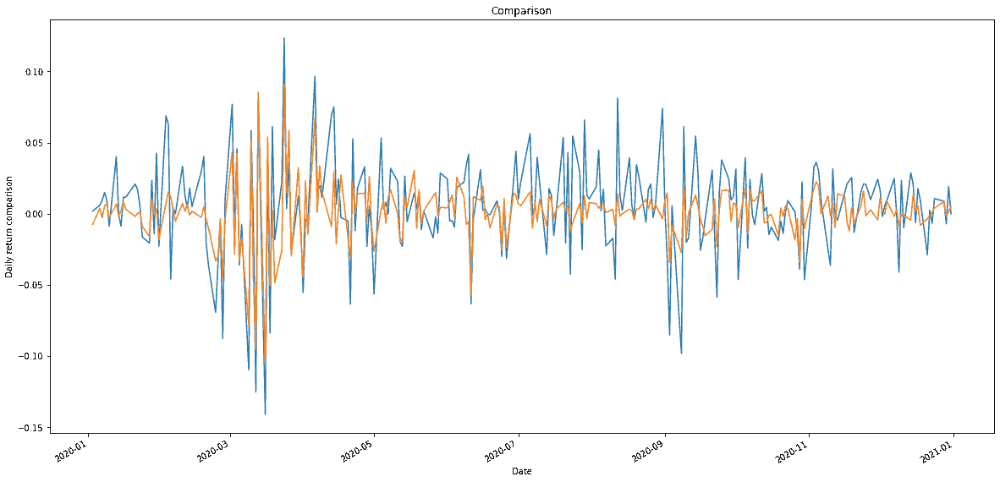

# 获得投资组合/股票相对于基准的收益数据

```
#rbenchmark(stocks, wts, benchmark, start_date, end_date)#for one stock
rbenchmark(["TSLA"], 1, "SPY", "2020-01-01", "2021-01-01")
#for a portfolio
rbenchmark(["AAPL", "AMD", "TSLA"], [0.25, 0.45, 0.3], "SPY",  "2020-01-01", "2021-01-01")
```

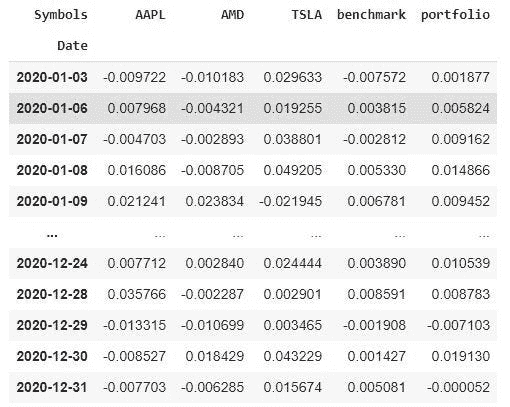

# 将投资组合/股票的累积回报绘制成基准图

```
#graph_cbenchmark(stocks, wts, benchmark, start_date, end_date)#for a stock
graph_cbenchmark(["TSLA"], 1, "SPY", "2020-01-01", "2021-01-01")
```

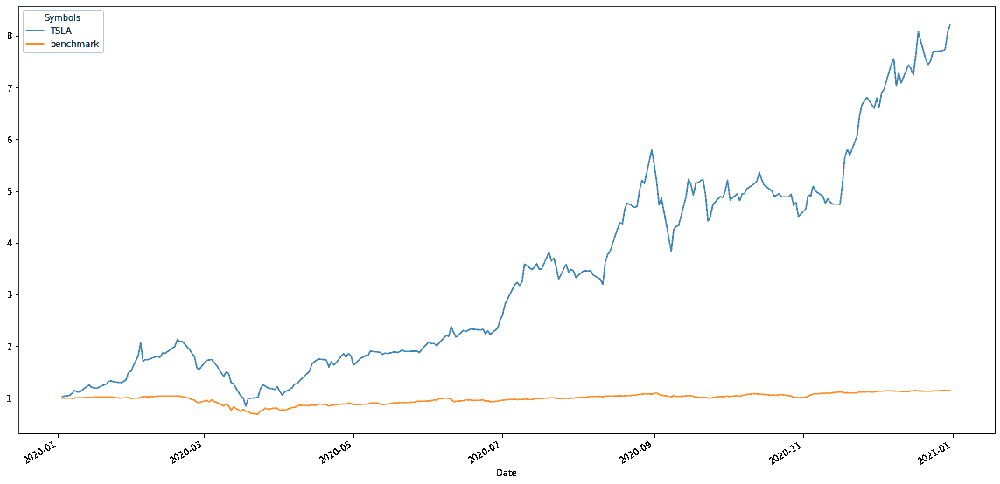

```
#for a portfolio
graph_cbenchmark(["AAPL", "AMD", "TSLA"], [0.25, 0.45, 0.3], "SPY",  "2020-01-01", "2021-01-01")
```

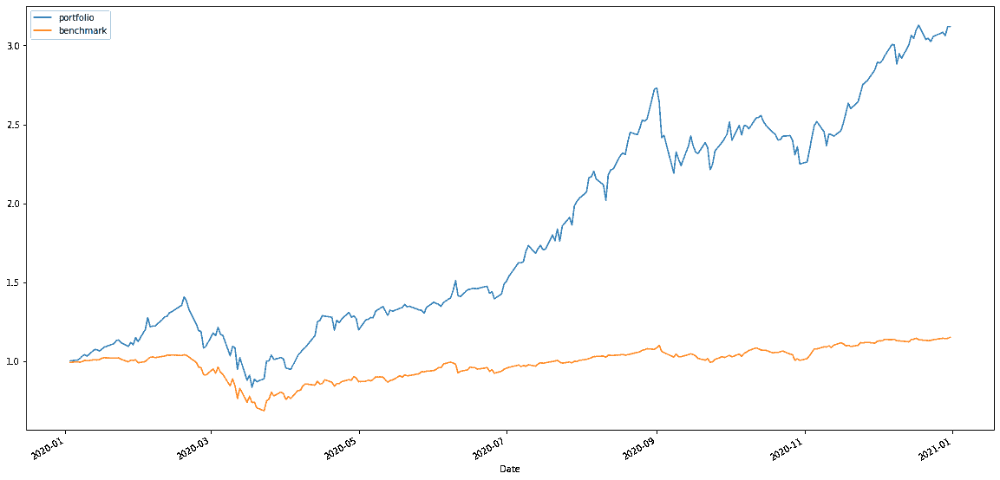

# 获得投资组合/股票相对于基准的累积收益数据

```
#cbenchmark(stocks, wts, benchmark, start_date, end_date)#for a stock
cbenchmark(["TSLA"], 1, "SPY", "2020-01-01", "2021-01-01")
#for a portfolio
cbenchmark(["AAPL", "AMD", "TSLA"], [0.25, 0.45, 0.3], "SPY",  "2020-01-01", "2021-01-01")
```

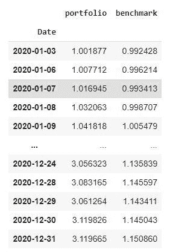

# 投资组合/股票的阿尔法值

```
#alpha(stocks, wts, benchmark, start_date, end_date)#for a stock
alpha(["TSLA"], 1, "SPY", "2020-01-01", "2021-01-01")#for a portfolio
alpha(["AAPL", "AMD", "TSLA"], [0.25, 0.45, 0.3], "SPY",  "2020-01-01", "2021-01-01")
```

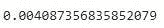

# 投资组合/股票的贝塔系数

```
#beta(stocks, wts, benchmark, start_date, end_date)#for one stock
beta(["TSLA"], 1, "SPY", "2020-01-01", "2021-01-01")
#for multiple stocks
beta(["AAPL", "AMD", "TSLA"], [0.25, 0.45, 0.3], "SPY",  "2020-01-01", "2021-01-01")
```

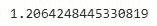

# 优化投资组合中股票配置的有效边界

```
#efficient_frontier(stocks, start_date, end_date, iterations) -> iterations = 10000 is a good starting pointefficient_frontier(["AAPL", "FB", "MSFT", "AMD", "AIR", "AAL", "NFLX", "SBUX", "GOOG", "BABA"], "2020-01-01", "2021-01-01", 10000)
```

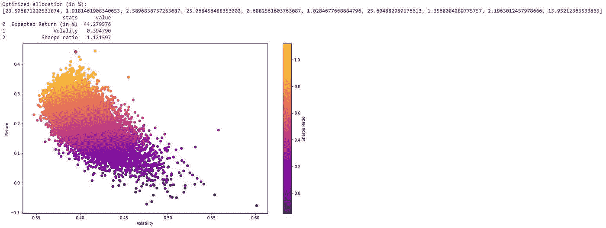

# 获得股票/投资组合的日平均回报率

```
#mean_daily_return(stocks,wts, start_date, end_date)#for one stock
mean_daily_return(["AAPL"], 1, "2020-01-01", "2021-01-01")#for multiple stocks
mean_daily_return(["AAPL", "AMD", "TSLA"], [0.25, 0.45, 0.3], "2020-01-01", "2021-01-01")
```

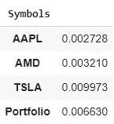

# 股票/投资组合的风险价值

```
#var(value_invested, stocks, wts, alpha, start_date, end_date)#for one stock
var(10000, ['AAPL'], 1, 0.95, "2020-01-01", "2021-01-01")#for multiple stocks
var(10000, ['AAPL', 'TSLA', 'AMD'], [0.4, 0.2, 0.4], 0.95, "2020-01-01", "2021-01-01")
```


# 用卡尔曼滤波器平滑绘制股票收盘价

这有助于消除潜在噪声，并更好地了解趋势。

例如，它可以通过机器学习来进行更好的预测。

```
#graph_kalman(stocks, start_date, end_date, noise_value)
#noise_value = 0.01 is good to get started
graph_kalman("AAPL", "2020-01-01", "2021-01-01", 0.01)
```

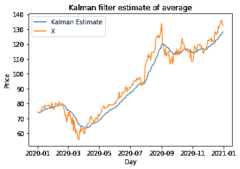

# 用卡尔曼滤波器得到股票的平滑收盘价

```
#kalman(stocks, start_date, end_date, noise_value)
kalman("AAPL", "2020-01-01", "2021-01-01", 0.01)
```

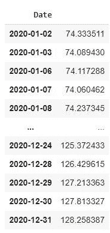

# 获得资本资产定价模型

```
#capm(stocks, wts, start_date, end_date)
stocks = ["AAPL", "AMD", "TSLA", "MSFT"]
wts = [0.3, 0.2, 0.2, 0.3]
capm(stocks, wts, "2020-01-01", "2021-01-01")
```

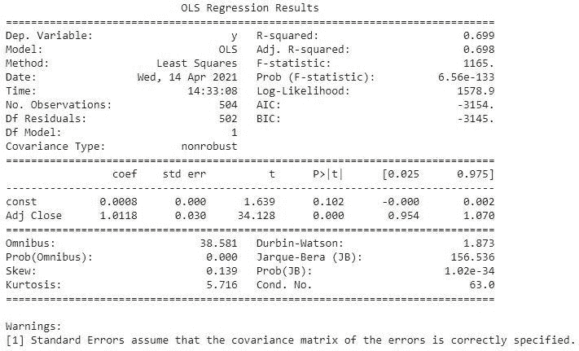

# 共整合现象

```
#cointegration(stock1, stock2, start_date, end_date)
cointegration("GOOG", "MSFT", "2012-01-01", "2021-01-01")
```

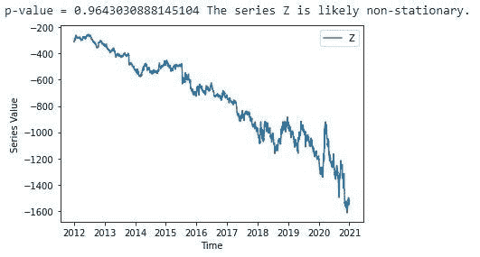

# 返回协整

```
#return_cointegration(stock1, stock2, start_date, end_date)
return_cointegration("GOOG", "MSFT", "2012-01-01", "2021-01-01")
```

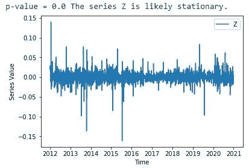

# 平稳性

```
#stationarity(stock, start_date, end_date)
stationarity("GOOG", "2020-01-01", "2021-01-01")
```

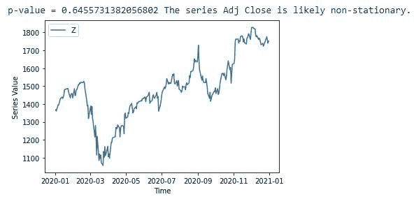

# 返回平稳性

```
#return_stationarity(stock, start_date, end_date)
return_stationarity("GOOG", "2020-01-01", "2021-01-01")
```

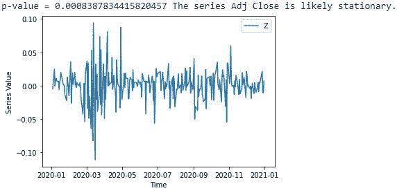

# 图表滚动波动性

```
#graph_rvolatility(stock, wts, start_date, end_date, window_time)
#for a stock
graph_rvolatility(["TSLA"], 1, "2019-01-01", "2021-01-01", 180)#for a portfolio
graph_rvolatility(["AAPL", "AMD", "TSLA"], [0.45, 0.45, 0.1], "2019-01-01", "2021-01-01", 180)
```

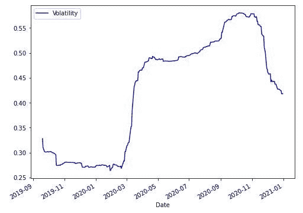

# 获取滚动波动数据

```
#rvolatility(stock, wts, start_date, end_date, window_time)
#for a stock
rvolatility(["TSLA"], 1, "2019-01-01", "2021-01-01", 180)#for a portfolio
rvolatility(["AAPL", "AMD", "TSLA"], [0.45, 0.45, 0.1], "2019-01-01", "2021-01-01", 180)
```

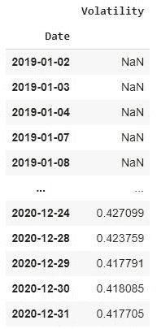

# 图形滚动测试

```
#graph_rbeta(stock,wts, benchmark, start_date, end_date, window_time)#for a stock
graph_rbeta(["TSLA"], 1, "SPY", "2019-01-01", "2021-01-01", 180)#for a portfolio
graph_rbeta(["AAPL", "AMD", "GOOG"], [0.45, 0.45, 0.1], "SPY", "2019-01-01", "2021-01-01", 180)
```

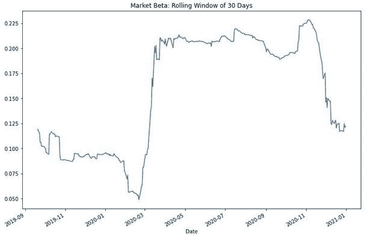

# 获取滚动测试数据

```
#rbeta(stock,wts, benchmark, start_date, end_date, window_time)#for a stock
rbeta(["TSLA"], 1, "SPY", "2019-01-01", "2021-01-01", 180)#for a portfolio
rbeta(["AAPL", "AMD", "GOOG"], [0.45, 0.45, 0.1], "SPY", "2019-01-01", "2021-01-01", 180)
```

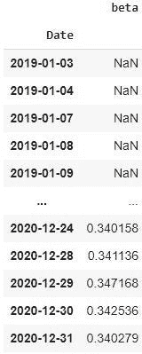

# 图形滚动 alpha

```
#graph_ralpha(stock,wts, benchmark, start_date, end_date, window_time)#for a stock
graph_ralpha(["TSLA"], 1, "SPY", "2019-01-01", "2021-01-01", 180)#for a portfolio
graph_ralpha(["AAPL", "AMD", "GOOG"], [0.45, 0.45, 0.1], "SPY", "2019-01-01", "2021-01-01", 180)
```

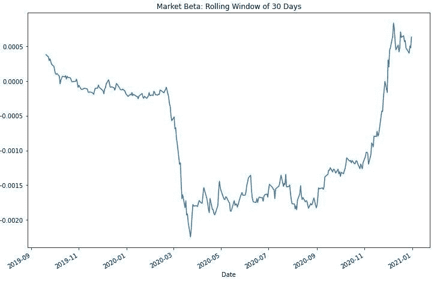

# 获取滚动 alpha 数据

```
#ralpha(stock,wts, benchmark, start_date, end_date, window_time)#for a stock
ralpha(["TSLA"], 1, "SPY", "2019-01-01", "2021-01-01", 180)#for a portfolio
ralpha(["AAPL", "AMD", "GOOG"], [0.45, 0.45, 0.1], "SPY", "2019-01-01", "2021-01-01", 180)
```

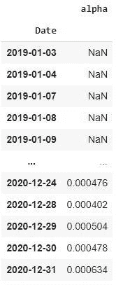

# 获得隐含波动率

```
#implied_vol(option_type, option_price, stock price, strike price, risk-free rate, the time to expiration, continuous dividend rate)
#option type : "c" (call option) or "p"(put option)implied_vol('c', 0.3, 3, 3, 0.032, 30.0/365, 0.01)
```

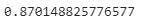

# 回溯测试你的投资组合

```
#backtest(stocks, wts, benchmark, start_date, end_date)
stocks = ["GOOG", "AMZN", "FB", "AAPL"]
wts = [0.25, 0.25, 0.25, 0.25]
backtest(stocks, wts, "SPY", "2019-01-01", "2021-01-01")
```

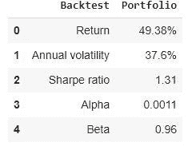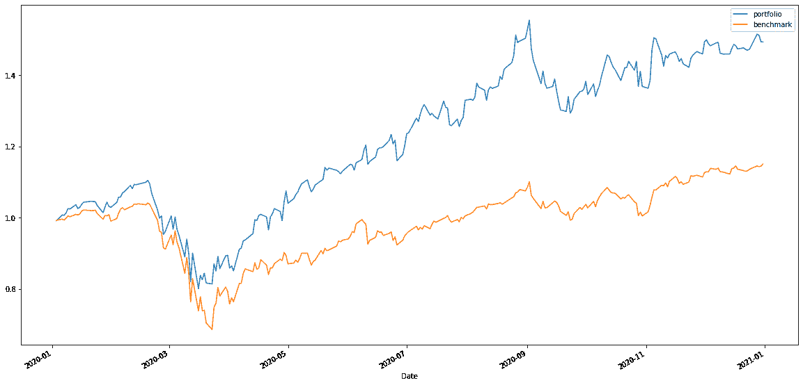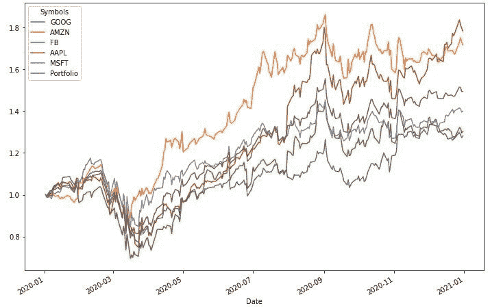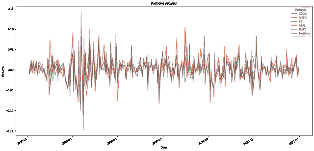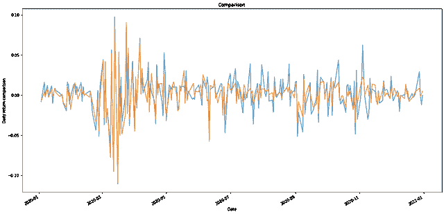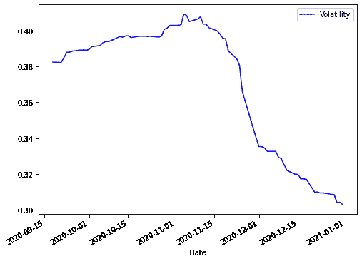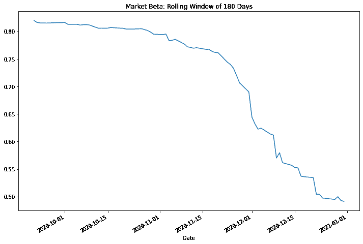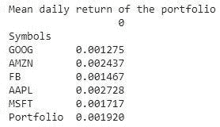

# 结论

感谢阅读；)

请告诉我你是否有建议、意见、想法或问题。

我期待着改善这个图书馆！

我要补充的是:

*   预测趋势的 ML 模型(ARIMA，GARCH，Prophet…)
*   对自己的数据进行分析的可能性
*   算法交易的回溯测试

祝你愉快，

# 接触

如果你想和我谈谈，给个建议/意见，或者其他什么，你可以在这里联系我:

电子邮件:santoshpassoubady@gmail.com

不和:**桑托什#9328**

[](/mlearning-ai/mlearning-ai-submission-suggestions-b51e2b130bfb) [## Mlearning.ai 提交建议

### 如何成为 Mlearning.ai 上的作家

medium.com](/mlearning-ai/mlearning-ai-submission-suggestions-b51e2b130bfb)