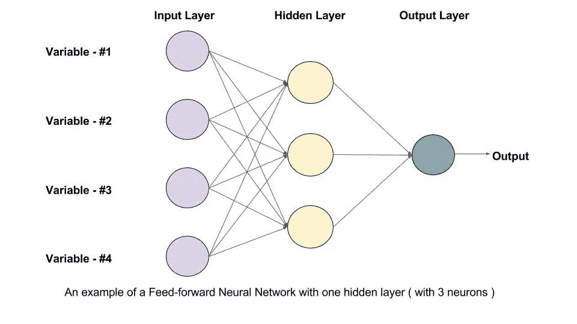

# 在 GPU 上训练前馈神经网络(FFNN)——初学者指南

> 原文：<https://medium.com/mlearning-ai/training-feed-forward-neural-network-ffnn-on-gpu-beginners-guide-2d04254deca9?source=collection_archive---------2----------------------->

## 数据集— CIFAR 10

如果你想从 **FFNN** (前馈神经网络)开始，但不太确定从哪个数据集开始，那么你就在正确的地方。我们看到经典机器学习中的神经网络实现到深度神经网络。今天，**神经网络**被**用于**解决许多商业问题，例如销售预测、客户研究、数据验证和风险管理，让我们从问几个基本问题开始——

1.  **什么是 FFNN？** **前馈神经网络**是人工**神经网络**，其中节点之间的连接不形成循环。因此，它不同于它的后代:递归**神经网络**。**前馈神经网络**是设计的第一种也是最简单的人工神经网络**类型。**
2.  **GPU 的**有哪些？
    GPU(图形处理单元)是一种具有专用内存的专用处理器，通常执行渲染图形所需的浮点操作。换句话说，它是一个用于大量图形和数学计算的单芯片处理器，可以为其他任务释放 CPU 周期。GPU 的内核更多，比 CPU 快得多。

# 关于数据集

CIFAR-10 数据集(加拿大高级研究所)是一个图像集合，通常用于训练机器学习和计算机视觉算法。这是机器学习研究中使用最广泛的数据集之一。CIFAR-10 数据集包含 10 个不同类别的 60，000 幅 32x32 彩色图像。这 10 个不同的类别代表飞机、汽车、鸟、猫、鹿、狗、青蛙、马、船和卡车。每个类有 6000 张图片。

# 目录

1.  [简介](#7ca7)
2.  [数据预处理](#219e)
    2.1 [加载所需库](#6cd0)
    2.2 [获取数据](#1ec2)
3.  [探索 CIFAR 数据集](#58a0)
    3.1 [训练和测试数据集包含多少幅图像？](#e290)T5 3.2[数据集包含多少个输出类？](#c34a)
    3.3 [来自数据集的图像张量是什么形状？](#83e0)
    3.4 [你能确定属于每一类的图像数量吗？](#3ec7)
4.  [准备用于训练的数据](#2ff5)
    4.1 [拆分成训练和验证集](#b6ce)
    4.2 [可视化批处理](#9958)
    4.3 [配置模型](#0134)
    4.4 [将模型移动到 GPU](#e235)
5.  [训练模型](#a05d)
6.  [使用单个图像进行测试](#af18)
7.  [总结](#30de)
8.  [未来工作](#a0c3)
9.  [参考文献](#7d9a)

# №1:简介

CIFAR-10 数据集包含 10 个不同类别的 60，000 幅 32x32 彩色图像。CIFAR-10 是一组图像，可用于教 FFNN 如何识别物体。由于 CIFAR-10 中的图像是低分辨率的(32x32)，这个数据集可以让研究人员快速尝试不同的算法，看看什么有效。

CIFAR 10 数据集下的类别列表—

1.  ✈️飞机公司
2.  汽车🚗
3.  鸟🐦
4.  猫😺
5.  鹿🐆
6.  狗🐶
7.  青蛙🐸
8.  马🐴
9.  船🚢
10.  卡车🚚

# №2:数据预处理

## 加载所需的库

因为我们用 PyTorch 来构建神经网络。我一次性导入了所有相关的库。

## 检索数据

该数据集可在 torch 视觉库中获得。或者，您也可以从 [Kaggle](https://www.kaggle.com/c/cifar-10) 访问数据集。

# №3:探索 CIFAR10 数据集

## 问:训练和测试数据集包含多少幅图像？

## 问:数据集包含多少个输出类？

## 问:来自数据集的图像张量的形状是什么？

## 问:您能确定属于每个类别的图像数量吗？

# №4:为培训准备数据

## 分成训练集和验证集

在训练开始之前，将数据分成训练集和测试集是很重要的。

数据集分为 45000 个训练集和 5000 个验证集。

我们现在可以创建数据加载器来批量加载数据。

让我们使用 Torchvision 的 make_grid helper 函数来可视化一批数据。

## 可视化批处理

你能通过观察给所有的图片贴上标签吗？尝试手动标记数据的随机样本是估计问题难度和识别标记中的错误(如果有的话)的好方法。

## 配置模型

我编写了一个精度函数，通过比较预测类和实际类标签来计算模型精度。

我编写了一个包含 4 个函数的 **ImageClassificationBase** 类。实现损失和准确性的训练集和验证集各有一个函数。“validation_epoch_end”结合了每个时期的损失和精度，并且“epoch_end”在每个时期结束时打印“ **val_loss** 和“ **val_acc** ”。

## 将模型移动到 GPU

在本节中，我们将把我们的模型转移到 GPU 上。

让我们首先检查一下 GPU 在您当前的系统中是否可用。如果可用，则将默认设备设置为 GPU，否则将其设置为 CPU。

现在，我将训练、验证和测试集加载到可用的默认设备上

让我们也定义几个辅助函数来绘制损耗和精度。

# №5:训练模型

我们可以尝试几次来训练这个模型。每次，尝试不同的架构和不同的学习速率。以下是一些可以尝试的想法:

*   增加或减少隐藏层的数量
*   增加或减少每个隐藏层的大小
*   尝试不同的激活功能
*   尝试不同次数的训练
*   在每个时期尝试不同的学习率，你能达到的最高验证准确率是多少？你能达到 50%的准确率吗？60%呢？

在没有训练的情况下，val_acc 在 10%左右。这是随机猜测，预测正确类别的可能性是 1/10。

让我们现在开始训练

我通过 matplotlib 绘制捕获的结果

从上面的图片中可以很清楚地看到，即使经过非常长时间的训练，该模型也很可能不会越过 48%的准确率阈值。一个可能的原因是学习率可能太高。模型的参数可以在最低损失的最佳参数集附近“跳动”。我们可以尝试降低学习率，多训练几个纪元，看看有没有帮助。

更有可能的原因是这个模型不够强大。因此，为了提高模型性能，需要一种更好的技术来从输入图像中有效地提取特征。这可以使用卷积神经网络来获得。

在我的下一个笔记本中，我将教授 CNN 是如何实现的，以及如何用来提高模型的性能。

# №6:使用单个图像进行测试

从 Torchvision 库加载测试集

让我们定义一个辅助函数 predict_image，它返回单个图像张量的预测标签。

检查少数样品的标签和预测值

在测试集上模拟性能

# №7:摘要

这里是文章的简要总结和我们在 GPU 上训练 FFNN 的一步一步的过程。

1.  我们简要了解了前馈神经网络。
2.  从火炬视觉图书馆下载了数据集。
3.  我们研究了数据集，并试图理解每个类拥有的全部图像、训练和验证集中的全部图像等。
4.  训练前的数据准备
    i .分成训练集和验证集。
    二。我们可视化了一批数据集。
    三世。我们做了基本的模型配置，如定义精度、评估和拟合函数。我们还定义了 ImageClassificationBase 类。
    四。我们检查了 GPU 的可用性，并将数据集移动到 GPU，如果可用，则将其移动到 CPU。
5.  我们对模型进行了训练，取得了大约 48 %的准确率，并在测试集上运行了相同的模型。
6.  我们通过在几个测试样本上运行来随机检查模型性能

# №8:未来的工作

1.  如果采用 CNN 架构，模型性能可以进一步提高。
2.  尝试实现另一个深度学习框架 Tensorflow。
3.  尝试通过更新层数、更改 FFNN 中的优化器和损失函数来提高模型性能。

# №9:引用

1.  您可以通过此链接访问并执行完整的笔记本—【https://jovian.ai/hargurjeet/cfar-10-dataset-6e9d9 
2.  [https://pytorch.org/](https://pytorch.org/)
3.  [https://py torch . org/docs/stable/generated/torch . nn . crossentropyloss . html](https://pytorch.org/docs/stable/generated/torch.nn.CrossEntropyLoss.html)
4.  [https://jovian . ai/learn/deep-learning-with-py torch-zero-to-gans](https://jovian.ai/learn/deep-learning-with-pytorch-zero-to-gans)

我真的希望你们能从这篇文章中学到一些东西。请随意给一个👏如果你喜欢你所学的。这让我保持动力。

我将在本周内发布另一篇文章，介绍 CNN 是如何实现的，以及如何用来提高 CIFAR 10 模型的性能。

## 感谢阅读这篇文章。快乐学习😃