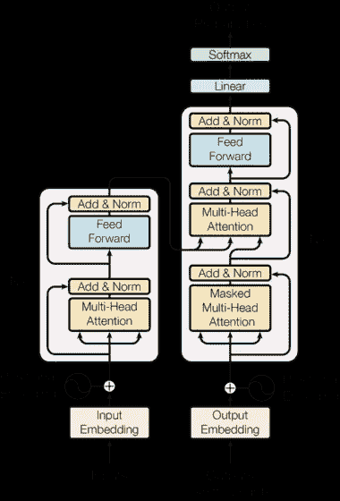

# 变压器管道

> 原文：<https://medium.com/mlearning-ai/transformers-pipeline-7313c6c19e80?source=collection_archive---------0----------------------->


Photo by [Arseny Togulev](https://unsplash.com/@tetrakiss?utm_source=medium&utm_medium=referral) on [Unsplash](https://unsplash.com?utm_source=medium&utm_medium=referral)

## 自然语言处理

## 🤗*变形金刚，为什么这么他妈的酷？*

答几年前，我开发了一些 NLP 模型。我最近注意到，2018 年之后，NLP 世界的很多事情都发生了积极的变化。变形金刚的快速发展为自然语言处理开创了强大的工具。现在用三行代码就可以做很多事情。如果你想知道这怎么可能，答案就藏在**变形金刚**里。你知道他们无处不在:)

最初的变压器**架构**如下图所示，不像上图:)，左边是编码器右边是解码器**:**



别担心，我不会对这张图做详细花哨的解释。有兴趣的可以从 [**这个链接进入讲解。**](https://www.kdnuggets.com/2020/10/understanding-transformers-data-science-way.html) 让我们看看它能代替做什么。

[](https://github.com/huggingface/transformers)**[**拥抱脸**](https://huggingface.co/) **变形金刚**提供了数千个**预训练模型**来执行文本任务，例如分类、信息提取、问题回答、摘要、翻译、文本生成，以及 100 多种语言的文本。它的目的是让**前沿的 NLP** 对每个人来说都更容易使用。[**模型中枢**](https://huggingface.co/models) 包含数千个预先训练好的模型，任何人都可以下载使用。还包含了大量 NLP 项目的 [**数据集**](https://github.com/huggingface/datasets) 。**

**在模型中心，许多 NLP 任务都有一个预先训练好的`**pipeline**`准备就绪。例如，如果我们把我们的话付诸行动，我们可以很容易地将正面文本和负面文本进行分类。**

```
**from transformers import pipeline**# Allocate a pipeline for sentiment-analysis
classifier = pipeline('sentiment-analysis')classifier('We are very happy to introduce pipeline to the transformers repository.')[{'label': 'POSITIVE', 'score': 0.9996980428695679}]
```

**首先，导入管道，它会像您在上面的例子中看到的那样关心其余的部分。(这里，第二行代码下载并缓存管道使用的预训练模型，而第三行代码对给定的文本进行评估。)结果是置信度 99.97%的“正”，牛逼！不是吗？**

**您可以轻松使用的一些当前可用的**管道**有:**

1.  ****特征提取**(获得文本的向量表示)**
2.  ****填充蒙版****
3.  ****ner** (命名实体识别)**
4.  ****问答****
5.  ****情感分析****
6.  ****汇总****
7.  ****文本生成****
8.  ****翻译****
9.  ****零炮分类****

**让我们再来看一个例子，我觉得这个例子非常有用，非常省时。**总结:****

```
**from transformers import pipeline**summarizer = pipeline("summarization")summarizer("""
America has changed dramatically during recent years. Not only has the number of graduates in traditional engineering disciplines such as mechanical, civil,electrical, chemical, and aeronautical engineering declined, but in most of the premier American universities engineering curricula now concentrate on and encourage largely the study of engineering science. As a result, there are declining offerings in engineering subjects dealing with infrastructure, the environment, and related issues, and greater concentration on high technology subjects, largely supporting increasingly complex scientific developments. While the latter is important, it should not be at the expense of more traditional engineering. 
Rapidly developing economies such as China and India, as well as other industrial countries in Europe and Asia, continue to encourage and advance the teaching of engineering. Both China and India, respectively, graduate six and eight times as many traditional engineers as does the United States. Other industrial countries at minimum maintain their output, while America suffers an increasingly serious decline in the number of engineering graduates and a lack of well-educated engineers. 
""")
```

**产量也很大；**

```
[{'summary_text': 'America has changed dramatically during recent years . The number of engineering graduates in the U.S. has declined in traditional engineering disciplines such as mechanical, civil, electrical, chemical, and aeronautical engineering . Rapidly developing economies such as China and India, as well as other industrial countries in Europe and Asia, continue to encourage and advance engineering .'}]
```

**正如您所看到的，它就像一个即插即用的代码，您可以很容易地在您的项目中使用。你有很多理由，如果你问，我为什么要用变压器？以下是其中的一些:**

1.  **易于使用的最先进的模型，**
2.  **更低的计算成本，更小的碳排放量，**
3.  **为模型生命周期的每一部分选择正确的框架，**
4.  **根据您的需求轻松定制模型或示例，**

**如果你问，我为什么不该用变形金刚？**

**Huggingface transformers 目前提供免费的民主使用，作为一个支持 API 的开源模型，我最大的担忧是不能保证这种情况会一直存在。我希望他们总是支持开源社区及其发展。**

**你将会发现更多的特性🤗变形金刚。如你所见，有了这些变形金刚，你可以在 10 分钟内创造出 NLP 世界里的伟大作品。我建议你不要浪费时间，使用你自己的变形金刚模型。**

*****来源:*****

**[](https://github.com/huggingface/transformers) [## GitHub-hugging face/变形金刚:🤗变形金刚:最先进的自然语言处理…

### 用于 Jax、PyTorch 和 TensorFlow 的最先进的自然语言处理🤗变形金刚提供了成千上万的…

github.com](https://github.com/huggingface/transformers) [](https://www.kdnuggets.com/2020/10/understanding-transformers-data-science-way.html) [## 理解变压器，数据科学之路

### 如今，变形金刚已经成为任何 NLP 任务的事实标准。不仅如此，他们现在还被…

www.kdnuggets.com](https://www.kdnuggets.com/2020/10/understanding-transformers-data-science-way.html)**