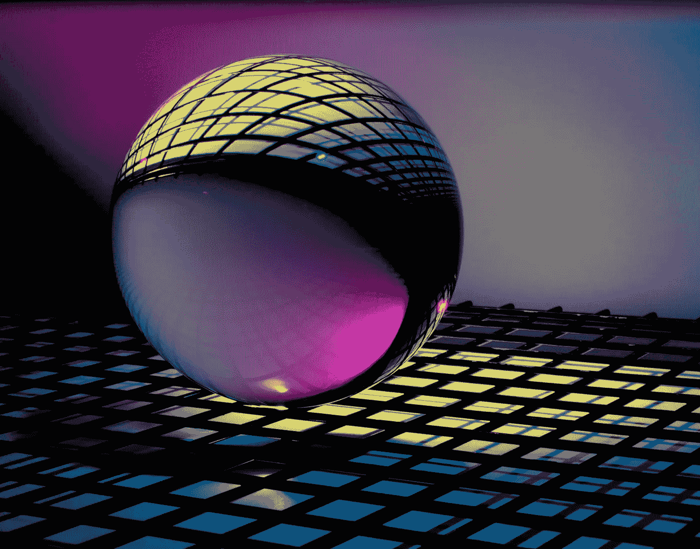

# 使用 lensa AI 应用程序将您的照片变成艺术肖像

> 原文：<https://medium.com/mlearning-ai/turn-your-photos-into-artistic-portraits-with-the-lensa-ai-app-f6a0ca4a7e7b?source=collection_archive---------7----------------------->

## 值得炒作吗？

Photo by [Michael Dziedzic](https://unsplash.com/@lazycreekimages?utm_source=unsplash&utm_medium=referral&utm_content=creditCopyText) on [Unsplash](https://unsplash.com/s/photos/artificial-intelligence?utm_source=unsplash&utm_medium=referral&utm_content=creditCopyText)

Lensa 应用是安卓和苹果上的新应用。本周，你必须在滚动社交媒体的同时创作有创意的图片、插图和个人资料图片。这都是因为 Lensa 应用。这是一个可以让你用各种内置选项编辑图片的工具。您可以在…中更改您的图像