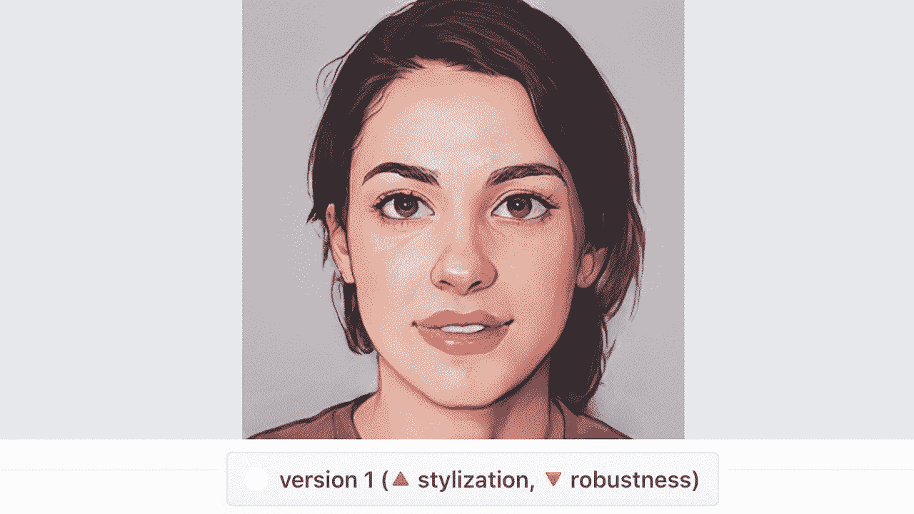

# 用 PyTorch 将您的肖像变成艺术品

> 原文：<https://medium.com/mlearning-ai/turn-your-portrait-into-art-with-pytorch-e6ce9cf0e781?source=collection_archive---------0----------------------->

## [机器学习艺术](https://mlearning.substack.com)

## 甘人脸头像:无代码工作流演示

简而言之，用户可以使用图片来创建看起来像动画场景的快照。AnimeGANv2 方法是一种独一无二的算法，可以将普通的图片和肖像转换为创意动漫图纸。