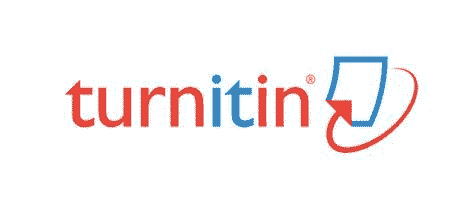

# TURNITIN:制度化的剽窃

> 原文：<https://medium.com/mlearning-ai/turnitin-institutionalized-plagiarism-99779ea71781?source=collection_archive---------0----------------------->

反抄袭软件背后的讽刺

感到无能为力是失去代理权的直接表现。教育环境正变得越来越受限制，随着现代技术的实施，这一过程不断加速。

> [“在我的学术和个人生活中遇到的许多技术接口(许多都不是我自己自主选择的)中，构建一个代理似乎是一场斗争”](https://hybridpedagogy.org/disowning-tech-ensuring-value-agency-moment-interface/)——**蒂姆·阿米登**

阿米顿继续认为*界面*远非价值中立，事实上充满了权力关系。它们含蓄地倾向于排斥，因为它们往往会加大教师和学生之间的距离。有了 TurnitIn 等技术人工制品，权力变得结构化和匿名化。当与一家强大的公司签订有约束力的法律合同仅仅是提交任务的“副作用”时，也许开始询问复杂的问题并为批判性讨论开辟空间是明智的。

让我们不要忘记当面对学术机构的规章制度和提交政策时，我们得到的“选择”。简而言之:大多数时候，别无选择；你要么使用这个软件，要么这门课不及格。对于我们这些不太幸运的人来说，分数意味着学术上的成功，最终意味着就业机会，而就业机会反过来又归结为简单的生活和为自己谋生的能力。

在反抄袭的旗帜下(抄袭确实是一个现实问题，不可掉以轻心)，世界各地的大学现在都实施了一种安全机制，让学生们变得无能为力。就像其他残忍的警察行为一样，它已经取得了很多“成功”。毫无疑问，我们不能说 TurnitIn 在线提交系统的实施没有对抄袭作品的问题产生重大影响。可以肯定的是，总体来看，剽窃已经减少了。也就是说，从统计数据来看，总体而言，智力欺诈和不诚实的案例肯定有所减少。问题是，*谁的代价？*

以牺牲个人利益为代价——这是一个独特的例子。在制度层面，或者我们可以说是政治层面，大学在学生的福祉方面没有既得利益。大学必须确保自己看起来不错。他们得到了好的排名，积极的评论，最肯定的是:减少了(或者理想情况下为零)的剽窃水平。只要*数据*显示剽窃行为总体下降，就可以认为系统运行平稳。因此，如果数字是好的，就可以假定政策是有效的，那么为什么要关注一些*异常值、异常值、错误*或*异常呢？在这一点上，答案是非常清楚的:因为有真实的、活生生的、有呼吸的、脆弱的人落入了你的“误差范围”。*

仔细观察，TurnitIn 是一个完美的例子，它说明了权力如何变得富有成效，不仅训练我们*同意*条款和协议，而且实际上*希望*心甘情愿地提交我们所谓的自由，甚至享受这个过程。它快速、简单、方便等。—通常归因于技术的所有舒适；它应该让我们的生活更轻松，同时保持中立和公正。

在*“学生交卷的时候有没有上交权利？Stephen Sharon 指出了反抄袭软件规范化中根深蒂固的虚伪。更不用说算法的普遍低效，它对假阳性的“检测”以及对真阴性的检测失败，TurnitIn 可能会成为世界上最有效的版权侵权代理。看起来真的是这样，TurnitIt，我们正在处理一个合法的，制度化的大规模剽窃的例子。*

甚至被认为是不言自明的事情；现在已经成为数字时代的争议对象。Sharon 写道，授予作者控制复制和发行的专有权听起来很简单，但是在数字时代，没有什么事情像听起来那么简单。看起来 TurnitIn 不仅允许对学生的知识产权进行监管和无限分配，而且事实上，它还积极鼓励这种行为。这是假阳性的主要问题，它允许机构和那些在院系中处于特权地位的人错误地指控某些人抄袭，而事实上真正的问题可能是像*“二次浸渍”*这样无关紧要的事情，在学术术语中，这是指在不同的课程中重复使用自己的材料。

双蘸最多可以被认为是无味的，它甚至不属于“自我剽窃”的类别(已经和本身相当荒谬)，因为至少这个术语在这里的使用方式，它暗示了重复的材料没有在学术期刊上发表，而只是提交给了一个不同的课程。材料*不能*被引用，因为它从未正式发表过。远离合法的版权侵犯或考试欺诈，二次浸渍只不过是违背了*的规范*，这就是问题的本质和像 TurnitIn 这样的软件的真正危险。随着 TurnitIn 的出现，最轻微和最无关紧要的“违法行为”，本质上是人类自由和创造性的表现，说“不”的权利，拒绝遵守公认的行为和抵制压迫性做法，现在可以获得一种法律层面，对拒绝以这种方式被治理的人不利。司法现在存在于规范中，完全相同的正常或规范的行为基本上迫使我们“同意”、“同意”、“接受饼干”或以其他方式将我们的公民权利和自由交到匿名的公司权力手中。

> [“因为所有这一切中特别成问题的是，教师强迫学生遵守这些软件和工具的条款。行政人员或机构强迫教师强迫学生服从。与此同时，每个参与其中的人都被出售一种“产品”，其中一些，比如 Turnitin，旨在吃掉我们的知识产权，并在另一端吐出控制权和等级制度。当采用新平台时，我们不应该投资于对利润比对教育更感兴趣的营利性公司或将控制权拱手让给它们。而且，当我们的机构(或教师)做出不道德的选择时，我们必须(如果我们能够的话)找到说“不”的方法](https://hybridpedagogy.org/resisting-edtech/)
> 
> 应该鼓励(有时是强迫)教育科技公司的首席执行官们更好地理解我们课堂上发生的事情。否则，我们最终会得到像 ProctorU 和 Turnitin 这样的工具，它们不仅试图预测(或发明)教师的需求，而且最终会直接与我们的教学法相抵触，从而造成损害

正是通过正常的*和合法的*之间的模糊界限，权力控制了我们。过去是建议或默认的规则，现在变成了明确的命令和义务。有人可能会反对并提出这样一个问题:“二次浸渍是如何表达创造力的？”建立新的联系是一种创造性的行为，通常比随意写一篇论文更有创造性。从制度上来说，就一个人被期望(相对于法律强制)做什么而言，这是一种独创性的表达。这也证明了一个人思想的内在一致性。这证明了一个人思想的一致性。**

***“如果新作者非常害怕他们可能侵犯他人的权利，他们可能会选择不创造性地表达自己，这将扰乱创始人促进艺术的目标，”*在这种情况下，沙龙甚至不是在谈论“自我剽窃”，而是通常被认为是典型的剽窃。这应该有助于我们了解二次探底是一个真正的问题，还是一个小问题化的明显例子。正是这种问题化的类型，使得大学在理论上看起来很好，代价是学生在统计分析和反抄袭政策实施的误差范围内。**

> **“由于没有有意义的选择，数以百万计的学生被迫牺牲自己的隐私和版权，希望能抓住少数抄袭的同龄人” *(Sharon，2012)。***
> 
> **[“您特此授予 Turnitin、其附属公司、供应商、服务提供商和许可方非独家、免版税、永久、全球范围内不可撤销的许可，以使用此类论文以及反馈和结果，目的仅限于 a)提供服务，以及 b)提高服务质量。”](https://hybridpedagogy.org/resisting-edtech/)**

**TurnitIn 公司实际上欺骗了全世界，让他们认为他们可以通过窃取数百万学生的作品、将我们的知识产权收集到一个数据库中，然后再卖回给大学来防止剽窃。通过部署世界范围的文本监管机构，TurnitIn 现在控制、垄断、*管理*或以其他方式支配我们的智力活动。远远没有“解决”剽窃的问题，TurnitIn 本身提出了一个合法的、正常的和制度化的侵犯版权的明显案例。大学担心他们的声誉、声望、排名，最后当然还有利润，教师担心坚持实施 TurnitIn 等解决方案的管理部门，学生最终不得不遵守大学的规定、TurnitIn 的隐藏条款和协议声明，这些都是不可能阅读、理解或拒绝的，最后还有强制使用各种教育技术软件的教师和教授。**

**莫里斯和施托梅尔引用蒂姆·阿米登的话，他写道:“ *iParadigms 的 Turnitin 使用恐惧的修辞来使教育者远离，* [*正如丽贝卡·穆尔·霍华德所说的*](http://www4.ncsu.edu/~brad_m/research/plagiarism_files/Howard_internetPlag_CC07.pdf) *，“将教师和学生加入教育事业的教育学[通过选择] …一台将他们分开的机器”，但也流失学生在教育系统内创造的知识产权，只是为了将它卖回给学校。”***

**这篇文章不言自明。我们面临一个实际的问题:我们如何抵抗 TurnitIn？莫里斯和施托梅尔确定了反剽窃软件的 5 个基本特征，在我看来，这些特征使这种特殊的教育技术成为一种充满价值的安全设备。或者换句话说，结构性或系统性压迫的工具。**

1.  **它通过疏远他们的工作来减少学生的能动性**
2.  **执行零信任政策，在证明无辜之前，你都被认为是有罪的，也就是说，它把我们变成了“需要监管的对象”**
3.  **它在学生和教授之间创造了一个敌对的环境**
4.  **它用技术代替了动态的教学环境**
5.  **侵犯学生隐私**

**莫里斯和施托梅尔继续认为，抵抗必须发生在几个方面，我们必须采用多种多样的技术和战术。首先，学生在提交作业时必须有更广泛的选择，其次，必须批评那些允许使用教育技术软件和监控算法的制度结构。我想补充第三种选择，那就是总是有机会回到 analog，以硬拷贝的形式提交论文。当然，随着疫情的封锁，这将更加难以实现。尽管如此，这是一场需要进行的战斗。**

**更重要的是，莫里斯和施托梅尔为我们提供了一个非常清晰、直截了当和具体的问题解决方案。我们可以简单地将下面的信发送给我们的教授、主管、考试委员会或任何其他在强制使用 TurnitIn 算法方面有足够决策权和/或既得利益的人。**

**这是这封信，它可以在这个网页的底部找到:**

**[https://hybridpedagogy.org/resisting-edtech/](https://hybridpedagogy.org/resisting-edtech/)**

> **亲爱的[姓名]:**
> 
> **2014 年，美国全国英语教师委员会(National Council of Teachers of English)的一个分支机构“大学写作与交流会议”(Conference on College Composition and Communication)得出结论称，像 iParadigm 的 Turnitin 这样的抄袭检测服务在课堂上“创造了一种敌对的环境”，“削弱了学生对自己作品的权威”，侵犯了学生的隐私。尽管如此，我还是经常被要求以学术诚信的名义通过 Turnitin 提交我的作品。不幸的是，第三方利用学生的知识产权和劳动来获利，无论在实践上还是精神上，都不是学术，也不是诚信的典范。**
> 
> **剽窃检测服务依赖学生的劳动作为他们的商业模式。尽管 Turnitin 将自己标榜为“教育合作伙伴”，“受到 15，000 家机构和 3，000 万学生的信任”，但事实上，这项服务做了任何合作者都不应该做的事情——迫使我向他们许可我的知识产权，并使我无法收回我对该作品的全部权利。Turnitin 的服务条款写得很清楚:**
> 
> ****如果您提交与服务相关的论文或其他内容，您特此授予 Turnitin、其附属公司、供应商、服务提供商和许可方非独家、免版税、永久、全球范围内不可撤销的使用此类论文**以及反馈和结果的许可，目的仅限于 a)提供服务，以及 b)提高服务质量**。****
> 
> **这意味着，我不仅将永久使用我的作品的许可让给了这个剽窃检测服务，而且 Turnitin *将我的作品*卖回给你。**
> 
> **我收集了一些关于这件事的资料供你参考:**
> 
> **检测到什么？作者 Carl Straumsheim，来自 Inside Higher Ed([https://www . Inside Higher Ed . com/news/2015/07/14/turnitin-faces-new-questions-about-effectiveness-pigging-detection-software](https://www.insidehighered.com/news/2015/07/14/turnitin-faces-new-questions-about-efficacy-plagiarism-detection-software))**
> 
> **丽贝卡·穆尔·霍华德([https://pdfs . semantic scholar . org/2 Fe 4/f 4 C5 e 372d 280 c 9 B4 CAD 07 b 15d 0206 DDA 9 ef 1 . pdf](https://pdfs.semanticscholar.org/2fe4/f4c5e372d280c9b4cad07b15d0206dda9ef1.pdf))解读“网络抄袭”**
> 
> **CCCC-知识产权核心小组关于学术诚信和使用剽窃检测服务的建议([http://culture cat . net/files/CCCC-ippositionstatementdraft . pdf](http://culturecat.net/files/CCCC-IPpositionstatementDraft.pdf)**
> 
> **麦克林学生起诉 Turnitin.com:暴政的有用工具还是工具？作者 Traci a . Zimmerman
> ([http://www . ncte . org/cccc/committees/IP/2007 developments/McLean](http://www.ncte.org/cccc/committees/ip/2007developments/mclean))**
> 
> **请在我们的机构停止使用 Turnitin。相反，选择保持学术诚信是一个人的问题，以人的解决方案。或者，至少，允许我个人选择退出。如果我无意中抄袭，我宁愿有机会和我的老师谈谈我的错误，也不愿收到一份机器生成的报告。请把教学放回老师的手中，放在它该在的地方。**
> 
> **没有理由将该机构的教学传统和学术诚信拱手让给第三方技术解决方案。谢谢你的支持。**
> 
> **真诚地，
> [姓名]**