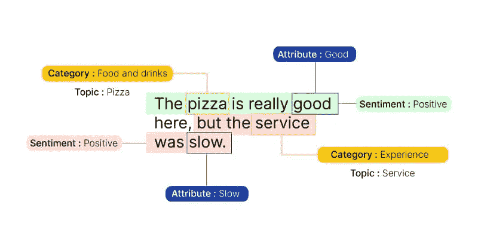

# 😊😟RoBERTa 的 Tweets 情感分析

> 原文：<https://medium.com/mlearning-ai/tweets-sentiment-analysis-with-roberta-1f30cf4e1035?source=collection_archive---------1----------------------->

## 你是开心还是难过？这个人工智能可以检测你的感受。


Photo by [Hybrid](https://unsplash.com/@artbyhybrid?utm_source=unsplash&utm_medium=referral&utm_content=creditCopyText) on [Unsplash](https://unsplash.com/?utm_source=unsplash&utm_medium=referral&utm_content=creditCopyText)

遇见**罗伯塔**。尽管有名字(罗伯塔是意大利对女孩的称呼)，*她*不是人类。罗伯塔是由[元研究](https://medium.com/u/25aae929dbb1?source=post_page-----1f30cf4e1035--------------------------------)团队开发的人工智能。从技术上来说，它是一个*模型*，在超过 1.24 亿条推文中进行了训练(从 2018 年 1 月到 2021 年 12 月)，用于自我监督的自然语言处理(NLP)。在本文中，我们将使用它进行**推文情感分析**。

# 什么是情感分析？

简而言之，**情感分析**(也称为**意见挖掘**)是一种自然语言处理(NLP)算法，用于识别、提取和量化*文本主体背后的情感基调。*



[https://www.voxco.com/blog/sentiment-analysis-helps-improve-customer-experience/](https://www.voxco.com/blog/sentiment-analysis-helps-improve-customer-experience/)

情感分析广泛应用于市场营销、产品分析和社交媒体监控。随着深度语言模型(如 RoBERTa)的兴起，还可以分析更困难的数据领域，例如，作者通常不太明确地表达其观点/情感的新闻文本[1]。

# 让我们对推文进行情感分析

众所周知，Twitter 是一个人们以推文形式表达情感的地方。在这方面，我们可以使用情感分析来查看一条推文的**情感**是**积极、中立还是消极**。事实证明，这并不是一件容易的事情。推文不同于其他类型的文本数据，因为(a)它们通常是会话文本，以及(b)它们很短。让我们看看罗伯塔能做什么。

## 获取一些 tweets 并安装有用的包

在本文中，我假设您已经有了一些用于分析的推文。如果你不知道，你可以看看最近的[指南](https://youtu.be/jtIMnmbnOFo)，用几行代码获得无限量的推文。

模特罗伯塔可以在[拥抱脸](https://medium.com/u/b1574f0c6c5e?source=post_page-----1f30cf4e1035--------------------------------)网站找到。让我们为它安装所需的包:

```
pip install transformers
pip install scipy
```

## 这条推文的感悟是什么？

下面我们将通过罗伯塔来理解埃隆·马斯克这条著名推文背后的情感:

Elon Musk popular tweet on changing his career.

为了简单起见，我们只是手动编写了推文。然后，我们做了一点*预处理*:我们需要将 tweet 中的任何*用户提及*和 *url* 转换成通用的“@user”和“http”。这是必要的，因为模型不分析用户名和网站的内容。

下一步，我们下载模型，用几行代码进行分析。首先，我们下载 RoBERTa 并创建一个`model`的实例。接下来，我们创建一个`tokenizer`，它负责为模型`tensors`准备适当格式的输入。

> 记号化是将文本分割成称为记号的小块的过程。标记化是处理文本数据的关键步骤！

我们看到编码的 tweet 只是一个字典，包含以下字段:

*输入 id:*这有点不言自明，它是通过将 tweet 转换成数字而获得的张量。

*注意屏蔽:*该参数向模型指示哪些标记应该得到更多的注意，哪些不应该。

最后，我们将编码的 tweet 传递给我们的模型，以便它可以执行情感分析。

在这里，获得的分数被转换成概率，并打印在标签旁边。我们看到伊隆的推文被归类为*中立*。

显然，埃隆对他的职业转变没有强烈的意见！

在本文中，我们看到了如何对 twitter 数据进行简单的情感分析。这是一个介绍性的教程，是理解 NLP 模型如何工作的一个进步。

> 感谢阅读，敬请期待更多内容！

# 有用的资源:

Meta AI 团队的 RoBERTa:

[](https://ai.facebook.com/blog/roberta-an-optimized-method-for-pretraining-self-supervised-nlp-systems/) [## RoBERTa:一种优化的自监督 NLP 系统预训练方法

### 一种鲁棒优化的自然语言处理系统预训练方法

ai.facebook.com](https://ai.facebook.com/blog/roberta-an-optimized-method-for-pretraining-self-supervised-nlp-systems/) 

罗伯塔在拥抱脸网站上说:

[](https://huggingface.co/cardiffnlp/twitter-roberta-base-sentiment) [## Cardiff NLP/Twitter-Roberta-base-情绪拥抱脸

### 这是一个基于 roBERTa 的模型，对大约 5800 万条推文进行了训练，并通过 TweetEval 基准对情绪分析进行了微调…

huggingface.co](https://huggingface.co/cardiffnlp/twitter-roberta-base-sentiment) 

情感分析视频教程:

[1]汉堡，费利克斯；唐奈，卡斯滕(2021)。[“NewsMTSC:政治新闻文章中基于(多)目标的情感分类数据集”](https://aclanthology.org/2021.eacl-main.142/)。《计算语言学协会欧洲分会第 16 届会议论文集:主要卷》

[](https://aclanthology.org/2021.eacl-main.142/) [## 一个用于政治新闻中(多)目标相关情感分类的数据集…

### 摘要以往的目标相关情感分类研究主要集中在评论、社交网络和文本分类上

aclanthology.org](https://aclanthology.org/2021.eacl-main.142/) [](/mlearning-ai/mlearning-ai-submission-suggestions-b51e2b130bfb) [## Mlearning.ai 提交建议

### 如何成为 Mlearning.ai 上的作家

medium.com](/mlearning-ai/mlearning-ai-submission-suggestions-b51e2b130bfb)