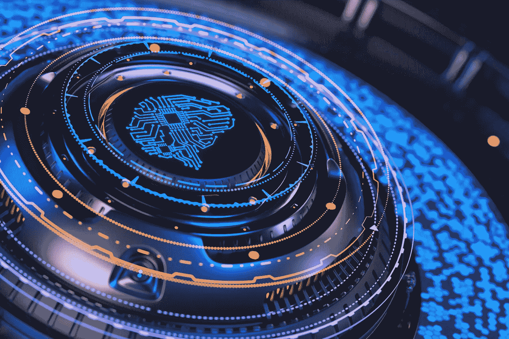
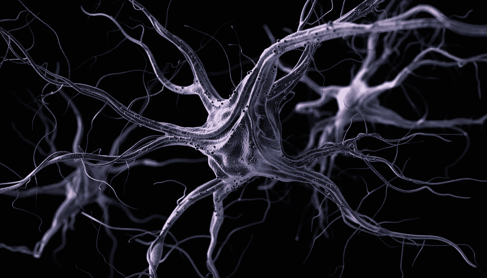
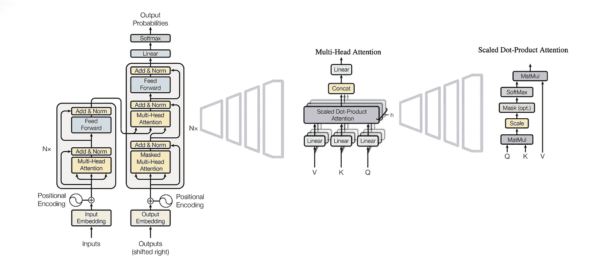

# 数据二十年:第二部分

> 原文：<https://medium.com/mlearning-ai/two-decades-in-data-part-2-39c44aa08951?source=collection_archive---------5----------------------->

# 不说艾

在本系列关于数据的上一篇文章中，我们谈到了狂妄自大的状态，这发生在人工智能(AI)的第一个泡沫破裂之前。如果你还没有读过，你可以找到它，[这里](/@pmichael_74805/two-decades-in-data-part-1-c36e1675a9a8)。

现在，第二代人工智能已经从过去的错误中吸取了教训，与人工智能 1.0 给出的轻率承诺相比，保持了相对低调。直到 21 世纪初，运筹学领域取得了引人入胜的进展。试探法，即近似的问题解决方法，变得越来越受欢迎，这是对计算这些越来越现实的问题的精确解决方案的不可能的努力的一种贡献。我们学会了如何模仿一群蚂蚁的行为来解决寻路问题。这是一个多么美好的时代，机器在做最愚蠢的决定。

因为在第一次浪潮做出喧闹的承诺后，失败的刺痛仍然存在，当时在弗劳恩霍夫研究所的办公室里，人们对我们花哨的运筹学算法动物园的可能性的态度从谦逊的现实主义到谨慎的乐观主义。那些声称自己致力于通用人工智能的人的欣喜若狂对我们来说是陌生的。当时没有人会预测到，这些相同的算法，经过两次调整并由新一代计算机芯片提供动力，将再次有资格承担人工智能的称号，更不用说成为产生通用人工智能的垫脚石了。

事实上，当我完成学习并过渡到物流咨询领域时，运筹学模型在实践中已经获得了太多黑箱的名声，而模拟是新的宠儿。

In AI 3.0 structures resembling our brain cells, neurons, are among the basic building blocks of algorithms

然后，AI 3.0 发生了。最新一代的算法在机器视觉、语音识别、自然语言处理等领域带来了惊人的成果。这是 GPU 技术进步的必然结果。为这些令人难以置信的结果提供动力的数学基础早在 20 世纪 80 年代就已经存在了。但是有了这些新的、闪闪发光的芯片，反向传播，即驱动人工神经网络学习过程的计算昂贵的反馈算法，现在已经可以负担得起了。

卷积神经网络的结果，图像，物体，人脸识别，与我们最疯狂的梦想不相上下。生成性敌对网络(GANs)的结果，深刻的假货，对我们来说不可能区分现实，纯粹的人类，地狱，有虚拟成员的 K-Pop 女子乐队，这是怎样的赛博朋克？

即使在自然语言处理领域，即以计算机可以理解的方式理解语言的“科学”领域，变压器网络也取得了巨大的进步，机器翻译取得了胜利。这肯定是人类智慧能够抵御机器的最后堡垒。这一次，艾是真的吗？

[Attention is All you Need](https://proceedings.neurips.cc/paper/2017/hash/3f5ee243547dee91fbd053c1c4a845aa-Abstract.html), Transformer Network Model

当你这么想的时候，一些优化模型有一种不可否认的美。一些研究人员设法折叠他们遇到的问题空间的维度的优雅，用这样的极简主义公式…对有效表达的掌握。对我来说，这是艺术，是建筑，是美丽的。这种精通和二十多年前一样令人印象深刻，但这并没有改变，只是模型制作的艺术，原始的真实的人的因素。

组成模型的物质和算法呢？对于我们今天的模型粘土，对于我们的机器学习网络的层和它们的组合，是否有一些内在的质量，可以称为智能？

那些 GANs 骗了我一段时间。一个智能体(学生)从另一个具有任务专长的智能体(教师)那里学习，被拒绝，从而改进其分配的任务，这听起来非常像人类最初是如何发展智力的。但是，对于我们的学生如何在这种熟悉的环境中学习，仍然没有什么策略。相反，他以一种野蛮的方式，每秒钟在课堂上举起他的手臂，与他最后一次失败相比略有增加，直到他用尽了不成功的选择。你说这孩子聪明？

 [## Mlearning.ai 提交建议

### 如何成为 Mlearning.ai 上的作家

medium.com](/mlearning-ai/mlearning-ai-submission-suggestions-b51e2b130bfb)