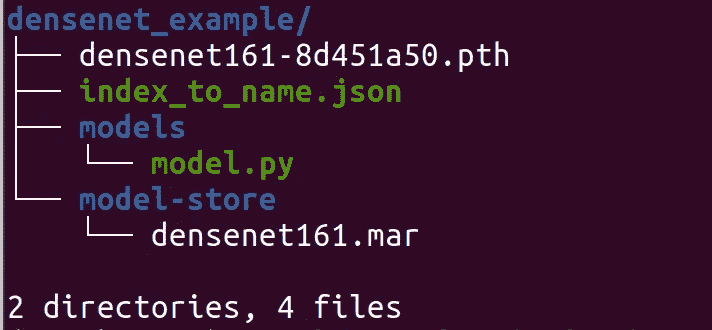

# 使用 Densenet 了解 TorchServe 的工作流程

> 原文：<https://medium.com/mlearning-ai/understanding-the-workflow-of-torchserve-using-densenet-c4d93458c19?source=collection_archive---------3----------------------->

## 部署 PyTorch 模型的 TorchServe 第一部分


Photo by [Josh Olalde](https://unsplash.com/es/@josholalde?utm_source=medium&utm_medium=referral) on [Unsplash](https://unsplash.com?utm_source=medium&utm_medium=referral)

这将是理解、使用和定制 TorchServe 以部署 PyTorch 模型的一系列文章。第一篇文章是关于熟悉工作流程的。为此，我们将使用预先训练的模型，并且只考虑当我们的模型准备好部署时会发生什么。本系列的其他文章将涵盖以下内容:

*   👉第二部分—了解基本处理程序
*   👉第三部分—带有定制处理程序脚本的 MNIST 示例

## Torchserve 是什么？

> [**TorchServe** 是 PyTorch 的一个开源模型服务框架，它可以轻松地大规模部署训练有素的 PyTorch 模型，而无需编写定制代码。](https://aws.amazon.com/about-aws/whats-new/2020/04/introducing-torchserve/)【1】

为了开始使用 TorchServe，我们将克隆他们的 [GitHub 库](https://github.com/pytorch/serve)【2】。

```
git clone https://github.com/pytorch/serve.git
```

我们将以 densenet 模型为例。您可以在资源库中找到更多示例。我强烈推荐通读。

## 安全 Densenet 模型

我们将使用预先培训的 densenet 来了解部署的工作流程。如果你想在这篇文章中有相同的文件夹结构，创建如下所示的文件夹，并将模型保存在那里。我们可以用 wget 下载。

```
mkdir densenet_example
cd densenet_example
mkdir models
cd models
wget [https://download.pytorch.org/models/densenet161-8d451a50.pth](https://download.pytorch.org/models/densenet161-8d451a50.pth)
```

保存模型的其他选项是通过可执行脚本模块或跟踪脚本，如 T [或 chServe GitHub 存储库](https://github.com/pytorch/serve/tree/master/examples/image_classifier/densenet_161)中所述。

## 将模型保存为归档文件

为了部署模型，我们需要创建一个”。标有“文件”字样。这是我们用于部署的文件，它包含完成部署所需的所有信息，例如模型脚本文件和模型的状态字典。我们将很快检查所需的文件，但是首先，我们需要安装所需的依赖项，以便创建这个文件。最简单的方法是移动到克隆的 git 存储库，并使用以下命令获得所有需要的依赖项:

```
cd serve
pip install .

cd model-archiver
pip install .
```

您也可以直接安装所需的依赖项，例如

```
pip install torchserve torch-model-archiver torch-workflow-archiver
```

现在我们可以创建了”。使用下面的命令标记“mar”文件。

```
torch-model-archiver --model-name <your_model_name> \
                     --version 1.0 \
                     --model-file <your_model_file>.py \ 
                     --serialized-file <your_model_name>.pth \
                     --handler <handler-script> 
                     --extra-files ./index_to_name.json
```

解释:

*   -模型名称:模型名称
*   —版本:定义版本号(可选)
*   —模型文件:Python 模型脚本(。py 文件)
*   -serialized-file:模型文件的位置，它包含模型的 state-dict。pth 文件)
*   —额外文件:处理程序脚本所需的其他文档
*   — handler:脚本，定义模型的预处理、推理和后处理步骤。py 文件)

当我们的模型准备好部署时，我们有一个模型脚本(*模型文件*)和一个保存的状态字典(*序列化文件*)。对于这篇文章，我们下载了保存的 state-dict。模型脚本，我们将从我们克隆的 git repo 中复制。*处理器*是一个重要的概念，它处理如何预处理数据、应用模型以及如何后处理模型的输出。TorchServe 提供了一个 BaseHandler 类，可以根据个人需求进行定制。在本系列的下一篇文章中，我们将详细介绍这个类。TorchServe 还为最重要的任务提供默认处理程序，如图像分类、对象检测、文本分类或图像分割。默认处理程序的完整列表可以在 TorchServe [文档](https://pytorch.org/serve/default_handlers.html)中找到。在这个例子中，我们考虑一个图像分类任务。默认的图像分类处理程序适用于在 ImageNet 数据集上训练的模型。这个处理器的输出是图像的前 5 个预测和它们各自的概率[3]。

对于图像分类处理程序，我们需要一个名为“index_to_name.json”的附加文档。这是一个将预测索引映射到类的字典。在复制模型脚本和字典之前，我们必须更改权限。

```
cd serve/examples/image_classifier/densenet_161/
chmod +rwx model.py
cd serve/examples/image_classifier/
chmod +rwx index_to_name.json
```

然后回到我们创建的文件夹，复制文件。

```
cd densenet_example
mkdir models
cd models
cp ../../serve/examples/image_classifier/densenet_161/model.py .
cd ..
cp ../serve/examples/image_classifier/index_to_name.json .
```

在我们的示例中，命令创建了。mar"-文件看起来像这样。

```
torch-model-archiver --model-name densenet161 \
                     --version 1.0 \
	             --model-file models/model.py \  
		     --serialized-file densenet161-8d451a50.pth \   
                     --extra-files index_to_name.json \
                     --handler image_classifier
```

接下来，创建一个文件夹“model-store ”,并将 densenet161.mar 文件移动到其中。

```
mkdir model-store
mv densenet161.mar model-store/
```

最终的文件夹结构如下所示。



Folder structure

## 使用 Docker 部署模型

我们将使用 docker 来部署模型。为此，我们下载了 TorchServe 的最新图片。

```
docker pull pytorch/torchserve:latest
```

要了解更多细节——关于具体的图像，请参考 TorchServe [git 库](https://github.com/pytorch/serve/tree/master/docker)中的 docker 部分。(还描述了如何创建。直接在 docker 中标记文件。)使用我们创建的文件，我们可以运行这个映像。

```
docker run --rm -it -p 8080:8080 -p 8081:8081 \
           --name mar \ 
           -v $(pwd)/model-store:/home/model-server/model-store \
           pytorch/torchserve:latest \
           torchserve --start \ 
           --model-store model-store \
           --models densenet161=densenet161.mar
```

我们映射到端口 8080 和 8081 进行预测和建模，这是默认端口。我们进一步包括我们的模型存储文件夹。您可以使用此命令检查哪些型号可用。

```
curl http://localhost:8081/models
```

这应该输出

```
{
  "models": [
    {
      "modelName": "densenet161",
      "modelUrl": "densenet161.mar"
    }
  ]
}
```

## 应用模型

现在我们可以用这个模型来做预测。densenet 模型在包含 1000 个不同类的 ImageNet 上训练。可以在[wekadeeplearng4j](https://deeplearning.cms.waikato.ac.nz/user-guide/class-maps/IMAGENET/)上找到课程列表。我们将应用它来看看，如果它可以分类不同的蛇，但你可以从列表中选择任何其他类。让我们来看一些示例图片。


Photo by [David Clode](https://unsplash.com/@davidclode?utm_source=unsplash&utm_medium=referral&utm_content=creditCopyText) on [Unsplash](https://unsplash.com/s/photos/snake?utm_source=unsplash&utm_medium=referral&utm_content=creditCopyText)

然后，我们可以通过以下方式进行预测:

```
curl [http://localhost:8080/predictions/densenet161](http://localhost:8080/predictions/densenet161) -T david-clode-Ws6Tb1cI0co-unsplash.jpg
```

这得到的结果是:

```
{
"rock_python": 0.4521763324737549,
"night_snake": 0.35173436999320984,
"king_snake": 0.10417615622282028,
"boa_constrictor": 0.04921364784240723,
"sidewinder": 0.02006538398563862
}
```

不错。该模型对所有蛇的预测最高，最高的是“岩蟒”。我不是蛇方面的专家，但这张图片被描述为“地毯巨蟒”。虽然该模型对该图像不是很确定，因为最高概率仅为 0.45。让我们考虑另一个例子:


Photo by [Alfonso Castro](https://unsplash.com/@acastrophotocr?utm_source=unsplash&utm_medium=referral&utm_content=creditCopyText) on [Unsplash](https://unsplash.com/s/photos/snake?utm_source=unsplash&utm_medium=referral&utm_content=creditCopyText)

该预测与前面的示例类似:

```
curl [http://localhost:8080/predictions/densenet161](http://localhost:8080/predictions/densenet161) -T alfonso-castro-HaGwCk2AD84-unsplash.jpg
```

这次我们得到了以下结果:

```
{
"green_snake": 0.7169939279556274,
"green_mamba": 0.1878765970468521,
"vine_snake": 0.02244602143764496,
"night_snake": 0.01946556195616722,
"green_lizard": 0.007101472932845354
}
```

太棒了！预测是“绿色 _ 蛇”，这也是如何描述图像。下一个:


Photo by [Mohan Moolepetlu](https://unsplash.com/@mohan_moolepetlu?utm_source=unsplash&utm_medium=referral&utm_content=creditCopyText) on [Unsplash](https://unsplash.com/s/photos/snake?utm_source=unsplash&utm_medium=referral&utm_content=creditCopyText)

结果如下:

```
{
"Indian_cobra": 0.9904808402061462
"water_snake": 0.005116844084113836,
"thunder_snake": 0.002371615031734109,
"night_snake": 0.000596951344050467,
"sea_snake": 0.0005211854004301131
}
```

这张图片被描述为“眼镜蛇”，所以这个预测几乎是完美的。让我们看看最后一个例子:


Photo by [Timothy Dykes](https://unsplash.com/@timothycdykes?utm_source=unsplash&utm_medium=referral&utm_content=creditCopyText) on [Unsplash](https://unsplash.com/s/photos/snake?utm_source=unsplash&utm_medium=referral&utm_content=creditCopyText)

这条漂亮的黄色蛇被分类如下:

```
{
"boa_constrictor": 0.4590628147125244,
"rock_python": 0.34132421016693115,
"horned_viper": 0.12637333571910858,
"sidewinder": 0.025241760537028313,
"king_snake": 0.024632452055811882
}
```

在这种情况下，模型并不像第一个例子那样非常确定。最高预测概率仅为 0.45。据我所知，这条黄色的蛇也被称为“香蕉大蟒蛇”。这不是该模型曾接受过培训的课程。这就是为什么模特甚至认出它是一条大蟒蛇，尽管颜色很不寻常。

就这样！💥这就是使用 TorchServe 部署模型的工作流程。

👉看看这个系列的下一集。在这里，我们将更仔细地观察处理程序脚本，当我们想要使用我们自己的模型时，我们需要对其进行定制。🚀

[](/@pumalinML/understanding-torchserves-basehandler-4d139d12b5f9) [## 🔥了解火炬服务器的基本处理器

### 用于部署 PyTorch 模型的 Torchserve 第二部分

medium.com](/@pumalinML/understanding-torchserves-basehandler-4d139d12b5f9) [](/@pumalinML/use-torchserve-with-a-customized-handler-script-f7d329e78ba4) [## 🔥使用带有自定义处理程序脚本的 TorchServe

### 用于部署 PyTorch 模型的 Torchserve 第三部分

medium.com](/@pumalinML/use-torchserve-with-a-customized-handler-script-f7d329e78ba4) 

## 开始使用 TorchServe 的进一步建议

*   Shashank Prasanna，TorchServe 简介，一个为 PyTorch 服务的开源模型库，[https://youtu.be/AIrrI8WOIuk](https://youtu.be/AIrrI8WOIuk)
*   [https://CCE yda . github . io/blog/torch serve/细流/dashboard/2020/10/15/torch serve . html](https://cceyda.github.io/blog/torchserve/streamlit/dashboard/2020/10/15/torchserve.html)

## 参考

*   [1] AWS，introduction torch serve:PyTorch 模型服务框架(2020)，[https://AWS . Amazon . com/about-AWS/what-new/2020/04/introduction-torch serve/](https://aws.amazon.com/about-aws/whats-new/2020/04/introducing-torchserve/)
*   [2] PyTorch，TorchServe Examples (2022)，[https://github.com/pytorch/serve/tree/master/examples](https://github.com/pytorch/serve/tree/master/examples)
*   [3] PyTorch，TorchServe 默认事件处理程序(2020)，[https://pytorch.org/serve/default_handlers.html](https://pytorch.org/serve/default_handlers.html)

[](/@frauke.albrecht/subscribe) [## 每当弗劳克·阿尔布雷特出版时，收到一封电子邮件。

### 每当弗劳克·阿尔布雷特出版时，收到一封电子邮件。通过注册，您将创建一个中型帐户，如果您还没有…

medium.com](/@frauke.albrecht/subscribe) [](/@frauke.albrecht/subscribe) [## 每当弗劳克·阿尔布雷特出版时，就收到一封电子邮件。

### 每当弗劳克·阿尔布雷特出版时，就收到一封电子邮件。通过注册，您将创建一个中型帐户，如果您还没有…

medium.com](/@frauke.albrecht/subscribe) [](/mlearning-ai/mlearning-ai-submission-suggestions-b51e2b130bfb) [## Mlearning.ai 提交建议

### 如何成为 Mlearning.ai 上的作家

medium.com](/mlearning-ai/mlearning-ai-submission-suggestions-b51e2b130bfb)