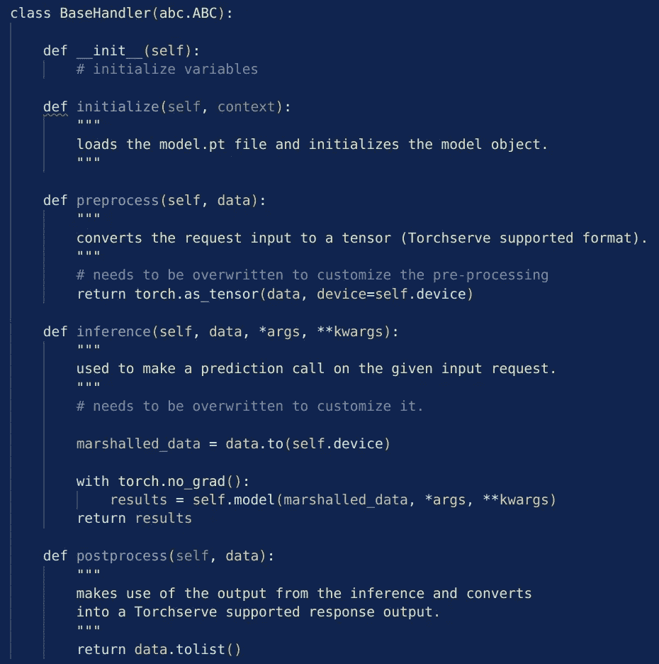
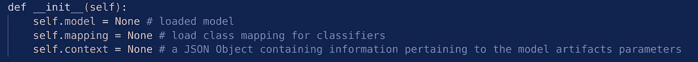

# 了解 TorchServe 的 BaseHandler

> 原文：<https://medium.com/mlearning-ai/understanding-torchserves-basehandler-4d139d12b5f9?source=collection_archive---------4----------------------->

## 部署 PyTorch 模型的 Torchserve 第二部分

Photo by [EJ Strat](https://unsplash.com/@xoforoct?utm_source=medium&utm_medium=referral) on [Unsplash](https://unsplash.com?utm_source=medium&utm_medium=referral)

这是一个系列的第二篇文章，我们试图熟悉 TorchServe。在第一篇文章中，我们学习了在给定默认设置的情况下使用 TorchServe 部署模型的工作流程。主要步骤是创建一个”。mar”文件，使用命令 [torch-model-archiver](https://github.com/pytorch/serve/blob/master/model-archiver/README.md) 。这个文件包含了我们部署模型所需的所有信息。我们需要在此包含一个文件”。mar”文件是*处理程序*，它包含我们进行预测所需的关于预处理、推理和后处理的所有信息。在之前的帖子中，我们使用了默认的处理程序 *ImageClassifier* ，它可以用于在 ImageNet 上训练的图像分类问题，并预测至少 5 个类。更多详情，请看这里:

 [## 🔥使用 Densenet 了解 TorchServe 的工作流程

### 部署 PyTorch 模型的 TorchServe 第一部分

medium.com](/mlearning-ai/understanding-the-workflow-of-torchserve-using-densenet-c4d93458c19) 

然而，在大多数应用程序中，我们需要定义一个定制的处理程序脚本。TorchServe 提供了一个名为 *BaseHandler* 的类，其中的预处理、推理和后处理步骤是针对默认设置进行处理的。为了部署我们自己的模型，我们可以创建自己的处理程序类，它继承自 BaseHandler。我们只改变必要的部分。为此，这篇文章只致力于 BaseHandler 类和理解它做什么。 [*BaseHandler*](https://github.com/pytorch/serve/blob/master/ts/torch_handler/base_handler.py) 的完整代码可以在 [GitHub](https://github.com/pytorch/serve/blob/master/ts/torch_handler/base_handler.py) 上找到。在这里，我们将只查看需要定制的部分。该课程的结构如下:

类包含更多的方法，但通常情况下，我们只需要关心*预处理*、*推理、*和*后处理*方法，当然还有在 *__init__* 方法中初始化额外的变量。让我们更详细地看看上面的方法。

## __init__

一如既往，在这一部分中，定义了所需的变量。一些重要的是:模型、映射和上下文:

Some important initialized variables in the base handler

在这里，我们可能会额外添加转换或我们的模型需要的任何东西。

## 初始化

该方法加载 model.pt 文件，并将其设置为 [*eval-mode*](https://www.tutorialexample.com/an-introduction-to-pytorch-model-eval-for-beginners-pytorch-tutorial/) 。首先，它尝试加载 [*torchscript*](https://pytorch.org/docs/stable/jit.html) 否则它加载基于 *state_dict* 的模型。作为输入，它获取 [*上下文*](https://pytorch.org/serve/_modules/ts/context.html) -json 文件，其中包含加载模型所需的所有信息，例如它的位置。当 model.py 文件丢失时，它会引发错误。它还设置了*和[*map _ location*](https://pytorch.org/docs/stable/generated/torch.load.html)*变量。**

## **预处理**

**在这种方法中，定义了在应用模型之前需要对数据执行的预处理步骤。作为输入，它以列表的形式获取数据，并以张量的形式返回预处理后的数据。这些步骤需要定制！**

## **推理**

**在这种方法中，应用模型并创建实际预测。它接收预处理函数返回的数据。这应该与模型输入形状相匹配。预测以张量的形式返回。**

## **后处理**

**该方法接收从推理函数返回的预测作为输入数据。然后，它将模型的实际输出创建为一个列表。这些步骤需要定制！**

**👉在下一篇文章中，我们将使用这个 BaseHandler 并为 [MNIST](http://yann.lecun.com/exdb/mnist/) 数据集定制它来预测手写数字。👀**

** [## 🔥使用带有自定义处理程序脚本的 TorchServe

### 部署 PyTorch 模型的 Torchserve 第三部分

medium.com](/@pumalinML/use-torchserve-with-a-customized-handler-script-f7d329e78ba4) 

## 进一步阅读

*   [https://ccey da . github . io/blog/torch serve/streamlit/dashboard/2020/10/15/torch serve . html](https://cceyda.github.io/blog/torchserve/streamlit/dashboard/2020/10/15/torchserve.html)

 [## 每当弗劳克·阿尔布雷特出版时，就收到一封电子邮件。

### 每当弗劳克·阿尔布雷特出版时，就收到一封电子邮件。通过注册，您将创建一个中型帐户，如果您还没有…

medium.com](/@frauke.albrecht/subscribe)  [## 每当弗劳克·阿尔布雷特出版时，就收到一封电子邮件。

### 每当弗劳克·阿尔布雷特出版时，就收到一封电子邮件。通过注册，您将创建一个中型帐户，如果您还没有…

medium.com](/@frauke.albrecht/subscribe)  [## Mlearning.ai 提交建议

### 如何成为 Mlearning.ai 上的作家

medium.com](/mlearning-ai/mlearning-ai-submission-suggestions-b51e2b130bfb)**