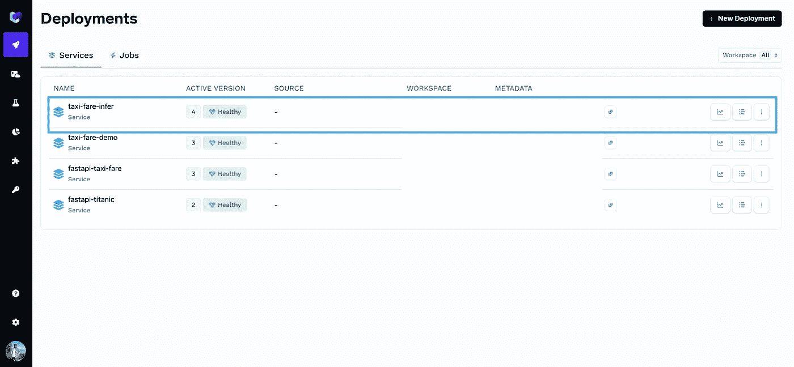
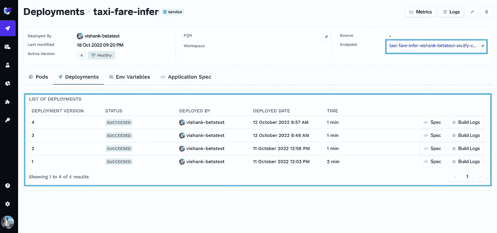
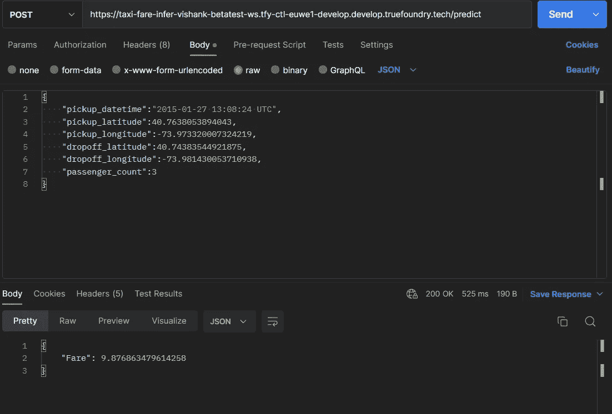

# 使用 ServiceFoundry 像忍者🥷一样部署机器学习模型

> 原文：<https://medium.com/mlearning-ai/use-servicefoundry-to-deploy-machine-learning-models-like-a-ninja-a912ca550333?source=collection_archive---------3----------------------->

## 在 ServiceFoundry 上使用 FastAPI 部署 ML 模型的快速指南。


Photo by [Lucrezia Carnelos](https://unsplash.com/@ciabattespugnose?utm_source=medium&utm_medium=referral) on [Unsplash](https://unsplash.com?utm_source=medium&utm_medium=referral)

MLOps 是数据科学生命周期中的一个重要阶段。有几种部署 ML 模型的方法，但是有一些关键点是每个数据科学家都应该考虑的，那就是部署一个模型所花费的时间&将它作为一种服务来使用，以及管理特定项目的基础设施。

ServiceFoundry 是一个工具，可帮助将模型部署到生产环境中，将模型推断为 API 端点或 Streamlit/Gradio web 应用程序，创建培训工作，对模型进行版本控制并跟踪实验。

A short video to demonstrate the ServiceFoundry & MLFoundry platforms

让我们在 ServiceFoundry 上部署一个示例 ML 模型！

对于这个例子，我使用了在 [Kaggle](https://www.kaggle.com/competitions/new-york-city-taxi-fare-prediction/data) 上找到的纽约出租车费用数据集。我训练了一个简单的 XGBoost 回归模型，因为我们必须预测纽约市的出租车费用。你可以在这里查看[的全部笔记。](https://www.kaggle.com/code/vishank97/taxi-fare-prediction)

> 注意:对于本教程，有一个关于 MLFoundry 和如何记录模型和实验跟踪的先决条件。我已经在我的文章的[中解释了如何使用 MLFoundry。](/mlearning-ai/tracking-ml-models-with-mlfoundry-5de8520752e6)

关于将模型部署为 FastAPI 服务的分步指南。

1.  首先创建一个 [TrueFoundry](https://app.develop.truefoundry.tech/) 账户。
2.  为项目创建一个新的 venv 和一个文件夹。
3.  在您的 venv 中安装 servicefoundry 和 mlfoundry。

```
 pip install -U — quiet "mlfoundry" "servicefoundry"
```

接下来，我们需要创建以下文件:

1.  *predict.py* :这将是主预测文件。
2.  *main.py* :我们将在这个文件中创建 FastAPI 应用程序。
3.  *infer.yaml* :我们将在这个 yaml 文件中存储我们的 API 键和其他环境变量。
4.  *deploy.py* :最后，为了将我们的 FastAPI 应用程序部署到 servicefoundry，我们将创建这个文件

让我们从每个文件开始:

当我们运行 *deploy.py* 时，我们的服务将被部署到 servicefoundry

我们可以在这里查看我们的部署[。它看起来会像这样:](https://app.develop.truefoundry.tech/applications)



转到选定的项目，我们可以看到我们的部署以及 FastAPI 端点。



我们现在就可以去那个端点测试 API 了！

> 注意:我们希望在使用这个端点时打开 SwaggerUI，但是，如果您有多个端点，默认情况下 SwaggerUI 不会启动。为此，我们必须将/docs 附加到端点 URL。



We can also use Postman to test the endpoint.

结论:ServiceFoundry 试图减少将 ML 模型部署到生产中的摩擦和时间，我们可以毫不费力地部署我们的模型。

在我接下来的博客中，我将展示我们如何使用 Streamlit 将我们的模型作为 web 应用程序部署在 servicefoundry 中，并部署一个调度作业来训练我们的模型处理新数据。

参考资料:

1.  [使用 MLFoundry 跟踪 ML 模型](/mlearning-ai/tracking-ml-models-with-mlfoundry-5de8520752e6)
2.  [GitHub](https://github.com/vishank97/new-york-taxi-fare-prediction) repo 包含使用 FastAPI 服务部署模型的源代码，简化 web 应用程序和培训工作，如果您想快速入门的话。
3.  [TrueFoundry 文档](https://docs.truefoundry.com/documentation/)

[](/mlearning-ai/mlearning-ai-submission-suggestions-b51e2b130bfb) [## Mlearning.ai 提交建议

### 如何成为 Mlearning.ai 上的作家

medium.com](/mlearning-ai/mlearning-ai-submission-suggestions-b51e2b130bfb)