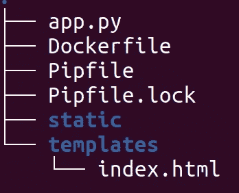

# 使用 TorchServe 和 Flask 将您的模型部署为 Web 应用程序

> 原文：<https://medium.com/mlearning-ai/use-torchserve-and-flask-to-deploy-your-model-as-a-web-app-6d612eccdcd7?source=collection_archive---------1----------------------->

## 为您的 PyTorch 模型开发一个简单的 Web 应用程序


Photo by [Brian McGowan](https://unsplash.com/@sushioutlaw?utm_source=medium&utm_medium=referral) on [Unsplash](https://unsplash.com?utm_source=medium&utm_medium=referral)

## 介绍

这是围绕用 TorchServe 服务您的 PyTorch 模型的系列文章的第四篇。在之前的文章中，我们讨论了如何使用 TorchServe 服务模型的一般工作流程。

[](/mlearning-ai/understanding-the-workflow-of-torchserve-using-densenet-c4d93458c19) [## 🔥使用 Densenet 了解 TorchServe 的工作流程

### 部署 PyTorch 模型的 TorchServe 第一部分

medium.com](/mlearning-ai/understanding-the-workflow-of-torchserve-using-densenet-c4d93458c19) 

接下来，我们研究了 TorchServe 提供的 BaseHandler 类。我们可以使用这个类来提供关于预处理、推理和后处理的所有信息:

[](/@pumalinML/understanding-torchserves-basehandler-4d139d12b5f9) [## 🔥了解 TorchServe 的 BaseHandler

### 部署 PyTorch 模型的 Torchserve 第二部分

medium.com](/@pumalinML/understanding-torchserves-basehandler-4d139d12b5f9) 

然后我们讨论了如何定制 [BaseHandler](https://pytorch.org/serve/custom_service.html) 类，并使用 [MNIST 数据集](http://yann.lecun.com/exdb/mnist/)和一个简单的 CNN 应用前面讨论的概念来预测数字:

[](/mlearning-ai/use-torchserve-with-a-customized-handler-script-f7d329e78ba4) [## 🔥使用带有自定义处理程序脚本的 TorchServe

### 部署 PyTorch 模型的 Torchserve 第三部分

medium.com](/mlearning-ai/use-torchserve-with-a-customized-handler-script-f7d329e78ba4) 

在这篇文章中，我们将讨论如何用 Python 开发一个应用了我们的模型的 web 应用程序。有不同的可能性如何实现这一点，这里我们将使用[烧瓶](https://flask.palletsprojects.com/en/2.2.x/)。我们将用 [Docker](https://www.docker.com/) 将工作流容器化。你可以在 [github](https://github.com/froukje/mnist-deployment/tree/master/deployment) 上找到完整的代码和示例图片。

# 烧瓶简介

Flask 是一个用 Python 编写的 web 框架。web 框架指的是库和模块的集合，它使得开发 web 应用程序变得容易，而不必担心底层细节。Flask 更确切地说是一个*微框架，*这意味着它不需要其他工具或库。它是用来设计和创建网络应用程序的。Flask 是一个 WSGI(发音为:“威士忌”)框架。这代表 web 服务器网关接口，它是 web 服务器向 Web 应用程序或框架传递请求的一种方式。

在实现我们的小应用程序之前，让我们从 [Flask 文档](https://flask.palletsprojects.com/en/2.2.x/quickstart/)中的最小示例开始。

```
from flask import Flask

app = Flask(__name__)

@app.route("/")
def hello_world():
    return "<p>Hello, World!</p>"
```

从[文档页](https://flask.palletsprojects.com/en/2.2.x/quickstart/)中复制的略短的解释。

1.  导入`[**Flask**](https://flask.palletsprojects.com/en/2.2.x/api/#flask.Flask)`类。这个类的一个实例是我们的 WSGI 应用程序。
2.  创建该类的一个实例。第一个参数是应用程序的模块或包的名称。`__name__`是适用于大多数情况的快捷方式。它告诉 Flask 在哪里寻找像模板和静态文件这样的资源。
3.  使用`[**route()**](https://flask.palletsprojects.com/en/2.2.x/api/#flask.Flask.route)`装饰器告诉 Flask 哪个 URL 应该触发这个函数。
4.  该函数返回我们希望在用户浏览器中显示的文本。(默认的内容类型是 HTML，所以字符串中的 HTML 将由浏览器呈现。)

将脚本另存为`hello.py.`要运行应用程序，请使用:

```
$ flask --app hello run
 * Serving Flask app 'hello'
 * Running on http://127.0.0.1:5000 (Press CTRL+C to quit)
```

“-app”选项告诉 Flask 应用程序在哪里。然后你可以进入“localhost:5000”查看应用程序的输出“Hello World”。

# MNIST 应用

## 概观

我们的 MNIST 应用程序应该有以下功能。该应用程序应该包含一个上传图像的表单和一个按钮，应该按下以进行预测。我们将保持布局非常简约，专注于功能。html 表单将存储在一个名为“index.html”的文件中。该文件需要存储在名为“templates”的子文件夹中。子文件夹需要有这个名字，否则 Flask 找不到它。应用程序本身将存储在一个名为“app.py”的文件中。在主文件夹中，我们有一个名为“app”的子文件夹，在这个文件夹中存储了包含我们应用程序的所有内容:



Structure of the subfolder of the web app

## HTML 文件

HTML 文件非常简单。在标题之后，包含一个样式表链接，用于从 [Bootstrap](https://getbootstrap.com/docs/5.1/getting-started/introduction/) 加载 css 设计。接下来是一个简短的 javascript 函数，当图片上传时就会被触发。它创建了一个代表图像的 URL，这使我们能够轻松地显示图像。更多细节，比如 Espen Hovlandsdal 在[schnipsed.com](https://schibsted.com/blog/the-magic-of-createobjecturl/)上提供了很好的解释。

包含带有图像和按钮的实际表单，它触发预测。表单有“method=POST”，也就是说，我们可以通过 Python 脚本中的“request”来访问上传的图像。然后，预测由模型计算并打印出来。使用 [Django](https://www.djangoproject.com/) 语法访问预测。

```
<!DOCTYPE html>
<html>
<head>
  <meta charset="UTF-8">
  <title>My Machine Learning Model</title>

  <!--CSS using bootstrap-->
  <link href="https://cdn.jsdelivr.net/npm/bootstrap@5.1.3/dist/css/bootstrap.min.css" rel="stylesheet" integrity="sha384-1BmE4kWBq78iYhFldvKuhfTAU6auU8tT94WrHftjDbrCEXSU1oBoqyl2QvZ6jIW3" crossorigin="anonymous">
  <script>
     var loadFile = function(event) {
     var image = document.getElementById('output');
     image.src = URL.createObjectURL(event.target.files[0]);
     };
  </script>
</head>

<body>
  <br>
  <br>
  <form method="post" action="{{url_for('predict')}}" enctype="multipart/form-data">
    <p>
    <input type="file"  accept="image/png" name="file" id="file" onchange="loadFile(event)" style="display: none;">
    </p>
    <p>
    <label for="file" style="cursor: pointer;">Upload Image</label>
    </p>
    
    <br>
    <br>
    <button type="submit" class="btn btn-primary btn-block btn-large">Predict Value!</button>
  </form>
  <br>
  <br>
  <b> {{ prediction_text }} </b>
 </div>
</body>
</html>
```

## 烧瓶脚本

现在让我们来看看 Flask 脚本。在实例化我们的应用程序后，我们将上传图像的文件路径设置为当前目录，该目录与“static”文件夹相连接。我们的脚本进一步由两个函数“home”和“predict”组成。两者都有一个“route()”装饰器,“predict”函数被路由到“predict”子页。“home”函数只是返回“index.html”页面，而“predict”函数接收来自 html 表单的输入并进行预测。

让我们仔细看看“预测”功能。仅当“request . method = = POST”——即当“预测值！”按钮—计算并打印预测。在检查文件名不为空之后，生成图像路径，我们需要它来请求预测。文件名是使用“werkzeug.utils”中的“secure_filename”方法生成的。这将文件路径简化为平面文件名。这样做是出于安全考虑，更多细节请看 Miguel Grinberg 的博客关于文件上传。然后，所请求的预测被返回并打印在网站上。本例中的请求 URL 是从官方 torchserve 映像创建的 Docker 映像，我们将在下一节中考虑。

```
import os
import requests
from flask import Flask, request, render_template, redirect
import pickle
from werkzeug.utils import secure_filename 

app = Flask(__name__)

app.config['IMAGE_UPLOADS'] = os.path.join(os.getcwd(), 'static')

@app.route('/', methods=['POST', 'GET'])
def home():
    return render_template('index.html')

@app.route('/predict',methods=['POST', 'GET'])
def predict():
    """Grabs the input values and uses them to make prediction"""
    if request.method == 'POST':
        print(os.getcwd()) 
        image = request.files["file"]
        if image.filename == '':
            print("Filename is invalid")
            return redirect(request.url)

        filename = secure_filename(image.filename)

        basedir = os.path.abspath(os.path.dirname(__file__))
        img_path = os.path.join(basedir, app.config['IMAGE_UPLOADS'], filename)
        image.save(img_path)
        res = requests.post("http://torchserve-mar:8080/predictions/mnist", files={'data': open(img_path, 'rb')})
        prediction = res.json()
    return render_template('index.html', prediction_text=f'Predicted Number: {prediction}')

if __name__ == "__main__":
    app.run(debug=True, host="0.0.0.0", port=9696)
```

# 用 Docker 将应用容器化

我们将使用 [docker-compose](https://docs.docker.com/compose/) 启动该应用程序，它包含两个服务。一个用于 torchserve，一个用于 app。docker-compose.yaml 文件如下所示:

```
version: '3.7'

services:
  torchserve-mar: # container-name
    image: torchserve-mar:v1
    ports:
      - "8080:8080"
      - "8081:8081" 
  mnistapp:
    build: app/
    ports:
      - "9696:9696"
```

这两项服务被称为“torchserve-mar”和“mnistapp”。“torchserve-mar”服务是一个 Docker 映像，建立在官方 torchserve 映像的基础上，此外还包括“模型存储”文件夹。mar”文件，然后启动 torchserve。如何创造这个”。mar”在[以前的帖子](/mlearning-ai/use-torchserve-with-a-customized-handler-script-f7d329e78ba4)中讨论过。文件 Dockerfile 看起来如下:

```
FROM pytorch/torchserve:latest

COPY ["./model-store", "./model-store"]

CMD ["torchserve", "--start", "--model-store", "model-store", "--models", "mnist=mnist.mar"]
```

可以使用以下命令构建 Docker 映像:

```
build -t torchserve-mar:v1
```

第二个服务直接构建 Docker 映像。关联的 Dockerfile 存储在“app”子文件夹中，其结构如下。

```
# baseimage
FROM python:3.9

# install pipenv
RUN pip install pipenv

# creates directory "app" and moves there
WORKDIR /app

# copy Pipfile and Pifile.lock to current directory
COPY ["Pipfile", "Pipfile.lock", "./"]

# create virtual environment directly on the system
RUN pipenv install --system --deploy

# copy the python script we need
COPY . ./

# expose the port
EXPOSE 9696

# define entrypoint
ENTRYPOINT ["gunicorn", "--bind=0.0.0.0:9696", "app:app"]
```

它从 Pipenv 虚拟环境中复制并安装所需的包，然后启动应用程序。

关于确切的文件夹结构，请参考 [github repo](https://github.com/froukje/mnist-deployment/tree/master/deployment) 。要运行应用程序，请移动到存储 docker-compose.yaml 文件的文件夹，并使用:

```
docker-compose up
```

然后在浏览器中导航到 localhost:9696，查看并使用 web 应用程序。


Screenshots of the app running on localhost:9696

# 参考

*   烧瓶是什么？Matthew Deery，2022，careerfoundry，[https://career foundry . com/en/blog/we b-development/what-is-flask/](https://careerfoundry.com/en/blog/web-development/what-is-flask/)
*   Python 教程，2021，【https://pythonbasics.org/what-is-flask-python/ 
*   用 Flask 处理文件上传，Miguel Grinberg， [2020，https://blog . Miguel Grinberg . com/post/handling-File-Uploads-with-Flask/page/3](https://blog.miguelgrinberg.com/post/handling-file-uploads-with-flask/page/3)

[](/@frauke.albrecht/subscribe) [## 每当弗劳克·阿尔布雷特出版时，就收到一封电子邮件。

### 每当弗劳克·阿尔布雷特出版时，就收到一封电子邮件。通过注册，您将创建一个中型帐户，如果您还没有…

medium.com](/@frauke.albrecht/subscribe) [](/@frauke.albrecht/membership) [## 通过我的推荐链接加入媒体

### 阅读 Frauke Albrecht 的每一个故事(以及媒体上成千上万的其他作家)。您的会员费直接支持…

medium.com](/@frauke.albrecht/membership) [](/mlearning-ai/mlearning-ai-submission-suggestions-b51e2b130bfb) [## Mlearning.ai 提交建议

### 如何成为 Mlearning.ai 上的作家

medium.com](/mlearning-ai/mlearning-ai-submission-suggestions-b51e2b130bfb)