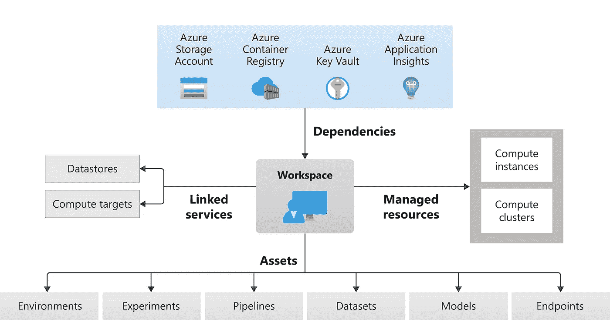
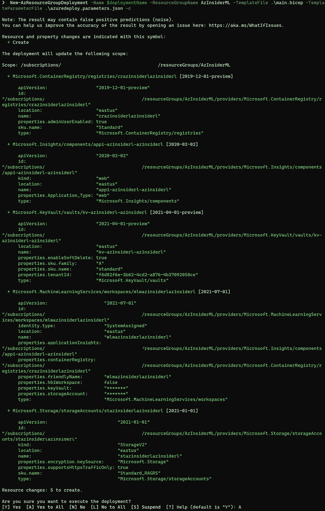
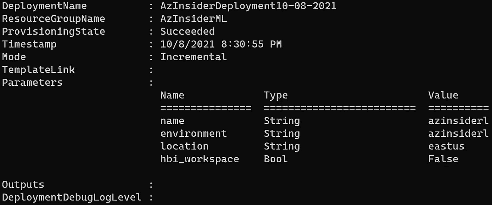
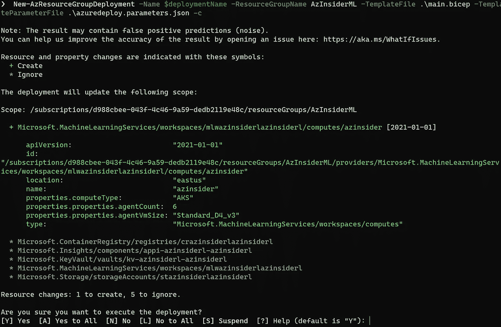
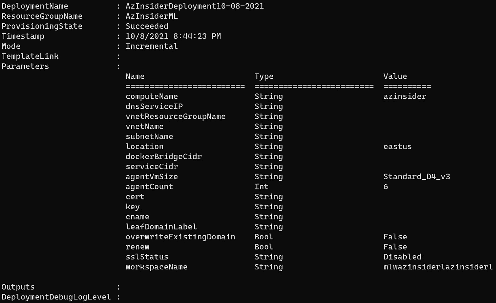
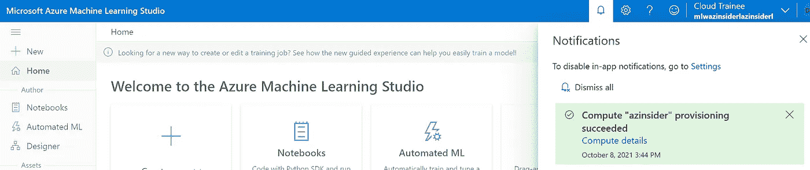
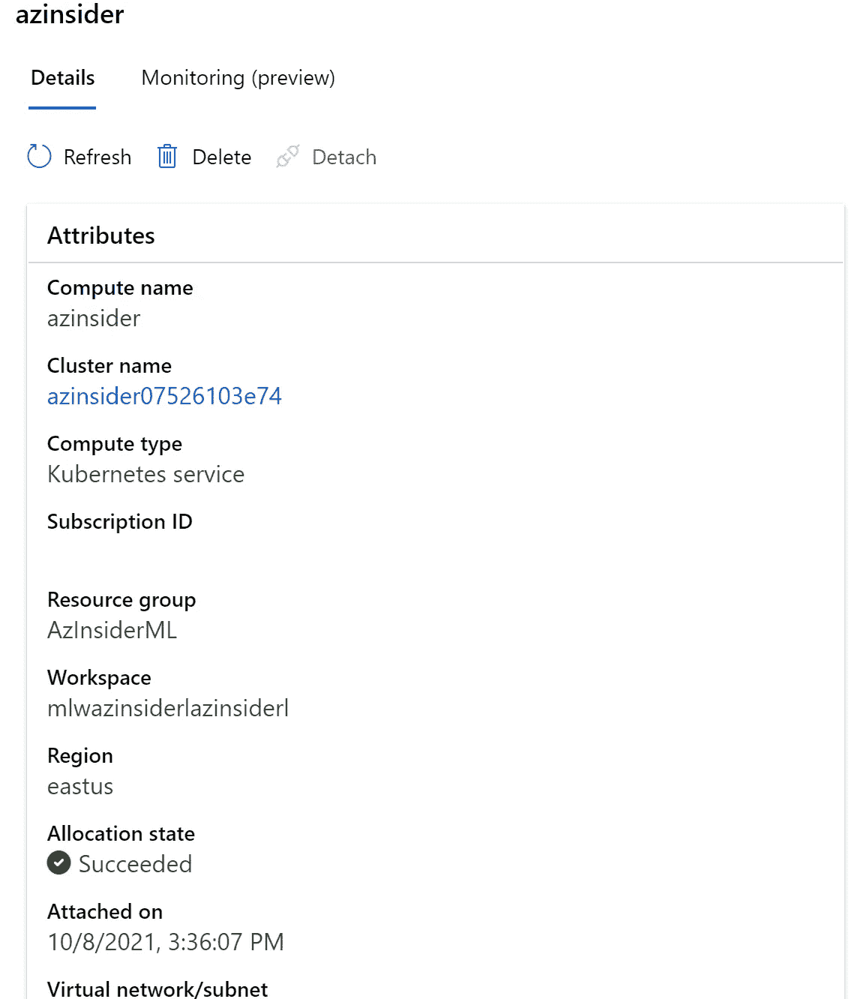
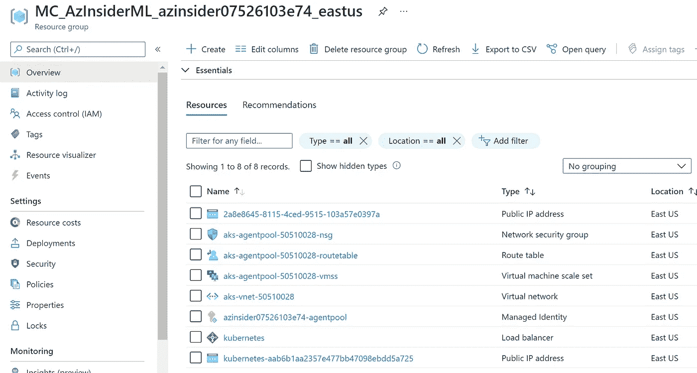

# 💪使用 Bicep 创建 Azure Kubernetes 集群并将其附加到 Azure 机器学习

> 原文：<https://medium.com/mlearning-ai/using-bicep-to-create-and-attach-an-azure-kubernetes-cluster-to-azure-machine-learning-eb6c691df3c7?source=collection_archive---------4----------------------->

了解如何利用 Bicep 为 Azure 机器学习创建 Azure Kubernetes 集群。


Using Bicep to create and attach an Azure Kubernetes Cluster to Azure Machine Learning

如果你已经在使用 Azure 机器学习服务，你可以将一个训练好的模型部署到 Azure Kubernetes 服务。

**Azure Machine Learning** 是一款用于加速和管理机器学习项目生命周期的云服务。

我在以前的文章中描述了如何使用 Bicep 部署使用 Azure 机器学习所需的所有组件。您需要具备:

*   一个蔚蓝色的机器学习[工作区](/codex/using-bicep-to-create-workspace-resources-and-get-started-with-azure-machine-learning-bcc57fd4fd09?source=user_profile---------2----------------------------)
*   Azure 机器学习[计算节点](/codex/create-an-azure-machine-learning-compute-instance-using-azure-bicep-491783578656?source=user_profile---------1----------------------------)用于您的开发环境
*   [计算集群](/codex/create-an-azure-machine-learning-compute-cluster-using-azure-bicep-dd43f367f36a?source=user_profile---------0----------------------------)用于提交训练运行。
*   你的模特。点击查看如何训练 TensorFlow 模型[。](https://docs.microsoft.com/en-us/azure/machine-learning/how-to-train-tensorflow?WT.mc_id=AZ-MVP-5000671)

你可以在这里了解 Azure 机器学习[的架构和概念。](https://docs.microsoft.com/en-us/azure/machine-learning/concept-azure-machine-learning-architecture?WT.mc_id=AZ-MVP-5000671)

下图显示了 AzureMachine Learning 的高级架构参考:



[MS Docs — Azure Machine Learning Architecture](https://docs.microsoft.com/en-us/azure/machine-learning/media/concept-azure-machine-learning-architecture/architecture.svg?WT.mc_id=AZ-MVP-5000671)

本文旨在向您展示如何将 Azure Kubernetes 集群部署到 Azure 机器学习服务中。

要部署 Azure Kubernetes 集群，我们有两个选择:我们可以从 Azure 机器学习工作区创建一个新的 Azure Kubernetes 集群，或者附加一个现有的 Azure Kubernetes 集群。

为了这个用例，我们将创建一个新的 Azure Kubernetes 集群。

我们将执行以下操作:

*   创建 Azure 机器学习工作区。
*   创建一个新的 Azure Kubernetes 集群，并将其附加到工作区

# 创建 Azure 机器学习工作区。

我们将使用下面的代码来创建我们的 Azure 机器学习工作区。详细流程可以参考这篇[文章](https://blog.azinsider.net/using-bicep-to-create-workspace-resources-and-get-started-with-azure-machine-learning-bcc57fd4fd09)。

下面是部署 Azure 机器学习工作区的完整 Bicep 代码:

```
[@description](http://twitter.com/description)('Specifies the name of the deployment.')
param name string[@description](http://twitter.com/description)('Specifies the name of the environment.')
param environment string[@description](http://twitter.com/description)('Specifies the location of the Azure Machine Learning workspace and dependent resources.')
param location string = resourceGroup().location[@description](http://twitter.com/description)('Specifies whether to reduce telemetry collection and enable additional encryption.')
param hbi_workspace bool = falsevar tenantId = subscription().tenantId
var storageAccountName_var = 'st${name}${environment}'
var keyVaultName_var = 'kv-${name}-${environment}'
var applicationInsightsName_var = 'appi-${name}-${environment}'
var containerRegistryName_var = 'cr${name}${environment}'
var workspaceName_var = 'mlw${name}${environment}'
var storageAccount = storageAccountName.id
var keyVault = keyVaultName.id
var applicationInsights = applicationInsightsName.id
var containerRegistry = containerRegistryName.idresource storageAccountName 'Microsoft.Storage/storageAccounts@2021-01-01' = {
  name: storageAccountName_var
  location: location
  sku: {
    name: 'Standard_RAGRS'
  }
  kind: 'StorageV2'
  properties: {
    encryption: {
      services: {
        blob: {
          enabled: true
        }
        file: {
          enabled: true
        }
      }
      keySource: 'Microsoft.Storage'
    }
    supportsHttpsTrafficOnly: true
  }
}resource keyVaultName 'Microsoft.KeyVault/vaults@2021-04-01-preview' = {
  name: keyVaultName_var
  location: location
  properties: {
    tenantId: tenantId
    sku: {
      name: 'standard'
      family: 'A'
    }
    accessPolicies: []
    enableSoftDelete: true
  }
}resource applicationInsightsName 'Microsoft.Insights/components@2020-02-02' = {
  name: applicationInsightsName_var
  location: (((location == 'eastus2') || (location == 'westcentralus')) ? 'southcentralus' : location)
  kind: 'web'
  properties: {
    Application_Type: 'web'
  }
}resource containerRegistryName 'Microsoft.ContainerRegistry/registries@2019-12-01-preview' = {
  sku: {
    name: 'Standard'
  }
  name: containerRegistryName_var
  location: location
  properties: {
    adminUserEnabled: true
  }
}resource workspaceName 'Microsoft.MachineLearningServices/workspaces@2021-07-01' = {
  identity: {
    type: 'SystemAssigned'
  }
  name: workspaceName_var
  location: location
  properties: {
    friendlyName: workspaceName_var
    storageAccount: storageAccount
    keyVault: keyVault
    applicationInsights: applicationInsights
    containerRegistry: containerRegistry
    hbiWorkspace: hbi_workspace
  }
  dependsOn: [
    storageAccountName
    keyVaultName
    applicationInsightsName
    containerRegistryName
  ]
}
```

在上面的代码中，我们定义了以下资源:

*   存储帐户
*   钥匙库
*   应用洞察
*   集装箱登记处
*   机器学习服务工作空间

现在，我们将使用下面的命令部署上面的 Bicep 文件来创建我们的 Azure 机器学习工作区:

```
$date = Get-Date -Format "MM-dd-yyyy"
$deploymentName = "AzInsiderDeployment"+"$date"New-AzResourceGroupDeployment -Name $deploymentName -ResourceGroupName AzInsiderML -TemplateFile .\main.bicep -TemplateParameterFile .\azuredeploy.parameters.json -c
```

注意我们添加了标志-C 来预览我们的部署。一旦部署有效，我们就可以执行它。



Azure Machine Learning Workspace — Deployment preview

下图显示了部署输出:



Azure Machine Learning Workspace — Deployment output

下图显示了创建的资源:


Azure Machine Learning Workspace deployment

下一步是创建一个新的 Azure Kubernetes 集群，并将其附加到工作区。

# 创建一个新的 Azure Kubernetes 集群，并将其附加到工作区

我们需要传递两个参数值:Azure 机器学习工作区的名称和 Azure Kubernetes 集群的名称。

下面的代码显示了我们将在部署时传递的参数文件的定义:

```
{
    "$schema": "[https://schema.management.azure.com/schemas/2019-04-01/deploymentParameters.json#](https://schema.management.azure.com/schemas/2019-04-01/deploymentParameters.json#)",
    "contentVersion": "1.0.0.0",
    "parameters": {
      "workspaceName": {
        "value": "YOUR-WORKSPACE-NAME"
      },
      "computeName": {
        "value": "COMPUTE-NAME"
      }
    }
  }
```

现在我们将定义二头肌模板。在这个文件中，我们将定义以下参数:

```
[@description](http://twitter.com/description)('The exposed port for the compute instance.')
param computeName string[@description](http://twitter.com/description)('The exposed port for the compute instance.')
param dnsServiceIP string = ''[@description](http://twitter.com/description)('Name of the resource group which holds the VNET to which you want to inject your compute in.')
param vnetResourceGroupName string = ''[@description](http://twitter.com/description)('Name of the vnet which you want to inject your compute in.')
param vnetName string = ''[@description](http://twitter.com/description)('Name of the subnet inside the VNET which you want to inject your compute in.')
param subnetName string = ''[@description](http://twitter.com/description)('The exposed port for the compute instance.')
param location string = resourceGroup().location[@description](http://twitter.com/description)('The exposed port for the compute instance.')
param dockerBridgeCidr string = ''[@description](http://twitter.com/description)('The exposed port for the compute instance.')
param serviceCidr string = ''[@description](http://twitter.com/description)('The Azure VM size of the agent VM nodes. This cannot be changed once the cluster is created.')
param agentVmSize string = 'Standard_D4_v3'[@description](http://twitter.com/description)('The number of agent nodes in the Container Service..')
param agentCount int = 6[@description](http://twitter.com/description)('The SSL cert data in PEM format encoded as base64 string')
param cert string = ''[@description](http://twitter.com/description)('The SSL key data in PEM format encoded as base64 string.')
param key string = ''[@description](http://twitter.com/description)('The CName of the cert.')
param cname string = ''[@description](http://twitter.com/description)('The leaf domain label of public endpoint.')
param leafDomainLabel string = ''[@description](http://twitter.com/description)('Value indicating whether to overwrite existing domain label.')
param overwriteExistingDomain bool = false[@description](http://twitter.com/description)('Value indicating whether to renew certificate.')
param renew bool = false[@allowed](http://twitter.com/allowed)([
  'Enabled'
  'Disabled'
  'Auto'
])
[@description](http://twitter.com/description)('SSL status. Allowed values are Enabled and Disabled.')
param sslStatus string = 'Disabled'[@description](http://twitter.com/description)('The exposed port for the compute instance.')
param workspaceName string
```

现在我们将定义两个变量:

*   网络配置的变量
*   SSL 配置的变量

```
var aksNetworkingConfiguration = {
  subnetId: resourceId(vnetResourceGroupName, 'Microsoft.Network/virtualNetworks/subnets', vnetName, subnetName)
  serviceCidr: serviceCidr
  dnsServiceIP: dnsServiceIP
  dockerBridgeCidr: dockerBridgeCidr
}
var sslConfiguration = {
  status: sslStatus
  cert: cert
  key: key
  cname: cname
  leafDomainLabel: leafDomainLabel
  overwriteExistingDomain: overwriteExistingDomain
  renew: renew
}
```

最后，我们将定义 Azure Kubernetes 集群:

```
resource workspaceName_computeName 'Microsoft.MachineLearningServices/workspaces/computes@2021-01-01' = {
  name: '${workspaceName}/${computeName}'
  location: location
  properties: {
    computeType: 'AKS'
    properties: {
      agentVmSize: agentVmSize
      agentCount: agentCount
      sslConfiguration: ((sslStatus == 'Disabled') ? json('null') : sslConfiguration)
      aksNetworkingConfiguration: (((!empty(vnetResourceGroupName)) && (!empty(vnetName)) && (!empty(subnetName)) && (!empty(serviceCidr)) && (!empty(dnsServiceIP)) && (!empty(dockerBridgeCidr))) ? aksNetworkingConfiguration : json('null'))
    }
  }
}
```

我们不提供工作区的名称和属性来定义 Azure Kubernetes 集群。

将创建一个新的资源组，它将包含与 Azure Kubernetes 集群相关的所有资源。

以下是创建 Azure Kubernetes 集群并将其附加到 Azure 机器学习的完整 Bicep 模板:

```
[@description](http://twitter.com/description)('The exposed port for the compute instance.')
param computeName string[@description](http://twitter.com/description)('The exposed port for the compute instance.')
param dnsServiceIP string = ''[@description](http://twitter.com/description)('Name of the resource group which holds the VNET to which you want to inject your compute in.')
param vnetResourceGroupName string = ''[@description](http://twitter.com/description)('Name of the vnet which you want to inject your compute in.')
param vnetName string = ''[@description](http://twitter.com/description)('Name of the subnet inside the VNET which you want to inject your compute in.')
param subnetName string = ''[@description](http://twitter.com/description)('The exposed port for the compute instance.')
param location string = resourceGroup().location[@description](http://twitter.com/description)('The exposed port for the compute instance.')
param dockerBridgeCidr string = ''[@description](http://twitter.com/description)('The exposed port for the compute instance.')
param serviceCidr string = ''[@description](http://twitter.com/description)('The Azure VM size of the agent VM nodes. This cannot be changed once the cluster is created.')
param agentVmSize string = 'Standard_D4_v3'[@description](http://twitter.com/description)('The number of agent nodes in the Container Service..')
param agentCount int = 6[@description](http://twitter.com/description)('The SSL cert data in PEM format encoded as base64 string')
param cert string = ''[@description](http://twitter.com/description)('The SSL key data in PEM format encoded as base64 string.')
param key string = ''[@description](http://twitter.com/description)('The CName of the cert.')
param cname string = ''[@description](http://twitter.com/description)('The leaf domain label of public endpoint.')
param leafDomainLabel string = ''[@description](http://twitter.com/description)('Value indicating whether to overwrite existing domain label.')
param overwriteExistingDomain bool = false[@description](http://twitter.com/description)('Value indicating whether to renew certificate.')
param renew bool = false[@allowed](http://twitter.com/allowed)([
  'Enabled'
  'Disabled'
  'Auto'
])
[@description](http://twitter.com/description)('SSL status. Allowed values are Enabled and Disabled.')
param sslStatus string = 'Disabled'[@description](http://twitter.com/description)('The exposed port for the compute instance.')
param workspaceName stringvar aksNetworkingConfiguration = {
  subnetId: resourceId(vnetResourceGroupName, 'Microsoft.Network/virtualNetworks/subnets', vnetName, subnetName)
  serviceCidr: serviceCidr
  dnsServiceIP: dnsServiceIP
  dockerBridgeCidr: dockerBridgeCidr
}
var sslConfiguration = {
  status: sslStatus
  cert: cert
  key: key
  cname: cname
  leafDomainLabel: leafDomainLabel
  overwriteExistingDomain: overwriteExistingDomain
  renew: renew
}resource workspaceName_computeName 'Microsoft.MachineLearningServices/workspaces/computes@2021-01-01' = {
  name: '${workspaceName}/${computeName}'
  location: location
  properties: {
    computeType: 'AKS'
    properties: {
      agentVmSize: agentVmSize
      agentCount: agentCount
      sslConfiguration: ((sslStatus == 'Disabled') ? json('null') : sslConfiguration)
      aksNetworkingConfiguration: (((!empty(vnetResourceGroupName)) && (!empty(vnetName)) && (!empty(subnetName)) && (!empty(serviceCidr)) && (!empty(dnsServiceIP)) && (!empty(dockerBridgeCidr))) ? aksNetworkingConfiguration : json('null'))
    }
  }
}
```

现在，我们将使用以下命令部署该资源:

```
New-AzResourceGroupDeployment -Name $deploymentName -ResourceGroupName AzInsiderML -TemplateFile .\main.bicep -TemplateParameterFile .\azuredeploy.parameters.json -c
```

注意我们添加了标志-C 来预览我们的部署。一旦部署有效，我们就可以执行它。



Azure Machine Learning- Azure Kubernetes Cluster— Deployment preview

创建 Azure Kubernetes 集群可能需要几分钟时间。然后，您应该会看到新资源组中的资源，以及 Azure Machine Learning Studio 门户中的通知。

下图显示了部署的输出:



Azure Kubernetes Cluster — Deployment output

下图显示了 Azure Machine Learning Studio 中的通知，即已经创建了一个新的 Azure Kubernetes 集群。



Azure Machine Learning Studio- Compute provisioning succeeded.

如果我们检查此通知，您将看到有关 Kubernetes 服务的分配和计算类型的详细信息。



Azure Kubernetes Cluster in Azure Machine Learning Studio

您还可以验证与 Azure Kubernetes 群集相关的资源是否位于不同的资源组中。



Azure Resource Group — Azure Kubernetes Cluster resources

希望这能帮助你自动化你的 Azure 机器学习计算资源。

[*在此加入****azin sider****邮箱列表。*](http://eepurl.com/gKmLdf)

*-戴夫·r·*