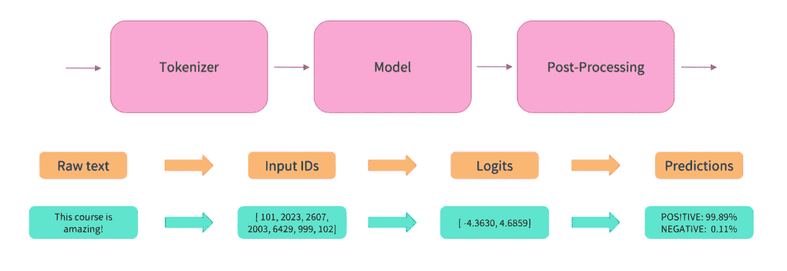
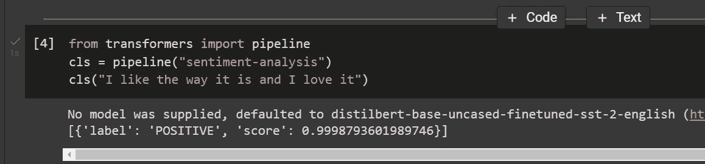
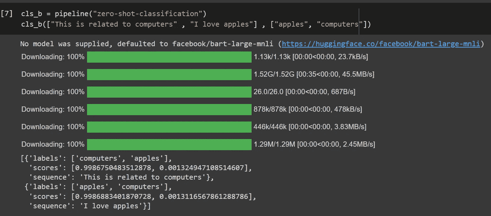
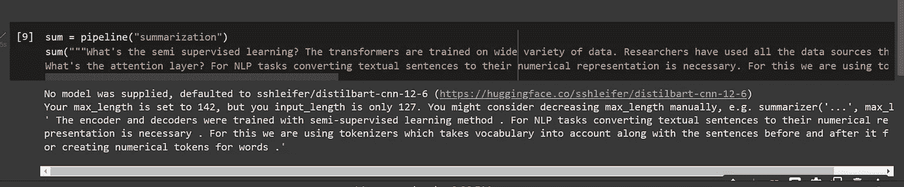
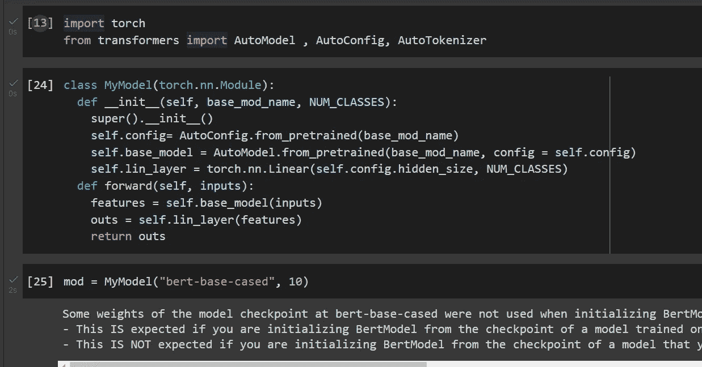

# 使用拥抱脸🤗PyTorch 变形金刚🔥对于 NLP 任务

> 原文：<https://medium.com/mlearning-ai/using-huggingface-transformers-with-pytorch-for-nlp-tasks-afc430190e22?source=collection_archive---------0----------------------->


Photo by [Claudio Testa](https://unsplash.com/@claudiotesta?utm_source=medium&utm_medium=referral) on [Unsplash](https://unsplash.com?utm_source=medium&utm_medium=referral)

我们无法想象没有变形金刚的 NLP，最初，它们是用于翻译任务的。但是，由于它们的半监督学习和注意力层，它们在分类、摘要和文本生成等其他任务上也表现出色。变形金刚能够从句子中获取上下文含义，并给我们预测。

训练这种高性能变压器是昂贵的，并且需要高计算能力。这是像 HuggingFace，Google，Faceboook research 这样的组织站出来训练这些模型的地方。他们把它们免费提供给公众使用。现在，我们可以选择预训练模型，并在此基础上进行迁移学习。

## 什么是半监督学习？

变压器接受各种数据的训练。研究人员使用了他们能想到的所有数据源来训练这些模型。这些变压器的初始架构没有监督学习的标签。编码器和解码器采用半监督学习方法进行训练。在这种方法中，模型自动确定标签。

## 关注层是什么？

对于 NLP 任务，将文本句子转换成数字表示是必要的。为此，我们使用了记号赋予器，它将词汇及其前后的句子考虑在内，为单词创建数字记号。

## 用于从变压器进行推断的公共管道



Huggingface 库提供了变形金刚类，在这个类中，我们可以从预先训练的模型中进行简单的推理，并使用最新的模型。

## 我们如何安装变压器

```
!pip -q install transformers 
```

## 让我们看看如何使用它们

这一次，让我们看看如何使用模型 3 行代码 transformers 库提供的管道模块，其中有预定义的方法，您可以在短短 3 行代码中获得输出

```
from transformers import pipeline 
cls = pipeline("sentiment-analysis")
cls("I like the way it is and I love it")
```



here we are getting sentiment analysis out of the box.

让我们看看我们还能利用这条管道做些什么

```
cls_b = pipeline("zero-shot-classification")
cls_b(["This is related to computers" , "I love apples"] , ["apples", "computers"])
```



让我们使用摘要管道来获得段落的摘要:

```
sum = pipeline("summarization")sum("""What's the semi supervised learning? The transformers are trained on wide variety of data. Researchers have used all the data sources they can think of to train these models. Initial architecture of these transformers didn't have labels for supervised learnings. The encoder and decoders were trained with semi-supervised learning method. In this method model determines labels automatically.What's the attention layer? For NLP tasks converting textual sentences to their numerical representation is necessary. For this we are using tokenizers which takes vocabulary into account along with the sentences before and after it for creating numerical tokens for words.""")[0]["summary_text"]
```



有各种可用的预定义管道，您可以借助以下内容进行推断:

*   `feature-extraction`(获取文本的矢量表示)
*   `fill-mask`
*   `ner`(命名实体识别)
*   `question-answering`
*   `sentiment-analysis`
*   `summarization`
*   `text-generation`
*   `translation`
*   `zero-shot-classification`

## 使用这些预先构建的模型来完成我们的任务

我们可以使用这些模型作为基础模型来为我们的任务构建模型。让我们看看如何在 PyTorch 中实现它🔥



笔记本链接:

[](https://colab.research.google.com/drive/1AFUqAc1uwF3xFYQUv_B2H8jOjGuhoXTh?usp=sharing) [## 谷歌联合实验室

链接到 colab.research.google.com](https://colab.research.google.com/drive/1AFUqAc1uwF3xFYQUv_B2H8jOjGuhoXTh?usp=sharing) 

> 感谢阅读我的博客:)关注更多，
> 祝你有美好的一天😃

[](/mlearning-ai/mlearning-ai-submission-suggestions-b51e2b130bfb) [## Mlearning.ai 提交建议

### 如何成为 Mlearning.ai 上的作家

medium.com](/mlearning-ai/mlearning-ai-submission-suggestions-b51e2b130bfb)