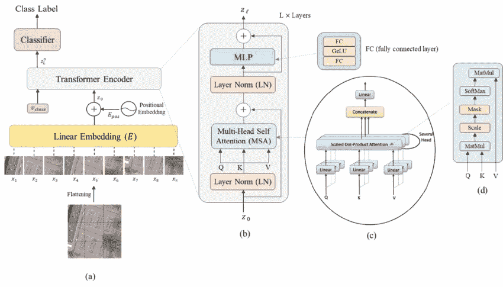
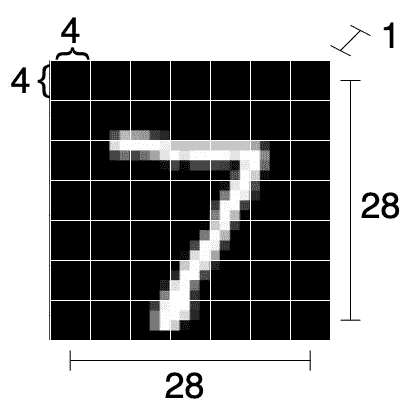
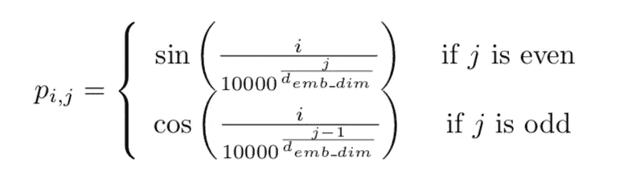
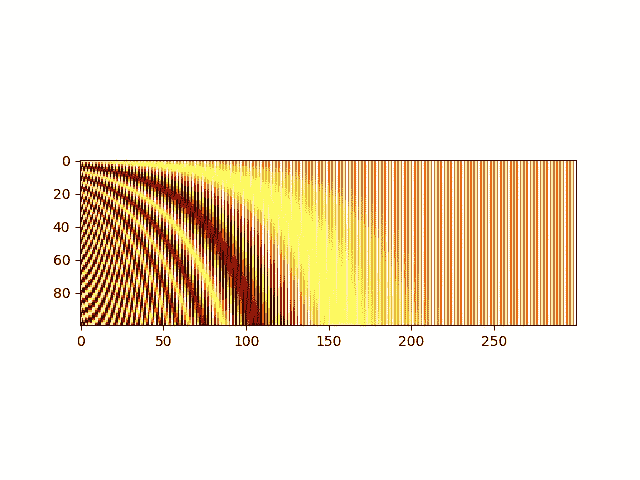
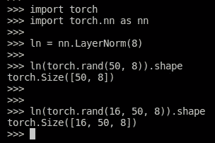
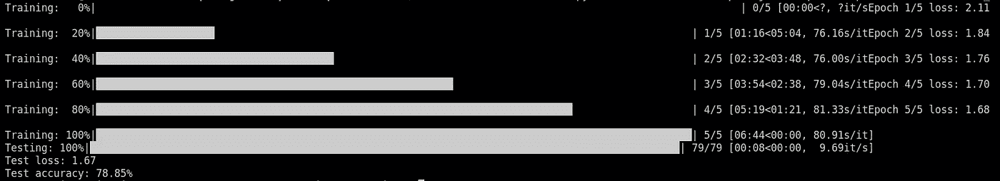

# 视觉变形金刚从零开始(PyTorch):一步一步的指南

> 原文：<https://medium.com/mlearning-ai/vision-transformers-from-scratch-pytorch-a-step-by-step-guide-96c3313c2e0c?source=collection_archive---------0----------------------->

视觉变形金刚(ViT)，自 Dosovitskiy 等人推出以来。艾尔。[参考文献](https://arxiv.org/abs/2010.11929)2020 年，在计算机视觉领域占据主导地位，首先在图像分类方面获得最先进的性能，随后在其他任务中也是如此。

然而，与其他架构不同，它们有点难以理解，尤其是如果您还不熟悉自然语言处理(NLP)中使用的转换器模型的话。

如果您对计算机视觉(CV)感兴趣，但仍然不熟悉 ViT 模型，请不要担心！我也是！

在这段简短的文字中，我将向您展示我是如何从头开始实现我的第一个 ViT 的(使用 PyTorch)，并且我将指导您完成一些调试，这将帮助您更好地可视化 ViT 中到底发生了什么。

虽然这篇文章是专门针对 ViT 的，但是你在这里会发现一些概念，例如多头自我注意(MSA)块，它们在人工智能的各个子领域中都存在，并且当前非常相关，例如 CV、NLP 等

# 定义任务

因为目标只是学习更多关于 ViT 架构的知识，所以明智的做法是选择一个简单且众所周知的任务和数据集。在我们的例子中，任务是由伟大的 **LeCun 等人对流行的 MNIST 数据集进行图像分类。艾尔。**[参考](http://yann.lecun.com/exdb/mnist/)。

如果你还不知道，MNIST 是一个手写数字([0–9])的数据集，全部包含在 28x28 二进制像素图像中。这个任务对于今天的算法来说是微不足道的，所以我们可以预期一个正确的实现将会执行得很好。

让我们从进口开始:

```
import numpy as np

from tqdm import tqdm, trange

import torch
import torch.nn as nn
from torch.optim import Adam
from torch.nn import CrossEntropyLoss
from torch.utils.data import DataLoader

from torchvision.transforms import ToTensor
from torchvision.datasets.mnist import MNIST

np.random.seed(0)
torch.manual_seed(0)
```

让我们创建一个**主函数**，它准备 MNIST 数据集，实例化一个模型，并为其训练 5 个时期。之后，在测试集上测量损耗和精度。

```
def main():
    # Loading data
    transform = ToTensor()

    train_set = MNIST(root='./../datasets', train=True, download=True, transform=transform)
    test_set = MNIST(root='./../datasets', train=False, download=True, transform=transform)

    train_loader = DataLoader(train_set, shuffle=True, batch_size=128)
    test_loader = DataLoader(test_set, shuffle=False, batch_size=128)

    # Defining model and training options
    device = torch.device("cuda" if torch.cuda.is_available() else "cpu")
    print("Using device: ", device, f"({torch.cuda.get_device_name(device)})" if torch.cuda.is_available() else "")
    model = MyViT((1, 28, 28), n_patches=7, n_blocks=2, hidden_d=8, n_heads=2, out_d=10).to(device)
    N_EPOCHS = 5
    LR = 0.005

    # Training loop
    optimizer = Adam(model.parameters(), lr=LR)
    criterion = CrossEntropyLoss()
    for epoch in trange(N_EPOCHS, desc="Training"):
        train_loss = 0.0
        for batch in tqdm(train_loader, desc=f"Epoch {epoch + 1} in training", leave=False):
            x, y = batch
            x, y = x.to(device), y.to(device)
            y_hat = model(x)
            loss = criterion(y_hat, y)

            train_loss += loss.detach().cpu().item() / len(train_loader)

            optimizer.zero_grad()
            loss.backward()
            optimizer.step()

        print(f"Epoch {epoch + 1}/{N_EPOCHS} loss: {train_loss:.2f}")

    # Test loop
    with torch.no_grad():
        correct, total = 0, 0
        test_loss = 0.0
        for batch in tqdm(test_loader, desc="Testing"):
            x, y = batch
            x, y = x.to(device), y.to(device)
            y_hat = model(x)
            loss = criterion(y_hat, y)
            test_loss += loss.detach().cpu().item() / len(test_loader)

            correct += torch.sum(torch.argmax(y_hat, dim=1) == y).detach().cpu().item()
            total += len(x)
        print(f"Test loss: {test_loss:.2f}")
        print(f"Test accuracy: {correct / total * 100:.2f}%")
```

现在我们有了这个模板，从现在开始，我们可以只关注模型(ViT)，它必须用形状( **N** x 1 x 28 x 28)对图像进行分类。

让我们从定义一个空的 *nn 开始。模块*。然后，我们将逐步填充这个类。

```
class MyViT(nn.Module):
  def __init__(self):
    # Super constructor
    super(MyViT, self).__init__()

  def forward(self, images):
    pass
```

# 前进传球

由于 Pytorch 和大多数 DL 框架都提供了*自动签名的*计算，我们只关心实现 ViT 模型的向前传递。因为我们已经定义了模型的优化器，所以框架将负责反向传播梯度和训练模型的参数。

当实现一个新的模型时，我喜欢在某个标签上保存一个架构的图片。这是我们从 **Bazi et 得到的 ViT 的参考图片。铝** (2021)[ [参考](https://www.researchgate.net/publication/348947034_Vision_Transformers_for_Remote_Sensing_Image_Classification):



The architecture of the ViT with specific details on the transformer encoder and the MSA block. Keep this picture in mind. Picture from [Bazi et. al.](https://www.researchgate.net/publication/348947034_Vision_Transformers_for_Remote_Sensing_Image_Classification)

通过该图，我们看到输入图像(a)被“切割”成大小相等的子图像。

每个这样的子图像经历线性嵌入。从那时起，每个子图像只是一个一维向量。

然后将位置嵌入添加到这些向量(记号)中。位置嵌入允许网络知道每个子图像最初在图像中的位置。没有这些信息，网络将无法知道每个这样的图像将被放置在哪里，从而导致潜在的错误预测！

然后，这些令牌与特殊的分类令牌一起被传递到变换器编码器块，每个编码器块包括:层标准化(LN ),随后是多头自关注(MSA)和残差连接。然后是第二个 LN，一个多层感知器(MLP)，再次是一个剩余连接。这些积木是背靠背连接的。

最后，分类 MLP 块仅用于特殊分类标记上的最终分类，该特殊分类标记在该过程结束时具有关于图像的全局信息。

让我们按照**的 6 个主要步骤来构建 ViT。**

## 步骤 1:修补和线性映射

transformer 编码器的开发考虑到了序列数据，例如英语句子。然而，图像不是序列。它只是，嗯…一个图像…那么我们如何对一个图像“排序”？我们把它分解成多个子图，把每个子图映射成一个向量！

我们通过简单地将大小为(N，C，H，W)(在我们的例子中为(N，1，28，28))的输入整形为大小为(N，#面片，面片维数)的输入来实现，其中面片的维数被相应地调整。

在这个例子中，我们将每个(1，28，28)分成 **7x7 个小块**(因此，每个大小为 4x4)。也就是说，我们将从单个图像中获得 7×7 = 49 个子图像。

因此，我们将输入(N，1，28，28)整形为:

> *(N，PxP，HxC/P x WxC/P) = (N，7x7，4x4) = (N，49，16)*

请注意，虽然每个小块都是大小为 1x4x4 的图片，但我们将其展平为 16 维向量。此外，在这种情况下，我们只有一个单一的颜色通道。如果我们有多个颜色通道，这些通道也会被展平到矢量中。



Raffiguration of how an image is split into patches. The 1x28x28 image is split into 49 (7x7) patches, each of size 16 (4x4x1)

我们修改我们的 **MyViT** 类，只实现修补。我们创建一个从头开始操作的方法。请注意，这是一种执行操作的低效方式，但是对于学习核心概念来说，代码是直观的。

```
def patchify(images, n_patches):
    n, c, h, w = images.shape

    assert h == w, "Patchify method is implemented for square images only"

    patches = torch.zeros(n, n_patches ** 2, h * w * c // n_patches ** 2)
    patch_size = h // n_patches

    for idx, image in enumerate(images):
        for i in range(n_patches):
            for j in range(n_patches):
                patch = image[:, i * patch_size: (i + 1) * patch_size, j * patch_size: (j + 1) * patch_size]
                patches[idx, i * n_patches + j] = patch.flatten()
    return patches
```

```
class MyViT(nn.Module):
  def __init__(self, chw=(1, 28, 28), n_patches=7):
    # Super constructor
    super(MyViT, self).__init__()

    # Attributes
    self.chw = chw # (C, H, W)
    self.n_patches = n_patches

    assert chw[1] % n_patches == 0, "Input shape not entirely divisible by number of patches"
    assert chw[2] % n_patches == 0, "Input shape not entirely divisible by number of patches"

  def forward(self, images):
    patches = patchify(images, self.n_patches)
    return patches
```

类构造函数现在让类知道我们的输入图像的大小(通道数、高度和宽度)。注意，在这个实现中， *n_patches* 变量是我们将在宽度和高度上找到的面片数(在我们的例子中是 7，因为我们将图像分成 7x7 个面片)。

我们可以用一个简单的主程序来测试我们的类的功能:

```
if __name__ == '__main__':
  # Current model
  model = MyViT(
    chw=(1, 28, 28),
    n_patches=7
  )

  x = torch.randn(7, 1, 28, 28) # Dummy images
  print(model(x).shape) # torch.Size([7, 49, 16])
```

现在我们有了展平的面片，我们可以通过线性映射来映射它们。虽然每个小块是 4×4 = 16 维向量，但是线性映射可以映射到任何任意大小的向量。因此，我们给我们的类构造函数添加了一个参数，称为 *hidden_d* 表示“隐藏维度”。

在这个例子中，我们将使用 8 个隐藏维度，但是原则上，任何数字都可以放在这里。因此，我们将把每个 16 维的面片映射到一个 8 维的面片。

我们简单地创建一个*神经网络。线性*层，并在我们的正向函数中调用它。

```
class MyViT(nn.Module):
  def __init__(self, chw=(1, 28, 28), n_patches=7):
    # Super constructor
    super(MyViT, self).__init__()

    # Attributes
    self.chw = chw # (C, H, W)
    self.n_patches = n_patches

    assert chw[1] % n_patches == 0, "Input shape not entirely divisible by number of patches"
    assert chw[2] % n_patches == 0, "Input shape not entirely divisible by number of patches"
    self.patch_size = (chw[1] / n_patches, chw[2] / n_patches)

    # 1) Linear mapper
    self.input_d = int(chw[0] * self.patch_size[0] * self.patch_size[1])
    self.linear_mapper = nn.Linear(self.input_d, self.hidden_d)

  def forward(self, images):
    patches = patchify(images, self.n_patches)
    tokens = self.linear_mapper(patches)
    return tokens
```

请注意，我们通过(16，8)线性映射器(或矩阵)运行(N，49，16)张量。线性运算只发生在最后一个维度上。

## 步骤 2:添加分类令牌

如果您仔细观察架构图，您会注意到还有一个“ *v_class* ”令牌被传递给了 Transformer 编码器。这是什么？

简单地说，这是我们添加到模型中的一个特殊令牌，它的作用是捕获关于其他令牌的信息。这将在 MSA 块中发生(稍后)。当关于所有其他标记的信息将出现在这里时，我们将能够仅使用这个特殊的标记来对图像进行分类。特殊令牌的初始值(馈送给变换器编码器的那个)是需要学习的模型的参数。

这是一个很酷的变形金刚概念！如果我们想做另一个下游任务，我们只需要为另一个下游任务添加另一个特殊的令牌(例如，将一个数字分类为高于 5 或低于 5)和一个接受这个新令牌作为输入的分类器。很聪明，对吧？

我们现在可以向我们的模型添加一个参数，并将我们的(N，49，8)令牌张量转换为(N，50，8)张量(我们向每个序列添加特殊令牌)。

```
class MyViT(nn.Module):
  def __init__(self, chw=(1, 28, 28), n_patches=7):
    # Super constructor
    super(MyViT, self).__init__()

    # Attributes
    self.chw = chw # (C, H, W)
    self.n_patches = n_patches

    assert chw[1] % n_patches == 0, "Input shape not entirely divisible by number of patches"
    assert chw[2] % n_patches == 0, "Input shape not entirely divisible by number of patches"
    self.patch_size = (chw[1] / n_patches, chw[2] / n_patches)

    # 1) Linear mapper
    self.input_d = int(chw[0] * self.patch_size[0] * self.patch_size[1])
    self.linear_mapper = nn.Linear(self.input_d, self.hidden_d)

    # 2) Learnable classifiation token
    self.class_token = nn.Parameter(torch.rand(1, self.hidden_d))

  def forward(self, images):
    patches = patchify(images, self.n_patches)
    tokens = self.linear_mapper(patches)

    # Adding classification token to the tokens
    tokens = torch.stack([torch.vstack((self.class_token, tokens[i])) for i in range(len(tokens))])
    return tokens
```

请注意，分类标记作为每个序列的第一个标记。当我们随后检索分类令牌以提供给最终的 MLP 时，记住这一点很重要。

## 步骤 3:位置编码

正如预期的那样，位置编码允许模型理解每个补片在原始图像中的位置。虽然理论上有可能学习这样的位置嵌入，但是 Vaswani 等人以前的工作。艾尔。【[参考文献](https://arxiv.org/abs/1706.03762)建议我们可以只把正弦和余弦波相加。

具体来说，位置编码将低频值添加到第一维度，将高频值添加到后一维度。

在每个序列中，对于令牌 *i* ,我们向其*第 j 个*坐标添加以下值:



Value to be added to the i-th tensor in its j-th coordinate. [Image source](https://blogs.oracle.com/ai-and-datascience/post/multi-head-self-attention-in-nlp).

这种位置嵌入是序列中元素数量和每个元素维数的函数。因此，它总是一个二维张量或“矩形”。

这里有一个简单的函数，在给定记号的数量和每个记号的维数的情况下，输出一个矩阵，其中每个坐标(I，j)是要添加到维度 j 中的记号 I 的值。

```
def get_positional_embeddings(sequence_length, d):
    result = torch.ones(sequence_length, d)
    for i in range(sequence_length):
        for j in range(d):
            result[i][j] = np.sin(i / (10000 ** (j / d))) if j % 2 == 0 else np.cos(i / (10000 ** ((j - 1) / d)))
    return result

if __name__ == "__main__":
  import matplotlib.pyplot as plt

  plt.imshow(get_positional_embeddings(100, 300), cmap="hot", interpolation="nearest")
  plt.show()
```



Heatmap of Positional embeddings for one hundred 300-dimensional samples. Samples are on the y-axis, whereas the dimensions are on the x-axis. Darker regions show higher values.

从我们绘制的热图中，我们看到所有的“水平线”都互不相同，因此可以区分样品。

在线性映射和添加类标记之后，我们现在可以将这种位置编码添加到我们的模型中。

```
class MyViT(nn.Module):
  def __init__(self, chw=(1, 28, 28), n_patches=7):
    # Super constructor
    super(MyViT, self).__init__()

    # Attributes
    self.chw = chw # (C, H, W)
    self.n_patches = n_patches

    assert chw[1] % n_patches == 0, "Input shape not entirely divisible by number of patches"
    assert chw[2] % n_patches == 0, "Input shape not entirely divisible by number of patches"
    self.patch_size = (chw[1] / n_patches, chw[2] / n_patches)

    # 1) Linear mapper
    self.input_d = int(chw[0] * self.patch_size[0] * self.patch_size[1])
    self.linear_mapper = nn.Linear(self.input_d, self.hidden_d)

    # 2) Learnable classifiation token
    self.class_token = nn.Parameter(torch.rand(1, self.hidden_d))

    # 3) Positional embedding
    self.pos_embed = nn.Parameter(torch.tensor(get_positional_embeddings(self.n_patches ** 2 + 1, self.hidden_d)))
    self.pos_embed.requires_grad = False

  def forward(self, images):
    patches = patchify(images, self.n_patches)
    tokens = self.linear_mapper(patches)

    # Adding classification token to the tokens
    tokens = torch.stack([torch.vstack((self.class_token, tokens[i])) for i in range(len(tokens))])

    # Adding positional embedding
    pos_embed = self.pos_embed.repeat(n, 1, 1)
    out = tokens + pos_embed
    return out
```

我们将位置嵌入定义为模型的一个参数(我们不会通过将其 requires_grad 设置为 False 来更新它)。注意，在前向方法中，由于记号的大小为(N，50，8)，我们必须重复 N 次(50，8)位置编码矩阵。

## 步骤 4:编码器模块(第 1/2 部分)

这可能是最难的一步。编码器模块将我们的当前张量[N，S，D]作为输入，并输出相同维数的张量。

编码器模块的第一部分对我们的令牌应用层标准化，然后是多头自我关注，最后添加一个残差连接。

**图层归一化**

图层归一化是一个常用的模块，它在给定一个输入的情况下，减去其平均值，然后除以标准差。

然而，我们通常对(N，d)输入应用层归一化，其中 d 是维度。幸运的是，图层规范化模块也可以推广到多个维度，请看:



nn.LayerNorm can be applied in multiple dimensions. We can normalize fifty 8-dimensional vectors, but we can also normalize sixteen by fifty 8-dimensional vectors.

图层规范化仅适用于最后一个尺寸。因此，我们可以使我们的每个 50×8 矩阵(代表单个序列)的均值为 0，标准差为 1。在我们通过 LN 运行我们的(N，50，8)张量之后，我们仍然得到相同的维数。

**多头自我关注**

我们现在需要实现架构图的子图 *c* 。那里发生了什么事？

简而言之:对于单个图像，我们希望基于与其他图像的相似性度量来更新每个图像块。我们通过将每个面片(在我们的例子中现在是一个 8 维向量)线性映射到 3 个不同的向量来做到这一点: **q** 、 **k** 和 **v** (查询、键、值)。

然后，对于单个补丁，我们将计算其 **q** 向量与所有 **k** 向量之间的点积，除以这些向量的维数的平方根(sqrt(8))，softmax 这些所谓的*注意力线索*，最后将每个注意力线索乘以与不同的 **k** 向量相关联的 **v** 向量，并求和。

以这种方式，每个小块采用基于其与其他小块的相似性(在线性映射到 **q** 、 **k** 和 **v** 之后)的新值。然而，这整个过程是在我们当前 8 维面片的 **H** 子向量上执行 **H** 次，其中 **H** 是**头的数量。**如果你对注意力和多头注意力机制不熟悉，我建议你阅读[这个由](https://data-science-blog.com/blog/2021/04/07/multi-head-attention-mechanism/) [Yasuto Tamura](https://data-science-blog.com/blog/author/yasuto/) 写的好帖子。

一旦获得所有结果，它们就被连接在一起。最后，结果通过一个线性层(为了更好的测量)。

注意力背后的直观想法是，它允许对输入之间的关系进行建模。使“0”成为零的不是单个像素值，而是它们如何相互关联。

由于执行了相当多的计算，因此有必要为 MSA 创建一个新类:

```
class MyMSA(nn.Module):
    def __init__(self, d, n_heads=2):
        super(MyMSA, self).__init__()
        self.d = d
        self.n_heads = n_heads

        assert d % n_heads == 0, f"Can't divide dimension {d} into {n_heads} heads"

        d_head = int(d / n_heads)
        self.q_mappings = nn.ModuleList([nn.Linear(d_head, d_head) for _ in range(self.n_heads)])
        self.k_mappings = nn.ModuleList([nn.Linear(d_head, d_head) for _ in range(self.n_heads)])
        self.v_mappings = nn.ModuleList([nn.Linear(d_head, d_head) for _ in range(self.n_heads)])
        self.d_head = d_head
        self.softmax = nn.Softmax(dim=-1)

    def forward(self, sequences):
        # Sequences has shape (N, seq_length, token_dim)
        # We go into shape    (N, seq_length, n_heads, token_dim / n_heads)
        # And come back to    (N, seq_length, item_dim)  (through concatenation)
        result = []
        for sequence in sequences:
            seq_result = []
            for head in range(self.n_heads):
                q_mapping = self.q_mappings[head]
                k_mapping = self.k_mappings[head]
                v_mapping = self.v_mappings[head]

                seq = sequence[:, head * self.d_head: (head + 1) * self.d_head]
                q, k, v = q_mapping(seq), k_mapping(seq), v_mapping(seq)

                attention = self.softmax(q @ k.T / (self.d_head ** 0.5))
                seq_result.append(attention @ v)
            result.append(torch.hstack(seq_result))
        return torch.cat([torch.unsqueeze(r, dim=0) for r in result])
```

注意，对于每个头部，我们创建不同的 Q、K 和 V 映射函数(在我们的例子中是大小为 4x4 的方阵)。

由于我们的输入将是大小为(N，50，8)的序列，并且我们只使用 2 个头，我们将在某个点有一个(N，50，2，4)张量，使用一个 *nn。线性(4，4)* 模上，然后回来，串联后，得到一个(N，50，8)张量。

还要注意，使用循环并不是计算多头自我关注的最有效方式，但它使代码更清晰，便于学习。

**残留连接**

剩余连接只是将原始输入添加到一些计算的结果中。这直观地允许网络变得更强大，同时还保留了模型可以近似的一组可能的函数。

我们将添加一个剩余连接，它将把我们原来的(N，50，8)张量添加到 LN 和 MSA 之后获得的(N，50，8)张量中。是时候创建 transformer encoder block 类了，它将是 MyViT 类的一个组件:

```
class MyViTBlock(nn.Module):
    def __init__(self, hidden_d, n_heads, mlp_ratio=4):
        super(MyViTBlock, self).__init__()
        self.hidden_d = hidden_d
        self.n_heads = n_heads

        self.norm1 = nn.LayerNorm(hidden_d)
        self.mhsa = MyMSA(hidden_d, n_heads)

    def forward(self, x):
        out = x + self.mhsa(self.norm1(x))
        return out
```

唷，那是相当多的工作！但我保证这是最难的部分。从现在开始，一切都在走下坡路。

有了这种自我关注机制，类标记(N 个序列中每个序列的第一个标记)现在有了关于所有其他标记的信息！

## 步骤 5:编码器模块(第 2/2 部分)

所有留给变换器编码器的只是我们已经拥有的和我们通过另一个 LN 和 MLP 传递当前张量后得到的之间的简单剩余连接。MLP 由两个图层组成，其中隐藏图层通常是其四倍大(这是一个参数)

```
class MyViTBlock(nn.Module):
    def __init__(self, hidden_d, n_heads, mlp_ratio=4):
        super(MyViTBlock, self).__init__()
        self.hidden_d = hidden_d
        self.n_heads = n_heads

        self.norm1 = nn.LayerNorm(hidden_d)
        self.mhsa = MyMSA(hidden_d, n_heads)
        self.norm2 = nn.LayerNorm(hidden_d)
        self.mlp = nn.Sequential(
            nn.Linear(hidden_d, mlp_ratio * hidden_d),
            nn.GELU(),
            nn.Linear(mlp_ratio * hidden_d, hidden_d)
        )

    def forward(self, x):
        out = x + self.mhsa(self.norm1(x))
        out = out + self.mlp(self.norm2(out))
        return out
```

我们确实可以看到，编码器模块输出相同维数的张量:

```
if __name__ == '__main__':
  model = MyVitBlock(hidden_d=8, n_heads=2)

  x = torch.randn(7, 50, 8)  # Dummy sequences
  print(model(x).shape)      # torch.Size([7, 50, 8])
```

既然编码器模块已经准备好了，我们只需要将它插入到我们更大的 ViT 模型中，它负责在变压器模块之前进行修补，并在之后进行分类。

我们可以有任意数量的变压器模块。在这个例子中，为了简单起见，我将只使用 2。我们还添加了一个参数，以了解每个编码器模块将使用多少头。

```
class MyViT(nn.Module):
    def __init__(self, chw, n_patches=7, n_blocks=2, hidden_d=8, n_heads=2, out_d=10):
        # Super constructor
        super(MyViT, self).__init__()

        # Attributes
        self.chw = chw # ( C , H , W )
        self.n_patches = n_patches
        self.n_blocks = n_blocks
        self.n_heads = n_heads
        self.hidden_d = hidden_d

        # Input and patches sizes
        assert chw[1] % n_patches == 0, "Input shape not entirely divisible by number of patches"
        assert chw[2] % n_patches == 0, "Input shape not entirely divisible by number of patches"
        self.patch_size = (chw[1] / n_patches, chw[2] / n_patches)

        # 1) Linear mapper
        self.input_d = int(chw[0] * self.patch_size[0] * self.patch_size[1])
        self.linear_mapper = nn.Linear(self.input_d, self.hidden_d)

        # 2) Learnable classification token
        self.class_token = nn.Parameter(torch.rand(1, self.hidden_d))

        # 3) Positional embedding
        self.register_buffer('positional_embeddings', get_positional_embeddings(n_patches ** 2 + 1, hidden_d), persistent=False)

        # 4) Transformer encoder blocks
        self.blocks = nn.ModuleList([MyViTBlock(hidden_d, n_heads) for _ in range(n_blocks)])

    def forward(self, images):
        # Dividing images into patches
        n, c, h, w = images.shape
        patches = patchify(images, self.n_patches).to(self.positional_embeddings.device)

        # Running linear layer tokenization
        # Map the vector corresponding to each patch to the hidden size dimension
        tokens = self.linear_mapper(patches)

        # Adding classification token to the tokens
        tokens = torch.cat((self.class_token.expand(n, 1, -1), tokens), dim=1)

        # Adding positional embedding
        out = tokens + self.positional_embeddings.repeat(n, 1, 1)

        # Transformer Blocks
        for block in self.blocks:
            out = block(out)

        return out
```

同样，如果我们通过我们的模型运行一个随机的(7，1，28，28)张量，我们仍然得到一个(7，50，8)张量。

## 步骤 6:MLP 分类

最后，我们可以从我们的 N 个序列中提取分类标记(第一个标记)，并使用每个标记获得 N 个分类。

由于我们决定每个记号是一个 8 维向量，并且由于我们有 10 个可能的数字，我们可以将分类 MLP 实现为一个简单的 8×10 矩阵，用 SoftMax 函数激活。

```
class MyViT(nn.Module):
    def __init__(self, chw, n_patches=7, n_blocks=2, hidden_d=8, n_heads=2, out_d=10):
        # Super constructor
        super(MyViT, self).__init__()

        # Attributes
        self.chw = chw # ( C , H , W )
        self.n_patches = n_patches
        self.n_blocks = n_blocks
        self.n_heads = n_heads
        self.hidden_d = hidden_d

        # Input and patches sizes
        assert chw[1] % n_patches == 0, "Input shape not entirely divisible by number of patches"
        assert chw[2] % n_patches == 0, "Input shape not entirely divisible by number of patches"
        self.patch_size = (chw[1] / n_patches, chw[2] / n_patches)

        # 1) Linear mapper
        self.input_d = int(chw[0] * self.patch_size[0] * self.patch_size[1])
        self.linear_mapper = nn.Linear(self.input_d, self.hidden_d)

        # 2) Learnable classification token
        self.class_token = nn.Parameter(torch.rand(1, self.hidden_d))

        # 3) Positional embedding
        self.register_buffer('positional_embeddings', get_positional_embeddings(n_patches ** 2 + 1, hidden_d), persistent=False)

        # 4) Transformer encoder blocks
        self.blocks = nn.ModuleList([MyViTBlock(hidden_d, n_heads) for _ in range(n_blocks)])

        # 5) Classification MLPk
        self.mlp = nn.Sequential(
            nn.Linear(self.hidden_d, out_d),
            nn.Softmax(dim=-1)
        )

    def forward(self, images):
        # Dividing images into patches
        n, c, h, w = images.shape
        patches = patchify(images, self.n_patches).to(self.positional_embeddings.device)

        # Running linear layer tokenization
        # Map the vector corresponding to each patch to the hidden size dimension
        tokens = self.linear_mapper(patches)

        # Adding classification token to the tokens
        tokens = torch.cat((self.class_token.expand(n, 1, -1), tokens), dim=1)

        # Adding positional embedding
        out = tokens + self.positional_embeddings.repeat(n, 1, 1)

        # Transformer Blocks
        for block in self.blocks:
            out = block(out)

        # Getting the classification token only
        out = out[:, 0]

        return self.mlp(out) # Map to output dimension, output category distribution
```

我们模型的输出现在是一个(N，10)张量。万岁，我们完成了！

# 结果

我们修改了主程序中唯一一行之前没有定义的代码。

```
model = MyVit((1, 28, 28), n_patches=7, n_blocks=2, hidden_d=8, n_heads=2, out_d=10).to(device)
```

我们现在只需要运行训练和测试循环，看看我们的模型表现如何。如果您已经手动设置了 torch seed(设置为 0)，您应该打印出以下内容:



Training losses, test loss, and test accuracy obtained.

就是这样！我们现在已经从头开始创建了一个 ViT。我们的模型在仅仅 5 个历元和很少的参数下就达到了 80%的准确率。

你可以在下面的[链接](https://github.com/BrianPulfer/PapersReimplementations/blob/master/vit/vit_torch.py)找到完整的脚本。考虑鼓掌👏如果你觉得这个故事有用，让我知道你是否认为有什么不清楚的地方！

[](/mlearning-ai/mlearning-ai-submission-suggestions-b51e2b130bfb) [## Mlearning.ai 提交建议

### 如何成为 Mlearning.ai 上的作家

medium.com](/mlearning-ai/mlearning-ai-submission-suggestions-b51e2b130bfb)