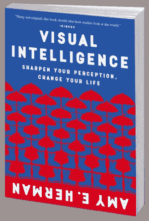

# 视觉智能技术在数据科学项目中的应用

> 原文：<https://medium.com/mlearning-ai/visual-intelligence-techniques-applied-on-data-science-projects-2ed1423a1161?source=collection_archive---------10----------------------->

Amy E. Herman 在数据科学项目中应用“视觉智能:增强您的感知，改变我们的生活”的技术。

[source](https://www.visualintelligencebook.com/the-book/)

大家好！

最近，我一直忙于发展成为数据科学家的技能，今天，我想分享更多关于我的一个激情:如何侵入大脑。它与数据科学领域没有直接关系，然而，一旦数据工作需要高水平的批判和分析思维，如果你想 ***提高你的解决问题的能力*** ，下面的段落会非常有用。我希望你喜欢它！！！

不再拖延，我想和你分享的是我从我读过的一本最好的书中摘录的一些笔记:[“视觉智能:提高你的感知，改变你的生活”，作者艾米·赫尔曼](https://www.visualintelligencebook.com/the-book/)

这是一本非常简单易懂的书，有许多指导范例可以练习。总的来说，这本书使用绘画来引导读者通过一种新的方式来增强视觉感知，并意识到我们周围的世界是如何被感知的。

如果你喜欢深入思维过程的海洋，如果你想对你周围的世界有一个更加中立的看法，我强烈推荐你阅读这本书。现在，我将分享一些要点，几行之后，我将建议您在数据科学项目中使用它们的*方法*:

为了不偏不倚地分析画作，这本书教了一些我们必须自问的问题。这些是我们必须做的一些调查:

***1 —我的期望是什么？我想我需要找到什么？***

***2 —谁？什么？在哪里？什么时候？***

3 —我在假设什么？

我是否从所有不同的角度看待这个问题？

***5 —缺什么？***

现在，我将向您简要介绍(在数据科学背景下)每个要点，然后举一个例子说明如何将这些要点应用到您自己的项目中:

# 1 —我的期望是什么？我想我需要找到什么？

***数据科学不是要应用机器学习(ML)和深度学习(DL)，数据科学就是要解决问题*** ！ ***ML 和 DL 只是解决具体问题的工具***；此外，并非所有数据科学问题都需要 ML 或 DL 模型。事实上，在现实世界中，情况恰恰相反:许多数据科学问题可以通过“仅仅”一个良好的探索性数据分析(EDA)来解决。

但是我们为什么要谈论它呢？因为 ***你期望找到的东西扭曲了你对问题的认知*** 。如果你甚至在分析问题之前就确定你需要 ML 或 DL，也许你最终会解决一个不同于你应该解决的问题。我来重新表述一下: ***正确的做法是找到解决问题的工具，而不是用工具*** 找到要解决的问题。而且再一次， *ML 和 DL 只是工具*！

***口头禅是“最重要的是解决问题”，无论是使用 ML 模型、DL 模型、仪表板还是一张纸*** ！不要迷失在时髦和花哨词汇的海洋中！

# ***2 —谁？什么？在哪里？什么时候？***

***“谁有这个问题？”*记住 ***你一定要解决真正的问题，而不是你认为的问题！*****

***“什么问题？”*** 表示需要对问题进行详细描述。问题定义越清晰、越明确，你的解决方案就越有可能达到预期的效果。

***“这个问题是何时何地出现的？”*** 与全面理解问题产生的背景相关，因此，给你一个关于你将要解决的问题的扩展视角。

# 3 —我在假设什么？

在深入分析问题并提出解决问题的最佳方案后，问自己一个问题是至关重要的:“我在这个方案中假设了什么？” 。请注意，几乎每个解决方案都有内在的假设。而且， ***一旦意识到这些假设是至关重要的，如果它们不是真的，整个解决方案将是无用的。***

在投资时间和金钱在一些“最佳解决方案”上之前，试着总是验证你的假设。

# 4-我是否从所有不同的角度看问题？

不同背景的人和在不同背景下面临相同问题的人可能会对问题有不同的看法。他们是反馈和解决方案改进的最丰富来源之一。

理想情况下，一旦出现更好的解决方案，在确定解决问题的最佳方法之前，考虑这些观点。

# 5 —缺少什么？

在我们的数据科学案例中， ***我们遗漏了哪些数据(或信息)？哪些数据(或信息)目前不可用，可能与解决我们的问题有关？*** 这个问题可以给我们提供反馈，告诉我们必须收集哪些数据(或信息),同样，我们必须在哪里搜索这些数据。记住“*(数据)垃圾入，(数据)垃圾出*”。*我们拥有的数据越多，我们的解决方案就越好。*

在这里，您可以查看我的一个数据科学项目 中的 [*的上述思维模式的快速实际应用:*](https://github.com/ds-gustavo-cunha/Insiders-Project/tree/master/Insiders_Clustering)

## 1 —我的期望是什么？我想我需要找到什么？

了解客户细分的工作原理，并尝试根据可用数据对客户进行聚类。

## ***2 —谁？什么？在哪里？什么时候？***

***“谁有这个问题？”*** :营销团队。

***“有什么问题？”*** :营销团队意识到，一些客户购买更贵的产品的频率很高，为公司的收入贡献了很大一部分。基于这种认识，营销团队将为公司基础中的最佳客户推出一个忠诚计划，称为内部人员。

***“这个问题是何时何地出现的？”*** :一年后，营销团队试图增加最优秀客户的销售和购买频率。

## 3 —我在假设什么？

一个例子*是“不考虑客户 id 未知的发票，因为我们可能想要确定谁是给定的客户”。*

## 我从所有不同的角度看问题了吗？

在这个特殊的项目中，一旦数据集来自 Kaggle，这是不可能的。☹

## 5 —缺少什么？

一个例子是“没有关于为营销团队部署解决方案的最佳格式以及客户需要多长时间集群化的明确信息”。

嗯，这些只是我关于如何在数据科学项目中应用一些书本知识的建议。你可以重新表述要点，使其适应你的项目环境。需要记住的关键点是: ***我们对问题的理解和对我们解决方案范围的定义越好，我们在现实世界中的结果就越好。***

作为对那些已经阅读(或将阅读)这本书的人的最后一个提示，我分享了我坚持实践这些概念的日常训练:

1 —休息五分钟；

2 —在[日报艺术 app](https://play.google.com/store/apps/details?id=com.moiseum.dailyart2&hl=en&gl=US) 或[日报艺术杂志网站](https://www.dailyartmagazine.com/)打开一幅画；

3 —逐步回答前面的每一个问题。

我希望你喜欢读这篇文章，它对你有点用处。

如果有问题或反馈，请随时发表评论。你也可以通过我的 LinkedIn 个人资料联系我。

***感谢阅读……***

参考资料:

e .赫尔曼，2016 年。视觉上的融合:艺术与生活的融合。第 8 版。扎哈尔。

 [## Mlearning.ai 提交建议

### 如何成为 Mlearning.ai 上的作家

medium.com](/mlearning-ai/mlearning-ai-submission-suggestions-b51e2b130bfb)