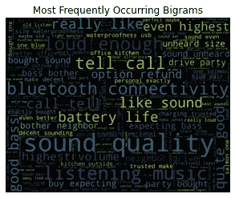
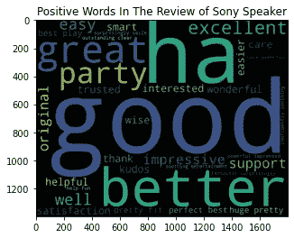

# 网络抓取和文字云(NLP 技术)|亚马逊产品评论

> 原文：<https://medium.com/mlearning-ai/web-scraping-word-cloud-nlp-techniques-amazon-product-review-99c1d44e58e8?source=collection_archive---------1----------------------->

作为一名网上购物者，我相信你通常会在购买之前阅读其他买家的评论。从本文中，您将了解自然语言处理(NLP)技术如何帮助您从网站中提取和解析数据以供研究和学习，并最终使用 matplotlib 创建单词云(又名标签云)。我选择了[索尼 SRS-XB13 超低音无线便携式紧凑型扬声器 IP67 防水蓝牙](https://www.amazon.com/Sony-SRS-XB13-Waterproof-Bluetooth-SRSXB13/dp/B08ZJ6DQNY/ref=cm_cr_arp_d_product_top?ie=UTF8&th=1)来进行情绪分析(确定积极参与和消极参与的比例)。


Source: [Pexels@Ekrulila](https://www.pexels.com/photo/person-holding-white-and-brown-newspaper-3957616/)

# 步骤 1:提取并在本地保存网页🔏

使用[请求](https://docs.python-requests.org/en/latest/)和[美汤](https://www.crummy.com/software/BeautifulSoup/bs4/doc/)库从选定的 URL 中捕获 HTML 页面的内容。

```
import requests
from bs4 import BeautifulSoup as bs # for web scraping# Creating empty review list
sony_speaker_reviews = []
for i in range(1,30):
    speaker = []
    url = "[https://www.amazon.com/Sony-SRS-XB13-Waterproof-Bluetooth-SRSXB13/dp/B08ZJ6DQNY/ref=cm_cr_arp_d_product_top?ie=UTF8&th=1](https://www.amazon.com/Sony-SRS-XB13-Waterproof-Bluetooth-SRSXB13/dp/B08ZJ6DQNY/ref=cm_cr_arp_d_product_top?ie=UTF8&th=1)"+str(i)
    header={'User-Agent': 'Mozilla/5.0 (Windows NT 10.0; Win64; x64) AppleWebKit/537.36 (KHTML, like Gecko) Chrome/77.0.3865.90 Safari/537.36'}
    response = requests.get(url,headers = header)
    # Creating soup object to iterate over the extracted content
    soup = bs(response.text,"lxml")
    # Extract the content under the specific tag
    reviews = soup.find_all("div",{"data-hook":"review-collapsed"})
    for i in range(len(reviews)):
        speaker.append(reviews[i].text)
    # Adding the reviews of one page to empty list which in future contains all the reviews
    sony_speaker_reviews += speaker# Writing reviews in a text file
with open('sony_speaker_reviews.txt','w', encoding = 'utf8') as output:
    output.write(str(sony_speaker_reviews))
```

# 步骤 2:数据清理和特征 Extraction🧹

为了清理数据，我们需要将所有评论合并到一个段落中，将所有单词改为小写，并删除不需要的符号。

此外，我们可以使用**词干**来精简单词，抓住单词的基本意思。单词“supporting”和“supporter”共用词根“support”或者，你可以使用**词汇化**，因为它会给你一个完整的有意义的英语单词，而不仅仅是一个单词的片段。例如“买方”而不是“不夜”。🌵

在平时的口语和写作中，我们经常使用冠词、代词、介词和连词来造句。这些词被称为停用词🛑，它们是通用的，不那么重要；因此，我们需要在进行分析之前将它们过滤掉。如果您正在分析的内容是英语，请确保选择`english`作为语言，因为该语料库也包含其他语言的停用词。

```
import re
import nltk
nltk.download('wordnet')
from nltk.stem.wordnet import WordNetLemmatizer
nltk.download('omw-1.4')
nltk.download("stopwords")
from nltk.corpus import stopwords# Joining all the reviews into single paragraph 
sn_rev_string = " ".join(sony_speaker_reviews)# Change to lower case and removing unwanted symbols incase if exists
sn_rev_string = re.sub("[^A-Za-z" "]+"," ",sn_rev_string).lower()
sn_rev_string = re.sub("[0-9" "]+"," ",sn_rev_string)# words that contained in sony speaker reviews
sn_reviews_words = sn_rev_string.split(" ")# Lemmatizing
wordnet = WordNetLemmatizer()
sn_reviews_words=[wordnet.lemmatize(word) for word in sn_reviews_words]# Filtering Stop Words
stop_words = set(stopwords.words("english"))
stop_words.update(['amazon','product','speaker','sony'])
sn_reviews_words = [w for w in sn_reviews_words if not w.casefold() in stop_words]
```

当我们分析文本时，我们需要按单词或句子对文本进行标记/分离。通过单词标记可以帮助我们确定经常出现的单词。同时，通过句子来标记可以帮助你看到这些单词是如何相互联系的，并看到更多的上下文。我们可以用**标记化**创建 **N 元语法**。例如，从句子“我喜欢学习数据科学。”，单词将是:“我”，“爱”，“学习”，“关于”，“数据”，“科学”。一个二元模型可能是:“我爱”，“爱学习”，或者“数据科学”。然而，三元模型)就像“我喜欢学习”，或者“关于数据科学”。


Source: [Pexels@Towfiqu barbhuiya](https://www.pexels.com/photo/five-yellow-stars-on-blue-and-pink-background-9821386/)

另一方面，**词频逆文档频率(TFIDF)** 强调很少出现但非常重要的 n 元语法。🏹

> TFIDF = TF x IDF
> 
> 词频(TF):一个词在文档中出现的次数。
> 
> 逆文档频率(IDF):一个词对整个语料库的重要性；log(文档总数/包含该术语的文档数)

当 n-gram 在文档中具有高频率而在语料库中具有低文档频率时，TFIDF 得分高。

例如，在一个 3000 字的文档中，“编码”一词出现了 45 次。假设在 10，000 个文档的语料库中有 25 个文档包含术语“编码”。

TF(编码)= 45/3000 = 0.015

IDF(编码)= log (10，000/25) = 2.60

TFIDF(编码)= 0.015 * 2.60 = 0.039

下面是创建二元模型并使用 TF-IDF 方法为每个二元模型分配权重的代码。

```
from sklearn.feature_extraction.text import TfidfVectorizer# TFIDF: bigram
bigrams_list = list(nltk.bigrams(sn_reviews_words))
bigram = [' '.join(tup) for tup in bigrams_list]vectorizer = TfidfVectorizer(bigram,use_idf=True,ngram_range=(2,2))
X = vectorizer.fit_transform(bigram)
vectorizer.vocabulary_
sum_words = X.sum(axis=0) 
words_freq = [(word, sum_words[0, idx]) for word, idx in vectorizer.vocabulary_.items()]
words_freq = sorted(words_freq, key = lambda x: x[1], reverse=True)
```

# 步骤 3:创建 Word Cloud⛅

既然我们已经创建了二元模型并使用 TF-IDF 方法计算了权重，现在我们可以创建一个二元模型词云。`plt.imshow()`中的参数`interpolation="bilinear"`是为了让图像的显示更加流畅。🏃‍♀️

```
import matplotlib.pyplot as plt
from wordcloud import WordCloudwords_dict = dict(words_freq)wordCloud = WordCloud(height=1400, width=1800)
wordCloud.generate_from_frequencies(words_dict)
plt.title('Most Frequently Occurring Bigrams')
plt.imshow(wordCloud, interpolation='bilinear')
plt.axis("off")
plt.show()
```

为了执行文本情感分析，我们需要使用 NLTK 包中的 [VADER(用于情感推理的价感知词典)模型](https://www.nltk.org/api/nltk.sentiment.vader.html)。该模型可以通过将每个单词所携带的情绪的极性(积极/消极)和强度(强度)相加来计算情绪得分。


Source: [Pexels@Julia Avamotive](https://www.pexels.com/photo/woman-holding-a-smiley-balloon-1236678/)

```
from nltk.sentiment.vader import SentimentIntensityAnalyzer
nltk.download('vader_lexicon')# initialize VADER
sid = SentimentIntensityAnalyzer()
pos_word_list=[]
neu_word_list=[]
neg_word_list=[]for word in sn_reviews_words:
    if (sid.polarity_scores(word)['compound']) >= 0.25:
        pos_word_list.append(word)
    elif (sid.polarity_scores(word)['compound']) <= -0.25:
        neg_word_list.append(word)
    else:
        neu_word_list.append(word) # Positive word cloud
# Choosing the only words which are present in positive words
sn_pos_in_pos = " ".join ([w for w in pos_word_list])
wordcloud_pos_in_pos = WordCloud(
                      background_color='black',
                      width=1800,
                      height=1400
                     ).generate(sn_pos_in_pos)
plt.title("Positive Words In The Review of Sony Speaker")
plt.imshow(wordcloud_pos_in_pos, interpolation="bilinear")# negative word cloud
# Choosing the only words which are present in negwords
sn_neg_in_neg = " ".join ([w for w in neg_word_list])
wordcloud_neg_in_neg = WordCloud(
                      background_color='black',
                      width=1800,
                      height=1400
                     ).generate(sn_neg_in_neg)
plt.title("Negative Words In The Review of Sony Speaker")
plt.imshow(wordcloud_neg_in_neg, interpolation="bilinear")
```



以上只是一个网页抓取项目的例子。你可以在不同的网站上进行挑选，比如[GitHub Popular Repositories](https://github.com/collections)、[电影数据集(TMDb)](https://www.themoviedb.org/movie) 等等。无论如何，希望这篇文章能帮助你在你的网页抓取之旅。快乐的网页抓取！😉

[](/mlearning-ai/mlearning-ai-submission-suggestions-b51e2b130bfb) [## Mlearning.ai 提交建议

### 如何成为 Mlearning.ai 上的作家

medium.com](/mlearning-ai/mlearning-ai-submission-suggestions-b51e2b130bfb) 

🟠在 MLearning.ai 成为[作家](/mlearning-ai/mlearning-ai-submission-suggestions-b51e2b130bfb)