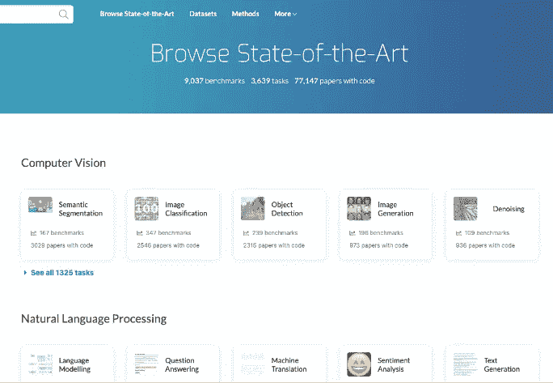
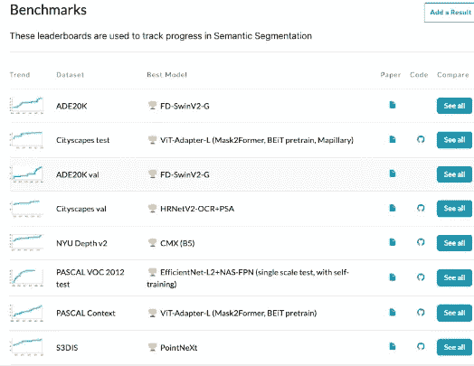
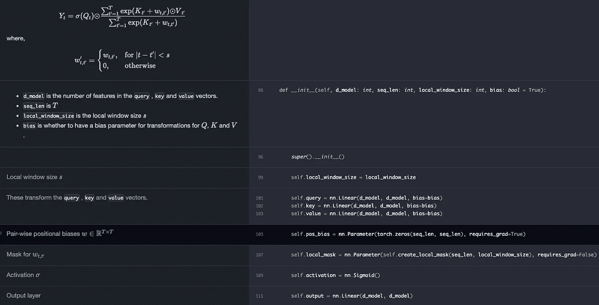
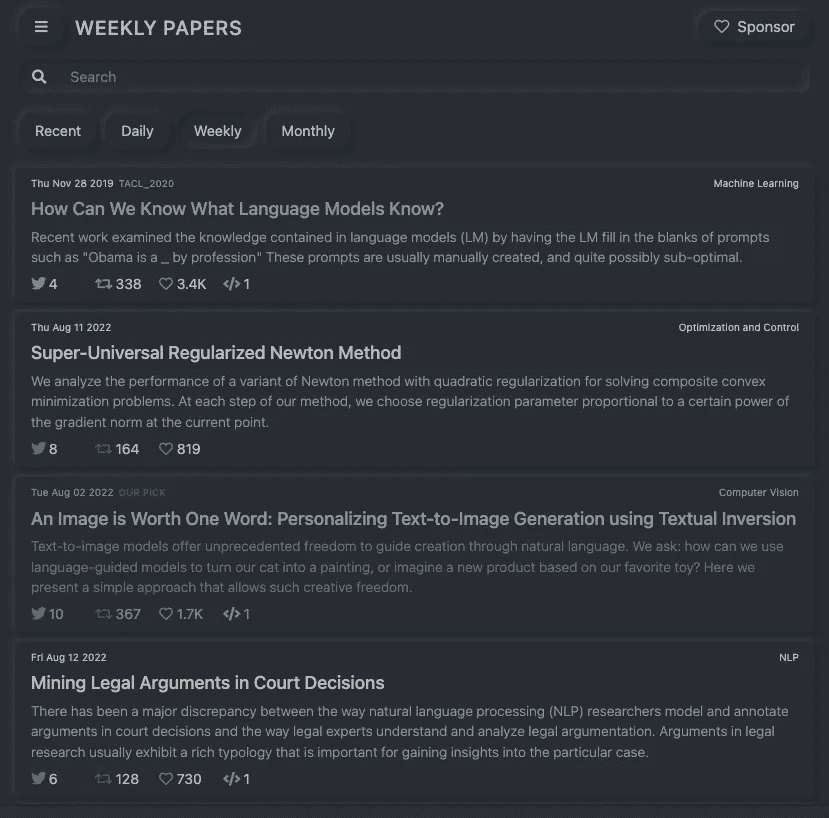
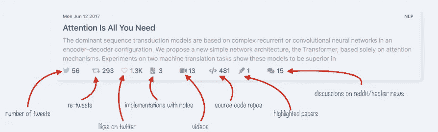
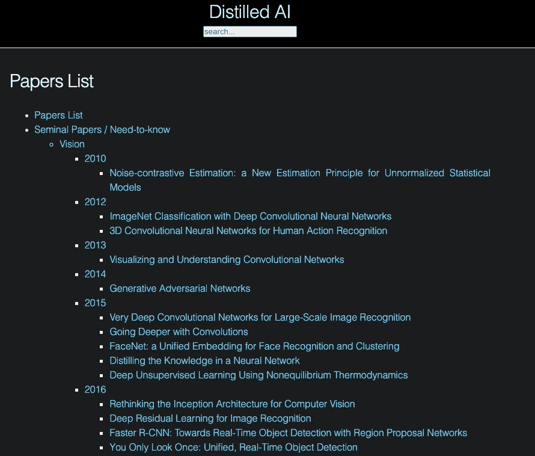
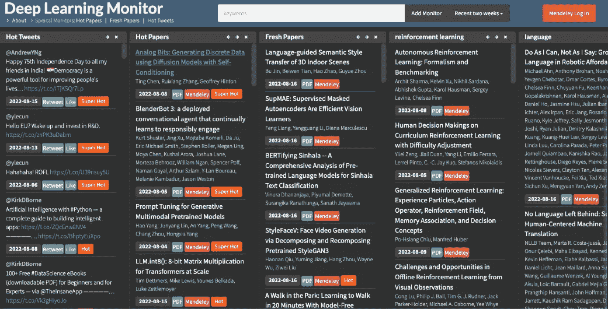
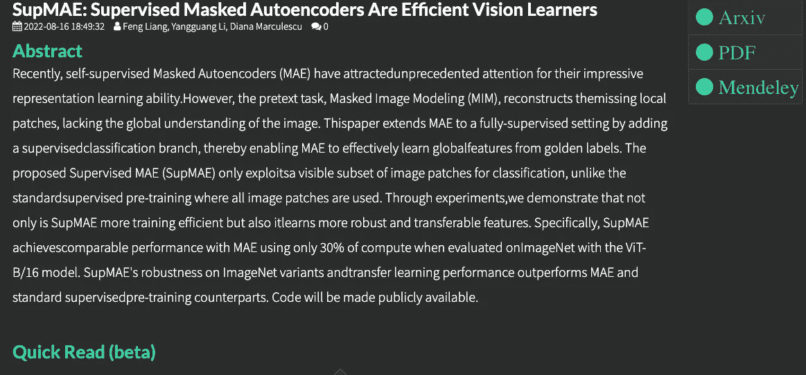

# 你可以找到流行的 ML/DL 研究论文的网站

> 原文：<https://medium.com/mlearning-ai/websites-where-you-can-find-popular-ml-dl-research-papers-dcf075af4cbb?source=collection_archive---------1----------------------->

让你了解最新的技术在机器学习和深度学习领域非常重要。

Andre NG 提供了一些阅读研究论文的技巧。[https://www.youtube.com/watch?v=733m6qBH-jI](https://www.youtube.com/watch?v=733m6qBH-jI)

那么，我们在哪里可以找到流行的报纸呢？

1.  paperswithcode — [浏览最先进的](https://paperswithcode.com/sota)

这些论文被很好地分类，所以你可以跟随 Andre 所说的，选择一个感兴趣的领域，比如语义分割，并且阅读 15-20 篇论文来很好地理解这个领域。更重要的是，你可以找到论文的代码。



2. [labml.ai 深度学习论文实现](https://nn.labml.ai/index.html)

59 篇深度学习论文的实现/教程，带并排笔记📝；包括变形金刚(原，xl，开关，反馈，vit，…)，优化器(adam，adabelief，…)，gans(cyclegan，stylegan2，…)，🎮强化学习(ppo，dqn)，capsnet，蒸馏，… 🧠

这是神经网络和相关算法的简单 PyTorch 实现的集合。这些实现都有文档和解释。因此，您可以在阅读本文的同时了解如何用 Pytorch 实现它。



3.labml.ai — [趋势研究论文](https://papers.labml.ai/)

Twitter 等社交媒体上最受欢迎的研究论文。你可以很容易地找到下载论文、论文摘要、解释视频和讨论的链接。



chrome 扩展也非常有用。

```
This extension shows you the following details about research papers:
✨ 2-line summary
✨ Availability source code, videos, and discussions
✨ Popularity on Twitter
✨ Conferences
```

4.[阿曼制作的文件清单](https://aman.ai/papers/#noise-contrastive-estimation-a-new-estimation-principle-for-unnormalized-statistical-models)

计算机视觉，自然语言处理和语音识别的关键论文摘要。



5.[深度学习监控器](https://deeplearn.org)

另一个你可以在社交媒体上找到热门论文的网站。

最大的特点是，你可以创建一些与感兴趣的主题相关的关键字的监视器，并每一两周检查一次新的更新。一旦你找到一篇好的论文，并在这个网站上登录门德利，你就可以直接把它发送到你的门德利账户。

[](/mlearning-ai/mlearning-ai-submission-suggestions-b51e2b130bfb) [## Mlearning.ai 提交建议

### 如何成为 Mlearning.ai 上的作家

medium.com](/mlearning-ai/mlearning-ai-submission-suggestions-b51e2b130bfb)