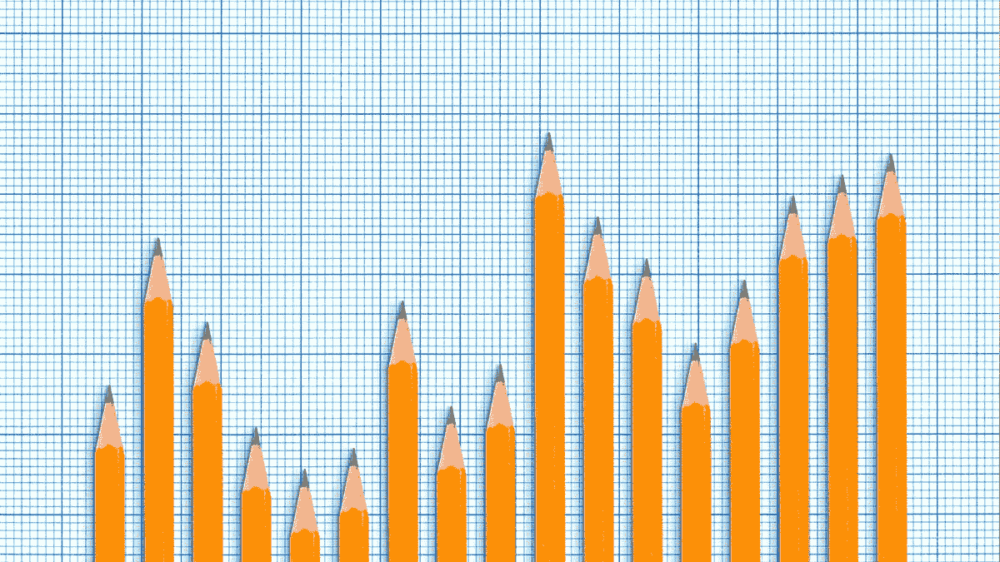
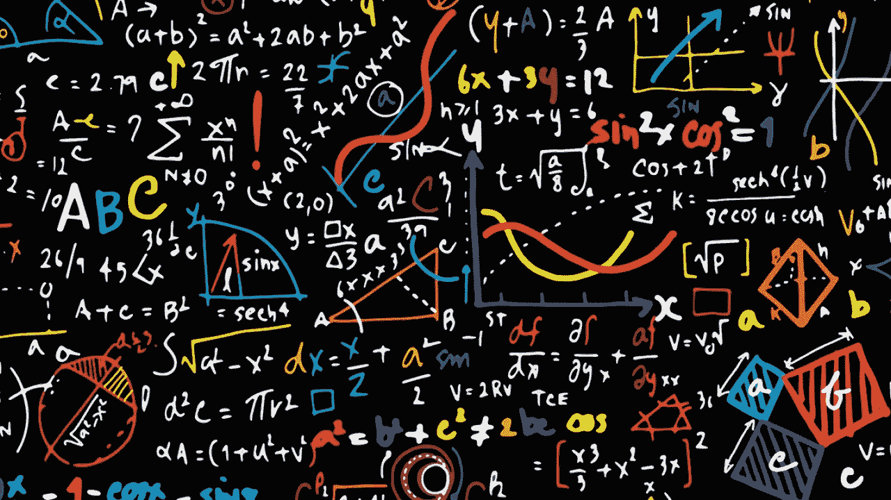
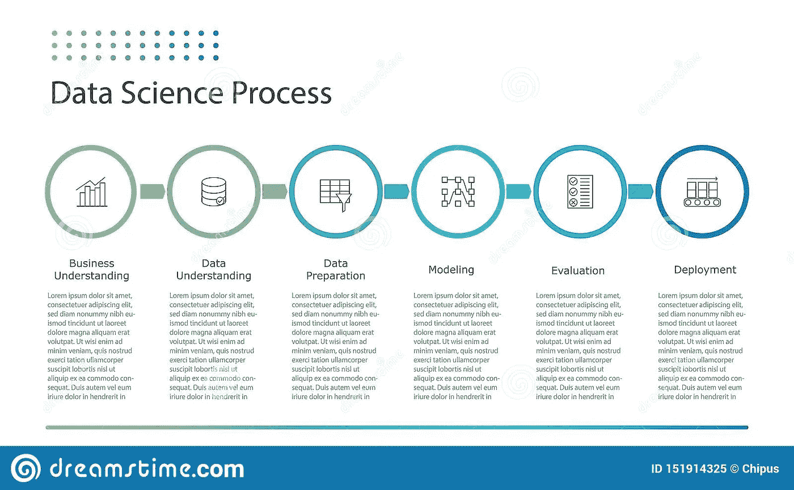
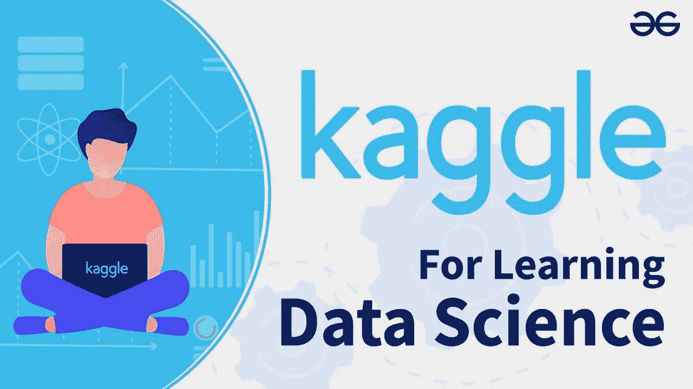
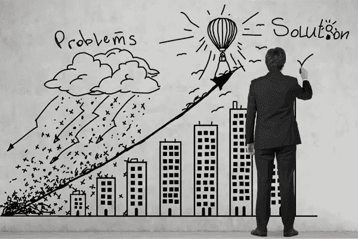
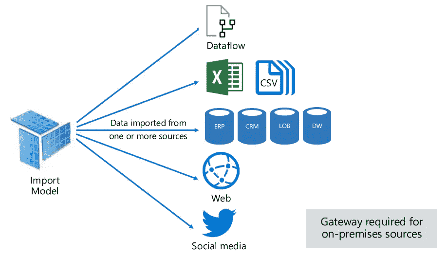
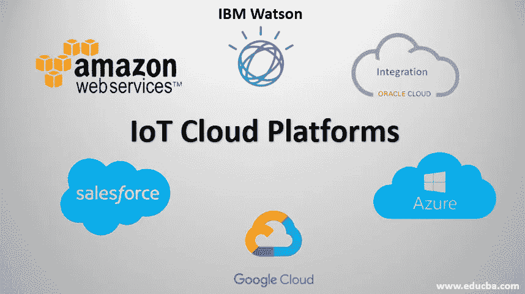

# 两年自学数据科学教会了我什么

> 原文：<https://medium.com/mlearning-ai/what-2-years-of-self-teaching-data-science-taught-me-4a38ff888fa7?source=collection_archive---------0----------------------->

科学爱好者通常首先是自学，而不是随后攻读硕士学位。但是，该领域的初学者后来才意识到数据科学这一广阔领域的现实，而真正有价值的时间却用在了错误的学习方法上。在本文中，我将分享我在两年的数据科学学习过程中了解到的一些事实，这些事实可以帮助你以更好的方式学习。

Source — [https://lifeandthemarket.files.wordpress.com/2018/09/btsimage1-e1536773270924.jpg?w=840](https://lifeandthemarket.files.wordpress.com/2018/09/btsimage1-e1536773270924.jpg?w=840)

**数据科学是一片海洋**

Keep Learning — There is no end to this field! (Source — [https://static01.nyt.com/images/2018/06/03/books/review/03GLASSIE-SUB/03GLASSIE-SUB-superJumbo.jpg](https://static01.nyt.com/images/2018/06/03/books/review/03GLASSIE-SUB/03GLASSIE-SUB-superJumbo.jpg))

在开始之前，要知道数据科学是一个非常广阔的领域。永远不要指望在几个月内或通过在线课程完成学习。研发经常发生，所以要做好长时间学习的准备。此外，要理解现实世界的数据科学与我们自己所做的完全不同，但要记住你所学到的东西。

**你不必成为爱因斯坦，但学点数学也无妨**

Basic math is essential (Source -[https://www.wellesley.edu/news/2017/stories/node/120511](https://www.wellesley.edu/news/2017/stories/node/120511))

这是一个常见的说法，但我觉得一点数学(概率、微积分、统计和线性代数的基础)将是好的。你不一定需要深入研究这些主题，但在解决数据问题时，基本的理解将是一个很大的加分。数学计算的大部分工作量是由库完成的。

**留着机器学习以后用**

Data Science Process — Observe that collection and prepping of the right data is essential (Source — [https://www.dreamstime.com/data-science-data-mining-process-flat-infographics-chart-demonstrate-data-science-process-applicable-artificial-image151914325](https://www.dreamstime.com/data-science-data-mining-process-flat-infographics-chart-demonstrate-data-science-process-applicable-artificial-image151914325))

最常见的错误是直接进入机器学习，从那里开始学习，只是以相反的方式。机器学习是任何数据科学过程的最后一部分。从让你错过很多更重要的概念开始学习——数据加载和管理、探索性分析和数据工程。从学习 Python、加载数据和使用数据集(Pandas)开始，然后转到生成仪表盘和可视化，然后转到机器学习和预测建模。这篇[文章](/analytics-vidhya/data-science-process-a-brief-overview-18ad34bd812f?source=your_stories_page-------------------------------------)解释了一般的数据科学过程。

卡格尔是最好的地方，但请记住这一点

Kaggle is a holy place for Data Science Enthusiasts — But Start from 1 always (Source — [https://i.ytimg.com/vi/u9MIwoFWXVg/maxresdefault.jpg](https://i.ytimg.com/vi/u9MIwoFWXVg/maxresdefault.jpg))

一旦你完成了基础工作，你就可以开始在 Kaggle 上工作了。Kaggle 是一个可以找到数据集的网站，你可以利用它来学习数据科学技能。但是请记住一件事——如果你是一个初学者，从简单的任务开始研究基本的小型数据集，然后再转向竞赛。原因是 Kaggle 是一个公共平台，在这里可以找到行业专家和研究人员。他们的知识水平将不同于你作为一个新手所拥有的——所以你可以自己动手，从基本的数据集开始，然后转向复杂的建模问题或竞赛。

**停止比较，开始学习**

Comparing brings in the infamous Imposter Syndrome — But it is just an illusion that Mind Plays (Source — [https://www.psychologytoday.com/us/blog/prescriptions-life/201803/how-stop-comparing-yourself-others](https://www.psychologytoday.com/us/blog/prescriptions-life/201803/how-stop-comparing-yourself-others))

新手最常犯的一个错误是将自己的工作与他人进行比较。这是一个很大的错误，因为经验和知识水平的差异。相反，反过来想一想——如果在你的理解范围内，试着去了解他们做了什么。每个拥有最好作品的人都曾经是像你一样的初学者。

**欢迎“理解商业问题”的技巧**

Problem-solving is a vital skill (Source — [https://egsrii9payi.exactdn.com/wp-content/uploads/consultancy-onpage-1.jpg?strip=all&lossy=1&ssl=1](https://egsrii9payi.exactdn.com/wp-content/uploads/consultancy-onpage-1.jpg?strip=all&lossy=1&ssl=1))

所有数据科学问题都专注于解决一个问题—现实世界或业务。此外，理解业务问题通常被称为“数据科学的第一条规则”。最好的建议是处理解决问题的数据集和项目，而不是生成可视化和模型。“猫和狗”的数据集对学习和尝试东西很有好处，但不适合作为项目或工作。

**不是每次都是 CSV 文件，还有其他的也是**

Data in the real world exists in many forms — Get to know them to be a good Data Scientist (Source — [https://docs.microsoft.com/en-us/power-bi/connect-data/service-dataset-modes-understand](https://docs.microsoft.com/en-us/power-bi/connect-data/service-dataset-modes-understand))

对于初学者来说，最好从 CSV 文件中的数据开始，但是随着您对它的习惯，也要学会使用其他数据源——包含 RegExp 的文本文件、SQL 数据库、包含云接口的数据仓库、非结构化数据(图像和音频文件)、JSON 数据等。当您习惯了基本的数据源，您也可以尝试数据抓取。你也可以通读一下这篇文章。

**万能的杰克，无所不能的主人——这里也适用**

Learn to build things on-demand — Do not expect to learn everything in a short time (Source — [https://www.quotev.com/quizi/9609120/24/1612888020](https://www.quotev.com/quizi/9609120/24/1612888020))

数据科学要求你使用各种各样的库、工具和 API，但你不一定需要精通它(如果你是，这是一件好事)。这里的主要思想是有一个概念的想法，但没有必要知道完整的库或 API！。按需学习什么是必要的。

**习惯云平台**

Cloud is a different field but comes in handy for many large-scale data science problems (Source — [https://www.educba.com/iot-cloud-platforms/](https://www.educba.com/iot-cloud-platforms/))

云经常与数据科学问题结合在一起，要么是因为大量的资源需求，要么是因为解决方案可以部署在云上。了解云平台、各种服务及其用法。云还托管各种大数据存储和管理服务，这是数据科学领域所围绕的。

感谢您的阅读！快乐学习！

**有用链接:**

在 LinkedIn 上找到我:[https://www.linkedin.com/in/vishnuu0399/](https://www.linkedin.com/in/vishnuu0399/)

更了解我:[https://bit.ly/vishnu-u](https://bit.ly/vishnu-u)

 [## Mlearning.ai 提交建议

### 如何成为 Mlearning.ai 上的作家

medium.com](/mlearning-ai/mlearning-ai-submission-suggestions-b51e2b130bfb) 

🟠 [**成为 ML 作家**](/mlearning-ai/mlearning-ai-submission-suggestions-b51e2b130bfb)