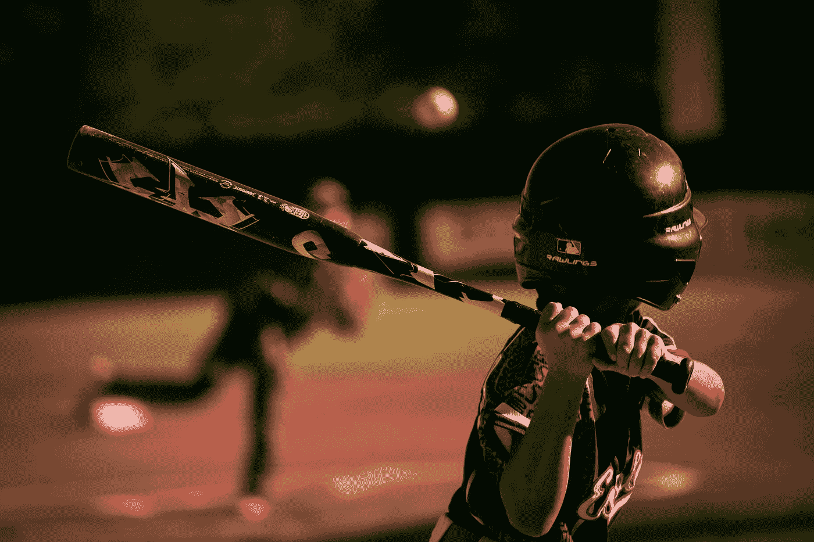
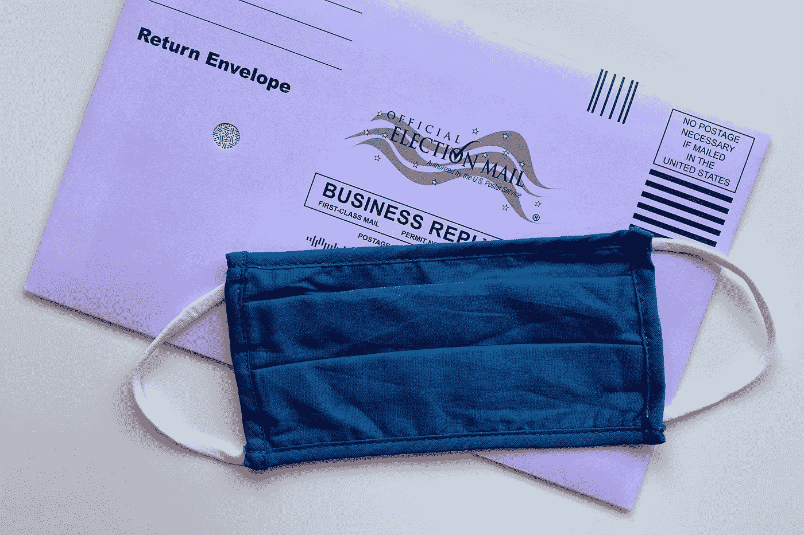
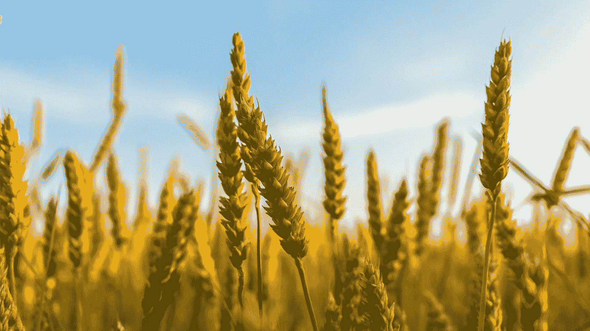
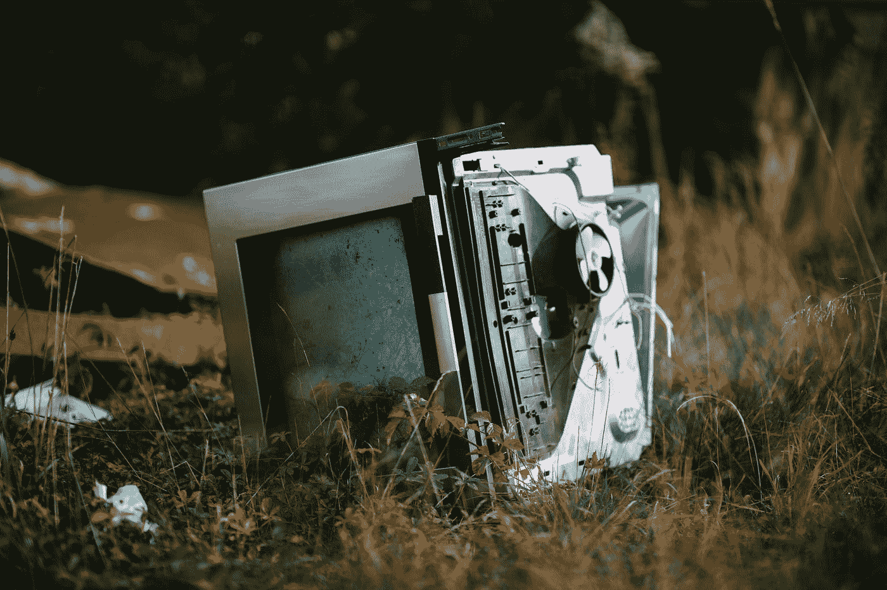
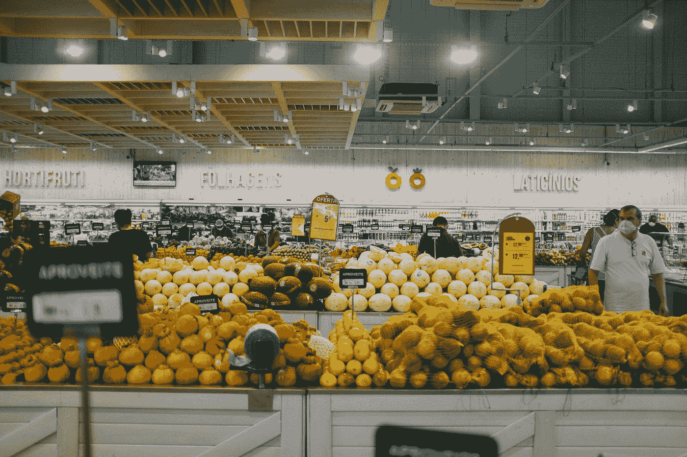
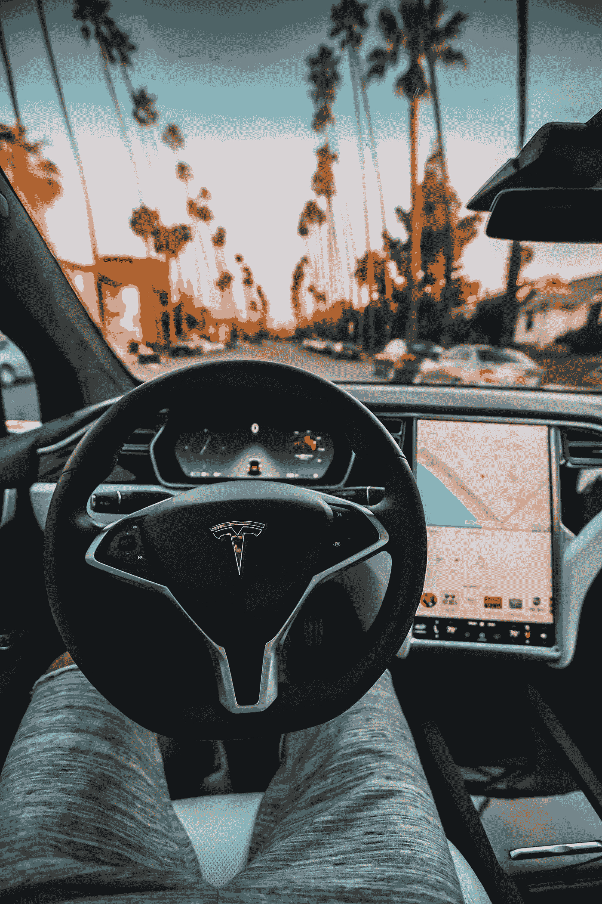

# 计算机视觉——人工智能的一个子集——有哪些不同的应用？

> 原文：<https://medium.com/mlearning-ai/what-are-the-different-applications-of-computer-vision-a-subset-of-artificial-intelligence-be9abbe40e03?source=collection_archive---------2----------------------->

Photo by [OpticalNomad](https://unsplash.com/@opticalnomad?utm_source=medium&utm_medium=referral) on [Unsplash](https://unsplash.com?utm_source=medium&utm_medium=referral)

Photo by [Greg Rakozy](https://unsplash.com/@grakozy?utm_source=medium&utm_medium=referral) on [Unsplash](https://unsplash.com?utm_source=medium&utm_medium=referral)

当我们随机浏览互联网时，我们看到很多信息都是通过视频和图像来传达的。谷歌的每次搜索都有大量的相关图片。由于互联网上存在大量的图像和视频，很明显，从中获得良好的直觉和一般模式对用户和社会都是有益的。此外，如果计算机能够理解它们看到的任何东西，并从中生成信息，那将真正增加价值。人工智能有一个子领域叫做计算机视觉，它从视频和图像中产生意义，并给出它们的数字表示，以便它们可以用于机器学习目的。

# **什么是计算机视觉？**

计算机视觉是人工智能的一个领域，它赋予计算机理解数字图像和视频的能力，并允许它们为多种目的向用户提出建议。换句话说，它让计算机能够从多种格式的图像和视频中产生洞察力。在计算机视觉的帮助下，有许多任务是自动化的，例如自动驾驶汽车、图像识别和许多其他任务。让我们回顾一下计算机视觉的一些应用。

以下是计算机视觉的一些令人兴奋的应用。

1.  **笔画识别**

Photo by [Eduardo Balderas](https://unsplash.com/@eduardobal?utm_source=medium&utm_medium=referral) on [Unsplash](https://unsplash.com?utm_source=medium&utm_medium=referral)

在不同的运动中，都有进球或赢得比赛的目标。在棒球比赛中，要求球员击球，并根据球沿其他条件行进的距离来得分。通常情况下，很多教练和比赛分析者会了解比赛，并给球员反馈，以便他们随着时间的推移而提高。相反，计算机视觉算法预测击球，并帮助团队成员和球员了解错误，帮助他们在未来做出明智的决定。因此，这是计算机视觉有趣的应用之一。

2. **COVID 检测**

Photo by [Fusion Medical Animation](https://unsplash.com/@fusion_medical_animation?utm_source=medium&utm_medium=referral) on [Unsplash](https://unsplash.com?utm_source=medium&utm_medium=referral)

世界各地的病人都有许多 x 光图像。研究人员和医生给图像贴上标签，标明患者是否检测出 COVID 阳性。在这种情况下，计算机视觉将根据医生和研究人员给出的注释示例来检测一个人患 COVID 的几率。因此，计算机视觉可以用在这种情况下，任务可以自动化，这样医生就可以把时间用在其他地方。此外，诊断这种疾病所需的时间可以大大减少。因此，计算机视觉可以用于诊断病人的状况。

3.**遮罩检测**

Photo by [Tiffany Tertipes](https://unsplash.com/@tiffanytertipes?utm_source=medium&utm_medium=referral) on [Unsplash](https://unsplash.com?utm_source=medium&utm_medium=referral)

在疾病传播期间，人们采取预防措施阻止疾病传播是至关重要的。他们可以做的一件事是去公共场所和集会时戴口罩。在餐馆等一些地方，强制戴口罩。然而，很难监控每个人是否戴着口罩。在这种情况下，计算机视觉用于帮助跟踪个人，并帮助人们知道他们是否戴着面具。

4.**作物监测**

Photo by [Ant Rozetsky](https://unsplash.com/@rozetsky?utm_source=medium&utm_medium=referral) on [Unsplash](https://unsplash.com?utm_source=medium&utm_medium=referral)

一般来说，生成卫星图像是为了跟踪不同田地的作物状况。一旦生成这些图像，管理人员就有责任了解情况，并根据作物的状况采取行动。基本上，这项工作是由在作物管理领域经验丰富的分析师来完成的。尽管如此，数据科学家和机器学习工程师正在取代分析师。一般来说，当有卫星图像的注释示例时，这些图像可以被馈送到深度学习算法，具体来说是复杂的神经网络，以便它们能够让分析师分别了解不同地区不同作物的状况。

**5。缺陷检测**

Photo by [Markus Spiske](https://unsplash.com/@markusspiske?utm_source=medium&utm_medium=referral) on [Unsplash](https://unsplash.com?utm_source=medium&utm_medium=referral)

深度学习算法可能擅长预测钢铁、混凝土和汽车等物品制造过程中出现的不同缺陷。训练深度学习算法来执行检测一些项目(如钢铁和汽车)中存在的一些缺陷的任务将是非常明智的。一旦缺陷的标记示例被赋予深度学习模型，它们将自动检测某些缺陷，从而减少人工努力。此外，通过分别使用这些计算机视觉算法，制造某些设备和工具所需的时间也将大大减少。

## **6。零售业**

Photo by [Dennis Siqueira](https://unsplash.com/@densiq?utm_source=medium&utm_medium=referral) on [Unsplash](https://unsplash.com?utm_source=medium&utm_medium=referral)

有许多零售行业，如亚马逊，正在尝试将从商店购买不同商品的过程自动化。事实上，亚马逊最近启动了“Go ”,这是一家允许人们在没有工作人员的情况下购买商品的超市。在购买物品的过程中使用计算机视觉算法。例如，当顾客挑选一件商品并将其放入购物篮时，该商品会被自动挑选并注册付款。购买一件商品并离开商店所需的时间显著减少。此外，在生产过程中也可以用这种方法对库存进行监控。因此，我们看到它是如何在零售业中使用的。

## **7。自动驾驶汽车**

Photo by [Roberto Nickson](https://unsplash.com/@rpnickson?utm_source=medium&utm_medium=referral) on [Unsplash](https://unsplash.com?utm_source=medium&utm_medium=referral)

计算机视觉是在自动驾驶汽车中，汽车根据各种交通状况、道路维护和其他影响驾驶的事情学习自动驾驶。驾驶模式可能会根据路况而变化。在夜间，激光雷达传感器被用来检测道路上的坡度和干扰。在未来，自动驾驶汽车的数量将会迅速增加，导致技术领域的更好发展。

# **结论**

总而言之，我们已经看到了计算机视觉如何通过对图像和视频的预测和理解来彻底改变不同的行业。我们已经看到它们分别被用于作物管理和自动驾驶汽车。希望这篇文章对你有所帮助。欢迎分享您的想法和反馈。谢谢！