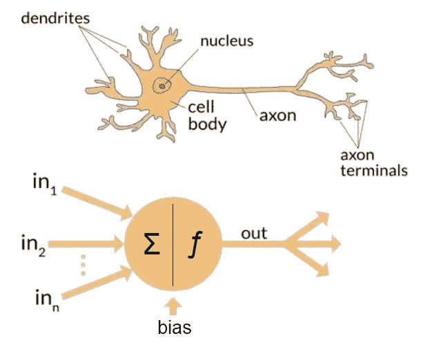

# 什么是人工神经网络

> 原文：<https://medium.com/mlearning-ai/what-is-artificial-neural-network-fd38dd2ec121?source=collection_archive---------7----------------------->

随着越来越需要更好的方法来训练机器自己理解，人们一直从动物大脑中获得灵感，以某种方式训练机器，使它能够自己理解几乎任何东西。

这就是人工神经网络(ANN)概念的由来。如果机器能够模仿动物的大脑，从呈现在它面前的信息中学习，那会怎么样。

根据人工神经网络的定义，

> 一个**人工神经网络** (ANN)是**人工**智能的组成部分，旨在模拟**和**人脑的功能。处理单元组成人工神经网络，而人工神经网络又由输入和输出组成。

任何人工神经网络都由称为神经元(或人工神经元)的构件组成。

> 人工神经元是一种数学函数，被认为是生物神经元的模型，即神经网络。

当在人工智能的上下文中使用时，人工神经元通常被称为神经元。

A biological and an artificial neuron (Source [https://www.quora.com/What-is-the-differences-between-artificial-neural-network-computer-science-and-biological-neural-network](https://www.quora.com/What-is-the-differences-between-artificial-neural-network-computer-science-and-biological-neural-network))

上图比较了生物神经元和人工神经元的设计。

人工神经元由一些输入、激活函数、一些偏置组成，并给出一个输出。

## 什么是激活函数？

> 激活函数定义了如何从输入的加权和中产生输出。

激活函数的选择取决于模型试图解决的问题类型。

## 神经元网络

多个神经元相互协调工作，形成一个神经元网络。

Photo by [Alina Grubnyak](https://unsplash.com/@alinnnaaaa?utm_source=medium&utm_medium=referral) on [Unsplash](https://unsplash.com?utm_source=medium&utm_medium=referral)

一排神经元称为网络中的一层。一个网络可以包含多个层。

## 网络中存在不同种类的层。

1.  输入层
2.  隐藏层
3.  输出层

我们将简要地阅读这些层

## 输入层

这是网络的起点，因此是暴露的。输入层也被称为**可见**层。这一层负责收集用于训练神经网络的起始数据。

## 隐藏层

这种层在输入层之后，不直接暴露给输入。这些类型的层接收来自前一层的输入，执行一些计算，然后向输出层或下一个隐藏层输出一个值。

深度神经网络可以包含多个隐藏层。随着隐藏层数的增加，训练过程变慢。

## 输出层

这是负责根据所需格式输出值的最后一层。

根据激活函数，神经元的输出值为-1 比 1(或 0 比 1)。

# 什么是感知器？

感知器是单个神经元模型，它可能是大型网络的前身。感知器执行计算以输出二进制值 0 或 1(根据使用的激活函数，输出值也可以是-1 和 1)。

感知器基本上作为阈值函数工作，低于阈值的值被放入一个类，高于阈值的值被放入另一个类。

单层感知器可以解决一个**线性**可分问题。

你可以在这里阅读感知机如何解决线性可分的问题[。](/@priyansh-kedia/how-perceptrons-solve-the-linearly-separable-problems-b8a623055550)

在这篇博客中，我们了解了什么是人工神经网络及其基本构建模块，即**神经元**。

## 参考

 [## 多层感知器神经网络速成班-机器学习掌握

### 人工神经网络是一个令人着迷的研究领域，尽管它们在刚开始时可能令人生畏…

machinelearningmastery.com](https://machinelearningmastery.com/neural-networks-crash-course/)