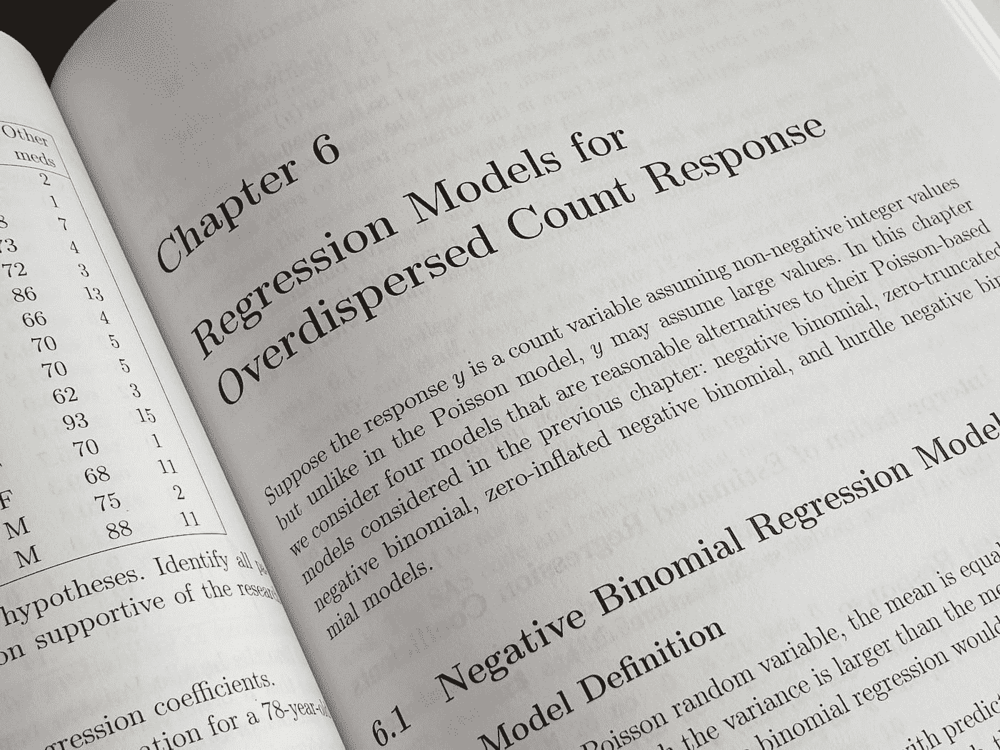

# 我应该做什么样的数据科学项目？

> 原文：<https://medium.com/mlearning-ai/what-kind-of-data-science-project-am-i-supposed-to-do-a51245153072?source=collection_archive---------2----------------------->

## 为什么你对项目的心态会阻碍你

Photo by [Uday Mittal](https://unsplash.com/@mittaluday?utm_source=medium&utm_medium=referral) on [Unsplash](https://unsplash.com?utm_source=medium&utm_medium=referral)

首先，我想非常清楚地陈述**四个要点**，然后我们会对每个要点进行更深入的探讨:

1)没有**最佳数据集**可用于项目

2)没有你应该努力解决的**最佳问题**

3)在项目中没有你应该使用的最佳算法

4)没有你应该使用的最好的编程语言或技术栈

# **没有“最佳数据集”可用于一个项目。**

> 没有哪个招聘经理会对你使用的数据集印象深刻。

也就是说，你不应该在你的作品集项目中使用:Iris，Titanic，Boston housing，或者**任何你可以在 scikit-learn 数据集包中找到的玩具数据集**。

当你正在学习基础知识并对基础知识感到舒适的时候，这些对你来说是非常好的。

但它们终究是玩具。

Photo by [Xavi Cabrera](https://unsplash.com/@xavi_cabrera?utm_source=medium&utm_medium=referral) on [Unsplash](https://unsplash.com?utm_source=medium&utm_medium=referral)

你不会带着鲍勃的玩具锤子去盖房子。

**所以，不要用玩具数据集展示作品集。**

# **没有你应该解决的“最佳问题”**

最重要的是您在构建项目时使用的过程。

当你作为一名数据科学家工作时，你不会有一大堆问题可供选择。

你接受公司需要解决的任何问题，并使用你的方法来帮助解决问题。

> 重要的是你如何解决这个问题

# **没有你应该在项目中使用的“最佳算法”**

Photo by [Markus Spiske](https://unsplash.com/@markusspiske?utm_source=medium&utm_medium=referral) on [Unsplash](https://unsplash.com?utm_source=medium&utm_medium=referral)

重要的是问题陈述、原则和你用来获得结果的过程。

任何人都可以调用 scikit 中的一个方法——学习并建立一个模型。

真正重要的是:

*   代码的组织和质量
*   数据采集和数据清理的过程
*   数据探索
*   数据分析
*   特征工程
*   预处理

最终为您的特定用例确定最佳算法的所有步骤。

# 没有你应该使用的最好的编程语言或技术栈

Photo by [Alex Chumak](https://unsplash.com/@ralexnder?utm_source=medium&utm_medium=referral) on [Unsplash](https://unsplash.com?utm_source=medium&utm_medium=referral)

没有一个通用的代码强制要求特定行业的所有公司都使用 R 或 Python 或 AWS 或 Azure。

它会根据你所在的公司而变化。

但是如果你理解了需要做什么的原则，你使用的工具就只是一个细节。

在电锯出现之前，我们用斧头砍树。

Photo by [C D-X](https://unsplash.com/@cdx2?utm_source=medium&utm_medium=referral) on [Unsplash](https://unsplash.com?utm_source=medium&utm_medium=referral)

手斧仍然可以像电锯一样砍树。

这两种工具做同样的工作:砍树。

唯一改变的是时间的流逝。

# 我应该做什么类型的项目？

不要去想你应该做什么类型的项目，而是要记住一个项目应该为你做什么。

你做的任何项目都应该让你走向精通。

在那里练习变得更加容易和有趣，导致练习更长时间的能力，**这增加了你的技能水平**，从而使练习更加有趣。

> 让你自己的好奇心和执念驱动你所做的项目类型。它会在你的工作质量和项目的最终报告中表现出来。

Photo by [Joseph Rosales](https://unsplash.com/@josephandjosephandjoseph?utm_source=medium&utm_medium=referral) on [Unsplash](https://unsplash.com?utm_source=medium&utm_medium=referral)

你*应该*做**的项目类型取决于你发现什么是有趣的**，以及你的职业发展方向！

你必须**做一些反省** **和** **想想你想成为什么类型的数据科学家**，你想从事哪个行业，数据科学家在那个行业研究什么问题，等等。

**你想专攻 web 应用吗？**使用 streamlit、Gradio、D3、plotly 或闪亮的应用程序制作交互式图表。

**要不要做自然语言处理？**使用文本数据。玩一些变形金刚模型。做项目使用空间或拥抱脸。

**机器学习？**分类。回归。深度学习。做使用不同库的项目:scikit-learn、imblearn、PyTorch、TensorFlow、fast.ai。熟悉使用各种不同的框架。

> 用你的项目来强迫自己学习新的东西。
> 
> 你要找到你不知道的东西的唯一方法是做很多事情，观察你知识中的漏洞。

项目**帮助你获得处理数据科学问题的实际经验**，这在你不知下一步该学什么的时候会有所帮助。

尽可能多地犯错误。记录你从这些错误中学到了什么。在博客或 LinkedIn 帖子中谈论它。把它们当成你可以在采访中谈论的战争故事。

> 雇主寻找能从错误中吸取教训并敢于承认错误的人。

# 我应该做几个项目？

Photo by [Enayet Raheem](https://unsplash.com/@raheemsphoto?utm_source=medium&utm_medium=referral) on [Unsplash](https://unsplash.com?utm_source=medium&utm_medium=referral)

你应该尽可能多地做一些小的、分散的项目来发展你的技能和直觉。

小型项目包括以下内容:

*   连接到一些 API，拉数据，做一个通用的 ETL 过程，并产生一些视觉效果。
*   使用来自互联网的数据进行一些假设检验，以发展你对在给定情况下何时使用给定假设检验的理解。
*   选择一种算法，试验各种超参数，看看它们如何影响最终模型性能，它们如何相互作用，它们如何相互关联，并对该特定算法形成更深入的直觉。
*   构建一个小的分类项目，以获得关于您可以选择的各种评估指标的直觉。如果你觉得有趣，可以看看我关于不平衡分类的帖子。

> 关键是做一些小项目来磨练和发展你的技能。

你在这个过程中获得的知识将为你走向更大、更复杂的 ***主项目*** 奠定基础。

Photo by [Markus Spiske](https://unsplash.com/@markusspiske?utm_source=medium&utm_medium=referral) on [Unsplash](https://unsplash.com?utm_source=medium&utm_medium=referral)

> 这些小的离散项目只是在你和数据之间。

没有必要与世界分享这些项目。

它们是你的沙盒项目。

在像骑自行车这样的活动中，我们都知道观察某人并跟随他们比听或读指令更容易。

我们做得越多，事情就变得越容易。

> 即使对于主要是脑力的技能，如计算机编程或说一门外语，我们通过练习和重复学习仍然是最好的。

你为这些小项目付出的努力将会获得新的技能、更深刻的直觉和最终的精通。

**这就结束了这场咆哮。下一集再见。**

让我知道你的想法。请在下面留言，让我们打开话题。

我也有一个[免费的、开放的 Slack 社区](https://join.slack.com/t/artofdatascienceloft/shared_invite/zt-dgzn8abm-ge_dKGxrc9Dsuhnly90WTw)，我很乐意在这里与你交流项目想法！

> 记住我的朋友们:你在这个星球上只有一次生命，为什么不试着做些大事呢？

 [## Mlearning.ai 提交建议

### 如何成为 Mlearning.ai 上的作家

medium.com](/mlearning-ai/mlearning-ai-submission-suggestions-b51e2b130bfb)