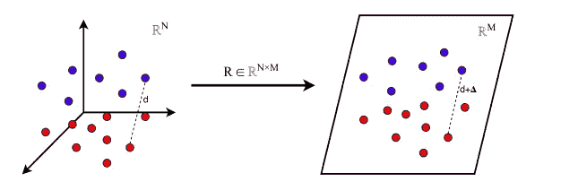

# 关于嫉妒，机器学习教会了我什么

> 原文：<https://medium.com/mlearning-ai/what-machine-learning-taught-me-about-envy-d3cf3f1cb2e?source=collection_archive---------9----------------------->

这种认识对我的影响远远超过任何建议。

Cain slaying Abel — Peter Paul Rubens

作为一个非常好胜的人，嫉妒对我来说是一种难以控制的情绪。我不是一个人在奋斗。我认为该隐和亚伯的故事，一个兄弟间嫉妒的故事，是圣经中最早的故事之一，这不是巧合。

除了作为一种普遍的情感，嫉妒还与其他基本的人类情感密切相关，比如地位、内疚和骄傲。这些会影响我们的幸福、[自尊](https://www.youtube.com/watch?v=wC9S_fFMnaU)，还可能[我们的寿命](https://www.amazon.com/Status-Syndrome-Standing-Affects-Longevity/dp/0805078541)。

随着我获得了更多的生活经验，我开始意识到一些事情:我羡慕的人(不管出于什么原因)，尽管拥有我渴望的东西，但似乎并没有因此而更快乐。他们也有恐惧、未满足的欲望和问题。在这方面，我最深刻的体验是和我羡慕的人在一起(和他们交朋友):你开始理解他们，使他们人性化，甚至向他们学习。有点像一个似乎拥有一切的名人自杀。

你开始意识到你让那个人沦落到你羡慕的地步，并推断出他们对此的感受。现实是，生活远比这复杂得多。

机器学习中有个概念叫[主成分分析](https://en.wikipedia.org/wiki/Principal_component_analysis) (PCA)。这个想法很简单:给定大量变量的数据，尝试只选择那些对你试图辨别的模式最重要的变量。例如，如果我试图预测一个群体患糖尿病的风险，并且我知道他们的年龄、身体质量指数和眼睛的颜色，我可能会尝试只在前两个变量上训练我的模型。

How PCA works

PCA(以及其他)的问题是:它是一种无损压缩。你无法从减少的变量中完美地重建原始数据。

为了获得技术上的帮助，PCA *将数据投射*到一个低维空间。这就是你的大脑在嫉妒情绪下所做的事情:你正在把另一个人的生活降低到你想要的程度。这样做，你就失去了现实的复杂性和他们的生活可能是什么样子。

我想引用天使投资人和哲学家 Naval Ravikant 的话来结束我的演讲。如果不是因为我花了时间学习 ML，我不认为我能完全理解这个建议。

> 有一天，我意识到我嫉妒的这些人，我不能只选择他们生活的小方面。我不能说我想要他的身体，我想要她的钱，我想要他的人格。你必须成为那个人。你真的想成为那个人吗？他们的反应，他们的欲望，他们的家庭，他们的幸福程度，他们的人生观，他们的自我形象？如果你不愿意一周 7 天 24 小时 100%地和那个人交换，那么嫉妒是没有意义的。
> 
> 一旦我意识到这一点，嫉妒就消失了，因为我不想成为别人。我很高兴做我自己。顺便说一句，即使是在我的控制之下。快乐地做我自己。只是没有社会奖励。

 [## Mlearning.ai 提交建议

### 如何成为 Mlearning.ai 上的作家

medium.com](/mlearning-ai/mlearning-ai-submission-suggestions-b51e2b130bfb)