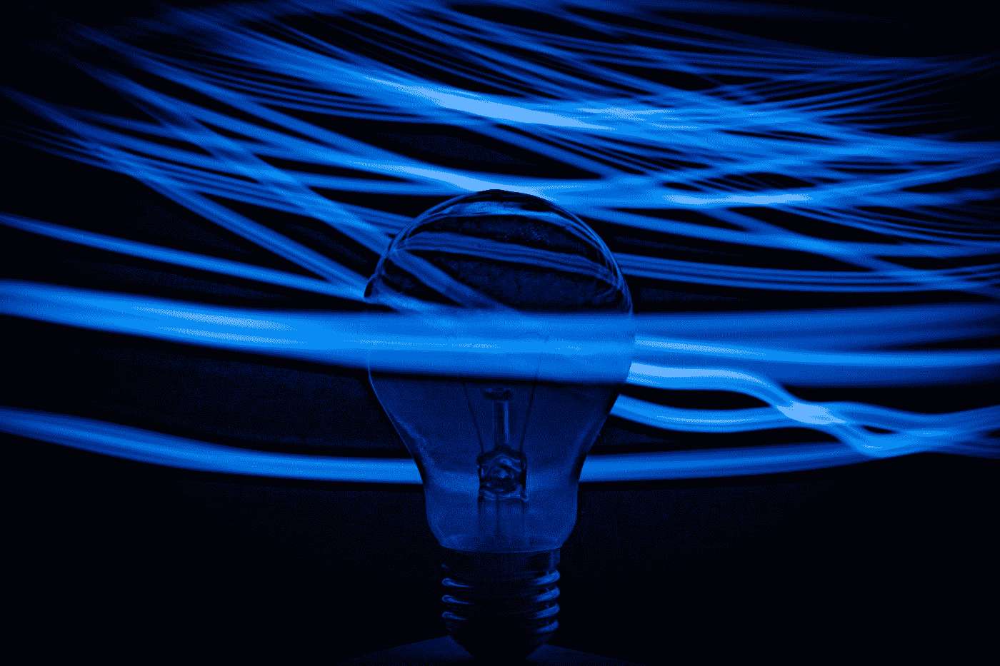

# 为什么 DeepMind 是人工智能创新之父

> 原文：<https://medium.com/mlearning-ai/why-deepmind-is-the-god-father-of-ai-innovation-e54bb0148ed7?source=collection_archive---------3----------------------->

Photo by [Nejc Soklič](https://unsplash.com/@nejc_soklic?utm_source=medium&utm_medium=referral) on [Unsplash](https://unsplash.com?utm_source=medium&utm_medium=referral)

eepMind 最近宣布，他们使用 AlphaFold 将 2 亿多个蛋白质中的大部分映射到它们的 3D 结构中。这个消息让我思考了一下。

不是因为它的科学相关性:我对蛋白质知之甚少，也不关心那 2 亿个分子。

这引起了我的思考，因为 DeepMind 在人工智能方面的突破性创新一直处于聚光灯下。

这很了不起，因为人工智能市场就像一个打地鼠场，每秒钟都有新公司冒出来。出于这样或那样的原因，这些公司中的大部分都被拖垮了，但其中一些幸运地存活了下来。

DeepMind 不仅似乎生存得相当好，而且随着时间的推移，它还建立了作为地球上最好的人工智能研究公司之一的声誉。

反思之后，我开始思考:

*   是什么让 DeepMind 在 AI 领域创新如此之多？
*   为什么 DeepMind 迄今为止从未失败过？

下面几段我尽量给出一些合理的答案。

# 2010 年没人关注人工智能，但 DeepMind 关注了。

好吧，这个标题可能有点吸引眼球。

的确，DeepMind 成立于 2010 年，实际上，那几年也有一些人在谈论 AI。但这个标题的潜在思想是真实的:DeepMind 开始关注人工智能，而其他人并没有真正关注它。

恰恰在 10 年代早期，人工智能出现了指数式增长。所以，当公司开始关注人工智能市场上的现有公司时，DeepMind 已经在那里交付好项目了。

事实上在 2014 年，成立仅 4 年，DeepMind 就被谷歌以 5 亿美元收购。迄今为止，这是谷歌最大的收购之一！

我们可以说，在还没有人相信它的时候，DeepMind 相信了人工智能的长期潜力，这让它获得了“相当不公平”的竞争优势。

# DeepMind 喜欢玩游戏。

相反，这个头衔并不引人注目。DeepMind 最初的大部分项目都在游戏上。

它首先从一个名为 DeepQ Learning (DQL)的人工智能算法开始，该算法能够仅通过查看屏幕上的像素和分数来玩 49 种不同的雅达利游戏。在这里你可以看看它是如何玩[太空入侵者](https://www.youtube.com/watch?v=W2CAghUiofY)和[突围](https://www.youtube.com/watch?v=TmPfTpjtdgg)的。

随后，DeepMind 凭借 AlphaGo 重新登上头条，alpha Go 是一个能够在围棋比赛中击败欧洲和世界冠军的程序。它通过观看成千上万场人类围棋比赛学会了如何下围棋。

这个项目后来被翻译成 AlphaZero，它不仅能下围棋，还能下围棋和象棋。不同的是，它只是学习游戏规则，而没有看到任何以前的比赛。

后来它变成了 MuZero，一个更强的 AlphaZero 版本。在这里，人工智能学会了在没有任何知识，甚至没有规则的情况下玩游戏。

7 月，DeepMind 宣布开发了一种新的人工智能，可以玩策略棋盘游戏 Stratego。

游戏不是一个随便的选择。首席执行官戴密斯·哈萨比斯从 4 岁起就迷上了国际象棋，十几岁时就开始开发游戏，并在剑桥大学获得计算机科学学位后从事游戏行业。

所以如果说有什么好的寓意我们可以从中汲取的话，那就是以下:*玩游戏，建公司，轻松成为百万富翁*。

虽然游戏与 CEO 的激情有关，但对于 AI 来说，游戏实际上是一个真正聪明的选择。它们易于使用、访问和复制。这样可以快速进步！

但是，就个人而言，游戏的真实情况是，计算机似乎理解我们不理解的事情。

AlphaGo 给出了一个有趣的例子。在与围棋世界冠军的一场比赛中，该算法走了一步棋——被称为 37 步棋——只有万分之一的机会被人类走出来。这个选择最初被认为是一个错误(被人类)，但后来证明这是一个改变游戏规则的举动，导致 AI 赢得了这场比赛。

通过选择游戏作为其项目的核心，DeepMind 无疑在人工智能方面做出了重要创新。

# DeepMind 不在乎成功。它关心进步。

总结 DeepMind 的使命是一件非常容易的事情:

*   第一步:**解决情报**
*   第二步:**用它来解决其他一切**

它们是很大的声明，不是吗？用解决智能来解决其他一切的概念既迷人又乌托邦。

DeepMind 知道它的目标非常复杂，但它也很清楚这个任务不会马上实现。最终，DeepMind 的使命和登月一样有价值。几个世纪以来，人们一直在谈论登上月球，仅仅是作为一个有创意的故事。但是我们 53 年前才登上月球。

DeepMind 知道，几个世纪以来，解决智能问题一直是许多人的梦想。就像 NASA 是最早实现登月的人之一一样，DeepMind 也想成为第一个解决智能的人。

难怪 2015 年 DeepMind 的首席执行官戴密斯·哈萨比斯说:

> DeepMind 背后的想法实际上是为人工智能创造一种阿波罗计划任务

它的方法很简单:建立小的智能，在它们的一般性水平上增长。有了这种更高层次的通用性，更难的问题就可以解决了。

例如，这一愿景通过以下方式传达:

*   项目的可重用性:AlphaGo 变成了 AlphaZero，后来又变成了 MuZero。这些项目有相同的核心——游戏——但是增加了它们的通用性。
*   对公众的可用性:令人惊讶的是，DeepMind 在宣布后不久就让 AlphaFold 成为开源的。2022 年，由于阿尔法折叠，我们知道了几乎所有现有蛋白质的结构。我敢打赌，在未来的诺贝尔奖中，我们会听到关于阿尔法折叠的消息……

所以，DeepMind 不看重项目的成功。它重视它对人类进步的意义。

# 深度思维不仅仅是发明。DeepMind 执行。

你可以发明一个想法，这很好。但是众所周知，有了想法，你什么也做不了；你需要执行它们，看看它们是否真的有价值。DeepMind 知道。

由于他们团队的多样性，这是可能的。我并不是指现在每个公司“喜欢”谈论的多样性；我是说工作的多样性。事实上，DeepMind 雇佣了研究人员、工程师、神经科学家、伦理和社会专家、艺术家等。

通过这样做，他们能够发明、实验和执行。DeepMind 过去做过，现在正在做，将来也会做。这一能力标志着它的旅程，使它成为全球最著名的人工智能研究公司之一。

# 结论

DeepMind 诞生于 2010 年。大约在同一时期，人工智能开始获得成功。从某种意义上说，DeepMind 就像一位目睹了自己孩子成长的父母。我们在前面已经看到了为什么会出现这种情况。

然而，在这些年里，其他公司也开始创新人工智能:谷歌大脑、开放人工智能等。

所以说 DeepMind 是人工智能创新之父对其他公司来说可能太不尊重了。让我们更进一步，但不要太远。

DeepMind 不是人工智能创新之父。DeepMind 是人工智能创新的教父。

首席执行官戴密斯·哈萨比斯是马龙·白兰度。

 [## Mlearning.ai 提交建议

### 如何成为移动人工智能的作者

medium.com](/mlearning-ai/mlearning-ai-submission-suggestions-b51e2b130bfb)