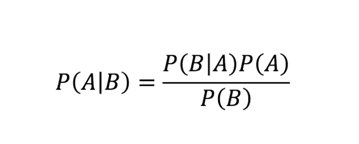
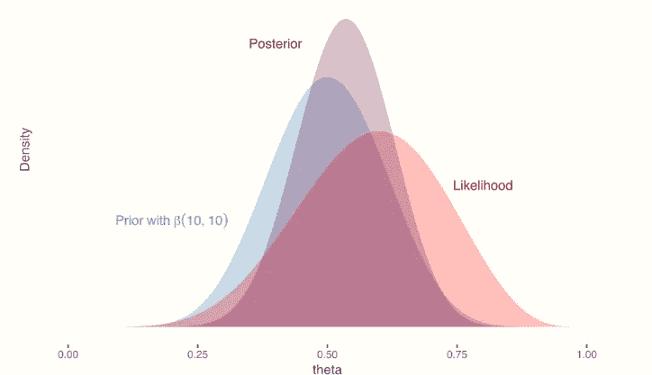
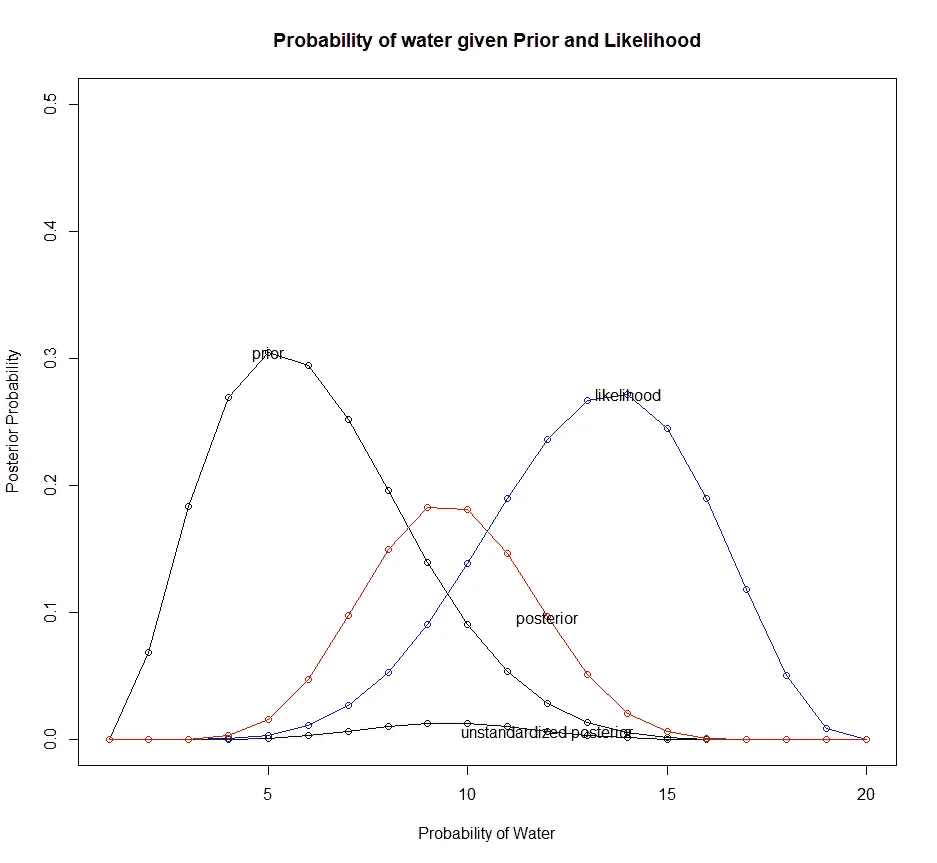
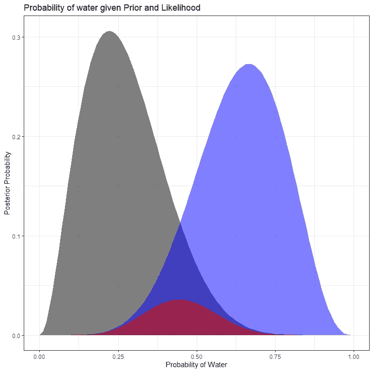
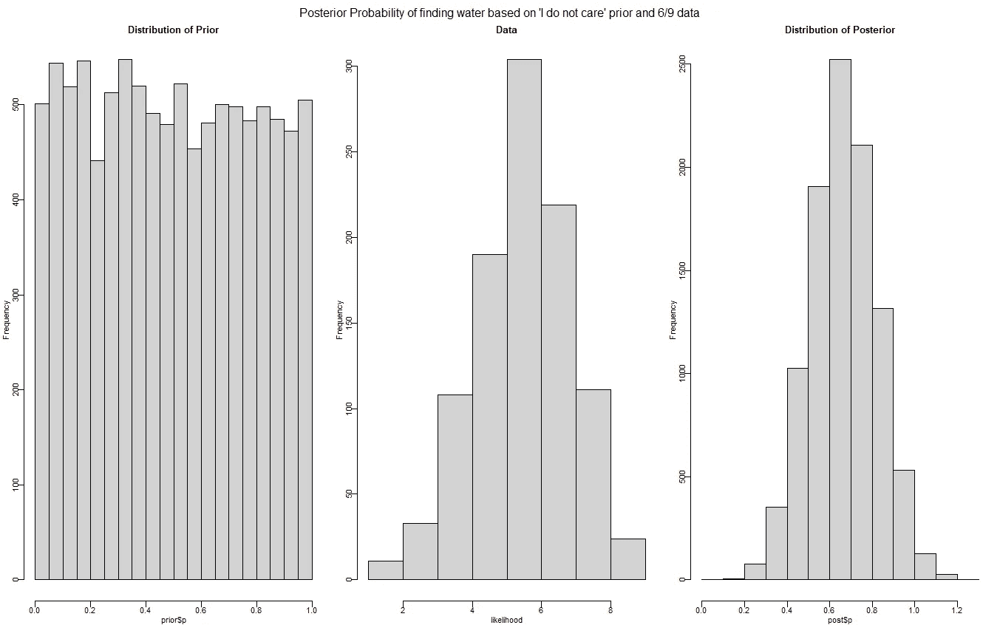
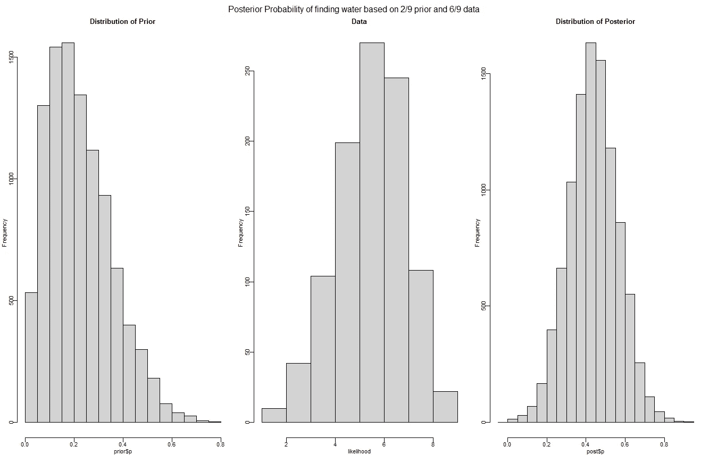
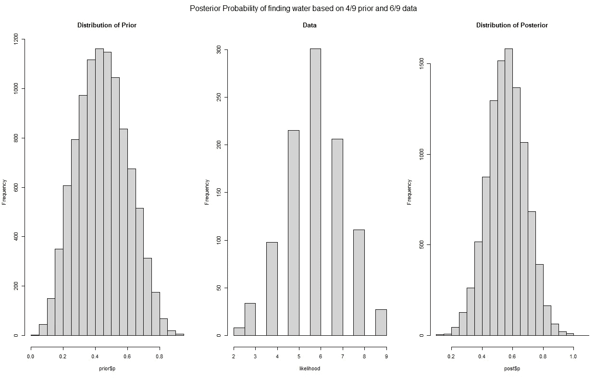
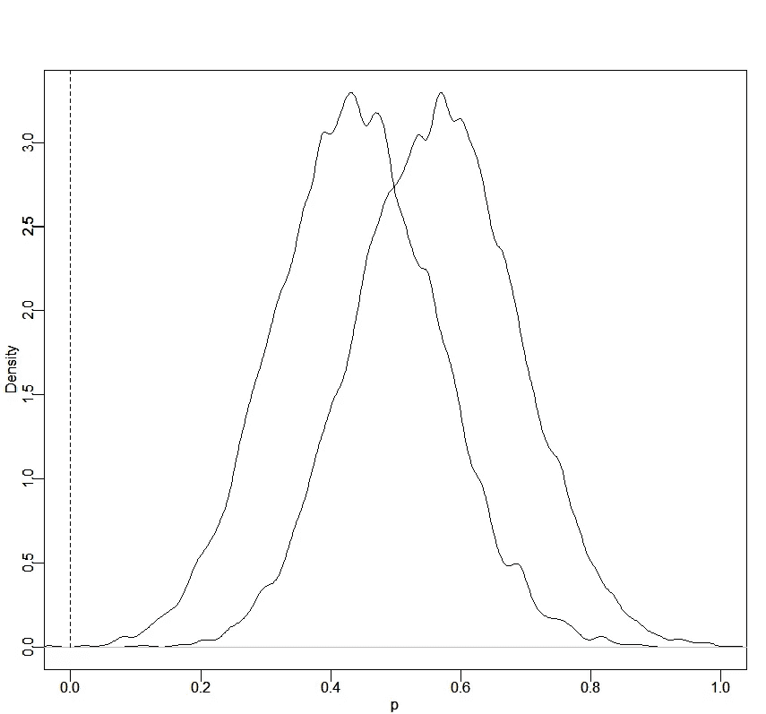

# 为什么科学是美丽的人类

> 原文：<https://medium.com/mlearning-ai/why-science-is-beautifully-human-and-very-frail-4f6225d32bb0?source=collection_archive---------2----------------------->

## 而且非常脆弱

F 或者说大多数情况下，‘概率’这个概念并不陌生。“分布”、“p 值”和“统计显著性”等概念也可能唤起一些记忆。对一些人来说，这些记忆可能不太愉快，因为统计并不容易，而且相当违反直觉。因此，世界著名的说法:“我们有谎言，该死的谎言，和统计数据”。

几年来，我一直想知道，如果统计学和概率论以一种更自然的方式得到解释，这种说法是否还会成立。一种我们抛弃统计显著性(p≤0.5)固有的二元思维，更多关注不确定性的方式。尤其是如何减少不确定性。毕竟，科学就是通过减少不确定性来增加知识。

虽然我有一个博士学位，但是我的孩子让我看到了什么是真正的无偏见的实验。每当重复他们正在做的事情，他们的知识基础就会明显扩大。因此，知识不是固体的，而是流动的，当然不是线性的。这是有意义的，因为世界上大多数(如果不是全部)的过程都是不可见的。

这就是为什么实验在受控环境中进行(使用 T2 老式的随机对照试验)的原因之一，这种环境允许你专注于某个特定的主题，但通常在现实世界中表现很差。在这里，RCT 的强度也直接是其主要限制，因为衡量**效力**(干预的最大理论效果)与衡量**效力**(现实世界的实施)是不同的。

一个很好的例子是，当汽车制造商陈述一辆汽车在最佳条件下的燃料消耗时，这与现实世界中的情况是不一样的。这使得燃料消耗率的编目毫无意义。

减少不确定性最常见的方法是重复。我怀疑这就是为什么孩子们喜欢重复，但我知道科学靠重复的优雅而生存。然而，重复并不性感，至少在科学领域如此。尽管很重要，但没有人想通过复制另一个博士来获得博士学位——即使只是为了了解无形过程的影响以及对它们存在的认可。

一开始我谈到了 p 值和统计学意义。后者是一个连续值(p 值)的二进制截断，两者都试图确定一个观察是由于“真实效应”还是“概率”的产物(概率的产物是完全没有意义的，但我们改天会冒险)。整本书都在讨论“概率”这个词，以及“p 值”和“统计显著性”。后者属于统计学的频率方法，这是每个人都知道的方法。这就是为什么它经常被称为“经典统计学”。这个名字不仅不合适，而且容易引起误解，因为我现在要讲的方法把统计学和科学的研究方法，或者至少应该是这样的方法结合起来了。幼稚的方法。贝叶斯定理。

在深入研究贝叶斯定理之前，我想谈谈贝叶斯范式。毕竟，正如“范式”这个词已经暴露的那样，它是看待机遇、举证责任和不确定性的一种方式。不确定性在贝叶斯理论中尤其起着关键作用。与频率主义者的方法相反，贝叶斯方法并不给出一个“是”或“否”的答案，而是给出一系列的答案。这一顺序反映了不确定性。因此，在贝叶斯范式中，干预是否有效的问题的答案不是“是”或“否”，而是“取决于”。对于大多数政策制定者来说，这个答案自然会让人感到不安。

科学和实验的目的是获得一个证实(或否定，但我们不想看到)假设的结果。我刚刚说过，这个答案不能是二元的，也不是结论性的。例如，有太多未知的不可见因素，无法在一项研究中证实一个假设。单靠随机化不能解决这个问题。重复是必须的，因此最好从概率的角度来考虑。这大概是根据你已经掌握的知识(促使你做这个实验)和通过实验本身获得的知识来决定的。因此，通过你自己的实验，你通过消除一点不确定性来增加一点知识。

现在，我已经解释了贝叶斯范式的样子，让我们深入研究贝叶斯定理。该定理显示了挂在同一枚硬币两侧的两个相关概率分布之间的关系。这份声明来自托马斯·贝叶斯牧师。贝叶斯定理给出了观察到 B 后 A 的概率。这个概率是通过看 A 的概率，B 的概率，和给定 A 的 B 的概率来计算的。

在公式形式中，贝叶斯定理看起来像这样:



1.  P(A | B)是从属概率:如果 B 为真，A 的概率。这也被称为后验概率。
2.  P(B | A)也是相依概率:A 为真时 B 的概率。这也叫做给定一个固定 B 的可能性，因为 P(B | A) = L(A | B)
3.  P(A)和 P(B)分别是 A 和 B 的概率。这些是边际概率，这意味着概率是不相关的。这就是所谓的先验概率。
4.  P(B)是归一化概率。以确保后路合理。

视觉上会是这样的。



我们举个例子。假设我们想要计算水/土地的分布，让我们假设我们可以通过投掷一个足够小的地球仪来找到这个分布。每当它落在水面上时，我们就写一个 W，每当它落在陆地上时，我们就写一个 l。这个例子来自书"[Statistical refreshing](https://xcelab.net/rm/statistical-rethinking/)"并且是对陈旧的正面/反面例子的一个很好的偏离。我们假设所有这些都发生在真空中。让我们用统计程序 r 来计算这个例子。

```
p_grid                   <- seq(from=0 , to=1   , length.out=20
prior                    <- dbinom(2, size=9 , prob=p_grid)
likelihood               <- dbinom(6, size=9 , prob=p_grid)
unstd.posterior          <- likelihood * prior
posterior                <- unstd.posterior / sum(unstd.posterior)plot(prior, ylim=c(0,0.5), main="Probability of water given Prior and Likelihood", ylab="Posterior Probability", xlab="Probability of Water")
lines(prior, col="black")
points(likelihood, col="blue")
lines(likelihood, col="blue")
points(unstd.posterior, col="darkgreen")
lines(unstd.posterior, col="darkgreen")
points(posterior, col="red")
lines(posterior, col="red")
text(locator(), labels = c("prior", "likelihood", 
                           "unstandardized posterior", "posterior")))
```

我上面做的是这样的:我把地球的地球仪扔了九次。我假设概率 W/L 等于 2/9。这是我的先验概率。当我观察数据时，我看到我的实验中 W/L 的比例是 6/9。这些是我的实验观察。然后，根据我的信念和我观察到的数据，我计算条件概率是多少。这一次，视觉结果如下



```
bayesdata <- as.data.frame(cbind(p_grid, 
                                 prior, 
                                 likelihood, 
                                 unstd.posterior, 
                                 posterior)

ggplot(bayesdata, aes(x=p_grid))+
geom_area(aes(y=prior),fill="black",alpha=0.5)+
geom_area(aes(y=likelihood),fill="blue",alpha=0.5)+                                geom_area(aes(y=unstd.posterior),fill="darkgreen",alpha=0.5)+                                geom_area(aes(y=posterior),fill="red",alpha=0.5)+
ggtitle("Probability of water given Prior and Likelihood")+
xlab("Probability of Water") + 
ylab("Posterior Probability")+ theme_bw()
```



如你所见，条件概率取决于你先前的信念和你观察到的数据。看下面两个例子，我采用了相同的可能性，但是不同的先验。它给出了一个完全不同的结果。

```
x=seq(0,1,0.01)
plot(dunif(x,0,1))

globe.qa                 <- quap(
  alist(
    W ~ dbinom( W+L , p) ,  # binomial likelihood
    p ~ dunif(0,1)          # uniform prior [0,1]
  ) ,
  data=list(W=6,L=3) )
precis(globe.qa )

  mean   sd 5.5% 94.5%
p 0.67 0.16 0.42  0.92

x=seq(0,1,0.01)
plot(dbeta(x,2,7))

globe.qa2                <- quap(
  alist(
    W ~ dbinom(W+L , p) ,  # binomial likelihood
    p ~ dbeta(2,7)         # beta prior - [ 2W & 7L ]
  ) ,
  data=list(W=6,L=3) )
precis(globe.qa2 ))

  mean   sd 5.5% 94.5%
p 0.44 0.12 0.24  0.64
```

我们可以扩展上述内容，使其可视化。下面的例子看起来是这样的:

```
x=seq(0,1,0.01)
plot(dunif(x,0,1))

globe.qa                 <- quap(
  alist(
    W ~ dbinom( W+L , p) ,  # binomial likelihood
    p ~ dunif(0,1)          # uniform prior [0,1] --> I do not care
  ) ,
  data=list(W=6,L=3) )
precis(globe.qa )

prior <- extract.prior(globe.qa, n=1e4); hist(prior$p)
likelihood               <- rbinom(1000,9,6/9)
post  <- extract.samples(globe.qa, n=1e4);hist(hist(post$p))

par(mfrow = c(1, 3),oma = c(0, 0, 2, 0))
hist(prior$p, main="Distribution of Prior");hist(likelihood, main="Data");hist(hist(post$p, main="Distribution of Posterior"))
mtext("Posterior Probability of finding water based on 2/9 prior and 6/9 data", outer = TRUE, cex = 1)
```



```
x=seq(0,1,0.01)
plot(dbeta(x,2,7))

globe.qa2                <- quap(
  alist(
    W ~ dbinom(W+L , p) ,  # binomial likelihood
    p ~ dbeta(2,7)         # beta prior - [ 2W & 7L ]
  ) ,
  data=list(W=6,L=3) )
precis(globe.qa2 )

prior <- extract.prior(globe.qa2, n=1e4); hist(prior$p)
likelihood               <- rbinom(1000,9,6/9)
post  <- extract.samples(globe.qa2, n=1e4);hist(hist(post$p))

par(mfrow = c(1, 3),oma = c(0, 0, 2, 0))
hist(prior$p, main="Distribution of Prior");hist(likelihood, main="Data");hist(hist(post$p, main="Distribution of Posterior"))
mtext("Posterior Probability of finding water based on 2/9 prior and 6/9 data", outer = TRUE, cex = 1)
```



上面的例子是很多人都有困难的，因为你可以用先验作为自我实现的预言。因此，证实从好的研究中获得的知识是很重要的。此外，你也可以通过不使你挂在上面的重量太大来削弱先验。你可以通过扩展分布来实现。也就是说，可能性越多，单一的可能性就越少。这完全取决于你对不确定性的重视程度。

关于这一点，我想再次强调承认科学的主观性是多么重要。除了主观性是科学过程固有的一部分，以及忽略先前的信息(如果先前的研究明确提供)是完全不科学的事实之外，这里要提出的主要观点是，这种选择不是任意的。

以这种方式看待统计数据，你可以更好地将统计数据与科学联系起来。它提供了一种自然而有原则的方法，在一个坚实的决策理论框架内将先验信息与数据结合起来。因此，过去(由他人)获得的信息可以合并到参数中，并形成用于未来分析的分布。当新的观测值可用时，以前的后验分布可以用作先验分布。所有的推论都合乎逻辑地遵循贝叶斯定理。

让我们继续上面的例子，并使用结果(后验)作为新的先验。为了方便起见，我们假设数据显示的是完全相同的结果(难以置信！).那我们会在哪里结束呢？新的先验如下所示:

```
par(mfrow = c(1, 2),oma = c(0, 0, 2, 0))
prior<-rbinom(10000,9,globe.qa2@coef[[1]])  # 0.4375002
hist(prior, main="Histogram of binomial(4,9") 
abline(v=(0.4375002*9), col="red", lty=2, lwd=1)
hist(rbeta(100000,4,5),main="Histogram of beta(4,5")
abline(v=(0.4375002), col="red", lty=2, lwd=1)
mtext("New priors based on old posterior as simulated via the binomial or beta distribution", outer = TRUE, cex = 1)
```


让我们扩展这个例子，继续计算。

```
globe.qa3                <- quap
  alist(
    W ~ dbinom(W+L, p) ,  # binomial likelihood
    p ~ dbeta(4,5)        # beta prior based on old posterior
  ) ,
  data=list(W=6,L=3) )
precis(globe.qa3)

  mean   sd 5.5% 94.5%
p 0.56 0.12 0.36  0.76

prior <- extract.prior(globe.qa3, n=1e4); hist(prior$p)
likelihood               <- rbinom(1000,9,6/9)
post  <- extract.samples(globe.qa3, n=1e4);hist(hist(post$p))

par(mfrow = c(1, 3),oma = c(0, 0, 2, 0))
hist(prior$p, main="Distribution of Prior");hist(likelihood, main="Data");hist(hist(post$p, main="Distribution of Posterior"))
mtext("Posterior Probability of finding water based on 4/9 prior and 6/9 data", outer = TRUE, cex = 1)
```



你可以看到找到水的概率分布的分布，随着我们之前的发现和新数据的变化而变化。我们可以这样做很多次，每次我们都可以获得更多的知识。或者多一点不确定性，但不确定性也是知识。

```
post_old  <- extract.samples(globe.qa2, n=1e4)
dens(post_old,xlim=c(0,1));par(new=TRUE
post_new  <- extract.samples(globe.qa3, n=1e4)
dens(post_new,xlim=c(0,1), add=TRUE))
```



通过贝叶斯分析，我们不会像在传统环境中那样猜测特定的值，而是理解我们知识的极限，并获得对这些猜测的不确定性的健康感觉。贝叶斯逻辑回归仍然是逻辑回归。贝叶斯部分与人们用来解释结果的概率观点以及如何进行估计有关。

[](/mlearning-ai/mlearning-ai-submission-suggestions-b51e2b130bfb) [## Mlearning.ai 提交建议

### 如何成为 Mlearning.ai 上的作家

medium.com](/mlearning-ai/mlearning-ai-submission-suggestions-b51e2b130bfb)