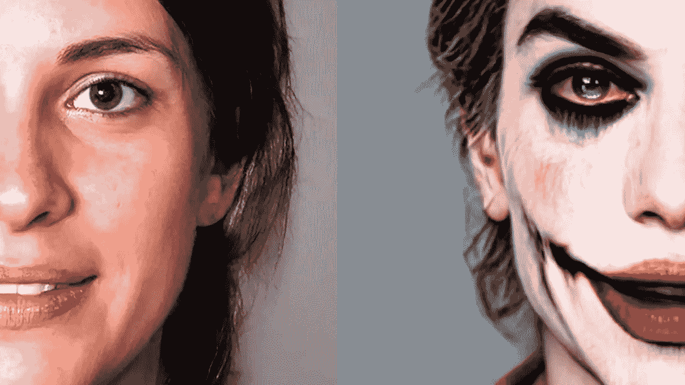

# 你的人工智能艺术生成器从零开始

> 原文：<https://medium.com/mlearning-ai/your-ai-art-generator-from-scratch-df122f318dbe?source=collection_archive---------1----------------------->

## [机器学习艺术](https://mlearning.substack.com/p/train-your-ai-art-generator-from?r=9hp4d&s=w&utm_campaign=post&utm_medium=web)

## [演示+代码](#38e5) [ [更新 2023](https://open.substack.com/pub/mlearning/p/state-of-the-ai-art-january-2023?r=z7zu8&utm_campaign=post&utm_medium=web) ]

[Your AI Art Generator from scratch using only Text. DEMO + CODE](https://mlearning.substack.com/p/train-your-ai-art-generator-from?r=9hp4d&s=w&utm_campaign=post&utm_medium=web)

## 🟠在这里:[人工智能艺术的状态 2023 年 1 月](https://open.substack.com/pub/mlearning/p/state-of-the-ai-art-january-2023?r=z7zu8&utm_campaign=post&utm_medium=web)

## 🔵[只使用文本从零开始训练你的人工智能艺术生成器](https://mlearning.substack.com/p/train-your-ai-art-generator-from?r=9hp4d&s=w&utm_campaign=post&utm_medium=web)