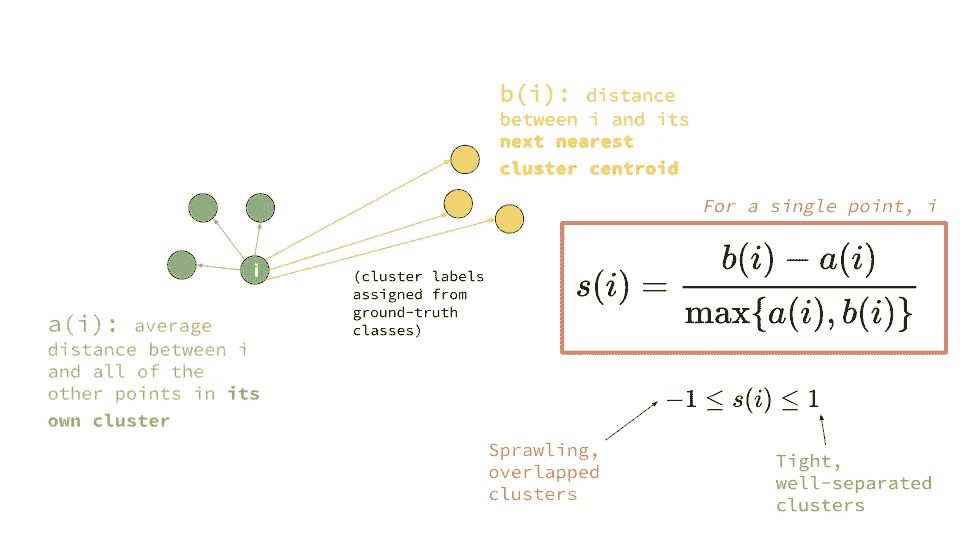
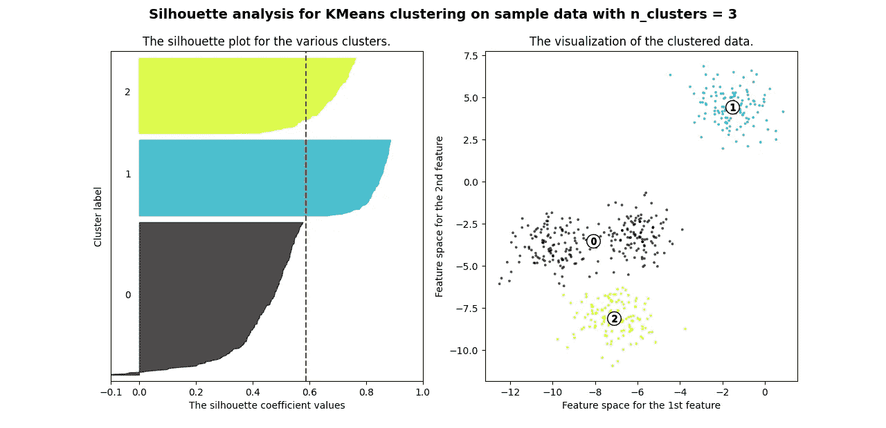
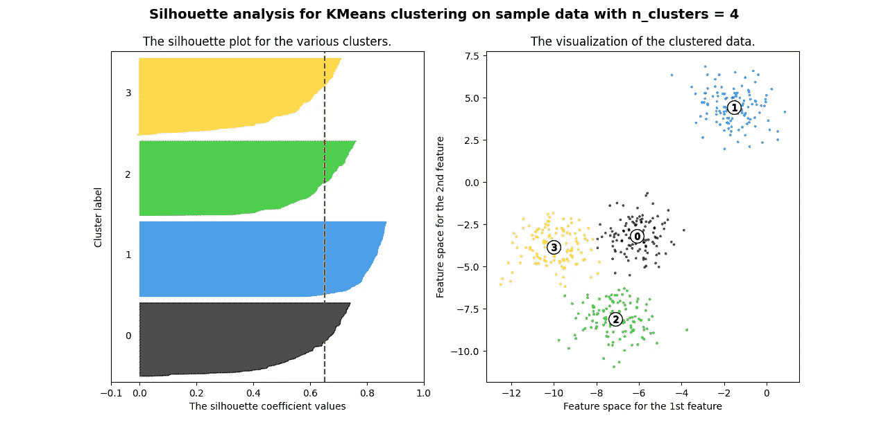

# 集群就绪，下一步是什么？剪影评分。

> 原文：<https://medium.com/mlearning-ai/youve-got-the-clusters-what-s-next-silhouette-scoring-7846faa0bc6c?source=collection_archive---------9----------------------->

## 使用轮廓分数评估 K-Means 算法的指南(及其背后的一些数学知识)

Photo by [Stefano Pollio](https://unsplash.com/@stefanopollio?utm_source=medium&utm_medium=referral) on [Unsplash](https://unsplash.com?utm_source=medium&utm_medium=referral)

在 K-Means 中，只在故事的一个部分设置聚类，解释它们是另一个部分。

当你完成了 K-Means 聚类，自然的问题是:我的聚类真的好吗？

要回答这个问题，我们首先需要定义什么是“好的”集群。有两种主要方法可以确定一个集群的好坏:

**剪影得分—** 剪影得分衡量每个聚类的紧密度及其与其他聚类的距离。轮廓分数由以下公式给出:

Credits to Platform.ai for this wonderful diagram

综上所述，我们正在处理 2 个距离:a 和 b。距离 **b(i)** 是从任意点到最近质心的距离。距离 **a(i)** 是某个点和该簇中所有其他点之间的平均距离。

让我们弄清楚这个公式是关于什么的:

Explanation of the silhouette score formula

下一个浮现在脑海中的问题是**——什么剪影评分被认为是‘好’？**好成绩是每次都‘好’，还是因聚类而异？

让我们来回答这些问题。

## 我怎么知道我的剪影评分好？

首先，让我们分解轮廓分数的极端情况:

**1** —这个分数意味着每个数据点在它所属的聚类内非常紧凑，并且远离其他聚类。

**0** —您的聚类重叠。

**-1** —该分数表示属于聚类的数据不正确。

随着分数从 0 到 1，聚类变得更加分离，而其中的点更加靠近。由于您的分数趋向于从 0 到-1，分数可能被分配到错误的簇。

## 如何绘制剪影配乐？

轮廓分数对于确定您是否选择了正确的聚类数非常有用。在下面的代码中，我们测试生成的数据集有 2、3、4、5 和 6 个集群。

Thanks to **scikit-learn** for this sample

你得到的所有图看起来都是这样的:

轮廓分数值越高，聚类的分布越好。这里，聚类的最佳数量将是 4。

> 根据一般经验，任何大于 0.6 的轮廓分数都被认为是可取的

今天到此为止🚀

 [## Mlearning.ai 提交建议

### 如何成为 Mlearning.ai 上的作家

medium.com](/mlearning-ai/mlearning-ai-submission-suggestions-b51e2b130bfb)