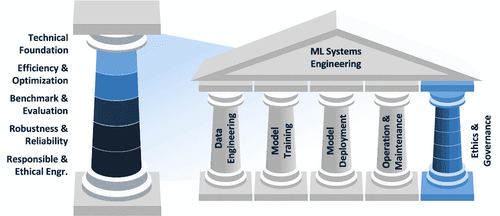

# 引言

*DALL·E 3 提示：一个详细的、矩形的、平面的 2D 插图，展示了一本关于机器学习系统章节的路线图，背景为清晰、干净的白色。图像中有一条蜿蜒的道路穿过各种象征性的地标。每个地标代表一个章节主题：引言、机器学习系统、深度学习、AI 工作流程、数据工程、AI 框架、AI 训练、高效 AI、模型优化、AI 加速、AI 基准测试、设备上学习、嵌入式 AIOps、安全与隐私、负责任 AI、可持续 AI、AI 做善事、鲁棒 AI、生成 AI。风格简洁、现代、扁平，适合技术书籍，每个地标都清楚地标有其章节标题。*


## 目的

*为什么我们必须掌握治理能够学习、适应和在大规模上运行的系统的工程原则？*

机器学习代表了自可编程计算机以来计算领域最重大的变革，它使得系统的行为从数据中产生，而不是从明确的指令中产生。这种变革需要新的工程基础，因为传统的软件工程原则无法解决基于经验学习和适应的系统。从气候建模和医疗诊断到自主交通，每一个主要的技术挑战都需要能够处理大量数据并在不确定性下可靠运行的系统。理解机器学习系统工程决定了我们解决超出人类认知能力复杂问题的能力。这一学科为构建能够在部署环境中扩展的系统提供了基础，从大型数据中心到资源受限的边缘设备，为 21 世纪的技术进步奠定了技术基础。

**学习目标**

+   将机器学习系统定义为包含数据、算法和基础设施的集成计算系统

+   通过故障模式分析区分机器学习系统工程与传统软件工程

+   使用 AI 三角形框架分析数据、算法和计算基础设施之间的相互依赖关系

+   跟踪从符号系统到统计学习再到深度学习的 AI 范式的历史演变

+   评估 Sutton 的“苦涩教训”对现代机器学习系统工程优先级的含义

+   将机器学习系统中的静默性能下降与传统软件故障模式进行比较

+   对比机器学习系统生命周期阶段与传统软件开发

+   将机器学习系统中的现实挑战按数据、模型、系统和伦理类别进行分类

+   应用五支柱框架评估机器学习系统架构

## 人工智能的工程革命

今天的工程实践正处于一个转折点，其重要性可与科技史上最具变革性的时期相媲美。工业革命确立了机械工程作为一门管理物理力的学科，而数字革命则正式化了计算工程，以处理算法复杂性。如今，人工智能系统需要一种新的工程范式来应对表现出学习行为、自主适应和操作规模超越传统软件工程方法的新系统。

这种转变重新定义了工程系统的本质。传统的确定性软件架构根据显式编程的指令运行，对给定的输入产生可预测的输出。相比之下，机器学习系统是概率性架构，其行为源于从训练数据中提取的统计模式。这种转变引入了工程挑战，这些挑战定义了机器学习系统工程的学科：确保在行为是通过学习而非编程的系统中的可靠性，实现处理 PB 级 1 数据集并服务于数十亿并发用户时的可扩展性，以及在操作数据分布与训练数据分布不一致时保持鲁棒性。

这些挑战为机器学习系统工程作为一门独立的学术学科的理论和实践基础奠定了基础。本章提供了理解这一领域的创建历史和区分机器学习系统与传统软件架构的工程原则的概念基础。分析综合了来自计算机科学、系统工程和统计学习理论的观点，为智能系统的系统研究建立了一个框架。

我们的调查从人工智能作为研究目标与机器学习作为实现智能行为的计算方法之间的关系开始。然后我们确定了构成机器学习系统的要素，即该学科构建的包含数据、算法和基础设施的集成计算系统。通过历史分析，我们追溯了人工智能范式的演变，从符号推理系统到统计学习方法，再到当代深度学习架构，展示了每个过渡都要求新的工程解决方案。这一进展照亮了 Sutton 的“苦涩教训”：领域通用的计算方法最终会超越手工构建的知识表示，将系统工程定位为人工智能进步的核心。

这个历史和技术基础使我们能够正式定义这一学科。遵循计算机工程从电气工程和计算机科学中诞生的模式，我们将它确立为一个专注于在计算平台构建可靠、高效和可扩展机器学习系统的领域。这个正式定义既涵盖了实践中使用的术语，也涵盖了从业者实际构建的技术范围。

在这个基础上，我们引入了结构化本文本中机器学习系统分析的理论框架。AI 三角提供了一个理解数据、算法和计算基础设施之间相互依赖关系的概念模型。我们考察机器学习系统生命周期，将其与传统软件开发方法进行对比，以突出问题制定、数据整理、模型开发、验证、部署和持续维护等独特阶段，这些阶段是机器学习系统工程的特征。

这些理论框架通过考察代表性的部署场景得到证实，这些场景展示了应用领域内工程需求的多样性。从在网络边缘运行且具有严格延迟约束的自动驾驶汽车到通过云基础设施为数十亿用户提供服务的推荐系统，这些案例研究说明了部署环境如何塑造系统架构和工程权衡。

分析通过确定建立机器学习系统工程为必要且复杂学科的核心理念而结束：需要专门监控方法的静默性能退化模式，数据质量问题和分布变化损害了模型的有效性，对模型在高风险应用中的鲁棒性和可解释性的要求，超出传统分布式系统的基础设施可扩展性需求，以及强加新的系统要求类别的伦理考量。这些挑战为构建文本的五支柱组织框架提供了基础，将机器学习系统工程划分为相互关联的子学科，以促进稳健、可扩展和负责任的人工智能系统的发展。

本章为第一部分：系统基础，建立了理论基础，介绍了所有后续对机器学习系统工程分析的基础原则。这里引入的概念框架提供了将在后续章节中完善和应用的分析工具，最终形成一个能够在生产环境中可靠地交付人工智能能力的系统工程方法。

## 从人工智能愿景到机器学习实践

在确立了人工智能在社会各领域的变革性影响之后，一个问题随之而来：我们实际上如何创建这些智能能力？理解人工智能与机器学习之间的关系是回答这个问题的关键，也是本书后续所有内容的中心。

人工智能代表了创建能够执行需要类似人类智能的任务的系统的广泛目标：识别图像、理解语言、做出决策和解决问题。人工智能是“什么”，是智能机器可以学习、推理和适应的愿景。

机器学习（ML）代表了创建表现出智能行为的系统的方法论方法和实践学科。而不是通过预定的规则实现智能，机器学习提供了通过数学过程自动发现数据中模式的计算技术。这种方法将人工智能的理论洞察转化为功能系统。

以棋类系统的演变为例，说明这种转变。人工智能的目标保持不变：“创建一个可以像人类一样下棋的系统。”然而，方法不同：

+   **符号人工智能方法（预机器学习）**：用所有棋规和手工策略，如“控制中心”和“保护国王”，编程计算机。这需要专家程序员明确编码数千条棋理，从而创建出脆弱的系统，这些系统在处理新位置时遇到困难。

+   **机器学习方法**：让计算机分析数百万场棋局，从数据中自动学习获胜策略。而不是编程特定的走法，系统通过分析游戏结果进行统计分析，发现导致胜利的模式。

这种转变说明了为什么机器学习已成为主导方法：在基于规则的系统中，人类将领域专业知识直接转换为代码。在机器学习系统中，人类整理训练数据，设计学习架构，并定义成功指标，使系统能够从示例中提取自己的操作逻辑。数据驱动系统可以适应程序员从未预料到的情况，而基于规则的系统仍然受限于其原始编程。

机器学习系统通过与人学习模式平行的过程获得识别能力。物体识别通过接触大量示例而发展，而自然语言处理系统通过广泛的文本分析获得语言能力。这些学习方法将人工智能研究中发展的智能理论转化为实际操作，建立在我们在整篇文章中系统建立的数学基础上。

AI 作为研究愿景与 ML 作为工程方法之间的区别对系统设计具有重大影响。现代 ML 的数据驱动方法需要能够收集、处理和从大量数据中学习的基础设施。通过广泛的研究和主要范式转变 2，机器学习成为人工智能的一种实用方法，将关于智能的理论原则转化为形成今天智能能力算法基础的运行系统。

**人工智能（AI**）是计算机科学的一个领域，专注于创建执行需要类似人类**智能**的任务的系统，包括**学习**、**推理**和**适应**。

**机器学习（ML**）是使系统能够从数据中自动学习**模式**并做出**决策**的 AI 方法，而不是遵循明确的编程规则。

从基于规则的 AI 到数据驱动的 ML 的演变代表了计算历史上最重大的转变之一。这种转变解释了为什么机器学习系统工程成为一门学科：通往智能系统的道路现在是通过构建能够从大量数据中有效学习的系统这一工程挑战。

## 定义 ML 系统

在探索我们如何到达现代机器学习系统之前，我们首先必须确立我们所说的“ML 系统”的含义。这个定义为我们理解历史演变和随之而来的当代挑战提供了概念框架。

对于机器学习系统尚无普遍接受的定义，这反映了该领域的快速演化和跨学科性质。然而，基于我们对现代 ML 依赖于大规模数据驱动方法的了解，这本教科书采用了一种涵盖算法运行整个生态系统的视角：

**机器学习系统**是由三个相互依存的组件组成的集成计算系统：**数据**指导行为，**算法**学习模式，以及**计算基础设施**使**训练**和**推理**成为可能。

如图 1.1 所示，任何机器学习系统的核心由三个相互关联的组件组成，形成一个三角形的依赖关系：模型/算法、数据和计算基础设施。每个元素都塑造了其他元素的可能性。模型架构决定了训练和推理的计算需求，以及有效学习所需的数据量和结构。数据的规模和复杂性影响所需的存储和处理基础设施，同时确定哪些模型架构是可行的。基础设施能力为模型规模和数据处理能力设定了实际限制，为其他组件必须运行的框架。


图 1.1：**组件相互依赖性**：机器学习系统性能依赖于模型、数据和计算基础设施的协调交互；任何一个组件的限制都会约束其他组件的能力。有效的系统设计需要平衡这些相互依赖关系，以优化整体性能和可行性。

每个组件都服务于一个独特但相互关联的目的：

+   **算法**：从数据中学习模式以进行预测或决策的数学模型和方法

+   **数据**：收集、存储、处理、管理和为训练和推理提供数据的流程和基础设施

+   **计算**：支持大规模训练、服务和管理模型的硬件和软件基础设施

如三角形所示，没有任何一个元素可以独立运作。算法需要数据和计算资源，大量数据集需要算法和基础设施才能发挥作用，而基础设施需要算法和数据才能实现任何目的。

太空探索为这些关系提供了一个恰当的类比。算法开发者类似于探索新领域的宇航员和发现者。数据科学团队就像任务控制专家，确保任务操作中关键信息和资源的持续流动。计算基础设施工程师类似于火箭工程师，设计和构建支持任务的系统。正如太空任务需要宇航员、任务控制和火箭系统的无缝集成一样，机器学习系统需要仔细协调算法、数据和计算基础设施。

当考察人工智能历史上的突破性时刻时，这些相互依赖关系变得清晰。2012 年的 AlexNet3 突破体现了定义现代机器学习系统工程的硬件-软件协同设计原则。这次深度学习革命之所以成功，是因为算法创新（卷积神经网络）与硬件能力（并行 GPU 架构）相匹配，原本为游戏设计的图形处理单元被重新用于人工智能计算，为机器学习任务提供了 10-100 倍的速度提升。卷积操作本质上是并行的，这使得它们非常适合 GPU 的数千个并行核心。这种协同设计方法继续塑造整个行业中的机器学习系统开发。

在建立这个三组件框架之后，我们必须理解一个基本区别，这个区别区分了机器学习系统与传统软件：AI 三角形组件中失败的表现。

## 机器学习系统与传统软件的区别

AI 三角形框架揭示了机器学习系统由什么组成：指导行为的资料，提取模式的算法，以及使学习和推理成为可能的基础设施。然而，仅仅理解这些组件并不能捕捉到使机器学习系统工程与传统软件工程根本不同的地方。关键的区别在于这些系统如何失败。

传统软件表现出明显的故障模式。当代码出错时，应用程序会崩溃，错误信息会传播，监控系统会触发警报。这种即时反馈使得快速诊断和修复成为可能。系统要么正确运行，要么出现可观察到的故障。机器学习系统在根本上是不同的范式：它们可以在性能下降的同时继续运行，而不会触发传统的错误检测机制。算法继续执行，基础设施继续提供预测服务，但学习到的行为变得越来越不准确或与上下文不相关。

考虑一下自动驾驶汽车的感知系统如何说明这种区别。传统的汽车软件表现出二元的操作状态：发动机控制单元要么正确管理燃油喷射，要么触发诊断警告。通过标准监控，故障模式仍然是可观察的。基于机器学习的感知系统提出了一个质的不同挑战：由于季节变化——不同的光照条件、服装模式或训练数据中未充分代表的天气现象，该系统在几个月内检测行人的准确性可能会从 95%下降到 85%。车辆继续运行，成功检测到大多数行人，但性能下降创造了只有通过系统性地监控边缘情况和全面评估才能显现的安全风险。传统的错误记录和警报机制在系统变得可测量地不安全时保持沉默。

这种无声的退化体现在 AI 三角形的三个组成部分中。随着世界的变化，数据分布也在变化：用户行为在演变，季节性模式出现，新的边缘情况出现。算法继续基于过时的学习模式进行预测，而不知道它们的训练分布已经不再与操作现实相匹配。基础设施忠实地服务于这些越来越不准确的预测，放大了问题。一个经历这种退化的推荐系统可能会在六个月内从 85%的准确率下降到 60%，因为用户偏好发生变化，训练数据变得陈旧。系统继续生成推荐，用户收到结果，基础设施报告健康的服务时间指标，但商业价值却在无声地侵蚀。这种退化通常源于训练-服务偏差，即训练和服务管道中计算的特征不同，导致模型性能下降，尽管代码没有改变，这是一个表现为算法失败的基础设施问题。

这种基本不同的失败模式以要求新的工程实践的方式将机器学习系统与传统软件区分开来。传统的软件开发侧重于消除错误和确保确定性行为。机器学习系统工程必须解决概率行为、演化的数据分布以及没有代码更改发生的性能退化。监控系统必须跟踪的不仅仅是基础设施健康，还有模型性能、数据质量和预测分布。部署实践必须能够实现数据分布变化时的持续模型更新。整个系统生命周期，从数据收集到模型训练再到推理服务，必须考虑到无声的退化。

这种操作现实确立了为什么在研究环境中开发的机器学习系统需要专门的工程实践才能达到生产部署。机器学习系统所要求的独特生命周期和监控需求直接源于这种失败特征，确立了机器学习系统工程作为一个独立学科的内在动机。

理解机器学习系统如何以不同的方式失败，提出了一个重要的问题：鉴于 AI 三角形的三个组成部分——数据、算法和基础设施——我们应该优先考虑哪个来推进人工智能的能力？我们应该投资于更好的算法、更大的数据集，还是更强大的计算基础设施？这个问题的答案揭示了为什么系统工程已经成为人工智能进步的核心。

## 《痛苦的教训：为什么系统工程很重要》

70 年人工智能研究最大的教训是，能够利用大规模计算的系统能够最终获胜。这就是为什么系统工程，而不仅仅是算法的巧妙性，已经成为人工智能进步的瓶颈。

从符号人工智能到统计学习再到深度学习的演变，对系统构建者提出了一个基本问题：我们应该专注于开发更复杂的算法、整理更好的数据集，还是构建更强大的基础设施？

这个问题的答案塑造了我们对构建人工智能系统的方法，并揭示了为什么系统工程已成为一门学科。

历史提供了统一的答案。在数十年的 AI 研究中，最大的突破并非来自对人类知识的更好编码或更多的算法技术，而是找到了更有效地利用更多计算资源的方法。这种模式，由强化学习先驱理查德·萨顿在 2019 年的文章《苦涩的教训》（Sutton 2019）中阐述，表明系统工程已成为人工智能成功的决定因素。

萨顿观察到，强调人类专业知识和领域知识的途径，虽然能带来短期改进，但始终被能够利用大量计算资源的一般方法超越。他写道：“从 70 年的 AI 研究中可以得出的最大教训是，利用计算的一般方法最终是最有效的，并且差距很大。”

这一原则在人工智能的突破中得到了验证。在棋类游戏中，IBM 的 Deep Blue 在 1997 年击败了世界冠军加里·卡斯帕罗夫（Campbell, Hoane, and Hsu 2002），并非通过编码棋类策略，而是通过每秒评估数百万个位置的暴力搜索。在围棋中，DeepMind 的 AlphaGo（Silver et al. 2016）通过自我对弈学习而非研究数百年的围棋智慧，实现了超人类的表现。在计算机视觉中，直接从数据中学习特征的卷积神经网络超越了数十年的手工特征工程。在语音识别中，端到端深度学习系统优于基于详细的人类语音学和语言学的模型的方法。

这节课的“苦涩”之处在于我们的直觉误导了我们。我们自然地认为，将人类专业知识编码化应该是通往人工智能的道路。然而，在足够大的规模下，反复证明的是，利用计算从数据中学习的系统优于依赖人类知识的系统。这一模式在符号人工智能、统计学习和深度学习时代都得到了保持——我们将在下一节追踪人工智能的历史演变时详细探讨这一一致性。

考虑现代语言模型如 GPT-4 或图像生成系统如 DALL-E。它们的强大功能并非源于人类编码的语言或艺术理论，而是通过在大量数据上使用巨大的计算资源训练通用神经网络而实现的。训练 GPT-3 消耗了大约 1,287 MWh 的能源 (Strubell, Ganesh, and McCallum 2019a; D. Patterson et al. 2021a)，相当于 120 个美国家庭一年的能源消耗，而服务于数百万用户则需要消耗兆瓦级持续功率的数据中心。工程挑战在于构建能够管理这种规模系统的系统：收集和处理 PB 级的训练数据，协调数千个每个消耗 300-500 瓦的 GPU 进行训练，以毫秒级延迟向数百万用户提供模型服务，同时管理热能和电力限制 5，并基于实际性能持续更新系统。

这些规模需求揭示了技术现实：现代机器学习系统的主要限制不是计算能力，而是内存带宽 6，即数据在存储和处理单元之间移动的速度。这个内存墙代表了决定系统性能的主要瓶颈。现代机器学习系统受内存限制，矩阵乘法操作只能达到理论峰值 FLOPS 的 1-10%，因为处理器大部分时间都在等待数据而不是计算。将 1GB 数据从 DRAM 移动需要大约比 32 位乘法操作多 1000 倍的能源，使得数据移动成为性能和能耗的主要因素。Amdahl 定律 7 量化了这种基本限制：如果数据移动消耗了 80% 的执行时间，即使有无限的计算能力也只能提供 1.25 倍的速度提升（因为只有剩余的 20% 可以加速）。这个内存墙推动了所有现代架构创新，从内存计算和近数据处理到将计算和存储元素协同定位的专用加速器。这些系统级挑战代表了本书系统性地探讨的核心工程问题。

Sutton 的惨痛教训有助于解释本书的动机。如果人工智能的进步取决于我们有效扩展计算的能力，那么理解如何构建、部署和维护这些计算系统就成为了人工智能从业者最重要的技能。机器学习系统工程变得重要，因为创建现代系统需要协调多个数据中心中的数千个 GPU，处理 PB 级的文本数据，并以毫秒级延迟向数百万用户提供模型服务。这一挑战需要分布式系统 8、数据工程、硬件优化和运营实践方面的专业知识，这代表了一个全新的工程学科。

这些系统级挑战的汇聚表明，没有现有学科能够满足现代 AI 的需求。虽然计算机科学推动了机器学习算法的发展，而电气工程开发了专门的 AI 硬件，但单独的这两个学科都无法提供部署、优化和大规模维持 ML 系统所需的工程原则。这个差距需要一个新的工程学科。但为了理解为什么这个学科现在出现以及它采取的形式，我们必须首先追溯 AI 本身的演变，从早期的符号系统到现代机器学习。

## AI 范式的历史演变

通过“苦涩教训”我们确立的系统中心视角并非一夜之间出现。它是在数十年的 AI 研究中逐渐形成的，每一次主要转变都揭示了算法、数据和计算基础设施之间关系的新见解。追踪这一演变不仅帮助我们理解技术进步，还解释了今天对可扩展系统的重视背后的方法转变。

理解为什么现在会发生这种向系统化机器学习的转变，需要认识到在过去十年中三个因素的汇聚：

1.  **大规模数据集**：互联网时代通过网页内容、社交媒体、传感器网络和数字交易创造了前所未有的数据量。像 ImageNet（数百万个标记图像）和 Common Crawl（数十亿个网页）这样的公共数据集为学习复杂模式提供了原材料。

1.  **算法突破**：深度学习在计算机视觉到自然语言处理等多个领域都证明非常有效。像 transformers、注意力机制和迁移学习等技术使得模型能够从数据中学习可泛化的表示。

1.  **硬件加速**：最初为游戏设计的图形处理单元（GPU）为机器学习计算提供了 10-100 倍的加速。云计算基础设施使得这种计算能力在没有大量资本投资的情况下变得可访问。

这种汇聚解释了为什么我们从理论模型转向了需要新工程学科的大规模部署系统。每个因素都放大了其他因素：更大的数据集需要更多的计算，更好的算法证明了更大的数据集的合理性，而更快的硬件使得更多的算法成为可能。这种汇聚将 AI 从学术好奇心转变为需要稳健工程实践的生产技术。

AI 的演变，如图 1.2 所示的时间线所示，突出了关键里程碑，如 1957 年由 Frank Rosenblatt(Wolfe et al. 2024)开发的感知器 9，这是一种早期的计算学习算法。1965 年的计算机实验室 10 中运行着能够证明基本数学定理或玩简单的游戏如井字棋的主机。尽管这些早期的人工智能系统在当时具有开创性，但它们与今天在医学图像中检测癌症或理解人类语音的机器学习系统相比，存在很大差异。时间线显示了从 1966 年的 ELIZA11 聊天机器人等早期创新到 1997 年 IBM 的 Deep Blue 击败国际象棋冠军 Garry Kasparov 等重要突破的进展(Campbell, Hoane, and Hsu 2002)。更近期的进步包括 2020 年 OpenAI 的 GPT-3 和 2023 年的 GPT-4(OpenAI et al. 2023)的引入，展示了几十年间 AI 系统的显著演变和日益增加的复杂性。


图 1.2：**AI 发展时间线**：早期 AI 研究侧重于符号推理和基于规则的系统，而现代 AI 利用如神经网络等数据驱动方法来实现越来越复杂的任务。这种进展揭示了从手编智能到学习智能的转变，以感知器、Deep Blue 和 GPT-3 等大型语言模型等里程碑为标志。

检查这个时间线可以揭示几个不同的发展时期，每个时期都是在其前辈的教训基础上建立起来的，同时解决阻碍早期方法实现其承诺的限制。

### 符号人工智能时代

机器学习的故事始于 1956 年的历史性达特茅斯会议 12，在那里，像 John McCarthy、Marvin Minsky 和 Claude Shannon 这样的先驱首次提出了“人工智能”一词(McCarthy et al. 1955)。他们的方法假设智力可以归结为符号操作。1964 年 Daniel Bobrow 的 STUDENT 系统(Bobrow 1964)通过自然语言理解解决代数文字问题，是这个时代的典范。

```py
Problem: "If the number of customers Tom gets is twice the
square of 20% of the number of advertisements he runs, and
the number of advertisements is 45, what is the number of
customers Tom gets?"

STUDENT would:

1\. Parse the English text
2\. Convert it to algebraic equations
3\. Solve the equation: n = 2(0.2 × 45)²
4\. Provide the answer: 162 customers
```

早期的 AI，如 STUDENT，存在一个限制：它们只能处理与它们预先编程的模式和规则完全匹配的输入。这种“脆弱性”13 意味着，尽管这些解决方案在处理为它们设计的非常具体的案例时可能看起来很智能，但面对即使是微小的变化或现实世界的复杂性时，它们会完全崩溃。这种限制推动了向统计方法演化的进程，我们将在下一节中探讨。

### 专家系统时代

认识到符号人工智能的局限性，到 20 世纪 70 年代中期，研究人员承认通用人工智能过于雄心勃勃，并将他们的重点转向在特定、定义明确的领域中捕获人类专家知识。MYCIN(Shortliffe 1975)，由斯坦福大学开发，成为第一个大规模专家系统之一，旨在诊断血液感染。

```py
Rule Example from MYCIN:
IF
  The infection is primary-bacteremia
  The site of the culture is one of the sterile sites
  The suspected portal of entry is the gastrointestinal tract
THEN
  Found suggestive evidence (0.7) that infection is bacteroid
```

MYCIN 代表了医疗人工智能的一个重大进步，拥有 600 条专家规则用于诊断血液感染，但它也揭示了当代机器学习中持续存在的关键挑战。从人类专家那里获取领域知识并将其转化为精确的规则既耗时又困难，因为医生往往无法准确解释他们是如何做出决定的。与能够做出有根据的猜测的人类医生不同，MYCIN 在处理不确定或不完整信息时遇到了困难。随着 MYCIN 的增长，维护和更新规则库变得更加复杂，因为添加新规则往往与现有规则冲突，而医学知识本身也在不断演变。知识捕获、不确定性处理和维护仍然是现代机器学习中的关注点，通过不同的技术方法来解决。

### 统计学习时代

这些与知识捕获和系统维护相关的挑战促使研究人员转向不同的方法。20 世纪 90 年代标志着人工智能领域的转变，该领域从手编规则转向了统计学习方法。

三个汇聚的因素使得统计方法变得可能且强大。首先，数字革命意味着大量数据可用于训练算法。其次，摩尔定律(G. E. Moore 1998)14 提供了处理这些数据所需的计算能力。第三，研究人员开发了新的算法，如支持向量机，并改进了神经网络，这些算法可以从数据中学习模式，而不是遵循预先编程的规则。

这种组合转变了人工智能的发展：机器不再直接编码人类知识，而是可以从示例中自动发现模式，从而创建更稳健和适应性强的系统。

电子邮件垃圾邮件过滤器的演变说明了这种转变。早期的基于规则的系统使用了显式模式，但表现出与符号人工智能系统相同的脆弱性，证明它们很容易被规避。统计系统采取了不同的方法：如果“viagra”这个词在 90%的垃圾邮件中出现，但在正常邮件中只占 1%，我们可以利用这个模式来识别垃圾邮件。统计系统不是编写显式规则，而是自动从数千封示例邮件中学习这些模式，使它们能够适应新的垃圾邮件技术。其数学基础依赖于贝叶斯定理来计算给定特定单词的电子邮件是垃圾邮件的概率：[语义内容] <semantics><mrow><mi>P</mi><mrow><mo stretchy="true" form="prefix">(</mo><mtext mathvariant="normal">spam</mtext><mo stretchy="false" form="prefix">|</mo><mtext mathvariant="normal">word</mtext><mo stretchy="true" form="postfix">)</mo></mrow><mo>=</mo><mi>P</mi><mrow><mo stretchy="true" form="prefix">(</mo><mtext mathvariant="normal">word</mtext><mo stretchy="false" form="prefix">|</mo><mtext mathvariant="normal">spam</mtext><mo stretchy="true" form="postfix">)</mo></mrow><mo>×</mo><mi>P</mi><mrow><mo stretchy="true" form="prefix">(</mo><mtext mathvariant="normal">spam</mtext><mo stretchy="true" form="postfix">)</mo></mrow><mi>/</mi><mi>P</mi><mrow><mo stretchy="true" form="prefix">(</mo><mtext mathvariant="normal">word</mtext><mo stretchy="true" form="postfix">)</mo></mrow></mrow><annotation encoding="application/x-tex">P(\text{spam}|\text{word}) = P(\text{word}|\text{spam}) \times P(\text{spam}) / P(\text{word})</annotation></semantics>。对于包含多个单词的电子邮件，我们假设单词在类别（垃圾邮件或非垃圾邮件）给定条件下的条件独立性，将整个消息中的这些概率结合起来，尽管简化假设是单词之间相互独立，但这也允许高效计算。

```py
Rule-based (1980s):
IF contains("viagra") OR contains("winner") THEN spam

Statistical (1990s):
P(spam|word) = (frequency in spam emails) / (total frequency)

Combined using Naive Bayes:
P(spam|email) ∝ P(spam) × ∏ P(word|spam)
```

统计方法引入了三个在人工智能发展中仍然处于核心地位的概念。首先，训练数据的质量和数量与算法本身一样重要。人工智能只能学习其训练示例中存在的模式。其次，为了衡量人工智能的性能，需要严格的评估方法，这导致了可以衡量成功并比较不同方法的指标。第三，精确度（在做出预测时正确）和召回率（捕捉到我们应该找到的所有案例）之间存在紧张关系，迫使设计者根据其应用需求做出明确的权衡。这些挑战需要系统性的方法：第六章涵盖了数据质量和漂移检测，而第十二章则涉及评估指标和精确度-召回率权衡。垃圾邮件过滤器可能容忍一些垃圾邮件以避免阻止重要邮件，而医疗诊断系统则优先考虑捕捉每一个潜在的病例，即使增加了误报。

表 1.1 总结了人工智能方法的进化历程，突出了每个范例出现的关键优势和功能。从左到右的移动揭示了重要趋势。在考察浅层和深层学习之前，了解现有方法之间的权衡提供了重要背景。

表 1.1：**人工智能范例进化**：从符号人工智能到统计方法的转变通过优先考虑数据数量和质量，使机器学习能够进行严格性能评估，并需要明确在精确度和召回率之间进行权衡以优化特定应用的行为。该表概述了每个范例如何应对这些挑战，揭示了向数据驱动系统发展的进程，这些系统能够处理复杂、现实世界的问题。

| **方面** | **符号人工智能** | **专家系统** | **统计学习** | **浅层/深层学习** |
| --- | --- | --- | --- | --- |
| **关键优势** | 逻辑推理 | 领域专业知识 | 通用性 | 模式识别 |
| **最佳用例** | 明确定义，基于规则的问题 | 特定领域问题 | 各种结构化数据问题 | 复杂，非结构化数据问题 |
| **数据处理** | 需要最少数据 | 基于领域知识 | 需要适度数据 | 大规模数据处理 |
| **适应性** | 固定规则 | 领域特定适应性 | 适应各种领域 | 高度适应各种任务 |
| **问题复杂性** | 简单，基于逻辑 | 复杂，领域特定 | 复杂，结构化 | 高度复杂，非结构化 |

这种分析将早期方法与浅层和深层学习领域的最新发展联系起来。它解释了为什么某些方法在不同时代获得了突出地位，以及每个范例是如何在解决前辈局限性的同时建立在它们的基础之上的。早期方法继续影响着现代人工智能技术，尤其是在基础模型开发方面。

这些从统计学习（数据质量、评估指标和精确度-召回率权衡）中涌现的核心概念成为了机器学习后续所有发展的基础。

### 浅层学习时代

在这些统计基础之上，21 世纪标志着机器学习历史上的一个重要时期，被称为“浅层学习”时代。术语“浅层”指的是架构深度：浅层学习通常采用一到两个处理层，与后来出现的深层学习的多层层次结构形成对比。

在这段时间里，几种算法主导了机器学习领域。每种算法都为不同的问题带来了独特的优势：决策树 15 通过做出类似于流程图的选择提供了可解释的结果。K 最近邻通过在历史数据中寻找相似示例进行预测，就像向经验最丰富的邻居寻求建议。线性回归和逻辑回归提供了简单、可解释的模型，适用于许多现实世界的问题。支持向量机 16 (SVMs) 通过使用“核技巧”17 在类别之间找到复杂的边界，表现出色。这种技术通过将数据投影到更高维度来转换复杂模式，在那里线性分离成为可能。这些算法构成了实用机器学习的基础。

2005 年的一种典型的计算机视觉解决方案体现了这种方法：

```py
1\. Manual Feature Extraction
  - SIFT (Scale-Invariant Feature Transform)
  - HOG (Histogram of Oriented Gradients)
  - Gabor filters
2\. Feature Selection/Engineering
3\. "Shallow" Learning Model (e.g., SVM)
4\. Post-processing
```

这个时代的混合方法结合了人工设计的特征和统计学习。它们有强大的数学基础（研究人员可以证明为什么它们有效）。即使在有限的数据下，它们也表现出色。它们计算效率高。它们产生了可靠、可重复的结果。

Viola-Jones 算法(Viola 和 Jones, n.d.)18（2001）是这个时代的典范，它使用简单的矩形特征和级联分类器 19 实现了实时人脸检测。这个算法为数字相机的人脸检测提供了近十年的动力。

### 深度学习时代

当支持向量机通过数学变换在类别之间找到复杂的边界时，深度学习采用了受大脑结构启发的不同方法。深度学习不是依赖于人工设计的特征，而是使用受大脑神经元启发的简单计算单元的层，每一层将输入数据转换成越来越抽象的表示。虽然第三章建立了神经网络数学基础，第四章探讨了实现这种分层学习方法的详细架构。

在图像处理中，这种分层方法系统性地工作。第一层检测简单的边缘和对比度，后续层将这些组合成基本形状和纹理，更高层识别特定的特征，如胡须和耳朵，最终层将这些组合成如“猫”这样的概念。

与需要精心设计特征的浅层学习方法不同，深度学习网络自动从原始数据中发现有用的特征。这种从简单模式到复杂概念的学习分层方法定义了“深度”学习，并证明了对图像、语音和文本等复杂、现实世界数据是有效的。

如图 1.3 所示，AlexNet 在 2012 年 ImageNet20 竞赛中取得了突破，通过算法创新与硬件能力的完美结合，改变了机器学习。该网络需要两块 NVIDIA GTX 580 GPU，每块 3GB 内存，每块 GPU 提供 2.3 TFLOPS 的峰值性能，但真正的突破是内存带宽利用率。每块 GTX 580 提供了 192.4 GB/s 的内存带宽，而 AlexNet 的卷积操作需要大约 288 GB/s 的总内存带宽（理论峰值）来喂养计算引擎——这使得这是第一个专门围绕内存带宽约束而不是仅仅计算需求设计的神经网络。6000 万个参数需要 240MB 的存储空间，而在 120 万张图像上进行训练需要复杂的内存管理来分割网络跨越 GPU 边界并协调梯度更新。训练消耗了大约 1,287 GPU 小时，在 6 天内完成，与第二名的 26.2%相比，实现了 15.3%的 top-5 错误率，相对提高了 42%，这证明了硬件-软件协同设计的力量。这代表了比 CPU 实现快 10-100 倍的速度提升，将训练时间从数月缩短到数天，并证明专用硬件可以解锁以前难以处理的算法(Krizhevsky, Sutskever, and Hinton 2017a)。

AlexNet 的成功不仅仅是一个技术成就；它是一个分水岭时刻，证明了深度学习的实际可行性。这一突破需要算法创新和系统工程方面的进步。这一成就不仅仅是算法上的，它得益于像 Theano 这样的框架基础设施，能够协调 GPU 并行处理，在规模上处理自动微分，并管理深度学习所要求的复杂计算工作流程。没有这些框架基础，算法洞察力将仍然在计算上难以处理。

这种需要算法和系统突破的双重模式定义了自那时以来每一个主要的人工智能进步。现代框架代表了将算法可能性转化为实际现实的基础设施。自动微分（autograd）系统可能是使现代深度学习成为可能的最重要创新，它自动处理梯度计算，并使我们能够使用今天所使用的复杂架构。理解这种以框架为中心的视角（即主要的人工智能能力来自算法和系统工程交叉点）对于构建稳健、可扩展的机器学习系统非常重要。这一单一结果引发了深度学习研究与应用的爆炸式增长，这一趋势至今仍在继续。使这一突破成为可能的设施需求代表了算法创新与系统工程融合的汇聚，这正是本书所探讨的。


图 1.3：**卷积神经网络架构**：AlexNet 证明了深度神经网络能够自动从图像中学习有效的特征，在传统计算机视觉方法上取得了显著的超越。这一突破表明，在足够的数据和计算能力下，神经网络能够在图像识别任务中达到显著的准确性。

深度学习随后进入了一个规模空前的时代。到 2010 年代末，谷歌、Facebook 和 OpenAI 等公司训练的神经网络比 AlexNet 大数千倍。这些庞大的模型，通常被称为“基础模型”21，将深度学习的能力扩展到了新的领域。

2020 年发布的 GPT-3(T. Brown 等人 2020)包含 1750 亿个参数，需要大约 350GB 来存储参数（完整训练基础设施需要 800GB+），比早期的 BERT-Large22（3.4 亿个参数）增加了 1000 倍。训练 GPT-3 消耗了大约 314 泽塔 FLOPs23 的计算能力，在 1,024 个 V100 GPU24 上跨越数周，训练成本估计为 460 万美元。该模型以大约 1.7GB/s 的内存带宽处理文本，并需要专门的设施以亚秒延迟服务数百万用户。这些模型展示了仅在规模上出现的显著涌现能力：撰写类似人类的文本、参与复杂的对话、根据描述生成图像以及编写功能性的计算机代码。这些能力源于计算和数据规模，而不是明确的编程。

一个关键的洞见出现了：在更多数据上训练的更大神经网络能够解决越来越复杂的任务。这种规模引入了重大的系统挑战 25。高效训练大型模型需要数千个并行 GPU，存储和提供数百 GB 大小的模型，以及处理庞大的训练数据集。

2012 年的深度学习革命建立在始于 20 世纪 50 年代的神经网络研究之上。故事始于 1957 年弗兰克·罗森布拉特（Frank Rosenblatt）的感知器（Perceptron），它通过展示一个简单的人工神经元如何学习分类模式而吸引了研究者的想象力。尽管它仅限于线性可分问题，正如 Minsky 和 Papert 在 1969 年的著作《感知器》（“Perceptrons”）(Minsky and Papert 2017)所证明的那样，它引入了可训练神经网络的核心理念。20 世纪 80 年代带来了更多重要的突破：Rumelhart、Hinton 和 Williams 在 1986 年引入了反向传播(Rumelhart, Hinton, and Williams 1986)，提供了一种系统地训练多层网络的方法，而 Yann LeCun 则展示了它在使用专门为图像处理设计的神经网络识别手写数字中的实际应用(Y. LeCun et al. 1989)26。

这些网络在 1990 年代和 2000 年代停滞不前，并不是因为理念本身错误，而是因为它们在必要的技术发展之前出现。该领域缺乏三个重要的要素：训练复杂网络所需的大量数据、处理这些数据所需的足够计算能力，以及训练非常深层的网络所需的技术创新。

深度学习的潜力需要我们探索的三个 AI 三角形组件的融合：训练复杂网络所需的大量数据、处理这些数据所需的足够计算能力，以及训练非常深层的网络所需的算法突破。这个延长的发展期解释了为什么 2012 年 ImageNet 的突破代表了累积研究的顶点，而不是一场突然的革命。这一演变确立了机器学习系统工程作为一门学科，它将理论进步与实际实施相结合，在 AI 三角形所代表的互联框架内运作。

这种演变揭示了一个关键洞察：随着人工智能从符号推理发展到统计学习和深度学习，应用变得越来越雄心勃勃和复杂。然而，这种增长引入了超越算法的挑战，需要构建能够大规模部署和维持人工智能的整个系统。理解这些现代机器学习系统在实际中的运作方式需要检查它们的生命周期特征和部署模式，这些特征和模式从根本上将它们与传统软件系统区分开来。

## 理解机器学习系统生命周期和部署

通过追踪人工智能从符号系统到统计学习再到深度学习的演变，我们现在可以探索这些现代机器学习系统在实际中的运作方式。理解机器学习生命周期和部署景观非常重要，因为这些因素塑造了我们做出的每一个工程决策。

### 机器学习开发生命周期

机器学习系统在开发和运营生命周期上与传统软件有根本的不同。传统软件遵循可预测的模式，开发者编写显式的指令，这些指令以确定性方式执行 27。这些系统建立在数十年的既定实践之上：版本控制维护精确的代码历史，持续集成管道 28 自动化测试，静态分析工具衡量质量。这个成熟的基础设施使得遵循明确工程原则的可靠软件开发成为可能。

机器学习系统偏离了这种范式。虽然传统系统执行显式的编程逻辑，但机器学习系统从通过训练发现的数据模式中推导出其行为。这种从代码到数据作为主要行为驱动因素的转变引入了现有软件工程实践无法解决的复杂性。这些挑战需要专门的流程，第五章对此进行了阐述。

图 1.4 说明了机器学习系统如何在连续循环中运行，而不是传统软件从设计到部署的线性进展。


图 1.4：**机器学习系统生命周期**：连续迭代定义了成功的机器学习系统，需要反馈循环来优化模型并解决数据收集、模型训练、评估和部署过程中的性能退化。这一循环过程与传统软件开发形成对比，强调了在动态环境中持续监控和适应以保持系统可靠性和准确性的重要性。

机器学习系统的数据依赖性特性产生了需要持续监控和适应的动态生命周期。与仅通过开发者修改而变化的源代码不同，数据反映了现实世界的动态。分布变化可以在没有任何代码更改的情况下静默地改变系统行为。为确定性基于代码的系统设计的传统工具在管理此类数据依赖系统方面证明是不够的：版本控制擅长跟踪离散的代码更改，但在处理大型、不断发展的数据集时遇到困难；为确定性输出设计的测试框架需要适应概率预测。这些挑战需要专门的实践：第六章讨论了数据版本和质量管理，而第十三章涵盖了处理概率行为而不是确定性输出的监控方法。

在生产中，生命周期阶段要么创造良性循环，要么创造恶性循环。当高质量的数据促进有效的学习，强大的基础设施支持高效的处理，以及精心设计的系统促进更好的数据收集时，就会产生良性循环。当数据质量差削弱了学习，基础设施不足阻碍了处理，以及系统限制阻止了数据收集改进时，就会产生恶性循环——每个问题都会加剧其他问题。

### 部署光谱

管理机器学习系统复杂性的方法在不同部署环境中有所不同，每个环境都提出了独特的约束和机会，这些约束和机会塑造了生命周期决策。

在光谱的一端，基于云的机器学习系统在大型数据中心 29 中运行。这些系统包括大型语言模型和推荐引擎，在同时服务数百万用户的同时处理 PB 级的数据。它们利用几乎无限的计算资源，但管理着巨大的运营复杂性和成本。构建此类大规模系统的架构方法在第二章和第十一章中有所介绍。

在光谱的另一端，TinyML 系统在微控制器 30 和嵌入式设备上运行，在严格的内存、计算能力和能耗限制下执行机器学习任务。像 Alexa 或 Google Assistant 这样的智能家居设备必须使用比 LED 灯泡更少的电力来识别语音命令，而传感器必须在电池供电下检测数月或数年的异常。在第九章和第十章中探讨了在如此受限的设备上部署机器学习的专用技术，而嵌入式机器学习系统的独特挑战在第十四章中有所介绍。

在这两个极端之间，存在着丰富的机器学习系统，它们适应了不同的环境。边缘机器学习系统将计算更靠近数据源，减少延迟 31 和带宽需求，同时管理本地计算资源。移动机器学习系统必须在复杂的性能和严格的限制之间取得平衡：现代智能手机通常有 4-12GB 的 RAM，1.5-3 GHz 的 ARM 处理器，以及 2-5 瓦的电力预算，这些电力必须分配给所有系统功能。例如，在智能手机上运行最先进的图像分类模型可能会消耗 100-500mW 的电力，并在 10-100ms 内完成推理，而云服务器可以使用 200+瓦的电力，但结果在 1ms 以下完成。企业机器学习系统通常在特定的业务约束下运行，专注于特定任务，同时与现有基础设施集成。一些组织采用混合方法，将机器学习能力分布在多个层级，以平衡各种需求。

### 部署如何塑造生命周期

我们概述的部署范围不仅仅代表不同的硬件配置。每个部署环境都创造了一个要求、限制和权衡的相互作用，这影响着机器学习生命周期的每个阶段，从最初的数据收集到持续运行和演变。

性能要求通常驱动初始架构决策。对延迟敏感的应用，如自动驾驶汽车或实时欺诈检测，尽管资源有限，可能需要边缘或嵌入式架构。相反，需要大量计算能力进行训练的应用，如大型语言模型，自然倾向于集中式云架构。然而，原始性能只是复杂决策空间中的一个考虑因素。

资源管理在架构之间差异很大，并直接影响生命周期阶段。云系统必须优化大规模成本效率，平衡昂贵的 GPU 集群、存储系统和网络带宽。这影响了训练策略（多久重新训练模型）、数据保留策略（保留哪些历史数据）和服务架构（如何分配推理负载）。边缘系统面临固定的资源限制，这限制了模型复杂度和更新频率。移动和嵌入式系统在最为严格的约束下运行，每个字节的内存和毫瓦特的电力都至关重要，迫使进行激进的模型压缩 32 和仔细安排训练更新。

随着系统分布的增加，操作复杂性也随之增加，在整个生命周期中产生级联效应。虽然集中式云架构受益于成熟的部署工具和管理服务，但边缘和混合系统必须处理分布式系统管理的复杂性。这体现在所有生命周期阶段：数据收集需要协调具有不同连接性的分布式传感器；版本控制必须跟踪部署在数千个边缘设备上的模型；评估需要考虑不同的硬件能力；部署必须处理分阶段推出并具有回滚能力；监控必须汇总来自地理分布系统的信号。系统化的卓越运营方法，包括生产级机器学习系统的故障响应和调试方法，在第十三章中得到充分阐述。

数据考虑因素引入了相互竞争的压力，这些压力重塑了生命周期工作流程。隐私要求或数据主权法规可能会推动向边缘或嵌入式架构发展，其中数据保持本地化，从根本上改变了数据收集和训练策略——可能需要联邦学习 33 方法，其中模型在分布式数据上训练而不进行集中化。然而，对大规模训练数据的需求可能更倾向于云方法，具有集中式数据聚合。数据的速度和体积也会影响架构选择：实时传感器数据可能需要边缘处理来管理收集过程中的带宽，而批量分析可能更适合云处理，并定期更新模型。

进化和维护需求必须从最初的设计阶段就考虑。云架构提供了系统进化的灵活性，易于模型更新和 A/B 测试 34，但可能产生显著的持续成本。边缘和嵌入式系统可能更难更新（需要通过空中更新 35 进行，并需仔细管理带宽），但可能提供更低的运营开销。机器学习系统的持续循环——收集数据、训练模型、评估性能、部署更新、监控行为——在分布式架构中尤其具有挑战性，其中更新模型和维护系统健康需要在多个层级上进行仔细的编排。

这些权衡很少是简单的二元选择。现代机器学习系统通常采用混合方法，根据具体用例和约束平衡这些考虑因素。例如，自动驾驶汽车可能出于延迟原因在边缘进行实时感知和控制，同时将数据上传到云端以改进模型并定期下载更新模型。语音助手可能在设备上执行唤醒词检测以保护隐私并减少延迟，但将完整语音发送到云端进行复杂自然语言处理。

关键的洞见在于理解部署决策如何在整个系统生命周期中产生连锁反应。在嵌入式设备上部署的选择不仅限制了模型大小，还影响了数据收集策略（哪些传感器是可行的）、训练方法（是否使用联邦学习）、评估指标（准确性 vs. 延迟 vs. 功耗）、部署机制（空中更新）和监控能力（可以收集哪些遥测数据）。这些相互关联的决策展示了 AI 三角形框架在实践中的应用，其中某一组件的约束会在整个系统中产生连锁效应。

通过对机器学习系统在其生命周期和部署范围内的操作方式的理解，我们现在可以检查具体示例，这些示例说明了这些原则在实际中的应用。以下案例研究展示了不同的部署选择如何在整个系统生命周期中创造独特的工程挑战和解决方案。

## 现实世界机器学习系统的案例研究

在建立了 AI 三角形框架、生命周期阶段和部署光谱之后，我们现在可以检查这些原则在现实世界系统中的运作情况。我们不是对多个系统进行表面调查，而是专注于一个代表性的案例研究——自动驾驶汽车，它说明了 ML 系统工程挑战在整个三个组件、多个生命周期阶段和复杂的部署约束中的光谱。

### 案例研究：自动驾驶汽车

[Waymo](https://waymo.com/)，Alphabet Inc.的子公司，处于自动驾驶技术的前沿，代表了迄今为止机器学习系统最雄心勃勃的应用之一。从 2009 年启动的谷歌自动驾驶汽车项目演变而来，Waymo 的自动驾驶方法展示了 ML 系统如何跨越从嵌入式系统到云基础设施的整个光谱。本案例研究展示了在安全关键、现实世界环境中复杂 ML 系统的实际实施，将实时决策与长期学习和适应相结合。

#### 数据考虑因素

支撑 Waymo 技术的数据生态系统庞大且动态。每辆汽车都充当一个移动的数据中心，其传感器套件包括激光雷达 36、雷达 37 和高分辨率摄像头，每小时行驶过程中产生大约一太字节的数据。这些现实世界的数据得到了一个更加庞大的模拟数据集的补充，Waymo 的车辆在模拟中行驶了超过 200 亿英里，在公共道路上行驶了超过 2000 万英里。挑战不仅在于数据的量，还在于其异构性和实时处理的需求。Waymo 必须同时处理结构化数据（例如，GPS 坐标）和非结构化数据（例如，摄像头图像）。数据管道从车辆本身的边缘处理到大规模基于云的存储和处理系统。鉴于应用的安全关键性，需要复杂的数据清洗和验证过程。以适合机器学习的形式表示车辆环境，提出了重大的挑战，需要复杂的预处理将原始传感器数据转换为有意义的功能，以捕捉交通场景的动态性。

#### 算法考虑因素

Waymo 的机器学习堆栈代表了一组复杂的算法集合，旨在解决自动驾驶的多方面挑战。感知系统采用专门的神经网络来处理视觉数据以进行目标检测和跟踪。预测模型，用于预测其他道路使用者的行为，使用能够理解道路使用者行为随时间变化的模式 38 的神经网络。构建这样的复杂多模型系统需要第四章中的架构模式和第七章中涵盖的框架基础设施。Waymo 开发了像 VectorNet 这样的定制机器学习模型来预测车辆轨迹。规划和决策系统可能采用经验学习技术来处理复杂的交通场景。

#### 基础设施考虑

支持 Waymo 自动驾驶汽车的计算基础设施体现了在从边缘到云端的整个范围内部署机器学习系统的挑战。每辆车都配备了一个定制的计算平台，能够实时处理传感器数据并做出决策，通常利用像 GPU 或张量处理单元（TPUs）这样的专用硬件 39。这种边缘计算通过广泛使用云基础设施得到补充，利用谷歌数据中心的力量来训练模型、运行大规模模拟和进行车队范围内的学习。这样的系统需要专门的硬件架构(第十一章)和边缘-云协调策略(第二章)来处理大规模的实时处理。这些层级之间的连接至关重要，车辆需要可靠、高带宽的通信来进行实时更新和数据上传。Waymo 的基础设施必须设计为具有鲁棒性和容错性，即使在硬件故障或网络中断的情况下也能确保安全运行。Waymo 运营的规模在数据管理、模型部署和地理分布的车队系统监控方面提出了重大挑战。

#### 未来影响

Waymo 的影响超越了技术进步，可能彻底改变交通、城市规划以及日常生活的许多方面。在亚利桑那州凤凰城推出的商业叫车服务 Waymo One，使用自动驾驶汽车，代表了在安全关键应用中实际部署人工智能系统的重大里程碑。Waymo 的进展对开发稳健、现实世界的人工智能系统具有更广泛的影响，推动了传感器技术、边缘计算和人工智能安全方面的创新，这些创新的应用远远超出了汽车行业。然而，它也引发了关于责任、伦理以及人工智能系统与人类社会之间互动的重要问题。随着 Waymo 继续扩大其运营范围并探索卡车运输和最后一英里配送的应用，它成为高级机器学习系统的重要测试平台，推动了持续学习、稳健感知和人类-人工智能交互等领域的发展。Waymo 案例研究突出了机器学习系统在转型行业中的巨大潜力以及将人工智能应用于现实世界所涉及的复杂挑战。

### 对比部署场景

虽然 Waymo 展示了混合边缘-云机器学习系统的全部复杂性，但其他部署场景呈现了不同的约束配置文件。[FarmBeats](https://www.microsoft.com/en-us/research/project/farmbeats-iot-agriculture/)，微软研究院的一个农业物联网项目，位于光谱的另一端——在偏远地区进行严重资源受限的边缘部署，连接性有限。FarmBeats 展示了机器学习系统工程如何适应约束：可以在低功耗微控制器上运行的简单模型，使用电视白空间等创新连接解决方案，以及最小化数据传输的本地处理。挑战包括在恶劣条件下保持传感器的可靠性，在有限的人类监督下验证数据质量，以及在可能长时间离线的设备上更新模型。

相反，[AlphaFold](https://deepmind.google/technologies/alphafold/) (Jumper et al. 2021) 代表了纯云端的科学机器学习，其中计算资源基本上是无限的，但准确性至关重要。AlphaFold 的蛋白质结构预测需要使用 128 个 TPUv3 核心，持续数周时间，处理来自多个数据库的数亿个蛋白质序列。系统挑战与 Waymo 或 FarmBeats 明显不同：管理庞大的训练数据集（蛋白质数据银行包含超过 180,000 个结构），协调跨专用硬件的分布式训练，以及将预测与实验真实情况进行验证。与 Waymo 的延迟约束或 FarmBeats 的电力约束不同，AlphaFold 优先考虑计算吞吐量以探索广阔的搜索空间——训练成本超过 10 万美元，但实现了科学突破。

这三个系统——Waymo（混合型，延迟关键型）、FarmBeats（边缘型，资源受限型）和 AlphaFold（云型，计算密集型）——说明了部署环境如何塑造每一个工程决策。基本的三组件框架适用于所有系统，但具体的约束和优化优先级差异很大。对于机器学习系统工程师来说，理解这种部署多样性至关重要，因为相同的算法洞察可能需要根据操作环境完全不同的系统实现。

在确立了具体例子之后，我们现在可以检查不同部署场景和生命周期阶段出现的挑战。

## 机器学习系统中的核心工程挑战

Waymo 案例研究和比较部署场景揭示了 AI 三角形框架如何在数据、算法和基础设施之间创造相互依赖的挑战。我们已经建立了如何从失败模式和性能退化方面来看，机器学习系统与传统软件的不同。现在我们可以检查由此差异产生的具体挑战类别。

### 数据挑战

任何机器学习系统的基础是其数据，管理这些数据引入了几个核心挑战，这些挑战可能会悄无声息地降低系统性能。数据质量成为首要关注点：现实世界的数据通常是杂乱无章的、不完整的和不一致的。Waymo 的传感器套件必须应对环境干扰（雨模糊摄像头、湿表面上的激光雷达反射）、随着时间的推移传感器退化，以及多个传感器在不同速率上捕获信息时的数据同步。与输入验证可以捕获格式错误数据的传统软件不同，机器学习系统必须处理现实世界观察中固有的模糊性和不确定性。

规模代表另一个关键维度。Waymo 每小时每辆车生成大约一太字节的数据——管理这些数据量需要复杂的收集、存储、处理和训练期间高效访问的基础设施。挑战不仅仅是存储 PB 级的数据，还要维护数据质量元数据、数据集的版本控制和模型训练的高效检索。随着系统扩展到多个城市的数千辆车，这些数据管理挑战呈指数级增加。

可能最严重的是数据漂移 40，随着时间的推移，数据模式逐渐变化，悄无声息地降低了模型性能。Waymo 的模型遇到了训练数据中不存在的新的交通模式、道路配置、天气条件和驾驶行为。一个主要在凤凰城驾驶训练的模型，当部署在纽约时可能会因为分布变化而表现不佳：更密集的交通、更具侵略性的驾驶员、不同的道路布局。与规格保持恒定的传统软件不同，机器学习系统必须随着它们所模拟的世界的发展而适应。

这种适应性要求引入了一个经常被忽视的重要约束。虽然机器学习系统可以通过学习到的统计模式泛化到未见过的情境，但一旦训练完成，模型的学习行为就会固定。模型在部署期间无法修改其理解；它只能应用在训练期间学到的模式。当分布偏移发生时，模型会遵循这些过时的学习模式，就像确定性代码遵循过时的规则一样。如果施工区域频率增加三倍，或者新的车辆类型定期出现，模型固定的响应可能并不比为不同运营环境编写的硬编码逻辑更合适。机器学习的优势不在于运行时适应性，而在于能够使用新数据重新训练的能力，这个过程需要故意的工程干预。

分布式偏移通过多种途径表现出来。季节性变化通过改变太阳角度和降水模式影响传感器性能。基础设施的修改改变道路布局。城市增长演变交通模式。每一次变化都可能降低特定模型组件的性能：在冬季条件下，行人检测的准确性可能会下降，而在新铺路的道路上，车道跟随的信心可能会降低。检测这些变化需要对输入分布和模型性能在运营环境中的持续监控。

管理这些数据挑战（质量保证、版本控制、漂移检测和修复策略）的系统方法在第六章中有详细说明。关键洞察是，机器学习系统中的数据挑战是持续和动态的，需要持续的工程关注，而不是一次性解决方案。

### 模型挑战

创建和维护机器学习模型本身又带来了一组新的挑战。现代机器学习模型，尤其是在深度学习领域，可能非常复杂。以 GPT-3 这样的语言模型为例，它有数百亿个参数需要通过训练过程进行优化 41。这种复杂性带来了实际挑战：这些模型需要巨大的计算能力来训练和运行，这使得在资源有限的环境中部署它们变得困难，例如在手机或物联网设备上。

有效训练这些模型本身就是一个重大挑战。与传统的编程不同，我们不是编写明确的指令，而是机器学习模型从例子中学习。这个过程涉及许多架构和超参数选择：我们应该如何构建模型？我们应该训练多长时间？我们如何判断它是否在学习正确的模式而不是记住训练数据？做出这些决定通常需要技术专长和大量的试错。

现代实践越来越多地依赖于迁移学习——将针对一个任务开发的模型作为相关任务的起点。而不是从头开始训练一个新的图像识别模型，从业者可能会从一个在数百万张图像上预训练的模型开始，并将其调整到他们特定的领域（例如，医学成像或农业监测）。这种方法显著减少了训练数据和计算需求，但引入了确保预训练模型偏差不会转移到新应用的新挑战。这些训练挑战——迁移学习、分布式训练和偏差缓解——需要系统性的方法，第八章中对此进行了探讨，并建立在第七章中框架基础设施的基础上。

一个特别重要的挑战是确保模型在训练数据之外的实际情况中也能良好工作。这种泛化差距，即训练性能与实际性能之间的差异，代表了机器学习中的一个核心挑战。一个模型可能在训练数据上达到 99%的准确率，但由于微妙的分布差异，在生产中可能只有 75%的准确率。对于自动驾驶汽车或医疗诊断系统等重要应用，理解和最小化这一差距对于安全部署变得必要。

### 系统挑战

让机器学习系统在现实世界中可靠工作引入了自己的挑战集。与遵循固定规则的传统软件不同，机器学习系统需要处理输入和输出的不确定性和变化性。它们通常还需要训练系统（用于从数据中学习）和服务系统（用于做出预测），每个系统都有不同的要求和约束。

考虑一家正在构建语音识别系统的公司。他们需要收集和存储音频数据的基础设施，用于在此数据上训练模型系统，以及处理用户实时语音的独立系统。这个流程的每一部分都需要可靠且高效地工作，并且所有部分需要无缝协作。构建这样稳健的数据管道的工程原则在第六章中有详细阐述，而维护这些系统在生产中的操作实践则在第十三章中进行了探讨。

这些系统也需要持续的监控和更新。我们如何知道系统是否工作正确？我们如何在不中断服务的情况下更新模型？我们如何处理错误或意外输入？当机器学习系统服务于数百万用户时，这些操作挑战变得尤为复杂。

### 伦理考量

随着机器学习系统在我们日常生活中的日益普及，它们对社会产生的更广泛影响越来越需要考虑。一个主要担忧是公平性，因为机器学习系统有时会学会做出歧视某些人群的决定。这种情况通常是无意的，因为系统会吸收其训练数据中存在的偏见。例如，一个求职申请筛选系统可能会无意中学会偏爱某些人口统计群体，如果这些群体在历史上更有可能被雇佣。检测和减轻这种偏见需要对不同人口统计群体的训练数据和模型行为进行仔细审计。

另一个重要的考虑因素是透明度和可解释性。许多现代机器学习模型，尤其是具有数百万或数十亿参数的深度学习模型，作为黑盒系统运行——在这些系统中，我们可以观察到输入和输出，但难以理解内部推理。就像一个接收信号并产生声音但没有大多数用户理解内部电子的收音机一样，这些模型通过复杂的数学变换做出预测，这些变换抗拒人类的解释。一个深度神经网络可能能够从 X 光片中正确诊断出医疗状况，但解释它为什么做出这样的诊断——它考虑了哪些视觉特征最为重要——仍然是一个挑战。当机器学习系统在医疗保健、刑事司法或金融服务等领域做出影响人们生活的重大决策时，这种不透明性变得尤为成问题，在这些领域，利益相关者合理地期望对影响他们的决策进行解释。

隐私也是一个主要担忧。机器学习系统通常需要大量数据才能有效工作，但这些数据可能包含敏感的个人信息。我们如何平衡数据需求与保护个人隐私的需求？我们如何确保模型不会无意中通过推理攻击 42 记忆并泄露私人信息？这些挑战不仅仅是需要解决的技术问题，而是持续考虑的问题，这些考虑塑造了我们如何处理机器学习系统设计和部署的方法。这些问题需要综合方法：第十七章讨论了公平性和偏见检测，第十五章涵盖了隐私保护技术和推理攻击缓解，而第十六章确保系统在对抗条件下具有弹性。

### 理解挑战之间的相互联系

正如 Waymo 案例研究所示，挑战在 AI 三角形的各个层面层层叠加和累积。数据质量问题（传感器噪声、分布偏移）会降低模型性能。模型复杂度限制（延迟预算、功率限制）迫使架构做出妥协，这可能会影响公平性（更简单的模型可能表现出更多的偏差）。系统级故障（空中更新问题）可能会阻止部署解决伦理问题的改进模型。

这种相互依赖性解释了为什么机器学习系统工程需要整体思考，考虑 AI 三角形的各个组成部分，而不是独立优化它们。决定使用更大的模型以获得更好的准确性会产生连锁反应：需要更多的训练数据，更长的训练时间，更高的服务成本，增加的延迟，如果训练数据没有仔细整理，可能会出现更明显的偏差。成功导航这些权衡需要理解一个维度的选择如何影响其他维度。

挑战的地形也解释了为什么许多研究模型无法达到生产阶段。学术机器学习通常专注于在基准数据集上最大化准确性，可能忽略了实际约束，如推理延迟、训练成本、数据隐私或运营监控。生产机器学习系统必须在准确性、部署可行性、运营成本、伦理考虑和长期可维护性之间取得平衡。研究重点与生产现实之间的差距促使本书强调系统工程而非纯算法创新。

这些相互关联的挑战，从数据质量和模型复杂度到基础设施可扩展性和伦理考量，将机器学习系统与传统软件工程区分开来。从算法创新到系统集成挑战的转变，加上我们考察的独特运营特性，确立了需要一种独特的工程学科。我们称这个新兴领域为人工智能工程。

## 定义人工智能工程

在探讨了机器学习系统在历史演变、生命周期特性、实际应用和核心挑战方面的历史演变后，我们现在可以正式确立解决这些系统级问题的学科。

**人工智能工程**是专注于机器学习**算法**、**数据**和**计算基础设施**的**系统级集成**的工程学科，旨在构建和运营**可靠**、**高效**和**可扩展**的生产系统。

随着我们回顾人工智能的历史，发生了根本性的转变。虽然人工智能曾经包括符号推理、专家系统和基于规则的途径，但现在基于学习的方法主导了该领域。当组织今天构建人工智能时，它们构建的是机器学习系统。Netflix 的推荐引擎处理数十亿次的观看事件来训练服务于数百万订阅者的模型。Waymo 的自动驾驶汽车运行数十个神经网络实时处理传感器数据。训练 GPT-4 需要协调数据中心内的数千个 GPU，消耗兆瓦的电力。现代人工智能压倒性地是机器学习：其能力源于从数据中学习到的模式。

这种融合使得“人工智能工程”成为该学科的天然名称，尽管本文特别关注机器学习系统作为其主题。这个术语反映了人工智能在实际中是如何构建和部署的。

人工智能工程涵盖了构建生产级智能系统的完整生命周期。一个突破性的算法需要高效的数据收集和处理，数百或数千台机器上的分布式计算，对用户提供具有严格延迟要求的可靠服务，以及基于实际性能的持续监控和更新。该学科在每一层面都解决了基本挑战：为专用硬件设计高效算法，优化每日处理 PB 级数据的管道，在数千个 GPU 上实施分布式训练，部署服务于数百万并发用户的模型，以及维护随着数据分布变化而演变的系统。能源效率不仅仅是事后考虑，而是与准确性和延迟一样是第一类约束。内存带宽限制的物理、Dennard 缩放效应的崩溃以及数据移动的能量成本塑造了从芯片设计到数据中心部署的每一个架构决策。

人工智能工程作为一门独立学科的兴起，反映了计算机工程在 20 世纪 60 年代末和 70 年代初的诞生过程。43 随着计算系统变得更加复杂，仅靠电气工程或计算机科学单独是无法解决构建可靠计算机的综合性挑战的。计算机工程应运而生，成为连接这两个领域的完整学科。如今，人工智能工程在算法、基础设施和运营实践交汇处面临着类似的挑战。虽然计算机科学推动了机器学习算法的发展，电气工程开发了专门的 AI 硬件，但这两个学科都没有完全涵盖构建大规模生产级 AI 系统所需的系统级集成、部署策略和运营实践。

随着 AI 工程现在正式被定义为学科，本文的其余部分将讨论构建和运营机器学习系统的实践。我们全篇使用“ML 系统工程”来描述这一实践——设计、部署和维护构成现代 AI 的机器学习系统的工作。这些术语指的是同一个学科：AI 工程是我们所称呼的，ML 系统工程是我们所执行的。

在将 AI 工程确立为学科之后，我们现在可以将其实践组织成一个连贯的框架，系统地解决我们已识别出的挑战。

## 组织机器学习系统工程：五支柱框架

本书将机器学习系统工程组织在五个相互关联的学科周围，这些学科直接针对我们已识别出的挑战类别。这些支柱，如图 1.5 所示，代表了连接研究原型和能够在大规模上可靠运行的系统所需的核心工程能力。



五个工程学科

图 1.5：**ML 系统生命周期**：机器学习系统工程涵盖了五个相互关联的学科，这些学科解决了在规模上构建、部署和维护 AI 系统的现实挑战。每个支柱代表连接研究原型和能够可靠地在大规模上运行的系统之间的关键工程能力。

### 我们所探讨的挑战，从无声的性能退化到数据漂移，再到模型复杂性和伦理问题，揭示了为什么机器学习系统工程已成为一个独立的学科。我们之前讨论的独特故障模式证明了需要专门的方法：传统的软件工程实践无法解决那些不会明显失败而是悄悄退化的系统。仅通过算法创新无法解决这些挑战；它们需要贯穿整个系统生命周期的系统化工程实践，从最初的数据收集到持续运行和演变。

如图 1.5 所示的五支柱框架直接源于区分机器学习与传统软件的系统挑战。每个支柱都针对特定的挑战类别，同时认识到它们之间的相互依赖性：

**数据工程** (第六章) 解决了我们确定的数据相关挑战：质量保证、规模管理、漂移检测和分布偏移。这一支柱包括构建健壮的数据管道，确保质量，处理大规模数据，维护隐私，并为所有机器学习系统提供基础设施。对于像 Waymo 这样的系统，这意味着管理每辆车数 TB 的传感器数据，实时验证数据质量，检测不同城市和不同天气条件下的分布偏移，以及维护数据血缘以进行调试和合规性。涉及的技术包括数据版本控制、质量监控、漂移检测算法和隐私保护数据处理。

**训练系统** (第八章) 应对与模型相关的复杂性和规模挑战。这一支柱涵盖了开发能够管理大型数据集和复杂模型，同时在分布式环境中优化计算资源利用的训练系统。现代基础模型需要协调数千个 GPU，实施并行化策略，管理训练故障和重启，以及平衡训练成本与模型质量。本章探讨了分布式训练架构、优化算法、大规模超参数调整以及使大规模训练成为可能的框架。

**部署基础设施** (第十三章, 第十四章) 解决了训练与服务分离以及操作复杂性的系统相关挑战。这一支柱包括构建可靠的部署基础设施，能够大规模地提供服务模型，优雅地处理故障，并适应生产环境中的不断变化的需求。部署涵盖了从每秒处理数百万请求的云服务到在严重延迟和电源限制下运行的边缘设备的全谱系。技术包括模型服务架构、边缘部署优化、A/B 测试框架以及分阶段推出策略，这些策略在降低风险的同时，使快速迭代成为可能。

**运营和监控** (第十三章, 第十二章) 直接针对我们识别为机器学习系统特有的静默性能退化模式。这个支柱涵盖了创建监控和维护系统，确保持续的性能，实现早期问题检测，并支持生产中的安全系统更新。与关注基础设施指标的常规软件监控不同，机器学习运营需要我们讨论的四维监控：基础设施健康、模型性能、数据质量和业务影响。本章探讨了指标设计、警报策略、事件响应程序、生产机器学习系统的调试技术以及连续评估方法，这些方法可以在退化影响用户之前捕捉到它。

**伦理和治理** (第十七章, 第十五章, 第十八章) 解决了围绕公平、透明度、隐私和安全的社会和伦理挑战。这个支柱在整个系统生命周期中实施负责任的 AI 实践，而不是将伦理视为事后考虑的事情。对于像自动驾驶汽车这样的关键安全系统，这包括正式验证方法、基于场景的测试、偏差检测和缓解、隐私保护学习技术和支持调试和认证的可解释性方法。这些章节涵盖了技术方法（差分隐私、公平性指标、可解释性技术）和组织实践（伦理审查委员会、事件响应协议、利益相关者参与）。

### 连接组件、生命周期和学科

五个支柱自然地从我们之前确立的 AI 三角形框架和生命周期阶段中产生。每个 AI 三角形组件映射到特定的支柱：数据工程处理数据组件的完整生命周期；训练系统和部署基础设施解决算法在不同生命周期阶段与基础设施的交互；运营通过监控它们的交互连接所有组件；伦理与治理跨越所有组件，确保在整个生命周期中实施负责任的做法。

我们确定的挑战类别在特定的支柱中找到解决方案：数据挑战 → 数据工程。模型挑战 → 训练系统。系统挑战 → 部署基础设施和运营。伦理挑战 → 伦理与治理。正如我们在 AI 三角形框架中确立的那样，这些支柱必须协调一致，而不是孤立运作。

这种结构反映了人工智能如何从以算法为中心的研究发展到以系统为中心的工程，将重点从“我们能否让这个算法工作？”转移到“我们能否构建能够可靠地部署、运营和维护这些算法的系统？”五个支柱代表了回答“是”所需的工程能力。

### 机器学习系统工程的未来方向

虽然这五个支柱为机器学习系统工程提供了一个稳定的框架，但该领域仍在不断发展。了解当前趋势有助于预测核心挑战和权衡在未来系统中将如何体现。

应用层面的创新越来越多地以具有代理能力的系统为特征，这些系统能够超越反应性预测，实现自主行动。能够规划、推理和执行复杂任务的系统对决策框架和安全约束提出了新的要求。这些进步并没有消除五个支柱，而是增加了它们的重要性：能够采取重要行动的自主系统需要更加严格的数据质量、更可靠的部署基础设施、更全面的监控和更强的伦理保障。

系统架构的演进解决了随着模型规模扩大而变得至关重要的可持续性和效率问题。模型压缩、高效训练技术和专用硬件的创新源于环境和经济压力。未来的架构必须在追求更强大的模型与日益增长的资源限制之间取得平衡。这些效率创新主要影响训练系统和部署基础设施支柱，引入了量化、剪枝和神经架构搜索等新技术，这些技术可以同时优化多个目标。

基础设施的发展持续重塑部署的可能性。从强大的数据中心芯片到高效的边缘处理器，专用 AI 加速器正在整个范围内出现。这种异构计算环境使得可以根据能力和条件在各个层级动态分配模型，模糊了云、边缘和嵌入式系统之间的传统边界。这些基础设施创新影响了所有五个支柱的运作方式——新的硬件使得新的算法成为可能，这需要新的训练方法，这又要求新的监控策略。

人工智能技术的民主化使得机器学习系统对各种规模的开发者和组织更加可访问。云服务提供商提供预训练模型和自动机器学习平台，降低了部署人工智能解决方案的专业知识门槛。这种可访问性趋势并没有减少系统工程的重要性——如果有什么不同的话，它增加了对稳健、可靠的系统需求，这些系统可以在没有持续专家监督的情况下运行。随着机器学习系统向传统科技公司以外的领域扩散，五个支柱变得更加关键。

这些趋势有一个共同的主题：它们创造了更强大、更广泛的机器学习系统，但同时也使得这些系统在可靠地设计上更加复杂。五个支柱框架为导航这一领域提供了基础，尽管每个支柱内的具体技术将继续进步。

### 系统知识本质

机器学习系统工程在认识论上与纯理论计算机科学学科不同。虽然算法、复杂性理论或形式验证等领域通过数学证明和严格的推导来构建知识，但机器学习系统工程是一种实践，一种通过构建、部署和维护大规模系统来学习的技艺。这种区别在 MLOps 等主题中变得明显，在那里你会遇到更少的定理和更多来自生产经验的经过实战检验的模式。这里的知识不是关于证明最优解的存在，而是关于识别在现实世界约束下哪些方法能够可靠地工作。

这种实用导向反映了机器学习系统工程作为系统学科的本质。与其他工程领域——如土木、电气、机械工程一样——核心挑战在于管理复杂性和权衡，而不是推导封闭形式的解决方案。你将学会推理关于延迟与准确性的权衡，识别数据质量问题将如何破坏甚至复杂的模型，预测基础设施选择如何在整个系统架构中传播。这种系统思维是通过具体场景的经验、调试生产故障以及理解为什么某些设计模式在不同应用中持续存在来发展的。

学习的启示是显著的：掌握知识来自于对模式建立直觉、理解权衡空间以及识别不同系统组件如何相互作用。当你阅读关于监控策略或部署架构的内容时，目标不是记住特定的配置，而是发展对不同方法适合何种情境的判断。本书提供了框架、原则和代表性示例，但专业知识最终是通过将这些概念应用于实际问题、犯错误以及建立区分经验丰富的系统工程师和仅理解单个组件的人的模式识别来发展的。

### 如何使用这本教科书

对于接触这些材料的读者，章节系统地建立在这些基础概念之上：

**基础章节**（第二章，第三章，第四章）探讨了算法和架构基础，为理解系统级决策提供了技术背景。这些章节在回答“我们要构建什么？”之后，再讨论“我们如何可靠地构建它？”

**支柱章节**遵循五学科组织结构，每个支柱包含多个章节，从基础到高级主题逐步推进。读者可以线性地阅读所有章节，或者关注与他们的工作相关的特定支柱，尽管理解我们讨论的相互依赖性有助于欣赏一个支柱中的决策如何影响其他支柱。

**专门主题**（第十九章，第十八章，第二十章）探讨了机器学习系统工程如何应用于特定领域和新兴挑战，展示了框架在多样化应用中的灵活性。

本书全书的交叉引用系统有助于导航联系——当某一章节讨论了在其他地方详细阐述的概念时，引用会引导你找到相关材料。这种相互关联的结构反映了 AI 三角形框架的现实：机器学习系统工程需要理解数据、算法和基础设施如何相互作用，而不是孤立地研究它们。

如需了解本书的学习成果、目标受众、先决条件和如何最大化利用此资源，请参阅关于本书部分，该部分还提供了关于我们的学习社区和额外资源的详细信息。

本介绍为后续内容建立了概念基础。我们首先理解了人工智能作为愿景与机器学习作为方法论之间的关系。我们将机器学习系统定义为我们所构建的工件：由数据、算法和基础设施组成的集成计算系统。通过痛苦的教训和人工智能的历史演变，我们发现了系统工程为何成为人工智能进步的基础，以及基于学习的方法如何成为该领域的支配力量。这种背景使我们能够正式定义人工智能工程作为一个独立的学科，遵循计算机工程出现的模式，将其确立为致力于在所有计算平台上构建可靠、高效和可扩展的机器学习系统的领域。

前面的旅程系统地探讨了人工智能工程的每个支柱，提供了对构建生产级机器学习系统的概念理解和实用技术。我们识别出的挑战——无声的性能退化、数据漂移、模型复杂性、运营开销、伦理问题——贯穿于这些章节，但现在有了基于实际经验和最佳实践的特定工程解决方案。

欢迎来到人工智能工程。

* * *
