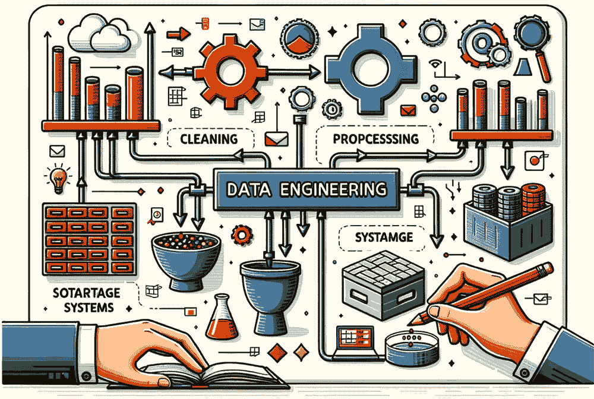
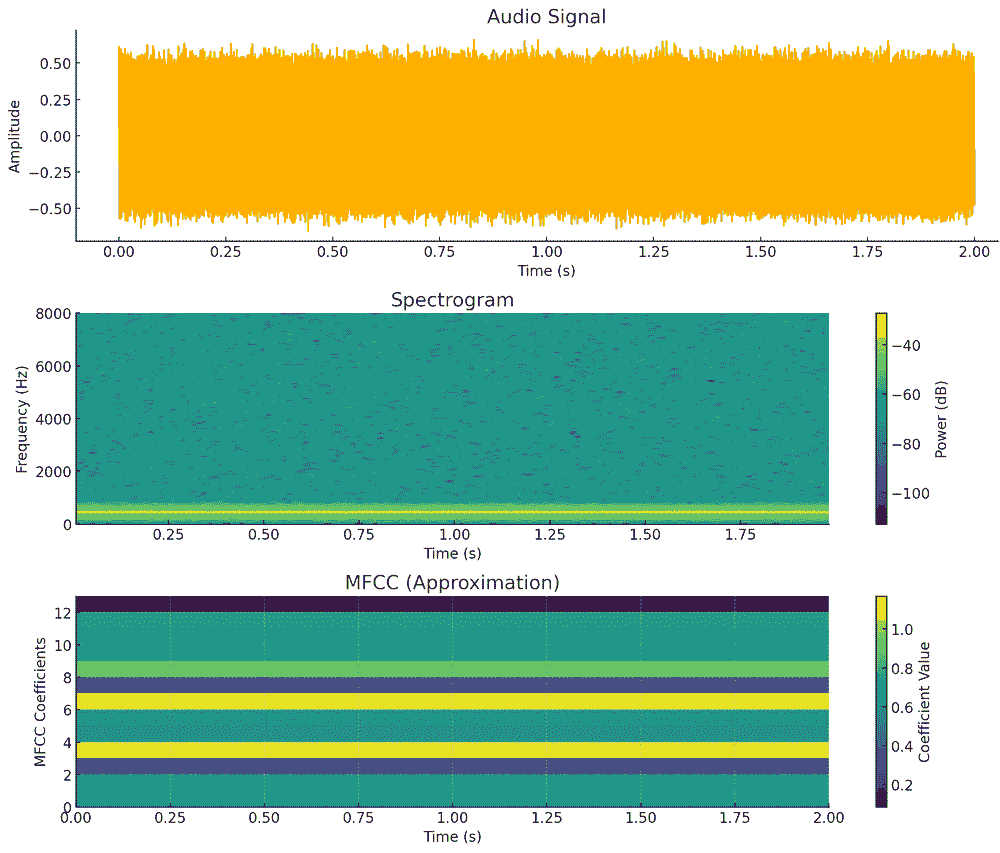
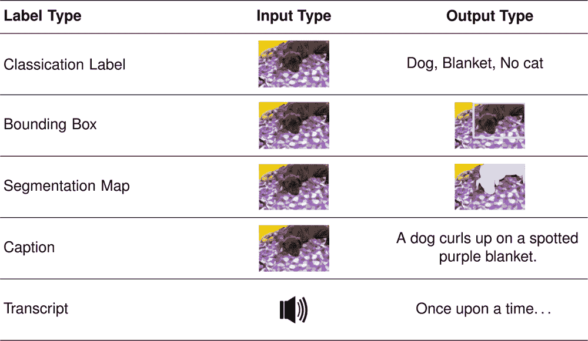
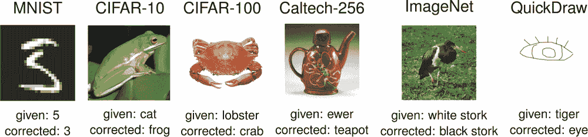
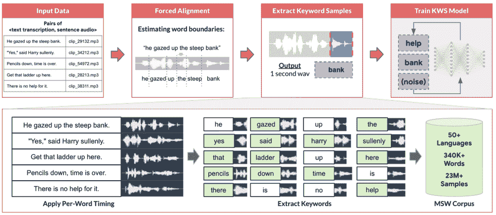

# 数据工程

*DALL·E 3 提示：创建一个矩形插图，可视化数据工程的概念。包括原始数据源、数据处理管道、存储系统和精炼数据集。展示原始数据如何通过清理、处理和存储转化为有价值的信息，这些信息可以用于分析和决策制定。*

## 目的

*为什么数据质量作为基础，决定了机器学习系统在生产环境中成功或失败？*

机器学习系统依赖于数据质量：没有算法可以克服糟糕的数据，但优秀的数据工程甚至可以使简单的模型取得显著的结果。与逻辑明确的传统软件不同，机器学习系统从数据模式中推导行为，使质量成为系统可靠性的主要决定因素。理解数据工程原理为构建在多样化生产环境中一致运行、随时间保持性能并随着数据量和复杂性的增加而有效扩展的机器学习系统提供了基础。

**学习目标**

+   应用四支柱框架（质量、可靠性、可扩展性、治理）来系统地评估数据工程决策

+   计算机器学习系统的基础设施需求，包括存储容量、处理吞吐量和标注成本

+   设计数据管道，以保持训练-服务一致性，防止生产中机器学习失败的主要原因

+   根据质量-成本-规模权衡来评估获取策略（现有数据集、网络抓取、众包、合成数据）

+   设计适合不同机器学习工作负载模式的存储系统（数据库、数据仓库、数据湖、特征存储）

+   在数据生命周期中实施数据治理实践，包括血缘跟踪、隐私保护和偏差缓解

## 数据工程作为系统学科

在上一章中探讨的系统方法为机器学习发展的程序基础奠定了基础，然而，在这些工作流程的每个阶段都存在一个基本前提：强大的数据基础设施。在传统软件中，计算逻辑由代码定义。在机器学习中，系统行为由数据定义。这种范式转变使得数据成为工程过程中的第一公民，类似于源代码，需要一个新的学科，即数据工程，以同样的严谨性来管理它。

虽然工作流程方法为构建机器学习系统提供了组织框架，但数据工程提供了实现这些方法的技术基础。高级建模技术和严格的验证程序无法弥补数据基础设施的不足，而精心设计的数据系统甚至可以使传统方法实现显著的性能提升。

本章探讨了数据工程作为一门系统性的工程学科，其重点在于设计、构建和维护将异构原始信息转化为适合机器学习应用的高质量、可靠数据集的基础设施。与计算逻辑保持明确和确定性的传统软件系统不同，机器学习系统从其底层数据模式中推导出其行为特征，将数据基础设施质量作为系统效能的主要决定因素。因此，关于数据获取、处理、存储和治理的架构决策影响着机器学习系统在生产环境中是否能够实现预期的性能。

**数据工程**是设计和维护将**原始数据**转化为**可靠**、**可访问**和**分析就绪**数据集的**数据基础设施**的系统学科，通过原则性的获取、处理、存储和治理实践实现。

当考察数据质量问题如何在机器学习系统中传播时，数据工程决策的关键重要性变得显而易见。传统的软件系统在遇到格式不正确的输入时通常会生成可预测的错误响应或明确的拒绝，使开发者能够实施立即的纠正措施。机器学习系统则提出了不同的挑战：数据质量缺陷表现为微妙的性能下降，这些下降在整个处理管道中累积，通常在生产环境中直到系统发生灾难性故障才被发现。虽然单个错误标记的训练实例可能看似无关紧要，但系统性的标记不一致会系统地破坏整个特征空间中的模型行为。同样，生产环境中的数据分布逐渐变化会逐渐降低系统性能，直到需要进行全面模型重新训练。

这些挑战需要超越临时解决方案和反应性干预的系统工程方法。有效的数据工程需要对基础设施需求进行系统分析，这与应用于工作流程设计的纪律性方法相平行。本章发展了一个数据工程决策的原则性理论框架，围绕四个基础支柱（质量、可靠性、可扩展性和治理）组织，为从初始数据获取到生产部署的技术选择提供系统指导。我们考察了这些工程原则在整个数据生命周期中的体现，明确了构建支持当前机器学习工作流程的数据基础设施所需的系统级思维，同时保持系统需求演变时的适应性和可扩展性。

我们不是孤立地分析单个技术组件，而是检查工程决策之间的系统性相互依赖关系，展示了数据基础设施系统的内在互联性。这种综合分析视角在我们准备检查处理这些精心设计的计算数据集的计算框架时尤为重要，这是后续章节的主要关注点。

## 四支柱框架

构建有效的机器学习系统不仅需要理解数据工程是什么，还需要实施一个结构化的框架，以做出关于数据基础设施的原则性决策。关于存储格式、摄取模式、处理架构和治理政策的决策需要系统性的评估，而不是临时选择。这个框架围绕四个基础支柱组织数据工程，确保系统实现功能性、鲁棒性、可扩展性和可靠性。

### 四个基础支柱

每个数据工程决策，从选择存储格式到设计摄取管道，都应该与四个基础原则进行评估。每个支柱通过系统性的决策制定为系统成功做出贡献。

首先，数据质量是系统成功的基础。在整个机器学习生命周期中，质量问题会通过称为“数据级联”的现象（第 6.3 节）累积放大，其中早期失败会传播并放大到下游。质量包括准确性、完整性、一致性和适合于预期机器学习任务的程度。高质量的数据对于模型成功至关重要，这种关系的数学基础在第三章和第四章中进行了探讨。

在这个质量基础上，机器学习系统需要一致、可预测的数据处理，能够优雅地处理失败。可靠性意味着构建即使在组件故障、数据异常或意外负载模式的情况下也能继续运行的系统。这包括在整个数据管道中实施全面的错误处理、监控和恢复机制。

虽然可靠性确保了持续运行，但可扩展性解决了增长挑战。随着机器学习系统从原型发展到生产服务，数据量和处理需求急剧增加。可扩展性涉及设计能够处理增长的数据量、用户基础和计算需求，而无需进行完整的系统重新设计。

最后，治理提供了质量、可靠性和可扩展性运行的框架。数据治理确保系统在法律、伦理和业务约束下运行，同时保持透明度和问责制。这包括隐私保护、偏差缓解、合规监管以及建立明确的数据所有权和访问控制。

图 6.1：**数据工程四支柱**：质量、可靠性、可扩展性和治理构成了机器学习数据系统的基本框架。每个支柱都贡献了基本能力（实线箭头），而支柱之间的权衡（虚线）需要仔细平衡：验证开销影响吞吐量，一致性约束限制分布式扩展，隐私要求影响性能，而偏差缓解可能会减少可用的训练数据。有效的数据工程需要系统地管理这些紧张关系，而不是孤立地优化任何单个支柱。 

### 通过系统思维整合支柱

虽然单独理解每个支柱提供了重要的见解，但认识到它们的个体重要性只是有效数据工程的第一步。如图 6.1 所示，这四个支柱不是独立的组件，而是统一系统的相互关联的方面，其中某一领域的决策会影响所有其他领域。质量改进必须考虑到可扩展性约束，可靠性要求会影响治理实施，而治理政策会塑造质量指标。这种系统视角指导我们对数据工程的探索，检查每个技术主题如何支持并平衡这些基础原则，同时管理它们固有的紧张关系。

如图 6.2 所示，根据各种行业调查，数据科学家将 60-80%的时间花在数据准备任务上 1。这一统计数据反映了当前的状态，即数据工程实践往往是临时的而不是系统的。通过一致地应用四支柱框架来解决这个问题，团队可以减少数据准备时间，同时构建更可靠和可维护的系统。

图 6.2：**数据科学家时间分配**：数据准备消耗了数据科学工作的大部分努力，高达 60%，强调了系统化数据工程实践的需求，以防止下游模型失败并确保项目成功。优先考虑数据质量和管道开发比仅仅关注高级算法能带来更大的回报。来源：各种行业报告。

### 框架在数据生命周期中的应用

这个四支柱框架指导我们从问题定义到生产操作的整个数据工程系统探索过程。我们首先建立清晰的问题定义和治理原则，这些原则塑造了所有后续的技术决策。然后，框架引导我们通过数据获取策略，其中质量和可靠性要求决定了我们如何获取和验证数据。处理和存储决策自然地遵循可扩展性和治理约束，而运营实践确保整个系统生命周期中维护这四个支柱。

此框架指导我们系统地探索数据工程的每个主要组件。在后续章节中，当我们检查数据获取、摄取、处理和存储时，我们考察这些支柱如何在具体技术决策中体现：平衡质量与可扩展性的来源技术、支持治理约束下的性能的存储架构，以及处理管道在处理大规模数据时保持可靠性。

表 6.1 提供了每个支柱如何在数据管道主要阶段体现的全面视图。此矩阵既作为系统设计的规划工具，也作为在不同管道阶段出现问题时进行故障排除的参考。

表 6.1：**数据管道各阶段应用的四项支柱**：此矩阵说明了质量、可靠性、可扩展性和治理原则如何在数据工程管道的每个主要阶段体现。每个单元格显示了在该阶段实施相应支柱的具体技术和实践，提供了一个全面的框架，用于系统决策和故障排除。

| **阶段** | **质量** | **可靠性** | **可扩展性** | **治理** |
| --- | --- | --- | --- | --- |
| **获取** | 典型抽样，偏差检测 | 多样化来源，冗余收集策略 | 网络爬虫，合成数据生成 | 同意，匿名化，道德来源 |
| **摄取** | 架构验证，数据概要分析 | 死信队列，优雅降级 | 批量处理与流处理，自动扩展管道 | 访问控制，审计日志，数据血缘 |
| **处理** | 一致性验证，训练-服务一致性 | 幂等变换，重试机制 | 分布式框架，横向扩展 | 血缘追踪，隐私保护，偏差监控 |
| **存储** | 数据验证检查，新鲜度监控 | 备份，复制，灾难恢复 | 分层存储，分区，压缩优化 | 访问审计，加密，保留策略 |

为了将这些概念扎根于实际现实，我们以关键词检测（KWS）系统作为贯穿的案例研究，展示框架原则如何转化为工程决策。

## 数据级联和系统基础的需求

机器学习系统面临一种独特的失败模式，这使它们与传统软件工程区别开来：“数据级联”，2 由 Sambasivan 等人 2021 提出的现象，其中早期阶段的数据质量问题在整个管道中放大，导致下游模型失败、项目终止和潜在的用户伤害。与传统软件中不良输入通常产生即时错误不同，ML 系统在质量问题时会默默退化，直到问题严重到需要完全重建系统。

当团队在开始数据收集和处理工作之前跳过建立明确的质量标准、可靠性要求和治理原则时，就会发生数据级联。这种基本漏洞促使我们提出四支柱框架：质量、可靠性、可扩展性和治理提供了防止级联失败和构建稳健机器学习系统所需的系统基础。

图 6.3 展示了每个阶段潜在的数据陷阱以及它们如何影响后续整个流程。数据收集错误的影響尤为明显。如图所示，任何在这个初始阶段的疏忽将在第八章（ch014.xhtml#sec-ai-training）和第十三章（ch019.xhtml#sec-ml-operations）中讨论的模型评估和部署阶段变得明显，可能导致放弃整个模型并重新开始的昂贵后果。因此，从一开始就投资于数据工程技术将帮助我们及早发现错误，减轻这些级联效应。

图 6.3：**数据质量级联**：在机器学习工作流程早期引入的错误会在后续阶段放大，增加成本，并可能导致预测错误或有害结果。认识到这些级联现象会促使我们积极投资于数据工程和质量控制，以减轻风险并确保系统性能可靠。来源：(Sambasivan 等人 2021)。

### 早期建立治理原则

在理解了质量问题如何在机器学习系统中级联之后，我们必须建立治理原则，确保我们的数据工程系统在道德、法律和商业约束范围内运行。这些原则不是事后才考虑的应用，而是塑造每个技术决策的基础性要求。

这些治理原则的核心是，数据系统必须在整个生命周期中保护用户隐私并维护安全性。这意味着从初始系统设计开始实施访问控制、加密和数据最小化实践，而不是作为后续的增强功能添加。隐私要求直接影响数据收集方法、存储架构和处理方法。

除了隐私保护之外，数据工程系统必须积极努力识别和减轻数据收集、标注和处理中的偏差。这需要多样化的数据收集策略、代表性的抽样方法，以及在整个流程中的系统性偏差检测。关于数据来源、标注方法和质量指标的技术选择都会影响系统的公平性。数据中的隐藏分层——即子群体代表性不足或表现出不同模式，即使在表现良好的模型中也可能导致系统性失败(Oakden-Rayner 等人 2020)，这强调了为什么人口平衡和代表性需要从一开始就融入数据收集。

补充这些公平性努力，系统必须保持关于数据来源、处理决策和质量标准的清晰文档。这包括实施数据血缘跟踪、维护处理日志，并明确数据质量决策的所有权和责任。

最后，数据系统必须遵守相关的法规，如 GDPR、CCPA 和特定领域的需求。合规要求影响数据保留政策、用户同意机制和跨境数据传输协议。

这些治理原则与我们的质量、可靠性和可扩展性等技术支柱相辅相成。如果一个系统侵犯了用户隐私，那么它就不再是真正可靠的，如果质量指标持续产生不公平的结果，那么它们也就没有意义。

### 结构化问题定义方法

在这些治理基础之上，我们需要一个系统性的方法来定义问题。正如 Sculley 等人(2021)强调的，机器学习系统需要的问题框架超越了传统的软件开发方法。无论是开发处理数百万用户交互的推荐引擎，分析医学图像的计算机视觉系统，还是处理多样化文本数据的自然语言模型，每个系统都带来了独特挑战，需要在我们的治理和技术框架内进行仔细考虑。

在此背景下，确立明确的目标提供了统一的方向，指导整个项目，从数据收集策略到部署操作。这些目标必须在技术性能和治理要求之间取得平衡，创造可衡量的成果，包括准确性指标和公平性标准。

这种系统性的问题定义方法确保了治理原则和技术要求从一开始就得到整合，而不是事后进行修改。为了实现这种整合，我们确定了任何数据收集工作之前必须采取的关键步骤：

1.  确定并明确表述问题定义

1.  设定明确的目标以满足

1.  建立成功基准

1.  理解最终用户的参与/使用情况

1.  理解部署的约束和限制

1.  进行数据收集。

1.  迭代和改进。

### 通过关键词检测案例研究应用框架

为了展示这些系统化原则在实际中的运作方式，关键词检测（KWS）系统为我们提供了一个理想的案例研究，用于将我们的四支柱框架应用于现实世界的数据工程挑战。这些系统为智能手机和智能扬声器等语音激活设备提供动力，必须在连续的音频流中检测特定的唤醒词（如“OK, Google”或“Alexa”），同时在严格的资源限制下运行。

如图 6.4 所示，KWS 系统作为轻量级、始终开启的前端运行，触发更复杂的语音处理系统。这些系统展示了我们框架四个支柱之间的相互挑战（第 6.2 节）：质量（跨不同环境的准确性）、可靠性（一致的电池供电操作）、可扩展性（严重的内存限制）和治理（隐私保护）。这些限制解释了为什么许多 KWS 系统只支持有限的语言：由于治理和可扩展性的挑战，为较小的语言群体收集高质量、代表性的语音数据变得难以承受，这证明了所有四个支柱必须协同工作才能实现成功的部署。

图 6.4：**关键词检测系统**：在语音激活设备中典型部署的关键词检测（KWS）技术，其中持续监听的系统检测到唤醒词以启动进一步处理。本例演示了 KWS 如何作为轻量级、始终开启的前端，为更复杂的语音界面服务。

在建立这个框架理解之后，我们可以将我们的问题定义方法应用于我们的 KWS 示例，展示四个支柱如何指导实际工程决策：

1.  **识别问题**：KWS 在环境声音和其他说话声中检测特定关键词。主要问题在于设计一个能够以高精度、低延迟和最小化误报或漏报识别这些关键词的系统，尤其是在计算资源有限的设备上。为开发新的 KWS 模型制定一个明确的问题定义，应确定所需的关键词以及预期的应用和部署场景。

1.  **设定明确目标**：KWS 系统的目标必须平衡多个相互竞争的要求。性能目标包括实现高准确率（关键词检测准确率达到 98%）的同时确保低延迟（关键词检测和响应在 200 毫秒内完成）。资源限制要求最小化功耗以延长嵌入式设备的电池寿命，并确保模型大小针对设备上可用的内存进行了优化。

1.  **成功的基准**：建立明确的指标来衡量 KWS 系统的成功。关键性能指标包括真正阳性率（正确识别的关键词占所有说话关键词的百分比）和假阳性率（包括静音、背景噪音和不在词汇表中的词被错误地识别为关键词的百分比）。检测/错误权衡曲线通过比较每小时假接受率（总评估音频持续时间内的假阳性）与假拒绝率（评估音频中未识别的关键词与说话关键词的比例）来评估 KWS 在代表现实部署场景的流式音频上的表现，如 Nayak 等人所展示的(2022)。操作指标跟踪响应时间（关键词语音到系统响应）和功耗（关键词检测期间的平均功耗）。

1.  **利益相关者参与和理解**：与利益相关者进行互动，这些利益相关者包括设备制造商、硬件和软件开发者以及最终用户。了解他们的需求、能力和限制。不同的利益相关者会带来相互竞争的优先级：设备制造商可能会优先考虑低功耗，软件开发者可能会强调易于集成，而最终用户则会优先考虑准确性和响应速度。在整个开发过程中，平衡这些相互竞争的要求将塑造系统架构决策。

1.  **理解嵌入式系统的限制和局限性**：嵌入式设备自带一套挑战，这些挑战塑造了关键词识别系统（KWS）的设计。内存限制需要极其轻量级的模型，通常小至 16 KB 以适应 SoC 的始终在线岛 3，这一限制仅涵盖模型权重，而预处理代码也必须适应严格的内存限制。来自有限的计算能力（几百兆赫的时钟速度）的处理能力限制要求对模型进行激进优化以提高效率。功耗变得至关重要，因为大多数嵌入式设备都使用电池供电，要求 KWS 系统在持续监听期间实现亚毫瓦的功耗。环境挑战又增加了一层复杂性，因为设备必须在从安静的卧室到嘈杂的工业环境等不同的部署场景中有效运行。

1.  **数据收集和分析**：对于一个 KWS 系统来说，数据质量和多样性决定了成功。数据集必须通过包括不同年龄和性别的各种口音的说话者来捕捉人口统计学上的多样性，以确保广泛的识别支持。关键词的变化需要关注，因为人们发音唤醒词的方式不同，需要数据集捕捉这些发音细微差别和轻微变化。背景噪声的多样性证明是至关重要的，需要包括或增强不同环境噪声的数据样本，以训练模型适应从安静环境到嘈杂条件等现实世界的场景。

1.  **迭代反馈和改进**：最后，一旦开发出一个原型 KWS 系统，团队必须确保系统随着时间的推移和用例的发展与定义的问题和目标保持一致。这需要在现实世界场景中进行测试，收集有关某些用户或部署场景相对于其他用户或场景是否遇到性能不足的反馈，并根据观察到的失败模式迭代地改进数据集和模型。

在这个问题定义的基础上，我们的关键词唤醒系统（KWS）展示了不同的数据收集方法如何在项目生命周期中有效地结合。现有的数据集，如谷歌的语音命令（Warden 2018），为初始开发提供了基础，提供了精心挑选的常见唤醒词的语音样本。然而，这些数据集通常在口音、环境和语言方面缺乏多样性，需要额外的策略。

为了解决覆盖范围上的差距，网络爬虫通过从视频平台和语音数据库收集多样化的语音样本来补充基线数据集，捕捉自然语言模式和唤醒词的变化。众包平台如亚马逊机械师（4）允许针对不同人口统计学和环境收集唤醒词样本，对于代表性不足的语言或特定的声学条件特别有价值。

最后，通过语音合成（Werchniak et al. 2021）和音频增强，合成数据生成填补了剩余的空白，在声学环境、说话者特征和背景条件下创建无限的唤醒词变化。这种全面的方法使得 KWS 系统能够在各种现实世界条件下稳健地运行，同时展示了如何通过系统性的问题定义指导整个项目生命周期中的数据策略。

通过 KWS 案例研究建立我们的框架原则，我们现在探讨这些抽象概念如何通过数据管道架构转化为操作现实。

## 数据管道架构

数据管道是我们四支柱框架的系统化实现，将原始数据转换为机器学习准备格式，同时保持质量、可靠性、可扩展性和治理标准。这些不是简单的线性数据流，而是复杂的系统，必须协调多个数据源、转换过程和存储系统，同时确保在不同负载条件下的性能一致性。管道架构将我们的抽象框架原则转化为操作现实，其中每一支柱都表现为关于验证策略、错误处理机制、吞吐量优化和可观察性基础设施的具体工程决策。

为了说明这些概念，我们的关键词提取系统（KWS）的管道架构必须处理连续的音频流，保持低延迟处理以实现实时关键词检测，并确保数据处理的隐私保护。该管道必须从处理样本音频文件的开发环境扩展到处理数百万并发音频流的生产部署，同时保持严格的质量和治理标准。

图 6.5：**数据管道架构**：模块化管道摄取、处理和交付数据以供机器学习任务使用，使组件能够独立扩展，并提高数据质量控制。不同的阶段（摄取、存储和准备）将原始数据转换为适合模型训练和验证的格式，形成可靠机器学习系统的基础。

如架构图所示，机器学习数据管道由几个不同的层组成：数据源、摄取、处理、标记、存储和机器学习训练（图 6.5）。每一层在数据准备工作流程中扮演着特定的角色，为每一层选择适当的技术需要理解我们的四个框架支柱在每个阶段的表现。我们不是将这些层视为独立的组件分别优化，而是考察一个阶段的质量要求如何影响另一个阶段的可扩展性约束，可靠性需求如何塑造治理实施，以及支柱如何相互作用以确定整体系统有效性。

这些设计决策的核心是，数据管道设计受限于存储层次结构和 I/O 带宽限制，而不是 CPU 容量。理解这些限制能够构建能够处理现代机器学习工作负载的高效系统。从高延迟对象存储（适用于归档）到低延迟内存存储（对于实时服务至关重要）的存储层次结构权衡，以及带宽限制（100-200 MB/s 的旋转磁盘与 50-200 GB/s 的 RAM）塑造了每个管道决策。详细的存储架构考虑因素在第 6.9 节中有所介绍。

考虑到这些性能限制，设计决策应与特定要求一致。对于流数据，考虑你是否需要消息持久性（重放失败处理的能 力）、排序保证（保持事件序列）或地理分布。对于批量处理，关键决策因素包括与内存相比的数据量、处理复杂性和计算是否必须分布式。对于千兆级数据，单机工具就足够了，但对于太字节级处理，则需要分布式框架，将工作分区到集群中。通过我们的四支柱视角来看这些层之间的交互，决定了系统的整体有效性，并指导我们在以下小节中检查的具体工程决策。

### 通过验证和监控实现质量

质量是可靠机器学习系统的基石，管道通过在每个阶段进行系统性的验证和监控来实现质量。生产经验表明，数据管道问题代表机器学习失败的主要来源，研究表明，模式更改导致下游处理中断、分布漂移降低模型精度或数据损坏静默引入错误的归因率在 30-70%之间(Sculley 等人 2021)。这些故障证明尤其狡猾，因为它们通常不会引起明显的系统崩溃，而是以只有影响用户后才会显现的方式缓慢降低模型性能。质量支柱要求主动监控和验证，以在问题演变成模型失败之前捕捉到它们。

在实践中理解这些指标需要检查生产团队如何实施大规模监控。大多数组织采用基于严重程度的警报系统，不同类型的故障触发不同的响应协议。最关键的警报表明系统完全故障：管道完全停止处理，超过 5 分钟内显示零吞吐量，或者主要数据源完全不可用。这些情况需要立即关注，因为它们会停止所有下游模型训练或服务。更微妙的退化模式需要不同的检测策略。当吞吐量降至基线水平的 80%或错误率上升至 5%以上，或者质量指标偏离训练数据特征超过 2 个标准差时，系统会发出需要紧急但非立即关注的退化信号。这些渐进性故障往往比完全中断更危险，因为它们可以在数小时或数天内未被检测到，默默地破坏模型输入并降低预测质量。

考虑这些原则如何应用于处理用户交互事件的推荐系统。在基准吞吐量为每秒 50,000 条记录的情况下，监控系统跟踪几个相互依赖的信号。如果处理速度低于每秒 40,000 条记录超过 10 分钟，即时吞吐量警报就会触发，这既考虑了正常交通变化，也捕捉到了真正的容量或处理问题。数据流中的每个特征都有自己的质量配置文件：如果一个特征，如用户年龄，在训练数据中少于 1%的空值时，在超过 5%的记录中显示空值，那么上游数据源可能出现了问题。在样本数据上运行重复检测，观察同一事件出现多次——这可能是重试逻辑出错或数据库查询意外重复返回相同记录的模式。

当考虑端到端延迟时，这些监控维度变得尤为重要。系统必须跟踪的不仅是数据是否到达，还有从事件发生到结果特征可用于模型推理的整个管道的流动时间。当一个具有 10 秒服务级别协议的系统在 95%的百分位延迟超过 30 秒时，监控系统需要确定是哪个管道阶段引入了延迟：摄取、转换、验证或存储。

质量监控不仅限于简单的模式验证，还包括统计属性，这些属性可以捕捉到服务数据是否类似于训练数据。生产系统不仅仅是检查值是否在有效范围内，而是在 24 小时窗口内跟踪滚动统计。对于像交易金额或会话持续时间这样的数值特征，系统会持续计算平均值和标准差，然后应用如柯尔莫哥洛夫-斯米诺夫检验 6 等统计检验，以比较服务分布与训练分布。

分类别特征需要不同的统计方法。监控系统不是比较平均值和方差，而是跟踪类别频率分布。当出现训练数据中从未存在的新类别，或者当现有类别在相对频率上发生实质性变化——例如，“移动”与“桌面”流量的比例变化超过 20%，系统会标记潜在的数据质量问题和真正的分布变化。这种统计警觉性可以捕捉到简单模式验证完全忽略的微妙问题：想象一下，如果年龄值保持在 18-95 的有效范围内，但分布从主要 25-45 岁的人转变为主要 65 岁以上的人，这表明数据源发生了会影响模型性能的变化。

在管道级别的验证包括多种策略协同工作。模式验证在数据进入管道时同步执行，立即拒绝格式不正确的记录，防止它们传播到下游。现代工具如 TensorFlow 数据验证（TFDV）7 自动从训练数据推断模式，捕获预期的数据类型、值范围和存在要求。

这种同步验证必然保持简单和快速，在微秒级检查可以评估的属性。更复杂的验证，需要比较服务数据与训练数据分布或跨多个记录汇总统计，必须异步运行以避免阻塞数据摄取管道。统计验证系统通常抽样 1-10%的服务流量——足以检测到有意义的变动，同时避免分析每条记录的计算成本。这些样本累积在滚动窗口中，通常是 1 小时、24 小时和 7 天，不同的窗口揭示不同的模式。每小时窗口检测到数据源突然切换到具有不同特性的备份，而每周窗口揭示用户群体或行为的逐渐漂移。

可能最隐蔽的验证挑战来自训练-服务偏差 8，在训练与服务环境中，相同的特征计算方式不同。这通常发生在训练管道使用一组库或逻辑批量处理数据时，而服务系统使用不同的实现实时计算特征。推荐系统可能在训练中通过将用户配置文件与完整的交易历史记录连接来计算“user_lifetime_purchases”，而服务系统无意中使用了仅每周更新的缓存物化视图 9。

### 通过优雅降级实现可靠性

当质量监控检测到问题时，可靠性确保系统在出现问题时仍能有效地继续运行。管道面临持续的挑战：数据源暂时不可用，网络分区分离组件，上游模式变更破坏了解析逻辑，或意外的负载峰值耗尽资源。可靠性支柱要求系统能优雅地处理这些故障，而不是导致完全中断。这种弹性来自系统的故障分析、智能错误处理和自动恢复策略，即使在不利条件下也能保持服务连续性。

对机器学习数据管道的系统故障模式分析揭示了需要特定工程对策的预测性模式。数据损坏故障发生在上游系统引入微妙的格式变化、编码问题或字段值修改时，这些修改通过了基本验证但破坏了模型输入。日期字段从“YYYY-MM-DD”格式切换到“MM/DD/YYYY”格式可能不会触发模式验证，但会破坏任何基于日期的特征计算。当源系统添加字段、重命名列或更改数据类型时，如果没有协调，就会发生模式演变 10 故障，这会破坏下游处理假设，这些假设期望特定的字段名称或类型。资源耗尽表现为当数据量增长超过容量规划时，性能逐渐下降，最终在高峰负载期间导致管道故障。

基于这次故障分析，有效的错误处理策略确保问题得到系统性控制并恢复。对于瞬时错误，如网络中断或临时服务中断，实现智能重试逻辑需要指数退避策略以避免压倒恢复中的服务。简单的线性重试每秒尝试重新连接，可能会使服务陷入连接尝试的洪流中，从而可能阻止其恢复。指数退避——在 1 秒后重试，然后 2 秒，然后 4 秒，每次尝试翻倍——给服务提供恢复的空间，同时仍然保持持续性。许多机器学习系统采用死信队列的概念 11，为多次重试后处理失败的数据使用单独的存储。这允许在不妨碍主管道的情况下，对有问题的数据进行后续分析和可能的重新处理(Kleppmann 2016)。处理金融交易的管道遇到格式错误的数据时，可以将其路由到死信队列，而不是丢失关键记录或停止所有处理。

超越临时的错误处理，级联故障预防需要断路器 12 模式和舱壁隔离来防止单个组件故障在整个系统中传播。当一个特征计算服务失败时，断路器模式在检测到重复失败后会停止调用该服务，防止调用者等待可能导致其自身失败的超时。

自动恢复工程实现了超越简单重试逻辑的复杂策略。渐进式超时增加防止压倒努力的服务，同时保持对短暂问题的快速恢复——初始请求在 1 秒后超时，但在检测到服务退化后，超时时间延长到 5 秒，然后是 30 秒，给服务稳定的时间。多层回退系统在主数据源失败时提供降级服务：当实时计算失败时，提供稍微陈旧的缓存特征，或者当精确计算超时时使用近似特征。一个无法从过去 30 天内计算用户偏好的推荐系统可能会回退到过去 90 天的偏好，提供稍微不准确但仍然有用的推荐，而不是完全失败。全面的警报和升级程序确保在自动化恢复失败时发生人工干预，在失败期间捕获足够的诊断信息，以便快速调试。

当考虑一个处理市场数据的金融机器学习系统时，这些概念变得具体。错误处理可能涉及在实时数据源失败时回退到稍微延迟的数据源，同时同时通知操作团队该问题。死信队列捕获异常的价格更新以供调查，而不是静默地丢弃它们。断路器在恢复期间防止系统压倒一个努力的市场数据提供商。这种全面的错误管理方法确保了即使面对分布式系统在规模上不可避免的故障，下游过程也能访问到可靠、高质量的数据，用于训练和推理任务。

### 可扩展性模式

虽然质量和可靠性确保了系统的正确运行，但可扩展性解决了一个不同的挑战：随着数据量的增长和机器学习系统从原型发展到生产服务，系统如何演变。在千兆规模上有效运行的管道，如果没有能够实现分布式处理的架构变化，通常会在太字节规模上失效。可扩展性涉及设计能够处理不断增长的数据量、用户基础和计算需求，而不需要完全重新设计的系统。关键洞察是，可扩展性约束在管道的不同阶段表现出不同的形式，需要不同的架构模式来处理摄取、处理和存储。

机器学习系统通常遵循两种主要的摄入模式，每种模式都具有独特的可扩展性特征。批处理摄入涉及在指定时间段内收集数据组，然后再进行处理。当实时数据处理不是关键且数据可以按计划间隔处理时，这种方法是合适的。一家零售公司可能会使用批处理摄入在夜间处理每日销售数据，每天早上更新库存预测的机器学习模型。批处理通过在大数据量上分摊启动成本，从而有效地利用计算资源——处理一个千兆字节的工作可能需要 100 台机器 10 分钟，比维护始终在线的基础设施具有更好的资源效率。

与这种计划方法相反，流式处理在数据到达时实时处理数据。这种模式对于需要立即数据处理的应用程序至关重要，在数据价值迅速丧失的场景中，以及需要响应事件的应用程序中。金融机构可能会使用流式处理进行实时欺诈检测，在交易发生时立即处理每个交易以标记可疑活动。然而，当下游系统无法跟上时，流式处理必须处理背压 13——当突然的交通高峰产生比处理能力更快的数据时，系统必须缓冲数据（需要内存）、采样（丢失一些数据）或将数据推回生产者（可能造成故障）。数据新鲜度服务级别协议（SLA）14 正式化了这些要求，指定了数据生成与可用处理之间的最大可接受延迟。

认识到单独采用任何一种方法的局限性，许多现代机器学习系统采用混合方法，结合批处理和流式处理来处理不同的数据速度和用例。这种灵活性使得系统可以同时处理批量历史数据和实时数据流，从而提供对数据景观的全面视图。生产系统必须在成本与延迟之间进行权衡：实时处理可能比批处理成本高 10-100 倍。这种成本差异源于几个因素：流式系统需要始终在线的基础设施而不是可调度资源，需要维护冗余处理以实现容错，需要低延迟的网络和存储，并且无法从批处理通过在大数据量上分摊启动成本所实现的规模经济中受益。在第十三章中详细介绍了在规模上管理流式系统的技术，包括背压处理和成本优化。

除了摄取模式之外，当单机无法处理数据量或处理复杂性时，分布式处理变得必要。分布式系统中的挑战在于数据必须在多个计算资源之间分区，这引入了协调开销。分布式协调受网络往返时间的限制：本地操作在微秒内完成，而网络协调需要毫秒，这造成了 1000 倍的延迟差异。这一限制解释了为什么需要全局协调的操作，如跨 100 台机器计算归一化统计信息，会形成瓶颈。每个分区可以快速计算本地统计信息，但合并它们需要所有分区的信息，而收集结果的网络往返时间决定了总执行时间。

在这个规模上，数据局部性变得至关重要。在 10GB/s 的速度下，将 1TB 的训练数据通过网络传输需要 100 多秒，而本地 SSD 访问只需要 5GB/s 的速度下 200 秒。网络传输和本地存储之间相似的性能推动了机器学习系统设计向计算跟随数据架构的转变，即处理移动到数据而不是数据移动到处理。当处理节点以 RAM 速度（50-200 GB/s）访问本地数据，但必须通过限于 1-10 GB/s 的网络进行协调时，带宽不匹配创造了基本的瓶颈。地理分布放大了这些挑战：跨数据中心协调必须处理网络延迟（区域间 50-200ms）、网络分区期间的局部故障，以及防止数据跨境的监管限制。了解哪些操作容易并行化，而哪些操作需要昂贵的协调，决定了系统架构和性能特征。

对于我们的 KWS 系统，这些可扩展性模式通过定量容量规划具体体现，为工作负载需求适当地调整基础设施。开发使用样本数据集的批量处理来快速迭代模型架构。当模型复杂性或数据集大小（2300 万个示例）超过单机容量时，训练扩展到 GPU 集群的分布式处理。生产部署需要流处理，以在数百万并发设备上实现实时唤醒词检测。当新闻事件触发同步使用时，系统必须处理流量高峰——数百万用户同时询问突发新闻。

为了使这些扩展挑战具体化，考虑一下为我们的关键词语音识别（KWS）训练基础设施进行尺寸计算所需的工程计算。在 16 kHz 采样率（16 位 PCM15）下，平均每秒 1 秒的 2300 万音频样本，原始存储需要大约：

<semantics><mrow><mtext mathvariant="normal">存储</mtext><mo>=</mo><mn>23</mn><mo>×</mo><msup><mn>10</mn><mn>6</mn></msup> <mrow><mtext mathvariant="normal">样本</mtext></mrow><mo>×</mo><mn>1</mn> <mrow><mtext mathvariant="normal">秒</mtext></mrow><mo>×</mo><mn>16</mn><mo>,</mo><mn>000</mn> <mrow><mtext mathvariant="normal">样本/秒</mtext></mrow><mo>×</mo><mn>2</mn> <mrow><mtext mathvariant="normal">字节</mtext></mrow><mo>=</mo><mn>736</mn> <mrow><mtext mathvariant="normal">GB</mtext></mrow></mrow> <annotation encoding="application/x-tex">\text{存储} = 23 \times 10⁶ \text{样本} \times 1 \text{秒} \times 16,000 \text{样本/秒} \times 2 \text{字节} = 736 \text{GB}</annotation></semantics>

将这些样本处理成 MFCC 特征（13 个系数，每秒 100 帧）可以减少存储需求，但会增加计算需求。在现代 CPU 上进行的特征提取大约是实时处理速度的 100 倍（每秒计算 100 秒的音频），需要：

<semantics><mrow><mtext mathvariant="normal">处理时间</mtext><mo>=</mo><mfrac><mrow><mn>23</mn><mo>×</mo><msup><mn>10</mn><mn>6</mn></msup> <mrow><mtext mathvariant="normal">秒音频</mtext></mrow></mrow><mrow><mn>100</mn> <mrow><mtext mathvariant="normal">加速比</mtext></mrow></mrow></mfrac><mo>=</mo><mn>230</mn><mo>,</mo><mn>000</mn> <mrow><mtext mathvariant="normal">秒</mtext></mrow><mo>≈</mo><mn>64</mn> <mrow><mtext mathvariant="normal">小时单核处理时间</mtext></mrow></mrow><annotation encoding="application/x-tex">\text{处理时间} = \frac{23 \times 10⁶ \text{秒音频}}{100 \text{加速比}} = 230,000 \text{秒} \approx 64 \text{小时单核处理时间}</annotation></semantics>

分布在 64 个核心上可以将时间缩短到一小时，展示了并行化如何实现快速迭代。当将训练数据从存储传输到 GPU 服务器时，网络带宽成为瓶颈——在 10 GB/s 的网络吞吐量下，传输 736 GB 需要 74 秒，与训练周期时间相当。这一分析揭示了为什么高吞吐量存储（实现 5-7 GB/s 的 NVMe SSD）和网络基础设施（25-100 Gbps 互连）对于数据移动时间与计算时间相当的人工智能工作负载至关重要。

可扩展性架构使得从开发到生产的整个过程中都能保持效率，同时通过容量规划确保基础设施能够适当地适应工作负载需求。

### 通过可观察性进行治理

通过质量、可靠性和可扩展性解决了功能需求后，我们转向治理支柱。治理支柱在管道中表现为全面的可观察性——理解数据通过系统流动、如何转换以及谁访问它的能力。有效的治理需要跟踪数据来源通过转换到最终数据集，维护审计跟踪以符合规定，并实施访问控制以执行组织政策。与其他主要关注系统功能的支柱不同，治理确保操作在法律、伦理和商业约束内进行，同时保持透明度和问责制。

数据来源跟踪捕获每个数据集的完整来源：哪些原始来源贡献了数据，应用了哪些转换，何时进行加工，以及执行了哪个版本的加工代码。对于机器学习系统，来源对于调试模型行为和确保可重复性至关重要。当一个模型预测被证明是错误的时，工程师需要通过管道回溯：哪些训练数据贡献了这个预测，这些数据有什么质量指标，应用了哪些转换，我们能否为调查重新创建这个确切场景？现代来源系统如 Apache Atlas、Amundsen 或商业产品通过为管道添加元数据来自动捕获这种流动。每个管道阶段都会用描述其来源的元数据注释数据，创建一个审计跟踪，既可用于调试又可用于合规性。

审计跟踪通过记录谁访问了数据以及何时访问来补充数据来源。像 GDPR 这样的监管框架要求组织证明适当的数据处理，包括跟踪对个人信息访问的记录。机器学习管道在数据访问点实现审计日志记录：当训练作业读取数据集时，当服务系统检索特征时，或者当工程师查询数据进行分析时。这些日志通常捕获用户身份、时间戳、访问的数据和目的。对于医疗保健机器学习系统，审计跟踪通过显示只有授权人员访问了患者数据，访问是出于合法的医疗目的，并且数据没有保留超过允许的时间来证明合规性。生产系统中的审计日志规模可能很大——高流量的推荐系统每天可能会生成数百万审计事件——需要高效的日志存储和查询基础设施。

访问控制强制执行关于谁可以在每个管道阶段读取、写入或转换数据的策略。除了简单的读写权限之外，机器学习系统通常实现基于属性的访问控制，其中策略考虑数据敏感性、用户角色和访问上下文。数据科学家可以自由访问匿名化训练数据，但需要批准包含个人信息的原始数据。生产服务系统可能读取特征数据，但从不写入，以防止意外损坏。访问控制与维护数据敏感度、合规性要求和使用限制元数据的数据目录集成，使得在数据通过管道流动时能够实现自动策略执行。

版本元数据使可重复性成为调试和合规性的必要条件。当六个月前训练的模型比当前模型表现更好时，团队需要重新创建那个训练环境：确切的数据版本、转换参数和代码版本。机器学习系统通过全面的元数据捕获来实现这一点：训练作业记录数据集校验和、转换参数值、用于可重复性的随机种子和代码版本哈希。特征存储维护历史特征值，使得可以重建训练条件。对于我们关键词识别系统来说，这意味着跟踪哪个版本的强制对齐生成了标签，应用了哪些音频归一化参数，使用了哪些合成数据生成设置，以及哪些众包批次贡献了训练数据。

这些治理机制的集成将管道从透明度低的数据转换器转变为可审计、可重复的系统，可以证明适当的数据处理。这种治理基础设施不仅对于合规性至关重要，而且对于维护机器学习系统在做出越来越影响用户生活的关键决策时的信任至关重要。

在建立全面的管道架构之后——通过验证和监控确保质量，通过优雅降级确保可靠性，通过适当的模式确保可扩展性，通过可观察性确保治理——我们现在必须确定实际上通过这些精心设计的系统流动的是什么。我们选择的数据源塑造了我们机器学习系统的每个下游特征。

## 战略数据获取

数据采集不仅仅是简单地收集训练示例。它是一个战略决策，决定了我们系统的能力和局限性。我们选择用于获取训练数据的方法直接塑造了我们的质量基础、可靠性特征、可扩展潜力以及治理合规性。我们不是将数据来源视为基于便利性或熟悉度选择的独立选项，而是将它们视为必须与我们的既定框架要求相一致的战略选择。每种数据获取策略（现有数据集、网络爬取、众包、合成生成）在质量、成本、规模和伦理考量方面都提供了不同的权衡。关键洞察是没有任何单一方法能满足所有要求；成功的机器学习系统通常结合多种策略，平衡它们的互补优势与竞争性约束。

回到我们的关键词检测系统，数据来源决策对我们框架的所有支柱都有深远的影响，如我们在第 6.3.3 节的综合案例研究中所示。在多样化的声学环境中实现 98%的准确性（质量支柱）需要涵盖口音、年龄和录音条件的代表性数据。尽管设备存在差异，但保持一致的检测（可靠性支柱）需要来自不同硬件的数据。支持数百万并发用户（可扩展性支柱）需要手动收集无法经济提供的数据量。在始终倾听的系统中保护用户隐私（治理支柱）限制了收集方法，并需要仔细的匿名化。这些相互关联的要求说明了为什么获取策略必须通过系统评估而不是通过临时的来源选择来评估。

### 数据来源评估和选择

在确立了数据采集的战略重要性之后，我们以质量作为首要驱动力开始。当质量要求主导获取决策时，在精选数据集、专家众包和受控网络爬取之间的选择取决于准确性目标、所需的领域专业知识以及指导模型开发的基准要求。质量支柱要求我们不仅理解数据看起来是正确的，而且它准确地代表了部署环境，并提供了足够的边缘案例覆盖，这些边缘案例可能导致失败。

类似于 [Kaggle](https://www.kaggle.com/) 和 [UCI 机器学习仓库](https://archive.ics.uci.edu/) 这样的平台为机器学习从业者提供了现成的数据集，这些数据集可以加速系统开发。这些现有的数据集在构建机器学习系统时尤其有价值，因为它们提供了立即访问经过清洗、格式化的数据以及已建立的基准。它们的主要优势之一是成本效益，因为从头开始创建数据集需要大量的时间和资源，尤其是在构建需要大量高质量训练数据的生产级机器学习系统时。在此基础上，许多这些数据集，例如 [ImageNet](https://www.image-net.org/)，已经成为机器学习社区的标准基准，使得在不同模型和架构之间进行一致的性能比较成为可能。对于机器学习系统开发者来说，这种标准化提供了明确的指标来评估模型改进和系统性能。这些数据集的即时可用性使得团队可以开始实验和原型设计，而无需在数据收集和预处理上延迟。

尽管有这些优势，机器学习从业者必须仔细考虑现有数据集的质量保证方面。例如，ImageNet 数据集被发现验证集中有 3.4% 的标签错误 (Northcutt, Athalye, and Mueller 2021)。虽然流行的数据集受益于社区审查，有助于识别和纠正错误和偏差，但大多数数据集仍然是“无人照料的花园”，如果未能妥善解决质量问题，可能会对下游系统性能产生重大影响。正如 (Gebru et al. 2021a) 在她的论文中指出的那样，仅仅提供数据集而不提供文档可能会导致误用和误解，从而放大数据中存在的偏差。

除了质量方面的担忧之外，现有数据集的伴随文档是无价的，但通常只存在于广泛使用的数据集中。良好的文档提供了对数据收集过程和变量定义的见解，有时甚至提供基线模型性能。这些信息不仅有助于理解，而且促进了研究的可重复性，这是科学诚信的基石；目前，机器学习系统中提高可重复性的危机正在加剧（Pineau 等人 2021；Henderson 等人 2018）。当其他研究人员能够访问相同的数据时，他们可以验证发现，测试新的假设，或应用不同的方法，从而使我们能够更快地构建在彼此工作之上的成果。数据质量的问题尤其扩展到大数据场景，其中体积和多样性加剧了质量担忧（Gudivada，Rao 等人 2017），需要在大规模上采用系统性的质量验证方法。

即使有适当的文档，理解数据收集的上下文也变得必要。研究人员在使用像 ImageNet（Beyer 等人 2020）这样的流行数据集时必须避免潜在的过拟合，这些数据集可能导致性能指标膨胀。有时，这些[数据集并不能反映真实世界的数据](https://venturebeat.com/uncategorized/3-big-problems-with-datasets-in-ai-and-machine-learning/)。

在这些上下文担忧的核心，对于机器学习系统的一个关键考虑是现有数据集如何好地反映现实世界的部署条件。依赖标准数据集可能会在训练和生产环境之间产生令人担忧的脱节。当多个机器学习系统在相同的数据集上训练时，这种不匹配变得尤其有问题（图 6.6），可能会在整个部署模型生态系统中传播偏差和局限性。

图 6.6：**数据集收敛**：共享数据集可能会掩盖局限性并传播偏差到多个机器学习系统中，可能导致过度乐观的性能评估和降低对未见数据的泛化能力。依赖公共数据集会在模型生态系统中产生一种虚假的进步感，阻碍稳健和可靠的 AI 应用的发展。

对于我们的关键词识别系统，像 Google 的 Speech Commands(Warden 2018)这样的现有数据集提供了基本起点，提供了精心挑选的常见唤醒词的语音样本。这些数据集使得快速原型设计成为可能，并建立了基线性能指标。然而，一旦将它们与我们的质量要求进行比较，就会立即发现覆盖范围不足：有限的口音多样性、主要是在安静的环境中录音，以及仅支持主要语言。以质量为导向的获取策略认识到这些限制，并计划补充方法来应对这些限制，展示了基于框架的思维方式如何指导源选择，而不仅仅是选择可用的数据集。

### 可扩展性和成本优化

虽然以质量为导向的方法擅长创建准确、精心整理的数据集，但它们面临着固有的可扩展性限制。当可扩展性需求占主导地位——需要数百万或数十亿个示例，而人工整理在经济上无法提供时——网络爬取和合成生成提供了通往大规模数据集的途径。可扩展性支柱要求理解不同获取策略背后的经济模型：每标注一个示例的成本、吞吐量限制以及这些如何随着数据量的增加而变化。在千个示例规模上证明是成本效益的方法，在百万个示例规模上往往变得难以承受，而需要高设置成本的方法在大规模上则有利可图。

网络爬取提供了一种强大的方法，用于大规模收集训练数据，尤其是在现有数据集不足的领域。这种从网站提取数据的自动化技术已成为现代机器学习系统开发的关键，使团队能够构建符合其特定需求的定制数据集。当人工标注数据稀缺时，网络爬取展示了其价值。以计算机视觉系统为例：像[ImageNet](https://www.image-net.org/)和[OpenImages](https://storage.googleapis.com/openimages/web/index.html)这样的大型数据集就是通过系统性的网络爬取构建的，极大地推动了计算机视觉领域的发展。

超越这些计算机视觉应用，网络爬取的影响远远超出了图像识别系统。在自然语言处理领域，网络爬取数据已促使越来越复杂的机器学习系统的发展。大型语言模型，如 ChatGPT 和 Claude，依赖于从公共互联网和媒体爬取的大量文本来学习语言模式并生成响应(Groeneveld 等人 2024)。同样，像 GitHub 的 Copilot 这样的专业机器学习系统展示了如何通过有针对性的网络爬取（在这种情况下是代码仓库），可以创建强大的特定领域助手(陈等人 2021)。

建立在这些基础发展之上，生产级机器学习系统通常需要持续的数据收集来保持相关性和性能。网络爬虫通过收集如股价、天气模式或产品信息等结构化数据，为分析应用提供了便利。这种持续收集为机器学习系统带来了独特的挑战。数据一致性变得至关重要，因为网站结构或内容格式的变化可能会中断数据管道并影响模型性能。通过数据库或仓库进行适当的数据管理不仅对于存储至关重要，而且对于维护数据质量和实现模型更新也变得至关重要。

然而，随着这些强大功能的出现，网络爬虫也带来了几个挑战，机器学习系统开发者必须仔细考虑。法律和伦理限制可能会限制数据收集，因为并非所有网站都允许爬取，违反这些限制可能会产生[严重后果](https://hls.harvard.edu/today/does-chatgpt-violate-new-york-times-copyrights/)。当使用爬取的数据构建机器学习系统时，团队必须仔细记录数据来源，并确保遵守服务条款和版权法。在处理用户生成内容时，隐私考虑变得重要，通常需要系统性的匿名化程序。

除了这些法律和伦理限制之外，技术限制也会影响网络爬取训练数据的可靠性。网站的速率限制可能会减慢数据收集，而网络内容的动态性可能会引入影响模型训练的不一致性。如图 6.7 所示，网络爬取可能会产生意外或不相关的数据，例如，在当代图像搜索中出现的旧图像，这可能会污染训练数据集并降低模型性能。这些问题突出了在基于网络爬取数据的机器学习管道中，进行彻底的数据验证和清理过程的重要性。

图 6.7：**数据源噪声**：网络爬虫将无关或过时的数据引入训练集，需要系统性的数据验证和清理，以维持模型性能并防止虚假相关性。在当代搜索中出现的旧图像就是这种噪声的例子，强调了在来自网络的数据集中进行仔细过滤和质量控制的需要。来源：Vox。

众包提供了一种可扩展的方法，利用分布式的人类计算来加速数据集的创建。例如，[Amazon Mechanical Turk](https://www.mturk.com/)平台展示了众包如何通过将标注任务分配给全球劳动力来促进这一过程。这使得能够快速收集复杂任务（如情感分析、图像识别和语音转录）的标签，显著加快了数据准备阶段。机器学习领域众包最具影响力的例子之一是[ImageNet 数据集](https://image-net.org/)的创建。ImageNet 通过将图像标注任务分配给贡献者（通过 Amazon Mechanical Turk）而建立，这些贡献者将数百万张图像分类成数千个类别，使研究人员能够训练和基准测试用于广泛视觉识别任务的模型。

建立在这次大规模标注工作之上，数据集的可用性推动了深度学习的发展，包括 2012 年取得的突破性成果 AlexNet 模型(Krizhevsky, Sutskever, and Hinton 2017a)，该模型展示了大规模神经网络的威力，并展示了大规模、众包数据集如何推动创新。ImageNet 的成功突显了利用多元化贡献者进行标注如何使机器学习系统实现前所未有的性能。在学术研究之外，众包潜力的另一个例子是谷歌的[Crowdsource](https://crowdsource.google.com/)平台，这是一个志愿者贡献标注数据以改善人工智能系统在语言翻译、手写识别和图像理解等应用中的平台。

除了这些静态数据集创建的努力之外，众包还在传统数据集标注之外的应用中发挥了重要作用。例如，导航应用[Waze](https://www.waze.com/)使用用户提供的众包数据提供实时交通更新、路线建议和事故报告。这些多样化的应用突显了众包的一个主要优势：其可扩展性。通过将微任务分配给大量受众，项目可以快速且经济高效地处理大量数据。这种可扩展性对于需要大量数据集以实现高性能的机器学习系统尤其有益。贡献者的多样性引入了广泛的视角、文化洞察和语言变体，丰富了数据集并提高了模型在人群中的泛化能力。

补充这一可扩展性优势，灵活性是众包的关键好处。任务可以根据初始结果动态调整，从而允许在数据收集中进行迭代改进。例如，谷歌的[reCAPTCHA](https://www.google.com/recaptcha/about/)系统利用众包来验证人类用户，同时为训练机器学习模型的数据集进行标注。

超越了人类生成数据，合成数据生成代表了终极可扩展性解决方案，通过算法生成而不是手动收集来创建无限的训练示例。这种方法通过从方程式中去除人力劳动而改变了数据获取的经济性。如图 6.8 图 6.8 所示，合成数据与历史数据集相结合，创建了更大、更多样化的训练集，这些训练集手动收集是不切实际的。

图 6.8：**合成数据增强**：将算法生成数据与历史数据集相结合，扩大了训练集的大小和多样性，减轻了由稀缺或偏颇的实际情况数据造成的限制，并提高了模型泛化能力。这种方法在获取足够真实世界数据不切实际或不道德时，能够促进稳健的机器学习系统开发。来源：anylogic.

在这个基础上，生成建模技术的进步大大提高了合成数据的质量。现代人工智能系统可以生成与真实世界分布非常相似的数据，使其适用于从计算机视觉到自然语言处理的各种应用。例如，生成模型已被用于创建用于物体识别任务的合成图像，产生了与真实世界图像非常接近的多样化数据集。同样，合成数据已被用于模拟语音模式，增强了语音识别系统的鲁棒性。

除了这些质量改进之外，合成数据在获取真实世界数据既不切实际又昂贵的情况下变得特别有价值。汽车行业已经采用合成数据来训练自动驾驶车辆系统；你只能物理撞击有限数量的汽车来获取可能帮助机器学习系统了解如何避免碰撞的碰撞测试数据。捕捉真实世界场景，特别是罕见边缘情况，如接近事故或异常道路条件，本质上很困难。合成数据允许研究人员在[受控的虚拟环境中模拟这些场景](https://www.nvidia.com/en-us/use-cases/autonomous-vehicle-simulation/)，确保模型被训练以处理广泛的条件。这种方法对于提高自动驾驶汽车的能力已被证明非常有价值。

补充这些安全关键应用，合成数据另一个重要的应用在于增强现有数据集。在数据集中引入变化可以通过使模型接触到不同的条件来增强模型的鲁棒性。例如，在语音识别中，像 SpecAugment（D. S. Park 等人 2019）这样的数据增强技术引入噪声、偏移或音调变化，使模型能够更好地在不同环境和说话人风格之间泛化。这一原则也适用于其他领域，其中合成数据可以填补在代表性不足的场景或边缘情况中的空白。

对于我们的关键词识别（KWS）系统，可扩展性支柱推动了在 50 种语言中收集 2300 万个训练样本的需求——这是一个手工收集在经济上无法提供的数量。网络爬虫通过从视频平台补充基线数据集，增加了多样化的声音样本。众包使得对代表性不足的语言进行有针对性的收集成为可能。通过语音合成（Werchniak 等人 2021）和音频增强，合成数据生成填补了剩余的空白，在声学环境、说话人特征和背景条件下创造了无限的唤醒词变化。这种综合的多源策略展示了可扩展性要求如何塑造获取决策，每种方法都为整体数据生态系统贡献了特定的能力。

### 多样化条件下的可靠性

除了质量和规模考虑之外，可靠性支柱解决了一个关键问题：我们收集的数据是否能够使模型在部署环境的全部条件下保持一致的性能？一个数据集可能通过既定的指标达到高质量，但如果它没有捕捉到部署过程中遇到的各种多样性，则可能无法支持可靠的系统。鲁棒模型的覆盖要求不仅包括简单的数量，还包括地理多样性、人口代表性、时间变化和边缘情况包含，这些都会对模型行为进行压力测试。

理解覆盖范围需求需要检查潜在的失败模式。当训练数据主要来自特定地区时，会出现地理偏差，导致模型在其他地区表现不佳。一项关于图像数据集的研究发现，地理偏差显著，主要使用西方图像进行训练的图像识别系统在其他地区的图像上表现不佳（T. Wang 等，2019）。当训练数据不代表完整用户群体时，会出现人口统计偏差，可能导致歧视性结果。当现象随时间变化时，时间变化很重要——仅使用历史数据训练的欺诈检测模型可能无法应对新的欺诈模式。边缘案例收集特别具有挑战性但至关重要，因为罕见场景通常代表高风险情况，失败会造成最大的损害。

边缘案例收集的挑战在自动驾驶车辆开发中变得明显。虽然通过测试车队运营可以轻松捕捉正常驾驶条件，但接近事故、不寻常的行人行为或罕见的天气条件发生的频率较低。合成数据生成通过模拟罕见场景来帮助解决这个问题，但验证合成示例是否准确代表真实边缘案例需要仔细的工程。一些组织采用针对性的数据收集，测试驾驶员故意创建边缘案例，或者工程师从事故报告中识别需要更好覆盖的场景。

数据集收敛性，如前文图 6.6 所示，代表了另一个可靠性挑战。当多个系统在相同的数据集上训练时，它们会继承相同的盲点和偏见。整个模型生态系统可能因为所有模型都是在具有相同覆盖范围缺失的数据上训练的，而在相同的边缘情况下失败。这种系统性风险促使采用多样化的数据来源策略，其中每个组织收集超出常见基准的补充数据，确保其模型发展出不同的优势和劣势，而不是共享的失败模式。

对于我们的关键词唤醒系统（KWS），可靠性表现为在从安静的卧室到嘈杂的街道等不同的声学环境中，从各种地理区域的口音，以及从儿童到老年人的年龄范围内，都能保持一致的唤醒词检测。数据来源策略明确地解决了这些多样性需求：网络爬虫从多样化的视频来源中捕获自然语言变化，众包针对代表性不足的人口和环境，合成数据系统地探索声学条件的参数空间。如果没有这种在数据来源上的故意多样性，系统可能在测试集上实现高精度，但在生产部署中却可能不可靠。

### 数据来源的治理与伦理

数据获取的治理支柱包括法律合规、对数据贡献者的道德待遇、隐私保护和关于数据来源和限制的透明度。与其他侧重于系统能力的支柱不同，治理确保数据来源在适当的法律和道德边界内进行。治理失败带来的后果不仅限于系统性能，还包括声誉损害、法律责任，以及可能对不恰当地收集或使用其数据的个人造成的潜在伤害。

法律约束在不同司法管辖区和领域中对数据收集方法产生了显著限制。并非所有网站都允许抓取数据，违反这些限制可能会产生严重后果，正如围绕大型语言模型训练数据的持续诉讼所展示的那样。版权法规定了哪些公开内容可用于训练，不同司法管辖区出现了不同的标准。服务条款协议可能禁止使用数据进行机器学习训练，即使技术上可以访问。欧洲的 GDPR 和加州的 CCPA 等隐私法规对个人数据收集提出了严格的要求，包括需要同意、允许删除请求，有时还要求对算法决策进行解释(Wachter, Mittelstadt, and Russell 2017)。医疗数据在美国属于 HIPAA 等额外法规的管辖，要求对病人信息采取特定的保护措施。组织必须谨慎地处理这些法律框架，记录数据来源，并在整个获取过程中确保合规。

除了法律合规之外，道德来源还需要公平对待人类贡献者。我们之前考察的众包示例——[OpenAI 将数据标注外包给肯尼亚的工人](https://time.com/6247678/openai-chatgpt-kenya-workers/)，每小时支付低至 1.32 美元来审查创伤性内容——突显了当经济压力压倒道德考量时可能发生的治理失败。据报道，许多工人因接触令人不安的材料而遭受心理伤害，而没有得到足够的心理健康支持。这一案例强调了当将数据工作外包给经济不发达地区时可能出现的权力失衡。缺乏公平的补偿、对处理创伤性内容的工人支持不足，以及对工作条件缺乏足够的透明度，这些都是影响人类福利的治理失败，而不仅仅是系统性能。

针对这种担忧，行业范围内的道德众包标准已经开始出现。公平补偿意味着至少支付当地最低工资，理想情况下与工人所在地区的类似工作进行比较。工人的福祉需要为处理敏感内容的人提供心理健康资源，限制接触创伤性材料，并确保合理的工作条件。透明度要求明确沟通任务目的、贡献如何被使用以及工人的权利。像人工智能伙伴关系这样的组织已经发布了道德众包指南，确立了可接受实践的基础。

虽然，质量、可扩展性和可靠性关注系统能力，治理支柱确保我们的数据采集在适当的道德和法律边界内进行。隐私保护是另一个关键的治理问题，尤其是当涉及未明确同意用于机器学习训练的个人数据时。在处理敏感数据时，匿名化成为一个关键能力。从系统工程的角度来看，匿名化不仅代表法规遵从，它构成了一个核心设计约束，影响着数据管道架构、存储策略和处理效率。机器学习系统必须在整个生命周期中处理敏感数据：在收集、存储、转换、模型训练甚至在错误日志和调试输出中。一次隐私泄露不仅会损害单个记录，还可能损害整个数据集，使系统在未来开发中无法使用。

实践者已经开发了一系列匿名化技术来减轻隐私风险。最直接的方法是掩码，它涉及更改或模糊敏感值，以便它们不能直接追溯到原始数据主体。例如，金融账户号码或信用卡号码中的数字可以用星号、固定哑字符或散列值替换，以在显示或记录过程中保护敏感信息。

基于这种直接保护方法，泛化通过降低数据的精确度或粒度来减少重新识别的可能性。而不是透露确切的出生日期或地址，数据被汇总到更广泛的类别，例如年龄范围或邮政编码前缀。例如，一个用户确切的 37 岁年龄可能被泛化到 30-39 岁的年龄范围，而他们的确切地址可能被归类到城市级别的粒度。这种技术通过以汇总形式共享数据来降低重新识别风险，尽管仔细选择粒度至关重要——过于粗糙会失去分析价值，而过于精细在某些条件下仍可能使重新识别成为可能。

当泛化降低数据精度时，伪匿名化通过用人工标识符或“假名”替换直接标识符——姓名、社会保障号码、电子邮件地址——采取不同的方法。这些假名不得揭示或容易被追踪到原始数据主体，从而允许分析将同一个人的记录联系起来，而不暴露他们的身份。

超越简单的标识符替换，k-匿名性提供了一种更正式的方法，确保数据集中的每个记录至少与其他 k-1 个记录不可区分。这是通过抑制或泛化准标识符——这些属性组合起来可能被用来重新识别个人，例如邮政编码、年龄和性别——来实现的。例如，如果 k=5，每个记录必须与至少四个其他记录共享相同的准标识符组合，从而防止攻击者仅通过查看这些属性就定位个人。这种方法提供了正式的隐私保证，但可能需要显著的数据扭曲，并且不能防止同质性或背景知识攻击。

在这个谱系的最高端，差分隐私（Dwork, n.d.）向查询结果或数据集添加精心校准的噪声或随机数据扰动。目标是确保包括或排除任何单个个体的数据不会显著影响输出，从而隐藏他们的存在。引入的噪声由ε-Differential Privacy 中的ε参数控制，平衡数据效用和隐私保证。这种方法提供了强大的数学隐私保证，在学术和工业环境中得到广泛应用，尽管添加的噪声可能会影响数据准确性和模型性能，需要仔细的参数调整以平衡隐私和实用性。

表 6.2 总结了每种匿名化方法的关键特征，以帮助从业者根据他们特定的隐私要求和数据效用需求选择适当的技巧。

表 6.2：匿名化技术比较

| **技术** | **数据效用** | **隐私级别** | **实现** | **最佳用例** |
| --- | --- | --- | --- | --- |
| **掩码** | 高 | 低-中等 | 简单 | 显示敏感数据 |
| **泛化** | 中等 | 中等 | 中等 | 年龄范围、位置分桶 |
| **伪匿名化** | 高 | 中等 | 中等 | 需要个人跟踪 |
| **k-匿名性** | 低-中等 | 高 | 复杂 | 正式的隐私保证 |
| **差分隐私** | 中等 | 非常高 | 复杂 | 统计保证 |

如比较表所示，有效的数据匿名化在隐私和效用之间取得平衡。如掩码、泛化、匿名化、k-匿名性和差分隐私等技术分别针对重新识别风险的不同方面。通过精心选择和组合这些方法，组织可以在尊重包含在敏感数据集中个人的隐私权利和期望的同时，负责任地从这些数据集中提取价值。

对于我们的关键词语音识别（KWS）系统，治理约束贯穿了整个获取过程。语音数据本身包含需要隐私保护的生物识别信息，这推动了匿名化、同意要求和数据保留政策等决策。多语言支持引发了公平性问题——系统是否仅适用于商业价值高的语言，还是也能服务于较小的语言社区？公平的众包实践确保提供语音样本或标签的标注者获得适当的补偿，并了解他们的贡献将如何被使用。关于数据来源和局限性的透明度使用户能够理解系统的能力及其潜在偏见。这些治理考虑不仅限制了获取，还塑造了哪些方法在伦理上可接受和合法上可行。

### 集成获取策略

在考察了每一根支柱如何塑造获取选择之后，我们现在明白为什么现实世界的机器学习（ML）系统很少单独使用一种获取方法。相反，它们战略性地结合方法，以平衡相互竞争的支柱要求，认识到每种方法都贡献了互补的优势。数据获取的艺术在于理解这些来源如何协同工作，以创建同时满足质量、可扩展性、可靠性和治理约束的数据集。

我们的 KWS 系统展示了这种集成方法的典范。谷歌的语音命令（Speech Commands）数据集提供了一个质量保证的基线，使得快速原型设计和建立性能基准成为可能。然而，将之与我们的需求进行对比时，我们发现存在差距：口音多样性有限，仅覆盖主要语言，录音环境以清洁为主。通过从视频平台和语音数据库收集多样化的语音样本，网络抓取解决了部分差距，捕捉了在不同声学条件下的自然语音模式。这种方法在规模上超越了人工收集所能提供的，同时通过自动化过滤保持了合理的质量。

群智外包填补了现有数据集和网页抓取都无法充分解决的针对性缺口：代表性不足的口音、特定的群体或被识别为薄弱环节的特定声学环境。通过精心设计具有明确指导和质量控制的群智外包任务，系统在平衡规模和质量的同时，确保对贡献者的道德待遇。通过系统地探索参数空间：变化的后景噪声水平、说话人年龄、麦克风特性和唤醒词发音，合成数据生成技术完善了这一过程。这解决了难以自然收集的罕见条件长尾问题，同时使关于哪些声学变化最影响模型性能的受控实验成为可能。

这些方法的综合展示了我们的框架如何指导策略。质量要求驱动了精选数据集和专家审查的使用。可扩展性需求促使合成生成和网页抓取。可靠性需求要求在人口统计和环境中的多样化来源。治理约束塑造了同意要求、匿名化实践和公平补偿政策。而不是基于便利性选择来源，综合策略通过互补方法系统地解决每个支柱的要求。

通过多源获取实现的多样性——质量不一的群智外包音频、完美一致性的合成数据、格式不可预测的网页抓取内容——在外部数据进入我们受控管道环境的边界处创造了特定的挑战。

## 数据摄取

数据摄取代表了关键节点，精心获取的数据进入我们的机器学习系统，从各种外部格式转换为标准化的管道输入。这个边界层必须处理由于我们的多源获取策略而产生的异质性，同时保持我们已建立的质量、可靠性、可扩展性和治理标准。从外部来源到受控管道环境的这种转变提出了几个挑战，这些挑战在我们框架的各个支柱中明显不同。质量支柱要求在问题传播到下游之前在入口点进行验证。可靠性支柱需要错误处理，即使在源失败和数据异常的情况下也能保持操作。可扩展性支柱需要吞吐量优化，以处理不断增长的数据量和速度。治理支柱在系统边界执行访问控制和审计跟踪，外部数据进入可信环境。摄取代表了关键边界，精心工程可以防止问题进入管道，同时使机器学习系统所需的数据流得以实现。

### 批量与流式摄取模式

为了系统地解决摄取挑战，机器学习系统通常遵循两种主要模式，这些模式反映了不同的数据流时序和处理方法。每种模式都有独特的特性和用例，这些特性和用例塑造了系统如何平衡延迟、吞吐量、成本和复杂性。了解何时应用批量摄取与流摄取，或者它们的组合，需要分析工作负载特性与我们的框架要求之间的对应关系。

批量摄取涉及在指定时间段内收集数据分组或批次，然后再进行处理。当实时数据处理不是关键且数据可以按预定间隔处理时，这种方法是合适的。批量方法通过在大数据量上分摊启动成本并在资源可用或成本最低时处理数据，从而有效地利用计算资源。例如，一家零售公司可能会使用批量摄取在夜间处理每日销售数据，每天早上更新其库存预测的机器学习模型（Akidau 等人 2015）。批量作业可能使用数十台机器处理数吉字节的事务数据 30 分钟，然后释放这些资源供其他工作负载使用。这种计划处理比保持始终在线的基础设施更具成本效益，尤其是在预测的轻微滞后不会影响业务结果的情况下。

批量处理也简化了错误处理和恢复。当一个批处理作业在中间失败时，系统可以重试整个批次或从检查点恢复，而不需要复杂的状态管理。数据科学家可以轻松检查失败的批次，了解出了什么问题，并在修复后重新处理。批量处理的确定性特性——处理相同的输入数据总是产生相同的输出——简化了调试和验证。这些特性使得即使在实时处理技术上可行但不是必需的情况下，批量摄取对机器学习工作流程仍然具有吸引力。

与这种计划方法相反，流摄取在数据到达时实时处理数据，持续消耗事件而不是等待积累批次。这种模式对于需要立即数据处理的用例至关重要，例如数据价值迅速丧失的场景，以及需要响应事件发生的系统。金融机构可能会使用流摄取进行实时欺诈检测，在交易发生时处理每笔交易，以便在交易完成前立即标记可疑活动。如果欺诈检测发生在欺诈交易完成后数小时，那么欺诈检测的价值将大幅下降——到那时，资金已经转移，账户已被破坏。

然而，流式处理引入了批量处理所避免的复杂性。系统必须处理下游系统无法跟上数据流入速率时的背压。在流量峰值期间，当突然的激增产生比处理能力更快的数据时，系统必须要么缓冲数据（需要内存并引入延迟），要么采样（丢失一些数据），或者将数据推回生产者（可能造成其失败）。数据新鲜度服务级别协议（SLA）正式化了这些要求，指定了数据生成与可用处理之间的最大可接受延迟。满足 100 毫秒的新鲜度 SLA 所需的架构与满足 1 小时 SLA 所需的架构不同，这影响着从网络到存储再到处理架构的各个方面。

认识到单独采用任何一种方法的局限性，许多现代机器学习系统采用混合方法，结合批量和流式摄取来处理不同的数据速度和用例。这种灵活性允许系统同时处理历史数据批量处理和实时数据流，提供全面的数据景观视图。推荐系统可能会使用流式摄取来实时更新基于会话的推荐，例如点击、查看、购买，而使用批量摄取来处理用户资料、项目特征和不需要实时更新的协同过滤模型，这些模型可以在夜间进行处理。

生产系统在选择模式时必须平衡成本与延迟之间的权衡：实时处理可能比批量处理贵 10-100 倍。这种成本差异源于几个因素：流式系统需要始终在线的基础设施，而不是可以根据工作负载启动和关闭的可调度资源；为了容错而维护冗余处理以确保不丢失任何事件；需要低延迟的网络和存储以满足毫秒级的服务水平协议（SLA）；并且无法从批量处理通过在大数据量中分摊启动成本所实现的规模经济中受益。处理一个千兆字节的批量作业可能需要 100 台机器运行 10 分钟，而处理相同数据 24 小时的流式系统则需要持续可用的专用资源。每处理一个字节的 100 倍成本差异驱动了许多关于哪些数据真正需要实时处理以及哪些可以容忍批量延迟的架构决策。

### ETL 与 ELT 比较

除了根据时间要求选择摄取模式之外，设计有效的数据摄取管道还需要了解提取、转换、加载（ETL）16 和提取、加载、转换（ELT）17 方法之间的差异，如图 6.9 所示。这些范式决定了数据转换相对于加载阶段发生的时间，这对机器学习管道的灵活性和效率有重大影响。ETL 和 ELT 之间的选择会影响计算资源消耗的位置、数据变得可用于分析的速度以及转换逻辑如何随着需求的变化而演变。

图 6.9：**数据管道架构**：ETL 管道在将数据加载到数据仓库之前对其进行转换，而 ELT 管道首先加载原始数据，然后在仓库内进行转换，这影响了机器学习工作流程的系统灵活性和资源分配。选择 ETL 和 ELT 取决于数据量、转换复杂性和目标数据存储系统的功能。

ETL 是一种成熟的方法论，其中数据首先从源收集，然后转换以匹配目标模式或模型，最后加载到数据仓库或其他存储库。这种方法通常导致数据以可查询的格式存储，这对于需要一致、预处理的机器学习系统来说可能是有利的。转换步骤在数据到达仓库之前在单独的处理层中发生，使得在持久化之前可以进行验证和标准化。例如，一个预测客户流失的机器学习系统可能会使用 ETL 来标准化和汇总来自多个来源的客户交互数据——将不同的时间戳格式转换为 UTC，将文本编码标准化为 UTF-8，并计算汇总特征，如“过去 30 天的总购买额”——然后再加载到适合模型训练的格式中（Inmon 2005）。

在具有明确定义的模式和转换要求的场景中，ETL 的优势变得明显。只有经过清洗、验证和转换的数据才会进入仓库，从而减少了存储需求并简化了下游查询。在转换过程中可以强制执行安全性和隐私合规性，确保敏感数据在到达存储之前被屏蔽或加密。在加载之前进行质量验证，防止损坏或无效数据进入仓库。对于具有稳定特征管道和明确数据质量要求的机器学习系统，ETL 在杂乱的数据源和精心整理的培训数据之间提供了清晰的分离。

然而，当模式或需求频繁变化时，ETL 可能不够灵活，这在不断发展的机器学习项目中是一个常见现象。当转换逻辑发生变化——添加新特征、修改聚合或纠正错误时，所有源数据都必须通过 ETL 管道重新处理以更新数据仓库。这种重新处理可能需要数小时或数天，对于大型数据集来说，会减慢机器学习开发中的迭代速度。转换层需要专用基础设施和专业知识，增加了数据管道的操作复杂性和成本。

这就是 ELT 方法提供优势的地方。ELT 通过首先加载原始数据，然后在目标系统内按需应用转换来反转顺序。这种方法通常在现代数据湖或读取模式环境中看到，当处理机器学习系统中的不断发展的分析需求时，允许采取更敏捷的方法。原始源数据快速加载到可扩展的存储中，使用仓库的计算资源应用转换。现代云数据仓库如 BigQuery、Snowflake 和 Redshift 提供巨大的计算能力，可以在几分钟内执行复杂转换，处理 PB 级数据。

通过推迟转换，ELT 可以适应同一数据集的多种用途，这在机器学习项目的探索性数据分析阶段或同时开发多个具有不同数据需求模型时特别有用。一个团队可能计算每日汇总，而另一个团队可能计算每小时汇总，每个团队以不同的方式转换相同的原始数据。当发现转换逻辑错误时，团队可以通过简单地重新运行转换查询来重新处理数据，而不是从源重新摄取。这种灵活性加速了机器学习实验，其中特征工程需求迅速演变。

然而，ELT 对存储系统和查询引擎的要求更高，它们必须处理大量未处理的信息。原始数据存储的增长大于转换数据，增加了成本。当转换在相同的原始数据上重复执行而不是读取预计算的结果时，查询性能可能会受到影响。当原始敏感数据在存储中持续存在而不是在摄取时被掩码时，隐私和合规性变得更加复杂。

在实践中，许多机器学习系统采用混合方法，根据每个数据源或机器学习模型的具体需求，逐个案例选择 ETL 或 ELT。例如，一个系统可能会使用 ETL 来处理来自关系数据库的结构化数据，其中模式定义良好且稳定，而对于文本或图像等非结构化数据，可能会采用 ELT，因为随着机器学习模型的优化，转换需求可能会发生变化。高流量的点击流数据可能会使用 ELT 来实现快速加载和灵活的转换，而敏感的财务数据可能会使用 ETL 在持久化之前进行加密和掩码。

在 ETL/ELT 架构中实现流组件时，分布式系统原则变得至关重要。CAP 定理 18 从根本上限制了流系统设计的选择。Apache Kafka19 优先考虑一致性和分区容错性，使其在可靠的事件排序方面表现理想，但在网络分区期间可能会出现可用性问题。Apache Pulsar 强调可用性和分区容错性，提供更好的容错性，但一致性保证有所放宽。Amazon Kinesis 通过仔细配置平衡所有三个属性，但需要理解这些权衡以进行适当的部署。

### 多源集成策略

不论是使用 ETL 还是 ELT 方法，将多样化的数据源集成到机器学习系统中代表数据摄取的关键挑战。数据可能来自各种来源，包括数据库、API、文件系统和物联网设备。每个源可能有自己的数据格式、访问协议和更新频率。集成挑战不仅在于连接到这些源，而且在于将它们不同的特性规范化到一个后续处理阶段可以可靠消费的统一管道中。

考虑到这种数据源多样性，机器学习工程师必须为每个数据源开发健壮的连接器或适配器，以有效地集成这些源。这些连接器处理数据提取的细节，包括身份验证、速率限制和错误处理。例如，当与 REST API 集成时，连接器将管理 API 密钥，遵守 API 文档或 HTTP 头中指定的速率限制，并适当地处理 HTTP 状态码——在短暂错误（500、503）上重试，在身份验证失败（401、403）上中止，并在速率限制（429）时退避。一个设计良好的连接器将这些细节从下游处理中抽象出来，无论数据是否来自 API、数据库或文件系统，都提供一个一致的接口。

除了基本的连接性之外，源集成通常涉及在摄取点进行数据转换。这可能包括将 JSON20 或 XML 响应解析为结构化格式，将时间戳转换为标准时区和格式（通常是 UTC 和 ISO 8601），或执行基本的数据清理操作，如修剪空白或规范化文本编码。目标是标准化数据格式，使其进入机器学习管道，简化下游处理。这些转换不同于 ETL 或 ELT 中的业务逻辑转换——它们解决的是技术格式变化，而不是内容语义转换。

除了数据格式标准化外，考虑数据源的可靠性和可用性至关重要。一些来源可能会出现停机或数据质量不一致的情况。实现具有指数退避的重试机制可以优雅地处理暂时性故障。在摄取时进行数据质量检查可以早期捕捉到系统性问题——如果某个来源突然开始为之前必需的字段产生空值，立即检测可以防止损坏的数据流向下游。后备程序可以在主要来源失败时继续操作：切换到备用数据源，提供缓存数据，或者优雅地降级而不是完全失败。如果实时数据源失败，股价摄取系统可能会回退到延迟价格，以略微陈旧的数据维持服务，而不是完全中断。

### 案例研究：为 KWS 选择摄取模式

将这些摄取概念应用于我们的 KWS 系统，生产实现展示了流式和批量模式协同工作，反映了我们在问题定义期间建立的两种操作模式。摄取架构直接实现了我们四支柱框架的要求：通过验证音频特征来保证质量，通过一致操作来保证可靠性，尽管来源多样化；通过处理数百万并发流来保证可扩展性，通过来源认证和跟踪来保证治理。

流式摄取模式处理来自活跃设备的实时音频数据，在这些设备上必须在我们的 200 毫秒延迟要求内检测到唤醒词。这需要谨慎实现发布-订阅机制，使用如 Apache Kafka 这样的系统来缓冲传入的音频数据，并允许多个推理服务器之间的并行处理。流式路径优先考虑我们的可靠性和可扩展性支柱：在设备负载和网络条件变化的情况下保持一致的低延迟操作，同时处理部署设备上的数百万并发音频流。

与此同时，批量处理处理模型训练和更新的数据。这包括我们在获取过程中建立的各种数据源：来自众包努力的新的唤醒词录音，如第 6.5 节中讨论的，以及解决我们识别的覆盖范围差距的语音生成系统的合成数据，以及验证过的用户交互，这些交互提供了成功检测和错误拒绝的真实世界示例。批量处理通常遵循 ETL 模式，其中音频数据经过预处理——标准化到标准音量水平，过滤以去除极端噪声，并分割成一致的时间段——然后存储在针对模型训练优化的格式中。此处理通过确保训练数据经历一致的转换来维护区分唤醒词和背景语音的声学特征，从而解决我们的质量支柱。

将这些不同的数据源集成到 KWS 系统中带来了独特的挑战。实时音频流需要速率限制，以防止在使用高峰期间系统过载——想象数百万用户同时向他们的语音助手询问突发新闻。众包数据需要系统性的验证，以确保录音质量符合我们在问题定义期间设定的规格：足够的信号与噪声比，适当的说话人距离，以及正确的标签。合成数据必须经过验证，以确保唤醒词变体的现实表示，而不是生成声学上不可能的样本，这些样本会误导模型训练。

当处理实时音频时，语音交互系统所需的复杂错误处理机制变得明显。死信队列存储失败的识别尝试，以便后续分析，有助于识别假阴性或系统故障中的模式，这些模式可能表明我们在数据收集期间未能充分覆盖的声学条件。例如，处理唤醒词“Alexa”的智能家居设备必须验证几个音频质量指标：信号与噪声比高于我们在需求定义期间设定的最低阈值，适当的采样率与训练数据规格相匹配，录音时长在一到两秒的预期范围内，以及说话人距离指示器表明话语是针对设备而非偶然的言语。无效样本被路由到死信队列进行分析，而不是完全丢弃——这些失败通常揭示了需要在下一个模型迭代中注意的边缘情况。有效样本流向实时处理以进行唤醒词检测，同时被记录下来，以备将来可能包含在训练数据中，展示了生产系统如何通过仔细的数据工程不断改进。

这种摄取架构完成了外部数据进入我们控制管道的边界层。在建立了可靠的数据摄取——验证数据质量、优雅地处理错误、扩展到所需的吞吐量以及维护治理控制后——我们现在转向系统化数据处理，将摄取的原始数据转换为机器学习准备好的特征，同时保持生产系统所必需的训练-服务一致性。

## 系统化数据处理

在建立了可靠的数据摄取后，我们进入了管道中最具技术挑战性的阶段：系统化数据处理。在这里，一个基本要求——在训练和部署时应用相同的转换——成为大约 70%的生产机器学习失败的原因（Sculley 等人，2021）。这个引人注目的统计数据强调了为什么训练-服务一致性必须成为所有处理决策的核心组织原则。

数据处理实现了我们在问题定义阶段定义的质量要求，在保持可靠性和可扩展性标准的同时，将原始数据转换为机器学习准备好的格式。处理决策必须在提高模型准备度的同时保持数据完整性，并且在整个转换管道中遵守治理原则。每个转换——从归一化参数到分类编码再到特征工程逻辑——都必须在两个上下文中应用一致。考虑一个简单的例子：在训练过程中通过去除货币符号并将金额转换为浮点数来归一化交易金额，但忘记在服务过程中应用相同的预处理。这种看似微小的不一致性可能会使模型准确性降低 20-40%，因为模型接收到的输入格式与其训练时不同。这个问题的严重性使得训练-服务一致性成为处理系统设计的核心组织原则。

对于我们的关键词检测系统（KWS），处理决策直接影响到我们在问题定义中确立的四个支柱（第 6.3.3 节）。质量转换必须保留对唤醒词检测至关重要的声学特征，并在不同的录音条件下进行标准化。可靠性要求在通过我们的多源采集策略收集到的不同音频格式下保持一致的处理。可扩展性需要处理部署设备上数百万个音频流的效率算法。治理确保在处理过程中保护用户语音数据隐私的转换。

### 确保训练-服务一致性

我们将质量视为数据处理的基础。在这里，质量支柱表现为确保在训练期间应用的转换与在服务期间应用的转换完全匹配。这一致性挑战不仅限于应用相同的代码——它要求在训练数据上计算出的参数（归一化常数、编码字典、词汇映射）在服务期间被存储和重用。如果没有这种纪律，模型在服务期间接收到的输入与它们训练时的输入根本不同，导致性能下降，这种下降往往是微妙且难以调试的。

数据清洗涉及识别和纠正数据集中的错误、不一致性和不准确之处。原始数据经常包含缺失值、重复项或异常等问题，如果未解决，这些都会严重影响模型性能。关键见解是，清洗操作必须是确定性和可重复的：给定相同的输入，清洗必须在训练或服务期间执行时产生相同的输出。这一要求决定了哪些清洗技术在生产机器学习系统中是安全的。

数据清洗可能包括基于确定性键删除重复记录，通过规则进行插补或删除以处理缺失值，以及系统地纠正格式不一致性。例如，在一个客户数据库中，姓名可能不一致地大写或格式化。数据清洗过程将标准化这些条目，确保“John Doe”、“john doe”和“DOE, John”都被视为同一实体。清洗规则——转换为标题格式、重新排序为“First Last”格式——必须被捕获在代码中，该代码在训练和服务期间执行相同。正如本章所强调的，每个清洗操作都必须在这两个环境中以相同的方式应用，以保持系统可靠性。

异常检测和处理是数据清洗的另一个重要方面，但同时也引入了一致性挑战。异常有时可以代表关于罕见事件的宝贵信息，但它们也可能是由测量错误或数据损坏引起的。机器学习从业者必须在决定如何处理异常时仔细考虑其数据的性质和其模型的要求。基于阈值的简单异常移除（移除比平均值超过 3 个标准差的值）如果平均值和标准差是在训练数据上计算并在服务期间重用的，则可以保持训练-服务一致性。然而，更复杂的异常检测方法，考虑特征之间的关系或时间模式，需要仔细的工程来实现一致的应用。

质量评估与数据清洗相辅相成，提供了一种系统性的方法来评估数据的可靠性和有用性。这个过程包括检查数据质量的各个方面，包括准确性、完整性、一致性和时效性。在生产系统中，数据质量以基本指标无法捕捉的微妙方式下降：从未包含空值的字段突然出现稀疏模式，数值分布偏离其训练范围，或者在模型开发期间未出现过的分类值。

为了解决这些微妙的退化模式，生产质量监控需要超越简单缺失值计数之外的特定指标，正如第 6.4.1 节中讨论的那样。关键指标包括按特征（突然增加可能表明上游故障）的空值模式、计数异常（10 倍增加通常表明数据重复或管道错误）、值范围违规（价格变为负数，年龄超过现实界限）以及数据源之间的连接失败率。通过监控特征随时间的变化，包括均值、方差和分位数，进行统计漂移检测 21 变得至关重要，以便在它影响模型性能之前捕捉到渐进式退化。例如，在一个电子商务推荐系统中，由于网站设计的改进，平均用户会话长度可能在六个月内从 8 分钟逐渐增加到 12 分钟，但突然下降到 3 分钟可能表明存在数据收集错误。

支持这些监控需求，质量评估工具从简单的统计指标到基于复杂机器学习的方法都有。数据概要分析工具提供总结统计和可视化，有助于识别潜在的质量问题，而高级技术则采用无监督学习算法来检测大型数据集中的异常或不一致性。建立明确的质量指标和阈值确保进入机器学习管道的数据满足可靠模型训练和推理的必要标准。关键是保持训练和部署过程中的相同质量标准和验证逻辑，以防止质量问题的出现导致训练-部署偏差。

转换技术将数据从其原始形式转换为更适合分析和建模的格式。这个过程可以包括从简单的转换到复杂的数学变换的广泛操作。有效的转换的核心任务包括归一化和标准化，这些任务将数值特征缩放到一个共同的范围或分布。例如，在房价预测模型中，像面积和房间数量这样的特征可能在很大程度上有不同的尺度。归一化这些特征确保它们对模型预测的贡献更加平等(Bishop 2006)。保持训练-服务一致性需要将训练数据上计算的归一化参数（均值、标准差）存储并应用于服务期间完全相同。这意味着将这些参数与模型本身一起持久化——通常在模型工件或单独的参数文件中——并在服务初始化期间加载它们。

除了数值缩放之外，其他转换可能包括对分类变量进行编码、处理日期和时间数据，或创建派生特征。例如，独热编码通常用于将分类变量转换为许多机器学习算法可以轻松理解的格式。分类编码必须处理训练期间存在的类别以及服务期间遇到的未知类别。一种稳健的方法是在训练期间计算类别词汇表（所有观察到的类别集合），将其与模型一起持久化，并在服务期间将未知类别映射到特殊的“未知”标记或使用默认值。如果没有这种纪律，服务期间可能会遇到模型在训练期间从未见过的类别，这可能导致错误或性能下降。

特征工程是使用领域知识创建新特征的过程，这些特征可以使机器学习算法更有效地工作。这一步骤通常被认为更多的是一种艺术而不是科学，需要创造力和对数据和待解决问题有深刻的理解。特征工程可能涉及组合现有特征、从复杂的数据类型中提取信息，或根据领域洞察创建全新的特征。例如，在零售推荐系统中，工程师可能会创建捕捉客户购买的新近性、频率和货币价值的特征，这被称为 RFM 分析(Kuhn 和 Johnson 2013)。

在这些创意可能性面前，特征工程的重要性不容小觑。精心设计的特征往往能显著提升模型性能，有时甚至超过算法选择或超参数调整的影响。然而，特征工程所需的创造力必须与生产系统的一致性要求相平衡。每个工程化的特征在训练和部署时都必须以相同的方式进行计算。这意味着特征工程逻辑应该实现于库或模块中，这些库或模块可以在训练和部署代码之间共享，而不是分别重新实现。许多组织构建特征存储库，如第 6.9.4 节所述，专门用于确保跨环境中的特征计算一致性。

将这些处理概念应用于我们的 KWS 系统，流经我们摄入管道的音频录音——无论来自众包、合成生成还是现实世界的捕捉——都需要进行仔细的清理，以确保可靠的唤醒词检测。原始音频数据通常包含我们的问题定义所预期的缺陷：来自各种环境的背景噪声（从安静的卧室到嘈杂的工业环境）、录音电平问题导致的剪辑信号、不同麦克风和扬声器的不同音量，以及来自不同捕获设备的采样率不一致。清理管道必须标准化这些变化，同时保留区分唤醒词和背景语音的声学特征——这是一个直接影响我们 98%准确率目标的保质量要求。

对于关键词语音识别（KWS）的质量评估，在通用原则的基础上增加了音频特定的指标。除了检查空值或模式符合性之外，我们的系统还跟踪背景噪声水平（信噪比超过 20 分贝）、音频清晰度评分（频率谱分析）和说话速率一致性（唤醒词持续时间在 500-800 毫秒之间）。质量评估管道自动标记那些背景噪声会妨碍准确检测、唤醒词说话过快或不够清晰以至于模型无法区分，或者剪辑或失真已损坏音频信号的录音。这种自动过滤确保只有高质量的样本进入模型开发，防止我们已在图 6.3 中识别出的“垃圾输入，垃圾输出”级联。

对于关键词检测（KWS）的音频数据处理，涉及将原始波形转换为适合机器学习模型的格式，同时保持训练和服务的连贯性。如图 6.10 图 6.10 所示，转换管道将音频信号转换为标准化的特征表示——通常是梅尔频率倒谱系数（MFCCs)22 或频谱图 23，这些表示强调了与语音相关的特征，同时减少了不同录制条件下的噪声和可变性。

图 6.10：**音频特征转换**：高级音频特征将原始音频波形压缩成强调机器学习任务中感知相关特性的表示。这种转换减少了噪声和数据维度，同时保留了重要的语音信息，提高了在关键词检测等应用中的模型性能。

### 构建幂等数据转换

在质量基础之上，我们转向可靠性。虽然质量关注的是哪些转换会产生什么结果，但可靠性确保它们如何持续稳定地运行。处理可靠性意味着在相同的输入下，转换会产生相同的输出，无论何时、何地或执行多少次。这种特性，称为幂等性，对于可能因故障而重试处理、可能因修复错误而重新处理数据，或相同数据通过多个处理路径流动的生产级机器学习系统来说至关重要。

为了直观理解幂等性，考虑一个开关。将开关翻转到“开”的位置会打开灯。再次将其翻转到“开”的位置，灯仍然亮着；操作可以重复进行而不会改变结果。这是幂等行为。相比之下，每次按下都会改变状态的切换开关不是幂等的：重复按下会在开和关的状态之间交替。在数据处理中，我们希望有开关的行为，即重新应用相同的转换会产生相同的结果，而不是切换开关的行为，重复应用会不可预测地改变结果。

幂等转换使可靠的错误恢复成为可能。当处理作业中途失败时，系统可以安全地重试处理相同的数据，而不用担心重复的转换或不一致的状态。非幂等转换可能会向现有记录中添加数据，因此重试会创建重复项。幂等转换会更新数据（如果不存在则插入，如果存在则更新），因此重试会产生相同的状态。这种区别在分布式系统中变得至关重要，因为在分布式系统中，部分故障很常见，重试是主要的恢复机制。

处理部分失败需要仔细的状态管理。处理管道应该设计成每个阶段可以独立重试，而不会影响其他阶段。检查点-重启机制可以从最后一个成功的处理状态恢复，而不是从头开始重新启动。对于在 TB 级数据集上运行的长运行数据处理作业，每几分钟检查点进度意味着在接近结束时失败只需要重新处理最近的数据，而不是整个数据集。检查点逻辑必须仔细跟踪已处理的数据和剩余的数据，确保没有数据丢失或重复处理。

确定性转换是指对于相同的输入总是产生相同输出的转换，而不依赖于时间、随机数或可变的全局状态等外部因素。依赖于当前时间的转换（例如，基于当前日期计算“事件以来的天数”）会破坏确定性——重新处理历史数据会产生不同的结果。解决方案是明确捕获时间参考点：而不是“事件以来的天数”，计算“事件到参考日期的天数”，其中参考日期是固定的并持续存在。随机操作应使用带种子的随机数生成器，其中种子可以从输入数据中确定性推导出来，确保可重复性。

对于我们的关键词识别系统，可靠性需要可重复的特征提取。音频预处理必须是确定性的：对于相同的原始音频文件，无论何时处理或哪个服务器执行，总是计算相同的 MFCC 特征。这使调试模型行为（可以始终为有问题的示例重新创建精确的特征）成为可能，当错误被修复时重新处理数据（产生一致的结果），以及分布式处理（不同的工作者从相同的输入产生相同特征）。处理代码捕获所有参数——FFT 窗口大小、跳长、MFCC 系数的数量——在配置中版本化，与代码一起版本化，确保跨时间和执行环境的可重复性。

### 通过分布式处理进行扩展

在质量和可靠性得到确立之后，我们面临着规模化的挑战。随着数据集的增长和机器学习系统的复杂性增加，数据处理的可扩展性成为限制因素。考虑我们讨论过的数据处理阶段——清理、质量评估、转换和特征工程。当这些操作必须处理 TB 级的数据时，单台机器就不够用了。在内存中处理 GB 级数据的清理技术必须重新设计，以便在分布式系统中工作。

当质量评估必须处理数据比其到达得更快时，当特征工程操作需要在转换单个记录之前计算整个数据集的统计信息时，以及当转换管道在大量数据中创建瓶颈时，这些挑战就会显现出来。处理必须从开发（笔记本电脑上的千兆字节）扩展到生产（集群上的太字节），同时保持一致的行为。

为了解决这些扩展瓶颈，数据必须在多个计算资源之间分区，这引入了协调挑战。分布式协调从根本上受到网络往返时间的限制：本地操作在微秒内完成，而网络协调需要毫秒，这造成了 1000 倍的延迟差异。这一限制解释了为什么需要全局协调的操作（如跨 100 台机器计算归一化统计信息）会形成瓶颈。每个分区可以快速计算本地统计信息，但合并它们需要所有分区的信息。

在这个规模下，数据局部性变得至关重要。在每秒 10 千兆字节的速率下，将 1 太字节的训练数据通过网络传输需要 100 多秒，而本地 SSD 访问仅需 200 秒（每秒 5 千兆字节），这促使机器学习系统设计转向数据跟随计算架构。当处理节点以 RAM 速度（每秒 50-200 千兆字节）访问本地数据，但必须通过每秒限制在 1-10 千兆字节的网络进行协调时，带宽不匹配会形成基本瓶颈。地理分布放大了这些挑战：跨数据中心协调必须处理网络延迟（区域间 50-200 毫秒）、部分故障，以及防止数据跨境的监管限制。理解哪些操作可以轻松并行化，而哪些操作需要昂贵的协调，决定了系统架构和性能特征。

当设计得当时，单机处理对于出人意料大的工作负载是足够的。现代服务器具有 256 千兆字节的 RAM，可以使用脱核处理来处理数个太字节的数集，该处理方式从磁盘流式传输数据。Dask 或 Vaex 等库能够启用类似 pandas 的 API，自动在多个核心上流式传输和并行化计算。在投资分布式处理基础设施之前，团队应该充分利用单机优化：使用高效的数据格式（Parquet24 而不是 CSV），最小化内存分配，利用向量操作，并利用多核并行性。单机处理的操作简单性——无需网络协调、无部分故障、调试简单——使得在性能足够时更受欢迎。

当数据量或计算需求超过单机容量时，分布式处理框架变得必要，但通过并行化实现的加速速度受到 Amdahl 定律描述的根本限制：

<semantics><mrow><mtext mathvariant="normal">Speedup</mtext><mo>≤</mo><mfrac><mn>1</mn><mrow><mi>S</mi><mo>+</mo><mfrac><mi>P</mi><mi>N</mi></mfrac></mrow></mfrac></mrow><annotation encoding="application/x-tex">\text{Speedup} \leq \frac{1}{S + \frac{P}{N}}</annotation></semantics>

其中，<semantics><mi>S</mi><annotation encoding="application/x-tex">S</annotation></semantics> 表示无法并行化的工作序列分数，<semantics><mi>P</mi><annotation encoding="application/x-tex">P</annotation></semantics> 表示并行分数，<semantics><mi>N</mi><annotation encoding="application/x-tex">N</annotation></semantics> 表示处理器数量。这解释了为什么将我们的关键词提取特征提取分布在 64 个核心上，当工作具有明显的并行性时（<semantics><mrow><mi>S</mi><mo>≈</mo><mn>0</mn></mrow><annotation encoding="application/x-tex">S \approx 0</annotation></semantics>），只能实现 64 倍的速度提升，但像计算全局归一化统计这样的协调密集型操作，即使有 64 个核心，也可能只能实现 10 倍的速度提升，这是由于序列聚合阶段。理解这种关系指导了架构决策：具有高序列分数的操作应该在较少、较快的核心上运行，而不是在许多较慢的核心上运行，而高度并行的作业从最大分布中受益，这在第八章中进一步探讨。

Apache Spark 提供了一个分布式计算框架，该框架可以在机器集群之间并行化转换，自动处理数据分区、任务调度和容错。Beam 提供了一个统一的 API，用于批处理和流处理，使得相同的转换逻辑可以在多个执行引擎（Spark、Flink、Dataflow）上运行。TensorFlow 的 tf.data API 优化了机器学习训练中的数据加载管道，支持分布式读取、预取和转换。框架的选择取决于处理是批处理还是流处理，转换如何并行化，以及可用的执行环境。

另一个重要的考虑因素是预处理和即时计算的平衡。虽然大量的预处理可以加快模型训练和推理的速度，但它也可能导致存储需求增加和潜在的数据过时。生产系统通常实施混合方法，预处理计算成本高昂的特征，同时在即时计算快速变化的特征。这种平衡取决于存储成本、计算资源以及每个用例特定的数据新鲜度要求。计算成本高昂但变化缓慢的特征（如用户人口统计摘要、项目流行度得分）从预处理中受益。变化快速的特征（如当前会话状态、实时库存水平）必须即时计算，尽管计算成本较高。

对于我们的关键词识别（KWS）系统，可扩展性在多个阶段显现。开发阶段使用单机处理在样本数据集上快速迭代。大规模训练需要分布式处理，当数据集大小（2300 万示例）超过单机容量或多个实验同时运行时。处理管道自然并行化：音频文件是独立的，因此转换它们不需要在工作者之间进行协调。每个工作者从分布式存储中读取分配给它的音频文件，计算特征，并将结果写回——这是一个简单的并行模式，实现了接近线性的可扩展性。生产部署需要在边缘设备上进行实时处理，这些设备资源受限（我们的 16 千字节内存限制），需要仔细优化和量化，以确保处理在设备能力范围内。

### 跟踪数据转换血缘

完善我们关于数据处理四支柱的观点，治理确保了问责制和可重复性。治理支柱要求跟踪应用了哪些转换、何时执行、运行了哪个版本的代码处理以及使用了哪些参数。这种转换血缘使得可重复性成为调试、符合需要可解释性的法规以及发现转换错误时的迭代改进所必需的。没有全面的血缘，团队无法重现训练数据，无法解释模型为何做出特定的预测，也无法在没有风险不一致的情况下安全地修复处理错误。

转换版本控制记录了哪个版本的代码处理生成了每个数据集。当转换逻辑发生变化——修复错误、添加功能或提高质量时——版本号会增加。数据集会标记上创建它们的转换版本，以便在修复错误时识别所有需要重新处理的数据。这种版本控制不仅限于代码版本，还涵盖了整个处理环境：库版本（不同的 NumPy 版本可能会产生略微不同的数值结果）、运行时配置（影响行为的环境变量）和执行基础设施（影响浮点精度的 CPU 架构）。

参数跟踪维护转换过程中使用的特定值。对于归一化，这意味着存储在训练数据上计算出的均值和标准差。对于分类编码，这意味着存储词汇表（所有观察到的类别的集合）。对于特征工程，这意味着存储在特征计算中使用的任何常数、阈值或参数。这些参数通常与模型工件一起序列化，确保服务使用与训练相同的参数。现代机器学习框架如 TensorFlow 和 PyTorch 提供了将预处理参数与模型捆绑的机制，简化了部署并确保了一致性。

可重现性处理谱系追踪从原始数据到最终特征的完整转换历史。这包括读取了哪些原始数据文件，应用了哪些转换以及它们的顺序，使用了哪些参数，以及处理发生的时间。Apache Atlas、Amundsen 或商业产品等谱系系统通过自动捕获此流程来对管道进行工具化。当模型预测证明不正确时，工程师可以通过谱系回溯：哪些训练数据导致了这种行为，这些数据有什么质量评分，应用了哪些转换，并且能否重现这一确切场景以进行调查？

代码版本将处理结果与生成它们的精确代码关联起来。当处理代码存在于版本控制（Git）中时，每个数据集应记录创建它的代码的提交哈希。这允许重现精确的处理环境：检出特定的代码版本，安装该版本列出的依赖项，并使用相同的参数运行处理。容器技术如 Docker 通过捕获整个处理环境（代码、依赖项、系统库）在一个不可变镜像中，可以几个月或几年后以相同的结果重新运行来简化这一过程。

对于我们的关键词识别（KWS）系统，转换治理跟踪对模型行为有重要影响的音频处理参数。当音频被标准化到标准音量时，参考音量级别被持久化。当 FFT 将音频转换到频域时，记录窗口大小、跳长和窗口函数（汉明、汉宁等）。当计算 MFCC 时，捕获系数数量、频率范围和梅尔滤波器组参数。这种全面的参数跟踪使几个关键功能成为可能：在调试模型故障时精确重现训练数据，验证服务使用与训练相同的预处理，以及系统地研究预处理选择如何影响模型精度。没有这种治理基础设施，团队将求助于手动文档，这些文档不可避免地会过时或错误，导致微妙的训练-服务偏差，降低生产性能。

### 端到端处理管道设计

整合这些清理、评估、转换和特征工程步骤，处理管道将各种数据处理步骤组合成一个连贯、可重现的工作流程。这些管道确保数据在训练和推理阶段的一致性准备，降低数据泄露的风险，并提高机器学习系统的可靠性。管道设计决定了团队迭代处理逻辑的容易程度，处理随数据增长而扩展的效果，以及系统维护训练-服务一致性的可靠性。

现代的机器学习框架和工具通常提供构建和管理数据处理管道的能力。例如，Apache Beam 和 TensorFlow Transform 允许开发者定义可以在模型训练和服务期间一致应用的数据处理步骤。数据处理框架的选择必须与第七章（ch013.xhtml#sec-ai-frameworks）中讨论的更广泛的机器学习框架生态系统相一致，其中框架特定的数据加载器和预处理实用程序可以显著影响开发速度和系统性能。

除了工具选择之外，有效的管道设计还涉及模块化、可扩展性和版本控制等方面的考虑。模块化管道允许轻松更新和维护单个处理步骤。每个转换阶段应实现为一个独立的模块，具有清晰的输入和输出，以便在隔离状态下进行测试和替换，而不会影响其他阶段。管道的版本控制至关重要，确保数据处理的变化可以被跟踪并与模型性能的变化相关联。当模型精度下降时，版本控制可以确定处理变化是否导致了退化。

这种对管道组件的模块化分解在图 6.11 中得到了很好的体现，该图展示了从初始数据摄取到最终模型部署的完整流程。该图演示了数据如何通过验证、转换和特征工程阶段，在达到模型训练之前流动。管道中的每个组件都可以独立地进行版本控制、测试和扩展，同时保持整体系统的一致性。

图 6.11：**数据处理管道**：一个模块化的端到端机器学习管道，如 TensorFlow Extended 中实现的那样，突出了从原始数据摄取到训练模型部署和服务的各个关键阶段。这种分解使得每个组件可以独立地进行开发、版本控制和扩展，从而提高了机器学习系统的可维护性和可重复性。

在集成这些处理组件时，我们的关键词语音识别（KWS）处理管道必须同时处理训练的批量处理和推理的实时处理，同时保持这两种模式之间的一致性。管道设计确保了在服务期间存储和应用与训练数据上计算出的相同归一化参数——平均音量水平、频率响应曲线和持续时间统计——保持一致。这一架构决策反映了我们的可靠性支柱：用户期望无论其设备是在何时制造的或运行的是哪个模型版本，都能实现一致的唤醒词检测，这需要处理管道在训练迭代和部署环境中保持稳定行为。

有效的数据处理是成功机器学习系统的基石。通过仔细清洗、转换和通过我们的四支柱框架进行数据工程——通过训练-服务一致性保证质量，通过幂等转换保证可靠性，通过分布式处理保证可扩展性，通过全面溯源保证治理——从业者可以显著提高其模型的表现力和可靠性。随着机器学习领域的持续发展，数据处理的技术和工具也在不断发展，这使得这一领域成为了一个既令人兴奋又充满活力的研究领域和实践领域。在系统化处理建立之后，我们现在来考察数据标注，它将人类判断引入了我们原本自动化的管道中，同时在质量、可靠性、可扩展性和治理维度上保持了相同的框架纪律。

## 数据标注

在系统化数据处理建立之后，数据标注作为数据工程领域中的一个特别复杂的系统挑战显现出来。随着训练数据集增长到数百万或数十亿个示例，支持标注操作的基础设施对系统性能变得越来越关键。标注代表了人机交互的系统工程，我们的四个支柱以与自动化管道阶段截然不同的方式指导基础设施决策。质量支柱表现为通过共识机制和黄金标准验证确保标签准确性。可靠性支柱要求平台架构能够协调数千个并发标注者，而不会出现数据丢失或损坏。可扩展性支柱推动人工智能辅助增强人类判断，而不是取代它。治理支柱要求公平补偿、偏见缓解和对创造训练数据以使机器学习系统得以运行的人类贡献者的道德待遇。

现代机器学习系统必须高效地处理其数据管道中标签的创建、存储和管理。系统架构必须支持各种标注工作流程，同时保持数据一致性、确保质量和有效管理计算资源。当处理大规模数据集或实时标注需求时，这些要求会变得更加复杂。系统性的挑战不仅限于存储和管理标签——生产级机器学习系统需要强大的管道，将标注工作流程与数据摄取、预处理和训练组件集成，同时保持高吞吐量和适应不断变化的需求。

### 标注类型及其系统要求

要构建有效的标签系统，我们首先必须理解不同类型的标签如何影响我们的系统架构和资源需求。考虑一个实际例子：构建一个智能城市系统，该系统需要从视频流中检测和跟踪各种对象，如车辆、行人和交通标志。标签捕捉关于关键任务或概念的信息，每种标签类型都施加独特的存储、计算和验证需求。

分类标签代表最简单的形式，通过特定的标签或（在多标签分类中）标签如将图像标记为“汽车”或“行人”来对图像进行分类。虽然概念上简单明了，但处理数百万视频帧的生产系统必须有效地存储和检索这些标签。存储需求是适度的——每张图像一个整数或字符串——但检索模式很重要：训练通常随机采样子集，而验证需要按顺序访问所有标签，这推动了不同的索引策略。

边界框通过识别对象位置，围绕每个感兴趣的对象画一个框，超越了简单的分类。我们的系统现在不仅需要跟踪存在哪些对象，还需要跟踪它们在每个帧中的位置。这种空间信息引入了新的存储和处理挑战，尤其是在跟踪视频帧中的移动对象时。每个边界框需要存储四个坐标（x，y，宽度，高度）以及对象类别，与分类相比，存储增加了 5 倍。更重要的是，边界框标注需要比分类精确 10-20 倍的像素级定位，这极大地影响了标注吞吐量和成本。

分割图通过在像素级别对对象进行分类，以不同的颜色突出显示每个对象，提供了最全面的信息。对于我们的交通监控系统，这可能意味着精确地勾勒出每一辆车、行人和交通标志。这些详细的标注显著增加了我们的存储和处理需求。一个 1920x1080 图像的分割掩码需要 200 万个标签（每个像素一个），而可能只有 10 个边界框或一个分类标签。这种 10 万倍存储的增加以及每张图像手动分割所需的小时数，使得这种方法仅在像素级精度至关重要时适用。

图 6.12：**数据标注粒度**：数据标注的细节级别从边界框到像素级分割，既影响标注成本也影响潜在模型精度。细粒度分割为训练提供了更丰富的信息，但比粗粒度标注需要显著更多的标注努力和存储容量。

图 6.12 展示了这些常见的标签类型及其不断增加的复杂性。考虑到这些不断增加的复杂性级别，标签格式的选择在很大程度上取决于我们的系统需求和资源限制 (Johnson-Roberson 等人 2017)。虽然分类标签可能足以满足简单的交通计数，但自动驾驶汽车需要详细的分割地图来做出精确的导航决策。领先的自动驾驶汽车公司通常维护混合系统，为相同的数据存储多个标签类型，从而在不同应用中实现灵活使用。一个单独的相机帧可能包含分类标签（场景类型：高速公路、城市、乡村）、边界框（用于障碍物检测的车辆和行人）以及分割掩码（用于路径规划的路面），每种标签类型都服务于不同的下游模型。

超出这些基本标签类型，生产系统还必须处理对维护数据质量和调试模型行为至关重要的丰富元数据。Common Voice 数据集 (Ardila 等人 2020) 体现了语音识别中复杂的元数据管理：跟踪说话者人口统计信息以实现模型公平性、记录质量指标以进行数据过滤、验证状态以验证标签可靠性以及语言信息以支持多语言。如果我们的交通监控系统在雨天表现不佳，数据收集期间的天气条件元数据有助于识别和解决问题。现代标签平台已经建立了复杂的元数据管理系统，能够高效地索引和查询这些元数据，与主要标签一起，在训练数据选择期间进行过滤，并在模型失败被发现时进行事后分析。

这些元数据需求展示了标签类型选择如何贯穿整个系统设计。为简单分类标签构建的系统需要对分割地图进行重大修改才能有效处理。基础设施必须优化所选标签格式的存储系统，实现高效的数据检索模式以进行训练，维护在第 6.7.1 节中建立的验证质量控制管道，并管理标签更新的版本控制。当标签被纠正或细化时，系统必须跟踪哪些模型版本使用了哪些标签版本，以便在标签质量改进和模型性能提升之间建立关联。

### 实现标签准确性和共识

在标注领域，质量面临独特的挑战。这里的质量支柱侧重于确保标签的准确性，尽管许多标注任务固有的主观性和模糊性。即使有明确的指南和仔细的系统设计，一些标签不可避免地会错误——Thyagarajan 等人(2022)。挑战不是完全消除标注错误——这是一个不可能的目标，而是系统地测量和管理错误率，以保持它们在不会降低模型性能的范围内。

如图 6.13 所示，标签错误源于两个不同的来源，需要不同的工程响应。一些错误源于数据质量问题，其中底层数据确实模糊不清或损坏——就像模糊的青蛙图像，即使专家标注者也无法确定物种。其他错误需要深厚的领域专业知识，正确的标签只能由具有专门知识的专家确定，例如黑鹳的识别。这些不同的失败模式推动了关于标注者资格、任务路由和共识机制的建筑决策。

图 6.13：**标签模糊性**：主观或困难的例子，如模糊图像或稀有物种，如何在数据标注过程中引入错误，突出了仔细的质量控制和可能需要专家标注的必要性。来源：(Northcutt, Athalye, and Mueller 2021)。

鉴于这些基本的质量挑战，生产级机器学习系统实施了多层质量控制。系统性的质量检查通过随机抽样标注数据供专家审查和统计方法来标记潜在错误，持续监控标注流程。基础设施必须高效地处理这些检查，跨越数百万个示例，而不造成瓶颈。抽样策略通常验证 1-10%的标签，在检测灵敏度和审查成本之间取得平衡。高风险应用，如医疗诊断或自动驾驶汽车，可能通过多次独立审查验证 100%的标签，而低风险应用，如产品推荐，可能只通过抽查验证 1%的标签。

除了随机抽样方法之外，对每个数据点收集多个标签，通常称为“共识标注”，有助于识别有争议或模糊不清的案例。专业的标注公司已经为这一过程开发了复杂的基础设施。例如，[Labelbox](https://labelbox.com/) 提供了共识工具，可以跟踪标注者之间的协议率，并自动将争议案例路由给专家审查。[Scale AI](https://scale.com) 实施了分级质量控制，经验丰富的标注者会验证新团队成员的工作。共识基础设施通常对每个示例收集 3-5 个标签，使用如 Fleiss 的 kappa 等指标来计算标注者之间的协议，这些指标衡量的是超出偶然发生的协议。协议度低的示例（kappa 低于 0.4）将被路由到专家审查，而不是强迫从真正模糊不清的案例中达成共识。

共识方法反映了可扩展系统中必要的经济权衡。专家审查的成本比众包标注高出 10-50 倍，但通过非专家的多数投票强迫对模糊案例达成一致会产生系统性的偏差标签。通过仅将真正模糊不清的案例路由给专家——通常是通过低标注者之间协议率识别的 5-15%的示例——系统在成本和质量之间取得平衡。这种分级方法使得以经济的方式处理数百万个示例，同时通过有针对性的专家干预保持质量标准。

虽然技术基础设施为质量控制提供了基础，但成功的标注系统还必须考虑人为因素。在与标注者合作时，组织需要强大的培训和指导系统。这包括良好的文档，其中包含正确标注的清晰示例，边缘案例的视觉演示以及如何处理这些案例，以及定期的反馈机制，显示标注者在黄金标准示例上的准确性，还有校准会议，标注者在此讨论模糊不清的案例以发展共同理解。对于复杂或特定领域的任务，系统可能会实施分级访问级别，将具有适当专业知识的标注者路由到具有类似示例上展示的准确性的挑战性案例。

质量监控生成大量数据，这些数据必须被高效地处理和跟踪。组织通常监控标注者之间的互评一致性比率（跟踪多个标注者是否对同一示例达成一致），标签置信度分数（标注者对其标签的确定性），每个标注所花费的时间（过快可能表明工作粗心，过慢可能表明困惑），错误模式和类型（系统性的偏差或误解），标注者性能指标（在黄金标准示例上的准确性），以及偏差指标（某些标注者的人口统计特征是否系统地以不同的方式标注）。这些指标必须在数百万个示例中高效地计算和更新，通常需要专门的分析管道，以近乎实时地处理标注数据，以便在这些问题影响大量数据之前捕捉到质量问题。

### 构建可靠的标注平台

从标签质量转向系统可靠性，我们考察平台架构如何支持一致的操作。虽然质量关注标签准确性，但可靠性确保平台架构本身在规模上保持一致。在保持质量的同时，将标注从数百个示例扩展到数百万个示例需要理解生产标注系统如何在多个架构组件之间分离关注点。基本挑战在于，标注代表一个有人工智能参与的流程，其中系统性能不仅取决于基础设施，还取决于管理人类注意力、专业知识和一致性。

在基础层是一个耐用的任务队列，它持久地存储标注任务，确保在系统重启或标注者断开连接时不会丢失任何工作。大多数生产系统使用像 Apache Kafka 或 RabbitMQ 这样的消息队列而不是数据库来达到这个目的，因为消息队列提供了自然排序、并行消费和重放功能，而这些是数据库难以支持的。每个任务都携带除要标注的数据之外的元数据：任务的类型（分类、边界框、分割），所需的专业知识水平，紧急程度，以及任何用于准确标注的上下文——可能是相关示例或相关文档。

将任务路由到标注者的任务分配服务实现了比简单的轮询分配更复杂的匹配逻辑。医学图像标注系统会将胸部 X 光片特别路由到那些已经证明具有放射学专业知识且与专家标签在黄金标准示例上达成一致性的标注者。但仅凭专业知识匹配是不够的——只看到胸部图像或只看到特定病理的标注者可能会形成盲点，在熟悉的例子上表现良好，但在不常见的案例上表现较差。因此，生产系统对分配进行约束，确保没有标注者从单一类别中接收超过 30%的任务，保持广泛的接触，防止过度专业化降低不熟悉例子上的质量。

当任务需要多个标注以确保质量时，共识引擎确定何时收集了足够的标签以及如何汇总可能存在冲突的意见。简单的多数投票适用于大多数标注者自然达成一致明确的分类任务：确定图像中是否包含汽车很少产生分歧。但像情感分析或识别细微图像属性这样的更主观的任务会在深思熟虑的标注者之间产生合法的分歧。一种常见的模式是通过每个例子收集 3-5 个标签，使用 Fleiss 的 kappa（它衡量的是超出偶然性的协议）来计算标注者间的一致性，并将一致性低的例子——通常是 kappa 低于 0.4 的例子——路由到专家评审，而不是从真正模糊的案例中强制达成共识。

这种分层方法反映了塑造平台架构的基本经济权衡。专家评审的成本比众包标注每例高出 10-50 倍，但通过非专家的多数投票来强制对模糊例子达成一致会产生系统性的偏差——倾向于更容易标注的模式，这可能无法反映对模型鲁棒性重要性的复杂性。通过仅将真正模糊的案例路由到专家那里——通常是通过低标注者间一致性识别出的 5-15%的例子——系统在成本和质量之间取得平衡。平台必须有效地实施这种路由逻辑，跟踪哪些例子需要专家评审，并确保它们被适当地合格的标注者接收，同时避免形成瓶颈。

在大规模下保持质量需要通过黄金标准注入进行持续测量。系统定期将已知正确标签的示例插入到任务流中，而不透露哪些示例是黄金标准。这使计算每个标注者的准确率成为可能，避免了霍桑效应，即测量改变行为——如果标注者不知道哪些是黄金标准示例，他们就不能在黄金标准示例上“更加努力”。那些在黄金标准上得分持续低于 85%的标注者将获得额外的培训材料、更详细的指南，或者如果表现没有改善，则从池中移除。除了简单的准确性之外，系统还从多个维度跟踪质量：与同一任务的同行标注者达成一致（检测到系统性的不一致表明对指南的理解有误），每个任务的时间（太快表明工作粗心大意，太慢表明困惑），以及一致性，即同一标注者在几天后看到相似的示例，以衡量他们是否能够可靠地随时间应用标签。

这些系统的性能要求在扩展时变得非常苛刻。每小时处理 10,000 个标注的平台必须在延迟要求和数据库写入容量之间取得平衡。将每个标注立即写入持久数据库（如 PostgreSQL）以实现持久性将需要每秒 2-3 次写入，这在数据库容量范围内。但是，任务服务——向 100,000 个并发标注者交付新任务——需要亚秒级响应时间，而当请求分散到许多标注者时，数据库在提供服务时很难提供这样的响应时间。因此，生产系统维护一个双层存储架构：Redis 缓存活动任务，以实现低于 100 毫秒的任务分配延迟，而标注则每 100 个标注（通常每 30-60 秒）批量写入 PostgreSQL，提供持久性而不使数据库因小写入而超载。

这些系统的水平扩展需要仔细的数据分区。通过 task_id 对任务进行分片，以实现独立的任务队列扩展，通过 annotator_id 对标注者性能指标进行分片，以便在分配决策期间快速查找，以及通过 example_id 对聚合标签进行分片，以便在模型训练期间高效检索。这种分区策略使每天处理数百万个任务的系统能够支持 10,000+个并发标注者，平均任务分配延迟低于 50 毫秒，证明了当适当架构时，人机交互系统可以扩展以匹配全自动化管道。

除了这些架构考虑因素之外，了解标签操作的经济效益揭示了为什么通过人工智能辅助实现的可扩展性变得至关重要。数据标注代表了机器学习系统最大的隐藏成本之一，然而，在主要关注计算基础设施和模型训练费用的项目规划中，它往往被忽视。虽然团队会仔细优化 GPU 利用率并跟踪以每小时美元计算的培训成本，但以每个示例美元计算的标注费用通常受到较少的审查，尽管它经常以数量级超过计算成本。了解完整的经济模型揭示了为什么随着机器学习系统的成熟和数据需求增长到数百万或数十亿个标注示例，通过人工智能辅助实现的可扩展性不仅有益，而且从经济角度来看是必要的，正如第十三章所考察的，在机器学习生命周期中运营成本会叠加。

标签操作的成本结构遵循一个乘法模型，它同时捕捉直接标注成本和质量控制开销：

<semantics><mrow><mtext mathvariant="normal">总成本</mtext><mo>=</mo><mi>N</mi><mo>×</mo><msub><mtext mathvariant="normal">成本</mtext><mtext mathvariant="normal">标注</mtext></msub><mo>×</mo><mrow><mo stretchy="true" form="prefix">(</mo><mn>1</mn><mo>+</mo><msub><mi>R</mi><mtext mathvariant="normal">审查</mtext></msub><mo stretchy="true" form="postfix">)</mo></mrow><mo>×</mo><mrow><mo stretchy="true" form="prefix">(</mo><mn>1</mn><mo>+</mo><msub><mi>R</mi><mtext mathvariant="normal">返工</mtext></msub><mo stretchy="true" form="postfix">)</mo></mrow></mrow><annotation encoding="application/x-tex">\text{总成本} = N \times \text{Cost}_{\text{label}} \times (1 + R_{\text{review}}) \times (1 + R_{\text{rework}})</annotation></semantics>

其中，<semantics><mi>N</mi><annotation encoding="application/x-tex">N</annotation></semantics> 表示示例数量，<semantics><msub><mtext mathvariant="normal">Cost</mtext><mtext mathvariant="normal">label</mtext></msub><annotation encoding="application/x-tex">\text{Cost}_{\text{label}}</annotation></semantics> 是每个标注的基础成本，<semantics><msub><mi>R</mi><mtext mathvariant="normal">review</mtext></msub><annotation encoding="application/x-tex">R_{\text{review}}</annotation></semantics> 是需要专家审查的比例（通常为 0.05-0.15），而<semantics><msub><mi>R</mi><mtext mathvariant="normal">rework</mtext></msub><annotation encoding="application/x-tex">R_{\text{rework}}</annotation></semantics> 考虑了需要修正的标注（通常为 0.10-0.30）。此方程揭示了质量要求如何增加成本：一个需要 100 万个标注且每个标注成本为 0.10 美元的数据集，如果 10%需要专家审查（成本增加 5 倍，或 0.50 美元）和 20%需要重做，总成本将达到 13.8 万美元，而不是简单的计算所暗示的 10 万美元。相比之下，在这个数据集上训练一个 ResNet-50 模型可能只需 50 美元的计算成本——这比标注成本低近 3000 倍，这说明了为什么标注经济学在总系统成本中占主导地位，但在规划阶段却经常受到忽视。

每个标注的成本因任务复杂性和所需的专业知识而大幅变化。简单的图像分类在众包时每个标注的成本在 0.01-0.05 美元之间，但需要专家验证时则上升至 0.50-2.00 美元。对于简单情况，边界框的成本为每个框 0.05-0.20 美元，但对于密集场景中许多重叠物体的场景，成本为 1.00-5.00 美元。语义分割的成本可能达到每张图像 5-50 美元，具体取决于精度要求和物体边界。放射科医生对医学图像的标注成本为每项研究 50-200 美元。当计算机视觉系统需要 1000 万个标注图像时，每标注 0.02 美元和 0.05 美元之间的差异代表着 30 万美元的项目成本——这通常超过了整个基础设施预算，但往往在标注开始后才被发现。

### 使用人工智能辅助标注进行扩展

随着现代机器学习系统对标注需求呈指数级增长，可扩展性变得至关重要。可扩展性支柱推动人工智能辅助作为人类标注的倍增器，而不是替代品。仅靠人工标注无法跟上现代机器学习系统对数据的需求，而完全自动化的标注则缺乏人类提供的细微判断。人工智能辅助标注找到了最佳平衡点：利用自动化处理明确案例并加速标注，同时保留人类对模糊或高风险决策的判断。如图图 6.14 所示，人工智能辅助提供了多种扩展标注操作的方法，每种方法都需要仔细的系统设计来平衡速度、质量和资源使用。

图 6.14：**AI 增强标注**：通过以潜在标注错误为代价提高吞吐量，程序化标注、远程监督和主动学习扩展了数据标注，这需要仔细的系统设计来平衡标注速度、成本和模型质量。这些策略使机器学习系统能够克服仅由人工标注带来的限制，从而促进在数据稀缺环境中的部署。来源：斯坦福 AI 实验室。

现代 AI 辅助标注通常采用在管道中协同工作的多种方法的组合。预标注涉及使用 AI 模型为数据集生成初步标签，然后人类可以对其进行审查和纠正。主要的标注平台在这项技术上进行了大量投资。[Snorkel AI](https://snorkel.ai/)使用程序化标注（Ratner 等人，2018）通过基于规则的启发式方法和弱监督信号自动生成初始标签。Scale AI 部署预训练模型以加速特定领域（如自动驾驶）的标注，其中目标检测模型预先标注车辆和行人，然后由人类验证和改进。像[SuperAnnotate](https://www.superannotate.com/)这样的公司提供自动预标注工具，可以减少计算机视觉任务的 50-80%的人工工作量。这种方法通常采用半监督学习技术（Chapelle、Scholkopf 和 Zien，2009），可以节省大量时间，尤其是在处理极其庞大的数据集时。

大型语言模型（LLMs）如 ChatGPT 的出现进一步改变了标注流程。除了简单的分类之外，LLMs 可以生成丰富的文本描述，从示例中创建标注指南，甚至解释它们对标签分配的推理。例如，内容审查系统使用 LLMs 进行初始内容分类，并为政策违规生成解释，供人类审查员验证。然而，集成 LLMs 引入了新的系统挑战，包括推理成本（API 调用可能根据复杂性每例花费 0.01-1 美元）、速率限制（云 API 通常限制每分钟 100-10,000 次请求）和输出验证（LLMs 偶尔会生成自信但错误的标签，需要系统验证）。许多组织采用分层方法，使用较小的专用模型处理常规案例，而将较大的 LLMs 保留用于需要细微判断或罕见领域专业知识的复杂场景。

活动学习等方法通过智能地优先处理哪些示例需要人类关注来补充这些方法（Coleman 等人 2022）。这些系统持续分析模型的不确定性，以识别有价值的标注候选者。与其对未标记数据进行随机样本标注，活动学习会选择当前模型最不确定或标签最能提高模型性能的示例。基础设施必须有效地计算不确定性指标（通常是预测熵或集成模型之间的不一致性），维护按信息量排序的任务队列，并根据传入的标签调整优先级策略。考虑一个医学影像系统：活动学习可能会识别出需要专家审查的不寻常病理，同时通过预标注处理常规案例，专家只需验证。与随机抽样相比，这种方法可以将所需的标注减少 50-90%，尽管它需要仔细的工程来防止模型的不确定性偏差导致哪些数据被标注的反馈循环。

随着这些 AI 组件的交互，质量控制变得越来越重要。系统必须通过系统指标监控 AI 和人类的表现。模型置信度校准很重要：如果 AI 表示有 95%的信心，但实际上在该置信水平下只有 75%的准确率，预标注会误导人类审查员。人机一致性比率揭示了 AI 辅助是否有助于或阻碍：当人类频繁地覆盖 AI 建议时，预标注可能会引入偏差而不是加速工作。这些指标需要在标注管道的每个阶段进行仔细的仪器化，不仅要跟踪最终标签，还要跟踪人类和 AI 在每个阶段的交互。

在自动驾驶汽车等安全关键领域，这些系统在处理大量传感器数据时必须保持特别严格的标准。据报道，Waymo 的标注基础设施每天处理数百万个传感器帧，使用 AI 预标注来标注常见物体（车辆、行人、交通标志），并将不寻常的场景（施工区域、紧急车辆、不寻常的道路状况）路由给人类专家。尽管规模如此之大，系统仍需保持实时性能，采用分布式架构，其中预标注在 GPU 集群上运行，而人类审查则横向扩展到数千名标注者，通过仔细的负载平衡确保没有任何组件成为瓶颈。

现实世界的部署在多个领域展示了这些原则的规模化应用。医学影像系统(Krishnan, Rajpurkar, and Topol 2022)结合了对常见状况的预标注（识别正常组织、标准解剖结构）和针对不寻常案例的主动学习（罕见病理、模糊发现），同时通过具有全面审计跟踪的安全标注平台保持严格的病人隐私。自动驾驶车辆系统协调多个 AI 模型对多种传感器数据进行标注：一个模型预标注摄像头图像，另一个处理激光雷达点云，第三个处理雷达数据，融合逻辑在人工审查前结合预测。社交媒体平台每小时处理数百万条内容，采用分层方法，简单模型处理明显的违规行为（垃圾邮件、明显的仇恨言论），而复杂内容则路由到更复杂的模型或人工审查员，当初始分类不确定时。

### 确保道德和公平的标注

与之前章节中治理重点在数据和流程不同，标注治理以人类福祉为中心。这里的治理支柱关注人类贡献者的道德待遇、偏差缓解和公平补偿——这些挑战在自动化管道阶段中与治理明显不同，因为人类的福祉直接受到威胁。虽然处理中的治理关注数据溯源和合规性，但标注中的治理需要确保创建训练数据的人类被道德对待、公平补偿并受到保护，免受伤害。

然而，尽管众包具有这些令人信服的优势，但现实世界中的例子所凸显的挑战表明治理不能是事后之想。在开发像 OpenAI 的 ChatGPT 这样的大型 AI 系统期间，公平补偿和道德数据来源的问题被尖锐地聚焦。报告显示[OpenAI 将数据标注任务外包给肯尼亚的工人](https://time.com/6247678/openai-chatgpt-kenya-workers/)，雇佣他们来审查内容并识别模型可能生成的有害或不适当的内容。这包括审查和标记令人不安的内容，如暴力画面和露骨材料，以训练 AI 识别并避免此类输出。虽然这种方法使 OpenAI 能够提高 ChatGPT 的安全性和实用性，但关于工作条件、任务性质以及给予肯尼亚工人的补偿的伦理问题引起了重大的关注。

据报道，许多贡献者每小时仅获得 1.32 美元的报酬，用于审查和标记高度创伤性的材料。这种工作的情感负担，加上低工资，引发了关于众包过程公平性和透明度的严重质疑。这一争议突显了道德众包实践中的关键差距。这些工人，通常来自经济不发达地区，没有得到足够的支持来应对他们任务的心理影响。缺乏心理健康资源和补偿不足凸显了当将数据标注任务外包给低收入地区时可能出现的权力不平衡。

不幸的是，ChatGPT 肯尼亚争议所凸显的挑战并不仅限于 OpenAI。许多依赖众包进行数据标注的组织面临类似的问题。随着机器学习系统变得更加复杂并需要更大的数据集，对标注数据的需求将继续增加。这表明需要行业范围内的标准和最佳实践来确保道德数据来源。公平的补偿意味着至少支付当地最低工资，理想情况下与工人所在地区的类似工作进行比较——不仅仅是法律规定的最低工资，而是对于需要持续注意的熟练工作所认为的公平工资。对于敏感内容审核，这通常意味着反映心理负担的溢价支付，有时是基础工资的 2-3 倍。

工人的福祉需要为处理敏感内容的人提供心理健康资源。像[Scale AI](https://scale.com)这样的组织已经实施了结构化的支持措施，包括：限制接触创伤性内容（通过不同内容类型轮换标注者，限制每天处理令人不安材料的时长），为工人提供免费的心理咨询服务，以及当标注者遇到特别令人不安的内容时提供即时支持渠道。这些措施增加了运营成本，但对于道德运营至关重要。透明度要求明确沟通任务目的、贡献如何被使用、工人可能遇到的内容类型，以及工人的权利，包括跳过引起不适的任务的能力。

除了工作条件之外，数据标注中的偏见代表了另一个关键的治理关注点。标注员在标注过程中会带入自己的文化、个人和专业偏见，这些偏见可能会反映在生成的数据集中。例如，T. 王等人（2019）发现，主要由来自一个地理区域的标注员标注的图像数据集在物体识别任务中表现出偏见，对来自其他地区的图像表现不佳。这突显了需要多样化的标注员群体，其中标注员之间的人口统计学多样性有助于抵消个人偏见，尽管这并不能完全消除它们。定期进行偏见审计，检查标注员人口统计学中标签分布是否系统性地不同，监控可能表明系统性偏见的模式（来自某些地区的所有图像都获得较低的质量评分），以及通过额外的培训或指南细化来应对识别出的偏见，确保标签支持公平的模型行为。

数据隐私和伦理考量也在数据标注中提出了挑战。领先的数据标注公司已经为这些挑战开发了专门的解决方案。例如，Scale AI 维护了专门处理医疗保健和金融领域敏感数据的团队和安全的基础设施，拥有符合 HIPAA 标准的标注平台和严格的数据访问控制。Appen 实施了严格的数据访问控制和匿名协议，确保标注员在不需要时永远不会看到个人可识别信息。Labelbox 为具有严格安全要求的组织提供私有云部署，允许在不离开组织边界的情况下进行标注。这些保护隐私的技术直接关联到我们在未来章节中探讨的安全考量 25，其中将检查保护整个机器学习生命周期中敏感数据的综合方法。

除了隐私和工作条件之外，现实世界数据的动态性也带来了另一个限制。在标注时准确无误的标签可能会随着时间推移，数据的基本分布发生变化而变得过时或不相关。这个概念被称为概念漂移，需要持续进行标注工作，并定期重新评估现有标签。治理框架必须考虑到标签版本控制（跟踪标签的创建时间和创建者）、重新标注政策（当概念演变时系统地重新标注数据），以及退役策略（确定何时应该弃用旧标签而不是用于训练）。

最后，在处理边缘案例或罕见事件时，当前标注方法的局限性变得明显。在许多实际应用中，不寻常或罕见的情况往往是至关重要的（例如，医学诊断中的罕见疾病，或自动驾驶中的不寻常道路条件）。然而，根据定义，这些案例在大多数数据集中代表性不足，可能在大规模标注工作中被忽视或错误标注。治理需要针对处理罕见事件的明确策略：针对代表性不足场景的目标收集活动，对罕见案例的专家审查要求，以及系统跟踪确保即使频率低，罕见事件也能得到适当的关注。

这个案例强调了在考虑人工智能系统背后的人力劳动的重要性。虽然众包提供了可扩展性和多样性，但也带来了不能忽视的伦理责任。在构建推动人工智能创新的数据库时，组织必须优先考虑贡献者的福祉和公平待遇。在标签标注的治理最终意味着认识到训练数据不仅仅是比特和字节，而是值得尊重、公平补偿和道德对待的人力劳动成果。

### 案例研究：KWS 系统中的自动标注

在我们的 KWS 案例研究中继续通过标注阶段——在确立了系统性的问题定义（第 6.3.3 节）、解决质量和覆盖要求的多样化数据收集策略、处理批量和工作流流式传输的摄入模式，以及确保训练-服务一致性的处理管道之后——我们现在面临一个在规模化的语音系统中独特的挑战。在没有成比例的人力标注成本的情况下生成数百万个标注唤醒词样本，需要超越我们之前考察的手动和众包方法。多语言口语词汇语料库（MSWC）(Mazumder 等人 2021)展示了通过其创新的方法生成标注唤醒词数据如何解决这一挑战，包含超过 2340 万个一秒钟的口语示例，涵盖了 50 种不同语言中的 340000 个关键词。

这个规模直接反映了我们在实践中框架的支柱。要实现我们在各种环境中达到 98%准确性的质量目标，需要数百万个训练示例，这些示例涵盖了我们在问题定义期间识别出的声学变化。可靠性要求在多种声学条件下进行表示——不同的背景噪音、说话风格和录音环境。可扩展性需要自动化而不是人工标记，因为 2340 万个示例即使在每标签 10 秒的情况下也需要大约 26000 人年的人工，这使得人工标注在经济上不可行。治理要求透明的来源和语言多样性，确保语音激活技术服务于多种语言的说话者，而不仅仅是集中在最有商业价值的市场上。

如图 6.15 所示，这个自动化系统从配对句子音频记录和相应的转录开始，这些转录来自像[Common Voice](https://commonvoice.mozilla.org/en)或多语言字幕内容平台的项目。系统通过强制对齐 26 对这些输入进行处理——这是一种计算技术，通过同时分析音频和转录来识别连续语音中的精确单词边界。

图 6.15：**多语言数据准备**：强制对齐和分割将配对音频-文本数据转换为标记的一秒段，创建了一个大规模语料库，用于在 50 多种语言中训练关键词检测模型。这个自动化过程通过有效地从常见的语音资源（如 common voice 和多语言字幕内容）中生成训练示例，使得 KWS 系统的可扩展开发成为可能。

在这些精确的时间标记的基础上，提取系统生成干净的关键词样本，同时处理我们的问题定义所预期的工程挑战：背景噪音干扰单词边界，说话者意外地拉伸或压缩单词，超出我们目标 500-800 毫秒的持续时间，以及超过一秒边界的长单词。MSWC 提供自动质量评估，分析音频特征以识别录音质量、语音清晰度或背景噪音方面可能的问题——这对于在 2.3 亿个样本中保持一致标准至关重要，避免了手动审查费用，否则这种规模将是不可行的。

现代语音助手开发者通常基于这个自动标注的基础进行构建。虽然自动语料库可能不包含产品所需的具体唤醒词，但它们为 KWS 原型设计提供了起点，尤其是在商业数据集不存在的欠发达语言中。生产系统通常针对具有挑战性的案例——如不寻常的口音、罕见词汇或自动化系统难以处理的困难声学环境——进行目标人类录音和验证，需要能够优雅地在自动化处理和人类专业知识之间协调的基础设施。这展示了四个支柱如何指导整合：通过目标人类验证保证质量，通过自动化一致性保证可靠性，通过强制对齐保证可扩展性，通过透明来源和多语言覆盖保证治理。

强制对齐、提取和质量控制的复杂编排展示了深思熟虑的数据工程如何直接影响生产机器学习系统。当语音助手对其唤醒词做出响应时，它会利用这个标注基础设施，结合我们在本章中考察的收集策略、管道架构和处理转换。我们接下来要讨论的存储架构，通过确定这些精心标注的数据集在整个机器学习生命周期中的组织、访问和维护方式，完成了这幅图景，使得高效的训练迭代和大规模可靠服务成为可能。

## 战略存储架构

在建立将原始数据转换为机器学习准备格式的系统处理管道之后，我们必须设计支持整个机器学习生命周期的存储架构，同时保持我们的四支柱框架。存储决策决定了我们如何有效地维护数据质量，确保在变化负载下的可靠访问，扩展以处理不断增长的数据量，并实施治理控制。看似简单的问题“我们应该在哪里存储这些数据”，实际上涵盖了访问模式、成本限制、一致性要求和性能特性之间的复杂权衡，这些权衡从根本上塑造了机器学习系统的运行方式。

ML 存储需求与驱动传统应用的交易系统存在根本区别。而不是优化频繁的小型写入和点查询，这些是电子商务或银行系统所特有的，ML 工作负载优先考虑高吞吐量顺序读取，而非频繁写入，大规模扫描而非行级更新，以及模式灵活性而非刚性结构。一个服务于电子商务应用的数据库每秒处理数百万个单独的产品查询表现良好，但需要在整个产品目录上重复扫描以进行训练的 ML 训练作业则需要完全不同的存储优化。本节将探讨如何将存储架构与 ML 工作负载特性相匹配，在探讨专门的 ML 基础设施（如特征存储）之前，比较数据库、数据仓库和数据湖。

### ML 存储系统架构选项

存储系统选择是一个关键架构决策，它影响 ML 生命周期的各个方面，从开发到生产操作。数据库、数据仓库和数据湖之间的选择不仅决定了数据存放的位置，还决定了团队在开发期间可以多快迭代，模型如何访问训练数据，以及生产中服务系统如何检索特征。理解这些权衡需要检查基本存储特性以及不同 ML 任务的特定访问模式。

关键的洞察是，不同的 ML 工作负载根据其访问模式和延迟需求具有根本不同的存储需求：

+   **数据库（OLTP）**：适用于需要低延迟、随机访问单个记录的在线特征服务。一个在实时推理期间查找用户配置文件的推荐系统就是这种模式的例子：对特定用户特征（年龄、位置、偏好）进行毫秒级查找以生成个性化推荐。

+   **数据仓库（OLAP）**：优化用于结构化数据上的模型训练，其中需要高吞吐量、对大型、干净表进行顺序扫描。训练一个处理数百万交易且每笔交易有数百个特征的欺诈检测模型，得益于仅高效读取相关特征的列式存储。

+   **数据湖**：处理对非结构化数据（图像、音频、文本）的探索性分析和训练，其中需要灵活性和低成本存储以处理海量数据。一个计算机视觉系统存储了数以千计的原始图像以及元数据、注释和中间处理结果，需要数据湖提供的模式灵活性和成本效益。

数据库在操作和事务目的上表现出色，能够以强一致性保证和低延迟的点查询来维护产品目录、用户资料或交易历史。对于机器学习工作流程，数据库很好地扮演了特定角色：存储频繁变化的特征元数据、管理交易一致性至关重要的实验跟踪，或者维护需要原子更新的模型注册表。一个处理结构化用户属性（如 user_id、年龄、国家、偏好）的 PostgreSQL 数据库，可以为需要实时提供单个用户特征的系统提供毫秒级的查询。然而，当机器学习训练需要跨多个 epoch 重复扫描数百万条记录时，数据库就力不从心。优化事务查询的行存储在训练只需要从每条记录中读取 20 个 100 个列时变得效率低下，因为必须读取整个行来提取这些列。

数据仓库填补了这一分析空白，优化了跨集成数据集的复杂查询，这些数据集已转换为标准化的模式。现代仓库如 Google BigQuery、Amazon Redshift 和 Snowflake 使用列式存储格式（Stonebraker 等人 2018），允许读取特定特征而不需要加载整个记录——当表中包含数百个列但训练只需要子集时这一点至关重要。这种列式组织与基于行的格式相比，在典型的机器学习负载中可以减少五到十倍的 I/O。考虑一个有 100 个列的欺诈检测数据集，其中模型通常使用 20 个特征——列式存储只读取所需的列，在考虑压缩之前就能实现 80%的 I/O 减少。许多成功的机器学习系统从仓库中抽取训练数据，因为结构化环境简化了探索性分析和迭代开发。数据分析师可以快速计算汇总统计，识别特征之间的相关性，并使用熟悉的 SQL 接口验证数据质量。

然而，仓库假设相对稳定的模式，并且难以处理真正非结构化数据——图像、音频、自由文本，或者在实验性机器学习管道中常见的快速演变格式。当计算机视觉团队想要存储原始图像以及提取的特征、来自不同标注供应商的多个标注格式、中间模型预测和嵌入向量时，将这些全部强制放入严格的仓库模式中，产生的摩擦大于价值。模式演变变得痛苦：添加新的特征类型需要 ALTER TABLE 操作，在大型数据集上可能需要数小时，这会阻塞其他操作并减缓迭代速度。

数据湖通过以原生格式存储结构化、半结构化和非结构化数据来解决这些限制，将模式定义推迟到读取点——这种模式称为读取时模式。这种灵活性在早期机器学习开发期间非常有价值，当时团队正在尝试不同的数据源，并且不确定哪些特征将是有用的。推荐系统可能存储在相同的数据湖中：事务日志作为 JSON，产品图像作为 JPEG，用户评论作为文本文件，点击流数据作为 Parquet，模型嵌入作为 NumPy 数组。而不是一开始就将这些异构类型强制到共同的模式中，数据湖保留了它们的原生格式。应用程序仅在读取时施加模式，使不同的消费者能够以不同的方式解释相同的数据——一个团队从事务日志中提取购买金额，而另一个分析时间模式，每个团队都应用适合其分析的方案。

这种灵活性伴随着严重的治理挑战。如果没有纪律性的元数据管理和编目，数据湖会退化成“数据沼泽”——一个无序的存储库，在其中找到相关数据几乎是不可能的，从而削弱了推动其采用的生产力优势。一个数据湖可能包含成千上万的数据集，分布在数百个目录中，目录名称如“userdata_v2_final”和“userdata_v2_final_ACTUALLY_FINAL”，只有原始作者（他们已经离开公司）才理解它们之间的区别。成功的数据湖实施维护有关数据血缘、质量指标、更新频率、所有权和访问模式的可搜索元数据——本质上在湖规模数据上提供类似仓库的可发现性。像 AWS Glue 数据编目、Apache Atlas 或 Databricks Unity 编目这样的工具提供了这一元数据层，使团队能够在投入处理之前发现和理解数据。

表 6.3 总结了跨存储系统类型的这些基本权衡：

表 6.3：**存储系统特征**：不同的存储系统根据数据结构和目的适合机器学习工作流程的不同阶段；数据库管理事务数据，数据仓库支持分析报告，数据湖容纳多样化、原始数据以供未来处理。了解这些特征能够实现有效的数据管理，并支持机器学习应用程序的可扩展性。

| **属性** | **传统数据库** | **数据仓库** | **数据湖** |
| --- | --- | --- | --- |
| **目的** | 操作和事务 | 分析和报告 | 用于未来处理的原始和多样化数据的存储 |
| **数据类型** | 结构化 | 结构化 | 结构化、半结构化和非结构化 |
| **规模** | 小到中等规模 | 中等到大规模 | 大量多样化数据 |
| **性能优化** | 优化用于事务查询（OLTP） | 优化用于分析查询（OLAP） | 优化用于可扩展的存储和检索 |
| **示例** | MySQL, PostgreSQL, Oracle DB | Google BigQuery, Amazon Redshift, Microsoft Azure Synapse | Google Cloud Storage, AWS S3, Azure Data Lake Storage |

选择合适的存储需要系统地评估工作负载需求，而不是跟随技术趋势。当数据量保持在十太字节以下时，数据库是最优选择，查询模式涉及频繁的更新和复杂的连接，延迟需求要求亚秒级响应，并且强一致性是强制性的。一个为实时推荐服务的用户配置文件存储就是这种模式的例子：每个用户的记录量以千字节计算，随着偏好的更新而频繁读写，严格的致性确保用户能立即看到自己的更新，并且延迟需求低于 10 毫秒。当分析查询必须跨越需要表扫描的大型数据集，特征需求变化导致模式演变频繁，或者存储成本超过每月每太字节 500 美元时，数据库变得不适用——此时更便宜的替代方案在经济上变得有吸引力。

数据仓库在数据量在一到一百太字节之间时表现卓越，分析查询模式主导事务操作，以分钟到小时计的批量处理延迟是可以接受的，且具有相对稳定模式的结构化数据是主要的工作负载。模型训练数据准备、批量特征工程和历史分析都符合这一特征。数据库向仓库的迁移通常发生在查询复杂性增加时——需要跨表进行聚合或连接，总表大小达到千兆字节而不是兆字节，或者当分析工作负载开始降低事务系统性能时。当需要以秒为延迟的实时流式摄取，或者非结构化数据占工作负载的 20%以上时，仓库变得不适用，因为仓库模式刚性为异构数据创造了过多的摩擦。

当数据量超过 100 太字节时，数据湖变得至关重要，因为数据模式的灵活性对于不断变化的数据源或实验性特征至关重要，成本优化至关重要（通常比仓库规模便宜 10 倍），并且必须共存多种数据类型。大规模模型训练，尤其是结合文本、图像、音频和结构化特征的复模系统，需要数据湖的灵活性。考虑一个自动驾驶汽车系统存储：来自测试车辆的数太字节相机图像和激光雷达点云，车辆遥测作为时间序列数据，手动标注的对象和行为识别，用于罕见场景的自动生成合成数据，以及与地面真相进行比较的模型预测。将这些多样化的类型强制纳入仓库模式将需要大量的转换工作，并丢弃原生格式保留的细微差别。然而，数据湖需要复杂的目录管理和元数据治理，以防止质量下降——这是生产性数据湖和不可用的数据沼泽之间的关键区别。

之间存储类型的迁移模式随着机器学习系统的成熟和扩展而遵循可预测的轨迹。早期项目通常从数据库开始，受到熟悉的 SQL 接口和现有组织基础设施的吸引。当数据集增长超过数据库效率阈值或分析查询开始影响操作性能时，团队会迁移到仓库。仓库在稳定的生产阶段表现良好，具有既定的特征管道和相对固定的模式。当团队需要整合新的数据类型——用于计算机视觉增强的图像、用于自然语言特征的未结构化文本或用于语音应用的音频，或者当在千兆或太字节规模上成本优化变得关键时，迁移到数据湖发生。成熟的机器学习组织通常采用所有三种存储类型，通过统一的数据目录进行协调：数据库用于操作数据和实时服务，仓库用于精选的分析数据和特征工程，数据湖用于原始异构数据和大规模训练数据集。

### 机器学习存储需求与性能

除了存储系统之间的功能差异外，成本和性能特征直接影响到机器学习系统的经济性和迭代速度。理解这些定量权衡有助于基于工作负载要求做出明智的架构决策。

表 6.4：**存储成本-性能权衡**：不同的存储层提供不同的成本-性能特征，这些特征决定了它们对特定机器学习工作负载的适用性。训练数据加载需要高吞吐量的顺序访问，在线服务需要低延迟的随机读取，而归档存储在合规性和历史数据方面优先考虑成本而非访问速度。

| **存储层级** | **成本（美元/每 TB/每月）** | **顺序读取** **吞吐量** | **随机读取** **延迟** | **典型机器学习用例** |
| --- | --- | --- | --- | --- |
| **NVMe SSD (本地)** | $100-300 | 5-7 GB/s | 10-100 μs | 训练数据加载，活跃特征服务 |
| **对象存储** **(S3, GCS)** | $20-25 | 100-500 MB/s (每连接) | 10-50 ms | 数据湖原始存储，模型工件 |
| **数据仓库** **(BigQuery, Redshift)** | $20-40 | 1-5 GB/s (列式扫描) | 100-500 ms (查询启动) | 训练数据查询，特征工程 |
| **内存缓存** **(Redis, Memcached)** | $500-1000 | 20-50 GB/s | 1-10 μs | 在线特征服务，实时推理 |
| **归档存储** **(Glacier, Nearline)** | $1-4 | 10-50 MB/s (检索后) | 小时（检索） | 历史保留，合规归档 |

如表 6.4 所示，这些指标揭示了为什么机器学习系统采用分层存储架构。考虑存储我们的 KWS 训练数据集（736 GB）的经济性：对象存储每月成本为 15-18 美元，使得长期保留原始音频变得经济可行，同时在工作集上使用 NVMe 进行活跃训练的成本为每月 74-220 美元，但提供了 50 倍更快的数据加载速度。性能差异直接影响到迭代速度——以 5 GB/s 的速度加载数据的训练在 150 秒内完成数据集加载，而典型对象存储速度下需要 7,360 秒，这是 50 倍的性能差异，决定了团队是否可以每天多次迭代，或者必须在实验之间等待数小时。

除此之外，我们已探讨的基本存储能力之外，机器学习工作负载引入了传统数据库和仓库未设计来处理的独特需求。理解这些特定于机器学习的需求和它们的性能影响，塑造了贯穿整个开发生命周期的基础设施决策，从实验笔记本到每秒处理数百万请求的生产服务系统。

现代机器学习模型包含数百万到数十亿个参数，需要高效的存储和检索模式，这与传统数据大相径庭。GPT-3(T. Brown 等人 2020)以 32 位浮点数存储时，模型权重大约需要 700GB——比许多组织的整个运营数据库还要大。这一轨迹揭示了规模加速的趋势：从 2012 年 AlexNet 的 6000 万个参数(Krizhevsky, Sutskever, 和 Hinton 2017a)到 2020 年 GPT-3 的 1750 亿个参数，模型大小在八年内增长了约 2900 倍。存储系统必须高效地处理这些密集的数值数组，以处理容量和访问速度。在分布式训练期间，多个工作者需要协调访问模型检查点，存储带宽变得至关重要。与典型的文件不同，其中顺序组织对可读性很重要，模型权重得益于块对齐的存储，这允许跨参数组的并行读取。当 64 个 GPU 在分布式训练初始化期间同时从共享存储中读取不同的参数碎片时，存储系统必须提供接近网络接口限制的总带宽——通常是每秒 25 吉比特或更高——而不引入会导致昂贵的计算资源闲置的同步瓶颈。

机器学习发展的迭代性质引入了与传统软件截然不同的版本要求。虽然 Git 在跟踪以文本为主、增量修改较小的文件代码变化方面表现出色，但在处理大型二进制文件时却无能为力，即使是微小的模型变化也会导致全新的检查点。天真地存储一个 10GB 模型的 10 个版本将消耗 100GB 的空间，但大多数机器学习版本控制系统只存储版本之间的差异，按模型实际变化的比例减少存储空间。像 DVC（数据版本控制）和 MLflow 这样的工具维护模型工件指针而不是存储副本，从而在保持重现任何历史模型能力的同时实现高效的版本控制。典型的机器学习项目在超参数调整期间会生成数百个模型版本——每个训练运行一个版本，工程师们在此过程中探索学习率、批量大小、架构和正则化策略。如果没有系统地记录训练配置、准确度指标和训练数据版本，与模型权重一起，当昨天的模型表现优于今天的模型但团队无法确定是哪种配置产生了它时，重现结果变得不可能。这一重现性挑战直接关联到治理要求第 6.10 节，其中监管合规通常要求证明具体模型预测是由哪些数据和过程产生的。

分布式训练会产生大量的中间数据，需要存储系统处理大规模的并发读写操作。当在 64 个 GPU 上训练 ResNet-50 时，每个处理单元处理其数据的一部分，需要存储系统处理每几秒同步时的大约 100 兆字节的中间结果的 64 个并发写入。以存储空间换取计算空间的内存优化策略减少了内存需求，但增加了存储 I/O，因为中间值写入磁盘。存储系统必须提供低延迟访问以支持高效的同步——如果工作者花费更多的时间等待存储而不是执行计算，分布式处理就会变得事倍功半。同步模式因并行化策略而异：一些方法需要从所有工作者那里收集结果，其他方法需要工作者之间的顺序通信，而混合策略将这两种模式与复杂的数据依赖相结合。

带宽层次结构从根本上限制了机器学习系统设计，创造了任何计算优化都无法克服的瓶颈。虽然 RAM 在现代服务器上提供每秒 50 到 200 千兆字节的带宽，但网络存储系统通常只提供每秒 1 到 10 千兆字节，即使是高端 NVMe SSDs 的顺序吞吐量也最多达到每秒 1 到 7 千兆字节。现代 GPU 可以比存储更快地处理数据，从而产生昂贵的加速器空闲等待数据的情况。考虑 ResNet-50 的训练，其中模型包含 2500 万个参数，总计 100 兆字节，处理每批 32 张图像，消耗 5 兆字节的输入数据，每前向传递执行 400 亿次操作。这产生了每次操作 26 字节的移动——与传统计算工作负载相比，这非常之高，传统计算工作负载的操作每秒低于 1 字节。当 GPU 理论上每秒可以处理 10 千兆字节的计算，但存储只能提供每秒 1 千兆字节的数据时，10 倍的带宽不匹配成为限制训练吞吐量的主要瓶颈。无论多少 GPU 优化——更快的矩阵乘法内核、改进的内存访问模式或更好的并行化——都无法克服这种基本的 I/O 限制。

理解这些定量关系，可以做出关于存储系统选择和数据管道优化的明智的架构决策，这在分布式训练中尤为重要，如第八章（ch014.xhtml#sec-ai-training）所述。训练吞吐量方程揭示了关键的依赖关系：

<semantics><mrow><mtext mathvariant="normal">训练吞吐量</mtext><mo>=</mo><mo>min</mo><mrow><mo stretchy="true" form="prefix">(</mo><mtext mathvariant="normal">计算能力</mtext><mo>,</mo><mtext mathvariant="normal">数据供应速率</mtext><mo stretchy="true" form="postfix">)</mo></mrow></mrow><annotation encoding="application/x-tex">\text{训练吞吐量} = \min(\text{计算能力}, \text{数据供应速率})</annotation></semantics>

<semantics><mrow><mtext mathvariant="normal">数据供应速率</mtext><mo>=</mo><mtext mathvariant="normal">存储带宽</mtext><mo>×</mo><mrow><mo stretchy="true" form="prefix">(</mo><mn>1</mn><mo>−</mo><mtext mathvariant="normal">开销</mtext><mo stretchy="true" form="postfix">)</mo></mrow></mrow><annotation encoding="application/x-tex">\text{数据供应速率} = \text{存储带宽} \times (1 - \text{开销})</annotation></semantics>

当存储带宽成为限制因素时，团队必须通过更快的介质、并行化或缓存来提高存储性能，或者通过压缩、量化或架构变更来减少数据移动需求。大型语言模型训练可能每小时需要处理数百吉字节文本，而处理高分辨率图像的计算机视觉模型可能需要分布式集群中超过每秒 50 吉字节的数据速率。这些需求解释了专用机器学习存储系统的兴起，这些系统优化了数据加载管道：PyTorch DataLoader 通过多个工作进程并行化 I/O，TensorFlow tf.data API 通过预取和缓存，以及像 NVIDIA DALI（数据加载库）这样的框架，将数据增强卸载到 GPU 上，而不是从存储中加载预增强的数据。

文件格式选择通过影响 I/O 体积和解压缩开销，对吞吐量和延迟产生重大影响。与 CSV 或 JSON 等基于行的格式相比，Parquet 或 ORC 等列式存储格式在典型的机器学习工作负载中可以减少 5 到 10 倍的 I/O。这种减少来自两种机制：只读取所需的列而不是整个记录，以及利用列内值模式进行列级压缩。考虑一个有 100 列的欺诈检测数据集，其中模型通常使用 20 个特征——列式格式只读取所需的列，在压缩前就能实现 80%的 I/O 减少。列压缩对于有限基数分类特征特别有效：一个包含 1000 万条记录中 200 个唯一值的国家代码列，通过字典编码压缩 20 到 50 倍，而运行长度编码通过只存储值变化来压缩排序的列。这种组合可以将与未压缩行格式相比的总 I/O 减少 20 到 100 倍，这直接转化为更快的训练迭代和降低基础设施成本。

压缩算法选择需要在压缩比和解压速度之间进行权衡。虽然 gzip 实现了六到八倍的更高压缩比，但 Snappy 只能实现两到三倍的压缩比，但解压速度达到每秒 500 兆字节——大约比 gzip 的每秒 120 兆字节快三到四倍。对于机器学习训练，其中吞吐量比存储成本更重要，Snappy 的速度优势通常超过了 gzip 的空间节省。在用 gzip 压缩的 100 吉字节数据集上训练需要 17 分钟的解压时间，而 Snappy 只需要 5 分钟。当训练迭代 50 个 epoch 时，每个 epoch 的 12 分钟差异累积到总共 10 小时——这可能是夜间运行实验与等待多天结果之间的区别。这一选择会级联到整个系统中：更快的解压速度允许更大的批量大小（解压后在内存中容纳更多示例），减少缓冲需求（需要暂存的数据量更少），以及更好的 GPU 利用率（减少空闲等待数据的时间）。

存储性能优化不仅限于格式和压缩，还包括数据布局策略。基于常用查询参数的数据分区显著提高了检索效率。一个处理用户交互的推荐系统可能会按日期和用户人口统计属性分区数据，使得在不需要扫描整个数据集的情况下，可以在最近的数据子集或特定用户群体上进行训练。分区策略与分布式训练模式相互作用：按用户 ID 进行范围分区可以实现数据并行训练，其中每个工作进程处理一致的用户子集，而随机分区确保工作进程看到不同的数据分布。分区粒度很重要——分区太少会限制并行性，而分区太多会增加元数据开销并降低分区内顺序读取的效率。

### 机器学习生命周期中的存储

随着机器学习系统从初始开发到生产部署和持续维护，存储需求发生了显著变化。了解这些变化的需求能够设计出支持整个生命周期的高效基础设施，而不是在系统扩展或需求变化后对存储进行改造。相同的数据集在探索性分析（用于可视化的随机抽样）、模型训练（epochs 的顺序扫描）和生产服务（单个预测的随机访问）期间可能会有非常不同的访问方式，需要能够适应这些不同模式的存储架构。

在开发过程中，存储系统必须支持探索性数据分析与迭代模型开发，其中灵活性和协作比原始性能更重要。数据科学家同时处理各种数据集，实验特征工程方法，并快速迭代模型设计以完善方法。关键挑战在于管理数据集版本，而不会耗尽存储容量。一种天真地将整个数据集复制到每个实验中的方法会迅速耗尽存储空间——在 100GB 数据集上进行 10 次实验就需要 1TB。像 DVC 这样的工具通过指针跟踪数据集版本，并仅存储差异，从而实现高效的实验。系统从原始数据通过转换到最终训练数据集维护了血缘关系，支持在成功实验需要几个月后重新创建时实现可重复性。

开发过程中的协作需要平衡数据可访问性与安全性。数据科学家需要高效地访问数据集进行实验，但组织机构必须同时保护敏感信息。许多团队实施了分级访问控制，其中合成或匿名数据集广泛可用以进行实验，而访问包含敏感信息的生产数据则需要批准和审计跟踪。这平衡了探索速度与治理要求，使得在无需不必要地暴露敏感信息的情况下，能够快速迭代代表性数据。

训练阶段的需求显著转向吞吐量优化。现代深度学习训练过程在数十或数百个 epoch 中重复处理大量数据集，使得 I/O 效率对于可接受的迭代速度至关重要。高性能存储系统必须提供足够的吞吐量，以同时向多个 GPU 或 TPU 加速器提供数据，而不会造成瓶颈。当在 ImageNet 的 120 万张图像上使用 8 个 GPU 训练 ResNet-50 时，每个 GPU 在每个 epoch 中以 256 个图像批次大小处理大约 4,000 张图像。每个 epoch 需要 30 秒，这意味着所有 GPU 每秒需要加载 40,000 张图像——大约每秒 500 兆字节的未压缩图像数据。无法维持这种吞吐量的存储系统会导致 GPU 空闲等待数据，直接降低训练效率并增加基础设施成本。

在训练过程中，预处理和即时计算的平衡变得至关重要。广泛的预处理减少了训练时间的计算，但增加了存储需求并增加了数据过时的风险。计算机视觉的特征提取可能从图像中预计算 ResNet 特征，将 150 千字节的图像转换为 5 千字节的特征向量——实现 30 倍的存储减少并消除重复计算。然而，当特征提取逻辑发生变化时，预计算的特征会过时，需要在整个数据集上重新计算。生产系统通常实施混合方法：预计算昂贵的、稳定的转换，如特征提取，同时在训练期间即时计算快速变化的特征。这根据每个特征的特定特性平衡了存储成本、计算时间和新鲜度。

部署和服务的需求优先考虑低延迟随机访问而不是高吞吐量顺序扫描。实时推理需要能够在毫秒时间内检索模型参数和相关特征的存储解决方案。对于一个每秒处理 10,000 个请求且具有 10 毫秒延迟预算的推荐系统，特征存储必须支持每秒 100,000 次随机读取。内存数据库如 Redis 或复杂的缓存策略对于满足这些延迟要求变得至关重要。边缘部署场景引入了额外的约束：嵌入式设备上的存储容量有限，与中央数据存储的间歇性连接，以及在不会中断推理的情况下进行模型更新的需求。许多边缘系统实施分层存储，其中频繁更新的模型本地缓存，而很少变化的参考数据定期从云存储中拉取。

模型版本控制在部署过程中变得操作上至关重要。存储系统必须促进模型版本之间的平稳过渡，确保最小化服务中断，同时在新版本表现不佳时能够快速回滚。影子部署模式，即新模型与现有模型并行运行以进行验证，要求存储系统能够高效地为多个模型版本同时提供服务。A/B 测试框架需要按请求选择模型版本，这需要快速加载模型而不需要在内存中同时维护数十个模型版本。

监控和维护阶段引入了长期存储考虑因素，这些考虑因素集中在调试、合规性和系统改进上。在预测结果的同时捕获传入数据，可以持续分析，检测数据漂移，识别模型故障，并保持法规合规。对于边缘和移动部署，存储限制使数据收集复杂化——系统必须在收集足够的数据以进行漂移检测与有限的设备存储和网络带宽上传到中央分析系统之间进行平衡。受监管的行业通常需要不可变存储以支持审计：医疗保健机器学习系统不仅需要保留预测，还需要保留完整的数据来源，显示哪些训练数据和模型版本产生了每个诊断建议，可能需要数年或数十年。

在高流量生产系统中，日志和监控数据量显著增长。一个服务于 1000 万用户的推荐系统每天可能会生成数 TB 的交互日志。存储策略通常实施分层保留：热存储保留最近的数据（过去一周）以进行快速分析，温存储保留中期数据（过去一个季度）以进行定期分析，而冷存档存储保留长期数据（过去几年）以符合规定和进行罕见深度分析。层级之间的转换涉及访问延迟、存储成本和检索复杂性的权衡，系统必须随着数据老化自动管理。

### 特征存储：连接训练和部署

特征存储 27 已成为解决在训练和部署环境中保持一致性以及跨模型和团队实现特征重用这一独特挑战的关键基础设施组件。传统的机器学习架构通常在训练期间离线计算特征，而在部署期间在线计算特征，这种训练-部署偏差会无声地降低模型性能。

当检查典型的机器学习开发工作流程时，特征存储解决的根本问题变得清晰。在模型开发过程中，数据科学家在笔记本或脚本中编写特征工程逻辑，通常使用与生产部署系统不同的库和语言。训练可能使用 SQL 聚合历史数据来计算用户的“过去 30 天的总购买额”，而部署则使用微服务来逐步更新缓存的值。这些实现应该产生相同的结果，但细微的差异——处理时区转换、处理缺失数据或四舍五入数值——导致训练和部署特征发生偏差。一项针对生产机器学习系统的研究发现，Uber 的 30%到 40%的初始部署都受到了训练-部署偏差的影响，这促使他们开发了集成了特征存储的 Michelangelo 平台。

特征存储为特征定义提供了一个单一的真实来源，确保了机器学习生命周期所有阶段的连贯性。当数据科学家定义一个特征，如“user_purchase_count_30d”时，特征存储维护其定义（SQL 查询、转换逻辑或计算图）并一致地执行它，无论是提供历史特征值用于训练还是提供实时值用于服务。这种架构模式消除了一个整个类别的微妙错误，这些错误证明非常难以调试，因为模型在训练中表现良好，但在生产中表现不佳，而没有明显的错误。

除了一致性之外，特征存储能够在模型和团队之间实现特征重用，显著减少重复工作。当多个团队构建需要类似特征的模型时——例如，用于流失预测和交叉销售模型的客户终身价值，用于推荐和个性化的用户人口统计特征，用于搜索排名和相关商品推荐的商品属性——特征存储防止每个团队重新实现具有细微差异的相同特征。集中式特征计算减少了开发时间和基础设施成本，同时提高了模型之间的一致性。推荐系统可能会计算代表数百个维度的用户嵌入向量，这是一项昂贵的计算，需要汇总数月的交互历史。而不是每个模型团队重新计算嵌入向量，特征存储只计算一次并将它们提供给所有消费者。

建筑模式通常实现针对不同访问模式优化的双重存储模式。离线存储使用类似 Parquet 的列式格式在对象存储上，优化了训练期间的批量访问，在此期间对数百万个示例进行顺序扫描是常见的。在线存储使用如 Redis 这样的键值系统，优化了服务期间的随机访问，在此期间必须以毫秒级检索单个特征向量。存储之间的同步变得至关重要：随着训练使用当前特征值生成新模型，这些模型部署到生产环境时，期望在线存储提供一致的特征。特征存储通常实现计划好的批量更新，将新的特征值从离线存储传播到在线存储，更新频率取决于特征新鲜度的要求。

时间旅行功能将复杂特征存储与简单缓存层区分开来。训练需要访问特定时间点存在的特征值，而不仅仅是当前值。以训练流失预测模型为例：对于在 1 月 15 日流失的用户，模型应使用 1 月 14 日计算的特征值，而不是反映他们流失状态的当前特征值。时间点正确性确保训练数据与生产条件相匹配，在生产条件中，预测使用目前可用的特征来预测未来结果。实现时间旅行需要存储特征历史记录，而不仅仅是当前值，这大大增加了存储需求，但允许在历史数据上进行正确的训练。

特征存储的性能特征直接影响训练吞吐量和服务延迟。对于训练，离线存储必须支持高吞吐量批量读取，通常在训练开始时每分钟加载数百万个特征向量。列式存储格式允许从包含数百个潜在列的宽特征表中高效地读取特定特征。对于服务，在线存储必须支持每秒数千到数百万次读取，以单数毫秒延迟。这种双模式优化反映了不同的访问模式：训练执行大顺序扫描，而服务执行小随机查找，需要针对每种模式优化不同的存储技术。

生产部署在特征新鲜度和成本管理方面面临额外的挑战。需要立即更新的实时特征对在线存储容量和同步逻辑造成压力。当用户将商品添加到购物车时，推荐系统希望在几秒钟内而不是几小时内更新反映当前购物车内容的特征。流式特征计算管道实时处理事件，而不是通过定期批量作业不断更新在线存储。然而，流式处理引入了关于一次处理语义、处理迟到事件和管理每秒更新数百万次特征的计算成本的复杂性。

特征存储的成本管理在规模扩大时变得重要。为了实现时间旅行功能而存储全面的特征历史会成倍增加存储需求：保留一年的每日特征快照需要仅保留当前值的存储量的 365 倍。生产系统实施保留策略，在时间点正确性和存储成本之间进行平衡，可能保留一年的每日快照，五年的每周快照，除非需要遵守规定，否则清除更早的历史记录。在线存储成本随着特征维度和实体数量的增加而增长：为 1 亿用户存储 512 维嵌入向量需要大约 200 千兆字节的单精度（32 位浮点数），通常跨区域复制以提高可用性和低延迟访问，从而大幅增加成本。

特征存储迁移对于拥有现有机器学习基础设施的组织来说是一项重大任务。传统系统在众多存储库和管道中临时计算特征，使得集中化变得困难。成功的迁移通常逐步进行：从特征存储中的新特征开始，逐步迁移高价值的传统特征，优先考虑那些在多个模型中使用或导致已知的训练-服务偏差问题的特征。维护能够实现应用无关特征访问的抽象层，可以防止与特定特征存储实现紧密耦合，便于在需求演变或出现更优技术时进行未来的迁移。

现代特征存储实现包括开源项目如 Feast 和 Tecton，来自 Databricks Feature Store 和 AWS SageMaker Feature Store 的商业产品，以及主要技术公司定制的解决方案。每个解决方案在支持的特征类型（结构化对非结构化）、支持的基础设施（云原生对本地化）以及与机器学习框架的集成方面都有不同的权衡。向特征存储作为必要机器学习基础设施的趋同反映了这样一个认识，即特征工程代表了机器学习开发工作的大量努力，并且支持特征的系统化基础设施为整个组织的机器学习组合提供了累积效益。

### 案例研究：KWS 系统的存储架构

[使用我们之前已创建的 KWS 存储部分 - 早期内容]

在完成我们的全面 KWS 案例研究——从初始问题定义追踪到数据收集策略、管道架构、处理转换和标注方法——之后，我们现在考察存储架构如何支持整个数据工程生命周期。这里做出的存储决策直接反映了并支持了早期阶段做出的选择。我们在第 6.3.3 节中确立的众包策略决定了原始音频的体积和多样性需求。我们在第 6.7 节中设计的处理管道定义了必须高效存储和检索的中间特征。我们从第 6.7.1 节中获得的质量指标塑造了元数据存储需求，以跟踪数据溯源和质量分数。存储架构将这些线索交织在一起，使得系统能够从开发到生产部署协同工作。

典型的关键词语音识别（KWS）存储架构实现了本节之前讨论过的分层方法，每个层级服务于从我们早期工程决策中产生的不同目的。来自各种来源的原始音频文件——通过我们设计的活动收集的众包录音、生成以填补覆盖范围空白的合成数据，以及从部署的设备中捕获的现实世界数据——存储在数据湖中，使用如 S3 或 Google Cloud Storage 这样的云对象存储服务。这一选择反映了我们的可扩展性支柱：随着我们收集数百万个不同示例以实现 98%的环境准确性，音频文件积累到数百或数千吉字节。数据湖灵活的架构适应了不同的采样率、音频格式和录音条件，而不对异构源施加刚性结构。对象存储提供的每吉字节低成本——通常是数据库存储成本的十分之一——使得在不产生禁止性费用的情况下，能够保留全面的数据历史以用于模型改进和调试。

数据湖存储了我们治理支柱所需的综合溯源元数据，这些元数据在早期管道阶段已被证明至关重要。对于每个音频文件，系统维护着源类型（众包、合成或现实世界）、收集日期、在道德上收集并同意的时的人口统计信息、由我们的验证管道计算的质量评估分数，以及显示已应用哪些转换的处理历史。这些元数据使得在训练数据选择期间可以进行过滤，并支持隐私法规和道德人工智能实践的合规性要求第 6.10 节进行了考察。

处理后的特征——包括由我们的处理流程计算出的频谱图、MFCCs 和其他机器学习准备好的表示形式——进入一个针对训练访问优化的结构化数据仓库。这解决了从原始存储中不同的性能需求：虽然原始音频访问频率较低（主要在处理流程执行期间，当我们转换新数据时），但在训练周期中，处理后的特征会被反复读取，因为模型在数据集上迭代数十次。仓库使用如 Parquet 这样的列式格式，使得在训练期间高效加载特定特征成为可能。对于像 MSWC 这样的包含 2300 万个示例的数据集，与基于行的格式相比，列式存储可以将训练 I/O 减少五到十倍，直接影响到模型开发中的迭代速度——即训练时间从数小时到数天的差异。

KWS 系统从我们考察的架构模式实现的特征存储中受益显著。常用的音频表示可以一次性计算并存储，以便在不同实验或模型版本之间重复使用，从而避免冗余计算。特征存储实现了一种双架构：一个离线存储，使用对象存储上的 Parquet 来存储训练数据，提供高吞吐量以支持在训练负载数百万个示例时的顺序读取；以及一个在线存储，使用 Redis 来实现低延迟推理，支持我们在问题定义期间建立的 200 毫秒延迟要求。这种双架构解决了训练的批量访问模式——顺序读取数百万个示例——与服务的随机访问模式——在用户说出唤醒词时实时检索单个音频片段的特征——之间的基本紧张关系。

在生产环境中，由于我们的系统部署到资源受限的设备上，边缘存储需求变得至关重要。模型必须足够紧凑，以满足从问题定义中我们 16 千字节内存限制的设备，同时保持快速参数访问以实现实时唤醒词检测。边缘设备通常使用如 TensorFlow Lite 的 FlatBuffers 这样的专用格式来存储量化模型，这允许通过内存映射访问，避免了违反延迟要求的反序列化开销。缓存应用于多个层级：频繁访问的模型层存储在 SRAM 中以实现最快的访问，完整模型存储在闪存中以实现跨电源周期的持久性，并且基于云的模型更新会定期获取，以保持当前的唤醒词检测模式。这种多级缓存确保设备即使在间歇性网络连接的情况下也能有效运行——这对于在网络环境多样的消费设备中部署的设备来说是一个可靠性要求，从网络连接有限的农村地区到网络拥堵的城市环境。

## 数据治理

我们所考察的存储架构——数据湖、仓库、特征存储——不仅仅是技术基础设施，也是治理执行机制，它决定了谁可以访问数据，如何跟踪使用情况，以及系统是否遵守监管要求。我们在这章中做出的每一个架构决策，从获取策略到处理管道再到存储设计，都承载着治理含义，这些含义在系统面临监管审计、隐私侵犯或道德挑战时最为明显地表现出来。数据治理从抽象政策转变为具体工程：访问控制系统强制执行谁可以读取训练数据，审计基础设施跟踪每次数据访问以符合规定，隐私保护技术保护个人同时允许模型训练，以及记录原始音频录音如何成为生产模型的溯源系统。

我们的 KWS 系统展示了当复杂的存储遇到敏感数据时出现的治理挑战。始终处于监听状态的架构使得便捷的语音激活成为可能，这引发了深刻的隐私担忧：设备在用户家中持续处理音频，特征存储维护着数百万用户的语音模式历史，边缘存储缓存了从全民训练数据中提取的声学模型。这些使我们能够满足质量、可靠性和可扩展性要求的技术能力，同时也在同意管理、数据最小化、访问审计和删除权等方面产生了治理义务，这些都需要同样复杂的工程解决方案。如图图 6.16 所示，有效的治理通过在整个机器学习生命周期中系统地实施隐私保护、安全控制、合规机制和问责基础设施来解决这些相互关联的挑战。

图 6.16：**数据治理支柱**：通过在整个数据生命周期中优先考虑隐私、公平性、透明度和问责制，稳健的数据治理建立了道德和可靠的机器学习系统。这些相互关联的支柱解决了机器学习工作流程中的独特挑战，确保了负责任的数据使用和可审计的决策过程。

### 安全和访问控制架构

生产级机器学习系统实施分层安全架构，其中治理要求在各个管道阶段转化为可执行的技术控制。现代特征存储通过实施基于角色的访问控制（RBAC）来体现这种集成，该控制将组织政策映射到数据库权限，以防止未经授权的访问——数据科学家可以读取训练特征，服务系统可以读取在线特征，但两者都不能修改原始源数据。这些访问控制系统跨越了我们考察的存储层：对象存储如 S3 强制执行存储桶策略，以确定哪些服务可以读取训练数据；数据仓库实施列级安全，隐藏敏感字段如用户标识，以防止大多数查询；特征存储维护不同的读写路径，具有不同的权限要求。

我们的 KWS 系统需要特别复杂的访问控制，因为语音数据跨越了组织和设备边界。边缘设备在本地存储量化模型和缓存的音频特征，需要加密以防止在设备被破坏时提取——尽管语音助手的模型参数单独来看并不敏感，但可能允许竞争性的逆向工程或揭示训练数据特征。特征存储维护单独的安全区域：一个生产区域，其中服务系统使用具有只读访问权限的服务凭据检索实时特征；一个训练区域，其中数据科学家使用用于审计目的的个体凭据访问历史特征；一个操作区域，其中 SRE 团队可以访问管道健康指标，而无需查看实际的语音数据。这种架构分离通过在云部署中实施 Kubernetes 命名空间和具有单独 IAM 角色的 IAM 角色来实现，确保破坏一个组件——比如，服务系统的漏洞——不会暴露训练数据或授予对生产特征的写入访问权限。

访问控制系统在整个数据生命周期中与加密集成。存储在数据湖中的训练数据使用服务器端加密，通过专用密钥管理服务（AWS KMS、Google Cloud KMS）管理密钥，以强制执行分离：训练作业凭据可以解密当前训练数据，但不能解密已使用的旧版本，通过限制访问范围实现数据最小化。特征存储在静态存储和传输过程中都实施加密——使用平台管理的密钥加密存储，以及使用 TLS 1.3 加密管道组件和特征存储之间的所有通信。对于 KWS 边缘设备，从云训练系统传输到数百万分布式设备的模型更新需要端到端加密和代码签名，以验证模型完整性，防止可能损害设备安全或用户隐私的对抗性模型注入。

### 技术隐私保护方法

当访问控制决定谁可以使用数据时，隐私保护技术则决定了信息系统能向授权用户暴露哪些信息。我们在第十七章中深入探讨了差分隐私，它提供了形式化的数学保证，确保单个训练示例不会通过模型行为泄露。在生产环境中实施差分隐私需要仔细的工程：在模型开发过程中添加校准噪声，跟踪所有数据使用中的隐私预算——每个查询或训练运行都会消耗预算，强制执行系统范围内的总隐私损失限制，并通过测试基础设施验证部署的模型是否满足隐私保证，该测试基础设施试图通过成员推理攻击提取训练数据。

KWS 系统面临特别严重的隐私挑战，因为始终处于监听状态的架构需要在最小化数据保留和暴露的同时连续处理音频。生产系统通过架构选择实现隐私保护：在设备上处理，其中唤醒词检测完全在本地运行，使用存储在边缘闪存中的模型，除非检测到唤醒词，否则不会传输音频；联邦学习方法，其中设备在本地音频上训练以改进唤醒词检测，但只共享聚合的模型更新，而不是原始音频，返回到中央服务器；以及自动删除策略，其中检测到的唤醒词音频仅保留很短的时间用于质量监控，然后永久从存储中删除。这些不仅仅是政策声明，而是体现在存储系统设计中的工程要求——数据湖实现生命周期策略，在 30 天后自动删除语音样本，除非明确标记为长期研究用途并附加额外同意，特征存储实现生存时间（TTL）字段，导致用户语音模式过期并被从在线服务存储中清除。

实施复杂性扩展到处理 GDPR 和类似法规要求的删除请求。当用户行使他们的“被遗忘权”时，系统必须定位并删除不仅包括源音频记录，还包括存储在特征存储中的派生特征、可能编码语音特征的模式嵌入以及引用用户的审计日志——同时保持审计完整性以符合法规。这需要复杂的数据血缘跟踪，我们将在下一部分探讨，使系统能够识别用户语音样本在分布式存储层和管道阶段中派生的所有数据工件。

### 遵守法规的架构设计

合规要求从法律义务转变为系统架构约束，这些约束塑造了管道设计、存储选择和操作程序。GDPR 的数据最小化原则要求将收集和保留限制在实现声明的目的所必需的范围内——对于 KWS 系统，这意味着需要证明为什么语音样本需要保留在训练之外，记录保留期限在系统设计文档中，并在期限到期后实施自动删除。行使“访问权”要求系统检索与用户相关的所有数据——在实践中，查询分布式存储系统（数据湖、仓库、特征存储）并合并结果，这需要所有存储层和索引中的一致用户标识符，以及能够实现高效用户级查询而不是全表扫描的索引。

在全球范围内运营的语音助手面临着特别复杂的合规环境，因为监管要求因司法管辖区而异，并根据用户的年龄、数据敏感性和处理位置不同而有所不同。加利福尼亚州的 CCPA 赋予了类似于 GDPR 的删除权，但具有不同的时间表和例外情况。儿童的语音数据在美国引发了 COPPA 要求，在收集 13 岁以下用户的数据之前需要可验证的家长同意——当语音特征不能可靠地揭示年龄时，这是一个技术挑战，需要补充的认证机制。欧洲对跨境数据传输的要求限制了将欧盟用户的语音数据存储在指定国家以外的服务器上，除非存在特定的安全措施，这推动了关于区域数据湖、特征存储复制策略和处理本地化的架构决策。

标准化的文档框架，如数据卡片(Pushkarna, Zaldivar, and Kjartansson 2022) (图 6.17)，将这些合规要求转化为操作性的工件。数据卡片不再是与系统分开维护的法律文件，而是可执行规范：训练管道在处理之前会检查输入数据集是否具有有效的数据卡片，模型注册要求所有训练数据都提供数据卡片引用，并且服务系统强制执行只有基于合规数据训练的模型才能部署到生产环境中。对于我们关键词语音识别(KWS)的训练管道，数据卡片不仅记录了 MSWC 数据集的特征，还包括同意基础(研究用途、商业部署)、地理限制(可以训练全球模型，但如果没有额外同意则不能训练特定区域的模型)，以及保留承诺(音频在特征提取后删除，特征保留以供模型迭代)。

图 6.17：**数据治理文档**：数据卡标准化关键数据集信息，使透明度和问责制得以实现，这对于符合 GDPR 和 HIPAA 等法律的要求至关重要。通过提供数据集特征、预期用途和潜在风险的系统概述，数据卡促进了负责任的 AI 实践并支持数据主体的权利。

### 构建数据血缘基础设施

数据血缘从合规文档转变为推动整个机器学习生命周期治理能力的运营基础设施。现代血缘系统，如 Apache Atlas 和 DataHub28，与管道编排器（Airflow、Kubeflow）集成，以自动捕获关系：当 Airflow DAG 从 S3 读取音频文件，将其转换为频谱图，并将特征写入仓库时，血缘系统会记录每个步骤，创建一个图，可以追踪任何特征回溯到其源音频文件，并向前追踪到使用该特征训练的所有模型。这种自动跟踪对于删除请求至关重要——当用户调用 GDPR 权利时，血缘图会识别所有必须删除或重新训练的派生工件（提取的特征、计算的嵌入、训练的模型版本）。

生产级的关键词语音识别（KWS）系统在本章所考察的所有阶段都实施了血缘跟踪。源音频摄取创建血缘记录，将每个音频文件与其获取方法（众包平台、网络爬虫源、合成生成参数）链接起来，从而验证同意要求。处理管道执行扩展血缘图，随着音频成为 MFCC 特征、频谱图和嵌入，每个转换都会添加节点，不仅记录输出工件，还包括代码版本、超参数和执行时间戳。训练作业从特征集合创建血缘边到模型工件，记录哪些数据版本训练了哪些模型版本。当语音助手设备下载模型更新时，血缘跟踪记录部署，以便在训练数据后来发现质量或合规性问题的情况下进行召回。

运营价值不仅限于合规，还扩展到调试和可重现性。当针对特定口音的 KWS 准确性下降时，血缘系统可以追踪受影响的预测回溯到部署的模型到训练特征，确定训练数据缺乏对该口音的充分代表性。当研究团队想要重现六个月前的实验时，血缘图会捕获产生那些结果的确切数据版本、代码提交和超参数。特征存储集成血缘：每个特征都包含有关源数据、转换逻辑和计算时间的元数据，使得查询如“哪些模型依赖于用户位置数据”能够指导数据源更改时的影响分析。

### 审计基础设施和问责制

虽然谱系追踪数据的存在和转换情况，但审计系统记录了谁访问了数据以及何时访问，创建了符合 HIPAA 和 SOX 等法规要求的问责制记录。29。生产级机器学习系统生成巨大的审计量——每一次训练数据访问、特征存储查询和模型预测都可能生成审计事件，对于大规模系统来说，这些事件每天会迅速累积到数十亿个。这种规模需要专门的架构：不可变追加存储（通常使用如 AWS CloudTrail 或 Google Cloud Audit Logs 等云原生服务）以防止篡改历史记录，高效的索引（通常是 Elasticsearch 或类似系统）允许在不进行全面扫描的情况下查询特定用户或数据集的访问，以及自动分析，以检测异常模式，这些模式可能表明潜在的安全漏洞或违规行为。

关键词识别（KWS）系统实施多级审计架构，在粒度、性能和成本之间取得平衡。边缘设备本地记录关键事件——唤醒词检测、模型更新、隐私设置更改，并将日志定期上传到集中存储以符合保留要求。特征存储记录每个查询，包括请求元数据：哪个服务请求了特征、哪些用户 ID 被访问以及检索了哪些特征，这为安全调查提供了分析，如“谁访问了这位特定用户的语音模式”。训练基础设施记录数据集访问，记录哪些作业读取了哪些数据分区以及何时读取，实施必要的问责制，以证明已删除的用户数据不再出现在新的模型版本中。

谱系和审计系统的集成创建了全面的治理可观察性。当监管机构审计语音助手提供商时，显示用户音频如何成为模型的谱系图和证明谁访问了该音频的审计日志的结合，提供了证明合规性所需的透明度。当安全团队调查疑似数据泄露时，审计日志识别可疑的访问模式，而谱系图揭示了受损害凭证可能触及的数据。当机器学习团队调试模型质量问题时，谱系追踪将问题追溯到特定的训练数据，而审计日志确认没有发生未经授权的修改。这种操作治理基础设施，系统地构建在我们本章检查的数据工程实践中，将抽象的合规性要求转化为可执行的技术控制，以保持随着机器学习系统在复杂性和影响力方面的扩展而维持信任。

随着机器学习系统越来越多地嵌入高风险应用（如医疗诊断、金融决策、自动驾驶汽车），应用于治理基础设施的工程严谨性不仅将决定法规遵从性，还将决定公众信任和系统问责制。受区块链启发的可篡改日志 30 和通过基础设施即代码的自动化政策执行等新兴方法承诺使治理控制更加稳健和可审计，尽管它们也引入了自身的复杂性和成本权衡，组织必须仔细评估这些权衡是否符合其具体需求。

## 谬误和陷阱

数据工程是每个机器学习系统的基石，但它仍然是机器学习开发中最被低估的方面之一。管理数据管道、确保质量和维护治理的复杂性创造了众多可能导致成本高昂的错误的机会，这些错误甚至可能破坏最复杂的模型。

**谬误：** *更多的数据总是导致更好的模型性能。*

这种普遍的信念驱使团队收集大量数据集，而不考虑数据质量或相关性。虽然适当整理的数据可以改善性能，但原始数量的增加往往引入噪声、不一致性和不相关示例，从而降低模型性能。一个较小、高质量的数据集，经过适当的标注和代表性覆盖，通常优于一个存在质量问题的较大数据集。大量数据集的计算成本和存储需求也创造了实际限制，限制了实验和部署选项。有效的数据工程优先考虑数据质量和代表性，而不是单纯的数量。

**陷阱：** *将数据标注视为一个简单的机械任务，可以外包而无需监督。*

组织通常将数据标注视为低技能工作，可以由外部团队或众包平台快速完成。这种方法忽略了领域专业知识、一致性要求和必要的质量控制，这些对于可靠的标签至关重要。糟糕的标注指南、不足的工人培训和不足的质量验证导致标签噪声，这从根本上限制了模型性能。在模型训练受到影响后纠正标注错误的花费远超过对适当的标注基础设施和监管的投资。

**谬误：** *数据工程是一次性设置，可以在模型开发开始之前完成。*

这种误解将数据管道视为静态基础设施，而不是需要持续维护和适应的演变系统。现实世界中的数据源会随着时间的推移通过模式演变、质量下降和分布变化而发生变化。在生产环境中部署的模型会遇到需要管道更新和质量检查的新数据模式。那些将数据工程视为已完成的基础设施而不是持续工程实践团队的，当他们的管道无法适应变化的需求时，往往会经历系统故障。

**谬误：** *训练和测试数据分割足以确保模型泛化。*

虽然适当的训练/测试分割可以防止过度拟合训练数据，但它并不能保证现实世界的性能。由于时间变化、地理差异或人口变化，生产数据通常与开发数据集有显著差异。一个在精心策划的测试集上达到 95%准确率的模型，在部署到新地区或时间段时可能会失败得非常严重。稳健的评估需要理解数据收集偏差，实施持续监控，并维护代表性的验证集，以反映实际的部署条件。

**陷阱：** *在构建数据管道时没有考虑故障模式和恢复机制。*

数据管道通常是为一切正常工作的“快乐路径”而设计的，忽略了数据源会失败、格式会改变、质量会下降的现实。团队只有在生产系统崩溃或无声地产生错误结果时才会发现这些问题。一个处理金融交易的管道，如果没有对格式不正确的数据进行适当错误处理，可能会丢失关键记录或重复交易。稳健的数据工程需要明确处理失败，包括数据验证、检查点、回滚能力和在影响下游系统之前检测异常的警报机制。

## 摘要

数据工程作为将原始信息转化为机器学习系统基础的基础设施，不仅决定了模型性能，还决定了系统可靠性、道德合规性和长期可维护性。本章揭示了数据管道的每个阶段，从初始问题定义到获取、存储和治理，都需要仔细的工程决策，这些决策贯穿整个机器学习生命周期。看似简单的“准备数据”任务实际上包含了数据质量与获取成本、实时处理与批量效率、存储灵活性与查询性能以及隐私保护和数据效用之间的复杂权衡。

数据系统的技术架构展示了工程决策如何在整个管道中累积，从而创建既强大又可扩展的基础设施，或者脆弱且维护成本高的技术债务。数据获取策略必须应对现实，即完美的数据集在自然界中很少存在，需要从众包和合成生成到精心管理和主动学习等复杂方法。从传统数据库到现代数据湖和特征存储的存储架构代表了关于数据如何通过系统的基本选择，影响着从训练速度到服务延迟的各个方面。流式数据处理和实时特征存储的出现反映了对于能够持续适应不断变化的环境同时保持一致性和可靠性的机器学习系统日益增长的需求。

**关键要点**

+   四个支柱——质量、可靠性、可扩展性和治理——构成一个相互关联的框架，其中优化一个支柱会与其他支柱产生权衡，需要系统性地平衡而不是孤立的优化。

+   训练-服务一致性代表了最关键的数据工程挑战，当训练环境和服务环境之间的转换逻辑不同时，会导致大约 70%的生产机器学习失败。

+   数据标注成本通常比模型训练成本高 1000-3000 倍，但在项目规划期间却得到不足的关注。理解完整的经济模型（基础成本 × 审查开销 × 重新工作乘数）对于现实预算至关重要。

+   有效的数据获取需要战略性地结合多种方法——现有数据集用于质量基准，网络爬虫用于规模，众包用于覆盖，以及合成生成用于边缘情况——而不是依赖任何单一方法。

+   存储架构决策贯穿整个机器学习生命周期，影响着训练迭代速度、服务延迟、特征一致性和运营成本。分层存储策略在性能需求和经济约束之间取得平衡。

+   数据治理超越了合规性，以实现技术能力：血缘跟踪有助于调试和可重复性，访问控制有助于保护隐私的架构，偏差监测有助于在整个系统演变过程中提高公平性。

在整个流程中整合稳健的数据治理实践确保了随着复杂性和影响的扩大，机器学习系统始终保持可信、合规和透明。数据卡片、血缘追踪和自动化监控创建了所需的可观察性，以便在它们影响模型行为之前检测到数据漂移、隐私违规和质量下降。这些工程基础使得第八章中的分布式训练策略、第十章中的模型优化技术和第十三章中的 MLOps 实践成为可能，可靠的数据基础设施成为有效扩展机器学习系统的先决条件。

* * *
