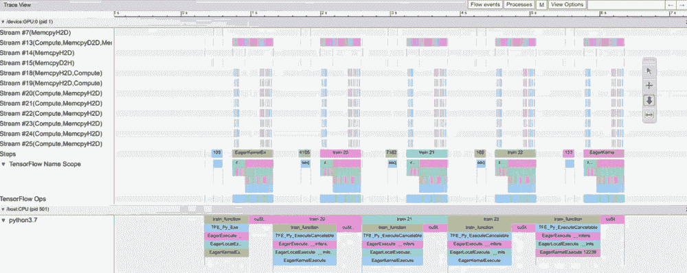
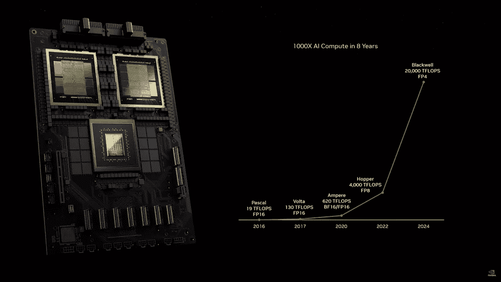
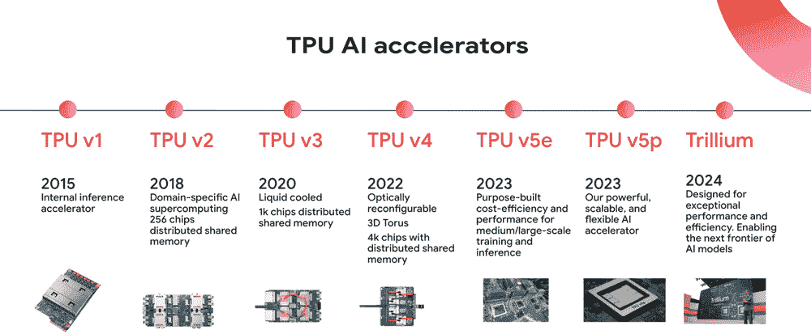
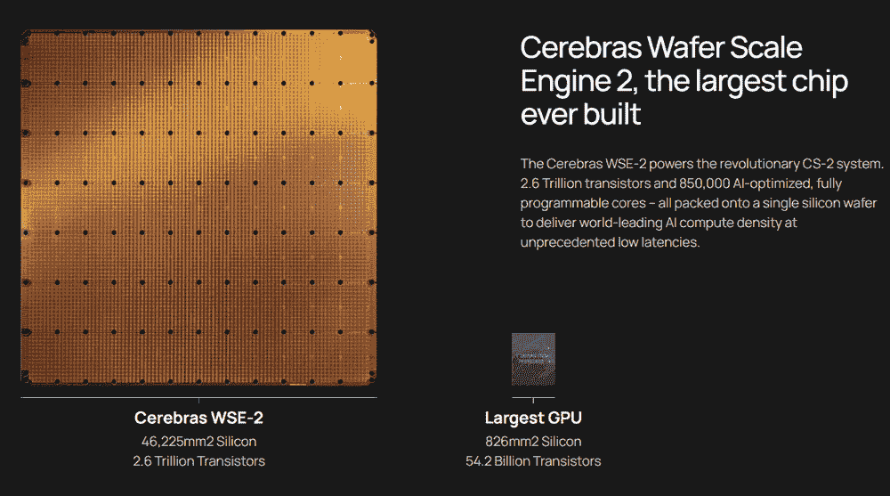

# AI 训练

*DALL·E 3 提示：一幅用于 AI 训练的插图，描绘了一个神经网络的神经元正在被修复和激活。场景包括一个庞大的神经元网络，每个神经元都在发光和激活，以表示活动和学习。在这些神经元中，类似工程师和科学家的微小人物正在积极工作，修复和调整神经元。这些微型工人象征着训练网络的过程，调整权重和偏差以实现收敛。整个场景是 AI 训练中复杂且协作努力的视觉隐喻，工人代表着神经网络内部的持续优化和学习。背景是一个复杂的相互连接的神经元阵列，营造出深度和复杂性的感觉。*


## 目的

*为什么现代机器学习问题需要新的分布式计算和系统架构方法？*

机器学习训练产生的计算需求超出了单机能力，需要协调多个设备和数据中心计算的分布式系统。训练工作负载具有独特的特征：庞大的数据集无法全部装入内存，拥有数十亿参数的模型需要协调更新，以及需要跨分布式资源持续同步的迭代算法。这些扩展需求在内存管理、通信效率、容错性和资源调度方面给系统带来了挑战，而传统系统并未设计来处理这些挑战。随着模型复杂性的指数增长，理解分布式训练系统对于任何具有实际意义的机器学习应用都变得必要。为大规模训练开发的系统工程原则直接影响着部署架构、成本结构和跨行业的解决方案可行性。

**学习目标**

+   解释神经网络中的数学运算（矩阵乘法、激活函数、反向传播）如何转化为计算和内存系统需求

+   分析训练管道中的性能瓶颈，包括数据加载、内存带宽限制和计算利用率模式

+   高效地设计集成数据预处理、计算遍历和参数更新的训练管道架构

+   应用单机优化技术，包括混合精度训练、梯度累积和激活检查点，以最大化资源利用率

+   比较分布式训练策略（数据并行、模型并行、流水线并行），并根据模型特性和硬件约束选择适当的方法

+   评估用于训练工作负载的专用硬件平台（GPU、TPU、FPGA、ASIC），并针对特定架构特性优化代码

+   在训练框架中实现优化算法（SGD、Adam、AdamW）的同时，理解它们的内存和计算影响

+   批判常见的训练系统设计决策，以避免性能陷阱和扩展瓶颈

## 训练系统演变与架构

训练是机器学习系统中最具挑战性的阶段，在这一阶段，理论结构通过计算优化变为实际现实。在第二章 Chapter 2 中建立的系统设计方法、第六章 Chapter 6 中探索的数据管道架构以及第七章 Chapter 7 中考察的计算框架的基础上，本章探讨了算法理论、数据处理和硬件架构如何在智能系统的迭代优化中相互融合。

训练构成了机器学习系统生命周期中最计算密集的阶段，需要谨慎地运用分布式系统工程原则来编排数学优化过程。当代的训练工作负载对计算能力提出了超出传统计算范式的需求：拥有数十亿参数的模型需要 TB 级的内存容量，训练语料库跨越 PB 级存储系统，基于梯度的优化算法需要在数千个处理单元之间进行同步计算。这些计算规模在内存层次管理、节点间通信效率和资源分配策略上为系统工程带来了挑战，这些挑战将训练基础设施与通用计算架构区分开来。

在前几章中建立的设计方法在训练阶段充当了架构基础。第二章中提到的模块化系统架构 Chapter 2 使得分布式训练编排成为可能，第六章中提到的工程化数据处理管道 Chapter 6 提供了持续的训练样本流，第七章中提到的计算框架 Chapter 7 提供了必要的算法抽象。训练系统集成代表了理论设计原则与性能工程约束相遇的地方，为第三部分中探讨的优化技术建立了计算基础。

本章开发了可扩展训练基础设施的系统工程基础。我们探讨了在参数模型中将数学运算转换为具体计算需求的过程，分析了训练管道中的性能瓶颈，包括内存带宽限制和计算吞吐量约束，并设计了在保持容错保证的同时实现高效率的系统。通过探索单节点优化策略、分布式训练方法和专用硬件利用模式，本章发展了构建能够从实验原型扩展到生产级部署的训练基础设施所需的系统工程视角。

**灯塔示例：训练 GPT-2**

本章使用**训练 GPT-2（15 亿参数）**作为一个一致的参考点，将抽象概念具体化。GPT-2 是一个理想的教学示例，因为它：

+   **跨越规模范围**：足够大，需要严肃的优化，足够小，无需大规模基础设施进行训练

+   **具有完善的架构文档**：48 个 transformer 层，1280 个隐藏维度，20 个注意力头

+   **表现出所有关键训练挑战**：内存压力、计算强度、数据管道复杂性

+   **代表现代机器学习系统**：基于 Transformer 的模型主导着当代机器学习

**Transformer 架构入门**：

GPT-2 使用 Transformer 架构（在第四章中详细说明），通过自注意力机制处理文本。理解这些关键计算模式为本章中的训练示例提供了必要的背景：

+   **自注意力**：通过矩阵运算（查询×键的转置）计算序列中所有单词之间的关系，产生注意力分数，这些分数衡量每个单词对其他单词的影响程度

+   **多头注意力**：在多个“头”之间并行化注意力（GPT-2 使用 20 个），每个“头”学习不同的关系模式

+   **Transformer 层**：堆叠注意力与前馈网络（GPT-2 有 48 层），实现层次化特征学习

+   **关键计算模式**：主要由大型矩阵乘法（注意力分数计算、前馈网络）主导，这些计算模式受益于 GPU 并行化

这种架构对矩阵乘法和顺序依赖的严重依赖，为我们探索的具体训练系统挑战创造了条件：巨大的激活内存需求、分布式训练中的通信瓶颈以及混合精度优化的机会。

**关键 GPT-2 规格**：

+   **参数**：1.542B（确切计数为 1,558,214,656）

+   **训练数据**：OpenWebText（约 40GB 文本，约 90 亿个标记）

+   **批处理配置**：通常在 8-32 个 GPU 上实现 512 个有效批处理大小

+   **内存占用**：约 3GB 参数（FP16：16 位浮点数，每个值使用 2 字节，而 FP32 使用 4 字节），约 18GB 激活（batch_size=32）

+   **训练时间**：在 32 个 V100 GPU 上约为 2 周

**关于精度格式的说明**：在本章中，我们参考了**FP32**（32 位）和**FP16**（16 位）浮点数格式。FP16 将内存需求减半，并允许在现代具有 Tensor Core 的 GPU 上实现更快的计算。**混合精度训练**（详见第 8.5.4 节）策略性地将 FP16 用于大多数操作与 FP32 用于数值稳定性相结合，实现了 2 倍的内存节省和 2-3 倍的速度提升，同时保持精度。

**🔄 GPT-2 示例标记**出现在该特定模型阐明讨论中的概念的关键点。每个示例都提供了定量规格、性能权衡以及在训练此模型时遇到的具体实现决策。

## 训练系统

现代机器学习模型的发展依赖于专门的计算框架，这些框架管理着迭代优化的复杂过程。这些系统与传统计算基础设施不同，需要仔细协调数据处理、梯度计算、参数更新以及跨可能成千上万的设备进行分布式协调。理解构成训练系统及其与通用计算的不同，为后续的架构决策和优化策略提供了基础。

***机器学习训练系统***是执行模型参数的*迭代优化*的计算框架，通过协调*数据处理*、*梯度计算*和跨硬件和软件基础设施的*分布式计算*。

设计有效的训练架构需要认识到机器学习训练系统代表一类独特的计算工作负载，对硬件和软件基础设施有独特的需求。当你在 PyTorch 或 TensorFlow 等框架中执行训练命令时，这些系统必须高效地在大数据集上管理重复计算，同时处理超出通用计算架构能力的内存需求和数据移动模式。

训练工作负载表现出三个特征，使其与传统计算区分开来：从大规模模型中进行的迭代梯度计算带来的极端计算强度，存储参数、激活和优化器状态时产生的巨大内存压力，以及需要跨分布式资源同步参数更新的复杂数据依赖。对于大型语言模型的一次训练运行大约需要约<semantics><msup><mn>10</mn><mn>23</mn></msup><annotation encoding="application/x-tex">10^{23}</annotation></semantics>次浮点运算（T. Brown 等人 2020），包括激活存储在内的内存占用达到数太字节，以及数千台设备的协调——这些需求是通用系统从未设计来处理的。

理解为什么当代训练系统演变成当前的架构需要考察计算系统如何逐步适应日益增长的工作负载。虽然训练侧重于迭代的优化以实现学习，但推理系统（本书中详细阐述）优化的是低延迟的预测服务。这些代表了两种互补但不同的计算范式。从通用计算到专用训练系统的架构演进揭示了现代训练基础设施设计所依据的系统原则。与传统的超高性能计算工作负载不同，训练系统表现出特定的特征，这些特征影响了它们的设计和实现。

### 机器学习训练的计算架构演变

计算系统架构经历了不同的世代演变，每个新时代都是在前一代进步的基础上建立的，同时引入了针对新兴应用需求的专用优化（图 8.1）。这种演变与第七章中详细介绍的机器学习框架和软件堆栈的发展并行，它们与硬件共同进化，以实现这些计算资源的有效利用。这一进展展示了硬件如何适应应用需求来塑造现代机器学习系统。


图 8.1：**计算系统演变**：硬件进步持续适应机器学习工作负载不断增长的需求，从集中式主机过渡到如 gpu 和针对并行处理和大规模数据集优化的 AI 超计算系统等专用架构。这一进展反映了通过增加计算能力和内存带宽来加速模型训练和推理的趋势。

电子计算始于主机时代。ENIAC1（1945 年）证明了大规模电子计算的可行性，而 IBM System/3602（1964 年）引入了标准化指令集和内存层次结构的架构原则。这些基本概念为所有后续计算系统提供了基础。

在这些基础计算原则的基础上，高性能计算（HPC）系统（Thornton 1965）专门用于科学计算。CDC 66003 和后来的系统如 CM-54 (T. M. Corporation 1992）针对密集矩阵运算和浮点计算进行了优化。

HPC 系统为科学工作负载实现了特定的架构特性：用于数组操作的高带宽内存系统、用于数学计算的向量处理单元以及用于集体通信模式的专用互连。科学计算需要强调数值精度和稳定性，处理器和内存系统设计用于常规、可预测的访问模式。互连支持紧密同步的并行执行，使计算节点之间的集体操作效率更高。

随着对互联网规模处理需求的增长，仓库规模计算标志着下一个进化步骤。谷歌数据中心实现 5 (Barroso and Hölzle 2007）为互联网规模数据处理引入了新的优化。与专注于紧密耦合科学计算的高性能计算系统不同，仓库计算处理松散耦合的任务，具有不规则的数据访问模式。

WSC 系统引入了架构变化，以支持独立任务的高吞吐量，具有强大的容错和恢复机制。存储和内存系统适应了高效处理稀疏数据结构，远离了 HPC 的密集数组优化。资源管理系统演变为支持多个应用程序共享计算基础设施，与 HPC 的专用应用程序执行模型形成对比。

高性能计算和仓库规模系统都没有完全满足机器学习训练的独特需求。每个计算时代都针对不同的工作负载特征进行了优化，这些特征仅部分符合 AI 训练需求：

+   **高性能计算**：针对密集、浮点运算量大、紧密耦合的模拟进行了优化。高性能计算为 AI 训练所需的高带宽互连和并行数值计算奠定了基础，但专注于常规、可预测的访问模式，不适合神经网络训练的动态内存需求。

+   **仓库规模计算**：针对稀疏、整数密集型、松散耦合的数据处理进行了优化。仓库规模计算展示了在生产人工智能系统中必要的容错性和大规模，但强调了独立并行任务，这与分布式训练中所需的同步梯度更新形成对比。

+   **AI 训练**：提出了独特的挑战，需要**同时**进行密集的 FP16/FP32 计算（如高性能计算）和大规模数据量（如仓库规模计算），同时还要处理迭代、同步的梯度更新带来的复杂性。这种独特的需求组合——密集的参数更新、复杂的内存访问模式以及协调的分布式计算——推动了今天专门化人工智能超计算系统的发展。

2012 年 AlexNet6 (Krizhevsky, Sutskever, and Hinton 2017a) 的成功证明了现有系统无法有效地处理这种需求的融合。神经网络训练需要新的内存管理和设备间通信方法，而高性能计算的科学重点紧密耦合和仓库计算的数据处理松散耦合都没有解决这些问题。

这种专业化的需求引领了人工智能超计算时代的到来，始于 2015 年，这是这一进化链的最新一步。NVIDIA GPU7 和 Google TPU8 引入了专门针对神经网络计算进行优化的硬件设计，超越了现有架构的适应性。这些系统实现了新的并行处理、内存访问和设备通信方法，以处理模型训练的独特模式。这些架构在满足科学计算的数值精度需求的同时，也满足了仓库系统的规模要求，并增加了对神经网络优化迭代特性的专门支持。这些专用训练加速器的全面设计原则、架构细节和优化策略在第十一章中进行了详细探讨，而本章则专注于训练系统编排和管道优化。

这种架构的演进说明了为什么传统的计算系统在神经网络训练方面证明是不够的。如表 8.1 所示，虽然高性能计算系统为并行数值计算提供了基础，而仓库规模系统展示了大规模的分布式处理，但它们都没有完全解决模型训练的计算模式。现代神经网络以密集的参数更新、复杂的内存访问模式和协调的分布式计算相结合的方式，要求新的架构方法。

理解这些独特的特征及其从先前计算时代的演变，可以解释为什么现代 AI 训练系统需要专门的硬件特性和优化的系统设计。这一历史背景为详细检查机器学习训练系统架构提供了基础。

表 8.1：**计算时代演变**：系统架构逐渐适应不断变化的工作负载需求，从通用计算过渡到针对神经网络训练优化的专用设计。高性能计算（HPC）确立了并行处理基础，而仓库规模系统实现了分布式计算；然而，现代神经网络需要平衡密集参数更新、复杂内存访问和协调分布式计算的架构。

| **时代** | **主要工作负载** | **内存模式** | **处理模型** | **系统重点** |
| --- | --- | --- | --- | --- |
| **主机** | 顺序批处理 | 简单的内存层次结构 | 单指令流 | 通用计算 |
| **HPC** | 科学模拟 | 规则数组访问 | 同步并行 | 数值精度，集体操作 |
| **仓库规模** | 互联网服务 | 稀疏，不规则访问 | 独立并行任务 | 吞吐量，容错性 |
| **AI 超计算** | 神经网络训练 | 参数密集，混合访问 | 混合并行，分布式 | 训练优化，模型规模 |

### 机器学习开发生命周期中的训练系统

训练系统通过专门的计算框架运行。现代机器学习模型的发展依赖于用于训练和优化的专用系统。这些系统结合了硬件和软件组件，必须高效地处理大量数据集，同时保持数值精度和计算稳定性。尽管这些系统快速发展和实施多样化，但训练系统具有共同的特征和需求，使其与传统计算基础设施区分开来。

这些训练系统提供了开发预测模型所需的核心基础设施。它们执行模型参数的数学优化，将输入数据转换为用于模式识别、语言理解和决策自动化等任务的计算表示。训练过程涉及对数据集的系统迭代，以最小化误差函数并实现最佳模型性能。

训练系统作为更广泛机器学习流程中的基本组成部分，建立在第一章中引入的基础概念之上。它们与预处理框架接口，这些框架标准化并转换原始数据，同时连接到部署架构，以实现模型服务。训练系统的计算效率和可靠性直接影响从初始实验到模型验证再到生产部署的开发周期。这种端到端视角将训练优化与第十三章中探讨的更广泛人工智能系统生命周期考虑因素联系起来。

随着最近架构的进步，这种操作范围已经扩大。Transformer 架构 9 和大规模模型的出现为训练系统引入了新的要求。当前的实现必须高效地处理 PB 级数据集，协调跨多个加速器的分布式训练，并优化包含数十亿参数的模型的内存利用率。数据并行 10、模型并行 11 和跨设备通信的管理在现代训练架构中提出了技术挑战。这些分布式系统复杂性促使专门的 AI 工作流程管理工具(第五章)自动化大规模训练编排的许多方面。

训练系统还对机器学习开发的操作考虑产生影响。系统设计必须解决多个技术约束：计算吞吐量、能耗、硬件兼容性和随着模型复杂性的增加的可扩展性。虽然本章重点介绍训练系统的计算和架构方面，但能源效率和可持续性考虑在第十八章中进行了探讨。这些因素决定了机器学习实现在不同规模和应用中的技术可行性和操作可行性。

### 训练基础设施的系统设计原则

训练实现需要系统视角。训练模型的实际执行与系统设计紧密相连。训练不仅仅是数学优化问题；它是一个系统驱动的流程，需要仔细编排计算硬件、内存和数据移动。

训练工作流程由相互依赖的阶段组成：数据预处理、正向和反向传递以及参数更新，这些阶段扩展了来自第三章的基本神经网络概念。每个阶段都对系统资源提出特定的要求。例如，数据预处理阶段依赖于存储和 I/O 子系统为计算硬件提供连续输入。输入数据的质量和可靠性至关重要——数据验证、损坏检测、特征工程、模式强制和管道可靠性策略在第六章中有详细说明。虽然第六章侧重于确保数据质量和一致性，但本章探讨了在训练过程中数据移动、转换吞吐量和交付给计算资源的系统级效率。

虽然传统的处理器如 CPU 能够有效地处理许多训练任务，但日益复杂的模型推动了硬件加速器的采用。图形处理单元(GPUs)和专门的机器学习处理器可以并行处理数学运算，为矩阵密集型计算提供显著加速。这些加速器与 CPU 一起处理梯度计算和参数更新等操作，使得能够训练具有理论基础的分层表示，这些理论基础在第四章中进行了探讨。这些阶段的性能取决于系统如何管理内存带宽和通信延迟等瓶颈。

这些相互关联的工作流程阶段揭示了系统架构如何直接影响训练效率。系统限制通常决定了训练工作负载的性能限制。现代加速器通常受内存带宽的限制，因为数据在内存层次结构之间的移动可能比计算本身慢且能耗更高(David A. Patterson and Hennessy 2021a)。在分布式设置中，设备间的同步引入了额外的延迟，而互连的性能（例如，NVLink、InfiniBand）在其中发挥着重要作用。

通过第 8.5.1 节中详细说明的系统化方法，优化训练工作流程克服了这些限制。像重叠计算与数据加载、混合精度训练(Micikevicius et al. 2017)和高效内存分配等技术解决了限制训练性能的三个主要瓶颈。这些低级优化补充了第十章中涵盖的高级模型压缩策略，形成了一种综合的训练效率方法。

系统思维不仅超越了基础设施优化，还扩展到了设计决策。系统级约束通常指导新的模型架构和训练方法的开发。在第十一章中讨论的硬件-软件协同设计原则 Chapter 11 展示了理解系统能力如何激发全新的架构创新。例如，内存限制推动了更高效神经网络架构的研究(Vaswani et al. 2017)，而分布式系统中的通信开销影响了优化算法的设计。这些调整展示了如何在给定的计算范围内，实际系统考虑如何塑造机器学习方法的演变。

例如，训练大型 Transformer 模型 12 需要在多个设备上划分数据和模型参数。这引入了同步挑战，尤其是在梯度更新期间。如[NVIDIA 的集体通信库（NCCL）](https://docs.nvidia.com/deeplearning/nccl/user-guide/docs/overview.html)之类的通信库能够实现高效的梯度共享，为分布式训练优化技术提供了基础。第十二章中讨论的基准测试方法 Chapter 12 提供了评估这些分布式训练性能特性的系统方法。这些例子说明了系统级考虑如何影响现代训练工作流程的可行性和效率。

## 数学基础

上述建立的系统视角揭示了为什么理解训练核心的数学操作至关重要。这些操作不是抽象的概念，而是具体的计算，它们决定了训练系统设计的各个方面。神经网络数学的计算特性直接决定了硬件需求、内存架构和并行化约束。当系统架构师选择 GPU 而不是 CPU、设计内存层次结构或选择分布式训练策略时，他们是在回应这些数学操作的具体需求。

上述讨论的专业化训练系统是专门设计来高效执行这些操作的。理解这些数学基础是至关重要的，因为它们直接决定了系统需求：操作类型决定了硬件专业化的需求（为什么矩阵乘法单元在现代加速器中占主导地位），内存访问模式影响了缓存设计（为什么激活存储成为瓶颈），计算依赖性塑造了并行化策略（为什么某些操作不能简单地分布式）。当我们之前讨论人工智能超计算与高性能计算系统不同时，这种区别源于每个系统必须执行的数学操作的不同。

训练系统必须反复执行三类操作。首先，前向传播通过矩阵乘法和激活函数计算预测。其次，通过反向传播计算梯度，使用存储的激活和链式法则来计算参数更新。第三，参数更新使用保持动量和自适应学习率状态的优化算法应用梯度。每一类都表现出独特的计算模式和系统要求，训练架构必须适应。

这些操作的计算特性直接影响了之前讨论的系统设计决策。矩阵乘法主导了前向和后向传播，占用了 60-90%的训练时间(K. He et al. 2016)，这也解释了为什么专门的矩阵单元（GPU 张量核心、TPU 收缩阵列）成为了训练硬件的核心。这种计算主导性塑造了现代训练架构，从硬件设计选择到软件优化策略。用于梯度计算的激活存储产生了与批量大小和网络深度成比例的内存压力，这促使我们探索内存层次结构和梯度检查点等优化技术。前向传播、梯度计算和参数更新之间的迭代依赖关系阻止了任意并行化，限制了可扩展的分布式训练策略。理解这些数学操作及其系统级影响是理解现代训练系统如何实现效率的基础。

### 神经网络计算

神经网络训练包括重复的矩阵操作和非线性变换。虽然这些操作在概念上很简单，但它们创造了系统级挑战，这些挑战主导了现代训练基础设施。通过引入反向传播和开发高效的矩阵计算库，例如 BLAS(Dongarra et al. 1988)，Rumelhart、Hinton 和 Williams(1986)的基础性工作为现代训练架构奠定了基础。

#### 神经网络中的数学操作

神经网络的核心是前向传播的过程，在最简单的情况下，它涉及两个主要操作：矩阵乘法和激活函数的应用。矩阵乘法构成了网络每一层的线性变换的基础。这个方程代表了信息如何通过神经网络每一层流动：

在第 <semantics><mi>l</mi><annotation encoding="application/x-tex">l</annotation></semantics> 层，计算可以描述为：<semantics><mrow><msup><mi>A</mi><mrow><mo stretchy="true" form="prefix">(</mo><mi>l</mi><mo stretchy="true" form="postfix">)</mo></mrow></msup><mo>=</mo><mi>f</mi><mrow><mo stretchy="true" form="prefix">(</mo><msup><mi>W</mi><mrow><mo stretchy="true" form="prefix">(</mo><mi>l</mi><mo stretchy="true" form="postfix">)</mo></mrow></msup><msup><mi>A</mi><mrow><mo stretchy="true" form="prefix">(</mo><mi>l</mi><mo>−</mo><mn>1</mn><mo stretchy="true" form="postfix">)</mo></mrow></msup><mo>+</mo><msup><mi>b</mi><mrow><mo stretchy="true" form="prefix">(</mo><mi>l</mi><mo stretchy="true" form="postfix">)</mo></mrow></msup><mo stretchy="true" form="postfix">)</mo></mrow></mrow> <annotation encoding="application/x-tex">A^{(l)} = f\left(W^{(l)} A^{(l-1)} + b^{(l)}\right)</annotation></semantics> 其中：

+   <semantics><msup><mi>A</mi><mrow><mo stretchy="true" form="prefix">(</mo><mi>l</mi><mo>−</mo><mn>1</mn><mo stretchy="true" form="postfix">)</mo></mrow></msup><annotation encoding="application/x-tex">A^{(l-1)}</annotation></semantics> 表示前一层（或第一层的输入层）的激活值，

+   <semantics><msup><mi>W</mi><mrow><mo stretchy="true" form="prefix">(</mo><mi>l</mi><mo stretchy="true" form="postfix">)</mo></mrow></msup><annotation encoding="application/x-tex">W^{(l)}</annotation></semantics> 是第 <semantics><mi>l</mi><annotation encoding="application/x-tex">l</annotation></semantics> 层的权重矩阵，其中包含网络学习到的参数，

+   <semantics><msup><mi>b</mi><mrow><mo stretchy="true" form="prefix">(</mo><mi>l</mi><mo stretchy="true" form="postfix">)</mo></mrow></msup><annotation encoding="application/x-tex">b^{(l)}</annotation></semantics> 是第 <semantics><mi>l</mi><annotation encoding="application/x-tex">l</annotation></semantics> 层的偏置向量，

+   <semantics><mrow><mi>f</mi><mrow><mo stretchy="true" form="prefix">(</mo><mi>⋅</mi><mo stretchy="true" form="postfix">)</mo></mrow></mrow><annotation encoding="application/x-tex">f(\cdot)</annotation></semantics> 是逐元素应用激活函数（例如 ReLU、sigmoid）以引入非线性。

#### 矩阵运算

理解这些数学运算如何转化为系统需求需要检查神经网络中的计算模式，这些模式围绕各种类型的矩阵运算展开。理解这些运算及其演变揭示了为什么在机器学习训练系统中出现了特定的系统设计和优化。

##### 稠密矩阵-矩阵乘法

基于上述建立的矩阵乘法主导地位，这些计算模式的演变推动了算法和硬件的创新。早期的神经网络实现依赖于基于标准 CPU 的线性代数库，但现代训练的规模需要专门的优化。从斯特拉斯恩算法 13，它将原始的<semantics><mrow><mi>O</mi><mrow><mo stretchy="true" form="prefix">(</mo><msup><mi>n</mi><mn>3</mn></msup><mo stretchy="true" form="postfix">)</mo></mrow></mrow><annotation encoding="application/x-tex">O(n³)</annotation></semantics>复杂度降低到大约<semantics><mrow><mi>O</mi><mrow><mo stretchy="true" form="prefix">(</mo><msup><mi>n</mi><mn>2.81</mn></msup><mo stretchy="true" form="postfix">)</mo></mrow></mrow><annotation encoding="application/x-tex">O(n^{2.81})</annotation></semantics> (Strassen 1969)，到当代的硬件加速库如[cuBLAS](https://developer.nvidia.com/cublas)，这些创新不断推动计算效率的极限。

这种计算主导地位推动了系统级优化。现代系统通过多个单元的并行处理实现分块矩阵计算。随着神经网络规模的扩大，这些乘法开始需要大量的内存资源，因为权重矩阵和激活矩阵都必须在训练期间的逆传播过程中保持可访问。硬件设计适应了优化这些密集乘法模式，同时管理不断增长的内存需求。

**GPT-2 注意力层计算**

每个 GPT-2 层执行注意力计算，这些计算体现了密集矩阵乘法的需求。对于一个 batch_size=32，sequence_length=1024，hidden_dim=1280 的单个注意力头：

**查询、键、值投影**（3 次独立的矩阵乘法）：<semantics><mrow><mtext mathvariant="normal">FLOPS</mtext><mo>=</mo><mn>3</mn><mo>×</mo><mrow><mo stretchy="true" form="prefix">(</mo><mtext mathvariant="normal">batch</mtext><mo>×</mo><mtext mathvariant="normal">seq</mtext><mo>×</mo><mtext mathvariant="normal">hidden</mtext><mo>×</mo><mtext mathvariant="normal">hidden</mtext><mo stretchy="true" form="postfix">)</mo></mrow></mrow> <annotation encoding="application/x-tex">\text{FLOPS} = 3 \times (\text{batch} \times \text{seq} \times \text{hidden} \times \text{hidden})</annotation></semantics> <semantics><mrow><mo>=</mo><mn>3</mn><mo>×</mo><mrow><mo stretchy="true" form="prefix">(</mo><mn>32</mn><mo>×</mo><mn>1024</mn><mo>×</mo><mn>1280</mn><mo>×</mo><mn>1280</mn><mo stretchy="true" form="postfix">)</mo></mrow><mo>=</mo><mn>161</mn> <mrow><mtext mathvariant="normal">billion FLOPS</mtext></mrow></mrow> <annotation encoding="application/x-tex">= 3 \times (32 \times 1024 \times 1280 \times 1280) = 161 \text{ billion FLOPS}</annotation></semantics>

**注意力分数计算**（Q × K^T）：<semantics><mrow><mtext mathvariant="normal">FLOPS</mtext><mo>=</mo><mtext mathvariant="normal">batch</mtext><mo>×</mo><mtext mathvariant="normal">heads</mtext><mo>×</mo><mtext mathvariant="normal">seq</mtext><mo>×</mo><mtext mathvariant="normal">seq</mtext><mo>×</mo><mtext mathvariant="normal">hidden/heads</mtext></mrow> <annotation encoding="application/x-tex">\text{FLOPS} = \text{batch} \times \text{heads} \times \text{seq} \times \text{seq} \times \text{hidden/heads}</annotation></semantics> <semantics><mrow><mo>=</mo><mn>32</mn><mo>×</mo><mn>20</mn><mo>×</mo><mn>1024</mn><mo>×</mo><mn>1024</mn><mo>×</mo><mn>64</mn><mo>=</mo><mn>42.9</mn> <mrow><mtext mathvariant="normal">billion FLOPS</mtext></mrow></mrow> <annotation encoding="application/x-tex">= 32 \times 20 \times 1024 \times 1024 \times 64 = 42.9 \text{ billion FLOPS}</annotation></semantics>

**计算规模**

+   单个注意力层的总量：~204B FLOPS 正向传递

+   在 GPT-2 的 48 层中：每训练步骤~9.8 万亿次 FLOPS

+   在 50K 个训练步骤后：~490 petaFLOPS 总训练计算

**系统影响：V100 GPU 的影响**：一个 V100 GPU（峰值 FP16 为 125 TFLOPS，带有 Tensor Cores 时为 28 TFLOPS，不带时为 28 TFLOPS）在 100%利用率下，仅注意力计算每步就需要 79 秒。实际的训练步骤需要 180 到 220 毫秒，需要 8 到 32 个 GPU 才能达到这种吞吐量。

##### 矩阵-向量操作

在矩阵-矩阵操作之外，随着神经网络架构中归一化技术的引入，矩阵-向量乘法变得至关重要。尽管在计算上比矩阵-矩阵乘法简单，但这些操作在系统上提出了挑战。由于它们的并行化潜力有限，它们表现出较低的硬件利用率。这一特性影响了硬件设计和模型架构决策，尤其是在处理顺序输入或计算层统计的网络中。

##### 批量操作

认识到矩阵-向量操作的局限性，批次的引入 14 改变了神经网络中的矩阵计算。通过同时处理多个输入，训练系统将矩阵-向量操作转换为更高效的矩阵-矩阵操作。这种方法提高了硬件利用率，但增加了存储中间结果的内存需求。现代实现必须在批处理大小和可用内存之间进行平衡，导致内存管理和计算调度方面的特定优化。

类似于谷歌 TPU（Norman P. Jouppi 等人 2017b）的硬件加速器反映了这种演变，它们结合了专门化的矩阵单元和用于这些多样化乘法模式的内存层次结构。这些硬件适应性使得通过高效处理各种矩阵操作来训练大规模模型如 GPT-3（T. Brown 等人 2020）成为可能。

**系统影响：为什么 GPU 在训练中占主导地位**

上文所述的矩阵运算直接解释了现代训练硬件架构。GPU 主导训练的原因是：

+   **大规模并行性**：矩阵乘法的独立元素计算与 GPU 的数千个核心（NVIDIA A100：6,912 CUDA 核心）完美映射

+   **专用硬件单元**：Tensor 核心通过为占主导地位的工作负载提供专用硬件，将矩阵运算加速 10-20 倍

+   **内存带宽优化**：分块矩阵计算模式能够有效地利用 GPU 内存层次结构（L1/L2 缓存→共享内存→全局内存）

当 GPT-2 的例子后来显示为什么 V100 GPU 通过混合精度（第 2018 行）实现 2.4 倍的速度提升时，这种加速来自于执行我们刚刚分析的矩阵乘法的 Tensor 核心。理解矩阵操作特性是欣赏为什么流水线优化如混合精度训练提供如此巨大好处的前提。

#### 激活函数

在第三章中，我们确立了激活函数——sigmoid、tanh、ReLU 和 softmax——为神经网络学习复杂模式提供必要的非线性。我们考察了它们的数学特性：sigmoid 的<semantics><mrow><mo stretchy="true" form="prefix">(</mo><mn>0</mn><mo>,</mo><mn>1</mn><mo stretchy="true" form="postfix">)</mo></mrow><annotation encoding="application/x-tex">(0,1)</annotation></semantics>有界输出，tanh 的零中心<semantics><mrow><mo stretchy="true" form="prefix">(</mo><mi>−</mi><mn>1</mn><mo>,</mo><mn>1</mn><mo stretchy="true" form="postfix">)</mo></mrow><annotation encoding="application/x-tex">(-1,1)</annotation></semantics>范围，ReLU 的梯度流优势，以及 softmax 的概率分布。回想一下图 3.11 中每个函数如何以不同的方式转换输入，对梯度行为和学习动态有独特的含义。

虽然激活函数是逐元素应用的，与矩阵运算相比，它们只贡献了总计算时间的 5-10%，但它们的实现特性对训练系统性能的影响很大。面对机器学习系统工程师的问题不是数学上*什么*激活函数——这个基础已经确立——而是*如何*在规模上高效地实现它们。为什么 ReLU 在 CPU 上比 sigmoid 快 3 倍，但在 GPU 上却表现出不同的相对性能？硬件加速器如何优化这些操作？不同的激活函数在反向传播过程中会创建什么样的内存访问模式？

本节从系统角度考察激活函数，分析计算成本、硬件实现策略和性能权衡，这些权衡决定了实际训练效率。了解这些实际限制，有助于在设计针对特定硬件环境的训练系统时做出明智的架构决策。

##### 基准测试激活函数

神经网络中的激活函数对数学特性和系统级性能都有显著影响。激活函数的选择直接影响了训练时间、模型可扩展性和硬件效率，这主要通过三个主要因素来实现：计算成本、梯度行为和内存使用。

在 Apple M2 单线程 CPU 上对常见激活函数进行基准测试揭示了有意义的性能差异，如图 8.2 图 8.2 所示。数据显示，Tanh 和 ReLU 在 CPU 架构上比 Sigmoid 执行效率更高，这使得它们特别适合实时应用和大规模系统。


图 8.2：**激活函数性能**：在 CPU 执行时间上，常见激活函数之间存在显著差异，tanh 和 relu 在当前架构上相对于 sigmoid 提供了显著的速度优势。这些差异影响了系统级考虑因素，如训练时间和实时推理能力，指导了性能关键应用的激活函数选择。

虽然这些基准测试结果提供了有价值的见解，但它们仅代表了没有硬件加速的 CPU 性能。在生产环境中，现代硬件加速器如 GPU 可以显著改变激活函数的相对性能特征。因此，系统架构师在评估计算效率时必须考虑其特定的硬件环境和部署上下文。

回顾第三章，我们知道每个激活函数都表现出不同的梯度行为、稀疏特性和计算复杂度。现在的问题是：这些数学属性如何转化为硬件约束和系统性能？以下小节将检查每个函数的实现特性，重点关注软件与硬件之间的权衡，这些权衡决定了现实世界的训练效率：

###### Sigmoid

Sigmoid 的平滑<semantics><mrow><mo stretchy="true" form="prefix">(</mo><mn>0</mn><mo>,</mo><mn>1</mn><mo stretchy="true" form="postfix">)</mo></mrow><annotation encoding="application/x-tex">(0,1)</annotation></semantics>有界输出使其在概率解释方面很有用，但其消失梯度问题和非零中心输出带来了优化挑战。从系统角度来看，指数函数的计算成为关键瓶颈。在软件中，这种计算既昂贵又低效 15，尤其是在深度网络或大型数据集中，每次前向传递都会发生数百万次 sigmoid 评估。

在硬件中，这些计算挑战的处理方式不同。现代加速器如 GPU 和 TPU 通常避免直接计算指数函数，而是使用查找表（LUTs）或分段线性近似来平衡精度和速度。尽管这些硬件优化有所帮助，但多次内存查找和插值计算仍然使得 sigmoid 比起 ReLU 等简单函数更占用资源，即使在高度并行的架构上也是如此。

###### Tanh

虽然 tanh 在其 <semantics><mrow><mo stretchy="true" form="prefix">(</mo><mi>−</mi><mn>1</mn><mo>,</mo><mn>1</mn><mo stretchy="true" form="postfix">)</mo></mrow><annotation encoding="application/x-tex">(-1,1)</annotation></semantics> 零中心输出方面优于 sigmoid，但它与 sigmoid 一样，存在计算负担。tanh 所需的指数计算在软件和硬件实现中都造成了类似的性能瓶颈。在软件中，这种计算开销可能会减慢训练速度，尤其是在处理大型数据集或深度模型时。

在硬件中，tanh 利用其与 sigmoid（缩放和移位版本）的数学关系来优化实现。现代硬件通常采用混合方法实现 tanh：对于常见输入范围使用查找表，对于边缘情况使用分段近似。这种方法有助于平衡精度和计算效率，尽管 tanh 仍然比简单函数更占用资源。尽管存在这些挑战，tanh 仍然在需要平衡梯度的 RNN 和 LSTM16 中很常见。

###### ReLU

ReLU 代表了激活函数设计的转变。其数学简单性—<semantics><mrow><mo>max</mo><mrow><mo stretchy="true" form="prefix">(</mo><mn>0</mn><mo>,</mo><mi>x</mi><mo stretchy="true" form="postfix">)</mo></mrow></mrow><annotation encoding="application/x-tex">\max(0,x)</annotation></semantics>—避免了梯度消失并引入了有益的稀疏性，尽管它可能遭受神经元死亡的问题。这种简单形式对系统性能有深远的影响。在软件中，ReLU 的简单阈值操作与 sigmoid 或 tanh 相比，计算速度大大加快，只需要进行一次比较而不是指数计算。

ReLU 的硬件实现展示了它为何成为现代神经网络中占主导地位的激活函数。其简单的<semantics><mrow><mo>max</mo><mrow><mo stretchy="true" form="prefix">(</mo><mn>0</mn><mo>,</mo><mi>x</mi><mo stretchy="true" form="postfix">)</mo></mrow></mrow><annotation encoding="application/x-tex">\max(0,x)</annotation></semantics>操作只需要一次比较和条件设置，转化为最小的电路复杂性 17。现代 GPU 和 TPU 可以通过简单的多路复用器实现 ReLU，该复用器检查输入的符号位，从而实现极其高效的并行处理。这种硬件效率，加上它引入的稀疏性，导致计算时间减少和内存带宽需求降低。

###### Softmax

Softmax 与上述逐元素函数不同。它不是独立处理输入，而是通过全局归一化将 logits 转换为概率分布，从而创建独特的计算挑战。其计算涉及对每个输入值进行指数运算并按它们的和进行归一化，随着输出空间变大，这个过程变得越来越复杂。在软件中，这为自然语言处理等任务带来了显著的计算开销，其中词汇量可能达到数十万个术语。该函数还要求在计算过程中保持所有值在内存中，因为每个输出概率都依赖于整个输入向量。

在硬件层面，softmax 面临独特的挑战，因为它不能像其他激活函数那样独立处理每个值。与 ReLU 的简单阈值或甚至 sigmoid 的逐值计算不同，softmax 需要访问所有值以执行归一化。这在现代变压器架构 18 中尤其要求高，其中注意力机制中的 softmax 计算同时处理数千个值。为了管理这些需求，硬件实现通常使用近似技术或 softmax 的简化版本，尤其是在处理大型词汇表或注意力机制时。

表 8.2 总结了这些常用激活函数的权衡，并强调了这些选择如何影响系统性能。

表 8.2：**激活函数权衡**：比较激活函数揭示了影响系统性能的固有优势和劣势；例如，softmax 的归一化要求在大规模变压器模型中给硬件带来挑战，而 relu 提供了计算效率，但可能遭受神经元死亡的问题。此表阐明了激活函数的选择如何影响模型行为和机器学习系统设计的实际约束。

| **函数** | **主要优势** | **主要劣势** | **系统影响** |
| --- | --- | --- | --- |
| **Sigmoid** | 平滑梯度；输出在<semantics><mrow><mo stretchy="true" form="prefix">(</mo><mn>0</mn><mo>,</mo><mn>1</mn><mo stretchy="true" form="postfix">)</mo></mrow><annotation encoding="application/x-tex">(0, 1)</annotation></semantics>之间。 | 梯度消失；非零中心输出。 | 指数计算增加开销；在现代加速器上深度网络的扩展性有限。 |
| **Tanh** | 零中心输出在<semantics><mrow><mo stretchy="true" form="prefix">(</mo><mi>−</mi><mn>1</mn><mo>,</mo><mn>1</mn><mo stretchy="true" form="postfix">)</mo></mrow><annotation encoding="application/x-tex">(-1, 1)</annotation></semantics>之间；稳定梯度。 | 大输入时梯度消失。 | 比 ReLU 更昂贵；在 RNNs/LSTMs 中仍常用，但在 CNNs 和 Transformers 中较少使用。 |
| **ReLU** | 计算效率高；避免梯度消失；引入稀疏性。 | 死亡神经元；无界输出。 | 简单操作在 GPU/TPU 上优化良好；稀疏激活减少内存和计算需求。 |
| **Softmax** | 将 logits 转换为概率；总和为<semantics><mn>1</mn><annotation encoding="application/x-tex">1</annotation></semantics>。 | 大输出时计算成本高。 | 大词汇表的成本高；在 NLP 任务中需要层次化或采样 softmax 以实现可扩展性。 |

激活函数的选择应在计算考虑与它们的数学属性之间取得平衡，例如处理梯度消失或在神经激活中引入稀疏性。此数据强调了在设计神经网络时评估理论和实际性能的重要性。对于大规模网络或实时应用，ReLU 由于其效率和可扩展性通常是最佳选择。然而，对于需要概率输出，如分类的任务，尽管计算成本高，softmax 仍然不可或缺。最终，理想的激活函数取决于具体任务、网络架构和硬件环境。

**GPT-2 GELU 激活函数**

虽然上表涵盖了经典的激活函数，但 GPT-2 使用高斯误差线性单元（GELU），定义为：<semantics><mrow><mtext mathvariant="normal">GELU</mtext><mrow><mo stretchy="true" form="prefix">(</mo><mi>x</mi><mo stretchy="true" form="postfix">)</mo></mrow><mo>=</mo><mi>x</mi><mo>⋅</mo><mi>Φ</mi><mrow><mo stretchy="true" form="prefix">(</mo><mi>x</mi><mo stretchy="true" form="postfix">)</mo></mrow><mo>=</mo><mi>x</mi><mo>⋅</mo><mfrac><mn>1</mn><mn>2</mn></mfrac><mrow><mo stretchy="true" form="prefix">[</mo><mn>1</mn><mo>+</mo><mtext mathvariant="normal">erf</mtext><mrow><mo stretchy="true" form="prefix">(</mo><mfrac><mi>x</mi><msqrt><mn>2</mn></msqrt></mfrac><mo stretchy="true" form="postfix">)</mo></mrow><mo stretchy="true" form="postfix">]</mo></mrow></mrow> <annotation encoding="application/x-tex">\text{GELU}(x) = x \cdot \Phi(x) = x \cdot \frac{1}{2}\left[1 + \text{erf}\left(\frac{x}{\sqrt{2}}\right)\right]</annotation></semantics>

其中 <semantics><mrow><mi>Φ</mi><mrow><mo stretchy="true" form="prefix">(</mo><mi>x</mi><mo stretchy="true" form="postfix">)</mo></mrow></mrow><annotation encoding="application/x-tex">\Phi(x)</annotation></semantics> 是标准正态分布的累积分布函数。

**为什么 GPT-2 选择 GELU？**

+   比 ReLU 更平滑的梯度，减少了神经元死亡问题

+   随机正则化效应：通过概率性地丢弃输入，类似于 dropout

+   在语言建模任务上具有更好的经验性能

**系统性能权衡**

+   计算成本：比 ReLU 贵 3 到 4 倍（需要评估 erf 函数）

+   内存：与 ReLU 相同（逐元素操作）

+   训练时间影响：对于 GPT-2 的 48 层，GELU 将总前向传递时间增加了约 5%到 8%

+   值得：改进的模型质量（更低的困惑度）抵消了计算开销

**快速近似**：现代框架（PyTorch、TensorFlow）通过优化的近似实现 GELU：

```py
# Fast GELU approximation (used in practice)
GELU(x) ≈ 0.5 * x * (1 + tanh(sqrt(2/π) * (x + 0.044715 * x³)))
```

这种近似将计算成本降低到约 1.5 倍 ReLU，同时保持 GELU 的优点，展示了生产系统如何平衡数学属性与实现效率。

**系统影响：内存带宽瓶颈**

激活函数揭示了关键的系统原理：并非所有操作都是计算密集型的。虽然矩阵乘法会饱和 GPU 的计算单元，但激活函数通常会成为**内存带宽限制**：

+   **低算术强度**：逐元素操作每访问一次内存进行的计算很少（ReLU：每次加载进行 1 次操作）

+   **有限的并行化优势**：简单操作完成速度比内存传输时间快

+   **带宽限制**：现代 GPU 的计算吞吐量比内存带宽高 10-100 倍

这解释了为什么激活函数的选择不如预期那么重要——ReLU 与 sigmoid 之间的差异仅为 2-3 倍，尽管它们的计算复杂度差异很大，因为两者都受限于内存访问。前向传播必须仔细管理激活存储，以防止内存带宽限制整体训练吞吐量。

### 优化算法

优化算法在神经网络训练中发挥着重要作用，通过指导模型参数的调整以最小化损失函数。这个过程使神经网络能够从数据中学习，并涉及找到最佳参数集，以在给定任务上实现最佳模型性能。广义上，这些算法可以分为两类：经典方法，它提供了理论基础；以及先进方法，它引入了改进性能和效率的增强。

这些算法探索复杂的高维损失函数表面，识别出函数达到最低值的位置。这项任务具有挑战性，因为损失函数表面很少是平滑或简单的，通常具有局部最小值、鞍点和尖锐的梯度。有效的优化算法旨在克服这些挑战，确保收敛到一个对未见数据具有良好泛化能力的解决方案。虽然本节涵盖了训练期间使用的优化算法，但包括量化、剪枝和知识蒸馏在内的先进优化技术将在第十章（Chapter 10）中详细说明。

优化算法的选择和设计对系统级影响重大，例如计算效率、内存需求以及扩展到大型数据集或模型的能力。包括网格搜索、贝叶斯优化和自动化机器学习工作流程在内的超参数优化系统方法将在第五章（Chapter 5）中介绍。对这些算法的深入了解对于解决精度、速度和资源使用之间的权衡至关重要。

#### 基于梯度的优化方法

现代神经网络训练依赖于梯度下降的变体来进行参数优化。这些方法在处理训练数据的方式上有所不同，导致系统级影响各不相同。

##### 梯度下降

梯度下降是神经网络训练的数学基础，通过迭代调整参数以最小化损失函数。基本的梯度下降算法计算每个参数相对于损失的梯度，然后更新参数以梯度相反的方向：<semantics><mrow><msub><mi>θ</mi><mrow><mi>t</mi><mo>+</mo><mn>1</mn></mrow></msub><mo>=</mo><msub><mi>θ</mi><mi>t</mi></msub><mo>−</mo><mi>α</mi><mi>∇</mi><mi>L</mi><mrow><mo stretchy="true" form="prefix">(</mo><msub><mi>θ</mi><mi>t</mi></msub><mo stretchy="true" form="postfix">)</mo></mrow></mrow> <annotation encoding="application/x-tex">\theta_{t+1} = \theta_t - \alpha \nabla L(\theta_t)</annotation></semantics>

梯度下降在训练系统中的有效性揭示了优化理论中的深层次问题。与梯度下降保证找到全局最小值的凸优化不同，神经网络损失表面包含指数数量的局部最小值。然而，梯度下降始终找到泛化良好的解决方案，这表明优化过程具有对具有理想特性的解决方案的隐含偏差。现代过参数化网络，参数数量多于训练示例，反常地实现了比小模型更好的泛化，挑战了传统的优化直觉。

在训练系统中，这种数学运算转化为特定的计算模式。对于每次迭代，系统必须：

1.  计算前向传递的激活值

1.  计算损失值

1.  通过反向传播计算梯度

1.  使用梯度值更新参数

梯度下降的计算需求随着模型大小和数据集大小的增加而增加。考虑一个具有<semantics><mi>M</mi><annotation encoding="application/x-tex">M</annotation></semantics>个参数的神经网络在<semantics><mi>N</mi><annotation encoding="application/x-tex">N</annotation></semantics>个示例上进行训练。计算梯度需要在前向传递过程中存储中间激活值，以便在反向传播中使用。这些激活值消耗的内存与网络的深度和正在处理的示例数量成比例。

传统梯度下降过程在每个迭代中处理整个数据集。对于一个包含一百万个示例的训练集，计算梯度需要评估和存储每个示例的结果，然后再进行参数更新。这种方法带来了重大的系统挑战：<semantics><mrow><mtext mathvariant="normal">所需内存</mtext><mo>=</mo><mi>N</mi><mo>×</mo><mtext mathvariant="normal">(激活内存 + 梯度内存)</mtext></mrow> <annotation encoding="application/x-tex">\text{所需内存} = N \times \text{(激活内存 + 梯度内存)}</annotation></semantics>

在现代硬件上，内存需求往往超过可用的硬件资源。使用这种方法处理 ImageNet 规模的数据集需要数百 GB 的内存。在每个更新之前处理整个数据集会创建长的迭代时间，从而降低了模型从数据中学习的速率。

###### 随机梯度下降

这些系统约束导致了开发出与硬件能力更好地对齐的变体。关键洞察是，虽然精确的梯度计算在数学上很有吸引力，但对于有效的学习来说并非必要。这一认识为以改进的系统效率为代价换取梯度精度的方法打开了大门。

这些系统限制促使开发了更高效的优化方法。SGD19 是优化策略的一次重大转变。与在整个数据集上计算梯度不同，SGD 使用单个训练示例来估计梯度：<semantics><mrow><msub><mi>θ</mi><mrow><mi>t</mi><mo>+</mo><mn>1</mn></mrow></msub><mo>=</mo><msub><mi>θ</mi><mi>t</mi></msub><mo>−</mo><mi>α</mi><mi>∇</mi><mi>L</mi><mrow><mo stretchy="true" form="prefix">(</mo><msub><mi>θ</mi><mi>t</mi></msub><mo>;</mo><msub><mi>x</mi><mi>i</mi></msub><mo>,</mo><msub><mi>y</mi><mi>i</mi></msub><mo stretchy="true" form="postfix">)</mo></mrow></mrow> <annotation encoding="application/x-tex">\theta_{t+1} = \theta_t - \alpha \nabla L(\theta_t; x_i, y_i)</annotation></semantics> 其中 <semantics><mrow><mo stretchy="true" form="prefix">(</mo><msub><mi>x</mi><mi>i</mi></msub><mo>,</mo><msub><mi>y</mi><mi>i</mi></msub><mo stretchy="true" form="postfix">)</mo></mrow><annotation encoding="application/x-tex">(x_i, y_i)</annotation></semantics> 代表一个单独的训练示例。这种方法大大减少了内存需求，因为任何时刻只需要存储一个示例的激活和梯度。

然而，处理单个示例会带来新的系统挑战。现代加速器通过并行计算达到峰值性能，同时处理多个数据元素。单个示例更新导致大多数计算资源闲置，导致硬件利用率低下。频繁的参数更新也增加了内存带宽需求，因为必须为每个示例读取和写入权重，而不是将这些操作分摊到多个示例上。

##### 小批量处理

***批量处理*** 是同时计算 *训练示例组* 的梯度的技术，在模型训练期间实现高效的 *并行计算* 和改进的 *硬件利用率*。

小批量梯度下降成为全批量与随机方法之间的一种实用折衷方案。它对示例的小批量计算梯度，使得与现代 GPU 架构相匹配的并行计算成为可能（Jeffrey Dean 和 Ghemawat 2008）。<semantics><mrow><msub><mi>θ</mi><mrow><mi>t</mi><mo>+</mo><mn>1</mn></mrow></msub><mo>=</mo><msub><mi>θ</mi><mi>t</mi></msub><mo>−</mo><mi>α</mi><mfrac><mn>1</mn><mi>B</mi></mfrac><munderover><mo>∑</mo><mrow><mi>i</mi><mo>=</mo><mn>1</mn></mrow><mi>B</mi></munderover><mi>∇</mi><mi>L</mi><mrow><mo stretchy="true" form="prefix">(</mo><msub><mi>θ</mi><mi>t</mi></msub><mo>;</mo><msub><mi>x</mi><mi>i</mi></msub><mo>,</mo><msub><mi>y</mi><mi>i</mi></msub><mo stretchy="true" form="postfix">)</mo></mrow></mrow> <annotation encoding="application/x-tex">\theta_{t+1} = \theta_t - \alpha \frac{1}{B} \sum_{i=1}^B \nabla L(\theta_t; x_i, y_i)</annotation></semantics>

小批量处理与现代硬件能力相匹配。考虑使用 GPU 硬件的训练系统。这些设备包含成千上万的用于并行计算的内核。小批量处理允许这些内核同时计算多个示例的梯度，从而提高硬件利用率。批次大小 B 成为关键系统参数，影响计算效率和内存需求。

批次大小与系统性能之间的关系遵循清晰的模式，揭示了硬件与软件之间的权衡。内存需求与批次大小成线性关系，但具体成本因模型架构而异：<semantics><mtable><mtr><mtd columnalign="right" style="text-align: right"><mtext mathvariant="normal">内存需求</mtext><mo>=</mo><mi>B</mi><mo>×</mo><mo stretchy="false" form="prefix">(</mo></mtd><mtd columnalign="left" style="text-align: left"><mtext mathvariant="normal">激活内存</mtext></mtd></mtr><mtr><mtd columnalign="left" style="text-align: left"><mi>+</mi><mtext mathvariant="normal">梯度内存</mtext></mtd></mtr><mtr><mtd columnalign="left" style="text-align: left"><mi>+</mi><mtext mathvariant="normal">参数内存</mtext><mo stretchy="false" form="postfix">)</mo></mtd></mtr></mtable> <annotation encoding="application/x-tex">\begin{aligned} \text{内存需求} = B \times (&\text{激活内存} \\ &+ \text{梯度内存} \\ &+ \text{参数内存}) \end{aligned}</annotation></semantics>

为了具体理解，考虑使用不同批次大小的 ResNet-50 训练。在批次大小为 32 时，模型每个 GPU 需要大约 8GB 的激活内存，4GB 用于梯度，以及 200MB 用于参数。将批次大小加倍到 64，这些内存需求也加倍到 16GB 的激活内存和 8GB 的梯度。这种线性扩展很快就会耗尽 GPU 内存，高端训练 GPU 通常提供 40-80GB 的 HBM。

较大的批量通过提高并行性和更好的内存访问模式来实现更有效的计算。GPU 利用效率展示了这种权衡：256 或更高的批量大小通常在现代训练加速器上实现超过 90% 的硬件利用率，而较小的 16-32 批量可能只能达到 60-70% 的利用率，因为并行性不足，无法充分利用硬件。

这在训练系统中确立了一个中心主题：在内存约束和计算效率之间的硬件-软件权衡。训练系统必须选择批量大小，以最大化硬件利用率同时适应可用的内存。最佳选择通常需要在内存约束阻止使用高效的大批量时进行梯度累积，以增加的计算量换取相同的有效批量大小。

#### 自适应和基于动量的优化器

高级优化算法引入了如动量和自适应学习率等机制来提高收敛性。这些方法在解决经典方法的不效率方面发挥了关键作用（Kingma 和 Ba 2014）。

##### 基于动量的方法

动量方法通过在迭代过程中累积速度向量来增强梯度下降。动量更新方程引入了一个额外的项来跟踪参数更新的历史：<semantics><mtable><mtr><mtd columnalign="center" style="text-align: center"><msub><mi>v</mi><mrow><mi>t</mi><mo>+</mo><mn>1</mn></mrow></msub><mo>=</mo><mi>β</mi><msub><mi>v</mi><mi>t</mi></msub><mo>+</mo><mi>∇</mi><mi>L</mi><mrow><mo stretchy="true" form="prefix">(</mo><msub><mi>θ</mi><mi>t</mi></msub><mo stretchy="true" form="postfix">)</mo></mrow></mtd></mtr><mtr><mtd columnalign="center" style="text-align: center"><msub><mi>θ</mi><mrow><mi>t</mi><mo>+</mo><mn>1</mn></mrow></msub><mo>=</mo><msub><mi>θ</mi><mi>t</mi></msub><mo>−</mo><mi>α</mi><msub><mi>v</mi><mrow><mi>t</mi><mo>+</mo><mn>1</mn></mrow></msub></mtd></mtr></mtable><annotation encoding="application/x-tex">\begin{gather*} v_{t+1} = \beta v_t + \nabla L(\theta_t) \\ \theta_{t+1} = \theta_t - \alpha v_{t+1} \end{gather*}</annotation></semantics> 其中 <semantics><mi>β</mi><annotation encoding="application/x-tex">\beta</annotation></semantics> 是动量系数，通常设置在 0.9 和 0.99 之间。从系统角度来看，动量引入了额外的内存需求。训练系统必须维护一个与参数向量相同维度的速度向量，实际上将优化状态的内存需求翻倍。

##### 自适应学习率方法

RMSprop 通过维护每个参数的平方梯度的移动平均来修改基本的梯度下降更新：<semantics><mtable><mtr><mtd columnalign="center" style="text-align: center"><msub><mi>s</mi><mi>t</mi></msub><mo>=</mo><mi>γ</mi><msub><mi>s</mi><mrow><mi>t</mi><mo>−</mo><mn>1</mn></mrow></msub><mo>+</mo><mrow><mo stretchy="true" form="prefix">(</mo><mn>1</mn><mo>−</mo><mi>γ</mi><mo stretchy="true" form="postfix">)</mo></mrow><mo minsize="1.2" maxsize="1.2" stretchy="false" form="prefix">(</mo><mi>∇</mi><mi>L</mi><mrow><mo stretchy="true" form="prefix">(</mo><msub><mi>θ</mi><mi>t</mi></msub><mo stretchy="true" form="postfix">)</mo></mrow><msup><mo minsize="1.2" maxsize="1.2" stretchy="false" form="prefix">(</mo><mi>∇</mi><mi>L</mi><mrow><mo stretchy="true" form="prefix">(</mo><msub><mi>θ</mi><mi>t</mi></msub><mo stretchy="true" form="postfix">)</mo></mrow><msup><mo minsize="1.2" maxsize="1.2" stretchy="false" form="prefix">(</mo><mi>θ</mi><mi>t</mi></msub><mo stretchy="true" form="postfix">)</mo></mrow><mn>2</mn></msup></mtd></mtr><mtr><mtd columnalign="center" style="text-align: center"><msub><mi>θ</mi><mrow><mi>t</mi><mo>+</mo><mn>1</mn></mrow></msub><mo>=</mo><msub><mi>θ</mi><mi>t</mi></msub><mo>−</mo><mi>α</mi><mfrac><mrow><mi>∇</mi><mi>L</mi><mrow><mo stretchy="true" form="prefix">(</mo><msub><mi>θ</mi><mi>t</mi></msub><mo stretchy="true" form="postfix">)</mo></mrow></mrow><msqrt><mrow><msub><mi>s</mi><mi>t</mi></msub><mo>+</mo><mi>ϵ</mi></mrow></msqrt></mfrac></mtd></mtr></mtable><annotation encoding="application/x-tex">\begin{gather*} s_t = \gamma s_{t-1} + (1-\gamma)\big(\nabla L(\theta_t)\big)² \\ \theta_{t+1} = \theta_t - \alpha \frac{\nabla L(\theta_t)}{\sqrt{s_t + \epsilon}} \end{gather*}</annotation></semantics>

这种每参数的适应需要存储移动平均 <semantics><msub><mi>s</mi><mi>t</mi></msub><annotation encoding="application/x-tex">s_t</annotation></semantics>，这会创建与动量方法类似的内存开销。与基本梯度下降相比，RMSprop 中的逐元素操作也引入了额外的计算步骤。

##### Adam 优化

Adam 算法结合了动量和 RMSprop 的概念，为每个参数维护两个移动平均值：<semantics><mtable><mtr><mtd columnalign="center" style="text-align: center"><msub><mi>m</mi><mi>t</mi></msub><mo>=</mo><msub><mi>β</mi><mn>1</mn></msub><msub><mi>m</mi><mrow><mi>t</mi><mo>−</mo><mn>1</mn></mrow></msub><mo>+</mo><mrow><mo stretchy="true" form="prefix">(</mo><mn>1</mn><mo>−</mo><msub><mi>β</mi><mn>1</mn></msub><mo stretchy="true" form="postfix">)</mo></mrow><mi>∇</mi><mi>L</mi><mrow><mo stretchy="true" form="prefix">(</mo><msub><mi>θ</mi><mi>t</mi></msub><mo stretchy="true" form="postfix">)</mo></mrow></mtd></mtr><mtr><mtd columnalign="center" style="text-align: center"><msub><mi>v</mi><mi>t</mi></msub><mo>=</mo><msub><mi>β</mi><mn>2</mn></msub><msub><mi>v</mi><mrow><mi>t</mi><mo>−</mo><mn>1</mn></mrow></msub><mo>+</mo><mrow><mo stretchy="true" form="prefix">(</mo><mn>1</mn><mo>−</mo><msub><mi>β</mi><mn>2</mn></msub><mo stretchy="true" form="postfix">)</mo></mrow><mo minsize="1.2" maxsize="1.2" stretchy="false" form="prefix">(</mo><mi>∇</mi><mi>L</mi><mrow><mo stretchy="true" form="prefix">(</mo><msub><mi>θ</mi><mi>t</mi></msub><mo stretchy="true" form="postfix">)</mo></mrow><msup><mo minsize="1.2" maxsize="1.2" stretchy="false" form="postfix">)</mo><mn>2</mn></msup></mtd></mtr><mtr><mtd columnalign="center" style="text-align: center"><msub><mi>θ</mi><mrow><mi>t</mi><mo>+</mo><mn>1</mn></mrow></msub><mo>=</mo><msub><mi>θ</mi><mi>t</mi></msub><mo>−</mo><mi>α</mi><mfrac><msub><mi>m</mi><mi>t</mi></msub><msqrt><mrow><msub><mi>v</mi><mi>t</mi></msub><mo>+</mo><mi>ϵ</mi></mrow></msqrt></mfrac></mtd></mtr></mtable><annotation encoding="application/x-tex">\begin{gather*} m_t = \beta_1 m_{t-1} + (1-\beta_1)\nabla L(\theta_t) \\ v_t = \beta_2 v_{t-1} + (1-\beta_2)\big(\nabla L(\theta_t)\big)² \\ \theta_{t+1} = \theta_t - \alpha \frac{m_t}{\sqrt{v_t + \epsilon}} \end{gather*}</annotation></semantics>

Adam 算法的系统影响比之前的方法更为显著。优化器必须为每个参数存储两个额外的向量（<semantics><msub><mi>m</mi><mi>t</mi></msub><annotation encoding="application/x-tex">m_t</annotation></semantics> 和 <semantics><msub><mi>v</mi><mi>t</mi></msub><annotation encoding="application/x-tex">v_t</annotation></semantics>），这将优化状态所需的内存增加三倍。对于一个拥有 1 亿个参数且使用 32 位浮点数的模型，额外的内存需求大约为 800 MB。

#### 优化算法系统影响

优化算法的实际实现，无论是经典还是高级方法，都需要仔细考虑系统资源和硬件能力。理解这些影响有助于指导算法选择和系统设计决策。

##### 优化权衡

优化算法的选择会创建特定的计算和内存访问模式，从而影响训练效率。内存需求从基本的梯度下降到更复杂的方法逐渐增加：<semantics><mtable><mtr><mtd columnalign="center" style="text-align: center"><msub><mtext mathvariant="normal">Memory</mtext><mtext mathvariant="normal">SGD</mtext></msub><mo>=</mo><msub><mtext mathvariant="normal">Size</mtext><mtext mathvariant="normal">params</mtext></msub></mtd></mtr><mtr><mtd columnalign="center" style="text-align: center"><msub><mtext mathvariant="normal">Memory</mtext><mtext mathvariant="normal">Momentum</mtext></msub><mo>=</mo><mn>2</mn><mo>×</mo><msub><mtext mathvariant="normal">Size</mtext><mtext mathvariant="normal">params</mtext></msub></mtd></mtr><mtr><mtd columnalign="center" style="text-align: center"><msub><mtext mathvariant="normal">Memory</mtext><mtext mathvariant="normal">Adam</mtext></msub><mo>=</mo><mn>3</mn><mo>×</mo><msub><mtext mathvariant="normal">Size</mtext><mtext mathvariant="normal">params</mtext></msub></mtd></mtr></mtable><annotation encoding="application/x-tex">\begin{gather*} \text{Memory}_{\text{SGD}} = \text{Size}_{\text{params}} \\ \text{Memory}_{\text{Momentum}} = 2 \times \text{Size}_{\text{params}} \\ \text{Memory}_{\text{Adam}} = 3 \times \text{Size}_{\text{params}} \end{gather*}</annotation></semantics>

这些内存成本必须与收敛收益相平衡。虽然 Adam 通常需要更少的迭代次数才能达到收敛，但其每迭代内存和计算开销可能会影响内存受限系统上的训练速度。

**GPT-2 Adam 优化器内存需求**

GPT-2 训练使用 Adam 优化器，其超参数如下：

+   β₁ = 0.9（动量衰减）

+   β₂ = 0.999（第二动量衰减）

+   学习率：在前 500 步从 0 预热到 2.5e-4，然后进行余弦衰减

+   权重衰减：0.01

+   梯度裁剪：全局范数裁剪至 1.0

**内存开销计算**

对于 GPT-2 的 1.5B 参数在 FP32（每个 4 字节）中：

+   参数：1.5B × 4 字节 = 6.0 GB

+   梯度：1.5B × 4 字节 = 6.0 GB

+   Adam 第一动量（m）：1.5B × 4 字节 = 6.0 GB

+   Adam 第二动量（v）：1.5B × 4 字节 = 6.0 GB

+   总优化器状态：24 GB

这解释了为什么在考虑激活内存之前，GPT-2 训练需要 32GB+ V100 GPU。

**由优化器驱动的系统决策**

1.  混合精度训练（FP16 参数，FP32 优化器状态）将此降至约 15GB

1.  梯度累积（将有效批次拆分为更小的微批次，在更新前跨多个正向/反向传递累积梯度，详情见第 8.5.5 节）允许在内存限制下有效使用 batch_size=512

1.  优化器状态分片（ZeRO-2）将 Adam 状态分布在分布式训练中的 GPU 上

**收敛权衡：** Adam 的内存开销是值得的。GPT-2 在大约 50K 步内收敛，而使用 SGD+动量则需要大约 150K+步，尽管每步的成本更高，但节省了数周的训练时间。

##### 实现考虑因素

训练框架中优化算法的高效实现取决于直接影响性能的战略性系统级考虑。关键因素包括内存带宽管理、操作融合技术和数值精度优化。这些元素共同决定了优化器在多种硬件架构上的计算效率、内存利用率和可扩展性。

内存带宽是优化器实现中的主要瓶颈。现代框架通过操作融合来解决这个问题，通过将多个操作组合成一个单独的内核来减少内存访问开销。例如，当单独执行操作时，Adam 优化器的内存访问需求可以随着参数大小线性增长：<semantics><mrow><msub><mtext mathvariant="normal">带宽</mtext><mtext mathvariant="normal">单独</mtext></msub><mo>=</mo><mn>5</mn><mo>×</mo><msub><mtext mathvariant="normal">大小</mtext><mtext mathvariant="normal">params</mtext></msub></mrow> <annotation encoding="application/x-tex">\text{带宽}_{\text{单独}} = 5 \times \text{大小}_{\text{params}}</annotation></semantics>

然而，将这些操作融合成一个单一的计算内核显著降低了带宽需求：<semantics><mrow><msub><mtext mathvariant="normal">带宽</mtext><mtext mathvariant="normal">融合</mtext></msub><mo>=</mo><mn>2</mn><mo>×</mo><msub><mtext mathvariant="normal">大小</mtext><mtext mathvariant="normal">params</mtext></msub></mrow> <annotation encoding="application/x-tex">\text{带宽}_{\text{融合}} = 2 \times \text{大小}_{\text{params}}</annotation></semantics>

这些技术在 cuDNN 和其他优化内存带宽使用和操作融合的 GPU 加速框架（Chetlur 等人 2014；Norman P. Jouppi 等人 2017b）中得到了有效展示。

内存访问模式也在确定缓存利用率效率方面发挥着重要作用。对参数和优化器状态向量的顺序访问最大化了缓存命中率以及有效内存带宽。这一原则在 GPU 和张量处理单元（TPU）等硬件中表现得尤为明显，优化的内存布局显著提高了性能（Norman P. Jouppi 等人 2017b）。

数值精度是实现中的另一个重要权衡。经验研究表明，即使使用降低精度格式（如 16 位浮点数（FP16）），优化器状态仍然保持稳定。从 32 位到 16 位格式的转换可以减少内存需求，如 Adam 优化器所示：<semantics><mrow><msub><mtext mathvariant="normal">Memory</mtext><mtext mathvariant="normal">Adam-FP16</mtext></msub><mo>=</mo><mfrac><mn>3</mn><mn>2</mn></mfrac><mo>×</mo><msub><mtext mathvariant="normal">Size</mtext><mtext mathvariant="normal">params</mtext></msub></mrow> <annotation encoding="application/x-tex">\text{Memory}_{\text{Adam-FP16}} = \frac{3}{2} \times \text{Size}_{\text{params}}</annotation></semantics>

混合精度训练 20 已被证明可以达到相当的精度，同时显著减少内存消耗和计算开销 (Micikevicius et al. 2017; Krishnamoorthi 2018)。

上述实现因素决定了深度学习系统中优化算法的实际性能，强调了根据底层硬件架构调整内存、计算和数值策略的重要性 (T. Chen et al. 2015)。

##### 优化器权衡

神经网络训练中优化算法的发展揭示了算法效率与系统性能之间的交集。虽然优化器最初是为了提高模型收敛而开发的，但它们的实现方式对内存使用、计算需求和硬件利用率产生了显著影响。

对流行的优化算法进行更深入的考察，可以发现它们对系统资源的影响各不相同。如表 8.3 所示，每个优化器在内存使用、计算模式和收敛行为之间都有独特的权衡。SGD 保持最小的内存开销，只需存储模型参数和当前梯度。这种轻量级的内存占用是以较慢的收敛速度和由于其顺序更新特性而可能导致的硬件利用率不佳为代价的。

表 8.3：**优化器内存占用**：不同的优化算法由于存储中间值（如梯度、速度和平方梯度）而产生了不同的内存成本；理解这些权衡对于资源受限的部署和大规模模型训练非常重要。选择优化器需要平衡收敛速度与可用内存和计算资源。

| **属性** | **SGD** | **动量** | **RMSprop** | **Adam** |
| --- | --- | --- | --- | --- |
| **内存开销** | 无 | 速度项 | 平方梯度 | 速度和平方梯度 |
| **内存成本** | <semantics><mrow><mn>1</mn><mo>×</mo></mrow><annotation encoding="application/x-tex">1\times</annotation></semantics> | <semantics><mrow><mn>2</mn><mo>×</mo></mrow><annotation encoding="application/x-tex">2\times</annotation></semantics> | <semantics><mrow><mn>2</mn><mo>×</mo></mrow><annotation encoding="application/x-tex">2\times</annotation></semantics> | <semantics><mrow><mn>3</mn><mo>×</mo></mrow><annotation encoding="application/x-tex">3\times</annotation></semantics> |
| **访问模式** | 顺序 | 顺序 | 随机 | 随机 |
| **操作/参数** | 2 | 3 | 4 | 5 |
| **硬件效率** | 低 | 中等 | 高 | 最高 |
| **收敛速度** | 最慢 | 中等 | 快 | 最快 |

动量方法通过为每个参数存储速度项，引入额外的内存需求，与 SGD 相比，内存占用翻倍。这种增加的内存成本通过更好的梯度估计带来改进的收敛，同时保持相对高效的内存访问模式。动量更新的顺序性质允许有效的硬件预取和缓存利用。

RMSprop 通过跟踪平方梯度统计信息来为每个参数调整学习率。它的内存开销与动量方法相当，但其计算模式变得更加不规则。该算法需要额外的算术操作来维护运行平均值和计算自适应学习率，将每参数的计算强度从 3 增加到 4 次操作。

Adam 算法结合了动量和自适应学习率的优点，但系统资源成本最高。表 8.3 显示，它同时维护速度项和平方梯度统计信息，与 SGD 相比，内存需求增加了三倍。该算法的计算模式涉及每个参数更新时的 5 次操作，但由于这些操作的规则结构和并行化潜力，这些操作通常能更有效地利用硬件。

在选择优化策略时，训练系统设计者必须平衡这些权衡。现代硬件架构影响了这些决策。GPU 在自适应方法所需的并行计算方面表现出色，而内存受限的系统可能更倾向于简单的优化器。优化器的选择不仅影响训练动态，还影响最大可行模型大小、可实现的批量大小、硬件利用效率以及整体训练时间到收敛。

现代训练框架持续发展，开发出诸如优化器状态分片、混合精度存储和融合操作等技术，以更好地平衡这些竞争需求。理解这些系统影响有助于从业者根据其特定的硬件约束和训练需求，做出关于优化策略的明智决策。

#### 框架优化器接口

虽然 SGD、动量和 Adam 的数学公式为参数优化建立了理论基础，但框架提供了标准化的接口，将这些算法抽象为实用的训练循环。理解像 PyTorch 这样的框架如何实现优化器 API，展示了复杂数学运算如何通过干净的抽象变得可访问。

框架优化器接口遵循一种一致的模式，将梯度计算与参数更新分离。这种分离使得数学算法可以系统性地应用于不同的模型架构和训练场景。

框架优化器实现了一个四步训练周期，将数学运算封装在一个干净的 API 中。以下示例演示了 Adam 优化如何集成到标准训练循环中：

```py
import torch
import torch.nn as nn
import torch.optim as optim

# Initialize Adam optimizer with model parameters
# and learning rate
optimizer = optim.Adam(
    model.parameters(), lr=0.001, betas=(0.9, 0.999)
)
loss_function = nn.CrossEntropyLoss()

# Standard training loop implementing the four-step optimization cycle
for epoch in range(num_epochs):
    for batch_idx, (data, targets) in enumerate(dataloader):
        # Step 1: Clear accumulated gradients from previous iteration
        optimizer.zero_grad()

        # Step 2: Forward pass - compute model predictions
        predictions = model(data)
        loss = loss_function(predictions, targets)

        # Step 3: Backward pass - compute gradients via
        # automatic differentiation
        loss.backward()

        # Step 4: Parameter update - apply Adam optimization equations
        optimizer.step()
```

`optimizer.zero_grad()` 调用解决了框架实现的一个关键细节：梯度在多次调用 `backward()` 之间累积，需要在批次之间显式清除。这种行为使得可以针对大型有效批次大小实现梯度累积模式，但在标准训练循环中需要仔细管理。

`optimizer.step()` 方法封装了数学更新方程。对于 Adam 优化，这个单一调用自动实现了动量估计、平方梯度跟踪、偏差校正和参数更新计算。以下代码说明了优化器内部发生的数学运算：

```py
# Mathematical operations implemented by optimizer.step() for Adam
# These computations happen automatically within the framework

# Adam hyperparameters (typically β₁=0.9, β₂=0.999, ε=1e-8)
beta_1, beta_2, epsilon = 0.9, 0.999, 1e-8
learning_rate = 0.001

# For each parameter tensor in the model:
for param in model.parameters():
    if param.grad is not None:
        grad = param.grad.data  # Current gradient

        # Step 1: Update biased first moment estimate
        # (momentum)
        # m_t = β₁ * m_{t-1} + (1-β₁) * ∇L(θₜ)
        momentum_buffer = (
            beta_1 * momentum_buffer + (1 - beta_1) * grad
        )

        # Step 2: Update biased second moment estimate
        # (squared gradients)
        # v_t = β₂ * v_{t-1} + (1-β₂) * (∇L(θₜ))²
        variance_buffer = beta_2 * variance_buffer + (
            1 - beta_2
        ) * grad.pow(2)

        # Step 3: Compute bias-corrected estimates
        momentum_corrected = momentum_buffer / (
            1 - beta_1**step_count
        )
        variance_corrected = variance_buffer / (
            1 - beta_2**step_count
        )

        # Step 4: Apply parameter update
        # θ_{t+1} = θₜ - α * m_t / (√v_t + ε)
        param.data -= (
            learning_rate
            * momentum_corrected
            / (variance_corrected.sqrt() + epsilon)
        )
```

框架实现还处理优化器权衡中的内存管理挑战。优化器自动为动量项和平方梯度统计分配存储空间，透明地管理 2-3 倍的内存开销，同时提供针对底层硬件优化的高效内存访问模式。

##### 学习率调度器集成

框架将学习率调度直接集成到优化器接口中，使训练期间动态调整学习率 α 成为可能。这种集成展示了框架如何通过模块化设计模式组合多个优化技术。

学习率调度器根据预定义的计划修改优化器的学习率，例如余弦退火、指数衰减或阶梯式减少。以下示例演示了如何将余弦退火与 Adam 优化集成：

```py
import torch
import torch.optim as optim
import torch.optim.lr_scheduler as lr_scheduler
import math

# Initialize optimizer with initial learning rate
optimizer = optim.Adam(
    model.parameters(), lr=0.001, weight_decay=1e-4
)

# Configure cosine annealing scheduler
# T_max: number of epochs for one complete cosine cycle
# eta_min: minimum learning rate (default: 0)
scheduler = lr_scheduler.CosineAnnealingLR(
    optimizer,
    T_max=100,  # Complete cycle over 100 epochs
    eta_min=1e-6,  # Minimum learning rate
)

# Training loop with integrated learning rate scheduling
for epoch in range(num_epochs):
    # Track learning rate for monitoring
    current_lr = optimizer.param_groups[0]["lr"]
    print(f"Epoch {epoch}: Learning Rate = {current_lr:.6f}")

    # Standard training loop
    for batch_idx, (data, targets) in enumerate(dataloader):
        optimizer.zero_grad()
        predictions = model(data)
        loss = loss_function(predictions, targets)
        loss.backward()
        optimizer.step()

    # Update learning rate at end of epoch
    # Implements: lr = eta_min + (eta_max - eta_min) * (1 + cos(π * epoch / T_max)) / 2
    scheduler.step()
```

这种组合模式允许实践者将基础优化算法（SGD、Adam）与调度策略（余弦退火、线性预热）结合起来，而无需修改核心数学实现。框架处理组件之间的协调，同时保持每个算法的数学属性。

优化器接口展示了框架如何在数学严谨性和实用性之间取得平衡。底层算法实现了我们研究的精确数学公式，而 API 设计使得实践者可以专注于模型架构和训练动态，而不是优化实现的细节。

### 反向传播原理

反向传播算法 21 通过系统地遍历神经网络的计算图来计算梯度。虽然之前的讨论介绍了反向传播的数学原理，但在训练系统中实现此算法需要仔细管理内存、计算和数据流。

#### 反向传播算法原理

神经网络通过调整其参数来减少误差，这是通过反向传播算法实现的，该算法通过系统地遍历网络的计算图来计算每个参数对误差的贡献。

在前向传播过程中，每一层执行计算并产生激活值，这些激活值必须被存储以供反向传播使用：<semantics><mtable><mtr><mtd columnalign="center" style="text-align: center"><msup><mi>z</mi><mrow><mo stretchy="true" form="prefix">(</mo><mi>l</mi><mo stretchy="true" form="postfix">)</mo></mrow></msup><mo>=</mo><msup><mi>W</mi><mrow><mo stretchy="true" form="prefix">(</mo><mi>l</mi><mo stretchy="true" form="postfix">)</mo></mrow></msup><msup><mi>a</mi><mrow><mo stretchy="true" form="prefix">(</mo><mi>l</mi><mo>−</mo><mn>1</mn><mo stretchy="true" form="postfix">)</mo></mrow></msup><mo>+</mo><msup><mi>b</mi><mrow><mo stretchy="true" form="prefix">(</mo><mi>l</mi><mo stretchy="true" form="postfix">)</mo></mrow></msup></mtd></mtr><mtr><mtd columnalign="center" style="text-align: center"><msup><mi>a</mi><mrow><mo stretchy="true" form="prefix">(</mo><mi>l</mi><mo stretchy="true" form="postfix">)</mo></mrow></msup><mo>=</mo><mi>f</mi><mrow><mo stretchy="true" form="prefix">(</mo><msup><mi>z</mi><mrow><mo stretchy="true" form="prefix">(</mo><mi>l</mi><mo stretchy="true" form="postfix">)</mo></mrow></msup><mo stretchy="true" form="postfix">)</mo></mrow></mtd></mtr></mtable><annotation encoding="application/x-tex">\begin{gather*} z^{(l)} = W^{(l)}a^{(l-1)} + b^{(l)} \\ a^{(l)} = f(z^{(l)}) \end{gather*}</annotation></semantics> 其中 <semantics><msup><mi>z</mi><mrow><mo stretchy="true" form="prefix">(</mo><mi>l</mi><mo stretchy="true" form="postfix">)</mo></mrow></msup><annotation encoding="application/x-tex">z^{(l)}</annotation></semantics> 表示前激活值，而 <semantics><msup><mi>a</mi><mrow><mo stretchy="true" form="prefix">(</mo><mi>l</mi><mo stretchy="true" form="postfix">)</mo></mrow></msup><annotation encoding="application/x-tex">a^{(l)}</annotation></semantics> 表示在第 <semantics><mi>l</mi><annotation encoding="application/x-tex">l</annotation></semantics> 层的激活值。这些中间值的存储创建了特定的内存需求，这些需求随着网络深度和批量大小而扩展。

对于每一层具有参数 <semantics><msub><mi>W</mi><mi>i</mi></msub><annotation encoding="application/x-tex">W_i</annotation></semantics> 的网络，计算 <semantics><mfrac><mrow><mi>∂</mi><mi>L</mi></mrow><mrow><mi>∂</mi><msub><mi>W</mi><mi>i</mi></msub></mrow></mfrac><annotation encoding="application/x-tex">\frac{\partial L}{\partial W_i}</annotation></semantics> 确定了调整每个参数时损失 L 的变化量。链式法则提供了一种组织这些计算的系统方法：<semantics><mrow><mfrac><mrow><mi>∂</mi><msub><mi>L</mi><mrow><mi>f</mi><mi>u</mi><mi>l</mi><mi>l</mi></mrow></msub></mrow><mrow><mi>∂</mi><msub><mi>L</mi><mi>i</mi></msub></mrow></mfrac><mo>=</mo><mfrac><mrow><mi>∂</mi><msub><mi>A</mi><mi>i</mi></msub></mrow><mrow><mi>∂</mi><msub><mi>L</mi><mi>i</mi></msub></mrow></mfrac><mfrac><mrow><mi>∂</mi><msub><mi>L</mi><mrow><mi>i</mi><mo>+</mo><mn>1</mn></mrow></msub></mrow><mrow><mi>∂</mi><msub><mi>A</mi><mi>i</mi></msub></mrow></mfrac><mi>.</mi><mi>.</mi><mi>.</mi><mfrac><mrow><mi>∂</mi><msub><mi>A</mi><mi>n</mi></msub></mrow><mrow><mi>∂</mi><msub><mi>L</mi><mi>n</mi></msub></mrow></mfrac><mfrac><mrow><mi>∂</mi><msub><mi>L</mi><mrow><mi>f</mi><mi>u</mi><mi>l</mi><mi>l</mi></mrow></msub></mrow><mrow><mi>∂</mi><msub><mi>A</mi><mi>n</mi></msub></mrow></mfrac></mrow> <annotation encoding="application/x-tex">\frac{\partial L_{full}}{\partial L_{i}} = \frac{\partial A_{i}}{\partial L_{i}} \frac{\partial L_{i+1}}{\partial A_{i}} ... \frac{\partial A_{n}}{\partial L_{n}} \frac{\partial L_{full}}{\partial A_{n}}</annotation></semantics>

这个方程揭示了训练系统的关键要求。计算早期层的梯度需要所有后续层的信息，从而在数据存储和访问中创建特定的模式。每次梯度计算都需要访问正向传播中存储的激活值，从而在训练系统中创建特定的内存访问和计算模式，这些模式必须被高效地管理。这些模式直接影响前面讨论的 SGD 或 Adam 等优化算法的效率。现代训练系统使用自动微分 22 来自动处理这些计算，但底层系统要求保持不变。

#### 激活内存需求

训练系统必须在正向传播过程中维护中间值（激活值），以便在反向传播过程中计算梯度。这一要求增加了优化算法的内存需求。对于每一层 l，系统必须存储：

+   正向传播的输入激活

+   应用层操作后的输出激活

+   正在优化的层参数

+   用于参数更新的计算梯度

考虑一个训练示例批次通过网络。正向传播计算并存储：<semantics><mtable><mtr><mtd columnalign="center" style="text-align: center"><msup><mi>z</mi><mrow><mo stretchy="true" form="prefix">(</mo><mi>l</mi><mo stretchy="true" form="postfix">)</mo></mrow></msup><mo>=</mo><msup><mi>W</mi><mrow><mo stretchy="true" form="prefix">(</mo><mi>l</mi><mo stretchy="true" form="postfix">)</mo></mrow></msup><msup><mi>a</mi><mrow><mo stretchy="true" form="prefix">(</mo><mi>l</mi><mo>−</mo><mn>1</mn><mo stretchy="true" form="postfix">)</mo></mrow></msup><mo>+</mo><msup><mi>b</mi><mrow><mo stretchy="true" form="prefix">(</mo><mi>l</mi><mo stretchy="true" form="postfix">)</mo></mrow></msup></mtd></mtr><mtr><mtd columnalign="center" style="text-align: center"><msup><mi>a</mi><mrow><mo stretchy="true" form="prefix">(</mo><mi>l</mi><mo stretchy="true" form="postfix">)</mo></mrow></msup><mo>=</mo><mi>f</mi><mrow><mo stretchy="true" form="prefix">(</mo><msup><mi>z</mi><mrow><mo stretchy="true" form="prefix">(</mo><mi>l</mi><mo stretchy="true" form="postfix">)</mo></mrow></msup><mo stretchy="true" form="postfix">)</mo></mrow></mtd></mtr></mtable><annotation encoding="application/x-tex">\begin{gather*} z^{(l)} = W^{(l)}a^{(l-1)} + b^{(l)} \\ a^{(l)} = f(z^{(l)}) \end{gather*}</annotation></semantics>

两个 <semantics><msup><mi>z</mi><mrow><mo stretchy="true" form="prefix">(</mo><mi>l</mi><mo stretchy="true" form="postfix">)</mo></mrow></msup><annotation encoding="application/x-tex">z^{(l)}</annotation></semantics> 和 <semantics><msup><mi>a</mi><mrow><mo stretchy="true" form="prefix">(</mo><mi>l</mi><mo stretchy="true" form="postfix">)</mo></mrow></msup><annotation encoding="application/x-tex">a^{(l)}</annotation></semantics> 都必须在反向传播过程中进行缓存。这会在内存使用上产生乘法效应：每一层的内存需求都会乘以批量大小，并且优化器的内存开销（在上一节中讨论）适用于每个参数。

总内存需求与以下因素成比例：

+   网络深度（层数）

+   层宽度（每层的参数数量）

+   批量大小（一起处理的示例数量）

+   优化器状态（如 Adam 等算法的额外内存）

这产生了一系列复杂的权衡。较大的批量大小可以更有效地进行计算并获得更好的梯度估计，但需要按比例更多的内存来存储激活。更复杂的优化器，如 Adam，可以实现更快的收敛，但每个参数都需要额外的内存。

**GPT-2 激活内存分解**

对于批量大小为 32，序列长度为 1024，隐藏维度为 1280，48 层的 GPT-2：

**每层激活内存**

+   注意力激活：`batch × seq × hidden × 4`（Q, K, V, 输出）= 32 × 1024 × 1280 × 4 × 2 字节（FP16）= 335 MB

+   FFN 激活：`batch × seq × (hidden × 4)`（中间扩展）= 32 × 1024 × 5120 × 2 字节 = 335 MB

+   层归一化状态：最小（每层约 10 MB）

+   每层的总量：~680 MB

**全模型激活内存**

+   48 层 × 680 MB = **32.6 GB** 仅用于激活

+   参数（FP16）：3 GB

+   梯度：3 GB

+   优化器状态（Adam, FP32）：12 GB

+   训练期间的峰值内存：**~51 GB**

这超过了单个 V100 的 32GB 容量。

**系统解决方案应用**

1.  梯度检查点：在反向传播期间重新计算激活，通过增加 33%的计算成本，将激活内存减少 75%（至约 8 GB）

1.  激活 CPU 卸载：将一些激活存储在 CPU RAM 中，在反向传播期间进行传输

1.  混合精度：FP16 激活（如上所述）与 FP32（将是 65 GB）

1.  减少批量大小：使用每个 GPU 的 batch_size=16 + 2 步的梯度累积 = 有效批量大小=32

**训练配置**：大多数 GPT-2 实现使用梯度检查点 + 每个 GPU 的 batch_size=16，舒适地适应 32GB V100s，同时保持训练效率。

#### 内存-计算权衡

训练系统必须在内存使用和计算效率之间进行平衡。网络中的每一前向传递都会生成一组激活，这些激活必须存储以供反向传递使用。对于一个具有<semantics><mi>L</mi><annotation encoding="application/x-tex">L</annotation></semantics>层的神经网络，处理一个包含<semantics><mi>B</mi><annotation encoding="application/x-tex">B</annotation></semantics>个示例的批量需要存储：<semantics><mrow><mtext mathvariant="normal">每批次的内存</mtext><mo>=</mo><mi>B</mi><mo>×</mo><munderover><mo>∑</mo><mrow><mi>l</mi><mo>=</mo><mn>1</mn></mrow><mi>L</mi></munderover><mrow><mo stretchy="true" form="prefix">(</mo><msub><mi>s</mi><mi>l</mi></msub><mo>+</mo><msub><mi>a</mi><mi>l</mi></msub><mo stretchy="true" form="postfix">)</mo></mrow></mrow> <annotation encoding="application/x-tex">\text{Memory per batch} = B \times \sum_{l=1}^L (s_l + a_l)</annotation></semantics> 其中 <semantics><msub><mi>s</mi><mi>l</mi></msub><annotation encoding="application/x-tex">s_l</annotation></semantics> 表示中间计算的大小（如 <semantics><msup><mi>z</mi><mrow><mo stretchy="true" form="prefix">(</mo><mi>l</mi><mo stretchy="true" form="postfix">)</mo></mrow></msup><annotation encoding="application/x-tex">z^{(l)}</annotation></semantics>）和 <semantics><msub><mi>a</mi><mi>l</mi></msub><annotation encoding="application/x-tex">a_l</annotation></semantics> 表示第 l 层的激活输出。

这种内存需求与上一节中讨论的优化器的内存需求相叠加。训练系统的总内存消耗包括存储的激活和优化器状态：<semantics><mrow><mtext mathvariant="normal">总内存</mtext><mo>=</mo><mtext mathvariant="normal">每批次的内存</mtext><mo>+</mo><msub><mtext mathvariant="normal">内存</mtext><mtext mathvariant="normal">优化器</mtext></msub></mrow> <annotation encoding="application/x-tex">\text{总内存} = \text{每批次的内存} + \text{优化器内存}</annotation></semantics>

为了管理这些巨大的内存需求，训练系统使用了几种复杂的策略。梯度检查点是一种基本方法，在反向传播过程中战略性地重新计算一些中间值，而不是存储它们。虽然这增加了计算工作量，但它可以显著减少内存使用，从而在内存受限的硬件上训练更深的网络或更大的批量大小（T. Chen 等人 2016）。

这些内存管理策略的效率在很大程度上取决于底层硬件架构。GPU 系统，尽管具有高计算吞吐量但内存带宽有限，通常会遇到与 CPU 系统不同的瓶颈。GPU 上的内存带宽限制意味着即使存在足够的存储空间，数据在内存和计算单元之间的移动也可能成为主要的性能瓶颈（Norman P. Jouppi 等人 2017b）。

这些硬件考虑因素自然引导了现代训练系统中反向传播的实现。为了应对这些限制，专门针对卷积等操作的内存高效算法在瓦片或块中计算梯度，以适应可用的内存带宽。动态内存管理在整个计算图中跟踪中间值的生命周期，一旦张量对后续计算不再必要，就立即释放内存（Paszke 等人 2019）。

### 数学基础系统影响

我们所考察的数学运算——前向传播、梯度计算和参数更新——定义了训练系统必须计算的内容。用数学术语理解这些操作提供了基本知识，但在实际训练系统中实现它们需要将数学抽象转化为协调的计算工作流程。这种转换引入了以资源协调、时序和数据移动为中心的特定挑战。

高效执行训练需要协调这些数学运算与数据加载管道、预处理工作流程、硬件加速器和监控系统。主导正向和反向传播的矩阵乘法必须安排与数据传输操作重叠，以防止 GPU 空闲时间。正向传播的激活存储需求影响批次大小选择和内存分配策略。反向传播强加的顺序依赖性限制了并行化机会并塑造了分布式训练架构。这些系统级考虑将数学运算转化为具体的计算管道。

## 管道架构

上文所考察的数学运算定义了训练系统必须计算的内容。管道架构决定了如何在具有有限内存和带宽约束的真实硬件上高效地编排这些计算。训练管道提供了组织框架，协调数学运算与数据移动、系统资源和操作监控。这种架构视角不仅优化了单个操作，还优化了整个训练过程中的操作编排。

如图 8.3 所示，训练管道由三个主要组件组成：用于摄取和预处理的 数据管道、处理模型更新的训练循环，以及用于评估性能的评估管道。这些组件以协调一致的方式协同工作，处理后的批次从数据管道流向训练循环，评估指标提供反馈以指导训练过程。


图 8.3：**管道架构**：机器学习系统通过相互连接的数据、训练和评估管道组织训练，从而实现迭代模型优化和性能评估。数据按顺序通过这些组件流动，评估指标提供反馈以优化训练过程并确保可重复的结果。

### 架构概述

要了解这些数学运算如何转化为实际系统，训练管道的架构围绕三个相互关联的组件组织：数据管道、训练循环和评估管道。这些组件共同处理原始数据、训练模型并评估其性能，确保训练过程高效且有效。

这种模块化组织结构使得资源利用效率高，关注点分离清晰。数据管道通过摄入原始数据并将其转换为适合模型格式的数据来启动过程。这些数据传递给训练循环，模型在此处执行其核心计算以从输入中学习。定期，评估管道使用单独的验证数据集来评估模型性能。这种模块化结构确保每个阶段都高效运行，同时为整体工作流程做出贡献。

#### 数据管道

理解每个组件的作用从数据管道开始，它负责管理数据的摄入、预处理和批处理，以便进行训练。原始数据通常从本地存储加载，并在训练过程中动态转换，以避免冗余并增强多样性。例如，图像数据集可能经过归一化、调整大小和增强等预处理步骤，以提高模型的鲁棒性。这些操作实时执行，以最小化存储开销并适应特定任务的要求(Yann LeCun 等人，1998)。一旦处理完毕，数据就被打包成批次并传递给训练循环。

#### 训练循环

训练循环是管道的计算核心，模型在此处从准备好的数据中学习。图 8.4 展示了这一过程，突出了在单个 GPU 上进行的正向传递、损失计算和参数更新：


图 8.4：**GPU 加速训练**：现代深度学习依赖于 GPU 来并行化矩阵运算，显著加速了训练期间参数更新所需的前向和反向传递。这种单 GPU 工作流程通过计算损失函数的梯度并将其应用于最小化预测误差来迭代地细化模型参数。

训练循环的每次迭代涉及几个关键步骤：

1.  **步骤 1 – 正向传递**：从数据集传递一个批次的数据到 GPU 上的神经网络，以生成预测。模型应用矩阵乘法和激活函数将输入转换为有意义的输出。

1.  **步骤 2 – 计算梯度**：将预测值与真实标签进行比较，使用损失函数计算误差。损失函数输出一个标量值，量化模型的性能。然后，使用反向传播将这个误差信号反向传播通过网络，反向传播应用微分链式法则来计算每一层参数的梯度。这些梯度指示了所需的调整，以最小化损失。

1.  **步骤 3 – 更新参数**：计算出的梯度传递给优化器，优化器通过更新模型的参数来最小化损失。不同的优化算法，如 SGD 或 Adam，影响参数调整的方式。优化器的选择影响收敛速度和稳定性。

此过程在多个批次和 epoch 中迭代重复，逐渐细化模型以提高其预测准确性。

#### 评估管道

完成管道架构后，评估管道在训练期间定期提供关于模型性能的反馈。使用单独的验证数据集，将模型的预测与已知结果进行比较，以计算准确度或损失等指标。这些指标有助于监控进度并检测过拟合或欠拟合等问题。评估通常在固定间隔进行，例如在每个 epoch 结束时，确保训练过程与预期目标一致。

#### 组件集成

在单独检查了每个组件之后，我们现在可以理解它们是如何协同工作的。数据管道、训练循环和评估管道紧密集成，以确保流畅和高效的流程。数据准备通常与计算重叠，例如在训练循环中处理当前批次的同时预处理下一个批次。同样，评估管道与训练同步运行，提供有关调整模型或训练过程的信息。这种集成最小化了系统资源的空闲时间，并确保训练过程不间断进行。

### 数据管道

我们现在可以详细检查每个组件，从数据管道开始。数据管道在训练过程中将数据从存储移动到计算设备。就像高速公路系统将车辆从社区移动到市中心一样，数据管道通过多个阶段将训练数据传输到计算资源。

尽管本节重点介绍数据移动和预处理以提高训练效率的系统方面，但上游数据工程实践，包括数据质量保证、特征工程、模式验证和数据集版本控制，在第六章中有所涵盖。这些实践共同确保了高质量的训练数据和高效的数据传输到计算资源。本章探讨了在数据工程准备并验证了格式正确的数据集后，如何优化数据管道的吞吐量、内存使用和协调。


图 8.5：**数据管道架构**：现代机器学习系统利用管道高效地将数据从存储移动到 GPU 进行并行处理，从而实现更快的模型训练和推理。此图展示了典型的管道，包括格式化、预处理、批处理和将数据分发到多个 GPU 工作者的阶段。

在 CPU 上运行的管道作为原始数据存储和 GPU 计算之间的桥梁。如图图 8.5 所示，该管道由三个主要区域组成：存储、CPU 预处理和 GPU 训练。每个区域在准备和交付数据以供模型训练方面都发挥着独特的作用。

在存储区域，原始数据存储在磁盘上，通常以图像文件（用于计算机视觉任务）或文本文件（用于自然语言处理）等格式存在。CPU 预处理区域通过多个阶段处理这些原始数据。例如，在一个图像识别模型中，这些阶段包括：

1.  格式转换：读取图像文件并将它们转换为标准格式

1.  处理：应用诸如调整大小、归一化和数据增强等操作

1.  批处理：将处理后的示例组织成批量以进行高效的 GPU 计算

最后一个区域显示了多个 GPU 接收预处理后的批量数据以进行训练。这种组织确保每个 GPU 都能保持稳定的数据供应，最大化计算效率并最小化空闲时间。该管道的有效性直接影响训练性能，因为数据准备中的任何瓶颈都可能使昂贵的 GPU 资源得不到充分利用。

#### 核心组件

机器学习系统的性能主要受限于存储访问速度，这决定了训练数据可以检索的速度。在第六章中描述的数据工程实践——包括数据格式选择（Parquet、TFRecord、Arrow）、数据分区策略和数据本地性优化——直接影响到这些存储性能特性。本节探讨了在训练过程中数据访问模式和吞吐量限制的系统级影响。

这种访问速度受两个主要硬件限制：磁盘带宽和网络带宽。最大理论吞吐量由以下关系确定：<semantics><mrow><msub><mi>T</mi><mtext mathvariant="normal">storage</mtext></msub><mo>=</mo><mo>min</mo><mrow><mo stretchy="true" form="prefix">(</mo><msub><mi>B</mi><mtext mathvariant="normal">disk</mtext></msub><mo>,</mo><msub><mi>B</mi><mtext mathvariant="normal">network</mtext></msub><mo stretchy="true" form="postfix">)</mo></mrow></mrow><annotation encoding="application/x-tex">T_{\text{storage}} =\min(B_{\text{disk}}, B_{\text{network}})</annotation></semantics> 其中 <semantics><msub><mi>B</mi><mtext mathvariant="normal">disk</mtext></msub><annotation encoding="application/x-tex">B_{\text{disk}}</annotation></semantics> 是物理磁盘带宽（从存储设备读取数据的速率）和 <semantics><msub><mi>B</mi><mtext mathvariant="normal">network</mtext></msub><annotation encoding="application/x-tex">B_{\text{network}}</annotation></semantics> 代表网络带宽（跨分布式存储系统的数据传输速率）。这两个量都是以每秒字节数来衡量的。

训练操作期间实际达到的吞吐量低于这个理论最大值，因为数据访问模式是非顺序的。有效吞吐量可以表示为：<semantics><mrow><msub><mi>T</mi><mtext mathvariant="normal">effective</mtext></msub><mo>=</mo><msub><mi>T</mi><mtext mathvariant="normal">storage</mtext></msub><mo>×</mo><msub><mi>F</mi><mtext mathvariant="normal">access</mtext></msub></mrow><annotation encoding="application/x-tex">T_{\text{effective}} = T_{\text{storage}} \times F_{\text{access}}</annotation></semantics> 其中 <semantics><msub><mi>F</mi><mtext mathvariant="normal">access</mtext></msub><annotation encoding="application/x-tex">F_{\text{access}}</annotation></semantics> 代表访问模式因子。在典型的训练场景中，<semantics><msub><mi>F</mi><mtext mathvariant="normal">access</mtext></msub><annotation encoding="application/x-tex">F_{\text{access}}</annotation></semantics> 近似为 0.1，这意味着有效吞吐量仅达到理论最大值的 10%。这种显著降低的原因是存储系统针对顺序访问模式进行了优化，而不是训练过程中常见的随机访问模式。

理论吞吐量和实际吞吐量之间的关系对系统设计和训练优化具有重要意义。了解这些限制条件使从业者能够就数据管道架构和训练方法做出明智的决策。

#### 预处理

随着数据的可用性，数据预处理将原始输入数据转换为适合模型训练的格式。这个过程，传统上通过提取-转换-加载（ETL）或提取-加载-转换（ELT）管道 23 实现，是训练系统性能的关键决定因素。预处理操作的吞吐量可以用数学公式表示为：`<semantics><mrow><msub><mi>T</mi><mtext mathvariant="normal">preprocessing</mtext></msub><mo>=</mo><mfrac><msub><mi>N</mi><mtext mathvariant="normal">workers</mtext></msub><msub><mi>t</mi><mtext mathvariant="normal">transform</mtext></msub></mfrac></mrow><annotation encoding="application/x-tex">T_{\text{preprocessing}} = \frac{N_{\text{workers}}}{t_{\text{transform}}}</annotation></semantics>`

该方程捕捉了两个关键因素：

+   `<semantics><msub><mi>N</mi><mtext mathvariant="normal">workers</mtext></msub><annotation encoding="application/x-tex">N_{\text{workers}}</annotation></semantics>` 表示并行处理线程的数量

+   `<semantics><msub><mi>t</mi><mtext mathvariant="normal">transform</mtext></msub><annotation encoding="application/x-tex">t_{\text{transform}}</annotation></semantics>` 表示每个转换操作所需的时间

现代训练架构采用多个处理线程以确保预处理与消耗率保持同步。这种并行处理方法对于保持高效的处理器利用率至关重要。

预处理阶段的最后一步是将处理后的数据传输到计算设备（通常是 GPU）。整体训练吞吐量受三个因素的限制，表示为：`<semantics><mrow><msub><mi>T</mi><mtext mathvariant="normal">training</mtext></msub><mo>=</mo><mo>min</mo><mrow><mo stretchy="true" form="prefix">(</mo><msub><mi>T</mi><mtext mathvariant="normal">preprocessing</mtext></msub><mo>,</mo><msub><mi>B</mi><mtext mathvariant="normal">GPU_transfer</mtext></msub><mo>,</mo><msub><mi>B</mi><mtext mathvariant="normal">GPU_compute</mtext></msub><mo stretchy="true" form="postfix">)</mo></mrow></mrow><annotation encoding="application/x-tex">T_{\text{training}} =\min(T_{\text{preprocessing}}, B_{\text{GPU\_transfer}}, B_{\text{GPU\_compute}})</annotation></semantics>` 其中：

+   `<semantics><msub><mi>B</mi><mtext mathvariant="normal">GPU_transfer</mtext></msub><annotation encoding="application/x-tex">B_{\text{GPU\_transfer}}</annotation></semantics>` 表示 GPU 内存带宽

+   `<semantics><msub><mi>B</mi><mtext mathvariant="normal">GPU_compute</mtext></msub><annotation encoding="application/x-tex">B_{\text{GPU\_compute}}</annotation></semantics>` 表示 GPU 计算吞吐量

这种关系说明了训练系统设计中的一个关键原则：系统的整体性能受其最慢组件的限制。无论是预处理速度、数据传输速率还是计算能力，瓶颈阶段决定了整个系统的有效训练吞吐量。理解这些关系使系统架构师能够设计平衡的训练管道，其中预处理能力与计算资源相匹配，确保最佳资源利用。

**GPT-2 语言模型数据管道**

训练如 GPT-2 之类的语言模型需要一个针对文本处理优化的专用数据管道。

**管道阶段**

1.  原始文本存储（存储区）

    +   OpenWebText 数据集：约 40GB 原始文本文件

    +   存储在 NVMe SSD 上：3.5 GB/s 顺序读取带宽

    +   随机访问不同文档：约 0.35 GB/s 有效（F_access ≈ 0.1）

1.  分词（CPU 预处理区）

    +   BPE (字节对编码) 分词器（50,257 词汇量）将文本转换为标记 ID

    +   BPE 将文本分割成子词单元（例如，“unbreakable” → [“un”, “break”, “able”])

    +   处理速率：每个 CPU 核心约 500K 标记/秒

    +   对于 batch_size=32，seq_len=1024：需要 32K 标记/批

    +   单核：32K 标记 ÷ 500K 标记/秒 = 每批 64ms

    +   瓶颈：GPU 正向传递仅需要 80ms

1.  批处理与填充（CPU）

    +   将序列填充到统一长度（1024 个标记）

    +   打包成张量：[32, 1024] int64 = 每批 256KB

    +   简单时间：<5ms

1.  GPU 传输（PCIe）

    +   PCIe Gen3 x16：15.75 GB/s 理论值

    +   每批 256KB ÷ 15.75 GB/s = 0.016ms（可忽略不计）

**瓶颈分析**

+   分词：64ms

+   GPU 计算：80ms

+   传输：<1ms

系统平衡（分词 ≈ GPU 计算），但分词成为瓶颈，随着 GPU 速度的提高（A100：45ms 计算意味着分词限制了吞吐量）。

**应用优化**

+   多工作者数据加载：8 个 CPU 工作者并行分词 → 64ms ÷ 8 = 8ms

+   预取：在 GPU 处理当前批次的文本时，分词下一个批次

+   结果：GPU 利用率>95%，训练吞吐量：8×V100 上的 380 个样本/秒

**关键见解**：文本分词是 CPU 密集型（与 I/O 密集型的图像预处理不同）。语言模型训练需要与视觉模型不同的管道优化。

字节对编码是一种子词分词算法，它将文本分割成频繁的子词单元，而不是完整的单词，从而在固定词汇量下实现高效的表示，并通过组合处理罕见单词。这个预处理步骤将可变长度的文本转换为固定长度的整数序列，适合神经网络处理。

#### 系统影响

数据管道架构与计算资源之间的关系直接决定了机器学习训练系统的性能。这种关系可以通过一个基本的吞吐量方程简单地表达：<semantics><mrow><msub><mi>T</mi><mtext mathvariant="normal">system</mtext></msub><mo>=</mo><mo>min</mo><mrow><mo stretchy="true" form="prefix">(</mo><msub><mi>T</mi><mtext mathvariant="normal">pipeline</mtext></msub><mo>,</mo><msub><mi>T</mi><mtext mathvariant="normal">compute</mtext></msub><mo stretchy="true" form="postfix">)</mo></mrow></mrow><annotation encoding="application/x-tex">T_{\text{system}} =\min(T_{\text{pipeline}}, T_{\text{compute}})</annotation></semantics> 其中 <semantics><msub><mi>T</mi><mtext mathvariant="normal">system</mtext></msub><annotation encoding="application/x-tex">T_{\text{system}}</annotation></semantics> 代表整体系统吞吐量，受管道吞吐量（<semantics><msub><mi>T</mi><mtext mathvariant="normal">pipeline</mtext></msub><annotation encoding="application/x-tex">T_{\text{pipeline}}</annotation></semantics>）和计算速度（<semantics><msub><mi>T</mi><mtext mathvariant="normal">compute</mtext></msub><annotation encoding="application/x-tex">T_{\text{compute}}</annotation></semantics>）的双重限制。

为了说明这些限制，可以考虑图像分类系统。其性能动态可以通过两个关键指标来分析。GPU 处理速率（<semantics><msub><mi>R</mi><mtext mathvariant="normal">GPU</mtext></msub><annotation encoding="application/x-tex">R_{\text{GPU}}</annotation></semantics>）表示 GPU 每秒可以处理的图像最大数量，由模型架构复杂性和 GPU 硬件能力决定。管道交付速率（<semantics><msub><mi>R</mi><mtext mathvariant="normal">pipeline</mtext></msub><annotation encoding="application/x-tex">R_{\text{pipeline}}</annotation></semantics>）是数据管道将预处理图像交付给 GPU 的速率。

在这种情况下，从高层次来看，系统的有效训练速度由这两个速率中较低的一个决定。当 <semantics><msub><mi>R</mi><mtext mathvariant="normal">pipeline</mtext></msub><annotation encoding="application/x-tex">R_{\text{pipeline}}</annotation></semantics> 小于 <semantics><msub><mi>R</mi><mtext mathvariant="normal">GPU</mtext></msub><annotation encoding="application/x-tex">R_{\text{GPU}}</annotation></semantics> 时，系统会经历 GPU 资源的低利用率。GPU 利用度的程度可以表示为：<semantics><mrow><mtext mathvariant="normal">GPU Utilization</mtext><mo>=</mo><mfrac><msub><mi>R</mi><mtext mathvariant="normal">pipeline</mtext></msub><msub><mi>R</mi><mtext mathvariant="normal">GPU</mtext></msub></mfrac><mo>×</mo><mn>100</mn><mi>%</mi></mrow><annotation encoding="application/x-tex">\text{GPU Utilization} = \frac{R_{\text{pipeline}}}{R_{\text{GPU}}} \times 100\%</annotation></semantics>

考虑一个例子。在现代 GPU 硬件上实现的 ResNet-50 模型可能达到每秒处理 1000 张图片的速率。然而，如果数据管道只能每秒提供 200 张图片，GPU 利用率将仅为 20%，这意味着 GPU 有 80% 的时间处于空闲状态。这会导致训练效率显著降低。即使拥有更强大的 GPU 硬件，这种低效性仍然存在，因为管道吞吐量成为系统性能的限制因素。这证明了为什么平衡的系统设计，其中管道和计算能力相匹配，对于最佳训练性能是必要的。

#### 数据流

机器学习系统通过多个内存层级 24 管理复杂的数据流，同时协调管道操作。内存带宽约束与管道执行之间的相互作用直接影响训练性能。通过内存层次结构的数据传输最大速率受限于：<semantics><mrow><msub><mi>T</mi><mtext mathvariant="normal">memory</mtext></msub><mo>=</mo><mo>min</mo><mrow><mo stretchy="true" form="prefix">(</mo><msub><mi>B</mi><mtext mathvariant="normal">storage</mtext></msub><mo>,</mo><msub><mi>B</mi><mtext mathvariant="normal">system</mtext></msub><mo>,</mo><msub><mi>B</mi><mtext mathvariant="normal">accelerator</mtext></msub><mo stretchy="true" form="postfix">)</mo></mrow></mrow><annotation encoding="application/x-tex">T_{\text{memory}} =\min(B_{\text{storage}}, B_{\text{system}}, B_{\text{accelerator}})</annotation></semantics> 其中，不同层级的带宽差异很大：

+   存储 (<semantics><msub><mi>B</mi><mtext mathvariant="normal">storage</mtext></msub><annotation encoding="application/x-tex">B_{\text{storage}}</annotation></semantics>): NVMe 存储设备提供 1-2 GB/s

+   系统 (<semantics><msub><mi>B</mi><mtext mathvariant="normal">system</mtext></msub><annotation encoding="application/x-tex">B_{\text{system}}</annotation></semantics>): 主内存的数据传输速率为 50-100 GB/s

+   加速器（<semantics><msub><mi>B</mi><mtext mathvariant="normal">accelerator</mtext></msub><annotation encoding="application/x-tex">B_{\text{accelerator}}</annotation></semantics>）：GPU 内存达到 900 GB/s 或更高

这些数量级上的差异创造了必须仔细管理的独特性能特征。每个训练迭代所需的总时间包括多个流水线操作：<semantics><mrow><msub><mi>t</mi><mtext mathvariant="normal">iteration</mtext></msub><mo>=</mo><mo>max</mo><mrow><mo stretchy="true" form="prefix">(</mo><msub><mi>t</mi><mtext mathvariant="normal">fetch</mtext></msub><mo>,</mo><msub><mi>t</mi><mtext mathvariant="normal">process</mtext></msub><mo>,</mo><msub><mi>t</mi><mtext mathvariant="normal">transfer</mtext></msub><mo stretchy="true" form="postfix">)</mo></mrow></mrow><annotation encoding="application/x-tex">t_{\text{iteration}} =\max(t_{\text{fetch}}, t_{\text{process}}, t_{\text{transfer}})</annotation></semantics>

该方程捕捉了三个组件：存储读取时间（<semantics><msub><mi>t</mi><mtext mathvariant="normal">fetch?</mtext></msub><annotation encoding="application/x-tex">t_{\text{fetch?}}</annotation></semantics>）、预处理时间（<semantics><msub><mi>t</mi><mtext mathvariant="normal">process</mtext></msub><annotation encoding="application/x-tex">t_{\text{process}}</annotation></semantics>）和加速器传输时间（<semantics><msub><mi>t</mi><mtext mathvariant="normal">transfer</mtext></msub><annotation encoding="application/x-tex">t_{\text{transfer}}</annotation></semantics>）。

现代训练架构通过重叠这些操作来优化性能。当一个批次进行预处理时，系统同时从存储中检索下一个批次，同时将之前处理过的批次传输到加速器内存中。

这种协调运动需要精确管理系统资源，尤其是内存缓冲区和处理单元。内存层次结构必须考虑到带宽差异，同时保持连续的数据流。有效的流水线通过仔细的缓冲区大小和内存分配策略最小化空闲时间，最大化资源利用。这些组件的成功编排使得在内存层次结构中高效训练成为可能，同时管理每个层的固有带宽限制。

#### 实际架构

ImageNet 数据集是理解现代机器学习系统中数据管道需求的一个典型示例。该分析考察了在大型图像数据集上训练视觉模型时的系统性能特征。

实际系统中的存储性能遵循理论吞吐量和实际吞吐量之间的定义关系：<semantics><mrow><msub><mi>T</mi><mtext mathvariant="normal">practical</mtext></msub><mo>=</mo><mn>0.5</mn><mo>×</mo><msub><mi>B</mi><mtext mathvariant="normal">theoretical</mtext></msub></mrow><annotation encoding="application/x-tex">T_{\text{practical}} = 0.5 \times B_{\text{theoretical}}</annotation></semantics>

为了说明这种关系，考虑一个具有 3GB/s 理论带宽的 NVMe 存储设备。这样的设备大约能达到 1.5GB/s 的持续读取性能。然而，用于训练数据洗牌所需的随机访问模式进一步将有效带宽降低了 90%。系统设计者必须通过仔细的内存缓冲区设计来考虑这种降低。

系统的总内存需求根据以下关系随批次大小而扩展：<semantics><mrow><msub><mi>M</mi><mtext mathvariant="normal">required</mtext></msub><mo>=</mo><mrow><mo stretchy="true" form="prefix">(</mo><msub><mi>B</mi><mtext mathvariant="normal">prefetch</mtext></msub><mo>+</mo><msub><mi>B</mi><mtext mathvariant="normal">processing</mtext></msub><mo>+</mo><msub><mi>B</mi><mtext mathvariant="normal">transfer</mtext></msub><mo stretchy="true" form="postfix">)</mo></mrow><mo>×</mo><msub><mi>S</mi><mtext mathvariant="normal">batch</mtext></msub></mrow><annotation encoding="application/x-tex">M_{\text{required}} = (B_{\text{prefetch}} + B_{\text{processing}} + B_{\text{transfer}}) \times S_{\text{batch}}</annotation></semantics>

在这个公式中，<semantics><msub><mi>B</mi><mtext mathvariant="normal">prefetch</mtext></msub><annotation encoding="application/x-tex">B_{\text{prefetch}}</annotation></semantics> 表示分配给数据预取的内存，<semantics><msub><mi>B</mi><mtext mathvariant="normal">processing</mtext></msub><annotation encoding="application/x-tex">B_{\text{processing}}</annotation></semantics> 表示用于主动预处理操作的内存需求，<semantics><msub><mi>B</mi><mtext mathvariant="normal">transfer</mtext></msub><annotation encoding="application/x-tex">B_{\text{transfer}}</annotation></semantics> 表示分配给加速器传输的内存，而 <semantics><msub><mi>S</mi><mtext mathvariant="normal">batch</mtext></msub><annotation encoding="application/x-tex">S_{\text{batch}}</annotation></semantics> 表示训练批次大小。

预处理操作引入了额外的计算需求。常见的操作，如图像缩放、增强和归一化，消耗 CPU 资源。这些预处理操作必须满足一个基本的时间约束：<semantics><mrow><msub><mi>t</mi><mtext mathvariant="normal">preprocessing</mtext></msub><mo><</mo><msub><mi>t</mi><mtext mathvariant="normal">GPU_compute</mtext></msub></mrow><annotation encoding="application/x-tex">t_{\text{preprocessing}} < t_{\text{GPU\_compute}}</annotation></semantics>

这个不等式决定了系统效率。当预处理时间超过 GPU 计算时间时，加速器的利用率成比例下降。因此，预处理和计算时间之间的关系在训练系统设计中建立了效率限制。

### 正向传播

在数据管道提供准备好的批次后，我们现在可以检查训练循环如何处理这些数据。正向传播实现了在第 8.3.1.1 节中描述的数学运算，其中输入数据通过模型传播以生成预测。虽然概念流程遵循之前建立的层叠式转换 <semantics><mrow><msup><mi>A</mi><mrow><mo stretchy="true" form="prefix">(</mo><mi>l</mi><mo stretchy="true" form="postfix">)</mo></mrow></msup><mo>=</mo><mi>f</mi><mrow><mo stretchy="true" form="prefix">(</mo><msup><mi>W</mi><mrow><mo stretchy="true" form="prefix">(</mo><mi>l</mi><mo stretchy="true" form="postfix">)</mo></mrow></msup><msup><mi>A</mi><mrow><mo stretchy="true" form="prefix">(</mo><mi>l</mi><mo>−</mo><mn>1</mn><mo stretchy="true" form="postfix">)</mo></mrow></msup><mo>+</mo><msup><mi>b</mi><mrow><mo stretchy="true" form="prefix">(</mo><mi>l</mi><mo stretchy="true" form="postfix">)</mo></mrow></msup><mo stretchy="true" form="postfix">)</mo></mrow></mrow><annotation encoding="application/x-tex">A^{(l)} = f\left(W^{(l)} A^{(l-1)} + b^{(l)}\right)</annotation></semantics>，但系统级实现提出了几个对高效执行至关重要的挑战。

#### 计算操作

正向传播协调了在第 8.3.1.2 节中引入的计算模式，并针对特定的神经网络操作进行优化。基于矩阵乘法的基础，系统必须高效执行每个层所需的<semantics><mrow><mi>N</mi><mo>×</mo><mi>M</mi><mo>×</mo><mi>B</mi></mrow><annotation encoding="application/x-tex">N \times M \times B</annotation></semantics>浮点运算，其中典型的层，其维度为<semantics><mrow><mn>512</mn><mo>×</mo><mn>1024</mn></mrow><annotation encoding="application/x-tex">512\times1024</annotation></semantics>处理 64 个样本的批次，执行超过 3300 万次操作。

现代神经网络架构不仅扩展到这些基本的矩阵运算，还包括专门的计算模式。例如，卷积网络 25 在输入张量上执行系统的核运算。考虑一个典型的输入张量，其维度为<semantics><mrow><mn>64</mn><mo>×</mo><mn>224</mn><mo>×</mo><mn>224</mn><mo>×</mo><mn>3</mn></mrow><annotation encoding="application/x-tex">64 \times 224 \times 224 \times 3</annotation></semantics>（批量大小 <semantics><mi>×</mi><annotation encoding="application/x-tex">\times</annotation></semantics> 高度 <semantics><mi>×</mi><annotation encoding="application/x-tex">\times</annotation></semantics> 宽度 <semantics><mi>×</mi><annotation encoding="application/x-tex">\times</annotation></semantics> 通道），由<semantics><mrow><mn>7</mn><mo>×</mo><mn>7</mn></mrow><annotation encoding="application/x-tex">7 \times 7</annotation></semantics>核处理。每个位置需要 147 次乘加运算，并且有 64 个过滤器在<semantics><mrow><mn>218</mn><mo>×</mo><mn>218</mn></mrow><annotation encoding="application/x-tex">218 \times 218</annotation></semantics>空间维度上操作，计算需求变得相当大。

Transformer 架构引入了注意力机制 26，这些机制计算序列之间的相似度分数。这些操作结合了矩阵乘法与 softmax 归一化，需要在不同序列长度上执行高效的广播和归约操作。这里的计算模式与卷积显著不同，需要硬件加速器灵活的执行策略。

在这些网络中，逐元素操作扮演着重要的辅助角色。激活函数如 ReLU 和 sigmoid 独立地转换值。虽然概念上简单，但这些操作可能会因为内存带宽而不是计算能力而成为瓶颈，因为它们在每次内存访问中进行的计算相对较少。批量归一化也面临着类似的挑战，它在批处理维度上计算统计数据并归一化值，同时在计算管道中创建同步点。

现代硬件加速器，尤其是 GPU，通过大规模并行化优化这些多样化的计算。实现峰值性能需要仔细关注硬件架构。GPU 在固定大小的线程块中处理数据，这些线程块称为 warp（在 NVIDIA 架构中）或 wavefront（在 AMD 架构中）。当矩阵维度与这些硬件特定的尺寸对齐时，峰值效率发生。例如，NVIDIA GPU 在处理对齐到<semantics><mrow><mn>32</mn><mo>×</mo><mn>32</mn></mrow><annotation encoding="application/x-tex">32\times32</annotation></semantics>维度的矩阵时通常达到最佳性能。

类似于 [cuDNN](https://developer.nvidia.com/cudnn) 这样的库通过为每种操作类型提供优化的实现来解决这些挑战。这些系统根据输入维度、硬件能力和内存限制动态选择算法。选择过程在计算效率和内存使用之间取得平衡，通常需要通过经验测量来确定特定硬件配置的最佳配置。

这些硬件利用模式强化了之前建立的效率原则。当批量大小从 32 减少到 16 时，由于未完全占用 warp，GPU 利用率通常会下降。在更大的批量大小（更好的利用率）和内存限制（迫使批量更小）之间的张力，体现了中央硬件-软件权衡如何渗透到训练系统设计的所有层面。

#### 内存管理

内存管理在一般情况下是一个关键挑战，但在正向传播期间尤其重要，因为必须存储中间激活以供后续反向传播。总内存占用随着网络深度和批量大小的增加而增长，遵循一个基本关系。 <semantics><mrow><mtext mathvariant="normal">总内存</mtext><mo>∼</mo><mi>B</mi><mo>×</mo><munderover><mo>∑</mo><mrow><mi>l</mi><mo>=</mo><mn>1</mn></mrow><mi>L</mi></munderover><msub><mi>A</mi><mi>l</mi></msub></mrow> <annotation encoding="application/x-tex">\text{总内存} \sim B \times \sum_{l=1}^{L} A_l</annotation></semantics> 其中 <semantics><mi>B</mi><annotation encoding="application/x-tex">B</annotation></semantics> 代表批量大小，<semantics><mi>L</mi><annotation encoding="application/x-tex">L</annotation></semantics> 是层数，<semantics><msub><mi>A</mi><mi>l</mi></msub><annotation encoding="application/x-tex">A_l</annotation></semantics> 代表第 <semantics><mi>l</mi><annotation encoding="application/x-tex">l</annotation></semantics> 层的激活大小。这个简单的方程掩盖了实践中相当大的复杂性。

考虑一个代表性的大型模型，如 ResNet-50（一个广泛使用的图像分类架构），以 32 个批次的尺寸处理分辨率为<semantics><mrow><mn>224</mn><mo>×</mo><mn>224</mn></mrow><annotation encoding="application/x-tex">224\times224</annotation></semantics>的图像。初始卷积层产生维度为<semantics><mrow><mn>112</mn><mo>×</mo><mn>112</mn><mo>×</mo><mn>64</mn></mrow><annotation encoding="application/x-tex">112\times112\times64</annotation></semantics>的激活图。使用单精度浮点格式（每个值 4 字节），这一层激活的存储需要大约 98 MB。随着网络通过其 50 层，累积的内存需求显著增加：完整的正向传递激活总量大约为 8GB，梯度需要额外的 4GB，模型参数消耗 200MB。这 12.2GB 的总数代表了高端 A100 GPU 40GB 内存容量的 30%以上，对于一个单个批次。

内存缩放模式揭示了关键的硬件利用权衡。将批次大小加倍到 64，将激活内存增加到 16GB，梯度内存增加到 8GB，总计 24.2GB，接近内存限制。在 GPT-3（175B 参数，代表当前的大型语言模型）的规模上训练更大的模型，仅参数就需要大约 700GB 的 FP32（FP16 为 350GB），这需要跨多个高内存节点分布式内存策略。

现代 GPU 在高性能训练配置中通常提供 40-80 GB 的内存，这必须容纳不仅仅是这些激活，还包括模型参数、梯度和优化状态。这一限制促使出现了几种内存管理策略：

激活检查点通过在反向传递期间有策略地丢弃和重新计算激活，以计算成本换取内存效率。而不是存储所有中间值，系统在选定的层上维护检查点。在反向传播过程中，它从这些检查点重新生成必要的激活。虽然这种方法可以将内存使用量减少 50%以上，但它通常会增加计算时间 20-30%。

混合精度训练提供了另一种提高内存效率的方法。通过将激活存储在半精度（FP16）格式而不是单精度（FP32）格式，内存需求立即减半。现代硬件架构为这些低精度操作提供了专门的支持，通常在保持计算吞吐量的同时节省内存。

批次大小与内存使用之间的关系在训练制度中创造了实际的权衡。虽然较大的批次大小可以提高计算效率，但它们按比例增加内存需求。机器学习从业者可能会在较小网络上的初始开发中使用较大的批次大小，然后在扩展到更深层的架构或与内存受限的硬件一起工作时将其调整下来。

在最先进的模型中，这种内存管理挑战变得尤为尖锐。最近的转换器架构可能只需要数十 GB 的激活，这就需要复杂的内存管理策略或分布式训练方法。理解这些内存约束和管理策略对于有效地设计和部署机器学习系统至关重要。

### 反向传递

在前向传递计算预测和损失之后，反向传递实现了第 8.3.3.1 节中详细描述的反向传播算法。这一计算密集的阶段使用之前建立的链式法则公式，通过网络传播梯度。系统级实现涉及计算和内存系统之间的复杂交互，需要仔细分析计算需求和数据移动模式。

#### 计算操作

反向传递执行第 8.3.3.1 节中描述的梯度计算，通过网络的层反向处理参数梯度。正如算法机制部分所确立的，计算梯度需要矩阵运算，这些运算结合存储的激活和梯度信号，需要比前向计算多一倍的内存。

梯度计算<semantics><mrow><mfrac><mrow><mi>∂</mi><mi>L</mi></mrow><mrow><mi>∂</mi><msup><mi>W</mi><mrow><mo stretchy="true" form="prefix">(</mo><mi>l</mi><mo stretchy="true" form="postfix">)</mo></mrow></msup></mrow></mfrac><mo>=</mo><msup><mi>δ</mi><mrow><mo stretchy="true" form="prefix">(</mo><mi>l</mi><mo stretchy="true" form="postfix">)</mo></mrow></msup><mo>⋅</mo><msup><mrow><mo stretchy="true" form="prefix">(</mo><msup><mi>a</mi><mrow><mo stretchy="true" form="prefix">(</mo><mi>l</mi><mo>−</mo><mn>1</mn><mo stretchy="true" form="postfix">)</mo></mrow></msup><mo stretchy="true" form="postfix">)</mo></mrow><mi>T</mi></msup></mrow><annotation encoding="application/x-tex">\frac{\partial L}{\partial W^{(l)}} = \delta^{(l)} \cdot \left(a^{(l-1)}\right)^T</annotation></semantics>构成了主要的计算负载，其中梯度信号与转置激活相乘，正如数学框架中详细描述的那样。对于具有 1000 个输入特征和 100 个输出特征的层，这会导致数百万次浮点运算，如算法机制分析中所计算的。

#### 内存操作

反向传播在内存和计算单元之间移动大量数据。每次层计算梯度时，它都会协调一系列内存操作。GPU 首先从内存中加载存储的激活，然后读取传入的梯度信号，最后将计算出的梯度写回内存。

要了解这些记忆转移的规模，可以考虑一个处理 64 张图像批次的卷积层。每张图像有 3 个颜色通道，像素尺寸为<semantics><mrow><mn>224</mn><mo>×</mo><mn>224</mn></mrow><annotation encoding="application/x-tex">224\times 224</annotation></semantics>。仅激活图就占用 0.38 GB 的内存，存储 64 张输入图像的副本。梯度信号显著增加了内存使用量——每个层的 64 个过滤器需要 8.1 GB 来存储梯度。即使是只存储卷积核更新信息的权重梯度，也需要 0.037 GB。

神经网络的反向传播需要通过分层内存系统协调数据移动。在反向传播过程中，每次计算都需要从正向传播中获取特定的激活值，从而在内存级别之间创建数据移动模式。这种移动模式决定了神经网络训练的性能特征。

这些反向传播的计算操作跨越了一个平衡速度和容量要求的内存层次结构。在计算梯度时，处理器必须检索存储在 HBM 或系统内存中的激活值，将它们传输到快速的静态 RAM（SRAM）进行计算，并将结果写回更大的存储。每次梯度计算都会触发这一系列的内存传输，使内存访问模式成为反向传播性能的关键因素。频繁地在内存级别之间的转换引入了延迟，这些延迟在反向传播计算链中累积。

#### 生产注意事项

考虑在 ImageNet 数据集上使用 64 张图像的批次训练 ResNet-50 模型。第一层卷积应用了 64 个大小为<semantics><mrow><mn>7</mn><mo>×</mo><mn>7</mn></mrow><annotation encoding="application/x-tex">7 \times 7</annotation></semantics>的过滤器到尺寸为<semantics><mrow><mn>224</mn><mo>×</mo><mn>224</mn></mrow><annotation encoding="application/x-tex">224\times 224</annotation></semantics>的 RGB 图像。在反向传播过程中，这一层的计算需要：<semantics><mrow><mtext mathvariant="normal">每张图像的内存</mtext><mo>=</mo><mn>224</mn><mo>×</mo><mn>224</mn><mo>×</mo><mn>64</mn><mo>×</mo><mn>4</mn> <mrow><mtext mathvariant="normal">字节</mtext></mrow></mrow> <annotation encoding="application/x-tex">\text{Memory per image} = 224 \times 224 \times 64 \times 4 \text{ bytes}</annotation></semantics>

总内存需求乘以 64 个批处理大小，仅用于存储梯度就达到大约 3.2 GB。当我们加上激活、权重更新和中间计算所需的内存时，单个层的内存需求接近许多 GPU 的内存限制。

在网络的深层，具有更多滤波器的层需要更多的资源。一个中间卷积层可能使用 256 个滤波器，这会使内存和计算需求增加四倍。反向传播必须在保持高效计算的同时管理这些资源。每一层的计算只能在接收到后续层的梯度信号后开始，从而在内存使用和计算模式上创建严格的顺序依赖性。

这种依赖性意味着 GPU 必须在反向传播过程中保持一个大的工作集内存。随着梯度在网络中反向流动，每个层在其计算阶段暂时需要峰值内存使用。系统不能释放这些内存，直到层完成其梯度计算并将结果传递给前一层。

### 参数更新和优化器

完成训练循环周期，更新模型参数的过程是机器学习系统中的核心操作。在训练过程中，在反向传播计算梯度后，系统必须为参数及其梯度分配和管理内存，然后执行更新计算。优化器的选择不仅决定了数学更新规则，还决定了训练所需的系统资源。

列表 8.1 展示了机器学习框架中的参数更新过程。

列表 8.1：**参数更新**：计算梯度并应用优化算法来根据损失函数调整模型参数。训练需要通过反向传播计算梯度，然后使用优化器更新权重以最小化损失，确保模型性能在多个训练周期中提高。

```py
loss.backward()  # Compute gradients
optimizer.step()  # Update parameters
```

这些操作启动了一系列内存访问和计算。系统必须从内存中加载参数，使用存储的梯度计算更新，并将修改后的参数写回内存。不同的优化器在内存需求和计算模式上有所不同，这直接影响系统性能和资源利用率。

#### 优化器内存需求

优化器的选择不仅仅是一个算法决策；它也是内存消耗和系统资源分配的主要驱动因素。虽然像 Adam 这样的高级优化器可以加速收敛，但它们是以 2-3 倍的内存使用增加为代价的，与像 SGD 这样的简单方法相比，因为它们必须存储历史梯度信息。这种权衡在内存受限的环境中变得至关重要，因为优化器状态可能超过模型参数内存需求。

梯度下降，我们之前讨论的最基本的优化算法，说明了参数更新中的核心内存和计算模式。从系统角度来看，每次参数更新必须：

1.  从内存中读取当前参数值

1.  从内存中访问计算出的梯度

1.  执行乘法和减法操作

1.  将新的参数值写回内存

由于梯度下降只需要存储参数和梯度的内存，与更复杂的优化器相比，它的内存开销相对较低。然而，更高级的优化器引入了额外的内存需求和计算复杂性，这直接影响系统设计。例如，正如我们之前讨论的，Adam 为每个参数维护两个额外的向量：一个用于第一矩（梯度的移动平均值）和一个用于第二矩（平方梯度的移动平均值）。这使内存使用量增加了三倍，但可以导致更快地收敛——这是经典系统在内存效率和训练速度之间的权衡。考虑有 100,000 个参数的情况，每个梯度需要 4 字节（32 位）：

+   梯度下降：100,000 <semantics><mi>×</mi><annotation encoding="application/x-tex">\times</annotation></semantics> 4 bytes = 400,000 bytes = 0.4 MB

+   Adam: 3 <semantics><mi>×</mi><annotation encoding="application/x-tex">\times</annotation></semantics> 100,000 <semantics><mi>×</mi><annotation encoding="application/x-tex">\times</annotation></semantics> 4 bytes = 1,200,000 bytes = 1.2 MB

对于具有数十亿参数的模型，这个问题尤其明显，因为模型大小（不计优化器状态和梯度）本身就已经占据了 GPU 内存的很大一部分。作为解决这个问题的一种方法，GaLoRE 的作者通过压缩优化器状态和梯度，并在压缩空间中计算更新，从而大大减少了内存占用，如图 8.6 所示。


图 8.6：**内存占用分解**：大型语言模型需要大量的内存，优化器状态和梯度通常超过模型权重的本身大小。此图量化了 llama-7B 模型的内存使用情况，揭示了压缩等技术的如何通过最小化优化器数据的存储需求来显著减少整体占用空间。

#### 计算负载

参数更新的计算成本也取决于优化器的复杂性。对于梯度下降，每次更新都涉及简单的梯度计算和应用。更复杂的优化器，如 Adam，需要额外的计算，例如计算梯度和其平方的运行平均值。这增加了每个参数更新的计算负载。

这些计算在现代硬件（如 GPU 和 TPU）上的效率取决于优化器操作并行化的程度。虽然 Adam 中的矩阵运算可能被这些加速器高效处理，但一些复杂优化器中的操作可能无法很好地并行化，这可能导致硬件利用率不足。

优化器的选择直接影响系统内存需求和计算负载。更复杂的优化器通常以增加内存使用和计算复杂度为代价，以换取可能更快的收敛速度，这对系统设计和机器学习系统中的资源分配提出了重要的考虑。

#### 批量大小与参数更新

批量大小是机器学习系统中的一个关键超参数，对参数更新过程、内存使用和硬件效率有显著影响。它决定了在模型参数更新之前，单次迭代中处理的训练样本数量。

较大的批量大小通常提供更准确的梯度估计，可能带来更快的收敛速度和更稳定的参数更新。然而，它们也按比例增加内存需求：<semantics><mrow><mtext mathvariant="normal">批量的内存</mtext><mo>=</mo><mtext mathvariant="normal">批量大小</mtext><mo>×</mo><mtext mathvariant="normal">单个训练样本的大小</mtext></mrow> <annotation encoding="application/x-tex">\text{批量的内存} = \text{批量大小} \times \text{单个训练样本的大小}</annotation></semantics>

内存使用量的增加直接影响到参数更新过程，因为它决定了每次迭代中可用于计算梯度的数据量。

建立在前面章节中建立的效率模式之上，更大的批量可以提升硬件利用率，尤其是在针对并行处理优化的 GPU 和 TPU 上。这导致参数更新更加高效，训练时间更快，前提是有足够的内存可用。

如前所述，这种计算效率伴随着内存成本。内存有限的系统必须减少批量大小，从而产生与训练系统架构相关的根本性权衡。

批量大小的选择与优化过程的各个方面相互作用。例如，它影响参数更新的频率：较大的批量导致更新频率较低，但可能影响更大。批量大小影响自适应优化算法的行为，可能需要根据批量大小进行不同的调整。在分布式训练场景中，批量大小通常决定了数据并行的程度，影响梯度计算和参数更新如何在设备之间分布。

确定最佳批次大小需要在硬件约束内平衡这些因素。这通常需要实验来找到最佳点，以最大化学习效率和硬件利用率，同时确保有效的参数更新。

## 管道优化

即使是设计良好的管道架构，如果没有针对性的优化，也很难达到最佳性能。理论硬件能力与实际训练吞吐量之间的差距通常达到 50-70%：标称 300 TFLOPS 的 GPU 在训练工作负载中可能只能提供 90-150 TFLOPS，而总容量为 1000 TFLOPS 的分布式系统通常只能实现低于 500 TFLOPS 的有效吞吐量（L. Wang 等人 2018）。这种效率差距源于优化技术可以解决的系统性瓶颈。

下表提供了一个路线图，用于将优化技术与其解决的问题相匹配，作为系统性能改进的实用指南：

表 8.4：**优化技术路线图**：每个主要瓶颈类别都有针对性的解决方案，以解决特定的性能限制。这种映射指导系统优化，通过将技术与其分析结果相匹配。

| **瓶颈** | **主要解决方案** |
| --- | --- |
| **数据移动延迟** | 预取与管道重叠 |
| **计算吞吐量** | 混合精度训练 |
| **内存容量** | 梯度累积与激活检查点 |

训练管道性能受三个主要瓶颈的限制，这些瓶颈决定了整体系统效率（表 8.4）：数据移动延迟、计算吞吐量限制和内存容量限制。当训练批次无法足够快地从存储通过预处理到计算单元流动，以保持加速器的利用率时，就会出现数据移动延迟。当数学运算由于次优并行化、精度选择或内核效率低下而低于硬件峰值性能时，就会出现计算吞吐量限制。内存容量限制既限制了我们可以训练的模型大小，也限制了我们可以处理的批次大小，直接限制了模型复杂度和训练效率。这些瓶颈在不同系统规模上表现不同——一个 100GB 的模型面临与 1GB 模型不同的限制，但它们的系统识别和缓解遵循一致的原则。

这些瓶颈以复杂的方式相互作用。当数据加载成为瓶颈时，GPU 会空闲等待批次。当计算次优时，内存带宽得不到充分利用。当内存受限时，我们不得不使用较小的批次，这降低了 GPU 的效率。优化挑战在于识别当前限制性能的瓶颈，然后选择解决该特定约束的技术，同时不会在别处引入新的瓶颈。

### 系统优化框架

上述建立的管道架构为有针对性的优化创造了机会。有效的优化遵循一种系统的方法论，这种方法论适用于任何系统规模或模型架构。这个三阶段框架为所有优化工作提供了基础：分析以识别瓶颈，为识别到的约束选择适当的技巧，并组合解决方案以同时解决多个瓶颈，而不产生冲突。

分析阶段使用 PyTorch Profiler、TensorFlow Profiler 或 NVIDIA Nsight Systems 等工具来揭示训练迭代过程中时间花费在哪里。这些是在概述中介绍过的相同分析方法——现在系统地应用来量化哪个瓶颈占主导地位。一个分析可能显示 40%的时间用于数据加载，35%用于计算，25%用于内存操作——明显表明数据加载是优化的主要目标。

选择阶段将优化技巧与识别到的瓶颈相匹配。我们检查的每种技巧都针对特定的约束：预取解决数据移动延迟，混合精度训练解决计算吞吐量和内存约束，梯度累积管理内存限制。选择不仅需要理解哪些瓶颈存在，还需要理解影响技巧有效性的硬件、模型架构和训练配置的特点。

组合阶段结合多种技术以实现累积效益。预取和混合精度训练相互补充——一个解决数据加载问题，另一个解决计算和内存问题——允许同时应用。然而，某些组合会产生冲突：激进的预取会增加内存压力，可能与其他内存受限配置冲突。成功的组合需要理解技巧之间的相互作用和依赖关系。

这个系统框架——分析、选择、组合——将三个核心优化技术应用于主要瓶颈类别。预取通过协调数据传输与计算来重叠目标数据移动延迟。混合精度训练通过降低精度算术来解决计算吞吐量和内存约束。梯度累积和检查点通过以计算换取内存使用来管理内存约束。这些技术不是互斥的；有效的优化通常结合多种方法以实现累积效益。

### 生产优化决策框架

虽然系统框架确立了方法论，但生产环境引入了额外的操作约束。生产决策框架通过在真实部署环境中影响技巧选择的操作因素扩展了系统方法。

生产优化决策必须在性能改进与实现复杂性、操作监控需求和系统可靠性之间取得平衡。四个因素指导技术选择：性能影响潜力量化预期的加速或内存节省，实现复杂性评估开发和调试所需的工作量，操作开销评估持续的监控和维护需求，以及系统可靠性影响检查技术如何影响容错性和可重复性。

高影响、低复杂度的优化，如数据预取，应首先实施，以提供即时的好处，同时风险最小。如梯度检查点这样的复杂优化需要仔细的成本效益分析，包括开发时间、调试复杂性和持续维护需求。我们通过生产视角来审视每种优化技术，提供关于实施优先级、监控要求和操作考虑的具体指导，以便从业者能够为他们的特定部署环境做出明智的决定。

### 数据预取和管道重叠

为了说明系统框架的实际应用，我们首先从预取和重叠技术开始，这些技术通过协调数据传输与计算来针对数据移动延迟瓶颈。当分析表明计算单元在等待数据传输完成时处于空闲状态时，这种优化证明最为有效。

训练机器学习模型涉及在存储、内存和计算单元之间的大量数据移动。数据管道由一系列连续的传输组成：从磁盘存储到 CPU 内存，CPU 内存到 GPU 内存，以及通过 GPU 处理单元。在标准实现中，每个传输必须在下一个开始之前完成，如图 8.7 所示，这导致计算效率低下。


图 8.7：**顺序数据传输**：标准数据提取管道一次执行从磁盘到 CPU、CPU 到 GPU 以及通过 GPU 处理单元的传输，创建瓶颈并限制模型训练期间的计算吞吐量。这种串行方法阻止了计算和数据移动的重叠，阻碍了资源的高效利用。

预取技术通过在预定计算时间之前将数据加载到内存中来解决这些低效问题。在处理当前批次的过程中，系统会加载并准备后续批次，保持持续的数据供应(Martín Abadi 等人 2015)。

重叠通过协调多个管道阶段以并发执行来建立在预取的基础上。系统在处理当前批次的同时，通过数据加载和预处理操作准备未来的批次。这种协调在训练管道中建立了连续的数据流，如图 8.8 所示。


图 8.8：**管道并行性**：通过并发处理数据和准备后续批次，重叠计算和数据获取减少了整体作业完成时间。这种优化实现了 40%的速度提升，完成时间为 00:40 秒，而使用简单的顺序获取则需要 01:30 秒。

这些优化技术在涉及大规模数据集、预处理密集型数据、多 GPU 训练配置或高延迟存储系统的场景中显示出特别的价值。下一节将探讨在现代训练系统中实现这些技术的具体机制。

#### 预取机制

预取和重叠优化了训练流程，通过使数据处理和计算的各个阶段能够并发而不是顺序执行。这些技术通过解决数据传输和预处理中的瓶颈来最大化资源利用率。

正如你所回忆的那样，训练数据经历三个主要阶段：从存储中检索、转换为合适的格式以及在模型训练中的利用。未优化的管道按顺序执行这些阶段。GPU 在数据获取和预处理期间处于空闲状态，等待数据准备完成。这种顺序执行在训练过程中产生了显著的低效率。

预取通过在模型计算期间异步加载数据来消除等待时间。数据加载器作为独立的线程或进程运行，在当前批次训练的同时准备下一批次。这确保了当前批次完成后 GPU 可以立即获得数据。

重叠通过同时协调所有三个管道阶段来扩展这种效率。当 GPU 处理一个批次时，预处理开始于下一个批次，而数据获取开始于后续批次。这种协调在所有管道阶段保持恒定的活动。

现代机器学习框架通过内置实用程序实现这些技术。PyTorch 的`DataLoader`类展示了这种实现。这种用法的示例在列表 8.2 中给出。

列表 8.2：**管道优化**：机器学习工作流程通过批处理和预取来高效处理数据，以保持 GPU 的持续利用率。

```py
loader = DataLoader(
    dataset, batch_size=32, num_workers=4, prefetch_factor=2
)
```

参数`num_workers`和`prefetch_factor`控制并行处理和数据缓冲。多个工作进程同时处理数据加载和预处理，而`prefetch_factor`确定预先准备批次的数量。

缓冲区管理在流水线效率中扮演着关键角色。预取缓冲区的大小需要仔细调整以平衡资源利用率。缓冲区过小会导致 GPU 等待数据准备，重新引入这些技术旨在消除的空闲时间。相反，分配过大的缓冲区会消耗本可以存储模型参数或更大批次的内存。

实现依赖于有效的 CPU-GPU 协调。CPU 管理数据准备任务，而 GPU 处理计算。这种劳动分工，加上存储 I/O 操作，创建了一个高效的流水线，最大限度地减少了硬件资源上的空闲时间。

这些优化技术在涉及慢速存储访问、复杂数据预处理或大数据集的场景中特别有益。这些技术在不同的训练环境中提供特定的优势，具体取决于计算和数据特征。

#### 预取优势

预取和重叠是两种技术，通过解决数据处理和计算中的关键瓶颈，显著提高了训练流水线的效率。为了说明这些益处的影响，表 8.5 展示了以下比较：

表 8.5：**流水线优化**：通过启用并行数据加载和计算，预取和重叠最大化了硬件利用率并减少了训练时间，克服了顺序流水线中固有的瓶颈。增加的资源使用和适应不同瓶颈的能力展示了这些技术的可扩展性优势。

| **方面** | **传统流水线** | **带有预取和重叠** |
| --- | --- | --- |
| **GPU 利用率** | 经常空闲 | 接近恒定 |
| **训练时间** | 由于顺序操作而更长 | 通过并行化而减少 |
| **资源使用** | 常常次优 | 在可用硬件上最大化 |
| **可扩展性** | 受限于最慢的组件 | 适应各种瓶颈 |

这些方法最关键的优点之一是提高了 GPU 的利用率。在传统的未优化流水线中，GPU 经常在等待数据被检索和预处理时处于空闲状态。这种空闲时间产生了低效，尤其是在数据增强或预处理涉及复杂转换的工作流程中。通过引入异步数据加载和重叠，这些技术确保 GPU 始终有数据可供处理，消除了不必要的延迟。

另一个重要的好处是减少了整体训练时间。预取和重叠处理允许计算管道持续运行，多个阶段同时工作而不是顺序进行。例如，当 GPU 处理当前批次时，数据加载器可以检索并预处理下一批次，确保数据通过系统的稳定流动。这种并行性最小化了训练迭代之间的延迟，使得训练周期可以更快完成，尤其是在涉及大规模数据集的场景中。

这些技术具有高度的可扩展性和适应性，可以适应各种硬件配置。预取缓冲区和重叠机制可以根据系统的具体要求进行调整，无论是瓶颈在于缓慢的存储、有限的网络带宽还是计算限制。通过将数据管道与底层硬件的能力相匹配，预取和重叠处理最大化了资源利用率，对于大规模机器学习工作流程来说是无价的。

总体而言，预取和重叠处理直接解决了训练管道中最常见的效率低下问题。通过优化数据流和计算，这些方法不仅提高了硬件效率，还能够在更短的时间内训练更复杂的模型。

#### 数据管道优化应用

预取和重叠是高度通用的技术，可以应用于各种机器学习领域和任务，以提升管道效率。它们的益处在数据处理和预处理计算成本高昂或大规模数据集可能造成数据传输和加载瓶颈的场景中最为明显。

其中一个主要的应用场景是计算机视觉，数据集通常包含需要大量预处理的高分辨率图像。图像分类、目标检测或语义分割等任务通常涉及调整大小、归一化和数据增强等操作，所有这些操作都可能显著增加预处理时间。通过采用预取和重叠处理，这些操作可以与计算同时进行，确保 GPU 在训练过程中保持忙碌。

例如，一个典型的图像分类管道可能包括随机裁剪（10 ms）、颜色抖动（15 ms）和归一化（5 ms）。如果没有预取，这 30 ms 的预处理将延迟每个训练步骤。预取允许这些操作在上一批次的计算期间进行。

NLP 工作流程也受益于这些技术，尤其是在处理大量文本数据的大型语料库时。例如，预处理文本数据包括分词（将单词转换为数字）、填充序列以获得相同长度，以及可能的子词分词。在 BERT 模型训练流程中，这些步骤可能每批处理数千个句子。预取允许这种文本处理与模型训练同时进行。预取确保这些转换与训练并行发生，而重叠优化了数据传输和计算。这在基于转换器的模型（如 BERT 或 GPT）中特别有用，这些模型由于计算需求高，需要保持一致的吞吐量以维持效率。

分布式训练系统涉及多个 GPU 或节点，是预取和重叠的另一个关键应用。在分布式设置中，网络延迟和数据传输速率通常成为主要的瓶颈。预取通过确保在特定 GPU 需要之前数据已准备好并可用来缓解这些问题。重叠通过在中央计算继续的同时协调各个节点上的数据预处理，进一步优化分布式训练流程，从而减少整体同步延迟。

除了这些领域之外，预取和重叠在涉及存储在远程或基于云系统上的大规模数据集的工作流程中尤其有价值。在云平台上进行训练时，数据可能需要通过网络或从分布式存储中获取，这引入了额外的延迟。在这种情况下使用预取和重叠有助于最小化这些延迟的影响，确保即使在较慢的数据访问速度下，训练也能顺利进行。

这些用例说明了预取和重叠如何解决各种机器学习管道中的低效问题。通过优化数据和计算的流动，这些技术使各种应用中的训练工作流程更快、更可靠。

#### 管道优化实现挑战

虽然预取和重叠是优化训练流程的有用技术，但它们的实现也伴随着某些挑战和权衡。理解这些限制对于有效地将这些方法应用于现实世界的机器学习工作流程中非常重要。

其中一个主要挑战是预取和重叠伴随的内存使用增加。按设计，这些技术依赖于维护一个预取数据批次的缓冲区，这需要额外的内存资源。对于大型数据集或高分辨率输入，这种内存需求可能变得相当大，尤其是在内存容量有限的 GPU 上训练时。如果缓冲区大小没有仔细调整，可能会导致内存不足错误，迫使从业者减少批大小或调整其他参数，这可能会影响整体效率。

例如，当使用预取因子为 2 和批处理大小为 256 的高分辨率图像（<semantics><mrow><mn>1024</mn><mo>×</mo><mn>1024</mn></mrow><annotation encoding="application/x-tex">1024\times1024</annotation></semantics>像素）时，缓冲区可能需要额外的 2 GB GPU 内存。当训练需要大量内存来存储其参数和激活的视觉模型时，这尤其具有挑战性。

另一个困难在于调整控制预取和重叠的参数。例如，在 PyTorch 中的`num_workers`和`prefetch_factor`设置，或其他框架中的缓冲区大小，需要针对特定的硬件和工作负载进行优化。例如，增加工作线程的数量可以在一定程度上提高吞吐量，但超过这个点，可能会导致对 CPU 资源的竞争，甚至由于过多的上下文切换而降低性能。确定最佳配置通常需要经验测试，这可能很耗时。一个常见的起点是将`num_workers`设置为可用的 CPU 核心数。然而，在一个 16 核心的系统上处理大图像时，使用所有核心进行数据加载可能会留下不足的 CPU 资源用于其他基本操作，这可能会减慢整个管道的速度。

在采用预取和重叠的管道中，调试也变得更加复杂。异步数据加载和多线程或多进程引入了潜在的竞争条件、死锁或同步问题。在这样系统中诊断错误可能具有挑战性，因为执行流程不再简单。开发者可能需要投入额外的努力来监控、记录和调试工具，以确保管道可靠运行。

在某些情况下，预取和重叠可能只提供微小的好处。例如，在存储访问或网络带宽显著快于计算本身的系统中，这些技术可能不会明显提高吞吐量。在这种情况下，预取引入的额外复杂性和内存开销可能不足以证明其使用是合理的。

最后，预取和重叠需要在训练管道的不同组件之间进行仔细的协调，例如存储、CPU 和 GPU。设计不良的管道可能导致不平衡，其中一个阶段成为瓶颈，抵消了这些技术的优势。例如，如果数据加载过程太慢，无法跟上 GPU 的处理速度，重叠的好处将受到限制。

尽管存在这些挑战，但预取和重叠仍然是优化训练管道时不可或缺的工具，只要使用得当。通过理解和解决它们的权衡，从业者可以有效地实施这些技术，确保更平滑、更高效的机器学习工作流程。

### 混合精度训练

当前的预取优化数据移动，而混合精度训练通过在可能的情况下战略性地使用降低精度的算术，同时保持数值稳定性，来解决计算吞吐量限制和内存容量约束。当分析表明训练受限于 GPU 内存容量或由于内存带宽限制导致计算单元未充分利用时，这种技术证明最为有效。

混合精度训练在模型训练过程中结合不同的数值精度以优化计算效率。这种方法使用 FP32、16 位浮点数（FP16）和脑浮点数（bfloat16）格式的组合来减少内存使用并加快计算速度，同时保持模型精度（Micikevicius 等人 2017；王勇和 Kanwar 2019）。

在 FP32 中训练的神经网络每个参数需要 4 个字节，而 FP16 和 bfloat16 都使用 2 个字节。对于一个具有<semantics><msup><mn>10</mn><mn>9</mn></msup><annotation encoding="application/x-tex">10⁹</annotation></semantics>个参数的模型，这种减少将内存使用从 4 GB 降低到 2 GB。这种内存减少使得在相同硬件上能够使用更大的批量大小和更深的架构。

这些格式之间的数值精度差异决定了它们的使用场景。FP32 表示的数值范围大约从<semantics><mrow><mi>±</mi><mn>1.18</mn><mo>×</mo><msup><mn>10</mn><mrow><mi>−</mi><mn>38</mn></mrow></msup></mrow><annotation encoding="application/x-tex">\pm1.18 \times 10^{-38}</annotation></semantics>到<semantics><mrow><mi>±</mi><mn>3.4</mn><mo>×</mo><msup><mn>10</mn><mn>38</mn></msup></mrow><annotation encoding="application/x-tex">\pm3.4 \times 10^{38}</annotation></semantics>，具有 7 位小数的精度。FP16 的范围从<semantics><mrow><mi>±</mi><mn>6.10</mn><mo>×</mo><msup><mn>10</mn><mrow><mi>−</mi><mn>5</mn></mrow></msup></mrow><annotation encoding="application/x-tex">\pm6.10 \times 10^{-5}</annotation></semantics>到<semantics><mrow><mi>±</mi><mn>65</mn><mo>,</mo><mn>504</mn></mrow><annotation encoding="application/x-tex">\pm65,504</annotation></semantics>，具有 3-4 位小数的精度。由 Google Brain 开发的 Bfloat16 保持了与 FP32 相同的动态范围（<semantics><mrow><mi>±</mi><mn>1.18</mn><mo>×</mo><msup><mn>10</mn><mrow><mi>−</mi><mn>38</mn></mrow></msup></mrow><annotation encoding="application/x-tex">\pm1.18 \times 10^{-38}</annotation></semantics>到<semantics><mrow><mi>±</mi><mn>3.4</mn><mo>×</mo><msup><mn>10</mn><mn>38</mn></msup></mrow><annotation encoding="application/x-tex">\pm3.4 \times 10^{38}</annotation></semantics>），但精度有所降低（3-4 位小数）。这种范围保持使得 bfloat16 特别适合深度学习训练，因为它比 FP16 更有效地处理大范围和小范围的梯度。

混合精度方法分为三个主要阶段，如图图 8.9 所示。在正向传播过程中，输入数据转换为降低精度（FP16 或 bfloat16），矩阵乘法以这种格式执行，包括激活函数的计算。在梯度计算阶段，反向传播以降低精度计算梯度，但结果存储在 FP32 主权重中。最后，在权重更新期间，优化器以 FP32 更新主权重，并且这些更新的权重在下一个正向传播中转换回降低精度。


图 8.9：**混合精度训练**：降低精度格式（FP16，bfloat16）通过在正向和反向传播过程中减少内存带宽和计算需求来加速深度学习。存储在 FP32 精度的主权重从降低精度的梯度中累积更新，在利用低精度算术的性能提升的同时，保持精度。

现代硬件架构专门设计用于加速降低精度计算。NVIDIA 的 GPU 包括针对 FP16 和 bfloat16 操作优化的 Tensor Cores（Xianyan Jia 等人 2018）。Google 的 TPU 原生支持 bfloat16，因为这种格式专门为机器学习工作负载而设计。这些架构优化通常使降低精度操作的计算吞吐量比 FP32 高一个数量级，使得混合精度训练在现代硬件上特别高效。

#### FP16 计算

在混合精度训练中，大多数操作，如矩阵乘法和激活函数，都是在 FP16 精度下执行的。降低精度使得这些计算可以更快地执行，并且与 FP32 相比，内存消耗更少。FP16 操作在配备 Tensor Cores 的现代 GPU 上尤其有效，这些核心专为加速涉及半精度值的计算而设计。这些核心能够原生地执行 FP16 操作，从而实现显著的加速。

#### FP32 累积

虽然 FP16 效率高，但其有限的精度可能导致数值不稳定性，尤其是在梯度更新等关键操作中。为了减轻这一点，混合精度训练在权重更新和梯度累积等某些步骤中保留了 FP32 精度。通过保持这些计算的高精度，系统避免了梯度下溢或上溢的风险，确保模型在训练过程中正确收敛。

#### 损失缩放

FP16 的一个关键挑战是其降低的动态范围 27，这增加了梯度值变得太小而无法准确表示的可能性。通过在反向传播期间临时放大梯度值，损失缩放解决了这个问题。具体来说，在计算梯度之前，损失值通过一个大的因子（例如，<semantics><msup><mn>2</mn><mn>10</mn></msup><annotation encoding="application/x-tex">2^{10}</annotation></semantics>）进行缩放，确保它们保持在 FP16 的可表示范围内。

现代机器学习框架，如 PyTorch 和 TensorFlow，提供了内置的混合精度训练支持。这些框架抽象了管理不同精度的复杂性，使得从业者可以以最小的努力实现混合精度工作流程。例如，PyTorch 的`torch.cuda.amp`（自动混合精度）库自动处理选择在 FP16 或 FP32 中执行哪些操作的过程，并在必要时应用损失缩放。

结合 FP16 计算、FP32 累加和损失缩放，我们可以实现混合精度训练，从而在不牺牲训练过程的精度或稳定性的情况下，显著减少内存使用和计算开销。以下章节将探讨这种方法的实际优势及其对现代机器学习工作流程的影响。

#### 混合精度优势

混合精度训练提供了使其成为现代机器学习工作流程优化技术的优势。通过减少内存使用和计算负载，它使得从业者能够训练更大的模型，处理更大的批量，并实现更快的成果，同时保持模型精度和收敛性。

混合精度训练减少了内存消耗。FP16 计算只需要 FP32 计算一半的内存，这直接减少了训练期间激活、权重和梯度的存储需求。例如，一个具有 10 亿个参数的 transformer 模型在 FP32 中需要 4GB 的内存来存储权重，但在 FP16 中只需要 2GB。这种内存效率允许更大的批量大小，这可能导致更稳定的梯度估计和更快的收敛。由于每个操作消耗的内存更少，从业者可以在相同的硬件上训练更深、更复杂的模型，解锁之前受内存限制的能力。

混合精度训练也加速了计算。现代 GPU，如配备 Tensor 核的 GPU，专门针对 FP16 操作进行了优化。这些核心使硬件在每个周期内可以处理比 FP32 更多的操作，从而实现更快的训练时间。利用前面详细说明的矩阵乘法模式，FP16 可以在这些主导操作上比 FP32 实现高达 2-3 倍的速度提升。这种计算速度提升在大规模模型中尤为明显，例如变压器和卷积神经网络，这些模式集中了计算工作负载。

混合精度训练还通过更好地匹配现代加速器的功能来提高硬件利用率。在传统的 FP32 工作流程中，GPU 的计算吞吐量往往由于并行处理的设计而未被充分利用。FP16 操作要求较低，允许同时执行更多计算，确保硬件接近其满负荷运行。

最后，混合精度训练与分布式和基于云的系统需求相吻合。在分布式训练中，大规模模型在多个 GPU 或节点上训练，内存和带宽成为关键约束。通过减少设备间交换的张量大小，混合精度不仅加快了设备间通信，还降低了整体资源需求。这使得它在可扩展性和成本效益优先的环境中特别有效。

总体而言，混合精度训练的好处不仅限于性能提升。通过优化内存使用和计算，这项技术使机器学习从业者能够更有效地训练高级模型，成为现代机器学习的基石。

**GPT-2 混合精度训练影响**

GPT-2 训练严重依赖混合精度（FP16）以适应 GPU 内存限制。

**内存节省**

FP32 基准：

+   参数：1.5B × 4 字节 = 6.0 GB

+   激活（批处理=32）：约 ~65 GB

+   梯度：6.0 GB

+   总计：约 ~77 GB（超过任何单个 GPU）

FP16 混合精度：

+   参数（FP16）：1.5B × 2 字节 = 3.0 GB

+   激活（FP16）：约 ~32.6 GB

+   梯度（FP16）：3.0 GB

+   优化器状态（FP32 主权重）：12.0 GB（Adam m, v）

+   总计：约 ~51 GB（仍然很紧凑，但通过优化可以管理）

使用混合精度 + 梯度检查点：

+   激活减少到 ~8 GB（反向传播时重新计算）

+   总计：约 ~26 GB → 舒适地适应 32GB V100

**计算加速**

在 NVIDIA V100（启用 Tensor 核）上：

+   FP32 吞吐量：约 ~90 个样本/秒

+   FP16 吞吐量：约 ~220 个样本/秒

+   加速：2.4 倍更快的训练

**关键实现细节**

1.  损失缩放：起始缩放=2¹⁵，如果检测到溢出则动态减少。注意层中的梯度可以从 10^-6 到 10³，因此损失缩放可以防止下溢。

1.  FP32 主权重：在 FP32 中进行的优化器更新可以防止权重停滞。小的学习率（2.5e-4）乘以 FP16 梯度可能会四舍五入为零；FP32 累积保留了这些微小的更新。

1.  选择性 FP32 操作：

    +   LayerNorm：在 FP32 中计算（方差计算需要高精度）

    +   Softmax：在 FP32 中计算（指数需要全范围）

    +   所有其他操作：FP16

**训练成本影响**

+   FP32：在 32 个 V100 上运行 2 周大约需要$50,000

+   FP16：在 32 个 V100 上运行 1.2 周大约需要$28,000

+   节省：$22,000 + 6 天更快的迭代

**质量影响：** 最小。GPT-2 的困惑度在 FP32 基线 0.5%以内，远在噪声范围内。

#### 混合精度训练应用

混合精度训练已成为机器学习工作流程中的关键要素，尤其是在计算效率和内存优化至关重要的领域和场景中。它能够实现更快的训练和更大的模型容量，使其在各种机器学习任务和架构中高度适用。

最突出的用例之一是在训练大规模机器学习模型。在自然语言处理中，BERT（345M 参数）、GPT-3（175B 参数）以及基于 Transformer 的架构是本章讨论的计算模式的典型例子。混合精度训练允许这些模型以更大的批量大小或更深的配置运行，从而加快收敛速度并提高在大量数据集上的准确性。

在计算机视觉中，图像分类、目标检测和分割等任务通常需要处理高分辨率图像并应用计算密集型的卷积操作。通过利用混合精度训练，这些工作负载可以更有效地执行，使得在实用的资源限制内训练 ResNet、EfficientNet 和视觉 Transformer 等高级架构成为可能。

混合精度训练在强化学习（RL）中也特别有价值，其中模型与环境交互以优化决策策略。强化学习通常涉及高维状态空间，并且需要大量的计算资源来训练模型和进行模拟。混合精度减少了这些过程的开销，使研究人员能够专注于更大的环境和更复杂的策略网络。

另一个关键应用是在分布式训练系统中。当在多个 GPU 或节点上训练模型时，内存和带宽成为可扩展性的限制因素。混合精度通过减少设备之间交换的激活、权重和梯度的尺寸来解决这些问题。例如，在一个包含 8 个 GPU 的分布式训练设置中，将张量大小从 FP32 减少到 FP16 可以将通信带宽需求从 320 GB/s 减半到 160 GB/s。这种优化在基于云的环境中非常有用，因为在云环境中资源分配和成本效率至关重要。

混合精度训练在语音处理、生成建模和科学模拟等领域得到越来越广泛的应用。这些领域的模型通常需要大量数据和参数，这可能会超出传统 FP32 工作流程的极限。通过优化内存使用并利用 Tensor 核心提供的加速，从业者可以更快、更经济地训练高级模型。

混合精度训练对不同任务和领域的适应性凸显了其在现代机器学习中的重要性。无论应用于大规模自然语言模型、计算密集型视觉架构还是分布式训练环境，这项技术都赋予研究人员和工程师推动计算可行性的边界。

#### 混合精度训练局限性

虽然混合精度训练在内存效率和计算速度方面提供了显著优势，但它也引入了几个挑战和权衡，必须谨慎管理以确保成功实施。

其中一个主要挑战在于 FP16 的精度降低。虽然 FP16 计算更快且内存需求更低，但它们的有限动态范围（±65,504）可能导致数值不稳定性，尤其是在梯度计算期间。小于 6×10^-5 的小梯度值在 FP16 中变得太小，无法准确表示，从而导致下溢。虽然损失缩放通过将梯度乘以 2⁸ 到 2¹⁴ 这样的因子来解决此问题，但实现和调整此缩放因子会增加训练过程的复杂性。

另一个权衡涉及收敛问题的风险增加。虽然许多现代机器学习任务在混合精度训练下表现良好，但某些模型或数据集可能需要更高的精度才能实现稳定可靠的结果。例如，具有长序列的循环神经网络在 FP16 中往往会积累数值误差，需要仔细的梯度裁剪和精度管理。在这种情况下，从业者可能需要尝试选择性地启用或禁用特定操作的 FP16 计算，这可能会使训练工作流程复杂化。

调试和监控混合精度训练也需要额外的关注。在梯度或激活中出现的 NaN（非数字）值等数值问题在 FP16 工作流程中更为常见，如果没有适当的工具和日志记录，可能难以追踪。例如，在深度网络中，梯度爆炸可能在混合精度中表现出不同的现象，在 FP16 中表现为无穷大，而在 FP32 中则不会。

另一个挑战是对专用硬件的依赖。混合精度训练在很大程度上依赖于针对 FP16 操作优化的 GPU 架构，例如 NVIDIA GPU 中的 Tensor Cores。虽然这些 GPU 正在变得越来越普遍，但并非所有硬件都支持混合精度操作，这限制了该技术在某些环境中的应用。

最后，存在一些场景，混合精度训练可能不会带来显著的好处。计算需求相对较低（参数少于 10M）或参数规模较小的模型可能无法充分利用 FP16 操作提供的加速。在这种情况下，混合精度工作流程的额外复杂性可能超过了它们的潜在优势。

尽管存在这些挑战，混合精度训练仍然是大多数大规模机器学习任务的高效优化技术。通过理解和解决其权衡，从业者可以利用其优势，同时最大限度地减少潜在缺点，确保高效且可靠的训练工作流程。

### 梯度累积和检查点

补充混合精度对内存优化的方法，梯度累积和检查点技术通过以减少内存使用为代价来换取计算时间，解决了内存容量限制。当分析表明训练受限于可用内存而不是计算吞吐量时，这些技术证明最为有效，从而在内存受限的硬件上实现更大的模型或批大小。

训练大型机器学习模型通常需要大量的内存资源，尤其是存储三个关键组件：激活（中间层输出）、梯度（参数更新）和模型参数（权重和偏置）在正向和反向传播过程中。然而，GPU 上的内存限制可能会限制可以训练的批大小或模型的复杂性。

梯度累积和激活检查点是两种旨在通过优化训练过程中的内存使用来克服这些限制的技术。这两种技术都使研究人员和从业者能够训练更大、更复杂的模型，成为现代深度学习工作流程中不可或缺的工具。了解何时应用这些技术需要对特定训练场景中的内存使用模式和性能瓶颈进行仔细分析。

#### 梯度累积与检查点机制

梯度累积和激活检查点操作基于不同的原理，但两者都旨在通过修改前向和反向计算的处理方式来优化训练过程中的内存使用。

##### 梯度累积

梯度累积通过将单个有效批次拆分为更小的“微批次”来模拟更大的批次大小。如图 8.10 所示，在每次前向和反向传递过程中，计算微批次的梯度并将其添加到累积梯度缓冲区中。这个过程不是立即将梯度应用于更新模型参数，而是对多个微批次重复此过程。一旦累积了有效批次中所有微批次的梯度，就使用组合梯度来更新参数。


图 8.10：**梯度累积**：通过在更新模型参数之前累积多个微批次的梯度，有效批次大小增加，而每步内存需求不增加，从而模拟使用更大批次的训练。这项技术使得在内存有限的情况下能够使用大型模型或数据集进行训练，提高训练的稳定性和潜在的泛化性能。

此过程允许模型在不需要一次性存储整个批次的情况下，获得使用较大批次训练的好处，例如改进的梯度估计和收敛稳定性。例如，在 PyTorch 中，可以通过按比例调整学习率以匹配累积的微批次数量，并在处理完整个有效批次后调用 `optimizer.step()` 来实现这一点。

梯度累积的关键步骤是：

1.  对微批次执行前向传递。

1.  在反向传递期间计算梯度。

1.  在不更新模型参数的情况下，将梯度累积到一个缓冲区中。

1.  对有效批次中的所有微批次重复步骤 1-3。

1.  在处理完所有微批次后，使用累积的梯度更新模型参数。

##### 激活检查点

激活检查点通过丢弃并选择性地重新计算激活来减少反向传递期间的内存使用。在标准训练中，前向传递的激活存储在内存中，用于反向传播期间的梯度计算。然而，这些激活可能会消耗大量的内存，尤其是在深度网络中。

使用检查点技术，前向传播过程中仅保留激活子集。在反向传播过程中需要计算梯度时，被丢弃的激活将根据需要重新计算，如图 8.11 所示。这种方法以计算效率为代价换取内存节省，因为重新计算增加了训练时间，但允许在有限的内存约束下训练更深的模型。该图显示了通过避免存储前向传播中不必要的较大中间张量来节省内存，并在反向传播过程中按需重新计算这些张量。

实现涉及：

1.  将模型分成段。

1.  在前向传播过程中仅保留这些段落的边界激活。

1.  在需要时，在反向传播过程中重新计算中间层的激活。


图 8.11：**激活检查点**：在反向传播过程中通过交换内存使用和重新计算来训练更深的神经网络。通过仅存储前向传播中的一部分激活并在需要时重新计算其他部分，该技术以增加训练时间为代价，减少了峰值内存需求。

类似于 PyTorch 的框架提供了如`torch.utils.checkpoint`之类的工具来简化此过程。检查点技术在非常深的架构（如变换器或大型卷积网络）中特别有效，其中存储激活所需的内存可能超过 GPU 的容量。

梯度累积和检查点之间的协同作用使得训练更大、更复杂的模型成为可能。梯度累积管理与批量大小相关的内存约束，而检查点优化了中间激活的内存使用。这些技术共同扩展了可以在现有硬件上训练的模型范围。

#### 内存和计算效益

梯度累积 28 和激活检查点 29 为在训练大规模机器学习模型时遇到的内存限制提供了解决方案。通过优化训练过程中内存的使用方式，这些技术使得即使在资源受限的硬件上也能开发和部署复杂的架构。

梯度累积的主要优点之一是它能够模拟更大的批量大小，而无需增加存储完整批量的内存需求。更大的批量大小已知可以改善梯度估计，从而实现更稳定的收敛和更快的训练。使用梯度累积，实践者可以在使用适合 GPU 内存的小微批量时实现这些好处。这种灵活性在训练高分辨率数据（如大图像或 3D 体数据）的模型时非常有用，即使单个批次也可能超过可用内存。

激活检查点，另一方面，在正向传递期间显著减少了中间激活的内存占用。这允许训练更深的模型，否则由于内存限制而不可行。通过按需丢弃和重新计算激活，检查点释放出可用于更大模型、额外层或更高分辨率数据的内存。这在高级架构中尤为重要，例如 transformer 或密集卷积网络，这些架构需要大量内存来存储中间计算。

这两种技术都增强了机器学习工作流程的可扩展性。在资源受限的环境中，如基于云的平台或边缘设备，这些方法提供了一种在无需昂贵硬件升级的情况下高效训练模型的方法。它们使研究人员能够尝试更大和更复杂的架构，推动计算可行性的边界。

除了内存优化之外，这些技术还促进了成本效率。通过降低训练的硬件要求，梯度累积和检查点降低了整体开发成本，对预算紧张的组织来说非常有价值。这对于初创公司、学术机构或运行在共享计算资源上的项目尤其相关。

梯度累积和激活检查点提供了技术和实践上的优势。这些技术创造了一种更灵活、可扩展且成本效益高的训练大规模模型的方法，使从业者能够应对日益复杂的机器学习挑战。

**GPT-2 梯度累积策略**

GPT-2 的训练配置展示了梯度累积的必要作用。

**内存限制**

+   V100 32GB GPU 带有梯度检查点：可以适应 batch_size=16（如激活内存示例所示）

+   所需的有效批量大小：512（transformer 收敛的最优值）

+   问题：512 ÷ 16 = 仅为了批量大小就需要 32 个 GPU

**梯度累积解决方案**

不是使用 32 个 GPU，而是使用 8 个 GPU 进行梯度累积：

配置：

+   每个 GPU 的微批量：16

+   累积步骤：4

+   每个 GPU 的有效批量：16 × 4 = 64

+   全局有效批量：8 GPUs × 64 = **512** ✓

训练循环：

```py
optimizer.zero_grad()
for step in range(4):  # Accumulation steps
    micro_batch = next(dataloader)  # 16 samples
    loss = model(micro_batch) / 4  # Scale loss
    loss.backward()  # Accumulate gradients
# Now gradients represent 64 samples
all_reduce(gradients)  # Sync across 8 GPUs
optimizer.step()  # Update with effective batch=512
```

**性能影响**

没有累积（天真方法）：

+   32 GPUs × batch_size=16 = 512 个有效批量

+   梯度同步：32 个 GPU → 高通信开销

+   成本：$16/hour × 32 GPUs = $512/hour

有累积（实际的 GPT-2 方法）：

+   8 GPUs × (16 × 4 累积) = 512 个有效批量

+   梯度同步：仅每 4 步进行一次，只有 8 个 GPU

+   成本：$16/hour × 8 GPUs = $128/hour

+   节省：$384/hour = 75%成本降低

**权衡分析**

+   计算开销：每次更新 4 次正向传递 = ~8%更慢（管道重叠一些成本）

+   内存开销：梯度累积缓冲区 = 可忽略（梯度已经需要）

+   通信效益：同步频率降低 4 倍 → 通信时间降低 75%

+   成本效益：在 8 个 GPU 上训练 2 周 = $21.5K，而在 32 个 GPU 上 = $86K

**收敛质量**

+   有效批量 512，累积：困惑度 18.3

+   真实批量 512，不累积：困惑度 18.2

+   差异：0.5%（在噪声范围内）

**为什么这种方法有效：** 梯度累积在数学上等同于更大的批量，因为梯度是可加的：<semantics><mrow><mi>∇</mi><msub><mi>L</mi><mtext mathvariant="normal">batch</mtext></msub><mo>=</mo><mfrac><mn>1</mn><mi>N</mi></mfrac><munderover><mo>∑</mo><mrow><mi>i</mi><mo>=</mo><mn>1</mn></mrow><mi>N</mi></munderover><mi>∇</mi><mi>L</mi><mrow><mo stretchy="true" form="prefix">(</mo><msub><mi>x</mi><mi>i</mi></msub><mo stretchy="true" form="postfix">)</mo></mrow><mo>=</mo><mfrac><mn>1</mn><mn>4</mn></mfrac><munderover><mo>∑</mo><mrow><mi>j</mi><mo>=</mo><mn>1</mn></mrow><mn>4</mn></munderover><mrow><mo stretchy="true" form="prefix">[</mo><mfrac><mn>1</mn><mn>16</mn></mfrac><munderover><mo>∑</mo><mrow><mi>k</mi><mo>=</mo><mn>1</mn></mrow><mn>16</mn></munderover><mi>∇</mi><mi>L</mi><mrow><mo stretchy="true" form="prefix">(</mo><msub><mi>x</mi><mrow><mi>j</mi><mi>k</mi></mrow></msub><mo stretchy="true" form="postfix">)</mo></mrow><mo stretchy="true" form="postfix">]</mo></mrow></mrow> <annotation encoding="application/x-tex">\nabla L_{\text{batch}} = \frac{1}{N}\sum_{i=1}^N \nabla L(x_i) = \frac{1}{4}\sum_{j=1}⁴ \left[\frac{1}{16}\sum_{k=1}^{16} \nabla L(x_{jk})\right]</annotation></semantics>

**关键见解：** 对于像 GPT-2 这样的内存受限模型，梯度累积加上适中的 GPU 数量比扩展到多个 GPU 的小批量更具有成本效益。

#### 梯度累积和检查点应用

梯度累积和激活检查点技术在训练过程中硬件内存限制带来重大挑战的场景中尤其有价值。这些技术在训练大规模模型、处理高分辨率数据以及优化资源受限环境中的工作流程中得到了广泛应用。

梯度累积的一个常见用例是在训练需要大批量以实现稳定收敛的模型时。例如，像 GPT、BERT 和其他 Transformer 架构的模型由于它们的梯度估计改进，通常从更大的批量中受益。然而，这些批量大小可能会迅速超过 GPU 的内存容量，尤其是在处理高维输入或多个 GPU 时。通过在多个较小的微批量上累积梯度，梯度累积使得在不超出内存限制的情况下使用有效的大批量成为可能。这对于语言建模、序列到序列学习和图像分类等任务特别有益，在这些任务中，批量大小对训练动态有显著影响。

激活检查点技术使得训练具有众多层或复杂计算的深度神经网络成为可能。在计算机视觉领域，如 ResNet-152、EfficientNet 和 DenseNet 等架构，在训练过程中需要大量内存来存储中间激活值。通过战略性地重新计算激活值，检查点技术减少了内存需求，使得在 GPU 内存限制内训练这些更深层的架构成为可能。

在自然语言处理领域，像 GPT-3 或 T5 这样的模型，具有数百层和数十亿参数，严重依赖检查点来管理内存使用。这些模型通常超出了单个 GPU 的内存容量，使得检查点对于高效训练成为必要。同样，在涉及生成器和判别器模型的生成对抗网络（GANs）中，检查点有助于在训练过程中管理两个网络的联合内存需求。

另一个关键应用是在资源受限的环境中，如边缘设备或基于云的平台。在这些情况下，内存通常是限制因素，而升级硬件可能并不总是可行的选择。梯度累积和检查点技术为在现有硬件上训练模型提供了一种成本效益高的解决方案，使得能够实现高效的流程，而无需额外投资资源。

这些技术在研究和实验中也是不可或缺的。它们允许从业者原型化和测试更大、更复杂的模型，探索由于内存限制而无法实现的创新架构。这对学术研究人员和预算有限的初创公司尤其有价值。

梯度累积和激活检查点技术解决了在内存受限环境中训练大规模模型的核心挑战。这些技术已成为自然语言处理、计算机视觉、生成建模和边缘计算从业者的重要工具，促进了高级机器学习架构的更广泛采用。

#### 内存-计算权衡挑战

虽然梯度累积和激活检查点技术在优化训练期间的内存使用方面是有用的工具，但它们的实现引入了几个挑战和权衡，必须谨慎管理以确保高效和可靠的流程。

激活检查点的一个主要权衡是其引入的额外计算开销。按设计，检查点通过在反向传播过程中丢弃和重新计算中间激活来节省内存。这种重新计算增加了训练时间，因为必须多次执行前向传播的部分。例如，在一个有 12 层的 transformer 模型中，如果每 4 层放置一个检查点，每个中间激活在反向传播过程中需要重新计算多达三次。这种开销的程度取决于模型如何分割以进行检查点，以及每个段落的计算成本。从业者必须在内存节省和额外计算时间之间找到平衡，这可能会影响整体训练效率。

梯度累积虽然能够有效地模拟更大的批量大小，但可能会导致参数更新速度变慢。由于梯度是在多个微批次上累积的，因此与使用完整批次训练相比，模型参数更新的频率较低。这种更新延迟可能会影响收敛速度，尤其是在对批量大小动态敏感的模型中。梯度累积需要仔细调整学习率。例如，如果累积 4 个微批次的梯度来模拟 128 个批量大小时，通常需要将学习率乘以 4，以保持与使用完整批次训练相同的有效学习率。有效批量大小随着累积而增加，需要相应地调整学习率以保持稳定的训练。

使用这些技术时，调试和监控也变得更加复杂。在激活检查点中，可能在重新计算过程中出现错误，这使得将问题追溯到其源头变得更加困难。同样，梯度累积需要确保梯度在每个有效的批次之后被正确累积和重置，如果不妥善处理，可能会引入错误。

另一个挑战是实现过程中的复杂性增加。虽然现代框架如 PyTorch 提供了简化梯度累积和检查点的工具，但有效使用这些工具仍然需要理解其背后的原理。例如，激活检查点需要适当地分割模型以最小化重新计算的开销，同时实现有意义的内存节省。不恰当的分割可能导致性能不佳或计算成本过高。

这些技术在某些场景中可能也具有有限的益处。例如，如果激活检查点中重新计算的计算成本相对于内存节省过高，可能会抵消该技术的优势。同样，对于不需要大批量的模型或数据集，梯度累积引入的复杂性可能不足以证明其使用。

尽管存在这些挑战，梯度累积和激活检查点对于在内存受限条件下训练大规模模型仍然是不可或缺的。通过仔细管理它们的权衡并针对特定工作负载进行定制，从业者可以最大化这些技术的效率和有效性。

### 优化技术比较

如表 8.6 总结所示，这些技术在实现复杂性、硬件要求、对计算速度和内存使用的影响方面存在差异。选择合适的优化策略取决于诸如特定用例、可用的硬件资源以及训练过程中性能瓶颈的性质等因素。

表 8.6：**优化策略**：预取、混合精度训练和梯度累积针对 AI 训练管道中的不同瓶颈——数据传输、内存消耗和反向传播——以提高计算效率并支持更大模型。选择合适的策略需要在实现复杂性、速度提升和资源利用率之间取得平衡，这取决于硬件和工作负载的特点。

| **方面** | **预取和重叠** | **混合精度训练** | **梯度累积和检查点** |
| --- | --- | --- | --- |
| **主要目标** | 最小化数据传输延迟并最大化 GPU 利用率 | 减少内存消耗和计算开销 | 克服反向传播和参数更新期间的内存限制 |
| **关键机制** | 异步数据加载和并行处理 | 结合 FP16 和 FP32 计算 | 模拟更大的批量大小和选择性激活存储 |
| **内存影响** | 增加预取缓冲区的内存使用 | 通过使用 FP16 减少内存使用 | 减少激活和梯度的内存使用 |
| **计算速度** | 通过减少空闲时间来提高 | 使用 FP16 加速计算 | 由于检查点中的重新计算可能会减慢 |
| **可扩展性** | 高度可扩展，特别是对于大型数据集 | 支持训练更大模型 | 允许在有限的硬件上训练更深的模型 |
| **硬件要求** | 受益于快速存储和多核 CPU | 需要支持 FP16 的 GPU（例如，Tensor 核心） | 在标准硬件上运行 |
| **实现复杂性** | 中等（需要调整预取参数） | 低到中等（有框架支持） | 中等（需要仔细分割和累积） |
| **主要优势** | 减少训练时间，提高硬件利用率 | 加快训练速度，支持更大模型，减少内存使用 | 支持更大的批量大小和更深的模型 |
| **主要挑战** | 调整缓冲区大小，增加内存使用 | 可能出现数值不稳定性，需要损失缩放 | 增加计算开销，参数更新速度减慢 |
| **理想用例** | 大数据集，复杂的预处理 | 大规模模型，尤其是在 NLP 和计算机视觉领域 | 非常深的网络，内存受限的环境 |

虽然这三种技术代表了机器学习中的核心优化策略，但它们是更广泛优化方法的一部分，这些方法超越了单机边界。在某个点上，即使是完美优化的单机训练也会达到极限：内存容量限制阻碍了更大模型的使用，计算吞吐量限制训练速度，数据集大小超过了单机的存储能力。

为单机优化建立的系统级分析方法论也适用于确定何时分布式方法变得必要。当分析表明瓶颈无法通过单机技术解决时，扩展到多台机器就成为逻辑上的下一步。

### 多机缩放基础

从单机到分布式训练的转变代表了优化策略和系统复杂性的转变。虽然单机优化侧重于通过我们已经探索的技术——预取、混合精度、梯度累积——来高效利用可用资源，但分布式训练引入了质的不同挑战，这些挑战需要新的概念框架和工程方法。

#### 多机训练需求

三个具体信号表明分布式训练变得必要而非仅仅有益。首先，当模型参数、优化器状态和激活存储超过单设备容量，即使应用了梯度检查点和混合精度后，也会出现内存耗尽。对于 Transformer 模型，这个阈值通常出现在当前一代具有 40-80GB 内存的 GPU 上，大约有 10-20 亿个参数（Rajbhandari 等人 2020b）。其次，当单设备训练需要数周或数月才能收敛时，会出现不可接受的训练时长，使得迭代变得不可能。在单个 V100 GPU 上训练 GPT-3 需要大约 355 年（T. Brown 等人 2020），这使得分布式方法不再是可选的，而是必需的。第三，当训练数据达到数个 TB 时，数据集规模超过了单机的存储能力，这在大规模视觉或语言建模任务中很常见。

#### 分布式训练复杂性权衡

分布式训练引入了单机场景中不存在的三个主要复杂性维度。通信开销来自梯度同步，每个训练步骤必须汇总所有设备上的梯度。对于一个参数分布在<semantics><mi>D</mi><annotation encoding="application/x-tex">D</annotation></semantics>个设备上的模型，所有-reduce 操作必须每步传输大约<semantics><mrow><mn>2</mn><mi>N</mi><mrow><mo stretchy="true" form="prefix">(</mo><mi>D</mi><mo>−</mo><mn>1</mn><mo stretchy="true" form="postfix">)</mo></mrow><mi>/</mi><mi>D</mi></mrow><annotation encoding="application/x-tex">2N(D-1)/D</annotation></semantics>字节。在商品网络基础设施（10-100 Gbps）上，这种通信可以主导小于 10 亿参数的模型计算时间（Sergeev 和 Balso 2018）。随着集群规模的增加，容错要求呈指数增长：一个拥有 100 个节点且每个节点可靠性为 99.9%的集群平均每几个小时就会发生故障，这需要检查点和恢复机制。算法考虑因素发生变化，因为分布式训练改变了优化动态——来自数据并行的较大批量大小会影响收敛行为，需要学习率缩放和预热策略，而单机训练则不需要这些策略（Goyal 等人 2017）。

#### 从单机到分布式过渡

为单机训练建立的系统优化方法经过重要调整后扩展到分布式环境。现在，性能分析必须捕捉设备间的通信模式和同步开销，除了计算和内存指标。像 NVIDIA Nsight Systems 和 PyTorch 的分布式分析工具可以揭示训练是受通信限制还是受计算限制，从而指导选择并行化策略。解决方案空间从单机技术扩展到包括数据并行（分发训练示例）、模型并行（分发模型参数）、流水线并行（分发模型层）以及结合多种策略的混合方法。原则保持一致——识别瓶颈、选择适当的技术、组合解决方案，但实现复杂性显著增加。

## 分布式系统

建立在单机优化基础之上，分布式训练将我们的系统优化框架扩展到多台机器。当单机技术已经用尽——预取消除了数据加载瓶颈，混合精度最大化了内存效率，梯度累积达到实用极限时——分布式方法提供了下一级别的扩展能力。

***分布式训练***是通过协调的数据分区和梯度同步，在多个计算设备上并行化模型训练的过程，使得能够训练超出单机内存或时间限制的模型。

从单机训练到分布式训练的演进遵循一个自然的扩展路径：首先本地优化，然后横向扩展。这种演进确保了分布式系统在每个节点上高效运行，同时增加了多机训练所需的协调机制。由于模型复杂性和数据集大小的增加，训练机器学习模型通常需要超出单机的扩展。计算能力、内存和存储的需求可能会超过单个设备的能力，尤其是在自然语言处理、计算机视觉和科学计算等领域。分布式训练 31 通过将工作负载分散到多台机器上来解决这一挑战，这些机器协调起来以高效地训练单个模型。

这种协调依赖于共识协议和同步原语，以确保参数更新在各个节点上保持一致。虽然基本的屏障同步对于研究来说足够了，但生产部署需要仔细的容错性、检查点和恢复机制，这些将在后续章节关于操作实践的章节中介绍。

从单设备到分布式训练的路径涉及不同的复杂阶段，每个阶段都建立在之前级别的挑战之上。单 GPU 训练只需要本地内存管理和直接的正向/反向传递，从而确立了基本的计算模式。扩展到单个节点内的多个 GPU 引入了高带宽通信需求，通常通过 NVLink32 或带有 NCCL33 优化的 PCIe 连接来处理，同时保持了单机的容错性和调度简单性。

**实际分布式训练的复杂性**

虽然像 PyTorch (FSDP)和 DeepSpeed 这样的框架抽象掉了大部分复杂性，但高效实现分布式训练仍然是一个重大的工程挑战。生产部署需要仔细的网络配置（例如，InfiniBand）、基础设施管理（例如，Kubernetes、Slurm）以及调试复杂的非本地问题，如同步挂起或通信瓶颈。对于大多数团队来说，利用托管云服务通常比从头开始构建和维护这种基础设施更为实际。

分布式训练过程本身涉及将数据集分割成非重叠的子集，将每个子集分配给不同的 GPU，并在每个设备上独立执行正向和反向传递。一旦在每个 GPU 上计算了梯度，它们就会在更新模型参数之前进行同步和聚合，确保所有设备以一致的方式学习。图 8.12 展示了这个过程，显示了如何分割输入数据，将其分配给多个 GPU 进行计算，然后同步以集体更新模型。


图 8.12：**数据并行训练**：分布式机器学习通过将数据集分割到多个 GPU 上，实现梯度的并发计算，然后将这些梯度聚合以更新共享模型参数，从而通过利用并行处理加速模型训练，同时保持所有设备上模型的一致性。

这种协调引入了分布式训练系统必须解决的几个关键挑战。分布式训练系统必须通过分割工作、管理机器间的通信以及在训练过程中保持同步来编排多机计算。了解这些基本需求为考察分布式训练的主要方法提供了基础：数据并行，它将训练数据分割到机器上；模型并行，它将模型本身分割；流水线并行，它结合了两者的一些方面；以及集成多种策略的混合方法。

### 分布式训练效率指标

在考察具体的并行策略之前，了解控制分布式训练效率的定量指标是至关重要的。这些指标为做出关于扩展策略、硬件选择和优化方法的明智决策提供了基础。

通信开销是分布式训练系统中的主要瓶颈。在数据并行系统中，AllReduce 操作消耗了 10-40%的总训练时间，随着规模的增加，这种开销显著增加。对于在 128 个 GPU 上的 BERT-Large，通信开销达到总运行时间的 35%，而 GPT-3 规模模型在 1,024 个 GPU 上经历了 55%的通信开销。通信时间随着 O(n)的环-AllReduce 和 O(log n)的基于树的减少而扩展，这使得互连选择对于大规模部署至关重要。

高效分布式训练的带宽需求很大，尤其是对于 Transformer 模型。高效的系统需要每个节点 100-400 GB/s 的总带宽来支持 Transformer 架构。BERT-Base 在每个迭代中需要 8 GB 的参数同步，跨越 64 个 GPU，要求在<50ms 的同步延迟下保持 200 GB/s 的持续带宽。具有 175B 参数的语言模型需要 700 GB/s 的总带宽来维持 80%的并行效率，这需要 InfiniBand HDR 或等效的互连。

同步频率在通信效率和收敛行为之间构成了一个权衡。梯度累积降低了同步频率，但增加了内存需求，可能会影响收敛。每 4 步同步可以减少 60%的通信开销，但将梯度存储的内存使用量增加 3 倍。异步方法完全消除了同步成本，但引入了可能导致大学习率收敛降低 15-30%的陈旧性。

扩展效率在不同数量的 GPU 之间遵循可预测的模式。在 2-32 个 GPU 的线性扩展范围内，系统通常达到 85-95%的并行效率，因为通信开销仍然很小。在 64-256 个 GPU 的通信限制范围内，即使有最优的互连，效率也会下降到 60-80%。超过 512 个 GPU 时，协调开销变得占主导地位，由于集体操作的延迟，效率限制在 40-60%。

硬件选择对这些扩展特性有重要影响。配备 NVLink 的 NVIDIA DGX 系统实现了 600 GB/s 的分割带宽，每个节点最多支持 8 个 GPU 达到 90%的并行效率。多节点扩展需要 InfiniBand 网络，其中 EDR（100 Gbps）支持多达 64 个节点的有效训练，而 HDR（200 Gbps）则使扩展到 256 个以上节点成为可能，效率超过 70%。

这些效率指标直接影响了并行策略的选择。数据并行在线性扩展范围内表现良好，但在大规模下会受限于通信。模型并行解决了内存限制问题，但引入了限制效率的顺序依赖性。流水线并行减少了设备空闲时间，但引入了管理微批次的复杂性。理解这些权衡使得架构师能够为他们的特定工作负载选择合适的策略。

### 数据并行

基于上述效率特性，数据并行化代表了最直接的分布式方法，在通信开销可管理的线性扩展区域尤其有效。这种方法通过将数据集分割成更小的子集来在多个设备上分配训练过程。每个设备使用分配给它的数据子集的完整模型副本进行训练。例如，当使用 4 个 GPU 在 100 万张图像上训练图像分类模型时，每个 GPU 将处理 25 万张图像，同时保持模型架构的相同副本。

当数据集很大但模型大小可管理时，这种方法尤其有效，因为每个设备必须在内存中存储模型的完整副本。这种方法在图像分类和自然语言处理等场景中得到广泛应用，在这些场景中，数据集可以并行处理，而数据样本之间没有依赖关系。例如，当在 ImageNet 上训练 ResNet 模型时，每个 GPU 可以独立处理其图像部分，因为一张图像的分类不依赖于另一张图像的结果。

数据并行化的有效性源于我们在优化基础中确立的随机梯度下降的一个属性。在不同的 minibatch 上计算的梯度可以在保持与单设备训练的数学等价性的同时进行平均。这一属性使得跨设备进行并行计算成为可能，其数学基础直接来源于期望的线性。

考虑一个在数据集<semantics><mi>D</mi><annotation encoding="application/x-tex">D</annotation></semantics>上训练的参数<semantics><mi>θ</mi><annotation encoding="application/x-tex">θ</annotation></semantics>的模型。单个数据点<semantics><msub><mi>x</mi><mi>i</mi></msub><annotation encoding="application/x-tex">x_i</annotation></semantics>的损失函数是<semantics><mrow><mi>L</mi><mrow><mo stretchy="true" form="prefix">(</mo><mi>θ</mi><mo>,</mo><msub><mi>x</mi><mi>i</mi></msub><mo stretchy="true" form="postfix">)</mo></mrow></mrow><annotation encoding="application/x-tex">L(θ, x_i)</annotation></semantics>。在标准 SGD（批量大小为<semantics><mi>B</mi><annotation encoding="application/x-tex">B</annotation></semantics>）中，minibatch 的梯度更新为：<semantics><mrow><mi>g</mi><mo>=</mo><mfrac><mn>1</mn><mi>B</mi></mfrac><munderover><mo>∑</mo><mrow><mi>i</mi><mo>=</mo><mn>1</mn></mrow><mi>B</mi></munderover><msub><mi>∇</mi><mi>θ</mi></msub><mi>L</mi><mrow><mo stretchy="true" form="prefix">(</mo><mi>θ</mi><mo>,</mo><msub><mi>x</mi><mi>i</mi></msub><mo stretchy="true" form="postfix">)</mo></mrow></mrow> <annotation encoding="application/x-tex">g = \frac{1}{B} \sum_{i=1}^B \nabla_θ L(θ, x_i)</annotation></semantics>

在具有 <semantics><mi>N</mi><annotation encoding="application/x-tex">N</annotation></semantics> 个设备的数据并行中，每个设备 <semantics><mi>k</mi><annotation encoding="application/x-tex">k</annotation></semantics> 都会计算其自己的小批量 <semantics><msub><mi>B</mi><mi>k</mi></msub><annotation encoding="application/x-tex">B_k</annotation></semantics> 的梯度：<semantics><mrow><msub><mi>g</mi><mi>k</mi></msub><mo>=</mo><mfrac><mn>1</mn><mrow><mo stretchy="true" form="prefix">|</mo><msub><mi>B</mi><mi>k</mi></msub><mo stretchy="true" form="postfix">|</mo></mrow></mfrac><munder><mo>∑</mo><mrow><msub><mi>x</mi><mi>i</mi></msub><mo>∈</mo><msub><mi>B</mi><mi>k</mi></msub></mrow></munder><msub><mi>∇</mi><mi>θ</mi></msub><mi>L</mi><mrow><mo stretchy="true" form="prefix">(</mo><mi>θ</mi><mo>,</mo><msub><mi>x</mi><mi>i</mi></msub><mo stretchy="true" form="postfix">)</mo></mrow></mrow> <annotation encoding="application/x-tex">g_k = \frac{1}{|B_k|} \sum_{x_i \in B_k} \nabla_θ L(θ, x_i)</annotation></semantics>

全局更新平均这些局部梯度：<semantics><mrow><msub><mi>g</mi><mtext mathvariant="normal">global</mtext></msub><mo>=</mo><mfrac><mn>1</mn><mi>N</mi></mfrac><munderover><mo>∑</mo><mrow><mi>k</mi><mo>=</mo><mn>1</mn></mrow><mi>N</mi></munderover><msub><mi>g</mi><mi>k</mi></msub></mrow> <annotation encoding="application/x-tex">g_{\text{global}} = \frac{1}{N} \sum_{k=1}^N g_k</annotation></semantics>

这种平均在数学上等同于在合并后的批次上计算梯度 <semantics><mrow><msub><mi>B</mi><mtext mathvariant="normal">total</mtext></msub><mo>=</mo><msubsup><mo>⋃</mo><mrow><mi>k</mi><mo>=</mo><mn>1</mn></mrow><mi>N</mi></msubsup><msub><mi>B</mi><mi>k</mi></msub></mrow><annotation encoding="application/x-tex">B_{\text{total}} = \bigcup_{k=1}^N B_k</annotation></semantics>: <semantics><mrow><msub><mi>g</mi><mtext mathvariant="normal">global</mtext></msub><mo>=</mo><mfrac><mn>1</mn><mrow><mo stretchy="true" form="prefix">|</mo><msub><mi>B</mi><mtext mathvariant="normal">total</mtext></msub><mo stretchy="true" form="postfix">|</mo></mrow></mfrac><munder><mo>∑</mo><mrow><msub><mi>x</mi><mi>i</mi></msub><mo>∈</mo><msub><mi>B</mi><mtext mathvariant="normal">total</mtext></msub></mrow></munder><msub><mi>∇</mi><mi>θ</mi></msub><mi>L</mi><mrow><mo stretchy="true" form="prefix">(</mo><mi>θ</mi><mo>,</mo><msub><mi>x</mi><mi>i</mi></msub><mo stretchy="true" form="postfix">)</mo></mrow></mrow> <annotation encoding="application/x-tex">g_{\text{global}} = \frac{1}{|B_{\text{total}}|} \sum_{x_i \in B_{\text{total}}} \nabla_θ L(θ, x_i)</annotation></semantics>

这种等价性说明了为什么数据并行能够保持 SGD 训练的统计特性。该方法将不同的数据子集分配到各个设备上，独立计算局部梯度，并将这些梯度平均以近似全批梯度。

该方法与梯度累积平行，其中单个设备在更新参数之前通过多个正向传递累积梯度。这两种技术都使用梯度的加性属性来高效处理大型批量。

**生产现实：大规模数据并行**

生产环境中的数据并行涉及超出理论框架的几个操作考虑因素：

+   **通信效率**：在规模上，梯度同步的 AllReduce 操作成为瓶颈。生产系统使用如 NCCL 这样的优化库，采用环形或树状通信模式以最小化开销

+   **容错性**：大规模训练中的节点故障需要检查点/重启策略。生产系统实施具有本地和分布式存储的分层检查点

+   **动态扩展**：云环境需要弹性扩展能力，根据需求和成本限制添加/删除工作者，同时需要维护梯度同步。

+   **成本优化**：生产数据并行考虑不同实例类型和可抢占实例的每 GPU 小时成本，在训练时间和基础设施成本之间进行平衡

+   **网络带宽需求**：大型模型需要仔细的网络拓扑规划，因为梯度通信可能消耗 10-50%的训练时间，具体取决于模型大小和批量大小

生产团队通常在部署大型分布式训练作业之前对通信模式和扩展效率进行基准测试，以确定最佳配置。

#### 数据并行实现

数据并行的过程可以分解为一系列不同的步骤，每个步骤都在确保系统高效运行中扮演着其角色。这些步骤在图 8.13 中进行了说明。


图 8.13：**数据并行**：分布式训练在多个设备上复制模型，每个设备在聚合梯度以更新模型参数之前处理数据的一个子集，从而加速训练过程。这种方法与模型并行相对立，模型本身在设备之间进行分区。

##### 数据集拆分

数据并行的第一步是将数据集划分为更小的、非重叠的子集。这确保每个设备处理数据的一个独特部分，避免冗余并能够有效利用可用硬件。例如，对于一个包含 100,000 个训练示例和 4 个 GPU 的数据集，每个 GPU 将被分配 25,000 个示例。现代框架如 PyTorch 的 DistributedSampler 会自动处理这种分配，实现预取和缓存机制以确保数据可以随时用于处理。

##### 设备正向传递

一旦数据子集被分配，每个设备独立执行正向传播。在这个阶段，模型处理其分配的批次数据，生成预测并计算损失。例如，在 ResNet-50 模型中，每个 GPU 会独立计算其批次的卷积、激活和最终损失。正向传播是计算密集型的，并受益于硬件加速器，如 NVIDIA V100 GPU 或 Google TPUs，这些加速器针对矩阵运算进行了优化。

##### 反向传播和计算

在正向传播之后，每个设备在反向传播期间计算损失相对于模型参数的梯度。现代框架如 PyTorch 和 TensorFlow 通过它们的 autograd 系统自动处理这一点。例如，如果一个模型有 5000 万个参数，每个设备计算所有参数的梯度，但仅基于其本地数据子集。

##### 梯度同步

为了保持分布式系统的一致性，每个设备计算出的梯度必须进行同步。这种协调代表了分布式系统的一个挑战：在最小化通信复杂性的同时实现全局共识。环形全归约算法是这种权衡的一个例子，它将设备组织在一个逻辑环中，其中每个 GPU 只与其邻居通信。算法的通信轮次复杂度为 O(n)，但需要序列依赖性，这可能会限制并行性。

例如，对于共享 100 MB 模型梯度的 8 个 GPU，环形全归约只需要 7 个通信步骤，而不是原始全全同步所需的 56 个步骤。环形拓扑结构会创建瓶颈：环形中最慢的链路决定了整体同步时间，并且网络分区可能会停止整个训练过程。像 tree-reduce 这样的替代算法以增加根节点带宽需求为代价，实现了 O(log n)的延迟。现代系统通常实现分层拓扑，在节点内使用高速链路，在节点之间使用低带宽连接来优化这些权衡。

##### 参数更新

在梯度聚合之后，每个设备使用选定的优化算法（如带有动量的 SGD 或 Adam）独立更新模型参数。这种去中心化的更新策略，在 PyTorch 的 DistributedDataParallel (DDP)等框架中实现，能够在不要求中央协调服务器的情况下实现高效的参数更新。由于所有设备在同步后都具有相同的梯度值，因此它们执行数学上等效的更新，以保持分布式系统中的模型一致性。

例如，在一个有 8 个 GPU 的系统上训练 ResNet 模型时，每个 GPU 根据其数据子集计算局部梯度。通过环全归一化平均梯度后，每个 GPU 都有相同的全局梯度值。然后每个设备独立使用优化器的更新规则应用这些梯度。如果使用学习率为 0.1 的 SGD，更新将是`weights = weights - 0.1 * gradients`。这个过程保持了与单设备训练的数学等价性，同时实现了分布式计算。

这个过程涉及数据拆分、执行计算、同步结果和更新参数，对于每一批数据都会重复进行。现代框架自动化了这个循环，使得开发者能够专注于模型架构和超参数调整，而不是分布式计算的物流。

#### 数据并行优势

数据并行提供了几个关键优势，使其成为分布式训练的主要方法。通过将数据集拆分到多个设备上，并允许每个设备训练模型的一个相同副本，这种方法有效地解决了现代 AI 训练系统中的核心挑战。

数据并行的主要优势是其与大数据集的线性扩展能力。随着数据集增长到千兆字节范围，单机处理它们变得耗时且成本高昂。例如，在单个 GPU 上训练 ImageNet（120 万张图片）的视觉转换器可能需要几周时间，但分布在 8 个 GPU 上只需几天。这种可扩展性在语言建模等领域的价值尤为突出，其中数据集可以超过数十亿个标记。

硬件利用率效率代表另一个重要好处。数据并行通过确保每个设备积极处理其数据部分，通常保持高于 85%的高 GPU 利用率。现代实现通过异步数据加载和梯度计算与通信重叠来实现这一点。例如，当一个批次计算梯度时，下一个批次的数据已经被加载并预处理。

实现简单性使数据并行与其他分布式策略区分开来。现代框架将复杂的分布式训练简化为几行代码。例如，将 PyTorch 模型转换为使用数据并行通常只需要将其包裹在`DistributedDataParallel`中并初始化分布式环境。这种易用性极大地促进了其在研究和工业界的广泛应用。

这种方法还提供了跨模型架构的灵活性。无论是训练 ResNet（视觉）、BERT（语言）还是图神经网络（图数据），相同的并行数据原则都适用，无需修改。这种通用性使其成为分布式训练的默认选择，尤其有价值。

训练时间减少可能是最直接的好处。在适当的实现下，数据并行可以实现接近线性的加速，并随着额外设备的增加。在单个 GPU 上需要 100 小时的训练可能在 8 个 GPU 上大约需要 13 小时完成，假设高效的梯度同步和最小的通信开销。

虽然这些好处使数据并行具有吸引力，但要实现这些优势需要仔细的系统设计。必须解决几个挑战才能完全实现这些好处。

**GPT-2 数据并行扩展：1→8→32 GPU**

这个例子展示了数据并行在实际中的扩展情况，包括效率下降。

**单个 GPU 基线**

+   批处理大小：16（使用梯度检查点，适合 32GB）

+   每步时间：1.8 秒

+   训练吞吐量：约 9 个样本/秒

+   到 50K 步的时间：**25 小时**

**8 个 GPU：单个节点使用 NVLink**

配置：

+   每 GPU 批处理：16，全局批处理：128

+   梯度同步：3GB @ 600 GB/s（NVLink）= 5ms

性能结果：

+   计算：每步 180ms

+   通信：每步 5ms

+   总计：每步 185ms

+   加速：1.8s ÷ 0.185s = 9.7×（并非 8×）

+   并行效率：9.7 ÷ 8 = 121%

为什么超过 100%的效率？更大的全局批处理（128 比 16）将 GPU 利用率从 72%提高到 89%。这种“超线性”加速在 ML 的小规模中很常见，当基线利用率较差时。

训练时间：25 小时 ÷ 9.7 = **2.6 小时**

**32 个 GPU：4 个节点使用 InfiniBand**

配置：

+   每 GPU 批处理：16，全局批处理：512

+   节点内通信：5ms（NVLink）

+   节点间通信：3GB @ 12.5 GB/s（InfiniBand）= 240ms

性能结果：

+   计算：180ms（占时间的 42%）

+   通信：245ms（占时间的 58%）

+   总计：每步 425ms

+   加速：1.8s ÷ 0.425s = 4.2×更快 → 5.9 小时

+   并行效率：4.2 ÷ 32 = 13%

通信成为主导并成为瓶颈。

**更好的方法：8 个 GPU 使用梯度累积**

+   配置：8 个 GPU × 批量 16 × 4 累积步骤 = 512 个有效批量

+   通信开销：5ms ÷ (4 × 180ms) = 0.7%

+   训练时间：3.8 小时

+   成本：$128/小时 × 3.8 小时 = $486，与 32 个 GPU 的$3,021 相比

+   节省：$2,535（减少 84%），仅多 1 小时训练时间

**关键见解**

1.  NVLink 使单个节点内高效扩展成为可能（97%效率）

1.  节点间通信摧毁了效率（降至 13%）

1.  梯度累积优于朴素缩放，适用于内存受限的模型

1.  GPT-2 的最佳点：每个节点 8 个 GPU，使用梯度累积，而不是朴素扩展到 32+个 GPU

OpenAI 的 GPT-2 论文报告了在 4 个节点上使用优化通信（可能是梯度累积与流水线并行相结合）在 32 个 V100 上进行的训练，而不是纯数据并行。

#### 数据并行局限性

虽然数据并行是分布式训练的有效方法，但它引入了几个挑战，必须解决这些挑战才能实现高效和可扩展的训练系统。这些挑战源于计算和通信之间的固有权衡，以及硬件和网络基础设施施加的限制。

通信开销是数据并行中最显著的瓶颈。在梯度同步期间，每个设备必须交换梯度更新，对于大型模型，每一步可能需要传输数百兆字节的数据。使用 8 个 GPU 训练一个 10 亿参数的模型时，每个同步步骤可能需要在网络上传输数吉字节的数据。虽然高速互连如 NVLink（300 GB/s）或 InfiniBand（200 Gb/s）有所帮助，但开销仍然很大。NCCL 的环-allreduce 算法 34 通过将设备组织成环形拓扑来减轻这种负担，但通信成本仍然随着模型大小和设备数量的增加而增长。

随着设备数量的增加，可扩展性限制变得明显。虽然 8 个 GPU 可能实现<semantics><mrow><mn>7</mn><mo>×</mo></mrow><annotation encoding="application/x-tex">7\times</annotation></semantics>的速度提升（87.5%的扩展效率），但扩展到 64 个 GPU 通常只能提供 45-50<semantics><mi>×</mi><annotation encoding="application/x-tex">\times</annotation></semantics>的速度提升（70-78%的效率），这是因为同步成本不断增加。扩展效率，即速度提升除以设备数量，衡量了额外硬件如何有效地转化为减少训练时间。完美的线性扩展将产生 100%的效率，但通信开销和同步障碍通常随着设备数量的增加而降低效率。这种非线性扩展意味着设备数量加倍很少能将训练时间减半，尤其是在超过 16-32 个设备的配置中。

内存限制对数据并行构成了硬性限制。考虑一个具有 1750 亿参数的 Transformer 模型，仅存储模型参数在 FP32 格式下就需要大约 350 GB。考虑到优化器状态和激活内存，总需求通常超过每个设备 1 TB。由于即使是高端 GPU 通常也只提供 80 GB 或更少，因此此类模型不能使用纯数据并行。

工作负载不平衡对异构系统影响显著。在一个混合 A100 和 V100 GPU 的集群中，A100s 可能处理批次的速度比 V100s 快<semantics><mrow><mn>1.7</mn><mo>×</mo></mrow><annotation encoding="application/x-tex">1.7\times</annotation></semantics>，迫使它们等待 V100s 赶上。这种空闲时间在没有适当的负载平衡机制的情况下，可能会降低集群利用率 20-30%。

最后，分布式训练系统中与容错和可靠性相关的关键挑战。在规模扩大时，节点故障变得不可避免：当有 100 个 GPU 持续运行时，每周会发生多次硬件故障，如第十六章中详细所述。一次花费数百万美元的训练运行不能每次单个 GPU 故障时都从头开始。现代分布式训练系统实现了复杂的检查点策略，每 N 次迭代存储一次模型状态以最小化丢失的计算。检查点频率会产生权衡：频繁的检查点减少了故障的潜在损失，但增加了存储 I/O 开销和训练延迟。生产系统通常每 100-1000 次迭代进行一次检查点，在容错和性能之间取得平衡。

实现复杂性加剧了这些可靠性挑战。虽然现代框架抽象了许多复杂性，但实现健壮的分布式训练系统需要显著的工程专业知识。当节点子集失败时实现优雅降级、在网络分区的情况下保持梯度同步，以及从瞬时故障中自动恢复，都需要对机器学习和分布式系统原理有深入的理解。

尽管存在这些挑战，数据并行性仍然是分布式训练的重要技术，有许多策略可以解决其局限性。监控这些分布式系统需要专门的工具来跟踪节点间的梯度范数、通信模式和硬件利用率——生产监控策略在第十三章中有介绍，而系统级故障处理和训练可靠性在第十六章中有所讨论。模型并行性为扩展训练提供了另一种策略，特别适合处理无法适应单个设备的极大型模型。

### 模型并行性

虽然数据并行性可以扩展数据集的处理，但某些模型本身超过了单个设备的内存容量。当模型的参数超过单个设备的内存限制时，模型并行性将神经网络分割到多个计算设备上。与数据并行性不同，其中每个设备都包含完整的模型副本，模型并行性将不同的模型组件分配到不同的设备上（Shazeer, Mirhoseini, Maziarz, Davis, 等人 2017）。

存在多种模型并行实现。基于层的划分中，设备按顺序处理不同的层组。例如，第一个设备可能计算层 1-4，而第二个设备处理层 5-8。基于通道的划分将每个层内的通道分布在设备之间，例如第一个设备处理 512 个通道，而第二个设备管理剩余的通道。对于 Transformer 架构，注意力头划分将不同的注意力头分配到不同的设备上。

这种分布方法使得可以训练大规模模型。拥有 1750 亿参数的 GPT-3 依赖模型并行进行训练。处理高分辨率 16k <semantics><mi>×</mi><annotation encoding="application/x-tex">\times</annotation></semantics> 16k 像素图像的视觉 Transformer 使用模型并行来管理内存限制。混合专家架构使用这种方法在其条件计算路径上跨硬件进行分布。

在训练过程中，设备协调遵循特定的模式。在正向传播中，数据按顺序通过不同设备上的模型段。反向传播通过这些段以相反的顺序传播梯度。在参数更新期间，每个设备仅修改其分配的模型部分。这种协调确保了与单个设备上训练的数学等价性，同时能够处理超过单个设备内存容量的模型。

#### 模型并行实现

模型并行将神经网络分布在多个计算设备上，每个设备计算模型操作的特定部分。这种划分允许训练参数数量超过单个设备内存容量的模型。该技术包括设备协调、数据流管理和分布式模型段间的梯度计算。模型并行的机制在图 8.14 中展示。以下步骤将进行描述：


图 8.14：**模型划分**：将神经网络分布在多个设备上，使得可以训练比单个设备内存容量更大的模型。这种方法需要仔细协调设备间的数据流和梯度计算，以保持训练效率。

##### 模型划分

模型并行第一步是将模型划分为更小的段。例如，在深度神经网络中，层通常分布在设备之间。在具有两个 GPU 的系统上，前半部分层可能位于 GPU 1 上，而后半部分层位于 GPU 2 上。另一种方法是分割单个层内的计算，例如在 Transformer 模型中将矩阵乘法分布在设备之间。

##### 模型正向传播

在正向传播期间，数据按顺序通过分区流动。例如，GPU 1 上第一组层处理的数据被发送到 GPU 2，以便下一组层进行处理。这种顺序流动确保了整个模型被使用，即使它分布在多个设备上。高效的跨设备通信对于最小化此步骤中的延迟很重要（研究 2021）。

##### 反向传播和计算

反向传播通过分布式模型段以相反的顺序计算梯度。每个设备计算其参数的局部梯度，并将必要的梯度信息传播到之前的设备。在 Transformer 模型中，这意味着在设备边界之间反向传播通过注意力计算和前馈网络。

例如，在一个具有注意力机制在设备之间分割的两个设备设置中，反向计算的工作方式如下：第二个设备计算最终前馈层和注意力头的梯度。然后，它将注意力输出的梯度张量发送到第一个设备。第一个设备使用这些接收到的梯度来计算其注意力参数和早期层权重的更新。

##### 参数更新

参数更新在每个设备上独立发生，使用计算出的梯度和优化算法。持有注意力层参数的设备仅使用为这些特定参数计算出的梯度进行更新。这种局部更新方法与需要跨设备梯度平均的数据并行不同。

优化步骤如下：每个设备应用其选择的优化器（如 Adam 或 AdaFactor）来更新其模型参数的部分。持有前六个 Transformer 层的设备仅更新这些层的权重和偏差。这种局部参数更新消除了在优化步骤中跨设备同步的需求，从而减少了通信开销。

##### 迭代过程

与其他训练策略一样，模型并行对每个数据批次重复这些步骤。随着数据集在多次迭代中处理，分布式模型趋向于最佳性能。

##### 并行变体

模型并行可以通过不同的策略来实现，这些策略用于在设备之间划分模型。三种主要方法为层划分、操作级划分和管道并行，每种方法都适合不同的模型结构和计算需求。

###### 层划分

层级划分将不同的模型层分配到独立的计算设备上。在转换器架构中，这意味着特定的设备管理定义好的注意力和前馈块集合。如图 8.15 所示，一个分布在四个设备上的 24 层转换器模型将六个连续的转换器块分配给每个设备。设备 1 处理块 1-6，设备 2 处理块 7-12，以此类推。


图 8.15：**分层模型并行**：将转换器模型分布在多个 GPU 上，将连续的层分配给每个设备，从而实现输入数据的并行处理并加速训练。这种分区策略允许每个 GPU 操作模型的一部分层，减少每个设备的内存占用和计算负载。

这种顺序处理引入了设备空闲时间，因为每个设备必须等待前一个设备完成其计算后才能开始工作。例如，当设备 1 处理初始块时，设备 2、3 和 4 保持不活跃。同样，当设备 2 开始计算时，设备 1 处于空闲状态。这种等待和空闲时间的模式与其它并行化策略相比，降低了硬件利用率效率。

层级划分将不同的模型层分配到独立的计算设备上。在转换器架构中，这意味着特定的设备管理定义好的注意力和前馈块集合。一个分布在四个设备上的 24 层转换器模型将六个连续的转换器块分配给每个设备。设备 1 处理块 1-6，设备 2 处理块 7-12，以此类推。

###### 管道并行

管道并行通过引入微批次扩展了层级的分区，以最小化设备空闲时间，如图 8.16 所示。图 8.16。不是等待整个批次顺序通过所有设备，而是将计算分成更小的段，称为微批次(D. Narayanan 等人 2019)。如图中行所示，每个设备同时处理其分配的不同微批次的模型层。例如，正向传播涉及设备将激活传递到下一阶段（例如，<semantics><msub><mi>F</mi><mrow><mn>0</mn><mo>,</mo><mn>0</mn></mrow></msub><annotation encoding="application/x-tex">F_{0,0}</annotation></semantics>到<semantics><msub><mi>F</mi><mrow><mn>1</mn><mo>,</mo><mn>0</mn></mrow></msub><annotation encoding="application/x-tex">F_{1,0}</annotation></semantics>）。反向传播将梯度通过管道反向传递（例如，<semantics><msub><mi>B</mi><mrow><mn>3</mn><mo>,</mo><mn>3</mn></mrow></msub><annotation encoding="application/x-tex">B_{3,3}</annotation></semantics>到<semantics><msub><mi>B</mi><mrow><mn>2</mn><mo>,</mo><mn>3</mn></mrow></msub><annotation encoding="application/x-tex">B_{2,3}</annotation></semantics>）。这种重叠计算减少了空闲时间，提高了吞吐量，同时在设备间保持操作逻辑的顺序。


图 8.16：**管道并行**：微批次将模型层分布在设备上，允许并发计算，在正向和反向传播过程中最小化空闲时间，以加速训练。正向传播期间，激活在设备之间顺序流动，而在反向传播期间，梯度反向传播，有效地创建了一个用于高效资源利用的管道。

在一个分布在四个设备上的变压器模型中，设备 1 将处理微批次<semantics><mrow><mi>N</mi><mo>+</mo><mn>1</mn></mrow><annotation encoding="application/x-tex">N+1</annotation></semantics>的块 1-6，而设备 2 计算微批次<semantics><mi>N</mi><annotation encoding="application/x-tex">N</annotation></semantics>的块 7-12。同时，设备 3 执行微批次<semantics><mrow><mi>N</mi><mo>−</mo><mn>1</mn></mrow><annotation encoding="application/x-tex">N-1</annotation></semantics>的块 13-18，设备 4 处理微批次<semantics><mrow><mi>N</mi><mo>−</mo><mn>2</mn></mrow><annotation encoding="application/x-tex">N-2</annotation></semantics>的块 19-24。每个设备维护其分配的变压器块，但操作不同的微批次，从而创建一个连续的计算流。

设备间隐藏状态转移是持续发生的，而不是在特定阶段发生。当设备 1 完成处理一个微批次后，它立即将形状为[microbatch_size, sequence_length, hidden_dimension]的输出张量传输到设备 2，并开始处理下一个微批次。这种重叠计算模式在保持模型数学属性的同时，保持了硬件的充分利用。

###### 操作级并行性

操作级并行性将单个神经网络操作分散到设备上。在变压器模型中，这通常意味着拆分注意力计算。考虑一个具有 64 个注意力头和隐藏维度为 4096 的变压器。两个设备可能如下拆分此计算：设备 1 处理注意力头 1-32，为其分配的头计算查询、键和值。设备 2 同时处理头 33-64。每个设备处理[batch_size, sequence_length, 2048]维度的张量的注意力计算。

前馈网络中的矩阵乘法操作也受益于操作级拆分。一个输入维度为 4096，中间维度为 16384 的前馈层可以在中间维度上跨设备拆分。设备 1 计算前 8192 个中间特征，而设备 2 计算剩余的 8192 个特征。这种划分减少了峰值内存使用，同时保持了与原始计算的数学等价性。

###### 摘要

每种分区方法都针对训练大型模型中的特定挑战，其适用性取决于模型架构和可用资源。通过选择合适的策略，实践者可以训练超出单个设备限制的模型，从而促进高级机器学习系统的发展。

#### 模型并行性优势

模型并行性提供了几个显著的好处，使其成为训练超出单个设备容量的大规模模型的关键策略。这些优势源于其能够在多个设备之间分配工作负载的能力，从而使得训练更复杂和资源密集型的架构成为可能。

内存扩展是模型并行性的主要优势。当前的变压器架构包含多达数百亿个参数。一个包含 1750 亿个参数且以 32 位浮点精度存储的模型，仅存储其参数就需要 700 GB 的内存。在考虑训练过程中的激活、优化器状态和梯度时，内存需求会成倍增加。模型并行性通过将这些内存需求分配到设备上，使得训练此类架构成为可行。

另一个关键优势是高效利用设备内存和计算能力。由于每个设备只需要存储和处理模型的一部分，内存使用在系统内部分布。这使得从业者可以处理更大的批量大小或更复杂的层，而不会超过内存限制，这也可以提高训练的稳定性和收敛性。

模型并行性也为不同的模型架构提供了灵活性。无论是模型是顺序的，如许多自然语言处理任务中那样，还是由计算密集型操作组成，如基于注意力的模型或卷积网络，都存在一种适合该架构的分区策略。这种适应性使得模型并行性适用于广泛的任务和领域。

最后，模型并行性是其他分布式训练策略的自然补充，例如数据并行性和流水线并行性。通过结合这些方法，可以训练出既大又需要大量数据的模型。这种混合灵活性在高级研究和生产环境中特别有价值，在这些环境中，同时扩展模型和数据集对于实现最佳性能至关重要。

虽然模型并行性提供了这些好处，但其有效性取决于仔细的分区策略设计，以下章节将解决具体挑战，并讨论其使用中的权衡。

#### 模型并行性局限性

虽然模型并行性为训练大规模模型提供了一种有效的方法，但它也引入了独特的挑战。这些挑战源于模型分区的复杂性以及训练期间分区之间的依赖关系。解决这些问题需要仔细的系统设计和优化。

模型并行性中的一个主要挑战是在设备之间平衡工作负载。模型的所有部分并不需要相同数量的计算。例如，在层状分区中，某些层可能比其他层执行的操作显著更多，导致工作分布不均。负责更重计算任务的设备可能成为瓶颈，而其他设备则未被充分利用。这种不平衡降低了整体效率并减慢了训练速度。确定最优分区策略对于确保所有设备均匀贡献至关重要。

另一个挑战是设备之间的数据依赖性。在正向传播过程中，形状为[batch_size, sequence_length, hidden_dimension]的激活张量必须在设备之间传输。对于一个典型的具有批次大小 32、序列长度 2048 和隐藏维度 2048 的 transformer 模型，每次传输大约移动 512 MB 的 float32 精度数据。在反向传播中的梯度传输，单个训练步骤可能需要几个 GB 的跨设备通信。在理论带宽为 64 GB/s 的 PCIe 互连系统中，这些传输引入了显著的延迟。

模型并行化也增加了实现和调试的复杂性。对模型进行分区、确保适当的数据流以及跨设备同步梯度需要详细的协调。任何这些步骤中的错误都可能导致梯度更新不正确，甚至模型发散。在分布式系统中，调试此类错误通常更困难，因为问题可能仅在特定条件或工作负载下出现。

另一个挑战是管道并行中的管道气泡。在具有 m 个管道阶段的系统中，随着管道的填充，前<semantics><mrow><mi>m</mi><mo>−</mo><mn>1</mn></mrow><annotation encoding="application/x-tex">m-1</annotation></semantics>个步骤的效率会降低。例如，在一个 8 设备管道中，第一个设备立即开始处理，但第八个设备在 7 个步骤中保持空闲。这个预热期大约减少了约<semantics><mrow><mrow><mo stretchy="true" form="prefix">(</mo><mi>m</mi><mo>−</mo><mn>1</mn><mo stretchy="true" form="postfix">)</mo></mrow><mi>/</mi><mi>b</mi></mrow><annotation encoding="application/x-tex">(m-1)/b</annotation></semantics>百分比的硬件利用率，其中<semantics><mi>b</mi><annotation encoding="application/x-tex">b</annotation></semantics>是训练步骤中的批次数量。

最后，对于某些架构，如高度相互依赖的操作的模型，模型并行可能效果较差。在这种情况下，分割模型可能导致过度的通信开销，超过了并行计算的好处。对于此类模型，数据并行或混合方法等替代策略可能更合适。

尽管存在这些挑战，模型并行化仍然是训练大型模型不可或缺的工具。通过仔细优化和现代框架的使用，许多这些问题可以得到缓解，从而实现大规模高效的分布式训练。

### 混合并行化

认识到数据和模型约束可能同时发生，混合并行化在训练神经网络时结合了模型并行和数据并行（D. Narayanan 等人 2021b）。一个模型可能太大，无法存储在一个 GPU 上（需要模型并行），同时还需要高效地处理大量数据（需要数据并行）。

在包含 3000 亿个标记的数据集上训练一个 1750 亿参数的语言模型展示了混合并行在实际中的应用。神经网络层通过模型并行分布在多个 GPU 上，而数据并行使得不同的 GPU 组能够处理不同的批次。混合方法协调这两种并行化形式。

此策略解决了两个关键约束。首先，当模型参数超过单个设备内存容量时，会出现内存约束。其次，当数据集大小需要分布式处理时，计算需求增加。

#### 混合并行实现

混合并行通过结合模型分区和数据集拆分的过程，确保了跨设备内存和计算的效率利用。这种集成使得大规模机器学习系统能够克服单个并行策略强加的约束。

##### 模型和数据分区

混合并行将模型架构和训练数据分割到设备上。模型通过层或操作级别的分区来分割，其中 GPU 处理不同的神经网络段。同时，数据集拆分成子集，允许每个设备组在不同的批次上训练。一个转换器模型可能将其注意力层分布在四个 GPU 上，而每个 GPU 组处理一个独特的 1000 个示例批次。这种双重分区分配了内存需求和计算工作量。

##### 正向传播

在正向传播过程中，输入数据流经分布式模型。每个设备使用其持有的数据子集处理分配给它的模型部分。例如，在一个包含四个设备的混合系统中，两个设备可能处理模型的不同的层（模型并行），同时处理不同的数据批次（数据并行）。设备之间的通信确保模型分区中间输出无缝传递到后续分区。

##### 反向传播和梯度计算

在反向传播过程中，为每个设备上存储的模型分区计算梯度。处理相同模型子集但不同数据批次的并行数据设备汇总其梯度，确保更新反映了整个数据集的贡献。对于模型并行设备，梯度在本地计算并按反向顺序传递到下一层。例如，在两个设备的模型并行配置中，第一个设备计算第 1-3 层的梯度，然后将这些梯度传输到第二个设备以计算第 4-6 层。这种梯度同步和设备间通信的组合确保了分布式系统的一致性。

##### 参数更新

在梯度同步之后，模型参数使用选定的优化算法进行更新。在数据并行工作模式下的设备会一致地更新它们共享的模型分区，而模型并行设备则对其局部段应用更新。在这一步骤中，高效的通信至关重要，以最小化延迟并确保更新能够正确地传播到所有设备。

##### 迭代过程

混合并行遵循与其他训练策略类似的迭代过程。模型和数据分布的结合允许系统在多个训练周期内有效地处理大型数据集和复杂模型。通过平衡计算工作负载和内存需求，混合并行使得训练原本不可行的先进机器学习模型成为可能。

##### 并行变化

混合并行可以在不同的配置中实现，这取决于模型架构、数据集特征和可用的硬件。这些变化允许针对特定的训练需求定制解决方案，以优化性能和可扩展性。

###### 层次并行

层次混合并行首先将模型并行应用于跨设备划分模型，然后在数据集分布之上应用层数据并行。例如，在一个包含八个设备的系统中，四个设备可能持有模型的不同分区，而每个分区在其他四个设备上复制以进行数据并行处理。这种方法非常适合具有数十亿参数的大型模型，其中内存限制是一个主要关注点。

层次混合并行确保模型大小在设备之间分布，减少内存需求，而数据并行确保多个数据样本可以同时处理，提高吞吐量。这种双层方法对于像变压器这样的模型尤其有效，因为每一层可能都有一个显著的内存占用。

###### 层内并行

层内混合并行将模型并行和数据并行结合到模型的各个层中。例如，在变压器架构中，注意力机制可以跨多个设备分割（模型并行），而每个设备处理不同的数据批次（数据并行）。这种细粒度集成允许系统在单个操作级别优化资源使用，从而能够训练具有极其大量中间计算的模型。

这种变化在特定层，如注意力或前馈层，具有计算密集型操作且难以仅使用模型或数据并行有效分配的场景中特别有用。层内混合并行通过同时应用这两种策略来解决这一挑战。

###### 层间并行

层间混合并行主义专注于在特定模型层级别之间分配模型并行和数据并行的工作负载。例如，神经网络的前几层可能使用模型并行进行分布，而后续层则使用数据并行。这种方法与观察到的某些模型层可能更内存密集，而其他层则从增加的数据吞吐量中受益的观察结果相一致。

这种配置允许动态分配资源，适应模型中不同层的特定需求。通过将并行策略定制到每一层的独特特征，层间混合并行主义在内存使用和计算效率之间实现了最佳平衡。

#### 混合并行主义优势

在机器学习系统中采用混合并行主义解决了由模型和数据集规模不断增长所提出的某些最重大的挑战。通过结合模型并行和数据并行的优势，这种方法为现代机器学习工作负载的扩展提供了解决方案。

混合并行主义最突出的好处之一是它能够在模型和数据集之间无缝扩展。现代神经网络，特别是在自然语言处理和视觉应用中使用的变压器，通常包含数十亿个参数。这些模型与庞大的数据集相结合，使得在单个设备上进行训练变得不切实际，甚至不可能。混合并行主义使得模型可以在多个设备之间划分，以管理内存限制，同时将数据集分布到处理大量数据的设备上，从而有效地进行数据分发。这种双重能力确保了训练系统可以无妥协地处理最大模型和数据集的计算和内存需求。

另一个关键优势在于硬件利用率。在许多分布式训练系统中，当设备在计算或同步的不同阶段处于空闲状态时，可能会出现效率低下的问题。混合并行主义通过确保所有设备都处于活跃状态来缓解这个问题。无论设备是在通过其模型部分进行前向计算还是处理数据批次，混合策略都最大化了资源使用，从而缩短了训练时间并提高了吞吐量。

灵活性是混合并行主义的另一个显著特点。机器学习模型在架构和计算需求上差异很大。例如，卷积神经网络优先处理空间数据处理，而变压器在注意力机制中需要执行如矩阵乘法等密集操作。混合并行主义通过允许实践者有选择地应用模型并行和数据并行来适应这些多样化的需求。这种适应性确保了混合方法可以根据特定模型的特定要求进行定制，使其成为多样化训练场景的多功能解决方案。

混合并行计算可以减少通信瓶颈，这是分布式系统中常见的问题。通过在分布式模型计算和数据处理之间取得平衡，混合策略最小化了训练过程中所需的设备间通信量。这种高效的协调不仅加快了训练过程，还使得在可能限制性能的网络延迟情况下，能够有效地使用大规模分布式系统。

最后，混合并行计算支持现代人工智能研究开发的雄心壮志规模。它提供了一个框架，用于利用高级硬件基础设施，包括 GPU 或 TPU 集群，来训练推动可能性的边界模型。没有混合并行计算，由于资源限制，许多人工智能的突破，包括大型语言模型和高级视觉系统，将无法实现。

通过实现可扩展性、最大化硬件效率和提供灵活性，混合并行计算已成为训练最复杂机器学习系统的基本策略。它不仅是解决当前挑战的解决方案，也是人工智能未来的基础，其中模型和数据集将继续在复杂性和规模上增长。

#### 混合并行计算局限性

虽然混合并行计算为机器学习训练提供了强大的框架，但它也引入了需要仔细考虑的复杂性。这些挑战源于有效集成模型和数据并行所需的复杂协调。理解这些障碍对于设计高效的混合系统并避免潜在的瓶颈至关重要。

混合并行计算的主要挑战之一是通信开销。模型并行和数据并行都涉及大量的设备间通信。在模型并行中，设备必须交换中间输出和梯度以保持计算的顺序流程。在数据并行中，计算在不同数据子集上的梯度必须在设备间同步。混合并行计算同时要求这两个过程都进行高效的通信。如果管理不当，产生的开销可能会抵消并行化的好处，尤其是在具有较慢互连或高网络延迟的大规模系统中。

另一个关键挑战是实现的复杂性。混合并行需要深入理解模型并行和数据并行技术，以及底层硬件和软件基础设施。设计有效的混合策略涉及决定如何分区模型、如何分配数据以及如何在设备间同步计算。这个过程通常需要大量的实验和优化，特别是对于定制架构或非标准硬件配置。虽然现代框架如 PyTorch 和 TensorFlow 提供了分布式训练的工具，但在规模上实现混合并行仍然需要显著的工程专业知识。

工作负载均衡在混合并行中也提出了挑战。在一个分布式系统中，并非所有设备都拥有相同的计算能力。一些设备可能比其他设备更快地处理数据或计算梯度，导致效率低下，因为较快的设备需要等待较慢的设备完成其任务。此外，某些模型层或操作可能比其他操作需要更多的资源，从而在计算负载上造成不平衡。管理这种差异需要仔细调整分区策略和采用动态工作负载分配技术。

即使在混合配置中，内存限制仍然是一个问题。虽然模型并行解决了将大型模型放入设备内存的问题，但数据并行（如存储多个数据批次和梯度缓冲区）的额外内存需求仍然可能超过可用容量。这对于具有极端大型中间计算（如具有高维注意力机制的变压器）的模型尤其如此。在设备间平衡内存使用对于防止训练过程中资源耗尽至关重要。

最后，混合并行还带来了与容错和调试相关的问题。分布式系统天生更容易受到硬件故障和同步错误的影响。在混合配置中调试问题可能比在独立模型或数据并行系统中要复杂得多，因为错误可能源于两种方法之间的交互。确保强大的容错机制和设计用于监控和调试分布式系统的工具对于保持可靠性至关重要。

尽管存在这些挑战，混合并行仍然是训练大规模机器学习模型不可或缺的策略。通过优化通信协议、智能分区策略和强大的容错系统来克服这些障碍，从业者可以充分发挥混合并行的潜力，并推动人工智能研究和应用的创新。

### 并行策略比较

数据并行、模型并行、流水线并行和混合并行的特点总结在表 8.7 中。此比较突出了它们各自的焦点、内存需求、通信开销、可扩展性、实现复杂性和理想用例。通过分析这些因素，从业者可以确定最适合其训练需求的方法。

表 8.7：**并行训练策略**：数据、模型、流水线和混合并行策略通过在设备间分配工作负载来解决机器学习训练扩展性的挑战，它们在如何划分数据和模型参数以优化内存使用、通信和可扩展性方面有所不同。理解这些权衡有助于从业者选择最适合其特定模型和基础设施的最有效方法。

| **方面** | **数据并行** | **模型并行** | **流水线并行** | **混合并行** |
| --- | --- | --- | --- | --- |
| **焦点** | 在设备间分配数据集，每个设备拥有完整的模型副本 | 在设备间分配模型，每个设备处理模型的一部分 | 在流水线中分配模型阶段，同时处理微批处理 | 结合多种并行策略以实现平衡的可扩展性 |
| **每设备的内存需求** | 高（每个设备上都有整个模型） | 低（模型在设备间分割） | 低到中等（阶段在设备间分割） | 中等（在设备间分割模型和数据集） |
| **通信开销** | 中等到高（设备间的梯度同步） | 高（中间激活和梯度的通信） | 中等（阶段间的激活传递） | 非常高（需要模型和数据的同步） |
| **可扩展性** | 适用于大型数据集，模型大小适中 | 适用于非常大的模型，数据集较小 | 适用于具有许多层的深度模型 | 适用于极其大型模型和数据集 |
| **实现复杂度** | 低到中等（使用现有工具相对简单） | 中等到高（需要仔细划分和协调） | 中等到高（需要流水线调度和微批处理管理） | 高（多个并行策略的复杂集成） |
| **理想用例** | 大型数据集，模型适合单个设备 | 超大模型，超出单个设备的内存限制 | 具有顺序阶段的深度模型，可以容忍微批处理延迟 | 在大规模系统中训练大量模型和大数据集 |

图 8.17 提供了在分布式训练系统中选择并行策略的一般指南。虽然该图表基于模型大小、数据集大小和扩展约束提供了一个结构化的决策过程，但它是有意简化的。现实场景通常涉及额外的复杂性，如硬件异构性、通信带宽和工作负载不平衡，这些都可能影响并行技术选择。该图表最好被视为理解并行策略选择中的权衡和决策点的基石工具。从业者应将此指南视为起点，并根据其系统的具体需求和约束进行调整，以实现最佳性能。


图 8.17：**并行策略选择**：分布式训练系统根据模型大小、数据集大小和扩展约束使用数据、模型或混合并行来加速训练和高效利用资源。此流程图指导从业者通过决策过程，认识到现实世界的部署通常需要根据硬件异构性和工作负载不平衡等因素进行调整。

### 框架集成

虽然分布式训练的理论基础确立了跨多个设备的扩展的数学原理，但现代框架提供了抽象，使这些概念对从业者可访问。理解框架如 PyTorch 如何将分布式训练理论转化为实际 API，弥合了数学概念和实现之间的差距。

#### 数据并行框架 API

我们之前探索的数据并行机制——梯度平均、AllReduce 通信和参数同步——通过框架 API 进行抽象，这些 API 自动处理复杂的协调。PyTorch 提供了两种主要方法，展示了简单性和性能之间的不同权衡。

`torch.nn.DataParallel` 代表了一种更简单的方法，自动在单个节点内可用的 GPU 上复制模型。此 API 抽象了梯度收集和平均过程，需要最小化对现有单 GPU 训练脚本的代码更改。然而，这种简单性伴随着性能限制，因为实现使用参数服务器方法，当扩展到 4-8 个 GPU 以上时可能会创建通信瓶颈。

```py
# Simple data parallelism - framework handles gradient synchronization
model = torch.nn.DataParallel(model)
# Training loop remains unchanged - framework automatically:
# 1\. Splits batch across GPUs
# 2\. Replicates model on each device
# 3\. Gathers gradients and averages them
# 4\. Broadcasts updated parameters
```

对于生产规模的训练，`torch.distributed`提供了之前讨论过的有效 AllReduce 通信模式的性能替代方案。此 API 需要显式初始化进程组和分布式协调，但能够实现对于大规模训练至关重要的线性扩展特性。

```py
# Production distributed training - explicit control over communication
import torch.distributed as dist

dist.init_process_group(backend="nccl")  # NCCL for GPU communication
model = torch.nn.parallel.DistributedDataParallel(model)
# Framework now uses optimized AllReduce instead of parameter server
```

关键的洞察是`DistributedDataParallel`自动实现了高效的环状 AllReduce 算法，将我们讨论的 O(n)通信复杂度转化为实际代码，在规模上实现了 90%以上的并行效率。框架处理设备放置、梯度桶化以实现高效的通信，以及计算与通信的重叠。

#### 模型并行框架支持

模型并行需要更明确的协调，因为框架必须管理跨设备的张量放置和数据流。PyTorch 通过手动设备放置和新兴的`torch.distributed.pipeline` API 来解决这一问题。

```py
# Manual model parallelism - explicit device placement
class ModelParallelNet(nn.Module):
    def __init__(self):
        super().__init__()
        self.layers_gpu0 = nn.Sequential(...).to("cuda:0")
        self.layers_gpu1 = nn.Sequential(...).to("cuda:1")

    def forward(self, x):
        x = self.layers_gpu0(x.to("cuda:0"))
        x = self.layers_gpu1(
            x.to("cuda:1")
        )  # Cross-GPU data transfer
        return x
```

这种手动方法揭示了模型并行中固有的顺序依赖和通信开销，需要仔细管理设备间的张量移动。框架自动处理设备边界之间的反向传播梯度流，但实践者必须考虑频繁设备转移的性能影响。

#### 通信原语

现代框架通过高级 API 暴露了支持分布式训练的通信操作。这些原语抽象了低级的 NCCL 操作，同时保持性能：

```py
# Framework-provided collective operations
dist.all_reduce(tensor)  # Gradient averaging across all devices
dist.broadcast(tensor, src=0)  # Parameter broadcasting from master
dist.all_gather(
    tensor_list, tensor
)  # Collecting tensors from all devices
```

这些 API 直接转换为之前讨论的 NCCL 集体操作，实现了高效的通信模式，展示了框架如何提供易于访问的接口来复杂分布式系统概念，同时保持生产训练所必需的性能特征。

框架抽象使实践者能够专注于模型架构和训练动态，同时利用复杂的分布式系统优化。这种关注点的分离——数学基础由框架处理，模型设计由实践者控制——展示了现代机器学习系统如何在易用性和性能之间取得平衡。

## 性能优化

建立在我们对管道优化和分布式训练方法的理解之上，高效训练机器学习模型依赖于识别和解决限制性能和可扩展性的因素。本节探讨了各种优化技术，旨在提高训练系统的效率。通过针对特定瓶颈、优化软硬件交互以及采用可扩展的训练策略，这些方法帮助实践者构建有效利用资源同时最小化训练时间的系统。

### 瓶颈分析

有效优化训练系统需要一种系统性的方法来识别和解决性能瓶颈。瓶颈可能出现在多个层面，包括计算、内存和数据处理，它们直接影响训练过程的效率和可扩展性。

计算瓶颈可能会显著影响训练效率。一个常见瓶颈发生在计算资源，如 GPU 或 TPU，利用率低时。这可能是由于工作负载不平衡或不高效的并行化策略造成的。例如，如果一个设备比其他设备更快地完成其分配的计算，它将保持空闲状态，等待较慢的设备赶上。这种低效降低了整体训练吞吐量。

在处理大型模型时，与内存相关的瓶颈尤其具有挑战性。内存不足可能导致数据在设备内存和较慢的存储之间频繁交换，从而显著减慢训练过程。在某些情况下，存储正向和反向传递中中间激活所需的内存可能超过可用容量，迫使系统采用梯度检查点等技术，这些技术以牺牲计算效率来节省内存。

数据处理瓶颈可能会严重限制计算资源的利用率。训练系统通常依赖于连续的数据供应来保持计算资源充分利用。如果数据加载和预处理没有得到优化，计算设备可能会空闲等待新批次数据到达。当在存储在网络文件系统或远程存储解决方案上的大型数据集上训练时，这个问题尤为普遍。如图 8.18 图所示，分析跟踪可以揭示由于数据加载缓慢导致的 GPU 利用率低的情况，突出了高效输入管道的重要性。



图 8.18：**GPU 利用率低**：分析显示，数据加载成为瓶颈，阻碍了训练过程中的 GPU 充分利用，并增加了整体训练时间。GPU 活动中的间隙表明设备经常等待输入数据，这表明优化数据管道对于最大化计算吞吐量是必要的。

识别这些瓶颈通常涉及使用分析工具来分析训练系统的性能。集成到机器学习框架中的工具，如 PyTorch 的`torch.profiler`或 TensorFlow 的`tf.data`分析工具，可以提供有关训练期间时间和资源消耗的详细信息。通过确定导致延迟的具体阶段或操作，从业者可以设计有针对性的优化来有效解决这些问题。

### 系统级技术

在识别训练系统中的瓶颈后，下一步是在系统级别实施优化。这些优化针对底层硬件、数据流和资源分配，以提高整体性能和可扩展性。

一种基本技术是分析训练工作负载 35。分析涉及收集关于系统在训练期间性能的详细指标，例如计算时间、内存使用和通信开销。这些指标有助于揭示低效之处，例如资源使用不平衡或训练管道特定阶段的过度时间消耗。NVIDIA Nsight Systems 或 TensorFlow Profiler 等分析工具可以提供可操作的见解，使开发者能够对他们的训练配置做出明智的调整。

利用特定硬件的功能是系统级优化的另一个关键方面。现代加速器，如 GPU 和 TPU，包括可以显著提高性能的专用功能。例如，混合精度训练，使用 FP16 或 bfloat16 等低精度浮点格式进行计算，可以显著减少内存使用并提高吞吐量，而不会牺牲模型精度。同样，NVIDIA GPU 中的张量核心旨在加速矩阵运算，这是深度学习中常见的计算工作负载，使它们非常适合优化正向和反向传播。

数据管道优化也是系统级的一个重要考虑因素。确保数据被高效地加载、预处理并交付给训练设备，可以消除由缓慢的数据传输引起的潜在瓶颈。例如，缓存常用数据、预取批次以重叠计算和数据加载，以及使用 TFRecord 或 RecordIO 等高效数据存储格式等技术，可以帮助保持数据流向计算设备的一致性。

### 软件级技术

除了系统级调整之外，软件级优化还关注提高训练算法及其在机器学习框架中的实现效率。

一种有效的软件级优化是使用融合内核。在传统实现中，矩阵乘法、激活函数和梯度计算等操作通常作为单独的步骤执行。融合内核将这些操作组合成一个单一的优化例程，减少了启动多个操作相关的开销，并提高了缓存利用率。许多框架，如 PyTorch 和 TensorFlow，会自动在可能的情况下应用内核融合，但开发者可以通过显式使用 cuBLAS 或 cuDNN 等库进一步优化自定义操作。

动态图执行是软件级别优化的另一种有用技术。在支持动态计算图框架中，如 PyTorch，操作图在每个训练迭代中实时构建。这种灵活性允许根据特定迭代的特定输入和输出进行细粒度优化。动态图还使得更有效地处理可变长度序列成为可能，例如在自然语言处理任务中遇到的情况。

梯度累积是一种可以在软件级别实施的额外策略，用于解决内存限制问题。不是在每次批量更新后更新模型参数，梯度累积允许系统在多个较小的批量上计算梯度，并在聚合后更新参数。这种方法有效地增加了批量大小，而不需要额外的内存，使得可以在更大的数据集或模型上进行训练。

### 扩展策略

扩展技术旨在通过优化训练配置和资源分配来扩展训练系统的能力，以处理更大的数据集和模型。

批量大小扩展是一种常见的扩展技术。增加批量大小可以减少训练过程中所需的同步步骤数量，因为处理相同数量的数据需要的更新较少。这种方法与推理服务中使用的动态批量策略形成对比，后者旨在优化可变长度请求的吞吐量，而不是训练收敛。然而，较大的批量大小可能会引入挑战，如收敛速度变慢或泛化能力降低。学习率缩放和预热计划等技术可以帮助缓解这些问题，确保即使在大批量情况下也能进行稳定有效的训练。

层冻结策略为高效扩展训练系统提供了另一种方法。在许多场景中，尤其是在迁移学习中，模型的底层捕获了通用特征，不需要频繁更新。通过冻结这些层，只允许上层进行训练，可以节省内存和计算资源，使系统能够集中精力微调模型的最关键部分。

虽然分布式训练技术提供了一个扩展维度，但分布式系统内单个设备的计算效率决定了整体性能。我们探索的优化技术和并行化策略只有在执行于旨在最大化机器学习工作负载吞吐量的硬件架构上时才能发挥其全部潜力。这促使我们研究专门化的硬件平台，这些平台可以加速所有训练场景背后的数学运算。

## 硬件加速

我们所讨论的优化技术是在底层硬件架构的限制下进行的。专用机器学习硬件的发展代表了应对现代训练系统计算需求的重要进展。每种硬件架构，如 GPU、TPU、FPGA 和 ASIC，都体现了独特的设计哲学和工程权衡，以优化训练过程的特定方面。这些专用处理器显著改变了机器学习系统的可扩展性和效率约束，使得模型复杂度和训练速度的进步成为可能。这种硬件演变建立在第二章中建立的 ML 系统设计原则的基础之上。我们简要考察了每种硬件类型的架构原则、性能特征和实际应用，突出了它们在塑造机器学习训练系统未来能力方面的重要作用。

### GPU

机器学习训练系统需要巨大的计算能力来处理大量数据集，执行梯度计算和高效更新模型参数。GPU 已成为满足这些需求的关键技术(图 8.19)，这主要归功于其高度并行的架构和执行神经网络训练中至关重要的密集线性代数运算的能力(Dally, Keckler, 和 Kirk 2021)。



图 8.19：**GPU 加速趋势**：连续的 GPU 代际带来了 FLOPS 的指数级增长，使得训练越来越大型和复杂的机器学习模型成为可能，并在自然语言处理等领域推动了突破。从 pascal 到 blackwell 的这些进步展示了专用硬件在克服现代人工智能计算需求中的关键作用。

从训练管道架构的角度来看，GPU 解决了几个关键瓶颈。GPU 中大量核心的存在允许同时处理数千个矩阵乘法，从而加速训练的前向和反向传递。在数据吞吐量限制 GPU 利用率的系统中，预取和缓存机制有助于保持数据流的稳定。这些优化，在训练管道设计中已讨论过，对于释放 GPU 的全部潜力至关重要(David A. Patterson 和 Hennessy 2021b)。

在分布式训练系统中，GPU 使得可扩展策略如数据并行和模型并行成为可能。NVIDIA 的生态系统，包括[NCCL](https://developer.nvidia.com/nccl)37 等用于多 GPU 通信的工具，促进了高效的参数同步，这是大规模设置中常见的挑战。例如，在训练像 GPT-338 这样的大型模型时，GPU 与分布式框架协同使用，将计算分布在数千个设备上，同时解决内存和计算扩展问题(T. Brown 等人 2020)。

硬件特定的特性进一步提升了 GPU 的性能。例如，NVIDIA 的 tensor cores39 针对混合精度训练进行了优化，这减少了内存使用量，同时保持了数值稳定性(Micikevicius 等人 2017)。这直接解决了训练大规模模型时常见的内存限制瓶颈。结合软件层面的优化，如融合内核，GPU 在单设备和多设备配置中都能提供显著的加速。

一个体现 GPU 在机器学习训练中作用的案例研究是 OpenAI 使用 NVIDIA 硬件进行大型语言模型的训练。训练拥有 1750 亿参数的 GPT-3 需要数千个 V100 GPU 的分布式处理。GPU 优化框架、高级通信协议和硬件特性的结合使得 OpenAI 能够高效地实现这一雄心勃勃的规模(T. Brown 等人 2020)。这种大规模训练的隐私和安全影响，包括数据治理和模型安全，在第十五章中综合讨论。

尽管 GPU 具有优势，但它们并非没有挑战。有效利用 GPU 需要仔细关注工作负载平衡和设备间通信。训练系统还必须考虑成本影响，因为 GPU 资源密集，需要优化的数据中心才能大规模运行。然而，随着[NVLink](https://www.nvidia.com/en-us/data-center/nvlink/)和[CUDA-X 库](https://developer.nvidia.com/cuda-zone)40 等创新的出现，这些挑战正在不断得到解决。

由于其多功能性、可扩展性和与高级软件框架的集成，GPU 对于现代机器学习训练系统来说是不可或缺的。这里讨论的架构原则不仅限于训练，还影响了推理部署策略，如第十一章中详细所述，其中类似的并行化概念适用于生产环境。通过解决计算、内存和分布中的关键瓶颈，GPU 在实现大规模训练管道中发挥着基础性作用。

**GPT-2 GPU 硬件比较**

硬件选择对 GPT-2 的训练经济性和时间表有重大影响。此比较显示了实际的性能差异。

**训练吞吐量（样本/秒）**

| GPU 代数 | FP32 | FP16（混合精度） | 内存 | 每小时成本 |
| --- | --- | --- | --- | --- |
| V100 (2017) | 90 | 220 | 32GB | $3.06 |
| A100 (2020) | 180 | 450 | 80GB | $4.10 |
| H100 (2022) | 320 | 820 | 80GB | $8.00 |

**达到 50K 步的训练时间（8 个 GPU）**

+   V100: 14 天，费用：约$10,252

+   A100: 7 天，费用：约$6,877

+   H100: 3.5 天，费用：约$6,720

*注意：云服务器的定价差异很大，并且经常因供应商而异。*

**关键硬件驱动的权衡**

1.  内存容量允许更大的批量：V100 的 32GB 限制了 batch_size=16，而 A100 的 80GB 允许 batch_size=32 → 更快的收敛

1.  Tensor Core 代数：H100 的第四代 Tensor Core 在 FP16 操作上比 V100 快 3.7 倍

1.  NVLink 带宽：H100 的 900 GB/s（与 V100 的 300 GB/s 相比）将梯度同步时间减少了 65%

**为什么 H100 尽管每小时费用更高仍能获胜**

+   由于 4 倍快的训练，总成本更低

+   更快地为其他工作负载释放 GPU

+   减少能耗（3.5 天与 14 天运行时间相比）

**硬件选择启发式方法：** 对于像 GPT-2 这样的模型，其训练需要数天/数周，通常具有更高吞吐量的新 GPU 尽管每小时费用更高，但通常提供更好的总拥有成本。对于快速实验（<1 小时），较旧的 GPU 可能更经济。

### TPUs

张量处理单元（TPUs）和其他定制加速器旨在解决大规模机器学习训练的独特挑战。与通用性强、适用于广泛应用的 GPU 不同，TPUs 专门针对深度学习中发现的计算模式进行优化，如矩阵乘法和卷积操作（Norman P. Jouppi 等人 2017b）。这些设备通过提供高吞吐量、专门的内存处理和与机器学习框架的紧密集成来缓解训练瓶颈。

如图 8.20 所示，TPUs 经历了重大的架构演变，每一代都引入了针对日益增长的 AI 工作负载的优化。第一代 TPU 于 2015 年推出，旨在用于内部推理加速。随后的迭代专注于大规模分布式训练、内存优化和效率提升，最终在最新的 Trillium 架构中达到顶峰。这些进步展示了特定领域加速器如何继续推动 AI 性能和效率的边界。



图 8.20：**TPU 发展历程**：连续几代张量处理单元展示了针对深度学习工作负载的架构进步，从推理加速过渡到大规模分布式训练，最终 culminating in the trillium architecture。这些专用加速器通过增强内存处理、提高吞吐量和与机器学习框架紧密集成，满足了现代 AI 的计算需求。

通过专门设计的 AI 加速器，如 TPUs，机器学习框架可以在训练效率上实现显著提升。然而，要最大化这些好处，需要仔细关注硬件感知优化，包括内存布局、数据流编排和计算效率。

Google 开发了 TPUs，其主要目标是：在降低与传统硬件相关的能源和基础设施成本的同时，大规模加速机器学习工作负载。其架构针对从批处理中受益的任务进行了优化，因此在将大量数据集分割到多个设备上的分布式训练系统中特别有效。TPU 的一个关键特性是其收缩阵列架构 41，通过将数据流通过处理元素网络进行高效矩阵乘法。这种设计最小化了数据移动开销，降低了延迟和能耗——这对于训练大规模模型（如变压器）至关重要（Norman P. Jouppi 等人 2017b）。

从训练流程优化的角度来看，TPUs 简化了与 TensorFlow 生态系统中数据管道的集成。TPU 运行时和 TensorFlow 的 [tf.data API](https://www.tensorflow.org/guide/data) 等功能使得数据预处理、缓存和批处理无缝，从而有效地为加速器提供数据（Martín Abadi 等人 2016）。TPUs 设计为在 pod 中工作——相互连接的 TPU 设备集群，允许实现大规模并行性。在这种配置中，TPU pod 通过结合设备间的数据并行性和设备内的模型并行性，实现了混合并行策略，同时解决内存和计算限制。

TPUs 在训练大规模模型（如 BERT 和 T5）方面发挥了关键作用。例如，Google 使用 TPUs 训练 BERT 的做法展示了它们处理大型变压器模型的内存密集型需求以及分布式设置中的同步挑战的能力（Devlin 等人 2018a）。通过将模型分割到 TPU 内核并优化通信模式，Google 实现了优异的结果，同时与传统硬件相比显著减少了训练时间。

除了 TPUs 之外，如[AWS Trainium](https://aws.amazon.com/machine-learning/trainium/)和[Intel Gaudi](https://www.intel.com/content/www/us/en/artificial-intelligence/gaudi-deep-learning.html)这样的定制加速器芯片也在机器学习生态系统中获得了关注。这些设备旨在通过提供类似性能优势的同时满足多样化的云和本地环境需求，与 TPUs 竞争。例如，AWS Trainium 提供了与 AWS 生态系统的深度集成，使用户能够通过[Amazon SageMaker](https://aws.amazon.com/sagemaker/)等服务无缝扩展其训练管道。

虽然 TPUs 和定制加速器在吞吐量和能效方面表现出色，但它们的专用性质引入了限制。在考虑边缘部署场景时，专用硬件性能与部署灵活性之间的权衡变得尤为重要，正如在第十四章第十四章中探讨的那样。例如，TPUs 与谷歌的生态系统紧密耦合，使得它们对使用替代框架的从业者来说不太容易获得。同样，TPU 集群所需的高前期投资可能会阻碍小型组织或预算有限的组织。尽管存在这些挑战，但定制加速器提供的性能提升使它们成为大规模训练任务的有力选择。

TPUs 和定制加速器解决了机器学习训练系统中许多关键挑战，从处理大规模数据集到优化分布式训练。它们独特的架构和与特定生态系统的深度集成，使它们成为寻求扩展其训练工作流程的组织的有力工具。随着机器学习模型和数据集的不断增长，这些加速器很可能在塑造 AI 训练的未来中扮演越来越核心的角色。

### 现场可编程门阵列（FPGAs）

场可编程门阵列（FPGAs）是灵活的硬件解决方案，允许开发者针对特定的机器学习工作负载定制其架构。与设计有固定架构的 GPU 或 TPU 不同，FPGAs 可以动态重新配置，提供独特级别的灵活性。这种适应性使它们对于需要定制优化、低延迟处理或尝试新算法的应用程序特别有价值。

如图 8.21 所示，微软已经探索了一段时间使用 FPGA，一个突出的例子是[Project Brainwave](https://www.microsoft.com/en-us/research/project/project-brainwave/)。这个项目利用 FPGA 加速 Azure 云中的机器学习工作负载。微软选择 FPGA 是因为它们能够在保持高吞吐量的同时提供低延迟推理（而非训练）。这种方法对于实时预测至关重要的场景有利，如搜索引擎查询或语言翻译服务。通过将 FPGA 直接集成到数据中心网络中 42，微软实现了显著的性能提升，同时最小化了能耗。


图 8.21：**FPGA 推理演进**：微软逐步开发了现场可编程门阵列（FPGA）以加速云服务中的机器学习推理，从最初的 Catapult 项目设计转向更高级的迭代，最终到 Brainwave 项目。这些可重构硬件解决方案提供了低延迟处理和高吞吐量，对于实时应用如搜索和语言翻译特别有价值。

从训练的角度来看，FPGA 在优化训练管道方面提供了独特的优势。它们的可重构性允许它们实现针对特定模型要求定制的自定义数据流架构。虽然这种以训练为导向的定制与更常见的以推理为导向的 FPGA 应用不同，但两种方法都使用了区分 FPGA 与固定功能加速器的灵活性。例如，数据预处理和增强步骤，这些步骤在基于 GPU 的系统中往往成为瓶颈，可以卸载到 FPGA 上，从而释放 GPU 用于核心训练任务。FPGA 可以被编程执行诸如稀疏矩阵乘法等操作，这在推荐系统和基于图的模型中很常见，但在传统加速器上效率较低(Putnam 等人 2014)。

在分布式训练系统中，FPGA 提供了对通信模式的精细控制。这种控制允许开发者优化设备间通信和内存访问，解决诸如参数同步开销等挑战。例如，FPGA 可以被配置为实施定制的 all-reduce 算法以实现梯度聚合，与通用硬件相比，这可以降低延迟。

尽管 FPGA 具有优势，但也存在挑战。编程 FPGA 需要掌握硬件描述语言（HDLs）如 Verilog 或 VHDL 的专长，这对许多机器学习从业者来说可能是一个障碍。为了解决这个问题，像[Xilinx 的 Vitis AI](https://www.xilinx.com/products/design-tools/vitis/vitis-ai.html)和[英特尔的开源 VINO](https://www.intel.com/content/www/us/en/developer/tools/openvino-toolkit/overview.html)这样的框架通过提供针对 AI 工作负载定制的工具和库，简化了 FPGA 编程。然而，与 GPU 和 TPU 等成熟的生态系统相比，学习曲线仍然很陡峭。

微软对 FPGA 的使用突出了它们无缝集成到现有机器学习工作流程中的潜力。这种方法展示了 FPGA 的通用性，与它们在推理优化中更为常见的应用相比，在训练加速中扮演着不同但互补的角色，尤其是在边缘部署中。通过将 FPGA 整合到 Azure 中，微软展示了这些设备如何补充其他加速器，优化训练和推理的端到端管道。这种混合方法利用 FPGA 在特定任务中的优势，同时依赖 GPU 或 CPU 处理其他任务，创建了一个平衡且高效的系统。

FPGAs 为需要定制、低延迟或新颖优化的机器学习训练系统提供了一个有吸引力的解决方案。虽然它们的采用可能受到编程复杂性的限制，但工具和现实世界的实施，如微软的 Project Brainwave 项目，表明它们在 AI 硬件生态系统中的相关性正在增长。

### ASICs

应用特定集成电路（ASICs）代表一类为特定任务设计的硬件，通过摒弃通用灵活性，如 GPU 或 FPGA，提供了无与伦比的效率和性能。在机器学习训练中，最创新的 ASIC 示例之一是[Cerebras 晶圆级引擎（WSE）](https://www.cerebras.net/)，如图 8.22 所示，它因其独特的解决训练大规模机器学习模型的计算和内存挑战的方法而独树一帜。



图 8.22：**晶圆级集成**：这块 300mm 的硅晶圆包含 260 亿个晶体管，使单个芯片能够容纳整个 AI 训练系统，并克服分布式训练设置中常见的内存带宽限制。通过将庞大的计算资源集成到单个晶圆上，WSE 显著减少了数据传输瓶颈，并加速了大规模机器学习应用模型训练。

Cerebras WSE 与传统芯片不同，它是一个单片级处理器，覆盖整个硅晶圆而不是切割成更小的芯片。这种架构使得 Cerebras 能够在单个设备上集成 260 亿个晶体管和 85 万个核心 43。这些核心通过高带宽、低延迟的互连连接，允许数据在芯片内部移动，而不受离散 GPU 或 TPU 之间外部通信瓶颈的影响(Feldman 等人 2020)。

从机器学习训练的角度来看，WSE 解决了几个关键瓶颈：

1.  **数据移动**：在传统的分布式系统中，大量时间用于在设备之间传输数据。WSE 通过将所有计算和内存保持在单个晶圆上，消除了这一点，大大减少了通信开销。

1.  **内存带宽**：WSE 集成了 40 GB 的高速片上内存，直接位于其处理核心附近。这种邻近性使得数据访问几乎瞬间完成，克服了 GPU 在访问片外内存时经常遇到的延迟挑战。

1.  **可扩展性**：虽然传统的分布式系统依赖于复杂的软件框架来管理多个设备，但 WSE 通过将所有资源整合到一个巨大的芯片上，简化了可扩展性。这种设计特别适合于训练大型语言模型和其他需要大量并行的深度学习架构。

Cerebras 公司的影响力的一个关键例子是其自然语言处理领域的应用。使用 WSE 的组织已经展示了在训练 Transformer 模型方面的显著加速，这些模型因其依赖注意力机制而计算密集。这种强大训练能力的负责任部署，包括对能耗、可访问性和社会影响的考虑，在第十七章中进行了探讨。通过利用芯片的巨大并行性和内存带宽，与基于 GPU 的系统相比，BERT 等模型的训练时间已经显著减少(T. Brown 等人 2020)。

然而，Cerebras WSE 也存在局限性。其单片设计针对特定用例进行了优化，例如深度学习中的密集矩阵计算，但可能不如 GPU 或 FPGA 等多用途硬件灵活。获取和整合此类专用设备的成本可能对小型组织或具有多样化工作负载的组织构成障碍。

Cerebras 针对最大规模模型的策略与之前讨论的趋势相一致，例如对扩展技术和混合并行策略的日益重视。WSE 的独特设计解决了内存瓶颈和设备间通信开销等问题，使其成为下一代 AI 工作负载的先驱性解决方案。

Cerebras Wafer-Scale Engine 举例说明了 ASICs 如何推动机器学习训练可能性的边界。通过解决计算和数据移动中的关键瓶颈，WSE 为 AI 专用硬件的未来提供了一个窗口，其中高度优化的、特定任务的架构集成解锁了前所未有的性能。

## 谬误和陷阱

训练是机器学习系统开发中最计算密集的阶段，其中复杂的优化算法、分布式计算挑战和资源管理约束相交。现代训练工作负载的规模和复杂性为性能优化、资源利用和系统设计选择方面的误解提供了许多机会。

**谬误：** *训练更大的模型总是能带来更好的性能。*

这种普遍的信念驱使团队不断扩展模型大小，而没有考虑模型容量和可用数据之间的关系。虽然更大的模型可以捕捉更复杂的模式，但它们也需要指数级更多的数据和计算来有效训练。超过一定阈值，增加模型大小会导致在有限数据集上的过拟合、性能改进的边际效益递减和不可持续的计算成本。有效的训练需要将模型容量与数据可用性和计算资源相匹配，而不是仅仅追求规模本身。

**陷阱：** *假设分布式训练会自动加速模型开发。*

许多从业者期望增加更多设备将成比例地减少训练时间，而没有考虑到通信开销和同步成本。分布式训练引入了协调复杂性、梯度聚合瓶颈和可能减缓训练的收敛问题。小型模型或数据集在单设备上训练可能比分布式系统更快，因为通信开销。成功的分布式训练需要仔细分析模型大小、批量大小需求和通信模式，以实现实际的速度提升效益。

**谬误：** *适用于小模型的学习率调度可以直接应用于大规模训练。*

这种误解假设超参数，尤其是学习率，会随着模型大小或数据集大小的线性增长。由于梯度噪声特性、批量大小效应和收敛行为变化，大规模训练通常需要不同的优化动态。针对小规模实验优化的学习率调度在应用于分布式训练场景时，往往会引起不稳定性或收敛不良。有效的分布式训练需要针对训练环境的规模和分布式特性进行特定的超参数调整。

**陷阱：** *忽视训练的可重复性和实验跟踪。*

在追求快速结果的压力下，团队常常通过不一致地使用随机种子、未能跟踪超参数或在没有适当版本控制的情况下运行实验来牺牲训练的可重复性。这种方法使得无法重现成功的结果、公平地比较实验或调试训练失败。复杂的分布式训练设置放大了这些问题，其中设备配置、数据加载顺序或软件版本中的细微差异可以造成显著的结果变化。系统性的实验跟踪和可重复性实践是至关重要的工程学科，而不是可选的额外开销。

**陷阱：***低估分布式训练系统中的基础设施复杂性和故障模式。*

许多团队将分布式训练视为一个简单的扩展练习，而没有充分规划在规模扩大时出现的基础设施挑战。分布式训练系统引入了复杂的故障模式，包括节点故障、网络分区、由不平衡负载分布引起的内存压力以及可能导致整个训练运行在执行数小时或数天后失败的同步死锁。训练集群中的硬件异构性造成了性能不平衡，其中较慢的节点成为瓶颈，而网络拓扑和带宽限制可能使通信成本主导计算时间。有效的分布式训练需要强大的检查点和恢复机制、负载平衡策略、健康监控系统以及处理部分故障的回退程序。基础设施还必须考虑到动态资源分配、云环境中的 spot 实例中断以及维护分布式工作者之间一致软件环境的操作复杂性。

## 摘要

训练是机器学习系统的计算核心，在这里数学算法、内存管理策略和分布式计算架构汇聚在一起，将数据转化为智能模型。在本章中，我们看到了看似简单的迭代参数优化概念需要仔细的工程解决方案来处理现代机器学习工作负载的规模和复杂性。前向和反向传播的操作变成了矩阵运算、内存分配和梯度计算的编排，这些必须仔细平衡以符合硬件约束和性能要求。

我们从单设备训练到分布式系统的探索展示了计算瓶颈如何推动架构创新，而不仅仅是限制能力。数据并行通过分布训练示例实现跨多个设备的扩展，而模型并行通过在硬件资源间划分模型参数来解决内存限制。梯度累积、混合精度训练和流水线并行等高级技术展示了训练系统如何同时优化内存使用、计算吞吐量和收敛稳定性。这些策略之间的相互作用表明，有效的训练系统设计需要深入理解算法特性和硬件特性，以实现最佳资源利用。

这种协同设计原则——算法、软件框架和硬件架构共同进化——塑造了现代训练基础设施。矩阵运算模式推动了 GPU Tensor Core 的发展，框架通过混合精度 API 暴露出来，使得算法技术如 FP16 训练得以实现，这进一步影响了下一代硬件设计。理解计算需求与系统能力之间的反馈循环，使从业者能够做出利用现代训练系统全部潜力的明智的架构决策。

本章中探讨的训练优化为后续章节中检查的模型级效率技术和部署策略提供了基础。这些系统原则自然地从训练基础设施扩展到生产推理系统，展示了从优化训练工作流程中获得的经验如何影响更广泛的机器学习系统生命周期。

**关键要点**

+   训练效率取决于优化从数据加载到梯度计算和参数更新的整个流程

+   分布式训练策略必须平衡通信开销和计算并行性，以实现扩展带来的好处

+   梯度检查点和混合精度等内存管理技术对于在硬件约束下训练大型模型至关重要

+   成功的训练系统需要算法、软件框架和硬件架构的协同设计

这些原则和技术为理解模型优化、硬件加速和部署策略如何建立在训练基础设施之上，以创建完整的机器学习系统提供了基础。随着模型在规模和复杂性上的持续增长，这些训练技术对于使高级人工智能能力在多样化的应用领域和计算环境中变得可访问和实用变得越来越关键。

* * *
