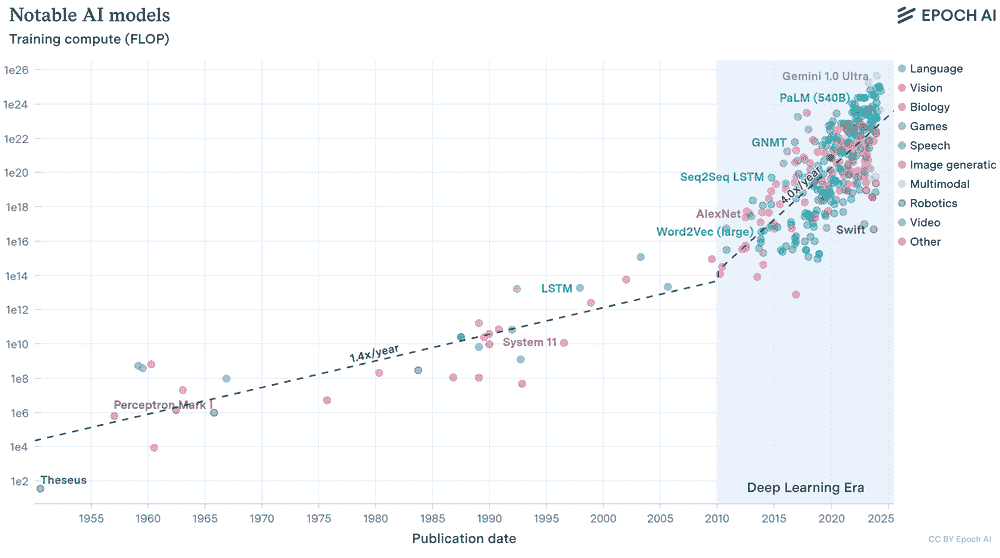
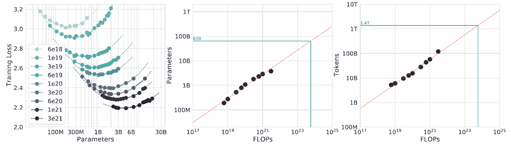
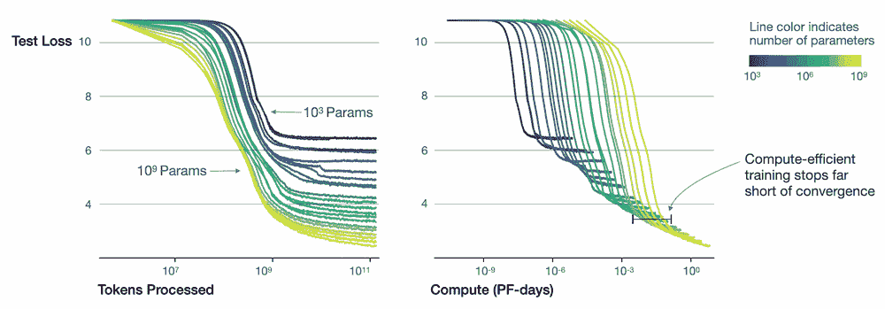
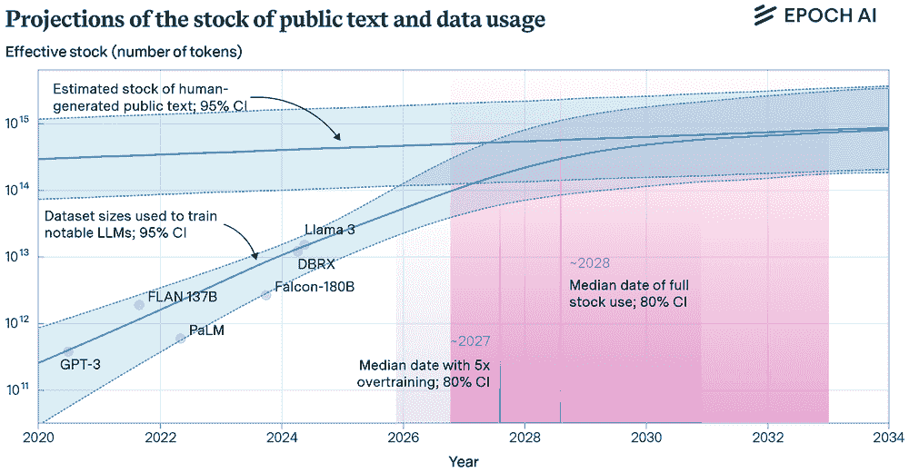

# 高效人工智能

*DALL·E 3 提示：使用造船厂类比的概念插图展示人工智能中的效率。场景展示了一个繁忙的造船厂，其中集装箱代表数据位或字节。这些集装箱被起重机和车辆高效地移动，象征着人工智能系统中信息处理的流畅和快速。造船厂组织得井井有条，说明了在有限资源约束下的最优性能概念。在背景中，船只停靠，代表不同的平台和人工智能应用的场景。氛围应传达先进技术，并带有可持续性和广泛适用性的主题。*

## 目的

*是什么关键权衡塑造了机器学习系统中对效率的追求，为什么工程师必须平衡竞争目标？*

机器学习系统效率需要在算法复杂性、计算资源和数据利用之间进行权衡。在某一维度的改进往往会导致其他维度的性能下降，从而产生需要系统方法的工程紧张关系。理解这些相互依赖的关系使工程师能够在时间、能源和成本的实际约束内设计出性能最优的系统。

**学习目标**

+   分析扩展定律关系，以确定计算预算、模型大小和数据集要求的最佳资源分配策略

+   比较和对比在云、边缘、移动和 TinyML 部署环境中算法、计算和数据效率的权衡

+   使用吞吐量、延迟、能耗和资源利用率等效率指标评估机器学习系统

+   应用剪枝、量化和知识蒸馏等技术，在资源约束内优化模型性能

+   通过根据部署要求和操作约束优先优化维度来设计上下文感知的效率策略

+   通过识别饱和点并提出效率驱动的替代方案来批判基于扩展的方法

+   评估机器学习系统设计中效率选择的环境和可访问性影响

## 效率必要性

随着模型从简单的统计方法过渡到复杂、资源密集型架构，机器学习效率已经从次要考虑转变为基本学科。理论能力与实际部署之间的差距显著扩大，产生了影响系统可行性和可扩展性的效率约束。

大规模语言模型体现了这一挑战。GPT-3 的训练成本估计为 460 万美元（Lambda Labs 估计）和 1287 兆瓦时的能耗(D. Patterson 等，2021b)。操作需求，包括推理时超过 700GB 的内存占用（半精度为 350GB），在资源受限的环境中造成了部署障碍。这些限制揭示了模型表达性和系统实用性之间的紧张关系，这需要严格的分析和优化策略。

效率研究不仅超越了资源优化，还包括学习系统设计的理论基础。工程师必须了解算法复杂性、计算架构和数据利用策略如何相互作用，以确定系统的可行性。这些相互依赖性创造了多目标优化问题，其中某一维度的改进可能会在其他维度上降低性能。

本章节在第三部分性能工程课程中为分析机器学习系统中的效率建立了框架。这里的效率原则为第十章中的优化技术提供了信息，其中量化剪枝方法实现了算法效率目标，第十一章中的硬件加速策略最大化了计算效率，以及第十二章中的测量方法用于验证效率改进。

## 定义系统效率

以为智能手机构建一个照片搜索应用为例。你面临三个相互竞争的压力：模型必须足够小，以便适应内存（一个算法挑战），它必须在手机处理器上运行得足够快，而不会耗尽电池（一个计算挑战），并且它必须从用户的个人照片中学习，而无需数百万个示例（一个数据挑战）。高效的 AI 是导航这些相互关联权衡的学科。

解决这些效率挑战需要跨三个相互关联的维度进行协调优化，这些维度决定了系统的可行性。

**机器学习系统效率**是指通过改进*算法*、*硬件利用率*和*数据使用*，在保持性能的同时，最小化*计算*、*内存*和*能量*需求。

理解这些相互依赖性对于设计在实用约束内实现最大性能的系统是必要的。研究这三个维度在实际中的相互作用，揭示了扩展定律如何暴露这些限制。

### 效率相互依赖性

三个效率维度紧密相连，形成了一个复杂的优化景观。算法效率通过更好的算法和架构减少计算需求，但可能会增加开发复杂性或需要专用硬件。计算效率通过优化的实现和专用处理器最大化硬件利用率，但可能会限制模型的表达能力或需要特定的算法方法。数据效率通过改进的训练程序和数据利用率，使用更少的示例进行学习，但可能需要更复杂的算法或额外的计算资源。

一个具体的例子通过为智能手机设计照片搜索应用程序来说明这些相互联系。系统必须在 2GB 内存（计算限制）内运行，使用有限的训练数据实现可接受的准确性（数据限制），并在 50 毫秒内完成搜索（算法限制）。单独优化任何单一维度都证明是不够的：

**算法效率**关注模型架构。使用具有 5000 万个参数的紧凑型视觉语言模型而不是具有 10 亿个参数的模型，可以将内存需求从 4GB 减少到 200MB，并将推理时间从 2 秒缩短到 100 毫秒。然而，准确性从 92%下降到 85%，需要仔细评估权衡的接受度。

**计算效率**关注硬件利用率。优化后的模型在智能手机处理器上运行高效，每小时仅消耗 10%的电量。如 8 位量化等技术可以在保持质量的同时减少计算，批处理 1 可以同时处理多个查询。然而，这些优化需要算法修改以支持降低精度的操作。

**数据效率**塑造了模型的学习方式。系统不需要数百万个标记的图像-文本对，而是利用预训练的基础模型，并仅使用数千个用户特定的示例进行适应。从用户交互中持续学习提供了隐式反馈，而无需显式标记。这种数据效率需要更复杂的算法方法，并在适应过程中仔细管理计算资源。

这些维度之间的协同作用产生了新兴的好处：更小的模型（算法效率）使得设备上处理（计算效率）成为可能，这有助于从私有用户数据中学习（数据效率），而无需将个人图像传输到远程服务器。这种集成提供了增强的性能和隐私保护，展示了效率如何使那些使用低效方法无法实现的能力成为可能。

这些相互依赖性出现在所有部署环境中，从资源丰富的云系统到受严重限制的边缘设备。如图图 9.1 所示，在考察扩展定律如何揭示基本效率限制之前，理解这些关系是至关重要的。

图 9.1：**效率相互依赖性**：三个效率维度（算法、计算和数据）相互重叠并相互影响，在机器学习系统中创造了系统性的权衡。优化一个效率维度通常需要仔细考虑其对其他维度的影响，从而塑造整体系统性能和资源利用。

通过对效率维度相互作用的这种理解，我们可以探讨为什么仅仅 brute-force scaling（暴力扩展）无法解决现实世界的效率需求。扩展定律为理解这些限制提供了定量框架。

## 人工智能扩展定律

机器学习系统遵循了一个一致的模式：通过参数、训练数据和计算资源增加模型规模通常可以提高性能。这一经验观察推动了自然语言处理、计算机视觉和语音识别等领域的进步，在这些领域，基于大量数据集训练的更大模型持续实现最先进的结果。

这些扩展定律可以看作是理查德·萨顿在第一章中提到的“苦涩教训”的定量表达：机器学习中的性能主要是由在巨大规模上利用通用方法所驱动的。可预测的幂律关系显示了计算在扩展时如何产生更好的模型。

这种扩展轨迹引发了关于效率和可持续性的关键问题。随着计算需求呈指数增长和数据需求增加，何时扩展成本超过性能收益的问题浮现出来。研究人员已经开发了扩展定律 2，这些定律量化了模型性能与训练资源之间的关系，揭示了为什么随着系统复杂性的增加，效率变得越来越重要。

本节介绍了扩展定律，探讨了它们在不同维度上的表现，并分析了它们对系统设计的影响，确立了为什么多维度效率优化框架是一个基本要求。

### 扩展定律的经验证据

过去十年人工智能能力的快速进化是这种扩展轨迹的例证。GPT-1（2018）包含 1.17 亿个参数，展示了基本的句子完成能力。GPT-2（2019）扩展到 15 亿个参数，实现了连贯的段落生成。GPT-3（2020）扩展到 1750 亿个参数，并在多个领域展示了复杂的文本生成能力。模型规模的每次增加都带来了显著的能力提升，但成本呈指数级增长。

这种模式不仅限于语言模型。在计算机视觉中，当训练数据成比例增加时，加倍神经网络大小通常会产生一致的准确度提升。AlexNet（2012）有 6000 万个参数，VGG-16（2014）扩展到 1.38 亿个，现代大型视觉 Transformer 可以超过 6 亿个参数。每一代都实现了更好的图像识别准确度，但需要成比例更多的计算资源和训练数据。

放大假设是这一进步的基础：更大的模型具有更强的能力来捕捉复杂的数据模式，从而促进准确性和泛化能力的提高。然而，这种放大轨迹引入了关键资源限制。训练 GPT-3 需要大约 314 万亿 3 次浮点运算（314 后面跟着 21 个零），相当于连续运行一台现代游戏 PC 超过 350 年，这带来了巨大的财务和环境成本。

这些资源需求揭示了为什么理解放大定律对于效率是必要的。图 9.2 显示了训练最先进模型的计算需求以不可持续的速度增长，增长速度超过了摩尔定律在硬件方面的改进。

图 9.2：**模型训练计算趋势**：模型训练计算以越来越快的速度增长，尤其是在最近的深度学习时代。来源：(Sevilla 等人 2022b。)

放大定律为理解这些权衡提供了一个定量框架。它们揭示了随着资源的增加，模型性能表现出可预测的模式，遵循幂律关系，其中性能持续改进但回报递减 4。这些定律表明，最优资源分配需要协调模型大小、数据集大小和计算预算，而不是孤立地放大任何单一维度。

**复习：Transformer 计算特性**

回想一下 第四章 中提到的，Transformer 使用自注意力机制处理序列，该机制计算所有标记对之间的关系。这种架构的计算成本与序列长度成二次方关系，这使得资源分配对于语言模型尤其关键。术语“FLOPs”（浮点运算）量化了总计算工作量，而“标记”代表模型在训练过程中处理的单个文本单元（通常是子词）。

### 计算最优资源分配

大型语言模型（LLMs）的经验研究表明一个关键见解：对于任何固定的计算预算，存在一个最优的模型大小和数据集大小（以标记 5 衡量）之间的平衡，以最小化训练损失。

图 9.3 通过三个相关视图展示了这一原理。左侧面板显示了‘IsoFLOP 曲线’，其中每条曲线对应于在 transformer7 训练过程中恒定的浮点运算次数（FLOPs6）。这些曲线的谷底确定了在训练自回归 8 语言模型时，每个计算预算下最有效的模型大小。中间和右侧面板揭示了随着计算预算的增加，最佳参数数量和标记数量如何可预测地扩展，证明了协调扩展以最大化资源利用的必要性。

图 9.3：**最佳计算分配**：对于固定的计算预算，语言模型性能取决于平衡模型大小和训练数据量；左侧面板将训练损失映射到参数数量，确定了每个 FLOP 级别的效率最佳点。中间和右侧面板量化了随着计算的增加，最佳参数数量和标记需求如何可预测地扩展，证明了在大规模语言模型中需要协调扩展模型和数据以最大化资源利用的需求。来源：(Hoffmann 等人 2022)。

Kaplan 等人(2020)证明了基于 transformer 的语言模型可以与三个因素可预测地扩展：模型参数数量、训练数据集的体积（以标记衡量）和总计算预算（以浮点运算衡量）。当这些因素成比例增加时，模型会表现出一致的性能改进，而无需进行架构修改或特定任务的调整。

这些模式的实际表现清晰地体现在图 9.4 中，该图展示了从<semantics><msup><mn>10</mn><mn>3</mn></msup><annotation encoding="application/x-tex">10³</annotation></semantics>到<semantics><msup><mn>10</mn><mn>9</mn></msup><annotation encoding="application/x-tex">10⁹</annotation></semantics>参数范围的模型测试损失曲线。该图揭示了两个关键见解。首先，较大的模型表现出更高的样本效率，在更少的训练标记下达到目标性能水平。其次，随着计算资源的增加，最佳模型大小相应增长，当计算资源分配得当时，损失会可预测地减少。

图 9.4：**缩放定律与计算最优性**：更大的模型在增加训练数据和计算资源的情况下始终能实现更好的性能，但递减的回报需要训练过程中仔细的资源分配。最优模型大小和训练持续时间取决于可用的计算预算，正如不同参数规模和训练标记数量下损失曲线收敛所证明的那样。来源：(Kaplan et al. 2020).

这种理论缩放关系定义了最优的计算分配：对于固定的预算，关系 <semantics><mrow><mi>D</mi><mo>∝</mo><msup><mi>N</mi><mn>0.74</mn></msup></mrow><annotation encoding="application/x-tex">D \propto N^{0.74}</annotation></semantics> (Hoffmann et al. 2022) 表明数据集大小 <semantics><mi>D</mi><annotation encoding="application/x-tex">D</annotation></semantics> 和模型大小 <semantics><mi>N</mi><annotation encoding="application/x-tex">N</annotation></semantics> 必须以协调的比例增长。这意味着随着模型大小的增加，数据集应该以大约三分之四的速率增长，以保持计算最优效率。

这些理论预测假设了完美的计算利用率，这在分布式训练场景中变得具有挑战性。现实世界的实现面临着与系统规模不利的通信开销，这造成了带宽瓶颈，降低了有效利用率。超过 100 个节点后，通信开销可能会降低预期性能提升 20-40%，具体取决于工作负载和互连方式，将预测的改进转化为更实际的现实结果。

### 数学基础和操作规则

观察到的缩放行为中的可预测模式可以用幂律关系来数学表达，尽管理解这些模式背后的直觉对于大多数从业者来说比精确的数学公式更重要。

**形式化的数学公式**

对于对形式化数学框架感兴趣的读者，缩放定律可以表示为幂律关系。一般公式为：

<semantics><mrow><mi>ℒ</mi><mrow><mo stretchy="true" form="prefix">(</mo><mi>N</mi><mo stretchy="true" form="postfix">)</mo></mrow><mo>=</mo><mi>A</mi><msup><mi>N</mi><mrow><mi>−</mi><mi>α</mi></mrow></msup><mo>+</mo><mi>B</mi></mrow> <annotation encoding="application/x-tex">\mathcal{L}(N) = A N^{-\alpha} + B</annotation></semantics>

其中，损失 <semantics><mi>ℒ</mi><annotation encoding="application/x-tex">\mathcal{L}</annotation></semantics> 随着资源数量 <semantics><mi>N</mi><annotation encoding="application/x-tex">N</annotation></semantics> 的增加而减少，遵循一个以速率 <semantics><mi>α</mi><annotation encoding="application/x-tex">\alpha</annotation></semantics> 为特征的幂律衰减，加上一个基线常数 <semantics><mi>B</mi><annotation encoding="application/x-tex">B</annotation></semantics>。在这里，<semantics><mrow><mi>ℒ</mi><mrow><mo stretchy="true" form="prefix">(</mo><mi>N</mi><mo stretchy="true" form="postfix">)</mo></mrow></mrow><annotation encoding="application/x-tex">\mathcal{L}(N)</annotation></semantics> 表示使用资源数量 <semantics><mi>N</mi><annotation encoding="application/x-tex">N</annotation></semantics> 所达到的损失，<semantics><mi>A</mi><annotation encoding="application/x-tex">A</annotation></semantics> 和 <semantics><mi>B</mi><annotation encoding="application/x-tex">B</annotation></semantics> 是与任务相关的常数，而 <semantics><mi>α</mi><annotation encoding="application/x-tex">\alpha</annotation></semantics> 是表征性能改进速率的缩放指数。较大的 <semantics><mi>α</mi><annotation encoding="application/x-tex">\alpha</annotation></semantics> 值表示在缩放方面的性能改进更有效。

这些理论预测在多个模型配置中得到了强有力的实证支持。图 9.5 显示，提前停止的测试损失随着数据集大小和模型大小的变化而可预测地变化，并且可以通过适当的参数化将不同配置下的学习曲线对齐。

#### 资源受限缩放区域

在实践中应用缩放定律需要识别出三种不同的资源分配区域，这些区域源于计算预算、数据可用性和最佳资源分配之间的权衡。这些区域为在资源约束下导航的系统设计者提供了实际指导。

计算受限区域描述了尽管有丰富的训练数据，但可用的计算资源限制了缩放潜力的场景。拥有有限硬件预算或严格的训练时间约束的组织处于这个区域。最佳策略是训练较小的模型更长时间，通过延长训练计划而不是更大的架构来最大化利用可用的计算资源。这种方法对于学术机构、初创公司或基础设施访问受限的项目尤其相关。

当计算资源超过数据集限制下能够有效利用的资源时，会出现数据受限机制。与专门领域、专有数据集或隐私受限数据工作的资源丰富组织经常遇到这种情况。最佳策略是在较少的优化步骤中训练更大的模型，利用模型容量从有限的训练示例中提取最大信息。这种机制通常出现在医学成像或专有商业数据集等专用应用中。

最佳机制（Chinchilla 前沿）代表了在计算最优扩展定律下计算资源和数据资源的平衡分配。这种机制通过按比例扩展模型大小和训练数据，实现了最大性能效率，正如 DeepMind 的 Chinchilla 模型所展示的，它通过最优资源分配超过了更大的模型(Hoffmann 等人 2022)。在这个机制内运行需要复杂的资源规划，但每单位计算投资都能带来卓越的性能。

认识到这些机制使得从业者能够就资源分配策略做出明智的决策，避免常见的低效情况，例如过度参数化的模型训练数据不足或参数不足的模型未能有效利用可用的计算资源。

图 9.5: **损失与模型和数据集大小**: 早期停止的测试损失随着数据集大小和模型大小的变化而可预测地变化，突出了在固定计算预算下平衡扩展对于最佳性能的重要性。

扩展定律表明，性能改进遵循可预测的模式，这些模式根据资源可用性而变化，并在不同维度上表现出不同的行为。出现了两种重要的扩展机制：**数据驱动机制**，描述了性能如何随着数据集大小而变化，以及**时间机制**，描述了在机器学习生命周期中何时应用额外的计算。

#### 数据受限扩展机制

泛化误差与数据集大小之间的关系表现出三种不同的机制，如图图 9.6 所示。当可用的示例有限时，高泛化误差是由于统计估计不足造成的。随着数据可用性的增加，泛化误差随着数据集大小的增加而可预测地降低，遵循幂律关系，为数据扩展提供了最实用的好处。最终，性能达到饱和，接近由内在数据限制或模型容量决定的底部，在此之后，额外的数据带来的改进微乎其微。

图 9.6: **数据缩放机制**：数据集大小与泛化误差之间的关系遵循不同的缩放机制。随着数据集大小的增加，最初根据幂律关系减少泛化误差，但最终会达到一个由内在数据限制或模型容量决定的不可减少的错误地板(Hestness 等人 2017)。这种行为揭示了数据缩放带来的收益递减，并指导了机器学习系统中数据收集工作的实际决策。

这种三阶段模式不仅体现在数据之外的不同资源维度上。在幂律区域内操作提供了资源投资的最可靠回报。达到这一阶段需要最低的资源阈值，而在此区域内保持操作则需要仔细的资源分配，以避免过早饱和。

#### 时间缩放机制

虽然数据驱动机制描述了性能如何随数据集大小变化，但一个互补的视角是检查机器学习生命周期内计算资源的时序分配。最近的研究已经确定了三个不同的**时间缩放机制**，这些机制描述了模型开发和部署的不同阶段。

**预训练缩放**涵盖了传统的缩放定律领域，描述了模型性能如何随着更大架构、扩展的数据集和初始训练期间增加的计算资源而提高。在基础模型中进行的广泛研究已经确立了资源和能力之间的明确幂律关系。

**训练后缩放**描述了通过微调、提示工程和特定任务适应性等技术，在初始训练后实现的改进。这一机制在基础模型中获得了显著的关注，其中适应性而不是重新训练通常在资源需求适中的情况下提供了提高性能的最有效途径。

**测试时缩放**描述了性能改进如何通过在推理期间额外分配计算资源而实现，而不修改模型参数。这包括集成预测、思维链提示和迭代细化等方法，使模型能够为每个输入分配额外的处理时间。

图 9.7 显示了这些时间机制在性能改进的计算资源分配上表现出不同的特征。预训练需要大量资源，同时提供广泛的能力，训练后提供在适度要求下的针对性增强，测试时缩放则允许灵活的性能-计算权衡，可根据推理进行调整。

图 9.7: **时间缩放机制**: 不同的时间缩放机制提供了不同的方法，通过不同的计算投资来提高模型性能。预训练通过从头开始的大规模训练建立广泛的技能，后训练通过额外的训练阶段细化现有模型，测试时缩放在推理过程中动态分配计算资源以增强每个样本的结果。理解这些机制有助于明确前期投资与灵活的按需资源分配之间的权衡，以实现最佳系统性能。

数据驱动和时间缩放机制对于系统设计至关重要，揭示了除了仅扩展训练资源之外，还有多种提高性能的途径。对于资源受限的部署，后训练和测试时缩放可能比完全重新训练模型提供更实用的方法，而数据高效的技术能够在幂律区域内使用较小的数据集有效运行系统。

### 系统设计中的实际应用

缩放定律为实际系统设计和资源规划提供了深刻的见解。一致观察到幂律趋势表明，在定义良好的操作区域内，模型性能主要取决于规模，而不是独特的架构创新。然而，递减回报现象表明，每次额外的改进都需要指数级增加资源，同时带来越来越小的收益。

OpenAI 对 GPT-3 的开发展示了这一原则。作者们没有进行昂贵的架构搜索，而是应用了从早期实验中推导出的缩放定律来确定最佳训练数据集大小和模型参数数量 (T. Brown 等人 2020)。他们沿着计算最优前沿扩展了一个已建立的 Transformer 架构，达到 1750 亿个参数和大约 3000 亿个标记，从而能够提前预测模型性能和资源需求。这种方法展示了缩放定律在大规模系统规划中的实际应用。

缩放定律在系统设计中具有多种实用功能。它们使从业者能够在资源预算期间估计不同资源分配的投资回报。在固定的计算预算下，设计者可以利用经验缩放曲线来确定跨模型大小、数据集扩展或训练持续时间的最佳性能改进策略。

系统设计者可以利用缩放趋势来确定何时架构变化相对于仅通过缩放获得的收益产生显著改进，从而避免详尽的架构搜索。当一个模型系列表现出有利的缩放行为时，扩展现有架构可能比过渡到更复杂但未经验证的设计更有效。

在资源预算受限的边缘和嵌入式环境中，理解模型缩放下的性能下降情况，使设计者能够选择在部署约束内提供可接受精度的较小配置。通过量化缩放-性能权衡，缩放定律确定何时暴力缩放变得低效，并指出采用包括模型压缩、高效知识迁移、稀疏技术和硬件感知设计等替代方法的必要性。

缩放定律还充当诊断工具。尽管增加了资源，但性能却出现平台期，这可能表明维度饱和——例如相对于模型大小的数据不足——或计算资源利用效率低下。这种诊断能力使缩放定律既具有预测性又具有指导性，有助于系统地识别和解决瓶颈。

### 可持续性和成本影响

缩放定律揭示了性能提升的途径，同时揭示了资源需求的快速增加。随着模型规模的扩大，训练和部署的资源需求不成比例增长，在通过缩放获得性能提升和系统效率之间产生了紧张关系。

训练大规模模型需要大量的处理能力，通常需要由数百或数千个加速器组成的分布式基础设施 9。最先进的语言模型训练可能需要数万个 GPU 天，消耗数百万千瓦时的电力。这些分布式训练系统在通信开销、同步和缩放效率方面引入了额外的复杂性，如第八章详细所述。能源需求超过了摩尔定律的进步，引发了关于长期可持续性的关键问题。

大型模型需要广泛、高质量、多样化的数据集才能发挥其全部潜力。数据收集、清洗和标注过程消耗大量时间和资源。当模型接近可用高质量数据的饱和度，尤其是在自然语言处理领域，通过数据缩放获得额外性能提升变得越来越困难。这一现实强调了数据效率作为暴力缩放方法必要补充的重要性。

财务和环境影响加剧了这些挑战。大型基础模型的训练运行可能产生数百万美元的计算费用，相关的碳足迹 10 也受到了越来越多的关注。这些成本限制了尖端研究的可及性，并加剧了获取先进人工智能系统的差距。效率障碍带来的民主化挑战直接关联到第十九章第十九章中解决的访问性目标。第十八章第十八章探讨了机器学习系统中环境可持续性的综合方法，包括碳足迹测量和绿色计算实践。

这些权衡表明，扩展定律为理解性能增长提供了有价值的框架，但并不构成改善的畅通无阻之路。每一次性能的提升都需要与相应的资源需求进行评估。当系统接近实际扩展极限时，重点必须从单纯的扩展转移到高效扩展——这是一种平衡性能、成本、能耗和环境影响的综合方法。

### 扩展定律的失效条件

扩展定律在特定操作范围内表现出显著的稳定性，但存在固有的局限性。随着系统规模的扩大，它们不可避免地会遇到边界，在这些边界下，平滑、可预测扩展的基本假设不再成立。这些失效点揭示了关键的低效性，并强调了改进系统设计方法的必要性。

为了使扩展定律保持有效，模型大小、数据集大小和计算预算必须协调一致地增加。在一维上过度投资而保持其他维度不变通常会导致次优结果。例如，在不扩大训练数据集的情况下增加模型大小可能会导致过拟合，而在不重新设计模型的情况下增加计算资源可能会导致资源利用效率低下 (Hoffmann 等人 2022)。

大规模模型需要精心调整的训练计划和学习率，以充分利用可用资源。当由于提前停止、批大小不匹配或无效的并行性导致计算资源分配不足时，尽管投入了大量的基础设施投资，模型可能无法达到其性能潜力。

扩展定律假设在足够训练数据的情况下持续提高性能。然而，在许多领域，高质量、人工标注的数据是有限的。随着模型消耗越来越大的数据集，它们会达到边际效用递减的点，此时额外的数据贡献的信息很少。超过这个阈值，更大的模型可能表现出记忆而不是泛化。

随着模型的增长，它们需要更大的内存带宽 11、互连容量和 I/O 吞吐量。即使在专用加速器的情况下，这些硬件限制也变得越来越具有挑战性。在集群中分配万亿参数模型需要精心管理数据并行性、通信开销和容错性。

在极端规模下，模型可能接近从训练分布中可以学习到的极限。在基准测试上的性能可能继续提高，但这些改进可能不再反映泛化或理解的实质性提升。模型可能变得越来越脆弱，容易受到对抗性样本的影响，或者倾向于生成看似合理但实际不准确的结果。

表 9.1 综合了扩展失败的主要原因，概述了典型的分解类型、潜在原因和代表性场景，作为预测低效和指导平衡系统设计的参考。

表 9.1：**扩展分解类型**：模型大小、数据量和计算资源之间的不平衡扩展会导致特定的失败模式，如过拟合或递减回报，影响系统性能和效率。该表对这些分解进行分类，确定其根本原因，并提供代表性场景以指导更有效的系统设计和资源分配。

| **维度扩展** | **分解类型** | **潜在原因** | **示例场景** |
| --- | --- | --- | --- |
| **模型大小** | 过拟合 | 模型容量超出可用数据 | 在有限数据集上的十亿参数模型 |
| **数据量** | 递减回报 | 新或多样化信息的饱和 | 超过有用阈值的网络文本扩展 |
| **计算预算** | 资源未充分利用 | 训练步骤不足或使用效率低下 | 训练时间缩短的大型模型 |
| **不平衡扩展** | 低效 | 模型/数据/计算的不协调增加 | 没有更多数据或时间的情况下加倍模型大小 |
| **所有维度** | 语义饱和 | 领域中可学习模式的耗尽 | 尽管扩展了所有输入，但不再有进一步收益 |

这些分解点表明，扩展定律描述了在特定条件下的经验规律，在规模扩大时越来越难以维持。随着机器学习系统的持续发展，确定扩展何时不再有效变得必要，这推动了开发不依赖规模就能提高性能的策略。

### 整合效率和扩展

扩展定律（数据饱和、基础设施瓶颈和递减回报）所暴露的局限性表明，仅靠 brute-force 扩展无法实现可持续的人工智能系统。这些限制需要从扩大规模转向以减少资源的方式实现更高的效率。

这一转变需要三个相互关联的维度之间的协调优化：**算法效率**通过更好的模型设计解决计算强度问题，**计算效率**最大化硬件利用率，将算法改进转化为实际收益，**数据效率**从有限的示例中提取最大信息，因为高质量数据变得稀缺。这三个维度共同提供了系统方法，以实现仅通过缩放无法可持续实现的目标，同时解决关于人工智能能力公平获取和环境影响的更广泛问题。

在考察了缩放定律如何揭示基本约束之后，我们现在转向效率框架，该框架提供了在约束内有效操作的切实策略。下一节将详细说明三个效率维度如何协同工作，以实现可持续、可访问的机器学习系统。

## 效率框架

通过缩放定律（即持续进步需要系统效率优化）确定的约束促使三个互补的效率维度。每个维度解决一个特定的限制：算法效率解决计算强度问题，计算效率解决硬件利用率差距，数据效率解决数据饱和问题。

这三个维度共同提供了一个系统框架，用于解决缩放定律揭示的约束。在算法设计、硬件利用和数据使用方面的针对性优化可以实现蛮力缩放无法实现的目标：可持续、可访问的高性能人工智能系统。

### 多维效率协同

优化性能需要跨多个维度进行协调优化。没有任何单一资源——无论是模型参数、训练数据还是计算预算——可以无限扩展以实现效率。现代技术展示了潜力：通过优化架构实现算法效率的 10-100 倍提升，通过专用处理器实现硬件利用率的 5-50 倍改进，通过高级学习方法实现数据需求的 10-1000 倍减少。

该框架的力量源于维度之间的相互联系，如图图 9.8 所示。算法创新通常能够提高硬件利用率，而硬件进步则解锁新的算法可能性。数据高效技术减少计算需求，而计算高效方法使得在更大的数据集上进行训练成为可能。理解这些协同作用对于构建实用的机器学习系统至关重要。

图 9.8: **历史效率趋势**: 算法、计算和数据效率各自为人工智能能力的显著提升做出了贡献，尽管它们的增长速度不同，且收益递减。理解这些历史趋势有助于阐明这些效率维度之间的相互作用，并为在数据有限的环境中扩展机器学习系统提供策略。

具体优先级在不同部署环境中有所不同。资源丰富的云系统优先考虑可扩展性和吞吐量，而边缘设备面临严重的内存和电力限制。移动应用必须在性能和电池寿命之间取得平衡，而 TinyML 部署需要极端的资源效率。理解这些特定情境的模式使设计者能够就优先考虑哪些效率维度以及如何解决它们之间不可避免的权衡做出明智的决策。

### 实现算法效率

算法效率通过优化的模型架构和训练过程实现了每单位计算的最大性能。现代技术实现了计算需求 10-100 倍的改进，同时保持或提高准确度，为实际人工智能部署提供了最直接的途径。

这些改进的基础在于一个关键观察：大多数神经网络都存在显著过参数化的问题。彩票假设揭示了网络中存在稀疏子网络，通常是原始参数的 10-20%（尽管这因架构和任务而显著变化），当单独训练时可以达到相当的准确度（Frankle 和 Carbin 2019）。这一发现将压缩转化为一种原则性的方法：大型模型作为寻找高效架构的初始化策略。

#### 模型压缩基础

三种主要方法主导了现代算法效率，每种方法针对模型低效的不同方面：

**模型压缩**系统地从神经网络中移除冗余组件。剪枝技术通过移除不必要的权重和结构，实现了 2-4 倍的推理速度提升，同时精度损失在 1-3%之间。研究表明，ResNet-50 可以被减少到原始参数的 20%，同时保持 99%的 ImageNet 准确度（Gholami 等人 2021）。具体的剪枝算法，包括基于幅度的选择、结构化与非结构化方法以及层敏感性分析，在第十章中进行了详细阐述。

**精度优化**通过量化减少计算需求，将高精度浮点值映射到低精度表示。神经网络显示出对精度降低的固有鲁棒性，INT8 量化实现了 4 倍的内存减少和 2-4 倍的推理速度提升，同时通常保持 98-99%的 FP32 精度（Jacob 等人 2018a）。现代技术从简单的训练后量化到复杂的量化感知训练都有涉及。具体的量化算法、校准方法和训练过程在第十章（ch016.xhtml#sec-model-optimizations）中详细说明。

**知识迁移**将大型教师模型的能力提炼到高效的学生模型中。知识蒸馏 12 实现了 40-60%的参数减少，同时保留了 95-97%的原有性能，通过需要更少的训练样本来提高计算效率和数据效率。具体的蒸馏算法、损失函数和训练过程在第十章（ch016.xhtml#sec-model-optimizations）中介绍。

#### 硬件-算法协同设计

单独的算法优化是不够的；它们的实际效益取决于软硬件协同设计。优化技术必须针对目标硬件特性（内存带宽、计算能力和精度支持）进行定制，以实现实际的加速效果。例如，INT8 量化在具有张量核心支持的 NVIDIA V100 GPU 上实现了 2.3 倍的加速，但在缺乏专用整数指令的硬件上可能提供最小的效益。

成功的协同设计需要理解工作负载是内存受限（受数据移动限制）还是计算受限（受处理能力限制），然后应用解决实际瓶颈的优化。如操作融合等技术通过组合操作来减少内存流量，而精度降低则利用了专门的硬件单元。虽然第十章涵盖了硬件感知优化的算法方面，但第十一章详细介绍了系统化协同设计方法如何利用特定硬件架构以实现最大效率。

#### 架构创新以提高效率

现代效率需要针对资源限制设计的架构。MobileNet13、EfficientNet14 和 SqueezeNet15 等模型表明，紧凑的设计可以通过架构创新而不是通过扩大现有设计来提供高性能。

不同的部署环境需要不同的效率权衡。云推理优先考虑吞吐量，可以容忍更高的内存使用，有利于并行友好型操作。边缘部署优先考虑延迟和内存效率，需要最小化内存访问的架构。移动部署限制能源使用，要求架构优化以实现节能操作。

#### 参数高效适应

参数高效微调 16 技术展示了三个效率维度如何协同工作。这些方法更新不到 1%的模型参数，同时实现完全微调性能，解决所有三个效率支柱：通过减少参数更新提高算法效率，通过降低内存需求和加快训练提高计算效率，以及通过利用需要较少任务特定示例的预训练表示提高数据效率。

实际影响是变革性的：传统的 GPT-3 微调需要存储 175 亿个参数的梯度，消耗超过 700GB 的 GPU 内存。LoRA 通过学习权重更新的低秩分解，将这一需求降低到 10GB 以下，使得在单个消费级 GPU 上实现高效适应成为可能，同时只需要数百个示例而不是数千个即可实现有效的适应。

如图 9.9 所示，在 ImageNet18 分类上实现 AlexNet17 级别性能所需的神经网络训练计算资源在 2012 年至 2019 年之间减少了大约<semantics><mrow><mn>44</mn><mo>×</mo></mrow><annotation encoding="application/x-tex">44\times</annotation></semantics>。这种每 16 个月减半的改进超过了摩尔定律 19 的硬件效率提升，展示了算法进步在推动效率方面的作用 (Hernandez, Brown, 等人 2020)。

图 9.9：**算法效率进步**：神经网络训练的计算需求在 2012 年至 2019 年之间下降了 44 倍，超过了硬件改进，并展示了算法进步对模型效率的显著影响。通过每 16 个月计算量减半，模型架构和优化技术的创新可以推动人工智能系统可持续性的实质性提升。来源：(Hernandez, Brown, 等人 2020)。

从基本的压缩到硬件感知优化和参数高效适应，算法效率的演变展示了这些技术在机器学习进步中的核心地位。随着该领域的发展，算法效率将继续是设计高性能、可扩展和可持续系统的核心。

### 计算效率

计算效率关注于有效利用硬件和计算资源来训练和部署机器学习模型。它包括减少能源消耗、优化处理速度以及利用硬件能力以实现可扩展和可持续的系统性能的策略。虽然本章重点介绍效率原则和权衡，但硬件加速的详细技术实现，包括 GPU 架构、TPU 设计、内存系统以及定制加速器，将在第十一章中介绍。

#### 从 CPU 到 AI 加速器

计算效率的演变揭示了为什么专用硬件变得至关重要。在机器学习的早期，中央处理器(CPUs)塑造了可能实现的内容。CPU 擅长顺序处理和复杂的决策，但并行性有限，通常有 4-16 个核心，优化用于多种任务，而不是机器学习占主导地位的重复矩阵运算。模型的训练时间以天或周计算，即使是相对较小的数据集也推高了硬件的界限。

这个受 CPU 限制的时代随着像 AlexNet 和 ResNet20 这样的深度学习模型展示了神经网络的潜力，迅速超越了传统的 CPU 能力而结束。如图图 9.10 所示，这标志着计算使用量指数增长的开始。OpenAI 的分析显示，从 2012 年到 2018 年，用于 AI 训练的计算量增加了大约 300,000 倍，在此期间大约每 3.4 个月翻一番——这个速度远超过了摩尔定律(Amodei, Hernandez, et al. 2018)。

图图 9.10：**AI 训练计算增长**：从 2012 年到 2019 年，AI 训练的计算需求增加了 300,000 倍，超过了摩尔定律预测的增长率，推动了专用硬件的需求(Amodei, Hernandez, et al. 2018)。这种指数增长突显了 AI 模型日益复杂化以及支持持续进步的高效计算基础设施的需求。

这种快速增长是由图形处理单元(GPUs)的采用所驱动的，它们提供了无与伦比的并行处理能力。虽然 CPU 可能有 16 个核心，但现代高端 GPU 如 NVIDIA H100 包含超过 16,000 个 CUDA 核心 21。像 Google 的 Tensor Processing Units (TPUs)这样的专用硬件加速器通过为机器学习工作负载设计芯片，优化了神经网络中最常见的特定数据类型和操作，进一步革命化了计算效率。

#### 可持续计算和能源意识

随着系统进一步扩展，计算效率与可持续性紧密相连。训练最先进的大型语言模型需要巨大的计算资源，这导致了对环境影响的高度关注。图 9.11 中显示的数据中心预计电力使用量突显了这一担忧。在 2010 年至 2030 年之间，预计电力消耗将急剧上升，尤其是在最坏的情况下，到 2030 年可能超过 8,000 太瓦时（N. Jones 2018）。

图 9.11：**数据中心能源预测**：在 2010 年至 2030 年之间，数据中心电力使用量预计将急剧增加，尤其是在最坏的情况下，到 2030 年消费量可能超过 8,000 太瓦时（N. Jones 2018）。这一预测强调了在 AI 系统中提高能源效率的迫切需要。

这种显著的增长凸显了计算效率的紧迫性，因为即使是大型数据中心也面临着由于电网容量限制而导致的能源约束。仅仅提高效率可能无法保证环境效益，因为存在一种称为杰文斯悖论的现象。

以燃油效率高的汽车发明为例。虽然每辆车每英里使用的汽油更少，但驾驶成本的降低鼓励人们更频繁地驾驶，住得离工作地点更远。结果可能是总汽油消费量的增加。这就是杰文斯悖论：效率的提高可能被消费量的增加所抵消。在 AI 中，这意味着使模型效率提高 10 倍可能会导致其使用量增加 100 倍，如果不谨慎管理，可能会导致净负面的环境影响。

应对这些挑战需要优化云和边缘环境中的硬件利用率，同时最小化能耗，并关注增加部署可能带来的潜在反弹效应。

主要趋势包括采用能源感知的调度和资源分配技术，这些技术能够高效地在可用硬件上分配工作负载（D. Patterson 等人 2021b）。研究人员还在开发动态调整训练和推理中精度水平的方法，使用低精度操作（例如，混合精度训练）来降低功耗，同时不牺牲精度。

分布式系统通过在多台机器之间分配工作负载来实现计算效率。模型并行 22 和数据并行 23 等技术允许大规模模型更有效地进行训练，利用 GPU 或 TPU 集群来最大化吞吐量，同时最小化空闲时间。

在边缘，计算效率解决了在能源受限环境中对实时处理不断增长的需求。硬件感知的模型优化、轻量级推理引擎和自适应计算架构等创新，使得边缘系统高度高效，这对于自动驾驶汽车和智能家居设备等应用至关重要。

#### 生产部署模式

实际世界的效率优化在部署环境中展示了实际影响。生产系统通过协调应用优化技术，通常实现 5-10 倍的效率提升，同时保持 95%以上的原始模型性能。

移动应用程序通过联合量化、剪枝和蒸馏，实现了 4-7 倍的模型尺寸缩减和 3-5 倍的延迟改进，从而在中端设备上实现了实时推理。现代移动人工智能系统根据功率、性能和实时约束，将工作负载分配到专用处理器（用于超低功耗推理的 NPU、用于并行计算的 GPU、用于控制逻辑的 CPU）。

自动驾驶系统通过硬件感知的架构设计和混合精度量化，优化了安全关键性小于 10 毫秒的延迟要求，在严格的功率和热约束下处理多个高带宽传感器流。

云服务基础设施通过结合动态批处理、量化和知识蒸馏的系统优化，降低了 70-80%的成本，在可比的质量水平上服务 4-5 倍更多的请求。

边缘物联网部署通过极端模型压缩和占空比优化，实现了长达一个月的电池寿命，在毫瓦级的功率预算下运行，同时保持实际应用可接受的准确性。

这些效率提升源于系统性的优化策略，这些策略协调了多种技术，而不是孤立地应用单个优化。实现这些生产结果的具体优化序列、技术组合和工程实践在第十章中详细说明。

计算效率补充了算法和数据效率。紧凑的模型减少了计算需求，而高效的数据管道简化了硬件使用。计算效率的演变（从早期对 CPU 的依赖到专用加速器再到可持续计算实践）对于构建可扩展、可访问和负责任的机器学习系统至关重要。

### 数据效率

数据效率专注于优化训练机器学习模型所需的数据量和质量。随着数据收集、存储和处理成本的上升，以及可用高质量数据的限制，数据效率已成为一个关键维度。

#### 最大化从有限数据中学习

在早期的机器学习中，数据效率并不是主要关注点，因为数据集相对较小且易于管理。挑战通常是获取足够的标记数据来有效训练模型。研究人员依赖于如[UCI 机器学习仓库](https://archive.ics.uci.edu/)24 这样的整理数据集，使用特征选择和降维技术如主成分分析（PCA）25 从有限的数据中提取最大价值。

2010 年代深度学习的出现改变了数据的作用。像 AlexNet 和 GPT-3 这样的模型表明，更大的数据集往往会导致更好的性能，标志着“大数据”时代的开始。然而，这种依赖引入了低效。数据收集变得昂贵且耗时，需要大量标记数据来进行监督学习。

即使数据集在增长，研究人员也开发了提高数据效率的技术。迁移学习 26 允许在较小的数据集上微调预训练模型，减少特定任务的数据需求(Yosinski 等人 2014)。数据增强 27 通过创建现有样本的新变体来人工扩大数据集。主动学习 28 优先标记最具信息量的数据点(Settles 2012a)。

随着系统规模的持续增长，大数据集的低效性变得明显。数据为中心的 AI29 已成为一个关键范式，强调数据质量而非数量。这种方法侧重于增强预处理、去除冗余和提高标记效率。研究表明，经过仔细整理和过滤，可以使用只有原始数据量的一小部分实现相当或更优的性能(Penedo 等人 2024)。

几种技术支持这种过渡。自监督学习 30 使模型能够从未标记的数据中学习有意义的表示，减少对昂贵的人类标记数据集的依赖。主动学习策略有选择性地识别用于标记的最具信息量的示例，而课程学习 31 则将训练结构化，从简单示例逐步过渡到复杂示例，提高学习效率。

数据效率在基础模型 32 中尤为重要。随着这些模型在规模和能力上的增长，它们接近了可用高质量训练数据的极限，尤其是在语言任务中，如图 9.12 所示。这种稀缺性推动了数据处理和整理技术的创新。

图 9.12：**数据集增长**：基础模型越来越多地在大规模数据集上训练，反映了人类生成文本的日益增长。这一趋势突显了随着规模增加，在保持模型性能的同时，数据稀缺性的挑战。来源：Sevilla 等(2022c)。

数据质量影响证据在不同部署规模中均有体现。在 Tiny ML33 应用中，如 Wake Vision 等数据集展示了性能如何严重依赖于仔细的数据整理(C. Banbury 等，2024)。在更大规模上，基于网络规模数据集训练的语言模型研究显示，智能过滤和选择策略显著提高了下游任务的表现(Penedo 等，2024)。第十二章建立了衡量这些数据质量改进的严格方法。

这个数据效率的现代时代代表了系统处理数据利用方式的一种转变。通过关注质量而非数量，并开发用于数据选择和处理的复杂技术，该领域正朝着更可持续和有效的模型训练和部署方法迈进。数据效率对于可扩展系统至关重要，它影响着模型和计算效率。更小、质量更高的数据集可以缩短训练时间和计算需求，同时实现更好的泛化。这些原则与第十五章中探讨的隐私保护技术相辅相成，其中最小化数据需求可以增强效率和用户隐私保护。

## 实际世界的效率策略

在单独探讨了每个效率维度及其相互关系之后，我们考察了这些维度如何在不同的部署环境中体现出来。机器学习系统的效率源于在特定操作环境中理解算法、计算和数据效率之间的关系。

### 上下文特定的效率需求

在部署环境中，具体的优先级和权衡差异很大。正如我们的开篇示例所示，这些范围从资源丰富的云系统到内存和电源限制严重的边缘设备。 表 9.2 展示了这些限制如何转化为效率优化优先级。

表 9.2：**按部署环境优化的效率优先级**：每个环境都根据独特的约束条件，在算法、计算和数据优化策略之间进行不同的权衡。云系统优先考虑可扩展性，边缘部署侧重于实时性能，移动应用在性能与电池寿命之间取得平衡，而 TinyML 则要求极端的资源效率。

| **部署环境** | **主要约束** | **效率优先级** | **代表性应用** |
| --- | --- | --- | --- |
| **云** | 规模成本、能源消耗 | 吞吐量、可扩展性、运营效率 | 大型语言模型 API、推荐引擎、视频处理 |
| **边缘** | 延迟、本地计算能力、连接性 | 实时性能、能效 | 自动驾驶汽车、工业自动化、智能摄像头 |
| **移动** | 电池寿命、内存、热限制 | 能效、模型大小、响应性 | 语音助手、照片增强、增强现实 |
| **TinyML** | 极端功耗/内存限制 | 极低功耗、最小模型大小 | 物联网传感器、可穿戴设备、环境监测 |

理解这些特定于上下文的模式，使设计者能够做出明智的决定，关于优先考虑哪些效率维度以及如何应对不可避免的权衡。

### 可扩展性与可持续性

系统效率是环境可持续性的驱动因素。当系统针对效率进行优化时，它们可以大规模部署，同时最小化环境影响。这种关系创造了一个正反馈循环，如图图 9.13 所示。

图 9.13：**效率和可持续性反馈循环**：优化的机器学习系统实现更大的可扩展性，这反过来又激励可持续设计实践和进一步的效率改进，从而形成一个增强反馈循环，对长期影响产生积极影响。

高效系统本质上具有可扩展性。通过轻量级模型、针对性数据集和优化的计算利用来减少资源需求，使系统能够广泛部署。当高效系统扩展时，它们通过减少整体能源消耗和计算浪费来放大其对可持续性的贡献。可持续性强化了对效率的需求，形成一个反馈循环，从而加强整个系统。

## 效率权衡与挑战

在有利条件下，三个效率维度可以协同工作，但现实世界中的系统经常面临改善一个维度会降低另一个维度的场景。使效率成为必要的相同资源限制迫使做出艰难的选择：减少模型大小可能会牺牲准确性，针对实时性能可能会增加能源消耗，以及精心制作更小的数据集可能会限制泛化。

### 效率权衡的基本来源

这些紧张关系以各种方式在机器学习系统中体现。理解其根本原因对于解决设计挑战至关重要。每个效率维度都会影响其他维度，形成一个动态的相互作用，从而塑造系统性能。

#### 算法效率与计算需求

算法效率关注于设计紧凑的模型，以最小化计算和内存需求。通过减小模型大小或复杂性，在资源受限的设备上部署变得可行。过度简化模型可能会降低准确性，尤其是在复杂任务中。为了弥补这种损失，在训练或部署期间可能需要额外的计算资源，从而对计算效率造成压力。

#### 计算效率与实时需求

计算效率旨在最小化训练和推理所需的资源，以减少能耗、处理时间和内存使用。在需要实时响应的场景（如自动驾驶汽车、增强现实）中，保持计算效率变得更加困难。图 9.14 展示了这一挑战：实时系统通常需要高性能硬件来即时处理数据，这与能源效率目标或增加系统成本相冲突。

图 9.14：**实时系统限制**：自动驾驶汽车需要在计算效率和低延迟之间进行仔细的平衡。增加处理能力以减少延迟可能会与能源和成本限制相冲突，而牺牲延迟会通过增加反应时间和制动距离来降低安全性。

#### 数据效率与模型泛化

数据效率旨在最小化训练模型所需的数据量，同时不牺牲性能。通过精心挑选更小、质量更高的数据集，训练过程变得更快且资源消耗更少。理想情况下，这可以同时加强算法和计算效率。然而，减小数据集大小可能会限制多样性，使得模型更难泛化到未见过的场景。为了解决这个问题，可能需要额外的计算资源或模型复杂性，从而在数据效率和更广泛系统目标之间产生紧张关系。

### 实践中的反复权衡模式

当考察特定场景时，效率维度之间的权衡变得尤为明显。具有数百万或数十亿参数的复杂模型可以通过捕捉复杂模式来实现更高的准确性，但需要大量的计算能力和内存。一个云数据中心中的推荐系统可能会使用高度复杂的模型以获得更好的推荐，但代价是更高的能耗和运营成本。在资源受限的设备如智能手机或自动驾驶汽车上，紧凑的模型可能运行效率较高，但需要更复杂的数据预处理或训练程序来补偿其减少的容量。

能效和实时性能通常将系统推向相反的方向。像自动驾驶汽车或增强现实应用这样的实时系统依赖于高性能硬件来快速处理大量数据，但这通常会增加能耗。自动驾驶汽车必须实时处理来自摄像头、激光雷达和雷达的传感器数据以做出导航决策，这需要消耗大量能量的专用加速器。在电池供电或能源有限的边缘部署中，这种权衡变得更加关键。

较大的数据集通常提供更大的多样性和覆盖范围，使模型能够捕捉细微的模式并降低过拟合风险。然而，在大数据集上训练的计算和内存需求可能很大。在资源受限的环境中，如 TinyML 部署，监测环境条件的物联网设备可能需要一个在不同条件下都能良好泛化的模型，但由于存储和计算限制，收集大量数据可能不切实际。较小、精心挑选的数据集或合成数据可以用来减少计算压力，但这也可能导致错过关键边缘情况。

这些权衡不仅仅是学术上的关注，而是塑造所有部署环境中系统设计决策的实际情况。

## 战略性权衡管理

机器学习系统设计中固有的权衡需要深思熟虑的策略来有效地导航。实现正确的平衡涉及受特定目标和部署环境约束的困难决策。

### 环境驱动的效率优先级

效率目标很少是普遍适用的。应用程序或部署场景的具体需求极大地影响了哪个维度——算法、计算或数据——优先。根据具体情况优先考虑正确的维度是有效管理权衡的第一步。

在移动机器学习部署中，电池寿命通常是主要约束，对计算效率提出了更高的要求。为了保持操作时间，必须最小化能耗，因此即使这意味着牺牲一些精度或需要额外的数据预处理，轻量级模型也被优先考虑。

在云机器学习系统中，可扩展性和吞吐量至关重要。这些系统必须处理大量数据并同时服务数百万用户。虽然计算资源更为丰富，但能效和运营成本仍然很重要。算法效率在确保系统可以扩展而不会压倒基础设施方面发挥着关键作用。

边缘机器学习系统有不同的优先级。自动驾驶汽车或实时监控系统需要低延迟处理以确保安全和可靠运行，这使得实时性能和计算效率至关重要，往往以能耗为代价。然而，硬件限制意味着这些系统仍需仔细管理能源和计算资源。

**TinyML**部署由于严重的硬件和能源限制，需要极高的效率。算法和数据效率是首要任务，模型高度紧凑，能够在具有最小内存和计算能力的微控制器上运行，而训练则依赖于小型、精心挑选的数据集。

### 推理过程中的动态资源分配

通过推理过程中的动态资源分配可以增强系统适应性。这种方法认识到资源需求即使在特定的部署环境中也可能波动。通过在推理时调整计算努力，系统可以微调性能以满足即时需求。

例如，一个基于云的视频分析系统可能会使用简化模型处理标准流以保持高吞吐量，但在检测到关键事件时，会动态分配更多资源给复杂模型以实现更高的精度。同样，移动语音助手可能会使用轻量级模型处理常规命令以节省电池，但在处理复杂查询时会临时激活资源密集型模型。

实现测试时计算引入了新的挑战。动态资源分配需要复杂的监控和控制机制。收益递减——计算能力超过一定阈值可能不会带来显著的性能提升。动态增加计算能力也可能导致高性能 AI 访问的不平等，引发公平性问题。尽管存在这些挑战，测试时计算仍然是提高系统适应性的宝贵策略。

### 端到端协同设计和自动化优化

高效的机器学习系统很少是孤立优化的产物。在效率维度上实现平衡需要端到端的协同设计视角，其中每个系统组件都是与其他组件一起设计的。这种整体方法使模型架构、硬件平台和数据管道能够无缝协同工作。

在资源受限的环境中，协同设计变得至关重要。模型必须与硬件能力精确匹配——8 位模型需要硬件对高效整数运算的支持，而剪枝模型则受益于稀疏张量运算。边缘加速器通常优化特定的操作，如卷积，这会影响模型架构的选择。详细的硬件架构考虑因素在第十一章中得到了全面覆盖。

**自动化和优化工具**有助于管理导航权衡的复杂性。自动化机器学习（AutoML）34 允许探索不同的模型架构和超参数配置。在第五章（ch011.xhtml#sec-ai-workflow）中介绍的系统化机器学习工作流程的基础上，AutoML 工具自动化了许多传统上需要大量手动调整的效率优化决策。

神经架构搜索（NAS）35 通过设计针对特定硬件或部署场景定制的模型架构，进一步推进了自动化，评估广泛的架构可能性，以最大化性能同时最小化计算需求。

数据效率也得益于自动化。自动化数据集整理、增强和主动学习的工具可以减少训练数据集的大小，同时不牺牲性能，优先考虑高价值数据点以加快训练并减少计算开销 (Settles 2012b)。第七章探讨了现代机器学习框架如何整合这些自动化能力。

### 测量和监控效率权衡

技术自动化之外，还存在着更广泛的系统评估挑战。效率优化需要一种结构化的方法来评估权衡，这种方法超越了纯粹的技术考虑。随着系统从研究过渡到生产，成功标准必须包括算法性能、经济可行性和运营可持续性。

效率改进相关的成本贯穿于工程努力（研究、实验、集成）中，与运行效率较低系统的持续运营费用相平衡。效益跨越多个领域——除了直接成本降低之外，高效的系统通常能够实现定性上的新能力，如资源受限环境中的实时处理或部署到边缘设备。

这个评估框架必须辅以持续的评估机制。生产中机器学习系统的动态特性需要持续监控效率特性。随着模型的发展、数据分布的变化和基础设施的变更，效率属性可能会退化。实时监控能够快速检测效率退化，而历史分析则提供了对长期趋势的洞察，揭示了在变化条件下效率改进是否可持续。

## 高效 AI 的工程原则

设计一个高效的机器学习系统需要一种全面的方法。真正的效率在于将整个系统作为一个整体来考虑，确保在 ML 管道的所有阶段（从数据收集到部署）的权衡都得到平衡。这种端到端视角改变了系统设计。

### 全面管道优化

效率不是通过孤立的优化实现的，而是通过将整个管道视为一个统一的整体来实现的。每个阶段——数据收集、模型训练、硬件部署和推理——都对整体系统效率做出贡献。一个阶段的决策会影响到其他阶段，从而影响性能、资源使用和可扩展性。

数据收集和预处理是起点。第六章提供了数据管道设计决策如何贯穿整个系统的全面概述。精心策划的小型、高质量数据集可以在训练期间降低计算成本，同时简化模型设计。然而，数据多样性不足可能会影响泛化能力，需要采取补偿措施。

模型训练是另一个关键阶段。架构选择、优化技术和超参数必须考虑部署硬件约束。为高性能云系统设计的模型可能强调准确性和可扩展性，而针对边缘设备的模型则必须在准确性与大小和能源效率之间取得平衡。

部署和推理需要精确的硬件对齐。每个平台都提供独特的功能——GPU 擅长并行矩阵运算，TPU 优化特定的神经网络计算，而微控制器提供节能处理。一个智能手机语音识别系统可能会利用 NPU 的专用卷积单元，在低功耗下实现毫秒级的推理，而自动驾驶车辆的 FPGA 则可以以微秒级的延迟处理多个传感器流。

终端到端的角度确保权衡得到全面解决，而不是在管道阶段之间转移低效率。这种系统思维方法在部署到资源受限的环境中尤为重要，如第十四章中所述。

### 生命周期和环境考虑因素

效率需求因生命周期阶段和部署环境而显著不同——从研究原型到生产系统，从高性能云到资源受限的边缘。

在研究中，主要关注的是模型性能，效率则处于次要位置。原型通过丰富的计算资源进行训练，这允许探索大型架构和广泛的超参数调整。生产系统必须优先考虑效率，以在实用约束条件下运行，这通常涉及重大的优化，如模型剪枝、量化或重新训练。生产还需要持续监控效率指标和运营框架，以在规模上管理权衡——综合生产效率管理策略在第十三章中详细阐述。

基于云的系统使用相对丰富的资源处理大量工作负载，尽管能源效率和运营成本仍然至关重要。第二章中涵盖的机器学习系统设计原则为构建可扩展、效率优化的云部署提供了架构基础。相比之下，边缘和移动系统在严格的约束下运行，这些约束在我们的效率框架中详细说明，需要优先考虑效率而非原始性能。

一些系统，如推荐引擎，需要频繁重新训练以保持有效性，严重依赖数据效率，包括具有积极标记的数据集和采样策略。其他系统，如医疗设备中的嵌入式模型，需要长期稳定性，更新最少。第十六章探讨了关键应用中的可靠性要求如何影响效率优化策略。

## 社会和伦理影响

虽然机器学习的效率通常被视为一个技术挑战，但它也与更广泛的关于 AI 系统目的和影响的问题密切相关。设计高效的系统不仅需要处理实际上的权衡，还需要考虑复杂的伦理和哲学问题。第十七章提供了一个全面框架，用于解决这些伦理问题。

### 平等与接入

效率有可能降低成本、提高可扩展性和扩大可接入性。然而，实现效率所需的资源——先进的硬件、精心挑选的数据集、最先进的优化技术——通常集中在资金充足的组织中，这导致了利用效率收益的不平等。

训练像 GPT-4 和 Gemini Ultra 这样的最先进模型的成本需要数千万美元的算力（Maslej 等人 2024）。[OECD.AI](https://oecd.ai/en/)的研究表明，全球 90%的 AI 算力集中在仅五个国家（OECD.AI 2021）。学术机构通常缺乏复制最先进结果所需的硬件，这阻碍了资金不足领域的创新。像 TinyML 或 Mobile ML 的加速器这样的节能计算技术为民主化提供了有希望的途径。通过在低成本、低功耗设备上实现强大的处理能力，这些技术使得没有高端基础设施的组织也能构建有影响力的系统。

在高质量数据集稀缺的地方，数据效率至关重要，但实现它并不均衡。为低资源语言开发的自然语言处理（NLP）因缺乏足够的训练数据而受到严重影响，导致性能差距显著。像 Masakhane 项目这样的努力，为非洲语言建立开源数据集，展示了协作倡议如何解决这个问题，尽管在全球范围内进行扩展需要更大的投资。民主化数据效率需要更开放地共享预训练模型和数据集。像 Hugging Face 的开放访问 transformers 或 Meta 的“没有语言被落下”这样的倡议旨在使最先进的 NLP 模型在全球范围内可用，降低数据稀缺地区的障碍。

算法效率在通过使低成本、资源受限的设备具备高级功能来民主化机器学习方面发挥着至关重要的作用。智能手机上的 AI 诊断工具正在改变偏远地区的医疗保健，而低功耗的 TinyML 模型使得在没有可靠电力的地区进行环境监测成为可能。

类似于[TensorFlow Lite](https://ai.google.dev/edge/litert)和[PyTorch Mobile](https://pytorch.org/mobile/home/)这样的技术允许开发者将轻量级模型部署到日常设备上，在资源受限的环境中扩大了访问权限。共享预先优化的模型（如 MobileNet 或 EfficientNet）的开源努力通过允许资源不足的组织部署最先进解决方案发挥了关键作用。

### 平衡创新与效率的需求

追求效率往往在优化已知内容与探索新内容之间产生紧张关系。这种紧张关系加剧了公平性问题：资金充足的组织的资源集中使得他们能够进行昂贵的探索性研究，而资源受限的机构必须专注于渐进式改进，优先考虑效率而非新颖性。

效率通常有利于经过验证的成熟技术。通过剪枝、量化或蒸馏来优化神经网络通常是对现有架构的改进，而不是开发全新的架构。考虑从传统机器学习到深度学习的转变：1990 年代到 2000 年代早期的神经网络研究需要大量资源，并且往往无法超越更简单的方法，但研究人员坚持不懈，最终导致了定义现代人工智能的突破。

开创性研究往往需要大量资源。像 GPT-4 或 PaLM 这样的大型语言模型本身并不高效——它们的训练消耗了巨大的计算和能源。然而，这些模型开辟了全新的可能性，促使进步最终导致更高效的系统，如更小的微调版本。

这种对资源密集型创新的依赖引发了关于谁能够参与的问题。资金充足的机构能够承担探索新领域，而较小的机构可能只能局限于渐进式改进，优先考虑效率而非新颖性。

以效率为导向的设计通常需要遵守严格的约束，如减少模型大小或延迟。虽然约束可以激发创新，但它们也可能限制探索范围。然而，对效率的追求可以积极影响创新——约束迫使创造性思考，导致在紧张的资源配置预算内最大化性能的新方法。例如，NAS（神经架构搜索）和注意力机制的出现部分源于平衡性能和效率的需求。

组织和研究人员必须认识到何时应优先考虑效率，何时应接受实验风险。适用于现实世界部署的应用系统可能需要严格的效率，而探索性研究实验室可以专注于推动边界。创新与效率之间的关系不是对抗性的，而是互补性的——高效的系统为可扩展的应用程序奠定基础，而资源密集型的实验推动突破，重新定义了可能性的界限。

### 优化限制

公平、创新和效率之间的紧张关系最终源于优化的一个基本特征：收益递减。优化对于构建高效的机器学习系统至关重要，但它并非无限。随着系统变得更加精细，每次额外的改进都需要指数级更多的努力、时间或资源，同时带来的好处越来越小。

优化（No Free Lunch，NFL）定理 36 说明了固有的局限性。根据 NFL 定理，没有单个优化算法可以在所有可能的问题上优于所有其他算法，这意味着优化技术的高效性高度依赖于特定问题（Wolpert 和 Macready 1997）。

例如，压缩机器学习模型可以最初显著减少内存和计算需求，同时最小化精度损失。然而，随着压缩的进行，保持性能变得越来越具有挑战性。实现额外的收益可能需要诸如针对特定硬件的优化或广泛的重新训练等复杂技术，增加复杂性和成本。这些成本不仅包括财务投资，还包括时间、专业知识、迭代测试，以及在鲁棒性和泛化性之间可能存在的权衡。

NFL（No Free Lunch）定理强调了不存在通用的优化解决方案，强调了在追求效率的同时需要考虑实际因素。过度优化可能导致资源浪费和适应性降低，复杂化未来的更新。确定系统何时“足够好”可以确保资源得到有效分配。

同样，为了提高训练效率而优化数据集可能最初会节省资源，但过度减少数据集大小可能会损害多样性和削弱泛化能力。将硬件性能推至极限可能会提高诸如延迟等指标，但相关的可靠性和工程成本可能会超过收益。

理解优化极限对于创建平衡效率、实用性和可持续性的系统至关重要。这种观点有助于避免过度优化，并确保资源投资于具有实质性回报的领域。

#### 摩尔定律案例研究

优化极限的最有洞察力的例子之一出现在摩尔定律及其背后的经济曲线上。虽然摩尔定律因其作为指数计算能力增长预测者的角色而受到赞誉，但其成功依赖于复杂的经济平衡。集成度与成本之间的关系为机器学习优化中的收益递减提供了一个引人入胜的类比。

图 9.15 展示了随着集成电路中组件数量的增加，每个组件的相对制造成本。最初，随着越来越多的组件被集成到芯片上，每个组件的成本会因规模经济而降低——更高的集成度减少了封装和互连的需求。从数百个组件增加到数千个组件，成本大幅降低，性能得到提升 (G. Moore 2021)。

图 9.15: **摩尔定律的经济效应**：最初，每个组件的制造成本下降推动了集成电路复杂性的指数级增长，但最终收益递减限制了成本的进一步降低。这种关系反映了机器学习中优化挑战的优化问题，其中模型复杂性的增加相对于计算成本而言，性能提升逐渐减少。来源：(G. Moore 2021)。

然而，随着集成度的继续提高，曲线开始上升。更紧密地封装在一起的组件面临可靠性问题，如散热增加和信号干扰。解决这些问题需要更复杂的制造技术——先进的光刻、纠错、改进的材料——增加了复杂性和成本。这个 U 形曲线捕捉了基本权衡：早期的改进带来了实质性的好处，但超过某个点，每个额外的收益都伴随着更高的成本。

这些动态反映了机器学习优化挑战。压缩深度学习模型以减小尺寸和能耗遵循类似的轨迹。初始优化，如剪枝冗余参数或降低精度，通常会导致显著的节省，同时对准确性的影响最小。然而，随着压缩的进行，性能损失变得更加难以恢复。量化或针对特定硬件的调整等技术可以恢复一些性能，但这些增加了复杂性和成本。

类似地，在数据效率方面，减少训练数据集的大小最初往往可以提高计算效率。然而，随着数据集进一步缩小，它们可能会失去多样性，损害泛化能力。解决这个问题通常需要合成数据或复杂的增强，这需要额外的工程努力。

摩尔定律的图表作为一个视觉提醒，表明优化并非无限。成本效益平衡总是依赖于具体情境，而收益递减的点会根据系统目标和限制而变化。机器学习从业者，如半导体工程师，必须确定何时进一步的优化不再提供有意义的效益。过度优化可能导致资源浪费、适应性降低，以及系统过度专门化于初始条件。

## 谬误与陷阱

在人工智能系统中，效率涉及在多个竞争目标之间进行复杂的权衡，这些目标往往朝不同的方向拉扯。扩展定律的数学优雅可能会产生关于可预测优化路径的虚假信心，而多样化的部署环境要求会产生关于通用效率策略的误解。

**谬误：** *效率优化总是能提升系统性能的所有指标。*

这种误解导致团队在未理解权衡和副作用的情况下应用效率技术。为了计算效率而优化可能会降低准确性，提高内存效率可能会增加延迟，而减小模型大小通常需要更复杂的训练过程。在一个维度上的效率提升往往在其他维度上产生成本，这些成本在特定场景中可能是不可以接受的。有效的效率优化需要仔细分析哪些指标最重要，并接受某些性能方面必然会被牺牲。

**陷阱：** *假设扩展定律可以线性预测所有模型大小的效率要求。*

团队常常基于扩展定律关系外推效率要求，而没有考虑这些定律不再适用的断裂点。扩展定律对于适度的增加是有用的指导，但未能考虑到在极端规模出现的涌现行为、架构限制和基础设施限制。将扩展定律预测应用于验证范围之外可能导致资源估计严重不准确和部署失败。成功的效率规划需要理解扩展定律框架的效用和限制。

**谬误：** *边缘部署的效率要求仅仅是云要求的缩小版。*

这种信念假设边缘部署仅仅是云部署，只是模型更小，计算更少。边缘环境引入了质的不同限制，包括实时处理需求、功耗限制、热管理需求以及连接性变化。在云环境中有效的优化策略在边缘环境中往往失败得非常惨重。边缘效率需要不同的方法，优先考虑可预测的性能、能源效率和在不同条件下的稳健运行。

**陷阱：** *专注于算法效率，而忽略系统级效率因素。*

许多从业者优化算法复杂度指标，如 FLOPs 或参数计数，而没有考虑这些改进如何转化为实际系统性能。实际系统效率取决于内存访问模式、数据移动成本、硬件利用特性以及可能与理论复杂度指标不相关的软件堆栈开销。具有较少参数的模型可能由于不规则的内存访问模式或较差的硬件映射而表现得更差。全面的效率优化需要衡量和优化实际系统性能，而不仅仅依赖于算法复杂度指标。

## 摘要

效率已成为一种设计原则，它改变了我们对待机器学习系统的方式，超越了简单的性能优化，转向全面资源管理。本章揭示了规模定律如何提供实证见解，深入到模型性能与计算资源之间的关系，将效率确立为战略优势，使更广泛的可访问性、可持续性和创新成为可能。算法、计算和数据效率之间的相互依赖性创造了一个复杂的景观，其中某一维度的决策会影响到整个系统，需要从整体视角平衡整个机器学习管道中的权衡。

设计高效系统的实际挑战突出了情境感知决策的重要性，其中部署环境塑造了效率优先级。云系统利用丰富的资源实现可扩展性和吞吐量，而边缘部署在严格的电源限制内优化实时性能，而 TinyML 应用将最小资源下可实现的边界推向极限。这些不同的需求要求复杂的策略，包括端到端协同设计、自动化优化工具以及基于操作约束的谨慎优先级排序。规模定律崩溃和创新与效率之间的紧张关系强调了最佳系统设计不仅需要解决技术权衡，还需要考虑更广泛的公平性、可持续性和长期影响。

**关键要点**

+   效率是一种战略推动者，它使不同部署环境下的 AI 能力普及化

+   规模定律为资源分配提供了预测框架，但它们的局限性揭示了架构创新的机遇

+   算法、计算和数据效率之间的权衡相互关联且取决于具体情境，需要整体优化策略

+   自动化工具和端到端协同设计方法可以将效率限制转化为系统协同的机会

在建立了三支柱效率框架并探讨了作为资源分配定量基础的比例定律之后，接下来的章节提供了在每个维度上实现效率的具体工程技术。第十章通过系统地降低模型复杂性的同时保持性能来关注算法效率。该章节涵盖了降低数值精度的量化技术、消除冗余参数的剪枝方法以及将能力从大型模型转移到较小模型的知识蒸馏方法。

第十一章通过探讨专用硬件和优化软件实现如何最大化每单位计算资源的性能来处理计算效率问题。主题包括 GPU 优化、AI 加速器架构以及提高吞吐量和降低延迟的系统级优化。第十二章提供了量化所有三个维度效率提升的测量方法，涵盖了性能评估框架、能量测量技术和比较分析方法。

从原则到具体技术再到测量方法的发展过程反映了实现机器学习系统中实际效率所需的系统化工程方法。每一章都建立在在此建立的基础理解之上，创建了一个全面的性能工程工具包，该工具包解决了定义高效 AI 系统设计的复杂、相互关联的权衡。

这些效率原则为在第十章中探讨的具体优化技术奠定了基础，该章节详细介绍了量化、剪枝和知识蒸馏的算法，为实现此处概述的效率目标提供了具体工具。随着机器学习系统在复杂性和范围上的持续扩展，高效设计的原则对于创建不仅性能出色而且可持续、可访问且与更广泛的社会目标——负责任的 AI 发展目标相一致的系统仍然至关重要。

* * *
