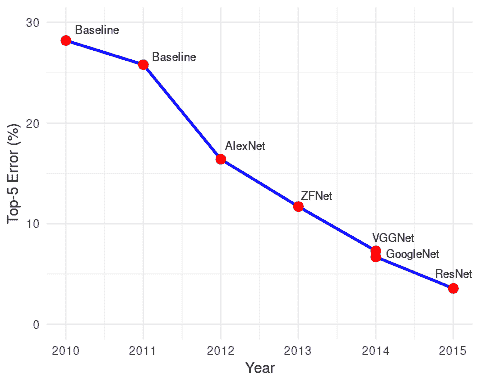
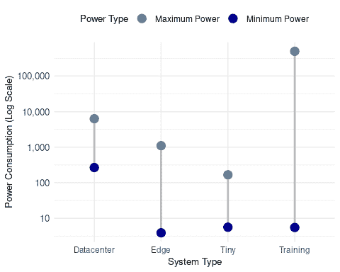

# 基准测试 AI

*DALL·E 3 提示：一张背景为科技主题的讲台照片。讲台的每一层都放置着设计复杂的 AI 芯片。最顶层的芯片上挂着金牌，第二层芯片上挂着银牌，第三层芯片上挂着铜牌。背景中显著地展示着“AI 奥运会”的横幅。*

## 目的

*为什么系统测量是机器学习系统中工程进步的基础，以及标准化基准测试如何促进这一新兴领域的科学进步？*

工程学科通过测量和比较来进步，将基准测试确立为机器学习系统开发的基本要素。没有系统性的评估框架，优化主张缺乏科学严谨性，硬件投资缺乏证据，系统改进无法得到验证或复制。基准测试将主观印象转化为客观数据，使工程师能够区分真正的进步和实现上的瑕疵。这种测量学科是必不可少的，因为机器学习系统涉及算法、硬件和数据之间的复杂交互，这些交互难以进行直观的性能预测。标准化的基准测试建立了共享的基线，允许跨研究小组进行有意义的比较，通过可重复的结果实现累积进步，并为工程决策提供必要的经验基础。理解基准测试原则能够推动系统评估，促进持续改进，并将机器学习系统工程确立为严格的科学学科。

**学习目标**

+   分析机器学习基准测试的演变，并解释基准测试游戏教训如何影响当前设计

+   区分机器学习基准测试的三个维度（算法、系统和数据），并评估每个维度对全面系统评估的贡献

+   比较训练和推理基准测试方法，确定适用于机器学习生命周期每个阶段的特定指标和评估协议

+   应用 MLPerf 基准测试标准来评估解决方案并指导优化决策

+   设计统计上严格的实验方案，考虑到机器学习系统的可变性，包括适当的样本量和置信区间报告

+   批判现有的基准测试结果，以识别常见的谬误和陷阱，区分基准性能和现实世界部署的有效性

+   实施生产监控策略，将基准测试原则扩展到操作环境，包括 A/B 测试和持续模型验证

+   在部署优化中评估性能权衡，包括准确性、延迟、能量和公平性

## 机器学习基准测试框架

对机器学习系统进行系统评估是性能工程更广泛学科中的一个关键方法论挑战。虽然前几章已经建立了全面的优化框架，特别是硬件加速策略（第十一章），但这些方法的验证需要严格的测量方法，这些方法超出了传统的计算基准测试。

考虑工程师在评估竞争性 AI 硬件解决方案时所面临的挑战。供应商可能在精心选择的基准测试中展示出令人印象深刻的性能提升，但在生产工作负载中却无法实现类似的改进。没有全面的评估框架，区分真正的进步和实现上的伪象几乎是不可能的。这个挑战说明了为什么系统测量是机器学习系统中工程进步的基础。

本章探讨了基准测试作为一种基本的实证学科，它能够对机器学习系统在多种操作环境下的性能进行量化评估。基准测试为基于证据的工程决策提供了方法论基础，提供了系统性的评估框架，使从业者能够比较竞争方法、验证优化策略，并在研究和生产环境中确保可重复的性能声明。

机器学习基准测试提出了独特的挑战，使其与传统系统评估区分开来。机器学习算法的概率性质引入了固有的性能可变性，传统的确定性基准测试无法充分表征。机器学习系统的性能表现出对数据特征、模型架构和计算资源的复杂依赖，从而形成了需要专门测量方法的多维评估空间。

当代机器学习系统需要能够适应多个、通常是相互竞争的性能目标的评估框架。除了计算效率之外，这些系统必须在预测准确性、收敛性、能耗、公平性和鲁棒性等多个维度上进行评估。这种多目标评估范式需要复杂的基准测试方法，这些方法能够描述权衡并指导在特定操作约束下的系统设计决策。

该领域已经通过在三个核心维度上运行的全面评估方法来应对这些挑战：

***机器学习基准测试*** 是对机器学习系统在三个维度上进行系统评估：*计算性能*、*算法准确性*和*数据质量*，从而实现系统能力的客观比较和可重复评估。

本章系统地考察了机器学习基准测试方法，从计算评估框架的历史演变及其适应概率系统独特需求开始。我们分析了标准化评估框架，如 MLPerf，它在不同的硬件架构和实现策略之间建立了比较基准。随后的讨论考察了训练评估和推理评估之间的基本区别，探讨了表征它们独特的计算配置文件和操作需求所需的专用指标和方法。

分析扩展到专门的评估环境，包括资源受限的移动和边缘部署场景，这些场景提出了独特的测量挑战。我们通过调查生产监控方法来结束讨论，这些方法将基准测试原则扩展到受控实验环境之外的动态操作环境。这种全面的处理展示了严格的测量如何验证通过前几章中检查的优化技术和硬件加速策略实现的性能改进，同时为第 IV 部分中探讨的部署策略建立了经验基础。

## 历史背景

从简单的性能指标到全面的机器学习基准测试的演变，揭示了三个关键的方法论转变，每个转变都针对了先前评估范例的失败，这些失败直接影响了我们当前的方法。

### 性能基准

从合成操作到代表性工作负载的演变出现在早期基准测试游戏破坏评估有效性的情况下。像 Whetstone（1964）和 LINPACK（1979）这样的主机基准测试测量了孤立的操作，使供应商能够针对狭窄的测试进行优化，而不是实际性能。SPEC CPU（1989）开创了使用真实应用程序工作负载的先河，以确保评估反映了实际的部署场景。这一经验直接塑造了机器学习基准测试，因为第十章中的优化声明需要在代表性任务上进行验证。MLPerf 包括 ResNet-50 和 Bert 等真实模型确保基准测试能够捕捉部署复杂性，而不是理想化的测试案例。

随着部署环境多样化，基准测试从单维度演变为多目标评估。图形基准测试在速度的同时衡量质量；移动基准测试在性能的同时评估电池寿命。第九章中的多目标挑战，平衡精度、延迟和能耗，直接体现在现代机器学习评估中，其中没有单一指标能够捕捉部署的可行性。

当分布式计算揭示组件优化无法预测系统性能时，从独立组件到集成系统的转变发生了。机器学习训练不仅依赖于加速器计算(第十一章)，还依赖于数据管道、梯度同步和存储吞吐量。MLPerf 评估完整的工作流程，认识到性能来自于组件的交互。

这些经验教训在 MLPerf (2018)中达到高潮，它综合了代表性工作负载、多目标评估和集成测量，同时解决机器学习特有的挑战(Ranganathan and Hölzle 2024)。

### 能源基准

当计算超越了具有无限电力预算的主机，多目标评估范例自然扩展到能源效率。移动设备需要电池寿命优化，而仓库规模系统面临与硬件费用相媲美的能源成本。这种转变将能源确立为与性能并列的一级指标，催生了为服务器设计的 SPEC Power1、为超级计算机设计的 Green5002 以及为消费系统设计的 ENERGY STAR3 基准。

尽管取得了这些进步，但在计算环境中考虑多样化的工作负载模式和系统配置时，电力基准测试仍然面临持续的挑战。最近的发展，例如[MLPerf Power](https://mlcommons.org/)基准，引入了专门的方法来衡量机器学习工作负载的能源影响，直接应对了在人工智能驱动计算中能源效率日益增长的重要性。

能源基准测试不仅超越了硬件能源测量。算法能源优化代表了现代人工智能基准测试的一个同样关键的维度，其中能源高效的算法通过计算减少而不是纯粹硬件增强来实现性能提升。神经网络剪枝通过消除不必要的计算来减少能源消耗：剪枝后的 BERT 模型可以在 10 倍更少的参数下达到原始任务 90%的准确率，提供 4-8 倍的推理速度提升和 8-12 倍的能源减少（取决于剪枝方法和硬件 Han, Mao, and Dally 2015b）。量化技术通过减少精度要求实现类似收益：INT8 量化通常提供 4 倍的推理速度提升和 4 倍的能源减少，同时保持 99%以上的准确率保留(Jacob et al. 2018b)。

知识蒸馏提供了另一种算法能量优化途径，其中较小的“学生”模型从较大的“教师”模型中学习。MobileNet 架构展示了这一原则，在保持类似精度的同时，通过深度可分离卷积和宽度乘数实现了比 ResNet 高 10 倍的能量降低（A. G. Howard et al. 2017）。模型压缩技术共同使得在严格的能量约束下部署复杂的 AI 能力成为可能，这对于移动和边缘计算场景是必不可少的。

能源感知基准必须评估的不仅是硬件功耗，还包括算法效率指标，包括通过稀疏性减少 FLOP、通过压缩减少内存访问以及量化带来的计算能量效益。这些算法优化通常比单纯的硬件改进实现更大的节能效果，为能源基准框架提供了关键维度。

随着人工智能和边缘计算的演进，功耗基准将推动节能硬件和软件的创新。这直接关联到第十八章（ch024.xhtml#sec-sustainable-ai）中讨论的可持续人工智能实践，其中能源感知设计原则指导了负责任的人工智能开发。

### 领域特定基准

计算多样化需要针对特定领域需求定制基准，这些基准能够捕捉到通用指标无法涵盖的特定要求。领域特定基准解决以下三个类别的专业化问题：

部署约束塑造核心指标优先级。数据中心工作负载在千瓦级功率预算下优化吞吐量，而移动 AI 在 2-5W 的热量范围内运行，物联网设备需要毫瓦级的操作。这些约束源于第九章（ch015.xhtml#sec-efficient-ai）中的效率原则，决定了基准是优先考虑总吞吐量还是每操作的能量。

应用需求在性能之外还强加了功能和监管约束。医疗 AI 需要可解释性指标与准确性；金融系统需要微秒级延迟并符合审计合规性；自动驾驶汽车需要关键安全性的可靠性（ASIL-D：<10^-8 故障/小时）。这些要求与第十七章（ch023.xhtml#sec-responsible-ai）中讨论的责任人工智能原则相联系，将评估扩展到传统的性能指标之外。

运行条件决定了现实世界的可行性。自动驾驶汽车面临-40°C 至+85°C 的温度和退化的传感器输入；数据中心处理数百万并发请求并经历网络分区；工业物联网设备在没有维护的情况下持续部署数年。第十一章（ch017.xhtml#sec-ai-acceleration）中提到的硬件能力只有在这些条件下得到验证时才能提供价值。

机器学习是向特定领域评估转变的一个突出例子。传统的 CPU 和 GPU 基准测试不足以评估涉及计算、内存带宽和数据移动模式之间复杂交互的机器学习工作负载。MLPerf 为机器学习模型在这三个类别中实现了性能测量的标准化：MLPerf Training 通过多节点扩展基准测试解决数据中心部署限制，MLPerf Inference 评估服务器到边缘部署中的延迟关键应用需求，而 MLPerf Tiny 评估微控制器部署的超约束操作条件。这种分层结构反映了我们的三类框架在机器学习特定评估需求上的系统应用。

特定领域基准测试的强大之处在于它们能够捕捉到一般基准测试忽视的这些专业需求。通过系统地解决部署限制、应用需求和操作条件，这些基准测试提供了推动硬件和软件针对性优化的见解，同时确保改进能够转化为实际部署的成功，而不仅仅是优化狭窄的实验室条件。

从通用计算基准测试到能源感知测量再到特定领域评估框架的历史进步，为理解当代机器学习基准测试挑战提供了基础。学到的经验（代表性工作负载超过合成测试、多目标超过单一指标，以及集成系统超过独立组件）直接塑造了我们今天如何接近人工智能系统评估。

## 机器学习基准

历史演变的最终结果是机器学习基准测试，其复杂性超过了所有之前的计算领域。与具有确定性行为的传统工作负载不同，ML 系统通过其概率性质引入了固有的不确定性。CPU 基准测试在相同的输入下产生相同的结果；ML 模型的性能会随着训练数据、初始化甚至操作顺序而变化。这种固有的可变性，加上几十年来基准测试的经验教训，需要我们三维评估框架。

建立在前面章节的框架和优化技术之上，机器学习基准测试必须评估的不仅仅是计算效率，还包括算法、硬件和数据之间复杂的相互作用。基准测试的演变在机器学习领域达到了目前的顶峰，我们建立的三维框架反映了数十年的计算测量进化。早期的机器学习基准测试主要关注算法性能，衡量模型执行特定任务的能力（Lecun 等人 1998）。然而，随着机器学习应用的规模急剧扩大和计算需求呈指数增长，关注的焦点自然扩展到包括系统性能和硬件效率（Norman P. Jouppi 等人 2017d）。最近，数据质量已成为评估的第三维度（Gebru 等人 2021b）。

人工智能基准测试与传统性能指标的不同之处在于其固有的可变性，这引入了准确性作为新的评估维度，与计算速度或能耗等确定性特征并列。机器学习模型的概率性质意味着相同的系统可能会根据遇到的数据产生不同的结果，这使得准确性成为性能评估的决定性因素。这种区别增加了复杂性：对人工智能系统进行基准测试不仅需要测量原始的计算效率，还需要理解准确性、泛化能力和资源限制之间的权衡。

能源效率成为一个跨领域的关注点，影响着我们框架的三个维度：算法选择影响计算复杂度和功耗，硬件能力决定能效权衡，数据集特征影响训练能耗。这种多方面的评估方法代表了与早期基准测试的背离，后者主要关注孤立方面，如计算速度或能源效率（Hernandez 和 Brown 2020）。

基准复杂性的这种演变直接反映了该领域对真正推动机器学习系统成功因素的理解的演变。虽然算法创新最初主导了研究阶段的进展指标，但在大规模部署模型时遇到的实际挑战揭示了硬件效率的重要性(Norman P. Jouppi 等人 2021b)。随后，机器学习系统在实际部署中的高调失败凸显了数据质量和表示如何直接决定系统可靠性和公平性(Bender 等人 2021)。理解这些维度如何相互作用已成为准确评估机器学习系统性能、指导开发决策以及衡量该领域技术进步的必要条件。

### 机器学习测量挑战

机器学习系统的独特特性创造了传统基准测试从未面临的测量挑战。与给定相同输入产生相同输出的确定性算法不同，机器学习系统表现出来自多个来源的固有可变性：来自权重初始化和数据洗牌的算法随机性，影响时钟速度的硬件热状态，来自并发进程的系统负载变化，以及包括网络条件和电源管理在内的环境因素。这种可变性需要严格的统计方法来区分真正的性能改进和测量噪声。

为了应对这种可变性，有效的基准测试协议需要使用不同的随机种子进行多次实验运行。每次运行基准测试 5-10 次，并报告除简单平均值之外的统计指标（包括标准偏差或 95%置信区间），可以量化结果稳定性，并允许从业者区分真正的性能改进和测量噪声。

近期研究突出了统计严谨性不足可能导致误导性结论。许多强化学习论文报告的改进结果落在统计噪声范围内(Henderson 等人 2018)，而生成对抗网络（GAN）的比较通常缺乏适当的实验协议，导致在不同随机种子下排名不一致(Lucic 等人 2018)。这些发现强调了建立全面测量协议的重要性，该协议考虑了机器学习的概率性质。

代表性工作负载选择对于基准测试的有效性至关重要。合成微基准测试通常无法捕捉到真实机器学习工作负载的复杂性，其中数据移动、内存分配和动态批处理创造了在简化测试中不可见的性能模式。全面的基准测试需要反映实际部署模式的工作负载：语言模型中的可变序列长度、混合精度训练方案以及包括预处理开销在内的真实数据加载模式。统计意义和实际意义的区别需要仔细解释。小的性能提升可能在数百次试验中达到统计意义，但如果它落在测量噪声中或成本超过收益，则可能在实际操作上无关紧要。

解决这个问题需要仔细的基准设计，优先考虑代表性工作负载而不是合成测试。有效的系统评估依赖于端到端应用程序基准，如 MLPerf，它包含数据预处理并反映现实部署模式。在开发自定义评估框架时，分析生产工作负载有助于确定对有意义评估至关重要的代表性数据分布、批处理大小和计算模式。

当前的基准测试范式通常在衡量狭窄的任务性能时存在不足，同时忽略了决定实际系统有效性的特征。大多数现有的基准测试主要评估静态数据集上的监督学习性能，主要测试模式识别能力，而不是生产部署所需的适应性和弹性。当模型在略微不同的条件或领域部署时，即使基准测试性能出色但失败，这种局限性变得明显。为了解决这些不足，全面的系统评估必须测量学习效率、持续学习能力以及分布外泛化能力，同时衡量传统指标。

### 算法基准测试

算法基准测试专注于我们框架的第一个维度：衡量模型性能、准确性和效率。虽然硬件系统和训练数据质量当然会影响结果，但算法基准测试故意隔离模型能力，以便清楚地理解准确度、计算复杂性和泛化之间的权衡。

人工智能算法面临着平衡多个性能目标的复杂挑战，包括准确性、速度、资源效率和泛化能力。随着机器学习应用继续跨越不同的领域，包括计算机视觉、自然语言处理、语音识别和强化学习，评估这些竞争目标需要针对每个领域独特挑战精心标准化的方法。算法基准，如 ImageNet4 (J. Deng 等人 2009)，建立了这些评估框架，为比较不同的机器学习方法提供了一个一致的基础。

**机器学习算法基准**是对机器学习模型在**预定义任务**和**数据集**上的**性能**进行标准化的评估，使得不同方法之间的**准确性**、**效率**和**泛化能力**的客观比较成为可能。

算法基准通过多个功能推动人工智能的发展。它们建立了清晰的性能基准线，使得不同方法之间的客观比较成为可能。通过系统地评估模型复杂度、计算需求和任务性能之间的权衡，它们帮助研究人员和从业者确定最佳的设计选择。它们通过记录随时间的技术进步，指导新技术的开发，同时揭示现有方法中的局限性。

图 12.1 中的图表展示了在[ImageNet 大规模视觉识别挑战（ILSVRC）](https://www.image-net.org/challenges/LSVRC/)分类任务上，错误率随年份的降低。从 2010 年和 2011 年的基线模型开始，2012 年引入的 AlexNet5 标志着进步，将错误率从 25.8%降低到 16.4%。随后的模型如 ZFNet、VGGNet、GoogleNet 和 ResNet6 继续这一趋势，到 2015 年 ResNet 实现了 3.57%的错误率（Russakovsky 等人 2015）。这一进展突出了算法基准如何衡量当前的能力并推动人工智能性能的进步。

图 12.1：**ImageNet 挑战进展**：神经网络将错误率从 2010 年的 25.8%降低到 2015 年的 3.57%，突出了架构进步对分类准确性的影响。

### 系统基准

转到我们框架的第二维度，我们解决硬件性能问题：不同的计算系统如何有效地执行机器学习工作负载。系统基准测量使算法能力得以实现的计算基础，系统地检查硬件架构、内存系统和互连如何影响整体性能。理解这些硬件的局限性和能力对于优化算法-系统交互是必要的。

人工智能计算对计算资源的需求极大，远超传统计算工作负载。其底层硬件基础设施，包括通用 CPU、图形处理单元（GPU）、张量处理单元（TPUs）7 和专用集成电路（ASICs）8；Mattson 等人 2020)。

这些系统基准在人工智能生态系统中执行两个关键功能。首先，它们通过提供系统配置之间的比较性能数据，使开发者和组织在为他们的 AI 应用选择硬件平台时能够做出明智的决定。评估因素包括训练速度、推理延迟、能效和成本效益。其次，硬件制造商依赖这些基准来量化代际改进并指导专用 AI 加速器的开发，推动计算能力的进步。

**ML 系统基准**是对机器学习工作负载的计算基础设施的标准化评估，衡量**性能**、**能效**和**可扩展性**，以实现硬件和软件配置之间的客观比较。

然而，有效解释基准测试结果需要深入理解目标硬件的性能特性。关键的是，了解特定人工智能工作负载是计算密集型还是内存密集型，对于优化决策提供了重要见解。计算强度，以每字节数据移动的 FLOPS9 来衡量，决定了性能限制。以 NVIDIA A100 GPU 为例，其张量性能为 312 TFLOPS，内存带宽为 1.6 TB/s，从而得出算术强度阈值为 195 FLOPS/byte。理解这些硬件特性的架构基础在第十一章中确立，它为解释系统基准测试结果提供了背景。

在某些 AI 模型操作（通常>200 FLOPS/byte）中的高强度操作，如密集矩阵乘法，在 A100 上实现了接近峰值计算吞吐量。例如，在大型批量大小（256+）上进行的 ResNet-50 正向传递达到约 300 FLOPS/byte 的算术强度，使得 85-90%的峰值张量性能（实际达到 280 TFLOPS，理论值为 312 TFLOPS）(Choquette 等人 2021)。相反，低强度操作，如激活函数和某些轻量级操作（<10 FLOPS/byte），成为内存带宽限制，只利用了 GPU 计算能力的一小部分。批量大小为 1 的 BERT 推理仅达到 8 FLOPS/byte 的算术强度，性能限制在 12.8 TFLOPS（1.6 TB/s × 8 FLOPS/byte），仅代表峰值计算能力的 4%。

这种定量分析，在 roofline 模型 10 中形式化，提供了一个系统框架，通过明确识别特定工作负载的主要性能约束，指导算法设计和硬件选择。理解这些定量关系使得工程师能够准确预测性能瓶颈，并相应地优化模型架构和部署策略。例如，将 transformer 推理的批量大小从 1 增加到 32 可以将操作从内存受限（8 FLOPS/byte）转变为计算受限（150 FLOPS/byte），将 GPU 利用率从 4%提高到 65%(Pope 等人 2022)。

系统基准测试评估了从单芯片配置到大型分布式系统以及包括训练和推理任务在内的 AI 工作负载在内的性能。这种评估方法确保基准测试能够准确反映现实世界的部署场景，并提供有关硬件选择决策和系统架构设计的见解。图 12.2 展示了 2010 年至 2014 年间 ImageNet 分类错误率与 GPU 采用率之间的相关性。这些结果突出了硬件能力的提升以及算法进步如何推动计算机视觉性能的进步。

图 12.2：**ImageNet 基准测试**：自 2012 年以来，GPU 技术的进步推动了 ImageNet 分类精度的提高，展示了硬件和算法进步之间的相互作用。

上面的 ImageNet 示例展示了硬件进步如何促进算法突破，但有效的系统基准测试需要理解工作负载特征与硬件利用率之间微妙的关系。现代 AI 系统很少能达到理论峰值性能，因为计算模式、内存层次结构和系统架构之间的复杂交互。这种理论与实际性能之间的差距塑造了我们设计有意义的系统基准测试的方式。

理解实际的硬件利用率模式对于可操作的基准设计变得至关重要。不同的 AI 工作负载以截然不同的方式与硬件架构交互，根据模型架构、批量大小和精度选择，创建出差异巨大的利用率模式。GPU 利用率从批量大小为 64 的优化良好的 ResNet-50 训练的 85%到批量大小为 1 的仅 15% (Y. You et al. 2019)，这是由于并行性不足。内存带宽利用率从参数密集型的 transformer 模型的 20%到激活密集型的卷积网络的 90%，直接影响到不同精度级别上可达到的性能。

能效考虑因素为系统基准测试增加了另一个关键维度。性能每瓦特在计算平台之间差异三个数量级，使得能效成为生产部署的关键基准维度。利用率对效率有显著影响：利用率低的 GPU 消耗了不成比例的电力，同时提供最小的性能，造成巨大的效率损失，影响运营成本和环境影响。

分布式系统性能引入了系统基准测试必须捕捉的额外复杂性。传统的屋顶线模型扩展到多 GPU 和多节点场景，但分布式训练引入了通信瓶颈，这通常占主导地位。节点间带宽限制、NUMA 拓扑效应和网络拥塞创造了单节点基准测试无法揭示的性能变化。

生产级分布式系统面临需要专门基准测试方法解决的实际部署场景的挑战。多节点训练期间的网络分区影响梯度同步和模型一致性，需要在部分连接条件下进行容错评估。时钟同步对于准确测量地理上分布的节点间的分布式性能变得至关重要，因为时间戳漂移会无效化基准测试结果。

规模化效率测量揭示了生产级机器学习工作负载中关键分布式系统瓶颈。对于大多数模型，由于通信开销，线性扩展效率在 64-128 节点之后显著下降：ResNet-50 训练在 32 节点时达到 90%的扩展效率，但在 128 节点时只有 60%的效率。在传统的参数服务器架构中，梯度聚合延迟随着集群规模的增加而呈二次方增长，而 all-reduce 通信模式虽然实现了更好的扩展，但需要高带宽的互连。

在分布式节点间完成基准的共识机制引入了单节点评估中不存在的协调挑战。确定基准完成需要分布式节点对收敛标准的共识，处理基准执行期间的节点故障，并确保所有参与节点的状态一致性。拜占庭容错对于跨越多个管理域或云提供商的基准成为必要。

网络拓扑效应在生产环境中显著影响分布式训练性能。InfiniBand 互连每个链路达到 200 Gbps，具有微秒级延迟，为通信密集型工作负载提供近似线性扩展。基于以太网的集群具有 100 Gbps 链路，但延迟高达 10-100 倍，限制了梯度密集型模型的扩展效率。节点内的 NUMA 拓扑创建内存带宽竞争，影响网络通信之前的本地梯度计算。

在生产级分布式系统中动态资源分配需要考虑资源异构性和时间变化的基准框架。不同内存容量、CPU 速度和网络带宽的云实例会创建负载不平衡，降低整体训练性能。Spot 实例可用性的波动需要容错基准，以衡量节点故障后的恢复时间和资源扩展响应性。

这些分布式系统考虑因素突显了理想化单节点基准与生产部署现实之间的差距。因此，有效的分布式机器学习基准必须评估通信模式、容错性、资源异构性和协调开销，以指导现实世界的系统设计决策。

这些硬件利用率洞察直接指导基准设计原则。有效的系统基准必须评估在现实利用率场景下的性能，而不是仅仅关注峰值理论能力。这种方法确保基准结果转化为实际部署指导，使工程师能够就硬件选择、系统配置和优化策略做出明智的决定。

这种从计算基础设施评估的过渡自然地引导我们进入全面机器学习系统基准的第三个同样关键的维度：数据质量评估。

### 数据基准

我们框架的第三个维度系统地检查数据质量、代表性以及机器学习评估中的偏差。数据基准评估数据集特征如何影响模型性能，并揭示仅从算法或系统指标中可能不明显的关键限制。这一维度尤其关键，因为数据质量约束通常决定了实际部署的成功，无论算法的复杂性或硬件能力如何。

数据质量、规模和多样性塑造了机器学习系统的性能，直接影响算法学习新情况的有效性和泛化能力。为了解决这种依赖性，数据基准建立了标准化的数据集和评估方法，使不同方法的比较保持一致。这些框架评估数据质量的关键方面，包括领域覆盖范围、潜在偏差以及对输入数据现实世界变化的抗性（Gebru 等人 2021b）。创建可靠基准所需的数据工程实践在第六章中详细说明，而基准设计中的公平性考虑与第十七章中涵盖的更广泛的负责任 AI 原则相联系。

**ML 数据基准**是对**数据集质量**的标准化评估，评估**覆盖范围**、**偏差**、**代表性**和**鲁棒性**，以实现数据对模型性能影响的客观比较。

数据基准在理解 AI 系统在不同数据条件下的行为中发挥着至关重要的作用。通过系统性的评估，它们有助于识别常见的故障模式，揭示数据覆盖的临界差距，并揭示可能显著影响模型部署行为的潜在偏差。通过提供数据评估的通用框架，这些基准使 AI 社区能够系统地提高数据质量，并在将系统部署到生产环境中之前解决潜在问题。随着 AI 系统承担更多复杂和重要的任务，这种主动的数据质量评估方法变得越来越关键。

### 社区驱动的标准化

在我们的三维框架基础上，我们面临着由基准的激增带来的关键挑战，这些基准涵盖了性能、能源效率和特定领域的应用：建立行业标准。虽然早期的计算基准主要测量简单的指标，如处理器速度和内存带宽，但现代基准必须评估系统性能的复杂方面，从复杂的功耗配置文件到高度专业化的特定应用能力。这种范围和复杂性的演变需要计算社区的全面验证和共识，尤其是在机器学习等快速发展的领域，必须从多个相互依赖的维度评估性能。

任何基准的持久影响都严重依赖于更广泛研究社区的接受程度，仅仅技术上的卓越不足以保证其被采用。没有广泛社区参与的基准开发往往难以获得有意义的推广，常常遗漏了领先研究组认为至关重要的关键指标。成功的基准是通过涉及学术机构、行业合作伙伴和领域专家的协作开发而产生的。这种包容性方法确保基准评估了推动该领域发展的最关键能力，同时平衡了理论和实践考虑。

相比之下，通过在受尊敬的机构之间广泛合作开发的基准，具有推动广泛采用所需的权威性，而那些被认为是在推进特定企业利益方面的基准则面临怀疑和有限的接受。ImageNet 的显著成功展示了通过研讨会和挑战持续社区参与如何建立长期可行性和持久影响。这种社区驱动的发展为正式标准化奠定了基础，其中像 IEEE 和 ISO 这样的组织将这些基准转化为官方标准。

标准化过程为基准的正式化和采用提供了关键基础设施。[IEEE 工作组](https://standards.ieee.org/develop/wg/)将社区开发的基准方法转化为正式的行业标准，为测量和报告建立了精确的规范。[IEEE 2416-2019](https://standards.ieee.org/ieee/2416/7065/) 系统功率建模标准就是这一过程的例证，它将社区共识中发展出的最佳实践法典化。同样，[ISO/IEC 技术委员会](https://www.iso.org/committee/45020.html)制定基准验证和认证的国际标准，确保全球研究和行业社区的评价一致性。这些组织在社区驱动创新和正式标准化之间架起了桥梁，提供了框架，使得不同机构和地理区域之间可靠地比较结果成为可能。

成功的社区基准建立了明确的治理结构来管理其演变。通过严格的版本控制系统和详细的变更文档，基准在吸收新进展的同时保持向后兼容。这种治理包括正式的提案、审查和实施变更的程序，确保基准在保持稳定性的同时保持相关性。现代基准越来越强调可重复性要求，纳入了自动验证系统和标准化的评估环境。

开放访问加速了基准测试的采用并确保了一致的实施。提供开源参考实现、全面文档、验证套件和容器化评估环境的项目降低了进入门槛。这种标准化使得研究团队能够使用统一的方法和指标评估解决方案。如果没有这样的协调实施框架，组织可能会不一致地解释基准测试，从而损害结果的可重复性和跨研究的有意义比较。

最成功的基准测试在学术严谨性和行业实用性之间取得了谨慎的平衡。学术参与确保了理论上的严谨性和全面的评估方法，而行业参与则将基准测试建立在实际约束和现实世界应用的基础上。这种平衡在机器学习基准测试中尤其重要，因为理论进步必须转化为部署系统中实际改进 (D. Patterson et al. 2021a)。这些评估方法原则指导了本章中训练和推理基准设计。

社区共识确立了基准测试的持久相关性，而碎片化则阻碍了科学进步。通过协作开发和透明操作，基准测试演变为衡量进步的权威标准。在能效和特定领域应用中最成功的基准测试共享这一社区发展和治理的基础，展示了集体专业知识和共同目标如何在快速发展的领域中产生持久影响。

## 基准测试粒度

上述建立的三维框架和测量基础为基准测试提供了概念结构。然而，实施这些原则需要选择适当的细节级别进行评估，从单个张量操作到完整的机器学习应用。正如第十章中提到的优化技术在不同粒度上运行一样，基准测试必须调整其评估范围以匹配特定的优化目标。这种分层视角允许实践者从微观层面隔离性能瓶颈，或在宏观层面评估整个系统的行为。

系统级基准测试提供了一种结构化和系统化的方法来评估机器学习系统在各个维度的性能。鉴于机器学习系统的复杂性，我们可以通过不同级别的粒度来剖析其性能，从而获得系统效率的全面视图，识别潜在的瓶颈，并确定改进的区域。为此，各种类型的基准测试在多年中不断发展并持续存在。

图 12.3 展示了机器学习系统的不同粒度层次。在应用层面，端到端基准评估整体系统性能，考虑因素包括数据预处理、模型训练和推理。而在模型层面，基准则专注于评估特定模型的效率和准确性。这包括评估模型对新数据的泛化能力以及训练和推理过程中的计算效率。基准测试可以扩展到硬件和软件基础设施，检查单个组件（如 GPU 或 TPU）的性能。

图 12.3：**基准粒度**：机器学习系统性能评估发生在多个层面，从端到端应用指标到单个模型和硬件组件效率，从而实现有针对性的优化和瓶颈识别。这种分层方法允许从业者系统地分析系统性能，并根据特定组件的限制优先考虑改进。

### 微基准测试

微基准测试是专门的评价工具，用于评估更广泛机器学习过程中的不同组件或特定操作。这些基准将单个任务隔离出来，以提供对特定系统元素计算需求的详细见解，从神经网络层到优化技术到激活函数。例如，微基准测试可能会测量执行深度学习模型中卷积层所需的时间，或评估准备训练数据的数据预处理操作的速度。

微基准测试的关键领域集中在张量操作 11 上，这是深度学习的计算核心。NVIDIA 的库[cuDNN](https://developer.nvidia.com/cudnn)12 提供了在不同硬件配置下测量基本计算（如卷积和矩阵乘法）的基准。这些测量帮助开发者了解他们的硬件如何处理主导机器学习工作负载的核心数学运算。

微基准测试还单独检查激活函数和神经网络层。这包括在受控条件下测量各种激活函数（如 ReLU、Sigmoid13 和 Tanh14）的性能，以及评估不同神经网络组件（如 LSTM15 单元或 Transformer 块）在处理标准化输入时的计算效率。

百度开发的[DeepBench](https://github.com/baidu-research/DeepBench)是第一个展示全面微观基准价值的项目之一。它评估了不同硬件平台上的这些基本操作，提供了有助于开发者优化其深度学习实现的详细性能数据。通过隔离和测量单个操作，DeepBench 能够精确比较硬件平台并识别潜在的性能瓶颈。

### 宏观基准

当微观基准检查单个操作，如张量计算和层性能时，宏观基准评估的是完整的机器学习模型。这种从组件级到模型级评估的转变，有助于了解架构选择和组件交互如何影响整体模型行为。例如，虽然微观基准可能显示单个卷积层的最佳性能，但宏观基准揭示了这些层如何在完整的卷积神经网络中协同工作。

宏观基准衡量的是仅在模型级别出现的多个性能维度。这包括预测准确性，它显示了模型对新数据的泛化能力；不同批量大小和序列长度下的内存消耗模式；不同计算负载下的吞吐量；以及不同硬件配置下的延迟。理解这些指标有助于开发者就模型架构、优化策略和部署配置做出明智的决定。

完整模型的评估是在标准化的条件下，使用既定的数据集和任务进行的。例如，计算机视觉模型可能会在[ImageNet](https://www.image-net.org/)上进行评估，衡量其计算效率和预测准确性。自然语言处理模型可能会在翻译任务上进行评估，检查它们在不同语言对之间如何平衡质量和速度。

几个行业标准基准使模型在不同平台上的评估保持一致。[MLPerf Inference](https://github.com/mlcommons/inference)提供了适用于不同计算环境的全面测试套件（Reddi 等人 2019b）。[MLPerf Mobile](https://github.com/mlcommons/mobile_app_open)专注于移动设备限制（Janapa Reddi 等人 2022），而[MLPerf Tiny](https://github.com/mlcommons/tiny)针对微控制器部署（C. Banbury 等人 2021）。对于嵌入式系统，[EEMBC 的 MLMark](https://github.com/eembc/mlmark)强调性能和功耗效率。[AI-Benchmark](https://ai-benchmark.com/)套件专注于移动平台，评估从图像识别到人脸解析的多种任务上的模型。

### 端到端基准

端到端基准测试提供了一个全面评估，它超越了机器学习模型本身的边界。这些基准不仅关注机器学习模型的计算效率或准确性，还涵盖了人工智能系统的整个流程。这包括初始的 ETL（提取-转换-加载）或 ELT（提取-加载-转换）数据处理、核心模型性能、结果的后处理以及存储和网络系统等关键基础设施组件。

数据处理是所有人工智能系统的基石，它将原始数据转换成适合模型训练或推理的格式。在 ETL 管道中，数据从源系统提取，经过清洗和特征工程等转换，然后加载到模型准备好的格式中。这些预处理步骤的效率、可扩展性和准确性对整体系统性能有重大影响。端到端基准测试必须通过这些管道评估标准化数据集，以确保数据准备不会成为瓶颈。

后处理阶段同样重要。这涉及到解释模型的原始输出，将分数转换为有意义的类别，根据预定义的任务过滤结果，或与其他系统集成。例如，计算机视觉系统可能需要后处理检测边界，应用置信度阈值，并将结果格式化为下游应用。在实际部署中，这一阶段对于提供可操作的见解至关重要。

除了核心人工智能操作之外，基础设施组件对整体性能和用户体验有重大影响。存储解决方案，无论是基于云、本地还是混合型，都可能显著影响数据检索和存储时间，尤其是在庞大的 AI 数据集情况下。对于分布式系统至关重要的网络交互，如果没有优化，可能会成为性能瓶颈。端到端基准测试必须在指定的环境条件下评估这些组件，以确保整个系统的可重复测量。

到目前为止，还没有公开的、端到端的基准测试能够完全考虑到数据存储、网络和计算性能。虽然 MLPerf Training 和 Inference 方法接近端到端评估，但它们主要关注模型性能，而不是实际部署场景。尽管如此，它们为评估人工智能系统能力提供了有价值的基线指标。

由于端到端基准测试的固有特定性，组织通常通过在生产部署中实施这些评估来内部执行这些评估。这允许工程师根据实际工作负载制定结果解释指南，但鉴于信息的敏感性和特定性，这些基准很少出现在公共场合。

### 粒度权衡和选择标准

如表 12.1 所示，人工智能系统生命周期不同阶段会涌现出不同的挑战。每种基准测试方法都提供独特的见解：微基准测试帮助工程师优化特定组件，如 GPU 内核实现或数据加载操作，宏基准测试指导模型架构决策和算法选择，而端到端基准测试则揭示了生产环境中的系统级瓶颈。

表 12.1：**基准粒度级别**：不同的基准范围（微、宏和端到端）针对机器学习系统开发的特定阶段，并揭示独特的性能瓶颈。微基准测试隔离单个操作以进行低级优化，宏基准测试评估完整模型以指导架构选择，而端到端基准测试评估生产环境中的完整系统性能。

| **组件** | **微基准测试** | **宏基准测试** | **端到端基准测试** |
| --- | --- | --- | --- |
| **关注点** | 单个操作 | 完整模型 | 全系统管道 |
| **范围** | 张量操作、层、激活 | 模型架构、训练、推理 | ETL、模型、基础设施 |
| **示例** | cuDNN 上的卷积层性能 | ImageNet 上的 ResNet-50 | 生产推荐系统 |
| **优点** | 精确瓶颈识别，组件优化 | 模型架构比较，标准化评估 | 现实性能评估，系统级洞察 |
| **挑战** | 可能错过交互效应 | 基础设施洞察有限 | 复杂标准化，通常专有 |
| **典型用途** | 硬件选择，操作优化 | 模型选择，研究比较 | 生产系统评估 |

图 12.4 可视化了基准粒度级别之间诊断能力和现实世界代表性之间的核心权衡。这种关系说明了为什么全面的机器学习系统评估需要多种基准类型：微基准测试为孤立组件提供精确的优化指导，而端到端基准测试则捕捉生产系统中出现的复杂交互。最佳的基准测试策略结合了所有三个级别的见解，以平衡详细组件分析与现实系统评估。

图 12.4：**基准粒度权衡**：基准粒度在隔离/诊断能力和现实世界代表性之间的核心权衡。微基准测试提供高诊断精度但现实世界相关性有限，而端到端基准测试捕捉现实系统行为但提供较少的组件级洞察。有效的机器学习系统评估需要战略性地结合所有三个级别的信息。

组件之间的交互往往会产生意外的行为。例如，虽然微基准测试可能显示单个卷积层表现出色，宏基准测试可能显示完整模型具有强大的精度，但端到端评估可能会揭示数据预处理在高流量期间创造了意外的瓶颈。当组件进行隔离测试时，这些系统级见解往往隐藏起来。

在确定了基准粒度后，了解哪个评估级别服务于特定的优化目标，我们现在来审视构成任何粒度级别基准实现的具体组件。

## 基准组件

使用我们建立的框架，我们现在来审视构成任何基准实现的实际组件。这些组件为同时测量性能的三个维度提供了具体结构。无论是评估模型精度（算法维度）、测量推理延迟（系统维度）还是评估数据集质量（数据维度），基准测试都共享一些共同的结构性元素，确保系统性和可重复的评估。

上一节中建立的粒度级别直接决定了这些组件是如何实例化的。测量张量操作的微基准测试需要合成输入，以隔离特定的计算模式，从而能够精确地描述单个内核的性能，如第十一章第十一章中所述。评估完整模型的宏基准测试需要像 ImageNet 这样的代表性数据集，它能够捕捉现实任务复杂性，同时允许在架构之间进行标准化的比较。评估生产系统的端到端基准测试必须包含真实世界的数据特征，包括分布偏移、噪声和边缘情况，这些在精心挑选的评估集中是不存在的。同样，评估指标在粒度级别之间转移焦点：微基准测试强调 FLOPS 和内存带宽利用率，宏基准测试在精度和推理速度之间取得平衡，而端到端基准测试在负载下的系统可靠性和操作效率方面优先考虑。理解这种系统性的变化确保组件选择与评估目标相一致，而不是在不同基准测试规模上应用统一的方法。

在确定了基准粒度如何塑造评估范围（从隔离张量操作的微基准测试到完整系统的端到端评估）之后，我们现在来探讨这些概念级别如何转化为具体的基准实现。上面讨论的抽象组件必须通过关于任务、数据集、模型和指标的具体选择来实例化。这个实现过程遵循一个系统性的工作流程，确保无论选择的粒度级别如何，都能进行可重复且有意义的评估。

AI 基准提供了一个结构化框架，用于系统地评估人工智能系统。虽然各个基准在其具体焦点和粒度上差异很大，但它们共享共同的实现组件，这些组件使得在不同方法之间的一致评估和比较成为可能。

图 12.5 展示了这个结构化工作流程，展示了基本组件（任务定义、数据集选择、模型选择和评估指标）如何相互连接形成一个完整的评估管道。每个组件都建立在之前的基础上，从问题规范到部署评估创建一个系统的进展。

图 12.5：**基准工作流程**：AI 基准通过结构化管道标准化评估，使不同模型和系统之间的性能比较具有可重复性。此工作流程通过定义任务、选择数据集、训练模型和严格评估结果来系统地评估 AI 能力。

有效的基准设计必须考虑前几章中确立的优化技术。量化剪枝影响模型精度-效率权衡，需要同时衡量加速和精度保持的基准。硬件加速技术影响算术强度和内存带宽利用率，需要通过屋顶线模型分析来正确解释结果。理解这些优化基础能够使基准选择验证所声称的改进，而不是衡量人工场景。

### 问题定义

如图 12.5 所示，基准实现从对机器学习任务及其评估标准的正式规范开始。在机器学习中，任务代表 AI 系统必须解决的明确问题。考虑一个异常检测系统，它处理音频信号以识别偏离正常操作模式的变化，如图 12.5 所示。这个工业监控应用示例说明了正式任务规范如何转化为实际实现。

任何基准任务的正式定义都包括计算问题和其评估框架。虽然具体任务因领域而异，但已在大规模 AI 研究领域中出现了成熟的类别。例如，自然语言处理任务包括机器翻译、问答(Hirschberg and Manning 2015)和文本分类。计算机视觉同样采用标准化的任务，如目标检测、图像分割和面部识别(Everingham et al. 2009)。

每个基准测试任务规范必须定义三个基本要素。输入规范确定系统处理的数据。在图 12.5(Figure 12.5)中，这包括音频波形数据。输出规范描述所需的系统响应，例如正常与异常模式的二进制分类。性能规范建立了准确性、处理速度和资源利用的定量要求。

任务设计直接影响基准测试评估 AI 系统的有效性。音频异常检测示例通过其具体要求清楚地说明了这种关系：处理连续信号数据、适应变化的噪声条件以及在严格的时间约束内运行。这些实际约束为评估模型性能提供了一个详细的框架，确保评估反映了现实世界的操作需求。

基准测试的实施从这一基础任务定义系统地展开。从数据集选择到部署的每个后续阶段，都直接建立在这些初始规范之上，确保评估保持一致性，同时满足不同方法和实现中定义的要求。

### 标准化数据集

在前一个阶段建立的问题定义的基础上，标准化数据集为训练和评估模型提供了基本的基础。这些精心挑选的集合确保所有模型在相同条件下进行测试，从而能够直接比较不同方法和架构。图 12.5(Figure 12.5)通过音频异常检测示例展示了这一点，其中波形数据作为评估检测性能的标准化输入。

在计算机视觉领域，如[ImageNet](http://www.image-net.org/) (J. Deng et al. 2009)、[COCO](https://cocodataset.org/) (T.-Y. Lin et al. 2014)和[CIFAR-10](https://www.cs.toronto.edu/~kriz/cifar.html)16 (Krizhevsky, Hinton, et al. 2009)等数据集作为参考标准。对于自然语言处理，如[SQuAD](https://rajpurkar.github.io/SQuAD-explorer/)17 (Rajpurkar et al. 2016)、[GLUE](https://gluebenchmark.com/)18 (A. Wang et al. 2018)和[WikiText](https://www.salesforce.com/blog/the-wikitext-long-term-dependency-language-modeling-dataset/) (Merity et al. 2016)等集合也发挥着类似的作用。这些数据集涵盖了各种复杂性和边缘情况，以全面评估机器学习系统。

在图 12.5 的工作流程早期，数据集的战略选择塑造了所有后续的实施步骤，并最终决定了基准的有效性。在音频异常检测的例子中，数据集必须包括正常操作的代表性波形样本，以及各种异常条件的综合示例。值得注意的例子包括用于工业制造异常的 ToyADMOS 数据集和用于通用声音识别的 Google Speech Commands。无论选择的具体数据集是什么，数据量必须足够用于模型训练和验证，同时包含反映部署条件的现实世界信号特征和噪声模式。

基准数据集的选择直接决定了实验结果和模型评估。有效的数据集必须平衡两个关键要求：准确反映现实世界的挑战，同时保持足够的复杂性，以便有意义地区分模型性能。虽然研究通常使用简化的数据集，如 ToyADMOS19 (Koizumi et al. 2019)，但这些受控环境虽然对方法论发展有价值，可能无法完全捕捉现实世界的部署复杂性。

### 模型选择

在指定数据集之后，基准过程系统地推进到模型架构选择和实现。这一关键阶段建立了性能基准，并确定了特定任务的优化建模方法。选择过程直接建立在第四章中建立的架构基础上，并必须考虑到第七章中讨论的框架特定考虑因素。图 12.5 说明了通过模型选择阶段和随后的训练代码开发这一进展。

基准模型作为评估新方法的标准参考点。这些模型从基本的实现开始，包括用于连续预测的线性回归和用于分类任务的逻辑回归，到在可比领域证明成功的先进架构。基准模型的选择关键取决于部署框架——一个 PyTorch 实现可能由于其特定的优化和操作实现，与它的 TensorFlow 等效版本表现出不同的性能特征。在自然语言处理应用中，先进的语言模型如 BERT20 已成为比较分析的基准标准。变换器及其性能特征在第四章中得到了详尽的介绍。

选择合适的基线模型需要对架构与基准要求进行仔细评估。这一选择过程直接指导训练代码的开发，这是基准可重复性的基石。训练实现必须详细记录模型管道的所有方面，从数据预处理到训练过程，以便在研究团队间精确复制模型行为。

模型架构选定后，模型开发遵循两个主要优化路径：训练和推理。在训练优化过程中，努力集中在达到目标精度指标的同时，在计算约束条件下进行。训练实现必须在指定条件下展示对性能阈值的持续达成。

同时，推理优化路径关注部署考虑因素，特别是从开发环境到生产环境的临界过渡。一个关键例子是通过数值优化技术降低精度，从高精度表示过渡到低精度表示以提升部署效率。这个过程需要仔细校准，以在降低资源需求的同时保持模型精度。基准测试必须详细说明量化方法和验证程序，以确认性能的保留。

这两条优化路径与实际约束条件的交集决定了整体部署策略。因此，全面的基准测试必须明确训练和推理场景的要求，确保模型在开发到部署过程中保持一致的性能。这种开发与生产指标之间的关键联系自然导致评估标准的建立。

优化过程必须平衡四个关键目标：模型精度、计算速度、内存利用率和能源效率。遵循我们的三维基准测试框架，这个复杂的优化领域需要强大的评估指标，能够有效量化算法、系统和数据维度的性能。随着模型从开发过渡到部署，这些指标作为指导优化决策和验证性能提升的关键工具。

### 评估指标

在模型选择中建立的优化框架基础上，评估指标提供了评估机器学习模型性能所需的定量度量。这些指标为比较不同方法建立了客观标准，使研究人员和实践者能够衡量解决方案的有效性。选择合适的指标是基准设计的关键方面，因为它们必须与任务目标一致，同时为训练和部署场景中的模型行为提供有意义的见解。重要的是，指标的计算可能在框架之间有所不同——第八章中的训练方法展示了不同的框架如何以不同的方式处理损失计算和梯度累积，这影响了报告的指标。

任务特定指标量化了模型在其预期功能上的性能。例如，分类任务采用包括准确率（总体正确预测）、精确率（正面预测准确率）、召回率（正面案例检测率）和 F1 分数（精确率-召回率调和平均）Sokolova 和 Lapalme 2009 在内的指标。回归问题使用如均方误差（MSE）和平均绝对误差（MAE）等误差测量方法来评估预测准确性。特定领域的应用通常需要专门的指标——例如，机器翻译使用 BLEU 分数 21 来评估机器生成翻译与人工参考翻译之间的语义和句法相似度(Papineni 等 2001)。

然而，随着模型从研究阶段过渡到生产部署，实施指标同样重要。模型大小，以参数或内存占用量来衡量，直接影响到不同硬件平台上的部署可行性。处理延迟，通常以每次推理的毫秒数来衡量，决定了模型是否满足实时性要求。能耗，以每次推理的瓦特或焦耳来衡量，表明了操作效率。这些实际考虑反映了在准确性与计算效率之间寻求平衡的解决方案日益增长的需求。在生产环境中维持这些指标的操作挑战在部署策略中得到了探讨（第十三章）。

因此，选择合适的指标需要仔细考虑任务需求和部署限制。在现实场景中，单一指标很少能捕捉到性能的所有相关方面。例如，在异常检测系统中，如果模型频繁产生误报，仅高准确率可能并不表明良好的性能。同样，一个速度快但准确率低的模型无法提供实际价值。

图 12.5 展示了这种多指标评估方法。异常检测系统在多个维度上报告性能：模型大小（270 K 参数）、处理速度（10.4 ms/推理）和检测精度（0.86 AUC22）。这些指标的结合确保模型在现实世界的部署场景中满足技术和操作要求。

### 基准工具链

虽然评估指标提供了测量框架，但基准工具链实现了在受控条件下评估模型性能的系统基础设施。这个关键组件通过管理输入如何传递给被测系统以及如何收集测量数据，有效地将理论指标转化为可量化的测量。

工具链的设计应与预期的部署场景和用法模式相一致。对于服务器部署，工具链实现模拟真实世界流量的请求模式，通常使用泊松分布 23 来模拟随机但统计上一致的服务器工作负载。工具链管理并发请求和不同的负载强度，以评估系统在不同操作条件下的行为。

对于嵌入式和移动应用，工具链生成反映实际部署条件的输入模式。这可能涉及为移动视觉应用进行顺序图像注入，或为自主系统提供同步的多传感器流。这种精确的输入生成和时序控制确保系统经历真实的操作模式，揭示在实际设备部署中出现的性能特征。

工具链还必须适应不同的吞吐量模型。批量处理场景需要评估系统在大量并行输入上的性能，而实时应用则需要精确的时间控制以进行顺序处理。图 12.5 在嵌入式实现阶段展示了这一点，其中工具链必须支持对每个操作推理时间和能耗的精确测量。

可重复性要求在各个评估运行中，工具链保持一致的测试条件。这包括控制可能影响性能测量的环境因素，如后台进程、热条件和电源状态。工具链还必须提供机制，以便在不显著影响被测系统的情况下收集和记录性能指标。

### 系统规格

补充控制测试执行的基准工具，系统规格是机器学习基准的基本组成部分，直接影响模型性能、训练时间和实验的可重复性。这些规格涵盖了完整的计算环境，确保基准测试结果可以被其他研究人员正确地情境化、比较和复制。

硬件规格通常包括：

1.  处理器类型和速度（例如，CPU 型号，时钟速率）

1.  GPU 或 TPU，包括如果用于分布式训练则包括模型、内存容量和数量

1.  内存容量和类型（例如，RAM 大小，DDR4）

1.  存储类型和容量（例如，SSD，HDD）

1.  如果与分布式计算相关，则包括网络配置

软件规格通常包括：

1.  操作系统和版本

1.  编程语言和版本

1.  机器学习框架和库（例如，TensorFlow，PyTorch）及其版本号

1.  编译器信息和优化标志

1.  基准过程中使用的自定义软件或脚本

1.  环境管理工具和配置（例如，Docker 容器 24，虚拟环境）

这些规格的精确文档对于实验的有效性和可重复性至关重要。此文档使其他研究人员能够以高保真度复制基准环境，为解释性能指标提供关键背景，并促进对不同模型和任务资源需求和扩展特性的理解。

在许多情况下，基准测试可能包括来自多个硬件配置的结果，以提供更全面的模型性能视图，涵盖不同的计算环境。这种方法特别有价值，因为它突出了模型复杂性、计算资源和性能之间的权衡。

随着该领域的发展，硬件和软件规格越来越多地纳入详细的能耗指标和计算效率措施，如 FLOPS/watt 和训练时间内的总功耗。这种扩展反映了人们对大规模机器学习模型环境影响的日益关注，并支持更可持续的 AI 实践的发展。因此，全面的规格文档具有多重作用：实现可重复性、支持公平比较，并推进机器学习研究的技术和环境方面。

### 运行规则

除了技术基础设施之外，运行规则建立了确保研究人员和实践者可以可靠地复制基准结果的程序框架，补充了由系统规范定义的技术环境。这些指南对于验证研究主张、建立在现有工作之上以及推进机器学习至关重要。在人工智能基准中的可重复性核心是控制随机性的管理，系统地处理权重初始化和数据洗牌等随机过程，以确保一致、可验证的结果。

对超参数的全面文档是可重复性的关键组成部分。超参数是控制模型如何学习的配置设置，例如学习率和批量大小，这些必须为了可重复性而记录。鉴于微小的超参数调整可能会显著影响模型性能，其精确的文档至关重要。基准要求保存和共享训练和评估数据集。当直接数据共享受到隐私或许可约束的限制时，基准必须提供详细的数据预处理和选择标准的规范，使研究人员能够构建可比较的数据集或了解原始实验数据的特点。

代码来源和可用性是可重复性指南的另一个重要方面。当代基准通常要求研究人员在版本控制的存储库中发布实现代码，这不仅包括模型实现，还包括数据预处理、训练和评估的全面脚本。高级基准通常提供封装了所有依赖项和配置的容器化环境。详细的实验日志是强制性的，包括系统地记录训练指标、模型检查点和任何实验调整的文档。

这些可重复性指南发挥着多个关键作用：它们增强了透明度，使严格的同行评审成为可能，并加速了人工智能研究中的科学进步。通过遵循这些协议，研究界可以有效地验证结果，迭代成功的方案，并确定方法论限制。在快速发展的机器学习领域，这些稳健的可重复性实践构成了可靠和进步研究的基础。

### 结果解释

在运行规则的基础上建立起来的结果解释指南为理解和情境化基准结果提供了必要的框架。这些指南帮助研究人员和从业者从基准结果中得出有意义的结论，确保在不同模型或方法之间进行公平和有信息量的比较。一个关键方面是理解性能差异的统计显著性。基准通常指定进行统计测试和报告置信区间的协议，使从业者能够区分有意义的改进和归因于随机因素的变异。

然而，结果解释需要仔细考虑现实世界的应用和背景。虽然准确性提高 1%对于医疗诊断或金融系统可能至关重要，但其他应用可能更重视推理速度或模型效率，而不是微小的准确性提升。理解这些特定需求的背景对于基准结果的有意义解释至关重要。用户还必须认识到基准固有的局限性，因为没有任何单一的评估框架可以涵盖所有可能的使用案例。常见的局限性包括数据集偏差、任务特定特征和评估指标的约束。

现代基准通常需要在多个性能指标上进行多维分析。例如，当一个模型表现出优越的准确性但需要大量计算资源时，解释指南帮助从业者根据他们特定的约束和要求评估这些权衡。指南还解决了基准过度拟合的关键问题，即模型可能为了特定基准任务而过度优化，从而牺牲了现实世界的泛化能力。为了减轻这种风险，指南通常建议在相关但不同的任务上评估模型性能，并考虑实际部署场景。

这些综合的解释框架确保基准能够实现其预期目的：提供标准化的性能测量，同时允许对模型能力进行细微的理解。这种平衡的方法支持在研究环境和实际机器学习应用中的基于证据的决策。

### 示例基准

为了说明这些组件在实际中是如何协同工作的，一个完整的基准运行通过在受控条件下综合多个组件来生成可重复的测量值，从而评估系统性能。图 12.5 通过一个音频异常检测系统展示了这种集成。它展示了在涵盖问题定义、数据集、模型选择、评估标准和标准化运行规则框架内，性能指标是如何系统性地测量和报告的。

该基准测量了几个关键性能维度。对于计算资源，系统报告模型大小为 270 K 个参数，每次推理需要 10.4 毫秒。对于任务有效性，它实现了 0.86 AUC（曲线下面积）的检测精度，以区分正常和异常的音频模式。对于操作效率，每次推理消耗 516 µJ 的能量。

这些指标相对于部署环境的重要性各不相同。对于电池供电的设备，每推理一次的能量消耗至关重要，但对于恒定电源的系统来说则不那么重要。模型大小限制在资源丰富的云部署和内存有限的嵌入式设备之间差异很大。处理速度要求取决于系统是否必须在实时操作或在批量处理数据。

该基准揭示了机器学习系统中性能指标之间的固有权衡。例如，将模型大小从 270 K 个参数减少可能会提高处理速度和能源效率，但可能会降低 0.86 AUC 检测精度。图 12.5 说明了这些相互关联的指标如何有助于部署阶段的整体系统性能。

最终，这些测量是否构成一个“通过”的基准取决于预期应用的特定要求。基准测试框架提供了持续评估的结构和方法，而验收标准必须与部署限制和性能要求相一致。

### 压缩基准

超越了一般的基准测试原则，随着机器学习模型在规模和复杂性上的增长，神经网络压缩已成为在资源受限环境中部署的关键优化技术。压缩基准测试方法评估包括剪枝、量化、知识蒸馏和架构优化在内的技术效果。这些专业基准测量了模型大小减少、精度保持和计算效率改进之间的核心权衡。

模型压缩基准同时评估多个维度。主要维度涉及尺寸减少指标，评估参数（计数）、内存占用（字节）和存储需求（压缩文件大小）。有效的压缩在保持精度的同时实现了显著减少：MobileNetV2 在 3.4 百万参数下实现了约 72%的 ImageNet top-1 精度，而 ResNet-50 在 2560 万个参数下实现了 76%的精度，参数到精度比率的效率提高了 7.5 倍。

除了基本的大小指标外，稀疏评估框架区分了结构化和非结构化剪枝效率。结构化剪枝移除整个神经元或滤波器，实现一致的加速但通常压缩比较低（2-4 倍）。非结构化剪枝消除单个权重，实现更高的压缩比（10-100 倍），但需要专门的稀疏计算支持以实现加速。基准测试协议必须指定硬件平台和软件实现，以确保有意义的稀疏加速测量。

补充稀疏技术，量化基准测试协议评估了跨多种数据类型的精度降低技术。INT8 量化通常提供 4 倍内存减少和 2-4 倍推理速度提升，同时保持 99%以上的精度保留，适用于大多数计算机视觉模型。混合精度方法通过将不同精度级别应用于不同层来实现最佳效率：关键层保留 FP16 精度，而计算密集层使用 INT8 或 INT4，从而实现细粒度效率优化。

另一个关键维度涉及知识迁移有效性指标，这些指标衡量不同模型大小之间的性能关系。成功知识迁移实现了较大模型 90-95%的精度，同时将模型大小减少 5-10 倍。紧凑模型可以展示这种方法，以显著较少的参数和更快的推理实现高性能，展示了在显著能力损失不大的情况下提高效率的潜力。

最后，优化模型的加速因子测量揭示了在不同硬件平台上的实际益处。优化模型实现了不同的加速因子：稀疏模型在 CPU 上提供 2-5 倍的加速，降低精度模型在移动处理器上实现 2-8 倍的加速，而高效架构在专用边缘加速器上提供 5-20 倍的加速。这些针对特定硬件的测量确保效率基准反映了实际的部署场景。

效率感知基准测试解决了传统评估框架中的关键差距。当前的基准测试套件，如 MLPerf，主要关注密集型、未优化的模型，这些模型并不代表生产部署，而在生产部署中优化模型无处不在。未来的基准测试框架应包括专门评估优化架构、降低精度推理和紧凑模型的效率模型分类，以准确反映实际部署实践并指导效率研究向实际影响方向发展。

### 移动和边缘基准测试

移动系统级芯片（SoC）集成了异构处理器（CPU、GPU、DSP、NPU），需要专门的基准测试来捕捉工作负载分布复杂性，同时考虑到热和电池限制。有效的处理器协调可以实现 3-5 倍的性能提升，但持续的工作负载会触发热限制。Snapdragon 8 Gen 3 的峰值 TOPS 从 35 下降到 20，而持续性能。电池影响差异很大：计算摄影消耗 2-5W，而后台 AI 需要 5-50mW 才能达到可接受的续航能力。

移动基准测试还必须评估 5G/WiFi 边缘云的协调，URLLC25 对关键应用要求<1ms 的延迟。汽车部署增加了 ASIL 验证、多传感器融合以及-40°C 至+85°C 的环境测试。这些独特的要求需要综合框架来评估在热约束下的持续性能、使用模式下的电池效率以及依赖连接性的行为，这些评估超越了孤立峰值测量的范畴。

## 训练与推理评估

基准测试组件和粒度级别在机器学习系统的两个主要操作阶段：训练和推理中应用不同。虽然这两个阶段都通过神经网络处理数据，但它们不同的目标创造了不同的基准测试要求。第八章中的训练方法侧重于在大数据集上的迭代优化，而第十三章中的部署策略则优先考虑一致、低延迟的服务。这些差异贯穿于指标选择、资源分配和扩展行为。

训练涉及迭代优化和双向计算（正向和反向传递），而推理则执行单次正向传递并使用固定的模型参数。ResNet-50 的训练需要 8GB GPU 内存来存储梯度优化器状态，相比之下，仅推理的正向传递只需要 0.5GB。训练 GPT-3 使用了 1024 个 A100 GPU 数月，而推理则部署单个模型，在数千个并发请求中运行，并满足毫秒级响应要求。

训练优先考虑吞吐量和收敛速度，以每单位时间内处理的样本数和训练完成时间来衡量。BERT-Large 在批处理大小为 512 时达到最佳性能，收敛时间为 32 小时，而 BERT 推理通过批处理大小为 1-4 来优化每个查询的<10ms 延迟。训练可以牺牲延迟以换取吞吐量（每秒处理 10,000 个样本），而推理则牺牲吞吐量以保持延迟一致性。

训练可以利用大量的计算资源进行批量处理，接受更长的完成时间以实现更好的资源效率。多节点训练在批量大小为 4096-32,768 时效率高，实现了 90%的计算利用率。推理必须以最小的延迟响应单个请求，这限制了批量大小为 1-16，适用于实时应用，导致 GPU 利用率在 15-40%，但满足了严格的延迟要求。

训练需要同时访问参数、梯度、优化器状态和激活，与推理相比，内存开销增加了 3-4 倍。混合精度训练（FP16/FP32）通过保持收敛的同时将内存使用量减少 50%，而推理可以利用 INT8 量化实现 4 倍的内存减少，同时精度损失最小。

训练过程中采用梯度压缩、混合精度训练和渐进式剪枝进行优化，在 0.1%的精度损失下实现了 1.8 倍的速度提升。推理优化利用了训练后量化（4 倍速度提升）、知识蒸馏（5-10 倍模型尺寸缩减）和神经架构搜索，在 0.5%的精度下降下实现了 4 倍的推理速度提升。

训练能耗在模型生命周期内分摊，并以每训练一个模型的总能耗来衡量。GPT-3 的训练在数月内消耗了大约 1,287 MWh。推理能耗按查询累积，直接影响运营效率：变压器推理每个查询消耗 0.01-0.1 Wh，这使得能源优化对于亿级查询服务至关重要。

此比较框架通过突出每个阶段最重要的指标以及评估方法应该如何不同来指导基准设计，以捕捉特定阶段的性能特征。训练基准强调收敛时间和扩展效率，而推理基准则优先考虑不同部署场景下的延迟一致性和资源效率。

## 训练基准

在我们的三维基准测试框架的基础上，训练基准专注于评估模型训练过程中的效率、可扩展性和资源需求。它们允许从业者评估不同的设计选择，包括模型架构、数据加载机制、硬件配置和分布式训练策略，如何影响我们框架的系统维度性能。随着机器学习系统规模的扩大，需要数十亿个参数、数 TB 的数据和分布式计算环境，这些基准尤其重要。

例如，像[OpenAI 的 GPT-3](https://arxiv.org/abs/2005.14165)26 (T. Brown et al. 2020)这样的大型模型，它由 1750 亿个参数组成，在 4500TB 的数据上进行训练，突显了现代训练的巨大计算需求。训练基准测试对底层系统进行系统评估，以确保硬件和软件配置能够高效地满足这些前所未有的需求。

**ML Training Benchmarks**是对**训练阶段**的标准化评估，衡量**时间到准确度**、**扩展效率**和**资源利用率**，以评估训练基础设施和分布式训练性能。

除了计算需求之外，在训练过程中高效的数据存储和交付也起着至关重要的作用。例如，在一个预测图像中物体周围边界框的机器学习模型中，可能需要数千张图像。然而，将整个图像数据集加载到内存中通常是不可行的，因此从业者依赖于来自机器学习框架的数据加载器。成功的模型训练依赖于及时高效的数据交付，这使得对数据管道、预处理速度和存储检索时间等基准工具进行基准测试，以了解它们对训练性能的影响至关重要。

除了数据管道效率之外，硬件选择也是训练机器学习系统中的另一个关键因素，因为它可以显著影响训练时间。训练基准测试评估训练阶段中的 CPU、GPU、内存和网络利用率，以指导系统优化。了解资源的使用情况至关重要：GPU 是否被充分利用？是否存在不必要的内存开销？基准测试可以发现资源利用中的瓶颈或不效率，从而实现成本节约和性能提升。

在许多情况下，使用单个硬件加速器，例如单个 GPU，不足以满足大规模模型训练的计算需求。机器学习模型通常在拥有多个 GPU 或 TPUs 的数据中心进行训练，分布式计算使得节点间能够进行并行处理。训练基准测试评估系统在多个节点上扩展的效率、数据分片的管理以及处理训练过程中节点故障或掉线等挑战的能力。

为了说明这些基准测试原则，我们将在本节中引用[MLPerf Training](https://mlcommons.org/benchmarks/training/)。MLPerf，如第 12.2 节中较早介绍的那样，为我们提供了在分析训练基准测试过程中的标准化框架。

### 训练基准测试的动机

从系统角度来看，训练机器学习模型代表了一个计算密集型过程，需要仔细优化资源。训练基准是评估系统效率、识别瓶颈和确保机器学习系统可以有效地扩展的基本工具。它们提供了一种标准化的方法来衡量各种系统组件，包括硬件加速器、内存、存储和网络基础设施，如何影响训练性能。

因此，训练基准允许研究人员和工程师通过系统地评估这些因素来推动最先进的技术，优化配置，提高可扩展性，并减少整体资源消耗。如图图 12.6 所示，MLPerf Training 基准的渐进版本中的性能改进始终超过了摩尔定律，这表明被测量的东西会得到改进。使用标准化的基准趋势趋势使我们能够严格展示 ML 计算的快速演变。

图 12.6：**MLPerf Training 进展**：标准化基准显示，机器学习训练性能始终超过摩尔定律，表明系统级优化带来了实质性收益。这些趋势强调了专注的测量和迭代改进如何推动 ML 训练效率和可扩展性的快速进步。来源：(Tschand 等人 2024)。

#### 训练基准的重要性

随着机器学习模型复杂性的增加，训练在计算能力、内存和数据存储方面变得越来越有挑战性。能够衡量和比较训练效率对于确保系统可以有效地处理大规模工作负载至关重要。训练基准提供了一种结构化的方法，用于评估不同硬件平台、软件框架和优化技术之间的性能。

训练机器学习模型的主要挑战之一是高效分配计算资源。训练一个像 GPT-3 这样的大型语言模型，它包含 1750 亿个参数并需要处理数 TB 的数据，对现代计算基础设施造成了巨大的负担。没有标准化的基准，很难确定系统是否充分利用了其资源，或者是否存在包括缓慢的数据加载、未充分利用的加速器和过度的内存开销等低效，这些因素是否限制了性能。

训练基准通过测量关键性能指标，如系统吞吐量、达到准确性的时间和硬件利用率，帮助揭示此类低效。回想一下第十一章，GPU 在混合精度操作中可以达到大约 15,700 GFLOPS，而 TPU 每秒可以执行 275,000 个 INT8 操作，专门用于张量工作负载。训练基准使我们能够测量这些理论硬件能力在现实条件下的实际训练加速效果。这些基准测试允许从业者分析加速器是否被有效利用，或者是否存在特定的瓶颈，例如来自硬件限制的内存带宽限制(第十一章)，这些瓶颈正在降低整体系统性能。例如，使用 TF32 精度 1 的系统可能比使用 FP32 的系统具有更高的吞吐量，但如果 TF32 引入了增加达到目标精度所需迭代次数的数值不稳定性，整体训练时间可能会更长。通过提供对这些因素的了解，基准测试支持设计更高效的训练工作流程，在最大化硬件潜力的同时，最小化不必要的计算。

#### 硬件与软件优化

机器学习训练的性能受到硬件和软件选择的影响很大。训练基准通过测量不同架构（包括 GPU、TPU 和新兴的 AI 加速器）如何处理计算工作负载，指导系统设计者选择最佳配置。这些基准测试还评估深度学习框架（如 TensorFlow 和 PyTorch）在不同硬件设置下优化性能的效果。

例如，MLPerf 训练基准套件被广泛用于比较不同加速器架构在图像分类、自然语言处理和推荐系统等任务上的性能。通过在多个硬件配置上运行标准化的基准测试，工程师可以确定某些加速器是否更适合特定的训练工作负载。在大型数据中心和云计算环境中，选择合适的硬件和软件组合可以带来显著的性能提升和成本节约，这些信息尤其宝贵。

除了硬件选择之外，训练基准还可以指导软件优化。机器学习框架实现了各种低级优化，包括混合精度训练 27、内存高效的数据加载和分布式训练策略，这些优化可以显著影响系统性能。基准测试有助于量化这些优化对系统性能的影响，确保训练系统配置达到最大效率。

#### 可扩展性与效率

随着机器学习工作负载的不断增长，在分布式计算环境中的高效扩展已成为一个关键问题。许多现代深度学习模型是在多个 GPU 或 TPU 上训练的，需要高效的并行化策略来确保额外的计算资源能够带来有意义的性能提升。训练基准通过评估系统吞吐量、内存效率和整体训练时间，随着引入额外的计算资源来衡量系统的扩展效果。

有效的扩展并不总是有保证的。理论上，增加更多的 GPU 或 TPU 应该会减少训练时间，但诸如通信开销、数据同步延迟和内存瓶颈等问题可能会限制扩展效率。训练基准通过量化性能如何随着硬件资源的增加而扩展来帮助识别这些挑战。一个设计良好的系统应该表现出接近线性的扩展，即 GPU 数量加倍会导致训练时间几乎减半。然而，现实世界中的低效率往往阻止了完美的扩展，而基准提供了必要的见解，以便相应地优化系统设计。

训练效率的另一个关键因素是达到准确度的时间，它衡量模型达到目标准确度水平有多快。这个指标连接了我们框架的算法和系统维度，将模型收敛特性与计算效率联系起来。通过利用训练基准，系统设计者可以评估他们的基础设施是否能够高效地处理大规模工作负载，同时保持训练的稳定性和准确性。

#### 成本与能源因素

近年来，训练大规模模型的计算成本急剧上升，使得成本效益成为一个关键考虑因素。训练一个如 GPT-3 这样的模型可能需要数百万美元的云计算资源，这使得评估不同硬件和软件配置的成本效益变得至关重要。训练基准通过分析计算成本、云定价模型和能源消耗来提供量化每次训练运行成本的手段。

除了财务成本之外，能源效率已成为一个越来越重要的指标。大规模的训练运行消耗了大量的电力，导致显著的碳排放。基准通过测量每单位训练进展的电力消耗来帮助评估能源效率，使组织能够确定可持续的 AI 开发方法。

例如，MLPerf 包括一个能量基准测试组件，它跟踪训练过程中各种硬件加速器的功耗。这允许研究人员不仅从原始性能的角度，而且从其对环境的影响角度比较不同的计算平台。通过将能源效率指标整合到基准测试研究中，组织可以设计出在计算能力和可持续性目标之间取得平衡的人工智能系统。

#### 公平的机器学习系统比较

训练基准的一个主要功能是建立一个标准化的框架，用于比较机器学习系统。鉴于今天可用的广泛硬件架构、深度学习框架和优化技术，确保公平和可重复的比较是至关重要的。

标准化基准提供了一种通用的评估方法，使得研究人员和实践者能够评估不同训练系统在相同条件下的表现。MLPerf Training 基准通过定义严格的评估标准，如图像分类、语言建模和推荐系统等深度学习任务，实现了供应商中立的比较。这确保了性能结果具有意义，并且不会因数据集预处理、超参数调整或实现细节的差异而失真。

这种标准化方法通过提供明确定义的评估方法来解决机器学习研究中的可重复性问题。结果可以在不同的计算环境中一致地重现，使研究人员在选择硬件、软件和训练方法时能够做出明智的决定，并推动人工智能系统开发的系统进步。

### 训练指标

评估机器学习训练的性能需要一套定义良好的指标，这些指标超越了传统的算法度量。从系统角度来看，训练基准评估机器学习模型被训练到预定义准确度阈值的有效性和效率。吞吐量、可扩展性和能源效率等指标只有在模型成功达到其目标准确度时才有意义。没有这个限制，仅仅优化原始速度或资源利用率可能会导致误导性的结论。

训练基准，例如 MLPerf Training，为不同的机器学习任务定义了特定的准确度目标，确保性能测量是以公平和可重复的方式进行。一个训练模型速度快但未能达到所需准确度的系统不被视为有效的基准结果。相反，一个达到最佳可能准确度但花费过多时间或资源的系统可能在实际应用中并不实用。有效的基准测试需要平衡速度、效率和准确度收敛。

#### 时间和吞吐量

评估训练效率的主要指标之一是达到预定义准确度阈值所需的时间。训练时间 (<semantics><msub><mi>T</mi><mtext mathvariant="normal">train</mtext></msub><annotation encoding="application/x-tex">T_{\text{train}}</annotation></semantics>) 衡量模型达到可接受性能水平所需的时间，反映了系统的整体计算效率。它正式定义为：<semantics><mrow><msub><mi>T</mi><mtext mathvariant="normal">train</mtext></msub><mo>=</mo><mo>arg</mo><munder><mo>min</mo><mi>t</mi></munder><mo minsize="1.2" maxsize="1.2" stretchy="false" form="prefix">{</mo><mtext mathvariant="normal">accuracy</mtext><mrow><mo stretchy="true" form="prefix">(</mo><mi>t</mi><mo stretchy="true" form="postfix">)</mo></mrow><mo>≥</mo><mtext mathvariant="normal">target accuracy</mtext><mo minsize="1.2" maxsize="1.2" stretchy="false" form="postfix">}</mo></mrow> <annotation encoding="application/x-tex">T_{\text{train}} = \arg\min_{t} \big\{ \text{accuracy}(t) \geq \text{target accuracy} \big\}</annotation></semantics>

该指标确保基准测试关注系统如何快速有效地实现有意义的结果。

吞吐量，通常以每秒处理的训练样本数量来表示，提供了系统性能的额外衡量标准：<semantics><mrow><mtext mathvariant="normal">吞吐量</mtext><mo>=</mo><mfrac><msub><mi>N</mi><mtext mathvariant="normal">samples</mtext></msub><msub><mi>T</mi><mtext mathvariant="normal">train</mtext></msub></mfrac></mrow> <annotation encoding="application/x-tex">\text{Throughput} = \frac{N_{\text{samples}}}{T_{\text{train}}}</annotation></semantics> 其中 <semantics><msub><mi>N</mi><mtext mathvariant="normal">samples</mtext></msub><annotation encoding="application/x-tex">N_{\text{samples}}</annotation></semantics> 是处理的训练样本总数。然而，仅吞吐量并不能保证有意义的结果，因为一个模型可能快速处理大量样本，但并不一定能达到所需的准确度。

例如，在 MLPerf Training 中，ResNet-50 的基准可能需要达到 ImageNet 数据集上的 75.9% top-1 的准确度目标。一个每秒处理 10,000 张图像但未能达到这一准确度的系统不被视为有效的基准结果，而一个每秒处理图像较少但收敛效率高的系统则更可取。这突出了为什么吞吐量必须始终与时间到准确度相关联来评估，而不是作为一个独立的性能指标。

#### 可扩展性与并行性

随着机器学习模型规模的增加，训练工作负载通常需要在多个处理器或加速器之间进行分布式计算。可扩展性衡量了随着更多计算资源的增加，训练性能如何有效提高。理想的系统应表现出接近线性的扩展，即 GPU 或 TPU 数量的加倍会导致训练时间的成比例减少。然而，现实世界的性能通常受到通信开销、内存带宽限制和并行化策略中的低效等因素的限制。

当训练像 GPT-3 这样的大型模型时，OpenAI 在分布式训练设置中使用了大约 10,000 个 NVIDIA V100 GPU。谷歌的系统在他们的 4,096 节点 TPU v4 集群中也展示了类似的扩展挑战，增加计算资源提供了更多的原始功率，但性能提升受到节点间网络通信开销的限制。例如，MLPerf 这样的基准测试量化了系统在多个 GPU 上的扩展能力，为分布式训练中效率低下的地方提供了见解。

训练中的并行性分为数据并行 28、模型并行 29 和流水线并行，每种都面临着不同的挑战。数据并行是最常用的策略，它涉及将训练数据集分割到多个计算节点上。这种方法的有效性取决于同步机制和梯度通信开销。相比之下，模型并行将神经网络本身进行分区，需要处理器之间的高效协调。基准测试评估系统在不降低精度收敛的情况下管理这些并行策略的能力。

#### 资源利用率

机器学习训练的效率不仅取决于速度和可扩展性，还取决于可用硬件资源的使用情况。计算利用率衡量了在训练过程中处理单元（如 GPU 或 TPU）的活跃程度。低利用率可能表明数据移动、内存访问或工作负载调度效率低下存在瓶颈。

例如，当在 TPU 集群上训练 BERT 时，研究人员观察到输入管道的低效限制了整体吞吐量。尽管 TPU 具有很高的原始计算能力，但由于从存储中检索数据的速度慢，系统没有充分利用它们。通过分析资源利用率，工程师确定了瓶颈，并使用 TFRecord 和数据预取优化了输入管道，从而提高了性能。

内存带宽是另一个关键因素，因为深度学习模型在训练期间需要频繁访问大量数据。如果内存带宽成为限制因素，仅仅增加计算能力并不能提高训练速度。基准测试评估模型如何有效地利用可用内存，确保存储、主内存和处理单元之间的数据传输速率不会成为性能瓶颈。

I/O 性能在训练效率中也起着重要作用，尤其是在处理无法完全装入内存的大型数据集时。基准测试评估数据加载管道的效率，包括预处理操作、缓存机制和存储检索速度。未能优化数据加载的系统可能会经历显著的减速，无论计算能力如何。

#### 能效与成本

训练大规模机器学习模型需要大量的计算资源，导致显著的能源消耗和财务成本。能效指标量化了训练工作负载的功耗，有助于识别那些优化计算效率同时最小化能源浪费的系统。对可持续性的日益关注导致了基于能源的基准测试的纳入，例如 MLPerf Training 中的基准测试，这些测试衡量每次训练运行的功耗。

训练 GPT-3 估计消耗了 1,287 MWh 的电力(D. Patterson et al. 2021a)，这相当于 100 个美国家庭一年的能源使用量。如果一个系统可以用更少的训练迭代达到相同的精度，那么它将直接减少能源消耗。能源感知基准测试有助于指导硬件和训练策略的开发，以优化功率效率同时保持精度目标。

成本考虑不仅限于电力使用，还包括硬件费用、云计算成本和基础设施维护。训练基准测试通过测量与资源支出相关的训练时间，为不同硬件和软件配置的成本效益提供见解。组织可以使用这些基准测试在选择训练基础设施时平衡性能和预算限制。

#### 容错与鲁棒性

训练工作负载通常需要运行很长时间，有时跨越数天或数周，这使得容错成为一项基本考虑因素。一个健壮的系统必须能够处理意外的故障，包括硬件故障、网络中断和内存错误，而不会影响精度收敛。

在大规模基于云的训练中，由于硬件不稳定，节点故障是常见的。如果一个分布式集群中的 GPU 节点失败，训练必须继续进行，而不会损坏模型。MLPerf Training 包括对容错训练策略的评估，例如检查点，其中模型定期保存其进度。这确保了故障不需要重新启动整个训练过程。

#### 可重复性与标准化

为了使基准测试具有意义，结果必须在不同的运行、硬件平台和软件框架之间可重复。训练结果的不确定性可能源于随机过程、硬件差异和软件优化。确保可重复性需要标准化评估协议，控制模型初始化中的随机性，并确保数据集处理的一致性。

MLPerf Training 强制执行严格的可重复性要求，确保精度结果在多次训练运行中保持稳定。当 NVIDIA 为 MLPerf 提交基准测试结果时，他们必须证明他们的 ResNet-50 ImageNet 训练时间在不同 GPU 上保持一致。这确保了基准测试测量的是真正的系统性能，而不是随机性的噪声。

### 训练性能评估

评估机器学习训练系统的性能不仅涉及测量模型训练的速度。全面的基准测试方法考虑多个维度，每个维度都捕捉到系统行为的不同方面。所使用的具体指标取决于评估的目标，无论是优化速度、提高资源效率、减少能耗，还是确保鲁棒性和可重复性。

表 12.2 提供了核心类别及其相关指标的概述，这些指标通常用于基准测试系统级训练性能。这些类别作为理解训练系统在不同工作负载和配置下如何表现的一个框架。

表 12.2：**训练基准维度**：全面评估机器学习训练系统的关键类别和指标，超越简单的速度，评估资源效率、可重复性和整体性能权衡。理解这些维度能够系统地比较不同的训练方法和基础设施配置。

| **类别** | **关键指标** | **示例基准用途** |
| --- | --- | --- |
| **训练时间和吞吐量** | 达到精度时间（秒、分钟、小时）；吞吐量（样本/秒） | 比较不同 GPU 架构的训练速度 |
| **可扩展性和并行性** | 扩展效率（理想加速的百分比）；通信开销（延迟，带宽） | 分析大型模型的分布式训练性能 |
| **资源利用率** | 计算利用率（% GPU/TPU 使用率）；内存带宽（GB/s）；I/O 效率（数据加载速度） | 优化数据管道以提高 GPU 利用率 |
| **能源效率和成本** | 每次运行的能耗（MWh、kWh）；每瓦性能（TOPS/W） | 评估节能训练策略 |
| **容错性和鲁棒性** | 检查点开销（每次保存的时间）；恢复成功率（%） | 评估基于云的训练系统中的故障恢复 |
| **可重复性和标准化** | 运行间的差异（准确率、训练时间的百分比差异）；框架一致性（TensorFlow 与 PyTorch 与 JAX） | 确保基准测试结果在不同硬件上的一致性 |

训练时间和吞吐量通常是评估系统性能时首先考虑的指标。达到指定准确率水平所需的时间（时间到准确率）是一个实用且广泛使用的基准。吞吐量，通常以每秒样本数来衡量，提供了关于训练期间数据处理效率的见解。例如，当比较在 NVIDIA A100 和 V100 GPU 上训练的 ResNet-50 模型时，A100 通常提供更高的吞吐量和更快的收敛速度。然而，确保增加的吞吐量不会以收敛质量为代价是很重要的，尤其是在使用降低数值精度（例如，TF32）来加速计算时。

随着模型尺寸的持续增长，可扩展性成为关键的性能维度。高效地使用多个 GPU 或 TPU 对于训练大型模型（如 GPT-3 或 T5）至关重要。在这种情况下，扩展效率和通信开销是关键指标。一个系统可能线性扩展到 64 个 GPU，但超过这个范围，由于同步和通信成本的提高，性能提升可能会减少。监控互连带宽和梯度聚合延迟的基准测试工具可以揭示系统处理分布式训练的能力。

资源利用率通过检查系统如何有效地利用其计算和内存资源来补充这些措施。例如，GPU 利用率、内存带宽和数据加载效率等指标有助于识别性能瓶颈。例如，一个仅表现出适度 GPU 利用率的 BERT 预训练任务可能受到性能不佳的数据管道的限制。像分割输入文件或预取数据到设备内存这样的优化通常可以解决这些低效问题。

除了原始性能之外，能效和成本已成为越来越重要的考虑因素。大规模训练大型模型可能会消耗大量电力，引发环境和财务担忧。例如，每训练运行消耗的能源和每瓦性能（例如，TOPS/W）等指标有助于评估不同硬件和系统配置的可持续性。例如，虽然两个系统可能在相同的时间内达到相同的精度，但使用显著更少能源的系统可能更适合长期部署。

容错性和鲁棒性解决了系统在非理想条件下的性能表现，这在现实世界的部署中很常见。训练作业经常遇到硬件故障、中断或网络不稳定。检查点开销和恢复成功率等指标可以提供对训练系统弹性的洞察。在实践中，检查点可能会引入非微不足道的开销。例如，每 30 分钟暂停训练以写入完整的检查点可能会降低整体吞吐量 5-10%。系统必须在故障恢复和性能影响之间取得平衡。

最后，可重复性和标准化确保基准测试结果是连贯的、可解释的和可转移的。即使是软件库、初始化种子或浮点行为中的微小差异也可能影响训练结果。跨框架比较相同模型，例如将 PyTorch 与自动混合精度与 TensorFlow 与 XLA 进行比较，可以揭示收敛速度或最终精度的差异。可靠的基准测试需要仔细控制这些变量，并通过重复运行来评估统计方差。

这些维度共同提供了对训练性能的整体视角。它们帮助研究人员、工程师和系统设计师超越简单的比较，转向对机器学习系统在现实条件下的行为有更细微的理解。正如我们在先前的统计严谨框架中确立的，准确测量这些维度需要系统的方法，该方法区分了真实性能差异和统计噪声，并考虑了如 GPU 加速时钟 30 行为和热限制 31 等因素，这些因素可能会对测量产生重大影响。

#### 训练基准陷阱

尽管存在定义良好的基准测试方法，但某些误解和有缺陷的评估实践往往导致误导性的结论。理解这些陷阱对于正确解释基准测试结果非常重要。

##### 过度强调原始吞吐量

训练基准测试中常见的错误是假设更高的吞吐量总是意味着更好的训练性能。可以通过使用较低的数值精度、减少同步或甚至绕过某些计算来人为地提高吞吐量。然而，这些优化并不一定导致更快收敛。

例如，使用 TF32 精度的系统可能比使用 FP32 的系统具有更高的吞吐量，但如果 TF32 引入了导致达到目标精度所需的迭代次数增加的数值不稳定性，整体训练时间可能会更长。正确评估吞吐量的方法是与时间到精度相关，确保速度优化不会以收敛效率为代价。

##### 隔离的单节点性能

在单个节点上评估训练性能而不考虑分布式扩展可能导致误导性的结论。当独立使用时，GPU 可能会显示出卓越的吞吐量，但当部署在像谷歌的 4,096 节点 TPU v4 配置的大型集群中时，通信开销和同步限制会显著减少这些效率提升。

例如，针对单节点性能优化的系统可能采用不适用于多节点环境的内存优化。像 GPT-3 这样的大型模型需要在数千个节点之间进行高效的梯度同步，这使得全面的可扩展性评估变得至关重要。谷歌在 4,096 节点 TPU 集群中的经验表明，梯度同步挑战成为此规模的主要性能因素。

##### 忽略故障与干扰

许多基准测试假设了一个理想化的训练环境，其中硬件故障、内存损坏、网络不稳定或来自其他进程的干扰不会发生。然而，现实世界的训练作业经常遇到意外的故障和工作负载干扰，这需要检查点、恢复机制和资源管理。

优化于理想情况性能但缺乏容错性和干扰处理的系统可能在受控条件下实现令人印象深刻的基准测试结果，但频繁的故障、低效的恢复和资源竞争可能使其在大规模部署中不切实际。有效的基准测试应考虑检查点开销、故障恢复效率和来自其他进程干扰的影响，而不是假设完美的执行条件。

##### 线性扩展假设

当评估分布式训练时，通常假设增加 GPU 或 TPUs 的数量将导致成比例的速度提升。在实践中，随着计算节点的增加，通信瓶颈、内存竞争和同步开销会导致回报递减。

例如，在 1,000 个 GPU 上训练模型并不一定比在 10 个 GPU 上训练快 100 倍。在某个规模上，梯度通信成本成为限制因素，抵消了额外并行性的好处。适当的基准测试应该评估可扩展性效率，而不是假设理想化的线性改进。

##### 忽略可重复性

基准结果通常在没有验证它们在不同硬件和软件框架中的可重复性时就被报告。即使是浮点运算、内存布局或优化策略的微小变化，也可能在训练时间和精度上引入统计差异。

例如，在 TensorFlow 上使用 XLA 优化进行的基准测试可能表现出与使用 PyTorch 和自动混合精度（AMP）训练的相同模型不同的收敛特性。适当的基准测试需要评估多个框架的结果，以确保软件特定的优化不会扭曲性能比较。

#### 训练基准合成

训练基准为机器学习系统性能提供了宝贵的见解，但对其解释需要仔细考虑现实世界的限制。高吞吐量并不一定意味着训练速度更快，如果它牺牲了精度收敛。同样，扩展效率必须全面评估，考虑到计算效率和通信开销。

避免常见的基准测试陷阱并采用结构化评估方法，使机器学习从业者能够更深入地了解如何优化训练工作流程、设计高效的 AI 系统以及开发可扩展的机器学习基础设施。随着模型复杂性的持续增加，基准测试方法必须演变以反映现实世界的挑战，确保基准在指导 AI 系统开发中保持有意义和可操作。

## 推理基准

在我们的框架中补充训练基准，推理基准专注于评估模型部署和服务的效率、延迟和资源需求。与训练不同，训练的重点是优化大规模计算，而推理涉及将训练好的模型部署到实时或批量预测中。这些基准有助于评估包括模型架构、硬件配置、精度优化技术和运行时优化在内的各种因素如何影响推理性能。

随着深度学习模型在复杂性和规模上的指数级增长，高效的推理成为一个越来越关键的挑战，尤其是对于需要实时决策的应用，如自动驾驶、医疗诊断和对话式 AI。例如，服务大规模语言模型需要处理数十亿个参数，同时保持可接受的低延迟。推理基准测试对底层硬件和软件堆栈进行系统评估，以确保模型可以在不同的环境中高效部署，从云数据中心到边缘设备。

**ML 推理基准**是对**推理阶段**的标准化评估，衡量**延迟**、**吞吐量**、**能耗**和**内存占用**，以评估不同硬件和软件配置下的部署性能。

与通常在大规模数据中心进行且拥有充足计算资源的训练不同，推理必须针对极其多样化的部署场景进行优化，包括移动设备、物联网系统和嵌入式处理器。高效的推理依赖于多个相互关联的因素，如优化的数据管道、模型优化技术和硬件加速。基准测试有助于评估这些优化如何改善实际部署性能。

在这些优化要求的基础上，硬件选择在推理效率中扮演着越来越重要的角色。虽然 GPU 和 TPU 在训练中广泛使用，但推理工作负载通常需要专门的加速器，如 NPUs（神经网络处理器）32、FPGAs33 以及如 Google 的 Edge TPU34 等专用推理芯片。推理基准测试评估这些硬件组件的利用率和性能，帮助实践者根据他们的部署需求选择合适的配置。

在云服务器、边缘平台、移动设备和 tinyML 系统之间扩展推理工作负载引入了额外的复杂性。如图 12.7 图所示，这些系统之间的功耗差异很大，从微瓦到兆瓦不等。推理基准测试评估了延迟、成本和能效之间的权衡，从而帮助组织做出明智的部署决策。

图 12.7：**能耗**：该图强调了各种系统类型之间功率使用的显著差异，从微瓦到兆瓦，强调了推理基准测试中延迟、成本和能效之间的权衡。

与训练类似，在本节中我们将参考 MLPerf 推理来阐述基准测试原则。MLPerf 的推理基准，建立在第 12.2 节 Section 12.2 中确立的基础之上，为从云端到边缘设备的部署场景提供了标准化的评估。

### 推理基准动机

将机器学习模型部署用于推理引入了一组独特的挑战，这些挑战与训练不同。虽然训练优化了大规模计算和大量数据集，但推理必须在现实世界环境中高效且大规模地提供预测。推理基准评估了特定部署的性能挑战，识别了模型从开发过渡到生产服务时出现的瓶颈。

与通常在专用高性能硬件上运行的训练不同，推理必须适应不同的约束条件。部署在云服务器的模型可能优先考虑高吞吐量的批量处理，而运行在移动设备上的相同模型必须在严格的延迟和功耗约束下运行。在计算和内存有限的边缘设备上，模型优化技术变得至关重要。基准有助于评估这些权衡，确保推理系统在不同平台上保持准确率、速度和效率之间的正确平衡。

推理基准有助于回答关于模型部署的基本问题。模型在现实世界条件下生成预测的速度有多快？推理速度与准确率之间的权衡是什么？推理系统能否在保持低延迟的同时处理不断增长的需求？通过评估这些因素，基准指导硬件和软件的优化，以提升整体效率 (Reddi 等人 2019b)。

#### 推理基准的重要性

推理在人工智能应用中扮演着至关重要的角色，其性能直接影响可用性和成本。与通常离线进行的训练不同，推理通常在实时或接近实时的情况下进行，使得延迟成为主要关注点。自动驾驶汽车处理摄像头数据必须在毫秒内做出反应，而语音助手生成响应应该对用户来说感觉瞬间完成。

不同的应用对推理施加了不同的约束。一些工作负载需要单实例推理，即必须尽可能快地为每个单独的输入做出预测。这在实时系统中至关重要，如机器人、增强现实和对话式人工智能，在这些系统中，即使是微小的延迟也可能影响响应性。其他工作负载，如大规模推荐系统或搜索引擎，同时处理大量查询的批次，优先考虑吞吐量而非每个查询的延迟。基准允许工程师评估这两种场景，并确保模型针对其预期用途进行了优化。

训练与推理之间的一个关键区别是，推理工作负载通常在生产环境中持续运行，这意味着小的低效可能会随着时间的推移而累积。与一次运行并完成的训练作业不同，部署在云中的推理系统可能每天处理数百万个查询，而运行在智能手机上的模型必须在长时间使用中管理电池消耗。基准测试提供了一种结构化的方式来衡量在这些现实世界约束下的推理效率，帮助开发者就模型优化、硬件选择和部署策略做出明智的选择。

#### 硬件与软件优化

高效推理依赖于硬件加速和软件优化。虽然 GPU 和 TPU 在训练中占据主导地位，但在推理方面，对硬件的需求更加多样化。基于云的 AI 服务可能会利用强大的加速器来处理大规模工作负载，而移动设备则依赖于专门的推理芯片，如 NPUs 或优化的 CPU 执行。在资源受限的嵌入式系统中，实现高性能需要仔细考虑内存和计算效率。基准测试有助于评估不同硬件平台处理推理工作负载的能力，从而指导部署决策。

软件优化同样重要。例如，TensorRT35、ONNX Runtime36 和 TVM37 等框架通过操作融合 38、数值精度调整和内核调优等优化来提高推理速度并减少计算开销。这些优化可以产生显著差异，尤其是在资源有限的环境中。基准测试允许开发者衡量这些技术对延迟、吞吐量和功耗效率的影响，确保优化能够转化为现实世界的改进，而不会降低模型精度。

#### 扩展性与效率

推理工作负载在扩展需求上差异很大。处理每秒数百万个查询的基于云的 AI 系统必须确保增加的需求不会导致延迟，而运行本地模型的移动应用程序即使在电源限制下也必须快速执行。与通常在固定的高性能机器上进行的训练不同，推理必须根据使用模式和可用计算资源动态扩展。

基准测试评估推理系统在不同条件下的扩展性。它们衡量在查询负载增加的情况下性能如何保持，额外的计算资源是否提高了推理速度，以及模型在不同部署环境中的运行效率。大规模推理部署通常涉及分布式推理服务器，其中多个模型副本并行处理传入的请求。基准测试评估这种扩展的效率，以及额外资源是否导致延迟和吞吐量的实质性改进。

推理效率的另一个关键因素是冷启动性能，即模型加载并开始处理查询所需的时间。这对于不持续运行推理而是按需加载模型的应用尤其相关。基准测试有助于确定系统是否可以快速从空闲状态过渡到活跃执行状态，而不会产生显著的开销。

#### 成本与能源因素

由于推理工作负载持续运行，运营成本和能源效率是关键因素。与训练不同，训练中的计算成本是一次性发生的，而推理成本会随着模型在生产中的部署而累积。大规模运行低效模型会显著增加云计算费用，而低效的移动推理系统会迅速耗尽电池电量。基准测试提供了每条推理请求的成本洞察，帮助组织在性能和成本效益之间进行优化。

能源效率也是一个日益关注的问题，尤其是对于移动和边缘人工智能应用。许多推理工作负载在电池供电的设备上运行，过度的计算会影响可用性。例如，在智能手机上运行的模型必须优化以最小化功耗，同时保持响应性。基准测试有助于评估每瓦推理效率，确保模型可以在不同平台上可持续运行。

#### 公平机器学习系统比较

应用为训练基准建立的标准化评估原则，推理评估需要相同的严格比较方法。MLPerf 推理将这些原则扩展到部署场景，为图像分类、目标检测和语音识别等任务定义了不同硬件平台和优化技术下的评估标准。这确保了推理性能比较在考虑部署特定约束（如延迟要求和能源效率）的同时，保持其意义和可重复性。

### 推理度量

评估推理系统的性能需要与训练中使用的指标截然不同。虽然训练基准强调吞吐量、可扩展性和达到准确性的时间，但推理基准必须关注实际部署设置中的延迟、效率和资源利用率。这些指标确保机器学习模型在不同环境中表现良好，从处理数百万请求的云数据中心到在严格的电源和内存约束下运行的移动和边缘设备。

与之前强调吞吐量和达到准确性的时间训练基准不同，推理基准评估训练好的模型在规模上处理输入和生成预测的效率。以下章节描述了最重要的推理基准测试指标，解释了它们的相关性和如何用于比较不同的系统。

#### 延迟与尾部延迟

延迟是推理的最关键性能指标之一，尤其是在实时应用中，延迟可能会对用户体验或系统安全产生负面影响。延迟是指推理系统处理输入并产生预测所需的时间。虽然系统的平均延迟是有用的，但它无法捕捉到高需求场景中的性能，在这些场景中偶尔的延迟可能会降低可靠性。

为了考虑这一点，基准测试通常测量尾部延迟 39，这反映了系统中的最坏情况延迟。这些通常报告为 95 百分位数（p95）或 99 百分位数（p99）延迟，意味着 95%或 99%的推理在给定时间内完成。对于自动驾驶或实时交易等应用，保持低尾部延迟对于避免可能导致灾难性后果的不可预测延迟至关重要。

尾部延迟与大规模生产系统中用户体验的联系变得至关重要，这些系统服务于数百万用户。即使是小的 P99 延迟下降也会在大用户群体中产生累积效应：如果 1%的请求经历 10 倍延迟（例如，1000ms 而不是 100ms），这将影响每百万请求中的 10,000 个用户，可能导致超时错误、用户体验差和客户流失。搜索引擎和推荐系统展示了这种敏感性：谷歌发现额外的 500ms 延迟会减少 20%的搜索流量，而亚马逊发现延迟增加 100ms 会减少 1%的销售额。

生产系统中的服务级别目标（SLOs）因此关注尾部延迟而不是平均延迟，以确保一致的用户体验。典型的生产 SLOs 指定交互式服务的 P95 < 100ms 和 P99 < 500ms，认识到偶尔的缓慢响应会对用户满意度产生不成比例的影响。像 Netflix 和 Uber 这样的大规模系统优化 P99.9 延迟以处理流量峰值和影响服务可靠性的基础设施变化。

#### 吞吐量与批量效率

虽然延迟衡量单个推理请求的速度，但吞吐量衡量系统每秒可以处理多少个推理请求。对于视觉任务，通常以每秒查询数（QPS）或每秒帧数（FPS）表示。一些推理系统基于单实例操作，其中每个输入在到达后立即独立处理。其他系统通过批量推理并行处理多个输入，这可以通过利用硬件优化显著提高效率。

例如，每秒处理数百万查询的云服务从批量推理中受益，其中大量输入一起处理以最大化计算效率。相比之下，机器人、交互式 AI 和增强现实等应用需要低延迟的单实例推理，系统必须立即对新输入做出响应。

基准测试必须考虑单实例和批量吞吐量，以全面了解不同部署场景下的推理性能。

#### 精度与准确度权衡

优化推理性能通常涉及降低数值精度，这可以显著加速计算同时减少内存和能耗。然而，低精度计算可能会引入精度下降，因此评估速度和预测质量之间的权衡变得至关重要。

推理基准测试评估模型在不同数值设置下的表现，例如 FP3240、FP1641 和 INT842。许多现代 AI 加速器支持混合精度推理，允许系统根据工作负载需求动态调整数值表示。模型压缩技术 43 进一步提高了效率，但它们对模型精度的影响取决于任务和数据集。基准测试有助于确定这些优化是否适用于部署，确保效率的提升不会以不可接受的精度损失为代价。

#### 内存占用与模型大小

除了计算优化之外，内存占用对于推理系统来说也是另一个关键考虑因素，尤其是对于资源有限的设备。高效的推理不仅取决于速度，还取决于内存使用。与训练不同，大型模型可以在强大的 GPU 或 TPU 上分布，推理通常要求模型在严格的内存预算内运行。总模型大小决定了部署所需的存储量，而 RAM 使用反映了执行期间所需的运行内存。一些模型需要较大的内存带宽来高效地在处理单元之间传输数据，如果硬件缺乏足够的容量，这可能会成为瓶颈。

推理基准测试评估这些因素，以确保模型可以在各种设备上有效部署。一个精度高但超出内存限制的模型可能在实际应用中不切实际。为了解决这个问题，通常会应用各种压缩技术来减小模型大小同时保持精度。基准测试有助于评估这些优化是否在内存效率和预测性能之间取得了正确的平衡。

#### 冷启动与模型加载时间

一旦内存需求得到优化，冷启动性能对于确保推理系统在部署后能够快速响应变得至关重要。在许多部署场景中，模型并不总是保留在内存中，而是在需要时按需加载。这可能会引入显著的延迟，尤其是在无服务器 AI 环境中 44，其中资源根据传入请求动态分配。冷启动性能衡量系统从空闲状态快速切换到活动执行状态的速度，确保推理可用而无需过长的等待时间。

模型加载时间指的是将训练好的模型加载到内存中以便处理输入所需的时间。在某些情况下，尤其是在资源受限的设备上，模型必须频繁重新加载以释放内存供其他应用程序使用。第一次推理请求所需的时间也是一个重要考虑因素，因为它反映了用户与 AI 服务交互时体验到的总延迟。基准测试有助于量化这些延迟，确保推理系统可以满足现实世界的响应速度要求。

#### 动态工作负载扩展

虽然冷启动延迟解决了初始响应速度问题，但可扩展性确保推理系统可以随着时间的推移处理波动的工作负载和并发需求。推理工作负载必须在不同使用模式中有效地进行扩展。在基于云的 AI 服务中，这意味着高效地处理数百万并发用户，而在移动或嵌入式设备上，则涉及管理多个同时运行的 AI 模型，而不会过载系统。

可扩展性衡量在分配额外的计算资源时推理性能的改善程度。在某些情况下，添加更多的 GPU 或 TPU 可以显著提高吞吐量，但在其他场景中，如内存带宽限制或网络延迟等瓶颈可能会限制扩展效率。基准测试还评估系统在实际部署中平衡多个并发模型的能力，其中不同的 AI 功能可能需要同时运行而不会相互干扰。

对于基于云的 AI，基准测试评估系统处理波动需求的有效性，确保推理服务器可以动态分配资源而不影响延迟。在移动和嵌入式 AI 中，高效的多模型执行对于同时运行多个 AI 功能至关重要，而不会降低系统性能。

#### 能耗与效率

由于推理工作负载在生产环境中持续运行，功耗和能效成为关键考虑因素。这对于移动和边缘设备尤为重要，因为电池寿命和热限制限制了可用的计算资源。即使在大型云环境中，电力效率也直接影响运营成本和可持续性目标。

单次推理所需的能量通常以每推理焦耳（J/inference）来衡量，反映了系统在最小化功耗的同时处理输入的效率。在基于云的推理中，效率通常以每秒每瓦特查询数（QPS/W）来表示，以量化系统在性能和能耗之间的平衡程度。对于移动 AI 应用，优化推理功耗可以延长电池寿命，并允许模型在资源受限的设备上高效运行。降低能耗在使大规模 AI 系统更加环保可持续方面也发挥着关键作用，确保计算进步与节能部署策略相一致。通过平衡功耗与性能，节能推理系统使 AI 能够在各种应用中可持续扩展，从数据中心到边缘设备。

### 推理性能评估

评估推理性能是了解机器学习系统如何满足现实世界应用需求的关键步骤。与通常在离线进行的训练不同，推理系统必须在广泛的部署场景中高效地处理输入并生成预测。诸如延迟、吞吐量、内存使用和能源效率等指标提供了一种结构化的方式来衡量系统性能并确定改进领域。

表 12.3 以下总结了用于评估推理系统的关键指标，突出了它们在不同环境中的相关性。虽然每个指标都提供了独特的见解，但全面地对待推理基准测试非常重要。指标之间的权衡，包括速度与准确性的权衡以及吞吐量与功耗的权衡，是常见的，理解这些权衡对于有效的系统设计至关重要。

表 12.3：**推理性能指标**：评估延迟、吞吐量和资源使用为优化部署的机器学习系统和选择适当的硬件配置提供了定量基础。理解这些指标及其之间的权衡对于在现实世界应用中平衡速度、成本和准确性至关重要。

| **类别** | **关键指标** | **示例基准用途** |
| --- | --- | --- |
| **延迟和尾部延迟** | 平均延迟（ms/请求）；尾部延迟（p95，p99，p99.9） | 评估对安全至关重要的 AI 的实时性能 |
| **吞吐量和效率** | 每秒查询数（QPS）；每秒帧数（FPS）；批量吞吐量 | 比较大规模云推理系统 |
| **数值精度影响** | 准确度下降（FP32 与 INT8）；降低精度带来的加速 | 在优化推理中平衡准确性与效率 |
| **内存占用** | 模型大小（MB/GB）；RAM 使用（MB）；内存带宽利用率 | 评估边缘和移动部署的可行性 |
| **冷启动和加载时间** | 模型加载时间（秒）；首次推理延迟（秒） | 评估无服务器 AI 的响应性 |
| **可扩展性** | 负载下的效率；多模型服务性能 | 测量动态、高需求系统的鲁棒性 |
| **功率和能源效率** | 功耗（瓦特）；每瓦性能（QPS/W） | 优化移动和可持续 AI 的能源使用 |

#### 推理系统考虑因素

推理系统根据其部署的位置和方式面临独特的挑战。实时应用，如自动驾驶汽车或语音助手，需要低延迟以确保及时响应，而大规模云部署则侧重于最大化吞吐量以处理数百万个查询。另一方面，边缘设备受限于内存和电力，使得效率变得至关重要。

评估推理性能最重要的方面之一是理解不同指标之间的权衡。例如，为了提高吞吐量而进行的优化可能会增加延迟，使系统不适合实时应用。同样，降低数值精度可以提高功率效率和速度，但可能会导致轻微的精度下降。深思熟虑的评估必须平衡这些权衡，以符合预期的应用。

部署环境也在确定评估优先级方面发挥着重要作用。基于云的系统通常优先考虑可扩展性和对动态工作负载的适应性，而移动和边缘系统则需要仔细关注内存使用和能源效率。这些不同的优先级意味着基准必须根据系统使用的上下文量身定制，而不是依赖于一刀切的评价。

最终，评估推理性能需要一种全面的方法。专注于单一指标，如延迟或能源效率，只能提供一个不完整的画面。相反，必须考虑所有相关维度，以确保系统以平衡的方式满足其功能、资源和性能目标。

#### 上下文相关指标

不同的部署场景需要明显不同的指标优先级，因为操作约束和成功标准在各个环境中差异很大。理解这些优先级允许工程师有效地集中基准测试工作，并在适当的决策框架内解释结果。表 12.4 说明了性能优先级如何在五个主要部署环境中转变，揭示了操作约束和优化目标之间的系统性关系。

表 12.4：**按部署环境优先级排序的性能指标**：不同的操作环境需要不同的优化重点，反映了不同的约束和成功标准。理解这些优先级有助于指导基准选择和结果解释，在适当的决策框架内进行。

| **部署环境** | **主要优先级** | **次要优先级** | **三级优先级** | **关键设计约束** |
| --- | --- | --- | --- | --- |
| **实时应用** | 延迟（p95 < 50ms） | 可靠性（99.9%） | 内存占用 | 用户经验要求即时响应 |
| **云规模服务** | 吞吐量（QPS） | 成本效率 | 平均延迟 | 业务可行性需要大规模 |
| **边缘/移动设备** | 功耗 | 内存占用 | 延迟 | 电池寿命和资源限制主导 |
| **训练工作负载** | 训练时间 | GPU 利用率 | 内存效率 | 研究速度使实验更快 |
| **科学/医疗** | 准确性 | 可靠性 | 可解释性 | 为了性能不能妥协正确性 |

表 12.4 中所示的结构层次反映了操作约束如何驱动性能优化策略。实时应用是延迟关键部署的例子，其中用户体验依赖于系统的即时响应。自动驾驶车辆感知系统必须在严格的时序截止日期内处理传感器数据，这使得 p95 延迟比峰值吞吐量更重要。表格显示可靠性作为次要优先级，因为自动驾驶车辆中的系统故障具有超越性能问题的安全影响。

相反，云规模服务优先考虑总吞吐量以处理数百万并发用户，通过提高查询的成本效率来接受更高的平均延迟。从吞吐量到成本效率再到延迟的演变反映了经济现实：云服务提供商必须在优化每台服务器的收入的同时，保持可接受的用户体验。注意，相同的指标（延迟）对于实时应用是主要优先级，但对于云服务是三级优先级，这证明了性能评估的上下文依赖性。

边缘和移动部署面临明显不同的约束，其中电池寿命和热限制主导设计决策。一个通过提高 50%的吞吐量但增加 30%功耗的智能手机 AI 助手代表了净退步，因为电池寿命的减少直接影响用户满意度。训练工作负载呈现另一个独特的优化领域，其中研究生产力取决于实验周转时间，这使得 GPU 利用效率和内存带宽对于实现更大模型探索至关重要。

科学和医疗应用将准确性和可靠性确立为不可协商的要求，性能优化服务于这些主要目标而不是替代它们。一个在 10ms 延迟下实现 99.2%准确性的医疗诊断系统，与在 5ms 延迟下实现 98.8%准确性的系统相比，提供了更高的价值，这证明了特定上下文优先级如何引导有意义的性能评估。

这个优先级框架从根本上塑造了基准测试的解释和优化策略。实现 2 倍吞吐量提升对云部署具有显著价值，但对于电池供电的边缘设备来说，20%的电力减少就能带来更好的操作影响。

#### 推理基准测试陷阱

即使有明确定义的指标，基准测试推理系统也可能具有挑战性。评估过程中的失误往往会导致误导性的结论。以下是在分析推理性能时学生和从业者应了解的常见陷阱。

##### 过度强调平均延迟

虽然平均延迟提供了响应时间的基准度量，但它无法捕捉系统在峰值负载下的性能。在现实场景中，最坏情况下的延迟，如通过 p9545 或 p9946 尾部延迟等指标捕捉到的，可能会对系统可靠性产生重大影响。例如，如果偶尔的延迟峰值超过可接受阈值，会话式人工智能系统可能无法及时响应。

##### 忽略内存和能源限制

一个具有出色吞吐量或延迟的模型，如果需要过多的内存或电力，可能不适合移动或边缘部署。例如，为云环境设计的推理系统可能在电池供电设备上无法高效运行。适当的基准测试必须考虑内存占用和能耗，以确保在不同部署环境中的实用性。

##### 忽略冷启动性能

在按需加载模型的函数式环境中，冷启动延迟 47 是一个关键因素。忽略初始化模型和处理第一个请求所需的时间可能导致对响应速度的不切实际的期望。评估模型加载时间和首次推理延迟确保系统设计能够满足现实世界的响应速度要求。

##### 独立指标评估

基准测试推理系统通常涉及平衡相互竞争的指标。例如，最大化批量吞吐量可能会降低延迟，而激进地降低精度可能会降低准确性。只关注单一指标而忽略其对其他指标的影响可能导致评估不完整或误导。

数值精度优化很好地体现了这一挑战。单个加速器基准测试显示 INT8 操作相比 FP32 实现了 4 倍更高的 TOPS48（每秒万亿操作），创造了引人注目的性能叙事。

##### 线性缩放假设

推理性能并不总是与额外资源的增加成比例。内存带宽、热限制或通信开销等瓶颈可能会限制添加更多 GPU 或 TPU 带来的好处。如第十一章第十一章所述，这些扩展限制源于基本的硬件约束和互连架构。假设线性扩展行为的基准测试可能会高估系统性能，尤其是在分布式部署中。

##### 忽略应用需求

通用基准测试结果可能无法满足特定应用的需求。例如，针对云推理优化的基准测试可能对边缘设备不相关，在边缘设备中，能源和内存限制占主导地位。根据部署环境定制基准测试确保结果具有意义且可操作。

##### 统计显著性及噪声

区分有意义的性能改进与测量噪声需要适当的统计分析。遵循之前建立的评估方法原则，MLPerf 通过要求多次基准测试和报告基于百分比的指标来解决测量变异性(Reddi 等人 2019b)。例如，MLPerf 推理报告了 99 百分位延迟和平均性能，同时捕捉到单次测量可能错过的典型行为和最坏情况。这种方法认识到系统性能因热限制、内存分配模式和后台进程等因素而自然变化。

#### 推理基准测试合成

推理基准测试是理解系统性能的关键工具，但其效用取决于仔细和全面的评估。如延迟、吞吐量、内存使用和能效等指标提供了有价值的见解，但它们的重要性取决于应用和部署环境。学生应将基准测试视为平衡多个优先级的流程，而不是优化单一指标。

避免常见陷阱并考虑不同指标之间的权衡，使从业者能够设计出可靠、高效且适合实际部署的推理系统。基准测试的最终目标是引导与预期应用需求相一致的系统改进。

### MLPerf 推理基准测试

由 MLCommons49 开发的 MLPerf Inference 基准测试，提供了一个标准化的框架，用于评估不同部署环境下的机器学习推理性能。最初，MLPerf 仅从一个推理基准测试开始，但随着机器学习系统扩展到各种应用，很明显，一个通用的基准测试是不够的。不同的推理场景，包括基于云的 AI 服务和资源受限的嵌入式设备，需要定制的评估。这一认识导致了 MLPerf 推理基准测试系列的发展，每个基准测试都是为了评估特定部署环境中的性能。

#### MLPerf Inference

[MLPerf Inference](https://mlcommons.org/en/inference-datacenter/) 作为基准测试的基准，最初是为了评估大规模推理系统而设计的。它主要关注数据中心和基于云的推理工作负载，在这些场景中，高吞吐量、低延迟和高效资源利用至关重要。该基准测试评估了包括图像分类、目标检测、自然语言处理和推荐系统在内的多种深度学习模型的性能。这个版本的 MLPerf 仍然是比较高性能计算环境中 AI 加速器、GPU、TPU 和 CPU 的黄金标准。

主要技术公司通常会参考 MLPerf 结果来做出硬件采购决策。在评估推荐系统基础设施的硬件时，MLPerf 基准测试在 DLRM50（深度学习推荐模型）工作负载上的分数会直接影响到不同加速器代际之间的选择。基准测试持续显示，与上一代相比，新的 GPU 架构在推荐推理上的吞吐量提高了 2-3 倍，这往往足以证明大规模生产部署时高额成本的合理性。这展示了标准化基准测试如何直接转化为整个行业数百万美元的基础设施决策。

**全面基准测试的成本**

虽然基准测试对于机器学习系统开发至关重要，但它伴随着巨大的成本，限制了参与者的范围，仅限于资源充足的机构。提交 MLPerf 可能需要大量的工程努力，以及数十万美元的硬件和云计算时间。一个全面的 MLPerf 训练提交需要数月的工程时间进行优化、调整和验证，涵盖多个硬件配置。仅计算成本就可能超过 10 万美元，以涵盖多个工作负载和系统规模的全套提交。

这种成本障碍解释了为什么 MLPerf 提交主要由主要技术公司和硬件供应商主导，而较小的组织则依赖于已发布的结果而不是进行他们自己的全面评估。进入门槛的高要求促使需要更多轻量级的内部基准测试实践，组织可以使用这些实践在不花费全面标准化基准测试费用的情况下做出明智的决策。

#### MLPerf Mobile

[MLPerf Mobile](https://mlcommons.org/en/mlperf-mobile/) 将 MLPerf 的评估框架扩展到智能手机和其他移动设备。与基于云的推理不同，移动推理在严格的电源和内存限制下运行，要求模型在保持响应性的同时进行优化以提高效率。该基准测试测量实时人工智能任务的延迟和响应性，例如基于摄像头的场景检测、语音识别和增强现实应用。MLPerf Mobile 已成为评估旗舰智能手机和移动人工智能芯片上人工智能性能的行业标准，帮助开发者优化适用于设备上人工智能工作负载的模型。

#### MLPerf 客户端

[MLPerf 客户端](https://mlcommons.org/en/inference-edge/) 关注于消费计算设备上的推理性能，例如笔记本电脑、台式机和工作站。这个基准测试针对直接在个人设备上运行的本地人工智能工作负载，消除了对云推理的依赖。实时视频编辑、语音转文字转录和人工智能增强生产力应用等任务属于此类。与基于云的基准测试不同，MLPerf 客户端评估人工智能工作负载与通用硬件（如 CPU、离散 GPU 和集成神经网络处理器（NPUs））的交互，使其对消费和企业人工智能应用相关。

#### MLPerf Tiny

[MLPerf Tiny](https://mlcommons.org/en/inference-tiny/) 的创建是为了对嵌入式和超低功耗人工智能系统进行基准测试，例如物联网设备、可穿戴设备和微控制器。与其他评估在强大加速器上性能的 MLPerf 基准测试不同，MLPerf Tiny 评估的是在计算、内存和电源资源有限的设备上的推理性能。这个基准测试对于智能传感器、AI 驱动的自动化和实时工业监控等应用尤其相关，在这些应用中，模型必须在处理能力最少的硬件上高效运行。MLPerf Tiny 在边缘人工智能的进步中发挥着关键作用，帮助开发者优化适用于受限环境的模型。

#### 进化与未来方向

MLPerf 推理从单一基准测试到一系列基准测试的演变反映了人工智能部署场景的多样性。不同的环境，包括云、移动、桌面和嵌入式环境，都有独特的约束和要求，MLPerf 提供了一种结构化的方式来相应地评估人工智能模型。

MLPerf 是一个必不可少的工具：

+   理解推理性能在不同部署设置中的变化。

+   学习哪些性能指标对不同人工智能应用最为相关。

+   根据实际使用约束优化模型和硬件选择。

认识到定制推理基准的必要性加深了我们对于人工智能部署挑战的理解，并突出了基准测试在开发高效、可扩展和实用机器学习系统中的重要性。

能源效率考虑因素贯穿于训练（第 8.2 节）和推理（第 8.3 节）基准方法中，认识到功耗对这两个阶段的影响不同。训练能源成本分摊到模型寿命中，而推理能源成本按查询累积，直接影响操作效率。以下关于功率测量技术的分析支持了每个基准测试阶段中涵盖的能源指标。

## 功率测量技术

能源效率基准测试需要专门的测量技术，这些技术考虑了机器学习部署环境中不同的功率范围。在训练和推理部分建立能源考虑的基础上，这些技术使系统性地验证第十章中提到的优化声明和第十一章中提到的硬件效率改进成为可能。

虽然性能基准有助于优化速度和精度，但它们并不总是考虑能源效率，这在现实世界的部署中已成为一个越来越关键的因素。第九章中关于能源效率的原则，平衡计算复杂性、内存访问模式和硬件利用率，需要通过标准化的能源基准进行定量验证。这些基准使我们能够验证第十章中提到的架构优化和第十一章中提到的硬件感知设计是否在实践上真正实现了承诺的能源节约。

然而，在机器学习系统中测量功耗面临着根本性的独特挑战。机器学习模型的能源需求在部署环境中差异很大，如表 12.5 所示，跨越多个数量级。从仅消耗微瓦特的 TinyML 设备到需要千瓦时的数据中心机架，这一广泛的范围说明了创建标准化基准测试方法的基本挑战（Henderson 等人 2020a）。

表 12.5：**功耗谱**：机器学习部署展现出广泛的功耗需求，从微瓦级的 TinyML 设备到毫瓦级的微控制器；这种可变性对标准化能效基准的开发提出了挑战。理解这些差异对于优化在资源受限和高性能计算环境中的模型部署至关重要。

| **类别** | **设备类型** | **功耗** |
| --- | --- | --- |
| **微型** | 神经决策处理器（NDP） | 150 µW |
| **微型** | M7 微控制器 | 25 mW |
| **移动** | Raspberry Pi 4 | 3.5 W |
| **移动** | 智能手机 | 4 W |
| **边缘** | 智能摄像头 | 10-15 W |
| **边缘** | 边缘服务器 | 65-95 W |
| **云** | 机器学习服务器节点 | 300-500 W |
| **云** | 机器学习服务器机架 | 4-10 kW |

这种功耗需求的巨大范围，跨越了四个数量级，对测量和基准测试提出了重大挑战。因此，创建一个统一的方法需要仔细考虑每个规模独特的特征。例如，在 TinyML 设备中准确测量微瓦级功耗需要不同于监控千瓦级服务器机架的仪器和技术。任何全面的基准测试框架都必须适应这些截然不同的规模，同时确保测量在不同硬件配置中保持一致、公平和可重复。

### 功率测量边界

为了解决这些测量挑战，图 12.8 展示了在不同系统规模下如何测量功耗，从 TinyML 设备到全规模数据中心推理节点。每个场景都突出了不同的测量边界，以绿色显示，表示包含在能源核算中的组件。这些边界之外的组件，以红色虚线表示，不包括在功率测量中。

图 12.8：**功率测量边界**：MLPerf 定义了功率测量的系统边界，范围从单芯片设备到完整的数据中心节点，以实现不同硬件平台间能效的公平比较。这些边界界定了哪些组件的功耗包含在报告的指标中，影响了对性能结果的解释。来源：(Tschand 等人 2024)。

该图分为三个类别，分别是微型、推理和训练示例，每个类别都反映了基于系统架构和部署环境的不同测量范围。在 TinyML 系统中，整个低功耗 SoC，包括计算、内存和基本互连，通常都位于测量边界内。推理节点引入了更多的复杂性，包括多个 SoC、本地存储、加速器和内存，而通常不包括远程存储和片外组件。训练部署跨越多个机架，其中仅测量选定的元素，包括计算节点和网络交换机，而存储系统、冷却基础设施和互连布线的部分通常被排除在外。

系统级功耗测量比单独测量单个组件提供了更全面的视角。虽然组件级指标（例如，加速器或处理器功耗）对于性能调整很有价值，但现实世界的机器学习工作负载涉及计算单元、内存系统和支持基础设施之间复杂的交互。例如，对谷歌的 TensorFlow Mobile 工作负载的分析表明，数据移动占用了总推理能耗的 57.3%（Boroumand 等人 2018），突显了内存受限操作如何主导系统功耗。

共享基础设施带来了额外的挑战。在数据中心，冷却系统和电力供应等资源需要在不同的工作负载之间共享，这使得将能源使用归因于特定的机器学习任务变得复杂。仅冷却一项就可能占整个设施电力消耗的 20-30%，使其成为能源效率评估中的主要因素（Barroso, Clidaras, 和 Hölzle 2013）。即使在边缘，内存和 I/O 接口等组件可能同时服务于机器学习和非机器学习功能，进一步模糊了测量边界。

共享基础设施的复杂性因现代系统采用的动态电源管理技术而进一步加剧，这些技术旨在优化能源效率。动态电压和频率缩放（DVFS）根据工作负载需求调整处理器电压和时钟频率，在计算强度较低期间实现显著的功耗降低。使用片上开关调节器的先进 DVFS 实现可以显著节省能源（W. Kim 等人 2008），导致相同机器学习模型在不同系统负载和并发活动下的功耗变化在 30-50%之间。这种可变性不仅影响计算组件，也影响支持基础设施，因为降低的处理器活动可以降低冷却需求和整体设施电力消耗。

支持基础设施，尤其是冷却系统，是大规模部署中总能耗的主要组成部分。数据中心必须维持操作温度，通常在 20-25°C 之间，以确保系统可靠性。冷却开销体现在电力使用效率（PUE）指标中，该指标在高度高效的设施中为 1.1，而在优化较差的设施中超过 2.0(Barroso, Hölzle, and Ranganathan 2019)。计算工作负载与冷却基础设施之间的相互作用产生了复杂的依赖关系；例如，像动态电压频率调整（DVFS）这样的电源管理技术不仅减少了直接处理器功耗，还降低了热量产生，对冷却需求产生了级联效应。即使是边缘设备也需要基本的热管理。

### 计算效率与功耗

计算性能与能源效率之间的关系是现代机器学习系统设计中最重要的权衡之一。随着系统追求更高的性能，它们往往因为半导体缩放和电力传输的基本物理限制而在能源效率上遇到递减的回报(Koomey 等人 2011)。这种关系在处理器频率缩放中尤为明显，提高时钟频率 20%通常只能带来适度的性能提升（大约 5%），而功耗却可能增加高达 50%，反映了电压、频率和功耗之间的立方关系(Le Sueur 和 Heiser 2010)。

在具有严格能源约束的部署场景中，尤其是电池供电的边缘设备和移动应用，优化这种性能-能源权衡对于实际可行性至关重要。模型优化技术提供了实现更好效率而不显著降低准确性的有希望的方法。数值精度优化技术，在保持模型质量的同时减少计算需求，有效地展示了这种权衡。研究表明，降低精度计算可以在保持模型精度在原始精度 1-2%的范围内，同时将推理速度和能源效率提高 3-4 倍。

这些优化策略涵盖了三个相互关联的维度：准确性、计算性能和能源效率。高级优化方法能够对这种权衡空间进行精细控制。同样，模型优化和压缩技术需要在准确性损失和效率提升之间进行仔细平衡。这些因素中的最佳工作点在很大程度上取决于部署需求和限制；移动应用程序通常优先考虑能源效率以延长电池寿命，而基于云的服务可能会在更高的功耗成本下优化准确性，利用规模经济和专用冷却基础设施。

随着基准测试方法的不断发展，能源效率指标在人工智能系统评估和优化中变得越来越重要。将功率测量标准（如 MLPerf Power 中建立的）的整合为比较不同硬件平台和部署场景的能源效率提供了标准化框架。未来在可持续人工智能基准测试方面的进步将帮助研究人员和工程师设计系统，这些系统能够系统地平衡性能、功耗和环境影响，确保机器学习系统高效运行，同时最大限度地减少不必要的能源浪费并支持更广泛的可持续性目标。

### 标准化功率测量

尽管像[SPEC Power](https://www.spec.org/power/)这样的功率测量技术长期以来一直存在于通用计算系统中(Lange 2009)，但机器学习工作负载提出了独特的挑战，需要专门的测量方法。机器学习系统表现出独特的功率消耗模式，特点是强烈的计算阶段与数据移动和预处理操作交替出现。这些模式在不同类型的模型和任务之间差异很大。大型语言模型的功率特征与计算机视觉推理任务的功率特征大相径庭。

直接功率测量需要仔细考虑采样率和测量窗口。例如，某些神经网络架构在复杂计算期间会产生短暂的、强烈的功率峰值，需要高频采样（> 1 KHz）才能准确捕捉。相比之下，CNN 推理通常显示出更一致的功率消耗模式，可以用较低的采样率捕捉。测量持续时间还必须考虑到机器学习特有的行为，如预热期，初始推理可能由于缓存填充和流水线初始化而消耗更多功率。

机器学习工作负载中的内存访问模式对功耗测量有显著影响。虽然传统的计算基准测试可能主要关注处理器功耗，但机器学习系统通常在内存层次结构之间移动数据时消耗大量能量。例如，推荐模型如 DLRM 在内存访问上可能比计算消耗更多的能量。这需要能够捕获计算和内存子系统功耗的测量方法。

加速器特定的考虑因素进一步复杂化了功耗测量。许多机器学习系统采用专门的硬件，如 GPU、TPU 或 NPU。这些加速器通常有自己的电源管理方案，并且可以独立于主系统处理器运行。准确测量需要捕获所有相关计算单元的功耗，同时保持适当的时间同步。这在可能根据工作负载特征或功耗限制动态切换不同计算资源的异构系统中尤其具有挑战性。

机器学习工作负载的规模和分布也影响着测量方法。在分布式训练场景中，功耗测量必须考虑到本地计算功率以及节点间梯度同步的能量成本。同样，边缘机器学习部署必须考虑主动推理的功耗以及模型更新或数据预处理的能量成本。

批次大小和吞吐量考虑因素又增加了一层复杂性。与传统的计算工作负载不同，机器学习系统通常以批处理方式处理输入以提高计算效率。然而，批次大小与功耗之间的关系是非线性的。虽然较大的批次通常可以提高计算效率，但它们也会增加内存压力和峰值功耗要求。因此，测量方法必须捕获不同批次大小的功耗，以提供完整的效率概览。

在机器学习工作中，系统空闲状态需要特别注意，尤其是在边缘场景中，系统间歇性地运行，当新数据到达时积极处理，然后在推理之间进入低功耗状态。例如，一个唤醒词检测的微型机器学习系统可能只有很小一部分运行时间处于积极处理音频状态，这使得空闲功耗成为整体效率的关键因素。

温度效应对机器学习系统功耗测量起着至关重要的作用。持续的机器学习工作负载可能导致显著的温度升高，触发热限制并改变功耗模式。这在边缘设备中尤为重要，因为热限制可能会限制持续性能。测量方法必须考虑到这些热效应及其对功耗的影响，尤其是在长时间基准测试运行期间。

### MLPerf 功耗案例研究

MLPerf Power (Tschand 等人 2024) 是衡量机器学习系统能源效率的标准方法。这个全面的基准测试框架提供了对各种机器学习部署中功耗的准确评估。在数据中心层面，它测量大规模人工智能工作负载中的功耗，能源消耗优化直接影响到运营成本。对于边缘计算，它评估智能手机和笔记本电脑等消费设备的功耗效率，其中电池寿命限制至关重要。在微型推理场景中，它评估超低功耗人工智能系统的能源消耗，特别是严格预算下的物联网传感器和微控制器。

MLPerf Power 方法应用了之前讨论的标准评估原则，适应从通用 CPU 到专用人工智能加速器的各种硬件架构。这种方法确保了跨平台的比较有意义，同时在不同计算规模上保持测量的一致性。

该基准积累了由行业组织提交的数千个可重复测量结果，这展示了他们的最新硬件能力以及整个行业对节能人工智能技术的关注。图 12.9 通过连续的 MLPerf 版本展示了系统规模上能源效率的演变。

图 12.9：**能源效率提升**：MLPerf 推理基准的连续版本在多样化的系统规模（数据中心、边缘和微型）上持续提高能源效率（样本/瓦特），反映了硬件和软件优化在人工智能工作负载方面的持续进步。标准化的测量协议使得不同人工智能系统和部署场景之间能源效率改进的比较变得有意义，推动整个行业向可持续的人工智能技术发展。来源：(Tschand 等人 2024)。

MLPerf Power 方法适应不同的硬件架构，从通用 CPU 到专用人工智能加速器，同时保持统一的测量标准。这确保了平台间的比较既有意义又无偏见。

在 MLPerf 基准套件的各个版本和机器学习部署规模中，行业组织提交了他们最新硬件的可重复测量结果，以观察和量化行业对优化人工智能技术以提高能源效率的重视。显示了 MLPerf 版本中从微型到数据中心规模系统能源效率的趋势。

这些趋势的分析揭示了两个显著的模式：首先，在传统机器学习工作负载的所有三个尺度上，能源效率的改进趋于平缓；其次，对于生成式人工智能应用，能源效率显著提高。这种二分法表明，传统机器学习任务的优化技术已经成熟，生成式人工智能领域的快速创新正在发生。这些趋势强调了该领域面临的双重挑战：开发新的方法来突破效率平台，同时确保越来越强大的生成式人工智能模型可持续扩展的实践。

## 基准测试的局限性和最佳实践

有效的基准测试需要理解其固有的局限性并实施缓解这些限制的实践。而不是因为其局限性而避免基准测试，成功的从业者认识到这些挑战并相应地调整他们的方法。以下分析检查了四个相互关联的基准测试挑战类别，同时提供了通过改进设计和解释实践来解决每个限制的可操作指导。

### 统计与方法问题

可靠基准测试的基础在于稳健的统计方法。如果未解决，以下三个基本问题会破坏这一基础。

不完整的问题覆盖是最基本的局限性之一。许多基准虽然对受控比较有用，但未能捕捉到现实世界应用的全部多样性。例如，常见的图像分类数据集，如[CIFAR-10](https://www.cs.toronto.edu/~kriz/cifar.html)，包含有限的图像种类。因此，在这些数据集上表现良好的模型在应用于更复杂、现实世界场景时可能会遇到困难，这些场景具有更大的光照、视角和物体组成的变化。基准任务与现实世界复杂性之间的差距意味着强大的基准性能为实际部署的成功提供了有限的保证。

统计不显著出现在基准评估在太少的数据样本或试验上进行时。例如，在一个小数据集上测试光学字符识别（OCR）系统可能无法准确反映其在大规模、嘈杂文本文档上的性能。如果没有足够的试验和多样化的输入分布，基准测试结果可能会误导或未能捕捉到真正的系统可靠性。围绕基准分数的统计置信区间通常未报告，掩盖了测量的差异是否代表真正的改进或测量噪声。

可重现性代表了一个持续存在的重大挑战。基准测试结果可能会因硬件配置、软件版本和系统依赖等因素而显著不同。编译器、数值精度或库更新的微小差异可能导致不同环境中的性能测量不一致。为了减轻这一问题，MLPerf 通过提供参考实现、标准化的测试环境和严格的提交指南来解决可重现性问题。即使有这些努力，在多样化的硬件平台上实现真正的统一性仍然是一个持续存在的挑战。优化库、框架版本和编译器标志的激增创造了一个巨大的配置空间，其中微小的变化会产生不同的结果。

### 实验室到部署的性能差距

除了统计严谨性之外，基准测试必须与实际部署目标相一致。当基准测试强调速度、准确性和吞吐量等指标时，与实际目标不匹配的情况就会发生。在实际的人工智能部署中，通常需要平衡多个目标，包括能效、成本和鲁棒性。一个在基准测试上实现最先进准确性的模型，如果消耗过多能量或需要昂贵的硬件，可能在实际部署中并不实用。同样，针对基准数据集的平均性能进行优化可能会忽视生产系统中决定用户体验的尾部延迟需求。实际部署的多目标性质，包括资源限制、运营成本、维护复杂性和商业需求，远远超出了大多数基准测试所奖励的单指标优化。

### 系统设计挑战

物理和架构因素引入了额外的可变性，基准测试必须通过我们建立的跨不同部署环境下的比较方法来应对。

#### 环境条件

人工智能基准测试的环境条件指的是实验进行的物理和操作环境。这些条件虽然在基准设计时往往被忽视，但可能会显著影响基准测试结果并影响实验的可重现性。物理环境因素包括环境温度、湿度、空气质量和海拔。这些因素可以通过微妙但可测量的方式影响硬件性能。例如，较高的温度可能导致处理器热限制，从而降低计算速度并影响基准测试结果。同样，海拔的变化可能会由于空气压力的变化而影响冷却系统效率和硬盘性能。

除了物理因素之外，操作环境因素涵盖了基准测试执行的更广泛系统背景。这包括系统上运行的背景进程、网络条件和电源稳定性。其他活跃程序或服务可能会竞争计算资源，从而改变正在评估的模型的表现特性。为确保基准测试结果的准确性和可重现性，尽可能详细地记录和控制这些环境条件是至关重要的。这可能涉及在温度控制环境中进行实验、监测和报告环境条件、标准化基准测试系统的操作状态，以及记录任何背景进程或系统负载。

在所有环境变量难以控制的情况下，例如在分布式或基于云的基准测试中，详细报告这些条件变得至关重要。这些信息使其他研究人员在解释或尝试重现结果时能够考虑到潜在的变异。随着机器学习模型在多样化的现实世界环境中越来越多地部署，了解环境条件对模型性能的影响变得尤为重要。这种知识不仅确保了更准确的基准测试，而且也指导了开发能够适应不同操作条件并保持一致性能的鲁棒模型。

#### 硬件彩票

基准测试中的一个关键且常被忽视的问题是所谓的硬件彩票 51，这是一个由(Hooker 2021)提出的概念。机器学习模型的成功不仅取决于其架构和训练数据，还取决于其与用于推理的底层硬件的匹配程度。一些模型表现异常出色，并不是因为它们本质上更好，而是因为它们针对 GPU 或 TPU 的并行处理能力进行了优化。与此同时，一些有潜力的架构可能被忽视，因为它们无法有效地映射到主导的硬件平台。

这种对硬件兼容性的依赖在基准测试结果中引入了微妙但重要的偏差。一个在特定 GPU 上效率很高的模型可能在 CPU 或定制 AI 加速器上表现不佳。例如，图 12.10 比较了不同硬件平台上的模型性能。多硬件模型在 CPU `uint8`和 GPU 配置上与“MobileNetV3 Large min”具有可比的结果。然而，当在 EdgeTPU 和 DSP 硬件上运行时，这些多硬件模型在 MobileNetV3 Large 基准上显示出显著的性能提升。这强调了多硬件模型在专用计算环境中效率的变动性。

图 12.10：**硬件依赖的准确性**：模型性能在不同硬件平台上差异显著，表明架构效率不仅由设计决定，还由硬件兼容性决定。多硬件模型在 CPU 和 GPU 配置上与 mobilenetv3 large 具有可比的准确性，但在 EdgeTPU 和 DSP 上实现了实质性提升，强调了在专用计算环境中进行硬件感知模型优化的重要性。来源：(Chu 等人 2021)。

在没有仔细跨不同硬件配置进行基准测试的情况下，该领域可能会偏向于“赢得”硬件随机性的架构，而不是根据其内在优势选择模型。这种偏见可能会塑造研究方向，影响资金分配，并影响下一代人工智能系统的设计。在极端情况下，它甚至可能通过阻碍探索与当前硬件趋势不一致的替代架构来抑制创新。

### 组织与战略问题

竞争压力和研究激励导致了对基准的使用和解释存在系统性偏见。这些组织动态需要治理机制和社区标准来维护基准的完整性。

#### 基准工程

虽然硬件随机性是硬件趋势的意外后果，但基准工程是一种有意为之的实践，其中模型或系统被明确优化以在特定的基准测试中表现出色。这种做法可能导致误导性的性能声明和无法推广到基准测试环境之外的结果。

当人工智能开发者针对特定基准分数微调超参数、预处理技术或模型架构时，就会发生基准工程，而不是为了提高实际性能。例如，一个目标检测模型可能会被精心优化以在基准测试中实现创纪录的低延迟，但在具有变化光照、运动模糊和遮挡的动态、现实世界环境中部署时可能会失败。同样，一个语言模型可能会被调整以在基准数据集上表现出色，但在处理非正式用语和代码切换的对话语音时可能会遇到困难。

实现高基准分数的压力通常由竞争、营销和研究认可驱动。基准经常被用来对人工智能模型和系统进行排名，从而产生针对它们进行优化的激励。虽然这可以推动技术进步，但它也冒着以牺牲更广泛的泛化能力为代价来优先考虑基准特定优化的风险。这一现象体现了 Goodhart 定律 52。

#### 偏见和过度优化

为了确保基准测试保持有用和公平，可以采用几种策略。透明度是维护基准测试完整性的最重要的因素之一。基准测试提交应包括任何应用的优化详细文档，确保改进与基准特定的调整清晰区分。研究人员和开发者应报告基准性能和现实世界的部署结果，以提供系统能力的完整图景。

另一种方法是多样化和进化基准测试方法。而不是依赖于单一静态的基准，人工智能系统应该被评估在多个、持续更新的基准上，这些基准反映了现实世界的复杂性。这降低了模型过度拟合单一测试集的风险，并鼓励通用改进而不是狭窄优化。

标准化和第三方验证也可以帮助减轻偏差。通过建立行业范围内的基准测试标准并要求对结果进行独立的第三方审计，人工智能社区可以提高基准测试结果的可信度和可靠性。第三方验证确保报告的结果可以在不同的环境中重复，并有助于防止无意的基准测试操纵。

另一个重要的策略是应用特定测试。虽然基准测试提供了受控评估，但现实世界的部署测试仍然至关重要。人工智能模型不仅应在基准数据集上评估，还应在实际部署环境中进行评估。例如，自动驾驶模型应在各种天气条件和城市环境中进行测试，而不仅仅是根据受控的基准测试数据集进行评判。

最后，必须考虑硬件平台之间的公平性。基准测试应该在多种硬件配置上测试人工智能模型，以确保性能不是仅仅由与特定平台的兼容性驱动的。这有助于降低硬件彩票的风险，并为人工智能系统效率提供更平衡的评估。

#### 基准测试进化

在基准测试中面临的一个最大挑战是，基准测试永远不会静止不变。随着人工智能系统的不断发展，评估它们的基准也必须随之进化。今天定义的“良好性能”可能在明天就变得无关紧要，因为模型、硬件和应用需求都在变化。虽然基准测试对于跟踪进展至关重要，但它们也可能迅速过时，导致过度优化旧指标而不是真正的性能提升。

这种演变在 AI 基准测试的历史中表现得非常明显。例如，早期的模型基准测试主要关注图像分类和目标检测，因为这些是首批广泛研究的深度学习任务之一。然而，随着 AI 扩展到自然语言处理、推荐系统和生成式 AI，很明显，这些早期的基准测试不再反映该领域最重要的挑战。为此，新的基准测试出现，以衡量语言理解(Wang 等人 2018, 2019)和生成式 AI(Liang 等人 2022)。

基准测试的演变不仅限于新任务的添加，还包括性能测量新维度的涵盖。虽然传统的 AI 基准测试强调准确性和吞吐量，但现代应用需要跨多个标准进行评估：公平性、鲁棒性、可扩展性和能效。图 12.11 通过科学应用展示了这种复杂性，这些应用在性能要求上跨越了多个数量级。例如，大型强子对撞机传感器必须以接近 10<semantics><msup><mn>14</mn></msup><annotation encoding="application/x-tex">^{14}</annotation></semantics>字节每秒的速率处理数据（相当于大约每秒 100 太字节）并具有纳秒级的计算时间，而移动应用则以每秒 10<semantics><msup><mn>4</mn></msup><annotation encoding="application/x-tex">^{4}</annotation></semantics>字节的速率运行，具有更长的计算窗口。这种需求范围需要专门的基准测试。例如，边缘 AI 应用需要像 MLPerf 这样的基准测试，它专门评估在资源限制下的性能，而科学应用领域需要它们自己的“快速科学机器学习”基准测试(Duarte 等人 2022a))。

图 12.11：**性能谱**：科学应用和边缘设备对计算资源的需求差异极大，数据速率和延迟要求跨越多个数量级。因此，仅关注准确性的传统基准测试是不够的；针对特定评估指标和基准测试，如 MLPerf，对于优化跨不同部署场景的 AI 系统变得至关重要。来源：(Duarte 等人 2022b)。

需要不断演进的基准测试也带来了一项挑战：稳定性与适应性之间的平衡。一方面，基准测试必须保持足够稳定，以便在一段时间内进行有意义的比较。如果基准测试变化过于频繁，就难以追踪长期进展并将新结果与历史性能进行比较。另一方面，未能更新基准测试会导致停滞，模型将针对过时的任务进行优化，而不是推动领域的发展。在基准测试的长期性和适应性之间取得正确的平衡是人工智能社区持续面临的挑战。

尽管存在这些困难，但不断演进基准测试对于确保人工智能进展具有意义至关重要。如果没有更新，基准测试可能会脱离现实世界的需求，导致研究人员和工程师专注于优化模型以适应人工测试案例，而不是解决实际挑战。随着人工智能继续扩展到新的领域，基准测试必须保持同步，确保性能评估保持相关、公平并与现实世界部署场景保持一致。

### MLPerf 作为行业标准

MLPerf 在通过减少偏差、增加泛化性和确保基准测试与人工智能进步同步发展方面发挥了关键作用。其关键贡献之一是基准测试环境的标准化。通过提供参考实现、明确定义的规则和可重复的测试环境，MLPerf 确保了性能结果在不同硬件和软件平台之间的一致性，从而减少了基准测试结果的可变性。

认识到人工智能被部署在各种现实世界环境中，MLPerf 还引入了与我们的三维框架相一致的不同类别的推理基准测试。MLPerf 推理、MLPerf 移动、MLPerf 客户端和 MLPerf 微型的纳入反映了评估模型在不同部署约束下的努力，同时保持本章中确立的系统评估原则。

除了提供结构化的基准测试框架之外，MLPerf 还在不断演进，以跟上人工智能快速发展的步伐。新的任务被纳入基准测试，以反映新兴的挑战，例如生成式人工智能模型和节能计算，确保评估保持相关性和前瞻性。通过定期更新其基准测试方法，MLPerf 有助于防止基准测试过时或鼓励对旧性能指标的过度拟合。

通过优先考虑公平性、透明度和适应性，MLPerf 确保基准测试始终是指导人工智能研究和部署的有意义工具。MLPerf 的演进基准测试旨在捕捉现实世界人工智能性能的复杂性，最终促进更可靠、高效和有影响力的人工智能系统。

## 模型和数据基准测试

我们的三维基准测试框架包括系统（如上所述已广泛涵盖）、模型和数据。虽然系统基准测试一直是我们的主要关注点，但全面的 AI 评估需要理解算法和数据质量因素如何补充系统性能测量。AI 性能不仅仅取决于系统效率。机器学习模型和数据集在塑造 AI 能力方面同样起着至关重要的作用。模型基准测试评估算法性能，而数据基准测试确保训练数据集高质量、无偏见，并且能够代表现实世界的分布。理解这些方面至关重要，因为 AI 系统不仅仅是计算管道，它们深深依赖于它们所执行的模型和所训练的数据。

### 模型基准测试

模型基准测试衡量不同机器学习算法在特定任务上的表现如何。历史上，基准测试几乎完全集中在准确性上，但随着模型变得更加复杂，包括公平性、鲁棒性、效率和泛化能力在内的其他因素也变得同样重要。

机器学习的演变在很大程度上是由基准数据集驱动的。MNIST 数据集（Lecun 等人，1998）是早期催化剂之一，推动了手写数字识别的进步，而 ImageNet 数据集（J. Deng 等人，2009）引发了图像分类的深度学习革命。最近，像 COCO（T.-Y. Lin 等人，2014）用于目标检测和 GPT-3 的训练语料库（T. Brown 等人，2020）等数据集进一步推动了模型能力的发展边界。

然而，模型基准测试面临着重大的局限性，尤其是在大型语言模型（LLMs）的时代。除了模型在现实世界条件下失败的传统挑战，通常被称为 Sim2Real 差距之外，一种新的基准优化形式已经出现，类似于但与计算机系统中的经典基准工程不同。在传统的系统评估中，开发者会明确优化他们的代码实现，以便在像 SPEC 或 TPC 这样的基准测试套件上表现良好，我们之前在“基准工程”部分讨论过。在 LLMs 的情况下，这种现象通过数据而不是代码表现出来：当模型在大规模网络语料库上训练时，基准数据集可能会无意中出现在训练数据中，导致人为地夸大了性能分数，这些分数反映了记忆而不是真正的能力。例如，如果一个基准测试在网络上广泛讨论，它可能会被包含在用于训练 LLM 的网页数据中，使得模型在该测试中表现良好不是由于真正的理解，而是由于在训练期间看到了类似的例子（R. Xu 等人 2024）。这为模型评估创造了根本性的挑战，因为基准任务上的高性能可能反映了记忆而不是真正的能力。关键的区别在于机制：虽然系统基准工程是通过显式的代码优化发生的，但 LLM 基准适应可以通过预训练期间的数据暴露隐式发生，这提出了关于当前评估方法有效性的新问题。

这些挑战不仅限于大型语言模型（LLMs）。传统的机器学习系统仍然在过拟合和偏差问题上挣扎。例如，性别阴影项目（Buolamwini 和 Gebru 2018）揭示了商业面部识别模型在深色皮肤个体上的表现显著更差，突显了在模型评估中公平性的关键重要性。这样的发现强调了仅仅关注整体准确率指标的局限性。

面向未来，我们必须从根本上重新思考其基准测试的方法。这种演变需要开发评估框架，超越传统的指标，以评估模型行为的多个维度，从泛化性和鲁棒性到公平性和效率。关键挑战包括创建随着模型进步而保持相关性的基准，开发能够区分真正能力和人工性能提升的方法，以及建立基准文档和透明度的标准。在这些领域的成功将有助于确保基准结果提供了关于模型能力的有意义的见解，而不是反映了训练程序或评估设计的产物。

### 数据基准测试

人工智能的传统发展一直侧重于以模型为中心的方法，强调架构改进和优化技术。然而，当代人工智能的发展表明，数据质量，而不仅仅是模型设计，通常决定了性能界限。这种认识已经将数据基准测试提升到一个关键领域，确保人工智能模型从高质量、多样化和无偏见的数据集中学习。

这种演变代表了从以模型为中心到以数据为中心的人工智能方法的根本转变，如图 12.12(Figure 12.12)所示。传统的以模型为中心的范式侧重于增强模型架构、细化算法和改进计算效率，同时将数据集视为固定组件。相比之下，新兴的数据为中心的方法通过更好的标注、增加多样性和减少偏见系统地提高数据集质量，同时保持一致的模型架构和系统配置。研究越来越多地表明，有系统的数据集增强可以带来比单独的模型改进更优越的性能提升，挑战了传统上对架构创新的重视。

图 12.12：**发展范式**：以模型为中心的人工智能优先考虑固定数据集的架构创新，而以数据为中心的人工智能通过一致的模型架构系统地提高数据集质量（标注、多样性和偏见）以实现性能提升。现代研究表明，战略性的数据增强往往比仅仅细化模型复杂性带来更大的改进。

在人工智能发展中，数据质量的首要性反映了理解上的根本转变：优越的数据集，而不仅仅是复杂的模型，能产生更可靠和稳健的人工智能系统。像 DataPerf 和 DataComp 这样的倡议已经出现，以系统地评估数据集改进如何影响模型性能。例如，DataComp (Nishigaki 2024) 表明，在精心挑选的 30%数据子集上训练的模型比在完整数据集上训练的模型取得了更好的结果，挑战了更多数据自动导致更好性能的假设 (Northcutt, Athalye, and Mueller 2021)。

数据基准测试中的一个重大挑战来自数据集饱和。当模型在 ImageNet 等基准测试上达到几乎完美的准确性时，区分性能提升是否代表人工智能能力的真正进步或仅仅是现有测试集的优化变得至关重要。图 12.13 展示了这一趋势，显示了在过去十年中人工智能系统在各种应用中超越人类性能。

图 12.13：**数据集饱和**：人工智能系统在基准数据集上超越人类表现，表明持续的进步可能并不反映真正的智能提升，而是对固定评估集的优化。这一趋势强调了需要动态、具有挑战性的数据集，以准确评估人工智能能力并推动超越简单模式识别的实质性进步。来源：(Kiela 等人 2021 年)。

这种饱和现象引发了根本性的方法论问题(Kiela 等人 2021 年)。MNIST 数据集提供了一个说明性的例子：某些测试图像，尽管对人类几乎无法辨认，但在 1994 年数据集创建时被赋予了特定的标签。当模型正确预测这些标签时，它们看似超凡的表现实际上可能只是对数据集缺陷的记忆，而不是真正的数字识别能力。

这些挑战不仅限于单个领域。挑衅性的问题“我们是否已经完成了 ImageNet？”(Beyer 等人 2020 年)突显了对静态基准测试局限性的更广泛担忧。针对固定数据集优化的模型往往难以应对分布变化，即训练数据收集之后的现实世界变化。这种局限性推动了动态基准测试方法的发展，如 Dynabench(Kiela 等人 2021 年)，该方法根据模型性能不断演变测试数据，以保持基准的相关性。

当前的数据基准测试努力涵盖了几个关键维度。标签质量评估仍然是核心关注点，如 DataPerf 的调试挑战所探讨的那样。像 MSWC(Mazumder 等人 2021 年)这样的语音识别倡议解决了数据集中的偏差和代表性问题。通过 RxRx 和 WILDS(Koh 等人 2021 年)等基准测试，特别关注了分布外泛化。这些多样化的努力反映了人们越来越认识到，提升人工智能能力不仅需要更好的模型和系统，还需要在数据质量评估和基准设计方面采取根本性的改进方法。

### 全面的系统-模型-数据评估

传统的 AI 基准测试将系统、模型和数据视为独立的实体。然而，现实世界的 AI 性能源于这三个组件之间的相互作用。一个快速的系统无法弥补一个训练不佳的模型，即使是功能最强大的模型也受限于其学习数据的质量。这种相互依赖性需要一种全面的基准测试方法，该方法将这三个维度综合考虑。

如图 12.14 所示，基准测试的未来在于一个综合框架，该框架共同评估系统效率、模型性能和数据质量。这种方法使研究人员能够识别出当这些组件单独分析时不可见的优化机会。例如，与硬件感知优化协同设计高效的 AI 模型和精心挑选的数据集可以带来卓越的性能，同时降低计算成本。

图 12.14：**AI 系统互依性**：突出基础设施、模型和数据在决定整体 AI 系统性能中的关键相互作用，强调优化需要整体方法而不是孤立的改进。此图说明一个组件的收益不能完全弥补其他组件的局限性，需要协同设计策略以实现高效和有效的 AI。

随着 AI 的持续发展，基准测试方法必须同步进步。通过系统、模型和数据的视角评估 AI 性能确保基准测试不仅推动准确性的改进，还推动效率、公平性和鲁棒性的改进。这种整体视角对于开发不仅强大而且实用、可扩展和符合伦理的 AI 至关重要。

## 生产环境评估

到目前为止讨论的基准测试方法（从微观到端到端粒度，从训练到推理评估）主要针对受控条件下的系统性能。然而，在第十三章中介绍的实施策略揭示了生产环境引入了明显不同的挑战，需要专门的评估方法。生产机器学习系统必须在保持一致性能和可靠性的同时处理动态工作负载、变化的数据质量、基础设施故障和并发用户需求。这需要将我们的基准测试框架扩展到单点性能测量之外，以评估系统在时间、压力和故障场景下的行为。

静默故障检测代表了生产基准测试中缺失的研究评估框架的一个关键维度。机器学习模型可以在没有明显错误信号的情况下无声退化，产生看似合理但实际上错误的输出，从而逃避传统的监控。生产基准测试必须建立基线性能分布，并通过统计过程控制方法检测细微的准确性退化。A/B 测试框架在相同的流量条件下将新模型版本与稳定的基线进行比较，不仅衡量平均性能，还衡量性能变异性以及尾部行为。

持续数据质量监控解决生产数据流动态性带来的问题，这些问题可能导致分布偏移、对抗性示例或损坏的输入。生产级基准测试必须评估模型在现实数据质量变化下的鲁棒性，包括缺失特征、超出范围的值和输入格式变化。监控系统跟踪特征分布漂移，测量训练数据和生产数据之间的统计距离，以预测何时需要重新训练。数据验证管道基准测试预处理鲁棒性，确保模型能够优雅地处理数据质量问题，而不会出现无声故障。

压力测试和容量规划评估系统在反映真实用户行为的各种流量模式下的性能。生产级机器学习系统必须处理请求峰值、并发用户会话以及持续的高吞吐量操作，同时保持延迟要求。基准测试协议模拟现实负载模式，包括日间流量变化、突发流量事件和有机增长场景。容量规划基准测试衡量系统利用率接近极限时性能的下降情况，从而实现主动的扩展决策。

运营弹性基准测试评估系统在基础设施故障、网络分区和资源限制情况下的行为。生产系统必须在部分故障期间保持服务可用性，当资源不可用时优雅降级，并快速从故障中恢复。混沌工程方法系统地引入故障以测量系统弹性：关闭推理服务器、引入网络延迟和限制计算资源以观察降级模式和恢复特性。

生产中的多目标优化需要平衡精度、延迟、成本和资源利用率的基准测试框架。生产系统在优化用户体验指标（如转化率和参与度）的同时，也优化传统的机器学习指标。成本效率基准测试评估每预测的计算成本、模型工件存储成本和系统维护的运营开销。服务级别目标（SLOs）定义了多个维度的可接受性能范围，从而实现生产系统健康状况的系统评估。

持续模型验证实现自动基准测试管道，这些管道随着时间的推移评估模型在保留数据集和合成测试案例上的性能。影子部署技术在新模型与生产系统并行运行时，比较输出结果而不影响用户体验。冠军挑战者框架通过受控发布系统地评估模型改进，衡量性能改进和可能对下游系统产生的负面影响。

因此，生产基准测试需要端到端评估框架，这些框架不仅超越了模型准确度，还涵盖了系统可靠性、运营效率和用户体验优化。这种全面的方法确保了机器学习系统在动态生产环境中提供一致的价值，同时保持对任务关键应用的必要鲁棒性。

## 谬误与陷阱

本章中建立的基准测试方法和框架（从我们的三维评估框架到训练和推理的具体指标）为系统评估提供了强大的工具。然而，它们的有效性关键在于避免常见的误解和方法论错误，这些错误可能会损害基准的有效性。基准的标准化性质，虽然促进了公平比较，但往往会导致对其普遍适用性的错误自信。

**谬误：** *基准性能直接转化为实际应用性能。*

这种误解导致团队仅根据基准排名选择模型和系统，而不考虑部署环境的不同。基准通常使用精心挑选的数据集、标准化的评估协议和最佳配置，这些很少与实际条件相匹配。生产系统面临基准场景中未捕获的数据质量问题、分布变化、延迟限制和资源限制。一个在基准测试中达到最先进性能的模型，由于这些环境差异，在部署时可能会失败得非常严重。有效的系统选择需要通过部署特定的评估来补充基准结果，而不是仅仅依赖于标准化指标。

**陷阱：** *仅针对基准指标进行优化，不考虑更广泛的系统需求。*

许多从业者专注于提高基准分数，而不理解这些优化如何影响整体系统行为。提升特定指标的技术可能会降低其他重要特性，如鲁棒性、校准、公平性或能源效率。过度拟合到基准评估协议可能会创建在特定测试条件下表现良好但无法推广到各种现实世界场景的模型。这种狭隘的优化方法，是第 12.10.4.1 节中讨论的 Goodhart 定律 53 的表现，通常会产生在受控环境中表现优异但在实际部署的复杂性和不可预测性面前挣扎的系统。

**谬误：** *单一指标评估足以深入了解系统性能。*

这种信念假设一个主要指标可以捕捉系统性能的所有相关方面。现代人工智能系统需要从多个维度进行评估，包括准确性、延迟、吞吐量、能耗、公平性和鲁棒性。仅优化准确性可能会产生具有不可接受的推理延迟的系统，而专注于吞吐量可能会损害结果质量。不同的利益相关者会优先考虑不同的指标，部署环境也会产生单指标无法捕捉的不同约束。全面的评估需要多维评估框架，以揭示所有相关性能方面的权衡。

**陷阱：** *使用过时的基准，这些基准不再反映当前的挑战和需求。*

团队往往在基准不再代表有意义的挑战或当前部署现实之后继续使用既定的基准。随着模型能力的提升，基准可能会饱和，在方法之间提供很少的区分力。同样，不断变化的应用需求、新的部署环境和不断发展的公平性标准可能会使现有基准变得无关或误导。随着时间的推移，基准数据集也可能发展出隐藏的偏差或质量问题。有效的基准测试需要定期评估评估框架是否仍然为当前的挑战和部署场景提供有意义的见解。

**陷阱：** *在评估生产系统性能时，没有考虑到操作约束而应用研究型基准。*

许多团队使用为研究比较设计的学术基准来评估生产系统，而忽略了研究和操作环境之间的基本差异。研究基准通常假设有无限的计算资源、最佳数据质量和理想化的部署条件，这些条件在现实生产环境中很少存在。生产系统必须处理并发用户负载、变化的输入质量、网络延迟、内存限制和系统故障，这些因素与受控基准条件相比会显著影响性能。此外，生产系统需要同时优化多个目标，包括成本效率、可用性和用户体验，而单指标研究基准无法捕捉到这些。有效的生产评估需要通过操作指标（如负载下的持续吞吐量、从故障中恢复的时间、资源利用效率以及包括数据预处理和后处理开销在内的端到端延迟）来补充研究基准。

## 摘要

本章将基准测试确立为关键的测量学科，验证了第二部分和第三部分中引入的性能主张和优化策略。通过开发一个全面的三维框架，同时评估算法、系统和数据，我们展示了系统测量如何将高效 AI 设计（第九章）、模型优化（第十章）和硬件加速（第十一章）的理论进步转化为可量化的工程改进。从历史计算基准到专门的 ML 评估方法的发展，揭示了为什么现代 AI 系统需要多方面的评估方法，以捕捉现实世界部署的复杂性。

现代基准测试框架的技术复杂性揭示了测量方法如何直接影响整个 AI 生态系统中创新方向和资源配置决策。系统基准如 MLPerf 通过建立标准化的工作负载和指标，使得不同架构之间可以进行公平的比较，从而推动硬件优化和基础设施发展。模型基准通过定义具有挑战性的任务和评估协议，揭示局限性并指导研究优先级，从而推动算法创新。数据基准揭示了关于表示、偏差和质量的关键问题，这些问题直接影响模型的公平性和泛化能力。这些基准测试维度的整合创建了一个全面的评估框架，捕捉了现实世界 AI 部署挑战的复杂性。

**关键要点**

+   有效的基准测试需要对系统、模型和数据的多维度评估，以捕捉现实世界的部署挑战。

+   标准化基准如 MLPerf 推动硬件创新，并使不同架构和实现之间的公平比较成为可能。

+   基准设计选择从根本上塑造了整个 AI 生态系统中研究优先级和资源配置。

+   未来的基准测试必须发展以应对围绕 AI 安全、公平性和环境影响的新兴挑战。

这里建立的基准测试基础为第 IV 部分：鲁棒部署中探索的操作部署策略提供了必要的测量基础设施。从性能测量到生产部署的转变需要将基准验证扩展到实验室条件之外。虽然本章专注于受控条件下的系统评估，但第 IV 部分解决了动态工作负载、数据分布演变和现实世界 ML 系统部署中具有代表性的操作约束带来的额外复杂性。在第十三章（ch019.xhtml#sec-ml-operations）中，我们将这些基准测试原则扩展到生产环境，其中连续监控可以检测到静默故障，跟踪模型性能下降，并在离线基准测试无法捕捉的动态工作负载下验证系统行为。在生产监控中引入的 A/B 测试框架和冠军挑战者方法直接建立在通过训练和推理基准测试建立的比较评估原则之上。

第十五章（ch021.xhtml#sec-security-privacy）中隐私和安全挑战同样需要专门的基准测试方法，这些方法评估的维度超出了纯粹的性能。对抗鲁棒性基准测试衡量模型对有意攻击的抵抗能力，而隐私保护计算框架则需要权衡效用和隐私保证之间的基准测试。第十六章（ch022.xhtml#sec-robust-ai）中的鲁棒性要求需要评估协议，以评估模型在分布变化、数据损坏和传统基准测试忽视的边缘情况下的行为。

随着 AI 系统在关键应用中的影响力日益增强，今天开发的基准测试框架决定了我们是否能够有效地衡量和优化超出传统性能指标的社会影响。第十七章（ch023.xhtml#sec-responsible-ai）中的负责任 AI 原则和第十八章（ch024.xhtml#sec-sustainable-ai）中的可持续性考虑因素在全面系统评估中建立了必须与效率和精度相结合的新评估维度。

* * *
