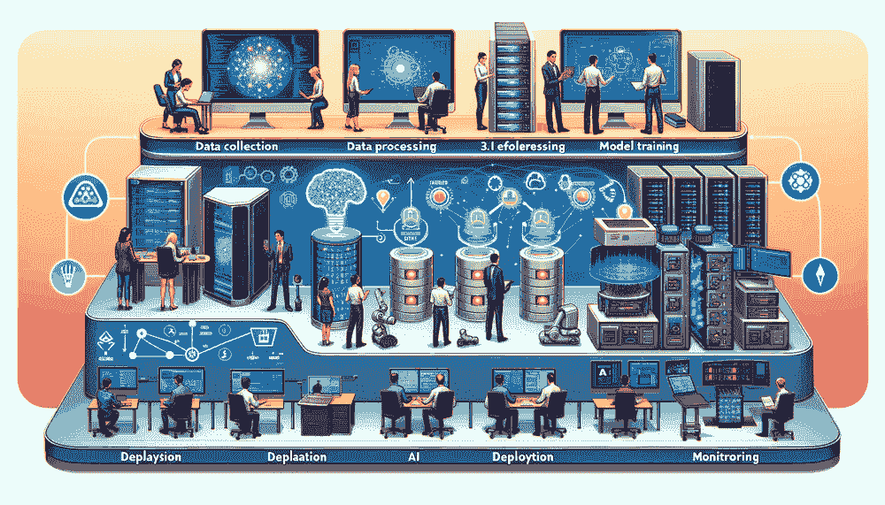

# 机器学习操作

*DALL·E 3 提示：创建一个详细、宽矩形的人工智能工作流程插图。图像应展示六个阶段的过程，从左到右流动：1. 数据收集，不同性别和血统的多样化个体使用各种设备（如笔记本电脑、智能手机和传感器）收集数据。2. 数据处理，显示一个数据中心，活跃的服务器和带有发光灯的数据库。3. 模型训练，由带有代码、神经网络图和进度指示器的计算机屏幕表示。4. 模型评估，展示人们在大型显示器上检查数据分析。5. 部署，AI 集成到机器人、移动应用和工业设备中。6. 监控，显示专业人士在仪表板上跟踪 AI 性能指标，以检查准确性和概念漂移随时间的变化。每个阶段应清晰标记，风格应简洁、现代，并具有动态和富有信息量的色彩方案。*



## 目的

*为什么在开发环境中运行完美的机器学习原型在部署到生产环境时往往失败得非常惨烈？*

从原型模型到可靠的生产系统的过渡带来了重大的工程挑战。在干净数据集上训练的研究模型会遇到具有变化的数据分布、演变的用户行为和意外系统故障的生产环境。与执行确定性逻辑的传统软件不同，机器学习系统表现出概率行为，当现实条件与训练假设相偏离时，这种行为会无声地退化。这种不稳定性需要操作实践来检测性能退化，在影响用户之前自动重新训练模型，并在预测不确定性下保持系统可靠性。成功需要将实验验证和生产可靠性连接起来的工程学科，使组织能够部署在整个运营生命周期中保持有效的模型。

**学习目标**

+   区分传统软件故障和机器学习系统的静默故障，以解释为什么 MLOps 成为一门独立的工程学科

+   分析机器学习系统中的技术债务模式（边界侵蚀、纠正级联、数据依赖），并提出系统性的工程解决方案

+   设计解决机器学习特定挑战的 CI/CD 管道，包括模型验证、数据版本化和自动化重新训练工作流程

+   评估用于检测传统系统指标和机器学习特定指标（如数据漂移和预测置信度）的生产机器学习系统的监控策略

+   实施适用于不同环境（包括云服务、边缘设备和联邦学习系统）的部署模式

+   评估组织在有效实施 MLOps 方面的成熟度水平

+   通过分析特定要求（如医疗保健、嵌入式系统）如何重塑运营框架来比较 MLOps 在不同领域的适应性

+   创建治理框架，确保在受监管环境中模型的可重复性、可审计性和合规性

## 机器学习操作简介

传统软件会通过错误信息和堆栈跟踪大声失败；机器学习系统则默默失败。如第一章所述，沉默失败问题是机器学习系统的定义特征：随着数据分布的变化、用户行为的演变和模型假设的过时，性能逐渐下降，而没有任何警报。MLOps 是旨在使这些沉默失败变得可见和可管理的工程学科。它提供了监控、自动化和治理，以确保数据驱动系统在周围世界变化的情况下在生产中保持可靠性。

机器学习系统需要的不仅仅是算法创新；它们还需要系统性的工程实践以确保可靠的生产部署。虽然第十四章探讨了资源受限下的分布式学习，第十六章建立了容错方法，但第十五章中的安全框架对于生产部署变得至关重要。机器学习操作（MLOps）1 提供了将这些专门能力综合成一致生产架构的学科框架。这种运营学科解决了将实验成功转化为可持续系统性能的挑战，将自适应学习、安全协议和弹性机制整合到复杂的生产生态系统中。

MLOps (第 13.2.2 节) 系统性地整合了机器学习方法、数据科学实践和软件工程原则，以实现自动化、端到端的生命周期管理。这种运营范式连接了实验验证和生产部署，确保验证过的模型在适应现实世界运营环境的同时保持其性能特征。

考虑部署一个针对共享出行服务的需求预测系统。虽然受控的实验验证可能显示出优越的准确性和延迟特性，但生产部署会引入超出算法性能的挑战。数据流表现出不同的质量，时间模式会经历季节性变化，预测服务必须在满足严格的可用性要求的同时保持实时响应能力。MLOps 提供了解决这些运营复杂性的框架。

作为一门工程学科，MLOps 建立了标准化的协议、工具和工作流程，这些有助于将验证过的模型从实验环境过渡到生产系统。该学科通过正式化接口和定义传统上隔离的领域（包括数据科学、机器学习工程和系统运营）的责任来促进协作 2。这种方法使得适应机器学习环境的持续集成和部署实践成为可能，支持迭代模型优化、验证和部署，同时保持系统稳定性和操作可靠性。

在这些操作基础之上，成熟的 MLOps 方法论通过自动化和监控框架改变了组织管理机器学习系统的方式。这些实践使得在新数据可用时能够持续进行模型再训练，评估与生产基线不同的架构，通过分阶段推出策略控制实验性修改的部署，以及在不影响操作连续性的情况下进行实时性能评估。这种操作灵活性确保了模型的相关性持续，同时保持系统可靠性标准。

除去操作效率之外，MLOps 还包括治理框架和问责机制，这些在系统规模扩大时变得至关重要。MLOps 标准化了模型版本跟踪、数据血缘文档和配置参数管理，建立了可重复和可审计的工件轨迹。这种严谨性在模型可解释性和操作溯源构成合规要求的监管领域证明是必不可少的。

这种方法论严谨性的实际益处体现在组织成果上。证据表明，采用成熟的 MLOps 方法论的组织在部署可靠性、缩短上市周期和增强系统可维护性方面取得了显著改进 3。该学科框架使得机器学习系统的可持续扩展成为可能，同时保持基准测试阶段验证的性能特征，确保操作与实验结果的一致性。

这种机器学习操作方法论为将理论创新转化为可持续的生产能力提供了途径。本章建立了连接实验验证系统和操作可靠的生产部署之间差距所需的工程基础。分析特别关注集中式云计算环境，其中监控基础设施和管理能力使得实施成熟操作实践成为可能，以支持大规模机器学习系统。

虽然第十章和第九章建立了优化基础，但本章将这些技术扩展到需要持续维护和监控的生产环境。在第十二章[（ch018.xhtml#sec-benchmarking-ai）]中建立的经验基准方法为生产性能评估提供了方法论基础，而系统可靠性模式成为运营可用性的关键决定因素。MLOps 将这些不同的技术基础整合到统一的运维工作流程中，系统地解决从模型开发到可持续生产部署的基本挑战。

本章探讨了 MLOps 的理论基础和实践动机，追溯了其从 DevOps 方法论中的学科演变，并确定了影响其在当代机器学习系统架构中采用的主要挑战和既定实践。

## 历史背景

理解从 DevOps 到 MLOps 的这种演变，可以阐明为什么传统的运维实践需要适应机器学习系统。以下对这一历史发展的考察揭示了推动 MLOps 作为一门独立学科的具体挑战。

MLOps 的根源在于 DevOps，它是一套将软件开发（Dev）和 IT 运维（Ops）相结合的实践，以缩短开发周期并支持高质量软件的持续交付。DevOps 和 MLOps 都强调自动化、协作和迭代改进。然而，尽管 DevOps 是为了解决软件部署和运维管理中的挑战而出现的，但 MLOps 是为了应对机器学习工作流程的独特复杂性而演变的，特别是那些涉及数据驱动组件的工作流程(Breck 等人 2017b)。理解这一演变对于理解现代 ML 系统的动机和结构至关重要。

### DevOps

“DevOps”这个术语是在 2009 年由顾问和敏捷实践者[帕特里克·德博伊斯](https://www.jedi.be/)提出的，他在比利时根特组织了首届[DevOpsDays](https://www.devopsdays.org/)会议。DevOps 通过将 IT 运维纳入其中，扩展了[敏捷](https://agilemanifesto.org/)运动的原则，该运动强调开发团队之间的紧密协作和快速、迭代的发布。

这项创新解决了传统软件管道中的核心问题，即开发和运维团队在孤岛中工作，造成效率低下、延误和优先级错位。DevOps 应运而生，倡导共同拥有权、基础设施即代码 4 和自动化，以简化部署管道。

为了支持这些原则，诸如[Jenkins](https://www.jenkins.io/)5、[Docker](https://www.docker.com/)6 和[Kubernetes](https://kubernetes.io/)7 等工具成为实施持续集成和持续交付（CI/CD）实践的基础。

通过自动化和反馈循环，DevOps 促进了协作，同时减少了发布时间并提高了软件可靠性。这一成功为将类似原则扩展到机器学习领域奠定了文化和技术基础。

### MLOps

虽然 DevOps 在传统软件部署中取得了相当大的成功，但机器学习系统引入了新的挑战，需要进一步的适应。MLOps 建立在 DevOps 的基础上，但解决了 ML 系统开发和部署的具体需求。DevOps 专注于集成和交付确定性软件，而 MLOps 必须管理非确定性、数据依赖的工作流程。这些工作流程包括数据采集、预处理、模型训练、评估、部署和持续监控（见图 13.1）。

**机器学习运营（MLOps）**是管理生产中机器学习系统**全生命周期**的工程学科，解决**数据版本控制**、**模型演变**和**持续重新训练**的独特挑战。

当检查现实世界的失败时，不采用系统化工程实践部署机器学习的运营复杂性和商业风险变得显而易见。考虑一家零售公司，它部署了一个推荐模型，最初通过提高销售额 15%来提升业绩。然而，由于一个静默的数据漂移问题，该模型的精度在六个月内逐渐下降，最终与原始系统相比减少了 5%的销售额。由于监控的重点是系统正常运行时间而不是模型性能指标，问题未被发现。在常规季度分析期间发现问题时，公司损失了估计 1000 万美元的收入。这种场景在早期机器学习部署中很常见，说明了为什么 MLOps，其强调持续模型监控和自动重新训练，不仅仅是一个工程最佳实践，而且是依赖机器学习系统进行关键运营的组织的一个商业必要性。

这种适应是由在机器学习运营中反复出现的几个挑战所驱动的，这些挑战使其与传统软件部署区分开来。数据漂移 8，即输入数据分布随时间的变化会降低模型精度，需要持续的监控和自动重新训练程序。

在这个以数据为中心的挑战的基础上，可重复性 9 提出了另一个问题。机器学习工作流程缺乏标准化的机制来跟踪代码、数据集、配置和环境，这使得重现过去的实验变得困难(Schelter 等人，2018)。复杂模型缺乏可解释性推动了工具的需求，这些工具可以增加模型的可透明性和可解释性，尤其是在受监管的领域。


图 13.1：**MLOps 生命周期**：MLOps 将 DevOps 原则扩展到管理机器学习系统的独特挑战，包括数据版本控制、模型重新训练和持续监控。此图概述了包含数据工程、模型开发和可靠部署的迭代工作流程，以在生产中实现持续的性能。

除了这些基础挑战之外，组织还面临着额外的运营复杂性。模型部署后的性能监控证明是困难的，尤其是在检测静默故障或用户行为变化方面。在重新训练和重新部署模型中涉及的手动开销在实验和迭代中产生了摩擦。配置和维护机器学习基础设施复杂且容易出错，突显了需要提供优化、模块化和可重用基础设施的平台。这些挑战共同构成了关注自动化、协作和生命周期管理的 MLOps 实践的基础。

为了应对这些独特的挑战，该领域开发了专门的工具和工作流程，这些工具和工作流程针对机器学习生命周期进行了定制。在 DevOps 的基础上解决机器学习特定的需求，MLOps 协调更广泛的利益相关者生态系统，并引入了数据版本控制 10、模型版本控制和模型监控等专门实践，这些实践超越了传统的 DevOps 范围。这些实践在表 13.1 中详细说明：

表 13.1：**MLOps 与 DevOps**：MLOps 将 DevOps 原则扩展到解决机器学习系统的独特需求，包括数据和模型版本控制，以及针对模型性能和数据漂移的持续监控。此表阐明了 MLOps 如何协调更广泛的利益相关者，并强调在传统软件开发工作流程之外的可重复性和可扩展性。

| **方面** | **DevOps** | **MLOps** |
| --- | --- | --- |
| **目标** | 简化软件开发和运营流程 | 优化机器学习模型的整个生命周期 |
| **方法** | 软件开发的持续集成和持续交付（CI/CD） | 类似于 CI/CD，但专注于机器学习工作流程 |
| **主要工具** | 版本控制（Git）、CI/CD 工具（Jenkins、Travis CI）、配置管理（Ansible、Puppet） | 数据版本控制工具、模型训练和部署工具、针对 ML 的 CI/CD 管道 |
| **主要关注点** | 代码集成、测试、发布管理、自动化、基础设施即代码 | 数据管理、模型版本控制、实验跟踪、模型部署、ML 工作流程的可扩展性 |
| **典型结果** | 更快、更可靠的软件发布，开发和运维团队之间的协作改进 | 机器学习模型的有效管理和部署，数据科学家和工程师之间的协作增强 |

在确立了这些基础区别之后，我们必须首先了解推动复杂 MLOps 实践的独特运营挑战，然后再考察旨在解决这些挑战的基础设施和实践。 

## 技术债务与系统复杂性

虽然 DevOps 基础设施提供了自动化和协作原则，但机器学习系统引入了独特的复杂性形式，这需要工程方法来有效管理。与传统的软件不同，其中损坏的代码会立即失败，ML 系统可以通过数据变化、模型交互和不断变化的需求悄无声息地退化。虽然联邦学习系统面临独特的协调挑战（第十四章）和鲁棒系统需要仔细监控（第十六章），但所有部署环境都必须在运营效率与安全需求之间取得平衡。理解这些被称为技术债务的运营挑战对于激励后续的工程解决方案和实践至关重要。

这种复杂性在机器学习系统成熟和扩展时显现出来，它们积累了技术债务：在开发期间做出的便捷设计决策的长期成本。最初在 1990 年代提出于软件工程中 11，这个比喻将实施中的捷径与金融债务相比较：它可能允许短期速度，但需要持续的利益支付，形式为维护、重构和系统风险。


图 13.2：**ML 系统复杂性**：在典型的机器学习系统中，大部分工程努力集中在围绕模型本身的组件上（数据收集、特征工程和系统配置），而不是模型代码。这种分布突出了运营挑战和潜在的技术债务，这些往往是被忽视的 ML 系统领域。来源：(Sculley 等人 2021)。

这些运营挑战在机器学习系统演变过程中表现为几种不同的模式，团队在遇到这些模式时。我们不是列举每一个债务模式，而是关注代表性的例子，这些例子说明了 MLOps 提供的工程方法。每个挑战都源于机器学习工作流程的独特特征：它们依赖于数据而不是确定性逻辑，它们具有统计行为而不是精确行为，以及它们倾向于通过数据流而不是显式接口创建隐式依赖。

以下技术债务模式展示了为什么传统的 DevOps 实践需要扩展以适应机器学习系统，这激励了后续章节中提出的基础设施解决方案。

基于这种系统视角，我们检查了机器学习系统特有的关键技术债务类别（图 13.3）。每个小节都突出了常见的来源、示例和工程解决方案，这些解决方案解决了这些挑战。虽然某些形式的债务在早期开发过程中可能不可避免，但了解其成因和影响使得工程师能够通过纪律性的架构实践和适当的工具选择来设计健壮且可维护的机器学习系统。


图 13.3：**机器学习技术债务分类法**：机器学习系统积累的技术债务形式来自数据依赖、模型交互和不断变化的需求。这个中心辐射图展示了主要的债务模式：边界侵蚀破坏了模块化，修正级联通过依赖关系传播修复，反馈循环创造了隐藏的耦合，而数据、配置和管道债务反映了管理不善的工件和工作流程。理解这些模式使得系统性地进行债务预防和缓解的工程方法成为可能。

### 边界侵蚀

在传统的软件系统中，模块化和抽象提供了组件之间的清晰边界，允许变化被隔离，行为保持可预测。相比之下，机器学习系统往往模糊了这些边界。数据管道、特征工程、模型训练和下游消费之间的交互往往导致紧密耦合的组件，接口定义不明确。

这种边界的侵蚀使得机器学习系统特别容易受到即使是微小变化引起的级联效应的影响。对预处理步骤或特征转换的看似微小的更新可能会以意想不到的方式在整个系统中传播，破坏管道中其他地方做出的假设。这种缺乏封装增加了纠缠的风险，其中组件之间的依赖变得如此交织，以至于局部修改需要全局理解和协调。

这种问题的表现之一被称为 CACHE（任何变化都会改变一切）。当系统在没有强大边界的情况下构建时，调整特征编码、模型超参数或数据选择标准可能会以不可预测的方式影响下游行为。这阻碍了迭代，使测试和验证更加复杂。例如，改变数值特征的分箱策略可能会导致先前调优的模型表现不佳，触发重新训练和下游评估变化。

为了减轻边界侵蚀，团队应优先考虑支持模块化和封装的架构实践。设计具有明确定义接口的组件，使团队能够隔离故障、推理变化并降低系统级回归的风险。例如，明确区分数据摄取与特征工程，以及特征工程与建模逻辑，引入了可以独立验证、监控和维护的层。

边界侵蚀在早期开发中往往是不可见的，但随着系统规模的扩大或需要适应时，它成为一个重大的负担。然而，成熟的软件工程实践可以有效地预防和减轻这个问题。主动的设计决策，保留抽象并限制相互依赖性，结合系统性的测试和接口文档，为管理复杂性和避免长期维护成本提供了实际解决方案。

这个挑战产生的原因是机器学习系统以统计保证而非逻辑保证运行，这使得传统的软件工程边界更难执行。理解边界侵蚀为何如此频繁地发生需要检查机器学习工作流程与传统软件开发之间的差异。

机器学习系统中的边界侵蚀违反了既定的软件工程原则，特别是 Demeter 法则和最少知识原则。而传统的软件通过显式接口和信息隐藏实现模块化，机器学习系统通过绕过这些显式边界的流程创建隐式耦合。

CACHE 现象代表了 Liskov 替换原则的崩溃，其中组件修改违反了依赖组件预期的行为合同。与具有编译时保证的传统软件不同，机器学习系统以统计行为运行，这创造了本质上不同的耦合模式。

挑战在于协调传统模块化概念与机器学习工作流程固有的相互关联性，其中统计依赖和数据驱动行为创造了传统软件工程框架未设计来处理的耦合模式。

### 纠正级联

随着机器学习系统的演变，它们通常经历迭代优化来解决性能问题、适应新要求或适应环境变化。在精心设计的系统中，此类更新是局部化和通过模块化更改管理的。然而，在机器学习系统中，即使是小的调整也可能触发纠正级联，这是一系列依赖性修复，它们在工作流程中向前和向后传播。

图 13.4 中的图表展示了这些级联效应如何在机器学习系统开发中传播。理解这些级联的结构有助于团队预测和减轻其影响。

图 13.4 展示了这些级联效应如何在机器学习生命周期的不同阶段出现，从问题定义和数据收集到模型开发和部署。每个弧线代表一个纠正措施，颜色表示不同不稳定来源，包括不充分的领域专业知识、脆弱的现实世界接口、激励不匹配和文档不足。红色箭头代表级联修订，而底部虚线箭头突出显示了一个完整的系统重启，这是一种极端但有时是必要的后果。


图 13.4：**纠正级联**：在机器学习系统中，迭代优化经常触发工作流程中的依赖性修复，从初始调整通过数据、模型和部署阶段进行传播。彩色弧线表示源自不稳定来源的纠正措施，而红色箭头和虚线表示升级修订，可能需要完全的系统重启。

纠正级联的一个常见来源是顺序模型开发：重用或微调现有模型以加速新任务的开发。虽然这种策略通常效率很高，但它可能会引入难以解开的隐藏依赖。早期模型中嵌入的假设成为未来模型的隐含约束，限制了灵活性并增加了下游纠正的成本。

考虑一个场景，一个团队对一个新产品的客户流失预测模型进行微调。原始模型可能嵌入特定于产品的行为或特征编码，在新环境中可能不适用。随着性能问题出现，团队可能会尝试修补模型，但最终发现真正的问题可能位于几个层次之上，可能在原始特征选择或标记标准中。

为了避免或减少纠正级联的影响，团队必须在重用和重新设计之间做出谨慎的权衡。几个因素影响这一决策。对于小型、静态数据集，微调可能是合适的。对于大型或快速变化的数据集，从头开始重新训练提供了更大的控制和适应性。微调还需要的计算资源较少，使其在受限环境中具有吸引力。然而，由于这些级联效应，后来修改基础组件变得极其昂贵。

因此，应仔细考虑引入新的模型架构，即使资源密集，以避免后续出现纠正级联。这种方法可能有助于减轻下游问题的放大效应，并减少技术债务。然而，仍然存在一些场景，顺序模型构建是有意义的，需要仔细平衡机器学习开发过程中的效率、灵活性和长期可维护性。

要理解为什么尽管遵循最佳实践，纠正级联在机器学习系统中仍然如此持久，有助于检查驱动这一现象的潜在机制。纠正级联模式源于违反软件工程中建立的系统模块性原则的隐藏反馈循环。当模型 A 的输出影响模型 B 的训练数据时，这会创建出破坏模块化设计的隐式依赖。这些依赖尤其隐蔽，因为它们通过数据流而不是显式代码接口操作，使得它们对传统的依赖分析工具不可见。

从系统理论的角度来看，纠正级联代表了看似独立的组件之间的紧密耦合实例。级联传播遵循幂律分布，其中小的初始变化可以触发不成比例的系统级重大修改。这一现象与复杂系统中的蝴蝶效应相似，其中微小的扰动通过非线性相互作用放大。

理解这些理论基础有助于工程师认识到，防止纠正级联不仅需要更好的工具，还需要在存在学习组件的情况下，保持系统模块化的架构决策。挑战在于设计机器学习系统，即使数据驱动工作流程本质上具有互联性，也能保持松散耦合。

### 接口和依赖挑战

与传统软件中组件通过显式 API 进行交互不同，机器学习系统通常通过数据流和共享输出发展出隐式依赖。两个关键模式说明了这些挑战：

**未声明的消费者**：模型输出经常为下游组件提供服务，而没有正式的跟踪或接口合同。当模型演化时，这些隐藏的依赖关系可能会无声地中断。例如，信用评分模型的输出可能为资格引擎提供数据，这会影响未来的申请人池和训练数据，从而创建未跟踪的反馈循环，随着时间的推移，这些循环会偏袒模型行为。

**数据依赖债务**：机器学习管道积累不稳定和利用率低的数据依赖，这些依赖难以追踪或验证。特征工程脚本、数据连接和标签约定缺乏传统软件开发中可用的依赖分析工具。当数据源的结构或分布发生变化时，下游模型可能会意外失败。

**工程解决方案**：这些挑战需要系统性的方法，包括对模型输出实施严格的访问控制、与文档化模式建立正式的接口合同、数据版本化和血缘跟踪系统，以及对预测使用模式的全面监控。后续章节中提出的 MLOps 基础设施模式提供了这些解决方案的具体实现。

### 系统演化挑战

随着机器学习系统的成熟，它们面临着独特的演化挑战，这些挑战与传统软件有根本性的区别：

**反馈循环**：模型通过生成数据影响它们自己的未来行为。推荐系统是这一点的例证：建议的项目塑造用户点击，这些点击成为训练数据，可能产生自我强化的偏差。这些循环破坏了数据独立性的假设，并且可能掩盖几个月的性能下降。

**管道和配置债务**：机器学习工作流程往往演变成“管道丛林”，其中包含临时的脚本和碎片化的配置。没有模块化接口，团队会构建重复的管道而不是重构脆弱的管道，导致处理和维护负担不一致。

**早期阶段捷径**：快速原型设计鼓励在训练代码中嵌入业务逻辑和未记录的配置更改。虽然这些捷径对于创新是必要的，但随着系统跨团队扩展，它们成为负债。

**工程解决方案**：管理演化需要架构纪律，包括基于群体的监控以检测循环、使用工作流程编排工具的模块化管道设计，以及将配置视为一等系统组件，并使用版本控制和验证。

### 现实世界技术债务示例

隐藏的技术债务不仅仅是理论上的；它在塑造现实世界机器学习系统的轨迹中发挥了关键作用。以下示例说明了未看到的依赖关系和错误的假设如何悄然积累，最终成为重大的负债：

#### YouTube：反馈循环债务

YouTube 的推荐引擎因推广耸人听闻或两极分化内容而受到反复批评 12。这部分原因源于反馈循环债务：推荐影响用户行为，反过来又成为训练数据。随着时间的推移，这导致了内容无意中的放大。缓解这一问题需要重大的架构改造，包括基于群体的评估、延迟标记以及更明确的参与度指标和排名逻辑之间的解耦。

#### Zillow：纠正级联失败

Zillow 的房屋估值模型（Zestimate）在其 iBuying 业务期间经历了显著的纠正级联 13。当初始估值错误传播到购买决策中时，追溯性纠正引发了系统不稳定，需要数据重新验证、模型重新设计，最终导致整个系统回滚。该公司于 2021 年关闭了 iBuying 部门，称模型不可预测性和数据反馈效应为核心挑战。

#### 特斯拉：未声明的消费者债务

在早期部署中，特斯拉的 Autopilot 基于模型做出驾驶决策，这些模型的输出被重新用于多个子系统，而没有明确的边界。空中更新偶尔会引入无声的行为变化，以不可预测的方式影响多个子系统（例如，车道居中和制动）。这种纠缠说明了未声明的消费者债务以及跳过严格接口治理在机器学习赋能的安全关键系统中的风险。

#### Facebook：配置债务

Facebook 的新闻推送算法经历了多次迭代，通常是由快速实验驱动的。然而，缺乏一致的配置管理导致了不透明的设置，这些设置影响了内容排名，但没有明确的文档记录。因此，算法行为的变更难以追踪，不匹配的配置产生了意外的后果。这种情况突出了在机器学习系统中将配置视为一等公民的重要性。

这些现实世界的例子展示了机器学习系统中技术债务的普遍性以及为什么传统的 DevOps 实践需要系统性的扩展。以下的基础设施和生产操作部分展示了针对这些具体挑战设计的具体工程解决方案：特征存储解决数据依赖债务，版本控制系统实现可重复的配置，监控框架检测反馈循环，模块化管道架构防止技术债务积累。这种对操作挑战的理解为接下来我们考察的专业 MLOps 工具和实践提供了基本动机。

## 开发基础设施和自动化

在上述运营挑战的基础上，本节探讨了基础设施和开发组件，这些组件使前几章中提到的专用功能成为可能，同时解决系统性挑战。这些基础组件必须支持边缘设备联邦学习协调（第十四章）、实现具有隐私保证的安全模型服务（第十五章）以及维护对分布变化的鲁棒性监控（第十六章）。它们形成一个分层架构，如图图 13.5 所示，将各种要求整合为一个统一的运营框架。了解这些组件如何相互作用，使从业者能够设计出同时实现边缘效率、安全合规性和容错性，同时保持运营可持续性的系统。


图 13.5：**MLOps 堆栈层**：模块化架构组织机器学习系统组件，从模型开发和编排到基础设施，促进自动化、可重复性和可扩展部署。每一层都建立在下一层之上，促进跨团队合作，并支持整个 ML 生命周期，从初始实验到长期生产维护。

### 数据基础设施和准备

可靠的机器学习系统依赖于结构化、可扩展和可重复的数据处理。从数据被摄入的那一刻起，到它用于预测的那一刻，每个阶段都必须保持质量、一致性和可追溯性。在运营环境中，数据基础设施不仅支持初始开发，还支持持续的重训练、审计和服务，需要系统化地处理数据在整个机器学习生命周期中的转换和版本控制。

#### 数据管理

基于第六章中的数据工程基础，数据收集、预处理和特征转换被正式化为系统化的运营流程。在 MLOps 中，这些任务被扩展为可重复、自动化的工作流程，确保数据可靠性、可追溯性和运营效率。在这种设置中，数据管理不仅包括初始准备，还包括在整个机器学习系统生命周期中对数据工件持续的处理。

这一运营基础的核心是数据集版本控制，它通过跟踪数据演变（参见第 13.4.1.3 节中的实现细节）来实现可重复的模型开发。例如，[DVC](https://dvc.org/)等工具使团队能够在由[Git](https://git-scm.com/)管理的代码存储库中版本控制大型数据集，确保数据血缘得到保留，实验可重复。

这个版本控制基础使得更复杂的数据管理能力成为可能。例如，监督学习管道需要一致和良好管理的注释工作流程。如[Label Studio](https://labelstud.io/)之类的标签工具支持可扩展的基于团队的注释，并具有集成审计跟踪和版本历史。这些能力在生产环境中至关重要，因为标签规范会随着时间的推移而演变，或需要在项目的多个迭代中进一步完善。

除了注释工作流程之外，操作环境需要支持安全、可扩展和协作访问的数据存储。基于云的对象存储系统，如[Amazon S3](https://aws.amazon.com/s3/)和[Google Cloud Storage](https://cloud.google.com/storage)，提供耐用性和细粒度访问控制，非常适合管理原始和经过处理的数据工件。这些系统通常作为下游分析、模型开发和部署工作流程的基础。

在这个存储基础上，MLOps 团队构建自动化的数据管道，将原始数据转换为分析或推理准备好的格式。这些管道执行结构化任务，如数据摄取、模式验证、去重、转换和加载。包括[Apache Airflow](https://airflow.apache.org/)、[Prefect](https://www.prefect.io/)和[dbt](https://www.getdbt.com/)在内的编排工具通常用于定义和管理这些工作流程。当作为代码管理时，管道支持版本控制、模块化和与 CI/CD 系统的集成。

随着这些自动化管道在组织中的扩展，它们自然会遇到大规模特征管理的挑战。现代数据基础设施的一个重要元素是特征存储库，这一概念由 Uber 的 Michelangelo 平台团队在 2017 年首创。他们在意识到特征工程正在数百个机器学习模型中重复后创造了这个术语。他们的解决方案，一个集中的“特征存储库”，成为了启发 Feast、Tecton 和其他数十个平台的模板。

特征存储库集中管理工程特征，以便在模型和团队之间重复使用（详细说明见第 13.4.1.2 节）。

为了在实践中说明这些概念，可以考虑一个工业环境中的预测性维护应用。通过 Airflow 管理的预定管道，连续的传感器数据被摄取并与历史维护日志连接。这些结果特征，包括滚动平均值和统计聚合，存储在特征存储库中，用于重新训练和低延迟推理。此管道经过版本控制、监控，并与模型注册表集成，从而实现了从数据到部署模型预测的完整可追溯性。

这种全面的数据管理方法远远超出了确保数据质量的范畴，建立了支持模型可重复性、可审计性和大规模持续部署的运营骨干。没有稳健的数据管理，下游训练、评估和服务过程的完整性无法得到保证，使得特征存储成为基础设施的关键组成部分。

#### 特征存储

特征存储 14 在数据工程和机器学习之间提供了一个抽象层。它们的主要目的是在训练和推理工作流程中实现工程特征的持续、可靠访问。在传统的管道中，特征工程逻辑被重复、手动重新实现或在不同的环境中出现分歧。这引入了训练-服务偏差 15（训练和生产的特征不同）、数据泄露和模型漂移的风险。

为了解决这些挑战，特征存储在集中式存储库中管理离线（批量）和在线（实时）特征访问。当部署第十章中讨论的优化模型时，这一点变得至关重要，因为环境间的特征一致性对于保持模型准确性至关重要。在训练期间，特征在批量环境中计算并存储，通常与历史标签一起。在推理时间，相同的转换逻辑应用于在线服务系统中的新鲜数据。这种架构确保模型在两种环境中都消耗相同特征，促进了一致性并提高了可靠性。

除了在训练和部署环境中的一致性之外，特征存储还支持跨团队进行版本控制、元数据管理和特征重用。例如，欺诈检测模型和信用评分模型依赖于重叠的交易特征，这些特征可以集中维护、验证和共享。这减少了工程开销，并支持用例之间的对齐。

特征存储可以与数据管道和模型注册表集成，从而实现血缘跟踪和可追溯性。当特征被更新或弃用时，相关的模型将被识别并相应地重新训练。这种集成增强了机器学习系统的运营成熟度，并支持审计、调试和合规工作流程。

#### 版本控制和血缘关系

版本控制对于机器学习系统的可重复性和可追溯性至关重要。与传统的软件不同，机器学习模型依赖于多个不断变化的工件：训练数据、特征工程逻辑、训练模型参数和配置设置。为了管理这种复杂性，MLOps 实践强制执行对所有管道组件的版本跟踪。

在此跟踪系统的基石上，数据版本控制允许团队在特定时间点快照数据集，并将它们与特定的模型运行关联起来。这包括原始数据（例如，输入表或日志流）和经过处理的工件（例如，清洗后的数据集或特征集）。通过维护模型检查点和用于训练的数据之间的直接映射，团队能够审计决策、重现结果并调查回归。

与数据版本控制相辅相成的是，模型版本控制涉及将训练好的模型注册为不可变工件，同时包括训练参数、评估指标和环境规范等元数据。这些记录保存在模型注册表中，该注册表提供了一个结构化的接口，用于提升、部署和回滚模型版本。一些注册表还支持血缘可视化，它追踪从原始数据到部署预测的完整依赖图。

这些互补的版本控制实践共同构成了机器学习系统的血缘层。这一层实现了自我检查、实验和治理。当部署的模型表现不佳时，血缘工具帮助团队回答诸如以下问题：

+   输入分布是否与训练数据一致？

+   特征定义是否发生了变化？

+   模型版本是否与服务基础设施对齐？

通过将版本控制和血缘关系提升到系统设计中的第一类公民，MLOps 使团队能够以规模化的方式构建和维护可靠、可审计和可演进的机器学习工作流程。

### 持续管道和自动化

自动化使机器学习系统能够持续地根据新数据、变化的目标和运营限制进行演变。而不是将开发和部署视为孤立的阶段，自动化的管道允许同步的工作流程，这些工作流程整合了数据预处理、训练、评估和发布。这些管道为可扩展的实验提供了基础，并确保了生产中模型更新的可重复性和可靠性。

#### CI/CD 管道

虽然传统的软件系统依赖于持续集成和持续交付（CI/CD）管道以确保代码更改可以高效地进行测试、验证和部署，但机器学习系统需要重大的调整。在机器学习系统的背景下，CI/CD 管道必须处理由数据依赖、模型训练工作流程和工件版本控制引入的额外复杂性。这些管道提供了一个结构化的机制，以可重复、可扩展和自动化的方式将机器学习模型从开发过渡到生产。

在这些改进的基础上，典型的机器学习 CI/CD 流水线包括几个协调阶段，包括：检出更新代码、预处理输入数据、训练候选模型、验证其性能、打包模型以及将其部署到服务环境。在某些情况下，流水线还包括基于数据漂移或性能退化的自动重训练触发器。通过将这些步骤编码化，CI/CD 流水线 16 减少了人工干预，强制执行质量检查，并支持已部署系统的持续改进。

为了支持这些复杂的流程，有一系列工具可用于实现专注于机器学习的 CI/CD 工作流程。通用 CI/CD 编排器，如[Jenkins](https://www.jenkins.io/)、[CircleCI](https://circleci.com/)和[GitHub Actions](https://github.com/features/actions)17，管理版本控制事件和执行逻辑。这些工具与特定领域的平台集成，如[Kubeflow](https://www.kubeflow.org/)18、[Metaflow](https://metaflow.org/)和[Prefect](https://www.prefect.io/)，它们为管理机器学习任务和工作流程提供了更高层次的抽象。

图 13.6 展示了一个机器学习系统的代表性 CI/CD 流水线。该过程从数据集和特征库开始，从中摄取并验证数据。验证后的数据随后被转换以用于模型训练。重训练触发器，如计划任务或性能阈值，自动启动此过程。一旦训练和超参数调整完成，生成的模型将根据预定义的标准进行评估。如果模型满足所需的阈值，它将连同元数据、性能指标和血缘信息一起注册到模型库中。最后，模型被部署回生产系统，完成闭环，并实现更新模型的持续交付。


图 13.6：**机器学习 CI/CD 流水线**：通过集成版本控制、测试和部署，自动工作流程简化了模型开发，使更新模型能够持续交付到生产环境中。此流水线强调数据与模型验证、自动重训练触发器以及带有元数据的模型注册，以实现可重复性和治理。来源：HarvardX。

为了在实践中说明这些概念，可以考虑一个正在积极开发中的图像分类模型。当数据科学家向 [GitHub](https://github.com/) 仓库提交更改时，Jenkins 流程被触发。该流程获取最新数据，执行预处理，并启动模型训练。实验使用 [MLflow](https://mlflow.org/) 进行跟踪，该工具记录指标并存储模型工件。通过自动评估测试后，模型被容器化并部署到预发布环境，使用的是 [Kubernetes](https://kubernetes.io/)。如果模型在预发布环境中满足验证标准，流程将协调控制部署策略，如金丝雀测试（在第 13.4.2.3 节中详细说明），逐渐将生产流量路由到新模型，同时监控关键指标以检测异常。在性能回归的情况下，系统可以自动回滚到先前模型版本。

通过这些全面的自动化能力，CI/CD 流程在实现可扩展、可重复和安全的机器学习模型部署中发挥着核心作用。通过将 ML 工作流程的不同阶段统一到持续自动化之下，这些流程支持更快的迭代、更好的可重复性和生产系统中的更大弹性。在成熟的 MLOps 环境中，CI/CD 不是一个可选层，而是一个基础能力，它将临时实验转变为结构化和操作上合理的开发过程。

#### 训练流程

模型训练是机器学习生命周期中的关键阶段，其中算法被优化以从数据中学习模式。在 第八章 中介绍的分布式训练概念的基础上，我们探讨如何通过系统流程实现训练工作流程的运营化。在 MLOps 的背景下，这些活动被重新定义为可重复、可扩展和自动化的流程的一部分，该流程支持持续实验和可靠的 production 部署。

运营训练的基础在于现代机器学习框架，例如 [TensorFlow](https://www.tensorflow.org/)、[PyTorch](https://pytorch.org/) 和 [Keras](https://keras.io/)，它们提供了构建和训练模型的模块化组件。来自 第七章 的框架选择原则对于需要可靠扩展的生产训练流程至关重要。这些库包括神经网络组件和训练算法的高级抽象，使从业者能够高效地进行原型设计和迭代。当嵌入到 MLOps 流程中时，这些框架成为可以系统扩展、跟踪和重新训练的训练过程的基础。

在这些框架基础之上，可重复性成为 MLOps 的关键目标。使用如[Git](https://git-scm.com/)等工具对训练脚本和配置进行版本控制，并托管在如[GitHub](https://github.com/)等平台上。交互式开发环境，包括[Jupyter](https://jupyter.org/)笔记本，将数据摄取、特征工程、训练流程和评估逻辑封装在统一格式中。这些笔记本集成到自动化管道中，允许用于本地实验的逻辑在生产系统中的计划重新训练中被重用。

除了确保可重复性之外，自动化通过减少人工努力和标准化关键步骤进一步增强了模型训练。MLOps 工作流程结合了如[超参数调整](https://cloud.google.com/ai-platform/training/docs/hyperparameter-tuning-overview)、[神经架构搜索](https://arxiv.org/abs/1808.05377)和[自动特征选择](https://scikit-learn.org/stable/modules/feature_selection.html)等技术，以有效地探索设计空间。这些任务通过 CI/CD 管道进行编排，自动化数据预处理、模型训练、评估、注册和部署。例如，当有新的标记数据可用时，Jenkins 管道会触发重新训练作业。生成的模型将与基线指标进行比较，如果达到性能阈值，它将自动部署。

支持这些自动化工作流程，云基础设施的日益可用进一步扩大了模型训练的覆盖范围。这连接到第五章中探讨的工作流程编排模式，这些模式为在分布式系统中管理复杂的多阶段训练过程提供了基础。云服务提供商提供托管服务，提供按需配置的高性能计算资源，包括 GPU 和 TPU 加速器 19。根据平台的不同，团队可以构建自己的训练工作流程或依赖完全托管的如[Vertex AI 微调](https://cloud.google.com/vertex-ai/docs/generative-ai/models/tune-models)等服务，这些服务支持基础模型对新任务的自动适应。然而，在设计基于云的训练系统时，硬件可用性、区域访问限制和成本限制仍然是重要的考虑因素。

为了说明这些集成实践，考虑一位数据科学家使用 PyTorch 笔记本开发用于图像分类的神经网络。使用了[fastai](https://www.fast.ai/)库来简化模型构建和训练。笔记本在标记数据集上训练模型，计算性能指标，并调整模型配置参数。一旦验证通过，训练脚本将进行版本控制并纳入一个基于数据更新或模型性能监控定期触发的重新训练管道。

通过标准化工作流程、版本化环境和自动化编排，MLOps 使模型训练过程从临时的实验转变为一个强大、可重复和可扩展的系统。这不仅加速了开发，还确保了训练模型满足生产标准，包括可靠性、可追溯性和性能。

#### 模型验证

在将机器学习模型部署到生产环境之前，它必须经过严格的评估，以确保其满足预定义的性能、鲁棒性和可靠性标准。虽然前面的章节在模型开发的背景下讨论了评估，但 MLOps 将评估重新定义为验证操作准备就绪的有序和可重复的过程。它包含了支持部署前评估、部署后监控和自动化回归测试的实践。

评估过程从对保留测试集的性能测试开始，该数据集在训练或验证过程中未使用。此数据集从与生产数据相同的分布中采样，并用于衡量泛化能力。核心指标，如[准确率](https://en.wikipedia.org/wiki/Accuracy_and_precision)、[曲线下面积（AUC）](https://en.wikipedia.org/wiki/Receiver_operating_characteristic#Area_under_the_curve)、[精确率](https://en.wikipedia.org/wiki/Precision_and_recall)、[召回率](https://en.wikipedia.org/wiki/Precision_and_recall)和[F1 分数](https://en.wikipedia.org/wiki/F1_score)，被计算出来以量化模型性能。这些指标不仅用于某一时刻，而且纵向跟踪以检测退化，例如由[数据漂移](https://www.ibm.com/cloud/learn/data-drift)引起的退化，输入分布的变化会随着时间的推移降低模型准确性（参见图 13.7）。


图 13.7：**数据漂移影响**：随着时间的推移，模型性能的下降是由数据漂移引起的，其中生产数据的特征与训练数据集相偏离。纵向监控关键指标允许 MLOps 工程师检测这种漂移并触发模型重新训练或数据管道调整，以保持准确性。

除了静态评估之外，MLOps 鼓励采用受控部署策略，这些策略在模拟生产条件的同时最小化风险。一种广泛采用的方法是[金丝雀测试](https://martinfowler.com/bliki/CanaryRelease.html)，其中新模型被部署到一小部分用户或查询。在这次有限的推广期间，实时性能指标被监控以评估系统稳定性和用户影响。例如，一个电子商务平台将新的推荐模型部署到 5%的网站流量中，并观察点击率、延迟和预测准确度等指标。只有当模型表现出一致和可靠的表现时，它才会被推广到全面生产。

基于云的 ML 平台通过启用实验日志记录、请求回放和合成测试用例生成来进一步支持模型评估。这些功能允许团队在相同条件下评估不同的模型，促进比较和根本原因分析。例如，[Weights and Biases](https://wandb.ai/)等工具通过捕获训练工件、记录超参数配置和可视化实验中的性能指标来自动化这一过程。这些工具直接集成到训练和部署管道中，提高了透明度和可追溯性。

尽管自动化是 MLOps 评估实践的核心，但人工监督仍然至关重要。自动化测试可能无法捕捉到细微的性能问题，例如在罕见子群体上的泛化能力差或用户行为的变化。因此，团队将定量评估与定性审查相结合，尤其是在部署在高风险或受监管环境中的模型时。这种人工在环验证对于社会影响应用尤为重要，因为模型故障可能对易受伤害的群体产生直接后果。

这个多阶段评估过程连接了离线测试和实时系统监控，确保模型不仅满足技术基准，而且在现实世界条件下表现出可预测和负责任的行为。这些评估实践降低了部署风险，并有助于随着时间的推移维护机器学习系统的可靠性，完成了生产部署所需的发展基础设施基础。

### 基础设施集成摘要

本节中检查的基础设施和开发组件为可靠的机器学习操作奠定了基础。这些系统将临时实验转变为结构化工作流程，支持可重复性、协作和持续改进。

**数据基础设施**通过特征存储提供基础，该存储允许跨项目重用特征，版本控制系统跟踪数据谱系和演变，以及验证框架确保整个管道中的数据质量。基于第六章中的数据管理基础，这些组件将基本能力扩展到生产环境，其中多个团队和模型依赖于共享的数据资产。

**持续管道**通过为机器学习工作流程定制的 CI/CD 系统自动化 ML 生命周期。与仅关注代码的传统软件 CI/CD 不同，ML 管道在集成工作流程中协调数据验证、特征转换、模型训练和评估。训练管道特别管理模型开发的计算密集型过程，协调资源分配、超参数优化和实验跟踪。这些自动化工作流程使团队能够快速迭代，同时保持可重复性和质量标准。

**模型验证**通过超出离线指标的系统性评估将开发和生产连接起来。验证策略结合了保留数据集上的性能基准测试和在生产环境中的金丝雀测试，使团队能够在全面部署之前检测到问题。这种多阶段验证认识到模型不仅需要在静态测试集上表现良好，还需要在数据分布变化和用户行为演变的动态现实世界条件下表现良好。

这些基础设施组件通过系统性的工程能力直接解决之前确定的运营挑战：

+   特征存储和数据版本控制通过确保在训练和部署过程中对特征访问的一致性和可追踪性来解决数据依赖债务

+   CI/CD 管道和模型注册表通过受控部署和回滚机制防止纠正级联

+   自动化工作流程和谱系跟踪通过明确的依赖管理消除未声明的消费者风险

+   模块化管道架构通过可重用、定义良好的组件接口避免管道债务

然而，部署一个经过验证的模型只是生产旅程的开始。该基础设施支持可靠地开发模型，但生产运营必须解决在现实世界条件下维持系统性能的动态挑战：处理数据漂移、管理系统故障以及适应不断变化的需求而不中断服务。

## 生产运营

在上述基础设施基础上直接构建，生产操作将验证后的模型转化为在现实世界条件下保持性能的可靠服务。这些操作必须处理前几章中确立的多样化需求：在分布式边缘设备上管理模型更新而无需集中可见性（第十四章）、在运行时推理和模型更新期间维护安全控制（第十五章）以及检测来自对抗攻击或分布变化的性能退化（第十六章）。这一操作层实现了监控、治理和部署策略，使这些专门功能能够在大规模下可靠地协同工作。

本节探讨了将验证后的模型转化为能够可靠地在大规模下运行的生产服务的部署模式、服务基础设施、监控系统以及治理框架。

生产操作引入了超出模型开发的挑战。部署的系统必须处理可变负载，在多种条件下保持一致的延迟，优雅地从故障中恢复，并在不中断服务的情况下适应不断变化的数据分布。这些需求要求专门的架构、监控能力和操作实践，以补充上一节中确立的开发工作流程。

### 模型部署和服务

一旦模型经过训练和验证，就必须将其集成到生产环境中，以便能够大规模地提供预测。这个过程包括将模型及其依赖项打包，管理版本，并以符合性能、可靠性和治理要求的方式部署。部署将静态工件转化为活生生的系统组件。服务确保模型可访问、可靠，并且在响应推理请求时高效。这些组件共同连接了模型开发和现实世界的影响。

#### 模型部署

团队需要正确打包、测试和跟踪机器学习模型，以便可靠地将它们部署到生产环境中。MLOps 引入了框架和程序，以可持续的方式积极版本控制、部署、监控和更新模型。

部署的一种常见方法涉及使用容器化技术 20 对模型进行容器化。这种打包方法确保了环境间的平滑可移植性，使部署一致且可预测。

生产部署需要处理模型打包、版本管理和与服务基础设施集成的框架。像 MLflow 和模型注册表这样的工具管理这些部署工件，而服务特定的框架（在推理服务部分详细说明）处理运行时优化和扩展需求。

在全面推广之前，团队将更新的模型部署到预发布或 QA 环境中 21，以严格测试性能。

使用如影子部署、金丝雀测试 22 和蓝绿部署 23 等技术逐步验证新模型。正如我们在评估框架中所描述的，这些受控部署策略使生产中的模型验证更加安全。稳健的回滚程序对于处理意外问题至关重要，可以将系统回滚到先前的稳定模型版本，以确保最小化中断。

当金丝雀部署在部分流量级别（例如，在 30% 流量中出现问题但不在 5% 流量中出现）时，团队需要系统性的调试策略。有效的诊断需要关联多个信号：来自 第十二章 的性能指标、数据分布分析以检测漂移，以及可能解释性能下降的特征重要性变化。团队维护调试工具包，包括 A/B 测试 24 分析框架、特征归因工具和数据切片分析器，以确定哪些子群体正在经历性能下降。

与 CI/CD 管道集成进一步自动化了部署和回滚过程，使迭代周期更高效。

模型注册库，如 [Vertex AI 的模型注册库](https://cloud.google.com/vertex-ai/docs/model-registry/introduction)，作为存储和管理训练模型的集中式仓库。这些注册库不仅便于版本比较，而且通常包括对基础模型的访问，这些模型可能是开源的、专有的或混合的（例如，[LLAMA](https://ai.meta.com/llama/)）。从注册库将模型部署到推理端点是简化的，包括资源分配、模型权重下载和托管。

推理端点通常通过 REST API 部署模型以进行实时预测。根据性能要求，团队可以配置资源，例如 GPU 加速器，以满足延迟和吞吐量目标。一些提供商还提供灵活的选项，如无服务器 25 或批量推理，从而消除对持久端点的需求，并实现成本效益高、可扩展的部署。

为了保持可追溯性和可审计性，团队使用 [MLflow](https://mlflow.org/)26 等工具跟踪模型工件，包括脚本、权重、日志和指标。

通过利用这些工具和实践，团队可以可靠地部署机器学习模型，确保版本之间的平稳过渡，保持生产稳定性，并优化各种用例的性能。

#### 推理服务

一旦模型被部署，机器学习运营的最后阶段就是使其对下游应用程序或最终用户可用。服务基础设施在训练模型和现实世界系统之间提供了接口，使预测能够可靠且高效地交付。在大型设置中，如社交媒体平台或电子商务服务，服务系统每天可能处理数十万亿个推理查询（C.-J. Wu 等，2019）。第十二章中建立的测量框架对于验证性能声明和建立生产基线变得至关重要。满足这种需求需要仔细设计，以平衡延迟、可扩展性和鲁棒性。

为了应对这些挑战，生产级服务框架已经出现。例如，[TensorFlow Serving](https://www.tensorflow.org/tfx/guide/serving)27、[NVIDIA Triton Inference Server](https://developer.nvidia.com/triton-inference-server)28 和[KServe](https://kserve.github.io/website/latest/)29 提供了在异构基础设施上部署、版本控制和扩展机器学习模型的标准化机制。这些框架抽象了许多底层关注点，使团队能够专注于系统行为、集成和性能目标。

模型服务架构通常围绕三个广泛范式设计：

1.  在线服务，它为推荐引擎或欺诈检测等交互式系统提供低延迟、实时的预测。

1.  离线服务，它异步处理大量数据，通常用于计划中的作业，用于报告或模型重新训练。

1.  近在线（半同步）服务，它提供了延迟和吞吐量之间的平衡，适用于聊天机器人或半交互式分析等场景。

这些方法中的每一种都在可用性、响应性和吞吐量方面引入了不同的约束。第九章中提到的效率技术对于满足这些性能要求至关重要，尤其是在大规模部署模型时。因此，服务系统被构建来满足特定的服务水平协议（SLAs）30 和服务水平目标（SLOs）31，这些协议量化了可接受的性能边界，如延迟、错误率和正常运行时间。实现这些目标需要在请求处理、调度和资源分配方面进行一系列优化。

为了满足这些需求，通常会采用多种服务系统设计策略。请求调度和批处理将推理请求聚合起来，以提高吞吐量和硬件利用率。例如，Clipper (Crankshaw 等人 2017) 通过批处理和缓存技术，在在线环境中减少响应时间。模型实例选择和路由根据系统负载或用户定义的约束动态地将请求分配给模型变体；INFaaS (Romero 等人 2021) 通过在变体模型之间优化准确度-延迟权衡来说明这种方法。

1.  **请求调度和批处理**：通过智能排队和分组策略有效地管理传入的机器学习推理请求，通过优化性能。像 Clipper (Crankshaw 等人 2017) 这样的系统通过缓存和批处理技术引入了低延迟的在线预测服务。

1.  **模型实例选择和路由**：智能算法将请求引导到适当的模型版本或实例。INFaaS (Romero 等人 2021) 通过生成模型变体并根据性能和准确度要求有效地探索权衡空间来探索这一点。

1.  **负载均衡**：在多个服务实例之间均匀分配工作负载。MARK (模型 Ark) (C. Zhang 等人 2019) 展示了用于机器学习服务系统的有效负载均衡技术。

1.  **模型实例自动扩展**：根据需求动态调整容量。INFaaS (Romero 等人 2021) 和 MArk (C. Zhang 等人 2019) 都集成了自动扩展功能，以有效地处理工作负载波动。

1.  **模型编排**：管理模型执行，实现并行处理和战略资源分配。AlpaServe (Z. Li 等人 2023) 展示了处理大型模型和复杂服务场景的高级技术。

1.  **执行时间预测**：像 Clockwork (Gujarati 等人 2020) 这样的系统通过预测单个推理的执行时间并有效地使用硬件加速器来关注高性能服务。

在更复杂的推理场景中，模型编排协调多阶段模型或分布式组件的执行。AlpaServe (Z. Li 等人 2023) 通过协调资源分配，通过高效地提供大型基础模型来举例说明这一点。最后，执行时间预测使系统能够预测单个请求的延迟。Clockwork (Gujarati 等人 2020) 利用这一功能在负载高峰下减少尾部延迟并提高调度效率。

虽然这些系统在实现上有所不同，但它们共同展示了支撑可扩展和响应式 ML-as-a-Service 基础设施的关键技术。表 13.2 总结了这些策略，并突出了实现它们的代表性系统。

表 13.2：**服务系统技术**：可扩展的 ML-as-a-service 基础设施依赖于请求调度和实例选择等技术来优化资源利用并减少高负载下的延迟。该表总结了关键策略和实现它们的代表性系统（例如 clipper）。

| **技术** | **描述** | **示例系统** |
| --- | --- | --- |
| **请求调度与批处理** | 将推理请求分组以提高吞吐量和降低开销 | Clipper |
| **实例选择与路由** | 根据约束动态将请求分配给模型变体 | INFaaS |
| **负载均衡** | 在副本之间分配流量以防止瓶颈 | MArk |
| **自动扩展** | 调整模型实例以匹配工作负载需求 | INFaaS, MArk |
| **模型编排** | 协调模型组件或管道的执行 | AlpaServe |
| **执行时间预测** | 预测延迟以优化请求调度 | Clockwork |

这些策略共同构成了强大模型服务系统的基石。当有效集成时，它们使机器学习应用能够满足性能目标，同时保持系统级效率和可扩展性。

#### 边缘 AI 部署模式

边缘 AI 代表了部署架构的重大转变，其中机器学习推理发生在数据源附近，而不是在集中式云基础设施中。这种范式解决了包括延迟要求、带宽限制、隐私问题和连接性限制在内的关键约束，这些是现实世界操作环境的特征。根据行业预测，到 2025 年，75%的机器学习推理将在边缘发生，这使得边缘部署模式对于 MLOps 从业者来说是必备的知识(Reddi 等人 2019a)。

边缘部署引入了独特的操作挑战，这些挑战使其与传统以云为中心的 MLOps 区分开来。边缘设备上的资源限制需要采用包括量化、剪枝和知识蒸馏在内的激进模型优化技术，以实现小于 1 MB 的内存占用，同时保持可接受的准确性。边缘设备的功耗预算通常从物联网传感器的 10 mW 到汽车系统的 45 W 不等，这要求进行功耗感知的推理调度和热管理策略。对于安全关键型应用，实时需求需要确定性的推理时间，对于碰撞避免系统，最坏情况下的执行时间保证小于 10 ms，对于交互式机器人应用，小于 100 ms。

边缘 AI 系统的操作架构通常遵循分层部署模式，将智能分布在多个层级。传感器级处理使用微控制器级设备进行即时数据过滤和特征提取，功耗为 1-100 毫瓦。边缘网关处理使用具有 1-10 瓦功率预算的应用处理器执行中间推理任务。云协调管理模型分发、聚合学习和需要 GPU 级计算资源的复杂推理任务。这种层次结构使系统能够进行全局优化，其中计算密集型操作迁移到更高层级，而延迟关键决策保持本地化。

最资源受限的边缘 AI 场景涉及 TinyML 部署模式，针对基于微控制器的推理，内存限制在 1 MB 以下，功耗以毫瓦计量。TinyML 部署需要专门的推理引擎，如 TensorFlow Lite Micro、CMSIS-NN 以及针对特定硬件优化的库，这些库消除了动态内存分配并最小化了计算开销。模型架构必须与硬件约束协同设计，优先考虑深度卷积、二值神经网络和剪枝模型，这些模型在保持任务特定精度要求的同时实现了 90%以上的稀疏度。

移动 AI 操作将这种边缘部署范式扩展到具有适度计算能力和严格功耗要求的智能手机和平板电脑。移动部署利用神经网络单元（NPUs）、GPU 计算着色器和专用指令集通过硬件加速来实现 5-50 毫秒的延迟目标，功耗低于 500 毫瓦。移动 AI 操作需要复杂的电源管理，包括动态频率缩放、热管理协调和后台推理调度，以平衡性能、电池寿命和用户体验限制。

部署边缘系统的关键操作能力包括空中模型更新，这允许对无法物理访问的系统进行维护。OTA 更新管道必须实现安全、经过验证的模型分发，防止恶意模型注入，并通过加密签名和回滚机制确保更新完整性。边缘设备需要差分压缩技术，通过仅传输模型参数变化而不是完整的模型工件来最小化带宽使用。更新调度必须考虑设备连接模式、电源可用性和操作关键性，以防止更新引起的服务中断。

生产级边缘人工智能系统通过系统性的截止时间分析和资源分配方法实现实时约束管理。最坏情况执行时间（WCET）分析确保即使在包括热管理、内存竞争和中断服务例程等不利条件下，推理操作也能在指定的时序范围内完成。资源预留机制确保关键推理任务的计算带宽，同时允许非关键工作负载的最佳努力执行。优雅降级策略使系统在资源受限时通过减少模型复杂性、推理频率或特征完整性来维持基本功能。

边缘-云协调模式使混合部署架构优化推理工作负载在计算层之间的分布。自适应卸载策略根据当前系统负载、网络条件和延迟要求，动态地在边缘和云资源之间路由推理请求。在边缘网关中缓存特征可以减少冗余计算，通过存储频繁访问的中间表示，同时通过缓存失效策略保持数据的新鲜度。联邦学习协调使边缘设备能够在不传输原始数据的情况下贡献于模型改进，解决隐私约束的同时保持系统级的学习能力。

边缘人工智能部署的操作复杂性需要针对资源受限环境进行专门的监控和调试方法。轻量级遥测系统捕捉关键性能指标，包括推理延迟、功耗和准确性指标，同时最小化对边缘设备的开销。远程调试功能使工程师能够通过安全的通道诊断已部署的系统，在保护隐私的同时，提供对系统行为的充分可见性。健康监控系统跟踪设备级条件，包括热状态、电池水平和连接质量，以预测维护需求并防止灾难性故障。

资源约束分析通过系统地建模计算能力、功耗、内存利用率和推理精度之间的权衡，为边缘人工智能的成功部署奠定基础。电力预算框架建立操作范围，定义在不同环境条件和使用模式下的可持续工作负载配置。内存优化层次结构指导选择模型压缩技术，从参数减少到结构简化，再到降低计算需求的架构修改。

边缘人工智能部署代表了 MLOps 实践必须适应的运营前沿，即现实世界系统的物理约束和分布式复杂性。成功不仅需要模型优化和嵌入式系统方面的技术专长，还需要系统性的分布式系统管理、安全和可靠性工程方法，以确保部署的系统能够在不同的运营环境中保持功能。

### 资源管理和性能监控

机器学习系统的运行稳定性取决于其底层基础设施的稳健性。计算、存储和网络资源必须进行配置、分配和扩展，以适应训练工作负载、部署管道和实时推理。除了基础设施配置之外，有效的可观察性实践确保系统能够在条件变化时进行监控、解释和采取行动。

#### 基础设施管理

可扩展、弹性基础设施是实施机器学习系统的基本要求。随着模型从实验阶段过渡到生产阶段，MLOps 团队必须确保底层计算资源能够支持持续集成、大规模训练、自动化部署和实时推理。这需要将基础设施管理视为动态的、可编程的、版本化的系统，而不是静态的硬件。

为了实现这一点，团队采用基础设施即代码（IaC）的实践，这是一种改变计算基础设施管理方式的范例。而不是通过图形界面或命令行工具手动配置服务器、网络和存储，这个过程容易出错且难以重现，IaC 将基础设施配置视为软件代码。此代码以文本文件的形式描述了基础设施资源的期望状态，这些文件是版本控制的、经过审查的，并且可以自动执行。正如软件开发者编写代码来定义应用程序行为一样，基础设施工程师编写代码来定义计算环境。这种转变将软件工程的最佳实践引入基础设施管理：通过版本控制跟踪更改，在部署前测试配置，并可以从其代码定义中可靠地重现整个环境。

如 [Terraform](https://www.terraform.io/)、[AWS CloudFormation](https://aws.amazon.com/cloudformation/) 和 [Ansible](https://www.ansible.com/) 等工具通过使团队能够与应用程序代码一起版本控制基础设施定义来支持这一范式。在 MLOps 设置中，Terraform 广泛用于在公共云平台（如 [AWS](https://aws.amazon.com/)、[Google Cloud Platform](https://cloud.google.com/) 和 [Microsoft Azure](https://azure.microsoft.com/)）上配置和管理资源。

基础设施管理涵盖了机器学习系统的整个生命周期。在模型训练期间，团队使用 IaC 脚本来分配带有 GPU 或 TPU 加速器的计算实例，配置分布式存储，并部署容器集群。这些配置确保数据科学家和机器学习工程师能够访问具有所需计算能力的可重复环境。由于基础设施定义被存储为代码，它们可以接受审计、重用，并集成到 CI/CD 管道中，以确保跨环境的一致性。

容器化在使机器学习工作负载可移植和一致化方面发挥着关键作用。像[Docker](https://www.docker.com/)这样的工具将模型及其依赖项封装成独立的单元，而像[Kubernetes](https://kubernetes.io/)这样的编排系统则管理跨集群的容器化工作负载。这些系统使得快速部署、资源分配和扩展成为可能，这些能力在生产环境中至关重要，因为工作负载可以动态变化。

为了处理工作负载强度的变化，包括超参数调整期间的峰值和预测流量激增，团队依赖云弹性自动扩展 32。云平台支持按需提供和水平扩展基础设施资源。[自动扩展机制](https://aws.amazon.com/autoscaling/)根据使用指标自动调整计算能力，使团队能够在性能和成本效率之间进行优化。

在 MLOps 中，基础设施不仅限于云。许多部署跨越本地、云和边缘环境，这取决于延迟、隐私或监管限制。一个强大的基础设施管理策略必须通过提供灵活的部署目标和跨环境的一致配置管理来适应这种多样性。

以一个场景为例，一个团队使用 Terraform 在 Google Cloud Platform 上部署一个 Kubernetes 集群。该集群配置为托管容器化的 TensorFlow 模型，通过 HTTP API 提供预测服务。随着用户需求的增加，Kubernetes 自动扩展 pods 的数量以处理负载。同时，CI/CD 管道根据重新训练周期更新模型容器，监控工具跟踪集群性能、延迟和资源利用率。从网络配置到计算配额的所有基础设施组件都作为版本控制的代码进行管理，确保可重复性和可审计性。

通过采用基础设施即代码、利用云原生编排和支持自动扩展，MLOps 团队能够以生产规模配置和维护机器学习所需的资源。这一基础设施层支撑着整个 MLOps 堆栈，使得可靠的训练、部署和服务工作流程成为可能。

虽然这些基础能力解决了基础设施的提供和管理问题，但机器学习系统的运营现实引入了独特的资源优化挑战，这些挑战超出了传统 Web 服务扩展模式。在 MLOps 中，基础设施资源管理成为一个多维度的优化问题，需要团队平衡相互竞争的目标：计算成本、模型精度、推理延迟和训练吞吐量。

与无状态 Web 应用相比，机器学习工作负载表现出不同的资源消耗模式。训练工作负载显示出突发性资源需求，在模型开发阶段从零扩展到数千个 GPU，然后在验证期间回到最小消耗。这导致了资源利用效率与洞察力获取时间之间的紧张关系，传统扩展方法无法充分解决。相反，推理工作负载呈现稳定的资源消耗模式，具有严格的延迟要求，必须在变化的流量模式下保持。

当考虑到训练频率、模型复杂性和服务基础设施成本之间的相互依赖性时，优化挑战变得更加严峻。有效的资源管理需要整体方法，而不是孤立优化单个组件，需要考虑数据管道吞吐量、模型重新训练计划和服务器容量规划等因素。

硬件感知的资源优化成为一项关键的操作学科，它将基础设施效率与模型性能联系起来。生产 MLOps 团队必须建立利用目标，在成本效率和运营可靠性之间取得平衡：对于批量训练工作负载，GPU 利用率应持续超过 80%以证明硬件成本合理，而服务工作负载需要维持超过 60%的持续利用率以保持经济可行的推理操作。内存带宽利用模式同样重要，因为未充分利用的内存接口表明数据管道配置不佳，这可能会降低训练吞吐量 30-50%。

运营资源分配不仅限于简单的利用率指标，还包括跨混合工作负载的电力预算管理。生产部署通常在开发周期中将 60-70%的电力预算分配给训练操作，保留 30-40%用于持续的推理工作负载。这种分配会根据业务优先级动态调整：推荐系统可能在流量高峰期间重新分配推理的电力，而研究环境则优先考虑训练资源的可用性。热管理考虑因素成为运营限制，而不是硬件设计问题，因为持续的高利用率工作负载必须根据冷却能力限制和热限制阈值进行调度，这些限制可能会影响服务等级协议的遵守。

#### 模型和基础设施监控

监控是 MLOps 中的关键功能，使团队能够在生产中部署的机器学习系统中保持操作可见性。一旦模型上线，它就会接触到现实世界的输入、不断变化的数据分布和用户行为的转变。没有持续的监控，及时检测性能下降、数据质量问题或系统故障变得困难。

有效的监控涵盖了模型行为和基础设施性能。在模型方面，团队通过实时或样本预测跟踪诸如准确率、精确度、召回率和[混淆矩阵](https://scikit-learn.org/stable/auto_examples/model_selection/plot_confusion_matrix.html)等指标。通过随时间评估这些指标，他们可以检测模型性能是否保持稳定或开始漂移。

生产级机器学习系统面临模型漂移 33（参见第 13.4.2.3 节以获取详细分析），这表现为两种主要形式：

+   概念漂移 34 发生在特征与目标之间的基本关系演变时。例如，在 COVID-19 大流行期间，购买行为发生了巨大变化，使许多之前准确的建议模型失效。

+   数据漂移指的是输入数据分布本身的变动。在自动驾驶汽车等应用中，这可能是由于天气、光照或道路条件等季节性变化引起的，所有这些都影响模型的输入。

除了这些已知的漂移模式之外，还存在一个更隐蔽的挑战：逐渐的长期退化，它逃避了标准的检测阈值。与触发即时警报的突然分布变化不同，一些模型可能通过难以察觉的每日变化在数月内经历性能侵蚀。例如，电子商务推荐系统可能每天损失 0.05%的准确性，随着用户偏好的变化，一年内累积到 15%的退化，而不会触发每月的漂移警报。季节性模式增加了这种复杂性：在夏季训练的模型可能在秋季表现良好，但在它从未观察过的冬季条件下可能失败。检测这种逐渐的退化需要专门的监控方法：在多个时间跨度（每日、每周、季度）上建立性能基线，实施滑动窗口比较以检测缓慢趋势，并维护考虑周期性模式的季节性性能配置文件。团队通常只在季度业务审查中通过累积影响变得明显时发现这些退化，这强调了需要多时间尺度监控策略的需求。

除了模型级别的监控外，基础设施级别的监控跟踪 CPU 和 GPU 利用率、内存和磁盘消耗、网络延迟以及服务可用性等指标。这些信号有助于确保系统在变化的负载条件下保持高性能和响应性。硬件感知监控将这些基本指标扩展到捕获对运营成功至关重要的资源效率模式：GPU 内存带宽利用率、与计算输出相关的功耗，以及在整个工作负载中的热封装遵守情况。

在上述监控基础设施的基础上，生产系统必须跟踪直接影响运营成本和模型性能的硬件效率指标。GPU 利用率监控应区分计算密集型和内存密集型操作，因为相同的 90%利用率指标可能代表完全不同的操作效率，这取决于瓶颈位置。内存带宽监控对于检测表现为高 GPU 利用率但计算吞吐量低的不理想数据加载模式至关重要。以每瓦操作数衡量的能效指标使团队能够优化混合工作负载的调度，以实现成本和环境影响的最优化。

热量监控集成到操作调度决策中，尤其是在持续高利用率部署中，热限制可能会不可预测地降低性能。现代 MLOps 监控仪表板包含了热容量指标，这些指标指导工作负载在可用硬件之间的分配，防止由热量引起的性能退化，这可能会违反推理延迟 SLA。工具如[Prometheus](https://prometheus.io/)35、[Grafana](https://grafana.com/)和[Elastic](https://www.elastic.co/)被广泛用于收集、聚合和可视化这些操作指标。这些工具通常集成到提供实时和历史系统行为视图的仪表板中。

积极的警报机制被配置为在出现异常或阈值违规时通知团队 36。例如，模型准确性的持续下降可能会触发一个警报来调查潜在的漂移，提示使用更新数据重新训练。同样，基础设施警报可以指示内存饱和或网络性能下降，允许工程师在故障传播之前采取纠正措施。

最终，强大的监控能力使团队能够在问题升级之前发现它们，保持高服务可用性，并保护机器学习系统的可靠性和可信度。如果没有这样的实践，模型可能会无声地退化，或者在负载下系统可能会失败，从而削弱了整个机器学习管道的有效性。

监控系统本身需要具备弹性规划以防止操作盲点。当主监控基础设施出现故障，例如 Prometheus 出现停机或 Grafana 不可用时，团队在关键时期可能会面临操作盲区。因此，生产级别的 MLOps 实现维护冗余的监控路径：在主系统故障时激活的二级指标收集器、在集中式系统故障时持续存在的本地日志，以及检测监控系统故障的心跳检查。一些组织实施跨监控，其中独立的基础设施监控器监控监控系统本身，确保观察失败通过替代渠道（如 PagerDuty 或直接通知）触发即时警报。这种多层次防御方法防止了同时发生模型及其监控系统故障而未被发现这种灾难性场景。

在分布式部署中，监控弹性的复杂性显著增加。多区域机器学习系统引入了额外的协调挑战，这些挑战超出了简单冗余的范畴。在这样的环境中，监控成为一个分布式协调问题，需要共识机制来评估一致的系统状态。传统的集中式监控假设有一个单一的真实点，但分布式机器学习系统必须在数据中心之间解决可能存在冲突的观察结果。

这种分布式监控挑战在三个关键领域体现出来：基于共识的警报以防止网络分区导致的误报、协调的断路器状态 37 以在故障期间保持系统一致性，以及分布式指标聚合，在具有可变网络延迟的区域中保持时间顺序。协调开销与监控节点数量呈二次方增长，在可见性覆盖和系统复杂性之间产生紧张关系。

为了应对这些挑战，团队通常会实施分层监控架构，其中区域监控器通过最终一致性模型向全局协调员报告，而不是要求每个指标都具备强一致性。这种方法在监控粒度与维护分布式共识的计算成本之间取得平衡，使得可扩展的可见性不会因协调开销而压倒系统。

### 模型治理和团队协调

成功的 MLOps 实施需要稳健的治理框架以及跨不同团队和利益相关者的有效协作。本节探讨了负责和有效的机器学习操作所需的政策、实践和组织结构。我们探讨了确保透明度和问责制的模型治理原则，连接技术和业务团队的跨职能协作策略，以及协调期望并促进决策的利益相关者沟通方法。

#### 模型治理

随着机器学习系统在决策过程中的日益嵌入，治理已成为 MLOps 的关键支柱。治理包括确保 ML 模型透明、公平并符合伦理和监管标准的政策、实践和工具。没有适当的治理，部署的模型可能会产生有偏见的或模糊的决定，导致重大的法律、声誉和社会风险。伦理考量以及偏见缓解技术是实施这些治理框架的基础。

治理始于模型开发阶段，团队在此阶段实施技术以增加透明度和可解释性。例如，[SHAP](https://github.com/slundberg/shap)38 和[LIME](https://github.com/marcotcr/lime)等方法通过识别在特定决策中最具影响力的输入特征，对模型预测进行事后解释。这些可解释性技术补充了安全措施，这些措施解决如何在生产环境中保护模型完整性和数据隐私。这些技术允许审计员、开发人员和非技术利益相关者更好地理解模型如何以及为什么以这种方式表现。

除了可解释性之外，公平性在治理中也是一个核心关注点。偏见检测工具分析模型输出在不同人口群体之间的差异，包括由年龄、性别或种族定义的群体，以识别性能差异。例如，用于贷款批准的模型不得系统地损害某些群体。MLOps 团队在系统投入生产之前，在精心挑选的代表性数据集上执行预部署审计，以评估公平性、鲁棒性和整体模型行为。

治理还扩展到部署后的阶段。如前节所述的监控部分所介绍，团队必须跟踪概念漂移，即特征和标签之间的统计关系随时间演变。这种漂移可能会损害模型的公平性或准确性，尤其是如果这种转变不成比例地影响特定子群体。通过分析日志和用户反馈，团队可以识别重复的故障模式、未解释的模型输出或用户群体之间出现的处理差异。

支持这种治理生命周期方法的是将治理功能集成到更广泛的 MLOps 堆栈中的平台和工具包。例如，[Watson OpenScale](https://www.ibm.com/cloud/watson-openscale) 提供了内置的模块，用于可解释性、偏差检测和监控。这些工具允许将治理策略编码为自动化管道的一部分，确保在整个开发、评估和生产过程中始终如一地应用检查。

最终，治理关注三个核心目标：透明度、公平性和合规性。透明度确保模型可解释和可审计。公平性促进用户群体间的公平对待。合规性确保与法律和组织政策的保持一致。在整个 MLOps 生命周期中嵌入治理实践，将机器学习从一项技术成果转变为一个值得信赖的系统，能够服务于社会和组织目标。

#### 跨职能协作

机器学习系统是由多学科团队开发和维护的，包括数据科学家、ML 工程师、软件开发人员、基础设施专家、产品经理和合规官员。由于这些角色跨越不同的专业知识领域，有效的沟通和协作对于确保一致性、效率和系统可靠性至关重要。MLOps 通过引入共享工具、流程和工件来促进跨职能集成，这些工具和工件促进了机器学习生命周期中的透明度和协调。

协作始于对实验、模型版本和元数据的持续跟踪。例如，[MLflow](https://mlflow.org/) 提供了一个结构化的环境，用于记录实验、捕获参数、记录评估指标，并通过集中式注册表管理训练模型。这个注册表作为所有团队成员的共享参考点，促进了可重复性和角色间移交的简化。与版本控制系统如 [GitHub](https://github.com/) 和 [GitLab](https://about.gitlab.com/) 的集成进一步通过将代码更改与模型更新和管道触发器链接起来，简化了协作。

除了跟踪基础设施之外，团队还可以从支持探索性协作的平台中受益。[Weights & Biases](https://wandb.ai/) 就是这样的平台之一，它允许数据科学家可视化实验指标、比较训练运行并与同行分享见解。诸如实时仪表板和实验时间线等特性，促进了关于模型改进、超参数调整或数据集精炼的讨论和决策。这些协作环境通过使结果在整个团队中可解释和可重复，减少了模型开发中的摩擦。

除了模型跟踪之外，协作还依赖于对数据语义和使用的共同理解。通过术语表、数据字典、模式引用和血缘文档等方式建立共同的数据上下文，确保所有利益相关者对特征、标签和统计数据保持一致的解释。这在大型组织中尤为重要，因为数据管道可能在不同团队或部门之间独立演变。

例如，一位在异常检测模型上工作的数据科学家可能会使用 Weights & Biases 来记录实验结果并可视化性能趋势。这些见解与更广泛的团队共享，以指导特征工程决策。一旦模型达到可接受的性能阈值，它就会在 MLflow 中注册，包括其元数据和训练血缘。这允许 ML 工程师在没有关于其来源或配置的模糊性的情况下部署模型。

通过整合协作工具、标准化文档和透明的实验跟踪，MLOps 消除了传统上减缓 ML 工作流程的沟通障碍。它使分布式团队能够协同工作，加速迭代周期，并提高部署系统的可靠性。然而，有效的 MLOps 不仅超越了内部团队协调，还包括了当技术团队与商业利益相关者接口时出现的更广泛的沟通挑战。

#### 利益相关者沟通

高效的 MLOps 不仅超越了技术实现的范畴，还包括了在将复杂的机器学习现实转化为商业语言时出现的战略沟通挑战。与具有确定性行为的传统软件系统不同，机器学习系统表现出概率性性能、数据依赖性和退化模式，这些往往是利益相关者难以理解的。这种沟通差距可能会在技术执行仍然稳健的情况下，破坏项目的成功。

最常见的沟通挑战源于过于简化的改进请求。产品经理经常提出诸如“使模型更准确”的指令，而不了解管理模型性能的潜在权衡。有效的 MLOps 沟通通过提出具有明确成本的明确选项来重新构建这些请求。例如，将准确性从 85%提高到 87%，可能需要在三周内收集四倍多的训练数据，同时将推理延迟从 50 ms 加倍到 120 ms。通过阐述这些具体限制，MLOps 从业者将模糊的请求转化为明智的商业决策。

类似地，将技术指标转化为业务影响需要一致的框架，将模型性能与运营成果联系起来。5%的准确率提升在孤立的情况下看似微不足道，但将这种变化置于“将每日客户摩擦事件从 1,000 减少到 800”的背景下，提供了可操作的业务背景。当基础设施变更影响用户体验，例如 p99 延迟从 200 ms 下降到 500 ms，根据转化分析可能导致 15%的用户流失，利益相关者可以评估技术权衡与业务优先级。

事件沟通又提出了另一个关键运营挑战。当模型退化或需要回滚时，维持利益相关者信任取决于对故障模式的清晰分类。暂时的性能波动代表正常系统变化，数据漂移表明计划维护需求，系统故障则要求立即回滚程序。建立定期的性能报告周期可以预先解决利益相关者对模型可靠性的担忧，并形成对可接受运营边界的共同理解。

资源论证需要将技术基础设施需求转化为业务价值主张。与其请求“8 个 A100 GPU 用于模型训练”，有效的沟通应将投资框架为“基础设施以将实验周期时间从 2 周缩短至 3 天，实现 4 倍的特征迭代速度。”时间线估计必须考虑实际开发比例：数据准备通常消耗项目持续时间的 60%，模型开发 25%，部署监控 15%。沟通这些比例有助于利益相关者理解为什么模型训练只占总交付时间线的一小部分。

考虑一个为金融服务平台实施模型改进的欺诈检测团队。当利益相关者要求提高准确性时，团队以结构化的提案回应：将检测率从 92%提高到 94%需要整合外部数据源，将训练时间延长两周，并接受 30%更高的基础设施成本。然而，这种改进将防止估计的 200 万美元的年度欺诈损失，同时减少目前每月影响 5 万名客户的误报警报。这种沟通方法通过将技术能力与业务成果联系起来，使利益相关者能够做出明智的决策。

通过纪律性的利益相关者沟通，MLOps 实践者维持对机器学习投资的机构支持，同时建立对系统能力和运营要求的现实预期。这种沟通能力对于在生产环境中维持成功的机器学习运营与专业技术一样至关重要。

在建立了基础设施和生产操作框架之后，我们现在来探讨实施这些实践所需的组织结构。

一种常见的校正级联来源是序列模型开发：重用或微调现有模型以加速新任务的开发。虽然这种策略通常效率很高，但它可能会引入难以在以后解开隐藏的依赖关系。早期模型中固化的假设成为未来模型的隐含约束，限制了灵活性并增加了下游校正的成本。

考虑一个团队为新产品微调客户流失预测模型的场景。原始模型可能包含特定于产品的行为或特征编码，在新环境中不适用。当性能问题出现时，团队可能会尝试修补模型，却发现真正的问题可能位于几个层次之上，可能在原始特征选择或标注标准中。

为了避免或减少校正级联的影响，团队必须在重用和重新设计之间做出谨慎的权衡。有几个因素会影响这个决定。对于小型、静态数据集，微调可能是合适的。对于大型或快速变化的数据集，从头开始重新训练提供了更大的控制和适应性。微调还需要较少的计算资源，使其在受限环境中具有吸引力。然而，由于这些级联效应，后来修改基础组件的成本变得极高。

因此，应仔细考虑引入新的模型架构，即使资源密集，以避免后续的校正级联。这种方法可能有助于减轻下游问题的放大效应并减少技术债务。然而，仍然存在一些场景，序列模型构建是有意义的，这需要在机器学习开发过程中在效率、灵活性和长期可维护性之间进行深思熟虑的平衡。

要了解为什么尽管遵循最佳实践，校正级联在机器学习系统中仍然如此持久地发生，有助于检查驱动这一现象的潜在机制。校正级联模式源于违反软件工程中建立的系统模块化原则的隐藏反馈循环。当模型 A 的输出影响模型 B 的训练数据时，这会创建隐含的依赖关系，破坏模块化设计。这些依赖关系尤其狡猾，因为它们通过数据流而不是显式的代码接口操作，使它们对传统的依赖关系分析工具不可见。

从系统理论的角度来看，纠正级联代表了看似独立组件之间紧密耦合的实例。级联传播遵循幂律分布，其中小的初始变化可以触发不成比例的系统级重大修改。这一现象与复杂系统中的蝴蝶效应相似，其中微小的扰动通过非线性相互作用放大。

理解这些理论基础有助于工程师认识到，防止纠正级联不仅需要更好的工具，还需要在存在学习组件的情况下，保持系统模块化的架构决策。挑战在于设计机器学习系统，即使数据驱动工作流程本质上相互关联，也能保持松散耦合。

表 13.3：**技术债务模式**：机器学习系统积累来自数据依赖、模型交互和不断变化的操作环境的不同形式的技术债务。本表总结了主要债务模式、其原因、症状和推荐的缓解策略，以指导从业者系统地识别和解决这些挑战。

| **债务模式** | **主要原因** | **关键症状** | **缓解策略** |
| --- | --- | --- | --- |
| **边界侵蚀** | 紧密耦合的组件，接口不明确 | 变化不可预测地级联，CACHE 原则违反 | 强制模块化接口，设计封装 |
| **纠正级联** | 顺序模型依赖，继承的假设 | 上游修复破坏下游系统，升级修订 | 小心重用与重新设计的权衡，清晰的版本控制 |
| **未声明的消费者** | 非正式输出共享，未跟踪的依赖 | 模型更新导致的静默破坏，隐藏的反馈循环 | 严格的访问控制，正式的接口合同，使用监控 |
| **数据依赖债务** | 不稳定或未充分利用的数据输入 | 数据变化导致模型失败，脆弱的特征管道 | 数据版本控制，血缘跟踪，留一分析 |
| **反馈循环** | 模型输出影响未来的训练数据 | 自我强化的行为，隐藏的性能下降 | 基于群体的监控，金丝雀部署，架构隔离 |
| **管道债务** | 临时工作流程，缺乏标准接口 | 执行脆弱，重复，维护负担 | 模块化设计，工作流程编排工具，共享库 |
| **配置债务** | 碎片化设置，版本控制不佳 | 不可复现的结果，静默故障，调整不透明 | 版本控制，验证，结构化格式，自动化 |
| **早期债务** | 快速原型简略，紧密的代码逻辑耦合 | 系统扩展时的不灵活性，团队合作困难 | 灵活的基础设施，有意债务跟踪，计划重构 |

### 管理隐藏的技术债务

虽然所讨论的例子突出了大型系统中隐藏技术债务的后果，但它们也提供了关于如何揭示、控制和最终减少此类债务的宝贵经验。管理隐藏债务需要不仅仅是反应性的修复；它需要一种深思熟虑且前瞻性的系统设计、团队工作流程和工具选择方法。本章的以下部分提出了对表 13.3 中确定的每种债务模式的系统解决方案。

一个基本的原则是将数据和配置视为系统架构的组成部分，而不是外围的工件。如图图 13.2 所示，机器学习系统的大部分内容都位于模型代码本身之外，在特征工程、配置、监控和服务基础设施等组件中。这些外围层通常隐藏着最持久的债务形式，尤其是在没有系统跟踪或验证的情况下进行更改时。接下来的 MLOps 基础设施和开发部分通过特征存储、数据版本控制系统和专门设计来管理数据和配置复杂性的持续管道框架来应对这些挑战。

对数据转换、标签约定和训练配置进行版本控制，使团队能够重现过去的结果，定位回归，并了解设计选择随时间推移的影响。能够实现这一点的工具，如用于数据版本控制的[DVC](https://dvc.org/)、用于配置管理的[Hydra](https://hydra.cc/)和用于实验跟踪的[MLflow](https://mlflow.org/)，有助于确保系统在演变过程中保持可追溯性。版本控制必须扩展到模型检查点之外，包括训练和评估时的数据和配置上下文。

另一个关键策略是通过模块化接口进行封装。紧密耦合系统中看到的级联故障突出了在组件之间定义清晰边界的重要性。如果没有明确指定的 API 或合同，一个模块的变化可能会在其他模块中不可预测地产生连锁反应。相比之下，围绕松耦合组件设计的系统，其中每个模块都有明确的责任和有限的对外假设，对变化具有更强的适应性。

封装还支持依赖关系意识，减少了未声明消费者静默重用输出或内部表示的可能性。这在反馈敏感的系统中尤为重要，因为隐藏的依赖关系可能会随着时间的推移引入行为漂移。通过经过审计和文档化的接口公开输出，使得推理其使用和追踪模型演变时的下游影响变得更加容易。

可观测性和监控进一步增强了系统对隐藏债务的防御能力。虽然静态验证可能在开发过程中捕获错误，但许多形式的机器学习债务仅在部署期间显现，尤其是在动态环境中。监控分布变化、特征使用模式和特定群体的性能指标有助于在影响用户或传播到未来训练数据之前及早检测到退化。生产操作部分详细介绍了这些监控系统、治理框架和部署策略，包括金丝雀部署和渐进式发布，这些是限制风险同时允许系统演化的关键工具。

团队还应投资于制度实践，定期浮现并解决技术债务。债务审查、管道审计和模式验证冲刺是团队从快速迭代中退出来评估系统整体健康的检查点。这些审查为重构、修剪未使用的功能、整合冗余逻辑和重新确立可能随时间侵蚀的边界创造了空间。角色和责任部分探讨了数据工程师、机器学习工程师和其他专家如何协作在组织内实施这些实践。

最后，技术债务的管理必须与更广泛的文化承诺保持一致，即维护系统的可维护性。这意味着在系统成熟或集成到关键工作流程之后，优先考虑长期系统完整性而非短期速度。这也意味着要认识到何时债务是战略性的，即故意承担以促进探索，并确保在债务根深蒂固之前对其进行跟踪和重新审视。

在所有情况下，管理隐藏的技术债务不是关于消除复杂性，而是设计能够容纳它而不会变得脆弱的系统。通过架构纪律、深思熟虑的工具和愿意重构的意愿，机器学习从业者可以构建即使在扩展和演变过程中也能保持灵活和可靠的系统。操作系统设计部分提供了评估组织成熟度和设计系统以系统地解决这些债务模式的框架，而案例研究展示了这些原则如何在现实世界情境中应用。

### 摘要

机器学习系统中的技术债务既普遍又与传统软件工程中遇到的债务不同。虽然原始的金融债务隐喻突出了速度和长期成本之间的权衡，但这种类比在捕捉机器学习系统的全部复杂性方面存在不足。在机器学习中，债务不仅可能来自代码捷径，还可能来自纠缠的数据依赖、难以理解的反馈循环、脆弱的管道和配置蔓延。与可以明确量化的金融债务不同，机器学习技术债务在很大程度上是隐藏的，只有在系统扩展、演变或失败时才会显现。

本章概述了几种机器学习特定的技术债务形式，每种形式都根植于系统生命周期的不同方面。边界侵蚀破坏了模块化，使系统难以推理。纠正级联说明了局部修复如何在一个紧密耦合的工作流程中产生连锁反应。未声明的消费者和反馈循环引入了看不见的依赖关系，挑战了可追溯性和可重复性。数据和配置债务反映了管理不善的输入和参数的脆弱性，而管道和变更适应性债务揭示了僵化架构的风险。早期阶段的债务提醒我们，即使在探索阶段，决策也应着眼于未来的可扩展性。

所有这些债务类型的共同点是需要对系统性的工程方法和系统级思维。机器学习系统不仅仅是代码；它们是数据、模型、基础设施和团队的不断发展的生态系统，可以通过严格的工程实践有效地进行管理。管理技术债务需要架构纪律、强大的工具和重视可维护性与创新的文化。它还需要工程判断：识别何时债务是战略性的，并确保在它根深蒂固之前进行跟踪和处理。

随着机器学习在生产系统中的日益中心化，工程团队能够通过本章详细阐述的系统化实践、基础设施组件和组织结构来成功地解决这些挑战。理解和解决隐藏的技术债务不仅提高了可靠性和可扩展性，而且使团队能够更快地迭代、更有效地协作，并通过经过验证的工程方法维持其系统的长期演变。

然而，实施这些系统化实践和基础设施组件需要不仅仅是技术解决方案。它需要来自具有不同专业知识的专业人士的协调贡献，并且能够有效地合作。

## 角色和职责

在前几节中考察的操作框架、基础设施组件和治理实践，从根本上依赖于来自具有不同技术和组织专业知识的专业人士的协调贡献。与传统的软件工程工作流程不同，机器学习通过其依赖动态数据、迭代实验和概率模型行为引入了额外的复杂性。因此，没有单一角色可以独立管理整个机器学习生命周期。图 13.8 提供了这些角色之间相互关系的高级概述。


图 13.8：**人工智能开发策略**：以模型为中心和数据为中心的方法是提高人工智能系统性能的互补策略；以模型为中心的人工智能优先考虑架构创新，而以数据为中心的人工智能则专注于提升数据质量和代表性以推动模型改进。有效的 AI 系统通常需要协调投资于模型和数据改进，以实现最佳结果。

遵循在第 13.2.2 节中建立的 MLOps 原则，这些专业角色围绕一个共同目标进行对齐：在生产环境中交付可靠、可扩展和可维护的机器学习系统。从设计健壮的数据管道到在实时系统中部署和监控模型，有效的协作依赖于 MLOps 促进的数据工程、统计建模、软件开发、基础设施管理和项目协调之间的学科协调。

### 角色列表

表 13.4 介绍了参与 MLOps 的关键角色，并概述了他们的主要职责。理解这些角色不仅明确了支持生产级机器学习系统所需的技能范围，还有助于构建推动大规模机器学习运营成功的协作工作流程和交接。

表 13.4：**MLOps 角色与职责**：有效的机器学习系统运营需要一个具有明确定义角色的协作团队（数据工程师、数据科学家等），每个成员在整个生命周期中从数据准备到模型部署和监控贡献专业专长。理解这些角色明确了技能要求，并促进了扩展机器学习解决方案的高效工作流程。

| **角色** | **主要关注点** | **核心职责摘要** | **MLOps 生命周期对齐** |
| --- | --- | --- | --- |
| **数据工程师** | 数据准备和基础设施 | 构建和维护管道；确保数据的质量、结构和血缘 | 数据摄取、转换 |
| **数据科学家** | 模型开发和实验 | 制定任务；构建和评估模型；使用反馈和错误分析进行迭代 | 建模和评估 |
| **机器学习工程师** | 生产集成和可扩展性 | 实施模型；实现服务逻辑；管理性能和再训练 | 部署和推理 |
| **DevOps 工程师** | 基础设施编排和自动化 | 管理计算基础设施；实施 CI/CD；监控系统和工作流程 | 训练、部署、监控 |
| **项目经理** | 协调和交付监督 | 对齐目标；管理进度和里程碑；促进跨团队执行 | 规划和集成 |
| **负责任的人工智能** | 道德、公平和治理 | 监测偏差和公平性；强制透明度 | 评估和治理 |
| **铅** |  | 合规标准 |  |
| **安全与隐私** | 系统保护和数据完整性 | 保护数据和模型；实施隐私控制； | 数据处理和合规 |
| **工程师** |  | 确保系统弹性 |  |

#### 数据工程师

数据工程师负责构建和维护支撑机器学习系统的数据基础设施。他们的主要焦点是确保数据能够可靠地收集、处理，并以适合分析、特征提取、模型训练和推理的格式提供。在 MLOps 的背景下，数据工程师通过构建之前讨论过的**数据基础设施**组件，包括特征存储库、数据版本控制系统和验证框架，发挥基础性作用，这些组件能够支持可扩展和可重复的数据管道，从而支持端到端的机器学习生命周期。

数据工程师的核心责任之一是数据摄取：从各种运营源中提取数据，如事务数据库、Web 应用、日志流和传感器。这些数据通常被传输到集中式存储系统，如基于云的对象存储（例如，Amazon S3、Google Cloud Storage），这些系统为原始和加工后的数据集提供可扩展和持久的存储库。这些摄取工作流程是通过调度和工作流程工具（如 Apache Airflow、Prefect 或 dbt (Kampakis 2020))进行编排的。

一旦摄取，数据必须被转换成结构化、分析准备好的格式。这个转换过程包括处理缺失或格式不正确的值，解决不一致性，在异构源之间执行连接，以及计算下游任务所需的派生属性。数据工程师通过模块化管道实现这些转换，这些管道是版本控制的，旨在具有容错性和可重用性。结构化输出通常被加载到基于云的数据仓库中，如 Snowflake、Redshift 或 BigQuery，或者存储在特征存储库中，用于机器学习应用。

除了管理数据管道外，数据工程师还负责提供和优化支持数据密集型工作流程的基础设施。这包括配置分布式存储系统、管理计算集群，以及维护记录数据模式、血缘和访问控制的元数据目录。为了确保可重复性和治理，数据工程师实施数据集版本控制，维护历史快照，并执行数据保留和审计政策。

例如，在制造应用中，数据工程师可能会构建一个 Airflow 管道，从工厂地面的可编程逻辑控制器（PLCs）39 中摄取时间序列传感器数据。

原始数据经过清理，与产品元数据合并，并汇总成统计特征，如滚动平均值和阈值。处理后的特征存储在 Snowflake 数据仓库中，在那里它们被下游建模和推理工作流程所消费。

通过设计和维护稳健的数据基础设施，数据工程师确保了高质量数据的持续和高效交付。他们的贡献确保机器学习系统建立在可靠的输入之上，支持 MLOps 管道的可重复性、可扩展性和运营稳定性。

为了说明这一责任在实践中的体现，列表 13.1 展示了使用 Apache Airflow 实现的简化每日提取-转换-加载（ETL）管道的示例。此工作流程自动化了原始传感器数据的摄取和转换，为下游机器学习任务做准备。

列表 13.1：**每日 ETL 管道**：自动化原始传感器数据的摄取和转换，以支持下游机器学习任务，突出了 Apache Airflow 在编排工作流程任务中的作用。

```py
# Airflow DAG for daily ETL from a manufacturing data source
from airflow import DAG
from airflow.operators.python import PythonOperator
from datetime import datetime


def extract_data():
    import pandas as pd

    df = pd.read_csv("/data/raw/plc_logs.csv")
    # Simulated PLC data
    df.to_parquet("/data/staged/sensor_data.parquet")


def transform_data():
    import pandas as pd

    df = pd.read_parquet("/data/staged/sensor_data.parquet")
    df["rolling_avg"] = df["temperature"].rolling(window=10).mean()
    df.to_parquet("/data/processed/features.parquet")


with DAG(
    dag_id="manufacturing_etl_pipeline",
    schedule_interval="@daily",
    start_date=datetime(2023, 1, 1),
    catchup=False,
) as dag:
    extract = PythonOperator(
        task_id="extract", python_callable=extract_data
    )
    transform = PythonOperator(
        task_id="transform", python_callable=transform_data
    )

    extract >> transform
```

#### 数据科学家

数据科学家负责设计、开发和评估机器学习模型。他们的角色集中在将业务或运营问题转化为正式的学习任务，选择合适的算法，并通过统计和计算技术优化模型性能。在 MLOps 生命周期中，数据科学家在探索性分析和模型开发之间运作，直接参与到预测或决策能力的创建中。

通常，这个过程从与利益相关者合作，定义问题空间和建立成功标准开始。这包括用机器学习术语制定任务，包括分类、回归或预测，并确定合适的评估指标来量化模型性能。这些指标，如准确率、精确率、召回率、曲线下面积（AUC）或 F1 分数，为比较模型替代方案和指导迭代改进提供了客观的衡量标准（Rainio, Teuho, 和 Klén 2024）。

数据科学家通过探索性数据分析（EDA）来评估数据质量、识别模式并揭示关系，这些关系有助于特征选择和工程。这一阶段可能涉及统计摘要、可视化以及假设检验来评估数据建模的适用性。基于这些发现，与数据工程师合作构建或选择相关特征，以确保开发与部署环境的一致性。

模型开发涉及选择合适的机器学习算法并构建适合任务和数据特性的架构。数据科学家使用 TensorFlow、PyTorch 或 scikit-learn 等机器学习库来实现和训练模型。超参数调整、正则化策略和交叉验证用于在验证数据集上优化性能，同时减轻过拟合。在整个过程中，通常会使用实验跟踪工具，如 MLflow 和 Weights & Biases，来记录配置设置、评估结果和模型工件。

一旦候选模型表现出可接受的性能，它将通过在保留数据集上进行测试进行验证。除了聚合性能指标外，数据科学家还会进行错误分析，以识别可能影响模型可靠性和公平性的失败模式、异常值或偏差。这些见解通常促使对数据处理、特征工程或模型精炼进行迭代。

数据科学家还参与部署后的监控和重新训练工作流程。他们协助分析数据漂移，解释模型性能的变化，并整合新数据以保持预测精度。与机器学习工程师合作，他们定义重新训练策略并评估更新模型对运营指标的影响。

例如，在零售预测场景中，数据科学家可能会使用 TensorFlow 开发一个序列模型，根据历史销售、产品属性和季节性指标来预测产品需求。该模型使用保留数据的均方根误差（RMSE）进行评估，通过超参数调整进行精炼，然后转交给机器学习工程师进行部署。部署后，数据科学家继续监控模型精度，并使用新的交易数据指导重新训练。

通过实验和模型开发，数据科学家为机器学习系统的核心分析功能做出了贡献。他们的工作将原始数据转化为预测洞察，并通过评估和精炼支持部署模型的持续改进。

为了在一个实际情境中说明这些职责，列表 13.2 展示了使用 TensorFlow 构建的序列模型的简化示例。此模型旨在根据历史销售模式和其它输入特征预测产品需求。

列表 13.2：**序列模型**：序列模型架构可以根据历史销售模式和其它特征预测未来的产品需求，通过此示例突出了时间序列数据在预测建模中的重要性。

```py
# TensorFlow model for demand forecasting
import tensorflow as tf
from tensorflow.keras import layers, models

model = models.Sequential(
    [
        layers.Input(shape=(30, 5)),
        # 30 time steps, 5 features
        layers.LSTM(64),
        layers.Dense(1),
    ]
)

model.compile(optimizer="adam", loss="mse", metrics=["mae"])

# Assume X_train, y_train are preloaded
model.fit(X_train, y_train, validation_split=0.2, epochs=10)

# Save model for handoff
model.save("models/demand_forecast_v1")
```

#### 机器学习工程师

机器学习工程师负责将实验模型转化为可靠、可扩展的系统，这些系统可以集成到现实世界的应用中。位于数据科学和软件工程的交汇点，ML 工程师确保在研究环境中开发的模型可以在生产基础设施中部署、监控和维护。他们的工作弥合了原型设计和实际应用之间的差距，使机器学习能够在实践中持续产生价值。

ML 工程师的核心责任之一是将训练好的模型封装在模块化、可维护的组件中。这通常涉及重构代码以提高鲁棒性、实现模型接口和构建应用程序编程接口（API），以便将模型预测暴露给下游系统。Flask 和 FastAPI 等框架通常用于构建轻量级的 RESTful 服务以进行模型推理。为了支持可移植性和环境一致性，模型及其依赖项通常使用 Docker 容器化，并在 Kubernetes 等编排系统中进行管理。

ML 工程师还负责将模型集成到**持续管道**中，并实施生产操作部分中讨论的**部署和托管**基础设施。这些管道自动化模型的重新训练、测试和部署，确保更新后的模型在投入生产前经过性能基准的验证。如前所述的**金丝雀测试**策略、A/B 测试和分阶段推出允许逐步过渡并降低回归风险。在模型退化的情况下，使用回滚程序恢复先前验证的版本。

运营效率是另一个关键关注领域。ML 工程师应用一系列优化技术，包括模型量化、剪枝和批量服务，以满足延迟、吞吐量和成本限制。在支持多个模型的系统中，他们可能实施动态模型选择或并发服务的机制。这些优化与基础设施配置紧密耦合，通常包括 GPU 或其他专用加速器的配置。

部署后，ML 工程师在监控模型行为方面发挥着关键作用。他们配置遥测系统 40 以跟踪延迟、失败率和资源使用情况，并使用日志记录和警报机制对预测管道进行仪表化。

与数据科学家和 DevOps 工程师合作，他们响应系统行为的改变，触发重新训练工作流程，并确保模型持续满足服务级别目标。

例如，考虑一个金融服务应用程序，其中数据科学团队使用 TensorFlow 开发了一个欺诈检测模型。ML 工程师使用 TensorFlow Serving 打包模型以进行部署，配置 REST API 以与交易管道集成，并在 Jenkins 中设置 CI/CD 管道来自动化更新。他们使用 Prometheus 和 Grafana 实现日志记录和监控，并配置回滚逻辑，以便在性能下降时回滚到先前的模型版本。这个生产基础设施使得模型能够在真实世界的工作负载下持续且可靠地运行。

通过关注软件健壮性、部署自动化和运营监控，ML 工程师在将机器学习模型从实验性工件转变为生产系统可信赖组件的过程中发挥着关键作用。这些职责因组织规模而异：在初创公司，ML 工程师通常从数据管道开发到模型部署覆盖整个技术栈，而在像 Meta 或 Google 这样的大型科技公司，他们通常在特定领域如服务基础设施或特征工程方面进行专业化。中等规模的公司通常让 ML 工程师负责特定模型领域（例如，推荐系统）的端到端责任，平衡广度和专业化。为了在实践环境中说明这些职责，列表 13.3 展示了使用 FastAPI 构建的用于服务训练好的 TensorFlow 模型的 REST API 的最小示例。此服务公开模型预测，供下游应用程序使用。

列表 13.3：**FastAPI 服务**：将 TensorFlow 模型包装起来以提供实时需求预测，展示了 ML 工程师如何将模型集成到生产系统中。

```py
# FastAPI service to serve a trained TensorFlow model
from fastapi import FastAPI, Request
import tensorflow as tf
import numpy as np

app = FastAPI()
model = tf.keras.models.load_model("models/demand_forecast_v1")


@app.post("/predict")
async def predict(request: Request):
    data = await request.json()
    input_array = np.array(data["input"]).reshape(1, 30, 5)
    prediction = model.predict(input_array)
    return {"prediction": float(prediction[0][0])}
```

#### DevOps 工程师

DevOps 工程师负责提供、管理和自动化支持机器学习系统开发、部署和监控的基础设施。这一角色起源于更广泛的软件工程学科，在 MLOps 中，DevOps 工程师的职责扩展到适应数据驱动和模型驱动的特定工作流程的需求。他们在云计算、自动化管道和基础设施即代码（IaC）方面的专业知识使得机器学习操作可扩展且可靠。

DevOps 工程师的中心任务是配置和编排整个机器学习生命周期中使用的计算基础设施。这包括使用 Terraform、AWS CloudFormation 或 Ansible 等 IaC 工具提供虚拟机、存储系统和 GPU、TPU 等加速器。基础设施通常使用 Docker 容器化，并通过 Kubernetes 等编排平台进行管理，这些平台允许团队在分布式环境中部署、扩展和监控工作负载。

DevOps 工程师设计和实施针对机器学习工作流程的 CI/CD 管道。这些管道自动化模型的重训练、测试和部署，以响应代码更改或数据更新。Jenkins、GitHub Actions 或 GitLab CI 等工具用于触发模型工作流程，而 MLflow 和 Kubeflow 等平台则促进实验跟踪、模型注册和工件版本控制。通过将部署逻辑编码化，这些管道减少了人工工作量，增加了可重复性，并使迭代周期更快。

监控是另一个关键责任领域。DevOps 工程师配置遥测系统以收集与模型和基础设施性能相关的指标。Prometheus、Grafana 和 ELK 堆栈（Elasticsearch、Logstash、Kibana）等工具被广泛用于构建仪表板、设置阈值和生成警报。

这些系统允许团队检测延迟、吞吐量、资源利用或预测行为的异常，并主动应对出现的问题。

为了确保合规性和操作纪律，DevOps 工程师还实施了治理机制，以强制执行一致性和可追溯性。这包括基础设施配置的版本控制、部署工件的自动化验证以及模型更新的审计。与 ML 工程师和数据科学家合作，他们使模型部署可重复且可审计，符合组织和管理要求。

例如，在金融服务应用中，DevOps 工程师可能在 AWS 上配置 Kubernetes 集群以支持模型训练和在线推理。使用 Terraform，基础设施被定义为代码，并与应用程序仓库一起进行版本控制。Jenkins 用于自动化部署在 MLflow 中注册的模型，而 Prometheus 和 Grafana 提供 API 延迟、资源使用和容器健康状况的实时监控。

通过抽象和自动化支撑 ML 工作流程的基础设施，DevOps 工程师实现了可扩展的实验、稳健的部署和持续的监控。他们的角色确保机器学习系统可以在生产约束下可靠运行，最小化人工干预并最大化操作效率。为了说明这些责任在实际环境中的应用，列表 13.4 展示了使用 Terraform 在 Google Cloud Platform 上为模型训练和推理工作负载配置启用 GPU 的虚拟机的示例。

列表 13.4：**启用 GPU 的基础设施**：此配置通过利用 Google 云平台上的特定机器类型和 GPU 加速器，确保模型训练和推理的高效性。

```py
# Terraform configuration for a GCP instance with GPU support
resource "google_compute_instance" "ml_node" {
  name         = "ml-gpu-node"
  machine_type = "n1-standard-8"
  zone         = "us-central1-a"

  boot_disk {
    initialize_params {
      image = "debian-cloud/debian-11"
    }
  }

  guest_accelerator {
    type  = "nvidia-tesla-t4"
    count = 1
  }

  metadata_startup_script = <<-EOF
    sudo apt-get update
    sudo apt-get install -y docker.io
    sudo docker run --gpus all -p 8501:8501 tensorflow/serving
  EOF

  tags = ["ml-serving"]
}
```

#### 项目经理

项目经理在协调交付机器学习系统所涉及的活动、资源和时间表方面发挥着关键作用。虽然他们通常不开发模型或编写代码，但项目经理对于协调跨学科团队、跟踪进度以实现目标以及确保 MLOps 项目按时按范围完成至关重要。他们的工作使得数据科学家、工程师、产品利益相关者和基础设施团队能够有效协作，将业务目标转化为可执行的技术计划。

在项目开始时，项目经理与组织利益相关者合作，定义目标、成功指标和限制条件。这包括阐明机器学习系统的业务目标、确定关键可交付成果、估计时间表和设定性能基准。这些定义构成了项目生命周期中资源分配、任务规划和风险评估的基础。

一旦项目启动，项目经理负责制定和维护详细的执行计划。该计划概述了工作的主要阶段，例如数据收集、模型开发、基础设施配置、部署和监控。识别并管理任务之间的依赖关系，以确保角色之间的顺利交接，同时使用里程碑和检查点来评估进度并必要时调整计划。

在执行过程中，项目经理促进团队间的协调。这包括组织会议、跟踪可交付成果、解决障碍并在必要时升级问题。维护文档、进度报告和状态更新，以在整个组织中提供可见性并确保所有利益相关者了解项目进展。沟通是该角色的核心功能，有助于减少技术贡献者和商业决策者之间的不一致，并明确期望。

除了管理时间表和协调外，项目经理还监督 MLOps 项目的预算和资源配置方面。这可能涉及评估云基础设施成本、协商计算资源访问以及确保适当的人员分配到项目的每个阶段。通过保持对技术和组织考量的可见性，项目经理帮助将技术执行与战略优先事项对齐。

例如，考虑一家公司试图使用预测模型来减少客户流失。项目经理与数据工程师协调以定义数据需求，与数据科学家原型化和评估模型，与 ML 工程师打包和部署最终模型，并与 DevOps 工程师提供必要的基础设施和监控工具。项目经理通过数据管道准备就绪、基线模型评估、部署到预生产和部署后监控等阶段跟踪进度，根据需要调整项目计划以应对新兴的挑战。

通过协调不同角色之间的协作并管理机器学习项目固有的复杂性，项目经理使 MLOps 团队能够交付既在技术上稳健又与组织目标一致的系统。他们的贡献确保机器学习的实施不仅可行，而且可重复、可问责和高效。为了在实践环境中说明这些职责，列表 13.5 展示了使用 JSON 的简化项目里程碑跟踪结构示例。这种格式通常用于与 JIRA 或项目仪表板等工具集成，以监控机器学习项目的进度。

列表 13.5：**里程碑跟踪结构**：此 JSON 格式组织项目阶段，如数据准备和模型部署，突出机器学习项目的进度和风险管理。

```py
{
    "project": "Churn Prediction",
    "milestones": [
        {
            "name": "Data Pipeline Ready",
            "due": "2025-05-01",
            "status": "Complete",
        },
        {
            "name": "Model Baseline",
            "due": "2025-05-10",
            "status": "In Progress",
        },
        {
            "name": "Staging Deployment",
            "due": "2025-05-15",
            "status": "Pending",
        },
        {
            "name": "Production Launch",
            "due": "2025-05-25",
            "status": "Pending",
        },
    ],
    "risks": [
        {
            "issue": "Delayed cloud quota",
            "mitigation": "Request early from infra team",
        }
    ],
}
```

#### 负责人工智能领导

负责人工智能领导负责确保机器学习系统以透明、公平、可问责和符合伦理及监管标准的方式运行。随着机器学习越来越多地嵌入到社会影响领域，如医疗保健、金融和教育，系统治理的需求也在增长。这一角色反映了日益增长的共识，即仅技术性能是不够的；ML 系统还必须与更广泛的社会价值观相一致。

在模型开发阶段，负责人工智能领导支持增强可解释性和透明度的实践。他们与数据科学家和 ML 工程师合作，评估哪些特征对模型预测贡献最大，评估是否某些群体受到不成比例的影响，并通过结构化报告机制记录模型行为。通常与这一角色合作审查事后解释方法，如归因技术，以支持下游问责。

另一个关键责任是公平性评估。这涉及与利益相关者合作定义公平性标准，审计模型输出在人口统计学群体间的性能差异，并指导干预措施，包括重新加权、重新标记或约束优化，以减轻潜在的危害。这些评估通常纳入模型验证流程中，以确保在部署前系统性地执行。

在部署后环境中，负责任的人工智能负责人帮助监控系统漂移、偏差放大和未预见的异常行为。他们还可能监督创建文档工件，如模型卡片或数据集数据表，这些工件作为透明度和可重复性的工具。在受监管的行业中，这一角色与法律和合规团队合作，以满足审计要求并确保部署的模型与外部要求保持一致。

例如，在一个招聘推荐系统中，负责任的人工智能负责人可能监督一个审计，比较模型结果在性别和种族方面的差异，指导团队调整训练流程以减少差异同时保持预测准确性。他们还确保决策理由被记录并可供技术和非技术利益相关者审查。

将道德审查和治理纳入机器学习开发过程，使负责任的人工智能负责人能够支持既技术稳健又负责任、机构问责的系统。为了在实践环境中说明这些责任，列表 13.6 展示了使用 Aequitas 库审计基于群体差异的模型的一个示例。此示例评估人口统计学群体之间的统计平衡，以评估部署前的潜在公平性问题。

列表 13.6：**公平性审计**：使用 aequitas 评估模型结果，以识别性别差异，确保负责任的人工智能系统。

```py
# Fairness audit using Aequitas
from aequitas.group import Group
from aequitas.bias import Bias

# Assume df includes model scores, true labels,
# and a 'gender' attribute
g = Group().get_crosstabs(df)
b = Bias().get_disparity_predefined_groups(
    g,
    original_df=df,
    ref_groups_dict={"gender": "male"},
    alpha=0.05,
    mask_significant=True,
)

print(
    b[
        [
            "attribute_name",
            "attribute_value",
            "disparity",
            "statistical_parity",
        ]
    ]
)
```

#### 安全与隐私工程师

安全与隐私工程师负责保护机器学习系统免受对抗性威胁和隐私风险。随着机器学习系统越来越多地依赖于敏感数据，并在高风险环境中部署，安全和隐私成为系统可靠性的基本维度。这一角色结合了传统安全工程和机器学习特定威胁模型的专业知识，确保系统对攻击具有弹性，并符合数据保护要求。

在数据层面，安全与隐私工程师帮助实施访问控制、加密以及训练和推理数据的妥善处理。他们与数据工程师合作，应用隐私保护技术，如数据匿名化、安全聚合或差分隐私，特别是在使用敏感的个人或专有数据时。这些机制旨在降低数据泄露的风险，同时保留模型训练所需的效用。

在建模阶段，此角色建议采用提高对抗性操作鲁棒性的技术。这可能包括在训练期间检测投毒攻击、减轻模型反演或成员推理风险，以及评估模型对对抗性示例的敏感性。他们还协助设计平衡性能与安全约束的模型架构和训练策略。

在部署期间，安全与隐私工程师实施控制措施以保护模型本身，包括端点加固、API 速率限制和访问日志记录。在模型对外公开的环境中，包括面向公众的 API，他们还可能部署监控系统，以检测异常访问模式或基于查询的攻击，这些攻击旨在提取模型参数或训练数据。

例如，在一个基于患者数据的医疗诊断系统中，安全与隐私工程师可能在模型训练期间实施差分隐私，并在模型的推理接口上强制执行严格的数据访问控制。他们还会验证模型解释不会无意中泄露敏感信息，并监控部署后的活动以防止潜在的滥用。

通过主动设计和持续监督，安全与隐私工程师确保机器学习系统维护机密性、完整性和可用性。他们的工作在信任、合规性和风险缓解是系统部署和长期运营核心的领域尤为重要。为了在实践环境中说明这些责任，列表 13.7 展示了使用 TensorFlow Privacy 的差分隐私技术训练模型的一个示例。这种方法有助于保护训练数据中的敏感信息，同时保留模型效用。

列表 13.7：**差分隐私训练**：使用 TensorFlow Privacy 中的差分隐私技术训练机器学习模型，通过此代码片段确保敏感数据保护的同时保持预测性能。*来源：TensorFlow Privacy 文档*

```py
# Training a differentially private model with
# TensorFlow Privacy
import tensorflow as tf
from tensorflow_privacy.privacy.optimizers.dp_optimizer_keras import (
    DPKerasAdamOptimizer,
)

# Define a simple model
model = tf.keras.Sequential(
    [
        tf.keras.layers.Dense(
            64, activation="relu", input_shape=(100,)
        ),
        tf.keras.layers.Dense(10, activation="softmax"),
    ]
)

# Use a DP-aware optimizer
optimizer = DPKerasAdamOptimizer(
    l2_norm_clip=1.0,
    noise_multiplier=1.1,
    num_microbatches=256,
    learning_rate=0.001,
)

model.compile(
    optimizer=optimizer,
    loss="categorical_crossentropy",
    metrics=["accuracy"],
)

# Train model on privatized dataset
model.fit(train_data, train_labels, epochs=10, batch_size=256)
```

### 交汇点和交接

尽管 MLOps 中的每个角色都有独特的责任，但机器学习系统的成功部署和运行依赖于跨职能边界的无缝协作。机器学习工作流程本质上是相互依赖的，关键交接点连接着数据采集、模型开发、系统集成和运营监控。理解这些交叉点对于设计既高效又具有弹性的流程至关重要。

最早且最关键的交叉点之一发生在数据工程师和数据科学家之间。数据工程师构建和维护摄取和转换原始数据的管道，而数据科学家依赖这些管道来访问用于分析和建模的干净、结构化和良好记录的数据集。在此阶段的不一致，包括未记录的模式更改或不一致的特征定义，可能导致下游错误，损害模型质量或可重复性。

一旦模型开发完成，将模型交付给机器学习工程师需要从研究工件到生产就绪组件的谨慎过渡。机器学习工程师必须理解模型的假设和要求，以实现适当的接口，优化运行时性能，并将其集成到更广泛的应用生态系统中。这一步骤通常需要迭代，尤其是在实验环境中开发的模型必须适应生产中的延迟、吞吐量或资源限制时。

当模型向部署迈进时，DevOps 工程师在提供基础设施、管理 CI/CD 管道和配置监控系统方面发挥作用。他们与机器学习工程师的合作确保模型部署是自动化的、可重复的且可观察的。他们还与数据科学家协调，定义警报和阈值，以指导性能监控和再训练决策。

项目经理在这些技术领域之间提供组织上的粘合剂。他们确保交接是预期的，角色定义明确，依赖关系得到积极管理。特别是，项目经理通过记录假设、跟踪里程碑准备情况和促进团队间的沟通来帮助保持连续性。这种协调减少了摩擦，并使敏捷且负责任的迭代开发周期成为可能。

例如，在一个实时推荐系统中，数据工程师维护数据摄取管道和特征存储，数据科学家使用历史点击流数据迭代模型架构，机器学习工程师将模型作为容器化的微服务 42 部署，DevOps 工程师监控推理延迟和可用性。

每个角色都对堆栈的不同层做出贡献，但整体功能取决于生命周期每个阶段之间可靠的过渡。这些角色之间的交互表明，MLOps 不仅仅是离散任务的集合，而是一个持续、协作的过程（图 13.9）。为了确保机器学习系统可以随着时间的推移而演变、扩展并可靠地运行，设计清晰的手续、共享工具和明确定义接口是至关重要的。


图 13.9：**MLOps 角色交接工作流程**：机器学习工作流程需要在专业角色之间进行系统性的交接，每个角色产生特定的工件，这些工件成为下游活动的输入。关键交接点（H1-H3）代表协调时刻，此时清晰的接口、共享理解和文档化的需求对于系统可靠性至关重要。反馈循环使基于生产性能数据的持续改进成为可能。

### 角色和专业化的发展

随着机器学习系统的成熟和组织在更大规模上采用 MLOps 实践，角色的结构和专业化往往也会演变。在早期环境阶段，个人贡献者可能承担多个职责，例如数据科学家同时构建数据管道或管理模型部署。然而，随着系统复杂性的增长和团队的扩大，职责往往变得更加分化，从而产生了新的角色和更结构化的组织模式。

一种新兴趋势是成立专门的机器学习平台团队，这些团队专注于构建共享的基础设施和工具，以支持多个项目之间的实验、部署和监控。这些团队通常将常见的工作流程，包括数据版本控制、模型训练编排和持续集成/持续部署（CI/CD）集成，抽象为可重用组件或内部平台。这种方法减少了工作重复，并通过使应用团队能够专注于特定领域的问题而不是底层系统工程来加速开发。

同时，混合角色已经出现，以弥合传统边界之间的差距。例如，全栈机器学习工程师结合建模、软件工程和基础设施的专长，负责机器学习模型的端到端部署。同样，机器学习赋能角色，包括 MLOps 工程师和应用机器学习专家，专注于帮助团队采用最佳实践、集成工具和高效扩展工作流程。这些角色在拥有多样化团队且在机器学习成熟度或技术专业化方面存在差异的组织中尤其有价值。

MLOps 团队的结构也因组织规模、行业和监管要求而异。在较小的组织或初创公司中，团队通常规模较小且跨职能，具有紧密的协作和非正式流程。相比之下，大型企业可能会正式化角色并引入治理框架来管理合规性、数据安全和模型风险。高度监管的行业，如金融、医疗保健和防御，通常需要额外的角色专注于验证、审计和文档，以满足外部报告义务。

如表 13.5 所示，角色之间的界限并不严格。有效的 MLOps 实践依赖于共享的理解、文档和工具，这些工具促进了团队间的沟通和协调。鼓励跨学科流畅性，包括使数据科学家能够理解部署工作流程，以及使 DevOps 工程师能够解释模型监控指标，从而增强组织的敏捷性和弹性。

表 13.5：**角色演变**：随着系统的成熟，MLOps 角色越来越专业化，需要数据工程师、数据科学家和机器学习工程师之间的跨职能协作，以解决数据准备、模型构建和部署挑战。扩展的责任，如特征存储管理和模型验证，反映了对强大、道德和可扩展机器学习基础设施日益增长的需求。

| **角色** | **关键交叉点** | **演变模式和专业化** |
| --- | --- | --- |
| **数据工程师** | 与数据科学家合作定义特征和管道 | 扩展到实时数据系统和特征存储平台 |
| **数据科学家** | 依赖于数据工程师提供干净的数据输入；与机器学习工程师协作 | 承担模型验证、可解释性和伦理考量 |
| **机器学习工程师** | 从数据科学家那里接收模型；与 DevOps 合作部署和监控 | 转变为平台工程或全栈机器学习角色 |
| **DevOps 工程师** | 为机器学习工程师提供基础设施、CI/CD 和可观察性支持 | 发展为 MLOps 平台角色；整合治理和安全工具 |
| **项目经理** | 协调所有角色；跟踪进度和沟通 | 随着系统规模扩大而专业化为机器学习产品管理 |
| **负责任的人工智能负责人** | 与数据科学家和项目经理合作评估公平性和合规性 | 角色在系统面临监管审查或公众曝光时出现 |
| **安全与隐私** | 与 DevOps 和机器学习工程师合作 | 角色正式化为隐私法规 |
| **工程师** | 确保数据管道和模型接口的安全 | （例如，GDPR、HIPAA）适用于机器学习工作流程 |

随着机器学习在现代软件系统中的地位日益重要，角色将继续适应新兴的工具、方法和系统架构。认识到这些责任的动态性，团队可以有效地分配资源，设计可适应的工作流程，并促进对于生产规模机器学习持续成功至关重要的协作。

上文所述的专门角色和跨职能协作模式并非孤立出现。它们与机器学习系统本身的技术和组织成熟度同步发展。理解角色、基础设施和运营实践之间的这种协同进化，对于设计可持续的 MLOps 实施提供了基本背景。

## 系统设计和成熟度框架

在建立早期的基础设施组件、生产运营和组织角色之后，我们现在探讨这些元素如何整合成连贯的运营系统。机器学习系统并非孤立运作。它们的有效性不仅取决于底层模型的质量，还取决于支持它们的组织和技术流程的成熟度。本节探讨了运营成熟度如何塑造系统架构，并为设计解决章节开头确定的运营挑战的 MLOps 实施提供框架。运营成熟度指的是机器学习工作流程自动化的程度、可重复性、监控程度以及与更广泛的工程和治理实践的协调一致。虽然早期工作可能依赖于临时脚本和手动干预，但生产规模系统需要支持长期可持续性、可靠性和适应性的有意设计选择。本节探讨了不同层次的运营成熟度如何影响系统架构、基础设施设计和组织结构，提供了一个解读更广泛的 MLOps 景观的视角（Paleyes, Urma, and Lawrence 2022b）。

### 运营成熟度

机器学习的运营成熟度指的是一个组织可靠地以可重复和可扩展的方式开发、部署和管理机器学习系统的程度。与单个模型或算法的成熟度不同，运营成熟度反映了系统能力：一个团队或组织将基础设施、自动化、监控、治理和协作整合到机器学习生命周期中的程度。

低成熟度环境通常依赖于手动工作流程、松散耦合的组件和临时实验。虽然对于早期研究或低风险应用来说足够，但这类系统往往脆弱、难以复制，并且对数据或代码变更高度敏感。随着机器学习系统规模的扩大，这些限制很快成为持续性能、信任和问责制的障碍。

相比之下，高成熟度环境实施模块化、版本化和自动化的工作流程，允许模型以受控和可观察的方式开发、验证和部署。数据血缘在转换过程中得到保留；模型行为持续监控和评估；基础设施以代码形式提供和管理。这些实践减少了操作摩擦，使迭代更快，并支持生产中的稳健决策(A. Chen 等人 2020)。

操作成熟度不仅仅是工具采用的功能。虽然 CI/CD 管道、模型注册表和可观察性堆栈等技术发挥作用，但成熟度集中在系统集成和协调上：数据工程师、数据科学家和运维团队如何通过共享接口、标准化工作流程和自动化交接进行协作。正是这种集成将成熟的机器学习系统与松散连接的工件集合区分开来。

### 成熟度级别

虽然操作成熟度存在于连续体上，但区分反映机器学习系统如何从研究原型发展到生产级基础设施的广泛阶段是有用的。这些阶段不是严格的类别，而是表明组织逐渐采用支持可靠性、可扩展性和可观察性的实践。

在最低成熟度级别，机器学习工作流程是临时的：实验是手动运行的，模型在本地机器上训练，部署涉及手工脚本或手动干预。数据管道可能脆弱或未记录，难以追踪已部署模型的产生过程。这些环境可能足以进行原型设计，但它们不适合持续维护或协作。

随着成熟度的提高，工作流程变得更加结构化和可重复。团队开始采用版本控制、自动训练管道和集中式模型存储。引入了监控和测试框架，重新训练工作流程变得更加系统化。处于这一级别的系统可以支持有限的规模和迭代，但仍严重依赖人工协调。

在最高成熟度级别，机器学习系统与基础设施即代码、持续交付管道和自动化监控完全集成。数据血缘、特征重用和模型验证编码到开发过程中。治理嵌入到整个系统中，允许可追溯性、审计和政策执行。这些环境支持大规模部署、快速实验和对变化的数据和系统条件的适应。

这种进展，总结在表 13.6 中，为分析机器学习操作实践提供了一个系统级框架。它强调架构的凝聚力和生命周期集成，而不是工具的选择，指导设计可扩展和可维护的学习系统。

| **成熟度级别** | **系统特性** | **典型结果** |
| --- | --- | --- |
| **临时** | 手动数据处理、本地训练、无版本控制、不明确的归属 | 工作流程脆弱，难以重现或调试 |
| **可重复** | 自动化训练管道、基本的 CI/CD、集中式模型存储、一些监控 | 提高可重复性，有限的扩展性 |
| **可扩展** | 完全自动化的工作流程、集成可观察性、基础设施即代码、治理 | 高可靠性、快速迭代、生产级机器学习 |

这些成熟度级别提供了一个系统视角来评估机器学习操作，不是基于采用的具体工具，而是基于系统如何可靠和一致地支持整个机器学习生命周期。理解这一进展使从业者能够识别设计瓶颈并优先考虑支持长期系统可持续性的投资。

表 13.6：**成熟度进展**：机器学习操作实践从手动、脆弱的工作流程发展到完全集成、自动化的系统，影响可重复性和扩展性。本表概述了不同成熟度级别的关键特性和结果，强调构建可维护学习系统的架构一致性和生命周期集成。

| **成熟度级别** | **系统特性** | **典型结果** |
| --- | --- | --- |
| **临时** | 手动数据处理、本地训练、无版本控制、不明确的归属 | 工作流程脆弱，难以重现或调试 |
| **可重复** | 自动化训练管道、基本的 CI/CD、集中式模型存储、一些监控 | 提高可重复性，有限的扩展性 |
| **可扩展** | 完全自动化的工作流程、集成可观察性、基础设施即代码、治理 | 高可靠性、快速迭代、生产级机器学习 |

### 系统设计影响

随着机器学习操作的成熟，底层系统架构随之演变。运营成熟度不仅是一个组织问题；它对 ML 系统的结构、部署和维护有直接影响。每个成熟度级别都引入了关于模块化、自动化、监控和容错的新期望，从技术和程序方面塑造了设计空间。

在低成熟度环境中，ML 系统通常围绕单体脚本和紧密耦合的组件构建。数据处理逻辑可能直接嵌入到模型代码中，配置管理是非正式的。这些架构虽然便于快速实验，但缺乏维护性、版本控制或安全迭代所需的问题分离。因此，团队经常遇到回归、静默失败和跨环境性能不一致的问题。

随着成熟度的提高，模块化抽象开始出现。特征工程与模型逻辑解耦，管道以声明性方式定义，系统边界通过 API 和编排框架强制执行。这些变化支持可重复性，并使团队能够在多个贡献者或应用程序之间扩展开发。通过配置文件，基础设施变得可编程，模型工件通过标准化的部署阶段进行推广。这种架构纪律使系统能够可预测地演变，即使需求或数据分布发生变化。

在高成熟度水平上，机器学习系统表现出在生产级软件系统中常见的属性：无状态服务、合同驱动接口、环境隔离和可观察执行。特征存储、模型注册和基础设施即代码等设计模式成为基础。关键的是，系统行为不是从静态假设中推断出来的，而是实时监控并根据需要调整。这使反馈驱动开发成为可能，并支持数据、模型和基础设施共同演变的闭环系统。

在每种情况下，运营成熟度都不是外部约束，而是一种架构力量：它决定了如何管理复杂性，如何吸收变化，以及系统如何在服务正常运行时间的威胁面前进行扩展（参见图 13.10）。忽视这些约束的设计决策可能在理想条件下运行，但在现实世界的压力下，如延迟要求、漂移、故障或监管审计下可能会失败。理解成熟度与设计之间的关系对于构建能够持续性能的弹性机器学习系统至关重要。


图 13.10：**正常运行时间依赖栈**：稳健的机器学习服务正常运行时间依赖于从基础设施到模型性能的分层互依组件，反映了现代软件系统的复杂性。运营成熟度要求观察整个栈，以主动解决潜在故障并在各种条件下维持服务水平。

### 设计模式和反模式

参与构建和维护机器学习系统的团队结构在决定运营结果方面发挥着重要作用。随着机器学习系统在复杂性和规模上的增长，组织模式必须演变以反映数据、建模、基础设施和治理之间的相互依赖性。虽然没有单一的理想结构，但某些模式始终支持运营成熟度，而其他模式则往往阻碍其发展。

在成熟的环境中，组织设计强调明确的职责归属、跨职能协作以及角色间的接口纪律。例如，平台团队可能负责共享的基础设施、工具和 CI/CD 管道，而领域团队则专注于模型开发和业务对齐。这种关注点的分离促进了重用、标准化和并行开发。团队间的接口，包括功能定义、数据模式和部署目标，都得到了良好的定义和版本控制，减少了摩擦和歧义。

一种有效的模式是创建一个中央 MLOps 团队，为多个模型开发小组提供共享服务。这个团队维护模型训练、验证、部署和监控的工具，并可能作为内部平台提供商运营。这样的结构促进了一致性，减少了重复工作，并加速了新项目的入职。另一些组织采用联邦模型，将 MLOps 工程师嵌入到产品团队中，同时保持一个中央架构功能来指导系统级集成。

相反，当职责分散或对齐不佳时，反模式往往会出现。一种常见的失败模式是“工具优先”的方法，其中团队在未首先定义应规范其使用的流程和角色的情况下就采用基础设施或自动化工具。这可能导致脆弱的管道、不明确的交接和重复的工作。另一种反模式是孤岛式实验，数据科学家在生产工程师的隔离下工作，导致难以部署、监控或有效重新训练的模型。

组织漂移是另一个微妙挑战。随着团队规模的扩大，未记录的工作流程和非正式协议可能变得根深蒂固，增加了协调成本并降低了透明度。没有故意的系统设计和流程审查，甚至之前功能性的结构也可能积累技术和组织债务。

最终，组织成熟度必须与系统复杂性协同进化。团队必须建立沟通模式、角色定义和问责结构，以加强模块化、自动化和可观察性的原则。机器学习的运营卓越不仅仅是技术能力的问题；它是跨越人类和计算边界的协调、有意系统思维的结果。

上述组织模式必须由能够处理机器学习系统独特可靠性挑战的技术架构支持。MLOps 从分布式系统继承了众多可靠性挑战，但通过学习组件增加了独特的复杂性。传统的可靠性模式需要适应，以考虑到机器学习系统的概率性质和学习组件的动态行为。

断路器模式必须考虑到模型特定的故障模式，其中预测精度下降需要与服务可用性故障不同的阈值。当需要隔离实验性模型版本与生产流量时，舱壁模式变得至关重要，需要资源分区策略，以防止一个模型资源耗尽影响其他模型。在 MLOps 环境中，拜占庭容错问题具有新的特征，其中“拜占庭”行为包括模型产生看似合理但错误的输出，而不是明显的故障。

传统的共识算法侧重于正确节点之间的共识，但 ML 系统在真实情况可能延迟或不可用的情况下，需要关于模型正确性的共识。这需要概率性共识协议，在不确定性下运行，使用分布式机器学习技术来聚合模型决策，同时考虑到潜在的模型漂移或对抗性输入。这些可靠性模式构成了区分稳健 MLOps 实现和脆弱实现的操作实践的理论基础。

### 将 MLOps 置于具体情境中

机器学习系统的运行成熟度不是一个抽象的理想；它是在具有物理、组织和监管约束的具体系统中实现的。虽然前几节概述了成熟的 MLOps 的最佳实践，包括持续集成/持续部署（CI/CD）、监控、基础设施提供和治理，但这些实践很少在原始、无约束的环境中部署。实际上，每个 ML 系统都在一个特定的环境中运行，这决定了 MLOps 工作流程的实施、优先级和适应性。

系统约束可能源于模型部署的物理环境，例如计算、内存或功率的限制。这些在边缘和嵌入式系统中很常见，在这些系统中，模型必须在严格的延迟和资源约束下运行。连接性限制，如间歇性网络访问或带宽限制，进一步复杂化了模型更新、监控和遥测收集。在高保证领域，包括医疗保健、金融和工业控制系统，治理、可追溯性和容错可能比吞吐量或延迟更重要。这些因素不仅影响系统性能；它们还改变了 MLOps 管道的设计和维护方式。

例如，在无法直接访问模型主机的情况下，标准的 CI/CD 流水线可能不可行。在这种情况下，团队必须实施替代的交付机制，如空中更新，这些机制考虑到可靠性、回滚能力和跨异构设备的兼容性。同样，假设能够全面了解运行时行为的监控实践可能需要通过间接信号、粗粒度遥测或设备异常检测来重新构想。即使是收集训练数据的简单任务也可能受到隐私问题、设备级存储限制或数据流动的法律限制的限制。

这些适应性调整不应被理解为成熟度的偏离，而应被视为在约束条件下的成熟表现。一个精心设计的机器学习系统会考虑到其运营环境的现实情况，并相应地调整其运营实践。这是 MLOps 中系统思维的精髓：在具体设计时应用一般原则。

当我们转向接下来的章节时，我们将遇到这些上下文因素中的几个，包括设备学习、隐私保护、安全性和鲁棒性以及可持续性。每个都不仅是一个技术挑战，而且是一个系统级约束，它重塑了大规模实践和维护机器学习的方式。因此，在上下文中理解 MLOps 不是可选的；它是构建在现实世界中可行、值得信赖和有效的机器学习系统的基础。

### 未来运营考虑因素

正如本章所示，机器学习系统的部署和维护不仅需要在模型层面保证技术正确性，还需要架构一致性、组织协调和运营成熟度。从临时实验到可扩展、可审计系统的转变反映了更广泛的转变：机器学习不再局限于研究环境；它已成为生产基础设施的核心组成部分。

理解机器学习系统的成熟度有助于明确可能出现的挑战以及解决这些挑战所需的投资形式。早期系统受益于流程纪律和模块化抽象；成熟系统需要自动化、治理和弹性。每个阶段的设计选择都会影响实验的速度、部署模型的鲁棒性以及整合不断变化要求的能力：技术、组织和监管。

这种以系统为导向的 MLOps 视角也为本书的下一阶段奠定了基础。后续章节中考察的特定操作环境，包括边缘计算（第十四章）、对抗鲁棒性（第十六章）和隐私保护部署（第十五章），每个都需要对这里确立的基础 MLOps 原则进行调整。这些主题不仅代表了模型性能的扩展，而且代表了操作成熟度直接促进可行性、安全性和长期价值的领域。

因此，操作成熟度并不是机器学习系统生命周期的终点；它是构建生产级、负责任和自适应系统的基础。接下来的章节将探讨在特定领域约束下构建此类系统所需的内容，进一步扩大了在规模上工程化机器学习的含义。

### 企业级机器学习系统

在操作成熟度的最高水平，一些组织正在实施可以被称为 AI 工厂的东西。这些组织拥有专门计算基础设施，旨在以前所未有的规模管理整个 AI 生命周期。这些基础设施代表了之前讨论的可扩展成熟水平的逻辑延伸，其中完全自动化的工作流程、集成可观察性和基础设施即代码原则被应用于智能制造，而不是传统的软件交付。

当组织需要优化不仅仅是单个模型部署，而是支持多个并发模型、多样化推理模式和连续高量级操作的整个 AI 生产管道时，AI 工厂便应运而生。推动这一演变的计算需求包括训练后扩展，即针对特定应用对模型进行微调需要在推理阶段比初始训练阶段显著增加计算量，以及测试时扩展，即高级 AI 应用采用迭代推理，其计算资源消耗可能比传统推理模式高几个数量级。与为通用计算设计的传统数据中心不同，这些系统专门为 AI 工作负载而设计，强调推理性能、能源效率和大规模将原始数据转化为可操作智能的能力。

人工智能工厂的运营挑战扩展了我们讨论的原则。它们需要在异构工作负载之间进行复杂的资源分配，系统级可观察性以关联多个模型之间的性能，以及能够处理跨相互依赖的人工智能系统级联故障的容错机制。这些系统不仅仅是传统 MLOps 部署的扩展版本，而是一种管理人工智能基础设施的质的变化方法，这可能会影响该领域随着人工智能在组织战略和价值创造中日益成为核心而如何发展。

### 投资与投资回报率

虽然 MLOps 的运营效益很大，但实施成熟的 MLOps 实践需要组织在基础设施、工具和专门人员方面的重大投资。了解成本和预期回报有助于组织在 MLOps 采用和成熟度进展方面做出明智的决定。

构建成熟的 MLOps 平台通常代表企业级部署的多年、数百万美元的投资。组织必须在包括特征存储、模型注册、编排平台和监控系统在内的专用基础设施上进行投资。此外，他们还需要拥有跨数据工程、机器学习和 DevOps 的专业知识，这些角色在竞争激烈的市场中享有高薪。全面的 MLOps 基础设施的初始设置成本通常每年在 50 万美元到 500 万美元之间，具体取决于规模和复杂性的要求。

然而，当考虑到成熟的 MLOps 带来的运营改进时，投资回报率变得非常有吸引力。拥有成熟 MLOps 实践的组织报告称，将模型部署时间从几个月缩短到几天或几周，大大加快了以机器学习为驱动的产品和功能的上市时间。在生产环境中，模型故障率从约 80%的临时环境降低到成熟的 MLOps 实施中的不到 20%，减少了昂贵的调试周期并提高了系统可靠性。也许最重要的是，成熟的 MLOps 平台使组织能够同时管理数百或数千个模型，创造了规模经济，这证明了初始基础设施投资的合理性。

投资回报率的计算还必须考虑降低运营成本和提高团队生产力。自动化的重新训练管道消除了模型更新所需的手动工作，而标准化的部署流程减少了每个模型发布所需的专门知识。跨团队的特征重用防止了重复的工程工作，而系统性的监控减少了诊断性能问题所花费的时间。组织通常报告，在实施全面的 MLOps 平台后，数据科学团队的效率提高了 30-50%，因为团队可以专注于模型开发而不是运营问题。

**投资时间表和考虑因素**

**第一年**: 建立基础，包括基本的 CI/CD、监控和容器化（投资 1-2M） - 重点关注通过基本自动化防止最昂贵的故障 - 预期回报：降低故障率和加快调试周期

**第二年-第三年**: 平台成熟，具备自动化再训练、复杂监控和特征存储等高级功能（额外投资 2-3M） - 使扩展到数十个并发模型成为可能 - 预期回报：显著的生产力提升和部署速度改进

**第三年及以上**: 针对特定领域需求的优化和专业化（年维护费 500K-1M） - 平台支持数百个模型，仅需最小增量努力 - 预期回报：通过机器学习能力实现规模经济和竞争优势

MLOps 的战略价值不仅超越了运营效率，还使组织具备了没有系统化工程实践就无法实现的能力。成熟的 MLOps 平台支持快速实验、模型变体的受控 A/B 测试以及实时适应变化条件，这些能力可以提供比初始投资价值更高的竞争优势。组织应将 MLOps 不仅仅视为运营的必要性，而是作为使机器学习应用持续创新的基础设施。

在确立了从运营挑战到基础设施组件、生产操作、组织角色和成熟度模型的概念框架之后，我们现在考察这些元素在实际中的结合方式。以下案例研究展示了理论原则如何转化为具体实施选择，展示了 MLOps 概念的普遍适用性和特定领域的适应性。

## 案例研究

本章中考察的操作设计原则、技术债务模式以及成熟度框架，在现实世界的实施中汇聚在一起，展示了它们的实际重要性。这些案例研究明确说明了之前确定的操作挑战，从数据依赖债务到反馈循环，如何在生产系统中体现，以及基础设施组件、监控策略和跨职能角色如何协同工作以解决这些问题。

我们考察了两个代表不同部署环境的案例，每个案例都需要对标准 MLOps 实践进行特定领域的调整，同时保持自动化管道、跨职能协作和持续监控的核心原则。Oura Ring 案例研究展示了管道债务和配置管理挑战如何在资源受限的边缘环境中体现，其中传统的 MLOps 基础设施必须适应嵌入式系统。ClinAIOps 案例研究展示了反馈循环和治理要求如何推动医疗保健中的专业运营框架，其中人机协作和法规遵从重塑了标准 MLOps 实践。

通过这些案例，我们追踪了之前提出的理论框架与其实际应用之间的具体联系。每个例子都展示了组织如何在实施中间部分详细说明的基础设施和生产操作的同时，应对章节开头讨论的操作挑战。这些案例显示了角色专业化和运营成熟度如何直接影响系统设计选择和长期可持续性。

### Oura Ring 案例研究

Oura Ring 代表了将 MLOps 实践应用于消费级可穿戴设备的引人入胜的例子，其中嵌入式机器学习必须在严格的资源限制下运行，同时提供准确的健康洞察。本案例研究展示了系统性的数据收集、模型开发和部署实践如何使嵌入式 ML 系统成功。我们考察了开发环境和动机、数据获取和预处理挑战、模型开发方法以及资源受限环境下的部署考虑。

#### 环境与动机

Oura Ring 是一款消费级可穿戴设备，旨在通过嵌入式感应和计算监测睡眠、活动和生理恢复。通过测量运动、心率以及体温等信号，该设备估算睡眠阶段并向用户提供个性化反馈。与传统的基于云的系统不同，Oura Ring 的数据处理和推理大部分直接在设备上完成，使其成为生产中嵌入式机器学习的实际例子。

对于开发团队来说，核心目标是提高设备在分类睡眠阶段时的准确性，使其预测结果更接近通过多导睡眠图（PSG）43 获得的临床黄金标准。初步评估显示，Oura 戒指的预测与 PSG 得出的标签之间有 62%的相关性，而专家评分员之间观察到的是 82-83%的相关性。这种差异突出了初始模型的潜力和局限性，促使重新评估数据收集、预处理和模型开发工作流程。这个案例说明了稳健的 MLOps 实践的重要性，尤其是在嵌入式系统约束下操作时。

#### 数据获取和预处理

为了克服初始模型的性能限制，Oura 团队专注于构建一个基于临床标准的稳健、多样化的数据集。他们设计了一项大规模睡眠研究，涉及来自亚洲、欧洲和北美洲的 106 名参与者，捕捉了年龄、性别和生活方式方面的广泛人口统计学差异。在研究期间，每位参与者都佩戴了 Oura 戒指，并同时进行多导睡眠图（PSG），这是睡眠分期临床上的黄金标准。这种配对使得能够创建一个高保真度标记的数据集，将可穿戴传感器数据与验证过的睡眠注释相匹配。

总共，该研究产生了 440 个晚上的数据，以及超过 3,400 小时的时间同步记录。这个数据集不仅捕捉了生理多样性，还包括了环境和行为因素的变化，这对于在现实世界用户群体中推广模型性能至关重要。

为了管理这个数据集的复杂性和规模，团队实施了自动化的数据管道，用于数据摄取、清洗和预处理。通过结构化的工作流程提取和验证了生理信号，包括心率、运动和体温。利用 Edge Impulse 平台 44，他们整合了来自多个来源的原始输入，解决了时间错位问题，并为下游模型开发结构化了数据。这些工作流程解决了之前识别出的**数据依赖债务**模式。通过实施稳健的版本控制和血缘跟踪，团队避免了通常困扰嵌入式 ML 系统的数据依赖不稳定问题。对管道自动化的结构化方法也减轻了**管道债务**，确保数据处理在系统扩展到不同的硬件配置和用户群体时保持可维护性。

### 模型开发和评估

在建立了高质量的、临床标注的数据集之后，Oura 团队进一步发展到开发和评估旨在分类睡眠阶段的机器学习模型。认识到可穿戴设备的操作限制，模型设计优先考虑效率、可解释性和预测准确性。而不是采用服务器规模部署中典型的复杂架构，团队选择了可以在戒指有限的内存和计算预算内运行的模型。

探索了两种模型配置。第一种仅使用加速度计数据，代表了一种轻量级架构，优化了最小能量消耗和低延迟推理。第二种模型包含了额外的生理输入，包括心率变异性体温，能够捕捉自主神经系统活动和昼夜节律，这些因素已知与睡眠阶段转换相关。

为了评估性能，团队应用了五折交叉验证 45 并将模型与金标准的 PSG 标注进行了基准测试。通过迭代调整超参数和细化输入特征，增强的模型实现了 79%的相关准确性，这比基线向临床基准的改进是显著的。

这些性能提升并非仅仅源于架构创新。相反，它们反映了 MLOps 方法更广泛的影响，该方法整合了数据收集、可复制的训练管道和纪律性的评估实践。对超参数和特征配置的精心管理展示了有效缓解配置债务的效果。通过维护结构化的文档和模型参数的版本控制，团队避免了经常破坏嵌入式 ML 部署的碎片化设置。这种方法需要数据科学家（设计模型架构的人）、ML 工程师（优化嵌入式约束的人）和 DevOps 工程师（管理部署管道的人）之间的紧密合作，这展示了之前讨论过的角色专业化的实际应用。

### 部署和迭代

在模型验证之后，Oura 团队过渡到将训练好的模型部署到戒指的嵌入式硬件上。在这种背景下，部署需要仔细适应对内存、计算和功率的严格限制。仅依赖加速度计输入的轻量级模型特别适合在设备上实时推理，以最低的能量消耗提供低延迟的预测。相比之下，更复杂的模型利用了额外的生理信号，包括心率变异性温度，这些信号被选择性地部署，在需要更高预测精度且系统资源允许的情况下。

为了促进可靠和可扩展的部署，团队开发了一个模块化工具链，用于将训练好的模型转换为适合嵌入式执行的优化格式。这个过程包括量化、剪枝等模型压缩技术，在保持准确性的同时减小了模型大小。模型与其预处理程序一起打包，并使用空中（OTA）46 更新机制进行部署，确保现场设备的一致性。

仪表系统被集成到部署管道中，以支持部署后的可观察性。

此阶段展示了嵌入式系统中 MLOps 的关键实践：资源感知模型打包、OTA 部署基础设施和持续性能监控。这强调了为适应性和迭代设计系统的重要性，确保机器学习模型在现实世界的操作条件下保持准确性和可靠性。

### 关键操作见解

Oura Ring 案例研究展示了之前识别出的操作挑战如何在边缘环境中体现，以及系统化工程实践如何解决这些问题。团队在构建具有组件之间清晰接口的模块化分层架构方面的成功，避免了“管道丛林”问题，并通过标准化部署模式实现了运行时在准确性和效率之间的权衡。从 62%到临床级准确性的转变，需要跨数据收集协议、模型架构和部署目标进行系统配置管理，以及结构化版本控制，这使可重复实验成为可能并防止了经常困扰嵌入式 ML 系统的碎片化设置。通过大规模睡眠研究和 PSG 地面真相，建立了稳定、验证的数据基础，通过投资于高质量的标注和标准化收集协议，团队避免了经常破坏可穿戴设备准确性的不稳定依赖。成功来自于数据工程师、ML 研究人员、嵌入式系统开发人员和运营人员之间的协调合作，这反映了管理复杂 ML 系统所需的组织成熟度，而不仅仅是单个技术组件。

此案例说明了 MLOps 原则如何适应特定领域的约束，同时保持核心工程严谨性。然而，当机器学习系统从消费设备扩展到临床应用时，会涌现出更大的操作复杂性，需要解决不仅包括技术挑战，还包括法规遵从性、患者安全和临床决策过程等框架。

### ClinAIOps 案例研究

建立在 Oura Ring 嵌入式 MLOps 演示的基础上，医疗保健中机器学习系统的部署既是一个重大的机会，也是一个独特的挑战，它超越了资源限制。虽然传统的 MLOps 框架提供了管理模型开发、部署和监控的结构化实践，但它们在需要广泛人类监督、特定领域评估和伦理治理的领域往往不足。医疗健康监测，特别是通过连续治疗监测（CTM）47，就是这样一种领域，MLOps 必须演变以满足现实世界临床整合的需求。

CTM 利用可穿戴传感器和设备实时收集来自患者的丰富生理和行为数据。

然而，仅仅部署 ML 模型是不够实现这些好处的。AI 系统必须集成到临床工作流程中，符合监管要求，并设计为增强而不是取代人类决策。传统的 MLOps 范式，它侧重于自动化模型开发和服务的管道，没有充分考虑到医疗保健的复杂社会技术景观，在那里患者安全、临床医生判断和伦理约束必须优先考虑。医疗保健 AI 固有的隐私和安全考虑，包括数据保护、合规性和安全计算，在第十五章中进行了深入探讨。

本案例研究探讨了 ClinAIOps，这是一个为在临床环境中实施 AI 而提出的框架(E. Chen et al. 2023)。在 Oura Ring 案例展示了 MLOps 原则如何适应资源限制的情况下，ClinAIOps 展示了它们必须如何演变以解决监管和以人为本的要求。与传统的 MLOps 不同，ClinAIOps 直接解决了之前识别出的**反馈循环**挑战，通过将它们设计到系统架构中而不是将其视为技术债务来处理。该框架在患者、临床医生和 AI 系统之间的结构化协调代表了生产操作部分中讨论的**治理和协作**组件的实际实施。ClinAIOps 还展示了**运营成熟度**如何在专业领域演变——不仅需要技术复杂性，还需要特定领域的适应，以在解决监管和伦理约束的同时保持核心 MLOps 原则。

要理解为什么 ClinAIOps 代表了从传统 MLOps 向必要演变的步骤，我们必须首先检查标准操作实践在临床环境中的不足之处：

+   MLOps 主要关注模型的生命周期（例如，训练、部署、监控），而医疗保健需要协调各种不同的人类参与者，如患者、临床医生和护理团队。

+   传统的 MLOps 强调自动化和系统可靠性，但临床决策取决于个性化护理、可解释性和共同问责制。

+   AI 驱动医疗保健的伦理、监管和安全影响需要超越技术监控的治理框架。

+   临床验证不仅需要性能指标，还需要安全、有效性和与护理标准一致性的证据。

+   健康数据极其敏感，系统必须遵守严格的隐私和安全法规，这是传统 MLOps 框架未能完全解决的问题。

鉴于这些差距，ClinAIOps 提出了一种替代方案：一个将机器学习嵌入医疗保健的框架，该框架在技术严谨性与临床实用性、操作可靠性与道德责任之间取得平衡。本案例研究的其余部分介绍了 ClinAIOps 框架及其反馈循环，随后详细介绍了高血压管理示例，说明了 AI 如何有效地融入常规临床实践。

#### 反馈循环

ClinAIOps 框架的核心是三个相互锁定的反馈循环，这些循环使机器学习能够安全、有效和自适应地融入临床实践。如图 13.11 所示，这些循环旨在协调患者、临床医生和 AI 系统的输入，促进数据驱动决策，同时保持人类问责制和临床监督。


图 13.11：**ClinAIOps 反馈循环**：循环框架协调患者、临床医生和 AI 系统之间的数据流动，以支持持续模型改进和安全的临床整合。这些相互关联的循环使 AI 模型能够根据实际表现和临床反馈进行迭代优化，促进医疗保健应用中的信任和问责制。来源：(E. Chen 等人 2023)。

在这个模型中，患者是核心：贡献现实世界的生理数据，报告结果，并作为优化护理的主要受益者。临床医生在特定背景下解释这些数据，提供临床判断，并监督治疗调整。同时，AI 系统持续分析传入的信号，呈现可操作的见解，并从反馈中学习以改进其建议。

每个反馈循环都扮演着独特但相互关联的角色：

+   患者与 AI 循环捕捉并解释实时生理数据，生成定制化的治疗方案。

+   临床医生与 AI 循环确保 AI 生成的建议在专业监督下得到审查、验证和改进。

+   患者与临床医生循环支持共同决策，赋予患者和临床医生共同设定目标和解释数据趋势的权力。

这些循环共同实现了护理的适应性个性化。它们帮助调整人工智能系统的行为以适应每个患者的不断变化的需求，保持临床医生对治疗决策的控制，并基于现实世界反馈促进模型的持续改进。通过将这些结构化交互嵌入人工智能中，而不是将其作为独立的工具，ClinAIOps 为负责任和有效地将人工智能集成到临床工作流程中提供了一个蓝图。

##### 患者-人工智能循环

患者与人工智能的循环通过利用通过可穿戴设备收集的连续生理数据来实现个性化的及时治疗方案优化。患者配备了如智能手表、皮肤贴片或专用生物传感器等传感器，在现实世界条件下被动地捕获与健康相关的信号。例如，管理糖尿病的患者可能佩戴连续葡萄糖监测器，而心血管疾病患者可能使用带有 ECG 功能的可穿戴设备来跟踪心脏节律。

人工智能系统持续分析这些数据流，并结合从患者的电子病历中提取的相关临床背景，包括诊断、实验室值、处方药物和人口统计信息。利用这种全面的视角，人工智能模型生成针对治疗调整的个性化建议，例如调整剂量水平、改变给药时间或标记异常趋势以供审查。

为了确保响应性和安全性，治疗方案被分级。在临床医生定义的安全阈值范围内的微小调整可以直接由患者执行，从而赋予患者自我管理的能力，同时减少临床负担。更重大的变化需要医疗保健提供者的审查和批准。这种结构保持了人工监督，同时使治疗的高频、数据驱动适应成为可能。

通过实现实时、定制的干预措施，包括基于葡萄糖趋势的自动胰岛素剂量调整，这个循环展示了机器学习如何缩小感知和治疗之间的反馈差距，允许在传统临床环境之外进行动态、上下文感知的护理。

##### 医生-人工智能循环

医生-人工智能循环将关键的人工监督层引入了人工智能辅助治疗决策的过程。在这个循环中，人工智能系统生成治疗方案，并将其与患者数据的简洁、可解释的摘要一起呈现给临床医生。这些摘要可能包括纵向趋势、传感器生成的指标以及从电子健康记录中提取的上下文因素。

例如，一个 AI 模型可能会建议减少一个血压持续低于目标阈值的患者的抗高血压药物剂量。医生会在患者的更广泛的临床背景中审查这一建议，并可选择接受、拒绝或修改所提出的变更。这种反馈反过来又有助于模型的持续优化，提高其与临床实践的契合度。

关键的是，医生还定义了 AI 系统可以自主发布建议的操作边界。这些限制确保只有低风险的调整被自动化，而更重大的决策需要人类批准。这保留了临床问责制，支持患者安全，并增强了基于人工智能的工作流程的信任。

医生与人工智能之间的循环体现了一种混合护理模式，其中人工智能补充而非取代人类专业知识。通过使算法输出的有效审查和监督成为可能，它促进了机器智能融入临床实践，同时保留了医生作为最终决策者的角色。

##### 患者与医生之间的循环

患者与医生之间的循环通过将重点从常规数据收集转移到更高层次的解释和共同决策，从而提高了临床互动的质量。随着人工智能系统处理数据聚合和基本趋势分析，医生得以更深入地与患者互动：审查模式、情境化洞察，并设定个性化的健康目标。

例如，在管理糖尿病时，医生可能会使用 AI 总结的数据来引导关于饮食习惯和身体活动的讨论，根据患者的特定血糖趋势定制建议。而不是遵循固定的随访间隔，可以根据患者的进展和稳定性动态调整访问频率，确保护理提供保持响应和高效。

这个反馈循环将医生定位为不仅仅是处方者，而是教练和顾问，通过患者的偏好、生活方式和临床判断来解读数据。它通过促进合作和相互理解来加强治疗联盟，这些是个性化以患者为中心护理的关键要素。

#### 高血压案例示例

为了具体说明 ClinAIOps 的原则，可以考虑高血压的管理，这是一种影响美国近一半成年人（48.1%，或约 1.199 亿人，根据疾病控制与预防中心的数据）的疾病。有效的血压控制通常需要个性化的、持续的疗法调整，使其成为持续治疗监测的理想候选者。

ClinAIOps 通过将可穿戴传感技术、AI 驱动的建议和临床医生监督整合到一个统一的反馈系统中，为管理高血压提供了一个结构化的框架。在这种情况下，配备光电容积描记法（PPG）和心电图（ECG）传感器的可穿戴设备被动地捕获心血管数据，这些数据可以近乎实时地分析，以指导治疗调整。这些输入通过行为数据（例如，身体活动）和药物依从性日志得到增强，形成了一个自适应和响应的治疗方案的基础。

下面的子节详细说明了患者-AI、临床医生-AI 和患者-临床医生循环如何应用于此设置，展示了 ClinAIOps 在广泛且具有临床意义的条件下的实际应用。

##### 数据收集

在基于 ClinAIOps 的血压管理系统中，数据收集集中在连续的多模态生理监测上。配备光电容积描记法（PPG）48 和心电图（ECG）传感器的腕戴设备提供非侵入性的血压估计 (Q. Zhang, Zhou, and Zeng 2017)。这些可穿戴设备还包括加速度计来捕捉身体活动模式，从而能够根据运动和努力来解释血压波动。

补充的数据输入包括自我报告的抗高血压药物摄入日志，指定剂量和时间，以及从患者的电子健康记录中提取的人口统计属性和临床病史。这些异构数据流共同形成了一个丰富、时间对齐的数据集，捕捉了影响血压调节的生理状态和行为因素。

通过将现实世界的传感器数据与纵向临床信息相结合，这个综合数据基础使得开发个性化的、上下文感知的适应高血压管理模式成为可能。

##### AI 模型

ClinAIOps 驱动的血压管理系统中的 AI 组件旨在直接在设备上或在患者附近运行，以实现近乎实时的分析和决策支持。该模型摄取连续的血压估计、昼夜节律指标、身体活动水平和药物依从性模式，以生成个性化的治疗方案。

使用机器学习技术，该模型推断出最佳的药物剂量和时机策略，以维持目标血压水平。在预定义的安全阈值内的微小剂量调整可以直接传达给患者，而涉及更大修改的建议则被路由到监督临床医生进行审查和批准。

该模型通过结合临床医生的决定和患者结果的反馈机制，支持持续的改进。通过将此类观察数据整合到后续的训练迭代中，系统逐步提高其预测准确性和临床效用。总体目标是实现完全个性化的、适应性强的血压管理，这种管理能够根据每个患者的生理和行为特征进行演变。

##### 患者-人工智能循环

患者人工智能循环通过将人工智能生成的建议直接通过可穿戴设备或相关移动应用程序发送给患者，促进及时、个性化的药物调整。当模型识别出在预先批准的安全范围内的微小剂量调整时，患者可以独立采取建议，从而实现一种自主但受限的治疗自我管理形式。

对于涉及对处方方案进行重大更改的建议，系统会推迟至临床医生监督，确保医疗责任和符合监管标准。这个循环使患者能够积极参与自己的护理，同时保持对临床适宜性的保护。

通过提供每日个性化的数据驱动反馈，患者-人工智能循环支持提高依从性和治疗效果。它通过关闭连续监测和适应性干预之间的循环，同时保持患者在治疗过程中的主动作用，实现了 ClinAIOps 的一个关键原则。

##### 临床医生-人工智能循环

临床医生-人工智能循环通过将医疗保健提供者置于决策过程的核心，确保医疗监督。临床医生会收到患者纵向血压模式的结构化摘要、依从性行为的可视化以及从可穿戴传感器和电子健康记录中汇总的相关上下文数据。这些见解支持对人工智能系统推荐的药物调整进行高效和有信息量的审查。

在接触到患者之前，临床医生会评估每个建议的剂量变化，根据他们的专业判断和对患者更广泛临床状况的理解，选择批准、修改或拒绝该建议。

当系统检测到表明临床风险的血压趋势，包括持续的低血压或高血压危象时，它会生成警报，以便临床医生立即干预。这些功能保留了临床医生对治疗的权威，同时增强了他们主动和大规模管理患者护理的能力。

这个循环展示了问责制、安全性和闭环治理的原则，确保人工智能在治疗决策中作为辅助工具而不是自主代理。

##### 患者与医生循环

如图 13.12 所示，患者-医生循环强调护理中的协作、情境和连续性。医生们不再将面对面访问用于基本数据收集或药物核对，而是与患者互动，解释从持续监测中得出的高级趋势。这些讨论集中在可修改的因素上，如饮食、身体活动、睡眠质量和压力管理，从而实现血压控制的更全面方法。


图 13.12：**患者与医生互动**：持续监测数据为患者和医生之间的协作讨论提供信息，将重点从数据收集转移到生活方式改变和改善健康管理可操作见解。这个循环优先考虑患者参与和情境理解，以促进超越传统临床访问的个性化护理。来源：(E. Chen 等人 2023)。

持续数据的动态特性允许根据临床需求灵活安排预约，而不是固定的间隔。例如，血压趋势稳定的患者可能被看到较少，而那些经历变化的患者可能会得到更及时的跟进。这种适应性节奏提高了资源效率，同时保持了护理质量。

通过将常规监测和剂量调整卸载到人工智能辅助系统中，医生可以更好地提供个性化咨询和针对性干预。结果是更富有意义的患者-医生关系，支持共同决策和长期健康。这个循环展示了 ClinAIOps 框架如何将临床互动从交易性转变为变革性，支持主动护理、患者赋权和改善健康结果。

#### MLOps 与 ClinAIOps 比较

高血压案例研究说明了为什么传统的 MLOps 框架通常不足以应对临床医疗等高风险、现实世界的领域。虽然传统的 MLOps 在管理机器学习模型的技术生命周期方面表现出色，包括训练、部署和监控，但它通常缺乏协调人类决策、管理临床工作流程和保障道德责任所需的构造。

相比之下，ClinAIOps 框架超越了技术基础设施，以支持复杂的社会技术系统。ClinAIOps 不是将模型视为最终决策者，而是将机器学习嵌入到一个更广泛的环境中，在那里医生、患者和系统利益相关者共同塑造治疗决策。

将传统 MLOps 方法应用于高血压管理等临床环境时，其几个局限性变得明显：

+   **数据可用性和反馈**：传统管道依赖于预先收集的数据集。ClinAIOps 使持续数据获取和从临床医生和患者那里获得迭代反馈成为可能。

+   **信任与可解释性**：MLOps 可能缺乏对最终用户透明的机制。ClinAIOps 维持临床医生的监督，确保推荐保持可操作和可信。

+   **行为和动机因素**：MLOps 专注于模型输出。ClinAIOps 认识到患者辅导、依从性支持和个性化参与的需求。

+   **安全与责任**：MLOps 没有考虑医疗风险。ClinAIOps 保留人类责任并提供自主决策的结构化边界。

+   **工作流程集成**：传统系统可能存在于孤岛中。ClinAIOps 协调利益相关者的激励和沟通，以确保临床采用。

如表 13.7 所示，关键区别在于 ClinAIOps 如何将技术系统与人类监督、伦理原则和护理交付流程相结合。该框架并非取代临床医生，而是增强其能力，同时保持他们在治疗决策中的核心作用。

表 13.7：**临床 AI 操作**：传统 MLOps 关注模型性能，而 ClinAIOps 将技术系统与临床工作流程、伦理考虑和持续反馈循环相结合，以确保在医疗环境中提供安全、可信和有效的 AI 辅助。此表强调 ClinAIOps 优先考虑人类监督和责任，同时实现自动化，解决标准 MLOps 管道通常忽视的临床决策的独特挑战。

|  | **传统 MLOps** | **ClinAIOps** |
| --- | --- | --- |
| **重点** | 机器学习模型开发和部署 | 协调人类和 AI 决策 |
| **利益相关者** | 数据科学家、IT 工程师 | 患者、临床医生、AI 开发者 |
| **反馈循环** | 模型重新训练、监控 | 患者-AI、临床医生-AI、患者-临床医生 |
| **目标** | 实施 ML 部署 | 优化患者健康结果 |
| **流程** | 自动化管道和基础设施 | 整合临床工作流程和监督 |
| **数据考虑** | 构建训练数据集 | 隐私、伦理、受保护的健康信息 |
| **模型验证** | 测试模型性能指标 | 临床评估推荐 |
| **实施** | 专注于技术集成 | 对齐人类利益相关者的激励 |

在复杂领域如医疗保健中成功部署人工智能，不仅需要开发和运营性能良好的机器学习模型。正如高血压案例所示，有效的集成取决于将人工智能系统与临床工作流程、人类专业知识和患者需求相一致。仅仅技术性能是不够的；部署必须考虑到道德监督、利益相关者协调和对动态临床环境的持续适应。

ClinAIOps 框架专门解决了之前识别出的操作挑战，展示了它们在医疗保健环境中的表现。ClinAIOps 不是将反馈循环视为技术债务，而是明确地将它们构建为有益的系统功能，通过患者-人工智能、临床医生-人工智能和患者-临床医生循环创建有意的反馈机制，在保持通过人工监督的安全性的同时提高护理质量。人工智能建议与临床决策之间的结构化界面消除了隐藏的依赖关系，确保临床医生对人工智能输出保持明确控制，防止模型更新意外影响下游系统时发生的无声故障。对人工智能在监控和建议与人类在诊断和治疗决策中的责任进行明确划分，防止了系统边界逐渐侵蚀，这会损害复杂机器学习系统的可靠性。该框架对法规遵从性、道德监督和临床验证的重视，为配置管理创造了系统方法，防止了在医疗保健人工智能系统中积累治理债务的临时做法。通过将人工智能嵌入协作临床生态系统中，ClinAIOps 展示了如何将操作挑战从负债转变为系统设计机会，重新定义人工智能不仅仅是一个孤立的技术工件，而是作为一个更广泛的社会技术系统的一部分，旨在提高健康结果，同时保持生产机器学习系统所必需的工程严谨性。

## 谬误和陷阱

机器学习操作引入了独特的复杂性，这使得它与传统的软件部署不同，然而许多团队低估了这些差异，并试图在不做适应的情况下应用传统实践。机器学习系统的概率性质、数据质量的核心作用以及持续模型维护的需求，创造了需要专门方法和工具的操作挑战。

**谬误：** *MLOps 只是将传统的 DevOps 实践应用于机器学习模型。*

这种误解导致团队在没有理解其独特特征的情况下，将传统的软件部署实践应用于机器学习系统。传统软件具有确定性行为和清晰的输入输出关系，而机器学习系统表现出概率性行为、数据依赖性和模型漂移。标准的 CI/CD 管道未能考虑到数据验证、模型性能监控或重新训练触发器，这些对于机器学习系统是必不可少的。特征存储、模型注册表和漂移检测需要传统 DevOps 中不存在的专业基础设施。有效的 MLOps 需要为机器学习系统的随机性和数据依赖性设计专门的实践。

**陷阱：** *将模型部署视为一次性事件，而不是持续的过程。*

许多团队将模型部署视为机器生命周期中的最后一步，类似于软件发布。这种方法忽略了现实情况，即由于数据漂移、用户行为变化和业务需求的发展，机器学习模型会随着时间的推移而退化。生产模型需要持续监控、性能评估以及可能的重新训练或替换。没有持续的操作支持，部署的模型会变得不可靠，并可能产生越来越差的结果。成功的 MLOps 将部署视为模型运营生命周期的开始，而不是其结束。

**谬误：** *自动重新训练确保了模型性能的最优化，无需人工监督。*

这种信念假设自动管道可以处理模型维护的所有方面，无需人工干预。虽然自动化对于可扩展的 MLOps 至关重要，但它无法处理生产中出现的所有场景。自动重新训练可能会延续新训练数据中存在的偏差，未能检测到微妙的质量问题，或在不当的时间触发更新。复杂的故障模式、监管要求和企业逻辑变化需要人类的判断和监督。有效的 MLOps 在自动化与适当的人工检查点和干预能力之间取得平衡。

**陷阱：** *专注于技术基础设施，而忽视组织和流程的协调。*

组织往往在解决成功实施所需的文化和流程变化之前，大量投资于 MLOps 工具和平台。MLOps 需要数据科学家、工程师和不同背景、优先级和沟通风格的商业利益相关者之间的紧密合作。如果没有明确的角色、责任和沟通协议，复杂的技术基础设施就无法带来运营效益。成功的 MLOps 实施需要组织转型，以协调激励措施，建立共享指标，并在功能边界内创建协作工作流程。

## 摘要

机器学习运营提供了一个综合框架，将本书中探索的专门能力整合成一致的生产系统。前几章确立了关键运营要求：第十四章展示了在严格约束下的联邦学习和边缘适应，第十五章开发了隐私保护技术和安全模型服务，第十六章提出了不可预测环境的容错机制。本章揭示了 MLOps 如何通过系统化的工程实践——数据管道自动化、模型版本控制、基础设施编排和持续监控——来协调这些不同的能力，使边缘学习、安全控制和鲁棒性机制能够在规模上可靠地协同工作。从孤立的技术解决方案到集成运营框架的演变反映了机器学习系统工程作为一个学科的成熟，它能够在生产环境中持续创造价值。

机器学习系统的运营挑战涵盖了技术、组织和特定领域维度，需要多个利益相关者和系统组件之间的复杂协调。数据漂移检测和模型重新训练管道必须持续运行，以保持系统性能，因为现实条件发生变化。基础设施自动化使得可以在各种环境中进行可重复的部署，同时版本控制系统跟踪代码、数据和模型工件之间的复杂关系。前面讨论的监控框架必须捕获传统系统指标和 ML 特定指标，如预测置信度、特征分布变化和模型公平性指标。这些运营能力的集成创建了强大的反馈循环，使系统能够适应变化条件，同时保持可靠性和性能保证。

**关键要点**

+   MLOps 提供了一个综合框架，将边缘学习（第十四章）、安全（第十五章）和鲁棒性（第十六章）的专门能力整合成一致的生产系统

+   技术债务模式，如反馈循环和数据依赖，需要通过特征存储、版本控制系统和监控框架的系统工程解决方案

+   基础设施组件直接解决运营挑战：CI/CD 管道防止纠正级联，模型注册表实现可控回滚，编排工具管理分布式部署

+   生产操作必须同时处理联邦边缘更新、维护隐私保证以及通过统一监控和管理检测对抗性退化

+   专门领域的框架，如 ClinAIOps，将运营挑战转化为设计机会，展示了 MLOps 如何适应专业需求同时保持工程严谨性

本章中提出的 MLOps 框架代表了第四部分开发的专业能力的集大成。第十四章（ch020.xhtml#sec-ondevice-learning）中提到的边缘学习技术需要 MLOps 的适应以实现分布式模型更新而不需要集中可见性。第十五章（ch021.xhtml#sec-security-privacy）中的安全机制依赖于 MLOps 基础设施以实现安全的模型部署和隐私保护的训练流程。第十六章（ch022.xhtml#sec-robust-ai）中的鲁棒性策略依赖于 MLOps 监控来检测分布变化并触发适当的缓解措施。随着机器学习系统从实验原型成熟到生产服务，MLOps 提供了必要的工程学科，使这些专业能力能够可靠地协同工作。通过 MLOps 实践开发出的运营卓越原则确保 AI 系统能够保持可信、可维护，并在规模上有效地解决现实世界的挑战，将机器学习的承诺转化为持续的运营价值。

* * *
