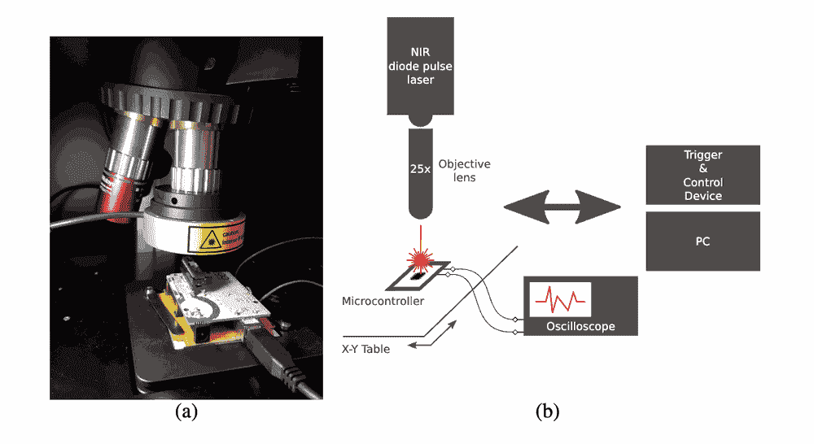
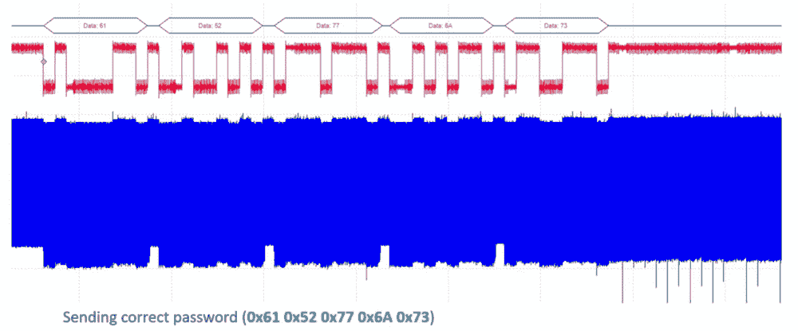
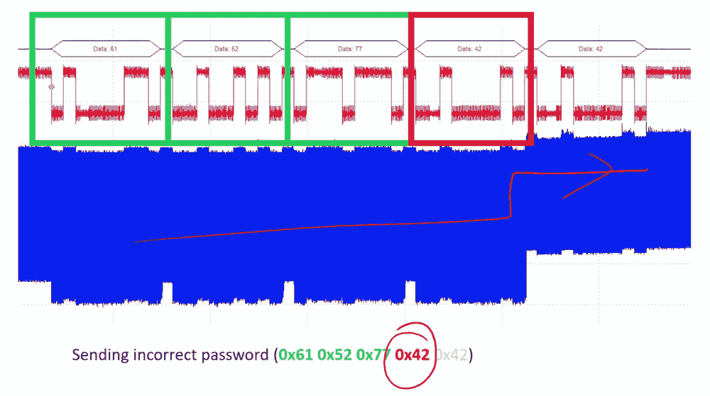
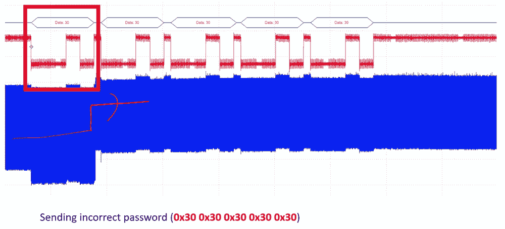
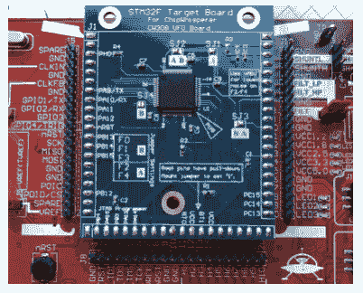
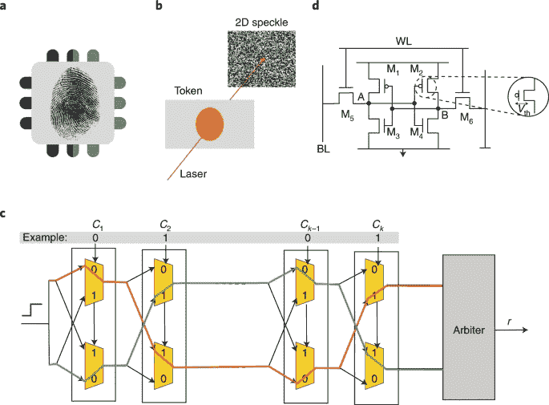

# 安全与隐私

*DALL·E 3 提示：一幅关于机器学习系统中隐私和安全的插图。图中展示了一个由相互连接的节点和数据流组成的数字景观，象征着机器学习算法。在前景中，有一个大锁叠加在网络上，代表隐私和安全。锁是半透明的，允许部分可见底下的网络。背景有二进制代码和数字加密符号，强调网络安全主题。色彩方案是蓝色、绿色和灰色的混合，暗示了一个高科技、数字的环境。*

## 目的

*为什么隐私和安全决定了机器学习系统能否得到广泛采用和社会信任？*

机器学习系统需要前所未有的访问个人数据、机构知识和行为模式才能有效运行，这在社会接受度上产生了效用和保护之间的紧张关系。与处理数据瞬时的传统软件不同，ML 系统从敏感信息中学习，并将模式嵌入到持久模型中，这些模型可能会无意中泄露私人细节。这种能力创造了系统性风险，不仅超越了个人隐私侵犯，还威胁到机构信任、竞争优势和民主治理。机器学习在关键领域（医疗保健、金融、教育和公共服务）的成功部署完全取决于建立强大的安全和隐私基础，以实现有益的使用同时防止有害的暴露。没有这些保护，即使是最有能力的系统也因法律、伦理和实际担忧而无法使用。理解隐私和安全原则使工程师能够设计出既具有技术卓越性又得到社会认可的系统。

**学习目标**

+   使用形式定义和威胁模型来区分机器学习系统中的安全和隐私问题

+   分析历史安全事件，提取适用于机器学习系统漏洞的原则

+   在模型、数据和硬件攻击面上对机器学习威胁进行分类

+   评估包括差分隐私、联邦学习和合成数据生成在内的隐私保护技术在特定用例中的应用

+   设计集成数据保护、模型安全和硬件信任机制的分层防御架构

+   为机器学习系统实施基本的安全控制措施，包括访问管理、加密和输入验证

+   使用定量成本效益分析来评估安全措施与系统性能之间的权衡

+   应用三阶段安全路线图，根据组织威胁模型和风险承受能力优先考虑防御措施

## 机器学习系统中的安全与隐私

从集中式训练架构向分布式、自适应机器学习系统的转变改变了现代机器学习基础设施的威胁格局和安全要求。第十四章中考察的当代机器学习系统越来越多地运行在跨越边缘设备、联邦网络和混合云部署的异构计算环境中。这种架构演变使得自适应智能的新能力成为可能，但同时也引入了攻击向量和隐私漏洞，这些是传统的网络安全框架无法充分解决的。

与传统的软件应用相比，机器学习系统表现出不同的安全特性。传统的软件系统处理数据是瞬时的和确定的，而机器学习系统则从训练数据中提取和编码模式，将其编码成持久的模型参数。这种学习到的知识表示创建了独特的漏洞，敏感信息可能会无意中被记住，并在模型输出或系统询问后暴露出来。这种风险在各个领域都有所体现，从可能泄露患者信息的医疗系统到可以通过战略查询模式逆向工程的自有模型，都威胁到个人隐私和组织的知识产权。

如第二章中详细所述，机器学习系统的架构复杂性通过多层攻击表面加剧了这些安全挑战。当代机器学习部署包括数据摄取管道、分布式训练基础设施、模型服务系统和持续监控框架。每个架构组件都引入了独特的漏洞，而隐私问题影响了整个计算栈。现代部署的分布式特性，包括边缘节点的持续适应和联邦协调协议，扩大了攻击面，同时使全面的安全实现复杂化。

解决这些挑战需要系统性的方法，这些方法将安全和隐私考虑贯穿于机器学习系统的整个生命周期。本章建立了构建既具有计算有效性又具有可信操作的机器学习系统所需的基础和方法。我们探讨了将已建立的安全原则应用于机器学习环境，确定了特定于学习系统的威胁模型，并提出了包括数据保护机制、安全模型架构和基于硬件的安全实现在内的综合防御策略。

我们的调查通过四个相互关联的框架进行。我们首先在机器学习环境中建立安全和隐私之间的区别，然后通过分析历史安全事件来了解当代威胁评估。我们分析学习过程中出现的漏洞，然后介绍跨越加密数据保护、对抗鲁棒模型设计和硬件安全机制的分层防御架构。在整个分析过程中，我们强调实施指南，使从业者能够开发出满足技术性能要求和社会部署所需信任标准的系统。

## 基础概念和定义

安全和隐私是机器学习系统设计中的核心关注点，但它们往往被误解或混淆。两者都旨在保护系统和数据，但它们以不同的方式、针对不同的威胁模型，并需要不同的技术响应。对于机器学习系统，区分两者有助于指导设计稳健和负责任的基础设施。

### 安全的定义

机器学习中的安全关注于防御系统免受对抗性行为的侵害。这包括保护模型参数、训练管道、部署基础设施和数据访问路径免受操纵或滥用。

***安全*** 是通过在开发、部署和运营环境中跨越防御机制来保护机器学习系统的 *数据*、*模型* 和 *基础设施*，以防止 *未经授权的访问*、*操纵* 和 *破坏*。

*示例*：部署在公共交通基础设施中的面部识别系统可能会受到对抗性输入的影响，导致其错误识别个人或完全失败。这是一个运行时安全漏洞，威胁到准确性和系统可用性。

### 隐私的定义

虽然安全解决对抗性威胁，但隐私关注的是限制在机器学习系统中敏感信息的暴露和滥用。这包括保护训练数据、推理输入和模型输出，防止泄露个人信息或专有信息，即使系统运行正确且没有发生明确的攻击。

***隐私*** 是通过在机器学习系统环境中保持 *机密性* 和对数据使用 *控制* 的方法来保护 *敏感信息*，以防止 *未经授权的披露*、*推断* 和 *滥用*。

*示例*：在医疗记录上训练的语言模型可能会无意中记住患者对话的片段。如果用户后来通过面向公众的聊天机器人触发此内容，即使没有攻击者，这也代表了一种隐私失败。

### 安全与隐私

虽然它们在某些领域有交集（加密存储支持两者），但安全和隐私在目标、威胁模型和典型的缓解策略上有所不同。表 15.1 以下总结了在机器学习系统背景下这些区别。

表 15.1：**安全-隐私区别**：机器学习系统需要针对安全和隐私采取不同的方法；安全缓解针对系统功能的目标攻击，而隐私保护则防止敏感信息因数据泄露或再识别而有意或无意地暴露。此表说明了不同的目标和威胁模型如何塑造每个领域的特定关注点和缓解策略。

| **方面** | **安全** | **隐私** |
| --- | --- | --- |
| **主要目标** | 防止未授权访问或破坏 | 限制敏感信息的暴露 |
| **威胁模型** | 对抗性参与者（外部或内部） | 诚实但好奇的观察者或被动泄露 |
| **典型关注点** | 模型窃取、投毒攻击、规避攻击 | 数据泄露、再识别、记忆化 |
| **示例攻击** | 对抗性输入导致误分类 | 模型反演揭示训练数据 |
| **代表性防御措施** | 访问控制、对抗性训练 | 差分隐私、联邦学习 |
| **与法规的相关性** | 在网络安全标准中被强调 | 在数据保护法律中居核心地位（例如，GDPR） |

### 安全-隐私交互和权衡

安全和隐私紧密相关但不可互换。一个安全的系统通过限制对模型和数据的未授权访问来帮助维护隐私。隐私保护的设计可以通过减少攻击面来提高安全性，例如，最小化敏感数据的保留可以降低系统被破坏时数据泄露的风险。

然而，它们也可能存在紧张关系。差分隐私 1 技术可以降低记忆化风险，但可能会降低模型效用。同样，加密增强了安全性，但可能会模糊透明性和可审计性，从而复杂化隐私合规性。在机器学习系统中，设计者必须全面地考虑这些权衡。服务于敏感领域（包括医疗保健、金融和公共安全）的系统必须同时防止滥用（安全）和过度暴露（隐私）。理解这些关注点之间的界限对于构建性能良好、值得信赖且符合法律要求的系统至关重要。

## 从安全漏洞中学习

在确立了安全和隐私的概念基础之后，我们现在考察这些原则如何在现实世界系统中通过里程碑式的安全事件体现出来。这些历史案例为我们所定义的抽象概念提供了具体的说明，展示了安全漏洞如何在复杂系统中产生和传播。更重要的是，它们揭示了普遍存在的模式（供应链破坏、隔离不足和武器化端点），这些模式直接适用于现代机器学习部署。

从各种计算系统中的知名安全漏洞中可以吸取宝贵的教训。理解这些模式如何适用于现代机器学习部署，这些部署越来越多地运行在云、边缘和嵌入式环境中，为保护机器学习系统提供了重要的经验教训。这些事件展示了系统设计中的弱点如何导致广泛的影响，有时甚至是物理影响。尽管本节讨论的例子并不都直接涉及机器学习，但它们为设计安全系统提供了重要的见解。这些经验教训适用于部署在云、边缘和嵌入式环境中的机器学习应用。

### 供应链破坏：Stuxnet

2010 年，安全研究人员发现了一种高度复杂的计算机蠕虫，后来被命名为[Stuxnet](https://www.research-collection.ethz.ch/bitstream/handle/20.500.11850/200661/Cyber-Reports-2017-04.pdf)2，它针对伊朗纳坦兹核设施中使用的工业控制系统(Farwell and Rohozinski 2011)。Stuxnet 利用了微软 Windows 中四个之前未知的“[零日漏洞](https://en.wikipedia.org/wiki/Zero-day_%28computing%29)”3，使其能够在网络化和隔离系统中无痕传播。

与旨在窃取信息或执行间谍活动的典型恶意软件不同，Stuxnet 被设计用来造成物理损害。其目标是通过对过程中使用的离心机进行破坏来干扰铀浓缩。尽管该设施与外部网络断开连接 4，但据信恶意软件是通过一个受感染的 USB 设备 5 进入系统的，这表明物理访问可以破坏隔离环境。

该蠕虫专门针对可编程逻辑控制器（PLC），这些工业计算机自动化了诸如控制离心机速度等机电过程。通过利用 Windows 操作系统和用于编程 PLC 的西门子 Step7 软件中的漏洞，Stuxnet 实现了高度针对性的现实世界破坏。这标志着网络安全的一个里程碑，展示了恶意软件如何跨越数字和物理世界来操纵工业基础设施。

Stuxnet 的教训直接适用于现代机器学习系统。训练管道和模型仓库面临着与 Stuxnet 所利用的类似的持续供应链风险。正如 Stuxnet 通过感染的可移动存储设备和软件漏洞来破坏工业系统一样，现代机器学习系统面临着多个攻击向量：受损害的依赖项（PyPI/conda 仓库中的恶意软件包）、恶意训练数据（HuggingFace、Kaggle 上的中毒数据集）、后门模型权重（模型仓库中的特洛伊木马模型）和篡改的硬件驱动程序（受损害的 NVIDIA CUDA 库、AI 加速器中的固件后门）。

一个具体的机器学习攻击场景说明了这些风险：攻击者上传了一个后门图像分类模型到一个流行的模型仓库，该模型被训练来错误分类特定模式，同时在干净数据上保持正常精度。当部署在自动驾驶汽车中时，这个后门模型正确地识别了大多数物体，但未能检测到穿着特定模式的行人，从而产生了安全风险。攻击通过自动化的模型部署管道传播，在检测到之前影响了数千辆车。

防御此类供应链攻击需要端到端的安全措施：(1) 加密验证，使用加密签名对所有模型工件、数据集和依赖项进行签名；(2) 原因追踪，维护所有训练数据源、代码版本和使用的不可变日志；(3) 完整性验证，在部署前实施自动扫描以检测模型后门、依赖项漏洞和数据集中毒；(4) 空隔训练，在具有受控依赖项管理的安全环境中隔离敏感模型训练。图 15.1 展示了这些供应链破坏模式如何适用于工业和机器学习系统。

图 15.1：**Stuxnet**：通过利用 Windows 和西门子软件漏洞来针对 PLC，展示了供应链被破坏的情况，这使得数字恶意软件能够造成物理基础设施损坏。现代机器学习系统面临着类似的通过受损害的训练数据、后门依赖项和篡改的模型权重带来的风险。图 15.1

### 孤立不足：Jeep Cherokee 漏洞

2015 年 Jeep Cherokee 的破解展示了日常产品中的连接性如何创造出新的漏洞。安全研究人员公开演示了对一辆 Jeep Cherokee 的远程网络攻击，揭示了汽车系统设计中重要的漏洞（Miller 和 Valasek 2015; Miller 2019）。作为一个控制实验，研究人员利用了车辆 Uconnect 娱乐系统中的漏洞，该系统通过蜂窝网络连接到互联网。通过远程访问该系统，他们发送了影响车辆引擎、变速器和制动系统的命令，而无需物理接触汽车。

这次演示对汽车行业起到了警钟的作用，突显了现代车辆日益增长的连接性所带来的风险。传统上隔离的汽车控制系统，如管理转向和制动的系统，在通过外部可访问的软件接口暴露时被发现是脆弱的。远程操纵关键功能的可能性引发了关于乘客安全、监管监督和行业最佳实践的严重担忧。

该事件还导致超过 140 万辆汽车召回以修复漏洞 6，突显了制造商在设计时优先考虑网络安全的必要性。美国国家公路交通安全管理局（NHTSA）7 发布了针对汽车制造商的指南，以改善车辆网络安全，包括关于安全软件开发实践和事件响应协议的建议。

Jeep Cherokee 的破解为机器学习系统安全提供了关键教训。连接的机器学习系统需要在外部接口和关键安全组件之间进行严格的隔离，正如这一事件所戏剧性地展示的那样。架构缺陷（允许外部接口访问关键功能）直接威胁到现代机器学习部署，其中推理 API 通常连接到物理执行器或关键系统。

现代机器学习攻击向量利用了这些相同的隔离失败，跨越多个领域：（1）自动驾驶汽车中，受损害的信息娱乐系统机器学习 API（语音识别、导航）获取控制转向和制动的感知模型；（2）智能家居系统中，被利用的语音助手唤醒词检测模型为安全系统、门锁和摄像头提供后门访问；（3）工业物联网中，受损害的边缘机器学习推理端点（预测性维护、异常检测）操纵制造系统中的执行器控制逻辑；（4）医疗设备中，被攻击的诊断机器学习模型影响治疗建议和药物输送系统。

考虑一个具体的攻击场景：智能家居语音助手通过云端的自然语言处理模型处理用户命令。攻击者利用语音处理 API 的漏洞注入恶意命令，绕过认证。由于网络分段不足，被攻陷的语音系统获得了访问家庭安全机器学习模型（负责面部识别门解锁）的权限，从而允许未经授权的物理访问。

有效的防御需要全面的隔离架构：(1) 使用防火墙和 VPN 将机器学习推理网络与执行器控制网络隔离开来；(2) API 认证要求对所有机器学习 API 调用进行加密认证，并实施速率限制和异常检测；(3) 权限分离，在沙盒环境中运行推理模型，以最小的系统权限运行；(4) 失效安全默认设置，当机器学习系统检测到异常或失去连接时，将执行器控制逻辑设计为恢复到安全状态（锁定的门，停止的电机）；(5) 监控实现实时日志记录和针对可疑机器学习 API 使用模式的警报。

### 武器化终端：Mirai 恶意软件

虽然 Jeep Cherokee 的黑客攻击展示了针对连接系统的针对性利用，但 Mirai 恶意软件揭示了糟糕的安全实践如何被大规模武器化。2016 年，[Mirai 恶意软件](https://www.cloudflare.com/learning/ddos/what-is-a-ddos-attack/)8 成为互联网历史上最具破坏性的分布式拒绝服务（DDoS）9 攻击之一（Antonakakis 等人，2017 年[ch058.xhtml#ref-antonakakis2017understanding]）。该恶意软件感染了成千上万的网络设备，包括数字摄像头、DVR 和其他消费电子产品。这些设备通常使用出厂默认的用户名和密码部署，很容易被 Mirai 恶意软件攻陷并被纳入大规模攻击网络。

Mirai 恶意软件被用于压垮主要的互联网基础设施提供商，导致美国及以外的流行在线服务访问中断。攻击的规模展示了当在设计部署时没有优先考虑安全，消费者和工业设备如何变成广泛破坏的平台。

Mirai 恶意软件的教训直接适用于现代机器学习部署。边缘部署的机器学习设备由于认证薄弱，成为前所未有的武器化攻击基础设施，正如 Mirai 恶意软件在传统的物联网设备上所展示的那样。现代机器学习边缘设备（运行物体检测的智能摄像头、执行唤醒词检测的语音助手、具有导航模型的自主无人机、具有异常检测算法的工业物联网传感器）面临相同的漏洞模式，但由于它们的 AI 能力和对敏感数据的访问，其后果被放大。

使用机器学习设备的攻击升级与传统物联网入侵有显著不同。与仅提供 DDoS 攻击计算能力的简单物联网设备不同，被入侵的机器学习设备提供了复杂的功能：(1) 数据泄露，智能摄像头泄露人脸识别数据库，语音助手提取对话记录，健康监测器窃取生物识别数据；(2) 模型武器化，被劫持的自主无人机协调集群攻击，被入侵的交通摄像头错误报告车辆数量以操纵交通系统；(3) AI 驱动的侦察，被入侵的边缘机器学习设备使用其训练的模型来识别高价值目标（人脸识别用于 VIP 识别，语音分析用于情绪检测）并协调复杂的多阶段攻击。

考虑一个具体的攻击场景，攻击者利用默认密码入侵了 50,000 个智能安全摄像头，每个摄像头都在运行机器学习物体检测模型。他们不是使用传统的 DDoS 攻击，而是利用被入侵的摄像头进行以下操作：(1) 从住宅和商业建筑中提取人脸识别数据库；(2) 使用分布式摄像头网络协调对目标个人的物理监控；(3) 注入虚假物体检测警报以触发紧急响应并造成混乱；(4) 利用摄像头的计算能力来训练对抗性样本以对抗其他安全系统。

针对这种武器化的全面防御需要零信任边缘安全：(1) 确保制造过程安全，消除默认凭证，实施硬件安全模块（HSM）以生成设备唯一密钥，并启用带有加密验证的安全启动；(2) 加密通信，要求所有机器学习 API 通信使用 TLS 1.3+，并实施证书固定和相互认证；(3) 行为监控，部署异常检测系统以识别不寻常的推理模式、意外的网络流量和可疑的计算负载；(4) 自动响应，实施关闭开关以远程禁用被入侵的设备并将它们隔离于网络之外；(5) 更新安全，强制执行加密签名固件更新，并具有自动安全补丁和版本回滚功能。

## 系统性威胁分析和风险评估

历史事件展示了基本安全失败如何在不同的计算范式下体现。供应链漏洞导致持续入侵，隔离不足允许权限提升，以及武器化端点在规模上创建攻击基础设施。这些模式直接适用于机器学习部署：被入侵的训练管道和模型存储库继承了供应链风险，与安全关键型机器学习组件的外部接口需要严格的隔离，被入侵的机器学习边缘设备可以泄露推理数据或参与协调攻击。

这些历史事件揭示了通用的安全模式，这些模式直接转化为 ML 系统的漏洞。正如 Stuxnet 所展示的供应链妥协，在 ML 中表现为训练数据中毒和后门模型存储库。不足的隔离，如 Jeep Cherokee 黑客攻击所例证，表现为对安全关键系统的 ML API 访问和受损害的推理端点。武器化端点，如 Mirai 僵尸网络所示，通过劫持能够进行协调 AI 攻击的 ML 边缘设备出现。

关键的见解是，传统的网络安全模式在 ML 系统中得到了放大，因为模型从数据中学习并做出自主决策。虽然 Stuxnet 需要复杂的恶意软件来操纵工业控制器，但 ML 系统可以通过数据中毒来被破坏，这种数据中毒在统计上看似正常，但嵌入隐藏的行为。这一特性使得 ML 系统在遭受攻击时更加脆弱，并且更加危险，因为它们可以自主地做出影响物理系统的决策。理解这些历史模式有助于识别熟悉攻击向量如何在 ML 环境中体现，而学习系统的独特属性（统计学习、决策自主性和数据依赖性）创造了需要专门防御的新攻击面。

机器学习系统引入了超出传统计算漏洞的攻击向量。学习的数据驱动特性为对手创造了新的机会：训练数据可以被操纵以嵌入后门，输入扰动可以利用学习到的决策边界，系统性的 API 查询可以提取专有模型知识。这些特定于 ML 的威胁需要专门的防御措施，这些措施考虑到学习系统的统计和概率基础，补充了传统的基础设施加固。

### 威胁优先级框架

面对 ML 系统面临的广泛潜在威胁，从业者需要一个框架来有效地优先考虑他们的防御工作。并非所有威胁的可能性或影响都相同，而且安全资源总是有限的。一个基于可能性和影响的简单优先级矩阵有助于将注意力集中在最重要的地方。

考虑以下威胁优先级类别：

+   **高可能性/高影响**：在联邦学习系统中，训练数据来自不可信来源的数据中毒攻击。这些攻击相对容易执行，但可能会严重损害模型行为。

+   **高可能性/中等影响**：针对公共 API 的模型提取攻击。这些攻击很常见且技术上简单，但可能只会影响竞争优势，而不是安全或隐私。

+   **低可能性/高影响**：针对云部署模型的硬件侧信道攻击。这些攻击需要复杂的对手和物理访问权限，但可能会暴露所有模型参数和用户数据。

+   **中等可能性/中等影响**：针对在敏感数据上训练的模型的成员推理攻击。这些攻击需要一定的技术技能，但主要威胁的是个人隐私而不是系统完整性。

本框架在本章中指导资源分配。我们首先从最常见且易于访问的威胁（模型盗窃、数据中毒和对抗攻击）开始，然后检查更专业的硬件和基础设施漏洞。理解这些优先级有助于从业者以逻辑顺序实施防御措施，以最大化每项投入的努力带来的安全效益。

## 模型特定的攻击向量

机器学习系统面临从训练时间操纵到推理时间规避的整个 ML 生命周期的威胁。这些威胁分为三个广泛的类别：针对模型机密性的威胁（模型盗窃）、针对训练完整性的威胁（数据中毒 10）和针对推理鲁棒性的威胁（对抗示例 11）。每个类别针对不同的漏洞，并需要不同的防御策略。

理解不同攻击在 ML 生命周期中何时何地发生有助于优先考虑防御措施并理解攻击者的动机。图 15.2 将主要攻击向量映射到机器学习管道中的目标阶段，揭示了攻击者如何在不同时间利用不同的系统漏洞。

+   **在数据收集期间**：攻击者可以在训练数据集中注入恶意样本或操纵标签，尤其是在数据来源控制较少的联邦学习或众包数据场景中。

+   **在训练期间**：这一阶段面临后门注入攻击，攻击者嵌入仅在特定触发条件下激活的隐藏行为，以及系统性地破坏学习过程的标签操纵攻击。

+   **在部署期间**：模型盗窃攻击针对这一阶段，因为训练模型可以通过 API、文件下载或移动应用程序的反向工程来访问。这是知识产权最脆弱的地方。

+   **在推理期间**：对抗攻击在运行时发生，攻击者构建旨在欺骗部署的模型做出错误预测的输入，同时对于人类观察者来说看起来是正常的。

这种生命周期视角揭示了不同的威胁需要不同的防御策略。数据验证保护收集阶段，安全训练环境保护训练阶段，访问控制和 API 设计保护部署，输入验证保护推理。通过理解哪些攻击针对哪些生命周期阶段，安全团队能够在适当的架构层实施适当的防御措施。

图 15.2：**机器学习生命周期威胁**：模型盗窃、数据中毒和对抗性攻击针对机器学习生命周期的不同阶段（从数据摄取到模型部署和推理），在每个步骤中创造独特的漏洞。了解这些生命周期位置可以阐明攻击面，并指导开发针对稳健人工智能系统的针对性防御策略。

机器学习模型并非仅仅是攻击的被动受害者；在某些情况下，它们可以被用作攻击策略的一部分。预训练模型，尤其是大型生成或判别网络，可能被调整以自动化诸如对抗性样本生成、钓鱼内容合成 12 或协议篡改等任务。开源或公开可访问的模型可以被微调以用于恶意目的，包括模仿、监控或逆向工程安全系统。

### 模型盗窃

第一类针对特定模型的威胁针对机密性。当对手获取到训练模型的参数、架构或输出行为时，就会产生对模型机密性的威胁。这些攻击可能会损害机器学习系统的经济价值，允许竞争对手复制专有功能，或暴露在模型权重中编码的私人信息。

这些威胁出现在各种部署环境中，包括公共 API13、云托管服务、设备上的推理引擎和共享模型存储库 14。由于暴露的接口、不安全的序列化格式 15 或访问控制不足，机器学习模型可能存在漏洞，这些因素为未经授权的提取或复制创造了机会 (Ateniese 等人 2015)。

这些威胁的严重性通过高调的法律案例得到了强调，这些案例突出了机器学习模型的战略和经济价值。例如，前谷歌工程师安东尼·莱万多夫斯基被指控在创立竞争性初创公司之前从 Waymo[偷窃专有设计](https://www.nytimes.com/2017/02/23/technology/google-self-driving-waymo-uber-otto-lawsuit.html)，包括其自动驾驶汽车技术的关键组件。此类案例说明了内部威胁绕过技术保护并获取敏感知识产权的潜在可能性。

模型盗窃的后果不仅限于经济损失。被盗的模型可以被用来提取敏感信息，复制专有算法，或启用进一步的攻击。经济影响可能非常严重：研究估计表明，大型语言模型的一些方面可以通过系统性的 API 查询来近似，其成本比原始训练低几个数量级，尽管完全复制模型在技术和经济上仍然具有挑战性 (Tramèr 等人 2016; Carlini 等人 2024)。例如，一个从电子商务平台获得被盗推荐模型的竞争对手可能会获得有关客户行为、商业分析和嵌入式商业机密的见解。这些知识也可以用来进行模型反演攻击 16，其中攻击者试图推断关于模型训练数据的私人细节 (Fredrikson, Jha, and Ristenpart 2015)。

在模型反演攻击中，攻击者通过合法接口查询模型，例如公共 API，并观察其输出。通过分析置信度分数或输出概率，攻击者可以优化输入以重建类似于模型训练集的数据。例如，用于安全访问的面部识别模型可以被操纵以揭示其训练的员工照片的统计特性。类似的安全漏洞已在 Netflix Prize 数据集的研究中得以证明 17，研究人员从匿名数据中推断出个人的电影偏好 (A. Narayanan and Shmatikov 2006))。

模型盗窃可以针对两个不同的目标：提取精确的模型属性，例如架构和参数，或者复制近似模型行为以产生类似输出，而不直接访问内部表示。理解神经网络架构有助于识别哪些架构模式最易受到提取攻击。具体的架构漏洞因模型类型而异，如第四章所述。这两种形式的盗窃都损害了机器学习系统的安全和价值，如下小节所述。

这两种攻击路径在图 15.3 中进行了说明。在精确模型窃取中，攻击者可以访问模型的内部组件，包括序列化文件、权重和架构定义，并直接复制模型。相比之下，近似模型窃取依赖于观察模型的输入输出行为，通常通过公共 API 进行。通过反复查询模型并收集响应，攻击者训练一个模拟器来模仿原始模型的功能。第一种方法损害了模型的内部设计和训练投资，而第二种威胁到其预测价值，并可能促进进一步的攻击，如对抗性示例迁移或模型反转。

图 15.3：**模型窃取策略**：攻击者可以针对模型内部参数或外部行为来创建被盗的副本。直接窃取提取模型权重和架构，而近似窃取通过查询原始的输入输出行为来训练模拟器模型，可能在没有直接访问内部组件的情况下实现进一步的攻击。

#### 精确模型窃取

精确模型属性窃取是指针对提取机器学习模型内部结构和学习参数的攻击。这些攻击通常针对通过 API 公开的部署模型，嵌入在设备推理引擎中，或在协作平台上作为可下载模型文件共享的模型。利用弱访问控制、不安全的模型打包或未受保护的部署接口，攻击者可以在不要求对底层基础设施完全控制的情况下恢复专有模型资产。

这些攻击通常寻求三种类型的信息。第一种是模型学习到的参数，例如权重和偏差。通过提取这些参数，攻击者可以在不承担训练成本的情况下复制模型的功能。这种复制使他们能够从模型性能中获益，同时绕过原始的开发努力。

第二个目标是模型的微调超参数，包括学习率、批量大小和正则化设置等训练配置。这些超参数对模型性能有显著影响，窃取它们允许攻击者通过最小额外的实验来重现高质量的结果。

最后，攻击者可能试图重建模型的架构。这包括定义模型行为的层序列和类型、激活函数以及连接模式。架构窃取可能通过侧信道攻击 18、逆向工程或分析可观察到的模型行为来完成。

揭示架构不仅会损害知识产权，还会让竞争对手对提供竞争优势的设计选择有战略洞察。

系统设计者必须通过确保模型序列化格式、限制对运行时 API 的访问以及加固部署管道来考虑这些风险。保护模型需要结合软件工程实践，包括访问控制、加密和混淆技术，以降低未经授权提取的风险（Tramèr 等人 2016）。

#### 近似模型窃取

当一些攻击者寻求提取模型的确切内部属性时，其他人则专注于复制其外部行为。近似模型行为窃取是指试图在不直接访问其参数或架构的情况下重新创建模型的决策能力。相反，攻击者通过观察模型的输入和输出来构建一个在相同任务上表现相似的替代模型。

这种类型的窃取通常针对作为服务部署的模型，其中模型通过 API 公开或嵌入在面向用户的应用程序中。通过反复查询模型并记录其响应，攻击者可以训练自己的模型来模仿原始模型的行为。这个过程通常被称为模型蒸馏 19 或仿制建模，允许攻击者在无法访问原始模型专有内部结构的情况下实现类似的功能（Orekondy、Schiele 和 Fritz 2019）。

攻击者可以通过两种方式评估行为复制的成功率。第一种是通过衡量替代模型的效率水平。这涉及到评估克隆模型是否在基准任务上实现了类似的准确度、精确度、召回率或其他性能指标。通过将替代模型的性能与原始模型对齐，攻击者可以构建一个在效果上实际上无法区分的模型，即使其内部结构不同。

第二种是通过测试预测一致性。这涉及到检查替代模型在提供相同输入时是否产生与原始模型相同的输出。匹配不仅包括正确的预测，还包括原始模型的错误，可以为攻击者提供对目标模型行为的忠实复制。这在自然语言处理等应用中尤其令人担忧，攻击者可能复制情感分析模型以获得竞争优势或绕过专有系统。

近似行为窃取在开放访问部署环境中，例如公共 API 或面向消费者的应用程序中，证明难以防御。限制查询速率、检测自动化提取模式以及水印模型输出是帮助减轻这种风险的几种技术。然而，这些防御措施必须与可用性和性能考虑因素相平衡，尤其是在生产环境中。

一个近似模型盗窃的演示是通过公共 API 提取黑盒语言模型的内部组件。在他们的论文中，Carlini 等人 (2024)展示了如何仅通过公共 API 访问来重建包括`ada`、`babbage`和`gpt-3.5-turbo`在内的几个 OpenAI 模型的最终嵌入投影矩阵。通过利用输出投影层的低秩结构和精心设计的查询，他们恢复了模型的隐藏维度，并复制了权重矩阵直到仿射变换。

攻击并未重建完整模型，而是揭示了内部架构参数，并为未来的更深层提取设定了先例。这项工作表明，即使是部分模型盗窃也可能会对机密性和竞争优势构成风险，尤其是在模型行为可以通过丰富的 API 响应（如 logit 偏差和对数概率）进行探测的情况下。

表 15.2：**模型盗窃成本**：攻击者可以使用公开 API 以相对较低的查询成本提取模型权重；该表量化了 OpenAI 的 ada 和 babbage 模型所面临的这一威胁，显示通过少于(4 ⁶)次查询提取权重可以实现低根均方误差（RMSE）。权重提取的估计成本在 1 到 12 美元之间，这表明尽管存在 API 速率限制和相关费用，模型盗窃攻击在经济上是可行的。来源：Carlini 等人 (2024)。

| **模型** | **大小** **(维度提取)** | **查询数** | **RMS** **(权重矩阵提取)** | **成本 (美元)** |
| --- | --- | --- | --- | --- |
| **OpenAI ada** | 1024 ✓ | < 2 ⁶$ | <semantics><mrow><mn>5</mn><mo>⋅</mo><msup><mn>10</mn><mrow><mi>−</mi><mn>4</mn></mrow></msup></mrow><annotation encoding="application/x-tex">5 \cdot 10^{-4}</annotation></semantics> | $1 / $4 |
| **OpenAI babbage** | 2048 ✓ | < 4 ⁶$ | <semantics><mrow><mn>7</mn><mo>⋅</mo><msup><mn>10</mn><mrow><mi>−</mi><mn>4</mn></mrow></msup></mrow><annotation encoding="application/x-tex">7 \cdot 10^{-4}</annotation></semantics> | $2 / $12 |
| **OpenAI babbage-002** | 1536 ✓ | < 4 ⁶$ | 未实现 | $2 / $12 |
| **OpenAI gpt-3.5-turbo-instruct** | 未公开 | < 4 ⁷$ | 未实现 | $200 / ~$2,000 (估计) |
| **OpenAI gpt-3.5-turbo-1106** | 未公开 | < 4 ⁷$ | 未实现 | $800 / ~$8,000 (估计) |

如他们在表 15.2 中所示的实证评估所示，模型参数可以以低至<semantics><msup><mn>10</mn><mrow><mi>−</mi><mn>4</mn></mrow></msup><annotation encoding="application/x-tex">10^{-4}</annotation></semantics>的均方根误差被提取，证实了在规模上实现高保真近似是可行的。这些发现对系统设计具有重要意义，表明如果不受严格控制，看似无害的 API 功能，如返回 top-k logits，可以成为重要的泄露向量。

#### 案例研究：特斯拉知识产权盗窃

2018 年，特斯拉对自动驾驶汽车初创公司[Zoox](https://zoox.com/)提起了[诉讼](https://storage.courtlistener.com/recap/gov.uscourts.nvd.131251/gov.uscourts.nvd.131251.1.0_1.pdf)，指控前特斯拉员工窃取了与特斯拉自动驾驶技术相关的专有数据和商业机密。根据诉讼，几名员工在离开特斯拉加入 Zoox 之前转移了超过 10 吉字节的秘密文件，包括机器学习模型和源代码。

在被盗材料中，有一个用于特斯拉自动驾驶系统中物体检测的关键图像识别模型。通过获得这个模型，Zoox 可以绕过多年的研发，为公司带来竞争优势。除了经济影响之外，还有担忧被盗模型可能会使特斯拉面临进一步的安全风险，例如针对模型训练集提取敏感数据的模型反演攻击。

Zoox 的员工否认了任何不当行为，此案最终在庭外和解。这一事件突显了模型盗窃的现实风险，特别是在机器学习模型代表重大知识产权的行业中。模型的盗窃不仅损害了竞争优势，还引发了关于隐私、安全和下游滥用的更广泛担忧。

这个案例表明，模型盗窃不仅限于在 API 或公共接口上进行的理论攻击。内部威胁、供应链漏洞以及未经授权访问开发基础设施对在商业环境中部署的机器学习系统同样构成严重风险。

### 数据投毒

当模型盗窃针对的是机密性时，第二类威胁则集中在训练完整性上。训练完整性威胁源于用于训练机器学习模型的数据被操纵。这些攻击旨在通过引入看似无害但会在最终模型中引起有害或偏见的行为的示例来破坏学习过程。

数据中毒攻击是一个突出的例子，其中攻击者将精心制作的数据点注入训练集中，以针对或系统性地影响模型行为(Biggio, Nelson, and Laskov 2012)。中毒数据可能导致模型做出错误的预测，降低其泛化能力，或者嵌入在部署后触发的故障模式。

数据中毒是一种安全威胁，因为它涉及攻击者有意操纵训练数据，目的是嵌入漏洞或颠覆模型行为。这些攻击在模型在从外部来源收集的数据上重新训练的应用中引起关注，包括用户交互、众包注释 20 和在线抓取，因为攻击者可以在不直接访问训练管道的情况下注入中毒数据。

这些攻击发生在多种威胁模型中。从安全角度来看，中毒攻击根据攻击者的访问级别和知识水平而有所不同。在白盒场景中，攻击者可能对模型架构或训练过程有详细的了解，从而能够进行更精确的操作。相比之下，黑盒或有限访问攻击利用开放的数据提交渠道或间接注入向量。中毒攻击可以针对机器学习管道的不同阶段，从数据收集和预处理到标记和存储，使得攻击面既广泛又依赖于系统。数据中毒威胁的相对优先级根据部署环境的不同而变化，如第 15.4.1 节所述。

中毒攻击通常遵循三个阶段的过程。首先，攻击者将恶意数据注入训练集中。这些例子通常设计得看似合法，但引入了细微的扭曲，从而改变了模型的学习过程。其次，模型在受损害的数据上训练，嵌入攻击者的意图行为。最后，一旦模型部署，攻击者可能利用改变后的行为来造成误预测、绕过安全检查或降低整体可靠性。

为了精确理解这些攻击机制，数据中毒可以被视为一个双层优化问题，其中攻击者试图选择中毒数据 <semantics><msub><mi>D</mi><mi>p</mi></msub><annotation encoding="application/x-tex">D_p</annotation></semantics> 以最大化模型在验证或目标数据集 <semantics><msub><mi>D</mi><mtext mathvariant="normal">test</mtext></msub><annotation encoding="application/x-tex">D_{\text{test}}</annotation></semantics> 上的损失。令 <semantics><mi>D</mi><annotation encoding="application/x-tex">D</annotation></semantics> 代表原始训练数据。攻击者的目标是解决： <semantics><mrow><munder><mo>max</mo><msub><mi>D</mi><mi>p</mi></msub></munder><mi>ℒ</mi><mrow><mo stretchy="true" form="prefix">(</mo><msub><mi>f</mi><mrow><mi>D</mi><mo>∪</mo><msub><mi>D</mi><mi>p</mi></msub></mrow></msub><mo>,</mo><msub><mi>D</mi><mtext mathvariant="normal">test</mtext></msub><mo stretchy="true" form="postfix">)</mo></mrow></mrow> <annotation encoding="application/x-tex">\max_{D_p} \ \mathcal{L}(f_{D \cup D_p}, D_{\text{test}})</annotation></semantics> 其中 <semantics><msub><mi>f</mi><mrow><mi>D</mi><mo>∪</mo><msub><mi>D</mi><mi>p</mi></msub></mrow></msub><annotation encoding="application/x-tex">f_{D \cup D_p}</annotation></semantics> 代表在原始和中毒数据组合数据集上训练的模型。对于定向攻击，这个目标可以细化以关注特定的输入 <semantics><msub><mi>x</mi><mi>t</mi></msub><annotation encoding="application/x-tex">x_t</annotation></semantics> 和目标标签 <semantics><msub><mi>y</mi><mi>t</mi></msub><annotation encoding="application/x-tex">y_t</annotation></semantics>： <semantics><mrow><munder><mo>max</mo><msub><mi>D</mi><mi>p</mi></msub></munder><mi>ℒ</mi><mrow><mo stretchy="true" form="prefix">(</mo><msub><mi>f</mi><mrow><mi>D</mi><mo>∪</mo><msub><mi>D</mi><mi>p</mi></msub></mrow></msub><mo>,</mo><msub><mi>x</mi><mi>t</mi></msub><mo>,</mo><msub><mi>y</mi><mi>t</mi></msub><mo stretchy="true" form="postfix">)</mo></mrow></mrow> <annotation encoding="application/x-tex">\max_{D_p} \ \mathcal{L}(f_{D \cup D_p}, x_t, y_t)</annotation></semantics>

这种公式捕捉了对手引入精心设计的数据点以操纵模型决策边界的目标。

例如，考虑一个训练有素的交通标志分类模型，该模型旨在区分停车标志和限速标志。攻击者可能会将少量标记为限速标志的停车标志图像注入训练数据中。攻击者的目标是微妙地改变模型的决策边界，使得未来的停车标志被错误地分类为限速标志。在这种情况下，中毒数据<semantics><msub><mi>D</mi><mi>p</mi></msub><annotation encoding="application/x-tex">D_p</annotation></semantics>由错误标记的停车标志图像组成，攻击者的目标是最大化合法停车标志<semantics><msub><mi>x</mi><mi>t</mi></msub><annotation encoding="application/x-tex">x_t</annotation></semantics>被错误分类为限速标志<semantics><msub><mi>y</mi><mi>t</mi></msub><annotation encoding="application/x-tex">y_t</annotation></semantics>，遵循上述针对性攻击公式。即使模型在其他类型的标志上表现良好，中毒的训练过程也会创建一个可预测且可利用的漏洞。

根据其目标和影响范围，数据中毒攻击可以被分类。可用性攻击通过引入噪声或标签翻转来降低任务的整体准确性，从而降低模型性能。针对性攻击操纵特定的输入或类别，保持一般性能不变，但在某些情况下会导致一致的误分类。后门攻击 21 嵌入隐藏的触发器，这些触发器通常是难以察觉的模式，只有在触发器存在时才会引发恶意行为。子群体攻击降低特定群体（由共享特征定义）的性能，在公平敏感的应用中尤其危险。

针对性中毒攻击的一个引人注目的现实世界例子是对 Google 广泛使用的在线毒性检测模型 Perspective 进行的攻击 22，该模型帮助平台识别有害内容(Hosseini 等人 2017)。通过将带有细微拼写错误和语法错误的合成有害评论注入模型的训练集中，研究人员降低了其检测有害内容的能力 23。

缓解数据中毒威胁需要数据管道的端到端安全性，包括收集、存储、标记和训练。预防措施包括输入验证检查、训练数据集完整性的验证以及异常检测以标记可疑模式。同时，鲁棒的训练算法可以通过降低异常实例的权重或过滤掉它们来限制错误标记或操纵数据的影响。虽然没有单一技术可以保证免疫，但结合主动数据治理、自动化监控和鲁棒的学习实践对于在现实部署中保持模型完整性至关重要。

### 对抗性攻击

从训练时间到推理时间的威胁，第三类针对的是模型在部署期间的鲁棒性。推理鲁棒性威胁发生在攻击者在测试时间操纵输入以诱导错误预测时。与数据中毒不同，数据中毒会破坏训练过程，这些攻击利用了模型在推理过程中的决策表面上的脆弱性。

这类威胁的核心类别是对抗攻击，其中精心构造的输入被设计成在几乎与合法数据无法区分的情况下导致错误的预测。正如第十六章中详细所述，这些攻击突显了机器学习模型对微小、有针对性的扰动敏感的脆弱性，这些扰动可以极大地改变输出置信度或分类结果。

这些攻击在自动驾驶、生物识别认证和内容审核等领域创造了重大的现实风险。其有效性可能非常显著：研究表明，对抗样本可以在修改不到 0.01%的像素值的情况下，对最先进的图像分类器实现 99%以上的攻击成功率，这些变化对人类几乎不可察觉（Szegedy 等人 2013a；Goodfellow、Shlens 和 Szegedy 2014a）。在物理世界攻击中，大小仅为图像 2%的对抗性补丁可以在不同的光照条件下以 80%以上的成功率将自动车辆的停止标志误分类为速度限制标志（Eykholt 等人 2017）。

与在训练期间破坏模型的数据中毒不同，对抗攻击在测试时间操纵模型的行为，通常不需要访问训练数据或模型内部。因此，攻击面从上游数据管道转移到实时交互，需要能够检测或减轻推理点恶意输入的鲁棒防御机制。

对抗样本生成的数学基础和攻击算法的全面分类，包括基于梯度的、基于优化的和基于迁移的技术，在第十六章中有详细论述，该章节探讨了构建对抗性抵抗系统的鲁棒方法。

对抗攻击根据攻击者对模型的访问级别而有所不同。在白盒攻击中，攻击者对模型的架构、参数和训练数据有全面了解，使他们能够制作出高度有效的对抗样本。在黑盒攻击中，攻击者没有内部知识，必须依赖查询模型并观察其输出。灰盒攻击介于这两种极端之间，攻击者拥有部分信息，例如可以访问模型架构但不能访问其参数。

这些攻击者模型可以总结为知识水平的一个连续谱。表 15.3 突出了模型访问、数据访问、典型攻击策略和常见部署场景之间的差异。这些区别有助于描述在不同部署环境中确保机器学习系统安全的实际挑战。

常见的攻击策略包括代理模型构建、利用对抗迁移性的迁移攻击以及基于 GAN 的扰动生成。这些方法的技术细节及其数学公式在第十六章中得到了详尽的阐述。

表 15.3：**对抗知识谱系**：攻击者对模型细节和训练数据的访问级别不同，定义了不同的威胁模型，影响了对抗攻击的可行性和复杂性，并影响了部署安全策略。该表按访问级别、典型攻击方法和常见部署场景对这些模型进行分类，明确了确保机器学习系统安全的实际挑战。

| **对抗知识水平** | **模型访问** | **训练数据访问** | **攻击示例** | **常见场景** |
| --- | --- | --- | --- | --- |
| **白盒** | 完全访问架构和参数 | 完全访问 | 使用梯度构建对抗示例 | 内部威胁，开源模型重用 |
| **灰盒** | 部分访问（例如，仅架构） | 有限或无访问 | 基于代理模型近似的攻击 | 已知模型家族，未知微调 |
| **黑盒** | 无内部访问；只有查询-响应视图 | 无访问 | 基于查询的代理模型训练和迁移攻击 | 公共 API，模型即服务部署 |

一个具有说明性的例子涉及对交通标志识别系统的操纵(Eykholt 等人 2017)。研究人员证明，在停车标志上放置小贴纸可能导致机器学习模型将它们错误分类为限速标志。尽管修改后的标志对人类来说仍然容易识别，但模型却持续地将它们误认为是限速标志。这类攻击在自动驾驶等需要可靠感知的应用中存在严重风险，因为可靠感知对于安全至关重要。

对抗性攻击突出了需要强大的防御措施，这些措施不仅限于提高模型准确性。为了保护机器学习系统免受对抗性威胁，需要运行时防御措施，例如输入验证、异常检测以及在推理期间监控异常模式。训练时间鲁棒性方法（例如，对抗性训练）补充了这些策略，并在第十六章中进行了探讨。支持鲁棒模型发展的训练方法在第八章第八章中详细说明。这些防御措施旨在增强模型对对抗性样本的抵抗力，确保机器学习系统即使在存在恶意输入的情况下也能可靠地运行。

### 案例研究：交通标志攻击

2017 年，研究人员通过在停车标志上放置小块黑白贴纸(Eykholt 等人 2017)进行了实验。如图图 15.4 所示，这些贴纸被设计成几乎对人类眼睛不可见，但机器学习模型在观察时却显著改变了停车标志的外观。对于正常的人类眼睛来说，这些贴纸并没有遮挡标志或阻止可解释性。然而，当贴纸停车标志的图像被输入到标准的交通标志分类机器学习模型时，有超过 85%的时间被错误地分类为限速标志。

图 15.4：**对抗性贴纸**：几乎不可见的贴纸可以使机器学习模型在 85%以上的时间内将停车标志错误地分类为限速标志。这强调了机器学习系统对对抗性攻击的脆弱性。来源：Eykholt 等人(2017)。

这个演示展示了简单的对抗性贴纸如何欺骗机器学习系统错误地读取重要的道路标志。如果实际部署，这些攻击可能会危及公共安全，导致自动驾驶汽车将停车标志误认为是限速标志。研究人员警告说，这可能会造成危险的滚动停车或加速进入交叉路口。

这个案例研究具体说明了对抗性示例是如何利用机器学习模型的模式识别机制的。通过微妙地改变输入数据，攻击者可以诱导错误的预测，并对自动驾驶汽车等安全重要应用造成重大风险。攻击的简单性展示了即使是微小的、不可察觉的变化也可能使模型误入歧途。因此，开发者必须实施针对此类威胁的强大防御措施。

这些威胁类型跨越了机器学习生命周期的不同阶段，并需要不同的防御策略。下表表 15.4 总结了它们的关键特征。

表 15.4：**威胁格局**：机器学习系统在其生命周期中面临各种威胁，从训练期间的数据操纵到部署后的模型盗窃。该表按生命周期阶段和攻击向量对这些威胁进行分类，阐明漏洞如何显现，并使针对性的缓解策略成为可能。

| **威胁类型** | **生命周期阶段** | **攻击向量** | **示例影响** |
| --- | --- | --- | --- |
| **模型盗窃** | 部署 | API 访问，内部泄露 | 盗窃的知识产权，模型反演，行为克隆 |
| **数据中毒** | 训练 | 标签翻转，后门 | 目标误分类，精度下降 |
| **对抗性攻击** | 推理 | 输入扰动 | 实时误分类，安全故障 |

针对特定威胁的适当防御措施取决于其类型、攻击向量以及它在机器学习生命周期中的位置。图 15.5 提供了一个简化的决策流程，将常见的威胁类别，如模型盗窃、数据中毒和对抗性示例，与相应的防御策略相连接。虽然现实世界的部署可能需要更细致的防御组合，正如我们在分层防御框架中所讨论的，但此流程图作为将威胁模型与实际缓解技术相匹配的概念指南。

图 15.5：**威胁缓解流程**：此图将常见的机器学习威胁映射到相应的防御策略，根据攻击向量和生命周期阶段进行选择。通过遵循此流程，从业者可以将威胁模型与实际缓解技术（如安全模型访问和数据净化）相匹配，以构建更稳健的人工智能系统。

尽管机器学习模型本身提供了重要的攻击面，但它们最终运行在可能引入超出模型控制范围的安全漏洞的硬件上。从基于软件的威胁到基于硬件的漏洞的转变代表了安全领域的重大转变。软件攻击针对代码逻辑和数据流，而硬件攻击则利用计算基质的物理属性。

驱动机器学习工作负载的专用计算基础设施创建了一个分层攻击面，它远远超出了传统的软件漏洞。这包括执行指令的处理器、存储数据的内存系统以及在不同组件之间传递信息的互连。理解这些硬件级别的风险是至关重要的，因为它们可以绕过传统的软件安全机制，并且难以检测。这些风险通过第 15.8.7 节中详细介绍的基于硬件的安全机制来解决。

在下一节中，我们将探讨对手如何通过硬件故障、物理篡改、旁路通道和供应链风险来针对执行机器学习工作负载的物理基础设施。

## 硬件级安全漏洞

随着机器学习系统从研究原型发展到大规模、实际部署，它们的安全性依赖于运行的硬件平台。无论是在数据中心、边缘设备还是嵌入式系统中，机器学习应用都依赖于由处理器、加速器、内存和通信接口组成的分层堆栈。这些硬件组件虽然对于实现高效计算至关重要，但它们引入了独特的安全风险，这些风险超出了传统的基于软件的漏洞。

与通用软件系统不同，机器学习工作流程通常在性能受限的环境中处理高价值模型和敏感数据。这使得它们不仅成为软件攻击的目标，也成为硬件级别利用的目标。硬件中的漏洞可能会使模型面临被盗用的风险，泄露用户数据，破坏系统可靠性，或允许对手操纵推理结果。由于硬件在软件堆栈之下运行，此类攻击可以绕过传统的安全机制，并且难以检测。

理解硬件安全威胁需要考虑计算子层如何实现机器学习操作。在硬件层面，CPU 组件如算术逻辑单元、寄存器和缓存执行驱动模型推理和训练的指令。内存层次结构决定了模型访问参数和中间结果的速度。硬件-软件接口，由固件和引导加载程序介导，为系统操作建立了初始的信任基础。计算的物理特性——包括功耗、时序特性和电磁辐射——创造了攻击者可以利用以提取敏感信息的可观察信号。

硬件威胁源于多个来源，贯穿整个系统生命周期。处理器架构中的设计缺陷，例如 Meltdown 和 Spectre 等漏洞，可能损害安全保证。物理篡改能够直接操纵组件和数据流。侧信道攻击通过电源轨迹、时间变化和电磁辐射等意外信息泄露来利用。供应链妥协在制造和分销过程中引入恶意组件或修改。这些威胁共同构成了一个关键的攻击面，必须解决以构建可信的机器学习系统。对于关注实际部署的读者，关键经验教训集中在供应链验证、物理访问控制和硬件信任锚上，而第 15.8 节中的防御策略提供了无论深度架构专业知识如何都可行的指导。

表 15.5 总结了硬件安全威胁的主要类别，描述了它们的起源、方法和对于机器学习系统设计和部署的影响。

表 15.5: **硬件威胁格局**：机器学习系统面临着从内在设计缺陷到物理攻击和供应链漏洞的多种硬件威胁。理解这些威胁及其与机器学习的相关性对于构建安全和可信的人工智能部署至关重要。

| **威胁类型** | **描述** | **对机器学习硬件安全的相关性** |
| --- | --- | --- |
| **硬件缺陷** | 硬件设计中固有的缺陷，可能损害系统完整性。 | 硬件漏洞的基础。 |
| **物理攻击** | 通过物理访问或操作直接利用硬件。 | 基本且明显的威胁模型。 |
| **故障注入攻击** | 诱导故障导致硬件操作中的错误，可能导致系统崩溃。 | 导致失败的系统性操纵。 |
| **侧信道攻击** | 利用硬件操作中泄露的信息来提取敏感数据。 | 通过环境观察的间接攻击。 |
| **泄露接口** | 由于接口无意中暴露数据而产生的漏洞。 | 通过通信渠道的数据暴露。 |
| **假冒硬件** | 使用未经授权的硬件组件，这些组件可能存在安全漏洞。 | 复合的漏洞问题。 |
| **供应链风险** | 通过硬件生命周期（从生产到部署）引入的风险。 | 累积的多方面安全挑战。 |

### 硬件缺陷

硬件威胁的第一类源于设计漏洞。硬件并非免疫于设计缺陷或错误这一普遍问题。攻击者可以利用这些漏洞访问、操纵或提取敏感数据，破坏用户和服务所依赖的机密性和完整性。最引人注目的例子之一是[Meltdown 和 Spectre](https://meltdownattack.com/)24 的发现——现代处理器中的两个漏洞，允许恶意程序绕过内存隔离并读取其他应用程序和操作系统的数据(Kocher 等人 2019a, 2019b)。

这些攻击利用了推测执行 25，这是 CPU 中的一种性能优化，在安全检查完成之前，它以不正确的顺序执行指令。虽然提高了计算速度，但这种优化无意中通过微架构的旁路通道（如 CPU 缓存）暴露了敏感数据。这些攻击的技术复杂性凸显了即使在广泛的硬件验证下，消除漏洞的难度。

进一步的研究表明，这些并非孤立事件。如 Foreshadow、ZombieLoad 和 RIDL 等变体针对不同的微架构元素，从安全区域到 CPU 内部缓冲区，这表明推测执行漏洞是系统性的硬件风险。这种系统性意味着虽然这些攻击最初是在通用 CPU 上展示的，但它们的含义延伸到机器学习加速器和专用硬件。机器学习系统通常依赖于结合 CPU 与 GPU、TPU、FPGA 或定制加速器的异构计算平台。这些组件处理敏感数据，如个人信息、医疗记录或专有模型。此堆栈任何部分的漏洞都可能使这些数据暴露于攻击者。

例如，一个边缘设备，如运行在加速器上的智能摄像头，如果硬件缺乏适当的缓存隔离，运行面部识别模型可能会存在漏洞。攻击者可能利用这种弱点提取中间计算、模型参数或用户数据。在云推理服务中，也存在类似的风险，其中硬件多租户增加了跨租户数据泄露的可能性。

这种漏洞在隐私敏感领域（如医疗保健）中引起关注，在这些领域中，机器学习系统通常处理患者数据。一旦发生泄露，可能会违反隐私法规，例如[健康保险可携带性和问责制法案（HIPAA）](https://www.cdc.gov/phlp/php/resources/health-insurance-portability-and-accountability-act-of-1996-hipaa.html)26，导致重大的法律和伦理后果。类似的监管风险在全球范围内适用，GDPR27 对未能实施适当技术措施以保护欧盟公民数据的组织处以高达全球收入 4%的罚款。

这些例子说明，硬件安全并不仅仅是防止物理篡改。它还需要架构保障来防止通过硬件本身的数据泄露。随着处理器、加速器和内存系统出现新的漏洞，应对这些风险需要持续的缓解努力，通常涉及性能权衡，尤其是在计算和内存密集型的机器学习工作负载中。主动解决方案，如机密计算和可信执行环境（TEEs），提供了有希望的建筑防御。然而，实现稳健的硬件安全需要在系统生命周期的每个阶段都给予关注，从设计到部署。

### 物理攻击

除了设计缺陷之外，第二类涉及直接的物理操作。物理篡改是指直接、未经授权地操纵计算硬件，以破坏机器学习系统的完整性。这种攻击尤其令人担忧，因为它绕过了传统的软件安全防御措施，直接针对机器学习所依赖的物理组件。由于机器学习系统依赖于硬件传感器、加速器和存储来处理大量数据并在现实世界环境中产生可靠的输出，因此它们特别容易受到此类攻击。

虽然包括加密、身份验证和访问控制在内的软件安全措施可以保护机器学习系统免受远程攻击，但它们对拥有物理访问设备设备的对手提供的防御很少。物理篡改的范围从简单的操作，如将恶意 USB 设备插入边缘服务器，到在芯片制造过程中嵌入硬件木马的高度复杂操作。这些威胁对于在边缘或物理暴露环境中部署的机器学习系统尤其相关，攻击者可能有机会直接干扰硬件。

要了解此类攻击如何在实际中影响机器学习系统，可以考虑一个用于环境测绘或基础设施检查的机器学习无人机示例。无人机的导航依赖于处理来自 GPS、摄像头和惯性测量单元的数据的机器学习模型。如果攻击者获得了对无人机的物理访问权限，他们可以替换或修改其导航模块，嵌入一个隐藏的后门，改变飞行行为或重新路由数据收集。这种操纵不仅损害了系统的可靠性，还打开了滥用的大门，例如监视或走私行动。

这些威胁跨越了应用领域。物理攻击不仅限于移动系统。依赖于机器学习模型处理人脸或指纹数据的生物识别访问控制系统也容易受到攻击。这些系统通常使用嵌入式硬件来捕获和处理生物识别输入。攻击者可以用一个设计用来捕获和传输个人识别数据给未经授权接收者的修改组件物理替换生物识别传感器。这创造了多个漏洞，包括未经授权的数据访问和允许未来的冒充攻击。

除了篡改外部传感器外，攻击者还可能针对内部硬件子系统。例如，用于自动驾驶汽车中的传感器，包括摄像头、激光雷达和雷达，对于解释周围环境的机器学习模型至关重要。恶意行为者可以通过物理错位或遮挡这些传感器，降低模型的感知能力，并造成安全隐患。

硬件木马也构成了另一个严重风险。在芯片制造或组装过程中引入的恶意修改可以在机器学习加速器或推理芯片中嵌入休眠电路。这些木马在正常条件下可能保持不活跃，但在处理特定输入或达到系统状态时触发恶意行为。这种隐藏的漏洞可能会干扰计算、泄露模型输出或以难以诊断的方式降低系统性能。

内存子系统也是吸引攻击者的目标。拥有物理访问边缘设备或嵌入式机器学习加速器的攻击者可以操纵内存芯片以提取加密的模型参数或训练数据。包括电压操控和电磁干扰在内的故障注入技术可以通过破坏模型权重或在推理期间强制执行错误计算来进一步降低系统可靠性。

物理访问威胁也扩展到数据中心和云环境。拥有足够访问权限的攻击者可以安装硬件植入物，如键盘记录器或数据拦截器，以捕获管理凭证或监控数据流。这种植入物可以提供持续的后门访问，使长期监控或从机器学习训练和推理管道中窃取数据成为可能。

总结来说，对机器学习系统的物理攻击威胁了广泛部署环境中的安全和可靠性。应对这些风险需要结合硬件级别的保护、篡改检测机制和供应链完整性检查。如果没有这些安全措施，即使是最安全的软件防御也可能被通过直接物理操作引入的漏洞所破坏。

### 故障注入攻击

建立在物理篡改技术的基础上，故障注入代表了一种更复杂的硬件利用方法。故障注入是一类强大的物理攻击，它故意破坏硬件操作以在计算中引起错误。这些引起的故障可以通过导致模型产生错误输出、降低可靠性或泄露敏感信息来损害机器学习模型的完整性。对于机器学习系统，这些故障不仅会干扰推理，还会使模型面临更深入的利用，包括逆向工程和安全协议的绕过（Joye 和 Tunstall 2012）。

攻击者通过在硬件执行计算时施加精确时间控制的物理或电气干扰来实现故障注入。诸如低电压操作(Barenghi 等人 2010)、电源尖峰(M. Hutter, Schmidt 和 Plos 2009)、时钟故障(Amiel, Clavier 和 Tunstall 2006)、电磁脉冲(Agrawal 等人 2007)、温度变化(S. Skorobogatov 2009)以及甚至激光打击(S. P. Skorobogatov 和 Anderson 2003)等技术已被证明可以破坏程序执行的具体部分。这些干扰可以引起诸如位翻转、跳过的指令或损坏的内存状态等效果，攻击者可以利用这些效果来改变机器学习模型的行为或提取敏感信息。

对于机器学习系统，这些攻击带来了几个具体的风险。故障注入会降低模型精度，强制进行错误分类，触发拒绝服务，甚至泄露内部模型参数。例如，攻击者可以向在微控制器上运行的嵌入式机器学习模型注入故障，迫使其在安全至关重要的应用中（如自主导航或医疗诊断）错误地分类输入。更复杂的攻击者可能会针对内存或控制逻辑来窃取知识产权，例如专有模型权重或架构细节。

这些攻击的实际可行性已通过控制实验得到证明。一个值得注意的例子是 Breier 等人的工作(2018)，研究人员成功地对部署在微控制器上的深度神经网络进行了激光故障注入攻击。如图 15.6 所示，通过加热特定的晶体管，他们迫使硬件跳过执行步骤，包括 ReLU 激活函数。

图 15.6: **激光故障注入**: 聚焦的激光脉冲在微控制器内存中引起位翻转，使攻击者能够操纵模型执行并损害系统完整性。研究人员利用这项技术来模拟硬件错误，揭示嵌入式机器学习系统中的漏洞，并指导容错设计的开发。来源：(Breier 等人 2018)。

这种操纵在图 15.7 中得到了说明，该图显示了一个实现 ReLU 激活函数的汇编代码段。通常，代码比较累加器的最高有效位（MSB）与零，并使用 brge（如果大于或等于则分支）指令，如果值非正则跳过赋值。然而，故障注入抑制了分支，导致处理器始终执行“else”块。因此，神经元的输出被强制设为零，无论输入值如何。

图 15.7: **故障注入攻击**: 通过操纵汇编代码绕过安全检查，强制神经元输出为零，无论输入如何，从而展示了机器学习系统中的硬件漏洞。来源：(Breier 等人 2018)。

故障注入攻击还可以与侧信道分析相结合，其中攻击者首先观察功率或时序特征，以推断模型结构或数据流。这种侦察使他们能够针对特定的层或操作，例如激活函数或最终决策层，最大化注入故障的影响。

嵌入式和边缘机器学习系统尤其容易受到攻击，因为它们通常缺乏物理加固，并且在资源受限的环境下运行，这限制了运行时防御。如果没有防篡改包装或安全硬件区域，攻击者可能直接访问系统总线内存，从而实现精确的故障操纵。许多嵌入式机器学习模型被设计为轻量级，这使它们几乎没有冗余或错误纠正来恢复由诱导的故障。

缓解故障注入需要多种互补的保护措施。物理保护，如防篡改外壳和设计混淆，有助于限制物理访问。异常检测技术可以监控传感器输入或模型输出以寻找故障引起的异常迹象 (Hsiao 等人 2023)。纠错内存和安全的固件可以降低静默损坏的可能性。如果被盗模型后来被对手部署，模型水印等技术可能提供可追溯性。

在成本和功耗受限的环境中实现这些保护措施很困难，在这些环境中，添加加密硬件或冗余可能不可行。要实现针对故障注入的弹性，需要跨层设计考虑，这些考虑跨越了电气、固件、软件和系统架构级别。没有这样的整体设计实践，部署在现场的机器学习系统可能仍然容易受到这些低成本但高度有效的物理攻击的影响。

### 侧信道攻击

从直接故障注入到间接信息泄露，侧信道攻击构成了一类安全漏洞，这些漏洞利用了通过计算系统的物理实现无意中泄露的信息。与针对软件或网络漏洞的直接攻击不同，这些攻击利用系统的硬件特性，包括功耗、电磁辐射或时序行为，以提取敏感信息。

侧信道攻击的核心前提是设备的操作可以通过可观察的物理信号泄露信息。这种泄露可能源于设备消耗的电能(Kocher, Jaffe, and Jun 1999)，它发出的电磁场(Gandolfi, Mourtel, and Olivier 2001)，完成计算所需的时间，甚至它产生的声学噪声。通过仔细测量和分析这些信号，攻击者可以推断内部系统状态或恢复机密数据。

尽管这些技术在密码学中经常被讨论，但它们对机器学习系统同样相关。部署在硬件加速器、嵌入式设备或边缘系统上的机器学习模型经常处理敏感数据。即使这些模型受到安全算法或加密的保护，它们的物理执行可能泄露侧信道信号，这些信号可能被对手利用。

最广泛研究的一个例子涉及高级加密标准（AES）28 的实现。虽然 AES 在数学上是安全的，但其加密函数的物理计算过程会泄露可测量的信号。

这种攻击技术的一个有用例子可以在密码认证过程的功耗分析中看到。考虑一个验证 5 字节密码的设备——在这种情况下，`0x61, 0x52, 0x77, 0x6A, 0x73`。在认证过程中，设备通过串行接口逐个接收每个字节，其功耗模式揭示了系统如何响应这些输入。

图 15.8 展示了输入正确密码时设备的行为。红色波形捕获了串行数据流，标记接收到的每个字节。蓝色曲线记录了设备随时间变化的功耗。当提供完整的正确密码时，功率曲线在所有五个字节上保持稳定和一致，为与失败尝试的比较提供了一个清晰的基线。

图 15.8：**功率曲线**：当输入正确的密码时，设备的功耗在认证过程中保持稳定，为后续图中的比较设定了基线。来源：Colin O’Flynn。

当输入错误的密码时，功率分析图会像图 15.9 中所示那样改变。在这种情况下，前三个字节（`0x61, 0x52, 0x77`）是正确的，所以功率模式与正确密码匹配到那个点。然而，当处理第四个字节（`0x42`）并发现它是错误的时，设备停止认证。这种变化在蓝色功率线的突然跳跃中反映出来，表明设备已停止处理并进入错误状态。

图 15.9：**侧信道攻击漏洞**：在认证过程中，功耗模式揭示了加密密钥信息；一致的功耗表示正确的密码字节，而突然的变化则表示输入错误和停止处理。即使不知道密码，攻击者也可以通过分析设备在认证尝试期间的功耗来推断密码。来源：Colin O’Flynn。

图 15.10 展示了密码完全错误的情况（`0x30, 0x30, 0x30, 0x30, 0x30`）。在这里，设备在第一个字节之后立即检测到不匹配并提前停止处理。这在功率曲线中也很明显，蓝色线在第一个字节之后出现急剧跳跃，反映了设备在认证过程中的早期终止。

图 15.10：**功耗跳跃**：蓝色线在处理第一个字节后的急剧增加表明立即认证失败，突出了如何通过功耗快速检测到错误的密码。来源：Colin O’Flynn。

这些例子展示了攻击者如何利用可观察到的功耗差异来缩小搜索空间，并通过暴力分析最终恢复秘密数据。通过系统地测量功耗模式并将它们与不同的输入相关联，攻击者可以提取出应该保持隐藏的敏感信息。

这些漏洞的范围超出了加密应用。机器学习应用也面临着类似的风险。例如，一个基于 ML 的语音识别系统在本地设备上处理语音命令时，可能会泄露时间或功耗信号，揭示正在处理的命令。即使是微妙的声学或电磁发射也可能暴露操作模式，对手可以利用这些模式来推断用户行为。

从历史上看，旁路攻击已被用于绕过甚至最安全的加密系统。在 20 世纪 60 年代，英国情报机构 MI5 著名地利用了埃及大使馆密码机的声学发射(Burnet and Thomas 1989)。通过捕捉机器转子的机械点击声，MI5 分析人员能够显著降低破解加密信息的复杂性。这个早期例子说明，旁路漏洞不仅限于数字时代，而且根植于计算的物理性质。

今天，这些技术已经发展到包括键盘窃听(Asonov and Agrawal, n.d.)、对加密硬件的功耗分析(Gnad, Oboril, and Tahoori 2017)以及基于电压的 ML 加速器攻击(M. Zhao and Suh 2018)等攻击。时间攻击、电磁泄漏和热辐射继续为对手提供观察系统行为的间接渠道。

部署在专用加速器或嵌入式平台上的机器学习系统尤其容易受到攻击。攻击者可能利用旁路信号来推断模型结构、窃取参数或重建私有训练数据。随着 ML 在云、边缘和嵌入式环境中的日益部署，这些旁路漏洞对系统安全构成了重大挑战。

理解旁路攻击的持续性和演变对于构建具有弹性的机器学习系统至关重要。通过认识到只要有信号，就有被利用的潜力，系统设计人员可以通过结合硬件屏蔽、算法防御和操作保障来开始解决这些风险。

### 泄露接口

当旁路攻击利用未预期的物理信号时，泄露接口代表了一种不同类别的漏洞，涉及暴露的通信通道。计算系统中的接口对于实现通信、诊断和更新至关重要。然而，这些相同的接口在无意中暴露敏感信息或接受未经验证的输入时，可能成为重大的安全漏洞。这种泄露接口通常在系统设计期间被忽视，但它们为攻击者提供了强大的入口点，用于提取数据、操纵功能或引入恶意代码。

泄露接口是指任何泄露比预期更多信息的访问点，通常是由于身份验证薄弱、缺乏加密或隔离不足。这些问题在消费、医疗和工业系统中已被广泛证明。

例如，许多支持 WiFi 的婴儿监控器被发现暴露了未受保护的远程访问端口 29，这使得攻击者能够拦截来自私人住宅内的实时音频和视频流。同样，研究人员已经发现了起搏器中的无线漏洞 30，如果被利用，攻击者可能操纵心脏功能，引发生命威胁的安全问题。

一个涉及智能灯泡的显著案例表明，留在生产设备上的可访问调试端口 31 泄露了未加密的 WiFi 凭证。这种安全疏忽为攻击者提供了渗透家庭网络而不需要绕过标准安全机制的途径。

这些例子揭示了直接适用于机器学习部署的漏洞模式。虽然这些例子并没有直接针对机器学习系统，但它们说明了与 ML-allowed 设备高度相关的架构模式。考虑一个使用机器学习来检测用户习惯并自动响应的智能家居安全系统。这样的系统可能包括用于软件更新的维护或调试接口。如果这个接口缺乏适当的身份验证或未加密传输数据，同一网络上的攻击者可能获得未经授权的访问。这种入侵可能会暴露用户行为模式，损害模型完整性，或完全禁用安全功能。

机器学习系统中的泄露接口也可能暴露训练数据、模型参数或中间输出。这种暴露可能允许攻击者构建对抗性示例、窃取专有模型或逆向工程系统行为。更糟糕的是，这些接口可能允许攻击者篡改固件，引入恶意代码，禁用设备或将它们招募到僵尸网络中。

缓解这些风险需要在技术和组织领域进行协调保护。技术保障措施，如强身份验证、加密通信和运行时异常检测，非常重要。组织实践，如接口清单、访问控制策略和持续审计，同样重要。采用零信任架构，其中默认不信任任何接口，通过仅限制访问严格必要的内容来进一步减少暴露。

对于机器学习系统设计者来说，确保接口安全必须与算法和数据为中心的设计一样成为首要关注点。无论系统是在云端、边缘还是嵌入式环境中运行，未能保护这些访问点可能会损害整个系统的可信度。

### 伪造硬件

除了合法硬件中的漏洞之外，供应链本身也出现了另一个重大威胁。机器学习系统依赖于它们运行的硬件的可靠性和安全性。然而，在当今全球化的硬件生态系统中，假冒或克隆硬件的风险已成为对系统完整性的严重威胁。假冒组件是指未经授权的真正部件的复制，设计上旨在尽可能模仿其外观和功能。这些组件可以通过跨越多个供应商和地区的复杂采购和制造流程进入机器学习系统。

组件采购的任何失误都可能将假冒硬件引入重要系统。例如，用于安全设施访问的面部识别系统可能无意中依赖假冒处理器。这些未经授权的组件可能无法正确处理生物识别数据，或引入隐藏的漏洞，使攻击者能够绕过身份验证控制。

假冒硬件带来的风险是多方面的。从可靠性角度来看，这些组件通常退化更快，表现不可预测，或在负载下因制造标准低下而失败。从安全角度来看，假冒硬件可能包含隐藏的后门或恶意电路，为攻击者提供无法检测的途径来破坏机器学习系统。例如，在数据中心安装的克隆网络路由器可能静默地拦截模型预测或用户数据，在整个基础设施中创建系统性的漏洞。

法律和监管风险进一步加剧了问题。那些无意中将假冒组件集成到其机器学习系统中的组织可能面临严重的法律后果，包括违反安全、隐私或网络安全法规的处罚 32。这在医疗保健和金融等必须遵守行业标准的领域尤其令人担忧。医疗保健组织必须在其技术堆栈中证明符合 HIPAA 标准，而处理欧盟公民数据的组织必须满足 GDPR 对技术和组织措施的要求，包括供应链完整性。

经济压力常常激励从低成本供应商处采购，而不进行严格的验证，增加了假冒部件进入生产系统的可能性。检测特别具有挑战性，因为假冒组件被设计成模仿合法组件。识别它们可能需要专用设备或法医分析，使得预防比补救更为实际。

在需要高可靠性和低延迟的机器学习应用中，如自动驾驶汽车的实时决策、工业自动化或重要的医疗诊断，风险尤其高。在这些环境中，硬件故障不仅会导致系统停机，还会带来重大的安全风险。因此，随着机器学习继续扩展到安全重要和高价值的应用，伪造硬件呈现出的风险越来越大，必须得到认识和解决。组织必须将硬件可靠性视为核心设计要求，与算法准确性和数据安全同等重要，以确保 ML 系统可以在现实世界中可靠和安全地运行。

### 供应链风险

伪造硬件体现了更广泛的系统性挑战。虽然伪造硬件提出了严重的挑战，但它只是确保全球硬件供应链安全的大问题的一部分。机器学习系统由通过复杂供应链的组件构建，涉及设计、制造、组装、分销和集成。每个阶段都存在篡改、替换或伪造的机会——通常在部署最终系统的那些人不知情的情况下。

恶意行为者可以以各种方式利用这些漏洞。一个签约制造商可能无意中收到被重新标记为新组件的回收电子废物。一个分销商可能故意将克隆部件混入其他合法的货物中。制造设施的内幕人士可能嵌入硬件特洛伊木马，一旦系统部署，就几乎无法检测到。高级仿制品尤其具有欺骗性，翻新或重新包装的组件旨在通过视觉检查，同时隐藏劣质或恶意内部组件。

识别此类妥协通常需要复杂分析，包括显微摄影、X 射线筛选和功能测试。然而，这些方法成本高昂，对于大规模采购来说不切实际。因此，许多组织在未完全验证每个组件的真实性和安全性之前就部署了系统。

风险不仅限于单个设备。机器学习系统通常依赖于异构硬件平台，整合来自全球供应链的 CPU、GPU、内存和专用加速器。这个链条中任何一部分的妥协都可能破坏整个系统的安全性。当系统在共享或多租户环境中运行时，这些风险进一步放大，例如云数据中心或联邦边缘网络，在这些环境中，硬件级别的隔离对于防止跨租户攻击至关重要。

2018 年，《彭博商业周刊》报道称中国国家行为者将间谍芯片植入 Supermicro 服务器主板，将这些风险带入了公众视野。虽然这些说法仍然存在争议，但这个故事突显了行业对其自身硬件供应链的有限可见性。公司通常依赖复杂、不透明的制造和分销网络，使他们容易受到隐藏妥协的影响。过度依赖单一制造商或地区，包括半导体行业对台积电的依赖，进一步集中了这种风险。这种认识推动了政策反应，如美国的[芯片和科学法案](https://bidenwhitehouse.archives.gov/briefing-room/statements-releases/2024/08/09/fact-sheet-two-years-after-the-chips-and-science-act-biden-%E2%81%A0harris-administration-celebrates-historic-achievements-in-bringing-semiconductor-supply-chains-home-creating-jobs-supporting-inn/)，旨在将半导体生产转移到国内，并加强供应链的弹性。

保护机器学习系统需要超越默认信任模型，转向零信任供应链实践。这包括审查供应商、验证组件来源、实施篡改检测保护，以及持续监控系统行为以发现妥协迹象。构建能够检测和包含故障的容错架构提供了额外的防御层。

最终，供应链风险必须在机器学习系统设计中被视为首要关注的问题。对驱动机器学习的计算模型和数据管道的信任，核心依赖于它们运行的硬件的可靠性。如果不确保硬件基础的安全，即使是最复杂的模型也仍然容易受到妥协的威胁。

### 案例研究：Supermicro 争议

供应链风险的抽象性质在一个备受瞩目的争议中变得具体，这个争议吸引了行业的关注。2018 年，《彭博商业周刊》发表了一份广泛讨论的报告，声称中国支持的国家行为者秘密在 Supermicro 制造的机架式服务器主板上植入微型监控芯片(Robertson and Riley 2018)。据报道，这些被篡改的服务器被超过 30 家主要公司部署，包括苹果和亚马逊。这些芯片据称大小不超过一粒米，可以为攻击者提供对敏感数据和系统的后门访问。

这些指控在技术行业引发了立即的关注，引发了关于全球供应链安全和国家层面硬件操纵潜力的质疑。然而，报告中提到的公司公开否认了这些指控。苹果、亚马逊和超微公司表示，在进行了彻底的内部调查后，他们没有发现任何所谓的植入物。行业专家和政府机构也表达了怀疑，指出报告中缺乏可验证的技术证据。

尽管有这些否认，但这个故事对组织和政策制定者如何看待硬件供应链安全产生了持久的影响。无论具体指控是否准确，报告都突出了这样一个现实和日益增长的关注：硬件供应链难以进行全面审计和保障。它强调了地缘政治紧张、制造业外包和现代硬件生态系统的复杂性如何使得保证硬件组件的完整性越来越具有挑战性。

超微案例说明了更普遍的真理：一旦产品进入复杂的全球供应链，就很难确保每个组件都没有被篡改或未经授权修改。这种风险对于依赖来自全球多个供应商的广泛硬件加速器、内存模块和处理器单元的机器学习系统尤其严重。

针对这些风险，行业和政府利益相关者已经开始投资供应链安全计划。美国政府的芯片和科学法案就是此类努力之一，旨在将半导体制造回归本土，以提高透明度并减少对外国供应商的依赖。尽管这些努力很有价值，但它们并不能完全消除供应链风险。它们必须通过技术保障措施来补充，例如组件验证、运行时监控和容错系统设计。

超微争议为机器学习社区提供了一个警示故事。它表明，即使在与信誉良好的供应商合作时，硬件安全也不能被理所当然地认为。确保机器学习系统的完整性需要对整个硬件生命周期进行严格的关注——从设计、制造到部署和维护。这一案例强调了组织采用全面的供应链安全实践作为可信机器学习系统设计基础要素的必要性。

## 当机器学习系统成为攻击工具

到目前为止所考察的威胁——模型盗窃、数据中毒、对抗性攻击、硬件漏洞——代表了针对机器学习系统的攻击。然而，完整的威胁模型还必须考虑到相反的情况：机器学习作为攻击放大器。使机器学习在有益应用中强大的相同能力也增强了对抗性操作，将机器学习从被动目标转变为主动武器。

尽管机器学习系统通常被视为需要保护的资产，但它们也可能成为发起攻击的工具。在对抗性环境中，用于提高生产力、自动化感知或辅助决策的相同模型可以被重新用于执行或放大攻击操作。机器学习的这种双重用途特性，即它既能保护系统也能颠覆系统，标志着在系统级威胁模型中考虑 ML 的核心转变。

机器学习的攻击性应用是指任何使用机器学习模型来协助破坏另一个系统的场景。在这种情况下，模型本身不是攻击的目标，而是攻击者推进其目标的机制。这些应用可能涉及侦察、推理、颠覆、伪装或自动化那些原本需要手动执行的利用策略。

重要的是，这种攻击性应用并非纯粹推测。攻击者已经将机器学习集成到他们的工具链中，涉及广泛的活动中，从垃圾邮件过滤规避到基于模型的恶意软件生成。这些场景的区别在于，攻击者故意使用基于学习的系统以提取、操纵或生成信息，这些信息会破坏目标组件的机密性、完整性和可用性。

为了阐明这些应用的多样性和结构，表 15.6 总结了几个代表性的用例。对于每个用例，表格确定了通常使用的机器学习模型类型、它所利用的底层系统漏洞以及使用机器学习带来的主要优势。

这些记录的案例说明了机器学习模型如何作为对抗能力的放大器。例如，语言模型允许更令人信服和适应性强的钓鱼攻击，而聚类和分类算法通过学习系统级行为模式来促进侦察。大型语言模型的生成人工智能能力尤其放大了这些攻击应用。同样，对抗性示例生成器和推理模型系统地揭示了决策边界或数据隐私保护中的弱点，通常只需要有限的对外部部署系统的访问。在硬件环境中，如下一节所述，在侧信道数据上训练的深度神经网络可以自动化从物理测量中提取加密秘密——将专家驱动的过程转化为可学习的模式识别任务。第三章（ch009.xhtml#sec-dl-primer）中的深度学习基础——用于空间模式识别的卷积神经网络、用于时间依赖性的循环架构和基于梯度的优化——使攻击者能够将这些技术应用于第十一章（ch017.xhtml#sec-ai-acceleration）中讨论的各种硬件平台，从云环境中的 GPU 和 TPU 到资源受限的边缘加速器。

表 15.6：**攻击性机器学习用例**：此表分类了机器学习如何通过实现自动化内容生成、利用系统漏洞和增加攻击复杂性来放大网络攻击；它详细说明了每个攻击应用的典型机器学习模型、目标弱点和由此产生的优势。理解这些用例对于开发有效防御日益智能的威胁至关重要。

| **攻击性用例** | **机器学习模型类型** | **目标系统漏洞** | **机器学习的优势** |
| --- | --- | --- | --- |
| **钓鱼和社会工程** | 大型语言模型（LLMs） | 人类感知和通信系统 | 定制化、情境感知的消息构建 |
| **侦察和指纹识别** | 监督分类器，聚类模型 | 系统配置，网络行为 | 可扩展的、自动化的系统行为配置文件 |
| **利用生成** | 代码生成模型，微调的转换器 | 软件漏洞，不安全的代码模式 | 自动发现候选利用方法 |
| **数据提取（推理攻击）** | 分类模型，逆模型 | 通过模型输出泄露隐私 | 有限的或黑盒访问下的推理 |
| **逃避检测系统** | 对抗性输入生成器 | 部署的机器学习系统中的检测边界 | 构建最小扰动的输入以逃避过滤器 |
| **硬件级攻击** | 深度学习模型 | 物理侧信道（例如，功率、时序、电磁） | 直接从原始信号中学习泄露模式 |

尽管这些应用在技术实现上有所不同，但它们有一个共同的基础：对手用能够近似或适应目标脆弱行为的学到的模型替换了静态的漏洞利用。这种转变增加了灵活性，减少了人工开销，并提高了面对不断演变或部分隐蔽的防御时的鲁棒性。

使这类威胁特别显著的是它们有利的扩展行为。正如计算机视觉或语言建模的准确性随着额外数据、更大架构和更多计算资源的增加而提高一样，以攻击为导向的机器学习模型的性能也是如此。例如，在更大规模的钓鱼尝试或电源迹线数据集上训练的模型可能具有更有效的泛化能力，能够规避更多检测器，或需要更少的输入才能成功。推动有益人工智能创新的相同生态系统，包括公共数据集、开源工具和可扩展基础设施，也降低了开发有效攻击模型的技术门槛。

这种动态在攻击者和防御者之间创造了一种不对称性。尽管防御措施受到部署限制、延迟预算和监管要求的约束，但攻击者可以以最低的边际成本扩展训练管道。预训练模型和公共机器学习平台的广泛可用性进一步降低了开发高影响力攻击所需的技能水平。

检查这些攻击能力具有至关重要的防御作用。安全专业人士长期以来一直认识到，有效的防御需要理解攻击方法——这一原则是渗透测试 33、红队练习 34 以及整个网络安全行业中的威胁建模的基础。

在机器学习领域，这种理解变得至关重要，因为机器学习放大了防御和攻击能力。使机器学习在合法应用中强大的相同计算优势——模式识别、自动化和可扩展性——也增强了对抗能力。通过研究机器学习如何被武器化，安全专业人士可以预测攻击向量，设计更健壮的防御措施，并开发检测机制。

因此，任何关于机器学习系统安全的全面处理都必须考虑不仅机器学习系统的漏洞，还要考虑机器学习被用来损害其他组件的方式——无论是软件、数据还是硬件。理解机器学习系统的攻击潜力对于设计有弹性、值得信赖和前瞻性的防御至关重要。

### 案例研究：深度学习用于 SCA

为了具体说明这些攻击能力，我们考察了一个具体案例，其中机器学习将传统的攻击方法进行了转换。深度学习辅助的侧信道攻击（SCA）最著名且可重复的演示之一是 SCAAML 框架（由机器学习辅助的侧信道攻击）（Bursztein 等人 2024a）。由谷歌的研究人员开发，SCAAML 提供了上述攻击管道的实用实现。

图 15.11：**功率迹线**：密码计算揭示了功耗上的微妙、数据相关的变化，这些变化反映了特定操作期间的内部状态。

如图 15.11 所示，密码计算在功耗上表现出数据相关的变化。这些变化虽然微妙，但可测量，并反映了算法在特定时间点的内部状态。

在传统的侧信道攻击中，专家们依赖于统计技术来提取这些差异。然而，神经网络可以学会将这些信号的形状与正在处理的具体数据值相关联，有效地学习以模仿专家构建的模型的方式来解码信号，同时具有增强的灵活性和泛化能力。该模型在标记的功率迹线及其相应的中间值（例如，S-box 操作的输出）的示例上进行训练。随着时间的推移，它学会了将迹线中的模式与秘密相关的计算行为相关联，类似于图 15.11 中所示。这把密钥恢复任务转换成了一个分类问题，其目标是仅根据迹线形状推断正确的密钥字节。

在他们的研究中，Bursztein 等人(2024a)训练了一个卷积神经网络，从运行开源 TinyAES 实现的 STM32F415 微控制器上收集的功率迹线中提取 AES 密钥。该模型被训练来直接从原始功率迹线预测 AES 算法的中间值，例如第一轮 S-box 的输出。训练好的模型仅使用每个字节少量迹线就恢复了完整的 128 位密钥。

这些迹线是使用带有定制 STM32F 目标板的 ChipWhisperer 设置收集的，该目标板在图 15.12 中显示。该板执行 AES 操作，同时允许外部设备以高时间精度监控功耗。实验设置捕捉了即使是价格低廉、功耗低的嵌入式设备也能通过侧信道泄露信息的情况——这些信息是现代机器学习模型可以学会利用的。

图 15.12：**STM32F415 目标板**：允许在微控制器上监控 AES 操作期间的功耗，突显了机器学习模型可以利用的侧信道漏洞。来源：Bursztein 等人 (2024a)。

后续工作通过引入能够利用更广泛时间依赖性的长程模型来扩展这一方法，即使在噪声和不同步的情况下也能提高性能（Bursztein 等人 2024b）。这些发展突显了机器学习模型作为进攻性密码分析工具的潜力，尤其是在安全硬件分析方面。

其影响超出了学术兴趣的范围。随着深度学习模型持续扩展，它们在侧信道环境中的应用可能会降低硬件级攻击的成本、技能门槛和跟踪要求——对嵌入式机器学习系统、加密模块和可信执行环境的可靠部署构成日益增长的挑战。

## 全面防御架构

在考察了针对机器学习系统的威胁以及由机器学习能力引发的威胁之后，我们现在转向全面的防御策略。设计安全且保护隐私的机器学习系统不仅需要识别个别威胁，还需要一种分层防御策略，该策略将多个系统级别的保护整合在一起，以创建全面的弹性。

本节系统地通过四个防御层进行阐述：数据层保护，包括差分隐私和安全的计算，在训练期间保护敏感信息；模型层防御，如对抗训练和安全部署，保护模型本身；运行时层措施，包括输入验证和输出监控，确保推理操作的安全；以及硬件层基础，如可信执行环境，为所有其他保护提供信任锚。我们以基于您的部署环境选择和实施这些防御的实际框架作为结论。

### 分层防御原则

分层防御（也称为深度防御）代表了一种核心安全架构原则，其中多个独立的防御机制协同工作，以抵御各种威胁向量。在机器学习系统中，这种方法变得至关重要，因为数据依赖性、模型暴露和推理模式引入了独特的攻击面。与主要面临基于代码的漏洞的传统软件系统不同，ML 系统容易受到输入操纵、数据泄露、模型提取和运行时滥用的攻击，所有这些攻击都因数据、模型行为和基础设施之间的紧密耦合而加剧。

分层方法认识到没有单一防御机制可以应对所有可能的威胁。相反，安全来自于互补保护措施的相互作用：数据层技术如差分隐私和联邦学习；模型层防御包括鲁棒性技术和安全部署；运行时层措施如输入验证和输出监控；以及硬件层解决方案包括可信执行环境和安全启动。每一层都为系统的整体弹性做出贡献，同时补偿其他层中可能存在的潜在弱点。

本节介绍了一个结构化的框架，用于实现机器学习系统的分层防御，从数据中心的保护到基础设施级别的执行。该框架建立在第六章中的数据保护实践之上，并向前连接到第十三章中详细描述的操作安全措施。通过在各个层之间整合保障措施，组织可以构建既可靠又能在生产环境中承受对抗性压力的机器学习系统。

分层方法在图 15.13 中得到了可视化，该图显示了防御机制如何从基于硬件的基础安全进步到运行时系统保护、模型级控制和数据层的隐私保护技术。每一层都建立在下一层的信任保证之上，形成一个端到端策略，用于安全部署机器学习系统。

图 15.13：**分层防御堆栈**：机器学习系统需要多方面的安全策略，从基础硬件保护到以数据为中心的隐私技术，构建跨所有层的信任。该架构在数据、模型、运行时和基础设施级别整合了保障措施，以减轻威胁并确保在生产环境中稳健部署。

### 隐私保护数据技术

在我们防御堆栈的最高层，我们首先从数据隐私技术开始。保护为机器学习系统提供动力的个人的隐私是可信人工智能的基础性要求。与在处理前通常对数据进行掩盖或匿名化的传统系统不同，机器学习工作流程通常依赖于访问原始、高保真数据来训练有效的模型。这种效用与隐私之间的紧张关系促使一系列旨在最小化数据暴露同时保持学习性能的技术应运而生。

#### 差分隐私

最广泛采用的用于形式化隐私保证的框架之一是差分隐私（DP）。DP 提供了一个严格的数学定义的隐私损失，确保单个个体的数据包含或排除对模型输出的影响是可证明有限的。

为了理解差分隐私的需求，考虑这个挑战：我们在从数据中学习时如何量化隐私损失？传统的隐私方法侧重于删除识别信息（姓名、地址、社会保障号码）或应用统计披露控制。然而，这些方法在面对复杂的对手时失效，对手可以通过辅助数据、统计相关性攻击或从模型输出中进行推理来重新识别个人。

差分隐私通过关注算法行为而非数据内容采取了一种不同的方法。关键洞见是隐私保护应该是可衡量的，并且应该限制对任何个人的了解，无论对手拥有多少外部信息。

为了对这一概念建立直观理解，想象一下你想找到一组人的平均工资，但没有人愿意透露他们的实际工资。使用差分隐私，你可以要求每个人都把他们的工资写在一张纸上，但在他们交上之前，他们从已知分布中添加或减去一个随机数。当你平均所有纸张时，随机噪声往往会相互抵消，给你一个非常接近真实平均值的估计。然而，如果你抽出任何一张单独的纸，你无法知道这个人的真实工资，因为你不知道他们添加了什么随机数。这是核心思想：在学习总体模式的同时，使确定任何单个个体的信息变得不可能。

差分隐私通过比较相似数据集上的算法行为来形式化这种直观。考虑两个相邻的数据集，它们只在单个个体的记录是否存在上有所不同。差分隐私确保算法输出的概率分布无论该个体的数据是否包含，在统计上都是相似的。这种保护是通过精心校准的噪声实现的，它掩盖了个体贡献，同时保留了机器学习所需的总体统计模式。

为了使这种直观在数学上精确，差分隐私引入了隐私损失的定量度量。数学框架使用概率比率来限制当添加或删除单个个体的数据时，算法行为可以改变的程度。这种方法使我们能够证明隐私保证，而不仅仅是假设它们。

一个随机算法 <semantics><mi>𝒜</mi><annotation encoding="application/x-tex">\mathcal{A}</annotation></semantics> 被称为 <semantics><mi>ϵ</mi><annotation encoding="application/x-tex">\epsilon</annotation></semantics>-差分隐私的，如果对于所有相邻数据集 <semantics><mi>D</mi><annotation encoding="application/x-tex">D</annotation></semantics> 和 <semantics><mrow><mi>D</mi><mi>′</mi></mrow><annotation encoding="application/x-tex">D'</annotation></semantics>（它们在一条记录上有所不同），以及对于所有输出 <semantics><mrow><mi>S</mi><mo>⊆</mo><mtext mathvariant="normal">Range</mtext><mrow><mo stretchy="true" form="prefix">(</mo><mi>𝒜</mi><mo stretchy="true" form="postfix">)</mo></mrow></mrow><annotation encoding="application/x-tex">S \subseteq \text{Range}(\mathcal{A})</annotation></semantics>，以下条件成立：<semantics><mrow><mo>Pr</mo><mrow><mo stretchy="true" form="prefix">[</mo><mi>𝒜</mi><mrow><mo stretchy="true" form="prefix">(</mo><mi>D</mi><mo stretchy="true" form="postfix">)</mo></mrow><mo>∈</mo><mi>S</mi><mo stretchy="true" form="postfix">]</mo></mrow><mo>≤</mo><msup><mi>e</mi><mi>ϵ</mi></msup><mo>Pr</mo><mrow><mo stretchy="true" form="prefix">[</mo><mi>𝒜</mi><mrow><mo stretchy="true" form="prefix">(</mo><mi>D</mi><mi>′</mi><mo stretchy="true" form="postfix">)</mo></mrow><mo>∈</mo><mi>S</mi><mo stretchy="true" form="postfix">]</mo></mrow></mrow> <annotation encoding="application/x-tex">\Pr[\mathcal{A}(D) \in S] \leq e^{\epsilon} \Pr[\mathcal{A}(D') \in S]</annotation></semantics>

参数 <semantics><mi>ϵ</mi><annotation encoding="application/x-tex">\epsilon</annotation></semantics> 量化了隐私预算，表示最大允许的隐私损失。较小的 <semantics><mi>ϵ</mi><annotation encoding="application/x-tex">\epsilon</annotation></semantics> 值通过增加噪声注入提供更强的隐私保障，但可能会降低模型效用。典型值包括用于强隐私保护的 <semantics><mrow><mi>ϵ</mi><mo>=</mo><mn>0.1</mn></mrow><annotation encoding="application/x-tex">\epsilon = 0.1</annotation></semantics>，用于适度保护的 <semantics><mrow><mi>ϵ</mi><mo>=</mo><mn>1.0</mn></mrow><annotation encoding="application/x-tex">\epsilon = 1.0</annotation></semantics>，以及用于较弱但保持效用保证的 <semantics><mrow><mi>ϵ</mi><mo>=</mo><mn>10</mn></mrow><annotation encoding="application/x-tex">\epsilon = 10</annotation></semantics>。乘法因子 <semantics><msup><mi>e</mi><mi>ϵ</mi></msup><annotation encoding="application/x-tex">e^{\epsilon}</annotation></semantics> 限制了相邻数据集算法输出的似然比，约束了个人参与对任何特定结果的影响程度。

此界限确保算法的行为在统计上与任何个人数据是否存在无关，从而限制了可以推断出的关于该个人的信息。在实践中，差分隐私通过添加校准噪声到模型更新或查询响应中，使用拉普拉斯机制或高斯机制等机制来实现。像差分隐私随机梯度下降 35 这样的训练技术将校准噪声整合到训练计算中，确保个人数据点无法与模型学习到的行为区分开来。

虽然差分隐私提供了强大的理论保证，但它引入了隐私和效用之间的权衡 36，这会产生可衡量的计算和精度成本。

实际上的差分隐私部署需要仔细考虑计算权衡、隐私预算管理和实施挑战，这些内容在表 15.7 中详细说明。

增加噪声以减少<semantics><mi>ϵ</mi><annotation encoding="application/x-tex">\epsilon</annotation></semantics>可能会降低模型精度，尤其是在数据量较少或细粒度分类任务中。因此，差分隐私通常是有选择性地应用的——要么在敏感数据集的训练期间，要么在推理时返回汇总统计时——以平衡隐私和性能目标(Dwork and Roth 2013)。

#### 联邦学习

当差分隐私为数据处理提供数学保证时，联邦学习（FL）提供了一种补充方法，通过重新构建学习过程本身来降低隐私风险。这种技术直接解决了第十四章中探讨的设备上学习的隐私挑战，其中模型必须适应本地数据模式，同时不泄露敏感用户信息。FL 不是在中央位置汇总原始数据，而是在一组客户端设备上分配训练任务，每个设备都持有本地数据（McMahan 等人 2017d）。这种分布式训练范式建立在设备上学习的自适应部署概念之上，需要跨多个参与者和基础设施提供商仔细协调安全措施。客户端在本地计算模型更新，并仅与中央服务器共享参数增量以进行汇总：<semantics><mrow><msub><mi>θ</mi><mrow><mi>t</mi><mo>+</mo><mn>1</mn></mrow></msub><mo>←</mo><munderover><mo>∑</mo><mrow><mi>k</mi><mo>=</mo><mn>1</mn></mrow><mi>K</mi></munderover><mfrac><msub><mi>n</mi><mi>k</mi></msub><mi>n</mi></mfrac><mo>⋅</mo><msubsup><mi>θ</mi><mi>t</mi><mrow><mo stretchy="true" form="prefix">(</mo><mi>k</mi><mo stretchy="true" form="postfix">)</mo></mrow></msubsup></mrow> <annotation encoding="application/x-tex">\theta_{t+1} \leftarrow \sum_{k=1}^{K} \frac{n_k}{n} \cdot \theta_{t}^{(k)}</annotation></semantics>

在这里，<semantics><msubsup><mi>θ</mi><mi>t</mi><mrow><mo stretchy="true" form="prefix">(</mo><mi>k</mi><mo stretchy="true" form="postfix">)</mo></mrow></msubsup><annotation encoding="application/x-tex">\theta_{t}^{(k)}</annotation></semantics> 代表客户端<semantics><mi>k</mi><annotation encoding="application/x-tex">k</annotation></semantics>的模型更新，<semantics><msub><mi>n</mi><mi>k</mi></msub><annotation encoding="application/x-tex">n_k</annotation></semantics>是该客户端持有的样本数量，而<semantics><mi>n</mi><annotation encoding="application/x-tex">n</annotation></semantics>是所有客户端的样本总数。这种加权聚合允许全局模型从分布式数据中学习，而无需直接访问它。FL 减少了原始数据的暴露，但仍然通过梯度泄露信息，这促使在联邦环境中使用差分隐私（DP）、安全聚合和基于硬件的保护。

**现实世界示例：谷歌 Gboard 联邦学习**

谷歌的 Gboard 键盘使用联邦学习来改善超过 10 亿部 Android 设备的下一个单词预测，而不收集打字数据。系统的工作原理如下：

1.  本地训练：每个设备使用用户的最近打字（通常是 100-1000 个单词）来训练语言模型的小型更新

1.  安全聚合：设备将加密的模型更新（而非原始文本）上传到谷歌的服务器

1.  全球更新：服务器汇总数千个更新，计算一个改进的全局模型

1.  分发：更新的模型将在下一个应用更新中推送到设备

**隐私属性**：个人打字数据永远不会离开设备。即使是谷歌的服务器也无法解密单个更新，只能看到汇总的结果。该系统结合了联邦学习与差分隐私 <semantics><mrow><mo stretchy="true" form="prefix">(</mo><mi>ε</mi><mo>≈</mo><mn>6</mn><mo stretchy="true" form="postfix">)</mo></mrow><annotation encoding="application/x-tex">(\varepsilon\approx 6)</annotation></semantics> 和安全聚合协议。

**性能**：联邦学习在消除原始数据收集的同时，实现了集中式训练 92%的精度。通信效率优化（梯度压缩、选择性参与）将带宽降低到每天每台设备约 100 KB。

**权衡**：联邦学习（FL）比集中式训练需要 10-100 倍的通信轮次，并引入 2-5%的精度下降。然而，对于对隐私敏感的应用，与完全不训练的替代方案相比，这些成本是可以接受的。

为了解决需要在加密数据上执行计算的场景，同态加密（HE）37 和安全多方计算（SMPC）允许模型在加密输入上执行推理或训练。同态操作的计算开销通常需要涵盖在第九章中的效率优化技术——包括模型压缩（量化降低加密操作的精度要求）、架构优化（深度可分离卷积最小化加密乘法）和硬件加速（专门的加密加速器）——以保持实际性能。

在同态加密的情况下，对密文的操作对应于对明文的操作，从而实现加密推理： <semantics><mrow><mtext mathvariant="normal">Enc</mtext><mrow><mo stretchy="true" form="prefix">(</mo><mi>f</mi><mrow><mo stretchy="true" form="prefix">(</mo><mi>x</mi><mo stretchy="true" form="postfix">)</mo></mrow><mo stretchy="true" form="postfix">)</mo></mrow><mo>=</mo><mi>f</mi><mrow><mo stretchy="true" form="prefix">(</mo><mtext mathvariant="normal">Enc</mtext><mrow><mo stretchy="true" form="prefix">(</mo><mi>x</mi><mo stretchy="true" form="postfix">)</mo></mrow><mo stretchy="true" form="postfix">)</mo></mrow></mrow> <annotation encoding="application/x-tex">\text{Enc}(f(x)) = f(\text{Enc}(x))</annotation></semantics>

这一特性支持在不受信任的环境中实现隐私保护计算，例如在敏感健康或财务记录上进行云推理。同态加密的计算成本仍然很高，使其更适合固定功能模型和低延迟批量任务。相比之下，SMPC38 将计算分布在多个参与者之间，使得没有任何一个参与者能够学习到完整的输入或输出。这在具有严格数据使用政策的机构之间进行联合训练时特别有用，例如医院或银行 39。

#### 合成数据生成

不同于同态加密等加密方法，一种更加实用且越来越受欢迎的替代方案是使用合成数据生成 40。这种方法为隐私保护提供了一个直观的解决方案：如果我们能够创建出在统计上与真实数据相似的人工数据，我们就可以在不暴露敏感信息的情况下训练模型。

合成数据生成的工作原理是，在原始敏感数据集上训练一个生成模型（例如 GAN、VAE 或扩散模型），然后使用这个训练好的生成器来产生新的人工样本。关键洞察是，生成模型学习数据中的底层模式和分布，而不需要记住具体的个体。当正确实施时，合成数据保留了机器学习所需的统计属性，同时去除了个人可识别信息。

生成过程通常分为三个阶段。首先，分布学习在真实数据上训练一个生成模型 <semantics><msub><mi>G</mi><mi>θ</mi></msub><annotation encoding="application/x-tex">G_\theta</annotation></semantics>，以学习数据分布 <semantics><mrow><mi>p</mi><mrow><mo stretchy="true" form="prefix">(</mo><mi>x</mi><mo stretchy="true" form="postfix">)</mo></mrow></mrow><annotation encoding="application/x-tex">p(x)</annotation></semantics>。其次，合成采样通过从随机噪声中采样生成新的样本 <semantics><mrow><msub><mi>D</mi><mtext mathvariant="normal">synthetic</mtext></msub><mo>=</mo><mo stretchy="false" form="prefix">{</mo><msub><mi>G</mi><mi>θ</mi></msub><mrow><mo stretchy="true" form="prefix">(</mo><msub><mi>z</mi><mn>1</mn></msub><mo stretchy="true" form="postfix">)</mo></mrow><mo>,</mo><msub><mi>G</mi><mi>θ</mi></msub><mrow><mo stretchy="true" form="prefix">(</mo><msub><mi>z</mi><mn>2</mn></msub><mo stretchy="true" form="postfix">)</mo></mrow><mo>,</mo><mi>…</mi><mo>,</mo><msub><mi>G</mi><mi>θ</mi></msub><mrow><mo stretchy="true" form="prefix">(</mo><msub><mi>z</mi><mi>m</mi></msub><mo stretchy="true" form="postfix">)</mo></mrow><mo stretchy="false" form="postfix">}</mo></mrow><annotation encoding="application/x-tex">D_{\text{synthetic}} = \{G_\theta(z_1), G_\theta(z_2),\ldots, G_\theta(z_m)\}</annotation></semantics>。第三，验证确保 <semantics><msub><mi>D</mi><mtext mathvariant="normal">synthetic</mtext></msub><annotation encoding="application/x-tex">D_{\text{synthetic}}</annotation></semantics> 在避免记忆特定记录的同时，保持与 <semantics><msub><mi>D</mi><mtext mathvariant="normal">real</mtext></msub><annotation encoding="application/x-tex">D_{\text{real}}</annotation></semantics> 的统计一致性。通过在真实数据集上训练生成模型并从学习到的分布中采样新实例，组织可以创建近似原始数据统计特性的数据集，而不保留可识别的细节 (Goncalves et al. 2020)).

虽然合成数据生成很有吸引力，但面临着重要的限制。生成模型可能会出现模式坍塌，无法捕捉原始数据中罕见但重要的模式。更重要的是，复杂的对手可能通过生成模型反演攻击或成员推理来提取有关原始训练数据的信息。隐私保护在很大程度上取决于生成模型架构、训练过程和超参数选择——这使得在没有额外机制（如差分隐私）的情况下提供正式的隐私保证变得困难。

考虑一个实际例子，其中一家医院希望在保护隐私的同时共享患者数据用于机器学习研究。他们在包含人口统计信息、实验室结果和诊断的 10,000 份真实患者记录上训练了一个生成对抗网络（GAN）。GAN 学习生成具有现实特征组合的合成患者（例如，糖尿病患者通常有升高的血糖水平）。包含 50,000 个合成患者的合成数据集保持了训练诊断模型所需的临床相关性，同时不包含任何真实患者信息。然而，医院在 GAN 训练期间也应用了差分隐私（ε = 1.0），以防止模型记住特定患者，以 5%的统计精度降低为正式的隐私保证。

这些技术共同反映了一种转变，即从将数据孤立作为实现隐私的唯一途径，转向将隐私保护机制嵌入到学习过程本身。每种方法都根据应用环境、威胁模型和监管约束提供独特的保证和权衡。有效的系统设计通常结合多种方法，例如在联邦学习设置中应用差分隐私，或者在重要的推理阶段使用同态加密，以构建既实用又尊重用户隐私的机器学习系统。

#### 比较属性

在考察了单个技术之后，变得明显的是，这些隐私保护方法不仅在提供的保证上有所不同，而且在系统层面的影响上也有所不同。对于从业者来说，机制的选择取决于诸如计算约束、部署架构和监管要求等因素。

表 15.7 总结了这些方法的比较属性，重点关注隐私强度、运行时开销、成熟度和常见用例。理解这些权衡对于设计在现实世界约束下运行的隐私感知机器学习系统非常重要。

表 15.7：**隐私-准确度权衡**：数据隐私技术施加不同的计算成本，并提供不同级别的形式化隐私保证，要求从业者平衡隐私强度与模型效用和部署限制。该表总结了关键属性——隐私保证、计算开销、成熟度、典型用例和权衡，以指导在设计隐私感知机器学习系统时的明智决策。

| **技术** | **隐私保证** | **计算开销** | **部署成熟度** | **典型用例** | **权衡** |
| --- | --- | --- | --- | --- | --- |
| **差分隐私** | 形式化（ε-DP） | 中等到高 | 生产环境 | 使用敏感或受监管数据进行训练 | 准确度降低；需要仔细调整ε/噪声以平衡效用和保护 |
| **联邦学习** | 结构性 | 中等 | 生产环境 | 跨设备或跨组织协作学习 | 梯度泄露风险；需要安全的聚合和编排基础设施 |
| **同态加密** | 强（加密） | 高 | 实验性 | 在不受信任的云环境中进行推理 | 高延迟和内存使用；适用于固定功能模型上的有限范围推理 |
| **安全多方计算** | 强（分布式） | 非常高 | 实验性 | 在相互不信任的各方之间进行联合训练 | 通信成本高昂；难以扩展到多个参与者或深度模型 |
| **合成数据** | 弱（如果独立使用） | 低到中等 | 新兴 | 数据共享，基准测试而不直接访问原始数据 | 如果训练过程不是差分隐私或未经过审计以确保一致性，可能会泄露敏感模式 |

### 案例研究：GPT-3 数据提取攻击

2020 年，研究人员进行了一项开创性的研究，证明大型语言模型可以通过精心设计的提示泄露敏感的训练数据（Carlini 等人 2021）。研究团队系统地查询了 OpenAI 的 GPT-3 模型，从中提取其训练数据中的原文内容，揭示了大型语言模型中的隐私漏洞。

该攻击在直接从模型输出中提取敏感信息方面证明非常成功。通过反复使用如“我的名字是”这样的提示，并尝试继续著名引语或重复短语，研究人员成功地从训练数据中提取了包括电子邮件地址和电话号码在内的个人信息，版权书籍的原文段落，训练过程中应被过滤的私人数据，以及数百万个人的可识别个人信息。

技术方法利用了 GPT-3 对稀有或重复文本序列的记忆。研究人员使用提示工程来构建触发记忆序列的输入，使用部分引用或名称提取完整敏感信息的延续攻击，对模型输出中的模式进行统计分析以识别字面记忆，以及通过将提取的数据与已知公共来源交叉引用来验证准确性的验证方法。在 60 万次尝试中，他们成功提取了超过 16,000 个独特的记忆训练数据实例。

这种攻击挑战了关于训练数据隐私的假设。结果表明，大型语言模型可以作为无意中的数据库，从其训练数据中存储和检索敏感信息。这违反了训练数据在模型训练后会被“遗忘”的隐私预期，揭示了规模放大了隐私风险，因为更大的模型（175B 参数）比小模型记忆了更多的训练数据。

研究表明，常见的数据保护措施证明是不够的。即使在数据去重之后，模型仍然会记忆敏感信息，突显了模型效用与隐私保护之间的紧张关系。防止记忆的技术，如差分隐私和激进的数据过滤，会降低模型质量，为从业者创造具有挑战性的权衡。

行业反应迅速而全面。组织开始在大模型训练中广泛采用差分隐私，增强了数据过滤和 PII 移除流程，开发了成员推理防御，进行了机器反学习技术的新研究，并就训练数据权利和模型透明度进行了监管讨论。现代组织现在通常在训练期间实施差分隐私（ε ≤ 8），使用自动化检测工具进行激进的 PII 过滤，定期审计使用提取攻击的数据记忆，以及处理包含个人信息的训练数据的法律框架（Carlini 等人 2021）。

### 安全模型设计

从数据级保护转向模型级安全，我们探讨了安全考虑如何塑造模型开发过程。安全始于机器学习系统的设计阶段。虽然下游机制如访问控制和加密在模型部署后保护模型，但许多漏洞可以在早期通过架构选择、防御性训练策略以及将弹性直接嵌入模型结构或行为的机制来缓解。将安全视为设计约束，系统开发者可以减少模型遭受攻击的风险，限制其泄露敏感信息的能力，并提供可验证的所有权保护。

一个重要的设计策略是构建通过构造稳健的模型，以降低推理时的利用风险。例如，具有置信度校准或弃权机制的模型可以被训练以避免在输入不确定性高时做出预测。这些技术可以帮助防止对对抗性或分布外输入的过度自信的错误分类。模型还可以采用输出平滑，正则化输出分布以减少特别容易受到对抗性扰动影响的尖锐决策边界。

某些应用场景也可能从选择更简单或压缩的架构中受益。限制模型容量可以减少对敏感训练数据的记忆机会，并使从输出行为中逆向工程模型的努力复杂化。对于嵌入式或设备上的设置，较小的模型也更容易保证安全，因为它们通常需要更少的内存和计算，从而降低侧信道泄露或运行时操作的可能性。

另一个设计阶段的考虑因素是使用模型水印 41，这是一种将可验证的所有权签名直接嵌入到模型参数或输出行为的技术（Adi 等人 2018）。例如，水印可以实施为一个由特定输入触发的隐藏响应模式，或者作为一个参数空间扰动，它不会影响准确性但可以统计识别。

例如，在一个部署在嵌入式硬件上的关键词检测系统中，用于语音激活（例如，“嘿，Alexa”或“好的，Google”），一个安全的设计可能会使用具有置信度校准的轻量级卷积神经网络，以避免在不确定的音频上产生误激活。该模型还可以包括一个弃权阈值，低于此阈值它不会产生任何激活。为了保护知识产权，设计者可以通过训练模型以对特定、未使用的音频触发器做出唯一标签来嵌入水印，该触发器只有开发者知道。这些设计选择不仅提高了鲁棒性和问责制，还支持在知识产权争议或现场性能故障的情况下进行未来的验证。

在高风险应用中，例如医疗诊断、自动驾驶汽车或金融决策系统，设计者可能还会优先考虑可解释的模型架构，如决策树、基于规则的分类器或稀疏网络，以增强系统可审计性。这些模型通常更容易理解和解释，从而更容易识别潜在漏洞或偏差。使用可解释模型允许开发者提供更清晰的见解，了解系统如何得出特定决策，这对于建立用户和监管机构的信任至关重要。

模型设计的选择通常反映了准确性、鲁棒性、透明度和系统复杂性之间的权衡。从系统角度来看，早期设计决策为长期安全提供了最高价值。它们决定了模型可以学习的内容、它在不确定性下的行为，以及对其来源、可解释性和弹性的保证。

### 安全模型部署

虽然安全设计为鲁棒性奠定了基础，但保护范围不仅限于模型本身，还包括其打包和部署方式。保护机器学习模型免受盗窃、滥用和未经授权的操纵需要在设计和部署的整个阶段考虑安全因素。模型的安全性不仅由其训练过程或架构决定，还由其在推理过程中的序列化、打包、部署和访问方式决定。随着模型越来越多地嵌入到边缘设备中、通过公共 API 提供或集成到多租户平台中，稳健的安全实践对于确保模型行为的完整性、机密性和可用性至关重要。

本节讨论了三个关键阶段的安全机制：模型设计、安全打包和序列化，以及部署和访问控制。这些实践补充了第十章中讨论的模型优化技术，其中性能改进不得损害安全属性。

从设计角度来看，架构选择可以减少模型受到对抗性操纵和未经授权使用的风险。例如，模型可以采用置信度校准或弃权机制，允许它们拒绝不确定或异常的输入，而不是产生可能具有误导性的输出。设计具有更简单或压缩架构的模型也可以降低逆向工程或通过侧信道分析泄露信息的风险。在某些情况下，模型设计者可能会嵌入不可察觉的水印，这些水印是嵌入在模型参数或行为中的独特签名，可以在不当使用的情况下用于证明所有权（Uchida 等人 2017）。这些设计时的保护对于具有商业价值的模型至关重要，在这些模型中，知识产权处于风险之中。

一旦训练完成，模型必须安全打包以供部署。将模型存储在明文格式中，包括未加密的 ONNX 或 PyTorch 检查点文件，可能会将内部结构和参数暴露给有权访问文件系统或内存的攻击者。为了减轻这种风险，模型应该被加密、混淆或封装在安全容器中。解密密钥应在运行时且仅在受信任的环境中提供。额外的机制，如量化感知加密或完整性检查包装器，可以防止篡改和离线模型盗窃。

部署环境还必须执行强大的访问控制策略，以确保只有授权用户和服务才能与推理端点交互。认证协议，包括 OAuth42 令牌、相互 TLS43 或 API 密钥 44，应与基于角色的访问控制(RBAC)45 相结合，根据用户角色和操作环境限制访问。例如，OpenAI 的托管模型 API 要求用户在提交推理请求时包含 OPENAI_API_KEY。

此关键验证客户端并允许后端执行使用策略，监控滥用情况，并记录访问模式。安全实现从环境变量中检索 API 密钥，而不是将它们硬编码到源代码中，从而防止凭证在版本控制系统或应用程序日志中泄露。这种基于密钥的访问控制机制易于实现，但需要谨慎的密钥管理和监控，以防止滥用、未经授权的访问或模型提取。生产部署中的附加安全措施通常包括通过 SHA-256 哈希检查验证模型完整性、速率限制以防止滥用、对大小和格式约束进行输入验证以及为安全事件跟踪进行全面的日志记录。

在这里建立的网络安全部署模式自然地与第五章中探讨的开发工作流程相结合，确保安全成为标准工程实践的一部分，而不是事后考虑。运行时监控(第 15.8.6 节)将这些保护措施扩展到操作环境。

### 运行时系统监控

虽然安全设计和部署建立了坚实的基础，但保护必须扩展到运行时操作。即使有稳健的设计和部署保障，机器学习系统仍然容易受到运行时威胁的攻击。攻击者可能构建绕过验证的输入，利用模型行为，或针对系统级基础设施。

生产级机器学习系统面临着多样化的部署环境——从云服务到边缘设备再到嵌入式系统。每个环境都带来了独特的监控挑战和机遇，正如第二章中展示的系统架构所示。防御策略必须超越静态保护，包括实时监控、威胁检测和事件响应。本节概述了在对抗条件下保持系统信任的操作防御措施，并与第十三章中详细介绍的全面 MLOps 实践相衔接。

运行时监控包括一系列观察系统行为、检测异常和触发缓解的技术。这些技术可以分为三个类别：输入验证、输出监控和系统完整性检查。

#### 输入验证

输入验证是运行时的第一道防线。它确保在传递给机器学习模型之前，传入数据符合预期的格式、统计属性或语义约束。没有这些保障措施，模型容易受到对抗性输入的影响，这些输入是精心设计的例子，旨在触发错误的预测，或者导致预处理或推理中的意外行为。

与传统的基于规则的系统不同，机器学习模型通常不会安全地失败。对输入数据的微小、精心选择的变化可能导致模型做出高度自信但错误的预测。输入验证有助于在管道早期检测和拒绝此类输入(Goodfellow, Shlens, and Szegedy 2014a)。

验证技术范围从低级检查（例如，输入大小、类型和值范围）到语义过滤器（例如，验证图像是否包含可识别的对象或语音录音是否包含语音）。例如，一个面部识别系统可能会验证上传的图像是否在特定的分辨率范围内（例如，224×224 到 1024×1024 像素），是否包含 RGB 通道，并且通过了一个轻量级的面部检测过滤器。这阻止了如空白图像、文本截图或合成对抗模式等输入达到模型。同样，一个语音助手可能要求传入的音频文件长度在 1 到 5 秒之间，具有有效的采样率（例如，16kHz），并且使用语音活动检测器（SAD）46 可以检测到可识别的人类语音。这确保了在模型推理之前，空录音、音乐剪辑或噪声爆裂被过滤掉。

在 DALL·E、Stable Diffusion 或 Sora 等生成系统中，输入验证通常涉及提示过滤。这包括扫描用户的文本提示以查找禁止的术语、品牌名称、粗俗语言或误导性医疗声明。例如，一个用户提示“生成一个标有辉瑞标志的药物瓶的图像”可能会因商标问题而被拒绝或重写。过滤器可能使用关键字列表、正则表达式或轻量级分类器来评估提示意图。这些过滤器防止生成模型被用于产生有害、非法或误导性的内容——甚至在采样开始之前。

在某些应用中，也使用分布性检查。这些检查评估传入的数据在统计上是否类似于模型在训练期间所见到的。例如，一个计算机视觉管道可能会将输入图像的颜色直方图与基线分布进行比较，标记异常值以供人工审查或拒绝。

这些验证可以是轻量级的（启发式或阈值规则）或学习型的（训练以检测分布变化或对抗性伪影的小型模型）。在任一情况下，输入验证都充当一个重要的预推理防火墙——减少对对抗行为的暴露，提高系统稳定性，并增加对下游模型决策的信任。

#### 输出监控

即使输入通过了验证，模型输出仍可能出现对抗性或意外行为。输出监控通过实时分析模型预测来帮助检测此类异常。这些机制通过跟踪模型的置信度、预测熵、类别分布或响应模式，观察模型在输入上的行为，以标记与预期行为偏差的情况。

监控的关键目标是预测置信度。例如，如果一个分类模型开始对低频或之前罕见的类别分配高置信度，这可能表明存在对抗性输入或底层数据分布的变化。通过监控输出分布的熵，可以同样揭示模型在模糊情境中过度自信的情况——这是可能操纵的早期信号。

在内容审核系统中，一个通常输出中性或“安全”标签的模型可能会突然开始对包含冒犯性或受限内容输入产生高置信度的“安全”标签。输出监控可以通过比较预测与辅助信号或已知的“安全”参考集来检测这种不匹配。当检测到偏差时，系统可能会触发回退策略——例如，将内容提升给人审阅或切换到保守的基线模型。

时间序列模型也受益于输出监控。例如，在欺诈检测中使用的异常检测模型可能会跟踪一系列金融交易的预测欺诈分数。欺诈分数的突然下降，尤其是在交易量高的时期，可能表明模型被篡改、标签泄露或逃避尝试。监控预测的时间演变比静态的、逐点分类提供了更广阔的视角。

生成模型，如文本到图像系统，引入了独特的输出监控挑战。这些模型可以产生高保真度的图像，可能会无意中违反内容安全政策、平台指南或用户期望。为了减轻这些风险，通常使用后生成分类器来评估生成内容是否具有令人反感的特征，如暴力、裸露或品牌滥用。这些分类器在生成模型之后运行，可以根据预定义的阈值抑制、模糊或拒绝输出。一些系统还会检查内部表示（例如，注意力图 47 或潜在嵌入）以预测内容渲染前的潜在滥用。

然而，仅靠提示过滤不足以保证安全。研究表明，文本到图像系统可以通过隐式对抗性提示被操纵，这些提示看似无害但会导致违反策略的输出。Adversarial Nibbler 项目引入了一种开放的红队方法，用于识别此类提示，并展示了像 Stable Diffusion 这样的模型如何在没有明确触发短语的情况下产生意外内容(Quaye 等人 2024)。这些失败案例通常绕过提示过滤器，因为它们的风险源于模型在生成过程中的行为，而不是语法或词汇线索。

图 15.14：**对抗性提示规避**：隐式对抗性提示通过触发意外生成绕过典型的内容过滤器，揭示了仅依赖预先生成安全检查的局限性。这些例子强调了事后内容分析作为稳健生成人工智能系统的补充防御层的重要性。来源：(Quaye 等人 2024)。

如图 15.14 所示，即使是看似无害的提示也可能触发不安全的生成。这些例子突出了预先生成安全检查的限制，并强调了基于输出的监控作为第二道防线的重要性。这个两阶段管道——由提示过滤后跟事后内容分析组成，对于确保在开放或面向用户的环境中使用生成模型的安全性至关重要。

在语言生成领域，输出监控扮演着不同但同样重要的角色。在这里，目标通常是检测毒性、幻觉声明或偏离分布的响应。例如，客户支持聊天机器人可能会被监控是否存在关键词、语调一致或语义连贯性。如果响应包含粗俗语言、未经证实的断言或语法上不正确的文本，系统可能会触发改写、启动回退到脚本模板，或者完全停止响应。

有效的输出监控结合了基于规则的启发式方法和在历史输出上训练的学习检测器。这些检测器被部署以实时标记偏差并将警报输入到事件响应管道中。与旨在提高模型鲁棒性的以模型为中心的防御措施（如对抗性训练）相比，输出监控强调的是控制和补救。其作用不是防止利用，而是检测其症状并启动适当的对策(Savas 等人 2022)。在安全重要或政策敏感的应用中，此类机制构成了操作弹性的重要层。

这些原则已应用于最近的输出过滤框架中。例如，LLM Guard 结合了基于 transformer 的分类器以及如毒性、错误信息和非法内容等安全维度，以评估和拒绝指令调整的 LLM 中的提示或完成(Inan 等人 2023)。同样，[ShieldGemma](https://ai.google.dev/gemma/docs/shieldgemma)，作为谷歌开放 Gemma 模型发布的一部分开发，在推理期间应用可配置的评分函数以检测和过滤不希望的结果。这两个系统都展示了如何将安全分类器和输出监控集成到运行时堆栈中，以支持可扩展、符合政策的生成语言模型的部署。

#### 完整性检查

虽然输入和输出监控关注模型行为，但系统完整性检查确保在整个部署过程中，底层模型文件、执行环境和服务基础设施保持未受篡改。这些检查可以检测未经授权的修改，验证生产中运行的模型是真实的，并警告操作员有可疑的系统级活动。

最常见的完整性机制之一是加密模型验证。在模型被加载到内存之前，系统可以计算模型文件的加密哈希（例如，SHA-25648），并将其与已知的良好签名进行比较。

访问控制和审计日志补充了加密检查。机器学习系统应使用基于角色的权限限制对模型文件的访问，并监控文件访问模式。例如，从非标准路径重复尝试读取模型检查点，或从未经授权的 IP 范围发出的推理请求，可能表明篡改、权限提升或内部威胁。

在云环境中，基于容器或虚拟机的隔离 49 有助于强制执行进程和内存边界，但这些保护措施可能会因配置错误或供应链漏洞而随着时间的推移而减弱。

例如，在一个受监管的医疗保健机器学习部署 50 中，完整性检查可能包括：验证模型哈希与已签名的清单相匹配，确认运行时环境仅使用批准的 Python 包，以及检查推理是否在已签名并证明的虚拟机内部进行。这些检查确保符合如 HIPAA51 的完整性要求以及 GDPR 的问责制原则，限制静默故障的风险，并在审计或违规情况下创建法医跟踪。

一些系统还实现了运行时内存验证，例如扫描意外的模型参数变化或检查在执行期间内存映射的模型权重是否保持未更改。虽然这些检查在高保证系统中更为常见，但随着安全区域和可信运行时的采用，这些检查变得更加可行。

总体而言，系统完整性检查在保护机器学习系统免受绕过模型界面的低级攻击中发挥着重要作用。当与输入/输出监控相结合时，它们提供了分层保证，即在对抗条件下模型及其执行环境仍然值得信赖。

#### 响应和回滚

当在部署的机器学习系统中检测到安全漏洞、异常或性能下降时，快速和结构化的事件响应对于最小化影响至关重要。目标是不仅遏制问题，还要恢复系统完整性并确保未来的部署能够从获得的见解中受益。与传统软件系统不同，机器学习响应可能需要处理模型状态、数据漂移或推理行为，这使得恢复更加复杂。

第一步是定义触发升级的事件检测阈值。这些阈值可能来自输入验证（例如，无效输入率）、输出监控（例如，预测置信度下降）或系统完整性检查（例如，模型签名验证失败）。当超过阈值时，系统应启动自动或半自动响应协议。

一种常见策略是模型回滚，系统将回滚到之前验证过的模型版本。例如，如果新部署的欺诈检测模型开始错误分类交易，系统可能会回滚到最后已知的良好检查点，在受影响的版本被隔离的同时恢复服务。回滚机制需要版本控制的模型存储，通常由 MLOps 平台（如 MLflow、TFX 或 SageMaker）支持。

在高可用性环境中，可以使用模型隔离来遏制故障。受影响的模型实例可以从负载均衡器中移除或在金丝雀部署设置中屏蔽。这允许在不影响副本的情况下继续提供服务，同时保持对受损害模型的取证访问，以便进行分析。

流量限制是另一种即时响应工具。如果敌对行为者以高量探测公共推理 API，系统可以限制或暂时阻止违规 IP 范围，同时继续为受信任客户提供服务。这种遏制技术有助于防止滥用，而无需完全关闭系统。

一旦实施即时遏制，就可以开始调查和恢复。这可能包括对输入日志的取证分析、模型版本之间的参数差异或推理容器中的内存快照。在受监管的环境中，组织可能还需要通知用户或审计师，尤其是如果受影响的数据是个人或安全重要数据。

恢复通常涉及重新训练或修补模型。这必须通过安全更新过程进行，使用签名工件、可信构建管道和验证数据。为了防止再次发生，事件应反馈到模型评估管道中——更新测试、细化监控阈值或强化输入防御。例如，如果提示注入攻击绕过了生成模型中的内容过滤器，重新训练可能包括对抗性制作的提示，并且提示验证逻辑将更新以反映新发现的模式。

最后，组织应建立事件后审查实践。这包括记录根本原因、确定检测或响应中的差距，并更新政策和剧本。事件审查有助于将运营失败转化为设计-部署-监控生命周期中的可操作改进。

### 硬件安全基础

我们所探讨的软件层防御——输入验证、输出监控和完整性检查——建立了重要的保护措施，但它们最终依赖于底层硬件和固件的可信度。如果攻击者破坏了操作系统、获得了对设备的物理访问或利用了处理器本身的漏洞，这些软件防御可以被绕过或完全禁用。这种限制促使基于硬件的安全机制在软件层以下运行，创建一个即使在更高层系统被破坏时也能保持安全的硬件信任根。

在我们防御框架的基础层面，基于硬件的安全机制为所有更高层保护提供信任锚。部署在边缘设备、嵌入式系统和不受信任的云基础设施中的机器学习系统越来越多地依赖于基于硬件的安全功能来建立这个基础。《第十一章》中讨论的硬件加速平台——包括 GPU、TPU 和专门的 ML 加速器——通常包含这些安全特性（安全区域、可信执行环境、硬件加密单元），而《第十四章》中提到的边缘部署场景则提出了独特的安全挑战。

当系统必须满足监管合规要求时，这些硬件安全机制变得尤为重要。在 HIPAA 下处理受保护健康信息的医疗保健机器学习系统必须实施“适当的技术保障”，包括访问控制和加密。在 GDPR 下处理欧盟公民数据的系统必须证明“适当的技术和组织措施”，并在硬件级别嵌入设计原则。

要了解硬件安全如何保护机器学习系统，想象一下为你的最有价值资产建造一个安全的堡垒。每个硬件安全原语都扮演着独特的防御角色：

表 15.8：**硬件安全机制**：每个原语提供独特的防御能力，共同作用以创建从硬件级别威胁的综合保护。

| **机制** | **堡垒类比和功能** |
| --- | --- |
| **安全启动** | 功能像一个受信任的守门人，在黎明时分检查进入堡垒的每个人的凭证。在您的系统运行任何代码之前，安全启动通过密码学验证固件和操作系统是否被篡改。 |
| **可信执行** | 在堡垒深处创建安全、无窗口的房间，您可以在其中 |
| **环境** | 处理您最敏感的操作。当您的机器学习模型处理 |
| **(TEEs)** | 私人医疗数据或专有算法，TEE 将这些计算与系统其他部分隔离开来。 |
| **硬件安全** | 作为专门、不可穿透的保险库，专为 |
| **模块（HSMs）** | 存储和使用您最宝贵的密码学密钥。而不是将加密密钥保存在普通计算机内存中，可能会被盗，HSMs 提供防篡改存储。 |
| **物理** | 在硅芯片上为每个设备提供一个独特的生物识别指纹 |
| **不可克隆** | 级别。正如人类指纹无法完美复制一样， |
| **功能（PUFs）** | PUFs 利用每个芯片的微小制造差异来创建无法克隆的设备唯一标识符。 |

这些机制共同作用，在硬件开始并在所有软件层扩展，以创建综合保护。

本节探讨了这四个互补的硬件原语如何协同工作以创建综合保护（表 15.8）。每个机制解决不同的安全挑战，但结合使用时效果最佳：安全启动建立初始信任，TEE 提供运行时隔离，HSM 处理密码学操作，PUF 实现设备唯一认证。我们首先从可信执行环境（TEEs）开始，它们为敏感计算提供隔离的运行时环境。安全启动确保系统从电源开启时的完整性，为 TEE 依赖的信任基础。硬件安全模块（HSMs）提供专门的密码学处理和防篡改密钥存储，通常符合监管要求。最后，物理不可克隆函数（PUFs）提供设备唯一的身份标识，实现轻量级认证且无法被克隆或提取。

每个机制解决安全挑战的不同方面，当在硬件、固件和软件边界上共同部署时，效果最为显著。

#### 硬件-软件协同设计

现代机器学习系统需要对整个硬件-软件堆栈中的安全权衡进行整体分析，类似于我们在性能优化中分析计算-内存-能量权衡的方式。硬件安全特性和软件防御之间的相互依赖性既创造了机会，也带来了必须定量理解的限制。

硬件安全机制引入了可测量的开销，这些开销必须纳入系统设计中。ARM TrustZone 世界切换根据处理器代和缓存状态（在 500MHz 时为 0.6-2.0μs）大约增加 300-1000 个周期，每切换一次安全和非安全世界之间的延迟。在安全模式下进行的加密操作通常比正常执行多消耗 15-30%的电力，这会影响移动机器学习应用中的电池寿命。Intel SGX 上下文切换为每次推理增加 15-30μs 的开销，对于典型的边缘机器学习工作负载，这代表着 2%的能量开销。

安全特性与计算资源扩展的方式不同。TEE 内存限制无论系统内存可用与否都会约束模型大小。一个量化的 ResNet-18 模型（47MB）可以在 ARM TrustZone 约束内运行，而 ResNet-50（176MB）则需要仔细的内存管理或模型分区。这些限制在系统设计早期就必须做出架构决策。

不同的威胁模型和防护级别需要定量权衡分析。对于需要加密验证的机器学习工作负载，AES-256 操作根据模型大小和硬件加速的可用性，每推理增加 0.1-0.5ms。同态加密操作带来 100-100,000 倍的计算开销，完全同态加密（FHE）在高端，而某种同态加密（SHE）在低端，这使得它们仅适用于小型模型或离线场景，在这些场景中，强大的隐私保证可以证明性能成本是合理的。

#### 可信执行环境

可信执行环境（TEE）52 是处理器内部的一个硬件隔离区域，旨在保护敏感的计算和数据免受可能受损的软件的威胁。TEE 强制执行机密性、完整性和运行时隔离，确保即使主机操作系统或应用层遭到攻击，TEE 内的敏感操作仍然保持安全。

在机器学习的背景下，TEE（可信执行环境）对于保护模型机密性、在推理过程中保护敏感用户数据以及确保模型输出保持可信性变得越来越重要。例如，TEE 可以保护模型参数不被同一设备上运行的恶意软件提取，或者确保涉及生物识别输入的计算，包括面部数据或指纹数据，都是安全进行的。这种能力对于模型完整性、用户隐私或合规性不可协商的应用至关重要。

一个广泛部署的例子是[苹果的 Secure Enclave](https://support.apple.com/guide/security/secure-enclave-sec59b0b31ff/web)，它为 iOS 设备提供隔离执行和安全密钥存储。通过将加密操作和生物识别数据与主处理器分离，Secure Enclave 确保即使在更广泛的系统妥协事件中，用户凭据和 Face ID 功能也保持受保护。

可信执行环境（TEE）在众多对安全性要求高的行业中都至关重要。在电信领域，TEE 用于保护加密密钥和确保重要的 5G 控制平面操作的安全。在金融领域，它们允许安全的移动支付并保护基于 PIN 的认证工作流程。在医疗保健领域，TEE 有助于在可穿戴或诊断设备上的边缘机器学习推理过程中强制执行患者数据保密性。在汽车行业中，它们被部署在高级驾驶辅助系统（ADAS）中，以确保与安全相关的感知和决策模块在经过验证的软件上运行。

在机器学习系统中，TEE 可以提供几种重要的保护。它们保护模型推理或训练的执行，屏蔽中间计算和最终预测免受系统级观察。它们保护敏感输入的机密性，包括用于个人识别或风险评估任务中的生物识别或临床信号。TEE 还通过限制对权重和架构内部的访问来防止已部署模型的逆向工程。当模型更新时，TEE 确保新参数的真实性并阻止未经授权的篡改。在分布式机器学习设置中，TEE 可以通过启用加密和证明的通信通道来保护组件之间交换的数据。

TEE 的核心安全属性是通过四种机制实现的：隔离执行、安全存储、完整性保护和 TEE 内部数据加密。在 TEE 内部运行的代码以单独的处理器模式执行，无法被正常世界的操作系统访问。敏感资产，如加密密钥或认证令牌，存储在只有 TEE 可以访问的内存中。在执行之前，可以使用硬件锚定的散列或签名来验证代码和数据完整性。最后，TEE 内部处理的数据可以加密，确保即使中间结果在没有适当密钥的情况下也无法访问，这些密钥也由 TEE 内部管理。

几个商业平台提供了针对不同部署环境定制的 TEE 功能。[ARM TrustZone](https://www.arm.com/technologies/trustzone-for-cortex-m)53 在基于 ARM 的系统上提供安全和正常世界的执行，广泛应用于移动和物联网应用。[Intel SGX](https://www.intel.com/content/www/us/en/architecture-and-technology/software-guard-extensions.html)54 实现了基于安全区域的安全，为云和桌面系统提供，即使在不受信任的基础设施上也能实现安全计算。[高通的 Secure Execution Environment](https://www.qualcomm.com/products/features/mobile-security-solutions)支持安全的移动交易和用户认证。苹果的 Secure Enclave 仍然是消费设备上硬件隔离安全协处理器的典范。

图 15.15 展示了集成到片上系统（SoC）架构中的安全区域。该区域包括一个专用处理器、一个 AES 引擎、一个真正的随机数生成器（TRNG）、一个公钥加速器（PKA）和一个安全的 I²C 接口，用于非易失性存储。这些组件与主应用程序处理器和内存子系统隔离运行。内存保护引擎强制执行访问控制，而如 NAND 闪存加密之类的加密操作则使用安全区域管理的密钥在内部处理。通过在物理上将安全执行和密钥管理从主系统分离出来，这种架构限制了系统级破坏的影响，并建立了硬件强制的信任。

图 15.15：**安全区域架构**：硬件隔离的安全区域通过在专用处理器和内存中封装敏感数据和加密操作来增强系统安全性。这种设计最小化了攻击面，即使在主应用程序处理器被破坏的情况下，也能保护重要密钥，为安全重要任务提供可信执行环境。来源：苹果。

这种架构为在消费设备上安全部署机器学习应用提供了基础。例如，苹果的 Face ID 系统使用安全区域在硬件隔离环境中执行面部识别。面部嵌入模型在安全区域内执行，生物识别模板存储在安全的非易失性存储器中，该存储器只能通过安全区域的 I²C 接口访问。在认证过程中，来自红外摄像头的输入数据在本地进行处理，面部特征或预测永远不会离开安全区域。即使应用程序处理器或操作系统被破坏，安全区域也能防止对敏感模型输入、参数和输出的访问，确保生物识别身份从端到端得到保护。

尽管具有优势，但可信执行环境也伴随着显著的权衡。实现 TEE 会增加直接硬件成本和与开发及维护安全软件相关的间接成本。将 TEE 集成到现有系统中可能需要架构重设计，尤其是对于遗留基础设施。开发者必须遵守严格的隔离、证明和安全的更新管理协议，这可能会延长开发周期并复杂化测试工作流程。TEE 还可能引入性能开销，尤其是在涉及密码学操作或频繁在可信和不可信模式之间切换时。

能效也是另一个考虑因素，尤其是在电池受限的设备中。TEE 通常由于安全的内存访问、密码学计算和硬件保护逻辑而消耗额外的电力。在资源有限的嵌入式系统中，这些成本可能会限制其使用。在可扩展性和灵活性方面，TEE 强制执行的 secure boundaries 可能会使分布式训练或联邦推理工作负载复杂化，在这些工作负载中需要安全地协调 enclaves（安全区域）。

市场需求也各不相同。在某些消费应用中，感知到的威胁水平可能过低，不足以证明集成 TEE（可信执行环境）的必要性。具有 TEE 的系统可能需要正式的安全认证，例如[通用标准](https://www.commoncriteriaportal.org/ccra/index.cfm)或[ENISA](https://www.enisa.europa.eu/)的评估，这可能会带来额外的时间和费用。因此，TEE 通常仅在预期的威胁模型（包括对抗性用户、云租户和恶意内部人员）证明投资合理时才被采用。

尽管如此，TEE 在机器学习安全领域仍然是一个强大的硬件原语。当与软件和系统级别的防御措施结合使用时，它们为安全、私密和可验证地执行 ML 模型提供了一个可信的基础，尤其是在主机环境可能遭受对抗性破坏的严重关注场景中。

这里是修订后的 7.5.2 安全启动部分，以正式教科书风格重写，保留了所有原始技术内容、超链接和图表。结构强调叙事清晰，避免使用项目符号列表，并自然地整合了苹果 Face ID 案例研究。

#### 安全启动

安全启动是一种机制，确保设备仅启动由制造商通过密码学验证并明确授权的软件组件。在启动过程中，引导加载程序、内核和基本操作系统等启动过程的每个阶段都会与已知的良好数字签名进行核对。如果任何签名验证失败，启动序列将被终止，防止未经授权或恶意代码执行。这种信任链模型从执行的第一条指令开始就建立了系统完整性。

在机器学习系统中，尤其是在部署在嵌入式或边缘硬件上的系统中，安全启动发挥着重要作用。受损的启动过程可能导致在机器学习运行时开始之前加载恶意软件，使攻击者能够拦截模型权重、篡改训练数据或重定向推理结果。此类违规行为可能导致预测错误或被操纵，未经授权的数据访问，或设备被重新用于僵尸网络或加密挖矿。

对于机器学习系统，安全启动提供了多项保证。首先，它在启动序列中保护与模型相关的数据，例如训练数据、推理输入和输出，防止在运行前被篡改。其次，它确保仅加载经过身份验证的模型二进制文件和支持软件，这有助于防止部署时的模型替换。第三，安全启动通过验证固件或模型更改是否已签名且在传输过程中未被篡改，允许安全地更新模型。

安全启动通常与基于硬件的信任执行环境（TEEs）协同工作，以创建一个完全信任的执行堆栈。如图 15.16 所示，这种分层的启动过程在允许执行加密操作或机器学习工作负载之前，验证固件、操作系统组件和 TEEs 的完整性。在嵌入式系统中，这种架构即使在严重对抗条件或物理设备受损的情况下也能提供弹性。

图 15.16：**安全启动序列**：嵌入式系统采用分层启动过程来验证固件和软件完整性，在执行机器学习工作负载之前建立信任根，并保护免受运行前攻击。这种架构确保仅运行经过身份验证的代码，保护模型数据，并在部署期间防止未经授权的模型替换或修改。来源：(R. V. 和 A. 2018)。

安全启动的一个著名的现实世界实现出现在苹果的 Face ID 系统中，该系统使用高级机器学习进行面部识别。为了使 Face ID 安全运行，从初始开机到执行模型，整个设备堆栈必须可验证地信任。

在设备启动时，安全启动在苹果的[安全 enclave](https://support.apple.com/en-us/102381)中启动，这是一个专门的安全协处理器，用于处理生物识别数据。加载到安全 enclave 的固件由苹果数字签名，任何未经授权的修改都会导致启动过程失败。一旦验证通过，安全 enclave 将与中央处理器协同进行持续检查，以维护一个信任的启动链。每个系统组件，从 iOS 内核到应用级代码，都使用加密签名进行验证。

在完成安全引导序列后，Secure Enclave 激活基于机器学习的 Face ID 系统。面部识别模型投射超过 30,000 个红外点来映射用户的面部，生成深度图像并计算一个数学表示，该表示与安全存储的配置文件进行比较。这些面部数据工件永远不会写入磁盘、从设备传输或外部共享。所有处理都在安全区域内进行，以防止窃听或数据泄露，即使在内核受损的情况下也是如此。

为了支持持续的完整性，Secure Boot 还管理软件更新。只有由苹果公司签名的固件或模型更新才被接受，确保即使空中补丁也不会引入风险。这个过程随着时间的推移维护了一个强大的信任链，使机器学习系统的安全演变成为可能，同时保护用户隐私和设备安全。

虽然 Secure Boot 提供了强大的保护，但其采用也带来了技术和操作上的挑战。管理用于签名和验证系统组件的加密密钥是复杂的，尤其是在规模较大的情况下。企业必须安全地提供、轮换和吊销密钥，确保没有可信根被破坏。任何此类违规行为都会破坏整个安全链。

性能也是一个考虑因素。在引导过程中验证签名引入了延迟，通常每个组件的延迟在数十到数百毫秒之间。尽管在许多应用中可以接受，但这些延迟对于实时或功耗受限的系统可能成为问题。开发者还必须确保所有组件，包括引导加载程序、固件、内核、驱动程序，甚至机器学习模型，都正确签名。将第三方软件集成到 Secure Boot 管道中引入了额外的复杂性。

一些系统为了优先考虑供应商锁定安全模型而限制了用户控制，限制了可升级性或定制性。作为回应，开源引导加载程序如 [u-boot](https://source.denx.de/u-boot/u-boot) 和 [coreboot](https://www.coreboot.org/) 应运而生，提供了 Secure Boot 功能，同时支持可扩展性和透明度。为了进一步扩展可信设备部署，新兴的行业标准，如 [设备标识符组合引擎 (DICE)](https://www.microsoft.com/en-us/research/project/dice-device-identifier-composition-engine/) 和 [IEEE 802.1AR IDevID](https://1.ieee802.org/security/802-1ar/)，提供了安全设备标识、密钥提供和跨供应商信任保证的机制。

当 Secure Boot 被谨慎实施，并辅以可信硬件和安全的软件更新流程时，它构成了嵌入式和分布式机器学习系统完整性的基石。它确保在生产环境中运行的机器学习模型不仅是正确的版本，而且是在一个已知良好的环境中执行，并基于硬件级别的信任。

#### 硬件安全模块

虽然 TEE 和安全的引导提供了运行时隔离和完整性验证，但硬件安全模块（HSMs）专门从事支撑这些保护的基础加密操作。HSM55 是一种抗篡改的物理设备，旨在执行加密操作并安全地管理数字密钥。HSM 在金融、国防和云基础设施等安全重要的行业中得到广泛应用，并且对于确保机器学习管道的安全性越来越重要——特别是在关键保密性、模型完整性和法规遵从性重要的部署中。

HSMs 提供了一种隔离、加固的环境，用于执行敏感操作，如密钥生成、数字签名、加密和解密。与通用处理器不同，它们被设计成能够抵御物理篡改和侧信道攻击，并且通常包括受保护存储、加密加速器和内部审计日志。HSMs 可以作为独立设备、插件模块或嵌入更广泛系统中的集成芯片来实现。

在机器学习系统中，HSMs 在多个维度上增强了安全性。它们通常用于保护在训练或推理过程中可能处理的敏感数据的加密密钥。这些密钥可能加密模型检查点中的静态数据，或允许在网络环境中安全地传输推理请求。通过确保密钥仅在 HSM 内部生成、存储和使用，系统最大限度地降低了密钥泄露、未经授权的重用或篡改的风险。

HSMs 还在维护机器学习模型的完整性方面发挥作用。在许多生产管道中，模型在部署之前必须进行签名，以确保只有经过验证的版本被接受到运行时环境中。用于验证模型的签名密钥可以存储和管理在 HSM 中，提供加密保证，确保部署的工件是真实的且未被篡改。同样，无论它们是否与模型、超参数或支持基础设施相关，都可以使用 HSM 生成的签名来验证安全的固件更新和配置更改。

除了保护推理工作负载外，HSMs 还可以用于确保模型训练的安全性。在训练过程中，数据可能来自分布式和可能不可信的来源。基于 HSM 的协议可以帮助确保训练管道安全地执行加密、完整性检查和访问控制执行，并符合组织或法律要求。在医疗保健和金融等受监管行业，此类保护通常是强制性的。例如，HIPAA 要求受保护实体实施包括“完整性控制”和“加密和解密”在内的技术保障措施，而 GDPR 则将匿名化和加密作为适当技术措施的例子。

尽管有这些好处，将 HSMs 集成到嵌入式或资源受限的 ML 系统中会引入一些权衡。首先，HSMs 是专门的硬件组件，通常价格较高。在数据中心设置或安全至关重要的应用中，其成本可能是合理的，但对于低利润的嵌入式产品或可穿戴设备来说可能是难以承受的。物理空间也是一个问题。嵌入式系统通常在严格的大小、重量和外形因素限制下运行，集成 HSM 可能需要重新设计电路布局或牺牲其他功能。

从性能角度来看，HSMs 引入了延迟，尤其是在密钥交换、签名验证或即时解密等操作中。在实时推理系统中，包括自动驾驶汽车、工业机器人和实时翻译设备，这些延迟可能会影响响应速度。虽然 HSMs 通常针对加密吞吐量进行优化，但它们不是通用处理器，并且安全操作的分担必须仔细协调。

功耗也是一个关注点。持续安全地处理密钥、签署交易和进行加密验证可能会消耗比基本嵌入式组件更多的电力，影响移动或远程部署的电池寿命。

当 HSMs 被引入现有的 ML 管道时，集成复杂性也会增加。HSM 与主机处理器之间的接口需要专用 API，并且通常需要专门的软件开发。固件和模型更新必须通过安全、签名的通道进行路由，并且更新编排必须考虑到设备特定的密钥配置。这些要求增加了操作负担，尤其是在大规模部署中。

可扩展性也带来了一组挑战。管理配备 HSM 的分布式设备群需要为单个密钥提供安全配置、安全身份绑定和协调的信任管理。在大规模 ML 部署中，包括智能传感器或边缘推理节点群，确保所有设备都保持一致的安全态势并非易事。

最后，使用 HSMs 通常要求组织参与认证和合规流程 56，尤其是在处理受监管数据时。满足 FIPS 140-257 或通用标准等标准会增加开发的时间和成本。

尽管存在这些操作复杂性，但 HSMs（硬件安全模块）仍然是对于需要高度保证加密完整性和访问控制的安全机器学习系统的宝贵选择。当与 TEE（可信执行环境）、安全启动和基于软件的防御措施结合使用时，HSMs 有助于构建一个跨越硬件、系统软件和 ML 运行时的多层安全模型。

#### 物理不可克隆功能

物理不可克隆函数（PUFs）58 通过利用半导体制造中的物理随机性，提供了一种硬件固有的机制，用于加密密钥生成和设备身份验证（Gassend 等人，2002）。与存储在内存中的传统密钥不同，PUF 基于芯片物理属性的微观变化生成秘密值——这些变化是制造过程固有的，难以复制或预测，即使是制造商也无法做到。

这些变化源于不可控的物理因素，如掺杂浓度、线边缘粗糙度和介电层厚度。因此，即使使用相同的设计掩模制造的芯片，在时序、功耗或电压行为上也会表现出微小但可测量的差异。PUF 电路放大这些差异以产生设备独特的数字输出。当对 PUF 应用特定的输入挑战时，它会根据芯片的物理指纹生成相应的响应。因为这些特性实际上无法复制，所以相同的挑战在不同设备上会产生不同的响应。

这种挑战-响应机制允许 PUF 服务于多个加密目的。它们可以用来推导出特定于设备的密钥，这些密钥无需存储在外部，从而减少了密钥泄露的攻击面。同样的机制也支持安全的身份验证和证明，其中设备必须向受信任的服务器或硬件网关证明其身份。这些特性使 PUF 成为嵌入式和分布式环境中部署的机器学习系统的理想选择。

在机器学习应用中，PUF 为保护资源受限的系统提供了独特的优势。例如，考虑一个使用机载计算机视觉跟踪物体的智能相机无人机。嵌入在无人机处理器中的 PUF 可以生成一个私钥，在启动时加密模型。即使模型被提取，在没有相同 PUF 响应的另一个设备上也无法使用。同样的 PUF 派生的密钥也可以用来水印模型参数，在部署的模型与其原始硬件之间创建一个可加密验证的链接。如果模型被泄露或盗版，嵌入的水印可以帮助证明攻击的来源。

PUFs（物理不可克隆函数）也支持在分布式机器学习管道中进行身份验证。如果无人机将计算任务卸载到云服务器，PUF 可以帮助验证无人机没有被克隆或篡改。云后端可以发出挑战，验证设备返回的正确响应，并且只有当 PUF 证明设备真实性时才允许访问。这些保护措施不仅增强了人们对模型和数据的信任，也增强了人们对执行环境的信任。

PUF（物理不可克隆函数）的内部工作原理在图 15.17 中进行了说明。从高层次来看，PUF 接受一个挑战输入并产生一个由芯片的物理微结构决定的独特响应（高，阿尔-萨拉维和艾博特 2020）。变体包括光学 PUF，其中挑战由光模式组成，响应为斑点图像，以及电子 PUF，如仲裁器 PUF（APUF），其中电路路径之间的时序差异产生二进制输出。另一种常见实现是 SRAM PUF，它利用未初始化 SRAM 单元的加电状态：由于阈值电压不匹配，每个单元在首次加电时往往会稳定在一个首选值。这些响应模式形成了一个稳定、可重复的硬件指纹。

图 15.17：**物理不可克隆函数**：PUF 从固有的制造变化中生成独特的硬件指纹，使设备认证和安全的密钥生成成为可能，而无需存储秘密。光学和电子 PUF 实现使用物理现象——如光斑点图案或时序差异——来产生难以预测或复制的挑战-响应对。来源：(高，阿尔-萨拉维和艾博特 2020)。

尽管具有前景，PUF 在系统设计中仍存在一些挑战。它们的输出可能对环境变化敏感，如温度或电压的变化，这可能导致响应中的不稳定性或位错误。为确保可靠性，PUF 系统通常必须包含错误纠正码或辅助数据方案。管理大量挑战-响应对也引发了关于存储、一致性和撤销的问题。此外，如果未经仔细保护免受外部观察，PUF 输出的独特统计结构可能会使其容易受到基于机器学习的建模攻击。

从制造角度来看，采用 PUF 技术可能会增加设备成本或需要额外的布局复杂性。虽然 PUF 消除了外部密钥存储的需要，从而降低了长期安全风险和配置成本，但它们可能需要在制造过程中进行校准和测试，以确保在不同环境条件和设备老化过程中的性能一致性。

尽管如此，物理不可克隆函数仍然是确保嵌入式机器学习系统安全的一个有吸引力的构建块。通过将硬件身份直接嵌入到芯片中，PUF 支持轻量级加密操作，减轻密钥管理负担，并在分布式或资源受限环境中帮助建立信任锚。当精心集成时，它们补充了其他硬件辅助安全机制，如安全启动、TEE 和 HSM，以在整个机器学习系统生命周期内提供多层次防御。

#### 机制比较

硬件辅助的安全机制在现代机器学习系统中建立信任发挥着基础性作用。虽然基于软件的防御提供了灵活性，但它们最终依赖于硬件平台的可靠性。随着机器学习工作负载越来越多地运行在边缘设备、嵌入式平台和不信任的基础设施上，硬件支持的保护对于维护系统完整性、机密性和信任变得重要。

可信执行环境 (TEEs) 为模型推理和敏感数据处理提供运行时隔离。安全启动从电源开启就强制执行完整性，确保只执行已验证的软件。硬件安全模块 (HSMs) 提供防篡改的存储和加密处理，用于安全密钥管理、模型签名和固件验证。物理不可克隆函数 (PUFs) 将秘密和认证绑定到特定设备的物理特性，从而实现轻量级且不可克隆的身份。

这些机制针对系统堆栈的不同层次，从初始化和证明到运行时保护和身份绑定，当一起部署时相互补充。表 15.9 下比较了它们在机器学习系统设计中的角色、用例和权衡。

表 15.9：**硬件安全机制**：机器学习系统使用各种硬件防御措施——可信执行环境、安全启动、硬件安全模块和物理不可克隆函数——以建立信任并保护系统堆栈中的敏感数据。该表详细说明了每种机制如何解决特定的安全挑战——从运行时隔离和完整性验证到密钥管理和设备身份——并强调了相关的性能和复杂性权衡。

| **机制** | **主要功能** | **在机器学习中的常见应用** | **权衡** |
| --- | --- | --- | --- |
| **可信执行环境 (TEE)** | 安全计算的安全运行环境 | 对敏感输入和输出的安全推理和设备隐私 | 增加复杂性，内存限制，性能成本需要可信代码开发 |
| **安全启动** | 验证的启动序列和固件验证 | 确保仅在嵌入式设备上执行已签名的机器学习模型和固件 | 密钥管理复杂性，供应商锁定性能在启动期间的影响 |
| **硬件安全模块 (HSM)** | 安全密钥生成和存储，加密处理 | 签名机器学习模型，保护训练管道，验证固件 | 成本高，集成开销，有限的 I/O 需要基础设施级别的配置 |
| **物理不可克隆函数 (PUF)** | 与硬件绑定的身份和密钥派生 | 模型绑定，设备认证，保护嵌入式部署中的知识产权 | 对环境敏感，建模攻击需要错误纠正和校准 |

这些硬件原语共同构成了在对抗环境中保护机器学习系统的深度防御策略的基础。在需要可证明信任的领域，如自动驾驶汽车、医疗设备、联邦学习系统和重要基础设施，它们的集成尤为重要。

## 实施路线图

本章涵盖的全面安全和隐私技术对于刚开始保护其机器学习系统的组织来说可能显得令人不知所措。与其同时实施所有防御措施，不如分阶段的方法能够系统地提高安全性，同时管理复杂性和成本。本路线图提供了一个构建稳健机器学习安全性的实用序列，从基础控制到高级防御逐步推进。

### 第一阶段：基础安全控制

从提供最大风险降低且复杂性最低的基本安全控制措施开始。这些基础措施针对最常见的攻击向量，并建立了更高级防御所需的可信基础设施。

+   **访问控制和身份验证**：为所有机器学习系统组件实施基于角色的访问控制（RBAC），包括训练数据、模型存储库和推理 API。对于管理访问使用多因素身份验证，对于服务到服务的身份验证使用短期令牌。建立最小权限原则，确保用户和服务仅拥有执行其功能所需的最小权限。

+   **数据保护**：使用 AES-256 对所有静态数据进行加密，并强制执行 TLS 1.3 对所有传输中的数据进行加密。这包括训练数据集、模型文件和推理通信。实施所有数据访问和模型操作的全面日志记录，以支持事件调查和合规性审计。

+   **输入验证和基本监控**：为所有机器学习 API 部署输入验证以拒绝格式错误的请求，实施速率限制以防止滥用，并建立基线监控以检测异常推理模式。这些措施可以抵御基本的对抗性输入，并使系统能够了解其行为。

+   **安全开发实践**：为机器学习管道建立安全编码实践，包括带有漏洞扫描的依赖关系管理、验证模型完整性的安全模型序列化和部署管道中的自动安全测试。

### 第二阶段：隐私控制和模型保护

在建立基础控制措施之后，重点关注保护敏感数据和确保您的机器学习模型免受窃取和操纵。这一阶段涉及隐私法规和知识产权保护。

+   **隐私保护技术**：对于非敏感用例实施数据匿名化，对于需要正式隐私保证的场景实施差分隐私。在协作学习场景中，部署联邦学习架构，以保持敏感数据本地化同时实现模型改进。

+   **模型安全**：通过加密模型文件、设计安全的 API 以限制信息泄露和监控模型提取尝试来保护部署的模型。实施模型版本控制和完整性检查以检测未经授权的修改。

+   **安全训练基础设施**：通过隔离训练工作负载、实施具有验证和来源跟踪的安全数据管道以及建立具有访问控制和审计跟踪的安全模型注册表来强化训练环境。

+   **合规性集成**：实施必要的控制措施以满足监管要求，如 GDPR、HIPAA 或行业特定标准。这包括数据主体权利管理、隐私影响评估以及数据处理活动的记录。

### 第三阶段：高级威胁防御

最终阶段在高风险环境中实施复杂的防御措施，这些环境中的高级对手构成了重大威胁。这些防御措施需要更多的专业知识和资源，但可以提供对最先进攻击的保护。

+   **对抗鲁棒性**：部署对抗性训练以提高模型对逃避攻击的鲁棒性，实施针对安全关键应用的认证防御，并建立针对新对抗技术的持续测试。

+   **高级运行时监控**：部署针对特定于机器学习的异常检测系统，可以识别如数据中毒效应或模型逐渐退化等复杂攻击。实施行为分析，建立正常操作基线和针对偏差的警报。

+   **基于硬件的安全**：对于最高安全要求，实施用于模型推理的信任执行环境（TEEs）、边缘设备的安全引导过程以及用于加密密钥管理的硬件安全模块（HSMs）。

+   **事件响应和恢复**：建立针对机器学习的特定事件响应程序，包括模型回滚功能、受污染数据的隔离程序以及针对机器学习特定攻击的取证分析技术。

### 实施注意事项

要成功实施此路线图，需要在安全改进和运营能力之间取得平衡。在进入下一阶段之前，每个阶段都应完全实施并稳定。组织应根据其特定的威胁模型定制此序列：医疗保健系统可能优先考虑第二阶段的隐私控制，金融机构可能强调第一阶段的数据保护，而自动驾驶车辆系统可能快速推进到第三阶段的对抗鲁棒性。

资源分配应考虑到高级阶段不断增加的技术复杂性和运营开销。第一阶段通常需要标准的 IT 安全专业知识，而第三阶段的防御可能需要专门的机器学习安全知识或外部咨询。组织应在实施高级控制之前投资于培训和招聘适当的专家。

定期的安全评估应验证实施控制措施的有效性，并指导通过各个阶段。这些评估应包括针对机器学习特定攻击向量的渗透测试、模拟现实对抗场景的红队演习，以及合规性审计，以验证是否有效满足监管要求。

## 谬误和陷阱

在审查了防御和攻击能力之后，我们现在解决可能削弱安全努力的常见误解。机器学习系统中的安全和隐私面临独特的挑战，这些挑战超越了传统的网络安全问题，涉及对数据、模型和推理过程的复杂攻击。现代机器学习管道的复杂性，加上机器学习的概率性质和训练数据的敏感性，为关于有效保护策略的误解提供了许多机会。

**谬误：** *通过保密提供的安全措施足以保护机器学习模型*。

这种过时的方法假设隐藏模型架构、参数或实现细节可以提供有意义的网络安全保护。现代攻击往往不需要详细了解目标系统，而是依赖黑盒技术，通过输入输出关系探测系统行为。通过精心设计的查询，模型提取攻击可以重建重要的模型功能，而对抗攻击通常可以跨不同架构转移。有效的机器学习安全需要强大的防御措施，即使在攻击者完全了解系统的情况下也能发挥作用，遵循既定的安全原则，而不是依赖保密。

**陷阱：** *假设差分隐私自动确保隐私，而没有考虑实施细节*。

许多从业者将差分隐私视为通用的隐私解决方案，而没有理解适当实施和参数选择的重要性。配置不当的隐私预算可能提供微不足道的保护，同时严重降低模型效用。实施漏洞，如浮点精度问题、噪声生成不足或隐私预算耗尽，可能会完全破坏隐私保证。现实世界系统需要仔细分析隐私参数，进行严格的实施验证，以及持续的监控，以确保理论上的隐私保证转化为实际的保护。

**谬误：** *联邦学习本质上提供隐私保护，无需额外的安全措施*。

一个相关的隐私误解假设保持数据去中心化自动确保隐私保护。虽然联邦学习比集中式训练提高了隐私性，但梯度更新和模型更新仍然可以通过推理攻击泄露关于本地训练数据的重大信息。复杂的对手可以重建训练示例、推断成员信息或从共享模型参数中提取敏感属性。在联邦环境中实现真正的隐私保护需要额外的机制，如安全聚合、差分隐私和仔细的通信协议，而不仅仅是依赖于数据本地性。

**陷阱：** 将安全视为一个独立的组件，而不是系统级属性。

除去特定的技术误解之外，一个关键的架构陷阱涉及那些通过向单个组件添加安全功能来处理机器学习安全，而没有考虑到系统级交互和攻击向量。这种零散的方法无法解决跨越多个组件或利用子系统之间接口的复杂攻击。有效的机器学习安全需要全面的威胁建模，该建模考虑了从数据收集到模型部署和维护的整个系统生命周期，遵循在第 15.4.1 节中确立的威胁优先级原则。安全必须集成到机器学习管道的每个阶段，而不是作为一个附加功能或部署后的考虑。

**陷阱：** 低估分布式机器学习系统中的攻击面扩展。

许多组织专注于保护单个组件，而没有认识到分布式机器学习架构如何增加攻击面并引入新的漏洞类别。跨多个数据中心进行分布式训练为中间人攻击梯度交换、证书欺骗和未经授权参与训练轮次提供了机会。边缘部署增加了需要安全更新、监控和事件响应能力的端点。跨越多个云的模型服务基础设施引入了依赖链攻击，其中分布式系统中的任何组件被破坏都可能影响整体安全性。编排系统、负载均衡器、模型注册表和监控基础设施各自为高级攻击者提供了潜在的入口点。有效的分布式机器学习安全需要全面的威胁建模，该建模考虑到网络通信安全、端点加固、跨多个域的身份管理以及跨异构基础设施组件的安全策略协调。

## 摘要

本章探讨了机器学习系统中安全和隐私的复杂格局，从核心威胁到综合防御策略。安全和隐私是部署机器学习系统到生产环境中的基本要求。由于这些系统处理敏感数据，在多个平台上运行，并面临复杂的威胁，其安全态势必须涵盖整个技术栈。现代机器学习系统遭遇的攻击向量从数据中毒和模型提取到对抗性示例和硬件级别的妥协，这些都可能损害系统完整性和用户信任。

有效的安全策略采用深度防御方法，这些方法在系统架构的多个层面上运行。隐私保护技术如差分隐私和联邦学习在保护敏感数据的同时，使模型训练成为可能。健壮的模型设计结合对抗性训练和输入验证以抵抗操纵。硬件安全功能提供可信执行环境和安全启动过程。运行时监控在操作期间检测异常行为和潜在的攻击。这些互补的防御措施创建了能够抵御跨多个攻击面的协调攻击的弹性系统。

**关键要点**

+   安全性和隐私必须从初始架构设计开始整合，而不是作为机器学习系统的附加考虑

+   机器学习系统面临来自三个类别的威胁：模型机密性（盗窃）、训练完整性（中毒）和推理鲁棒性（对抗性攻击）

+   由于自主决策能力，历史安全模式（供应链妥协、隔离不足、武器化端点）在机器学习环境中加剧

+   有效的防御需要跨越数据隐私、模型安全、运行时监控和硬件信任锚点的分层保护

+   环境驱动防御选择：医疗保健优先考虑法规遵从性，自动驾驶汽车优先考虑对抗性鲁棒性，金融系统优先考虑模型盗窃预防

+   隐私保护技术包括差分隐私、联邦学习、同态加密和合成数据生成，每种技术都有其独特的权衡

+   硬件安全机制（TEE、安全启动、HSM、PUF）为软件级保护提供基础信任

+   安全性在计算成本、精度下降和实现复杂性方面引入了不可避免的权衡，这些权衡必须与保护效益相平衡

展望未来，本章中建立的安全和隐私基础构成了在第十六章中探讨的综合鲁棒框架的关键构建块。虽然我们专注于防御恶意行为者和保护敏感信息，但真正的系统可靠性需要将这些概念扩展到处理所有形式的操作压力。我们在此开发的监控基础设施、防御机制和分层架构为检测分布变化、管理不确定性和在不利条件下确保优雅降级提供了基础——这些内容将是我们在鲁棒人工智能探索中的核心主题。

* * *
