# 鲁棒人工智能

*DALL·E 3 提示：创建一个图像，展示一个由复杂发光的神经网络象征的高级 AI 系统，该神经网络深深嵌套在一系列逐渐增大和更坚固的盾牌中。每一层盾牌代表一层防御，展示了系统对外部威胁和内部错误的鲁棒性。位于这些盾牌堡垒核心的神经网络，通过其表示 AI 学习和适应能力的连接辐射出光芒。这个视觉隐喻不仅强调了 AI 的技术复杂性，还强调了其弹性和安全性，背景是一个充满最新技术进步的先进、安全的服务器室。该图像旨在传达人工智能领域的终极保护和弹性概念。*


## 目的

*我们如何开发出对现实世界部署具有容错性和弹性的机器学习系统？*

在现实世界应用中的机器学习系统需要在各种操作条件下实现容错执行。这些系统面临多个挑战，包括硬件异常、对抗性攻击以及与训练假设不符的不可预测的现实世界数据分布，这些挑战会降低其能力。这些漏洞要求 AI 系统在设计部署阶段优先考虑鲁棒性和可信度。构建具有弹性的机器学习系统需要在动态和不确定的环境中实现安全和有效的操作。理解鲁棒性原则使工程师能够设计出能够承受硬件故障、抵抗恶意攻击并适应分布变化的系统。这种能力使得能够在具有严重后果的安全关键应用中部署 ML 系统，例如在不可预测的现实世界条件下运行的自动驾驶汽车和医疗诊断系统。

**学习目标**

+   将影响机器学习系统的硬件故障分类为瞬态、永久和间歇性类别，并描述其独特的特征

+   分析位翻转、内存错误和组件故障如何通过神经网络计算传播，从而降低模型性能

+   比较硬件故障检测机制，包括 BIST、错误检测码和冗余投票系统

+   设计结合硬件级保护和软件实现监控的容错策略，以用于机器学习部署

+   评估对抗性攻击向量，包括基于梯度的、基于优化的和基于迁移的技术在神经网络上的应用

+   通过异常检测、净化和鲁棒训练方法实施针对数据中毒攻击的防御策略

+   使用监控技术和统计漂移检测方法评估分布变化对模型准确性的影响

+   在整个机器学习管道中整合稳健性原则，从数据摄取到模型部署和监控。

## 弹性人工智能系统简介

当传统软件失败时，它通常会大声失败：服务器崩溃，应用程序抛出错误，用户收到清晰的错误消息。当机器学习系统失败时，它通常是无声失败。自动驾驶汽车的感觉系统不会崩溃；它只是错误地将卡车分类为天空。需求预测模型不会出错；它只是开始做出极端不准确的预测。医疗诊断系统不会关闭；它安静地提供可能危及患者生命的错误分类。这种“无声失败”模式使得稳健性成为人工智能系统中的一个独特且关键的挑战。工程师必须不仅防御代码中的错误，还要防御一个拒绝符合训练数据的世界。

随着机器学习系统在多样化的部署环境中扩展，从基于云的服务到边缘设备和嵌入式系统，硬件和软件故障对性能和可靠性有显著影响。这些系统的日益复杂性和其在安全关键应用中的部署 1 使得稳健和容错设计对于维护系统完整性至关重要。

在第十四章中介绍的自适应部署挑战和第十五章中考察的安全漏洞的基础上，我们现在转向全面系统可靠性。机器学习系统在多个领域运行，包括硬件和软件故障、恶意输入如对抗攻击和数据中毒，以及环境变化，这些都可能带来严重后果，从经济破坏到生命威胁。

为了应对这些风险，研究人员和工程师必须开发出超越单纯安全措施的先进技术，用于故障检测、隔离和恢复。虽然第十五章确立了如何抵御有意的攻击，但确保可靠运行需要解决可能损害系统行为的所有潜在故障的全谱系，无论是故意的还是无意的。

这种容错的需求确立了我们所定义的**弹性人工智能**：

**弹性人工智能**描述的是设计用来在系统错误、恶意输入和环境变化的情况下，通过系统的故障检测、缓解和恢复来维持**性能**和**可靠性**的机器学习系统。

本章通过我们统一的三类框架来考察鲁棒性挑战，建立在第十四章中的自适应部署挑战和第十五章中的安全漏洞之上。我们的系统方法确保在部署前系统可靠性全面。

**在叙事弧中的定位**：虽然第十四章确立了资源受限环境中的自适应部署挑战，第十五章则解决了这些适应带来的漏洞，但本章确保了在所有故障模式下的系统可靠性：故意攻击、意外故障和自然变化。这个全面的可靠性框架对于第十三章中详细描述的操作工作流程至关重要。

第一类，系统硬件故障，在计算系统中提出了重大挑战(第二章)。这些故障可能是瞬时的 2、永久的或间歇性的，它们可能会破坏计算并降低系统性能。影响范围从暂时的故障到完全的组件故障，需要强大的检测和缓解策略来维持可靠的运行。这种以硬件为中心的视角超越了其他章节中算法优化的范畴，以解决物理层漏洞。

恶意操纵代表我们的第二类问题，我们从这个角度来考察对抗性鲁棒性，而不是像第十五章中提到的以安全为首要考虑的方法。虽然那一章讨论了身份验证、访问控制和隐私保护，但我们专注于在受到攻击时保持模型性能。对抗性攻击、数据中毒尝试和提示注入漏洞可能导致模型错误分类输入或产生不可靠的输出，需要专门的防御机制，这些机制与传统安全措施不同。

补充这些故意威胁的是环境变化，这引入了我们的第三类鲁棒性挑战。与第十三章中讨论的操作监控不同，我们考察模型如何随着数据分布随时间自然变化而保持准确性。算法、库和框架中的错误、设计缺陷和实现错误可能会在整个系统中传播，造成超越单个组件故障的系统级漏洞 3。这种鲁棒性的系统级视角涵盖了整个机器学习管道，从数据摄入到推理。

实现鲁棒性的具体方法根据部署环境和系统限制而有很大差异。虽然第九章确立了优化效率的原则，但大规模云计算环境通常通过冗余和复杂的错误检测机制来强调容错性。来自第十四章的边缘设备必须在严格的计算、内存和能源限制内解决鲁棒性挑战，需要适用于资源受限环境的专用加固策略。这些限制要求进行仔细的优化和有针对性的加固策略 4，适用于资源受限的环境。

尽管存在这些情境差异，鲁棒机器学习系统的基本特征包括容错性、错误恢复性和持续性能。通过理解和解决这些多方面的挑战，工程师可以开发出可靠的机器学习系统，能够在现实世界环境中有效运行。

鲁棒的 AI 系统与基本实现相比，不可避免地需要更多的计算资源，这与第十八章中确立的可持续性原则形成直接冲突。错误纠正机制消耗了 12-25%的额外内存带宽，冗余处理使能耗增加了 2-3<semantics><mi>×</mi><annotation encoding="application/x-tex">\times</annotation></semantics>，而持续监控增加了 5-15%的计算开销。这些鲁棒性措施还产生了额外的热量，加剧了热管理挑战，限制了部署密度并需要增强的冷却基础设施。理解这些可持续性权衡使工程师能够做出明智的决定，在最小化环境影响的同时，确定鲁棒性投资提供最大价值的领域。

本章系统地考察了这些多维鲁棒性挑战，探讨了硬件、算法和环境领域的检测和缓解技术。基于边缘系统(第十四章)的部署策略和第十八章中的资源效率原则，我们开发了全面的方法，这些方法在考虑能源和热约束的同时，解决了所有计算环境中的容错性要求。这里对鲁棒性挑战的系统性考察为构建可靠的人工智能系统奠定了基础，这些系统能在现实世界的部署中保持性能和安全，将鲁棒性从次要考虑转变为生产机器学习系统的核心设计原则。

## 现实世界的鲁棒性失败

理解机器学习系统中鲁棒性的重要性需要检查故障在实际中的表现。现实世界的案例研究说明了硬件和软件故障在云、边缘和嵌入式环境中的后果。这些例子突出了容错设计、严格测试和强大系统架构的临界需求，以确保在多样化的部署场景中可靠运行。

### 云基础设施故障

2017 年 2 月，由于例行维护中的人为错误，亚马逊网络服务（AWS）经历了[一次重大中断](https://aws.amazon.com/message/41926/)。一名工程师意外输入了错误的命令，导致美国东部-1 区域的多台服务器关闭。这次 4 小时的故障中断了超过 150 项 AWS 服务，根据初步估计，影响了约 54%的互联网流量，并导致受影响企业估计损失了 1.5 亿美元。亚马逊的 AI 助手 Alexa，在全球为超过 4000 万台设备提供服务，在故障期间完全无响应。通常在 200-500 毫秒内处理的语音识别请求完全失败，这证明了基础设施故障对 ML 服务的影响级联效应。这一事件强调了人为错误对基于云的 ML 系统的影响以及强大维护协议和应急机制的重要性 5。

在另一个案例(Vangal 等人 2021)中，Facebook 在其分布式查询基础设施中遇到了静默数据损坏(SDC)6 问题，如图 16.1 所示。SDC 是指在计算或数据传输过程中未检测到的错误，这些错误在系统层中静默传播。Facebook 的系统处理跨数据集的类似 SQL 的查询，并支持一个旨在减少数据存储足迹的压缩应用程序。文件在未使用时进行压缩，在读取请求时解压缩。在解压缩之前进行大小检查，以确保文件有效。然而，偶尔一个意外的故障会返回有效文件的零大小，导致解压缩失败和输出数据库中的缺失条目。问题偶尔出现，有些计算返回正确的文件大小，这使得诊断特别困难。


图 16.1：**静默数据损坏**：意外的故障可能导致文件大小错误，导致解压缩期间数据丢失，并通过分布式查询系统传播错误，尽管表面上操作成功。这个例子来自 Facebook，强调了未检测到的错误、静默数据损坏以及在大规模数据处理管道中强大错误检测机制的重要性。来源：[Facebook](https://arxiv.org/PDF/2102.11245)。

本案例说明了静默数据损坏如何在应用程序堆栈的多个层次中传播，导致大规模分布式系统中的数据丢失和应用故障。如果未得到解决，此类错误可能会降低 ML 系统的性能，尤其是影响训练过程(第八章)。例如，损坏的训练数据或由于 SDC 导致的数据管道中的不一致性可能会损害模型的准确性和可靠性。此类问题的普遍性得到了其他主要公司报告的类似挑战的证实。如图 16.27 所示，[杰夫·迪恩](https://en.wikipedia.org/wiki/Jeff_Dean)，Google DeepMind 和 Google Research 的首席科学家，在[MLSys 2024](https://mlsys.org/)（杰夫·迪恩 2024）的开幕式上强调了 AI 超计算机中的这些问题。


图 16.2：**静默数据损坏**：现代 AI 系统，尤其是那些使用大规模数据处理如 Spark 的系统，容易受到静默数据损坏（SDC）的影响，这是在数据传输和存储过程中累积的微妙错误。SDC 在洗牌和合并数据库中表现出来，突显了损坏的数据块（红色）在健康数据（蓝色/灰色）之间，并强调了使用此图在分布式系统中检测这些错误的挑战。来源：Jeff Dean 在 MLSys 2024 的开幕式（Google）。

### 边缘设备漏洞

从集中式云环境迁移到分布式边缘部署，自动驾驶汽车是边缘计算领域中故障如何严重影响 ML 系统的突出例子 8。这些车辆依赖于机器学习进行感知、决策和控制，使它们特别容易受到硬件和软件故障的影响。


图 16.3：**自动驾驶感知失败**：此事故揭示了依赖机器学习进行自主系统感知的临界安全风险，未能正确分类对象可能导致灾难性后果。这一事件强调了在自动驾驶汽车设计中需要强大的验证、冗余和应急机制，以减轻不完善 AI 模型的影响。来源：BBC 新闻。

2016 年 5 月，一辆在自动驾驶模式下运行的特斯拉 Model S 发生了致命事故 9，与一辆白色半挂卡车相撞。系统依赖计算机视觉和 ML 算法，未能区分卡车与明亮的蓝天，导致高速碰撞。据报道，当时司机分心，没有干预，如图 16.39 所示。这一事件对基于 AI 的感知系统的可靠性提出了严重质疑，并强调了在自动驾驶汽车中需要强大的应急机制。

加强了这些担忧的是，2018 年 3 月发生了一个类似的案例，当时一辆优步自动驾驶测试车辆在亚利桑那州图森市[撞击](https://money.cnn.com/2018/03/19/technology/uber-autonomous-car-fatal-crash/index.html?iid=EL)并杀死了一名行人。事故被归因于车辆目标识别软件的缺陷，该软件未能将行人分类为需要避让的障碍物。

### 嵌入式系统约束

超出边缘计算，扩展到更加受限的环境，嵌入式系统 10 在资源受限且通常安全至关重要的环境中运行。随着人工智能能力越来越多地集成到这些系统中，故障的复杂性和后果显著增加。

一个例子来自太空探索。1999 年，美国宇航局火星极地着陆器任务由于着陆检测系统中的软件错误[发生了一次灾难性故障](https://spaceref.com/uncategorized/nasa-reveals-probable-cause-of-mars-polar-lander-and-deep-space-2-mission-failures/)（图 16.4）。着陆器的软件错误地将着陆腿展开时的振动解释为成功的着陆，过早地关闭了引擎，导致坠毁。这一事件证明了严格的软件验证和稳健的系统设计的重要性，尤其是在无法恢复的远程任务中。随着人工智能在太空系统中的重要性日益增加，确保稳健性和可靠性对于任务成功变得至关重要。


图 16.4：**着陆检测失败**：火星极地着陆器任务期间的错误传感器读数触发了过早的引擎关闭，展示了在难以到达的环境中稳健的故障模式和严格的嵌入式系统验证的迫切需要。这一事件强调了软件错误如何在安全关键应用中导致灾难性后果，并强调了在复杂系统中可靠的人工智能集成日益重要。来源：Slashgear。

嵌入式系统故障的后果不仅限于太空探索，还扩展到商业航空。2015 年，波音 787 梦幻客机在飞行中由于发电机控制单元中的软件错误导致完全断电。这一故障突出了安全关键系统 11 满足严格可靠性要求的重要性。故障源于在连续供电 248 天后（大约 8 个月），同时启动所有四个发电机控制单元，导致它们进入安全模式，关闭了所有交流电。

> “如果与发动机安装的发电机相关的四个主要发电机控制单元（GCUs）同时启动，在连续 248 天供电后，所有四个 GCUs 将同时进入安全模式，无论飞行阶段如何，都会导致所有交流电力的丧失。” —— [联邦航空管理局指令](https://s3.amazonaws.com/public-inspection.federalregister.gov/2015-10066.pdf)（2015）

随着 AI 在航空领域的应用越来越广泛，包括自主飞行控制和预测性维护等任务，嵌入式系统的鲁棒性影响乘客安全。

当我们考虑植入式医疗设备时，风险等级变得更高。例如，一个由于软件或硬件故障而出现故障或意外行为的智能[起搏器](https://www.bbc.com/future/article/20221011-how-space-weather-causes-computer-errors)可能会危及患者的生命。随着 AI 系统在此类应用中承担感知、决策和控制角色，新的脆弱性来源出现，包括数据相关错误、模型不确定性 12 以及在罕见边缘案例中的不可预测行为。某些 AI 模型的透明度不足使得故障诊断和恢复变得复杂。

这些现实世界的故障场景强调了系统化方法对鲁棒性评估和缓解的迫切需求。每一次故障——无论是影响数百万次语音交互的 AWS 中断，自动驾驶汽车感知错误导致致命事故，还是航天器软件错误导致任务损失——都揭示了稳健系统设计的共同模式。

在这些具体示例的基础上，我们现在建立了一个统一的框架，用于系统性地理解和解决鲁棒性挑战。

## 稳健 AI 的统一框架

虽然上述现实世界的故障原因和背景各不相同，但它们具有共同的特征。无论是检查使语音助手失效的 AWS 中断，自动驾驶汽车的感知故障，还是航天器软件错误，这些事件都揭示了构建稳健 AI 系统的系统化方法。

### 建立在先前概念之上

在建立我们的鲁棒性框架之前，我们将这些挑战与早期章节中的基础概念联系起来。硬件加速架构（第十一章）阐述了 GPU 内存层次结构、互连布线和专用计算单元如何创建复杂的故障传播路径，这些路径是鲁棒性系统必须解决的。第十五章（ch021.xhtml#sec-security-privacy）中的安全框架介绍了威胁建模原则，这些原则直接影响了我们对对抗攻击和防御策略的理解。第十三章（ch019.xhtml#sec-ml-operations）中的操作监控系统为在生产环境中检测和响应鲁棒性威胁提供了基础设施基础。

这些早期概念在鲁棒的人工智能系统中汇聚，在这些系统中，GPU 内存错误可能会损坏模型权重，对抗性输入会利用学习到的漏洞，并且操作监控必须在硬件、算法和环境维度上检测异常。来自第九章的效率优化在实现可接受的性能预算内的冗余和错误纠正机制时成为关键约束。

### 从机器学习性能到系统可靠性

为了系统地理解这些故障模式，我们必须弥合早期章节中熟悉的机器学习系统性能概念与确保鲁棒部署的可靠性工程原则之间的差距。在传统的机器学习开发(第二章)中，我们关注模型准确度、推理延迟和吞吐量等指标。然而，现实世界的部署引入了一个额外的维度：执行我们模型的底层计算基质的可靠性。

考虑硬件可靠性如何直接影响机器学习性能：在关键神经网络权重中单个位翻转可以将 ResNet-50 在 ImageNet 上的分类准确率从 76.0%（top-1）降低到 11%，而在训练期间内存子系统故障会破坏梯度更新并阻止模型收敛。现代转换器模型（如具有 175B 参数的 GPT-3）在推理时执行 10¹⁵ 次浮点运算，在单次前向传递中就创造了超过一百万个硬件故障的机会。运行在高达 900 GB/s 带宽（例如，V100 HBM2）的 GPU 内存系统每秒处理 10¹¹ 位，其中每位的基错误率为 10^-17 错误，这意味着每小时会有多个潜在的故障。

硬件可靠性与机器学习性能之间的这种联系要求我们采用可靠性工程 13 的概念，包括描述故障如何发生的故障模型，在它们影响结果之前识别问题的错误检测机制，以及恢复策略以恢复系统操作。这些可靠性概念通过确保优化系统在现实世界条件下继续正确运行，补充了第九章中涵盖的性能优化技术。

建立在概念桥梁的基础上，我们建立了一个统一的框架来理解机器学习系统所有维度的鲁棒性挑战。这个框架为理解不同类型的故障（无论起源于硬件、对抗性输入还是软件缺陷）共享的共同特征，并通过系统方法解决提供了概念基础。

### 鲁棒人工智能的三大支柱

稳健的 AI 系统必须解决可能损害系统可靠性和性能的三个主要挑战类别。图 16.5 展示了这个三支柱框架，展示了系统级故障、输入级攻击和环境变化如何分别代表对机器学习系统稳健性的不同但相互关联的威胁：


图 16.5：**三支柱框架**：AI 系统必须解决以确保在实际部署中可靠运行的三种核心稳健性挑战。一个稳健的 AI 系统建立在有效处理这三个挑战领域的基础上。

系统级故障包括所有源自底层计算基础设施的故障。这包括来自宇宙辐射的短暂硬件错误、永久性组件退化以及偶尔出现的间歇性故障。系统级故障影响机器学习计算执行的物理基础，可能破坏计算、内存访问模式或组件间的通信。

输入级攻击包括通过精心设计的输入或训练数据来操纵模型行为的故意尝试。对抗性攻击通过向输入添加难以察觉的扰动来利用模型漏洞，而数据中毒则腐蚀了训练过程本身。这些威胁针对信息处理管道，颠覆了模型学习到的表示和决策边界。

环境变化代表了现实世界条件的自然演变，这些变化可能会随着时间的推移降低模型性能。分布变化、概念漂移和操作环境的变化挑战了模型训练的核心假设。与故意攻击不同，这些变化反映了部署环境的动态性质和静态训练范式的固有局限性。

### 常见稳健性原则

这三种挑战类别源于不同的来源，但它们共享几个关键特征，这些特征指导我们构建弹性系统的方法：

检测和监控是任何稳健性策略的基础。硬件监控系统通常以 1-10 Hz 的频率采样指标，检测温度异常（相对于基线±5°C）、电压波动（相对于标称值±5%）和每小时每比特超过 10^-12 个错误的内存错误率。对抗性输入检测利用 p 值阈值为 0.01-0.05 的统计测试，实现 85-95%的检测率，误报率低于 2%。使用 MMD 测试的分布监控在每个评估中处理 1,000-10,000 个样本，在 95%的置信区间内检测到 Cohen’s d > 0.3 的变化。

建立在检测能力的基础上，优雅降级确保系统即使在压力下运行也能保持核心功能。鲁棒系统应该表现出可预测的性能下降，以保留关键能力，而不是灾难性的故障。ECC 内存系统以 99.9%的成功率从单比特错误中恢复，同时增加了 12.5%的带宽开销。从 FP32 到 INT8 的模型量化将内存需求减少了 75%，推理时间减少了 2-4<semantics><mi>×</mi><annotation encoding="application/x-tex">\times</annotation></semantics>，以 1-3%的精度换取在资源受限下的持续运行。集成回退系统在主模型失败时保持 85-90%的峰值性能，切换延迟低于 10 ms。

自适应响应使系统能够根据检测到的威胁或变化条件调整其行为。自适应可能涉及激活错误纠正机制、应用输入预处理技术或动态调整模型参数。关键原则是鲁棒性不是静态的，而是需要持续调整以保持有效性。

这些原则不仅超越了故障恢复，还包括了贯穿机器学习系统设计全过程的全面性能自适应策略。检测策略构成了监控系统的基础，优雅降级在组件失败时指导回退机制，自适应响应使系统能够随着条件的变化而发展。

### 在机器学习管道中的整合

鲁棒性不能通过应用于单个组件的孤立技术来实现。相反，它需要在整个机器学习管道中系统性地整合，从数据收集到部署和监控。这种整合方法认识到一个组件中的漏洞可能会损害整个系统，无论在其他地方实施了哪些保护措施。

在建立了这个统一的基础之后，我们在后续章节中探讨的检测和缓解策略，无论是针对硬件故障、对抗攻击还是软件错误，都是基于这些共同原则，同时解决每个威胁类别的特定特征。理解这些共享基础能够促进更有效、更高效的构建鲁棒人工智能系统的方法。

以下章节将系统地检查每个支柱，提供理解用于鲁棒性评估和改进的专业工具和框架所需的概念基础。

## 硬件故障

在建立了我们的统一框架之后，我们现在将详细检查每个支柱，从系统级故障开始。硬件故障代表了鲁棒性挑战的基础层，因为所有机器学习计算最终都是在可能以各种方式失败的物理硬件上执行的。

### 硬件故障对机器学习系统的影响

要理解为什么硬件可靠性对机器学习工作负载尤其重要，需要考察几个关键因素。机器学习系统与传统应用在几个方面有所不同，这些差异放大了硬件故障的影响：

+   **计算强度**：现代机器学习工作负载每秒执行数百万次操作，为故障导致结果损坏提供了许多机会

+   **长时间运行训练**：训练作业可能运行数天或数周，增加了遇到硬件故障的概率

+   **参数敏感性**：模型权重中的微小错误可能导致输出预测结果发生较大变化

+   **分布式依赖性**：大规模训练依赖于多个处理器之间的协调，单点故障可能会破坏整个工作流程

基于这些机器学习特定的考虑因素，硬件故障根据其时间特性和持久性分为三大类，每一类都为机器学习系统的可靠性带来了独特的挑战。

为了说明硬件故障对神经网络的直接影响，考虑权重矩阵中的一个单比特翻转。如果一个 ResNet-50 模型中的关键权重由于影响 IEEE 754 浮点表示中符号位的短暂故障而从`0.5`翻转至`-0.5`，它将改变特征图的符号，导致后续层级的错误级联。研究表明，关键层中的一个有针对性的单比特翻转可以将 ImageNet 的准确率从 76%降至不到 10% (Reagen 等人，2018)。这表明硬件可靠性直接影响模型性能，而不仅仅是基础设施的稳定性。与可能导致崩溃或计算错误的单个比特错误的传统软件不同，在神经网络中，它可能会静默地损坏决定系统行为的已学习表示。

瞬时故障是由外部因素（如宇宙射线或电磁干扰）引起的暂时性中断。这些非重复事件，例如内存中的比特翻转，会导致错误的计算，但不会造成永久性的硬件损坏。对于机器学习系统，瞬时故障可能会在训练期间损坏梯度更新或在推理期间改变模型权重，导致暂时但可能显著的性能下降。

永久性故障表示由物理缺陷或组件磨损造成的不可逆损坏，例如卡在故障或需要硬件更换的设备故障。这些故障对于长时间运行的机器学习训练作业尤其有问题，硬件故障可能导致数天或数周的计算丢失，并需要从最近的检查点完全重新启动作业。

由于不稳定条件，如松散的连接或老化组件，间歇性故障会随机出现和消失，这使得它们特别难以诊断和重现。这些故障可能导致机器学习系统中的非确定性行为，导致结果不一致，从而损害模型验证和可重复性。

理解这种故障分类法为设计容错机器学习系统奠定了基础，这些系统能够检测、减轻和从不同操作环境中的硬件故障中恢复。这些故障对机器学习系统的影响超出了传统的计算应用，因为现代人工智能工作负载的计算强度、分布式特性和长时间运行特性。

### 瞬态故障

我们从最常见的类别开始详细检查，硬件中的瞬态故障可以表现为各种形式，每种形式都有其独特的特性和原因。这些故障本质上是暂时的，不会对硬件组件造成永久性损害。

#### 瞬态故障特性

瞬态故障的特点是持续时间短且非永久性。它们不会持续存在或对硬件留下任何持久的影响。然而，如果处理不当，它们仍然可能导致错误的计算、数据损坏或系统行为异常。一个典型的例子在图 16.6 中展示，其中内存中的一个位意外地改变状态，可能会改变关键数据或计算。

这些表现包括几个不同的类别。常见的瞬态故障类型包括来自宇宙射线和电离辐射的单事件 upset (SEU)14、来自电源不稳定性的电压波动 (Reddi 和 Gupta 2013)、来自外部电磁场的电磁干扰 (EMI)15、来自突然静电电流量静电放电 (ESD)、来自意外信号耦合的串扰 16、来自多个输出同时切换的接地弹跳、来自信号时序约束违规的时序违规，以及组合逻辑中的软错误 (Mukherjee, Emer, 和 Reinhardt, n.d.)。理解这些故障类型能够设计出能够减轻其影响并确保可靠运行的稳健硬件系统。

#### 故障分析和性能影响

现代机器学习系统需要精确理解故障率和它们对性能的影响，以便做出明智的工程决策。瞬态故障的定量分析揭示了重要的模式，这些模式为稳健的系统设计提供了信息。

先进半导体工艺表现出显著更高的软错误率。现代 7 nm 工艺相比 65 nm 节点，软错误率大约高 1000 倍，这是由于节点电容和电荷收集效率降低（Baumann 2005）。对于采用尖端工艺制造的 ML 加速器，这相当于每 10¹⁴ 次操作大约有 1 个错误，需要系统性的错误检测和纠正策略。

这些理论故障率转化为实际可靠性指标，这些指标因部署环境和工作负载特征而显著不同。典型的 AI 加速器在不同部署环境中表现出平均故障间隔时间（MTBF）17 值差异很大：

+   **云 AI 加速器**（Tesla V100, A100）：在受控数据中心条件下，平均故障间隔时间（MTBF）为 50,000-100,000 小时

+   **边缘 AI 处理器**（NVIDIA Jetson, Intel Movidius）：在不受控制的环境中，平均故障间隔时间（MTBF）为 20,000-40,000 小时

+   **移动 AI 芯片**（Apple Neural Engine, Qualcomm Hexagon）：在热和功率限制下，平均故障间隔时间（MTBF）为 30,000-60,000 小时

这些 MTBF 值在分布式训练场景中会显著增加。一个由 1,000 个平均故障间隔时间为 50,000 小时的加速器组成的集群，预计每 50 小时就会发生一次故障，这需要强大的检查点和恢复机制。

除了理解故障率外，系统设计者必须考虑保护成本。硬件容错机制引入了可测量的性能和能耗惩罚，这些必须在系统设计中考虑。 表 16.1 量化了不同保护机制之间的权衡。

表 16.1：**容错开销分析**：不同保护机制对系统性能、能耗和硬件面积需求的影响。这些开销必须与故障率和恢复成本相平衡，以优化每单位资源的系统可靠性。

| **保护机制** | **性能开销** | **能耗开销** | **面积开销** |
| --- | --- | --- | --- |
| **单位 ECC** | 2-5% | 3-7% | 12-15% |
| **双位 ECC** | 5-12% | 8-15% | 25-30% |
| **三模冗余** | 200-300% | 200-300% | 200-300% |
| **检查点/重启** | 10-25% | 15-30% | 5-10% |

这些开销值对内存带宽利用率有特别显著的影响，这是 ML 工作负载中的一个关键限制。ECC 内存 18 由于额外的存储需求（每 64 位数据需要 8 位 ECC），有效带宽降低了 12.5%。错误检测的内存擦除操作消耗额外的 5-15%可用带宽，具体取决于擦除频率和内存配置。

这些带宽开销对性能有直接影响。对于典型的变压器训练工作负载，这些带宽减少直接导致训练时间成比例增加。一个需要 900 GB/s 内存带宽并带有 ECC 保护的模型实际上只能获得 787 GB/s，训练时间延长约 14%。

#### 内存层次结构和带宽影响

内存子系统是现代机器学习系统中最易受攻击的组件，容错机制显著影响带宽利用率和整体系统性能。理解内存层次结构的鲁棒性需要分析不同内存技术、它们的错误特性和保护机制带宽影响之间的相互作用。

这种复杂性源于内存技术的多样性，它们表现出不同的故障模式和保护需求。表 16.2 展示了 ECC 保护如何影响不同技术中的内存带宽：

+   **DRAM**：每 10¹⁷ 位有 1 个基本错误率，主要由单比特软错误主导。需要基于刷新的错误检测和纠正。

+   **HBM（高带宽内存）**：由于 3D 堆叠效应和热密度，错误率比标准 DRAM 高 10 倍。需要高级 ECC 才能可靠运行。

+   **SRAM（缓存）**：软错误率较低（每 10¹⁹ 位 1 个），但更容易受到电压变化和工艺变化的影响。

+   **NVM（非易失性内存）**：如 3D XPoint 等新兴技术具有独特的错误模式，需要专门的保护方案 19。

+   **GDDR**：在带宽和可靠性之间进行优化，通常比标准 DRAM 的错误率高 2-3 倍。

内存技术和保护机制的选择直接影响到机器学习工作负载的可用带宽：

表 16.2：**内存带宽保护分析**：ECC 保护对不同机器学习加速器中使用的不同内存技术有效内存带宽的影响。带宽开销直接影响到内存受限工作负载的训练吞吐量。

| **内存技术** | **基本带宽** **(GB/s)** | **ECC 开销** **(%)** | **有效** **带宽 (GB/s)** |
| --- | --- | --- | --- |
| **DDR4-3200** | 51.2 | 12.5% | 44.8 |
| **HBM2** | 900 | 12.5% | 787 |
| **HBM3** | 1,600 | 12.5% | 1,400 |
| **GDDR6X** | 760 | 通常无 | 760 |

现代内存系统通过内存擦洗实现连续的背景错误检测，定期读取和重写内存位置以检测和纠正累积的软错误。这种后台活动消耗内存带宽，并会对机器学习工作负载造成干扰：

+   **擦除率**：典型的 24 小时全内存扫描消耗 2-5%的总带宽

+   **优先仲裁**：ML 内存请求必须与擦除操作竞争，增加 10-15%的延迟变化率

+   **热影响**：擦除增加了 3-8%的内存功耗，影响热设计和冷却要求

先进的 ML 系统实施分层保护方案，在内存层次结构中平衡性能和可靠性：

1.  **L1/L2 缓存**：带立即检测和重放功能的奇偶校验保护

1.  **L3 缓存**：带错误记录和逐步缓存行退役的单位 ECC

1.  **主存储器**：具有高级校验分析和预测故障检测的双位 ECC

1.  **持久存储**：具有跨多个设备分布式冗余的里德-所罗门码

现代 AI 加速器将内存保护与计算流水线设计集成，以最小化性能影响：

+   **错误检测流水线**：内存 ECC 检查与算术操作重叠，以隐藏保护延迟

+   **自适应保护级别**：根据工作负载重要性和错误率监控动态调整保护强度

+   **带宽分配策略**：服务质量机制，优先处理关键 ML 内存流量，高于后台保护操作


图 16.6：**位翻转错误**：瞬态故障可以改变内存中的单个位，损坏数据或程序指令，并可能导致系统故障。这些单比特错误体现了硬件对辐射或电磁干扰等瞬态故障的脆弱性。

#### 瞬态故障起源

外部环境因素是上述瞬态故障类型的最重要来源。如图 16.7 所示，宇宙射线、来自外太空的高能粒子撞击敏感的硬件区域，如存储单元或晶体管，引起电荷扰动，从而改变存储或传输的数据。[电磁干扰（EMI）](https://www.trentonsystems.com/en-us/resource-hub/blog/what-is-electromagnetic-interference)来自附近设备产生的电压尖峰或故障，暂时中断正常操作。静电放电（ESD）事件产生暂时电压激增，影响敏感的电子组件。


图 16.7：**瞬态故障机制**：宇宙射线和电磁干扰通过改变存储单元和晶体管中的电荷，在硬件中引起位翻转，可能损坏数据并导致系统错误。理解这些故障来源对于构建能够容忍不可预测硬件行为的鲁棒 AI 系统至关重要。来源：NTT。

补充这些外部环境因素，电源和信号完整性问题构成了另一个主要的瞬态故障原因类别，影响硬件系统（第十一章）。由于电源噪声或不稳定导致的电压波动（Reddi 和 Gupta 2013）可能导致逻辑电路在其指定的电压范围之外运行，从而导致错误的计算。由多个输出同时切换触发的地弹跳，会在地参考中产生暂时性的电压变化，这可能会影响信号完整性。由于相邻导体之间无意中的信号耦合引起的串扰，可以产生暂时性破坏数据或控制信号的噪声，影响训练过程（第八章）。

定时和逻辑漏洞为瞬态故障创造了额外的途径。当信号由于工艺变化、温度变化或电压波动而未能满足建立时间或保持时间要求时，就会发生定时违规。这些违规可能导致顺序元素中的数据捕获错误。组合逻辑中的软错误即使在没有内存参与的情况下也会影响电路输出，尤其是在噪声边缘减少的深层逻辑路径中（Mukherjee，Emer 和 Reinhardt，n.d.）。

#### 瞬态故障的传播

建立在这些潜在原因的基础上，瞬态故障可以通过不同的机制表现出来，具体取决于受影响的硬件组件。在像 DRAM 或 SRAM 这样的存储设备中，瞬态故障通常会导致位翻转，即单个位从 0 变为 1 或相反。这可能会破坏存储的数据或指令。在逻辑电路中，瞬态故障可能导致 20 毛刺或通过组合逻辑 21 传播的电压尖峰，从而导致错误的输出或控制信号。在机器学习工作负载中广泛使用的图形处理单元（GPU）22 发生的频率可测 - 大规模集群的研究报告显示，每天有 1-10%的节点受到影响，恢复时间从秒到小时不等，具体取决于分区类型和检测机制。

#### 瞬态故障对机器学习的影响

一个常见的瞬态故障例子是主存储器中的位翻转。如果重要的数据结构或关键指令存储在受影响的内存位置，可能会导致计算错误或程序行为异常。例如，存储循环计数器的内存中的位翻转可能导致循环无限执行或提前终止。控制寄存器或标志位的瞬态故障可能会改变程序执行的流程，导致意外的跳转或错误的分支决策。在通信系统中，瞬态故障可能会损坏传输的数据包，导致重传或数据丢失。

这些一般影响在机器学习系统中尤为明显，瞬态故障在训练阶段可能产生重大影响 (Yi He 等人 2023)。机器学习训练涉及基于大数据集的迭代计算和模型参数的更新。如果存储模型权重或梯度的内存中出现瞬态故障 24，可能会导致更新错误并损害训练过程的收敛性和准确性。例如，神经网络权重矩阵中的位翻转可能导致模型学习到错误的模式或关联，从而降低性能 (Wan 等人 2021)。数据管道中的瞬态故障，如训练样本或标签的损坏，也可能引入噪声并影响学习到的模型质量。

如图 16.8 所示，谷歌生产车队的真实案例突出了 SDC 异常如何导致梯度范数出现显著偏差，这是模型参数更新幅度的度量。这种偏差可能会干扰优化过程，导致收敛速度变慢或无法达到最优解。

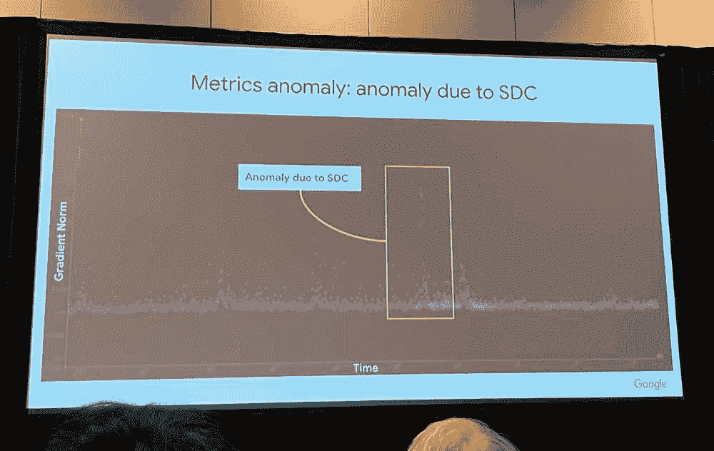

图 16.8：**梯度范数偏差**：瞬态硬件故障，如单数据损坏（SDC），在模型训练期间通过引起梯度范数的突然变化来干扰优化，可能导致收敛问题或不准确的模型。来自谷歌生产车队的真实数据证实，SDC 异常表现为梯度范数随时间出现的可见尖峰，表明预期的参数更新过程受到干扰。来源：jeff dean，mlsys 2024 大会演讲（谷歌）。

在推理阶段，瞬时故障可能会影响机器学习预测的可靠性和可信度。如果在存储训练模型参数的内存或推理结果计算过程中发生瞬时故障，可能会导致预测结果错误或不一致。例如，神经网络激活值中的位翻转可能会改变最终的分类或回归输出（Mahmoud 等人 2020）。在安全关键应用 25 中，这些故障可能产生严重后果，导致错误的决策或行动，可能危害安全或导致系统故障（G. 李等人 2017；S. Jha 等人 2019）。

在资源受限的环境，如 TinyML 中，这些漏洞的影响尤其严重，有限的计算和内存资源加剧了它们的影响。一个突出的例子是二值化神经网络（BNNs）Courbariaux 等人 2016，它使用单比特精度来表示网络权重，以实现计算效率和更快的推理时间。虽然这种二进制表示对资源受限的系统有利，但它也使得 BNNs 特别容易受到位翻转错误的影响。例如，先前的研究(Aygun, Gunes, and De Vleeschouwer 2021)表明，一个用于简单任务如 MNIST 分类的两个隐藏层 BNN 架构，在通过模型权重以 10%的概率插入随机位翻转软错误时，其性能从 98%的测试准确率下降到 70%。为了解决这些漏洞，正在探索诸如翻转感知训练和新兴方法如[随机计算](https://en.wikipedia.org/wiki/Stochastic_computing)26 等技术，以提高容错能力。

### 永久性故障

从暂时性中断过渡到持续性问题，永久性故障是持续存在并导致受影响组件不可逆损坏的硬件缺陷。这些故障以其持续性质为特征，需要修复或更换有故障的硬件才能恢复正常的系统功能。

#### 永久性故障特性

永久性故障会导致硬件组件持续且不可逆的故障。有故障的组件将保持非工作状态，直到修复或更换。这些故障是一致的且可重复的，意味着每次使用受影响的组件时都会观察到故障行为。它们可能影响处理器、内存模块、存储设备或互连，可能导致系统崩溃、数据损坏或完全的系统故障。

为了说明永久性故障的严重后果，一个显著的例子是 1994 年发现的[英特尔 FDIV 错误](https://en.wikipedia.org/wiki/Pentium_FDIV_bug)，这个缺陷影响了某些英特尔奔腾处理器的浮点除法（FDIV）单元，导致特定除法操作的结果不正确，进而导致计算不准确。

FDIV 错误是由于除法单元使用的查找表 27 中的错误引起的。在罕见的情况下，处理器会获取一个错误值，导致结果比预期略不精确。例如，图 16.9 显示了在奔腾处理器上带有 FDIV 错误的 4195835/3145727 分数的绘图。三角形区域突出了错误计算发生的地方。理想情况下，所有正确的值都应该四舍五入到 1.3338，但错误的结果显示为 1.3337，表明第五位数字有错误。

虽然错误很小，但它可能在许多操作中累积，影响精度关键应用的结果，如科学模拟、金融计算和计算机辅助设计。这个错误最终导致这些领域的错误结果，并强调了永久性故障可能带来的严重后果。

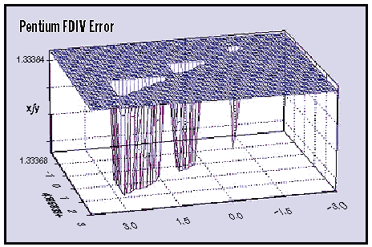

图 16.9：**FDIV 错误区域**：三角形区域表示在计算 4195835/3145727 时，奔腾处理器的有缺陷的除法单元产生了错误结果；理想情况下，所有值都应该四舍五入到 1.3338，但这个错误导致第五位数字有轻微的不准确。来源：byte 杂志。

FDIV 错误是机器学习系统的警示故事。在这些系统中，硬件组件的永久性故障可能导致计算错误，影响模型准确性和可靠性。例如，如果一个机器学习系统依赖于一个带有有缺陷的浮点单元的处理器，类似于 FDIV 错误，它可能在训练或推理过程中引入持续的错误。这些错误可能会通过模型传播，导致预测不准确或学习结果偏差。

这在第十九章中探讨的安全敏感型应用 28 中尤为重要，在这些应用中，计算错误可能带来严重后果。机器学习从业者必须意识到这些风险，并采用容错技术，包括硬件冗余、错误检测和纠正以及鲁棒算法设计，以减轻这些风险。彻底的硬件验证和测试有助于在影响系统性能和可靠性之前识别和解决永久性故障。

#### 永久性故障起源

永久性故障可能源于两个主要来源：制造缺陷和磨损机制。

第一类，[制造缺陷](https://www.sciencedirect.com/science/article/pii/B9780128181058000206)，包括在制造过程中引入的缺陷，包括不正确的蚀刻、错误的掺杂或污染。这些缺陷可能导致非功能或部分功能的组件。相比之下，[磨损机制](https://semiengineering.com/what-causes-semiconductor-aging/)随着时间的推移由于长期使用和操作应力而发生。如电迁移 29、氧化物击穿 30 和热应力 31 等现象会降低组件的完整性，最终导致永久性故障。

#### 永久性故障传播

永久性故障通过多种机制表现出来，这取决于其性质和位置。一个常见的例子是固定故障(Seong 等人 2010)，其中信号或存储单元永久固定在 0 或 1，无论预期的输入如何，如图 16.10 所示(图 16.10)。此类故障可能发生在逻辑门、存储单元或互连中，通常会导致计算错误或持续的数据损坏。


图 16.10：**固定故障模型**：数字电路可能会经历永久性故障，其中信号线固定在逻辑 0 或 1，无论输入如何；此图表示固定在 0 的故障的简化表示，其中信号持续处于低电平，可能导致计算错误或系统故障。*来源：accendo 可靠性*

其他机制包括设备故障，其中硬件组件如晶体管或存储单元由于制造缺陷或随时间退化而完全停止工作。桥接故障，当两个或多个信号线意外连接时发生，可能引入短路或难以隔离的错误逻辑行为。

在更微妙的情况下，当信号的传播时间超过允许的时序约束时，可能会出现延迟故障。逻辑值可能是正确的，但时序预期的违反仍然可能导致错误的行为。同样，互连故障，包括由断开连接引起的开路、阻碍电流流动的高电阻路径以及扭曲信号转换的电容增加，可以显著降低电路性能和可靠性。

存储子系统特别容易受到永久性故障的影响。转换故障可能阻止存储单元成功改变其状态，而耦合故障则源于相邻单元之间的不受欢迎的干扰，导致意外的状态变化。当存储单元的状态被附近存储的数据错误影响时，就会发生邻域模式敏感故障，这反映了电路布局和逻辑行为之间更复杂的相互作用。

永久性故障也可能出现在关键基础设施组件中，如电源网络或时钟分配系统。这些子系统的故障可能会影响整个电路的功能，引入时间错误，或导致广泛的操作不稳定。

总的来说，这些机制说明了永久性故障如何以多种和通常复杂的方式破坏计算系统的行为。对于机器学习应用尤其如此，在这些应用中，正确性和一致性至关重要，理解这些故障模式对于开发弹性硬件和软件解决方案至关重要。

#### 永久性故障对机器学习的影响

永久性故障会严重破坏计算系统的行为和可靠性。例如，处理器算术逻辑单元（ALU）中的卡住故障可能会产生持续的计算错误，导致程序行为错误或崩溃。在内存模块中，此类故障可能会损坏存储的数据，而在存储设备中，它们可能导致坏扇区或数据完全丢失。互连故障可能会干扰数据传输，导致系统挂起或损坏。

对于机器学习系统来说，这些故障在训练和推理阶段都带来了显著的风险。与瞬态故障（第 X.X.X 节）一样，训练过程中的永久性故障会导致类似的梯度计算错误和参数损坏，但会持续到硬件更换，需要更全面的恢复策略（Yi He 等人 2023）。与可能只是暂时中断训练的瞬态故障不同，存储中的永久性故障可能会损害整个训练数据集或保存的模型，影响长期的一致性和可靠性。

在推理阶段，故障可能会扭曲预测结果或导致运行时故障。例如，存储模型权重的硬件中的错误可能会导致使用过时或损坏的模型，而处理器故障可能会导致输出错误 (J. J. Zhang 等人 2018)。

缓解永久性故障需要综合的容错设计，结合硬件冗余和纠错码（J. Kim, Sullivan, 和 Erez 2015）以及软件方法，如检查点和重启机制 32 (Egwutuoha 等人 2013)。

定期监控、测试和维护有助于在发生关键错误之前检测和更换故障组件。

### 间歇性故障

间歇性故障是系统内偶然且不可预测发生的硬件故障。一个例子如图 16.11 所示，其中材料中的裂纹会在电路中引入增加的电阻。这些故障特别难以检测和诊断，因为它们是间歇性地出现和消失的，这使得重现和隔离根本原因变得困难。根据它们的频率和位置，间歇性故障可能导致系统不稳定、数据损坏和性能下降。

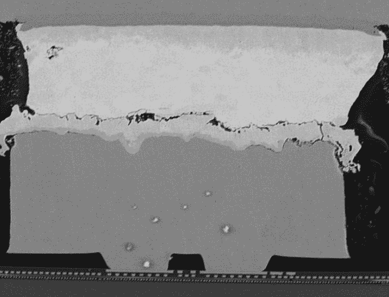

图 16.11：**间歇性故障机制**：铜凸块与封装焊料之间的裂纹引起的电阻增加是间歇性故障的常见来源，这会干扰信号传输并可能导致不可预测的系统行为。这类微观材料缺陷凸显了硬件对难以在测试期间检测到的潜在故障的脆弱性，但这些故障可能在运行期间显现。来源：constantinescu。

#### 间歇性故障的特性

间歇性故障以其偶然性和非确定性行为为定义。它们不规则地发生，可能持续很短的时间，消失时没有一致的模式。与永久性故障不同，它们并非每次使用受影响的组件时都会出现，这使得它们特别难以检测和重现。这些故障可以影响各种硬件组件，包括处理器、内存模块、存储设备和互连。因此，它们可能导致瞬态错误、不可预测的系统行为或数据损坏。

它们对系统可靠性的影响可能非常显著。例如，处理器控制逻辑中的间歇性故障可能会干扰正常的执行路径，导致程序流程不规则或系统意外挂起。在内存模块中，这类故障可能会不规律地改变存储值，导致难以追踪的错误。受间歇性故障影响的存储设备可能会出现间歇性的读写错误或数据丢失，而通信通道中的间歇性故障可能导致数据损坏、数据包丢失或不稳定的连接。随着时间的推移，这些故障可能会累积，降低系统性能和可靠性 (Rashid, Pattabiraman, and Gopalakrishnan 2015)。

#### 间歇性故障的起源

间歇性故障的原因多种多样，从物理退化到环境影响。一个常见的原因是电子元件的老化和磨损。随着硬件长时间运行、热循环和机械应力，它可能会出现裂纹、断裂或疲劳，从而引入间歇性故障。例如，球栅阵列（BGAs）或倒装芯片封装中的焊点可能会随时间退化，导致间歇性开路或短路。

制造缺陷和工艺变化也可能引入边缘组件，这些组件在大多数情况下表现可靠，但在压力或极端条件下会间歇性失效。例如，图 16.12 展示了一个 DRAM 芯片中由残留物引起的间歇性故障，导致偶发故障。

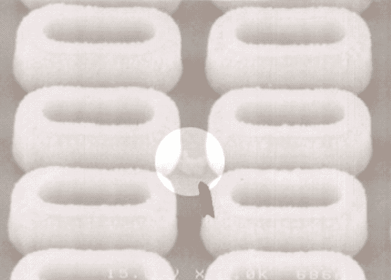

图 16.12：**DRAM 残留故障**：DRAM 芯片中的间歇性故障通常源于微观残留物的积累，造成不可靠的电气连接。物理缺陷可以引起偶发错误，突出了通过此图进行容错系统设计和硬件测试的必要性。*来源：hynix 半导体*

环境因素，如热循环、湿度、机械振动或静电放电，可能会加剧这些弱点并触发本不会出现的故障。松散或退化的物理连接，包括在连接器或印制电路板上发现的连接，也是间歇性故障的常见来源，尤其是在暴露于运动或温度变化中的系统中。

#### 间歇性故障传播

间歇性故障可以通过各种物理和逻辑机制表现出来，具体取决于其根本原因。其中一种机制是间歇性开路或短路，物理不连续性或部分连接导致信号路径行为不可预测。这些故障可能会暂时破坏信号完整性，导致故障或意外的逻辑转换。

另一种常见机制是间歇性延迟故障（张杰等，2018），由于边缘时序条件，信号传播时间波动，导致同步问题和计算错误。在存储单元或寄存器中，间歇性故障可能表现为瞬态位翻转或软错误，以难以检测或重现的方式损坏数据。由于这些故障通常是条件相关的，它们可能仅在特定的热、电压或工作负载条件下出现，从而增加了它们的诊断复杂性。

#### 间歇性故障对机器学习的影响

间歇性故障对机器学习系统构成了重大挑战，因为它破坏了计算一致性和模型可靠性。在训练阶段，处理单元或内存中的此类故障可能导致梯度计算、权重更新或损失值计算中的偶发错误。这些错误可能不是持续的，但可能会在迭代过程中累积，降低收敛性，导致不稳定或次优模型。存储中的间歇性故障可能会损坏输入数据或保存的模型检查点，进一步影响训练流程（何毅等，2023）。

在推理阶段，间歇性故障可能导致不一致或错误的预测。处理错误或内存损坏可能会扭曲激活、输出或模型的中间表示，尤其是在故障影响模型参数或输入数据时。数据管道中的间歇性故障，如不可靠的传感器或存储系统，可能会引入微小的输入错误，降低模型的鲁棒性和输出精度。在自动驾驶或医疗诊断等高风险应用中，这些不一致性可能导致危险的决定或操作失败。

缓解机器学习中间歇性故障的影响需要多层次的方法(Rashid, Pattabiraman, and Gopalakrishnan 2012)。在硬件层面，稳健的设计实践、环境控制和使用更高质量或更可靠的组件可以减少对故障条件的敏感性。冗余和错误检测机制可以帮助识别和从间歇性故障的短暂表现中恢复。

在软件层面，运行时监控、异常检测和自适应控制策略等技术可以提供弹性，与第七章中详细说明的框架能力和第十三章中的部署策略相结合。数据验证检查、异常值检测、模型集成和运行时模型自适应是可集成到机器学习管道中的容错方法，以提高存在间歇性错误时的可靠性。

设计能够优雅地处理间歇性故障的机器学习系统，可以保持其准确性、一致性和可靠性。这涉及到主动故障检测、定期系统监控和持续维护，以确保早期识别和修复问题。通过将弹性嵌入到第十三章中详细说明的架构和操作流程中，机器学习系统即使在容易发生间歇性硬件故障的环境中也能保持稳健。

有效的容错不仅限于检测，还包括在变化系统条件下的自适应性能管理。第十三章中涵盖了全面的资源管理策略，包括故障条件下的负载均衡和动态扩展。对于资源受限的场景，第十章中详细介绍了动态量化和响应于温度或电源限制的选择性剪枝等自适应模型复杂度降低技术，以及第九章中的高效人工智能。

### 硬件故障检测与缓解

故障检测技术，包括硬件级和软件级方法，以及有效的缓解策略，增强了机器学习系统的弹性。关于鲁棒机器学习系统设计考虑、案例研究和容错机器学习系统的研究，为构建稳健的系统提供了见解。

要实现鲁棒的故障缓解，需要在整个机器学习系统堆栈中进行协调适应。虽然这里的重点是故障检测和基本恢复机制，但通过动态资源管理（第十三章）、容错分布式训练方法（第八章）以及适应资源约束下的性能保持的模型优化技术（第十章，第九章）实现了全面的性能适应策略。这些适应策略确保机器学习系统不仅能够检测和恢复故障，还能通过智能资源分配和模型复杂度调整保持最佳性能。在第二十章中探讨了更鲁棒的架构的未来范式，这些架构旨在解决基本漏洞。

#### 硬件故障检测方法

故障检测技术基于第十二章中的性能测量原则，在机器学习系统中识别和定位硬件故障。这些技术可以广泛地分为硬件级和软件级方法，每种方法都提供独特的功能和优势。

##### 硬件级检测

硬件级故障检测技术是在系统的物理级别实现的，旨在识别底层硬件组件中的故障。存在几种硬件技术，可以归类为以下几组。

###### 内置自检（BIST）机制

BIST 是一种强大的技术，用于检测硬件组件中的故障（Bushnell 和 Agrawal 2002）。它涉及将额外的硬件电路集成到系统中进行自检和故障检测。BIST 可以应用于各种组件，例如处理器、内存模块或专用集成电路（ASIC）。例如，BIST 可以通过使用扫描链 33 在处理器中实现，这些是专门用于测试目的的路径，允许访问内部寄存器和逻辑。

在 BIST 过程中，预定义的测试模式被应用于处理器的内部电路，并将响应与预期值进行比较。任何差异都表明存在故障。例如，英特尔 Xeon 处理器包括 BIST 机制，在系统启动时测试 CPU 核心、缓存内存和其他关键组件。


图 16.13：**奇偶校验位错误检测**：此图提供了一个简单的错误检测方案，其中额外的一位（奇偶校验位）确保数据序列中 1 的总数要么是偶数，要么是奇数。第二个序列包含一个翻转的位，触发奇偶校验并指示在传输或存储过程中发生的数据损坏事件。来源：电脑希望。

###### 错误检测码

错误检测码广泛用于检测数据存储和传输错误(Hamming 1950)34。这些码向原始数据添加冗余位，允许检测位错误。例如：奇偶校验是图 16.1335 中显示的简单错误检测码的一种形式。在单比特奇偶校验方案中，每个数据字附加一个额外的位，使得字中的 1 的数量为偶数（偶校验）或奇数（奇校验）。

在读取数据时，会检查奇偶校验，如果它与预期值不匹配，则会检测到错误。更高级的错误检测码，如循环冗余校验（CRC）36，根据数据计算校验和并将其附加到消息中。

###### 硬件冗余和投票机制

硬件冗余涉及复制关键组件，并比较它们的输出以检测和屏蔽故障(Sheaffer, Luebke, and Skadron 2007)。投票机制，如双模块冗余（DMR）37 或三模块冗余（TMR）38，使用多个组件实例，并比较它们的输出以识别和屏蔽故障行为(Arifeen, Hassan, and Lee 2020)。

在 DMR 或 TMR 系统中，两个或三个相同的硬件组件实例（如处理器或传感器）并行执行相同的计算。这些实例的输出被送入一个投票电路，该电路比较结果并选择多数值作为最终输出。如果一个实例由于故障产生错误的结果，投票机制将屏蔽错误并保持正确的输出。TMR 在航空航天和航空系统中常用，因为这些系统对高可靠性至关重要。例如，波音 777 飞机在其主飞行计算机系统中采用 TMR，以确保飞行控制功能的可用性和正确性(Yeh, n.d.)。

另一方面，特斯拉的自动驾驶计算机采用 DMR 架构以确保感知、决策和车辆控制等关键功能的安全性和可靠性，如图 16.14 所示。在特斯拉的实现中，两个相同的硬件单元（通常称为“冗余计算机”或“冗余控制单元”）并行执行相同的计算。每个单元独立处理传感器数据，执行算法，并为车辆的执行器（如转向、加速和制动）生成控制命令(Bannon 等人 2019)。

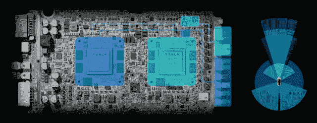

图 16.14：**双重模块冗余**：特斯拉的全自动驾驶计算机采用 DMR 架构，在两个独立的系统芯片（SoC）上复制关键计算，以减轻硬件故障并确保持续运行。这种冗余使得系统能够掩盖错误：如果一个 SoC 失败，另一个将继续运行，保持安全关键功能如感知和控制。*来源：特斯拉*

这两个冗余单元的输出会持续进行比较，以检测任何差异或故障。如果输出匹配，系统假定这两个单元都正常工作，并将控制命令发送到车辆的执行器。然而，如果输出之间出现不匹配，系统会识别出其中一个单元可能存在的潜在故障，并采取适当的行动以确保安全运行。

特斯拉自动驾驶计算机中的 DMR 提供额外的安全性和容错层。通过有两个独立单元执行相同的计算，系统可以检测并减轻可能出现在其中一个单元中的故障。这种冗余有助于防止单点故障，并确保即使在硬件故障的情况下，关键功能也能保持运行。

系统可能采用额外的机制来确定哪个单元在不匹配的情况下出现故障。这可能涉及使用诊断算法，将输出与其他传感器或子系统的数据进行比较，或分析输出随时间的一致性。一旦确定了故障单元，系统可以将其隔离，并继续使用非故障单元的输出运行。

特斯拉还采用了除 DMR 之外的冗余机制。例如，他们使用冗余电源、转向和制动系统，以及多样化的传感器套件 39（例如，摄像头、雷达和超声波传感器），以提供多层次的容错能力。

虽然 DMR 提供了故障检测和一定程度的容错能力，但 TMR 可能提供不同级别的故障掩盖。在 DMR 中，如果两个单元同时发生故障或故障影响了比较机制，系统可能无法识别故障。因此，特斯拉的自动驾驶计算机依赖于 DMR 和其他冗余机制的组合来实现高水平的容错能力。

在特斯拉的自动驾驶计算机中使用 DMR 强调了在需要高可靠性的应用中硬件冗余的重要性。通过使用冗余计算单元并比较它们的输出，系统可以检测和减轻故障，从而提高自动驾驶功能的整体安全和可靠性。

另一种硬件冗余的方法是使用热备件 40，正如谷歌在其数据中心中用于解决机器学习训练期间的自动驾驶计算机问题所做的那样。与依赖于并行处理和投票机制来检测和掩盖故障的 DMR 和 TMR 不同，热备件通过维护备份硬件单元来提供容错能力，当检测到故障时，这些单元可以无缝接管计算。如图 16.15 图 16.15 所示，在正常的机器学习训练期间，多个同步训练工作者并行处理数据。然而，如果一个工作者出现故障并导致自动驾驶计算机问题，自动驾驶计算机检查器会自动识别问题。检测到自动驾驶计算机问题后，自动驾驶计算机检查器将训练转移到热备件，并将故障机器送修。这种冗余确保了机器学习训练的连续性和可靠性，有效地最小化了停机时间并保护了数据完整性。


图 16.15：**热备冗余**：谷歌的数据中心利用热备核心来维持不间断的机器学习训练，即使在硬件故障的情况下也能无缝地将工作负载从故障机器转移到备份资源。这种方法与 DMR/TMR 等并行冗余技术形成对比，它提供了一种反应式容错机制，最小化停机时间并保护机器学习训练期间的数据完整性。来源：杰夫·迪恩，mlsys 2024 大会演讲（谷歌）。

###### 看门狗定时器

看门狗定时器是监控关键任务或进程的硬件组件（Pont 和 Ong 2002）。它们通常用于检测和从导致系统无响应或陷入无限循环的软件或硬件故障中恢复。在嵌入式系统中，看门狗定时器可以配置为监控主控制循环的执行，如图 16.16（ch022.xhtml#fig-watchdog）所示。软件定期重置看门狗定时器以指示其正常工作。假设软件未能在一个指定的时间限制（超时期间）内重置定时器，那么看门狗定时器假定系统遇到了故障，并触发一个预定义的恢复操作，例如重置系统或切换到备用组件。看门狗定时器在汽车电子、工业控制系统和其他安全关键应用中得到广泛应用，以确保及时检测和从故障中恢复。


图 16.16：**看门狗定时器操作**：嵌入式系统利用看门狗定时器通过定期重置超时计数器来检测和从软件或硬件故障中恢复；如果在规定时间内未能重置，则触发系统重置或恢复操作，确保持续运行。来源：[ablic](https://www.ablic.com/en/semicon/products/automotive/automotive-watchdog-timer/intro/)

##### 软件级检测

软件级故障检测技术依赖于软件算法和监控机制来识别系统故障。这些技术可以在软件堆栈的各个级别实现，包括操作系统、中间件或应用层。

###### 运行时监控和异常检测

运行时监控涉及在执行过程中持续观察系统和其组件的行为（Francalanza 等人 2017），扩展了第十三章（ch019.xhtml#sec-ml-operations）中的操作监控实践。它有助于检测异常、错误或可能表明存在故障的意外行为。例如，考虑一个部署在自动驾驶汽车中的基于机器学习的图像分类系统。运行时监控可以实施以跟踪分类模型的性能和行为（Mahmoud 等人 2021）。

异常检测算法可以应用于模型的预测或中间层激活，例如统计异常值检测或基于机器学习的方法（例如，单类 SVM 或自编码器）(Chandola, Banerjee, and Kumar 2009）。图 16.17 展示了异常检测的示例。假设监控系统检测到与预期模式显著偏差的情况，例如分类准确性的突然下降或分布外的样本。在这种情况下，它可以发出警报，表明模型或输入数据管道可能存在潜在故障。这种早期检测允许及时采取干预措施和故障缓解策略。


图 16.17：**使用 SVM 进行异常检测**：支持向量机通过将日志数据映射到高维空间并定义预期值周围的边界来识别正常系统行为的偏差，从而实现潜在故障的检测。如图所示的无监督异常检测技术，在标记的故障数据稀缺时尤其有价值，允许系统从未标记的操作数据中学习模式。来源：[Google](https://www.google.com/url?sa=i&url=HTTP%3A%2F%2Fresearch.google.com%2fblog%2funsupervised-and-semi-supervised-)

###### 一致性检查和数据验证

一致性检查和数据验证技术确保了在机器学习系统不同处理阶段的数据完整性和正确性（A. Lindholm 等人 2019）。这些检查有助于检测数据损坏、不一致或错误，这些错误可能会传播并影响系统的行为。例如，在一个分布式机器学习系统中，多个节点协作训练模型时，可以实施一致性检查以验证共享模型参数的完整性。每个节点可以在训练迭代前后计算模型参数的校验和或哈希值，如图 16.17 所示。通过比较节点间的校验和，可以检测到任何不一致或数据损坏。范围检查可以应用于输入数据和模型输出，以确保它们在预期的范围内。例如，如果自动驾驶车辆的感觉系统检测到具有不切实际尺寸或速度的对象，这可能表明传感器数据或感知算法存在故障（Wan 等人 2023）。

###### 心跳和超时机制

心跳机制和超时通常用于检测分布式系统中的故障，并确保组件的活性和响应性（Kawazoe Aguilera, Chen, and Toueg 1997）。这些与硬件中发现的看门狗定时器非常相似。例如，在一个分布式机器学习系统中，多个节点协作执行数据预处理、模型训练或推理等任务，可以实现心跳机制来监控每个节点的健康和可用性。每个节点定期向中央协调器或其对等节点发送心跳消息，表明其状态和可用性。假设一个节点在指定的超时时间内未能发送心跳，如图 16.18 所示。在这种情况下，它被认为是故障的，可以采取适当的措施，例如重新分配工作负载或启动故障转移机制。鉴于网络分区每天影响大型分布式训练集群中的 1-10%的节点，这些心跳系统必须区分节点故障和网络连接问题，以避免不必要的故障转移操作，这可能会干扰训练进度。超时还可以用于检测和处理挂起或无响应的组件。例如，如果数据加载过程超过预定义的超时阈值，这可能表明数据管道存在故障，系统可以采取纠正措施。


图 16.18：**心跳和超时**：分布式系统通过定期发送心跳消息来检测节点故障；在定义的超时时间内没有响应表明存在故障，从而触发纠正措施，如工作负载重新分配或故障转移。这种机制类似于看门狗定时器，即使在组件故障的情况下也能确保系统的健壮性和持续运行。来源：geeksforgeeks.

###### 软件实现的容错（SIFT）技术

SIFT 技术在软件层面引入冗余和故障检测机制，以提高系统的可靠性和容错性（Reis 等人，未发表）。例如：N 版本编程是一种 SIFT 技术，其中多个功能等效的软件组件版本由不同的团队独立开发。这可以应用于关键组件，如机器学习系统中的模型推理引擎。推理引擎的多个版本可以并行执行，并比较它们的输出以检查一致性。如果大多数版本产生相同的输出，则被认为是正确的结果。差异表明一个或多个版本中可能存在潜在故障，从而触发适当的错误处理机制。另一个例子是使用基于软件的错误纠正码，如里德-所罗门码(Plank 1997)，来检测和纠正数据存储或传输中的错误，如图 16.19 所示。这些码向数据添加冗余，能够检测和纠正某些错误，并增强系统的容错性。


图 16.19：**心跳监控**：冗余节点连接和周期性心跳消息检测和隔离分布式系统中的故障组件，确保在硬件故障的情况下继续运行。这些机制通过允许节点识别无响应的节点并相应地重新路由通信，从而实现容错。来源：geeksforgeeks.

### 硬件故障摘要

表 16.3 提供了瞬态、永久性和间歇性故障的比较分析。它概述了区分这些故障类型的主要特征或维度。在此，我们总结了我们考察的相关维度，并更详细地探讨了区分瞬态、永久性和间歇性故障的细微差别。

虽然硬件故障代表了系统脆弱性的一个维度，但它们很少单独发生。我们考察的物理故障通常与人工智能系统的算法组件相互作用，并暴露出其弱点。当我们考虑对手如何通过精心设计的输入来利用模型漏洞时，这种互联性变得尤为明显——这是我们下一节关于输入级攻击的重点。

表 16.3：**故障特性**：瞬态故障、永久性故障和间歇性故障在持续时间、持续性和复发性方面有所不同，影响系统可靠性，并需要针对稳健人工智能部署采取不同的缓解策略。理解这些区别有助于设计能够处理操作期间各种硬件故障的容错系统。

| **维度** | **瞬态故障** | **永久性故障** | **间歇性故障** |
| --- | --- | --- | --- |
| **持续时间** | 短暂的、暂时的 | 持久的、直到修复或更换 | 偶然出现和消失 |
| **持续性** | 故障条件通过后消失 | 一致存在，直到问题解决 | 不规则地重复出现，不一定总是存在 |
| **原因** | 外部因素（例如，电磁干扰、宇宙射线） | 硬件缺陷、物理损坏、磨损 | 不稳定的硬件条件、松散的连接、老化组件 |
| **表现** | 比特翻转、故障、暂时性数据损坏 | 卡在故障、损坏的组件、完全设备故障 | 偶尔发生比特翻转、间歇性信号问题、偶然故障 |
| **对机器学习的影响** | 引入暂时性错误 | 导致持续性的错误或 | 导致偶然和不可预测的错误， |
| **系统** | 或计算中的噪声 | 故障，影响可靠性 | 诊断和缓解都很有挑战性 |
| **检测** | 错误检测码，与预期值比较 | 内置自检，错误检测码，一致性检查 | 监测异常，分析错误模式和相关性 |
| **缓解措施** | 错误纠正码、冗余、检查点和重启 | 硬件维修或更换、组件冗余、故障转移机制 | 坚固的设计、环境控制、运行时监控、容错技术 |

## 故意输入操纵

输入级攻击代表了一种与无意硬件故障不同的威胁模型。与随机比特翻转和组件故障不同，这些攻击涉及对数据进行故意操纵，以损害系统行为。这些复杂的尝试通过精心设计的输入或损坏的训练数据来操纵机器学习模型的行为。这些攻击向量可以放大硬件故障的影响，例如，当对手精心设计输入以触发故障受损硬件的边缘情况时。

### 对抗性攻击

#### 概念基础

在其核心，对抗性攻击出奇地简单：向输入添加微小的、计算出的变化，以欺骗模型，同时对人来说却不可见。想象一下调整一张猫的照片中的几个像素，变化如此微妙以至于你看不见，但模型突然将其分类为烤面包机，置信度为 99%。这种反直觉的漏洞源于神经网络处理信息的方式与人类不同。

通过类比来理解潜在机制，考虑一个通过主要寻找尖耳朵来识别猫的人。对抗攻击就像向这个人展示一张狗的照片，但仔细地在狗的耷拉耳朵上画上微小、几乎看不见的尖耳朵。因为这个人的算法过度依赖于尖耳朵特征，他们自信地将狗错误地分类为猫。这就是对抗攻击的工作方式：它们找到模型依赖的特定、通常是表面的特征并利用它们，即使这些变化对人类观察者来说没有意义。

ML 模型学习的是统计模式而不是语义理解。它们在高度维度的空间中运行，其中决策边界可能非常脆弱。在这个空间中的微小移动，在输入域中几乎不可察觉，可以跨越这些边界并触发错误分类。

#### 技术机制

对抗攻击利用了机器学习模型对人类几乎不可察觉的小输入扰动的敏感性，但会导致模型输出发生巨大变化。这些攻击揭示了模型学习决策边界和从训练数据泛化的脆弱性。其数学基础依赖于模型的梯度信息来识别最有效的扰动方向。

**快速梯度符号法（FGSM）**（Goodfellow、Shlens 和 Szegedy 2014b）代表了一种最早且最具影响力的对抗攻击技术。FGSM 通过在损失函数相对于梯度的方向添加小的扰动来生成对抗示例，有效地“推动”输入向错误分类边界移动。对于 ImageNet 分类器，ε = 8/255（几乎不可察觉的扰动）的 FGSM 攻击可以将准确率从 76%降低到 10%以下，展示了深度网络对微小输入修改的脆弱性。

投影梯度下降（PGD）攻击（Madry 等人 2017）通过迭代应用小的扰动并将其投影回允许的扰动空间来扩展 FGSM。具有 40 次迭代和步长α = 2/255 的 PGD 攻击在未受保护的模型上实现了近 100%的攻击成功率，将 CIFAR-10 的准确率从 95%降至 5%以下。这些攻击被认为是最强的一阶对抗者之一，并作为评估防御机制的基准。

物理世界攻击对部署的 AI 系统提出了特别的挑战。研究表明，对抗样本可以被打印、拍照或显示在屏幕上，同时保持其攻击有效性（Kurakin, Goodfellow, 和 Bengio 2016）。当在交通标志上放置物理补丁时，停止标志攻击的误分类率达到 87%，导致自动驾驶车辆分类器将“STOP”标志解释为“限速 45”，可能产生灾难性的后果。实验室研究表明，对抗样本在不同光照条件（2,000-10,000 lux）、观察角度（±30 度）和相机距离（2-15 米）下仍保持有效性。

### 数据中毒攻击

数据中毒攻击通过向训练数据集中注入恶意样本来针对训练阶段，导致模型学习错误的关联或在对准输入上表现出特定行为。这些攻击在从不受信任的来源或通过众包收集训练数据的情况下尤其令人担忧。

标签翻转攻击通过修改训练样本的标签来引入错误关联。研究表明，在 CIFAR-10 中翻转 3%的标签，将目标类准确率从 92%降低到 11%，而整体模型准确率仅下降 2-4%，这使得检测变得困难。对于 ImageNet，损坏 0.5%的标签（6,500 张图像）可以使特定类别的目标误分类率超过 90%，同时保持 94%的干净准确率。

后门攻击通过在训练样本中注入特定的触发模式，使得模型在测试输入中存在触发器时表现出攻击者控制的行为（T. Gu, Dolan-Gavitt, 和 Garg 2017）。研究表明，在 1%的训练数据中插入后门触发器，对携带触发器的测试输入的攻击成功率可达 99.5%。模型在干净输入上表现正常，但会持续错误地将包含后门触发器的输入分类，通常准确率下降不到 1%。

基于梯度的中毒攻击通过创建看似无害的训练样本，但在训练过程中导致梯度更新将模型推向攻击者的目标（Shafahi 等人 2018）。这些攻击需要精确的优化，但可能具有破坏性：在 CIFAR-10 中中毒 50 个精心制作的图像（占训练数据的 0.1%）可以实现超过 70%的目标误分类率。计算成本很高，需要 15-20 倍更多的训练时间来生成最佳的中毒样本，但攻击仍然无法通过视觉检查检测到。

### 检测和缓解策略

鲁棒的人工智能系统采用多种防御机制来对抗输入级别的攻击，遵循我们在统一框架中建立的检测、优雅降级和自适应响应原则。

输入净化在对抗性扰动到达模型之前应用预处理技术来移除或减少它们。使用质量因子为 75%的 JPEG 压缩可以中和 60-80%的对抗样本，同时仅降低 1-2%的干净数据精度。使用高斯滤波器（σ = 0.5）进行图像去噪可以阻止 45%的 FGSM 攻击，但需要仔细调整以避免降低合法输入。几何变换，如随机旋转（±15°）和缩放（0.9-1.1<semantics><mi>×</mi><annotation encoding="application/x-tex">\times</annotation></semantics>），在最小化干净数据精度损失的同时提供 30-50%的防御效果。

对抗性训练（Madry 等人 2017）将对抗样本纳入训练过程，教导模型在存在对抗性扰动的情况下保持正确的预测。在 CIFAR-10 上进行的 PGD 对抗性训练对于 ε = 8/255 的攻击实现了 87%的鲁棒精度，而未防御的模型为 0%，尽管干净精度从 95%下降到 84%。由于每个 epoch 期间生成对抗样本，训练时间增加了 6-10<semantics><mi>×</mi><annotation encoding="application/x-tex">\times</annotation></semantics>，需要专门的硬件加速来实现实际应用。

认证防御在指定的扰动范围内为模型鲁棒性提供数学保证（J. Cohen、Rosenfeld 和 Kolter 2019）。随机平滑在 ImageNet 上对于 ℓ2 扰动（σ = 0.5）实现了 67%的认证精度，相比之下，干净数据的精度为 76%。对于 54%的测试输入，认证半径增加到 ε = 1.0，提供了可证明的鲁棒性保证。然而，由于蒙特卡洛抽样的需求（通常每个预测 1,000 个样本），推理时间增加了 100-1000<semantics><mi>×</mi><annotation encoding="application/x-tex">\times</annotation></semantics>。

集成方法利用多个模型或检测机制来识别和过滤对抗性输入（Tramèr 等人 2017）。5 个独立训练的模型集使用预测熵阈值（τ = 1.5）实现了 94%的对抗样本检测率，在干净数据上的误报率低于 2%。计算开销与集成规模线性相关，对于 5 模型集成，需要<semantics><mrow><mn>5</mn><mo>×</mo></mrow><annotation encoding="application/x-tex">5\times</annotation></semantics>的推理时间和内存，使得实时部署变得具有挑战性。

虽然输入级攻击代表了有意破坏模型行为的尝试，但 AI 系统还必须应对其操作环境中可能同样具有破坏性的自然变化。这些环境挑战自然地源于现实世界部署的演变性质。

## 环境变化

强健 AI 的第三个支柱解决了现实世界条件随时间自然演变的问题，这些问题可能会降低模型性能。与输入级攻击的有意操纵或硬件故障的随机故障不同，环境变化反映了在动态环境中部署静态模型的固有挑战，其中数据分布、用户行为和操作环境持续演变。这些变化可以与其他漏洞类型协同作用。例如，经历分布偏移的模型更容易受到对抗攻击，而硬件错误在改变的环境条件下可能表现出不同的形式。

### 分布偏移和概念漂移

#### 直观理解

考虑一个基于现代医院 X 光图像训练的医疗诊断模型。当该模型部署在设备较旧的乡村诊所时，其准确性大幅下降，并非因为潜在的医学状况发生了变化，而是因为图像特征不同。这体现了分布偏移：模型遇到的世界与它学习到的世界不同。

随着环境的演变，分布偏移自然发生。用户偏好会随季节变化，语言会随着新俚语的产生而演变，经济模式会随着市场条件的变化而变化。与需要恶意意图的对抗攻击不同，这些变化自然地源于现实世界系统的动态性质。

#### 技术类别

协变量偏移发生在输入分布发生变化，而输入和输出之间的关系保持恒定时（Quiñonero-Candela 等人 2008）。在白天图像（亮度为 1,000-100,000 勒克斯）上训练的自动驾驶车辆感知模型在夜间条件下（0.1-10 勒克斯）部署时，准确性会下降 15-30%，尽管物体识别任务没有变化。天气条件引入了额外的协变量偏移：与晴朗条件相比，雨会使物体检测 mAP 降低 12%，雪降低 18%，雾降低 25%。

概念漂移代表了输入和输出之间基本关系随时间的变化（Widmer 和 Kubat 1996）。信用卡欺诈检测系统会经历概念漂移，6 个月的关联衰减率为 0.2-0.4，需要每 90-120 天重新训练模型，以保持 85%以上的精度。电子商务推荐系统在 3-6 个月内由于季节性偏好变化和用户行为模式的演变，准确性会下降 15-20%。

标签偏移会影响输出类别的分布，而不改变输入输出关系（Lipton, Wang, and Smola 2018）。COVID-19 导致医学影像中的标签偏移发生巨大变化：某些医院系统中肺炎的发病率从 12%增加到 35%，需要重新校准诊断阈值。农业监测中的季节性标签偏移显示作物疾病发病率在生长季节之间变化 40-60%，需要适应性的决策边界以进行准确的产量预测。

### 监控和适应策略

对环境变化的有效响应需要持续监控部署条件，并具有适应机制，以保持模型性能随条件变化。

统计距离度量通过测量训练数据和部署数据分布之间的差异来量化分布变化的程度。使用径向基函数核（γ = 1.0）的最大均值差异（MMD）对于 Cohen’s d > 0.5 的偏移提供了 0.85 的检测灵敏度，在现代硬件上处理 10,000 个样本只需 150 ms。Kolmogorov-Smirnov 测试对于具有 1,000+样本的单变量偏移达到 95%的检测率，但扩展到高维数据时表现不佳。人口稳定性指数（PSI）阈值为 0.1-0.25 表明存在需要模型调查的显著偏移。

在线学习使模型能够持续适应新数据，同时保持对先前学习模式的性能（Shalev-Shwartz 2011）。学习率η = 0.001-0.01 的随机梯度下降在 100-500 个样本内实现概念漂移适应的收敛。通常需要 2-5 MB 的内存开销来维持足够的历史上下文，而计算增加了 15-25%的推理延迟以实现实时适应。像弹性权重巩固（Elastic Weight Consolidation）这样的技术通过正则化系数λ = 400-40,000 防止灾难性遗忘。

模型集成和选择维护多个针对不同环境条件专门化的模型，根据检测到的环境特征动态选择最合适的模型（Ross, Gordon, and Bagnell 2011）。具有 3-7 个模型的集成系统在分布偏移下比单个模型提高了 8-15%的准确性，每次预测的选择开销为 2-5 ms。基于最近性能的动态加权（滑动窗口为 500-2,000 个样本）提供了对渐进漂移的最佳适应。

联邦学习能够在保持隐私的同时，实现跨多个部署环境的分布式自适应。拥有 50-1,000 个参与者的 FL 系统在 10-50 轮通信中实现收敛，每轮通信需要 10-100 MB 的参数传输，具体取决于模型大小。本地训练通常每轮需要 5-20 个 epoch，当带宽低于 1 Mbps 时，通信成本占主导地位。差分隐私（ε = 1.0-8.0）添加噪声，但大多数应用中模型效用保持在 90%以上。

## 鲁棒性评估工具

在考察了鲁棒人工智能的三个支柱——硬件故障、输入级攻击和环境变化后，学生们现在有了理解专门用于鲁棒性评估和改进的工具和框架的概念基础。这些工具在所有三个威胁类别中实现了检测、优雅降级和自适应响应原则。

类似于 PyTorchFI 和 TensorFI 的硬件故障注入工具能够系统地测试机器学习模型对之前描述的短暂、永久和间歇性故障的恢复能力。对抗攻击库实现了 FGSM、PGD 和认证防御技术，用于评估输入级鲁棒性。分布监控框架提供了环境变化管理所必需的统计距离指标和漂移检测能力。

现代鲁棒性工具可以直接集成到流行的机器学习框架（PyTorch、TensorFlow、Keras）中，使得将鲁棒性评估无缝融入第十三章中建立的开发工作流程成为可能。这些工具及其实际应用的全面审查出现在第 16.10 节中，为构建鲁棒人工智能系统提供了详细的实施指南。

## 输入级攻击与模型鲁棒性

虽然硬件故障代表了底层计算基础设施的无意中断，但模型鲁棒性的担忧扩展到针对人工智能系统决策过程和操作环境中的自然变化的故意攻击。从硬件可靠性到模型鲁棒性的转变反映了从保护计算物理基础到防御定义模型行为的学到的表示和决策边界的转变。

这种转变需要改变视角。硬件故障通常表现为损坏的计算、内存错误或通信故障，这些故障以由底层计算图指导的、可预测的方式在系统中传播。相比之下，模型鲁棒性挑战利用或揭示了模型对其问题域理解的核心局限性。对抗攻击设计输入以触发错误分类，数据中毒会破坏训练过程本身，而分布偏移揭示了模型在超出其训练假设的情况下部署时的脆弱性。

根据我们从第 16.3 节提出的三个类别鲁棒性框架，不同的挑战类型需要互补的防御策略。虽然硬件故障缓解通常依赖于冗余、错误检测码和优雅降级，但模型鲁棒性需要像对抗训练、输入净化、领域适应以及持续监控模型在部署中的行为等技术。

当我们考虑到现实世界的 AI 系统面临复合威胁时，这种双重视角的重要性变得清晰，这些威胁中硬件故障和模型脆弱性可以以复杂的方式相互作用。一个损坏模型权重的硬件故障可能会创建新的对抗性脆弱性，而对抗攻击可能会触发类似于硬件故障的错误条件。我们从第 16.3 节提供的统一框架为系统地解决这些相互关联的挑战提供了概念基础。

### 对抗攻击

对抗攻击代表了现代机器学习系统中反直觉的脆弱性。这些攻击利用了神经网络学习和表示信息的核心特征，揭示了模型对精心设计的、对人类观察者而言难以察觉的修改的极端敏感性。这些攻击通常涉及向输入数据添加小的、精心设计的扰动，这可能导致模型错误分类，如图图 16.20 所示。

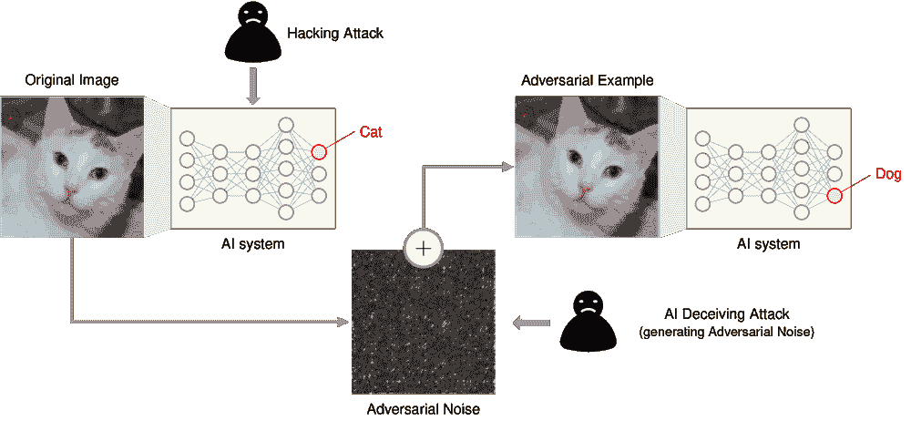

图 16.20: **对抗扰动**: 微妙且故意设计的噪声可能导致神经网络以高置信度错误分类图像，暴露了模型鲁棒性的脆弱性。这些对人类而言难以察觉的扰动以最大化预测错误的方式改变输入，突显了对抗攻击防御的必要性。来源：Sutanto (2019)。

#### 理解脆弱性

理解为什么这些攻击如此有效需要检查它们如何揭示了神经网络架构中的核心局限性。对抗样本的存在揭示了人类和机器感知之间的核心不匹配 41。

这种脆弱性源于神经网络学习的一些特性 42。高维输入空间 43 提供了攻击者可以同时利用的多个维度。

对为什么存在对抗样本的深入理解对于开发有效的防御措施至关重要。这种脆弱性反映了神经网络在高维空间中表示和处理信息的基本属性，而不仅仅是软件漏洞或训练伪象。解释为什么神经网络 44 天生容易受到对抗性扰动的理论基础在第三章中得到了全面详细的阐述。

#### 攻击类别和机制

根据攻击者构建扰动的方法和攻击者可用的信息，对抗攻击可以被组织成几个类别。每个类别利用模型脆弱性的不同方面，并需要不同的防御考虑。

##### 基于梯度的攻击

最直接且研究最广泛的类别包括基于梯度的攻击，这些攻击利用了神经网络训练的核心方面：用于训练模型的相同梯度信息可以被武器化来攻击它们。这些攻击通过利用模型自身的学习机制来对抗自身，代表了生成对抗样本的最直接方法。

**概念基础**

基于梯度攻击背后的关键洞察是，神经网络通过计算梯度来理解其输入的变化如何影响其输出。在训练过程中，梯度引导权重更新以最小化预测误差。对于攻击，这些相同的梯度揭示了哪些输入修改会最大化预测误差——本质上是在反向运行训练过程。

为了说明这个概念，可以考虑一个图像分类模型，该模型能够正确识别照片中的猫。相对于输入图像的梯度显示了模型预测对每个像素变化的敏感性。攻击者可以使用这些梯度信息来确定最有效地修改特定像素以改变模型预测的方法，可能使模型将猫误分类为狗，同时使变化对人类观察者不可察觉。

**快速梯度符号法 (FGSM)**

快速梯度符号法 45 展示了基于梯度的攻击 46 的优雅和危险。FGSM 采用了概念上简单的方法，即朝着最快增加模型预测误差的方向移动。

基本的数学公式捕捉了这个直观的过程：

<semantics><mrow><msub><mi>x</mi><mtext mathvariant="normal">adv</mtext></msub><mo>=</mo><mi>x</mi><mo>+</mo><mi>ϵ</mi><mo>⋅</mo><mtext mathvariant="normal">sign</mtext><mo minsize="1.2" maxsize="1.2" stretchy="false" form="prefix">(</mo><msub><mi>∇</mi><mi>x</mi></msub><mi>J</mi><mrow><mo stretchy="true" form="prefix">(</mo><mi>θ</mi><mo>,</mo><mi>x</mi><mo>,</mo><mi>y</mi><mo stretchy="true" form="postfix">)</mo></mrow><mo minsize="1.2" maxsize="1.2" stretchy="false" form="postfix">)</mo></mrow> <annotation encoding="application/x-tex">x_{\text{adv}} = x + \epsilon \cdot \text{sign}\big(\nabla_x J(\theta, x, y)\big)</annotation></semantics>

其中各部分代表：

+   <semantics><mi>x</mi><annotation encoding="application/x-tex">x</annotation></semantics>: 原始输入（例如，一只猫的图像）

+   <semantics><msub><mi>x</mi><mtext mathvariant="normal">adv</mtext></msub><annotation encoding="application/x-tex">x_{\text{adv}}</annotation></semantics>: 将欺骗模型的对抗性示例

+   <semantics><mrow><msub><mi>∇</mi><mi>x</mi></msub><mi>J</mi><mrow><mo stretchy="true" form="prefix">(</mo><mi>θ</mi><mo>,</mo><mi>x</mi><mo>,</mo><mi>y</mi><mo stretchy="true" form="postfix">)</mo></mrow></mrow><annotation encoding="application/x-tex">\nabla_x J(\theta, x, y)</annotation></semantics>: 显示输入变化对预测误差影响最大的梯度

+   <semantics><mrow><mtext mathvariant="normal">sign</mtext><mrow><mo stretchy="true" form="prefix">(</mo><mi>⋅</mi><mo stretchy="true" form="postfix">)</mo></mrow></mrow><annotation encoding="application/x-tex">\text{sign}(\cdot)</annotation></semantics>: 仅提取变化方向，忽略大小差异

+   <semantics><mi>ϵ</mi><annotation encoding="application/x-tex">\epsilon</annotation></semantics>: 控制扰动强度（对于归一化输入通常为 0.01-0.3）

+   <semantics><mrow><mi>J</mi><mrow><mo stretchy="true" form="prefix">(</mo><mi>θ</mi><mo>,</mo><mi>x</mi><mo>,</mo><mi>y</mi><mo stretchy="true" form="postfix">)</mo></mrow></mrow><annotation encoding="application/x-tex">J(\theta, x, y)</annotation></semantics>: 测量预测误差的损失函数

梯度<semantics><mrow><msub><mi>∇</mi><mi>x</mi></msub><mi>J</mi><mrow><mo stretchy="true" form="prefix">(</mo><mi>θ</mi><mo>,</mo><mi>x</mi><mo>,</mo><mi>y</mi><mo stretchy="true" form="postfix">)</mo></mrow></mrow><annotation encoding="application/x-tex">\nabla_x J(\theta, x, y)</annotation></semantics>量化了损失函数相对于每个输入特征的改变，表明哪些输入修改能够最有效地增加模型的预测误差。函数<semantics><mrow><mtext mathvariant="normal">sign</mtext><mrow><mo stretchy="true" form="prefix">(</mo><mi>⋅</mi><mo stretchy="true" form="postfix">)</mo></mrow></mrow><annotation encoding="application/x-tex">\text{sign}(\cdot)</annotation></semantics>提取了最陡上升的方向，而扰动幅度<semantics><mi>ϵ</mi><annotation encoding="application/x-tex">\epsilon</annotation></semantics>控制了应用于每个输入维度的修改强度。

这种方法通过在增加损失最快的方向上迈出一步来生成对抗样本，如图 16.21 所示。图 16.21。

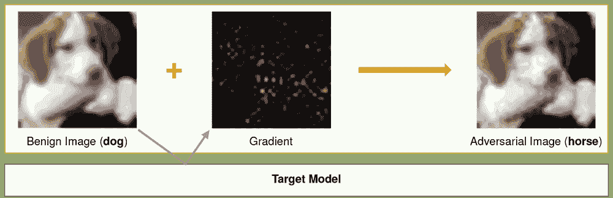

图 16.21：**对抗扰动**：基于梯度的攻击生成细微、有意设计的输入噪声（幅度由<semantics><mi>ϵ</mi><annotation encoding="application/x-tex">\epsilon</annotation></semantics>控制），以最大化损失函数<semantics><mrow><mi>j</mi><mrow><mo stretchy="true" form="prefix">(</mo><mi>θ</mi><mo>,</mo><mi>x</mi><mo>,</mo><mi>y</mi><mo stretchy="true" form="postfix">)</mo></mrow></mrow><annotation encoding="application/x-tex">j(\theta, x, y)</annotation></semantics>并导致模型误分类。这些对人类来说难以察觉的扰动通过将输入<semantics><mi>x</mi><annotation encoding="application/x-tex">x</annotation></semantics>移动到决策边界来利用模型漏洞。来源：ivezic

在此基础上，投影梯度下降（Projected Gradient Descent，PGD）攻击(Kurakin, Goodfellow, and Bengio 2016)通过迭代应用梯度更新步骤扩展了 FGSM，允许生成更精细和强大的对抗样本。PGD 将每个扰动步骤投影回原始输入周围的约束范数球内，确保对抗样本保持在指定的扭曲限制内。这使得 PGD 成为一种更强的白盒攻击，并成为评估模型鲁棒性的基准。

基于雅可比的显著性图攻击 (JSMA) (Papernot, McDaniel, Jha, et al. 2016) 是另一种基于梯度的方法，它识别最有影响力的输入特征，并通过扰动它们来创建对抗样本。通过构建基于模型输出相对于输入的雅可比的显著性图，JSMA 选择性地改变最有可能影响目标类的一小部分输入维度。这使得 JSMA 比 FGSM 或 PGD 更精确和有针对性，通常需要更少的扰动来欺骗模型。

基于梯度的攻击在白盒设置 47 中特别有效，攻击者可以访问模型的架构和梯度。它们的效率和相对简单性使它们成为研究攻击和评估模型鲁棒性的流行工具。

##### 基于优化的攻击

虽然基于梯度的方法提供了速度和简单性，但基于优化的攻击将对抗样本的生成形式化为一个更复杂的优化问题。Carlini 和 Wagner (C&W) 攻击 (Carlini and Wagner 2017)48 是这一类别中的突出例子。它找到最小的扰动，可以在保持与原始输入的感知相似性的同时导致误分类。C&W 攻击采用迭代优化过程来最小化扰动，同时最大化模型的预测误差。它使用一个包含置信度项的定制损失函数来生成更自信的误分类。

C&W 攻击特别难以检测，因为扰动通常对人类来说是不可察觉的，并且它们经常绕过许多现有的防御措施。攻击可以在各种范数约束下进行公式化（例如，L2，L∞），具体取决于对抗扰动的期望特性。

在此优化框架的基础上，弹性网络攻击到深度神经网络 (EAD) 结合弹性网络正则化（L1 和 L2 惩罚的组合）来生成具有稀疏扰动的对抗样本。这可能导致输入的最小和局部变化，这些变化更难识别和过滤。EAD 在需要限制扰动的大小和空间范围的情况下特别有用。

这些攻击比基于梯度的方法计算量更大，但可以更精细地控制对抗样本的特性，通常需要详细说明在第十章中的专用优化技术。它们通常用于高风险领域，在这些领域中，隐蔽性和精确性至关重要。

##### 基于迁移的攻击

从直接优化转向利用模型相似性，基于迁移的攻击利用了对抗性示例的可迁移性属性 49。可迁移性指的是为某个机器学习模型制作的对抗性示例往往可以欺骗其他模型，即使它们具有不同的架构或是在不同的数据集上训练。这使得攻击者可以使用代理模型生成对抗性示例，然后将它们转移到目标模型，而无需直接访问其参数或梯度。

这种可迁移性属性是黑盒攻击可行性的基础，在这种攻击中，攻击者无法查询梯度，但可以通过对公开可用或类似的替代模型进行攻击来欺骗模型。基于迁移的攻击在攻击商业机器学习 API 等实际威胁场景中尤其相关，攻击者可以观察到输入和输出，但不能观察到内部计算。

攻击的成功往往取决于模型之间的相似性、训练数据的一致性以及所使用的正则化技术。可以使用输入多样性（随机调整大小、裁剪）和优化过程中的动量等技术来增加可迁移性。

##### 物理世界攻击

物理世界攻击将对抗性示例带入现实场景。这些攻击涉及创建物理对象或操作，当通过传感器或摄像头捕捉时，可以欺骗机器学习模型。例如，对抗性补丁是精心设计的小型图案，可以放置在物体上以欺骗目标检测或分类模型。这些补丁被设计成能够在不同的光照条件、观察角度和距离下工作，使它们在现实世界环境中具有鲁棒性。

当这些补丁附着在现实世界的物体上，例如停车标志或一件衣物上时，它们可能会导致模型误分类或无法准确检测到这些物体。值得注意的是，这些攻击的有效性即使在打印出来并通过相机镜头观察后仍然存在，这跨越了对抗性机器学习中的数字和物理界限。

对抗性物体，如 3D 打印雕塑或修改过的路标，也可以被制作出来以欺骗物理环境中的机器学习系统。例如，一个 3D 海龟物体被证明在从不同角度观察时，始终被图像分类器错误地分类为步枪。这些攻击突显了在物理空间中部署的 AI 系统（如自动驾驶汽车、无人机和监控系统）所面临的风险，并在第十七章中涵盖了关于负责任 AI 部署的临界考虑。

物理世界攻击的研究还包括开发通用对抗性扰动，这些扰动可以欺骗广泛范围的输入和模型。这些威胁在 AI 系统的安全性、鲁棒性和泛化方面提出了严重的问题。

##### 摘要

表 16.4 提供了对不同类别对抗性攻击的简要概述，包括基于梯度的攻击（FGSM、PGD、JSMA）、基于优化的攻击（C&W、EAD）、基于迁移的攻击和物理世界攻击（对抗性补丁和对象）。每种攻击都简要描述，突出其关键特性和机制。

对抗性攻击的机制揭示了机器学习模型决策边界、输入数据和攻击者目标之间的复杂相互作用。通过精心操作输入数据，攻击者可以利用模型的对敏感性和盲点，导致错误预测。对抗性攻击的成功突出了对机器学习模型鲁棒性和泛化特性的更深入理解的需求。

表 16.4：**对抗性攻击类别**：机器学习模型的鲁棒性依赖于防御有意扰动输入数据以导致误分类的攻击；此表根据其潜在机制对这些攻击进行分类，包括基于梯度、基于优化、基于迁移和物理世界方法，每种方法都利用不同的模型漏洞。理解这些类别对于开发有效的防御策略和评估模型安全性至关重要。

| **攻击类别** | **攻击名称** | **描述** |
| --- | --- | --- |
| **基于梯度** | 快速梯度符号法（FGSM） 投影梯度下降（PGD）基于雅可比的显著性图攻击（JSMA） | 通过在梯度方向添加小噪声来扰动输入数据，以最大化预测错误。通过迭代应用梯度更新步骤扩展 FGSM，以生成更精细的对抗性示例。识别有影响力的输入特征并对其进行扰动以创建对抗性示例。 |
| **基于优化** | 卡林尼和瓦格纳（C&W）攻击 弹性网络攻击到深度神经网络（EAD） | 寻找最小的扰动，导致误分类同时保持感知相似性。通过弹性网络正则化生成具有稀疏扰动的对抗性示例。 |
| **基于迁移** | 基于迁移性的攻击 | 利用对抗性示例在不同模型之间的可迁移性，实现黑盒攻击。 |
| **物理世界** | 对抗性补丁 对抗性对象 | 在对象上放置的小型、精心设计的补丁，以欺骗对象检测或分类模型。物理对象（例如，3D 打印雕塑、修改后的路标）在现实场景中精心制作，以欺骗机器学习系统。 |

防御对抗性攻击需要详细在第 16.8.4.1.2 节中描述的多方面防御策略，包括对抗性训练、防御蒸馏、输入预处理和集成方法。

随着对抗机器学习的不断发展，研究人员探索新的攻击机制并开发更复杂的防御措施。攻击者和防御者之间的军备竞赛推动了在对抗威胁下保护机器学习系统的不懈创新和警惕。理解攻击机制对于开发能够抵御不断发展的对抗样本的稳健和可靠的机器学习模型至关重要。

#### 对机器学习的影响

对机器学习系统的影响远远超出了简单的误分类，如图 16.22 所示。这些漏洞在部署领域造成了系统性风险。


图 16.22：**对抗扰动**：添加到图像中的微妙、有意设计的噪声可以使训练好的深度神经网络（googlenet）将其误分类，尽管被扰动的图像在视觉上对人类来说仍然无法区分。这种漏洞凸显了许多机器学习模型缺乏稳健性，并促使研究人员对对抗训练和防御机制进行研究。来源：goodfellow 等人，2014。

2017 年，研究人员展示了一个对抗攻击影响的显著例子。他们通过在停车标志上实验性地贴上小黑白色贴纸(Eykholt 等人 2017)。对于人类眼睛来说，这些贴纸并没有遮挡标志或阻止其可解释性。然而，当修改后的停车标志图像被输入到标准的交通标志分类机器学习模型中时，出现了一个令人震惊的结果。模型有超过 85%的时间将停车标志错误地分类为限速标志。

这个演示揭示了简单的对抗贴纸欺骗机器学习系统误读关键道路标志的令人担忧的潜力。此类攻击在现实世界中的影响是重大的，尤其是在自动驾驶汽车的情况下。如果实际部署在道路上，这些对抗贴纸可能导致自动驾驶汽车将停车标志误认为是限速标志，从而引发危险情况，如图 16.23 所示。研究人员警告说，这可能导致滚动停车或意外加速进入交叉口，危及公共安全。

微软的 Tay 聊天机器人提供了一个鲜明的例子，说明了对抗用户如何利用部署的 AI 系统中的稳健性安全防护不足。在发布后的 24 小时内，协调一致的用户操纵 Tay 的学习机制，生成不适当和冒犯性的内容。该系统缺乏内容过滤、用户输入验证和行为监控安全防护，这些安全防护本可以检测并阻止利用。这一事件突显了在部署的 AI 系统中，特别是那些从用户交互中学习的系统中，进行综合输入验证、内容过滤系统和持续行为监控的迫切需要。


图 16.23：**对抗性扰动**：对输入数据进行微妙的、物理上可实现的变化可以导致机器学习模型做出错误的预测，即使对人类来说不可察觉。这个例子展示了小型贴纸如何导致交通标志分类器错误地将它识别为超过 85% 准确率的 45 英里/小时限速标志，突显了机器学习系统对对抗性攻击的脆弱性。来源：[eykholt](https://arxiv.org/abs/1707.08945)

这个演示说明了对抗性示例如何利用机器学习模式识别中的基本漏洞。攻击的简单性——对人类不可见的小输入修改导致预测发生巨大变化——揭示了深层次的架构限制，而不是表面上的错误。

除了性能下降之外，对抗性漏洞还创造了连锁的系统风险。在医疗保健领域，对医学影像的攻击可能导致误诊 (M.-J. Tsai, Lin, and Lee 2023)。金融系统面临交易算法被操纵导致经济损失的风险。这些漏洞通过暴露对表面模式而非稳健概念理解的依赖，从根本上破坏了模型的可靠性 (Fursov 等人 2021)。

防御对抗性攻击通常需要额外的计算资源，并可能影响整体系统性能。像对抗性训练这样的技术，即通过在对抗性示例上训练模型来提高鲁棒性，可以显著增加训练时间和计算需求 (T. Bai 等人 2021)。运行时检测和缓解机制，如输入预处理 (Addepalli 等人 2020) 或预测一致性检查，会引入延迟并影响机器学习系统的实时性能。

对抗性漏洞的存在也使得机器学习系统的部署和维护变得复杂。系统设计者和操作者必须考虑对抗性攻击的可能性，并纳入适当的防御和监控机制。定期更新和重新训练模型成为必要的，以适应新的对抗性技术，并保持系统安全性和性能。

这些漏洞突显了需要审查第 16.8.4 节中提到的全面防御策略的紧迫性 (Section 16.8.4)。

### 数据中毒

数据中毒对机器学习系统的完整性和可靠性构成了重大挑战。通过将精心设计的恶意数据引入训练流程，攻击者可以以难以通过标准验证程序检测到的方式微妙地操纵模型行为。

与对抗性攻击的关键区别在于它们的时机和目标。虽然对抗性攻击发生在模型训练后（向测试输入添加噪声），但数据中毒发生在训练前（污染训练数据本身）。这种差异类似于在考试中愚弄一个已经训练好的学生，与在学生学习时提供错误信息一样。两者都可能造成错误答案，但它们在不同的阶段利用了不同的漏洞：

+   对抗性攻击针对部署的模型，影响推理，并且可以通过监控输出进行检测

+   数据中毒针对训练数据，影响学习，并且由于模型诚实地学习了错误的模式，因此更难检测

与针对推理时模型的对抗性示例不同，中毒攻击利用系统的上游组件，如数据收集、标记或摄取。随着机器学习系统越来越多地部署在自动化和高风险环境中，了解中毒如何发生以及它如何通过系统传播对于开发有效的防御措施至关重要。

#### 数据中毒特性

数据中毒 50 是一种攻击，其中训练数据被故意操纵以损害机器学习模型的性能或行为，如(Biggio, Nelson, 和 Laskov 2012)所述，并在图 16.24 中展示。攻击者可能修改现有的训练样本，引入恶意示例，或干扰数据收集管道。结果是模型学习到有偏见、不准确或可利用的模式。


图 16.24：**数据中毒示例**：图像与文本不匹配的成对表示一种常见的数据中毒攻击，其中被操纵的训练数据导致模型错误分类输入。这些对抗性示例可能损害模型完整性，并在实际应用中引入漏洞。来源：(Shan 等人 2023)。

在大多数情况下，数据中毒分为三个阶段展开。在注入阶段，攻击者将中毒样本引入训练数据集。这些样本可能是现有数据的修改版本，或者是为了与干净示例混合而设计的全新实例。虽然它们表面上看似无害，但这些输入被设计成以微妙但故意的方影响模型行为。攻击者可能针对特定类别，插入恶意触发器，或者制造旨在扭曲决策边界的异常值。

在训练阶段，机器学习模型结合了中毒数据，并学习到虚假或误导性的模式。这些学习到的关联可能会使模型偏向于错误的分类，引入漏洞或嵌入后门。由于中毒数据通常与干净数据在统计上相似，因此在标准的模型训练和评估过程中，这种破坏过程通常不会被察觉。

最后，在部署阶段，攻击者利用受损的模型进行恶意目的。这可能包括触发特定的行为，包括对包含隐藏模式的输入进行错误分类，或者简单地利用模型在生产中的降低准确性。在现实世界的系统中，这种攻击可能很难追溯到训练数据，特别是如果系统的行为只在边缘情况或对抗条件下显得异常。 

这种操纵的后果在高风险领域（如医疗保健）尤为严重，在这些领域，即使是训练数据的小幅中断也可能导致危险的误诊或对基于 AI 系统的信任丧失 (Marulli, Marrone, and Verde 2022)。

文献中已经确定了四种主要的中毒攻击类型 (Oprea, Singhal, and Vassilev 2022)。在可用性攻击中，大量训练数据被中毒，目的是降低整体模型性能。一个典型的例子是在二元分类任务中，系统地改变具有真实标签 <semantics><mrow><mi>y</mi><mo>=</mo><mn>1</mn></mrow><annotation encoding="application/x-tex">y = 1</annotation></semantics> 的实例，将其改为 <semantics><mrow><mi>y</mi><mo>=</mo><mn>0</mn></mrow><annotation encoding="application/x-tex">y = 0</annotation></semantics>。这些攻击使模型在广泛的输入上变得不可靠，实际上使其无法使用。

与之相反，针对性中毒攻击旨在仅损害特定类别或实例。在这里，攻击者仅修改足够的数据，以使一小部分输入被错误分类，而整体准确率保持相对稳定。这种微妙之处使得针对性攻击特别难以检测。

后门中毒 51 在训练数据中引入隐藏触发器，这些触发器是模型学习与特定输出关联的微妙模式或特征。当触发器在推理时出现，模型会被操纵产生预定的响应。即使触发器模式对人类观察者不可见，这些攻击通常也相当有效。

子群体中毒攻击专注于破坏数据集的一个特定子集。虽然与针对性攻击有相似的意图，但子群体中毒攻击将可用性风格的降级应用于局部化群体，例如特定的群体或特征簇，同时保持模型其余性能完好。这种区别使得此类攻击既非常有效，又特别危险，尤其是在对公平性敏感的应用中。

这些中毒策略的共同点是它们的微妙。被操纵的样本通常与干净数据无法区分，这使得它们难以通过随意检查或标准数据验证来识别。这些操纵可能涉及对数值的小幅修改、轻微的标签不一致性或嵌入的视觉模式，每个都旨在融入数据分布，同时仍然影响模型行为。

这种攻击可能由内部行为者执行，如具有特权访问权限的数据工程师或标注员，或由利用数据收集管道薄弱点的外部对手执行。在众包环境或公开数据收集场景中，中毒可能简单到向共享数据集中注入恶意样本或影响用户生成的内容。

关键的是，中毒攻击通常针对机器学习管道的早期阶段，如收集和预处理，在这些阶段可能存在有限的监督。如果数据来自未经验证的来源或缺乏强大的验证协议，攻击者可以悄悄地插入看似统计上正常的受毒数据。缺乏完整性检查、稳健的异常检测或血缘跟踪只会加剧风险。

这些攻击的目标是破坏学习过程本身。在受毒数据上训练的模型可能会学习到虚假的相关性，过度拟合到虚假信号，或对高度特定的利用条件变得脆弱。无论是导致模型退化还是隐藏的利用路径，系统的可信度和安全性都受到了严重损害。

#### 数据中毒攻击方法

数据中毒可以通过各种机制实现，这取决于攻击者对系统的访问权限和对数据管道的理解。这些机制反映了不同的策略，用于如何破坏训练数据以实现恶意结果。

最直接的方法之一是修改训练数据的标签。在这种方法中，攻击者选择训练样本的一个子集并更改它们的标签，将<semantics><mrow><mi>y</mi><mo>=</mo><mn>1</mn></mrow><annotation encoding="application/x-tex">y = 1</annotation></semantics>翻转成<semantics><mrow><mi>y</mi><mo>=</mo><mn>0</mn></mrow><annotation encoding="application/x-tex">y = 0</annotation></semantics>或在多类设置中重新分配类别。如图图 16.25 所示，即使是小规模的标签不一致也可能导致显著的分布变化和学习中断。


图 16.25：**数据中毒影响**：对训练数据标签的微妙扰动可以引起显著的分布变化，导致机器学习系统中的模型不准确和性能受损。这些变化展示了即使是有限的对抗训练数据控制也能破坏模型学习，并突显了数据驱动方法易受恶意操纵的脆弱性。来源：(Shan 等人 2023)。

另一种机制涉及在不改变标签的情况下修改训练示例的输入特征。这可能包括图像中不可察觉的像素级变化、结构化数据中的微妙扰动，或者嵌入作为后门攻击触发器的固定模式。这些修改通常使用优化技术设计，以最大化其对模型的影响同时最小化可检测性。

更复杂的攻击会生成全新的恶意训练示例。这些合成样本可能使用对抗方法、生成模型，甚至数据合成工具创建。目标是精心设计输入，当它们被纳入训练集时，将扭曲模型的决策边界。这种输入可能看起来自然和合法，但却是为了引入漏洞而设计的。

其他攻击者专注于数据收集和预处理中的弱点。如果训练数据来源于网络爬取、社交媒体或不可信的用户提交，则可以在上游引入中毒样本。这些样本可能通过不充分的清理或验证检查，以“可信”的形式到达模型。这在人类审查有限或缺失的自动化管道中尤其危险。

在物理部署的系统中，攻击者可能操纵数据源——例如，改变传感器捕获的环境。自动驾驶汽车可能会遇到中毒数据，如果道路标志上的视觉标记被微妙地改变，导致模型在训练过程中错误分类它。这种环境中毒模糊了对抗攻击和数据中毒之间的界限，但涉及损害训练数据的机制是相同的。

在线学习系统代表了另一种独特的攻击面。这些系统持续适应新的数据流，因此特别容易受到渐进式中毒的影响。攻击者可能逐步引入恶意样本，导致模型行为缓慢但稳定地改变。这种攻击形式在图 16.26 中得到了说明。


图 16.26：**数据中毒攻击**：对抗性操纵训练数据引入了细微的扰动，损害了模型的完整性；渐进式中毒逐渐改变模型行为，使得在线学习系统中的检测变得困难。这种攻击面与对抗样本不同，因为它在训练期间而不是在推理期间针对模型。

内部合作增加了另一层复杂性。拥有合法访问训练数据的恶意行为者，包括标注者、研究人员或数据供应商，可以制定比外部攻击更具有针对性和隐蔽性的中毒策略。这些内部人员可能了解模型架构或训练过程，这使他们设计有效的中毒方案时具有优势。

防御这些多样化的机制需要多管齐下的方法：安全的数据收集协议、异常检测、健壮的预处理管道和强大的访问控制。验证机制必须足够复杂，不仅能够检测异常值，还能够检测巧妙伪装的中毒样本，这些样本位于统计规范之内。

#### 数据中毒对机器学习的影响

数据中毒的影响远不止简单的准确率下降。在最一般的意义上，一个中毒的数据集会导致模型被破坏。但具体的后果取决于攻击向量以及攻击者的目标。

一个常见的后果是整体模型性能的下降。当训练集的大部分数据被中毒，通常是通过标签翻转或引入噪声特征，模型难以识别有效模式，导致准确率、召回率或精度的降低。在医疗诊断或欺诈检测等关键任务应用中，即使是微小的性能损失也可能导致重大的现实世界损害。

针对性中毒呈现了一种不同的危险。这些攻击不是破坏模型的总体性能，而是导致特定的错误分类。例如，一个恶意软件检测器可能被设计成忽略一个特定的签名，允许单个攻击绕过安全措施。同样，一个面部识别模型可能被操纵来错误识别特定个体，而对其他人则正常工作。

一些中毒攻击以后门或特洛伊木马的形式引入隐藏漏洞。这些中毒模型在评估期间表现正常，但在遇到特定触发器时会以恶意方式响应。在这种情况下，攻击者可以按需“激活”漏洞，绕过系统保护而不触发警报。

偏见是数据中毒的另一个隐蔽影响。如果攻击者中毒与特定人口或特征组相关的样本，他们可以通过有偏见或歧视的方式扭曲模型的输出。这种攻击威胁到公平性，放大了现有的社会不平等，如果整体模型指标仍然很高，则难以诊断。

最终，数据中毒损害了系统的可信度。在中毒数据上训练的模型不能被认为是可靠的，即使它在基准评估中表现良好。这种信任的侵蚀具有深远的影响，尤其是在自主系统、金融建模和公共政策等领域。

#### 案例研究：通过中毒进行艺术保护

有趣的是，并非所有数据中毒都是恶意的。研究人员已经开始探索将其用作防御工具，特别是在保护创意作品免受生成 AI 模型未经授权使用的情况下。

一个令人信服的例子是 Nightshade，由芝加哥大学的研究人员开发，以帮助艺术家防止他们的作品被抓取并用于未经同意的训练图像生成模型(Shan 等人 2023)。Nightshade 允许艺术家在将图像发布到网上之前对其应用微小的扰动。这些变化对人类观众来说是不可见的，但会对将它们纳入训练的生成模型造成严重的退化。

当 Stable Diffusion 仅在 300 个中毒图像上训练时，模型开始产生奇异的结果，例如在提示“汽车”时产生牛，或者在提示“狗”时产生类似猫的生物。这些结果如图图 16.27 所示，展示了中毒样本如何有效地扭曲模型的概念关联。

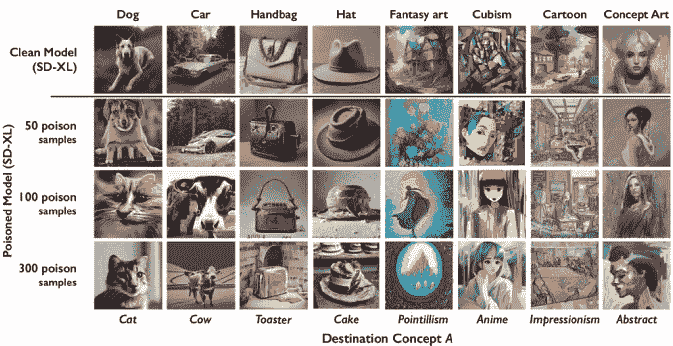

图 16.27：**中毒攻击**：一个逐步的过程，在在线学习期间逐渐引入恶意样本以改变模型行为。通过这种方式，可以操纵连续数据流而不会立即被发现。来源：(Shan 等人 2023)。

夜幕降临特别有效的原因是中毒概念的级联效应。因为生成模型依赖于类别之间的语义关系，一个中毒的“汽车”可以渗透到相关的概念，如“卡车”、“公交车”或“火车”，导致广泛的幻觉。

然而，像任何强大的工具一样，Nightshade 也带来了风险。用于保护艺术内容的相同技术可能被重新用于破坏合法的训练流程，突显了现代机器学习安全核心的二元使用困境 52。

### 分布偏移

分布偏移代表了在部署的机器学习系统中最普遍和最具挑战性的鲁棒性问题之一。与对抗攻击或数据中毒不同，分布偏移通常在环境演变过程中自然发生，这使得它们成为系统可靠性的核心关注点。本节将探讨不同类型分布偏移的特征、它们发生的机制、对机器学习系统的影响，以及检测和缓解的实际方法。

#### 分布偏移属性

分布偏移指的是机器学习模型在部署过程中遇到的数据分布与其训练时所用的分布不同，挑战了通过第八章中的训练方法以及第四章中的架构设计选择建立的一般化能力，如图 16.28 所示。这种分布的变化不一定是恶意攻击的结果。相反，它通常反映了现实世界环境随时间的自然演变。本质上，数据在训练和推理阶段之间的统计属性、模式或假设可能会发生变化，这可能导致模型性能出现意外或下降。


图 16.28：**分布偏移**：训练数据和部署数据之间（由虚假特征 *z* 的不同分布表示）的小不一致性可能会严重破坏模型性能，即使没有改变真实的标签 *y*。此图强调了数据中毒攻击如何利用分布差异来诱导模型错误，并强调了机器学习系统对微妙数据操作的脆弱性。来源：(Shan 等人 2023)。

分布偏移通常采取以下几种形式：

+   **协变量偏移**，其中输入分布 <semantics><mrow><mi>P</mi><mrow><mo stretchy="true" form="prefix">(</mo><mi>x</mi><mo stretchy="true" form="postfix">)</mo></mrow></mrow><annotation encoding="application/x-tex">P(x)</annotation></semantics> 发生变化，而条件标签分布 <semantics><mrow><mi>P</mi><mrow><mo stretchy="true" form="prefix">(</mo><mi>y</mi><mo>∣</mo><mi>x</mi><mo stretchy="true" form="postfix">)</mo></mrow></mrow><annotation encoding="application/x-tex">P(y \mid x)</annotation></semantics> 保持稳定。

+   **标签偏移**，其中标签分布 <semantics><mrow><mi>P</mi><mrow><mo stretchy="true" form="prefix">(</mo><mi>y</mi><mo stretchy="true" form="postfix">)</mo></mrow></mrow><annotation encoding="application/x-tex">P(y)</annotation></semantics> 发生变化，而 <semantics><mrow><mi>P</mi><mrow><mo stretchy="true" form="prefix">(</mo><mi>x</mi><mo>∣</mo><mi>y</mi><mo stretchy="true" form="postfix">)</mo></mrow></mrow><annotation encoding="application/x-tex">P(x \mid y)</annotation></semantics> 保持不变。

+   **概念漂移**，其中输入和输出之间的关系，<semantics><mrow><mi>P</mi><mrow><mo stretchy="true" form="prefix">(</mo><mi>y</mi><mo>∣</mo><mi>x</mi><mo stretchy="true" form="postfix">)</mo></mrow></mrow><annotation encoding="application/x-tex">P(y \mid x)</annotation></semantics>，随着时间的推移而演变。

这些形式化的定义有助于构建更直观的例子，这些例子在实践中经常遇到。

最常见的原因之一是领域不匹配，即模型在训练数据域之外的数据上部署。例如，在电影评论上训练的情感分析模型，当应用于推文时可能会表现不佳，因为语言、语气和结构存在差异。在这种情况下，模型已经学习了特定领域的特征，这些特征在新的上下文中泛化不良。

另一个主要来源是时间漂移，其中输入分布随着时间的推移逐渐或突然演变。在生产环境中，数据因新趋势、季节性效应或用户行为的变化而变化。例如，在欺诈检测系统中，欺诈模式可能会随着对手的适应而演变。如果没有持续的监控或重新训练，模型就会过时，变得无效。这种变化形式在图 16.29 中得到了可视化。

当部署环境由于外部因素（如光照、传感器变化或用户行为）与训练条件不同时，会出现上下文变化。例如，在受控光照条件下在实验室训练的视觉模型，在户外或动态环境中部署时可能会表现不佳。

另一个微妙但关键的因素是不具代表性的训练数据。如果训练数据集未能捕捉到生产环境的全部可变性，模型可能泛化不良。例如，主要在某一人口群体上训练的面部识别模型，在更广泛的应用中可能会产生有偏见或不准确的预测。在这种情况下，这种变化反映了训练数据中缺失的多样性和结构。


图 16.29：**时间漂移**：随着时间的推移，数据分布的变化会降低模型性能，除非系统通过持续监控和重新训练来适应。概念漂移表现为输入模式的变化——例如演变的欺诈方案或季节性趋势——这要求模型学习新的关系并在动态环境中保持准确性。

这种类型的分布偏移会显著降低生产中机器学习模型的性能和可靠性。构建稳健的系统不仅需要理解这些偏移，还需要积极检测和应对它们的出现。

特斯拉的自动驾驶系统展示了在现实世界部署中分布偏移如何挑战甚至复杂的机器学习系统。主要在高速公路驾驶数据上训练的视觉系统在施工区域、不寻常的道路配置和与训练场景显著不同的各种天气条件下表现下降。系统在训练数据中不太充分表示的边缘案例，如施工障碍物、不寻常的车道标记和临时交通模式上遇到了困难。这突出了收集多样化训练数据和稳健处理分布偏移的关键重要性，尤其是在边缘案例可能产生严重后果的安全关键应用中。

#### 分布偏移机制

分布偏移源于各种潜在机制——既有自然的也有系统驱动的。理解这些机制有助于从业者检测、诊断并设计缓解策略。

一种常见的机制是数据源的变化。当推理时收集的数据来自与训练数据不同的传感器、API、平台或硬件时，即使是细微的分辨率、格式或噪声差异也可能引入重大的偏移。例如，在一个麦克风类型上训练的语音识别模型可能会在来自不同设备的数据上遇到困难。

时间演变指的是随时间变化的基础数据的变化。在推荐系统中，用户偏好会发生变化。在金融领域，市场状况会改变。这些变化可能是缓慢且连续的，也可能是突然且破坏性的。如果没有时间意识或持续评估，模型可能会变得过时，而且通常没有先前的迹象。为了说明这一点，图 16.30 展示了经过多代选择性育种后，狗的品种的物理特征发生了显著变化。该品种的早期版本表现出苗条、健壮的体型，而现代版本则更加粗壮，头部形状和肌肉结构有显著的不同。这种转变类似于现实世界系统中数据分布的变化——用于训练模型的初始数据可能与随时间遇到的数据有显著差异。正如进化压力塑造生物特征一样，动态用户行为、市场力量或环境变化可以改变机器学习应用中的数据分布。如果没有定期的重新训练或适应，暴露于这些演变分布的模型可能会表现不佳或变得不可靠。

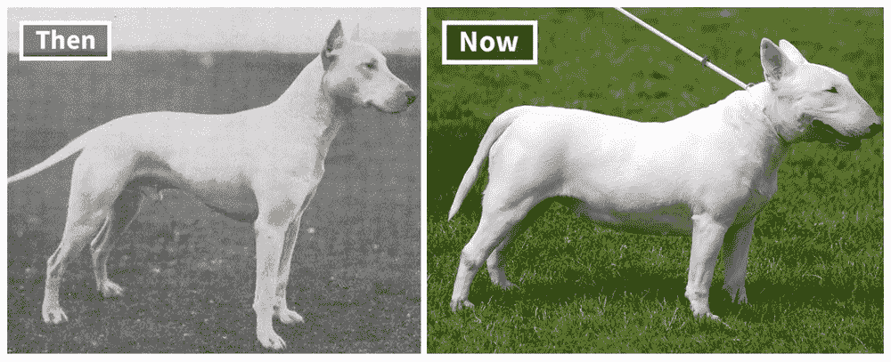

图 16.30：**物种进化**：经过多代的选育，表型特征发生显著变化，这反映了机器学习系统中数据分布随时间的变化。这些时间上的变化需要模型重新训练或适应以保持性能，因为初始训练数据可能不再准确代表当前的输入分布。

当一个模型在一个设置上训练后应用于另一个设置时，会出现领域特定的变化。一个在一家医院数据上训练的医疗诊断模型可能在另一家医院表现不佳，这可能是由于设备、人口统计或临床工作流程的差异。这些变化通常需要显式的适应策略，如领域泛化或微调。

当训练数据没有准确反映目标人群时，就会发生选择偏差。这可能是由于抽样策略、数据访问限制或标注选择造成的。结果是模型过度拟合到特定部分，无法泛化。解决这个问题需要深思熟虑的数据收集和持续验证。

反馈循环是一种特别微妙的机制。在某些系统中，模型预测会影响用户行为，反过来又影响未来的输入。例如，一个动态定价模型可能会设定改变购买模式的价格，这进而扭曲未来训练数据的分布。这些循环可以加强狭窄的模式，使模型行为难以预测。

最后，对抗性操作可以故意诱导分布偏移。攻击者可能会引入分布外的样本或构建利用模型决策边界弱点的输入。这些输入可能远离训练分布，并可能导致意外或不安全的预测。

这些机制通常相互作用，使得现实世界的分布偏移检测和缓解变得复杂。从系统角度来看，这种复杂性需要持续的监控、日志记录和反馈管道——这些功能通常在早期或静态机器学习部署中缺失。

#### 分布偏移对机器学习的影响

分布偏移可以影响机器学习系统性能的几乎每个维度，从预测准确性和延迟到用户信任和系统可维护性。

常见且直接的结果是预测性能下降。当推理时的数据与训练数据不同时，模型可能会产生系统性的不准确或不一致的预测。这种准确性的侵蚀在高风险应用中尤其危险，如欺诈检测、自动驾驶或临床决策支持。

另一个严重的影响是可靠性和可信度的丧失。随着分布的变化，用户可能会注意到不一致或异常的行为。例如，推荐系统可能会开始建议不相关或冒犯性的内容。即使整体准确率指标仍然可以接受，用户信任的丧失可能会损害系统的价值。

分布偏移也放大了模型偏差。如果某些群体或数据片段在训练数据中代表性不足，模型在这些群体上可能会频繁失败。在偏移条件下，这些失败可能会变得更加明显，导致歧视性结果或公平性违规。

在特定医院的数据上训练的机器学习模型，在部署到不同机构时通常表现出性能下降，这说明了医疗保健中经典的分布偏移问题。在具有特定患者群体、设备类型和临床方案的学术医疗中心训练的模型，未能推广到具有不同人口统计、成像设备和临床工作流程的社区医院。例如，基于一家医院 CT 扫描仪数据的诊断模型，在应用于不同扫描仪制造商或成像协议的图像时，准确性会降低。这表明，数据收集程序和设备看似微小的差异可以造成重大的分布偏移，从而影响模型性能和潜在的患者安全。

不确定性和运营风险也增加。在许多生产环境中，模型决策直接进入业务运营或自动化操作。在偏移情况下，这些决策变得不那么可预测，更难验证，增加了级联故障或不良决策的风险。

从系统维护的角度来看，分布偏移使重新培训和部署工作流程复杂化。如果没有强大的漂移检测和性能监控机制，偏移可能会在性能显著下降之前不被察觉。一旦检测到，可能需要进行重新培训，这会引发与数据收集、标注、模型回滚和验证相关的问题。这会在持续集成和部署（CI/CD）工作流程中产生摩擦，并可能显著减缓迭代周期。

分布偏移也增加了对抗攻击的脆弱性。攻击者可以利用模型在未知数据上的不良校准，通过轻微扰动将输入推离训练分布并导致故障。当系统反馈循环或自动化决策流程存在时，这一点尤其令人担忧。

从系统角度来看，分布偏移不仅是一个建模问题，它是一个核心的运营挑战。它需要端到端系统支持：数据记录、漂移检测、自动警报、模型版本控制和计划重新培训的机制。机器学习系统必须设计成能够在生产中检测到性能下降，诊断分布偏移是否是原因，并触发适当的缓解措施。这可能包括人工审查、回退策略、模型重新培训流程或分阶段部署推出。

在成熟的机器学习系统中，处理分布偏移已成为基础设施、可观察性和自动化的一个问题，而不仅仅是建模技术。未能考虑这一点，在动态、现实世界的环境中可能导致模型无声失败——这正是机器学习系统预期提供最大价值的地方。

常见分布偏移类型、其对模型性能的影响以及潜在的系统级响应的总结显示在表 16.5 中。

表 16.5：**分布偏移类型**：现实世界的机器学习系统会遇到各种形式的分布偏移，包括协变量、概念和先验偏移，这些偏移通过改变输入和输出之间的关系或不同结果的出现频率来降低性能。理解这些偏移并实施系统级缓解措施——如监控、自适应学习和鲁棒训练——对于在动态环境中保持可靠性能至关重要。

| 偏移类型 | 原因或示例 | 对模型的影响 | 系统级响应 |
| --- | --- | --- | --- |
| 协变量偏移 | 输入特征的变化（例如，传感器校准漂移） | 尽管标签一致，模型仍会错误分类新的输入 | 监控输入分布；使用更新特征重新训练 |
| 标签偏移 | 标签分布的变化（例如，使用中新类别的频率） | 预测概率变得倾斜 | 跟踪标签先验；重新加权或调整输出校准 |
| 概念漂移 | 输入和输出之间关系的发展（例如，欺诈策略） | 模型性能随时间下降 | 频繁重新训练；使用持续或在线学习 |
| 领域不匹配 | 在评论上训练，在推文中部署 | 由于不同的词汇或风格导致泛化能力差 | 使用领域自适应或微调 |
| 上下文变化 | 新的部署环境（例如，照明，用户行为） | 性能随上下文变化 | 收集上下文数据；监控条件准确性 |
| 选择偏差 | 训练过程中的代表性不足 | 对未见过的群体进行有偏预测 | 验证数据集平衡；增加训练数据 |
| 反馈循环 | 模型输出影响未来输入（例如，推荐系统） | 强化漂移，不可预测的模式 | 监控反馈效果；考虑反事实日志记录 |
| 对抗偏移 | 攻击者引入 OOD 输入或扰动 | 模型变得容易受到针对性故障的影响 | 使用鲁棒训练；检测分布外的输入 |

#### 分布偏移的系统影响

### 输入攻击检测和防御

在对模型脆弱性的理论理解的基础上，我们现在考察实际的防御策略。

#### 对抗攻击防御

在确立了对抗攻击的机制和影响之后，我们考察了它们的检测和防御。

##### 检测技术

检测对抗样本是抵御对抗攻击的第一道防线。已经提出了几种技术来识别和标记可能为对抗性的可疑输入。

统计方法代表了一种通过分析输入数据的分布特性来检测对抗样本的方法。这些方法将输入数据分布与参考分布进行比较，例如训练数据分布或已知的良性分布。像[柯尔莫哥洛夫-斯米尔诺夫测试](https://www.itl.nist.gov/div898/handbook/eda/section3/eda35g.htm) (伯格和周 2014) 或 [安德森-达尔林测试](https://www.itl.nist.gov/div898/handbook/eda/section3/eda35e.htm) 这样的技术可以测量分布之间的差异，并标记出与预期分布显著偏离的输入。

除了分布分析之外，输入变换方法提供了一种替代的检测策略。特征压缩 54 (Panda, Chakraborty, and Roy 2019) 通过降维或离散化来降低输入空间复杂性，消除了对抗样本通常依赖的微小、难以察觉的扰动。

模型不确定性估计通过量化预测的置信度提供了另一种检测范式。由于对抗样本通常利用模型决策边界中的高不确定性区域，因此具有较高不确定性的输入可以被标记为可疑。存在几种不确定性估计方法，每种方法在准确性和计算成本之间都有不同的权衡。

贝叶斯神经网络 55 通过将模型权重视为概率分布，通过近似推理方法捕捉了随机性（数据固有）和认知性（模型）不确定性，提供了最原则性的不确定性估计。集成方法（在第 16.8.4.1.2 节中进一步详细说明）通过结合多个独立训练模型的预测来实现不确定性估计，使用预测方差作为不确定性度量。虽然这两种方法都提供了鲁棒的不确定性量化，但它们都带来了显著的计算开销。

Dropout56，最初作为防止训练过程中过拟合的正则化技术而设计(G. E. Hinton 等人 2012)，通过在每次训练迭代中随机停用一部分神经元来实现，迫使网络避免过度依赖特定神经元，从而提高泛化能力。这种机制可以通过推理时的蒙特卡洛 dropout 重新用于不确定性估计，其中多个带有不同 dropout 掩码的前向传递近似不确定性分布。然而，这种方法提供的不确定性估计不够精确，因为 dropout 并非专门设计用于不确定性量化，而是通过强制冗余来防止过拟合。结合 dropout 与轻量级集成方法或贝叶斯近似混合的方法可以在计算效率和估计质量之间取得平衡，使基于不确定性的检测在实际部署中更加实用。

##### 防御策略

一旦检测到对抗性示例，可以采用各种防御策略来减轻其影响并提高机器学习模型的鲁棒性。

对抗性训练是一种技术，它涉及通过添加对抗性示例来增强训练数据，并在增强的数据集上重新训练模型。在训练期间将模型暴露于对抗性示例教会它正确分类它们，并使其对对抗性攻击更加鲁棒。列表 16.1 展示了核心实现模式。

对抗性训练提供了改进的鲁棒性，但伴随着显著的计算开销，必须在生产系统中谨慎管理。

由于在每次训练步骤中生成对抗性示例，训练时间会增加 3-10<semantics><mi>×</mi><annotation encoding="application/x-tex">\times</annotation></semantics>。即时生成对抗性示例需要通过模型进行额外的正向和反向传递，这大大增加了计算需求。存储干净和对抗性示例以及攻击生成期间计算的梯度，内存需求增加 2-3<semantics><mi>×</mi><annotation encoding="application/x-tex">\times</annotation></semantics>。在生成迭代攻击（如 PGD）时，可能需要专门的硬件来高效地生成对抗性示例，尤其是当需要多个优化步骤时。

鲁棒模型通常牺牲 2-8%的干净准确率以换取改进的对抗鲁棒性，这代表了鲁棒优化目标中的一个基本权衡。如果将集成方法或不确定性估计技术集成到对抗性训练中，推理时间可能会增加。模型大小通常随着增强鲁棒性的架构修改而增加，例如更宽的网络或额外的归一化层，这些修改可以改善梯度稳定性。

当平衡鲁棒性和性能目标时，超参数调整变得显著更加复杂。验证程序必须使用多种攻击方法评估干净和对抗性性能，以确保全面的鲁棒性评估。部署基础设施必须支持对抗性训练的额外计算需求，包括用于梯度计算的 GPU 内存和存储对抗性示例缓存的存储空间。

列表 16.1：**对抗性训练实现**：使用 FGSM 在训练期间生成对抗性示例的实用对抗性训练，通过混合干净和扰动数据来提高模型对基于梯度的攻击的鲁棒性。

```py
def adversarial_training_step(model, data, labels, epsilon=0.1):
    # Generate adversarial examples using FGSM
    data.requires_grad_(True)
    outputs = model(data)
    loss = F.cross_entropy(outputs, labels)

    model.zero_grad()
    loss.backward()

    # Create adversarial perturbation and mix with clean data
    adv_data = data + epsilon * data.grad.sign()
    adv_data = torch.clamp(adv_data, 0, 1)

    mixed_data = torch.cat([data, adv_data])
    mixed_labels = torch.cat([labels, labels])

    return F.cross_entropy(model(mixed_data), mixed_labels)
```

列表 16.1 中的实现通过计算输入数据的梯度（第 2190 行），应用符号函数以提取扰动方向（第 2196 行），并将生成的对抗性示例与干净的训练数据混合（第 2199-2200 行）来在训练过程中即时生成对抗性示例。`torch.clamp()`操作确保像素值保持有效，而最终的连接将干净和对抗性示例结合在一起，有效地将批处理大小加倍。这种方法需要仔细调整扰动预算 <semantics><mi>ϵ</mi><annotation encoding="application/x-tex">\epsilon</annotation></semantics>，通常比标准训练（Shafahi 等人 2019）增加 2-3<semantics><mi>×</mi><annotation encoding="application/x-tex">\times</annotation></semantics>的训练时间。

第十三章（ch019.xhtml#sec-ml-operations）详细介绍了生产部署模式、MLOps 管道集成和鲁棒机器学习系统的监控策略，而分布式鲁棒性协调和大规模容错则在第八章（ch014.xhtml#sec-ai-training）中分布式训练的上下文中得到解决。

防御蒸馏（Papernot, McDaniel, Wu, 等人 2016）是一种技术，它训练第二个模型（学生模型）来模仿原始模型（教师模型）的行为。学生模型在教师模型产生的软标签上进行训练，这些标签对小的扰动不太敏感。使用学生模型进行推理可以减少对抗性扰动的 影响，因为学生模型学会了更好地泛化，并且对对抗性噪声不太敏感。

输入预处理和转换技术试图在将输入馈送到机器学习模型之前消除或减轻对抗性扰动的影响。这些技术包括图像去噪、JPEG 压缩、随机调整大小、填充，或对输入数据应用随机转换。通过减少对抗性扰动的影响，这些预处理步骤可以帮助提高模型对对抗性攻击的鲁棒性。

集成方法通过结合多个模型来做出更鲁棒的预测。集成可以通过使用具有不同架构、训练数据或超参数的多样化模型集来减少对抗性攻击的影响。欺骗一个模型的对抗性示例可能不会欺骗集成中的其他模型，从而产生更可靠和鲁棒的预测。通过为集成中的每个模型使用不同的预处理技术或特征表示等模型多样化技术，可以进一步增强鲁棒性。

##### 评估和测试

进行彻底的评估和测试，以评估对抗性防御技术的有效性并衡量机器学习模型的鲁棒性。

对抗性鲁棒性指标量化了模型对对抗性攻击的韧性。这些指标可以包括模型在对抗性示例上的准确度、欺骗模型所需的平均扭曲量，或模型在不同攻击强度下的性能。通过比较不同模型或防御技术之间的这些指标，实践者可以评估和比较它们的鲁棒性水平。

标准化的对抗性攻击基准和数据集为评估和比较机器学习模型的鲁棒性提供了一个共同基础。这些基准包括包含预生成对抗性示例的数据集和用于生成对抗性攻击的工具和框架。流行的对抗性攻击基准示例包括[MNIST-C](https://github.com/google-research/mnist-c)、[CIFAR-10-C](https://paperswithcode.com/dataset/cifar-10c)和 ImageNet-C (Hendrycks and Dietterich 2019)数据集，它们包含原始数据集的损坏或扰动版本。

实践者可以通过利用本节中概述的检测技术和防御策略来开发更鲁棒的系统。对抗性鲁棒性仍然是一个需要多层方法的研究领域，这些方法结合了多种防御机制，并定期针对不断发展的威胁进行测试。

#### 数据投毒防御

数据投毒攻击旨在破坏用于构建机器学习模型的训练数据，针对第六章中详细说明的数据收集和预处理阶段，破坏其完整性。如图图 16.31 所示，这些攻击可以通过操纵或污染训练数据的方式，导致模型学习到错误的模式，当部署时产生错误的预测或不良行为。鉴于训练数据在机器学习系统性能中的基础作用，检测和减轻数据投毒对于保持模型的可信度和可靠性至关重要。


图 16.31：**数据中毒攻击**：攻击者将恶意数据注入训练集以操纵模型行为，可能导致部署期间的误分类或性能下降。这种攻击强调了机器学习系统对数据完整性的脆弱性以及需要强大的数据验证技术。*来源：li*

##### 异常检测技术

统计异常检测方法识别出与大多数数据显著偏离的数据点。这些方法假设中毒数据实例很可能是统计异常。可以使用诸如[Z 分数方法](https://ubalt.pressbooks.pub/mathstatsguides/chapter/z-score-basics/)、[Tukey 的方法](https://www.itl.nist.gov/div898/handbook/prc/section4/prc471.htm)或[马氏距离](https://www.statisticshowto.com/mahalanobis-distance/)等技术来衡量每个数据点与数据集中心趋势的偏差。超过预定义阈值的数据点被标记为潜在的异常值，并被认为是数据中毒的可疑候选。

基于聚类的技术根据数据点的特征或属性将相似的数据点分组在一起。假设中毒数据实例可能形成独特的聚类或远离正常数据聚类。通过应用诸如[K-means](https://www.oreilly.com/library/view/data-algorithms/9781491906170/ch12.html)、[DBSCAN](https://www.oreilly.com/library/view/machine-learning-algorithms/9781789347999/50efb27d-abbe-4855-ad81-a5357050161f.xhtml)或[层次聚类](https://www.oreilly.com/library/view/cluster-analysis-5th/9780470978443/chapter04.html)等聚类算法，可以识别出异常聚类或不属于任何聚类的数据点。然后，将这些异常实例视为可能中毒的数据。

自编码器 57 是一种经过训练的神经网络，用于从压缩表示中重建输入数据，如图 16.32 所示。它们可以通过学习数据中的正常模式并识别偏离这些模式的实例来用于异常检测。在训练期间，自编码器在干净、未中毒的数据上训练。在推理时间，计算每个数据点的重建误差。具有高重建误差的数据点被认为是异常的，并且可能是中毒的，因为它们不符合学习到的正常模式。


图 16.32：**自动编码器架构**：自动编码器通过最小化重建误差来学习压缩数据表示，通过识别具有高重建损失输入来启用异常检测。在正常数据上的训练过程中，网络学习有效的编码和解码，使其对潜在的攻击偏差指示敏感。*来源：dertat*

##### 清洗和预处理

通过清洗数据可以避免数据中毒，这涉及识别和删除或纠正噪声、不完整或不一致的数据点。可以应用数据去重、缺失值插补和异常值移除等技术来提高训练数据的质量。通过消除或过滤掉可疑或异常的数据点，可以减少中毒实例的影响。

数据验证涉及验证训练数据的完整性和一致性。这可以包括检查数据类型的一致性、范围验证以及跨字段依赖性。通过定义和执行数据验证规则，可以识别并标记出指示数据中毒的异常或不一致的数据点，以便进行进一步调查。

数据溯源和血缘追踪涉及在整个机器学习管道中维护数据的来源、转换和移动记录。通过记录数据来源、预处理步骤以及对数据进行任何修改，从业者可以将异常或可疑模式追溯到其起源。这有助于识别潜在的数据中毒点，并促进调查和缓解过程。

##### 鲁棒训练

可以使用鲁棒优化技术来修改训练目标，以最小化异常值或中毒实例的影响。这可以通过使用对极端值不太敏感的鲁棒损失函数来实现，例如 Huber 损失或修改后的 Huber 损失 58。正则化技术 59，如[L1 或 L2 正则化](https://medium.com/towards-data-science/l1-and-l2-regularization-methods-ce25e7fc831c)，也可以通过限制模型的复杂性和防止过拟合来帮助减少模型对中毒数据的敏感性。

鲁棒损失函数旨在对异常值或噪声数据点不太敏感。例如，包括修改后的[Huber 损失](https://pytorch.org/docs/stable/generated/torch.nn.HuberLoss.html)、Tukey 损失(Beaton 和 Tukey 1974)和修剪均值损失。这些损失函数在训练期间会降低或忽略异常实例的贡献，从而减少它们对模型学习过程的影响。鲁棒目标函数，如最小-最大 60 或分布鲁棒目标，旨在在最坏情况或存在对抗性扰动的情况下优化模型性能。

数据增强技术涉及通过应用随机变换或扰动到现有数据来生成额外的训练示例 图 16.33。这有助于增加训练数据集的多样性和鲁棒性。通过在数据中引入可控的变异，模型对可能存在于受污染实例中的特定模式或伪影变得不那么敏感。随机化技术，如随机子采样或自助聚合，还可以通过在不同的数据子集上训练多个模型并合并它们的预测来帮助减少受污染数据的影响。


图 16.33：**数据增强技术**：应用变换如水平翻转、旋转和裁剪可以扩展训练数据集，提高模型对输入数据变化的鲁棒性，并减少过拟合。这些技术生成新的训练示例，而无需额外的标记数据，有效地增加了数据集的多样性和提高了泛化性能。

##### 安全数据来源

实施最佳的数据收集和整理实践可以帮助减轻数据中毒的风险。这包括建立明确的数据收集协议，验证数据来源的真实性和可靠性，以及定期进行数据质量评估。从受信任和声誉良好的提供商处获取数据，并遵循安全的数据处理实践可以降低将受污染数据引入训练管道的可能性。

强有力的数据治理和访问控制机制对于防止未经授权修改或篡改训练数据至关重要。这包括明确数据访问的职责和角色，基于最小权限原则 61 实施访问控制策略，以及监控和记录数据访问活动。通过限制对训练数据的访问并保持审计跟踪，可以检测和调查潜在的数据中毒尝试。

检测和缓解数据中毒攻击需要一种多方面的方法，结合异常检测、数据净化、62 鲁棒的训练技术和安全的数据来源实践。数据中毒仍然是一个活跃的研究领域，需要积极和适应性的数据安全方法。

#### 分布式偏移适应

分布式偏移对部署的机器学习系统构成了持续的挑战，需要系统性的方法来检测和缓解。本节重点介绍识别偏移何时发生的技术和保持系统性能的策略。我们探讨了偏移检测的统计方法、适应的算法方法以及生产系统的实施考虑。

##### 检测与缓解

记住，当机器学习模型在部署期间遇到的数据分布与其训练时的分布不同，就会发生分布偏移。这些偏移可能会显著影响模型的表现和泛化能力，导致次优或错误的预测。检测和缓解分布偏移对于确保机器学习系统在实际场景中的鲁棒性和可靠性至关重要。

##### 检测技术

统计测试可以用来比较训练数据和测试数据的分布，以识别显著差异。列表 16.2 展示了在生产环境中监控分布变化的实际实现：

列表 16.2：**分布偏移检测**：监控生产中数据分布变化的核心理统计方法，结合单个特征的柯尔莫哥洛夫-斯米尔诺夫测试与领域分类器方法，以检测传入数据与训练分布显著不同的情况。

```py
from scipy.stats import ks_2samp
from sklearn.ensemble import RandomForestClassifier
from sklearn.metrics import roc_auc_score


def detect_distribution_shift(
    reference_data, new_data, threshold=0.05
):
    """Detect distribution shift using statistical tests"""

    # Kolmogorov-Smirnov test for feature-wise comparison
    ks_pvalues = []
    for feature_idx in range(new_data.shape[1]):
        _, p_value = ks_2samp(
            reference_data[:, feature_idx], new_data[:, feature_idx]
        )
        ks_pvalues.append(p_value)

    # Domain classifier to detect overall distributional
    # differences
    X_combined = np.vstack([reference_data, new_data])
    y_labels = np.concatenate(
        [np.zeros(len(reference_data)), np.ones(len(new_data))]
    )

    clf = RandomForestClassifier(n_estimators=50, random_state=42)
    clf.fit(X_combined, y_labels)
    domain_auc = roc_auc_score(
        y_labels, clf.predict_proba(X_combined)[:, 1]
    )

    return {
        "ks_shift_detected": any(p < threshold for p in ks_pvalues),
        "domain_shift_detected": domain_auc > 0.8,
        "severity_score": domain_auc,
    }
```

像柯尔莫哥洛夫-斯米尔诺夫测试或安德森-达尔林测试这样的技术测量两个分布之间的差异，并提供了对分布变化的定量评估。将这些测试应用于输入特征或模型的预测，使从业者能够检测训练和测试分布之间的统计显著差异。

散度度量量化了两个概率分布之间的差异。常用的散度度量包括 [Kullback-Leibler (KL) 散度](https://towardsdatascience.com/understanding-kl-divergence-f3ddc8dff254) 和 [Jensen-Shannon (JS) 散度](https://medium.com/towards-data-science/how-to-understand-and-use-jensen-shannon-divergence-b10e11b03fd6)。通过计算训练和测试数据分布之间的散度，从业者可以评估分布偏移的程度。高散度值表明分布之间存在显著差异，表明存在分布偏移。

不确定性量化技术，如贝叶斯神经网络 63 或集成方法 64，可以估计模型预测的不确定性。当模型应用于来自不同分布的数据时，其预测可能具有更高的不确定性。通过监控不确定性水平，从业者可以检测分布偏移。如果测试样本的不确定性持续超过预定的阈值，这表明模型正在其训练分布之外运行。

此外，领域分类器被训练以区分不同的领域或分布。从业者可以通过训练一个分类器来区分训练域和测试域来检测分布变化。如果领域分类器在区分两个领域时达到高精度，这表明底层分布存在显著差异。领域分类器的性能作为分布变化的衡量标准。

##### 缓解技术

迁移学习利用一个领域获得的知识来提高另一个领域的性能，如图 16.34 所示。通过使用预训练模型或将源领域学习到的特征转移到目标领域，迁移学习可以帮助缓解分布变化的影响。预训练模型可以在来自目标域的一小部分标记数据上进行微调，使其能够适应新的分布。当源领域和目标领域具有相似特征或目标域的标记数据稀缺时，迁移学习特别有效。


图 16.34：**知识迁移**：在大数据集上预训练使模型能够学习可泛化的特征，然后可以通过有限的标记数据对特定目标任务进行微调。这种方法通过利用先前获得的知识来缓解数据稀缺问题并加速新领域的学习。*来源：bhavsar*

持续学习，也称为终身学习，使机器学习模型能够从新的数据分布中持续学习，同时保留先前分布中的知识。例如，弹性权重巩固（EWC）(Kirkpatrick 等人 2017) 或梯度片段记忆（GEM）(Lopez-Paz 和 Ranzato 2017) 等技术允许模型随着时间的推移适应不断变化的数据分布。这些技术旨在平衡模型的可塑性（从新数据中学习的能力）与模型的稳定性（保留先前学习到的知识）。通过增量更新模型以包含新数据并减轻灾难性遗忘，持续学习有助于模型对分布变化保持鲁棒性。

数据增强技术，如我们之前所见，涉及对现有训练数据进行变换或扰动，以增加其多样性并提高模型对分布变化的鲁棒性。通过引入数据中的变化，如旋转、平移、缩放或添加噪声，数据增强有助于模型学习不变特征并更好地泛化到未见过的分布。数据增强可以在训练和推理期间执行，以提高模型处理分布变化的能力。

如第 16.8.4.1.2 节 16.8.4.1.2 中所述的集成方法，在对抗防御中也提供了对分布偏移的鲁棒性。当面对偏移的分布时，集成可以利用单个模型的优点来做出更准确和稳定的预测。

定期用目标分布的新数据更新模型对于减轻分布偏移的影响至关重要。随着数据分布的发展，模型应该使用最新的可用数据进行重新训练或微调，以适应变化的模式，利用第十四章中详细介绍的持续学习方法。监控模型性能和数据特征可以帮助检测何时需要更新。通过保持模型更新，从业者可以确保他们在面对分布偏移时保持相关性和准确性。

使用对分布偏移不太敏感的鲁棒性度量来评估模型可以提供对模型性能的更可靠评估。例如，精确召回曲线下的面积（AUPRC）或 F1 分数 65 对类别不平衡更鲁棒，并能更好地捕捉模型在不同分布上的性能。使用与目标域中期望结果一致的领域特定评估度量可以提供对模型有效性的更有意义的衡量。

检测和减轻分布偏移是一个持续的过程，需要持续的监控、适应和改进。通过采用本节中描述的检测和减轻技术，从业者可以主动解决现实部署中的分布偏移问题。

#### 自监督学习以鲁棒性为目标

自监督学习（SSL）方法可能通过从数据结构中学习而不是记忆输入输出映射来提供通往更鲁棒人工智能系统的途径。与依赖于标记示例的监督学习不同，SSL 方法通过解决需要理解底层数据模式和关系的预训练任务来发现表示。

自监督方法可能解决导致神经网络脆弱性的几个核心限制。SSL 方法从环境规律和数据结构中学习表示，捕捉在不同条件下保持一致的不变特征。对比学习技术鼓励捕捉不同视角下相同数据不变特征的表示，从而提高对变换和扰动的鲁棒性。掩码语言建模和视觉中的类似技术学习根据上下文而不是表面模式进行预测，可能发展出更具普遍性的内部表示。

与监督学习表示相比，自监督表示通常显示出更优越的迁移能力，这表明它们捕捉到了数据结构中更本质的方面。从数据结构而不是标签中学习可能本质上更鲁棒，因为它依赖于跨域和条件下存在的持续模式。自监督方法可以利用更多的未标记数据，通过使模型接触到更广泛的自然变异范围来提高泛化能力。这种对多样化未标记数据的接触可能有助于模型发展出对部署中常见的分布变化更具弹性的表示。

几种策略可以将自监督学习融入鲁棒系统设计中。在针对特定任务微调之前，使用自监督目标进行预训练模型提供了一种鲁棒的基础，这可能在跨域中更好地迁移。在训练期间结合自监督和监督目标的多元任务方法可以在表示学习和任务性能之间取得平衡。通过自监督学习获得的表示可以作为后续鲁棒微调方法的基础，可能需要更少的标记示例来实现鲁棒性。

尽管前景广阔，但用于鲁棒性的自监督学习仍然是一个活跃的研究领域，存在重要的局限性。当前的 SSL 方法可能仍然容易受到对抗攻击的影响，尤其是当攻击者了解预置任务时。为什么以及何时 SSL 可以提高鲁棒性的理论理解仍然不完整。SSL 预训练的计算开销可能很大，需要仔细考虑资源限制。

这个方向表明了一个不断发展的研究领域，它可能会改变我们处理鲁棒人工智能系统开发的方法，从防御技术转向本质上更可靠的学习方法。

我们考察的三个支柱——硬件故障、输入级攻击和环境变化——每个都针对人工智能系统的不同方面。然而，它们都在复杂的软件基础设施中运行并依赖于它，这些基础设施本身也具有独特的漏洞。

## 软件故障

我们迄今为止考察的鲁棒性挑战——硬件故障、输入级攻击和环境变化——每个都损害了不同的系统层。硬件故障破坏了物理计算，对抗攻击利用算法边界，环境变化挑战模型泛化。软件故障引入了第四个维度，它可以放大所有三个：支持现代人工智能部署的复杂软件生态系统中的错误和实现错误。

这第三个类别与前面两个不同。与通常源于物理现象的硬件故障不同，或与源于学习算法核心限制的模型鲁棒性问题不同，软件故障源于系统设计和实现中的人类错误。这些故障可以破坏人工智能管道的任何方面，从数据预处理和模型训练到推理和结果解释，通常以微妙的方式出现，可能不会立即明显。

人工智能系统中的软件故障特别具有挑战性，因为它们可以与并放大我们讨论过的其他稳健性威胁相互作用。数据预处理中的错误可能会导致分布变化，从而暴露模型漏洞。数值计算中的实现错误可能类似于硬件故障，但没有硬件级别的错误检测机制的好处。分布式训练中的竞争条件可能导致模型损坏，类似于对学习表示的对抗性攻击。

这些交互源于现代人工智能软件堆栈固有的复杂性——包括框架、库、运行时环境、分布式系统和部署基础设施，这为故障的出现和传播创造了众多机会。理解和缓解这些软件层面的威胁对于构建真正稳健的人工智能系统至关重要，这些系统能够在生产环境中可靠地运行，尽管其支持软件基础设施具有固有的复杂性。

机器学习系统依赖于复杂的软件基础设施，这些基础设施远远超出了模型本身。这些系统建立在第七章中详细介绍的框架、库和运行时环境之上，这些环境促进了模型训练、评估和部署。与任何大型软件系统一样，支持机器学习工作流程的组件容易受到故障的影响——这些故障是由软件中的缺陷、错误或设计疏忽引起的意外行为，在第十三章中详细说明的标准实践之外，创造了运营挑战。这些故障可能出现在机器学习管道的所有阶段，如果未被发现和解决，可能会损害性能、损害安全性，甚至使结果无效。本节探讨了机器学习系统中软件故障的性质、原因和后果，以及它们的检测和缓解策略。

### 软件故障属性

理解软件故障如何影响机器学习系统需要考察它们的独特特征。机器学习框架中的软件故障源于各种来源，包括编程错误、架构不匹配和版本不兼容。这些故障表现出几个重要特征，这些特征影响了它们在实际中的产生和传播。

软件错误的定义特征之一是其多样性。错误可能从语法和逻辑错误到更复杂的体现，如内存泄漏、并发错误或集成逻辑失败。潜在的故障类型广泛，使得它们的识别和解决都变得复杂，因为它们往往以不明显的方式出现。

这种多样性使得第二个关键特征是它们倾向于跨越系统边界传播。在底层模块中引入的错误，例如张量分配例程或预处理函数，可能会产生级联效应，破坏模型训练、推理或评估。由于机器学习框架通常由相互连接的组件组成，管道某一部分的故障可能会在看似无关的模块中引入故障。

一些错误是间歇性的，仅在特定条件下才会出现，例如高系统负载、特定的硬件配置或罕见的数据输入。这些短暂的错误因其可能在标准测试程序中不一致地出现而闻名，因此难以重现和诊断。

对于机器学习系统来说，最令人担忧的可能就是软件错误可能会微妙地与机器学习模型本身相互作用。例如，数据转换脚本中的错误可能会引入系统性的噪声或改变输入的分布，导致偏差或不准确的预测。同样，服务基础设施中的错误可能会导致训练时和推理时行为之间的差异，破坏部署一致性。

软件错误的后果涉及一系列系统属性。错误可能通过引入延迟或低效的内存使用来损害性能；它们可能通过限制并行性来降低可扩展性；或者它们可能通过使系统暴露于意外行为或恶意利用来损害可靠性和安全性。

在此基础上，软件错误的体现通常受到外部依赖的影响，例如硬件平台、操作系统或第三方库。由于版本不匹配或特定硬件行为导致的兼容性问题可能会导致微妙且难以追踪的错误，这些错误仅在特定的运行时条件下才会出现。

对这些特性的深入了解对于在机器学习中开发稳健的软件工程实践至关重要。它也为本节后面描述的检测和缓解策略提供了基础。

### 软件错误传播

这些特性说明了机器学习框架中的软件错误是如何通过各种机制出现的，反映了现代机器学习管道的复杂性和支持工具分层架构。这些机制对应于实践中常见的特定软件故障类别。

其中一个突出的类别涉及资源管理不当，尤其是与内存相关。不恰当的内存分配，包括未能释放缓冲区或文件句柄，可能导致内存泄漏，最终导致资源耗尽。这在深度学习应用中尤其有害，因为大型张量和 GPU 内存分配很常见。如图 16.35 所示，图 16.35，不高效的内存使用或未能释放 GPU 资源可能导致训练过程停止或显著降低运行性能。

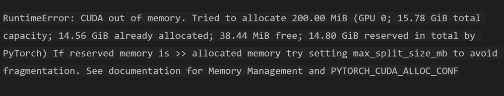

图 16.35：**GPU 资源管理**：不高效的内存使用或未能释放 GPU 资源可能导致内存不足错误和训练过程中的次优性能。

除了资源管理问题之外，另一个常见的故障机制源于并发和同步错误。在分布式或多线程环境中，并行进程之间不正确的协调可能导致竞争条件、死锁或不一致状态。这些问题通常与[异步操作](https://odsc.medium.com/optimizing-ml-serving-with-asynchronous-architectures-1071fc1be8e2)的不当使用有关，例如非阻塞 I/O 或并行数据摄取。同步错误可能会破坏训练状态的一致性或产生不可靠的模型检查点。

兼容性问题通常源于软件环境的变化，这扩展了第七章中讨论的框架兼容性问题。第七章。例如，在不验证下游影响的情况下升级第三方库可能会引入微妙的行为变化或破坏现有功能。当训练和推理环境在硬件、操作系统或依赖版本上存在差异时，这些问题会变得更加严重。在机器学习实验中，可重复性往往取决于管理这些环境的不一致性。

与数值不稳定性相关的故障在机器学习系统中也很常见，尤其是在优化过程中。不恰当处理浮点精度、除以零或下溢/上溢条件可能会将不稳定性引入梯度计算和收敛过程。正如[这个资源](https://pythonnumericalmethods.studentorg.berkeley.edu/notebooks/chapter22.04-Numerical-Error-and-Instability.html)中所述，在许多计算层中累积舍入误差可能会扭曲学习到的参数或延迟收敛。

虽然异常处理通常被忽视，但它对机器学习管道的稳定性起着至关重要的作用。不充分或过于通用的异常管理可能导致系统在非关键错误下静默失败或崩溃。模糊的错误信息和糟糕的日志记录实践会阻碍诊断并延长解决时间。

这些故障机制虽然来源多样，但都具有显著损害机器学习系统的潜力。了解它们是如何产生的为有效的系统级安全措施提供了基础。

### 软件故障对机器学习的影响

软件故障产生的机制揭示了其对机器学习系统的影响。软件故障的后果可能非常严重，不仅会影响模型输出的正确性，还会影响机器学习系统在生产中的广泛可用性和可靠性。

最直接的影响是性能下降，这是一个常见的症状，通常由内存泄漏、资源调度效率低下或并发线程之间的竞争引起。这些问题往往会随着时间的推移而积累，导致延迟增加、吞吐量减少，甚至系统崩溃。正如(Maas 等人 2024)所指出的，组件间性能退化的累积可能会严重限制大规模部署的机器学习系统的运行能力。

除了减慢系统性能外，故障还可能导致预测不准确。例如，预处理错误或特征编码的不一致性可能会微妙地改变模型看到的输入分布，产生有偏或不可靠的输出。这类故障尤其隐蔽，因为它们可能不会触发任何明显的故障，但仍然会损害下游决策。随着时间的推移，舍入误差和精度损失会放大不准确度，尤其是在具有许多层或长期训练周期的深度架构中。

除了准确性问题之外，软件故障还会破坏可靠性。系统可能会意外崩溃，无法从错误中恢复，或者在重复执行中表现不一致。间歇性故障在此背景下尤其成问题，因为它们会侵蚀用户信任，同时逃避传统的调试努力。在分布式环境中，检查点或模型序列化中的故障可能导致训练中断或数据丢失，降低长期运行训练管道的弹性。

安全漏洞通常源于被忽视的软件故障。缓冲区溢出、验证不当或未受保护的输入可能会使系统容易受到操纵或未经授权的访问。攻击者可能会利用这些弱点来改变模型的行为、提取私有数据或引发拒绝服务条件。正如(Q. 李等人 2023)所描述的，这些漏洞带来了严重风险，尤其是在机器学习系统集成到关键基础设施或处理敏感用户数据时。

最后，故障的存在使开发和维护变得复杂。调试变得更加耗时，尤其是在故障行为是非确定性的或依赖于外部配置时。频繁的软件更新或库补丁可能引入回归，需要重复测试。这种增加的工程开销可能会减慢迭代速度，阻碍实验，并将资源从模型开发中转移出来。

一起来看，这些影响突出了在机器学习中系统软件工程实践的重要性——这些实践可以预测、检测和缓解由软件故障引入的多种故障模式。

### 软件故障检测和预防

考虑到软件故障对机器学习系统的影响重大，解决这些问题需要跨越开发、测试、部署和监控的集成策略，基于第十三章（ch019.xhtml#sec-ml-operations）中的运营最佳实践。一个有效的缓解框架应结合主动检测方法、稳健的设计模式和操作保障。

为了帮助总结这些技术并阐明每种策略在机器学习生命周期中的位置，下表 表 16.6 按阶段和目标对检测和缓解方法进行了分类。此表提供了一个高级概述，补充了随后的详细解释。

表 16.6：**故障缓解策略**：机器学习系统中的软件故障需要分层检测和缓解技术，这些技术应用于整个开发生命周期——从初始测试到持续监控，以确保可靠性和鲁棒性。此表按阶段和目标对这些策略进行了分类，为构建全面故障容忍的机器学习部署提供了一个框架。

| **类别** | **技术** | **目的** | **何时应用** |
| --- | --- | --- | --- |
| **测试和验证** | 单元测试、集成测试、回归测试 | 验证正确性并识别回归 | 开发期间 |
| **静态分析和代码审查** | 静态分析器、代码审查工具 | 检测语法错误、不安全操作、强制最佳实践 | 集成前 |
| **运行时监控与日志记录** | 指标收集、错误日志、分析 | 观察系统行为，检测异常 | 训练和部署期间 |
| **容错设计** | 异常处理、模块化架构、检查点 | 最小化故障影响，支持恢复 | 设计和实现阶段 |
| **更新管理** | 依赖审计、测试阶段、版本跟踪 | 预防回归和兼容性问题 | 在系统升级或部署之前 |
| **环境隔离** | 容器化（例如，Docker、Kubernetes）、虚拟环境 | 确保可重复性，避免环境特定错误 | 开发、测试、部署 |
| **CI/CD 和自动化** | 自动化测试管道、监控钩子、部署门 | 强制质量保证并尽早捕获错误 | 开发过程中的持续进行 |

第一道防线涉及系统性的测试。单元测试验证单个组件在正常和边缘情况下的行为是否符合预期。集成测试确保模块在边界之间正确交互，而回归测试检测由代码更改引入的错误。在快速发展的机器学习环境中，持续测试至关重要，因为管道迅速演变，小的修改可能产生系统级的影响。如图 16.36 图所示，自动回归测试有助于随着时间的推移保持功能正确性。

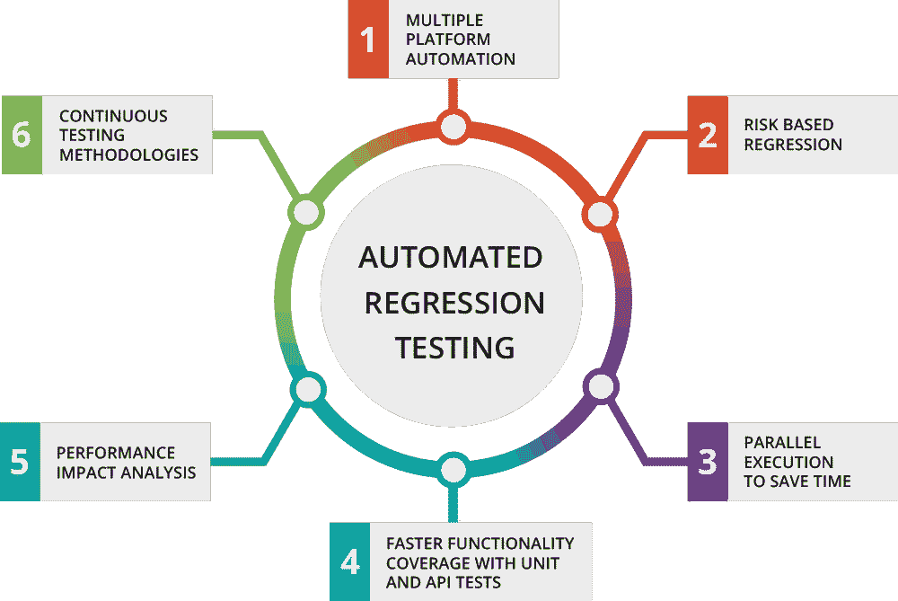

图 16.36：**回归测试自动化**：自动回归测试验证新代码更改不会向现有功能引入意外的错误，从而在整个开发生命周期中保持系统可靠性。在快速发展的机器学习系统中，这些测试的持续执行至关重要，因为即使是微小的修改也可能产生广泛的影响。*来源：UTOR*

静态代码分析工具通过在编译时识别潜在问题来补充动态测试。这些工具可以捕获常见的错误，例如变量误用、不安全操作或违反特定语言的最佳实践。结合代码审查和一致的样式执行，静态分析可以减少可避免的编程错误的发病率。

运行时监控对于观察系统在实际环境下的行为至关重要。日志框架应捕获关键信号，如内存使用、输入/输出跟踪和异常事件。监控工具可以跟踪模型吞吐量、延迟和故障率，提供软件错误的早期警告。如图所示，[Microsoft 资源](https://microsoft.github.io/code-with-engineering-playbook/machine-learning/profiling-ml-and-mlops-code/)中的性能分析有助于识别性能瓶颈和表明更深层次架构问题的低效。

顽强的系统设计进一步提高了容错能力。结构化异常处理和断言检查防止小错误级联成系统级故障。冗余计算、回退模型和故障转移机制在组件故障的情况下提高了可用性。封装状态和隔离副作用的结构化架构使得诊断和包含故障更加容易。如(Eisenman 等人 2022 年)中讨论的检查点技术，可以在不丢失数据的情况下从训练中断中恢复。

保持机器学习软件的更新是另一项关键策略。应用定期的更新和安全补丁有助于解决已知的错误和漏洞。然而，更新必须通过测试阶段环境进行验证，以避免回归。审查[发布说明](https://github.com/pytorch/pytorch/releases)和变更日志确保团队了解新版本中引入的任何行为变化。

类似于[Docker](https://www.docker.com)和[Kubernetes](https://kubernetes.io)这样的容器化技术允许团队定义可重复的运行环境，从而减轻兼容性问题。通过隔离系统依赖，容器防止了由于开发、测试和生产中系统级差异引入的故障。

最后，围绕持续集成和持续部署（CI/CD）构建的自动化流水线为强制执行故障感知开发提供了基础设施。测试、验证和监控可以直接嵌入到 CI/CD 流程中。如图 16.37 图所示，这样的流水线降低了未注意到的回归风险，并确保只有经过测试的代码达到部署环境。


图 16.37: **CI/CD 流水线**: 自动化的 CI/CD 流水线通过将测试和验证直接集成到软件交付过程中，强制执行故障感知开发，降低回归风险，并确保只有经过测试的代码达到生产环境。容器化技术，如 Docker 和 Kubernetes，通过在这些流水线阶段提供可重复的运行环境来进一步增强可靠性。*来源：geeksforgeeks*

这些实践共同构成了机器学习系统中软件故障管理的完整方法。当系统性地采用时，它们降低了系统故障的可能性，提高了长期的可维护性，并促进了模型性能和可重复性的信任。

## 故障注入工具和框架

由于开发稳健的人工智能系统的重要性，近年来，研究人员和从业者已经开发了一系列工具和框架，这些工具和框架建立在第七章（Chapter 7）中描述的软件基础设施之上，以了解硬件故障如何表现和传播以影响机器学习系统。这些工具和框架在通过模拟各种故障场景并分析其对系统性能的影响方面发挥着关键作用，从而补充了第十二章（Chapter 12）中描述的评估方法。这使得设计人员能够识别潜在的安全漏洞并制定有效的缓解策略，最终创建出更稳健、更可靠且能够在硬件故障下安全运行的人工智能系统，支持第十三章（Chapter 13）中详细说明的部署策略。本节概述了文献中广泛使用的故障模型 66 以及为评估此类故障对机器学习系统的影响而开发的工具和框架。

### 故障和错误模型

如前所述，硬件故障可以以多种方式表现出来，包括瞬态、永久和间歇性故障。除了正在研究的故障类型外，故障的表现方式也同样重要。例如，故障是在存储单元中发生还是在功能单元的计算过程中发生？它的影响是针对单个比特，还是影响多个比特？故障是否传播到整个系统并影响应用程序（导致错误），或者它是否迅速被掩盖并被认为是无害的？所有这些细节都会影响所谓的故障模型，这在模拟和测量故障发生时系统所发生的情况中起着重要作用。

为了研究和理解硬件故障对机器学习系统的影响，理解故障模型和错误模型的概念是至关重要的。故障模型描述了硬件故障如何在系统中表现，而错误模型则表示故障如何传播并影响系统的行为。

故障模型通常根据几个关键属性进行分类。首先，它们可以根据其持续时间来定义：瞬态故障是暂时的，很快就会消失；永久故障无限期地持续存在；间歇性故障偶尔发生，这使得它们特别难以识别或预测。另一个维度是故障位置，故障可能出现在硬件组件中，如存储单元、功能单元或互连。故障还可以通过其粒度来表征——一些故障仅影响单个比特（例如，比特翻转），而其他故障则同时影响多个比特，如突发错误。

相比之下，错误模型描述了故障在系统内传播时的行为效应。这些模型帮助研究人员理解初始硬件级别的扰动可能如何体现在系统的行为中，例如通过机器学习模型中损坏的权重或错误的激活。这些模型可以在各种抽象级别上运行，从低级别的硬件错误到机器学习框架中的高级逻辑错误。

故障或错误模型的选择对于鲁棒性评估至关重要。例如，一个旨在研究单比特瞬态故障的系统（Sangchoolie, Pattabiraman, 和 Karlsson 2017）将不会对永久性多比特故障的影响提供有意义的见解（Wilkening 等人 2014），因为其设计和假设基于完全不同的故障模型。

考虑错误模型如何以及在哪里实现也很重要。在架构寄存器级别发生的单比特翻转，使用 gem5 等模拟器建模（Binkert 等人 2011），与 PyTorch 模型权重张量中的类似比特翻转有明显的区别。虽然两者都模拟了值级别的扰动，但低级别模型捕捉了通常在软件框架中抽象掉的微架构效应。

有趣的是，某些故障行为模式在抽象级别上保持一致。例如，研究一直表明，单比特故障比多比特故障造成的破坏更大，无论是考察硬件级别的效应还是软件可见的影响（Sangchoolie, Pattabiraman, 和 Karlsson 2017；Papadimitriou 和 Gizopoulos 2021）。然而，其他重要的行为，如错误掩码（Mohanram 和 Touba，未注明年份），可能只能在较低的抽象级别上观察到。如图 16.38 所示，这种掩码现象可能导致故障在传播到更高级别之前被过滤掉，这意味着基于软件的工具可能会完全错过这些效应。


图 16.38：**错误掩码**：微架构冗余可以在故障传播到可观察的系统错误之前吸收单比特故障，突显了硬件级别和软件级别故障模型之间的差异。此图详细说明了故障掩码在微架构组件中的发生过程，表明基于软件的错误检测工具可能会低估系统对瞬态错误的真正弹性。*(Ko 2021)*

为了解决这些差异，开发了像 Fidelity (Yi He, Balaprakash, and Li 2020)这样的工具，以对抽象层之间的故障模型进行对齐。通过将软件观察到的故障行为映射到相应的硬件级模式(E. Cheng et al. 2016)，Fidelity 提供了一种更精确的软件级别模拟硬件故障的方法。虽然底层工具捕获了错误通过硬件系统的真实传播，但它们通常速度较慢且更复杂。软件级别的工具，如 PyTorch 或 TensorFlow 中实现的工具，对于大规模鲁棒性测试来说更快、更易用，尽管精度较低。

### 基于硬件的故障注入

基于硬件的故障注入方法允许研究人员直接将故障引入物理系统，并观察它们对机器学习模型的影响。这些方法对于验证软件级别故障注入工具中做出的假设以及研究实际硬件故障如何影响系统行为至关重要。虽然大多数用于机器学习鲁棒性研究中的错误注入工具都是基于软件的，但由于它们的速度和可扩展性，基于硬件的方法对于建立高级错误模型仍然至关重要。通过直接操作硬件来引入错误，它们被认为是研究故障对机器学习系统影响的最准确方法。

如图 16.39 所示，硬件故障可以在深度神经网络（DNN）处理管道的各个点出现。这些故障可能影响控制单元、片上内存（SRAM）、片外内存（DRAM）、处理元素和累加器，导致错误结果。在所描述的示例中，一个被赋予正确识别交通信号的 DNN 在正常条件下正确地识别了红灯。然而，由老化、电迁移、软错误、工艺变化和制造缺陷等现象引起的硬件引起的故障可能会引入错误，导致 DNN 将信号误分类为绿灯，这可能导致实际应用中的灾难性后果。

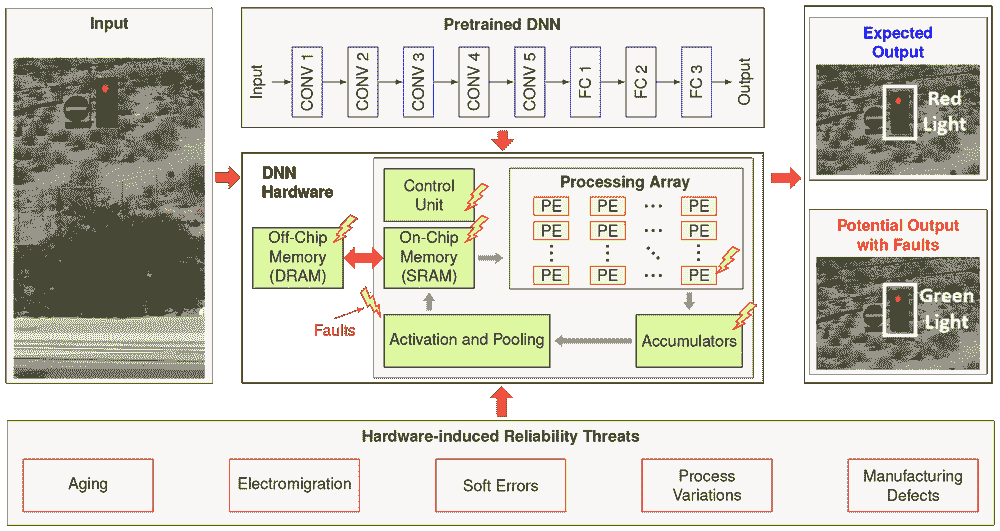

图 16.39：**硬件故障**：此图展示了在深度神经网络（DNN）处理管道中可能发生的硬件引起的错误，突出了可能导致实际应用中误分类的潜在故障点，如控制单元和内存模块。

这些方法使研究人员能够观察系统在实际世界故障条件下的行为。本节更详细地描述了基于软件和硬件的错误注入工具。

#### 硬件注入方法

最常见的两种基于硬件的故障注入方法是 FPGA 基于的故障注入和辐射或束测试。

**基于 FPGA 的故障注入**。现场可编程门阵列（FPGAs）67 是可重新配置的集成电路，可以编程以实现各种硬件设计。在故障注入的背景下，FPGAs 提供了高精度和准确性，因为研究人员可以在硬件中针对特定的位或位集。通过修改 FPGA 配置，可以在机器学习模型的执行过程中在特定位置和时间引入故障。基于 FPGA 的故障注入允许对故障模型进行细粒度控制，使研究人员能够研究不同类型故障的影响，例如单比特翻转或多比特错误。这种控制水平使得基于 FPGA 的故障注入成为了解机器学习系统对硬件故障的恢复力的宝贵工具。

虽然基于 FPGA 的方法允许精确、可控的故障注入，但其他方法旨在复制自然环境中发现的故障条件。

**辐射或束测试**。辐射或束测试（Velazco, Foucard, 和 Peronnard 2010）将运行机器学习模型的硬件暴露于高能粒子，如质子或中子。如图 16.40（ch022.xhtml#fig-beam-testing）所示，专用测试设施能够实现可控的辐射暴露，以诱导位翻转和其他硬件级别的故障。这种方法被广泛认为是在应用执行期间测量粒子打击错误率的最准确方法之一。束测试提供了高度逼真的故障场景，反映了辐射丰富环境中的条件，这使得它对于验证旨在太空任务或粒子物理实验的系统特别有价值。然而，尽管束测试提供了非凡的现实感，但它缺乏基于 FPGA 注入的精确目标能力——粒子束不能以高精度指向特定的硬件位或组件。尽管存在这种限制以及其显著的操作复杂性和成本，束测试仍然是严格评估实际辐射效应下硬件可靠性的行业公认实践。

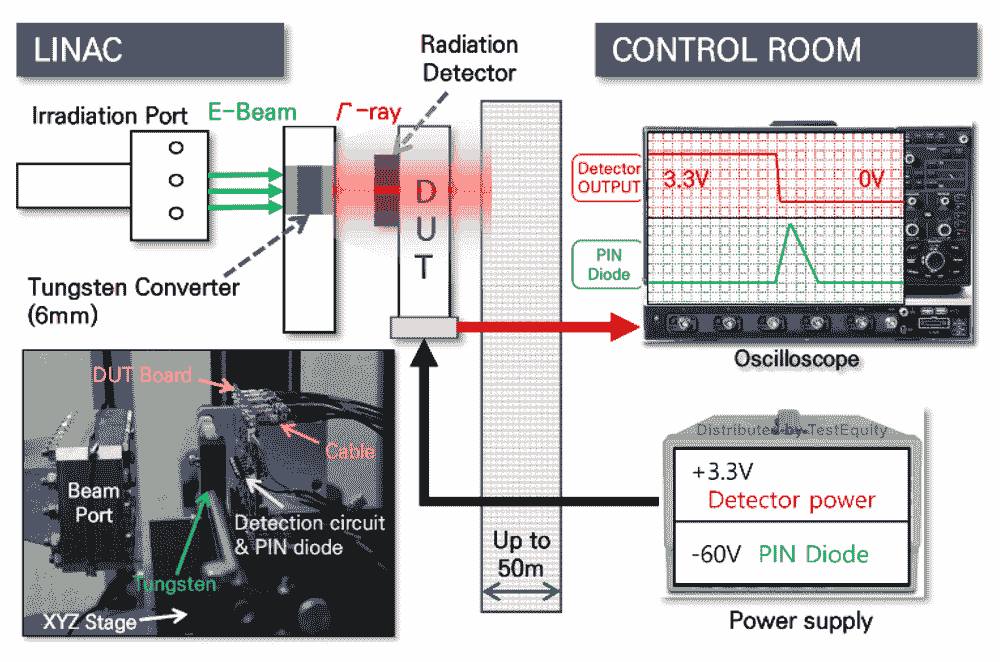

图 16.40：**辐射测试设置**：辐射测试设施通过将半导体元件暴露于高能粒子中，模拟在太空或粒子物理实验中遇到的现实辐射环境，从而诱导硬件故障。这种可控的故障注入方法为评估硬件在极端条件下的可靠性和错误率提供了宝贵的数据，尽管它缺乏基于 FPGA 的故障注入的精确目标能力。*来源：JD 仪器[HTTPS://jdinstruments.net/tester-capabilities-radiation-test/]*

#### 硬件注入限制

尽管基于硬件的故障注入方法具有很高的准确性，但它们存在一些限制，可能会阻碍其广泛应用。

首先，成本是一个主要障碍。基于 FPGA 和光束测试 68 的方法都需要专用硬件和设施，这可能导致高昂的设置和维护成本。这使得资金或基础设施有限的研究小组难以获得。

其次，这些方法面临着可扩展性的挑战。在硬件上直接注入故障和收集数据是耗时的，这限制了在合理时间内可以运行的实验数量。当分析大型机器学习系统或对许多故障场景进行统计分析时，这一点尤其受限。

第三，存在灵活性限制。在模拟广泛的故障和错误类型时，基于硬件的方法可能不如基于软件的替代方案适应性强。为了适应新的故障模型而更改实验设置通常需要耗时的硬件重新配置。

尽管存在这些限制，基于硬件的故障注入对于验证基于软件工具的准确性以及研究在真实世界故障条件下的系统行为仍然是必不可少的。通过结合基于硬件方法的精确性和基于软件工具的可扩展性和灵活性，研究人员可以更全面地了解机器学习系统对硬件故障的弹性，并制定有效的缓解策略。

### 基于软件的故障注入

随着 TensorFlow、PyTorch 和 Keras 等机器学习框架成为开发和部署 ML 模型的主导平台，基于软件的故障注入工具已成为评估这些系统对硬件故障鲁棒性的灵活且可扩展的方法。与直接在物理系统上运行的基于硬件的方法不同，基于软件的方法通过修改模型的底层计算图、张量值或中间计算来模拟硬件故障的影响。

近年来，这些工具越来越受欢迎，因为它们可以直接集成到机器学习（ML）开发管道中，无需专用硬件，并允许研究人员快速且经济高效地进行大规模故障注入实验。通过在软件层面模拟硬件级故障，包括权重、激活或梯度的位翻转，这些工具能够有效地测试容错机制，并为模型漏洞提供宝贵的见解。

在本节的剩余部分，我们将探讨基于软件的故障注入方法的优缺点，介绍主要工具类别（通用和特定领域），并讨论它们如何有助于构建具有弹性的机器学习系统。

#### 软件注入权衡

基于软件的故障注入工具提供了几个优势，使它们对研究机器学习系统的弹性具有吸引力。

其中一个主要的好处是速度。由于这些工具完全在软件堆栈中运行，它们避免了修改物理硬件或配置专用测试环境的相关开销。这种效率使得研究人员能够在更短的时间内进行大量的故障注入实验。快速模拟广泛故障的能力使得这些工具特别适用于对大规模机器学习模型进行压力测试或进行需要数千次注入的统计分析。

这些工具还提供了灵活性。基于软件的故障注入器可以轻松地适应模拟各种类型的故障。研究人员可以模拟单比特翻转、多比特损坏，甚至更复杂的如突发错误或部分张量损坏的行为。软件工具允许在机器学习管道的不同阶段注入故障，在训练、推理或梯度计算阶段，从而能够精确地针对不同的系统组件或层。

这些工具也高度可访问，因为它们只需要标准的机器学习开发环境。与基于硬件的方法不同，软件工具不需要昂贵的实验设置、定制电路或辐射测试设施。这种可访问性使得故障注入研究对更广泛的机构和发展者开放，包括那些在学术界、初创公司或资源受限环境中工作的人。

然而，这些优势也伴随着某些权衡。其中最重要的是准确性。由于基于软件的工具在更高层次上抽象地模拟故障，它们可能无法完全捕捉影响故障实际传播的低级硬件交互。例如，在机器学习框架中模拟的位翻转可能没有考虑到数据在硬件级别的缓冲、缓存或操作方式，这可能导致结论过于简化。

与此密切相关的是保真度问题。虽然可以近似现实世界的故障行为，但基于软件的工具可能与真实硬件行为有所偏差，尤其是在掩码、时序或数据移动等微妙交互方面。此类模拟的结果高度依赖于错误模型的潜在假设，并且可能需要与真实硬件测量结果进行验证才能可靠。

尽管存在这些限制，基于软件的故障注入工具在机器学习鲁棒性研究中发挥着不可或缺的作用。它们的速度、灵活性和可访问性允许研究人员进行广泛的评估，并指导容错机器学习架构的开发。在接下来的章节中，我们将探讨这个领域的主要工具，突出它们的功能和用例。

#### 软件注入限制

虽然基于软件的故障注入工具在速度、灵活性和可访问性方面提供了显著的优势，但它们并非没有局限性。这些限制可能会影响故障注入实验的准确性和真实性，尤其是在评估机器学习系统对现实世界硬件故障的鲁棒性时。

一个主要的问题是准确性。由于基于软件的工具在更高的抽象级别上运行，它们可能无法始终捕捉到硬件故障可以产生的全部影响。包括微妙的时序错误、电压波动和架构副作用在内的低级硬件交互可能会在高级模拟中完全被忽略。因此，仅依赖于软件模型的故障注入研究可能会低估或高估系统对某些类别故障的真实脆弱性。

与之密切相关的是保真度问题。虽然基于软件的方法通常被设计来模拟特定的故障行为，但它们反映现实世界硬件条件的程度可能会有所不同。例如，模拟神经网络权重值中的单个位翻转可能无法完全复制该位错误如何在内存层次结构中传播或影响实际芯片上的计算单元。工具越抽象，在故障条件下模拟行为与物理行为偏离的风险就越大。

由于基于软件的工具更容易修改，它们可能会无意中偏离现实世界的故障假设。这可能发生在所选择的故障模型过于简化或没有基于实际硬件行为的经验数据的情况下。正如在讨论硬件-软件差距的章节中所述，像 Fidelity (Yi He, Balaprakash, and Li 2020) 这样的工具试图通过将软件级模型与已知的硬件级故障特征对齐来解决这些担忧。

尽管存在这些局限性，基于软件的故障注入仍然是机器学习鲁棒性研究工具箱的一个关键部分。当适当使用时，尤其是与基于硬件的验证结合使用时，这些工具提供了一种可扩展且高效的方式来探索大型设计空间，识别易受攻击的组件，并开发缓解策略。随着故障建模技术的不断发展，将硬件感知见解集成到基于软件的工具中将是提高其真实性和影响力的关键。

#### 软件注入工具分类

在过去几年中，基于软件的故障注入工具已被开发用于广泛的机器学习框架和用例。这些工具在抽象级别、目标平台和可以模拟的故障类型方面各不相同。许多工具被构建为与流行的机器学习库（如 PyTorch 和 TensorFlow）集成，使得那些已经在这些生态系统中工作的研究人员和实践者能够使用它们。

最早且最具影响力的工具之一是 Ares (Reagen 等人 2018)，最初是为 Keras 框架设计的。在深度神经网络（DNNs）日益流行的时期开发，Ares 是最早系统地探索硬件故障对 DNNs 影响的工具之一。它提供了支持注入单比特翻转和评估权重和激活值之间的比特错误率（BER）。重要的是，Ares 通过与在硅中实现的物理 DNN 加速器进行验证，证明了其在硬件级故障建模中的相关性。随着该领域的发展，Ares 被扩展以支持 PyTorch，使研究人员能够在更现代的机器学习环境中分析故障行为。

在此基础上，PyTorchFI (Mahmoud 等人 2020) 被引入作为一个为 PyTorch 定制的故障注入库。与 Nvidia 研究团队合作开发，PyTorchFI 允许对机器学习模型的关键组件进行故障注入，包括权重、激活和梯度。它对 GPU 加速的原生支持使其特别适合高效评估大型模型。如图 图 16.41 所示，即使是简单的位级故障也可能导致严重的视觉和分类错误，包括图像中出现“幽灵”对象，这可能在自动驾驶等领域的下游安全方面产生影响。

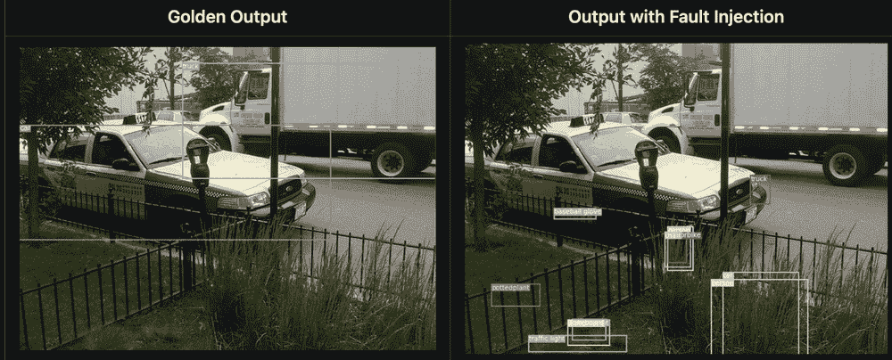

图 16.41：**故障注入效果**：位级硬件故障可能导致机器学习模型中出现“幽灵”对象和误分类，这可能导致自动驾驶等应用中的安全关键错误；左图表示正确分类，而右图展示了一个由 pytorchfi 注入的单比特翻转导致的假阳性检测。

PyTorchFI 的模块化和易于访问的设计使其在多个后续项目中得到应用。例如，PyTorchALFI（由 Intel xColabs 开发）扩展了 PyTorchFI 的功能，以评估汽车应用中的系统级安全性。同样，Meta 的 Dr. DNA (D. Ma 等人 2024) 引入了一个更简洁、Pythonic 的 API，以简化故障注入工作流程。另一个值得注意的扩展是 GoldenEye (Mahmoud 等人 2022)，它结合了替代的数值数据类型，包括 AdaptivFloat (Tambe 等人 2020) 和 BlockFloat，以 bfloat16 为例，来研究在硬件引起的位错误下非传统数字格式的容错性。

对于在 TensorFlow 生态系统内工作的研究人员，TensorFI (Z. Chen 等人 2020) 提供了一种并行解决方案。与 PyTorchFI 类似，TensorFI 允许对 TensorFlow 计算图进行故障注入，并支持多种故障模型。TensorFI 的一个优势是其广泛的适用性——它可以用于评估许多类型的机器学习模型，而不仅仅是深度神经网络（DNNs）。如 BinFi (Z. Chen 等人 2019) 这样的附加扩展旨在通过关注模型中最关键的位来加速故障注入过程。这种优先级设置可以帮助减少仿真时间，同时仍然捕捉到最有意义的错误模式。

在软件堆栈的较低层次，NVBitFI (T. Tsai 等人 2021) 提供了一个平台无关的工具，可以直接将故障注入到 GPU 汇编代码中。由 Nvidia 开发的 NVBitFI 能够对任何 GPU 加速的应用程序进行故障注入，而不仅仅是机器学习工作负载。这使得它成为研究指令级别弹性的特别强大的工具，因为错误可以以微妙和复杂的方式传播。NVBitFI 是 PyTorchFI 和 TensorFI 等高级工具的重要补充，它提供了对 GPU 级别行为的精细控制，并支持机器学习之外的更广泛的应用程序类别。

这些工具共同提供了广泛的故障注入能力。虽然一些工具与高级机器学习框架紧密集成，以便于使用，但其他工具则允许进行更精细的故障建模，具有更高的保真度。通过根据抽象级别、性能需求和目标应用程序选择适当的工具，研究人员可以根据自己的研究需求定制他们的研究，以获得更多关于机器学习系统鲁棒性的可操作见解。下一节将重点介绍这些工具如何在特定领域环境中应用，特别是在自动驾驶汽车和机器人等关键安全系统。

#### 机器学习特定注入工具

为了解决特定应用领域提出的独特挑战，研究人员已经开发了针对不同机器学习系统的专用故障注入工具。在自动驾驶汽车和机器人等高风险环境中，特定领域的工具在评估系统在硬件故障条件下的安全性和可靠性方面发挥着至关重要的作用。本节重点介绍了三种此类工具：DriveFI 和 PyTorchALFI，它们专注于自动驾驶汽车，以及 MAVFI，它针对的是无人驾驶飞行器（UAVs）。每个工具都允许将故障注入到任务关键组件中，包括感知、控制和传感器系统，为研究人员提供了关于硬件错误如何通过现实世界的机器学习管道传播的见解。

DriveFI (S. Jha et al. 2019) 是为自动驾驶系统开发的故障注入工具。它促进了硬件故障注入到感知和控制管道中，使研究人员能够研究这些故障如何影响系统行为和安全。值得注意的是，DriveFI 与行业标准平台（如 Nvidia DriveAV 和百度 Apollo）集成，提供了一个真实的测试环境。通过这种集成，DriveFI 使从业者能够在存在故障条件的情况下评估自动驾驶架构的端到端弹性。

PyTorchALFI (Gräfe et al. 2023) 扩展了 PyTorchFI 的功能，使其适用于自动驾驶领域。由英特尔 xColabs 开发的 PyTorchALFI 通过添加特定领域的功能增强了底层故障注入框架。这些功能包括将故障注入到多模态传感器数据中 69，例如来自摄像头和激光雷达系统的输入。这允许我们更深入地研究自动驾驶车辆的感知系统如何对底层硬件故障做出反应，进一步细化我们对系统脆弱性和潜在故障模式的了解。

MAVFI (Hsiao et al. 2023) 是一个针对机器人应用，尤其是无人机的特定领域故障注入框架。基于机器人操作系统 (ROS) 构建，MAVFI 为将故障注入各种无人机子系统（包括传感器、执行器和飞行控制算法）提供了一个模块化和可扩展的平台。通过评估注入的故障如何影响飞行稳定性和任务成功，MAVFI 为开发和验证容错无人机架构提供了一种实用的方法。

这些工具共同展示了故障注入研究在各个应用领域的日益复杂化。通过允许对故障引入的位置和方式进行精细控制，特定领域的工具提供了通用框架可能忽略的可操作见解。它们的发展极大地扩大了机器学习社区设计和管理弹性系统的能力——特别是在可靠性、安全和实时性能至关重要的环境中。

### 桥接软硬件差距

虽然基于软件的故障注入工具在速度、灵活性和可访问性方面具有许多优势，但它们并不总是能够捕捉到硬件故障对系统可能产生的影响的全部范围。这主要是因为抽象差距：基于软件的工具在更高的层面上运行，可能会忽略低级硬件交互或影响机器学习系统行为的微妙错误传播机制。

如(Bolchini 等人 2023)的工作所述，硬件故障可以表现出复杂的空间分布模式，这些模式难以仅使用基于软件的故障模型来复制。他们确定了四种特征故障传播模式：单点，其中故障会破坏特征图中的一个值；同一行，其中特征图中的一行部分或全部被破坏；子弹尾波，其中多个特征图中相同的位置受到影响；以及破碎玻璃，这是同一行和子弹尾波行为的更复杂组合。这些不同的模式，如图图 16.42 所示，突出了简单注入策略的局限性，并强调了在评估机器学习系统鲁棒性时进行硬件感知建模的必要性。


图 16.42：**硬件故障模式**：Dnns 表现出从硬件故障中独特的错误表现，按其在特征图和层之间的空间分布进行分类。这些模式——单点、同一行、子弹尾波和破碎玻璃——代表了局部与广泛破坏，影响模型预测并强调了容错系统设计的必要性。来源：(Bolchini 等人 2023)。

为了解决这个抽象差距，研究人员开发了旨在明确地将底层硬件错误行为映射到软件可见效果的工具。其中一个这样的工具是 Fidelity，它通过研究硬件级别的故障如何传播并在更高软件层变得可观察来弥合这一差距。下一节将更详细地讨论 Fidelity。

#### 模拟忠实度挑战

Fidelity（叶，Balaprakash 和 李 2020）是一个工具，旨在在基于软件的故障注入实验中更准确地模拟硬件故障。其核心目标是通过模拟故障如何在计算堆栈中传播，来弥合底层硬件故障行为与机器学习系统中观察到的更高层次效应之间的差距。

Fidelity（忠实度）背后的核心洞察是，并非所有故障都需要在硬件级别单独建模才能产生有意义的结果。相反，Fidelity 关注故障如何在软件可见状态下表现，并识别出允许对整个故障类进行代表性建模的等价关系。为此，它依赖于几个关键原则：

首先，研究故障传播以了解一个起源于硬件的故障如何通过各种层移动，包括架构寄存器、内存层次结构和数值运算，最终改变软件中的值。Fidelity 捕获这些路径以确保注入到软件中的故障反映了故障在实际系统中实际表现的方式。

第二，该工具识别了故障等价性，这指的是将导致软件中类似可观察结果的硬件故障分组。通过关注代表性示例而不是单独对每个可能的硬件位翻转进行建模，Fidelity 允许更高效的模拟，同时不牺牲准确性。

最后，Fidelity 采用分层建模方法，捕捉系统在各个抽象层次上的行为——从硬件故障的起源到其在机器学习模型权重、激活或预测中的影响。这种分层确保了在机器学习系统的背景下，硬件故障的影响得到真实模拟。

通过结合这些技术，Fidelity 允许研究人员运行与真实硬件系统行为紧密相似的故障注入实验，但具有基于软件工具的效率和灵活性。这使得 Fidelity 在成本高昂且对硬件引起的故障有准确理解至关重要的关键安全设置中特别有价值。

#### 硬件行为建模

在基于软件的故障注入工具中捕捉硬件故障的真实行为对于提高机器学习系统的可靠性和鲁棒性至关重要。当硬件故障具有微妙但重大的影响，而这些影响在高级抽象层次上建模时可能不明显时，这种精确度变得尤为重要。

几个原因解释了为什么准确反映硬件行为是至关重要的。首先，准确性至关重要。基于软件的工具，能够反映硬件故障的实际传播和表现，提供了对故障如何影响模型行为的更可靠的见解。这些见解对于设计和验证容错架构以及确保缓解策略基于现实系统行为至关重要。

第二，当硬件效果得到忠实捕捉时，可重复性得到提高。这允许在不同系统和环境中可靠地重现故障注入结果，这是严格科学研究的基石。研究人员可以更好地比较结果，验证发现，并确保研究之间的一致性。

第三，当故障模型专注于最具代表性和影响力的故障场景时，效率会得到提升。而不是全面模拟每个可能的位翻转，工具可以针对已知通过精确建模影响系统的故障子集。这种选择性方法在节省计算资源的同时，仍然提供深入的见解。

最后，理解硬件故障在软件层面的出现方式对于设计有效的缓解策略至关重要。当研究人员知道特定硬件级别的问题如何影响机器学习系统的不同组件时，他们可以开发更具有针对性的加固技术——例如重新训练特定层、选择性应用冗余或提高瓶颈组件的架构弹性。

工具如 Fidelity 是这项工作的核心。通过在低级硬件行为和高级软件效果之间建立映射，Fidelity 和类似工具使研究人员能够进行故障注入实验，这些实验不仅更快、更可扩展，而且基于现实世界的系统行为。

随着机器学习系统规模的不断扩大，并在越来越关键的安全生产环境中部署，这种硬件感知建模将变得更加重要。该领域的研究持续进行，旨在进一步细化硬件和软件故障模型之间的翻译，并开发出在评估机器学习系统弹性方面既高效又真实的工具。这些进步将为社区提供更强大、更可靠的方法来理解和防御硬件故障的影响。

## Fallacies and Pitfalls

鲁棒性威胁的复杂性和相互关联性往往导致对有效防御策略的误解，尤其是在鲁棒性技术提供无权衡或限制的普遍保护的假设方面。

**谬误：** *通过防御技术可以实现对抗鲁棒性，而不需要权衡。*

这种误解使团队相信，像对抗性训练或输入预处理这样的鲁棒性技术可以提供无成本的完全保护。对抗性防御通常会引入重大的权衡，包括降低清洁精度、增加计算开销或对新攻击方法的脆弱性。许多在特定攻击中看似有效的防御技术，在对抗更强或自适应的对手时却失败了。攻击和防御之间的军备竞赛意味着鲁棒性不是一个已解决的问题，而是一个持续的工程挑战，需要不断适应和评估不断发展的威胁。

**陷阱：** *仅针对已知攻击方法测试鲁棒性，而不是进行全面的威胁建模。*

许多从业者通过针对少数标准对抗性攻击进行测试来评估模型的鲁棒性，而没有考虑到潜在威胁的全谱。这种方法在模型对有限的测试案例表现良好时提供了虚假的信心，但在面对新颖的攻击向量时却会灾难性地失败。现实世界的威胁不仅包括复杂的对抗性示例，还包括硬件故障、数据损坏、分布偏移和可能不像学术攻击场景的软件漏洞。全面的鲁棒性评估需要系统性的威胁建模，考虑完整的攻击面，而不是仅仅关注已知的一组漏洞。

**谬误：** *通过收集更多样化的训练数据可以解决分布偏移问题。*

这种信念假设仅凭数据集多样性就能确保对部署中遇到的分布偏移的鲁棒性。虽然多样化的训练数据有所帮助，但它无法预测动态现实环境中可能发生的所有可能的分布变化。与无限的部署条件相比，训练数据集本质上仍然是有限的。一些分布偏移本质上是不可预测的，它们可能源于用户行为的变化、数据源的演变或外部环境因素。有效的鲁棒性需要具有监控、检测和响应能力的自适应系统，而不是仅仅依赖于全面训练数据。

**陷阱：** *假设为某一威胁类别设计的鲁棒性技术可以保护所有故障模式。*

团队通常在没有理解它们对其他故障模式限制的情况下，应用针对特定威胁开发的鲁棒性技术。针对基于梯度的攻击设计的对抗性训练可能不会提高对硬件故障或数据中毒的鲁棒性。同样，处理良性分布偏移的技术可能无法应对旨在利用模型弱点的对抗性分布偏移。每个威胁类别都需要专门的防御措施，有效的鲁棒性需要分层保护策略，以解决潜在故障的全谱系，而不是假设跨域的有效性。

**谬误：** *不同的故障模式独立运作，可以单独解决。*

这种假设忽略了不同故障类型之间可能产生的复杂交互，这些交互可以创建超过单个威胁总和的复合漏洞。现实世界的故障往往涉及级联效应，其中一种漏洞使其他漏洞得以启用或放大。考虑以下复合场景：

硬件对抗性交互说明了模型权重中的位翻转如何意外地创建出原始模型中不存在的对抗性漏洞。攻击者发现这些破坏后，可以构建针对特定权重扰动的针对性对抗示例，实现 95%的攻击成功率，而未受破坏的模型攻击成功率仅为 20%。相反，旨在提高鲁棒性的对抗性训练通过增加 2-3<semantics><mi>×</mi><annotation encoding="application/x-tex">\times</annotation></semantics>模型复杂性，提高了由于内存和计算需求增加而导致的硬件故障的概率。

环境软件级联发生在由于监控软件中的错误导致无法记录异常样本，从而可能未被发现逐渐的分布变化时。随着变化在 3-6 个月内进展，模型的准确性下降 40%，但故障监控系统报告正常操作。当最终被发现时，累积的数据漂移和延迟检测需要重新训练整个模型，而不是增量适应，导致 10<semantics><mi>×</mi><annotation encoding="application/x-tex">\times</annotation></semantics>更高的恢复成本。

攻击性分布利用涉及攻击者观察部署系统中自然分布的变化，并构建加速特定方向漂移的中毒攻击。通过注入仅与自然漂移模式一致的 0.1%中毒样本，攻击者可以导致 5<semantics><mi>×</mi><annotation encoding="application/x-tex">\times</annotation></semantics>更快的性能退化，同时避开针对纯对抗或纯漂移场景校准的检测系统。

三重威胁场景展示了最严重的复合漏洞。考虑一个自动驾驶汽车，其中宇宙射线引起的位翻转破坏了感知模型权重，对抗性道路标记利用这些破坏，季节性天气变化造成分布漂移。这种组合在特定条件下导致 85%的停车标志误分类，而每个单独的威胁只会造成 15-20%的退化。

这些复合场景表明，鲁棒的人工智能系统必须通过全面的故障模式分析、跨领域测试来评估综合漏洞，以及考虑级联故障的防御策略，而不是孤立地处理每个威胁。

## 摘要

本章将鲁棒人工智能确立为在现实世界环境中运行的可靠机器学习系统的核心要求。通过检查云、边缘和嵌入式部署中的具体故障，我们证明了鲁棒性挑战跨越多个维度，需要系统性的检测、缓解和恢复方法。

在这里开发的统一框架将鲁棒性挑战组织成三个相互关联的支柱，这些支柱共享共同的原则，同时需要专门的解决方案。系统级故障解决所有机器学习计算背后的物理基础可靠性问题，从瞬态宇宙射线效应到永久性硬件退化。输入级攻击包括通过对抗性示例和数据中毒技术故意操纵模型行为的尝试。环境变化代表部署条件的自然演变，通过分布漂移和概念变化挑战静态模型假设。

在这三个支柱中，稳健人工智能系统实施检测和监控的通用原则，以在影响系统行为之前识别威胁，优雅降级以在压力下保持核心功能，以及根据检测到的条件调整系统行为的自适应响应。这些原则在支柱类型之间表现不同，但为构建全面的稳健性解决方案提供了一个统一的基础。

稳健人工智能的实用实施需要在整个机器学习（ML）管道中实现集成，从数据收集到部署和监控。硬件容错机制必须与对抗性防御和漂移检测系统协调一致，以提供全面保护。这个稳健性基础为第十三章中详细说明的操作框架提供了必要的可靠性保证，在这些框架中，这些容错系统将得到部署、监控和维护。如果没有在这里开发的综合可靠性机制，下一章中的操作工作流程将缺乏生产部署所需的基本弹性。

表 16.7 提供了一个实用的参考，将三个主要故障类别映射到它们的主要检测和缓解策略，作为实施全面稳健性解决方案的工程指南：

表 16.7：**稳健性策略参考**：将故障类别映射到它们的主要检测和缓解方法的一个实用映射，为工程师提供了一个系统框架，用于在稳健人工智能的三个支柱上实施全面的稳健性解决方案。

| **故障类别** | **检测方法** | **缓解策略** |
| --- | --- | --- |
| **系统级别** | ECC 内存 | 冗余（TMR/DMR） |
| **故障** | BIST（内置自检）看门狗定时器电压/温度监控 | 检查点硬件冗余错误纠正码 |
| **输入级别** | 输入净化 | 对抗性训练 |
| **攻击** | 异常检测统计测试行为分析 | 防御蒸馏输入预处理模型集成 |
| **环境** | 统计监控（MMD，PSI） | 持续学习 |
| **变化** | 分布比较性能退化跟踪概念漂移检测 | 模型重新训练自适应阈值集成方法 |

**关键要点**

+   稳健人工智能系统必须解决三个相互关联的威胁类别：系统级故障、输入级攻击和环境变化。

+   检测、优雅降级和自适应响应的通用原则适用于所有威胁类型，同时需要专门的实现。

+   硬件可靠性直接影响机器学习性能，单比特错误能够使模型精度降低 10-50%。

+   现实世界的稳健性需要在整个机器学习管道中实现集成，而不是孤立的保护机制。

+   现代人工智能部署需要系统性的稳健性评估和缓解方法

在这些稳健性基础上，以下章节将探讨可信赖人工智能系统的互补方面。隐私和安全考虑因素(第十五章)在稳健部署基础设施上增加了额外的运营要求，需要专门的技术来保护敏感数据同时保持系统可靠性。这里开发的检测和应对威胁的原则为隐私保护和安全人工智能系统设计提供了基础模式，创建了适用于不同环境和应用的全面框架，以实现可信赖人工智能的部署。

构建稳健的人工智能系统需要在整个开发过程中嵌入稳健性考虑，从初始设计到部署和维护，通过第十二章中详细说明的系统评估方法进行验证，并与第十七章中提到的负责任人工智能原则保持一致。在自动驾驶汽车、医疗设备和基础设施系统等关键应用中，需要采取主动方法来预测故障模式并实施广泛的安全保障措施。这一挑战不仅涉及单个组件，还包括系统级交互，需要确保在现实世界部署中遇到的各种和不断变化条件下可靠运行的综合方法，同时考虑第十八章中涵盖的稳健系统设计的可持续性影响。

* * *
