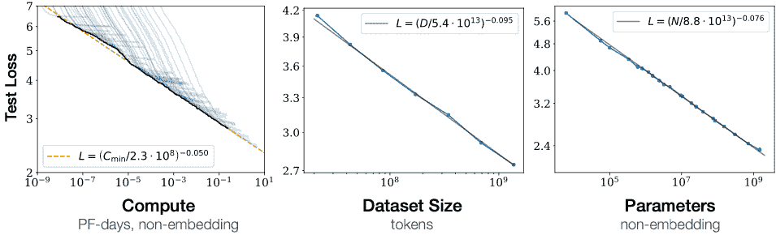
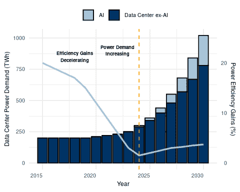
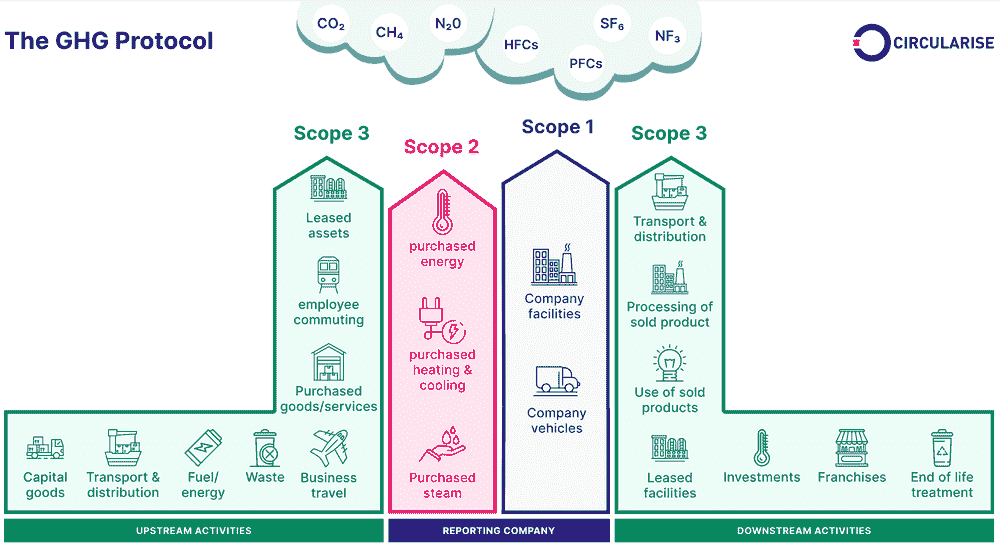
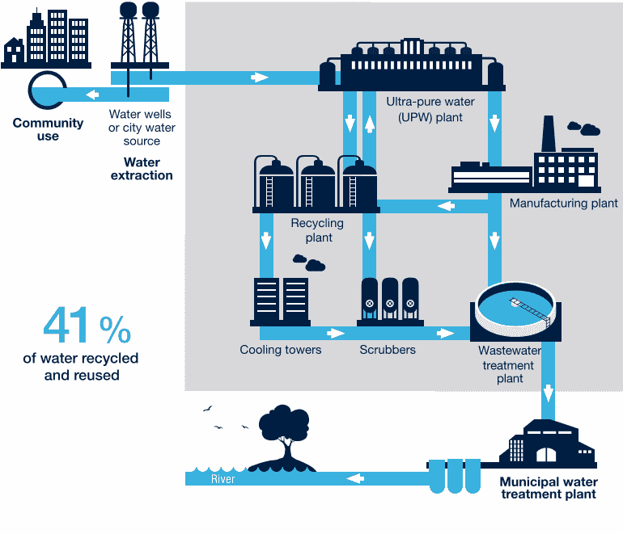
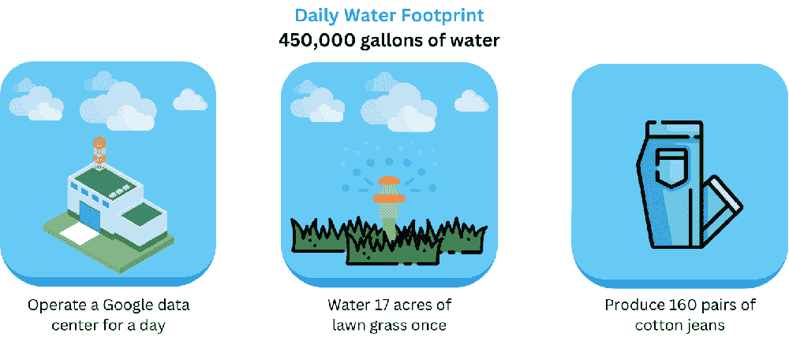
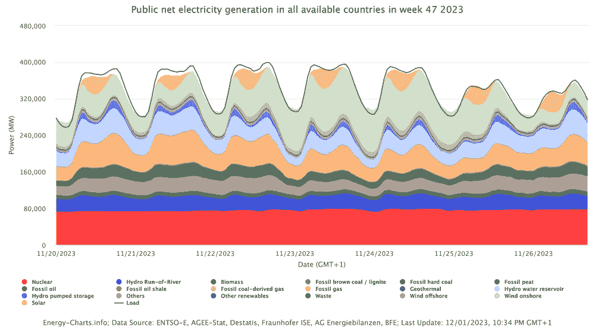

# 可持续 AI

*DALL·E 3 Prompt: 在浅色背景上绘制一个可持续的 AI 网络 3D 插图，该网络与众多环保能源源相连。AI 主动管理和优化其从太阳能阵列、风力涡轮机和水电大坝等来源获取的能量，强调电力效率和性能。深度神经网络遍布其中，从这些可持续资源中获取能量。*


## 目的

*为什么资源效率代表一个核心工程约束，它决定了机器学习系统的可行性和可扩展性，而不仅仅是环境考虑？*

机器学习系统消耗的计算资源规模挑战了实际部署限制和经济可行性。这些资源需求施加了严格的工程约束：能源成本超过模型开发预算，热限制限制了硬件密度，以及电力基础设施需求限制了部署位置。资源效率直接决定了系统可行性、运营成本和竞争优势，使可持续性成为一个关键的工程学科。理解资源优化技术使工程师能够设计在实用功率、热和经济限制内运行，同时实现性能目标。随着计算需求的指数级增长，资源效率成为决定哪些 AI 应用可以从研究原型扩展到为全球数十亿用户提供服务的部署系统的首要约束。

**学习目标**

+   通过能源消耗、碳足迹和资源利用指标量化 AI 系统环境影响

+   应用测量框架来评估训练和部署架构中的可持续性权衡

+   评估优化硬件、算法和基础设施能源效率的工程策略

+   计算机器学习系统生命周期各阶段（包括训练、部署和推理）的碳足迹

+   评估可再生能源集成策略和 ML 基础设施的碳抵消方法

+   设计在功率、热和资源限制内运行的可持续 AI 系统

+   分析生物智能原理，以指导节能 AI 架构开发

+   实施碳感知计算策略，以实现负责任的 AI 系统部署

## 可持续 AI 作为工程学科

大规模机器学习系统的普及引发了环境可持续性危机，这直接挑战了该领域的轨迹。本章扩展了第十七章（ch023.xhtml#sec-responsible-ai）中探讨的负责任 AI 原则，处理了计算需求与环境监护之间的关键交汇点。可持续性成为核心系统工程学科，而不仅仅是辅助考虑因素。

当代机器学习应用以前所未有的规模运行，其环境影响现在与成熟的重工业相当。训练（第八章）一个最先进的 AI 模型可能消耗的电力相当于 100 个美国家庭在整整一年中的用电量，其碳足迹相当于数百次往返于纽约和旧金山的飞行。随着人工智能的普及，其环境成本正成为 21 世纪最重大、最隐蔽的挑战之一。

现代人工智能系统的计算强度体现在能源消耗模式上，这种模式对全球基础设施造成了压力：训练大型语言模型所需的能源相当于为数千个住宅单元供电很长时间，而部署应用中的推理工作量（第十三章）推动了数据中心容量和相关资源需求的指数级增长。

这种环境现实已经将可持续性从可选的设计考虑转变为核心工程约束，决定了将人工智能系统从研究原型过渡到生产部署的可行性。能源成本、热约束和电力基础设施要求带来的经济和物理限制，形成了日益制约系统设计决策的瓶颈。计算需求的指数级增长轨迹远远超过了底层硬件的效率改进，这形成了我们所说的人工智能领域的可持续性悖论。

然而，这些约束也提供了将第九章（ch015.xhtml#sec-efficient-ai）和第十章（ch016.xhtml#sec-model-optimizations）中确立的系统工程原则扩展到全面环境责任的机会。能够实现性能优化的方法可以系统地应用于能源效率目标。增强推理吞吐量的硬件加速技术可以同时减少碳足迹。支持可扩展性的分布式计算架构可以实现跨可再生能源基础设施的碳感知调度。

**可持续人工智能**是提升环境影响为机器学习系统开发中传统性能和成本目标并列的**一级设计约束**的工程学科。

本章探讨了可持续人工智能作为一个新兴的跨学科领域，它将环境考量融入机器学习系统工程的每个阶段。该学科包括将计算需求转化为碳排放、评估硬件生命周期对资源消耗的贡献，以及评估影响系统性能和环境可持续性的基础设施选择。这里提出的测量、建模和缓解框架代表了与传统的性能优化技术并行的基本工程能力。

本章的范围涵盖了在完整的机器学习系统设计范围内系统性地整合环境考量，从算法效率优化（第九章）到硬件架构选择（第十一章），从数据中心基础设施决策到规范负责部署的政策框架。这种方法将可持续人工智能确立为一个全面的工程框架，用于开发在行星资源边界内运行并保持人工智能技术变革潜力的系统。

## 人工智能的可持续性危机

人工智能系统已经改变了各个行业的科技能力，但这种变革伴随着环境成本，这些成本威胁到这些进步的长期可行性。人工智能的计算需求创造了可持续性挑战，这些挑战不仅包括能源消耗，还包括碳排放、资源提取、制造影响和电子废物，其规模威胁到长期的技术可行性。

这种可持续性危机体现在三个相互关联的维度。首先，问题识别考察了人工智能的环境影响范围和紧迫性，包括伦理责任和长期可行性担忧。其次，测量和评估提供了量化碳足迹、能源消耗和生命周期影响的框架，包括训练阶段（第八章）和推理阶段（第十三章）。最后，实施和解决方案提出了通过可持续发展实践、基础设施优化和政策框架来缓解的具体策略，这些框架能够实现实际的环境责任。

### 环境影响规模

人工智能系统消耗的资源规模与传统的重工业相媲美。训练一个大型语言模型需要数千兆瓦时的电力，相当于数百个家庭数月的使用量 1。预计到 2030 年，数据中心（包括人工智能工作负载）将占全球电力消耗的 8%，超过航空业（2.1%）并接近水泥生产（4%）（OECD 2023)2。计算需求增长速度比硬件效率提高速度快 350,000 倍，形成了一种不可持续指数增长模式。

除了直接能源消耗外，人工智能系统通过硬件制造和资源利用推动环境影响。训练和推理工作负载依赖于需要稀土金属的专用处理器，其提取和处理过程会产生污染 3。人工智能应用需求的增长加速了电子垃圾的产生，全球电子垃圾年产量达到 5400 万吨（Forti 等人，2020 年 Forti et al. 2020），由于性能要求的加速，人工智能硬件迅速过时 4。

这些环境挑战需要系统性的理解以及技术、政策和伦理维度上的协调响应，以确保人工智能的发展保持可行性和责任感。

## 第一部分：环境影响与伦理基础

人工智能的环境影响规模引发了关于发展优先事项和责任的关键问题。在考察测量和缓解策略之前，我们必须了解指导可持续人工智能发展的伦理框架。技术进步与环境保护的交汇产生了关于谁从人工智能进步中受益以及谁承担其生态成本的紧迫决策。

人工智能的环境影响不仅限于技术指标，还涉及公平、正义和长期可持续性问题，这些问题定义了应对这些挑战的紧迫性。

能源消耗和硬件制造的技术现实直接转化为关于环境正义的伦理关切。当训练（第八章）单个语言模型消耗的电力相当于数千个家庭年使用量时，这引发了关于谁从人工智能进步中受益以及谁承担其环境成本的严重问题。随着计算需求的指数增长和资源消耗的加剧，该领域必须面对关于可持续性发展路径的艰难选择，以平衡创新与环境保护责任。

### 环境正义与负责任的发展

人工智能的环境影响产生了超越技术优化的道德责任。环境可持续性成为可信赖人工智能系统的关键组成部分，扩展了第十七章中涵盖的责任人工智能原则。人工智能开发所需的计算资源将环境成本集中在特定的社区，同时在全球人口中不平等地分配了效益。数据中心每年消耗 1-3%的全球电力和 200 亿加仑的水用于冷却，通常在能源网络依赖化石燃料且水资源面临气候变化压力的地区。

这种环境负担的地域集中性引发了环境正义问题 5，这些问题与更广泛的责任人工智能框架相一致。正如公平性考虑需要审视谁从人工智能系统中受益以及谁承担其风险一样，环境责任要求理解谁承担了人工智能进步的生态成本。承载人工智能基础设施的社区承担了不成比例的环境负担，同时却难以获得人工智能的经济效益，这体现了将道德人工智能框架扩展到超越算法公平，以涵盖环境管理的必要性。

### 指数增长与物理限制

计算需求的指数增长对人工智能训练和部署的长期可持续性构成了挑战。在过去十年中，人工智能系统以史无前例的速度扩展，计算需求从 2012 年到 2019 年增长了 350,000 倍(Schwartz 等人 2020)6。随着机器学习系统优先考虑具有更多参数的更大模型、更大的训练数据集和更高的计算复杂性，这一趋势仍在继续。维持这一轨迹提出了可持续性挑战，因为硬件效率的收益无法跟上不断上升的人工智能工作负载需求。

从历史上看，随着半导体技术的进步，计算效率得到了提高。摩尔定律 7，即预测芯片上晶体管数量每两年大约翻一番，导致了处理能力和能源效率的持续改进。然而，摩尔定律现在正达到核心物理极限，使得进一步晶体管规模扩大变得困难和昂贵。邓纳德规模 8，曾经确保较小的晶体管在较低功率水平下运行，也已经结束，导致每晶体管的能源效率改进停滞。

虽然人工智能模型在规模和能力上持续增长，但运行这些模型的硬件不再以相同的指数速度提升。计算需求与硬件效率之间的这种日益扩大的差距，创造了一个不可持续的轨迹，其中人工智能消耗着越来越多的能源。这一技术现实强调了为什么可持续的人工智能发展需要在整个系统堆栈中进行协调行动，从个别算法选择到基础设施设计和政策框架。

复杂的人工智能系统，如大型深度学习模型，需要高水平的计算能力，这导致了显著的能源消耗。OpenAI 的 GPT-3 就是这一规模的例证：训练需要 1,287 兆瓦时（MWh）的电力，相当于为 130 个美国家庭供电整整一年(Maslej 等人 2023)9。这种能源消耗代表了在大数据集上训练的计算算法 10，这些算法是现代大型语言模型的特点。

这种规模的能源消耗突显了在人工智能系统中提高效率的迫切需求。近年来，这些生成式人工智能模型越来越受欢迎，导致更多模型以增长参数数量进行训练。

研究表明，增加模型大小、数据集大小和用于训练的计算能力，性能会平稳提升，没有出现饱和的迹象(Kaplan 等人 2020)，正如图 18.1 所示，随着这三个因素中的每一个增加，测试损失都会降低。除了训练之外，人工智能驱动的应用，如大规模推荐系统和生成模型，需要持续的大规模推理，即使在训练完成后也会消耗能源。随着人工智能在从金融到医疗保健再到娱乐等行业的采用率不断增长，人工智能工作负载的总能源负担持续上升，引发了关于广泛部署对环境影响的担忧。



图 18.1：**模型规模定律**：增加模型大小、数据集大小和计算能力，持续降低测试损失，表明通过更大的资源投入，性能提升仍然可行，且没有出现饱和的迹象。这些规模定律表明，在更多数据上使用增加的计算能力训练的更大模型可能会带来进一步的性能提升，从而推动对这些领域的持续投资。来源：(Kaplan 等人 2020)。

除了电力消耗之外，AI 的可持续性挑战还扩展到硬件资源需求和当前架构的能量效率限制。不同的处理器类型通过它们的能量特性影响环境影响，如第十一章所述：中央处理器（CPUs）在每次乘加操作中消耗大约 100 皮焦耳（pJ/MAC），图形处理器（GPUs）达到 10 pJ/MAC，而专门的张量处理单元（TPUs）达到 1 pJ/MAC11，专门的加速器接近 0.1 pJ/MAC。这些硬件平台需要稀土金属和复杂的制造工艺，这些工艺具有固有的碳足迹。

人工智能芯片的生产是能源密集型的，涉及多个制造步骤，这些步骤对整个 AI 系统生命周期中的范围 3 排放做出了重大贡献。随着模型规模的持续增长，对 AI 硬件的需求增加，加剧了半导体生产和处置的环境影响。

### 生物智能作为可持续性模型

要理解人工智能能源挑战的规模，将当前系统与我们所知的最高效的智能——人脑——进行比较是有帮助的。大脑在仅消耗约 20 瓦功率的情况下执行复杂的推理、学习和模式识别。这种非凡的效率为可持续人工智能设计提供了宝贵的工程见解。大脑的能量效率估计约为每突触操作 10⁻¹⁵到 10⁻¹⁴焦耳，尽管在生物和数字系统之间定义等效的“操作”仍然具有挑战性 12。

训练单个大型语言模型如 GPT-3，在人工和生物智能之间产生了 10⁶倍的能源效率差距。这种比较说明了核心的可持续性挑战：虽然人脑在灯泡的功耗下实现了卓越的学习能力，但当前的 AI 系统需要工业规模的能源基础设施来实现可比的认知任务。

大脑通过几个关键原则实现了这种效率，这些原则与当前的 AI 系统不同。生物系统不是像数字计算机那样连续处理所有信息，而是具有选择性和事件驱动的。它们在任何时候只激活网络的一小部分，并且只在积极处理信息时消耗能量 13。这些设计原则为创建更节能的 AI 架构提供了机会。

生物效率优势不仅超越了能源消耗，还扩展到学习样本效率。儿童在 18 岁之前通过接触大约 10⁸ 个单词来获得语言能力，而大型语言模型需要训练 10¹²+个标记，数据效率相差 10,000 倍。这种差异表明，当前的 AI 架构与生物系统展示的效率学习原则不符。

这些见解指向了可持续人工智能的有希望的研究方向。通过模拟生物稀疏激活模式(Prakash, Stewart, et al. 2023)，实现脉冲神经网络 14 架构的类神经形态计算可以针对特定任务实现 100-1000×的能量降低。同样，受生物发展启发的本地学习算法和自监督学习方法，为更高效的样本和节能的人工智能系统提供了途径。理解这些生物原理为开发接近生物能量效率的同时保持或提高性能的人工智能系统提供了路线图。

这些生物见解表明，实现可持续人工智能需要系统性地转变系统设计，从持续活跃的架构转向事件驱动、稀疏计算模型。随着计算需求超过效率改进，解决人工智能的环境影响需要重新思考系统架构、节能计算和基于生物原理的生命周期管理，而不是增量优化。

指数级计算需求与物理效率限制的汇聚创造了一个不可持续的发展轨迹，这威胁到人工智能发展的长期可行性。理解这些限制为开发能够系统性地解决可持续性危机的测量框架和实施策略提供了基础。

* * *

## 第二部分：测量与评估

系统性测量方法使工程师能够做出关于人工智能环境影响的技术决策。可持续人工智能的发展需要三个关键领域的量化框架：训练和推理过程中的能耗跟踪、系统生命周期内的碳足迹分析以及硬件和基础设施的资源利用评估。这些测量工具将可持续性从抽象的关注点转化为具体的工程约束，从而指导架构选择、部署策略和优化优先级。

有效的测量使工程师能够识别优化机会、比较替代设计并验证可持续性改进。如果没有对环境成本来源和设计选择如何影响整体足迹的系统评估，可持续性努力将保持临时性和可能适得其反。

### 碳足迹分析

碳足迹分析为做出关于人工智能系统可持续性的明智设计决策提供了基础。随着人工智能系统持续扩展，对能耗和资源需求的系统性测量使主动的环境优化方法成为可能。构建和部署人工智能系统的开发人员和公司必须考虑的不仅是性能和效率，还有他们设计选择的环境后果。

伦理挑战在于平衡技术进步与生态责任。追求越来越大的模型往往优先考虑准确性和能力，而不是能源效率，导致碳排放呈指数增长。虽然优化可持续性可能会引入权衡，例如通过修剪和量化等技术，可能导致开发周期延长 10-30%或准确性降低 1-5%，但这些成本与环保效益相比微不足道。将环境考虑纳入 AI 系统设计是一个伦理上的必要要求。这需要将行业规范转向可持续计算实践，例如能源感知训练技术、低功耗硬件设计和碳意识部署策略(D. Patterson et al. 2021a)。

这一伦理要求不仅超越了可持续性，还涵盖了与透明度、公平性和问责制相关的更广泛问题。图 18.2 展示了与 AI 开发相关的伦理挑战，将不可理解的证据、不公平的结果和可追溯性等问题与不透明、偏见和自动化偏见等问题联系起来。这些担忧扩展到可持续性，因为 AI 开发的环保权衡往往不透明且难以量化。能源消耗和碳排放的可追溯性缺乏可能导致不合理的行动，即公司优先考虑性能提升，而不完全理解或披露环境成本。


图 18.2：**伦理 AI 问题**：AI 系统在透明度、公平性和可持续性方面引入了伦理挑战；这些担忧相互关联，并源于不透明、偏见和资源消耗中缺乏可追溯性等问题。解决这些挑战需要积极的设计选择，优先考虑问责制并最小化对社会和环境的负面影响。来源：(Munn 2022)。

解决这些担忧需要 AI 公司有更高的透明度和问责制。大型科技公司运营着广泛的云基础设施，为现代 AI 应用提供动力，但它们的环境影响仍然不透明。组织必须在整个 AI 生命周期中衡量、报告并减少其碳足迹，从硬件制造到模型训练和推理。自愿自我监管是一个初步步骤，但政策干预和行业标准的制定可能是必要的，以确保长期可持续性。报告的指标，如能源消耗、碳排放和效率基准，可以确保组织问责。

伦理 AI 的发展需要就环境权衡进行公开讨论。研究人员必须在他们的机构和组织中倡导可持续性，确保环境问题被纳入 AI 发展的优先事项。更广泛的 AI 社区已经开始解决这些问题，正如[呼吁暂停大规模 AI 实验的公开信](https://futureoflife.org/open-letter/pause-giant-ai-experiments/)所展示的那样，该信件突出了对无序扩张的担忧。培养透明度和道德责任的文化，使 AI 行业能够将技术进步与生态可持续性相一致。

AI 有潜力重塑行业和社会，但其长期可行性取决于负责任的发展实践。伦理 AI 的发展涉及防止对个人和社区造成伤害，同时确保由 AI 驱动的创新不会以环境退化为代价。作为这些技术的守护者，开发者和组织必须将可持续性整合到 AI 的未来轨迹中。

将这些伦理原则转化为实践需要具体的工程解决方案，这些解决方案能够展示可衡量的环境改善。以下案例研究说明了如何设计 AI 系统以优化它们自身的环境影响，展示了可持续 AI 原则的实用实施。

### 案例研究：DeepMind 能源效率

谷歌的数据中心是搜索、Gmail 和 YouTube 等服务的基础，每天处理数十亿个查询。这些设施需要大量的电力消耗，尤其是确保服务器性能优化的冷却基础设施。提高数据中心的能源效率长期以来一直是优先事项，但由于冷却系统的复杂性和高度动态的环境条件，传统的工程方法面临着收益递减。为了应对这些挑战，谷歌与 DeepMind 合作开发了一个机器学习优化系统，该系统能够自动化并增强大规模的能源管理。

经过十多年的努力优化数据中心设计、节能硬件和可再生能源集成，DeepMind 的 AI 方法针对数据中心中最能耗密集的部分——冷却系统。传统的冷却系统依赖于手动设置的启发式规则，这些规则考虑了服务器的热量输出、外部天气条件和建筑限制。这些系统表现出非线性相互作用，因此简单的基于规则的优化往往无法捕捉到它们操作的完整复杂性。结果是冷却效率不佳，导致不必要的能源浪费。

DeepMind 团队使用谷歌的历史传感器数据训练了一个神经网络模型，这些数据包括实时温度读数、功耗水平、冷却泵活动和其他操作参数。该模型学会了这些因素之间的复杂关系，并能动态预测最有效的冷却配置。与依赖于人类工程师定期调整系统设置的传统方法不同，AI 模型能够实时适应不断变化的环境和工作负载条件。

结果显示效率显著提升。当在实时数据中心环境中部署时，DeepMind 的 AI 驱动冷却系统将冷却能耗降低了 40%，从而使得整体电力使用效率（PUE）提高了 15%16，这是衡量数据中心能源效率的指标，它衡量的是总能耗与仅用于计算任务的能耗之比（Barroso, Hölzle, and Ranganathan 2019）。这些改进是在没有额外硬件修改的情况下实现的，展示了软件驱动优化减少 AI 碳足迹的潜力。

不仅仅局限于单个数据中心，DeepMind 的 AI 模型提供了一个可推广的框架，适用于不同的设施设计和气候条件，为全球数据中心网络中的功耗优化提供了一个可扩展的解决方案。本案例研究例证了 AI 不仅作为计算资源的消费者，而且作为可持续性的工具，推动支持机器学习的基础设施效率改进。

数据驱动决策、实时适应和可扩展 AI 模型的集成展示了智能资源管理在可持续 AI 系统设计中的日益增长的作用。这一突破例证了机器学习如何优化其背后的基础设施，确保更高效的规模化 AI 部署。

碳足迹分析必须考察生命周期两个阶段和排放范围。下文详细介绍的三个阶段生命周期评估框架提供了理解环境成本起源和设计选择如何影响整体足迹的系统方法。

#### 三个阶段生命周期评估框架

有效碳足迹测量需要系统分析三个不同的阶段，这三个阶段共同决定了环境影响：

训练阶段（60-80%的排放）代表了最碳密集的时期，涉及并行计算进行数学优化过程 17。正如 GPT-3 案例研究所示，大型语言模型训练运行体现了这种能源强度。地理位置影响排放：在魁北克（水力发电，0.01 kg CO₂/kWh）与西弗吉尼亚（煤炭发电，0.75 kg CO₂/kWh）之间的碳强度相差 75 倍 18。

推理阶段（排放量的 15-25%）为模型服务和预测生成产生持续的计算成本。虽然单个推理所需的计算量少于训练，但累积影响会随着部署范围和频率的增加而扩大。为百万用户服务的模型会产生持续的排放，在长期部署期间可能超过训练成本。

制造阶段（排放量的 5-15%）从硬件生产中贡献了固碳 19，包括半导体制造、稀土开采和供应链物流。通常被忽视但代表独立于运营效率的不可减少的基线排放。

#### 地理和时间优化

碳强度在不同地理位置和时间段中有所不同，创造了优化机会。通过将计算工作负载与可再生能源的可用性对齐，如白天的高峰太阳能发电，时间调度可以减少 50-80%的排放（D. Patterson, Gonzalez, Le, 等人 2022）。碳感知调度系统可以自动将非紧急的训练任务转移到碳强度较低的区域和时间。

这些地理和时间考虑因素突出了量化人工智能碳影响的复杂性。评估取决于多个因素，包括模型的大小、训练的持续时间、使用的硬件以及为数据中心供电的能源。正如我们的 GPT-3 分析所示，大规模人工智能模型需要数千兆瓦时（MWh）的电力，相当于整个社区的能源消耗。推理阶段所需的能量，即训练好的模型产生输出的阶段，对于广泛部署的人工智能服务（如实时翻译、图像生成和个性化推荐）来说也很大。与相对静态的能源足迹的传统软件不同，人工智能模型持续消耗能量，导致持续的可持续性挑战。

除了直接能源使用之外，人工智能的碳足迹还必须考虑硬件生产和供应链的间接排放。制造人工智能加速器（如 GPU、TPU 和定制芯片）涉及能源密集型的制造过程，这些过程依赖于稀土金属和复杂的供应链。人工智能系统的完整生命周期排放，包括数据中心、硬件制造和全球人工智能部署，必须考虑以开发更可持续的人工智能实践。

理解人工智能的碳足迹需要整合上述建立的测量框架：

+   **三个阶段的生命周期分析**：训练（60-80%），推理（15-25%），和制造（5-15%）排放

+   **三种排放类别范围**：直接运营、购买的能源和供应链影响

+   **地理和时间优化**：利用可再生能源可用性和碳感知调度

分析这些组件有助于更好地评估人工智能系统的真实环境影响，并识别通过更高效的设计、节能部署和可持续基础设施选择来减少其足迹的机会。

在开发期间测量碳足迹需要将跟踪工具集成到机器学习工作流程中，如 列表 18.1 所示。

列表 18.1：**碳足迹追踪**：使用 CodeCarbon 库在模型训练期间测量排放的示例实现，使数据驱动的可持续性决策成为可能。

```py
from codecarbon import EmissionsTracker
import torch

# Initialize carbon tracking
tracker = EmissionsTracker()
tracker.start()

# Your model training code
model = torch.nn.Linear(100, 10)
optimizer = torch.optim.Adam(model.parameters())

for epoch in range(100):
    # Training step
    loss = model(data).mean()
    loss.backward()
    optimizer.step()

# Get emissions report
emissions = tracker.stop()
print(f"Training emissions: {emissions:.4f} kg CO2")
```

这种集成使得工程师在开发过程中能够就模型复杂性与环境影响之间做出明智的决策。

### 数据中心能源消耗模式

人工智能系统代表了最能耗密集的计算工作负载之一，涉及密集操作 20，其消费模式涵盖了训练、推理、数据存储和通信基础设施。理解这些模式可以揭示优化努力可以减少环境影响的地方。能源消耗与模型复杂度非线性相关，通过有针对性的架构和运营优化创造了效率改进的机会。

#### 数据中心能源与人工智能工作负载

数据中心是人工智能系统的首要能源消费者，其电力需求揭示了挑战的规模和具体的优化机会。

数据中心的能源效率在设施之间差异很大：功率使用效率（PUE）在谷歌最有效率的设施中为 1.1，而在典型的企业数据中心中为 2.5，通过基础设施开销实际上加倍了能源消耗。地理位置影响碳强度：在魁北克（水力发电）与西弗吉尼亚（煤炭发电）训练相同的模型，每千瓦时的碳排放差异为 10 倍。没有可再生能源的接入，这些设施严重依赖非可再生能源，如煤炭和天然气，这导致全球碳排放。目前的估计表明，数据中心产生高达 2% 的总全球 CO₂ 排放，这个数字接近航空业的足迹 (Y. Liu 等人 2020)21。由于三个因素：数据中心容量的增加、人工智能训练工作负载的上升和推理需求的增加，预计人工智能的能源负担将呈指数增长 (D. Patterson, Gonzalez, Holzle 等人 2022)。如果不采取干预措施，这些趋势可能会使人工智能的环境足迹变得不可持续 (Thompson, Spanuth, 和 Matthews 2023)。

#### 数据中心能源需求

人工智能工作负载是现代数据中心中最计算密集型的操作之一。例如，Meta 公司运营着跨越多个足球场大小的超大规模数据中心，拥有数十万台经过人工智能优化的服务器 22。大型语言模型（LLMs）如 GPT-4 的训练（第八章）需要超过 25,000 个 Nvidia A100 GPU 连续运行 90 到 100 天(S. Choi 和 Yoon 2024)，消耗数千兆瓦时（MWh）的电力。这些设施依赖于高性能人工智能加速器，如 NVIDIA DGX H100 单元，每个单元在峰值功率时可以消耗高达 10.2 kW(Choquette 2023b)。当比较硬件代际时，能源效率差距变得明显：H100 GPU 在人工智能训练工作负载中实现了大约 2.5-3 倍每瓦的性能提升，而混合精度训练可以通过降低计算精度来减少能源消耗，同时最小化精度影响，具体取决于模型架构和硬件，可降低 15-30%(Gholami 等人 2021)。

这种显著能耗反映了人工智能在各个行业的快速应用。如图图 18.3 所示，人工智能工作负载的能源需求预计将增加数据中心的总能源使用，尤其是在 2024 年之后。虽然效率提升抵消了不断增长的电力需求，但这些提升正在放缓，放大了人工智能的环境影响。



图 18.3：**预测需求**：到 2030 年，人工智能工作负载将显著增加数据中心的电力需求，超过之前的效率提升。这强调了人工智能系统日益增长的环境影响。来源：(Masanet 等人 2020a)，思科，国际能源署，高盛全球投资研究。

除了计算需求之外，冷却也是人工智能能源足迹中的另一个主要因素。大规模人工智能训练和推理工作负载产生大量热量，需要先进的冷却解决方案来防止硬件故障。公司已经开始采用替代冷却方法来减少这种需求。例如，微软的爱尔兰数据中心使用附近的峡湾，每天消耗超过五十万加仑的海水来散热。然而，随着人工智能模型复杂性的增加，冷却需求持续增长，这使得可持续人工智能基础设施设计成为一个紧迫的挑战。

### 分布式系统能源优化

大规模人工智能训练本质上需要分布式系统协调，这会创造额外的能量开销，从而增加了计算需求。分布式训练 23 引入了网络通信成本，这在大集群中可能占总体能耗的 20-40%。在数千个 GPU 上进行的分布式训练需要不断同步计算更新和模型参数 24，在节点之间产生数据移动。这种通信开销扩展得不好：集群规模加倍可能导致网络能耗增加 4 倍，这是由于梯度聚合中的全对全通信模式。

解决这些通信开销，集群范围内的能量优化需要协调的资源管理，这超出了单个服务器效率的范围。动态工作负载放置可以在低需求期间将训练作业合并到更少的节点上，从而实现 15-25%的能量节省。类似地，协调多个数据中心之间的训练的智能调度可以利用时区差异和区域可再生能源的可用性，通过时间负载平衡减少 30-50%的碳强度。

基础设施共享在可持续性分析中往往被忽视，它提供了效率机会。多租户训练环境，其中多个模型训练作业共享同一个集群，可以将 GPU 利用率从典型的 40-60%提高到 80-90%，从而将每训练一个模型的能耗有效减半。资源共享还使批处理优化成为可能，其中多个较小的训练作业合并以更好地利用可用的计算能力，减少维护空闲基础设施的能量开销。

#### 人工智能能耗与其他行业比较

人工智能工作负载的环境影响已成为一个关注点，碳排放量接近于已建立的碳密集型行业水平。研究表明，训练单个大型人工智能模型产生的碳排放量相当于多辆乘用车在其整个生命周期内的排放量（Strubell, Ganesh, 和 McCallum 2019a）。为了说明人工智能的环境足迹，图 18.4 将大规模机器学习任务的碳排放量与洲际航班进行了比较，说明了训练和推理工作负载的能量需求。它展示了从最低到最高的碳足迹的比较，从纽约和旧金山之间的往返航班开始，平均每人每年的人生活动，平均每人每年的美国生活活动，美国汽车包括终身燃料，以及具有神经架构搜索 25 的 Transformer 模型，其碳足迹最高。这些比较强调了需要更多可持续的人工智能实践来减轻行业的碳影响。


图 18.4：**碳足迹基准**：训练大型人工智能模型产生的碳排放量与日常活动和长途旅行相当，强调了日益复杂的机器学习工作负载的环境影响。将往返航班、平均人类寿命和车辆使用寿命进行比较，突出了训练具有神经架构搜索的转换器模型所需的能源需求之高。来源：Strubell, Ganesh, 和 McCallum (2019a)。

大型自然语言处理模型的训练阶段产生的二氧化碳排放量相当于数百次洲际航班。当考察更广泛的行业影响时，人工智能的总计算碳足迹正接近商业航空部门。随着人工智能应用扩展到为全球数十亿用户提供服务，持续推理操作的累积排放量最终可能超过训练期间产生的排放量。

图 18.5 提供了 Meta 在各个大规模机器学习任务中的碳排放的详细分析，说明了不同人工智能应用和架构的环境影响。这种对人工智能碳足迹的定量评估强调了开发更可持续的机器学习开发和应用方法的迫切需要。了解这些环境成本对于实施有效的缓解策略和负责任地推进该领域至关重要。


图 18.5：大规模机器学习任务的碳足迹。来源：(C.-J. Wu 等人 2022)。

### 长期碳足迹分析

人工智能的影响不仅限于运行过程中的能耗。人工智能的全生命周期排放包括硬件制造、供应链排放和报废处置，使人工智能成为环境退化的主要贡献者。人工智能模型需要电力进行训练和推理，并且它们还依赖于复杂的半导体制造、稀土金属开采和电子废物处理的设施。下一节将人工智能的碳排放分解为范围 1（直接排放）、范围 2（电力间接排放）和范围 3（供应链和生命周期排放），以提供其环境影响的更详细视图。

### 综合碳核算方法

综合碳足迹评估将三阶段生命周期分析（训练、推理、制造）与三个标准排放范围（直接运营、购买的能源、供应链影响）相结合。预计到 2030 年，人工智能的年增长率将达到 37.3%，到 2030 年，运营计算能源需求可能增加 1000 倍。这种指数级增长需要了解所有阶段和范围的总体生命周期成本，以确定最具影响力的可持续干预措施。

范围 1 排放（占总量的 5-15%）源自现场发电，包括备用柴油发电机、设施冷却系统和自有发电厂。虽然许多 AI 数据中心主要使用电网电力，但那些拥有化石燃料备用系统或自有发电厂的直接导致排放。

范围 2 排放（占总量的 60-75%）代表为供电 AI 基础设施购买的电力的间接排放。这个主导的运营排放类别因地理位置和电网能源组合而大相径庭。在魁北克（水力发电）与西弗吉尼亚（煤炭发电）训练相同的模型，碳强度相差 75 倍。

范围 3 排放（占总量的 15-25%）构成了最复杂的类别，包括硬件制造、运输和处置。半导体制造 26 是碳密集型的：生产单个高性能 AI 加速器产生的排放相当于几年运营能源的使用。通常被忽视但代表的是不可减少的基准排放，与运营效率无关。

除此之外，范围 3 排放还包括 AI 一旦部署后的下游影响。搜索引擎、社交媒体平台和基于云的推荐系统等 AI 服务以巨大规模运行，需要跨数百万甚至数十亿用户交互进行持续推理。推理工作负载的累积电力需求最终可能超过训练所使用的能源，进一步放大 AI 的碳影响。包括智能手机、物联网设备和边缘计算 27 平台在内的终端设备，也贡献了范围 3 排放，因为它们的 AI 允许的功能依赖于持续的运算。Meta 和 Google 等公司报告称，AI 服务产生的范围 3 排放占其总环境足迹的最大份额，这是由于 AI 运行的规模巨大。

**软件开发隐藏的碳成本**

除了直接训练和推理的能源使用之外，AI 的整个软件开发生态系统都有显著的、但难以衡量的碳足迹。数百万的持续集成和持续部署（CI/CD）管道运行、开发过程中的持续代码重新编译、GitHub 等大型版本控制系统的运行，以及代码审查系统、自动化测试框架和协作开发平台消耗的计算资源，都导致了环境影响。大型 AI 研究组织可能运行数千次实验性训练运行，其中大部分从未达到生产阶段，在探索过程中消耗了大量能源。这强化了整个 AI 开发生态系统都是能源密集型的，而不仅仅是最终的模型训练和推理阶段。

这些大型设施为在庞大的数据集上训练复杂的神经网络提供了基础设施。例如，根据行业分析（S. Choi 和 Yoon 2024），OpenAI 的语言模型 GPT-4 在 Azure 数据中心进行训练，该数据中心配备了超过 25,000 个 Nvidia A100 GPU，连续使用超过 90 到 100 天。

GHG 协议框架（可持续发展研究所和 2023 年），如图 18.6 所示，提供了一种结构化的方法来可视化与 AI 相关的碳排放来源。该框架将排放分为三个不同的范围，帮助组织了解其环境影响的全部范围：

+   **范围 1（直接排放）**：这些来自公司的直接运营，例如数据中心的后备发电机和公司拥有的发电基础设施。想象一下，在停电期间，数据中心后面柴油发电机嗡嗡作响的情景。

+   **范围 2（间接能源排放）**：这些包括从电网购买的电力，代表云计算工作负载的主要排放源。这是某个发电厂供电，为照亮数千个训练你模型的 GPU 提供电力。

+   **范围 3（价值链排放）**：这些超出了组织的直接控制范围，涵盖了从遥远制造设施中的半导体制造，到运输硬件穿越海洋的货轮，再到最终在电子废物设施中处置 AI 加速器的整个生命周期。

了解这种分解有助于制定更有针对性的可持续发展战略，确保减少 AI 环境影响的努力不仅关注能源效率，而且解决更广泛的供应链和生命周期排放，这些排放对行业的碳足迹贡献很大。



图 18.6：**温室气体排放范围**：组织将碳排放分为范围 1（直接）、范围 2（购买的能源）和范围 3（价值链），以全面评估其环境影响，并确定针对 AI 系统的针对性减排策略。来源：Ucircularise。

### 训练与推理能耗分析

准确的环境影响评估需要了解训练和推理阶段独特的能源消耗模式。训练代表了一次性、密集的计算投资，创建了可重复使用的模型能力。推理涉及持续的能量消耗，其规模与部署范围和使用频率成正比。对于广泛部署的 AI 服务，在长期运营期间，累积的推理成本往往超过训练费用。

这种生命周期视角揭示了不同阶段中的优化机会。训练优化侧重于计算效率和硬件利用率，而推理优化强调延迟、吞吐量和边缘部署策略。理解这些权衡使得能够进行有针对性的可持续性干预，以解决特定人工智能应用的能源消耗主要消费者。

#### 训练能源需求

训练最先进的 AI 模型需要巨大的计算资源，需要大量的计算基础设施，包括数以万计的核心和持续数月运行的专用 AI 加速器。OpenAI 为大规模 AI 训练专门构建的超级计算机基础设施包含 285,000 个 CPU 核心、10,000 个 GPU 以及每台服务器超过 400 千兆比特每秒的网络带宽，这说明了 AI 训练基础设施的巨大规模及其相关的能源消耗(D. Patterson 等人 2021a)。

强大的计算负载导致大量的热量散失，需要大量的冷却基础设施，这增加了总的能源需求。训练系统的先进计算架构和硬件优化策略需要 AI 加速技术的专业知识，而训练效率的算法方法涉及复杂的优化方法。

这些能源成本在每个训练模型中只发生一次。主要的可持续性挑战出现在模型部署期间，此时推理工作负载持续为数百或数千万人提供服务。

#### 推理能源成本

推理工作负载在每次人工智能模型响应查询、分类图像或做出预测时都会执行。与训练不同，推理在搜索引擎、推荐系统以及生成式人工智能模型等应用中动态且持续地扩展。尽管与训练相比，每个推理请求消耗的能量要少得多，但来自数十亿日常人工智能交互的累积能源消耗很快就会超过与训练相关的消耗(D. Patterson 等人 2021a)。

例如，AI 驱动的搜索引擎每天处理数十亿个查询，推荐系统持续提供个性化内容，而 ChatGPT 或 DALL-E 等生成式 AI 服务每个查询都有显著的计算成本。由于对内存和计算带宽的高要求，基于 Transformer 的模型推理的能源足迹很高。

如图 18.7 所示，数据中心推理工作负载的市场预计将从 2017 年的 40-50 亿美元增长到 2025 年的 90-100 亿美元，增长超过一倍。同样，边缘推理工作负载预计在同一时期内将从不到 1 亿美元增长到 40-45 亿美元。这种增长速度远超过两个环境中训练工作负载的扩展，突显了推理的经济足迹正在迅速超过训练操作。


图 18.7：**推理-训练市场增长**：推理工作负载市场正在迅速扩张，预计从 2017 年到 2025 年将增长超过一倍，超过了训练的增长，反映了大规模部署 AI 模型需求的增加。这种差异强调了运行 AI 应用程序的操作能源足迹正在成为与模型开发本身相比的主导成本因素。来源：麦肯锡。

与具有固定能源足迹的传统软件应用不同，推理工作负载会根据用户需求动态扩展。像 Alexa、Siri 和 Google Assistant 这样的 AI 服务依赖于持续的云推理，每分钟处理数百万个语音查询，这需要不间断地运行能耗密集型的数据中心基础设施。

#### 边缘 AI 影响

推理并不总是在大型数据中心发生。边缘 AI 正在成为一种可行的替代方案，以减少对云的依赖。不是将每个 AI 请求路由到集中的云服务器，一些 AI 模型可以直接部署在用户设备或边缘计算节点上。这种方法减少了数据传输的能源成本，并降低了依赖高功耗云推理的依赖性。

然而，在边缘进行推理并不能消除能源问题，尤其是在 AI 大规模部署时。例如，自动驾驶汽车需要毫秒级延迟的 AI 推理，这意味着云处理是不切实际的。相反，现在车辆正在配备车载 AI 加速器，这些加速器就像“车轮上的数据中心”（Sudhakar, Sze, and Karaman 2023）。这些嵌入式计算系统处理实时传感器数据，相当于小型数据中心，即使不依赖云推理，也会消耗大量电力。

同样，像智能手机、可穿戴设备和物联网传感器这样的消费设备，单个设备消耗的电力相对较少，但由于数量庞大，它们对全球能源消耗的贡献显著。因此，边缘计算的效率优势必须与设备部署的广泛规模相平衡。

### 资源消耗和生态系统影响

碳足迹分析提供了对人工智能环境影响的关键但并不完整的了解。全面的评估需要测量额外的生态影响，包括水消耗、危险化学物质的使用、稀有材料的提取和生物多样性的破坏，尽管它们具有生态重要性，但通常受到较少的关注。

现代生产人工智能芯片的半导体制造工厂每天需要数百万加仑的水，并在其生产过程中使用超过 250 种危险物质。在台湾、亚利桑那州和新加坡等已经面临水资源压力的地区，这种密集使用威胁到当地生态系统和社区。人工智能硬件也严重依赖像镓、铟、砷和氦这样的稀缺材料，这些材料面临着地缘政治供应风险和枯竭的担忧。

这种全面的 impact assessment 使组织能够识别除能源消耗之外的环境热点，并制定针对性的缓解策略，以解决人工智能系统的完整生态足迹。

### 水资源使用

半导体制造是一个特别耗水的工艺，需要大量的超纯水用于清洗、冷却和化学处理。现代工厂的水消耗规模与整个城市人口相当。例如，台积电在亚利桑那州最新的工厂预计每天将消耗 890 万加仑的水（公司 2023)28，占该城市总水生产的近 3%。这种需求对当地水资源造成了重大压力，尤其是在台湾、亚利桑那州和新加坡等水资源匮乏的地区，半导体制造业集中于此。半导体公司已经认识到这一挑战，并正在积极投资回收技术和更高效的水管理实践。例如，意法半导体公司回收和再利用了大约 41%的水，显著减少了其环境足迹。图 18.8 展示了典型的半导体制造工厂水循环，显示了从原水取水到废水处理和再利用的阶段。



图 18.8：**水回收循环**：半导体制造依赖于广泛的水净化和闭环回收以最小化消耗；此图详细说明了从原水取水到废水处理和再利用的阶段，突出了在制造工厂内实现显著节水潜力的可能性。来源：ST 可持续发展报告。

在半导体制造中，超纯水的主要用途是在各个生产阶段清洗晶圆上的污染物。水还作为热氧化、化学沉积和平面化过程中的冷却剂和载体流体。一个 300mm 的硅晶圆在整个制造过程中需要超过 8,300 升的水，其中超过三分之二为超纯水 (Cope 2009)。

这种大量用水的影響不仅限于消耗。从当地含水层过度抽取水会导致地下水位下降，引发诸如地面沉降和海水入侵等问题。在位于台湾的新竹，世界上最大的半导体中心之一，晶圆厂的大量抽水导致了地下水位下降和海水入侵，影响了农业和饮用水供应。

图 18.9 将数据中心的日常水足迹与其他工业用途进行了对比，说明了高科技基础设施巨大的用水需求。



图 18.9：**数据中心用水量**：高密度计算基础设施，如数据中心，为了冷却消耗了大量的水资源，超过了许多常见的工业和农业应用。了解这些用水需求对于设计可持续的人工智能系统和减轻潜在影响，如水压力区域中的*海水入侵*，非常重要。来源：(Centers 2023)。

虽然一些半导体制造商实施了水回收系统，但这些措施的有效性各不相同。英特尔报告称，其直接用水量的 97%归因于制造过程 (Cooper et al. 2011)，尽管水重复使用正在增加，但水抽取的规模仍然是一个重要的可持续性挑战。

除了耗尽之外，如果管理不当，半导体厂排放的废水会带来污染风险。制造废水含有金属、酸和化学残留物，在排放前必须彻底处理。尽管现代晶圆厂采用先进的净化系统，但提取污染物仍然会产生有害副产品，如果不小心处理，会对当地生态系统造成风险。

由于人工智能加速和计算基础设施扩张推动的半导体制造需求不断增长，水资源管理成为可持续人工智能发展的关键因素。确保半导体生产的长期可行性不仅需要减少直接用水量，还需要提高废水处理能力，并开发减少对淡水来源依赖的替代冷却技术。

### 有害化学品

半导体制造高度依赖高度危险的化学品，这些化学品在蚀刻、掺杂和晶圆清洗等过程中发挥着重要作用。制造人工智能硬件，包括 GPU、TPU 和其他专用加速器，需要使用强酸、挥发性溶剂和有毒气体，如果不妥善管理，这些都可能带来重大的健康和环境风险。工厂中化学物质的使用规模巨大，每年消耗数千吨危险物质（S. Kim 等，2018)29。

在芯片制造中使用的最重要的化学类别中，强酸是其中之一，它们有助于晶圆蚀刻和氧化物去除。氢氟酸、硫酸、硝酸和盐酸在芯片生产的清洗和图案化阶段被广泛使用。虽然这些酸对这些过程有效，但它们具有高度腐蚀性和毒性，如果处理不当，可能导致严重化学烧伤和呼吸道损伤。大型半导体工厂需要专门的容器、过滤和中和系统，以防止意外暴露和环境污染。

溶剂是芯片制造中的另一个重要组成部分，主要用于溶解光刻胶和清洗晶圆。关键溶剂包括二甲苯、甲醇和甲基异丁基甲酮（MIBK），尽管它们具有实用性，但它们会带来空气污染和工人安全风险。这些溶剂是挥发性有机化合物（VOCs），可以蒸发到大气中，导致室内和室外空气污染。如果不妥善处理，VOC 暴露可能导致神经损伤、呼吸道问题以及半导体工厂工人长期的健康影响。

有毒气体是人工智能芯片制造中最危险的物质之一。砷化氢（AsH₃）、磷化氢（PH₃）、二硼烷（B₂H₆）和锗烷（GeH₄）等气体用于掺杂和化学气相沉积过程，这些过程对于微调半导体特性至关重要。这些气体具有高度毒性，甚至在低浓度下也可能致命，需要采取广泛的处理预防措施、气体洗涤器和紧急响应方案。

虽然现代工厂采用严格的安全控制、防护设备和化学处理系统，但事故仍然发生，导致化学泄漏、气体泄漏和污染风险。随着人工智能加速器不断增长的复杂性，有效管理危险化学品的挑战加剧，这些加速器需要更先进的制造技术和新的化学配方。

除了直接的安全担忧之外，有害化学物质使用的长期环境影响仍然是一个重大的可持续性问题。半导体晶圆厂产生大量化学废物，如果处理不当，可能会污染地下水、土壤和当地生态系统。许多国家的法规要求晶圆厂在处置前中和和处理废物，但全球的合规性和执法力度不一，导致环境保护水平不同。

为了减轻这些风险，晶圆厂必须继续推进绿色化学倡议，探索替代蚀刻剂、溶剂和气体配方，在保持制造效率的同时减少毒性。最小化化学废物、提高控制和增强回收努力的过程优化对于减少人工智能硬件生产的环境足迹将至关重要。

### 资源枯竭

虽然硅资源丰富且易于获取，但人工智能加速器、GPU 和专用人工智能芯片的制造依赖于稀缺且地缘政治敏感的材料，这些材料难以获取。人工智能硬件制造需要一系列稀有金属、稀有气体和半导体化合物，其中许多面临供应限制、地缘政治风险和环境提取成本。随着人工智能模型变得更大、计算量更大，对这些材料的需求持续上升，引发了对长期可用性和可持续性的担忧。

尽管硅是半导体设备的主要材料，但高性能人工智能芯片依赖于镓、铟和砷等稀有元素，这些元素对于高速、低功耗的电子组件至关重要（陈华伟 2006）。例如，镓和铟在化合物半导体中广泛使用，尤其是在 5G 通信、光电子学和人工智能加速器中。美国地质调查局（USGS）已将铟归类为关键材料，预计在当前消费速度下，全球供应量将少于 15 年（马丁·戴维斯 2011）30。

另一个主要关注点是氦气，这是一种对半导体冷却、等离子体刻蚀以及用于下一代芯片生产的极紫外光刻至关重要的稀有气体。氦气独特之处在于，一旦释放到大气中，它就会逃离地球的引力而永远消失，使其成为一种不可再生资源（马丁·戴维斯 2011）。半导体行业是氦气最大的消费者之一，供应短缺已经导致价格上涨和生产流程中断。

除了原材料可用性之外，稀土元素的地理政治控制还带来了额外的挑战。中国目前控制着世界上超过 90%的稀土元素（REE）精炼能力 31，包括对人工智能芯片至关重要的材料，如钕（用于人工智能加速器中的高性能磁铁）和钇（用于高温超导体）(A. R. Jha 2014)。这种供应集中创造了供应链脆弱性，因为贸易限制或地缘政治紧张可能会严重影响人工智能硬件的生产。

本材料依赖性挑战的范围在表 18.1 中得到了说明，该表突出了对人工智能半导体制造至关重要的关键材料，它们的应用以及供应问题。

人工智能和半导体需求的快速增长加速了这些重要资源的耗尽，迫切需要材料回收、替代策略和更可持续的提取方法。一些努力正在进行中，以探索替代半导体材料，以减少对稀有元素的依赖，但这些解决方案在成为规模上的可行替代品之前需要显著的进步。

表 18.1：**人工智能硬件的关键材料**：半导体制造依赖于特定的材料，包括硅、钕和钇，这些材料面临着日益增长的供应限制和地缘政治风险，可能会影响人工智能硬件的生产和创新。该表详细说明了这些材料，它们在人工智能系统中的应用以及需要积极缓解策略的相关的供应脆弱性。

| **材料** | **在人工智能半导体制造中的应用** | **供应问题** |
| --- | --- | --- |
| **硅 (Si)** | 芯片、晶圆、晶体管的主要基板 | 处理限制；地缘政治风险 |
| **镓 (Ga)** | 基于氮化镓的功率放大器、高频元件 | 可用性有限；铝和锌生产的副产品 |
| **锗 (Ge)** | 高速晶体管、光电探测器、光互连 | 稀有；地理集中 |
| **铟 (In)** | 铟锡氧化物 (ITO)、光电元件 | 储备有限；回收依赖 |
| **钽 (Ta)** | 电容器、稳定的集成电路 | 冲突矿产；供应链脆弱 |
| **稀土元素 (REEs)** | 磁铁、传感器、高性能电子设备 | 高地缘政治风险；环境提取问题 |
| **钴 (Co)** | 边缘计算设备的电池 | 人权问题；地理集中（刚果） |
| **钨 (W)** | 互连、屏障、散热片 | 生产地点有限；地缘政治问题 |
| **铜 (Cu)** | 互连、屏障、散热片 | 高纯度来源有限；地缘政治问题 |
| **氦 (He)** | 半导体冷却、等离子体刻蚀、极紫外光刻 | 不可再生；大气损失不可回收；提取能力有限 |

向 AI 基础设施中光学互连的转变展示了新兴技术如何加剧这些资源挑战。现代 AI 系统，如谷歌的 TPU 和来自 Mellanox 等公司的高性能互连解决方案，越来越多地依赖光学技术来实现分布式训练和推理所需的带宽。虽然与铜基连接相比，光学互连提供了包括更高带宽（TPUv4 的情况下高达 400 Gbps (N. Jouppi et al. 2023)）、降低功耗和免受电磁干扰等优势，但它们引入了额外的材料依赖性，尤其是在高速光电探测器和光学组件中使用的锗。随着 AI 系统越来越多地采用光学互连来解决数据中心带宽限制问题，对基于锗的组件的需求将加剧现有的供应链脆弱性，突显了在 AI 基础设施发展中进行全面的材料可持续性规划的需求。

### 废物产生

半导体制造产生大量有害废物，包括气体排放、VOCs、含化学物质的废水和固体有毒副产品。AI 加速器、GPU 和其他高性能芯片的生产涉及多个化学处理、刻蚀和清洁阶段，每个阶段都会产生必须经过仔细处理以防止环境污染的废物材料。

Fabs 在各个加工步骤中释放气体废物，尤其是化学气相沉积（CVD）、等离子体刻蚀和离子注入。这包括砷化氢（AsH₃）、磷化氢（PH₃）和锗烷（GeH₄）等有毒和腐蚀性气体，在排放到大气之前需要先进的洗涤器系统进行中和。如果不经过适当过滤，这些气体会对健康造成严重危害，并导致空气污染和酸雨形成(Grossman 2007)。

VOCs 是另一个主要的废物类别，来自光刻胶处理、清洗溶剂和光刻涂层。如二甲苯、丙酮和甲醇等化学品容易蒸发到空气中，在那里它们会促成地面臭氧的形成，并对台湾和韩国等半导体生产集中的地区的工厂工人室内空气质量造成危害。在这些地区，监管机构已经实施了严格的 VOC 排放控制，以减轻其环境影响。

半导体制造厂还产生大量废酸和含重金属的废水，在排放前需要广泛处理。强酸如硫酸、氢氟酸和硝酸用于蚀刻硅晶圆，在制造过程中去除多余材料。当这些酸被重金属、氟化物和化学残留物污染时，它们在处置前必须进行中和和过滤。废水处理不当导致了地下水污染事件，突显了强大废物管理系统的重要性（Prakash, Callahan, 等人 2023）。

人工智能硬件制造过程中产生的固体废物包括污泥、滤饼和从制造厂排气和废水处理系统中收集的化学残留物。这些副产品通常含有浓缩的重金属、稀土元素和半导体工艺化学品，使其对传统填埋处理具有危害性。在某些情况下，制造厂焚烧有毒废物，产生与空气污染物和有毒灰烬处理相关的额外环境问题。

除了制造过程中产生的废物外，人工智能硬件的报废处置也提出了另一个可持续性挑战。人工智能加速器、GPU 和服务器硬件具有较短的更新周期，数据中心设备通常每 3-5 年更换一次。这导致每年产生数百万吨电子废物，其中大部分含有铅、镉和汞等有毒重金属。尽管努力提高电子废物回收，但当前系统仅捕获全球电子废物的 17.4%，其余大部分被丢弃在垃圾填埋场或不当处理（Singh 和 Ogunseitan 2022）。

解决人工智能危险废物的影响需要半导体制造和电子废物回收方面的进步。公司正在探索稀有金属的闭环回收、改进的化学处理工艺和低毒性替代材料。随着人工智能模型继续推动对高性能芯片和更大规模计算基础设施的需求，行业管理其废物足迹的能力将成为实现可持续人工智能发展的关键因素。

### 生物多样性影响

人工智能硬件的环境足迹不仅限于碳排放、资源耗竭和危险废物。半导体制造厂（fabs）、数据中心和支持基础设施的建设和运营直接影响自然生态系统，导致栖息地破坏、水资源紧张和污染。这些环境变化对野生动物、植物生态系统和海洋生物多样性产生了深远的影响，突显了可持续人工智能发展需要考虑更广泛的生态效应。

半导体晶圆厂和数据中心需要大片土地，这通常会导致森林砍伐和自然栖息地的破坏。这些设施通常建在工业园区或城市中心附近，但随着对人工智能硬件需求的增加，晶圆厂正在扩展到以前未开发的地区，侵占森林、湿地和农业用地。

人工智能基础设施的物理扩张破坏了野生动物的迁徙模式，因为道路、管道、输电塔和供应链将自然景观碎片化。依赖大型、连通生态系统生存的物种，包括候鸟、大型哺乳动物和授粉者，面临更大的移动障碍，减少遗传多样性和种群稳定性。在像台湾和韩国这样半导体制造业密集的地区，栖息地丧失已经与受影响地区的生物多样性下降联系起来 (Hsu 等人 2016)。

半导体晶圆厂的大量用水对水生生态系统构成严重风险，尤其是在水资源紧张的地区。为了生产人工智能芯片而过度抽取地下水可能导致地下水位下降，影响当地河流、湖泊和湿地。在台湾新竹，晶圆厂每天抽取数百万加仑的水，当地地下水层已出现海水入侵现象，改变了水质，使其不适合本地鱼类物种和植被。

除此之外，晶圆厂的废水排放会将化学污染物引入自然水体系统。尽管许多设施实施了先进的过滤和回收，但即使是微量的重金属、氟化物和溶剂也可能在水体中积累，通过生物积累在鱼类体内，并破坏水生生态系统。数据中心的热污染，将加热后的水排放回湖泊和河流，可能导致水温超过本地物种可忍受的水平，影响氧气水平和繁殖周期 (LeRoy Poff, Brinson, 和 Day 2002)。

半导体晶圆厂排放各种空气污染物，包括挥发性有机化合物（VOCs）、酸雾和金属颗粒，这些污染物在沉降到环境中之前可以传播很长的距离。这些排放物导致空气污染和酸沉降，损害植物生命、土壤质量和附近的农业系统。

空气中化学沉积物与树木衰退、农作物产量下降和土壤酸化有关，尤其是在工业半导体中心附近。在高 VOC 排放的地区，植物生长可能会因长期暴露而受到阻碍，影响生态系统的弹性和食物链。晶圆厂意外化学泄漏或气体泄漏对当地野生动物和人类群体构成严重风险，需要严格的监管执法以最大限度地减少长期生态损害 (Wald 和 Jones 1987)。

AI 硬件制造的环境后果表明了可持续半导体生产的紧迫需求，包括减少土地使用、提高水资源回收和更严格的排放控制。如果没有干预，对 AI 芯片不断增长的需求可能会进一步加剧全球生物多样性的压力，强调了在技术进步与生态责任之间保持平衡的重要性。

## 硬件生命周期环境影响评估

AI 系统的环境影响不仅限于模型训练和推理期间的能源消耗。对 AI 可持续性的全面评估必须考虑其整个生命周期，从用于硬件制造的原始材料的提取到最终废弃的计算基础设施。生命周期分析（LCA）32 提供了一种系统的方法来量化 AI 在其四个关键阶段（设计、制造、使用和处置）上的累积环境影响。

通过将生命周期评估（LCA）应用于 AI 系统，研究人员和政策制定者可以确定重要的干预点以减少排放、提高资源效率并实施可持续实践。这种方法提供了对 AI 生态成本的全面理解，将可持续性考虑扩展到运营电力消耗之外，包括硬件供应链和电子废物管理。

展示了 AI 系统生命周期的四个主要阶段，每个阶段都对其总环境影响做出贡献。


图 18.10：**AI 系统生命周期**：分析 AI 系统在设计、制造、使用和处置阶段，揭示了超出运营能源消耗的全环境影响，包括资源耗竭和电子废物。这种生命周期评估允许针对整个 AI 系统存在期间的可持续性进行有针对性的干预。

每个生命周期阶段都呈现出独特的环境影响和可持续性挑战，从设计优化到制造再到部署运营。

### 设计阶段

AI 系统的设计阶段包括部署前的机器学习模型的研究、开发和优化。这一阶段涉及迭代模型架构、调整超参数和运行训练实验以改进性能。这些过程计算密集，需要大量使用硬件资源和能源。AI 模型设计的环境影响常常被低估，但重复的训练运行、算法改进和探索性实验对 AI 系统的整体可持续性影响贡献显著。

开发一个 AI 模型需要运行多个实验以确定最有效的架构。例如，自动架构搜索技术通过评估数百甚至数千种配置 33 来自动化选择最佳模型结构，每种配置都需要单独的训练周期。同样，超参数调整涉及修改学习率、批量大小和优化策略等参数，以增强模型性能，通常通过穷举搜索技术实现。预训练和微调进一步增加了计算需求，因为模型在部署前需要在不同的数据集上进行多次训练迭代。这一过程的迭代性质导致了高能耗，其中超参数调整和架构搜索对训练相关的排放贡献显著(Strubell, Ganesh, and McCallum 2019a)。

在考虑像 GPT-3 这样的大型语言模型时，设计阶段的能耗规模变得明显。报告的训练能耗仅反映了最终的训练运行，并未计入模型选择之前的广泛试错过程，这表明实际能耗可能显著更高。在深度强化学习应用中，例如 DeepMind 的 AlphaZero，模型会经历重复的训练周期以改进决策策略，这进一步放大了能源需求。

AI 模型设计的碳足迹因所需的计算资源和训练发生的数据中心所使用的能源而显著不同。一项广泛引用的研究发现，训练单个大规模 NLP 模型可能产生的排放量相当于五辆汽车一生的碳足迹(Strubell, Ganesh, and McCallum 2019a)。当训练在依赖化石燃料的数据中心进行时，影响更为显著。例如，在美国弗吉尼亚州（USA）使用燃煤设施训练的模型产生的排放量远高于在水电或核能供电地区训练的模型。硬件选择也对排放有显著影响；在能效高的张量处理单元（TPUs）上训练可以显著减少排放，与传统图形处理单元（GPUs）相比。

表 18.2 总结了与训练各种 AI 模型相关的估计碳排放，说明了模型复杂性与环境影响之间的相关性。

表 18.2：**模型碳足迹**：训练大型 AI 模型会产生大量的碳排放，这与以 FLOPs 计量的计算需求直接相关；例如，训练 GPT-3 所需的能量相当于数百辆汽车的终身排放。了解这些排放对于发展可持续的 AI 实践和选择节能硬件（如 tpus）以最小化环境影响至关重要。来源：

| **AI 模型** | **训练 FLOPs** | **估计<semantics><msub><mtext mathvariant="normal">CO</mtext><mn>2</mn></msub><annotation encoding="application/x-tex">\textrm{CO}_2</annotation></semantics>排放量(kg)** | **等效汽车里程** |
| --- | --- | --- | --- |
| **GPT-3** | <semantics><mrow><mn>3.1</mn><mo>×</mo><msup><mn>10</mn><mn>23</mn></msup></mrow><annotation encoding="application/x-tex">3.1 \times 10^{23}</annotation></semantics> | 502,000 kg | 1.2 million miles |
| **T5-11B** | <semantics><mrow><mn>2.3</mn><mo>×</mo><msup><mn>10</mn><mn>22</mn></msup></mrow><annotation encoding="application/x-tex">2.3 \times 10^{22}</annotation></semantics> | 85,000 kg | 210,000 miles |
| **BERT (Base)** | <semantics><mrow><mn>3.3</mn><mo>×</mo><msup><mn>10</mn><mn>18</mn></msup></mrow><annotation encoding="application/x-tex">3.3 \times 10^{18}</annotation></semantics> | 650 kg | 1,500 miles |
| **ResNet-50** | <semantics><mrow><mn>2.0</mn><mo>×</mo><msup><mn>10</mn><mn>17</mn></msup></mrow><annotation encoding="application/x-tex">2.0 \times 10^{17}</annotation></semantics> | 35 kg | 80 miles |

面对设计阶段可持续性挑战，需要提高培训效率和计算资源管理的创新。研究人员已经探索了诸如稀疏训练、低精度算术和权重共享方法等技术，以减少所需的计算量，同时不牺牲模型性能。使用预训练模型也作为一种最小化资源消耗的手段而受到关注。研究人员可以通过微调预训练网络的较小版本，利用现有知识以更低的计算成本实现类似的结果。

进一步优化模型搜索算法也有助于可持续性。传统的神经架构搜索方法需要评估大量候选架构，但最近在能源感知 NAS 方法方面的进展通过减少识别最佳配置所需的训练迭代次数来提高效率。公司也开始实施碳感知计算策略，通过在电网碳强度较低的时段安排训练任务或将工作负载转移到使用更清洁能源的数据中心(U. Gupta 等人 2022)。

设计阶段为整个 AI 生命周期奠定了基础，影响着训练和推理阶段的能源需求。随着 AI 模型复杂性的增加，其开发过程必须重新评估，以确保在每个阶段都整合可持续性考虑。在模型设计阶段所做的决策不仅决定了计算效率，还塑造了 AI 技术的长期环境影响。

### 制造阶段

AI 系统的制造阶段代表了其生命周期中资源密集型的方面，涉及制造专门的半导体硬件，如 GPU、TPU、FPGA 和其他 AI 加速器。这些芯片的生产需要大规模的工业流程，包括原材料提取、晶圆制造、光刻、掺杂和封装——所有这些都对环境影响做出了重大贡献（巴姆拉等人 2024）。这一阶段不仅涉及高能耗，还产生有害废物，依赖稀缺材料，并对资源消耗产生长期影响。

#### 制造材料

AI 硬件的基础在于半导体，主要是为 AI 加速器供电的基于硅的集成电路。然而，现代 AI 芯片不仅依赖于硅；它们还需要如镓、铟、砷和氦等特种材料，每种材料都带有独特的环境提取成本。这些材料通常因其稀缺性、地缘政治敏感性以及与采矿和提炼相关的较高能源成本而被归类为重要元素（巴姆拉等人 2024）。

硅本身很丰富，但将其提炼成高纯度晶圆需要大量的能源密集型工艺。生产一个 300 毫米硅晶圆需要超过 8300 升水，以及用于蚀刻和清洗的强酸，如氢氟酸、硫酸和硝酸（科普 2009）。半导体制造对超纯水的需求给当地水资源带来了重大负担，领先的晶圆厂每天消耗数百万加仑水。

超越硅，镓和铟对于高性能化合物半导体至关重要，这些半导体被用于高速 AI 加速器和 5G 通信。美国地质调查局已将铟列为极度濒危材料，预计在当前消费率下全球供应量将少于 15 年（马丁·戴维斯 2011）。同时，氦气是芯片生产中必不可少的冷却剂，是一种不可再生资源，一旦释放，就会逃离地球引力，使其永久无法回收。AI 硬件制造的持续扩张正在加速这些关键元素的消耗，引发了关于长期可持续性的担忧。

由于使用了 EUV 光刻技术，半导体制造的环境负担进一步加剧，EUV 光刻技术是制造亚 5nm 芯片所必需的。EUV 系统消耗大量能源，需要高功率激光和复杂的光学系统。国际半导体路线图估计，每台 EUV 设备消耗大约一兆瓦（MW）的电力，这显著增加了尖端芯片生产的碳足迹。

#### 制造能耗

制造人工智能硬件所需的能量是巨大的，每颗芯片的总能源成本往往超过其整个使用寿命的能源使用。制造单个 AI 加速器可能排放的碳比数据中心连续使用多年的碳排放还要多，这使得制造成为人工智能环境影响的关键热点。

#### 危险废物和用水量

半导体制造还会产生大量危险废物，包括气体排放、VOCs、化学废水和固体副产品。芯片生产中使用的酸和溶剂会产生有毒废物流，需要特殊处理以防止周围生态系统的污染。尽管废水处理技术取得了进步，但金属和化学残留物的微量仍然可能排放到河流和湖泊中，影响水生生物多样性和人类健康 (Prakash, Callahan, et al. 2023)。

半导体工厂对水的需求也引发了关于区域水资源压力的担忧。亚利桑那州的台积电工厂预计每天将消耗 890 万加仑水，这个数字几乎占用了该城市水供应的 3%。尽管一些工厂已经开始投资水回收系统，但这些努力仍然不足以抵消不断增长的需求。

#### 可持续发展措施

认识到半导体制造的可持续发展挑战，行业领导者已经开始实施减少能源消耗、废物产生和排放的举措。英特尔、台积电和三星等公司已承诺通过几种关键方法转向碳中和的半导体制造。许多晶圆厂正在采用可再生能源，台湾和欧洲的设施越来越多地依赖水力发电和风力发电。通过闭环回收系统，节水措施得到了扩展，从而减少了对外部水源的依赖。制造工艺正在通过环保蚀刻和光刻技术进行重新设计，以最大限度地减少有害废物的产生。公司正在开发节能芯片架构，例如针对每瓦性能优化的低功耗 AI 加速器，以减少制造和运营对环境的影响。尽管有这些努力，但随着对 AI 加速器的需求不断增长，AI 芯片制造的总体环境影响仍在持续增长。如果没有在材料效率、回收和制造技术方面取得重大改进，制造阶段将继续成为 AI 可持续发展挑战的主要贡献者。在第十一章中解决了优化硬件架构以提高能效的互补挑战，在第十三章中涵盖了运营基础设施的可持续性，而在第十章中详细介绍了减少计算需求的算法技术。

AI 硬件的制造阶段代表了 AI 生命周期中最资源密集和环境影响最大的方面之一。重要材料的提取、高能耗的制造工艺和有害废物的产生都导致了 AI 不断增长的碳足迹。尽管行业在可持续半导体制造方面的努力正在取得进展，但将这些举措扩展到满足不断增长的 AI 需求仍然是一个重大挑战。

解决 AI 硬件的可持续性需要结合材料创新、供应链透明度和对强调芯片回收和再利用的循环经济模式的更大投资。随着 AI 系统的持续进步，它们的长期可行性不仅取决于计算效率，还取决于减少其底层硬件基础设施的环境负担。

### 使用阶段

人工智能系统的使用阶段在其生命周期中是一个能耗密集的阶段，包括训练和推理工作负载。随着人工智能在各个行业的采用率不断增长，开发和部署模型所需的计算需求持续增加，导致能源消耗和碳排放增加。人工智能系统的运营成本不仅包括处理过程中直接使用的电力，还包括支持大规模人工智能工作负载的数据中心、冷却基础设施和网络设备的电力需求。理解这一阶段的可持续性挑战对于减轻人工智能的长期环境影响至关重要。

人工智能模型训练是使用阶段中最计算密集的活动之一。大规模模型的训练涉及在专门的硬件（如 GPU 和 TPU）上运行数十亿甚至数万亿次的数学运算，持续时间较长。随着人工智能模型复杂性的增加，训练的能源消耗近年来急剧上升。大型语言模型训练展示了训练运行的碳足迹在很大程度上取决于它们执行的数据中心的能源组合。在一个主要依赖化石燃料的地区（如弗吉尼亚州的燃煤数据中心）训练的模型，其排放量显著高于在水电或核能供电的设施中训练的模型。

人工智能的能量需求不仅在模型开发完成后就结束了。推理阶段会产生持续的计算成本，这些成本会随着部署范围和使用的频率而增加。在实际应用中，推理工作负载会持续运行，每天处理数十亿个请求，涉及搜索引擎、推荐系统、语言模型和自主系统等服务。虽然训练运行能耗密集，但跨数百万用户运行的推理工作负载随着时间的推移可能会消耗更多的电力。研究表明，现在推理已经占到了总人工智能相关能耗的 60%以上，在某些情况下甚至超过了训练的碳足迹(D. Patterson, Gonzalez, Holzle, et al. 2022)。

数据中心在使人工智能成为可能方面发挥着核心作用，为训练和推理提供所需的计算基础设施。这些设施依赖于数千台高性能服务器，每台服务器在处理人工智能工作负载时都会消耗大量电力。数据中心的能效（PUE），即衡量其能源使用效率的指标，直接影响人工智能的碳足迹。许多现代数据中心以 1.1 到 1.5 之间的 PUE 值运行，这意味着每单位用于计算的电力，还需要额外消耗 10%到 50%的电力用于冷却、电力转换和基础设施开销 (Barroso, Hölzle, 和 Ranganathan 2019)。特别是冷却系统是数据中心能源消耗的主要贡献者，因为人工智能加速器在运行过程中会产生大量热量。

数据中心的位置对其可持续性有直接影响。位于可再生能源可用地区的设施与依赖化石燃料电网的设施相比，可以显著减少排放。例如，谷歌和微软等公司已投资于碳感知计算策略，在可再生能源产量高的时段安排人工智能工作负载，以最小化其碳足迹 (U. Gupta 等人 2022)。

人工智能日益增长的能源需求引发了关于电网容量和可持续性权衡的担忧。人工智能工作负载通常与其他高能耗行业，如制造业和交通运输业，争夺有限的电力供应。在某些地区，人工智能驱动的数据中心兴起导致电网压力增大，需要新的基础设施投资。所谓的“鸭子曲线”问题，即可再生能源发电在一天中波动，为平衡人工智能的能源需求与电网可用性带来了额外的挑战。向分布式人工智能计算和边缘处理的转变正在成为减少对集中式数据中心依赖、将一些计算任务更靠近最终用户的一种潜在解决方案。

减少人工智能使用阶段的环境影响需要结合硬件、软件和基础设施层面的优化。在节能芯片架构方面的进步，例如低功耗人工智能加速器和专用推理硬件，在降低每查询能耗方面显示出希望。人工智能模型本身正通过量化、剪枝和蒸馏等技术进行优化，以实现更小、更快的模型，同时保持高精度并减少计算资源需求。同时，冷却效率、可再生能源集成和数据中心运营的持续改进对于确保人工智能不断增长的足迹在长期内保持可持续性至关重要。

随着人工智能应用的持续扩大，能源效率必须在模型部署策略中成为一个核心考虑因素。使用阶段将继续是人工智能环境足迹的主要贡献者，如果没有重大的干预，该行业的电力消耗可能会呈指数增长。可持续的人工智能发展需要行业、学术界和政策制定者之间的协调努力，以促进负责任的人工智能部署，同时确保技术进步不会以牺牲长期环境可持续性为代价。

### 处置阶段

人工智能系统的处置阶段在可持续性讨论中往往被忽视，但它提出了重大的环境挑战。人工智能硬件的快速发展导致了硬件使用寿命的缩短，加剧了电子垃圾（e-waste）和资源耗竭。随着人工智能加速器、GPU 和高性能处理器在几年内变得过时，管理它们的处置已成为一个紧迫的可持续性问题。与传统的计算设备不同，人工智能硬件含有复杂的材料、稀土元素和有害物质，这增加了回收和废物管理工作的复杂性。如果没有有效的策略来重新利用、回收或安全处置人工智能硬件，人工智能基础设施的环境负担将继续增加。

人工智能硬件的使用寿命相对较短，尤其是在数据中心，性能效率决定了频繁的升级。平均而言，GPU、TPU 和人工智能加速器每三到五年就会更换一次，因为市场上出现了更新、更强大的型号。这种快速周转导致了一个持续的硬件处置周期，大规模的人工智能部署产生了大量的电子垃圾。与可能具有二手市场转售或再利用的消费者电子产品不同，一旦人工智能加速器不再是最先进的，它们通常就不再适用于商业用途。对更快、更高效的人工智能模型的追求加速了这一周期，导致废弃的高性能计算硬件数量不断增加。

人工智能硬件处置的主要环境担忧之一是危险物质的存在。人工智能加速器含有铅、镉和汞等重金属，以及半导体制造中使用的有毒化学化合物。如果不妥善处理，这些物质可能会渗入土壤和水源，造成长期的环境和健康危害。电子垃圾的燃烧会释放有毒烟雾，导致空气污染，并使非正式回收操作中的工人暴露于有害物质。研究表明，全球只有 17.4%的电子垃圾得到妥善收集和回收，其余大部分最终进入垃圾填埋场或缺乏环境保护的非法废物处理场所(Singh and Ogunseitan 2022)。

人工智能硬件的复杂组成给回收利用带来了重大挑战。与相对容易拆卸的传统计算组件不同，人工智能加速器集成了专门的多层电路、异质金属合金和紧密集成的内存架构，这使得材料回收变得困难。回收和分离如金、钯和稀土金属等有价值元素需要先进的回收技术，而这些技术并不普遍可用。混合材料的存在进一步复杂化了过程，因为某些组件以化学键合或嵌入的方式存在，使得提取效率低下。

尽管存在这些挑战，但人们正在努力开发可持续的人工智能硬件处置解决方案。一些制造商已经开始设计模块化架构的人工智能加速器，这使得组件更换更加容易，并延长了设备的使用寿命。研究工作也在进行中，旨在改进材料回收过程，使得从废弃芯片中提取和再利用如镓、铟和钨等重要元素成为可能。与传统的熔炼和精炼方法相比，水冶和生物冶金等新兴技术有望以较低的环境影响提取稀有金属。

循环经济 34 模型为缓解与人工智能硬件相关的电子废物危机提供了一种有希望的方法。不同于遵循线性“使用和丢弃”模式，循环经济原则强调再利用、翻新和回收，以延长计算设备的使用寿命。例如，谷歌和微软等公司已启动了将退役的人工智能硬件用于次要应用的计划，如运行低优先级的机器学习任务或将功能组件重新分配给研究机构。这些努力有助于减少对新型半导体生产的总体需求，同时最大限度地减少废物产生。

政策干预和监管框架在解决人工智能系统的处置阶段至关重要，补充了企业的可持续性倡议。全球各国政府开始实施延长生产者责任（EPR）政策，要求技术制造商对其产品在整个生命周期内的环境影响承担责任。在欧盟等地区，严格的电子废物管理法规要求电子制造商参与认证的回收计划，并确保危险材料的妥善处置。然而，执法不统一，全球电子废物跟踪和管理存在重大差距。

人工智能硬件的未来处置将取决于回收技术的进步、监管执行以及行业范围内对可持续设计原则的采用。由人工智能驱动的电子垃圾日益增长的紧迫性强调了需要综合的生命周期管理策略，该策略考虑了人工智能基础设施的全面环境影响，从原材料提取到报废回收。如果没有共同努力来提高硬件的可持续性，人工智能的快速扩张将继续对全球资源和废物管理系统施加压力。

* * *

## 第三部分：实施与解决方案

具体的缓解策略建立在测量框架之上，这些框架通过数据驱动的洞察量化人工智能的环境影响。第二部分中的碳足迹分析、生命周期评估工具和资源利用指标使工程师能够识别优化机会、验证改进并就性能和可持续性之间的权衡做出明智的选择。这个定量基础支持在四个关键领域的系统实施：算法设计、基础设施优化、政策框架和行业实践。

可持续人工智能的实施面临一个被称为杰文斯悖论 35 的关键挑战：仅仅通过提高效率可能会无意中增加整体消费，因为人工智能变得更加易于获取和负担得起。因此，成功的策略必须结合技术优化和防止效率提升被部署规模的指数增长所抵消的使用治理。

### 多层缓解策略框架

解决人工智能的环境足迹需要一种多层次的方法，该方法将节能算法设计、优化硬件部署、可持续基础设施运营和碳感知计算策略相结合。人工智能框架的选择和优化本身在效率方面发挥作用，涉及对计算效率和资源利用模式的仔细评估。此外，人工智能系统必须考虑到生命周期可持续性，确保模型在其部署期间保持高效，从训练到推理。

本节探讨了减轻人工智能环境影响的关键策略，从可持续人工智能发展原则开始。如图图 18.11 所示，核心挑战在于确保效率提升转化为净环境效益，而不是增加消费。

这种效果在图 18.11 中得到了说明。随着 AI 系统变得更加高效，每单位计算的代价降低，无论是对于语言模型标记、计算机视觉推理还是推荐系统预测。在图中，从点 A 移动到点 B 代表计算成本的下降。然而，这种价格下降导致了所有 AI 应用的使用增加，正如水平轴上从点 C 到点 D 的相应移动所示。虽然减少了成本会有所节省，但 AI 服务的总消耗甚至增长得更快，最终导致整体资源使用和环境影响的增加。这种动态突出了 Jevon 悖论在 AI 中的核心：仅仅效率是不够保证可持续性的。


图 18.11：**Jevon 悖论**：计算成本的降低推动了 AI 使用的增加，可能抵消了效率提升，导致整体资源消耗增加；该图映射了这种效果，展示了成本降低（a 到 b）如何推动需求增长（c 到 d）。这种反直觉的关系强调了在评估 AI 进步的环境影响时考虑系统性效应的重要性。

**效率是可持续性的基石**

在前几章关于模型优化（第十章）和高效 AI（第九章）中讨论的每一项技术，不仅是一种性能优化，也是可持续性的主要工具。考虑这些技术如何直接减少环境影响：剪枝通过消除不必要的模型参数减少了计算复杂性和能耗，量化减少了内存需求并加速了推理，同时大幅降低了功耗，知识蒸馏使得更小、更高效的模型能够在显著降低资源需求的情况下实现有竞争力的性能。

这些优化技术代表了性能工程和环境责任之间的直接桥梁。当我们优化模型以使其运行更快或使用更少的内存时，我们同时减少了其碳足迹。当我们设计高效的架构或实施软硬件协同设计时，我们创建了既高性能又环境可持续的系统。

这种联系揭示了一个有力的洞察：**可持续 AI 并非与高效 AI 分离；它就是高效 AI**。使系统能够扩展、表现更好且运营成本更低的相同工程原则，也使它们更具环境责任感。理解这种关系将可持续性从额外的约束转变为优秀系统工程的组成部分。

### 生命周期感知开发方法

实施可持续人工智能需要在整个开发生命周期中系统地整合环境考量。该框架涵盖了算法设计选择、基础设施优化、运营实践和治理机制，这些机制共同减少了环境影响，同时保持了技术能力。

#### 能效算法设计

许多深度学习模型依赖于数十亿个参数，在训练和推理过程中需要数万亿次的浮点运算（FLOPS）36。通过系统地消除冗余权重，剪枝减少了模型大小和在推理过程中所需的计算次数。研究表明，结构化剪枝可以在 ResNet-50 等模型中移除高达 90%的权重，同时保持可比的精度。这种方法允许人工智能模型在低功耗硬件上高效运行，使其更适合在资源受限的环境中部署。

降低能耗的另一种技术是量化 38，这降低了人工智能模型中计算的数值精度。标准的深度学习模型通常使用 32 位浮点精度，但许多操作可以用 8 位甚至 4 位整数执行，而不会造成显著的精度损失。量化带来的能效提升是显著的：8 位整数操作比 32 位浮点操作消耗大约 16 倍的能量，而 4 位操作实现了 64 倍的能量降低。这种硬件-软件协同设计优化需要在算法精度要求和硬件能力之间进行仔细的协调。通过使用较低的精度，量化减少了内存需求，加快了推理速度，并降低了功耗。例如，NVIDIA 的 TensorRT 框架对深度学习模型应用了训练后量化，实现了推理速度的三倍提升，同时保持了几乎相同的精度。同样，Intel 的 Q8BERT 表明，将 BERT 语言模型量化为 8 位整数可以将其大小减少到原来的四分之一，同时性能下降最小（Zafrir 等人 2019）。

第三种方法，知识蒸馏，允许大型 AI 模型将它们学习到的知识转移到更小、更高效的模型中。在这个过程中，一个大型教师模型训练一个较小的学生模型来近似其预测，使得学生模型能够以显著更少的参数实现具有竞争力的性能。Google 的 DistilBERT 就是这种技术的典范，它保留了原始 BERT 模型 97%的准确性，而只使用了其 40%的参数。知识蒸馏技术使得 AI 从业者能够部署轻量级模型，这些模型需要更少的计算能力，同时提供高质量的预测。

这些优化技术代表了可持续 AI 开发的策略。全面了解这些方法需要理解详细的实现方法和性能权衡，以及它们在模型优化技术和高效 AI 系统设计中的集成。

虽然这些优化技术提高了效率，但它们也引入了权衡。剪枝和量化可能导致模型精度的小幅下降，需要微调以平衡性能和可持续性。知识蒸馏需要额外的训练周期，这意味着能源节省是在部署阶段而不是在训练阶段实现的。之前建立的 Jevons 悖论原则展示了如何，效率的提高必须谨慎管理，以防止增加整体消费的扩散效应。结合效率与有意识地限制资源使用的策略是必要的，以确保这些技术真正减少环境足迹。

#### 生命周期意识系统

除了优化单个模型之外，AI 系统必须从更广泛的生命周期意识角度进行设计。许多 AI 部署采用短期思维模式，模型在几个月内被训练、部署然后废弃。这种频繁的重训练周期导致了计算浪费。通过将可持续性考虑纳入 AI 开发流程中，可以延长模型的使用寿命，减少不必要的计算，并最小化环境影响。

减少冗余计算的有效方法之一是限制完整模型重新训练的频率。许多生产级 AI 系统不需要从头开始进行完整重新训练；相反，它们可以使用增量学习技术进行更新，这些技术将现有模型适应新数据。迁移学习是一种广泛使用的方法，其中预训练模型在新数据集上进行微调，与从头开始训练模型相比，显著降低了计算成本（Narang 等人 2021）。这项技术在领域自适应方面尤其有价值，因为在大型通用数据集上训练的模型可以通过最小重新训练来定制特定应用。这些运营考虑和部署策略构成了机器学习操作生命周期的核心组成部分，包括系统化的生产部署和维护方法。

生命周期感知 AI 开发的另一个重要方面是将生命周期评估（LCA）方法整合进来。LCA 为量化 AI 系统在其生命周期每个阶段的环保影响提供了一个系统框架，从初始训练到长期部署。例如，MLCommons 等组织正在积极开发可持续性基准，这些基准衡量因素包括每推理的能量效率和每模型训练周期的碳排放（Henderson 等人 2020b）。通过将 LCA 原则嵌入到 AI 工作流程中，开发者可以在设计过程中早期识别可持续性瓶颈，并在模型投入生产之前实施纠正措施。

除了训练效率和设计评估之外，AI 部署策略还可以进一步增强可持续性。基于云的 AI 模型通常依赖于集中的数据中心，需要大量能量进行数据传输和推理。相比之下，边缘计算允许 AI 模型直接在最终用户设备上运行，减少了持续云通信的需求。在边缘部署 AI 模型到专用低功耗硬件不仅提高了延迟和隐私性，而且显著降低了能耗（X. Xu 等人 2021）。这些部署架构的技术基础涉及平衡计算需求和资源约束的复杂设计原则，以实现高效的边缘系统。

根据杰文斯悖论原则建立，优化单个阶段可能不会导致整体可持续性。例如，即使我们提高了 AI 硬件的可回收性，由于需求增加而导致的产量增加仍可能导致资源耗尽。因此，限制不必要的硬件生产也同样重要。通过采用生命周期感知的 AI 开发方法，从业者可以减少 AI 系统的环境影响，同时促进长期可持续性。

#### 政策和激励措施

虽然技术优化对于减轻人工智能的环境影响至关重要，但它们必须通过政策激励和整个行业对可持续性的承诺来加强。几个新兴的倡议旨在将可持续性原则纳入大规模人工智能开发中。

一种有希望的方法是碳感知人工智能调度，其中人工智能工作负载根据可再生能源的可用性动态分配。例如，谷歌等公司已经开发了将人工智能训练任务转移到风能或太阳能丰富的时段的调度算法，从而减少对化石燃料的依赖 (D. Patterson, Gonzalez, Le, 等人 2022)。这些策略在大规模数据中心尤其有效，因为峰值能源需求可以与低碳电力发电的低谷时段相匹配。

专注于可持续性的基准和排行榜在人工智能社区中也越来越受欢迎。例如，ML.ENERGY 排行榜 (Chowdhury and Tseng 2007) 根据能源效率和碳足迹对人工智能模型进行排名，鼓励研究人员不仅优化模型以提升性能，还要优化其可持续性。类似地，MLCommons 正在开发标准化的基准，以每推理的功耗来评估人工智能效率，为比较不同模型的环保影响提供了一个透明的框架。这些可持续性指标补充了传统的性能基准，通过系统性的测量方法，创建了既考虑能力又考虑环境影响的综合评估框架。

监管努力开始塑造可持续人工智能的未来。欧盟的可持续数字市场法案引入了透明的 AI 能源报告指南，要求科技公司披露其人工智能运营的碳足迹。随着监管框架的发展，组织将面临越来越大的压力，将可持续性考虑纳入其人工智能开发实践 (委员会 2023))。

通过将技术优化与行业激励和政策法规相一致，人工智能从业者可以确保可持续性成为人工智能开发的组成部分。向节能模型、生命周期感知设计和透明环境报告的转变，对于减轻人工智能的生态影响并继续推动创新至关重要。

### 基础设施优化

除了算法优化之外，基础设施层面的创新为可持续人工智能部署提供了补充途径。本节探讨了三种关键方法：数据中心中的可再生能源整合、碳感知工作负载调度以及人工智能驱动的冷却优化。这些基础设施策略针对的是实现计算效率提升的运营环境。

#### 绿色数据中心

人工智能日益增长的计算需求使得数据中心成为数字经济中主要的电力消耗者。大规模云数据中心提供了训练和部署机器学习模型所需的基础设施，但它们的能源消耗是巨大的。单个超大规模数据中心可能消耗超过 100 兆瓦的电力，这个水平相当于一个小城市的电力使用量 39。如果没有干预，人工智能工作负载的持续增长可能会使数据中心的能源消耗超过可持续水平。

减少数据中心排放的有希望的方法是转向可再生能源。包括谷歌、微软和亚马逊网络服务在内的主要云服务提供商都承诺使用可再生能源为他们的数据中心供电，但实施挑战仍然存在。与提供稳定电力输出的化石燃料工厂不同，可再生能源如风能和太阳能是间歇性的，发电水平在一天中波动。人工智能基础设施必须整合能源存储解决方案，例如大规模电池部署，并实施智能调度机制，将人工智能工作负载转移到可再生能源可用性最高的时段。例如，谷歌设定了一个目标，到 2030 年其数据中心将全天候运行在无碳能源上 40，确保消耗的每一单位电力都与可再生能源发电相匹配，而不是仅仅依赖碳抵消。

冷却系统是数据中心能源足迹的另一个主要贡献者，通常占全部电力消耗的 30-40%41。传统的冷却方法依赖于空调单元和机械冷却器，这两者都需要大量的电力和水资源。

除了硬件级别的优化之外，人工智能本身也被用于提高数据中心运营的能源效率。DeepMind 开发了能够根据实时传感器数据动态调整冷却参数的机器学习算法。这些由人工智能驱动的冷却系统分析温度、湿度和风扇速度，不断调整以优化能源效率。当在谷歌的数据中心部署时，DeepMind 的系统实现了冷却能源消耗的 40%减少，展示了人工智能增强支持机器学习工作负载的基础设施可持续性的潜力。

约翰逊悖论表明，即使数据中心效率极高，如果它们允许 AI 驱动服务的巨大扩张，也可能导致消费增加。优化数据中心的能源效率对于减少 AI 的环境影响很重要，但效率本身并不足够。我们还必须考虑限制数据中心容量增长的战略。可再生能源的整合、先进冷却解决方案的采用以及 AI 驱动优化的使用可以显著减少 AI 基础设施的碳足迹。随着 AI 的持续扩展，这些创新将在确保机器学习与可持续性目标保持一致方面发挥核心作用。

#### 碳感知调度

除了硬件和冷却系统方面的改进之外，优化 AI 工作负载的执行时间和地点是减少 AI 环境影响的另一项重要策略。数据中心所需的电力来自能源电网，其碳强度会根据任何给定时间可用的电源组合而波动。基于化石燃料的发电厂提供了全球电力的很大一部分，但可再生能源的份额因地区和时间而异。如果没有优化，AI 工作负载可能会在碳密集型能源源主导电网时执行，从而不必要地增加排放。通过实施碳感知调度，AI 计算可以动态地转移到低碳能源可用的时点和地点，在显著减少排放的同时不牺牲性能。

谷歌在其云基础设施中率先实施了碳感知计算的高级实现。2020 年，公司引入了一种调度系统 42，该系统将非紧急 AI 任务推迟到可再生能源（如太阳能或风能）更丰富的时段。这种方法使 AI 工作负载与清洁能源可用性的自然变化保持一致，减少了对化石燃料的依赖，同时保持了高计算效率。谷歌通过地理分布 AI 工作负载进一步扩展了这一策略，将计算转移到清洁能源更易获取地区的数据中心。通过将大规模 AI 训练任务从化石燃料密集型电网转移到低碳电源，公司证明了通过智能工作负载放置可以实现显著的排放减少。

碳感知调度的潜力不仅限于超大规模云服务提供商。依赖 AI 基础设施的公司可以将碳强度指标整合到自己的计算管道中，在何时运行机器学习作业时做出明智的决定。微软的可持续性感知云计算倡议允许组织选择碳优化的虚拟机，确保工作负载以最低可能的排放执行。研究工作也在进行中，旨在开发开源的碳感知调度框架，使更广泛的 AI 从业者能够将可持续性纳入他们的计算策略。

碳感知 AI 调度的有效性取决于关于电网排放的准确实时数据。电力供应商和可持续性组织已经开始通过公开可用的 API 发布电网碳强度数据，使 AI 系统能够动态响应能源供应的变化。例如，Electricity Maps API 提供了全球电网的实时 CO₂排放数据 43，使 AI 基础设施能够根据碳可用性调整计算工作负载。随着对电网排放数据的访问改善，碳感知计算将成为减少 AI 操作环境影响的可扩展和广泛采用的解决方案。

通过将人工智能计算转移到拥有更清洁能源资源的时区和地点，碳感知调度成为了一种强大的工具，有助于使人工智能基础设施更加可持续。与需要物理升级的基于硬件的优化不同，调度改进可以通过软件实现，提供了一种立即且成本效益高的减少排放的途径。随着越来越多的组织将碳感知调度整合到他们的 AI 工作流程中，对减少全球与 AI 相关的碳排放的累积影响可能会非常显著。

虽然这些策略广泛适用于 AI 工作负载，但推理操作面临着独特的可持续性挑战和机遇。与代表一次性能源成本的训练不同，推理构成了随着 AI 应用在全球范围内扩展的持续和增长能源需求。云服务提供商越来越多地采用碳感知调度专门针对推理工作负载，动态地将这些操作转移到由丰富的可再生能源供电的地区（Alvim 等人，2022）。然而，如图 18.12 所示[ch024.xhtml#fig-europe_energy_grid]，可再生能源生产的可变性带来了重大挑战。欧洲电网数据说明了可再生能源在一天中的波动情况——太阳能中午达到峰值，而风能在早晚时分显示出明显的峰值。目前，当可再生能源不足时，化石和基于煤炭的发电方法补充能源需求。



图 18.12：**欧洲能源结构**：可再生能源表现出显著的时间波动性，需要补充化石燃料以满足持续需求。了解这种波动对于有效地调度 AI 工作负载到可再生能源高可用时期以及最小化碳排放至关重要。来源：Uenergy 图表。

要充分利用对碳敏感的调度来处理 AI 推理工作负载，能源存储解决方案的创新对于持续使用可再生能源至关重要。目前，基础能源负荷主要依靠核能——这是一个不会产生直接碳排放的恒定来源，但缺乏灵活性，无法适应可再生能源的波动。像微软这样的科技公司对核能产生了兴趣，以为其数据中心供电 44，因为它们的更恒定的需求曲线（与住宅使用相比）与核能发电特性相吻合。

除了调度之外，优化推理的可持续性还需要互补的硬件和软件创新。模型量化技术允许使用低精度算术显著降低功耗，同时不牺牲精度(Gholami 等人 2021)。知识蒸馏方法允许紧凑、节能的模型复制大型、资源密集型网络的性能(G. Hinton, Vinyals, and Dean 2015)。结合谷歌的 TPU 等专用推理加速器，这些方法显著减少了推理的环境影响。

专门为节能设计的软件框架提供了额外的优化机会。能源感知 AI 框架，如宙斯(J. You, Chung, and Chowdhury 2023)和珀尔修斯(Chung 等人 2023)45，在训练和推理过程中平衡计算速度和功耗效率。这些平台通过分析速度和能耗之间的权衡来优化模型执行，促进了节能 AI 策略的广泛应用，特别是对于必须在大规模上持续运行的推理操作。

#### AI 驱动的热优化

冷却系统是 AI 基础设施中能耗密集的组件，通常占数据中心总电力消耗的 30-40%。随着 AI 工作负载的计算需求增加，高性能加速器（如 GPU 和 TPU）产生的热量持续增加。没有高效的冷却解决方案，数据中心必须依赖耗电的空调系统或耗水的热管理策略，这两者都会增加 AI 的整体环境影响。AI 驱动的冷却优化已成为提高能源效率同时保持可靠运行的有效策略。

DeepMind 通过部署机器学习模型来优化谷歌数据中心中的温度控制，展示了 AI 驱动冷却的潜力。传统的冷却系统依赖于固定的控制策略，根据预定义的温度和气流阈值进行调整。然而，这些基于规则的系统通常运行效率低下，消耗了比必要的更多能源。相比之下，DeepMind 的 AI 冷却系统持续分析实时传感器数据，包括温度、湿度、冷却泵速度和风扇活动，以确定给定工作负载的最节能配置。通过深度强化学习，系统动态调整冷却设置，以最小化能源消耗，同时确保计算硬件保持在安全的工作温度范围内。

当 DeepMind 的 AI 驱动冷却系统在生产环境中部署时，实现了冷却能源使用量的 40%减少，从而导致了数据中心总电力消耗的 15%整体降低。这种效率的提升展示了 AI 本身如何被用来减轻机器学习基础设施的环境影响。DeepMind 系统成功激发了进一步研究 AI 驱动冷却的兴趣，其他云服务提供商正在探索类似基于机器学习的动态优化热管理的途径。

除了 AI 驱动的控制系统之外，液体冷却和沉浸式冷却的进步也在进一步提高 AI 基础设施的能源效率。与依赖于通过服务器机架循环冷却空气的传统空气冷却不同，液体冷却通过特别设计的冷却剂直接将热量从高性能 AI 芯片中移除。这种方法显著减少了散热所需的能源，使得数据中心能够在更高的密度下运行，同时降低电力消耗。一些设施甚至通过沉浸式冷却将这一概念进一步发展，将整个服务器机架浸入非导电的冷却液体中。这项技术完全消除了对传统基于空气的冷却系统的需求，大幅减少了电力和水的消耗。

微软也探索了创新的冷却解决方案，部署了利用自然海洋洋流散热的海底数据中心。通过将计算基础设施放置在密封的潜水容器中，微软证明了基于海洋的冷却可以降低电力消耗，同时由于受控和稳定的水下环境，延长了硬件的使用寿命。尽管这些方法仍然是实验性的，但它们突显了对替代冷却技术的日益增长的兴趣，这些技术可以使 AI 基础设施更加可持续。

以人工智能驱动的冷却和热管理代表了减少人工智能基础设施环境影响的即时和可扩展的机会。与需要大量资本投资的重大硬件升级不同，基于软件的冷却优化可以迅速部署到现有的数据中心。通过利用人工智能提高冷却效率，并结合新兴的液体和浸没式冷却技术，行业可以显著减少能源消耗、降低运营成本，并有助于人工智能系统的长期可持续性。

### 综合环境影响缓解

随着人工智能系统持续扩展，减轻其环境影响的努力主要集中在提高模型设计中的能源效率和优化数据中心基础设施。虽然这些进步很重要，但它们只解决了问题的一部分。人工智能的环境影响远远超出了运营能源使用，包括从半导体制造中的水消耗到不断增长的电子垃圾负担。一个真正可持续的人工智能生态系统必须考虑到人工智能硬件和软件的整个生命周期，在每一个阶段——从材料采购到处置——都融入可持续性。

我们对人工智能系统生命周期评估（LCA）的探索突出了与人工智能硬件制造和部署相关的巨大碳排放、水消耗和材料浪费。许多这些环境成本都嵌入在供应链中，并未出现在运营能源报告中，导致了对人工智能真实可持续性的不完整认识。数据中心仍然对水消耗很大，冷却系统每天消耗数百万加仑的水，而人工智能加速器通常在较短的寿命周期内更新，导致电子垃圾不断增加。

本节通过探讨如何减少人工智能更广泛的环境足迹来延续上述讨论。我们探讨了缓解人工智能供应链影响、减少水消耗和延长硬件使用寿命的策略。超越优化基础设施，这种方法从整体上看待人工智能的可持续性，确保改进不仅仅局限于能源效率，而是嵌入整个人工智能生态系统的每个环节。

#### 重新审视生命周期影响

人工智能的环境足迹远远超出了模型训练和推理过程中的电力消耗。人工智能系统的整个生命周期，包括硬件制造和处置，对全球碳排放、资源消耗和电子垃圾产生了重大影响。我们对人工智能硬件的生命周期评估（LCA）发现，排放量并不仅仅由电力消耗驱动，还与制造人工智能加速器、存储设备和网络基础设施所涉及的材料和工艺有关。

LCA（生命周期评估）研究表明，人工智能硬件具有显著的隐含碳成本 46。与可以通过转向更清洁的能源来源来减少的操作排放不同，隐含排放源于在人工智能加速器部署之前的原材料提取、半导体制造和供应链物流。

人工智能的用水问题在可持续性讨论中常常被忽视。生产人工智能加速器的半导体制造工厂是全球耗水量最大的工业设施之一，每天消耗数百万加仑的水用于晶圆清洗和化学处理。数据中心也依赖大量水进行冷却，一些超大规模设施每天使用多达 450,000 加仑的水，这一数字随着人工智能工作负载变得更加密集而持续上升。鉴于世界上许多芯片制造中心位于水资源紧张的地区，如台湾和亚利桑那州，人工智能对水的依赖引发了严重的可持续性问题。

除了排放和用水之外，人工智能硬件还加剧了电子垃圾问题的增长。人工智能加速器的快速进化导致了硬件更新周期的缩短，GPU 和 TPU 经常被更高效的新版本所取代。虽然提高效率很重要，但仅仅几年后丢弃功能正常的硬件会导致不必要的电子垃圾和资源耗竭。许多人工智能芯片含有稀土金属和有毒成分，如果不进行适当的回收，可能会对环境造成污染。

缓解人工智能的环境影响需要解决这些更广泛的问题——不仅仅是通过提高能源效率，还要重新思考人工智能的硬件生命周期，减少耗水过程，并开发可持续的回收实践。以下策略直面这些问题，确保人工智能的进步与长期可持续性目标相一致。

#### 缓解供应链影响

解决人工智能的环境影响需要在供应链层面进行干预，在人工智能硬件甚至达到部署之前，这里就已经发生了大量的排放、资源耗竭和垃圾产生。虽然关于人工智能可持续性的讨论大多集中在数据中心能源效率上，但半导体制造、原材料提取和硬件运输中的隐含碳排放代表了人工智能总体足迹的一个重大且常被忽视的部分。这些供应链排放难以抵消，因此开发减少其源头影响的策略至关重要。

一个主要关注点是半导体制造过程中的碳强度。制造人工智能加速器，如 GPU、TPU 和定制 ASIC，需要极高的精度，并涉及如极紫外光刻、化学气相沉积和离子注入等过程，每个过程都消耗大量的电力。由于许多半导体制造中心位于电网电力仍以化石燃料为主的地区，芯片制造的能量需求对人工智能的碳足迹贡献显著。研究表明，仅半导体制造就可能占人工智能系统总排放量的 30%，突显了需要更多可持续的制造工艺。

除了碳排放之外，人工智能对稀土元素和重要矿产的依赖还带来了额外的可持续性挑战。高性能人工智能硬件依赖于如镓、钕和钴等材料，这些材料对于生产高效强大的计算组件至关重要。然而，提取这些材料资源密集且往往导致有毒废物、森林砍伐和栖息地破坏。环境成本因地缘政治因素而加剧，因为世界上超过 90%的稀土提炼能力由中国控制，这为人工智能的全球供应链创造了脆弱性。确保这些材料的负责任采购对于减少人工智能的生态和社会影响至关重要。

几种方法可以减轻人工智能供应链的环境负担。降低芯片制造的能量强度是一条途径，一些半导体制造商正在探索低能耗的制造工艺和可再生能源驱动的生产设施。另一种方法侧重于延长人工智能硬件的使用寿命，因为频繁的硬件更新周期导致了不必要的浪费。人工智能加速器通常设计用于峰值训练性能，但在从高性能计算集群退役后，它们仍然适用于推理工作负载。将较老的 AI 芯片重新用于计算量较小的任务，而不是直接丢弃，可以显著减少硬件更换的频率。

回收和闭环供应链在使人工智能硬件更加可持续方面也发挥着重要作用。从退役的 GPU、TPU 和 ASIC 中回收和提炼有价值的材料可以减少对原生资源开采的依赖，同时最大限度地减少电子垃圾。行业范围内的回收倡议，加上优先考虑可回收性的硬件设计，可以显著提高人工智能的长期可持续性。

在人工智能中优先考虑供应链的可持续性不仅是一个环境必要性，也是一个创新的机会。通过整合节能制造、负责任的材料采购和循环硬件设计，人工智能行业可以在这些系统投入运营之前，采取有意义的步骤来减少其环境影响。这些努力与持续在节能人工智能计算方面的进步相结合，对于确保人工智能的增长不会以不可持续的生态成本为代价至关重要。

#### 水和资源保护

缓解人工智能的环境影响需要采取直接行动来减少其用水量和资源强度。人工智能对半导体制造和数据中心的需求给水资源和重要材料带来了巨大压力，尤其是在那些已经面临资源稀缺的地区。与可以通过可再生能源抵消的碳排放不同，水资源的枯竭和材料的提取具有直接和局部的影响，因此在设计和运营层面整合可持续性措施变得尤为重要。

减少人工智能水足迹的有效策略是改善半导体制造中的水回收。领先的制造商正在实施闭环水系统，这使得工厂能够重复使用和处理水，而不是持续消耗新鲜水源。英特尔和台积电等公司已经开发了先进的过滤和回收工艺，能够回收超过 80%的芯片生产中使用的用水。在整个行业扩大这些努力对于最小化人工智能硬件制造的影响至关重要。

同样，数据中心可以通过优化冷却系统来减少用水量。许多超大规模设施仍然依赖蒸发冷却，这消耗了大量的水。转向直接芯片液体冷却或基于空气的冷却技术可以显著减少用水量。在水资源匮乏的地区，一些运营商已经开始使用废水或淡化水进行冷却，而不是从饮用水源中抽取。这些方法有助于减轻人工智能基础设施的环境影响，同时保持高效运营。

在材料方面，减少人工智能对稀土金属和重要矿物的依赖对于长期可持续性至关重要。虽然一些材料，如硅，很丰富，但其他材料，包括镓、钕和钴，受到地缘政治限制和环境破坏性提取方法的影响。研究人员正在积极探索替代材料和低浪费制造工艺，以减少对这些有限资源的依赖。此外，人工智能加速器和其他计算硬件的回收计划可以回收有价值的材料，减少对原生提取的需求。

除了个人的缓解努力之外，行业范围内的合作对于制定负责任的水使用、材料来源和回收计划的标准是必要的。政府和监管机构还可以通过执行节水命令、负责任的采矿法规和电子废物回收要求来激励可持续实践。通过优先考虑这些缓解策略，人工智能行业可以朝着最小化其生态足迹的同时继续推进技术进步。

#### 系统性可持续性方法

缓解人工智能的环境影响需要不仅仅是孤立的优化；它需要向可持续人工智能发展的系统性转变。解决人工智能的长期可持续性意味着整合循环经济原则、建立监管政策，以及促进行业范围内的合作，以确保可持续性从底层嵌入到人工智能生态系统中。

约翰逊悖论突出了仅关注个体效率改进的局限性。我们需要系统性的解决方案，以解决人工智能消费的更广泛驱动因素。这包括促进可持续人工智能实践的政策、鼓励负责任资源使用的激励措施，以及鼓励谨慎人工智能消费的公共意识宣传活动。

通过将人工智能发展与循环经济原则对齐，是一种实现持久可持续性的有效方式。与传统的“建造、使用、丢弃”线性模型不同，循环方法优先考虑再利用、翻新和回收，以延长人工智能硬件的使用寿命(Stahel 2016)。制造商和云服务提供商可以采用模块化硬件设计，允许包括内存和加速器在内的单个组件升级，而无需更换整个服务器。此外，人工智能硬件的设计应考虑可回收性，确保有价值的材料可以被提取和再利用，而不是成为电子垃圾的来源。

监管框架在执行可持续性标准方面也发挥着重要作用。政府可以引入碳透明度要求，要求人工智能基础设施提供商报告其运营的全生命周期排放，包括从制造过程中产生的固碳(Masanet 等人 2020b)。此外，对半导体制造厂更严格的水使用法规和电子废物回收政策可以帮助减轻人工智能的资源消耗。一些司法管辖区已经实施了生产者延伸责任法，要求制造商对其产品的生命周期结束处置负责。将这些政策扩展到人工智能硬件可能会激励更可持续的设计实践。

在行业层面，协作对于扩大可持续人工智能实践至关重要。领先的 AI 公司和研究机构应建立共享的可持续性基准，跟踪能源效率、碳足迹和资源使用。标准化的绿色 AI 认证可以引导消费者和企业选择更可持续的技术选择 (Strubell, Ganesh, and McCallum 2019b)。云服务提供商也可以承诺实现 24/7 无碳能源（CFE）目标，确保 AI 工作负载实时由可再生能源供电，而不是依赖未能有效减少排放的碳抵消。

在人工智能可持续性方面实现系统性变革需要多利益相关者的方法。政府、行业领袖和研究人员必须共同努力制定可持续性标准，投资绿色基础设施，并过渡到循环人工智能经济。通过将可持续性嵌入整个人工智能开发流程，行业可以超越渐进式优化，为未来的创新建立一个真正可持续的基础。

### 案例研究：谷歌的框架

为了减轻快速增长的 AI 工作负载带来的排放，谷歌工程师确定了四个关键优化领域，被称为“4 Ms”，这些系统的改进共同减少了机器学习的碳足迹：

+   **模型**：选择高效的 AI 架构可以在不降低模型质量的情况下减少计算需求 5-10<semantics><mi>×</mi><annotation encoding="application/x-tex">\times</annotation></semantics>。谷歌对稀疏模型和神经架构搜索方法进行了广泛的研究，从而产生了如进化的 Transformer 和 Primer 等高效架构。

+   **机器**：实施针对人工智能的特定硬件，与通用系统相比，每瓦性能提升 2-5<semantics><mi>×</mi><annotation encoding="application/x-tex">\times</annotation></semantics>。谷歌的 TPU（张量处理单元）相对于非优化的 GPU，具有 5-13<semantics><mi>×</mi><annotation encoding="application/x-tex">\times</annotation></semantics>更高的碳效率。

+   **机械化**：利用高利用率的最优化云计算基础设施，与传统的本地数据中心相比，可以实现 1.4-2<semantics><mi>×</mi><annotation encoding="application/x-tex">\times</annotation></semantics>的能源减少。谷歌的设施在 PUE（电源使用效率）方面始终超过行业标准。

+   **地图**：在低碳电力供应地区的数据中心战略定位可以减少 5-10<semantics><mi>×</mi><annotation encoding="application/x-tex">\times</annotation></semantics>的总排放。谷歌对其全球基础设施的再生能源使用进行实时监控。

这些实践的综合效应产生了乘法效率提升。例如，在战略位置的数据中心实施优化的 Transformer 模型，将能耗降低了 83 倍，将 CO₂排放降低了 747 倍。

尽管在谷歌的产品生态系统中人工智能部署取得了显著增长，但系统性的效率改进有效地限制了能耗增长。这一进步的重要指标是，从 2019 年到 2021 年，人工智能工作负载一直保持在谷歌总能耗的 10%到 15%的稳定比例。随着人工智能功能在谷歌服务中的扩展，计算周期的相应增加被算法、专用硬件、基础设施设计和地理优化方面的进步所抵消。

经验案例研究展示了专注于可持续人工智能发展的工程原则如何同时提高性能和环境影响。例如，对 GPT-3（截至 2020 年中被认为是最先进的）和谷歌的 GLaM 模型的比较分析揭示了改进的准确度指标，同时降低了训练计算需求和使用低碳能源，在 18 个月的开发周期内将 CO₂排放量减少了 14 倍。

谷歌的分析表明，由于方法学限制和缺乏实证测量，之前发布的估计高估了机器学习的能源需求，从 100 到 100,000 倍不等。通过透明报告优化指标，谷歌为效率倡议提供了事实依据，同时纠正了关于机器学习环境影响的过度预测。

虽然在限制人工智能运营的碳足迹方面取得了重大进展，但谷歌承认，随着人工智能应用的普及，持续提高效率对于负责任创新至关重要。他们的持续优化框架包括：

1.  **生命周期分析**：证明如神经架构搜索等计算投资虽然最初资源密集，但会产生显著的下游效率，这些效率超过了初始成本。尽管与手动工程方法相比，在发现阶段能耗更高，但 NAS 最终通过生成适用于多个部署的优化架构，减少了累积排放。

1.  **资源分配优先级**：将可持续性倡议集中在数据中心和服务器端优化，因为这些地方能耗最为集中。尽管谷歌继续提高边缘设备上的推理效率，但主要焦点仍然在于训练基础设施和可再生能源采购，以最大化环境投资回报。

1.  **规模经济**: 通过工作负载整合利用精心设计的云基础设施固有的效率优势。随着计算从分布式本地环境转移到具有强大可持续发展框架的集中式提供商，总排放量减少加速。

1.  **可再生能源整合**: 优先考虑可再生能源采购，因为谷歌自 2017 年以来已经实现了 100%的能源消耗与可再生能源匹配，以进一步减少计算工作负载的环境影响。

这些集成方法表明，人工智能效率的提高正在加速，而不是达到平台期。谷歌的多方面策略，结合系统测量、碳感知的开发方法、报告的透明度以及可再生能源转型，为可持续人工智能扩展提供了一个可复制的框架。这些经验结果为更广泛行业采用全面可持续发展实践提供了基础。

### 可持续人工智能开发的工程指南

本节中提出的策略和框架为可持续人工智能开发奠定了基础，但实施需要具体的、可操作的步骤。此清单综合了人工智能工程师和从业者可以立即实施的、以减少其工作对环境影响的重点实践：

1.  **先测量**: 使用 CodeCarbon 等工具跟踪你的训练运行的排放。你不测量你做的事情，建立基线指标对于验证优化工作的有效性至关重要。

1.  **明智地选择地区**: 在由可再生能源供电的数据中心中训练模型。检查电网碳强度，并在清洁能源最丰富的地区和时间安排工作负载。

1.  **优化你的模型**: 不要仅仅训练尽可能大的模型。使用剪枝、量化和知识蒸馏来找到满足你准确度目标的最小模型。记住，一个 90%准确且只需 10%资源的模型，往往比一个 95%准确且需要全部资源的模型在现实世界中有更好的价值。

1.  **不要从头开始重新训练**: 在可能的情况下，使用迁移学习和微调而不是完全重新训练。站在现有预训练模型的基础上可以按数量级减少计算需求。

1.  **考虑硬件**: 选择能效高的加速器（如 TPUs 或专门的推理芯片）进行部署。考虑整个硬件生命周期，并选择针对你特定工作负载特性优化的平台。

1.  **考虑整个生命周期**: 在你的组织中倡导更长的硬件更新周期和负责任的电子废物政策。制造的环境影响往往超过运营能源消耗，使硬件的耐用性成为关键的可持续发展因素。

## 嵌入式人工智能和电子废物

AI 的部署正在迅速从集中的数据中心扩展到边缘和嵌入式设备，这使得无需持续云连接即可进行实时决策。这种转变导致了主要效率的提升，降低了延迟、带宽消耗和网络拥堵，同时为智能消费设备、工业自动化、医疗保健和自主系统等领域带来了新的应用。这些分布式 AI 系统的架构和设计考虑因素涉及在计算效率、延迟需求和资源限制之间的复杂权衡。然而，嵌入式 AI 的兴起带来了新的环境挑战，尤其是在电子废物、一次性智能设备和计划性过时方面。

与数据中心中设计用于长期使用和高计算吞吐量的高性能 AI 加速器不同，嵌入式 AI 硬件通常体积小、成本低、可丢弃。许多由 AI 驱动的物联网传感器、可穿戴设备和智能家电都是用短期寿命和有限的升级能力构建的，这使得它们难以修复或回收（Baldé等人 2017）。因此，这些设备加剧了快速增长的电子废物危机，这在关于 AI 可持续性的讨论中在很大程度上被忽视。

这个问题的规模令人震惊。如图 18.13 所示，预计到 2030 年，物联网（IoT）设备的数量将超过 300 亿，AI 驱动的芯片越来越多地嵌入到从家用电器和医疗植入物到工业监控系统和国防传感器等一切事物中（Statista 2022）。这种连接设备的指数级增长，利用针对边缘计算需求优化的专用硬件架构，提出了重大的环境挑战，因为许多这些设备将在短短几年内过时，导致电子废物激增。如果没有可持续的设计实践和改进的生命周期管理，边缘 AI 的扩展可能会加剧全球电子废物积累，并给回收基础设施带来压力。


图 18.13：**物联网设备增长**：连接设备数量的快速扩张放大了嵌入式 AI 系统的环境影响，因为设备短寿命导致电子废物不断增加。预计到 2030 年将超过 300 亿台设备的预测需要可持续设计和改进的回收基础设施，以减轻日益严重的电子废物危机。来源：(Statista 2022)。

虽然人工智能驱动的数据中心因其碳足迹和能源需求而受到审查，但对其嵌入数十亿短命设备的环境成本的关注却少得多。应对这一挑战需要重新思考人工智能硬件的设计、制造和处置方式，确保边缘人工智能系统在促进技术进步的同时，不会留下不可持续的环境废物遗产。

### 全球电子废物加速

电子废物，或称 e-waste，代表了数字时代迅速增长的环境挑战。定义为含有电池、电路板和半导体组件的废弃电子设备，e-waste 对人类健康和环境都构成了严重风险。在人工智能允许的硬件中常见的有毒材料，如铅、汞、镉和溴化阻燃剂，如果处理不当，会污染土壤和地下水。尽管有回收和材料回收的潜力，但大多数 e-waste 仍然被不当处理，导致危险废物积累和显著的环境退化。

问题的规模令人震惊。如今，全球 e-waste 年产量超过 5000 万吨，预计到 2030 年这一数字将超过 7500 万吨，因为消费电子设备和人工智能驱动的物联网设备继续激增。根据联合国的数据，如果当前的消费模式持续下去，到 2050 年，e-waste 的年产量可能达到 1.2 亿吨（Un and Forum 2019）。产品寿命短、全球需求上升和有限的回收基础设施的结合加速了这一危机。

驱动的人工智能消费设备，如智能音箱、健身追踪器和家庭自动化系统，是 e-waste 最重要的贡献者之一。与模块化和可维护的计算系统不同，许多这些设备被设计成一次性使用，这意味着当电池失效或组件故障时，整个产品就会被丢弃而不是修理。这种内置的可丢弃性加剧了不可持续的消费和浪费循环，导致更高的材料提取率和对废物管理系统的更大压力。

发展中国家受到电子垃圾倾倒的影响不成比例，因为它们通常缺乏处理过时电子产品的安全基础设施。2019 年，低收入国家的电子垃圾中只有 13%到 23%被正式收集用于回收，其余的要么被焚烧、非法倾倒，要么在危险条件下手工拆解（Un 和 Forum 2019）。许多废弃的 AI 驱动设备最终进入非正式回收操作，那里的低薪工人在没有适当防护设备的情况下接触有害物质。塑料组件的露天焚烧和粗金属提取方法释放有毒烟雾和重金属到周围环境中，对健康构成严重风险。

全球电子垃圾的回收率仍然令人担忧地低，只有 17.4%的废弃电子产品通过环境友好的回收渠道处理（Singh 和 Ogunseitan 2022）。其余 82.6%要么被填埋、焚烧，要么非法倾倒，导致长期的环境污染和资源枯竭。没有更加强硬的政策、更好的产品设计以及扩展的电子垃圾管理系统，AI 驱动设备的快速增长将显著加剧这一危机。

驱动人工智能的电子产品不应成为全球电子垃圾问题的另一个主要贡献者。应对这一挑战需要多管齐下的方法，包括更可持续的设计实践、更强的监管监督以及在全球电子垃圾回收基础设施上的更大投资。如果没有干预，人工智能的环境影响将远远超出其能源消耗，留下有毒废物和资源枯竭的遗产。

### 一次性电子产品

低成本的 AI 驱动微控制器、智能传感器和连接设备的快速普及已经改变了各个行业，从消费电子、医疗保健到工业自动化和农业。虽然这些嵌入式 AI 系统允许更高的效率和自动化，但它们的短暂使用寿命和非可回收的设计提出了重大的可持续性挑战。许多这些设备被视为一次性电子产品，设计时考虑了有限的耐用性、不可更换的电池以及几乎无法维修，使得它们在使用几年后注定进入垃圾流。

人工智能设备可丢弃性的主要驱动因素是微电子成本的下降。计算硬件的微型化使得制造商能够将微小的 AI 处理器和无线连接模块嵌入到日常产品中，通常每个芯片的价格低于 1 美元。因此，人工智能功能越来越多地被集成到一次性或短期使用的产品中，包括智能包装、连接的医疗设备、可穿戴设备和家用电器。这些成本效益的嵌入式实现，利用了针对资源受限环境的先进优化技术，提高了便利性和实时数据收集，但缺乏适当的报废管理策略，导致难以回收的电子废物激增 (Forti 等人 2020)。

#### 不可更换电池的成本

许多一次性人工智能设备集成了密封的、不可更换的锂离子电池，使其本质上不可持续。智能耳机、无线传感器，甚至一些健身追踪器一旦电池退化，功能就会完全丧失，迫使消费者丢弃整个设备。与用户可维护组件的模块化电子设备不同，大多数人工智能穿戴设备和物联网设备都是粘合或焊接封闭的，防止更换或维修电池。

这个问题不仅限于消费类小工具。工业人工智能传感器和远程监控设备，通常在农业、基础设施和环境监测中部署，经常依赖于寿命有限的不可更换电池。一旦耗尽，这些传感器，其中许多安装在偏远或难以到达的位置，就会变成电子废物，需要昂贵的、破坏环境的处理或更换 (Ciez 和 Whitacre 2019)。

电池废弃物的环境影响尤其令人担忧。锂矿开采，对于电池生产至关重要，是一个能耗密集的过程，消耗大量水资源并产生有害副产品。此外，锂电池的不当处理会带来火灾和爆炸风险，尤其是在垃圾填埋场和废物处理设施中。随着对人工智能设备需求的增长，解决电池可持续性危机对于减轻人工智能长期的环境足迹将至关重要。

#### 回收挑战

与包括台式计算机和企业服务器在内的传统计算硬件不同，这些硬件可以拆卸和翻新，大多数人工智能允许的消费电子产品并不是为回收而设计的。许多这些设备包含混合材料外壳、嵌入式电路和永久性连接的组件，使得它们难以拆卸和回收材料 (Patel 等人 2016)。

此外，AI 驱动的物联网设备通常太小，无法使用传统的电子废物处理方法进行有效回收。大型电子产品，如笔记本电脑和智能手机，拥有成熟的回收计划，允许材料回收。相比之下，微小的 AI 驱动传感器、耳机和嵌入式芯片通常成本高昂且劳动密集，难以分离成可重复使用的组件。因此，它们往往最终进入垃圾填埋场或焚烧炉，导致污染和资源耗竭。

电池废物的环境影响尤其令人担忧。锂矿开采，对电池生产至关重要，是一个能耗密集的过程，消耗大量水资源并产生有害副产品（Bouri 2015）。此外，锂电池的不当处理存在火灾和爆炸风险，尤其是在垃圾填埋场和废物处理设施中。随着 AI 驱动设备需求的增长，解决电池可持续性危机对于减轻 AI 的长期环境影响至关重要（Zhan, Oldenburg, and Pan 2018）。

#### 对可持续设计的需要

解决一次性 AI 电子产品的可持续性挑战需要设计哲学的核心转变。制造商不应优先考虑成本削减和短期功能，而应将可持续性原则嵌入 AI 驱动设备的开发中。这种方法与更广泛的负责任 AI 原则相一致，强调道德发展实践，将道德考量扩展到环境管理。这包括：

+   **设计用于长期使用**：AI 驱动设备应采用可更换组件、模块化设计和可升级的软件，以延长其可用性。

+   **实现电池更换**：消费和工业 AI 设备应采用易于更换的电池，而不是防止维修的密封外壳。

+   **标准化可维修性**：AI 硬件应采用通用的维修标准，确保组件可以维修而不是丢弃。

+   **开发可生物降解或可回收材料**：对环保电路板、生物降解聚合物和可持续包装的研究可以帮助减少废物。

激励措施和法规也可以鼓励制造商优先考虑可持续的 AI 设计。政府和监管机构可以实施维修权法律、延长生产者责任政策和电子废物回收计划，以确保 AI 驱动设备得到负责任的处理。此外，消费者意识宣传活动可以教育用户负责任地处理电子废物，并鼓励可持续的购买决策。

人工智能驱动电子产品的未来必须是循环的，而不是线性的，确保设备的设计考虑到可持续性，并且不会不成比例地加剧全球电子垃圾危机。通过重新思考设计、提高可回收性和促进负责任的处理，该行业可以在减轻边缘人工智能的负面环境影响的同时，仍然推动技术进步。

### 人工智能硬件淘汰

计划淘汰的概念指的是有意设计产品具有人为限制的使用寿命，迫使消费者比必要的时间更早地升级或更换它们。虽然这种做法长期以来一直与消费电子产品和家用电器相关联，但它越来越普遍地存在于人工智能硬件中，从智能手机和可穿戴设备到工业人工智能传感器和云基础设施。这种加速的更换周期不仅推动了更高的消费和生产，而且还对日益增长的电子垃圾危机做出了重大贡献（Slade 2007）。

人工智能硬件中计划淘汰的一个明显例子是软件驱动的设备性能退化。许多制造商推出软件更新，虽然表面上是为了增强安全和功能，但往往降低了旧设备的性能。例如，苹果公司因通过 iOS 更新故意降低旧款 iPhone 型号的性能而受到审查（Luna 2018a）。虽然该公司声称这些更新是为了防止电池相关的关机，但批评者认为它们促使消费者进行不必要的升级，而不是鼓励维修或更换电池。

这种模式也扩展到人工智能驱动的消费电子产品，固件更新可能会使旧型号无法与新功能兼容，实际上迫使用户更换设备。许多智能家居系统、连接的家电和人工智能助手由于云支持或软件服务的终止而遭受强制淘汰，即使硬件本身完好无损，也无法使用（Luna 2018b）。

#### 锁定和专有组件

另一种形式的计划淘汰源于硬件锁定，制造商故意阻止用户维修或升级他们的设备。许多人工智能设备具有专有组件，使得无法更换电池、升级内存或更换故障部件。制造商不是设计模块化和耐用性，而是优先考虑密封外壳和焊接组件，确保即使是微小的故障也会导致整个设备的更换（Johnson 2018）。

例如，许多 AI 可穿戴设备和智能设备集成了不可更换的电池，这意味着当电池退化（通常在两到三年内）时，整个设备就变成了电子垃圾。同样，智能手机、笔记本电脑和 AI 允许的平板电脑越来越多地使用焊接的 RAM 和存储，这阻止了用户升级硬件和延长其使用寿命(M. Russell 2022)。

计划性淘汰还影响工业 AI 硬件，包括 AI 相机、工厂传感器和机器人。许多工业自动化系统依赖于供应商锁定型软件生态系统，制造商停止对旧型号的支持，以推动客户转向更新、更昂贵的替代品。这形成了一个强制升级的循环，公司必须频繁更换本应功能正常的 AI 硬件，仅为了保持软件兼容性(Sharma 2020)。

#### 环境成本

计划性淘汰不仅给消费者带来财务负担，还带来严重的环境后果。通过缩短产品使用寿命和阻碍可维修性，制造商增加了对新电子组件的需求，导致资源开采、能源消耗和碳排放增加。

考虑到半导体制造对环境的高成本，这一循环的影响尤其令人担忧。生产 AI 芯片、GPU 和其他高级计算组件需要大量的水、稀土矿物和能源。例如，一个单一的 5nm 半导体制造厂每天消耗数百万加仑的超纯水，并依赖于能耗密集型过程，这些过程会产生大量的 CO₂排放(Mills and Le Hunte 1997; Harris 2023)。当 AI 设备过早被丢弃时，制造的环境成本实际上被浪费了，加剧了 AI 的整体可持续性挑战。

此外，许多被丢弃的 AI 设备含有有害物质，包括铅、汞和溴化阻燃剂，如果不进行适当回收，这些物质可能会渗入环境(Puckett 2016)。AI 消费电子和工业硬件的加速更替将只会加剧全球电子垃圾危机，进一步加剧废物管理和回收系统压力。

#### 延长硬件使用寿命

解决计划性淘汰需要设计哲学的转变，转向可维修、可升级和更持久的 AI 硬件。一些潜在解决方案包括：

+   **维修权立法**：许多政府正在考虑维修权法律，这将要求制造商为 AI 设备提供维修手册、备件和诊断工具。这将允许消费者和企业延长硬件的使用寿命，而不是更换整个系统（Johnson 2018）。

+   **模块化 AI 硬件**：设计具有模块化组件的 AI 设备，如可更换的电池、可升级的内存和标准化的端口，可以显著减少电子垃圾，同时提高消费者的成本效益（Incorporated 2022）。

+   **扩展软件支持**：公司应承诺更长的软件支持周期，确保老旧的 AI 设备保持功能，而不是因为人工兼容性限制而被淘汰（S. Brown 2021）。

+   **消费者意识与循环经济**：鼓励以旧换新和回收计划，以及关于可持续 AI 购买的消费者教育，可以帮助需求转向可维修和耐用的设备（Cheshire 2021）。

几家科技公司已经在尝试更可持续的 AI 硬件。例如，专注于模块化笔记本电脑的初创公司 Framework 提供完全可维修、可升级的系统，这些系统优先考虑长期使用性，而不是一次性设计。智能手机和 AI 驱动的物联网领域的类似努力可以帮助减少计划性淘汰的环境足迹。

AI 设备的广泛应用为重新思考电子产品的生命周期提供了重要机会。如果放任不管，计划性淘汰将继续推动浪费的消费模式，加速电子垃圾的积累，并加剧资源提取危机。然而，通过政策干预、行业创新和消费者倡导，AI 硬件可以被设计成耐用、可维修和可持续的。

AI 的未来不应是可丢弃的。相反，公司、研究人员和政策制定者必须优先考虑长期可持续性，确保 AI 的环境足迹最小化，同时其益处最大化。解决 AI 硬件中的计划性淘汰是使 AI 真正可持续的关键步骤，这不仅涉及能源效率，还涉及其整个生命周期，从设计到废弃。

## 政策与法规

第三部分探讨的技术和基础设施解决方案需要支持性的政策框架以实现广泛采用。虽然算法优化、基础设施改进和生命周期管理可以减少人工智能的环境影响，但仅靠市场力量可能无法以所需的速度和规模推动足够的变化。有效的监管必须平衡创新推动和环境责任执行之间的紧张关系，创建激励可持续实践而不阻碍技术进步的框架。本节探讨了为应对人工智能的环境足迹而出现的政策工具和治理机制，从测量标准到监管限制再到基于市场的激励措施。

### 监管机制与全球协调

可持续人工智能治理通过四种主要政策机制运作：测量和报告要求、排放限制、财务激励和行业自律倡议。然而，全球政策碎片化造成了实施挑战。欧盟通过《人工智能法案》（AI Act）47 和《企业可持续发展报告指令》（CSRD）48 领导强制方法，而美国框架强调自愿报告和基于市场的激励措施。中国和其他国家发展独立的框架，可能为统一的全球可持续战略设置障碍。

#### 测量与问责制

透明的测量和报告为可持续人工智能治理提供了基础。没有标准化的跟踪机制，组织无法准确评估环境影响或确定改进机会。

### 测量与报告

减轻人工智能环境影响的第一个重要步骤是准确测量和透明报告能源消耗和碳排放。没有标准化的跟踪机制，很难评估人工智能的真实可持续影响或确定改进领域。政府法规和行业倡议开始强制要求进行能源审计、排放披露和人工智能工作负载的标准效率指标。这些政策旨在提高透明度、提供更好的决策信息，并使组织对其环境足迹负责。

评估人工智能环境影响缺乏普遍接受的指标一直是一个重大挑战。当前的可持续性评估通常依赖于公司的不定期报告，测量能源消耗和排放的方法不一致。政策制定者和行业领导者正在倡导正式的可持续性基准，这些基准在多个层面上评估人工智能的碳足迹。计算复杂性和模型效率是关键因素，因为它们决定了完成特定人工智能任务所需的计算量。数据中心效率，通常通过功率使用效率来衡量，在评估数据中心多少电力消耗直接支持计算而不是因冷却和基础设施开销而损失方面发挥着重要作用。能源供应的碳强度也是一个重要考虑因素，因为主要依赖化石燃料供电的电网运行的人工智能操作的环境影响远大于那些依赖可再生能源供电的操作。

几个行业努力正在朝着标准化人工智能可持续性报告的方向发展。MLCommons 基准联盟已经开始将能源效率作为人工智能模型评估的因素之一，认识到对模型能源消耗进行标准化比较的需要。这些可持续性指标补充了传统的性能评估，通过系统测量方法创建了平衡能力与环境影响的综合评估框架。同时，监管机构正在推动强制披露。在欧洲，拟议的 AI 法案包括要求使用人工智能的组织报告与其模型相关的能源消耗和碳排放的规定。欧盟委员会表示，人工智能的可持续性报告要求可能很快将与 CSRD 下的更广泛的环境披露法规相一致。

在实施人工智能可持续性报告时，一个重大挑战是在透明度和对组织潜在负担之间取得平衡。虽然更高的透明度对于问责制很重要，但要求对每个人工智能工作负载进行详细报告可能会造成过度的开销，尤其是对小型企业和研究机构而言。政策制定者正在探索可扩展的方法，将这些可持续性考虑因素整合到现有的行业标准中，而不强加严格的合规成本。开发轻量级报告机制，利用数据中心和云平台内现有的监控工具，可以在减轻这种负担的同时，仍然提高对人工智能环境影响可见性的了解。

要最具建设性，测量和报告政策应专注于实现持续改进，而不是简单化限制或刚性上限。鉴于 AI 的快速演变，将灵活性纳入评估指标并嵌入可持续性的法规将最有效地推动能源消耗和排放的实质性减少。而不是扼杀创新，精心设计的政策可以鼓励 AI 开发者从一开始就优先考虑效率，培养与长期可持续性目标相一致的责任 AI 设计文化。

### 限制机制

除了测量和报告要求之外，直接的公共政策干预可以通过对能源消耗、排放或模型规模进行监管限制来限制 AI 的环境影响。虽然 AI 的快速增长推动了创新，但也引入了新的可持续性挑战，这可能需要政府设定护栏来遏制过度的环境成本。限制机制，如计算能力上限、对公共资源的条件访问、经济激励措施，甚至对低效 AI 实践的全面禁止，都是减少 AI 碳足迹的潜在工具。然而，它们的有效性取决于精心设计的政策，在可持续性与持续技术进步之间取得平衡。

一种潜在的限制机制涉及对用于训练大型 AI 模型的计算能力设定限制。欧洲委员会提出的 AI 法案通过引入对 AI 训练工作负载的全面限制来探讨这一概念。这种方法与环境保护政策中的排放交易系统（ETS）类似，其中组织必须在预定义的能源预算内运营或通过监管交易所采购额外容量。虽然这样的限制可以帮助防止不必要的计算浪费，但也引发了关于限制创新的担忧，尤其是对于可能难以获得高性能计算资源的研究人员和小公司（参见 Schwartz 等人 2020 年的研究 Schwartz et al. 2020）。

另一种政策工具涉及根据模型效率对公共数据集和政府资助的计算基础设施的访问进行条件限制。人工智能研究人员和开发者越来越多地依赖大规模公共数据集和补贴云资源来训练模型。有些人提出，政府可以限制这些资源仅用于符合严格能源效率标准的 AI 项目。例如，MLCommons 基准测试联盟可以将可持续性指标整合到其标准化的性能排行榜中，激励组织在准确性的同时优化效率。然而，尽管条件访问可以促进可持续的 AI 实践，但它也可能会通过限制无法达到预定义效率阈值的计算资源访问来造成差异。

财政激励和惩罚措施是推动可持续人工智能发展的另一种监管机制。对与人工智能相关的计算消费征收碳税可以抑制过度模型扩展，同时为以效率为重点的研究提供资金。类似于现有的环境法规，组织可能需要根据其人工智能工作负载产生的排放付费，鼓励它们优化以降低能耗。相反，税收抵免可以奖励开发高效人工智能技术的公司，促进对更绿色计算技术的投资。虽然金融机制可以有效地引导市场行为，但它们必须仔细调整，以避免对较小的人工智能开发者造成不成比例的负担或阻碍生产性用例。

在极端情况下，可能需要考虑对特别浪费的人工智能应用实施全面禁令。如果测量数据持续指出某些人工智能实践对环境造成不成比例的损害，且没有可行的补救途径，政府可能选择完全禁止这些活动。然而，由于人工智能的双重用途性质，即同一技术可以同时具有有益和有害的应用，定义有害的人工智能用例具有挑战性。政策制定者在实施禁令时必须谨慎行事，确保限制针对明显不可持续的做法，同时不抑制更广泛的人工智能创新。

最终，限制机制必须在环境责任和经济增长之间找到一个谨慎的平衡点。精心设计的政策应当鼓励人工智能的效率，同时保留持续技术进步所需的灵活性。通过将限制与激励措施和报告要求相结合，政策制定者可以为引导人工智能走向更加可持续的未来建立一个全面的框架。

### 政府激励措施

除了监管限制之外，政府可以通过激励措施在推进可持续人工智能发展中发挥积极主动的作用。通过提供财政支持、税收优惠、拨款和对绿色人工智能研究的战略投资，可以推动环保型人工智能技术的采用。与惩罚性限制不同，激励措施提供正面强化，使可持续性成为一种竞争优势，而不是监管负担。

推广可持续性的一个常见方法是通过税收优惠。政府已经为采用可再生能源提供税收抵免，例如美国的[住宅清洁能源信用](https://www.irs.gov/credits-deductions/residential-clean-energy-credit)和[商业能源效率扣除](https://www.energy.gov/eere/buildings/179d-commercial-buildings-energy-efficiency-tax-deduction)。类似的计划可以扩展到那些优化其模型和基础设施以降低能耗的 AI 公司。那些整合如模型剪枝、量化或自适应调度等提高效率技术的 AI 开发者，可能符合税收减免的资格，从而为绿色 AI 的发展创造经济激励。

除了税收优惠之外，直接政府对可持续 AI 研究的资金支持是一种新兴策略。西班牙已经承诺为明确关注可持续性的 AI 项目投入[3 亿欧元](https://www.state.gov/artificial-intelligence-for-accelerating-progress-on-the-sustainable-development-goals-addressing-societys-greatest-challenges/)。此类资金可以通过支持研究新型低功耗算法、专用 AI 硬件和环保数据中心设计来加速节能 AI 的突破。公私合作伙伴关系可以进一步加强这些努力，允许 AI 公司与研究机构和政府部门合作，开创可持续解决方案。

政府还可以通过将绿色 AI 标准纳入公共采购政策来激励可持续性。许多 AI 公司为政府机构提供云计算、软件服务和 AI 驱动的分析。通过强制要求供应商满足可持续性基准，包括在碳中和数据中心运营和使用节能 AI 模型，政府可以利用其购买力来设定行业标准。类似的政策已经应用于绿色建筑倡议，其中政府要求承包商满足环境认证。将同样的方法应用于 AI 可以加速可持续实践的采用。

另一项创新的政策工具是引入专门针对人工智能工作负载的碳信用额度。在这个体系中，人工智能公司可以通过投资可再生能源项目或碳捕获技术来抵消排放。超过预定义排放阈值的 AI 公司将被要求购买碳信用额度，从而创造一个基于市场的机制，自然地激励效率。这一概念与成功减少制造业和能源生产等行业排放的更广泛的总量控制与交易计划相一致。然而，正如在[拆分能源属性证书（EACs）](https://techcommunity.microsoft.com/t5/green-tech-blog/charting-the-path-towards-sustainable-ai-with-azure-machine/ba-p/2866923)周围遇到的挑战所看到的，碳信用额度计划必须精心设计，以确保真正的减排，而不是让公司简单地“用钱摆脱”对可持续性的承诺。

虽然政府激励措施为推广绿色人工智能提供了强大的机制，但它们的设计和实施需要仔细考虑。激励措施的结构应该旨在推动有意义的变化，而不创造漏洞，让组织在没有真正改善可持续性的情况下声称获得利益。此外，政策必须足够灵活，以适应人工智能技术的快速进步。通过战略性地结合税收激励措施、资金计划、采购政策和碳信用额度系统，政府可以创造一个生态系统，其中可持续性不仅是一个监管要求，而且是一个经济优势。

### 自我调节

虽然政府政策在塑造可持续人工智能实践方面发挥着重要作用，但人工智能行业本身通过自我调节能够推动重大的环境改善。许多领先的 AI 公司和研究机构已经采取了自愿承诺，以减少其碳足迹、提高能源效率和促进可持续发展。这些努力可以补充监管政策，在某些情况下，甚至可以设定比政府规定的标准更高的标准。

一种明显的自我监管策略是主要 AI 公司承诺使用可再生能源。像谷歌、微软、亚马逊和 Meta 这样的公司承诺采购足够的清洁能源，以匹配其 100%的电力消耗。谷歌更进一步，通过确保其数据中心每天每小时都仅使用可再生能源，旨在实现[24/7 无碳能源](https://cloud.google.com/blog/topics/sustainability/google-clouds-clean-energy-portfolio-expands-with-new-24-7-carbon-free-energy/)。这些承诺不仅减少了运营排放，还创造了可再生能源的市场需求，加速了向绿色电网的过渡。然而，正如使用未分拆的 EACs 所看到的那样，在可再生能源声明中保持透明度和问责制对于确保真正的脱碳而不是表面上的抵消仍然很重要。

另一种形式的自我监管是内部采用碳定价模型。一些公司实施影子定价，即在财务决策中为碳排放分配内部成本。通过将这些成本纳入预算和投资策略，AI 公司可以优先考虑节能基础设施和低排放的 AI 模型。这种方法与航空和制造等行业更广泛的公司可持续发展努力相呼应，在这些行业中，内部碳定价已被证明是推动减排的有效工具。

除了能源消耗之外，AI 开发者可以实施自愿效率清单，以指导可持续设计的选择。像[AI 可持续性联盟](https://climatechange.ai/)这样的组织已经提出了框架，概述了模型开发、硬件选择和运营能源管理的最佳实践。这些清单可以作为 AI 工程师将可持续性融入其工作流程的实用工具。公开承诺遵循这些指南的公司为整个行业树立了榜样，表明可持续性不仅仅是一个事后考虑，而是核心设计原则。

独立的可持续性审计通过提供第三方对 AI 公司环境影响评估，进一步增强了问责制。专注于技术可持续性的公司，如碳信托和绿色软件基金会，提供评估能源消耗、碳排放和遵守绿色计算最佳实践的审计。自愿接受这些审计并公布其发现的人工智能公司有助于与消费者、投资者和监管机构建立信任。环境报告的透明度允许利益相关者验证公司是否履行了其可持续性承诺。

人工智能可持续性中的自我监管也扩展到开源合作。像[CodeCarbon](https://codecarbon.io/)和[ML <semantics><msub><mtext mathvariant="normal">CO</mtext><mn>2</mn></msub><annotation encoding="application/x-tex">\textrm{CO}_2</annotation></semantics> Impact](https://mlco2.github.io/impact/#compute)这样的倡议提供了工具，允许开发者估算和跟踪他们人工智能模型的碳足迹。通过将这些工具集成到主流人工智能开发平台（如 TensorFlow 和 PyTorch）中，行业可以将可持续性跟踪标准化为一种标准做法。鼓励开发者测量和优化他们的能源消耗，培养了一种问责制和持续改进的文化。

虽然自我监管是实现可持续性的重要一步，但它不能取代政府监管。自愿承诺的强度取决于推动它们的激励措施，如果没有外部问责制，一些公司可能会将利润置于可持续性之上。然而，当与监管框架相结合时，自我监管可以通过允许行业领导者设定高于法律规定的标准来加速进步。通过将可持续性融入企业战略，人工智能公司可以证明技术进步和环境责任不是相互排斥的。

### 全球影响

虽然人工智能可持续性努力正在取得进展，但它们在国家政策、行业倡议和区域能源基础设施方面仍然分散。人工智能的环境足迹本质上是全球性的，跨越供应链、云数据中心和国际市场。政府和公司之间缺乏协调可能会造成低效、相互矛盾的法规和漏洞，使得公司可以将环境负担转移，而不是真正减少它们。因此，建立全球人工智能可持续性框架对于协调政策、确保问责制和促进减轻人工智能环境影响的实质性进展至关重要。

全球人工智能可持续性努力的主要挑战是监管差异。各国和地区在人工智能治理方面采取了截然不同的方法。例如，欧盟的人工智能法案引入了基于风险的全面监管，包括对人工智能系统的能源效率和环境影响评估的规定。相比之下，美国主要采取了市场驱动的方法，强调企业自我监管和自愿的可持续性承诺，而不是可执行的命令。同时，中国通过大量的政府投资优先考虑人工智能的主导地位，将可持续性置于技术领导地位之后。这种监管拼凑造成了在跟踪和管理与人工智能相关的排放、资源消耗和能源效率方面的不一致性。

针对这种碎片化问题，一个提出的解决方案是标准化人工智能系统的可持续性报告指标。诸如经合组织（OECD）、电气和电子工程师协会（IEEE）和联合国等组织一直在推动类似于财务披露框架的统一环境影响报告标准。这将使公司能够使用共同的方法来跟踪和比较其碳足迹、能源使用和资源消耗。正如更广泛的环境会计实践中所观察到的，采用生命周期评估（LCA）标准对人工智能，将允许对人工智能从硬件制造到部署和退役的总体环境影响进行更准确的评估。

除了报告之外，能源电网的脱碳仍然是一个重要的全球考虑因素。人工智能的可持续性受到不同地区电力碳强度的严重影响。例如，在波兰这样的燃煤地区训练大型人工智能模型，其碳排放量显著高于在水电发电的挪威训练相同的模型。然而，基于市场的能源会计实践，包括购买未分拆的能源属性证书（EACs），使一些公司在高排放电网运营的情况下也能声称实现碳中和。这引发了担忧，即可持续性声明可能并不总是反映实际的减排，而是依赖于将碳责任转移而非消除的金融工具。作为回应，谷歌倡导了 24/7 无碳能源（CFE），旨在实时匹配本地能源消耗与可再生能源，而不是依赖于遥远的抵消。如果得到广泛采用，这种模式可能成为人工智能可持续性会计的全球基准。

另一个全球关注的重点领域是人工智能硬件供应链和电子废物管理。人工智能加速器、GPU 和数据中心硬件的生产依赖于跨越多个大陆的复杂原材料提取、半导体制造和电子组装网络。这个供应链的环境影响，包括非洲的稀土矿物开采、台湾的芯片制造和中国最终组装，通常超出了人工智能公司自身的管辖范围。这强调了在可持续半导体生产、负责任的采矿实践和电子废物回收政策方面达成国际协议的必要性。

《巴塞尔公约》，该公约规范危险废物出口，可能为在全球范围内解决与人工智能相关的电子废物挑战提供一个范例。该公约限制从发达国家向发展中国家转移有毒电子废物，在这些国家，不安全的回收实践可能伤害工人并污染当地生态系统。将此类协议扩展到涵盖人工智能特定的硬件组件，如 GPU 和推理芯片，可以确保报废处理得到负责任的处理，而不是外包给环境保护较弱地区的做法。

人工智能可持续性的国际合作不仅关乎减轻损害，还在于利用人工智能作为推动环境进步的工具。人工智能模型已经在气候预测、可再生能源优化和精准农业中得到部署，展示了它们对实现全球可持续性目标的贡献潜力。这些应用代表了人工智能能力与社会利益的交汇点，展示了人工智能如何对积极的环保和社会成果做出贡献。政府、研究机构和行业领导者必须就扩大支持气候行动的人工智能解决方案的最佳实践达成一致，确保人工智能不仅仅是一个可持续性挑战，而且是一个强大的全球环境弹性的工具。

最终，可持续的人工智能需要一个协调一致的全局方法，该方法将监管一致性、标准化可持续性报告、能源脱碳、供应链问责制和负责任的电子废物管理相结合。没有这样的合作，地区间在人工智能治理方面的差异可能会阻碍有意义的进步，使低效和外部化的环境成本得以持续。随着人工智能的不断发展，建立平衡技术进步与环境保护责任的全球框架，对于塑造一个不仅智能而且可持续的人工智能驱动未来将至关重要。

## 公众参与

随着人工智能（AI）在应对环境挑战的努力中日益紧密地结合在一起，公众认知在塑造其采用、监管和长期社会影响方面发挥着关键作用。虽然人工智能通常被视为推动可持续性的强大工具，包括智能能源管理、气候建模和保育工作等应用，但它也面临着对其环境足迹、伦理问题和透明度的审查。

围绕人工智能和可持续性的公众讨论往往两极分化。一方面，人工智能被誉为一种变革力量，能够加速气候行动、减少碳排放和优化资源使用。另一方面，对人工智能模型高能耗、可能产生意外环境后果以及人工智能驱动决策的模糊性的担忧依然存在。这些对立的观点影响着政策制定、资金优先事项以及社会对人工智能驱动可持续性倡议的接受度。

缩小人工智能研究人员、政策制定者和公众之间的差距对于确保人工智能对可持续性的贡献既基于科学又负责任至关重要。这需要关于人工智能的能力和局限性的清晰沟通，人工智能决策过程的更大透明度，以及包容性公众参与的机制。没有知情公众的参与，误解和怀疑可能会阻碍那些有可能推动有意义的环境进步的人工智能解决方案的采用。

### 公众对人工智能环境影响的认知

公众对人工智能及其在可持续性中的作用的理解仍然有限，通常受到强调其变革潜力或风险的媒体报道的影响。例如，皮尤研究中心的调查(中心 2023)发现，尽管大多数人听说过人工智能，但他们对其具体应用的理解，尤其是在可持续性的背景下，仍然很浅薄。许多人将人工智能与自动化、推荐系统或聊天机器人联系起来，但可能没有意识到其在气候科学、能源优化和环境监测方面的更广泛影响。这种公众认知与技术现实之间的差距凸显了了解人工智能系统及其在应对社会挑战中的实际应用的基础性重要性。

影响公众认知的一个关键因素是人工智能在可持续性方面的贡献的框架。乐观的描绘强调人工智能增强可再生能源整合、提高气候模型准确性和允许智能基础设施以减少排放的能力。例如，[气候变化人工智能](https://www.climatechange.ai/)等组织积极推广人工智能在环境应用中的潜力，培养积极的叙事。相反，对人工智能能耗密集型训练过程、伦理考量以及潜在偏见的担忧导致了怀疑态度。分析公众关于人工智能可持续性讨论的研究表明，乐观与谨慎的观点各占一半，有些人担心人工智能的环境成本可能超过其收益。

在许多情况下，公众对由人工智能驱动的可持续性努力的看法是由对机构的信任所塑造的。由信誉良好的环境组织部署或与科学界合作的人工智能系统往往能获得更积极的反响。然而，由企业主导的人工智能可持续性倡议往往面临怀疑，尤其是如果它们被视为绿色洗牌——一种公司夸大其对环境责任承诺而不采取实质性行动的做法。

为了培养公众的知情参与，提高人工智能素养至关重要。这包括对人工智能实际能源消耗、优化潜力和在可持续性中的实际应用的教育。大学、研究机构和行业领导者可以通过公开报告、交互式工具和清晰的沟通策略，在使人工智能的可持续性影响更易于公众理解方面发挥关键作用。

### 传达人工智能可持续性权衡

人工智能如何传达给公众对其在可持续性中作用的看法有重大影响。围绕人工智能驱动的环境努力的宣传必须平衡技术准确性、现实期望和透明度，以确保建设性的讨论。

乐观的叙述强调人工智能作为可持续性强大工具的潜力。[气候变化 AI](https://www.climatechange.ai/)和由人工智能驱动的保护项目突出了在野生动物保护、气候建模、能源效率和污染监测中的应用。这些例子通常被描绘为人工智能增强人类能力，使环境挑战的解决方案更加精确和可扩展。这种积极的描述鼓励公众对人工智能驱动的可持续性研究提供支持和投资。

然而，怀疑仍然存在，尤其是关于人工智能自身的环境足迹。批判性观点突出了人工智能模型训练的巨大能源需求，特别是对于大规模神经网络。 [阿西洛马尔人工智能原则](https://futureoflife.org/open-letter/ai-principles/)和其他警示框架强调了透明度、道德约束和节能人工智能发展的必要性。生成性人工智能模型的出现进一步加剧了对数据中心能源消耗、供应链可持续性和计算密集型人工智能工作负载长期可行性的担忧。

在人工智能可持续性宣传中，一个关键挑战是避免极端。公共讨论往往陷入两个极端的观点：一种观点认为人工智能是解决气候变化的不可或缺的工具，另一种观点则将人工智能描绘为一种不受控制的加速生态损害的技术。这两种观点都没有完全捕捉到细微的现实。人工智能，像任何技术一样，是一种工具，其环境影响取决于其开发、部署和管理方式。

为了建立公众信任和参与度，人工智能可持续性信息应优先考虑三个关键方面。首先，它必须通过展示人工智能在可持续性方面的利弊，包括能源消耗、数据偏差和现实世界的部署挑战，来承认明确的权衡。其次，信息应基于证据的声明，通过数据驱动的评估、生命周期分析和透明的碳核算来传达人工智能的影响，而不是基于推测的承诺。第三，框架应保持以人为本，强调与科学家、政策制定者和社区协作的人工智能系统，而不是完全自动化的、不透明的决策系统。通过这种平衡、透明的方法，人工智能可以在推动有意义的环境进步的同时保持可信度。

有效的公众参与依赖于弥合人工智能实践者与非专家之间的知识差距，确保人工智能在可持续性中的作用基于现实，公开讨论，并持续评估。

### 透明度和信任

随着人工智能系统越来越多地融入可持续性努力，透明度和信任对于确保公众对其部署的信心至关重要。人工智能模型（尤其是在环境监测、资源优化和排放跟踪中使用的模型）的复杂性往往使得利益相关者难以理解决策是如何做出的。如果没有对人工智能系统如何运作的明确解释，关于偏见、问责制和意外后果的担忧可能会损害公众信任。

透明度的一个关键方面是确保用于可持续性应用的人工智能模型是可解释和可理解的。《国家标准与技术研究院（NIST）关于可解释人工智能的原则》为设计提供有意义且可理解的输出系统提供了一个框架。这些原则强调，人工智能生成的决策应与上下文相关，准确反映模型的逻辑，并清楚地传达系统的局限性（菲利普斯等人 2020）。在人工智能影响环境政策、保护战略和能源管理的可持续性应用中，可解释性对于公众问责制至关重要。

在人工智能可持续性声明中，透明度也是必要的。许多科技公司推广由人工智能驱动的可持续性倡议，然而，没有标准化的报告，很难验证实际的影响。《蒙特利尔碳承诺》为这一领域的问责制提供了一个有价值的框架：

> “作为机构投资者，我们必须采取行动，以我们受益人的最佳长期利益行事。在这个受托人角色中，长期投资风险与温室气体排放、气候变化和碳监管相关。衡量我们的碳足迹对于更好地理解、量化和管理我们在投资中的碳和气候变化相关的影响、风险和机遇至关重要。因此，作为第一步，我们承诺每年测量和披露我们投资的碳足迹，利用这些信息制定参与策略，并确定和设定碳足迹减少目标。” —— 蒙特利尔碳承诺

这种对测量和披露碳足迹的承诺为如何验证人工智能可持续性声明提供了一个范例。对于人工智能，如果公司披露模型训练和部署的环境足迹，这将向公众提供更清晰的关于人工智能可持续性贡献的画面。如果没有这样的措施，公司可能会面临“漂绿”的指控，即夸大或误导可持续性效益的声明。

除了企业问责制之外，人工智能治理的透明度确保了用于可持续性的部署的人工智能系统受到伦理监督。人工智能融入环境决策引发了关于谁控制这些技术以及它们如何与社会价值观相一致的问题。例如，经合组织人工智能政策观察站的努力突出了需要监管框架，该框架要求人工智能开发者在部署人工智能于重要的可持续性应用时披露能源消耗、数据来源和模型偏差。公众能够访问这些信息将允许进行更深入的审查并培养对人工智能驱动解决方案的信任。

在可持续性方面建立对人工智能的信任不仅需要清晰解释模型如何运作，还需要积极努力将利益相关者纳入决策过程。透明度机制，如开放访问数据集、公共人工智能审计和参与式模型开发，可以增强问责制。通过确保人工智能在可持续性中的应用保持可理解性、可验证性和道德治理，可以建立信任，从而为人工智能驱动的环境解决方案赢得更广泛的公众支持。

### 建立公众参与人工智能治理

公众参与在塑造人工智能驱动的可持续性努力的应用和有效性方面发挥着重要作用。虽然人工智能具有推动重大环境效益的潜力，但其成功取决于公众对其应用的理解和支持程度。广泛的误解、对人工智能在可持续性中作用的有限认识以及对伦理和环境风险的担忧可能会阻碍有意义的参与。解决这些问题需要有意识的努力，以教育、参与和赋权不同社区参与关于人工智能对环境可持续性影响的讨论。

调查表明，尽管人工智能被广泛认可，但公众对其与可持续性交叉的具体方式仍然不清楚。皮尤研究中心进行的一项研究发现，尽管 87%的受访者对人工智能有一定了解，但只有一小部分人能够解释它如何影响能源消耗、排放或保护工作。这种理解上的差距可能导致怀疑，有些人将人工智能视为可能导致环境危害的潜在贡献者，因为它的高计算需求，而不是将其视为解决气候挑战的工具。为了建立公众对人工智能可持续性倡议的信心，清晰的沟通至关重要。

在可持续性环境中提高人工智能素养的努力可以采取多种形式。强调人工智能在优化可再生能源电网、减少食物浪费或监测生物多样性中作用的宣传活动可以帮助消除对技术的神秘感。例如，气候变化人工智能和人工智能伙伴关系项目积极通过提供可获取的研究、案例研究和政策建议来弥合这一差距，这些研究和建议展示了人工智能在应对气候变化方面的益处。同样，媒体表现也在塑造公众认知方面发挥着重要作用，对人工智能的环境潜力及其挑战的负责任报道可以提供更平衡的叙述。

除了教育之外，参与需要来自各个利益相关者的积极参与，包括当地社区、环保组织和政策制定者。许多由人工智能驱动的可持续性项目专注于数据收集和自动化，但缺乏让受影响社区参与决策的机制。例如，用于水资源保护和野火预测的人工智能模型可能依赖于忽视当地居民生活经验的资料。创建参与式人工智能设计渠道，让社区贡献见解、验证模型输出并影响政策，可以导致更具包容性和情境意识的可持续性解决方案。

透明度和公众参与在人工智能决策影响资源配置、环境正义或监管行动时尤为重要。例如，由人工智能驱动的碳信用市场需要机制来确保发展中国家社区从可持续性倡议中受益，而不是面临诸如土地搬迁或剥削等意外伤害。公众咨询、开放数据平台和独立的 AI 伦理委员会可以帮助将社会价值观融入人工智能驱动的可持续性政策中。

最终，培养公众对人工智能可持续性的参与和意识需要一种多方面的方法，该方法结合了教育、沟通和参与式治理。通过确保人工智能系统易于访问、易于理解并能响应社区需求，可以加强公众对人工智能驱动可持续发展解决方案的信任和支持。这种参与对于将人工智能创新与社会优先事项相一致以及确保环境人工智能系统服务于更广泛的公众利益至关重要。

### 环境正义与人工智能可及性

确保公平获取人工智能驱动的可持续发展解决方案对于促进全球环境进步至关重要。虽然人工智能已经证明了其在优化能源网络、监测森林砍伐和改进气候建模方面的能力，但这些技术的获取仍然分布不均。发展中国家、边缘化社区和小规模环境组织往往缺乏有效使用人工智能所需的设施、资金和专业知识。解决这些差异对于确保人工智能可持续发展解决方案的益处惠及所有人群，而不是加剧现有的环境和社会经济不平等至关重要。

公平获取人工智能的主要障碍是数字鸿沟。许多人工智能可持续性应用依赖于先进的计算基础设施、云资源和高质量数据集，这些资源主要集中在高收入地区。最近的一份经合组织关于国家人工智能计算能力的报告指出，许多国家缺乏发展人工智能基础设施的战略路线图，导致人工智能丰富地区和人工智能贫乏地区之间的差距日益扩大（OECD 2023）。没有针对人工智能基础设施的针对性投资，低收入国家仍然被排除在人工智能驱动可持续发展进步之外。扩大计算资源的访问、支持开源人工智能框架以及提供基于云的人工智能解决方案以进行环境监测可以帮助弥合这一差距。

除了基础设施限制之外，缺乏高质量、地区特定的数据也构成了重大挑战。在工业化国家数据集上训练的人工智能模型可能无法很好地推广到其他地理和社会经济环境中。例如，针对北美水资源节约优化的人工智能模型可能在面临不同气候模式、农业实践或监管结构的地区无效。通过收集多样化的数据集、与当地组织建立伙伴关系以及整合本土知识来本地化人工智能可持续发展应用的努力，可以提高人工智能解决方案在代表性不足地区的相关性和影响力。

获取 AI 工具还需要技术素养和能力建设举措。许多小型环境组织和社区驱动的可持续性项目没有内部专业知识来有效开发或部署 AI 解决方案。能力建设努力，如 AI 培训计划、知识共享网络以及学术机构与环境团体之间的合作，可以赋予当地利益相关者采用 AI 驱动的可持续性实践的权力。像气候变化 AI 和人工智能伙伴关系这样的组织已经采取措施提供资源和使用 AI 进行环境应用的指导，但需要更广泛的努力来实现这一目标。

资金机制在决定谁从 AI 驱动的可持续性中受益方面也起着重要作用。虽然大型企业和资金充足的研究机构可以负担得起投资 AI 驱动的环境解决方案，但较小的组织往往缺乏必要的财务资源。政府拨款、慈善资金和国际 AI-for-good 倡议可以帮助确保基层可持续性努力能够使用 AI 技术。例如，西班牙已拨款 3 亿欧元专门用于 AI 和可持续性项目，为公共投资于负责任的环境 AI 创新设定了先例。在全球范围内扩大此类资金模式可以促进更包容的 AI 采用。

除了技术和财务障碍之外，政策干预对于确保 AI 可持续性努力公平分配也是必要的。如果没有优先考虑包容性的监管框架，AI 驱动的环境解决方案可能会不成比例地使具有现有技术优势的地区受益，而忽视那些面临最紧迫可持续性挑战的地区。政府和国际机构应制定鼓励公平 AI 采用的政策，例如要求 AI 可持续性项目考虑社会影响评估或强制透明报告 AI 驱动的环境倡议。

确保可持续性 AI 的公平获取不仅是一个技术挑战，而且是环境正义的核心问题。随着 AI 继续塑造全球可持续性努力，必须采取主动措施，防止技术加剧现有不平等。通过投资 AI 基础设施、本地化 AI 应用、支持能力建设努力和实施包容性政策，AI 可以成为一项能够赋予所有社区在应对气候变化和环境退化斗争中权力的工具。

## 未来挑战

随着人工智能的持续发展，其在环境可持续性方面的作用预计将扩大。人工智能的进步有可能加速可再生能源、气候建模、生物多样性保护和资源效率等方面的进步。然而，实现这一潜力需要解决与能源效率、基础设施可持续性、数据可用性和治理相关的重大挑战。人工智能与可持续性的未来取决于在创新与负责任的环境管理之间取得平衡，确保由人工智能驱动的进步不会以加剧环境退化为代价。

### 新兴技术研究方向

人工智能可持续性的一个主要优先事项是开发更节能的模型和算法。优化深度学习模型以最小化计算成本是关键的研究方向，例如模型剪枝、量化以及低精度数值计算等技术显示出显著降低能耗的潜力，同时不牺牲性能。这些策略旨在提高人工智能工作负载的效率，同时利用专用硬件加速器以最小的能耗实现最大的计算吞吐量。非冯·诺依曼计算范式（如类脑计算和内存计算）的持续发展，通过专用硬件设计，为节能人工智能架构提供了另一条途径。

另一个重要方向是将可再生能源整合到人工智能基础设施中。鉴于数据中心是人工智能碳足迹的最大贡献者之一，转向清洁能源，如太阳能、风能和水力发电，是必不可少的。这一转型的可行性取决于可持续能源存储技术的进步，例如由像[Ambri](https://ambri.com/)这样的公司开发的技术，该公司是一家麻省理工学院的衍生公司，致力于开发液态金属电池解决方案。这些创新可能使数据中心能够以更高的可靠性运行在可再生能源上，减少对基于化石燃料的电网电力的依赖。然而，要实现这一规模化的转型，需要人工智能公司、能源提供商和政策制定者之间的协作努力，以开发电网感知的人工智能调度和碳感知的工作负载管理策略，确保计算密集型的人工智能任务在可再生能源可用性达到峰值时执行。

除了能源效率之外，AI 的可持续性还将从智能资源分配和废物减少策略中受益。提高计算资源的利用率、减少冗余的模型训练周期以及实施高效的数据采样技术可以显著降低能源消耗。在 AI 模型开发中的一个关键挑战是实验和效率之间的权衡——诸如神经架构搜索和超参数优化等技术可以提高模型性能，但通常需要大量的计算资源。对高效实验方法的研究可以帮助实现平衡，允许在提高模型性能的同时减轻过度训练运行的环境影响。

### 实施障碍和标准化需求

尽管有这些有希望的方向，但为了使 AI 真正可持续，必须解决重大障碍。一个紧迫的挑战是缺乏评估 AI 环境足迹的标准测量和报告框架。与 LCA 方法在传统行业中已经建立良好的传统行业不同，AI 系统需要更全面和适应性强的方法，这些方法要考虑到硬件（计算基础设施）和软件（模型训练和推理周期）的全面环境影响。尽管像[MLCommons](https://mlcommons.org/)这样的努力已经开始将能源效率纳入基准测试实践，但需要一个更广泛、全球认可的标准，以确保在报告 AI 相关排放方面的一致性。

另一个重要的挑战是优化 AI 基础设施以实现长期可持续性。AI 加速器和数据中心硬件必须考虑到最大化利用、延长使用寿命和最小化环境影响来设计。与通常优先考虑性能提升而非可持续性的传统硬件更新周期不同，未来的 AI 基础设施必须优先考虑可重复使用性、模块化设计和循环经济原则，以最大限度地减少电子废物并减少对稀土材料的依赖。

从软件角度来看，最小化冗余计算对于减少能耗密集型工作负载至关重要。在日益庞大的数据集上训练更大模型的实践，虽然有利于提高准确性，但在可持续性方面却带来了递减的回报。正如最近的研究（C.-J. Wu 等人 2022）所强调的，以数据为中心的 AI 模型开发方法表明，数据的预测价值会随时间衰减，因此识别和筛选最相关的数据子集变得尤为重要。更智能的数据采样策略可以优化训练过程，确保仅使用最有信息量的数据来完善模型，从而在不牺牲模型质量的情况下减少能源足迹。

另一个挑战在于数据可访问性和透明度。许多人工智能可持续性努力依赖于企业和政府关于能源使用、碳排放和环境影响数据的披露。然而，数据缺口和不一致性阻碍了对人工智能足迹的准确评估。来自人工智能公司的更多透明度，以及用于环境影响研究的开放访问数据集，将允许进行更严格的分析，并为可持续人工智能发展的最佳实践提供信息。

最后，人工智能创新的快速步伐对监管和治理提出了挑战。政策制定者必须制定灵活、前瞻性的政策，以促进可持续性同时保留人工智能研究和创新所需的灵活性。监管框架应鼓励高效的 AI 实践，例如推广碳感知计算、激励节能 AI 模型开发，并确保由人工智能驱动的环境应用与更广泛的可持续性目标相一致。实现这一点需要人工智能研究人员、环境科学家、能源部门利益相关者和政策制定者之间的紧密合作，以制定促进负责任人工智能增长同时最小化生态损害的监管环境。

### 可持续人工智能系统的综合方法

人工智能在可持续性方面的未来既充满希望又充满挑战。为了充分发挥人工智能的潜力同时减轻其环境影响，该领域必须拥抱节能模型开发、可再生能源整合、硬件和软件优化以及透明的环境报告。解决这些挑战需要技术、工业和政策领域之间的跨学科合作，确保人工智能的发展轨迹与全球可持续性努力相一致。

通过将可持续性原则嵌入人工智能系统设计、优化计算基础设施和建立明确的问责机制，人工智能可以成为环境进步的催化剂，而不是生态退化的贡献者。未来几年将关键性地塑造人工智能在可持续性中的作用，确定它是否会放大现有挑战，还是成为对抗气候变化和资源枯竭的关键工具。

## 谬误和陷阱

可持续人工智能涉及计算性能和环境影响之间的复杂权衡，这往往挑战了关于高效和负责任系统设计的传统假设。人工智能工作负载的日益增长和云计算便利性的吸引力可能会产生关于真实环境成本和最有效减少生态影响的策略的误解。

**谬误：** *云计算自动使人工智能系统更具环境可持续性*。

这种误解假设云部署本身就能提供环境效益，而没有考虑云基础设施的实际能源来源和利用模式。虽然云服务提供商可能比单个组织实现更好的资源利用率，但他们通常依赖化石燃料能源，并在碳密集型电力电网的地区运营数据中心。云扩展的便利性也可能通过过度配置和低效的工作负载调度导致资源浪费。真正的可持续性需要仔细选择提供商、区域感知部署和有意识的资源管理，而不是假设云部署本身就是绿色的。

**陷阱：** *只关注运营能源消耗，而忽略隐含碳和生命周期影响。*

许多从业者仅通过测量训练和推理的能源消耗来衡量人工智能的可持续性，而没有考虑到他们系统的完整环境影响。根据我们建立的三阶段生命周期评估框架，硬件制造、数据中心建设、冷却基础设施和电子废物处理对总环境影响贡献很大。专用人工智能加速器中的隐含碳可能超过许多工作负载的运营排放。全面的可持续性评估需要生命周期分析，包括所有三个阶段——训练、推理和制造——而不仅仅是关注运营能源消耗。

**谬误：** *效率提升会自动转化为减少环境影响。*

这种信念假设使人工智能系统更具有计算效率必然减少其环境影响。然而，效率提升往往通过反弹效应导致使用增加，即更便宜的计算导致更广泛的部署和应用范围。更高效的模型可能被更广泛地部署，可能增加总资源消耗，尽管单位改进。此外，需要专用硬件的效率优化可能通过加速硬件更换周期增加隐含碳。可持续的人工智能需要考虑效率改进及其更广泛的部署影响。

**陷阱：** *将碳抵消视为减少实际排放的替代品。*

组织通常购买碳抵消来中和其人工智能系统排放，而不解决根本的能源消耗模式。许多抵消项目存在可疑的附加性、永久性或验证标准，无法实现承诺的环境效益。依赖抵消可能会推迟必要的向可再生能源和高效计算实践的转变。可持续人工智能的发展应优先考虑通过采用可再生能源、提高效率和有意识的资源管理来实际减少排放，将抵消作为排放减少策略的补充，而不是替代品。

**陷阱：** *在未考虑整个系统生命周期影响的情况下，对单个组件进行可持续性优化。*

许多可持续性努力集中在独立优化单个系统组件，而不分析这些优化如何影响更广泛系统架构和生命周期环境影响。通过使用更小的模型来减少训练能耗，如果广泛部署，可能会增加推理计算需求，从而可能增加总系统排放。同样，通过高效软件延长硬件使用寿命，在考虑整个生命周期排放的情况下，可能不如采用更新、更节能的硬件可持续。边缘部署以减少数据中心能耗可能会增加分布式硬件的制造需求，并创造复杂的电子废物管理挑战。减少带宽使用的网络优化可能需要额外的计算资源用于压缩或缓存。有效的可持续人工智能需要全面的周期性评估，考虑系统设计决策的环境影响，包括硬件采购、软件部署、运营使用模式、维护需求和报废处理，而不仅仅是独立优化单个指标。

## 摘要

可持续人工智能代表了技术进步必须与环境保护和资源节约相一致的一个交汇点。机器学习系统通过计算密集型训练消耗能源，运行能耗高的推理基础设施，并推动对资源密集型硬件制造的需求。然而，这些系统同样具备气候建模、减排、资源优化和生物多样性保护的能力，形成了环境影响和环境效益之间的复杂关系，这需要仔细的工程考虑。

人工智能系统的全生命周期影响不仅限于运营能源消耗，还包括硬件制造、数据中心基础设施、冷却系统和电子废物管理。绿色人工智能实践侧重于节能模型架构、可再生能源集成、碳感知计算和生命周期感知的开发流程。政策框架和测量标准通过环境报告要求、效率激励措施和将技术创新与可持续性目标对齐的治理机制推动问责制。

**关键要点**

+   人工智能系统在其整个生命周期中都会产生环境影响，从硬件制造到训练、部署和废弃

+   可持续人工智能需要通过高效的架构和负责任的基础设施选择来平衡计算能力与环境成本

+   绿色人工智能实践包括能源感知模型设计、可再生能源集成、碳感知计算和全面的生命周期评估

+   成功需要人工智能研究人员、环境科学家、政策制定者和行业利益相关者之间的跨学科合作

可持续人工智能的未来取决于今天在系统设计、基础设施部署和管理框架方面所做的选择。气候应用展示了人工智能加速环境解决方案的潜力，从提高能源电网效率到优化资源使用和模拟复杂生态系统。然而，实现这一潜力需要将可持续性考虑嵌入到人工智能开发的各个方面，创建既能增强又不会损害环境福祉的系统，同时提升技术能力。

* * *
