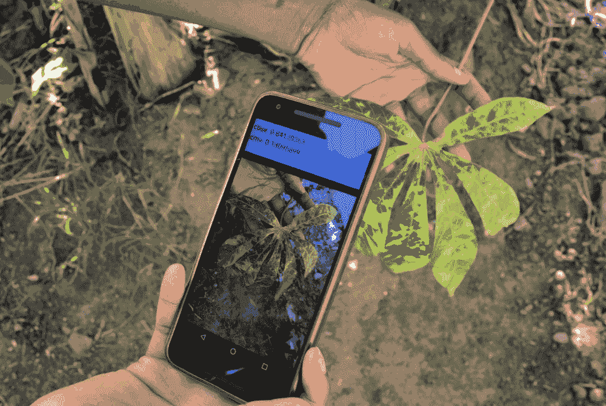

# 人工智能向善

*DALL·E 3 Prompt: Illustration of planet Earth wrapped in shimmering neural networks, with diverse humans and AI robots working together on various projects like planting trees, cleaning the oceans, and developing sustainable energy solutions. The positive and hopeful atmosphere represents a united effort to create a better future.*


## 目的

*为什么资源受限的部署代表了机器学习系统工程知识的终极综合？*

本教材中涵盖的每一项技术、原则和优化策略，在资源受限的环境中都有其最严峻的应用。你掌握的部署范式、训练方法、优化技术和鲁棒性原则，不仅仅是学术练习，而是为工程化机器学习系统做准备，这些系统在计算资源消失、基础设施失败，以及每个设计决策都有人类后果的环境中工作。社会影响部署需要综合所有这些知识，因为它们在极端技术约束和关键人类需求之间运行。农村诊所的医疗诊断系统无法承担低效的架构。为小农户设计的农业监控系统不能假设可靠的连接。灾难响应平台不能容忍系统故障。这些部署揭示了你是否真正理解机器学习系统工程，而不仅仅是当资源充足时如何应用技术，而是在资源稀缺时如何适应、组合和优化它们。本章表明，机器学习系统工程的目标不是在受控环境中实现最先进的性能，而是在最具有挑战性的条件下创建能够提供可靠影响的系统。

**学习目标**

+   确定全球社会挑战，其中人工智能系统可以在解决资源约束和基础设施限制的同时产生可衡量的影响

+   分析资源悖论及其在部署机器学习系统在服务不足环境中的定量影响

+   使用定量优化技术计算资源受限的机器学习部署的功耗预算和优化权衡

+   比较和对比四种设计模式（分层处理、渐进增强、分布式知识、自适应资源）在社会影响应用中的异同

+   根据特定的资源可用性、连接约束和社区需求选择适当的设计模式和部署范式

+   评估现实世界的案例研究，以评估不同架构方法在农业、医疗保健和环境监测中的有效性

+   设计在严重资源约束下运行的同时保持早期章节中信任度原则的机器学习系统架构

+   批判人工智能善行部署中的常见谬误和陷阱，以避免技术优先的方法和基础设施假设

## 极端约束下的可信人工智能

第五部分的前几章已经建立了可信机器学习系统的理论和实践基础，包括负责任的开发方法（第十七章）、安全和隐私框架（第十五章）和弹性工程原则（第十六章）。本章将探讨这些可信性范式在机器学习最具挑战性的部署领域的应用：旨在在严重资源约束下解决关键社会和环境挑战的系统。

可信人工智能代表了机器学习系统中的一个独特工程学科，其特点是将极端技术约束与严格的可靠性要求相结合。为资源有限的健康环境设计诊断系统或为断开连接的农村社区设计农业监测平台，需要系统地应用本书中确立的每一项原则。此类部署需要为不可靠的基础设施调整第二章架构，将第八章的方法应用于有限数据场景，并将第九章的技术作为核心要求而非可选优化。第十六章（ch022.xhtml#sec-robust-ai）中的弹性原则对于确保在不可预测的环境中运营连续性至关重要。

这些应用的社技术背景提出了独特的工程挑战，这些挑战将人工智能善行与传统的机器学习部署区分开来。任何商业系统都可能面临的挑战（操作功率预算限制在个位数瓦特，内存足迹限制在千字节规模，网络连接可能面临多日中断）必须与超出传统应用可靠性的要求相协调。在这些环境中，系统故障的后果不仅限于用户体验下降，还可能危及医疗诊断、紧急响应协调或易受伤害人群的食物安全评估等关键功能。

本章系统地探讨了机器学习系统如何在全球资源受限的环境中实现专家级分析能力的民主化。我们提出了识别和分析全球挑战的概念框架，在这些挑战中，机器学习干预可以产生可衡量的影响，包括在欠发达地区的医疗可及性、小农农业系统的生产力提升以及环境监测为保护活动服务。本章建立了设计方法，这些方法在解决极端资源限制的同时，保持了在第五部分中开发的可信度标准。通过详细分析农业、医疗保健、灾害响应和环境保护领域的实际部署案例研究，我们展示了机器学习系统知识在应对人类最紧迫挑战中的实际综合应用。

**AI for Good**是将机器学习系统应用于解决**社会**和**环境**挑战的应用，强调**公平获取**、**可衡量影响**和**可持续部署**，以服务于人类福祉。

## 社会挑战与 AI 机遇

历史提供了令人清醒的例子，说明及时干预和协调响应如何能显著改变结果。例如，2014-2016 年西非的埃博拉疫情 1，就突出了延迟检测和响应系统的灾难性后果（C. Park 2022）。同样，2011 年索马里的饥荒，尽管提前几个月预报，但由于缺乏有效动员和分配资源的机制，造成了巨大的苦难（ReliefWeb 2012）。2010 年海地地震之后，缺乏快速可靠的损害评估严重阻碍了将援助引导到最需要的地方的努力（Survey, n.d.）。

这些历史教训揭示了今天在各个领域持续存在的模式，尤其是在资源受限的环境中。在医疗保健领域，偏远和欠发达社区由于无法及时获得医疗专业知识，会经历可预防的健康危机。缺乏诊断工具和专家意味着可治疗的状况会升级为危及生命的情况。在确保全球粮食安全的关键部门农业中，也面临着类似的挑战。生产世界上大部分食物的小农 2 在有限信息的情况下做出关键决策。

类似的系统性障碍在教育领域也显现出来，其中不平等加剧了服务不足地区面临的挑战。许多学校缺乏足够的教师、充足的教育资源和为学生的个性化支持。这扩大了优势学习者与劣势学习者之间的差距，并为社会和经济的发展带来了长期的影响。没有获得优质教育的机会，整个社区都处于不利地位，从而持续着贫困和不平等循环。这些教育不平等与更广泛的社会挑战相互关联，因为教育中的差距加剧了医疗和农业领域的问题。

环境退化给全球问题增添了另一个关键维度。森林砍伐、污染和生物多样性丧失威胁着生计并破坏了维持人类生活所必需的生态平衡。广阔的森林、海洋和野生动物栖息地仍然无人监管和保护，尤其是在资源有限的地区。这使生态系统容易受到非法活动的影响，如偷猎、伐木和污染，加剧了已经在经济和社会差异中挣扎的社区的压力。

这些问题有几个共同特征。它们不成比例地影响弱势群体，加剧了现有的不平等。受影响地区的资源限制为实施解决方案设置了障碍。解决这些挑战需要在极大的不确定性下，在相互竞争的优先事项和有限的资源之间进行权衡。

尽管存在这些复杂的挑战，但技术为解决这些问题提供了变革性的潜力。通过提供创新工具来增强决策、提高效率和大规模提供解决方案，技术为克服历史进步障碍带来了希望。机器学习系统因其处理大量信息、发现模式和生成能够为资源受限环境中的行动提供信息的能力而脱颖而出。实现这一潜力需要采取有意识的措施，以确保这些工具能够有效地、公平地为所有社区服务。

在这个领域的一个常见陷阱是技术优先的方法，工程师在没有理解社区需求的情况下构建解决方案。这导致了一些技术上令人印象深刻但无人使用的系统，因为它们未能解决真正的优先事项或在当地约束下有效运作。成功的部署来自于彻底的需求评估和共同设计过程，这些过程优先考虑社区识别的问题，而不是技术能力。

机器学习通过一项关键能力来解决这些挑战：在不要求专家在场的情况下，将专家级分析带到资源受限的环境中。肯尼亚农村的小规模农户可以在不接触农业推广官员的情况下接收作物疾病诊断。印度偏远地区的社区健康工作者可以在没有儿科医生的情况下对肺炎病例进行分类。亚马逊的森林管理员可以在没有 24/7 人工监控的情况下检测偷猎活动。这种专业知识的民主化依赖于第二章中提到的部署范例，但在商业场景中不存在的限制条件下应用：间歇性连接取代可靠网络，太阳能取代电网基础设施，稀疏标记数据取代丰富的训练集。

## 实际部署范例

来自第二章（云 ML、移动 ML、边缘 ML 和 TinyML）的机器学习部署范例通过适应资源受限的环境，解锁了这些针对紧迫社会挑战的变革性解决方案。通过适应各种限制并利用独特优势，这些技术正在推动农业、医疗保健、灾害响应和环境保护领域的创新。本节探讨了这些范例如何通过实际应用将社会效益变为现实。

### 农业

农业面临着来自气候变率、害虫抗性和需要用有限资源养活不断增长的全球人口的史无前例的挑战（Kamilaris 和 Prenafeta-Boldú 2018）。现在，机器学习系统为农民提供了以前只有农业专家才能拥有的诊断能力，从而改变了作物监测、疾病检测和资源在不同农业环境中的分配方式。



图 19.1：**移动疾病检测**：边缘机器学习的示例，其中智能手机应用程序使用训练好的模型直接在设备上对植物疾病进行分类，从而在资源受限的环境中实现实时反馈。这种部署减少了对外部网络连接的依赖，并允许提供本地化、可访问的农业支持。

在撒哈拉以南非洲，这种转型尤为明显，那里的木薯种植者长期以来一直在与破坏作物和生计的疾病作斗争。现在，移动机器学习驱动的智能手机应用程序能够在资源受限的设备上直接进行实时作物疾病检测，如图 19.1 所示。PlantVillage Nuru 系统通过渐进式增强设计模式展示了这种方法，从基本的离线诊断到云增强分析都保持了功能。这一案例研究在第 19.7.2.1 节中进行了详细探讨，它探讨了 2-5 MB 的量化模型如何实现 85-90%的诊断准确性，同时消耗不到 100 mW 的功率(Ramcharan et al. 2017)3。

在东南亚，类似的创新正在出现，那里的水稻种植者面临着越来越不可预测的天气模式。在印度尼西亚，微型机器学习传感器正在通过监测稻田中的微气候 4 来改变他们的适应能力。这些低功耗设备在本地处理数据以优化用水，使具有最基本基础设施的地区实现精准灌溉(Tirtalistyani, Murtiningrum, and Kanwar 2022)。

微软的[FarmBeats](https://www.microsoft.com/en-us/research/project/farmbeats-iot-agriculture/)5 整合了物联网传感器、无人机和云机器学习，为农民提供可操作的见解。通过利用天气预报、土壤条件和作物健康数据，该平台允许农民优化如水和肥料等投入，减少浪费并提高产量。这些创新展示了人工智能技术如何实现精准农业，解决粮食安全、可持续性和气候韧性等问题。

### 医疗保健

医疗保健行业通过机器学习也呈现出类似的转型机会。对于数百万生活在服务不足社区的人来说，获得医疗保健往往意味着长时间的等待和前往遥远的诊所。微型机器学习使患者身边的诊断成为可能。例如，由[Respira x Colabs](https://www.samayhealth.com/)开发的一种低成本可穿戴设备，利用嵌入式机器学习来分析咳嗽模式并检测肺炎 6。专为偏远地区设计，该设备在无需互联网连接的情况下独立运行，并由简单的微控制器供电，使生命攸关的诊断对最需要的人变得可及。

微型机器学习也解决了全球健康问题，如由蚊子传播的媒介传播疾病。研究人员已经开发了低成本设备，这些设备使用机器学习通过蚊子的翅膀拍打频率来识别蚊种 7 (Altayeb, Zennaro, and Rovai 2022)。这项技术允许对携带疟疾的蚊子进行实时监控，并为高风险地区的疟疾控制提供可扩展的解决方案。

云机器学习在规模上推进了医疗保健研究和诊断。像[Google Genomics](https://health.google/health-research/genomics/)8 这样的平台分析大量数据集以识别疾病标志，加速个性化医疗的突破。这些例子展示了从便携式 Tiny ML 到强大的云机器学习的人工智能技术如何使医疗保健访问民主化并改善全球的成果。

### 灾害响应

灾害响应需要在极端不确定性的情况下迅速做出决策，通常伴随着基础设施损坏和有限的通信渠道。机器学习系统通过自主操作、本地处理能力和在集中式系统失败时继续运行的预测建模来应对这些限制。

这种能力在灾区至关重要，在那里人工智能技术加速了响应工作并提高了安全性。配备 Tiny ML 算法的微型、自主无人机正在进入倒塌的建筑，克服障碍以检测生命迹象。通过本地分析热成像 9 和声学信号，这些无人机能够在不依赖云连接的情况下识别幸存者和危险(Duisterhof et al. 2021)。这些无人机可以自主寻找光源（通常指示幸存者）并检测危险的气体泄漏，使搜救行动对人类响应者来说既快又安全。

除了这些地面操作之外，像谷歌的[AI for Disaster Response](https://crisisresponse.google/)10 这样的平台正在利用云机器学习来处理卫星图像并预测洪水区。这些系统提供实时洞察，帮助政府在紧急情况下更有效地分配资源并挽救生命。

完成这一多尺度方法，移动机器学习应用也通过将实时灾害警报直接发送到智能手机上发挥着关键作用。针对用户位置的地震海啸预警和森林火灾更新允许更快的疏散和更好的准备。无论是在全球范围内使用云机器学习还是通过边缘和移动机器学习实现本地洞察，这些技术正在重新定义灾害响应能力。

### 环境保护

环境保护是另一个机器学习系统做出重大贡献的领域。保护者在监测和保护广阔且通常遥远的景观中的生物多样性时面临着巨大的挑战。人工智能技术为这些问题提供了可扩展的解决方案，结合了本地自主性和全球协调。

在个体动物层面，EdgeML 驱动的项圈被用来无干扰地跟踪动物行为，如大象的运动和叫声，帮助研究人员了解迁徙模式和社交行为。通过在项圈本身处理数据，这些设备最小化了功耗并减少了频繁更换电池的需求。通过扩展这种监控能力，Tiny ML 系统通过检测枪声 11 或人类活动，并将警报实时传达给巡护员，正在使反盗猎工作成为可能 (Bamoumen et al. 2022)。

超越陆地保护，云机器学习正在全球范围内用于监控非法捕鱼活动。例如，[全球捕鱼监控](https://globalfishingwatch.org/)平台 12 分析卫星数据以检测异常，帮助政府执行法规并保护海洋生态系统。

这些应用展示了人工智能技术如何实现实时监控和决策，推进保护工作。

### 跨领域集成挑战

上面的例子展示了人工智能在解决重要社会挑战方面的变革潜力。然而，这些成功强调了全面解决此类问题的复杂性。每个例子都针对特定的需求，例如优化农业资源、扩大医疗保健的获取或保护生态系统，但可持续解决这些问题需要更多的不仅仅是孤立的创新。

最大化影响和确保公平进步需要多个领域的集体努力。大规模挑战需要跨部门、地理和利益相关者的合作。通过促进地方倡议、研究机构和全球组织之间的协调，我们可以将人工智能的变革潜力与扩大解决方案所需的基础设施和政策对齐。没有这种对齐，即使是具有前景的创新也可能会在孤岛中运作，限制其影响力和可持续性。

上文所述的应用展示了人工智能的多样性，但也揭示了协调挑战。当资源有限时，我们如何优先投资？我们如何确保创新解决最紧迫的需求而不是最技术有趣的问题？我们如何在不同环境中衡量成功并保持对受益社区的问责制？回答这些问题需要超越个别应用的系统框架，提供共同的评估标准、优先级层次和协调机制。

## 可持续发展目标框架

这些问题的规模和复杂性要求采取系统方法，以确保努力具有针对性、协调性和可持续性。联合国可持续发展目标（SDGs）等全球框架以及世界卫生组织（WHO）等机构的指导发挥着关键作用。这些框架为解决世界最紧迫的挑战提供了一个结构化的视角。它们提供了一个路线图，以协调努力、设定优先事项并促进国际合作，以创造有影响力和持久的变化（*《可持续发展目标报告 2018》* 2018）。

图 19.2 中显示的可持续发展目标代表了一个在 2015 年采纳的全球议程 13。这些 17 个相互关联的目标构成了一个蓝图，旨在通过 2030 年解决世界面临的最紧迫挑战 14。它们涵盖了从消除贫困和饥饿到确保优质教育，从促进性别平等到采取气候行动 15。


图 19.2：**可持续发展目标**：这 17 个相互关联的目标为解决重要的社会、经济和环境挑战提供了一个全球框架，指导具有积极社会影响的机器学习系统的发展。理解这些目标使从业者能够将人工智能解决方案与更广泛的可持续性目标对齐，并衡量向更公平的未来迈进的过程。来源：联合国。

在这个框架的基础上，机器学习系统可以通过其变革性能力同时为多个 SDGs 做出贡献(Taylor et al. 2022)。

+   **目标 1（消除贫困）& 目标 10（减少不平等）**：通过移动银行和微型贷款风险评估提高金融包容性的机器学习系统。

+   **目标 2, 12, & 15（零饥饿、负责任消费、陆地生命）**：优化资源分配的系统，减少食品供应链中的浪费，并监测生物多样性。

+   **目标 3 & 5（良好健康和性别平等）**：改善孕产妇健康结果和弱势社区医疗保健可及性的机器学习应用。

+   **目标 13 & 11（气候行动与可持续城市）**：预测系统用于气候弹性和城市规划，帮助社区适应环境变化。

尽管存在这种潜力，部署这些系统面临着独特的挑战。许多可能从机器学习应用中受益最多的地区缺乏可靠的电力（目标 7：负担得起的清洁能源）或互联网基础设施（目标 9：工业、创新和基础设施）。这种现实要求我们重新思考如何设计用于社会影响的机器学习系统。

认识到这些挑战，通过机器学习推进可持续发展目标的成功需要一种超越技术解决方案的整体方法。系统必须在当地资源约束下运行，同时尊重文化背景和现有基础设施限制。这一现实要求重新思考系统设计，不仅要考虑技术能力，还要考虑它们可持续地融入最需要它们的社区。

可持续发展目标（SDGs）为解决哪些问题和为什么这些问题在全球范围内重要提供了基本的规范性框架。然而，将这些雄心勃勃的目标转化为运作体系需要面对具体的工程现实。对 SDG 3（良好的健康与福祉）的承诺并不会自动产生在诊所中运行太阳能且具有间歇性连接的诊断系统。通过农业人工智能实现 SDG 2（零饥饿）需要能够在没有互联网接入的$30 智能手机上工作的解决方案。这些发展目标确立了优先级；工程约束决定了可行性。

将这些发展目标转化为运作体系需要具体的工程解决方案。下一节将探讨区分社会影响部署与之前章节中涵盖的商业场景的具体技术约束。这些约束（涵盖计算、电力、连接性和数据可用性）重塑了系统架构，并确立了为什么需要新颖的设计模式，而不仅仅是缩小现有方法。

## 资源约束和工程挑战

在社会影响背景下部署机器学习系统需要跨越计算、网络、电力和数据维度的相互关联的挑战。这些挑战在生产部署和扩展过程中加剧。这些约束不仅在程度上不同，而且在本质上与第二章（ch008.xhtml#sec-ml-systems）中考察的商业部署不同，需要创新架构以在严重资源限制下保持功能。

为了提供理解这些挑战的基础，表 19.1 总结了在发展、农村和城市环境中资源和需求的关键差异，同时突出了在扩展过程中遇到的独特约束。这种比较为理解后续章节中将探讨的悖论、困境和约束提供了基础。

表 19.1：**部署资源范围**：社会影响应用需要仔细考虑计算约束，从基于微控制器的农村部署到城市环境中的服务器级系统；扩展这些系统通常需要积极的模型压缩技术以满足资源限制。此表量化了这些差异，揭示了在不同部署环境中模型复杂性、准确性和可行性的权衡。

| **方面** | **农村部署** | **城市部署** | **扩展挑战** |
| --- | --- | --- | --- |
| **计算资源** | 微控制器（ESP32：240 MHz 双核，520 KB 总 SRAM 中 320 KB 可用 SRAM） | 服务器级系统（100-200 W，32-64 GB RAM） | 严格的模型量化（例如，从 50 MB 到 500 KB） |
| **电力基础设施** | 太阳能和电池系统（10-20 W，2000-3000 mAh 电池） | 稳定的电网电力 | 优化电力使用（针对部署设备） |
| **网络带宽** | LoRa、NB-IoT（0.3-50 kbps，60-250 kbps） | 高带宽选项 | 协议调整（LoRa、NB-IoT、Sigfox：100-600 bps） |
| **数据可用性** | 稀疏、异构数据源（来自农村诊所的每日 500 KB） | 大量标准化数据（来自城市医院的吉字节） | 专用管道（用于隐私敏感数据） |
| **模型尺寸** | 高度量化模型（≤ 1 MB） | 云/边缘系统（支持更大模型） | 模型架构重新设计（针对尺寸、功率和带宽限制） |

### 极端资源限制下的模型压缩

实现社会公益应用的超低模型大小需要平衡准确性和资源约束的系统优化管道。第十章中的传统模型优化技术必须适应并加强，以应对在服务不足环境中遇到的极端资源限制。

为了说明这些优化需求，PlantVillage 作物病害检测系统的优化管道展示了定量的压缩权衡。从 100 MB 的 ResNet-50 架构开始，达到 91%的准确率，系统优化将模型大小减少了 31 倍，同时保持实际的有效性：

+   **原始 ResNet-50**：~98 MB（FP32），在作物病害数据集上的 91%准确率基准

+   **8 位量化**：25 MB，89%准确率（4 倍压缩，2%准确率损失）

+   **结构化剪枝**：8 MB，88%准确率（12 倍压缩，3%准确率损失）

+   **知识蒸馏**：3.2 MB，87%准确率（31 倍压缩，4%准确率损失）

这些压缩比率使得在资源受限的设备上部署成为可能，同时保留了农村农民所需的诊断能力。最终的 3.2 MB 模型在 ESP32 微控制器上的推理仅需 50-80 毫秒，使得在无电网的农业环境中实现作物病害的实时检测成为可能。

**功耗分析**

在离网部署中，除了模型大小优化之外，电力预算限制在系统设计中占主导地位。神经网络推理每次 MAC（乘加）操作消耗 0.1-1 毫焦耳，一个一百万参数的模型每次推理需要 1-10 毫焦耳。农村地区的太阳能充电通常每天提供 5-20 瓦时，考虑到季节变化和天气模式。这个能量预算使得每天可以进行 20,000-200,000 次推理，假设 10-20%的功率转换损失，并考虑到典型 2 年部署周期中电池退化 30-50%。

**能量预算层次结构**

为了有效地管理这些电力限制，边缘设备的功耗遵循基于计算复杂度和部署要求的严格层次结构：

+   **TinyML 传感器**：平均功耗<1mW，使环境监测和野生动物追踪应用能够实现多年的电池运行

+   **移动边缘设备**：50-150mW 的电力预算（相当于智能手机手电筒），在大多数地理区域适合日常太阳能充电周期

+   **区域处理节点**：10W 的电力需求，需要电网连接或专用发电机系统以实现稳定运行

+   **云端点**：千瓦级电力消耗，需要具有可靠电网连接的数据中心基础设施

在这个层次结构的极端端，超低功耗野生动物监控系统展示了最苛刻的优化需求。以平均<1mW 的功耗运行，并期望电池寿命达到 5 年，这些部署需要专门的低功耗微控制器和分时操作。针对十年长期运行的环境传感器将电力需求降低到纳瓦级计算，利用温差、振动或环境电磁辐射进行能量收集。

### 资源悖论

表 19.1 中详细说明的定量约束和上述描述的优化需求揭示了塑造用于社会公益的人工智能的基本悖论：**最需要机器学习能力的环境拥有最少的传统部署基础设施**。农村撒哈拉以南非洲拥有全球 60%的可耕地，但只有 4%的全球互联网连接。为疾病负担最重的群体服务的偏远医疗诊所依赖小型太阳能板的不规则电力。生物多样性损失最大的森林地区缺乏云连接监控系统的基础设施 16。

这种需求和基础设施可用性之间的反向关系，在表 19.1 中量化，从根本上区分了社会公益部署与第二章（ch008.xhtml#sec-ml-systems）中的商业场景。典型的云部署可能使用消耗 100-200 W 功率的服务器，具有多个 CPU 核心和 32-64 GB 的 RAM。然而，农村部署通常必须在功耗仅为 5 W 的单板计算机或仅消耗毫瓦的微控制器上运行，RAM 以千字节而不是千兆字节计量。这些极端的资源限制需要创新的方法来训练和推理模型，包括第十四章（ch020.xhtml#sec-ondevice-learning）中介绍的技术，其中模型必须直接在资源受限的设备上进行适配和优化。

这些计算约束的叠加，网络基础设施的限制进一步限制了系统设计。城市环境提供高带宽选项，如光纤（100+ Mbps）和 5G 网络（1-10 Gbps），能够支持实时多媒体应用。农村部署必须依赖低功耗广域网络技术，如 LoRa17 或 NB-IoT，带宽限制为 50 kbps，大约比典型宽带连接慢三个数量级。这些严重的带宽限制需要仔细优化数据传输协议和有效载荷大小。

除了这些连接挑战之外，电力基础设施还带来了额外的约束。虽然城市系统可以依赖稳定的电网电力，但农村部署通常依赖于太阳能充电和电池系统。典型的太阳能系统在峰值阳光时段可能产生 10-20 W 的电力，需要仔细规划整个系统组件的电力预算。电池容量限制，通常为 2000-3000 mAh，意味着系统必须优化操作的各个方面，从传感器采样率到模型推理频率。

### 数据稀缺和质量约束

资源悖论不仅超越了计算能力，还涵盖了与商业部署显著不同的数据挑战。第六章（ch012.xhtml#sec-data-engineering）中的数据工程原则假设了可靠的数据管道、集中的预处理基础设施和标准化的格式——这些假设在资源受限的环境中会崩溃。商业系统可以处理包含数百万个示例的标准数据集，而社会影响项目必须构建具有有限、异构数据源的稳健系统，同时保留之前建立的数据质量、验证和治理原则。

医疗保健部署说明了数据工程工作流程在受限条件下的适应性。农村诊所每天生成 50-100 份患者记录（≈500 KB），这些记录混合了结构化的生命体征和非结构化的手写笔记，需要专门的预处理，而城市医院则产生数吉字节的标准电子健康记录。即使是 X 光或 MRI 扫描，其大小也以兆字节计算，这突显了农村和城市医疗保健设施之间数据规模的大差异。从第六章中的数据收集、清洗和验证管道必须在这些严格的限制下运行，同时保持数据完整性。

网络限制进一步限制了数据收集和处理。在有限的电力预算下运行的农业传感器网络可能每次读取只能传输 100-200 字节。在 50 kbps 的 LoRa 带宽限制下，这些系统通常将传输频率限制为每小时一次。因此，1000 个传感器的网络每天只产生 4-5 MB 的数据，需要模型从稀疏的时间数据中学习。为了对比，在 Netflix 上流式传输一分钟的视频可以消耗数兆字节，突显了工业物联网网络和日常互联网使用之间数据量的差异。

隐私考虑增加了另一层复杂性，需要从第十五章中调整框架。医疗监控和位置跟踪生成高度敏感的数据，然而，该章节中的威胁建模、加密和访问控制机制假设了在社会公益部署中不可用的计算资源。在 512 KB RAM 的设备上实现差分隐私或联邦学习需要轻量级的替代标准加密协议。在第十五章中假设的加密安全区域和基于硬件的密钥存储在微控制器级设备上通常不存在，这需要在 2-4 MB 的总存储空间内仅使用软件安全。本地处理必须在保护隐私的计算（这会增加 10-50%的计算开销）和严格的电力预算之间取得平衡，而离线操作则防止了实时认证或撤销检查。这些限制使得在数据敏感性最高和社区安全管理技术能力最低时，隐私工程变得更加困难。

### 开发到生产资源差距

从数据约束转向部署现实，将机器学习系统从原型扩展到生产部署引入了核心资源约束，这需要重新设计架构。开发环境提供了计算资源，这些资源掩盖了许多现实世界的限制。一个典型的开发平台，例如 Raspberry Pi 418，凭借其 1.5 GHz 处理器和 4 GB RAM，提供了大量的计算能力。这些资源允许快速原型设计和测试机器学习模型，而无需立即关注优化。

生产部署揭示了与开发环境形成对比的资源限制。当扩展到数千台设备时，成本和电力限制通常要求使用微控制器单元，如 ESP3219，这是 Espressif Systems 广泛使用的微控制器单元，具有 240 MHz 双核处理器和总共 520 KB SRAM，具体可用量为 320-450 KB，取决于变体。这种计算资源的显著减少要求系统架构发生变化。设备上的学习技术第十四章变得至关重要：模型必须重新设计以适应受限的执行，应用量化（在第十章第十章中详细说明）和剪枝等优化技术，适应最小内存占用量的推理策略，并实施在严重带宽和存储限制下工作的更新机制。

除了计算扩展之外，网络基础设施的约束在很大程度上影响了大规模系统架构。不同的部署环境需要不同的通信协议，每个协议都有其独特的操作参数。这种网络基础设施的异质性要求系统在变化的带宽和延迟条件下保持一致的性能。随着部署跨越地区扩展，系统架构必须适应网络技术之间的无缝过渡，同时保持功能。

从开发到扩展部署的转变在应用领域呈现一致的模式。环境监控系统是这些扩展需求的例证。一个典型的森林监控系统可能从在开发平台上运行的 50 MB 计算机视觉模型开始。扩展到广泛部署需要通过量化和架构优化将模型减少到大约 500 KB，以便在分布式传感器节点上运行。这种模型尺寸的减少必须在严格限制在 1-2 W 的电力约束下保持检测精度。类似的架构转换也发生在农业监控系统和教育平台上，在这些平台上，模型必须优化以部署在数千台资源受限的设备上，同时保持系统效率。

### 长期可行性和社区所有权

在资源受限的环境中维护机器学习系统提出了超越初始部署考虑的特定挑战。这些挑战包括系统寿命、环境影响、社区能力和财务可行性，这些因素决定了社会影响项目的长期成功。第十八章（ch024.xhtml#sec-sustainable-ai）中的可持续性原则（生命周期评估、碳核算和负责任资源消耗）在社区已经面临环境脆弱性且缺乏管理电子废物或回收组件的基础设施的情况下，显得尤为重要。

系统寿命需要仔细考虑硬件的耐用性和可维护性。环境因素，如温度变化（通常在乡村部署中为-20°C 至 50°C）、湿度（在热带地区通常为 80-95%）和灰尘暴露，会显著影响组件的使用寿命。这些条件需要选择坚固的硬件和防护措施，在耐用性和成本限制之间取得平衡。例如，太阳能驱动的农业监测系统必须保持稳定的运行，尽管太阳辐射强度会随地理位置和天气模式的变化而变化，通常在 3-7 kWh/m²/天之间。

环境可持续性在系统设计中引入了额外的复杂性。应用第十八章（ch024.xhtml#sec-sustainable-ai）中的生命周期评估框架，我们必须考虑全面的环境足迹：运往偏远地区的组件的制造影响、太阳能板或容量有限的电池的运营电力消耗、维护访问的交通排放，以及在通常缺乏电子废物回收基础设施的地区的产品报废处理。典型的 1000 个传感器节点的部署需要考虑大约 500 公斤的电子组件，包括传感器、处理单元和电源系统。可持续设计原则必须通过仔细的组件选择和报废规划来满足即时的运营需求以及长期的环境影响。

社区能力建设是可持续性的另一个重要维度。系统必须由具有不同技术水平的地方技术人员维护。这一需求影响了从组件选择到系统模块化的架构决策。文档必须全面且易于访问，通常需要多种语言和格式的材料。培训计划必须填补知识差距，同时建立地方技术能力，确保社区能够独立维护和适应系统，随着需求的变化而发展。

然而，一个常见的误解是认为良好的意图自动确保了 AI 部署的积极社会影响。没有深入社区参与的科技解决方案往往无法解决实际需求或创造开发者没有预料到的新问题。文化误解、当地背景不足或技术限制都可能将有益的意图转变为有害的结果。有效的 AI 社会效益需要持续的社区伙伴关系、细致的影响评估和适应性实施方法，这些方法优先考虑受益人的需求而不是技术能力。

这些考虑将传统的 MLOps 实践从第十三章扩展到涵盖社区驱动的部署和维护工作流程。

**跨学科团队的关键作用**

在 AI 领域取得社会效益的成功高度依赖于与非工程师的合作。这些项目需要与领域专家（医生、农民、保护主义者）、社会科学家、社区组织者和当地合作伙伴紧密合作，他们带来了关于操作环境、文化考量和社区需求的基本知识。工程师的角色通常是作为社区定义目标的促进者和问题解决者，而不仅仅是技术提供商。

跨学科团队带来了关键视角：领域专家了解问题空间和操作限制，社会科学家帮助导航文化背景和意外后果，社区组织者确保真正的当地参与和所有权，而当地合作伙伴提供持续的维护和适应能力。没有这些多元化的视角，即使技术复杂的系统也往往无法实现可持续的影响。

财务可持续性往往决定了系统的寿命。运营成本，包括维护、更换零件和网络连接，必须与当地经济条件相一致。可持续部署可能将运营成本设定在每位受益人当地月收入的 5%以下。这一限制影响了系统设计的各个方面，从硬件选择到维护计划，需要仔细优化资本和运营支出。

在这个领域的一个关键陷阱是认为技术成功确保了可持续的长期影响。团队往往专注于实现技术里程碑，如模型精度或系统性能，而没有考虑决定长期社区利益的可持续性因素。成功的部署需要持续的维护、用户培训、基础设施支持和适应不断变化条件的能力，这些条件远远超出了最初的技术实施。那些取得令人印象深刻的技术成果但缺乏可持续支持机制的项目往往无法提供持久的好处。

### 系统弹性和故障恢复

社会公益部署在系统故障可能具有致命后果的环境中运行。与商业系统不同，停机时间会导致收入损失，医疗监测系统的故障可能会延迟关键干预措施，而农业传感器故障可能导致作物损失，影响整个社区。许多团队低估了在这些服务不足地区部署 AI 系统时出现的重大基础设施挑战，认为互联网连接、电力供应或设备能力简单可用。然而，成功的部署需要针对边缘计算、强大的离线能力、自适应带宽利用和能够在具有挑战性的物理环境中有效运行的弹性硬件设计的复杂工程解决方案。这一现实要求强大的故障恢复模式，以确保优雅降级和快速恢复基本服务。

**常见故障模式和量化影响**

50 多个社会公益部署的分析揭示了具有可量化停机时间贡献的持续故障模式：

+   **硬件故障（40%的停机时间）**：传感器电池耗尽、太阳能板退化以及与温度相关的组件故障主导了系统故障。恢复策略包括监测电池电压趋势的预测性维护算法、冗余传感器配置以及区域性维护中心预置的备用零件。

+   **网络故障（35%的停机时间）**：在天气事件期间间歇性连接丢失和基础设施损坏导致长期隔离期。恢复需要具有至少 72 小时最小容量的本地数据缓存、离线操作模式以及针对低带宽网络的自动重连协议。

+   **数据质量故障（25%的停机时间）**：传感器校准漂移和环境污染逐渐降低系统精度，直到需要手动干预。恢复涉及自动校准程序、异常检测阈值，以及当质量指标超过容忍水平时向更简单模型的无缝降级。

**优雅降级架构**

弹性系统实施分层回退机制，在多种故障条件下保持基本功能。一个医疗监测系统展示了这种方法：

```py
class ResilientHealthcareAI:
    def diagnose(self, symptoms, connectivity_status, power_level):
        # Adaptive model selection based on system status
        if connectivity_status == "full" and power_level > 70:
            # Full accuracy
            return self.cloud_ai_diagnosis(symptoms)
        elif connectivity_status == "limited" and power_level > 30:
            # 90% accuracy
            return self.edge_ai_diagnosis(symptoms)
        elif power_level > 10:
            # Basic screening
            return self.rule_based_triage(symptoms)
        else:
            return self.emergency_protocol(symptoms)  # Critical only

    def fallback_to_human_expert(self, case, urgency_level):
        # Queue prioritization for human review
        if urgency_level == "critical":
            self.satellite_emergency_transmission(case)
        else:
            self.priority_queue.add(case, next_connectivity_window)
        return "Flagged for expert review when connection restored"
```

**分布式故障恢复**

多节点部署需要协调的故障恢复，即使在单个节点故障的情况下也能保持系统整体的功能。农业监测网络展示了针对资源限制的拜占庭容错性：

+   **共识机制**：采用 10 秒心跳间隔修改的 Raft 协议，在网络延迟的情况下检测 30 秒窗口内的故障

+   **数据冗余**：在 3-5 个节点之间进行地理复制，确保即使单个传感器故障，作物监测也能继续

+   **协调恢复**：区域节点协调同时进行软件更新和配置更改，最小化部署范围内的漏洞窗口

**基于社区的维护整合**

成功的社会公益系统将当地社区整合到维护工作流程中，减少对外部技术支持的依赖。培训计划在提供经济机会的同时，创造当地技术能力：

+   **诊断协议**：社区健康工作者接受标准化的程序，用于识别和解决 80%的常见故障

+   **备件管理**：本地库存系统根据历史故障率，维持 2 周供应缓冲的临界组件

+   **升级程序**：清晰的沟通渠道将当地技术人员与远程专家联系起来，以解决需要专业知识的专业故障

这种社区整合方法将平均维修时间从 7-14 天（外部技术人员派遣）缩短到 2-4 小时（当地响应），显著提高了远程部署的系统可用性。

上文所述的工程挑战和故障模式需要比临时解决方案更多。要理解为什么资源受限的环境需要不同的方法，而不是仅仅缩小传统系统的规模，我们必须检查支配约束下学习的理论基础。这些数学原理建立在第八章的训练理论之上，揭示了样本效率、通信复杂性和能量-精度权衡的内在限制，这些限制将指导本章后面提出的模式设计。

## 设计模式框架

在第 19.5 节中详细描述的工程挑战揭示了区分社会公益部署的三个核心约束：通信瓶颈，其中数据传输成本超过本地计算；样本稀缺，造成理论需求与可用数据之间 100-1000 倍的差距；以及能源限制，迫使进行明确的精度-寿命权衡。

而不是临时应对这些约束，系统化的设计模式提供了原则性的架构方法。认为资源受限的部署只需“缩小版”的云系统是错误的。正如设计模式所显示的，它们需要针对特定约束组合进行优化的不同架构，而不是减少功能。

从成功的社会公益部署的分析中，出现了四种模式，每种模式针对特定的约束组合：

### 模式选择维度

选择合适的设计模式需要分析部署环境的三个关键维度。

首先，资源可用性范围从超约束的边缘设备（具有千字节内存的微控制器）到资源丰富的云基础设施。这个范围决定了计算能力并影响模式选择。

其次，连接可靠性从始终连接的城市部署到间歇性连接的农村站点，再到完全离线操作。这些连接模式决定了数据同步策略和协调机制。

第三，数据分布塑造了学习方法：训练数据可能是集中的、跨站点分布的，或在操作期间本地生成。这些特征影响了学习方法和知识共享模式。

### 模式概述

层次处理模式将系统组织成计算层级（边缘-区域-云），这些层级根据可用资源分担责任。该模式直接将第二章中关于云 ML、边缘 ML 和移动 ML 部署范例的内容应用于资源受限环境，对于层级间具有可靠连接和明确资源区分的部署最为有效。

渐进增强模式实现了在资源约束下优雅降级的分层功能。基于第九章中关于高效 AI 模型压缩技术的内容，该模式使用量化、剪枝和知识蒸馏来创建多个能力层级。它在资源可用性和设备能力多样化的环境中表现出色。

分布式知识模式允许在没有集中式基础设施的情况下进行点对点学习和协调。这个模式将第八章中联邦学习原则扩展到在极端带宽约束和间歇性连接下运行，使其在连接有限但计算资源分布的场景中变得理想。

自适应资源模式根据当前资源可用性动态调整计算。借鉴第十一章中关于电源管理和热优化策略的内容，该模式实现了能量感知推理调度。它对于具有可预测资源模式（如太阳能充电周期和网络可用窗口）的部署最为有效。

### 模式比较框架

四种设计模式针对不同的约束和操作环境组合。表 19.2 提供了一个系统性的比较，以指导针对特定部署场景的模式选择。

表 19.2：**设计模式比较**：每个模式针对特定的约束组合和部署环境进行优化。分层处理在可靠连接允许层级协调时效果最佳。渐进式增强在资源可用性可变时表现卓越。分布式知识处理网络分区和对等协调。自适应资源管理优化可预测的资源周期。

| **设计模式** | **主要目标** | **关键挑战** | **最佳适用于…** | **示例** |
| --- | --- | --- | --- | --- |
| **分层** | 分布式计算 | 层级之间的延迟 | 覆盖城市/农村 | 洪水预测 |
| **渐进** | 优雅降级 | 模型版本管理 | 可变连接 | PlantVillage Nuru |
| **分布式** | 去中心化协调 | 网络分区 | 对等共享 | 野生动物洞察 |
| **自适应** | 动态资源使用 | 功率/计算调度 | 可预测的能量周期 | 太阳能传感器 |

此比较框架允许基于部署约束而不是临时的架构决策进行系统化的模式选择。多个模式通常在单个系统中结合使用：一个太阳能野生动物监测网络可能使用自适应资源管理来管理单个传感器，分布式知识进行对等协调，以及渐进式增强来处理可变的连接场景。

以下各节将详细检查每种模式，提供实施指导和现实世界的案例研究。

## 设计模式实现

在上述选择框架的基础上，本节详细介绍了资源受限的机器学习系统的四种设计模式。每个模式描述都遵循一致的结构：来自实际部署的动机、架构原则、实施考虑因素和局限性。

### 分层处理

这些模式中的第一个，分层处理模式，将系统组织成共享其可用资源和能力的层级。就像拥有本地分支机构、区域办公室和总部的大型企业一样，此模式在边缘、区域和云层级之间分割工作负载。每个层级利用其计算能力：边缘设备用于数据收集和本地处理，区域节点用于聚合和中间计算，云基础设施用于高级分析和模型训练。

如图 19.3 所示，此模式在这些层级之间建立了清晰的交互流程。从边缘层的数据收集开始，信息通过区域聚合和处理流动，最终在基于云的高级分析中达到高潮。双向反馈循环允许模型更新通过层次结构反向流动，确保持续的系统改进。


图 19.3：**分层数据流架构**：分布式机器学习系统使用分层架构（边缘、区域和云）来处理更接近数据源的数据，汇总见解，并通过持续反馈进行模型优化的高级分析。区域节点从边缘设备收集数据，降低通信成本，并使整个系统实现可扩展、高效的分析。

这种架构在基础设施质量各异的环境中表现卓越，例如跨越城市和农村地区的应用。边缘设备在网络或电源中断期间通过在本地执行重要计算并排队等待更高层级资源的需求操作来保持重要功能。当连接恢复时，系统在可用的基础设施层级上扩展操作。

在机器学习应用中，这种模式需要仔细考虑资源分配和数据流。边缘设备必须在模型推理准确性和计算约束之间取得平衡，而区域节点则促进数据聚合和模型个性化。云基础设施提供了进行综合分析和模型再训练所需的计算能力。这种分布需要在整个层次结构中对模型架构、训练程序和更新机制进行深思熟虑的优化。

例如，在作物病害检测中：边缘传感器（智能手机应用）运行轻量级 500KB 模型以本地检测明显的病害，区域聚合器从 100 多个农场收集照片以识别新兴威胁，云基础设施使用全球疾病模式和天气数据重新训练模型。这允许立即向农民发出警报，同时随着时间的推移构建更智能的模型。

#### 谷歌的洪水预测

谷歌的[洪水预报倡议](https://blog.google/technology/ai/google-ai-global-flood-forecasting/)展示了分层处理模式如何支持大规模环境监测。河流网络中的边缘设备监测水位，即使在没有云连接的情况下也能执行基本的异常检测。区域中心汇总这些数据并确保本地决策，而云层则整合来自多个区域的输入，进行高级洪水预测和系统级更新。这种分层方法平衡了本地自主性和集中式智能，确保在不同基础设施条件下都能正常工作。这种分层系统的技术实现借鉴了专门的优化技术：包括模型压缩和量化的边缘计算策略在第十四章中详细说明，分布式系统协调模式在第八章中介绍，资源受限环境下的硬件选择在第十一章中讨论，可持续部署的考虑因素在第十八章中探讨。

在边缘层，系统可能采用了沿河流网络分布的水位传感器和本地处理单元。这些设备执行两个重要功能：定期（例如，每 15 分钟）连续监测水位，并进行初步的时间序列分析以检测显著变化。受限于严格的功耗限制（几瓦的功率），边缘设备使用量化的模型进行异常检测，实现低功耗运行并最小化传输到更高层的数据量。这种本地处理确保了关键监控任务可以在网络连接断开的情况下独立进行。

区域层在区级处理中心运行，每个中心负责管理其管辖范围内数百个传感器的数据。在这一层，使用了更复杂的神经网络模型来结合传感器数据以及额外的上下文信息，例如当地地形特征和历史洪水模式。这一层通过汇总和提取有意义的特征来减少传输到云的数据量，同时在网络中断期间保持重要的决策能力。当需要时，区域层可以独立运行，从而增强系统弹性并确保本地监控和警报功能保持正常。

在云层级别，系统整合来自区域中心以及外部来源的数据，例如卫星图像和气象数据，以实现完整的机器学习流程。这包括训练和运行高级洪水预测模型、生成淹没地图以及将预测结果分发给利益相关者。云层提供进行大规模分析和系统级更新的计算资源。然而，分层结构确保了即使在云连接不可用的情况下，重要的监控和警报功能也能在边缘和区域层自主运行。

这种实现揭示了成功分层处理模式部署的几个关键原则。首先，在各个层级之间仔细分割机器学习任务允许优雅降级。即使隔离，每个层级也保持重要的功能。其次，随着更高层级的可用性，能力的渐进增强展示了系统如何适应不同的资源可用性。最后，信息双向流动，其中传感器数据向上移动，模型更新向下流动，创建了一个强大的反馈循环，随着时间的推移提高系统性能。这些原则不仅适用于洪水预测，还适用于各种社会影响领域的分层机器学习部署。

#### 结构

分层处理模式实现了特定的架构组件和关系，允许其分布式运行。理解这些结构元素对于在不同部署场景中有效实施至关重要。

边缘层的架构以资源感知组件为中心，这些组件优化了本地处理能力。在硬件层面，数据采集模块实现自适应采样率，通常从 1 Hz 到 0.01 Hz 不等，根据电力可用性动态调整。本地存储缓冲区，通常为 1-4 MB，通过环形缓冲区实现来管理网络中断期间的数据。处理架构集成了针对量化模型优化的轻量级推理引擎，与持续跟踪设备健康和资源利用状态的管理系统协同工作。通信模块实现了为不可靠网络设计的存储转发协议，确保在间歇性连接期间数据完整性。

区域层实现了聚合和协调结构，允许分布式决策。数据融合引擎是该层核心，结合多个边缘数据流，同时考虑时间和空间关系。分布式数据库，通常跨越 50-100 GB，支持最终一致性模型，以维护节点间的数据一致性。该层的架构包括负载均衡系统，根据可用的计算资源和网络条件动态分配处理任务。故障转移机制确保在节点故障期间持续运行，而模型服务基础设施支持多个模型版本，以适应不同的边缘设备能力。跨区域同步协议管理地理边界之间的数据一致性。

云层通过复杂的分布式系统为系统级操作提供架构基础。训练基础设施支持多个计算集群之间的并行模型更新，而版本控制系统管理模型世系和部署历史。高吞吐量数据管道处理来自所有区域节点的传入数据流，实施自动质量控制和质量验证机制。该架构包括强大的安全框架，管理所有层级的身份验证和授权，同时维护系统访问和修改的审计跟踪。全局状态管理系统跟踪整个部署的健康状况和性能，使能够进行主动的资源分配和系统优化。

层次化处理模式的结构允许在各个层级上对资源和责任进行复杂的管理。这种架构方法确保系统可以在各种条件下维持重要操作，同时高效地利用层次结构每个级别的可用资源。

#### 现代改编

计算效率、模型设计和分布式系统方面的进步已经改变了传统的层次化处理模式。在保持其核心原则的同时，该模式已经发展以适应新技术和方法，允许更复杂的工作负载和动态资源分配。这些创新特别影响了不同层级之间的交互和责任共享，在多样化的环境中创造了更灵活和强大的部署。

最显著的转变发生在边缘层。历史上，边缘设备仅限于基本操作，如数据收集和简单的预处理，而现在它们执行的是以前仅限于云端的复杂处理任务。这一转变是由两个重要的发展驱动的：高效的模型架构和硬件加速。如模型压缩、剪枝和量化等技术显著降低了神经网络的尺寸和计算需求，使得即使是资源受限的设备也能以合理的准确性执行推理任务。在专用硬件方面的进步，如边缘 AI 加速器和低功耗 GPU，进一步增强了边缘设备的计算能力。因此，像图像识别或异常检测这样的任务，以前需要大量的云资源，现在可以在低功耗微控制器上本地执行。

区域层已经超越了其传统的数据聚合角色。现代区域节点使用如联邦学习等技术，其中多个设备协作改进共享模型，而不需要将原始数据传输到中央位置。这种方法不仅增强了数据隐私性，还减少了带宽需求。区域层越来越多地被用于将全局模型适应本地条件，从而为特定部署环境提供更准确和上下文感知的决策。这种适应性使区域层成为在多样或资源可变环境中运行的系统不可或缺的组成部分。

随着这些进步，层级之间的关系变得更加灵活和动态。随着边缘和区域能力的扩展，任务在层级之间的分配现在由实时资源可用性、网络条件和应用需求等因素决定。例如，在连接性低的时候，边缘和区域层可以暂时承担额外的责任以确保重要功能，而当资源和连接性改善时，无缝地将任务卸载到云端。这种动态分配保留了层次结构固有的优势，包括可扩展性、弹性和效率，同时使系统能够更好地适应不断变化的情况。

这些适应表明了分层处理模式系统未来的发展。随着边缘计算能力的持续提升和新分布式学习方法的涌现，层级之间的界限可能会变得更加动态。这种演变预示着一个未来，其中分层系统可以根据部署环境、资源可用性和应用需求自动优化其结构，同时保持模式的核心优势，如可扩展性、弹性和效率。

#### 系统影响

虽然层次化处理模式最初是为通用分布式系统设计的，但其应用于机器学习引入了独特的考虑因素，这些因素显著影响了系统设计和操作。机器学习系统与传统系统不同，它们在数据流、计算密集型任务以及模型更新和推理过程的动态性方面有很强的依赖性。这些额外因素在将层次化处理模式适应机器学习部署需求时既带来了挑战也带来了机遇。

机器学习的一个最重要的影响是需要在多个层级上管理动态模型行为。与静态系统不同，机器学习模型需要定期更新以适应新的数据分布，防止模型漂移并保持准确性。层次结构通过允许云端层处理集中的训练和模型更新，同时将精炼的模型传播到区域和边缘层级，本质上支持这一需求。然而，这也引入了同步问题，因为当更新因连接问题而延迟时，边缘和区域层级必须继续使用较旧的模型版本运行。设计健壮的版本控制系统并确保模型更新之间的无缝过渡对于这些系统的成功至关重要。

数据流是机器学习系统提出独特要求的另一个领域。与传统分层系统不同，机器学习系统必须在多个层级上处理大量数据，从边缘的原始输入到区域和云端层级的聚合和预处理数据集。每个层级都必须针对其执行的具体数据处理任务进行优化。例如，边缘设备通常过滤或预处理原始数据以减少传输开销，同时保留对推理重要的重要信息。区域层级聚合这些输入，执行中间级别的分析或特征提取以支持下游任务。这个多阶段数据管道不仅降低了带宽需求，而且确保每个层级对整体机器学习工作流程都有实质性贡献。

层次化处理模式还允许自适应推理，这是在具有不同计算资源的环境中部署机器学习模型时的一个关键考虑因素。通过利用每一层的计算能力，系统可以动态地分配推理任务以平衡延迟、能耗和准确性。例如，边缘设备可能处理基本的异常检测以确保实时响应，而当资源和连接允许时，更复杂的推理任务则被卸载到云端。这种动态分配对于资源受限的环境非常重要，在这些环境中，能效和响应速度至关重要。

硬件进步进一步塑造了分层处理模式在机器学习中的应用。专用边缘硬件，如 AI 加速器和低功耗 GPU 的普及，使得边缘设备能够处理越来越复杂的机器学习任务，缩小了层级之间的性能差距。区域层同样受益于诸如联邦学习等创新，模型可以在不要求集中式数据收集的情况下跨设备协作改进。这些进步增强了低层级的自主性，减少了对于云连接的依赖，并使系统能够在去中心化环境中有效运行。

最后，机器学习引入了平衡本地自主性与全球协调的挑战。边缘和区域层级必须能够根据它们可用的数据进行本地化决策，同时与云层级维护的全球状态保持同步。这需要仔细设计层级之间的接口，以管理不仅数据流，还包括模型更新、推理结果和反馈循环。例如，采用联邦学习的系统必须协调本地训练的模型更新的聚合，而不会压垮云层级或损害隐私和安全。

通过将机器学习集成到分层处理模式中，系统获得了在多样化环境中扩展其能力、动态适应不断变化的资源条件以及平衡实时响应与集中式智能的能力。然而，这些好处伴随着额外的复杂性，需要仔细关注模型生命周期管理、数据结构和资源分配。分层处理模式仍然是机器学习系统的一个强大框架，使其能够克服基础设施可变性的限制，并在广泛的领域中提供高影响力的解决方案。

#### 按层级划分的性能特征

在分层层级中量化性能揭示了吞吐量、资源消耗和部署限制之间的精确权衡。这些指标为架构决策和资源分配策略提供了信息，这对于社会公益应用至关重要（表 19.3）。

表 19.3：**分层性能指标**：性能特征在层级之间差异很大，边缘设备优化了功耗效率，而云系统优化了计算吞吐量。这些限制推动了关于哪些处理任务分配给每个层级的架构决策。

| 层级 | 吞吐量 | 模型大小 | 功耗 | 典型用例 |
| --- | --- | --- | --- | --- |
| 边缘设备 | 每秒 10-100 次推理 | <1 MB | 100 mW | 常规筛查，异常检测 |
| 区域节点 | 每秒 100-1000 次推理 | 10-100 MB | 10W | 复杂分析，数据融合 |
| 云处理 | >10,000 次推理/秒 | GB+ | kW | 训练更新，全球协调 |

**网络带宽限制**

带宽限制塑造了层间通信模式，并决定了不同架构方法的可行性：

+   **2G 连接（50 kbps）**：每分钟支持 1-2 次图像上传，需要积极的边缘预处理和数据压缩

+   **3G 连接（1 Mbps）**：每分钟允许上传 10-20 张图像，允许适度的区域聚合工作负载

+   **设计限制**：边缘处理必须处理 95%以上的常规推理任务，以避免网络容量过载

**协调开销分析**

通信成本主导了分布式处理性能，需要仔细优化层间协议：

+   **参数同步**：随着模型大小和参与者的增加而扩展，对于大型模型和许多边缘节点来说变得难以承受

+   **梯度聚合**：网络带宽成为主要瓶颈，而不是计算能力

+   **效率规则**：保持 10:1 的计算到通信比率，以实现可持续的分布式操作

农村医疗部署展示了这些权衡。运行 500KB 诊断模型的边缘设备每秒实现 50-80 次推理，平均功耗为 80mW。从 100 多个健康站收集数据的区域节点每天使用 8W 的电力预算处理 500-800 个复杂案例。云处理处理人口级分析和模型更新，消耗千瓦级电力，但为整个国家的数百万受益者提供服务。

#### 局限性

尽管具有优势，但分层处理模式在实际部署中遇到几个核心限制，尤其是在应用于机器学习系统时。这些限制源于架构的分布式特性，资源在各层之间的可用性变化，以及在大规模上保持一致性和效率的固有复杂性。

处理能力的分布引入了资源分配和成本管理方面的重大复杂性。区域处理节点必须在本地计算需求、硬件成本和能耗之间进行权衡。在电池供电的部署中，本地计算与数据传输的能量效率成为一个重要因素。这些限制直接影响系统的可扩展性和运营成本，因为额外的节点或层可能需要大量投资于基础设施和硬件。

时间敏感的操作在分层系统中提出了独特的挑战。虽然边缘处理减少了本地决策的延迟，但需要跨层协调的操作会引入不可避免的延迟。例如，需要跨多个区域节点达成共识的异常检测系统面临固有的延迟限制。这种协调开销可能使分层架构不适合需要亚毫秒级响应时间或严格全局一致性的应用程序。

不同地区之间的训练数据不平衡创造了额外的复杂性。不同的部署环境通常会产生不同数量和类型的数据，导致模型偏差和性能差异。例如，城市地区通常比农村地区生成更多的训练样本，这可能导致模型在数据较少的环境中表现不佳。这种不平衡在模型性能直接影响重要决策过程的系统中尤其成问题。

系统维护和调试引入了随着规模增长而增加的实际挑战。当问题可能源于硬件故障、网络条件、模型漂移或层之间的交互时，识别性能下降的根本原因变得越来越复杂。传统的调试方法往往证明是不够的，因为问题可能只在多个层级的特定条件组合下显现。这种复杂性增加了运营成本，并需要专门的系统维护专业知识。

这些限制需要在系统设计期间仔细考虑缓解策略。异步处理协议、分层安全框架和自动化调试工具等方法可以帮助解决特定挑战。此外，实施强大的监控系统，跟踪跨层级的性能指标，可以提前检测潜在问题。虽然这些限制不会减少该模式的整体效用，但它们强调了在分层系统部署中进行彻底规划和风险评估的重要性。

### 渐进增强

渐进增强模式采用分层方法进行系统设计，使功能能够在具有不同资源容量的环境中运行。该模式通过建立一个在最小资源条件下保持运行的基本能力，通常只需要千字节级的内存和毫瓦级的功率，并在可用额外资源时逐步引入高级功能。虽然起源于适应不同浏览器能力和网络条件的应用程序的网络开发，但该模式已演变为解决分布式系统和机器学习部署的复杂性。

这种方法与分层处理模式不同，它侧重于垂直特征增强，而不是任务的横向分布。采用这种模式的系统结构旨在即使在严重资源受限的情况下（如 2G 网络连接（< 50 kbps）或微控制器级设备（< 1 MB RAM））也能维持操作。随着资源的可用，系统会系统地激活额外的功能，每个增强层都建立在先前层建立的基础之上。这种细粒度的资源利用方法确保了系统的可靠性，同时最大化了性能潜力。

在机器学习应用中，渐进式增强模式允许根据可用资源对模型和工作流程进行复杂的适应。例如，一个计算机视觉系统可能在资源最少的条件下部署一个 100 KB 的量化模型，能够进行基本的物体检测，随着计算资源的允许，逐步扩展到更复杂的模型（1-50 MB），这些模型具有更高的准确率和额外的检测能力。这种适应性允许系统动态地扩展其功能，同时在不同的操作环境中保持核心功能。

#### PlantVillage Nuru

[PlantVillage Nuru](https://bigdata.cgiar.org/digital-intervention/plantvillage-nuru-pest-and-disease-monitoring-using-ai/) 体现了其在为小农户提供人工智能农业支持方面的渐进式增强模式，尤其是在资源匮乏的环境中（Ferentinos 2018）。Nuru 是为了解决作物疾病和害虫管理方面的挑战而开发的，它将机器学习模型与移动技术相结合，将可操作见解直接提供给农民，即使在连接性或计算资源有限的偏远地区。

PlantVillage Nuru20 使用的是针对资源受限环境优化的基线模型。该系统采用量化的卷积神经网络（通常大小为 2-5 MB），在入门级智能手机上运行，每秒可以处理 1-2 帧图像，同时功耗低于 100 mW。这些模型利用了第七章中讨论的移动优化框架，以实现设备上的高效推理。设备上的模型在识别常见作物疾病时达到 85-90% 的准确率，提供了重要的诊断能力，而无需网络连接。

当网络连接可用时（即使是在 2G 速度的 50-100 kbps），Nuru 会逐步提升其功能。系统将收集到的数据上传到云基础设施，那里更复杂的模型（50-100 MB）以 95-98%的准确率进行高级分析。这些模型整合了多个数据源：高分辨率卫星影像（10-30 米分辨率）、本地气象数据（每小时更新）和土壤传感器读数。这种增强处理生成了详细的缓解策略，包括精确的农药用量建议和干预的最佳时机。

在智能手机普及率较低的地区，Nuru 通过社区数字中心实施中间增强层。这些中心配备了中端平板电脑（2 GB RAM，四核处理器），本地缓存诊断模型和农业数据库（10-20 GB）。这种架构允许在离线状态下访问增强功能，并在连接可用时作为数据聚合点，通常在非高峰时段与云服务同步以优化带宽使用。

这种实现展示了渐进增强如何根据可用资源从基本的诊断能力扩展到全面的农业支持。系统即使在严重限制下（离线操作，基本硬件）也能保持功能，并在资源可用时利用额外资源提供越来越复杂的分析和建议。

#### 结构

渐进增强模式将系统组织成分层功能，每个功能都设计在特定的资源条件下运行。这种结构从一组在最小计算或连接限制下运行的能力开始，随着额外资源的可用而逐步整合高级功能。

表 19.4 概述了模式三个主要层的资源规格和能力：

表 19.4：**渐进增强层**：资源限制定义了系统各层的功能，使得设计能够适应不同的条件，优先保证功能。该表将计算能力、网络连接和存储映射到基本层、中间层和高级层，展示了系统如何以最少的资源维持核心功能，并在资源增加时提升性能。

| **资源类型** | **基本层** | **中间层** | **高级层** |
| --- | --- | --- | --- |
| **计算** | 微控制器级（100-200 MHz CPU，< 1MB RAM） | 入门级智能手机（1-2 GB RAM） | 云/边缘服务器（8 GB+ RAM） |
| **网络** | 离线或 2G/GPRS | 断断续续的 3G/4G（1-10 Mbps） | 可靠的宽带（50 Mbps+） |
| **存储** | 基础模型（1-5 MB） | 本地缓存（10-50 MB） | 分布式系统（GB+规模） |
| **电力** | 电池供电（50-150 mW） | 每日充电周期 | 连续电网电力 |
| **处理** | 基本推理任务 | 中等机器学习工作负载 | 完全训练能力 |
| **数据访问** | 预包装数据集 | 定期同步 | 实时数据集成 |

渐进增强模式中的每一层都独立运行，因此系统在高级别可用性未知的情况下仍能保持功能。该模式的模块化结构允许层与层之间无缝过渡，最小化系统动态调整资源条件时的中断。通过优先考虑适应性，渐进增强模式支持广泛的部署环境，从远程资源受限地区到连接良好的城市中心。

图 19.4 展示了这三个层次，显示了每一层的功能。该图直观地展示了每一层如何根据可用资源进行扩展，以及系统在资源约束发生时如何回退到较低层次。


图 19.4：**渐进增强层**：机器学习系统采用分层架构以保持不同资源可用性下的功能，即使在有限的连接或计算能力下也优先考虑核心功能。每一层都建立在上一层的基础上，实现无缝过渡和适应不同环境的部署。

#### 现代适应

现代渐进增强模式的实现结合了自动优化技术，以创建复杂的资源感知系统。这些调整改变了系统在部署环境中管理不同资源约束的方式。

自动架构优化在实现渐进增强层方面取得了重大进展。当代系统采用神经架构搜索来生成针对特定资源约束优化的模型系列。例如，一个计算机视觉系统可能维护多个模型变体，大小从 500 KB 到 50 MB 不等，每个模型在其各自的计算范围内都保持最大精度。这种自动化方法确保了增强层之间性能的一致性扩展，并为更复杂的适应机制奠定了基础。

知识蒸馏和迁移机制已发展以支持渐进能力增强。现代系统实施双向蒸馏过程，其中在资源受限环境中运行的简化模型逐渐吸收其更复杂对应模型的见解。这种架构方法允许基线模型在严格资源限制下随着时间的推移提高其性能，从而在增强层之间创建一个动态学习生态系统。

分布式学习框架的演变通过联邦优化策略进一步扩展了这些增强能力。基线层设备参与简单的模型平均操作，而资源更丰富的节点实现更复杂的联邦优化算法。这种分层分布式学习方法允许系统级改进，同时尊重单个设备的计算限制，有效地扩展了不同部署环境中的学习能力。

这些分布式能力最终体现在资源感知的神经网络架构中，这些架构展示了动态适应的最新进展。这些系统根据可用资源调节其计算图，自动调整模型深度、宽度和激活函数以匹配当前硬件能力。这种动态适应允许在增强层之间实现平稳过渡，同时保持最佳资源利用率，代表了渐进增强实现中的当前技术水平。

#### 系统影响

将渐进增强模式应用于机器学习系统，引入了独特的架构考虑因素，这些因素超越了传统的渐进增强方法。这些影响显著影响了模型部署策略、推理管道和系统优化技术。

模型架构设计需要仔细考虑增强层之间的计算-精度权衡。在基线层，模型必须在严格的计算限制内运行（通常模型大小为 100-500 KB）同时保持可接受的精度阈值（通常为全模型性能的 85-90%）。然后，每个增强层逐步引入更复杂的架构组件，如额外的模型层、注意力机制或集成技术，与可用资源同步扩展计算需求。

训练管道在渐进增强实现中提出了独特的挑战。系统必须在不同的模型变体之间保持一致的性能指标，同时实现增强层之间的平稳过渡。这需要专门的训练方法，如渐进式知识蒸馏，其中较简单的模型在其计算约束内学习模仿其更复杂对应模型的行为。训练目标必须平衡多个因素：基线模型效率、增强层准确性和跨层一致性。

在渐进式增强场景中，推理优化变得尤为重要。系统必须根据可用资源动态调整其推理策略，实施自适应批处理、动态量化和选择性层激活等技术。这些优化确保了高效地利用资源，同时在不同的增强层中保持实时性能要求。

模型同步和版本控制为渐进式增强的机器学习系统引入了额外的复杂性。随着模型在不同资源层中运行，系统必须保持版本兼容性并管理模型更新，而不会干扰持续进行的操作。这需要强大的版本控制协议，以跟踪增强层之间的模型血统，同时确保基线操作的后向兼容性。

#### 框架实现模式

框架选择对渐进式增强实现有重大影响，不同的框架在特定的部署层中表现出色。理解这些权衡有助于为每个增强层选择最佳的技术选择（表 19.5）。

**PyTorch Mobile 实现**

PyTorch 通过 torchscript 优化和量化工具提供了强大的移动部署能力。对于需要渐进式增强的社会公益应用：

```py
class ProgressiveHealthcareAI:
    def __init__(self):
        # Baseline model: 2MB, runs on any Android device
        self.baseline_model = torch.jit.load("baseline_diagnostic.pt")

        # Enhanced model: 50MB, requires modern hardware
        if self.device_has_capacity():
            self.enhanced_model = torch.jit.load(
                "enhanced_diagnostic.pt"
            )

    def diagnose(self, symptoms):
        # Progressive model selection based on available
        # resources
        if (
            hasattr(self, "enhanced_model")
            and self.sufficient_power()
        ):
            return self.enhanced_model(symptoms)
        return self.baseline_model(symptoms)

    def device_has_capacity(self):
        # Check RAM, CPU, and battery constraints
        return (
            self.get_available_ram() > 1000  # MB
            and self.get_battery_level() > 30  # percent
            and not self.power_saving_mode()
        )
```

**TensorFlow Lite 优化**

TensorFlow Lite 在为资源受限的部署层创建优化模型方面表现出色：

```py
# Quantization pipeline for progressive enhancement
converter = tf.lite.TFLiteConverter.from_saved_model(model_path)
converter.optimizations = [tf.lite.Optimize.DEFAULT]

# Baseline layer: INT8 quantization for maximum efficiency
converter.target_spec.supported_types = [tf.int8]
# 4x size reduction, <2% accuracy loss
baseline_model = converter.convert()

# Intermediate layer: Float16 for balanced performance
converter.target_spec.supported_types = [tf.float16]
# 2x size reduction, <1% accuracy loss
intermediate_model = converter.convert()
```

**框架生态系统比较**

表 19.5：**框架选择矩阵**：在渐进式增强系统中，不同的框架在不同的部署场景中表现出色。PyTorch Mobile 提供了从研究到生产的优秀工作流程，TensorFlow Lite 提供了优越的生产部署工具，而 ONNX Runtime 实现了跨平台兼容性。

| 框架 | 移动支持 | 边缘部署 | 社区 | 最佳用途 |
| --- | --- | --- | --- | --- |
| PyTorch Mobile | 优秀 | 好 | 研究导向 | 从原型到生产 |
| TensorFlow Lite | 优秀 | 优秀 | 行业导向 | 生产部署 |
| ONNX Runtime | 好 | 优秀 | 跨平台 | 模型可移植性 |

**功率感知模型调度**

高级实现结合了基于实时资源可用性的动态模型选择：

```py
class AdaptivePowerManagement:
    def __init__(self, models):
        self.models = {
            "baseline": models["2mb_quantized"],  # 50mW average
            "intermediate": models["15mb_float16"],  # 150mW average
            "enhanced": models["80mb_full"],  # 500mW average
        }

    def select_model(self, battery_level, power_source):
        if power_source == "solar" and battery_level > 70:
            return self.models["enhanced"]
        elif battery_level > 40:
            return self.models["intermediate"]
        else:
            return self.models["baseline"]

    def predict_with_power_budget(self, input_data, max_power_mw):
        # Select most capable model within power constraint
        available_models = [
            (name, model)
            for name, model in self.models.items()
            if self.power_consumption[name] <= max_power_mw
        ]

        if not available_models:
            # No model can operate within power budget
            return None

        # Use most capable model within constraints
        best_model = max(
            available_models, key=lambda x: self.accuracy[x[0]]
        )
        return best_model1
```

这些实现模式展示了框架选择如何直接影响资源受限环境中的部署成功。适当的框架选择和优化能够有效地在多种部署场景中进行渐进式增强。

#### 局限性

虽然渐进式增强模式为机器学习系统部署提供了显著的优势，但它引入了几个技术挑战，这些挑战影响了实施可行性和系统性能。这些挑战尤其影响了模型管理、资源优化和系统可靠性。

模型版本激增是一个核心挑战。每个增强层通常需要多个模型变体（通常每个层 3-5 个）来处理不同的资源场景，这会在模型管理开销上产生组合爆炸。例如，一个支持三个增强层的计算机视觉系统可能需要多达 15 个不同的模型版本，每个版本都需要单独的维护、测试和验证。当支持多个任务或领域时，这种复杂性会呈指数级增长。

增强层之间的性能一致性引入了重大的技术挑战。在基线层运行的模型（通常限制在 100-500 KB 大小）必须至少保持 85-90%的准确性，同时只使用 1-5%的计算资源。随着任务复杂性的增加，实现这种效率-准确性权衡变得越来越困难。系统在层之间转换时往往难以保持一致的推理行为，尤其是在处理边缘情况或分布外输入时。

资源分配优化提出了另一个重要限制。系统必须持续监控和预测资源可用性，同时还要管理这些监控系统的开销。在增强层之间切换的决策过程引入了额外的延迟（通常为 50-200 毫秒），这可能会影响实时应用。在资源可用性快速波动的环境中，这种开销尤其成问题。

基础设施依赖性对系统能力产生了核心限制。虽然基线功能在最小要求内运行（50-150 毫瓦功耗，2G 网络速度），但要实现系统的全部潜力需要大量的基础设施改进。基线和增强功能之间的差距通常跨越几个数量级的计算需求，从而在部署环境中造成系统性能的显著差异。

用户体验的连续性受到系统行为在增强层之间固有可变性的影响。输出质量和响应时间可能会有很大差异——从基线层的简单二分类到高级层具有置信区间的详细概率预测。这些变化可能会损害用户信任，尤其是在一致性至关重要的关键应用中。

这些限制需要在系统设计和部署时仔细考虑。成功的实施需要强大的监控系统、优雅降级机制，以及在每个增强层清晰传达系统能力。虽然这些挑战并没有否定该模式的效用，但它们强调了在渐进式增强部署中进行彻底规划和设定现实期望的重要性。

### 分布式知识

分布式知识模式解决了在去中心化节点间进行集体学习和推理的挑战，每个节点都使用本地数据和计算限制进行操作。与具有不同角色的层级的层次处理不同，此模式强调对等知识共享和协作模型改进。每个节点为网络的集体智能做出贡献，同时保持操作独立性。

此模式建立在已建立的移动机器学习和微型机器学习技术之上，允许在每个节点进行自主本地处理。设备实现量化模型（通常为 1-5 MB）进行初始推理，同时采用如联邦学习等技术进行协作模型改进(Kairouz 等人 2019)。知识共享通过各种机制发生：模型参数更新、派生特征或处理洞察，具体取决于带宽和隐私限制。这种分布式方法允许网络利用集体经验，同时尊重本地资源限制。

该模式在传统集中式学习面临重大障碍的环境中尤其出色。通过在节点间分配数据收集和模型训练，系统即使在间歇性连接（每天网络可用时间低至 1-2 小时）或严重的带宽限制（每个节点每天 50-100 KB）下也能有效运行。这种弹性使其在基础设施有限的环境中运行的社会影响应用中特别有价值。

分布式方法的核心区别在于，它侧重于横向知识共享，而不是纵向能力增强。每个节点保持类似的基线能力，同时贡献并从网络的集体知识中受益，创建了一个即使在网络的大部分部分暂时不可访问时仍能正常工作的稳健系统。

#### 野生动物洞察

[野生动物洞察](https://www.wildlifeinsights.org/)通过分布式相机陷阱网络展示了分布式知识模式在保护中的应用。该系统展示了在偏远荒野地区资源严重受限的情况下，去中心化节点如何集体构建和共享知识。

每个相机陷阱作为一个独立的处理节点，在严格的功率和计算限制内实现复杂的边缘计算能力。这些设备采用轻量级的卷积神经网络进行物种识别，同时使用高效的运动检测模型进行活动分析。在 50-100 mW 的功率限制下运行，这些设备利用自适应占空比来最大化电池寿命，同时保持持续监控能力。这种本地处理方法允许每个节点独立分析和过滤捕获的图像，将原始图像数据从几兆字节减少到只有几千字节的紧凑洞察向量。

系统的分布式知识模式共享架构即使在连接限制的情况下也能实现节点之间的有效协作。相机陷阱使用低功耗无线电协议形成本地网状网络，共享处理后的洞察而不是原始数据。这种对等通信使得网络能够维持对监控区域内野生动物运动和潜在威胁的集体意识。当一个节点检测到显著活动，包括濒危物种的存在或偷猎的迹象时，这一信息通过网络传播，即使在没有直接连接到中央基础设施的地区也能实现协调响应。

当通过卫星或蜂窝链路获得周期性连接时，节点将它们积累的知识与云基础设施同步。此同步过程仔细平衡数据共享的需求与带宽限制，采用差异更新和压缩技术。云层随后应用更复杂的分析模型来理解整个监控区域的种群动态和运动模式。

野生动物洞察力的实现展示了分布式知识模式共享如何在具有挑战性的环境中保持系统有效性。通过在网络中分配处理和决策能力，系统确保在远程荒野部署的严格限制下进行持续监控和快速响应能力。这种方法对于保护工作特别有价值，它使得在大面积区域内进行实时野生动物监控和威胁检测成为可能，而这些区域通过集中式系统进行监控是不切实际的。

#### 结构

分布式知识模式包含特定的架构组件，旨在实现去中心化的数据收集、处理和知识共享。该模式定义了三个主要结构元素：自主节点、通信网络和聚合机制。

展示了分布式知识模式中的关键组件及其相互作用。单个节点（矩形形状）自主运行，通过定义的通信渠道共享见解。聚合层（菱形形状）结合分布式知识，并将其输入到分析层（椭圆形形状）进行处理。


图 19.5：**分布式知识架构**：自主节点通过通信网络协作处理数据和共享见解，通过去中心化的知识聚合和分析，实现可扩展和适应性的 AI 系统。此模式将数据处理从集中式控制中解耦，促进弹性，并使系统能够有效地对动态环境和分布式数据源做出响应。

自主节点是该模式结构的基础。每个节点实现三个重要功能：数据采集、本地处理和知识共享。本地处理管道通常包括特征提取、基本推理和数据过滤机制。这种架构使节点能够独立运行，同时为网络的集体智慧做出贡献。

通信层为节点之间知识交换建立路径。该层实现了点对点协议以实现直接节点通信，以及用于聚合的分层协议。通信架构必须在带宽效率和信息完整性之间取得平衡，通常采用诸如差异更新和压缩知识共享等技术。

聚合和分析层提供了将分布式见解结合成理解的机制。这些层实现了更复杂的处理能力，同时保持对单个节点的反馈通道。通过这些通道，精细化的模型和更新的处理参数流回分布式组件，形成一个持续改进的循环。

这种结构组织确保了系统弹性，同时使分布式环境中的可扩展知识共享成为可能。该模式的架构专门解决了不可靠的基础设施和有限连接性的挑战，通过去中心化操作保持系统有效性。

#### 现代改编

随着边缘计算、物联网（IoT）和去中心化数据网络等现代技术的兴起，分布式知识模式取得了显著进展。这些创新增强了利用此模式系统的可扩展性、效率和灵活性，使它们能够处理越来越复杂的数据集，并在更多样化和具有挑战性的环境中运行。

一个关键的适应策略是使用边缘计算。传统上，分布式系统依赖于将数据传输到集中式服务器进行分析。然而，随着边缘计算的出现，节点可以在本地执行更复杂的处理，减少对中央系统的依赖，并实现实时数据处理。这种适应策略在网络连接间歇或不稳定的情况下特别有影响。例如，在远程野生动物保护系统中，相机陷阱可以在本地处理图像，只有在恢复连接时才将相关见解，如猎人的检测，传输到中央枢纽。这减少了通过网络发送的原始数据量，并确保即使在基础设施有限的地方，系统也能保持运行。

另一个重要的发展是将机器学习集成到边缘。在传统的分布式系统中，机器学习模型通常是集中的，需要发送大量数据到云端进行处理。随着专为边缘设备设计的更小、更高效的机器学习模型的问世，这些模型现在可以直接部署在节点本身上（Grieco 等人 2014）。例如，低功耗设备如智能手机或物联网传感器可以运行轻量级模型，用于异常检测或图像分类等任务。这允许在源头进行更复杂的数据分析，从而实现更快决策并减少对中央云服务的依赖。

在网络通信方面，现代的网状网络和 5G 技术显著提高了节点之间数据共享的效率和速度。网状网络允许节点直接相互通信，形成一个自我修复和可扩展的网络。这种去中心化的通信方式确保即使某个节点或连接失败，网络仍然可以无缝运行。随着 5G 的到来，与分布式系统中的大规模数据传输传统上相关联的带宽和延迟问题得到了缓解，使得实时应用中的节点之间能够实现更快、更可靠的通信。

#### 系统影响

分布式知识模式重塑了机器学习系统处理数据收集、模型训练和跨去中心化节点推理的方式。这些影响不仅超越了传统的分布式计算挑战，还包括模型架构、训练动态和推理优化的机器学习特定考虑。

模型架构设计需要针对分布式部署进行特定调整。模型必须构建成在节点级资源约束内有效运行，同时保持足够的复杂性以进行准确推理。这通常需要专门的架构，以支持增量学习和知识蒸馏。例如，神经网络架构可能实现模块化组件，可以根据局部计算资源选择性激活，通常在 1-5 MB 的内存约束内运行，同时保持 85-90%的集中式模型准确性。

在分布式知识模式系统中，训练动态变得尤其复杂。与集中式训练方法不同，这些系统必须实施在不可靠网络中有效运行的协作学习机制。联邦平均协议必须调整以处理节点间的非-IID（独立同分布）数据分布，同时保持收敛保证。训练程序还必须考虑节点间数据质量和数量的变化，实施反映数据可靠性和相关性的加权聚合方案。

在分布式环境中，推理优化提出了独特的挑战。模型必须根据本地资源可用性调整其推理策略，同时在整个网络中保持一致的输出质量。这通常需要实施动态批处理策略、自适应量化和选择性特征计算。系统通常在节点级别针对低于 100 毫秒的推理延迟，同时在严格的功率范围内（50-150 mW）运行。

在分布式知识模式系统中，模型生命周期管理变得更加复杂。版本控制必须处理跨不同节点运行的多模型变体，同时管理向前和向后兼容性。系统必须实施强大的更新机制，能够处理部分网络连接性，同时防止网络中的模型发散。

#### 局限性

尽管分布式知识模式提供了许多优势，尤其是在去中心化、资源受限的环境中，但它也提出了几个挑战，尤其是在应用于机器学习系统时。这些挑战源于管理分布式节点的复杂性、确保数据一致性和解决去中心化系统约束的困难。

主要挑战之一是模型同步和一致性。在分布式系统中，每个节点可能使用自己版本的机器学习模型进行操作，这些模型是使用本地数据进行训练的。随着这些模型随时间更新，确保所有节点之间的一致性变得困难。如果没有仔细的同步，节点可能会使用过时的模型，导致系统整体性能的不一致。当节点间歇性连接或带宽有限时，实时同步所有节点的模型更新可能需要大量资源，并且容易产生延迟。

数据碎片化带来了另一个重大挑战。在分布式系统中，数据分散在各个节点上，每个节点只能访问整个数据集的一个子集。这种碎片化限制了机器学习模型的有效性，因为模型可能无法接触到训练所需的全部数据范围。从多个来源聚合数据并确保节点之间的兼容性既复杂又耗时。此外，处于离线模式或间歇性连接的节点可能在一段时间内无法访问数据，这进一步复杂了整个过程。

可扩展性也是分布式系统中的挑战之一。随着网络中节点数量的增加，生成的数据量以及管理系统的复杂性也随之增加。系统必须设计成能够处理这种增长，而不会压倒基础设施或降低性能。新节点的添加通常需要重新平衡数据、重新校准模型或引入新的协调机制，所有这些都会增加系统的复杂性。

延迟是分布式系统中的另一个问题。虽然数据在每个节点上本地处理，但实时决策通常需要汇总来自多个节点的见解。在节点之间共享数据和更新所需的时间，以及处理这些数据所需的时间，可能会引入系统响应的延迟。在如自主系统或灾害响应等应用中，这些延迟可能会削弱系统的有效性，因为通常需要立即采取行动。

在分布式系统中，安全和隐私问题更为突出。由于数据在节点之间传输或在多个设备上存储，确保数据完整性和保密性变得具有挑战性。系统必须采用强大的加密和身份验证机制来防止未授权访问或篡改敏感信息。这在涉及私人数据的应用中尤为重要，如医疗保健或金融系统。去中心化系统可能更容易受到攻击，例如 Sybil 攻击，其中对手将虚假节点引入网络。

尽管存在这些挑战，但有一些策略可以帮助缓解分布式知识模式的局限性。例如，联邦学习技术可以通过允许节点本地更新模型并仅共享更新而不是原始数据来解决模型同步问题。去中心化数据聚合方法可以通过允许节点在发送数据到更高层之前进行更多本地聚合来解决数据碎片化问题。同样，边缘计算可以通过在数据源附近处理数据来减少延迟，从而减少将信息传输到中央服务器所需的时间。

### 自适应资源

自适应资源模式侧重于使系统能够根据变化的资源可用性动态调整其操作，确保实时效率、可扩展性和弹性。该模式允许系统根据计算负载、网络带宽和存储容量等因素灵活分配资源。关键思想是系统应该能够根据它们在任何给定时间可访问的资源进行扩展或缩减。

自适应资源模式管理并非独立模式，通常集成在其他系统设计模式中。它通过允许系统在变化条件下高效运行来增强系统，确保无论资源波动如何，它们都能继续实现其目标。

图 19.6 以下展示了使用自适应资源模式的系统如何适应不同级别的资源可用性。系统根据当时可用的资源调整其操作，相应地优化其性能。


图 19.6：**资源适配**：在资源受限的情况下，机器学习系统通过根据可用资源动态调整操作能力，从高资源下的全性能到低资源下的功能减少，优先保证核心功能。这种模式增强了系统的弹性，即使在计算或能源预算有限的情况下也能保持持续运行。

在图中，当系统在资源不足的情况下运行时，它会切换到简化操作，确保以最小资源使用量实现基本功能。随着资源的增加，系统调整到中等资源，允许更适度的操作和优化功能。当资源充足时，系统可以使用高资源，实现高级操作和全部功能，例如处理复杂数据或运行资源密集型任务。

反馈循环是该模式的重要组成部分，因为它确保了根据系统的资源条件进行持续调整。这种反馈使得系统能够实时重新校准和适应，根据需要调整资源以保持最佳性能。

#### 案例研究

观察我们之前讨论的系统，很明显，这些系统可以从自适应资源模式分配中受益。在谷歌的洪水预测系统中，分层处理模式方法确保数据在适当的级别进行处理，从边缘传感器到基于云的分析。然而，自适应资源模式管理将允许该系统根据可用资源动态调整其操作。在基础设施有限地区，系统可以更依赖于边缘处理以减少对持续连接的需求，而在基础设施较好的地区，系统可以扩展并使用更多的基于云的处理能力。

类似地，PlantVillage Nuru 可以将自适应资源模式分配集成到其渐进式增强方法中。该应用程序旨在在各种环境中工作，从资源匮乏的农村地区到更发达的地区。在此背景下，自适应资源模式管理将帮助系统根据可用的设备和网络资源调整其处理复杂性，确保它提供有用的见解，而不会使系统或设备过载。

在野生动物洞察的案例中，自适应资源模式管理将补充分布式知识模式。现场相机陷阱本地处理数据，但当网络条件改善时，系统可以扩展以向中央系统传输更多数据进行深入分析。通过使用自适应技术，系统确保即使在有限的电源和网络连接性下，相机陷阱也能继续运行，并在资源允许进行更多计算努力时提供有价值的见解。

这些系统可以将自适应资源模式管理集成，根据可用资源动态调整，提高效率并确保在变化条件下持续运行。通过将自适应资源模式分配纳入其设计，这些系统即使在资源可用性波动的情况下也能保持响应性和可扩展性。在此背景下，自适应资源模式充当一个允许者，支持这些系统的操作并帮助它们适应实时环境的需求。

#### 结构

自适应资源模式围绕根据不断变化的环境条件动态分配资源，例如网络带宽、计算能力或存储。这要求系统持续监控可用资源并根据其操作相应调整，以确保最佳性能和效率。

它围绕几个关键组件构建。首先，系统需要一个监控机制来持续评估资源的可用性。这可能包括检查网络带宽、CPU 利用率、内存使用或其他相关指标。一旦收集到这些指标，系统就可以确定适当的行动方案——它是否需要扩展、缩减或调整其操作以节省资源。

接下来，系统必须包括一个自适应的决策过程，该过程解释这些指标并决定如何动态地分配资源。在高资源环境中，系统可能会增加任务的复杂性，使用更强大的计算模型或增加并发进程的数量。相反，在低资源环境中，系统可能会缩减操作，降低模型的复杂性，或将一些任务转移到本地设备（如边缘处理）以减轻中央基础设施的负载。

这个结构的一个重要部分是反馈循环，它允许系统随着时间的推移调整其资源分配。在根据可用资源做出初步决策后，系统会监控结果并相应地调整。这个过程确保了即使在资源条件发生变化的情况下，系统也能持续有效地运行。反馈循环帮助系统微调其资源使用，随着它学会优化资源分配，从而实现更高效的运营。

根据特定任务的复杂性和资源需求，系统还可以组织成不同的层级或层。例如，需要高计算资源的任务，如训练机器学习模型或处理大数据集，可以由云层处理，而像数据收集或预处理这样的简单任务可以委托给边缘设备或本地节点。然后，系统可以根据可用资源调整分层结构，根据当前条件将更多任务分配到云端或边缘。

#### 现代适应性

随着云计算、边缘计算和人工智能驱动的资源管理的发展，自适应资源模式已经发生了显著变化。这些创新增强了该模式的灵活性和可扩展性，使其能够更有效地适应日益复杂的环境。

最引人注目的现代适应策略之一是云计算的集成。像 AWS、Microsoft Azure 和 Google Cloud 这样的云平台能够根据需求动态分配资源，使得实时扩展应用程序变得更加容易。这种集成使得系统在资源可用时可以将密集处理任务卸载到云端，当需求减少或资源受限时，又回到更高效、本地化的解决方案。云计算提供的弹性使得系统能够执行重型计算任务，如机器学习模型训练或大数据处理，而无需本地基础设施。

在光谱的另一端，边缘计算已成为自适应资源模式的重要适应策略。在边缘计算中，数据在设备本地或网络边缘进行处理，减少了对于集中式服务器的依赖，并提高了实时响应能力。边缘设备，如物联网传感器或智能手机，通常在资源受限的环境中运行，而本地处理数据的能力使得有限资源的利用更加高效。通过将某些任务卸载到边缘，系统即使在资源匮乏的地区也能保持功能，同时确保当资源可用时，计算密集型任务被转移到云端。

AI 驱动的资源管理的兴起也改变了自适应系统的运作方式。AI 现在可以实时监控资源使用模式并预测未来的资源需求，使系统能够主动调整资源分配。例如，机器学习模型可以被训练来识别网络流量、处理能力或存储利用中的模式，使系统能够预测峰值使用时间并相应地准备资源。这种主动适应确保了系统可以平稳且不间断地处理需求波动，减少延迟并提高整体系统性能。

这些现代适应策略使得系统能够在适应本地条件的同时执行复杂任务。例如，在灾害响应系统中，救援队伍、医疗用品和通信工具等资源可以根据情况的变化动态分配。云计算允许大规模协调，而边缘计算确保即使在网络中断的情况下，也能在本地做出重要决策。通过集成 AI 驱动的资源管理，系统可以预测资源短缺或过剩，确保资源以最有效的方式分配。

这些现代适应策略使得自适应资源模式比以往任何时候都更加强大和灵活。通过利用云、边缘计算和 AI，系统可以在分布式环境中动态分配资源，确保它们在面对变化条件时保持可扩展性、效率和弹性。

#### 系统影响

自适应资源模式对机器学习系统具有重大影响，尤其是在资源波动较大的环境中部署时，例如移动设备、边缘计算平台和分布式系统。机器学习工作负载可能非常密集，需要大量的计算能力、内存和存储。通过集成自适应资源模式分配，机器学习系统可以优化其性能，确保可扩展性，并在不同的资源条件下保持效率。

在分布式机器学习（例如联邦学习）的背景下，自适应资源模式确保系统适应设备间变化的计算能力。例如，在联邦学习中，模型是在许多边缘设备（如智能手机或物联网设备）上协作训练的，每个设备资源有限。自适应资源模式管理可以根据每个设备上的资源分配模型训练任务。计算能力更强的设备可以处理更重的负载，而资源有限的设备可以参与较轻的任务，例如本地模型更新或简单计算。这确保了所有设备都能参与学习过程，而不会过载。

自适应资源模式在机器学习系统中的另一个影响是其优化实时推理的能力。在自动驾驶汽车、医疗诊断和环境监测等应用中，机器学习模型需要根据可用数据做出实时决策。系统必须根据当时可用的资源动态调整其计算需求。例如，运行图像识别模型的自动驾驶汽车在计算资源受限或车辆处于资源受限区域（例如，网络连接较差的区域）时，可能会处理更简单、更不详细的帧。当计算资源更丰富时，例如在高速互联网的连接城市中，系统可以处理更详细的帧并应用更复杂的模型。

机器学习模型的自适应扩展在基于云的机器学习系统中也发挥着重要作用。在云环境中，自适应资源模式允许系统根据任务（如模型训练或批量推理）使用资源的数量进行扩展。当需要大规模数据处理或模型训练时，云服务可以动态分配资源以处理增加的负载。当需求减少时，资源会缩减以降低运营成本。这种动态扩展确保机器学习系统高效且经济地运行，避免过度配置或资源未充分利用。

驱动人工智能的资源管理正成为自适应机器学习系统的一个重要组成部分。人工智能技术，如强化学习或预测建模，可以实时优化资源分配。例如，强化学习算法根据历史使用模式预测未来的资源需求，使系统能够在需求激增之前预先分配资源。这种主动方法确保了当资源波动时，机器学习模型能够以最小的延迟进行训练，推理任务能够执行。

最后，边缘人工智能系统从自适应资源模式中受益匪浅。这些系统通常在资源高度可变的环境中运行，例如偏远地区、农村地区或网络连接断断续续的环境。该模式允许这些系统根据实时可用的资源调整其资源分配，确保即使在困难条件下，重要的任务，如模型推理或本地数据处理，也能继续进行。例如，部署在偏远地区的环境监测系统可能会在资源不足时运行更简单的模型或处理更详细的数据，而当网络可用时，将更复杂的分析卸载到云端。

#### 局限性

自适应资源模式在实际应用中面临几个基本限制，尤其是在应用于资源可变的环境中的机器学习系统时。这些限制源于实时自适应的固有复杂性和在资源水平变化时维持系统性能的技术挑战。

性能可预测性是自适应系统中的一个主要挑战。虽然自适应允许系统在变化条件下继续运行，但它可能导致性能特征不一致。例如，当系统从高资源可用性（例如，从 8 GB 到 500 MB RAM）过渡到低资源可用性时，推理延迟可能会从 50 ms 增加到 200 ms。随着潜在资源状态的范围扩大，在保持最小服务质量要求的同时管理这些性能变化变得越来越复杂。

状态同步在自适应系统中引入了重大的技术障碍。随着资源的波动，在组件之间保持一致的系统状态变得具有挑战性。例如，当适应降低的网络带宽（从 50 Mbps 到 50 Kbps）时，系统必须管理部分更新并确保重要的状态信息保持同步。这种挑战在分布式机器学习系统中尤为突出，其中模型状态和推理结果必须在不同的资源条件下保持一致。

资源转换开销提出了另一个重大限制。适应不断变化资源条件会产生计算和时间成本。例如，在不同模型架构之间切换（从 50 MB 的全模型切换到 5 MB 的量化版本）需要 100-200 毫秒的转换时间。在这些转换期间，系统性能可能会暂时下降或变得不可预测。在资源频繁波动的环境中，这种开销变得成问题。

质量退化管理在机器学习应用中持续提出挑战。随着系统适应减少的资源，保持可接受的质量指标变得越来越困难。例如，当切换到轻量级架构时，模型精度可能会从 95%下降到 85%，而能耗必须保持在严格的限制内（通常为边缘设备的 50-150 mW）。在资源使用和输出质量之间找到可接受的权衡需要复杂的优化策略。

这些限制需要仔细的系统设计和实施策略。成功的部署通常实施健壮的监控系统、优雅降级机制以及针对不同资源状态的不同质量阈值。虽然这些挑战并不否定模式的效用，但它们强调了在自适应系统部署中全面规划和现实性能预期的必要性。

## 限制学习理论基础

上述设计模式源于区分资源受限部署与传统机器学习系统的理论约束。虽然这些模式提供了实际指导，但理解其理论基础使工程师能够做出基于原则的设计决策，并认识到何时针对特定情境调整或组合模式。

社会公益应用揭示了当前机器学习方法的局限性，资源限制暴露了理论学习需求与实际部署现实之间的差距。第八章（ch014.xhtml#sec-ai-training）中的传统训练方法以及第六章（ch012.xhtml#sec-data-engineering）中的数据工程实践假设了丰富的资源和可靠的基础设施。在这里，我们探讨当这些假设失败时，这些基础原则必须如何重新考虑。

### 数据稀缺条件下的统计学习

传统监督学习假设有大量的标记数据，通常每个类别需要 1000+个示例才能达到可接受的泛化性能。资源受限的环境挑战了这一假设，通常每个类别提供的示例少于 100 个，同时要求达到人类级别的学习效率。

#### 少样本学习需求

在农业疾病检测等应用中，这一挑战变得具体。虽然商业作物监控系统在受控环境中训练数百万个标记图像，但农村部署必须使用每个疾病类别少于 50 个示例来识别疾病。这种训练数据减少 20 倍需要利用疾病类型之间的结构相似性，并从相关领域迁移知识。

当比较学习曲线时，理论差距变得明显。传统的深度学习方法需要指数级的数据扩展来实现准确性的线性提升，遵循幂律，其中准确性 ∝ (数据大小)^α，α通常为 0.1-0.3。资源受限的环境需要学习算法实现α ≥ 0.7，接近人类水平的样本效率，即单个示例可以推广到整个类别。

#### 信息论界限

**数学深度**

本小节使用计算学习理论（PAC 学习界限）来形式化样本复杂度差距。对于不熟悉复杂度符号的读者，可以关注关键定量洞察：传统的学习理论需要比资源受限环境通常提供的训练示例多 100-1000 倍。理解具体的数学界限对于前面提出的模式设计不是必需的。

为了量化这些限制，PAC 学习理论为特定学习任务的最低样本复杂度提供了界限。对于社会公益应用，这些界限揭示了数据可用性、计算资源和泛化性能之间的权衡。考虑具有 k 种疾病的疾病检测，d 维特征空间和目标精度ε的情况：

+   **传统界限**：O(k × d / ε²)个样本用于可靠的分类

+   **资源受限的现实**：通常每个类别的可用样本少于 50 个

+   **差距幅度**：理论与实践之间 100-1000 倍的差异

弥合这一差距需要利用问题域中额外结构的学习方法，例如：

+   **先验知识整合**：将医学专业知识纳入假设空间以进行约束

+   **多任务学习**：在相关疾病之间共享表示

+   **主动学习**：战略性地选择有信息量的示例进行标记

### 无标记数据学习

建立在样本复杂度挑战的基础上，资源受限的环境尽管标记示例稀缺，但通常包含大量未标记数据。农村诊所每天生成数千张诊断图像，但专家标注仍然有限。自监督学习为从这些未标记数据中提取有用表示提供了理论框架。

#### 对比学习理论

对比方法通过区分相似和不相似的示例来学习表示，而不需要显式标签。从系统工程的角度来看，这以几种方式影响部署架构。边缘设备可以在正常操作期间持续收集未标记数据，构建本地数据集，而无需昂贵的标注。然后，区域服务器可以对聚合的未标记数据进行对比预训练，创建边缘设备下载并使用其有限的标记示例进行微调的基础模型。

这种架构模式通过将样本复杂度降低 5-15 倍，与从头开始训练相比，减少了样本复杂度负担。对于一个作物监控系统，这意味着部署可以实现 87% 的疾病检测准确率，前提是每个疾病类别少于 50 个标记示例，并且它能够访问数千张未标记的现场图像。系统挑战成为在带宽和计算约束内管理这个两阶段管道——区域规模的未监督预训练随后是边缘规模的监督微调。

#### 互信息界限

为了从理论上理解这些改进，信息论提供了未标记数据可以补偿有限标签限制的界限。输入 X 和标签 Y 之间的互信息 I(X;Y) 约束了任何学习算法所能达到的最大性能。自监督预训练通过学习能够捕获输入分布中与任务相关的结构的表示来增加有效互信息。

对于社会公益应用，这表明优先考虑以下领域的领域：

+   未标记数据丰富（医疗图像，农业传感器）

+   任务共享共同的潜在结构（相关疾病，相似的环境条件）

+   领域专业知识可以指导表示学习（医学知识，农业实践）

### 通信和能量感知学习

超越数据可用性到优化挑战，传统的优化理论假设有充足的计算资源，并专注于收敛率到全局最优。资源受限的环境需要在严格的内存、计算和能源预算下进行优化，这从根本上改变了理论分析。

#### 带宽限制下的联邦学习

这些环境中的一个主要约束涉及分布式学习，其中通信瓶颈主导计算成本。考虑具有 n 个边缘设备的联邦学习，每个边缘设备都有本地数据集 Di 和模型参数 θi：

+   **通信成本**：每轮 O(n × 模型大小)

+   **计算成本**：O(局部迭代 × 梯度计算)

+   **典型约束**：通信成本 >> 计算成本

这种对传统假设的颠覆需要新的理论框架，其中通信效率成为主要的优化目标。梯度压缩、稀疏更新和本地模型个性化作为理论上有动机的解决方案出现，而不是工程优化。

#### 能量感知学习理论

电池供电的部署引入了传统学习理论中不存在的能量约束。每次模型评估都会消耗可测量的能量，在准确性和运行寿命之间产生权衡。理论框架必须将能量预算作为一级约束：

+   **每推理一次的能量消耗**：E_inf = α × 模型大小 + β × 计算时间

+   **电池寿命**：T_battery = E_total / (推理率 × E_inf + E_idle)

+   **优化目标**：在 T_battery ≥ 部署要求的前提下，最大化准确性

这导致了能量感知学习算法，这些算法明确地以牺牲准确性换取长期性，使用自适应模型大小、轮询和分层处理等技术，在能量预算内运行。

这些理论基础为本章前面提出的模式设计提供了科学依据。通过这一分析揭示的三个核心约束——通信瓶颈、样本稀缺和能量限制——直接推动了分层处理、渐进增强、分布式知识和自适应资源模式等架构方法。理解这些数学原理使工程师能够根据特定的部署环境，做出有根据的模式的调整和组合。

## 常见部署失败和社会技术陷阱

虽然技术约束主导了本章讨论的工程挑战，但社会技术部署陷阱往往决定了 AI 在社会公益倡议中的最终成功或失败。这些陷阱源于技术系统和社交背景的交汇，在那里工程假设与社区现实、部署环境和组织动态发生冲突。

理解这些常见的谬误使开发团队能够预见并减轻传统软件工程流程可能未暴露的风险。这里提出的陷阱补充了之前探讨的技术约束，突出了即使技术实现根据工程指标成功，也可能发生的失败模式。

### 性能指标与实际影响

技术性能指标直接转化为现实世界影响的假设可能是 AI 在社会公益部署中最普遍的谬误。开发团队通常只专注于优化准确性、延迟和吞吐量，而忽略了决定实际采用和有效性的社会技术因素。

考虑一个在实验室条件下达到 95%准确率的医疗诊断系统。这种令人印象深刻的性能可能在需要持续互联网连接的不稳定网络地区、假设的识字水平超过社区规范或产生当地从业者不熟悉的语言输出的地区变得无关紧要。95%的准确率指标捕捉了技术能力，但无法提供有关社区是否会采用、信任或从技术中受益的任何见解。

这种谬误体现在几个常见的部署错误中。设计时采用西方用户交互模式的系统可能在技术素养不同、权威和决策文化规范不同或问题解决方法不同的社区中完全失败。假设个体土地所有权的农业监控系统可能在实行集体耕作的社区中毫无用处。围绕个体学习设计的教育平台可能与协作学习的传统相冲突。

基本错误在于将技术优化与结果优化混淆。技术指标衡量系统在受控条件下的行为，而社会影响则取决于技术、用户、社区和现有制度结构之间的复杂互动。成功的部署需要从最早的设计阶段就明确考虑采用障碍、文化整合挑战以及与社区优先事项的一致性。

### 基础设施的基本依赖性

即使是专门为资源受限环境设计的系统，也常常包含关于基本基础设施可用性的隐藏假设，这些假设在实际部署环境中往往是不正确的。这些假设通常涉及网络连接性、电力可靠性、设备维护能力以及技术支持的可获得性。

网络连接性的假设代表了最常见的基础设施陷阱。为“离线优先”操作设计的系统通常仍然需要定期连接进行更新、同步或远程监控。农村部署可能会遇到持续数周的断网情况，卫星连接可能过于昂贵，而移动网络可能只为某些运营商或时间段提供覆盖。如果连接仅每周或每月发生一次，则需要每日同步的系统将变得毫无用处。

电力基础设施的假设同样会导致部署失败。太阳能充电系统在理论上运行良好，但必须考虑到季节变化、天气模式、面板上的灰尘积累、电池退化以及组件盗窃。一个围绕每天 6 小时日照时间设计的系统可能在持续 3-4 个月的雨季中完全失败。基于实验室条件的电池寿命计算，在考虑到温度极端、充电周期变化和用户行为模式时可能会过于乐观。

维护和支持基础设施的假设通常对长期可持续性最为关键。需要软件更新、硬件更换或技术故障排除的系统必须考虑当地技术能力、供应链可靠性和前往偏远地点的距离。如果当地没有可用的替换电池，且运费超过系统价值，那么需要每年更换电池的传感器网络将变得不可持续。

这些基础设施陷阱需要全面的部署环境分析，这超出了初始技术要求，以检查长期运营的现实。成功的系统通常包括冗余、优雅降级和基于社区的维护方法，这些方法减少了对外部基础设施的依赖。

### 低估社会融合复杂性

技术团队经常低估社区参与的复杂性，将其视为一个实现细节，而不是塑造系统架构和部署策略的核心设计约束。这种过度简化导致系统可能在技术上运行良好，但无法有意义地融入社区实践和决策过程中。

利益相关者识别代表了一个常见的过度简化错误。开发团队通常与明显的社区代表（诊所主任、学校校长、农业推广员）合作，而忽视了不那么明显但同样重要的利益相关者。传统领袖、妇女团体、青年组织和非正式社区网络可能在技术采用方面具有重大影响力。如果设计讨论中没有包括处理大多数农村分娩的传统助产士，那么与诊所工作人员协商设计的孕产妇健康监测系统可能会失败。

文化能力假设创造了另一个常见的参与陷阱。技术团队可能假设西方发展范式、个人主义决策模型或线性问题解决方法得到普遍接受。社区可能优先考虑集体共识而不是快速部署，更喜欢传统知识体系而不是数据驱动的见解，或者需要与精神或仪式实践相结合。围绕个人成就设计的教育技术可能与强调协作学习和共享成功的社区发生冲突。

权力动态和同意过程通常未得到专注于功能要求的技术团队的足够关注。社区可能会感受到接受外部组织干预的压力，尤其是当系统附带资金或资源时。开发阶段表面的热情可能掩盖了对数据所有权、文化适宜性或长期可持续性的担忧。真正的知情同意需要理解社区决策过程，确保有意义的选择，并建立明确的数据治理协议。

社区参与要求范围通常超过技术团队预期的。有效的参与可能需要数月的关系建立，多次社区会议，翻译成当地语言，适应当地沟通规范，并在开发和部署过程中持续咨询。这些要求对项目时间表、预算和技术架构有直接影响，这些架构必须适应不断变化的社区优先事项。

### 避免提取性技术关系

社会公益的 AI 倡议可能无意中持续了提取关系，其中社区提供数据和劳动力，而外部组织获取价值和控制系统演变。这些动态代表了严重的伦理陷阱，对社区自主权和科技正义具有长期影响。

当系统收集敏感社区信息时，数据所有权和治理问题经常出现。医疗监控产生亲密的医疗数据，农业传感器捕获具有经济影响的生产信息，而教育平台跟踪学习进度和家庭情况。如果没有明确的社区数据主权框架，这些信息可能会被用于超出原始社会公益应用的目的，与第三方共享，或由技术提供商货币化。

人工智能系统的技术架构可以通过集中数据处理、外部模型训练和专有算法嵌入提取关系。社区通过参与系统生成数据，但算法改进、模型优化和系统增强发生在由技术组织控制的外部开发环境中。这种安排为技术提供商创造了价值，而社区仍然依赖于外部专业知识进行系统维护和演变。

能力建设代表另一个潜在的提取维度。社会公益项目通常涉及培训社区成员使用和维护技术系统。然而，这种培训可能过于狭隘地关注系统操作，而不是更广泛的技术能力发展。社区成员学会收集数据和进行基本维护，而算法开发、系统架构决策和数据分析能力仍然集中在外部组织。

本地经济影响需要仔细考虑，以避免提取性结果。人工智能系统可能会取代本地专业知识，减少对传统服务的需求，或将经济活动导向外部技术提供商。农业监控系统可能会减少对本地农业推广人员的需求，教育技术可能会减少当地教师的工作，或健康监控系统可能会将资源从社区健康工作者那里转移。

解决提取潜力问题需要有意设计以实现社区所有权、本地能力建设和经济可持续性。技术架构应支持本地数据处理、透明算法和社区控制的系统演进。经济模型应确保价值捕获直接惠及社区，而不是主要流向外部技术组织。

### 短期成功与长期可行性

许多旨在社会公益的人工智能项目由于主要关注初始部署的成功而缺乏对长期可行性的规划，表现出短视的可持续性。这种短期视角导致系统可能取得令人印象深刻的早期成果，但未能建立可持续的运营、维护和演进路径。

技术可持续性挑战不仅限于本章讨论的电力和资源限制。软件维护、安全更新和与不断发展的硬件平台的兼容性需要持续的技术专业知识和资源。开源软件依赖项可能引入漏洞，发生破坏性变化，或失去维护者的支持。云服务可能会改变定价模式，停止 API 服务，或以影响系统可行性的方式修改服务条款。

财务可持续性规划在开发阶段往往受到忽视。赠款资金可能覆盖初始开发和部署成本，但为持续运营提供的资源不足。在资源受限的环境中，目标社区支付服务的能力有限，收入生成策略可能不切实际。成本回收模型可能与社会公益目标相冲突或为最脆弱群体创造进入障碍。

组织可持续性代表了一个同样关键的挑战。社会公益项目通常依赖于特定的个人、研究小组或非营利组织来提供技术领导和制度支持。学术研究周期、资金更新和人员变动可能会对项目连续性产生重大影响。没有稳健的治理结构和继任计划，技术成功系统可能在关键人员离职或资金优先级转移时崩溃。

社区所有权和地方能力发展决定了系统是否能够随着时间的推移发展和适应不断变化的需求。对外部依赖系统维护、功能开发和问题解决创造了可能在初始部署阶段不明显的不稳定性。建立地方技术能力需要大量投资于培训、文档和知识转移，这通常超出了开发团队的预期。

对于已经经历气候变化影响的地区部署的系统，环境可持续性考虑尤为重要。电子废物管理、硬件组件中稀土矿物的提取以及云计算产生的碳排放可能与环境正义目标相冲突。生命周期评估应考虑在电子废物基础设施有限的地区处理报废产品的挑战。

这些可持续性陷阱需要全面的规划，这种规划不仅限于技术实施，还要解决整个系统生命周期中的财务可行性、组织连续性、社区所有权和环境影响问题。

## 摘要

用于社会公益的人工智能代表了机器学习技术最具挑战性但最有回报的应用之一，它需要系统在严重资源限制下有效运行，同时为服务不足的社区带来有意义的冲击。构建具有社会影响的人工智能是信任度的终极考验。这些系统必须对其服务的社区负责（第十七章），在易受攻击的环境中防止滥用（第十五章），足够强大（第十六章）以应对不可预测的现实世界条件，并且足够可持续（第十八章），能够在有限的资源上运行多年。本章中提出的模式设计本质上是在约束下的信任架构。

这些环境提出了独特的工程挑战，包括有限的电力、不可靠的连接、稀少的数据可用性和多样的用户环境，这些都需要对系统设计采取创新的方法。成功需要超越传统的部署模式，创建适应性强、弹性好的系统，这些系统专门为高影响、资源有限的情况而设计。

系统性设计模式为解决社会影响应用中固有的复杂性提供了结构化方法。分层处理能够在资源受限的情况下实现优雅降级。渐进式增强使系统能够根据可用资源调整功能。分布式知识促进了异构设备和网络之间的协调。自适应资源管理在变化的操作条件下优化性能。这些模式共同工作，创建出在多样化的部署环境中保持有效性的稳健系统，同时确保可持续性和可扩展性。

**关键要点**

+   用于社会公益的人工智能需要专门的工程方法，以解决严重的资源限制和多样化的操作环境

+   设计模式为构建弹性系统提供了系统框架：分层处理、渐进式增强、分布式知识和自适应资源管理

+   实施成功取决于对部署环境、资源可用性和特定社区需求的全面分析

+   系统必须在整个计算范围内平衡技术性能、可访问性、可持续性和现实世界影响

从农业监测到医疗保健提供等现实世界应用中的证据展示了在资源受限环境中部署人工智能的变革潜力以及实际挑战。这些实施揭示了上下文感知设计、社区参与和持续适应当地条件的重要性。随着边缘计算、联邦学习和自适应架构等技术能力的提升，通过人工智能系统创造有意义的社会影响的机会持续扩大，需要持续关注工程卓越和社会责任。

### 展望未来

本章重点介绍了在严重资源限制下部署现有的机器学习能力，将限制视为需要克服的部署挑战。然而，这里开发出的模式和技巧（高效架构、联邦学习、边缘处理、自适应计算）不仅代表了为服务不足的环境提供的专业解决方案。它们还预览了所有机器学习系统设计方式的转变，随着隐私问题、能源成本和可持续性要求的提高，资源意识从利基考虑转变为普遍必要。

通过社会公益应用发展起来的约束优先思维为下一部分探讨的新兴研究方向奠定了基础。本章询问“如何在约束条件下部署现有的机器学习（ML）？”，接下来的章节则提出“在将约束视为常态的前提下，我们如何重新构想机器学习系统？”这种从约束适应到约束原生设计的转变代表了机器学习系统研究的最前沿，其影响远远超出社会影响应用，重塑了整个领域。

* * *
