# 设置

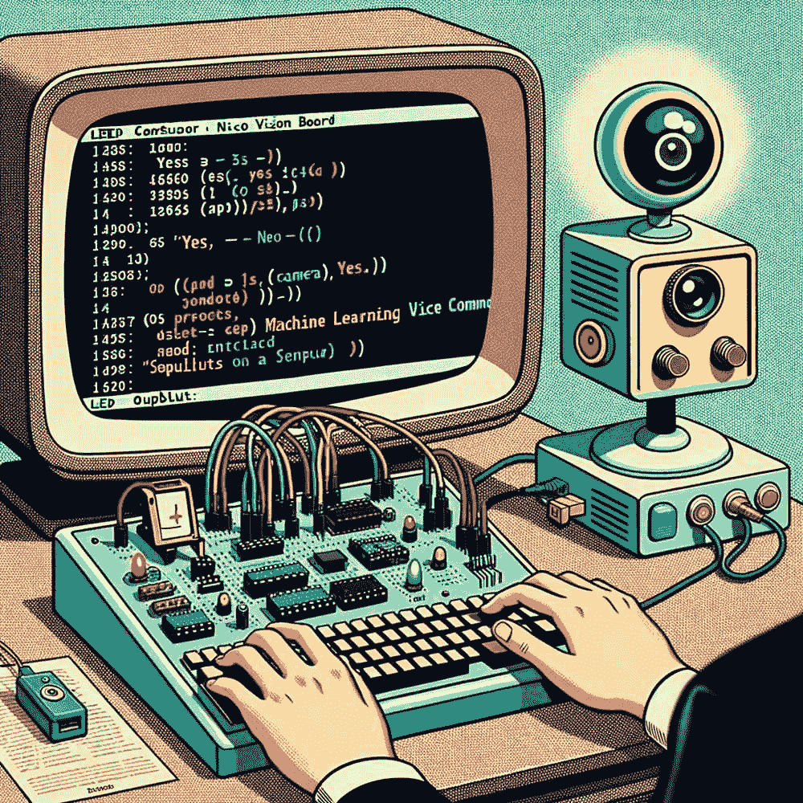

*DALL·E 3 提示：一幅让人联想到 1950 年代卡通的插图，Arduino NICLA VISION 板，配备各种传感器，包括摄像头，是老式桌子上的焦点。在背景中，一个圆角电脑屏幕显示 Arduino IDE。代码与 LED 配置和机器学习语音命令检测相关。在串行监视器上的输出明确显示“是”和“否”的字样。*

## 概述

[Arduino Nicla Vision](https://docs.arduino.cc/hardware/nicla-vision)（有时称为*NiclaV*）是一款包含两个处理器，可以并行运行任务的开发板。它是同一系列开发板的一部分，具有相同的外形，但针对特定任务设计，例如[Nicla Sense ME](https://www.bosch-sensortec.com/software-tools/tools/arduino-nicla-sense-me/)和[Nicla Voice](https://store-usa.arduino.cc/products/nicla-voice?_gl=1*l3abc6*_ga*MTQ3NzE4Mjk4Mi4xNjQwMDIwOTk5*_ga_NEXN8H46L5*MTY5NjM0Mzk1My4xMDIuMS4xNjk2MzQ0MjQ1LjAuMC4w)。*Niclas*可以高效地运行使用 TensorFlow Lite 创建的过程。例如，NiclaV 的一个核心可以实时运行计算机视觉算法（推理）。同时，另一个执行低级操作，如控制电机、通信或作为用户界面。板载无线模块允许同时管理 WiFi 和蓝牙低功耗（BLE）连接。

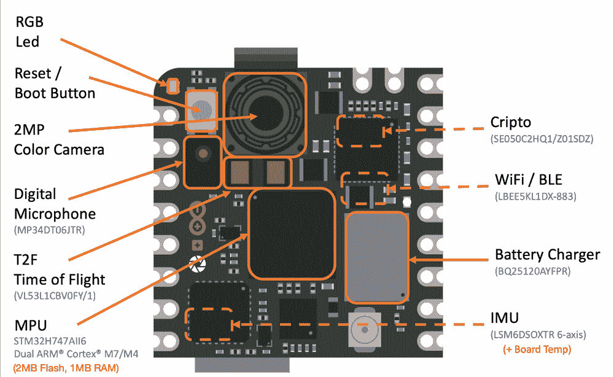

## 硬件

### 两个并行核心

中央处理器是双核[STM32H747](https://content.arduino.cc/assets/Arduino-Portenta-H7_Datasheet_stm32h747xi.pdf?_gl=1*6quciu*_ga*MTQ3NzE4Mjk4Mi4xNjQwMDIwOTk5*_ga_NEXN8H46L5*MTY0NzQ0NTg1My4xMS4xLjE2NDc0NDYzMzkuMA..)，包括一个 480 MHz 的 Cortex M7 和一个 240 MHz 的 Cortex M4。两个核心通过远程过程调用机制进行通信，无缝地允许在另一个处理器上调用函数。两个处理器共享所有片上外设，并且可以运行：

+   在 Arm Mbed OS 上运行的 Arduino 草图

+   本地 Mbed 应用程序

+   通过解释器运行 MicroPython / JavaScript

+   TensorFlow Lite

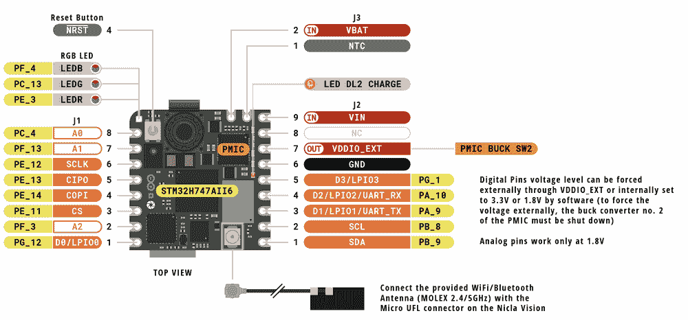

### 内存

内存对于嵌入式机器学习项目至关重要。NiclaV 板可以容纳高达 16 MB 的 QSPI 闪存用于存储。然而，必须考虑的是，用于机器学习推理的是 MCU SRAM；STM32H747 只有 1 MB，由两个处理器共享。此 MCU 还集成了 2 MB 的闪存，主要用于代码存储。

### 传感器

+   **摄像头**：一款 GC2145 2 MP 彩色 CMOS 摄像头。

+   **麦克风**：`MP34DT05`是一款超紧凑、低功耗、全向、数字 MEMS 麦克风，采用电容式传感元件和 IC 接口。

+   **六轴 IMU**：来自`LSM6DSOX` 6 轴 IMU 的 3D 陀螺仪和 3D 加速度计数据。

+   **飞行时间传感器**：`VL53L1CBV0FY`飞行时间传感器为 Nicla Vision 增加了准确和低功耗测距功能。不可见的近红外 VCSEL 激光器（包括模拟驱动器）与接收光学元件一起封装在一个一体化的小型模块中，位于摄像头下方。

## Arduino IDE 安装

开始将板（*微型 USB*）连接到您的计算机：

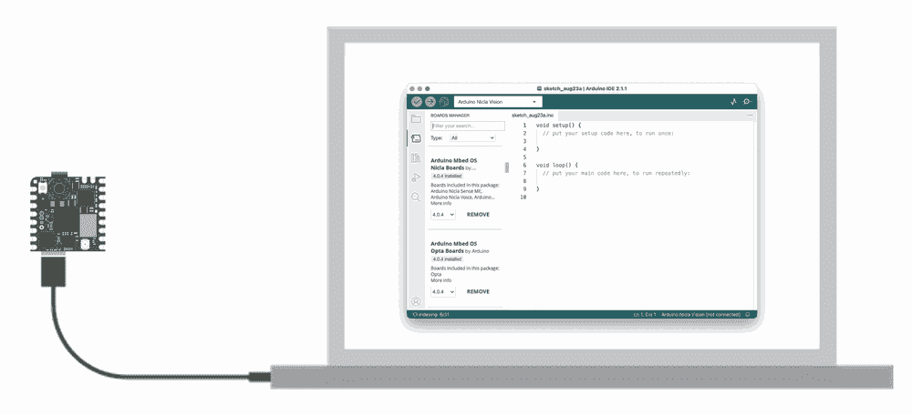

在 Arduino IDE 中安装 Nicla 板的 Mbed OS 核心。打开 IDE 后，导航到`工具 > 板 > 板管理器`，在搜索窗口中查找 Arduino Nicla Vision，并安装该板。

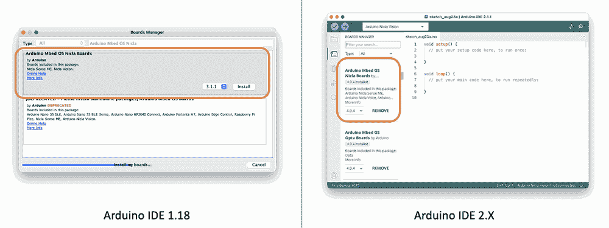

接下来，前往`工具 > 板 > Arduino Mbed OS Nicla Boards`并选择`Arduino Nicla Vision`。将您的板连接到 USB 后，您应该在端口上看到 Nicla 并选择它。

> 在 Examples/Basic 上打开 Blink 草图，并使用 IDE 上传按钮运行它。您应该看到内置 LED（绿色 RGB）闪烁，这意味着 Nicla 板已正确安装并可用！

### 测试麦克风

在 Arduino IDE 中，前往`示例 > PDM > PDMSerialPlotter`，打开它，并运行草图。打开绘图仪，查看麦克风的声音表示：

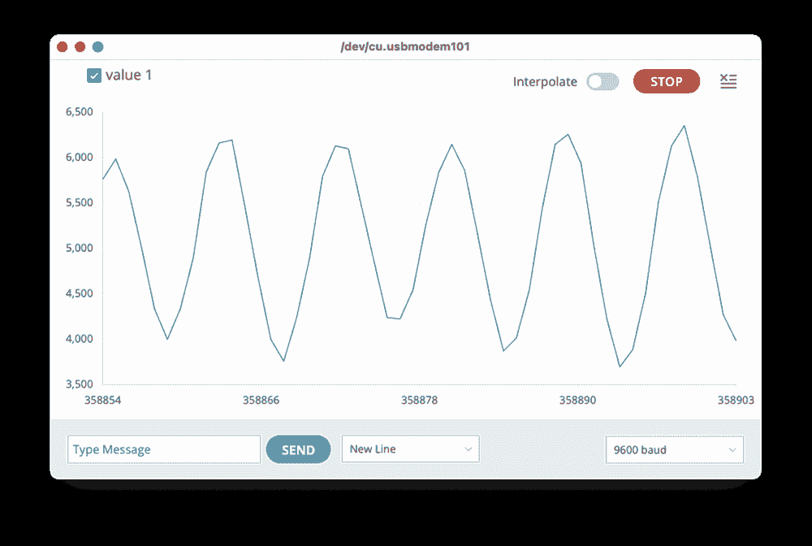

> 改变您生成的声音频率，并确认麦克风是否正常工作。

### 测试 IMU

在测试 IMU 之前，将需要安装 LSM6DSOX 库。为此，前往库管理器并查找 LSM6DSOX。安装 Arduino 提供的库：

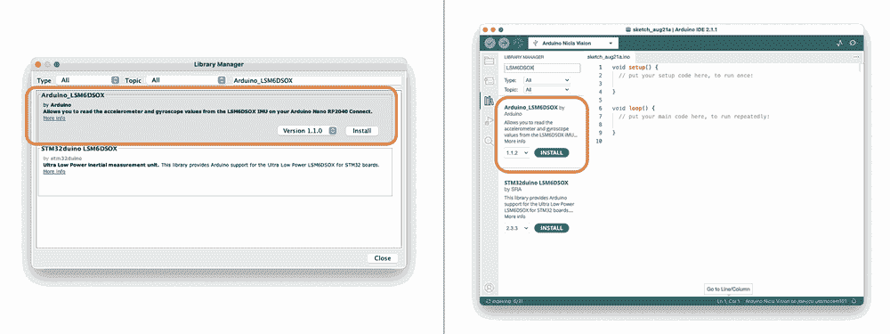

接下来，前往`示例 > Arduino_LSM6DSOX > SimpleAccelerometer`并运行加速度计测试（您也可以运行陀螺仪和板温度）：

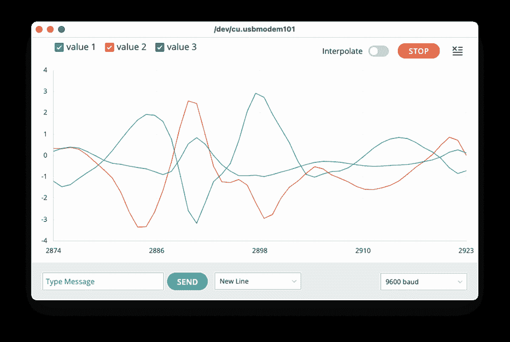

### 测试飞行时间（ToF）传感器

正如我们在 IMU 上所做的那样，安装 VL53L1X ToF 库是必要的。为此，前往库管理器并查找 VL53L1X。安装 Pololu 提供的库：

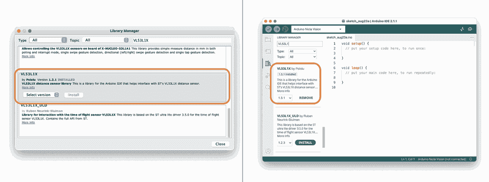

接下来，运行草图[proximity_detection.ino](https://github.com/Mjrovai/Arduino_Nicla_Vision/blob/main/Arduino-IDE/proximity_detection/proximity_detection.ino)：

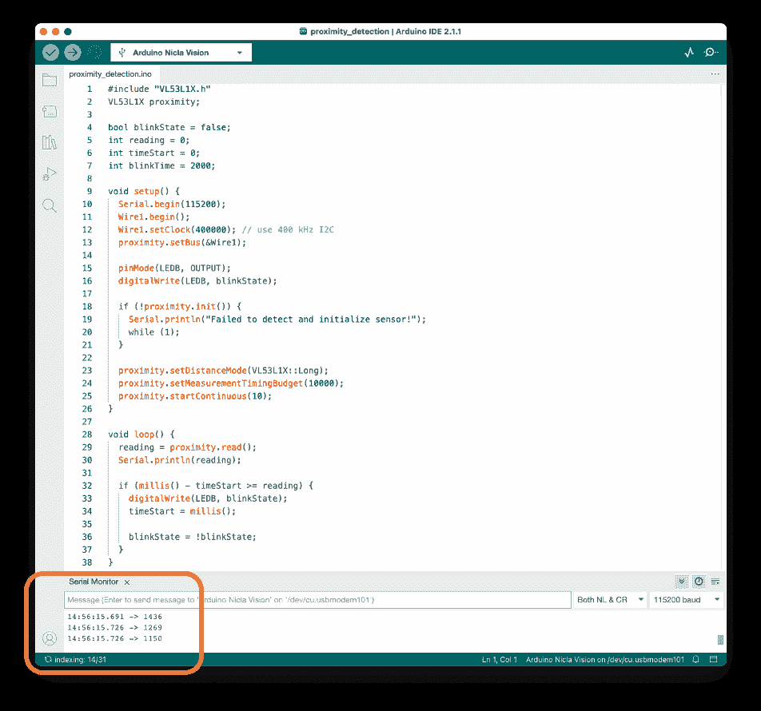

在串行监视器上，您将看到相机与其前方物体之间的距离（最大 4 米）。


### 测试摄像头

我们还可以使用例如`示例 > 摄像头 > CameraCaptureRawBytes`中提供的代码来测试摄像头。我们无法直接看到图像，但我们可以获取由摄像头生成的原始图像数据。

我们可以使用[`Web Serial Camera`](https://labs.arduino.cc/en/labs/web-serial-camera) ([API](https://developer.mozilla.org/en-US/docs/Web/API/Web_Serial_API))来查看由摄像头生成的图像。这个网络应用程序通过 Web Serial 从配备摄像头的 Arduino 板上流式传输摄像头图像。

Web Serial Camera 示例向您展示了如何从 Arduino 板通过电线发送图像数据以及如何在 JavaScript 中解包数据以进行渲染。此外，在 Web 应用程序的[源代码](https://github.com/arduino/ArduinoCore-mbed/tree/main/libraries/Camera/extras/WebSerialCamera)中，我们可以找到一些示例图像过滤器，展示了如何操作像素数据以实现视觉效果。

用于发送相机图像数据的**Arduino 草图**（CameraCaptureWebSerial）可以在[这里](https://github.com/arduino/ArduinoCore-mbed/tree/main/libraries/Camera/examples/CameraCaptureWebSerial)找到，并且也可以在 Arduino IDE 中选择 Nicla 板时直接从“`Examples→Camera`”菜单中获取。

用于显示相机图像的**Web 应用程序**可以通过[这里](https://arduino.github.io/labs-pages/web-serial-camera/)访问。我们还可以查看[这个教程，它更详细地解释了设置过程]。

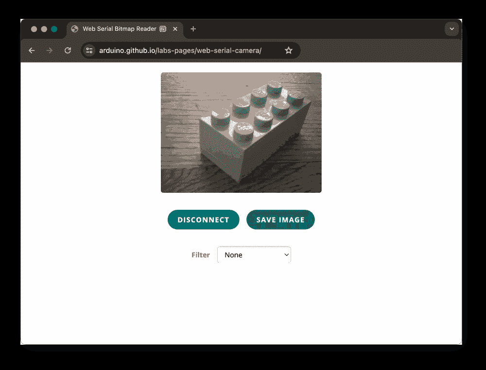

## 安装 OpenMV IDE

OpenMV IDE 是带有 OpenMV 相机的首选集成开发环境，类似于 Nicla Vision。它具有强大的文本编辑器、调试终端和具有直方图显示的帧缓冲区查看器。我们将使用 MicroPython 来编程相机。

前往[OpenMV IDE 页面](https://openmv.io/pages/download)，下载适用于您的操作系统的正确版本，并按照说明在您的计算机上安装。

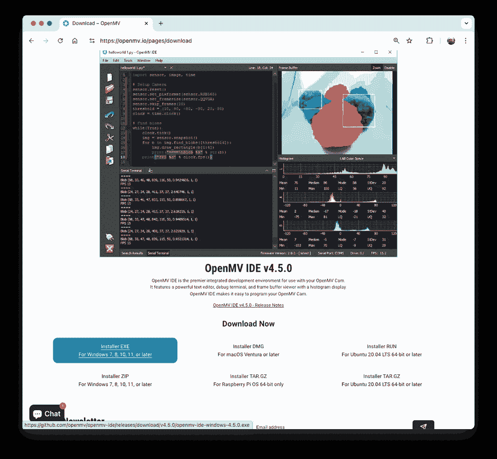

IDE 应该打开，默认在代码区域显示 helloworld_1.py 代码。如果不是，您可以从`Files > Examples > HelloWord > helloword.py`打开它。

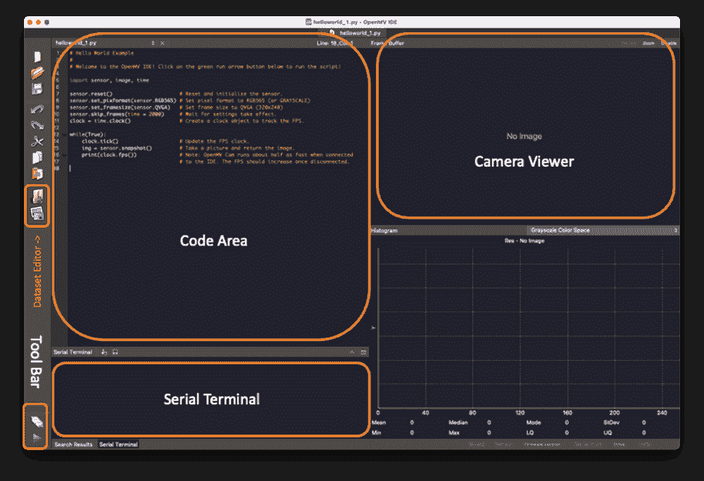

在运行时，通过串行连接（使用 print()或错误信息）发送的任何消息都将显示在**串行终端**上。相机捕获的图像将在**相机查看器**区域（或帧缓冲区）以及在其下方立即的直方图区域显示。

#### 更新引导加载程序

在将 Nicla 连接到 OpenMV IDE 之前，请确保您有最新的引导加载程序版本。转到您的 Arduino IDE，选择 Nicla 板，并在`Examples > STM_32H747_System STM32H747_manageBootloader`中打开草图。将代码上传到您的板子。串行监视器将引导您。

#### 安装固件

**更新引导加载程序后**，通过在板上双击复位按钮将 Nicla Vision 置于引导加载程序模式。内置的绿色 LED 将开始闪烁。现在返回到 OpenMV IDE，并单击连接图标（左侧工具栏）：

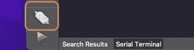

一个弹出窗口将告诉您检测到一个处于 DFU 模式的板子，并询问您希望如何操作。首先，选择“安装最新发布固件（vX.Y.Z）”。此操作将在 Nicla Vision 上安装最新的 OpenMV 固件。

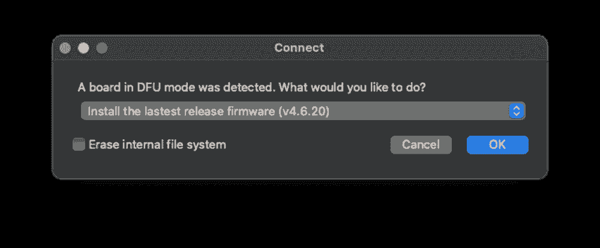

您可以不选择“擦除内部文件系统”选项，然后点击[确定]。

当 Nicla 的绿色 LED 在将 OpenMV 固件上传到板子上时开始闪烁，随后将打开一个终端窗口，显示上传进度。

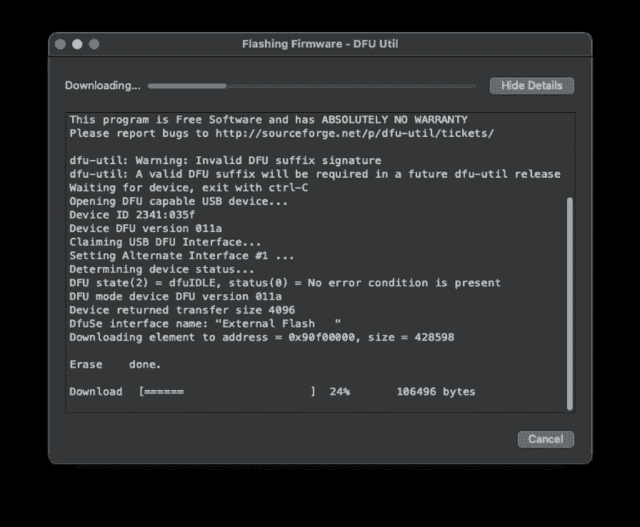

等待绿色 LED 停止闪烁和褪色。当过程结束时，您将看到一个消息说，“DFU 固件更新完成！”。按 `[OK]`。


当 Nicla Vison 连接到工具栏时，会出现一个绿色的播放按钮。


此外，请注意，您的电脑上会出现一个名为“无名称”的驱动器。

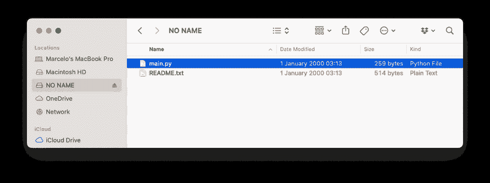

每次您在板上按 `[RESET]` 按钮时，存储在板上的 main.py 脚本将自动执行。您可以在 IDE 上加载 [main.py](https://github.com/Mjrovai/Arduino_Nicla_Vision/blob/main/Micropython/main.py) 代码（`File > Open File...`）。

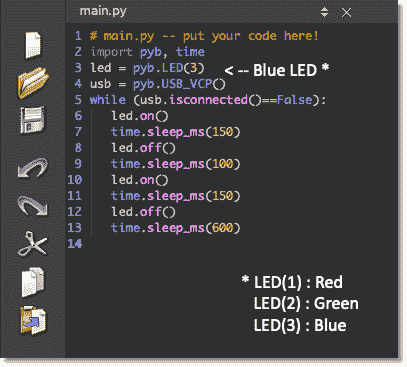

> 这段代码是“闪烁”代码，确认硬件正常。

#### 测试相机

要测试相机，让我们运行 *helloword_1.py*。为此，请选择 `File > Examples > HelloWorld > helloword.py` 中的脚本，

当点击绿色播放按钮时，代码区域中的 MicroPython 脚本 (*helloworld.py*) 将被上传并运行在 Nicla Vision 上。在相机查看器中，您将开始看到视频流。串行监视器将显示 FPS（每秒帧数），大约为 27fps。

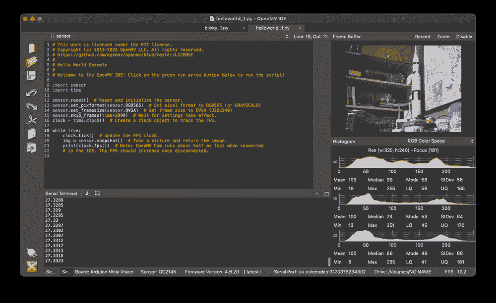

这里是 `helloworld.py` 脚本：

```py
import sensor, time

sensor.reset()                      # Reset and initialize
                                    # the sensor.
sensor.set_pixformat(sensor.RGB565) # Set pixel format to RGB565
                                    # (or GRAYSCALE)
sensor.set_framesize(sensor.QVGA)   # Set frame size to
                                    # QVGA (320x240)
sensor.skip_frames(time = 2000)     # Wait for settings take
                                    # effect.
clock = time.clock()                # Create a clock object
                                    # to track the FPS.

while(True):
    clock.tick()                    # Update the FPS clock.
    img = sensor.snapshot()         # Take a picture and return
                                    # the image.
    print(clock.fps())
```

在 [GitHub](https://github.com/Mjrovai/Arduino_Nicla_Vision) 中，您可以找到这里使用的 Python 脚本。

代码可以分为两部分：

+   **设置**：在这里导入库，初始化，定义和初始化变量。

+   **循环**：（while 循环）代码的一部分，会持续运行。图像 (*img* 变量) 被捕获（一帧）。这些帧中的每一帧都可以用于机器学习应用中的推理。

要中断程序执行，请按红色 `[X]` 按钮。

> 注意：当连接到 IDE 时，OpenMV Cam 的运行速度大约减半。断开连接后，FPS 应该会增加。

在 [GitHub](https://github.com/Mjrovai/Arduino_Nicla_Vision/tree/main/Micropython) 中，您可以找到其他 Python 脚本。尝试测试板载传感器。

## 将 Nicla Vision 连接到 Edge Impulse Studio

我们将在其他实验室的后期需要 Edge Impulse Studio。 [Edge Impulse](https://www.edgeimpulse.com/) 是边缘设备上机器学习的主要开发平台。

Edge Impulse 正式支持 Nicla Vision。因此，为了开始，请在 Studio 上创建一个新项目并将其连接到它。为此，请按照以下步骤操作：

+   下载适用于您特定计算机架构的 [Arduino CLI](https://arduino.github.io/arduino-cli/1.2/installation/)。

+   下载最新的 [EI 固件](https://cdn.edgeimpulse.com/firmware/arduino-nicla-vision.zip)。

+   解压两个文件，并将所有文件放在同一个文件夹中。

+   将 Nicla-Vision 置于启动模式，按重置按钮两次。

+   运行对应您操作系统的上传器（EI FW）：

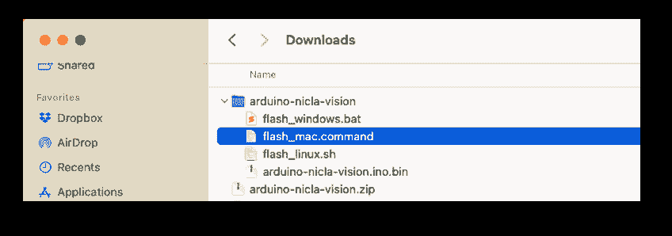

+   执行您操作系统特定的批处理代码会将二进制文件 *arduino-nicla-vision.bin* 上传到您的板子上。

> 使用 `Chrome`，可以通过 WebUSB 将 Nicla 连接到 EI Studio。**不需要 EI CLI**。

前往 Studio 上的项目，在“数据采集”选项卡中，选择`WebUSB`（1）。会出现一个窗口；选择显示“Nicla 已配对”（2）的选项，然后按 `[连接]`（3）。

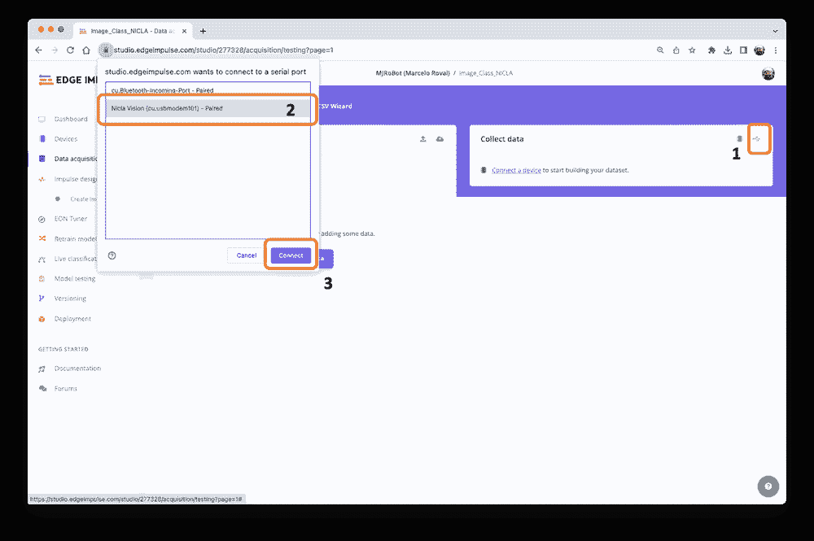

您可以在“数据采集”选项卡上的“收集数据”部分选择要选择哪些传感器数据。

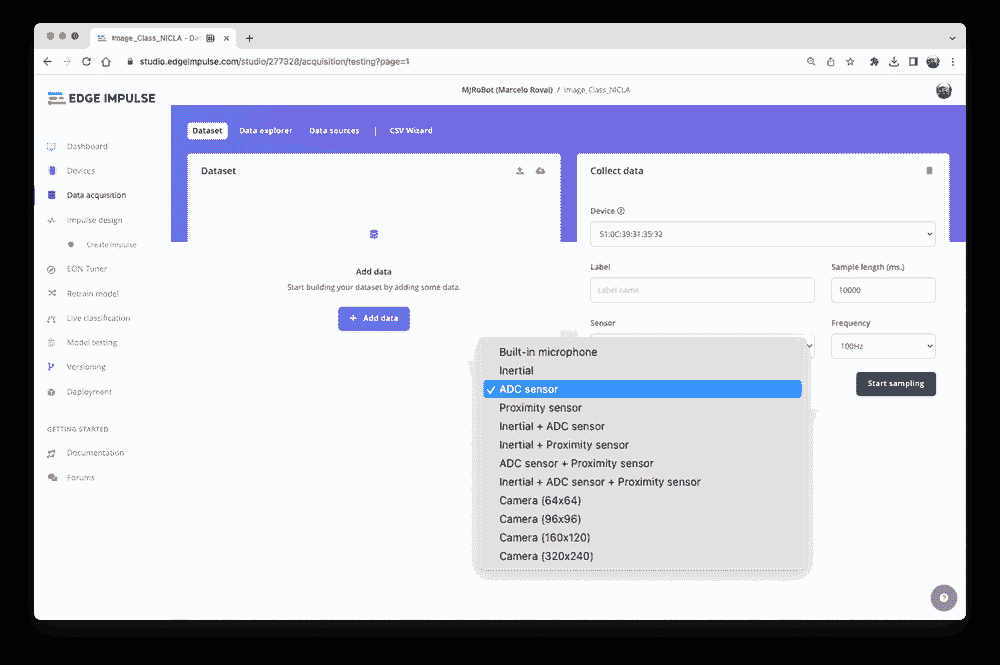

例如，`IMU 数据（惯性）`：

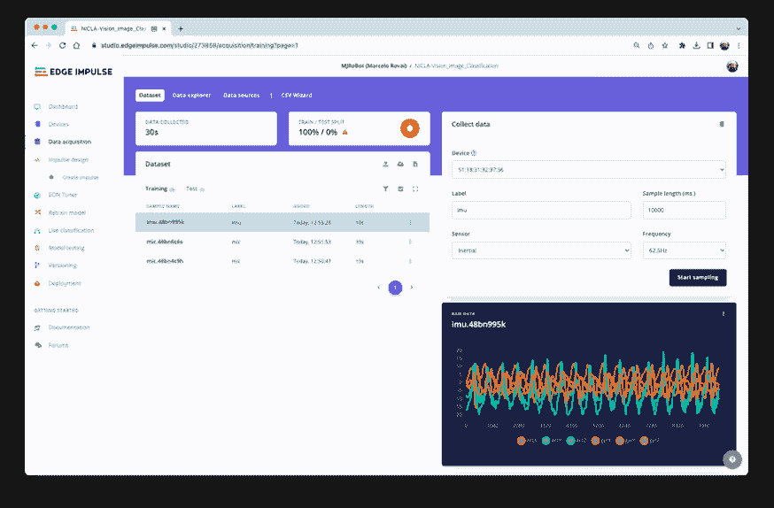

或图像（`相机`）：


您还可以测试连接到 `ADC`（Nicla 引脚 0）的外部传感器以及板载的其他传感器，例如内置麦克风、`ToF（接近）`或传感器组合（`融合`）。

## 扩展 Nicla 视觉板（可选）

最后一个要探索的项目是，在原型设计过程中，有时实验外部传感器和设备是至关重要的。Arduino MKR 连接器载体（Grove 兼容）是 Nicla 的一个优秀扩展。[Arduino MKR 连接器载体（Grove 兼容）](https://store-usa.arduino.cc/products/arduino-mkr-connector-carrier-grove-compatible)。

该盾牌有 14 个 Grove 连接器：五个单通道模拟输入（A0-A5）、一个双通道模拟输入（A5/A6）、五个单通道数字 I/O（D0-D4）、一个双通道数字 I/O（D5/D6）、一个 I2C（TWI）和一个 UART（串行）。所有连接器均兼容 5V。

> 注意，所有 17 个 Nicla 视觉引脚都将连接到盾牌 Grove，但某些 Grove 连接保持未连接。

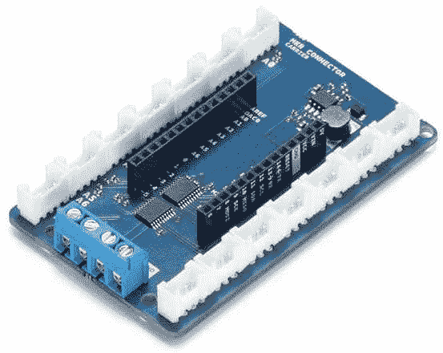

此盾牌与 MKR 兼容，并可配合 Nicla 视觉和 Portenta 使用。

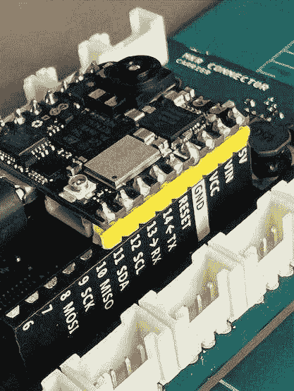

例如，假设在一个 TinyML 项目中，您想使用 LoRaWAN 设备发送推理结果并添加有关本地亮度的信息。通常，在离线操作中，建议使用本地低功耗显示屏，如 OLED。此设置如下所示：

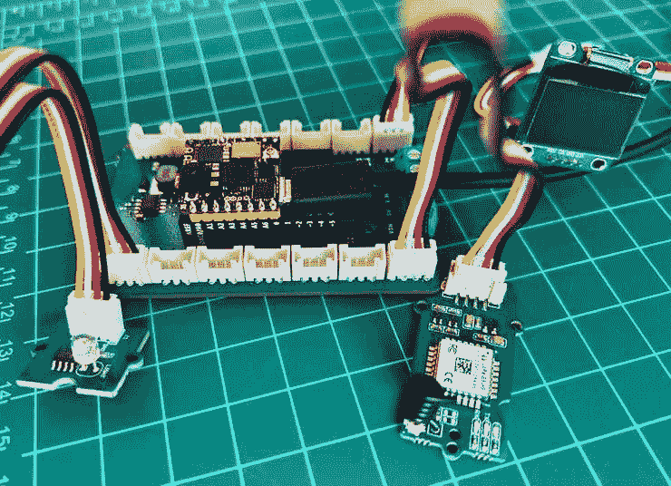

[Grove 光传感器](https://wiki.seeedstudio.com/Grove-Light_Sensor/)将连接到单个模拟引脚之一（A0/PC4），[LoRaWAN 设备](https://wiki.seeedstudio.com/Grove_LoRa_E5_New_Version/)连接到 UART，[OLED](https://wiki.seeedstudio.com/Grove-OLED-Display-0.96-SSD1315/)连接到 I2C 连接器。

Nicla 引脚 3（Tx）和 4（Rx）与串行盾牌连接器相连。UART 通信用于 LoRaWan 设备。以下是一个简单的 UART 代码示例：

```py
# UART Test - By: marcelo_rovai - Sat Sep 23 2023

import time
from pyb import UART
from pyb import LED

redLED = LED(1) # built-in red LED

# Init UART object.
# Nicla Vision's UART (TX/RX pins) is on "LP1"
uart = UART("LP1", 9600)

while(True):
    uart.write("Hello World!\r\n")
    redLED.toggle()
    time.sleep_ms(1000)
```

为了验证 UART 是否正常工作，例如，您可以将另一个设备作为 Arduino UNO 连接，在串行监视器上显示“Hello Word”。以下是[代码](https://github.com/Mjrovai/Arduino_Nicla_Vision/blob/main/Arduino-IDE/teste_uart_UNO/teste_uart_UNO.ino)。

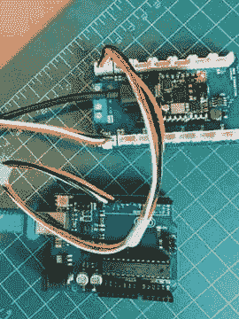

下面是用于 I2C OLED 的 *Hello World 代码*。由 Adafruit 创建的 MicroPython SSD1306 OLED 驱动程序（ssd1306.py）也应上传到 Nicla（ssd1306.py 脚本可在 [GitHub](https://github.com/Mjrovai/Arduino_Nicla_Vision/blob/main/Micropython/ssd1306.py) 中找到）。

```py
# Nicla_OLED_Hello_World - By: marcelo_rovai - Sat Sep 30 2023

#Save on device: MicroPython SSD1306 OLED driver,
# I2C and SPI interfaces created by Adafruit
import ssd1306

from machine import I2C
i2c = I2C(1)

oled_width = 128
oled_height = 64
oled = ssd1306.SSD1306_I2C(oled_width, oled_height, i2c)

oled.text('Hello, World', 10, 10)
oled.show()
```

最后，这是一个简单的脚本，用于读取引脚“PC4”上的 ADC 值（Nicla 引脚 A0）：

```py

# Light Sensor (A0) - By: marcelo_rovai - Wed Oct 4 2023

import pyb
from time import sleep

adc = pyb.ADC(pyb.Pin("PC4"))   # create an analog object
                                # from a pin
val = adc.read()                # read an analog value

while (True):

    val = adc.read()
    print ("Light={}".format (val))
    sleep (1)
```

ADC 可以用于其他传感器变量，例如 [温度](https://wiki.seeedstudio.com/Grove-Temperature_Sensor_V1.2/)。

> 注意，上述脚本（[从 Github 下载](https://github.com/Mjrovai/Arduino_Nicla_Vision/tree/main/Micropython)）仅介绍了如何使用 MicroPython 将外部设备与 Nicla Vision 板连接。

## 摘要

Arduino Nicla Vision 是工业和专业人士使用的优秀 *小型设备*！然而，它功能强大、值得信赖、功耗低，并且具有适合最常见嵌入式机器学习应用（如视觉、运动、传感器融合和声音）的合适传感器。

> 在 [GitHub 仓库](https://github.com/Mjrovai/Arduino_Nicla_Vision/tree/main) 中，你可以找到本动手实验室中使用的或注释的所有代码的最新版本。

## 资源

+   [MicroPython 代码](https://github.com/Mjrovai/Arduino_Nicla_Vision/tree/main/Micropython)

+   [Arduino 代码](https://github.com/Mjrovai/Arduino_Nicla_Vision/tree/main/Arduino-IDE)
