# 图像分类


*DALL·E 3 提示：1950 年代风格的卡通，展示一个紧凑的电子设备，摄像头模块放置在木桌上。屏幕显示一侧是蓝色机器人，另一侧是绿色佩里基托。设备上的 LED 灯指示分类，而穿着复古服装的人物带着兴趣观察。*

## 概述

当我们开始研究嵌入式机器学习或 TinyML 时，不可能忽视计算机视觉（CV）和人工智能（AI）在我们生活中的变革性影响。这两个相互交织的学科重新定义了机器可以感知和完成的事情，从自动驾驶汽车和机器人技术到医疗保健和监控。

越来越多，我们面临着一场人工智能（AI）革命，正如 Gartner 所说，**边缘 AI**具有非常高的潜在影响，**目前确实是如此**！


雷达的“靶心”是*边缘计算机视觉*，当我们谈论应用于视觉的机器学习（ML）时，首先想到的是**图像分类**，这是一种机器学习“Hello World”!

本实验室将探索一个利用卷积神经网络（CNNs）进行实时图像分类的计算机视觉项目。利用 TensorFlow 强大的生态系统，我们将实现一个预训练的 MobileNet 模型，并适应边缘部署。重点是优化模型，使其在资源受限的硬件上高效运行，同时不牺牲准确性。

我们将采用量化修剪等技术来降低计算负载。在本教程结束时，你将拥有一个可以实时分类图像的工作原型，所有这些都在基于 Arduino Nicla Vision 板的低功耗嵌入式系统上运行。

## 计算机视觉

在其核心，计算机视觉使机器能够根据来自世界视觉数据做出解释和决策，本质上模仿了人类视觉系统的能力。相反，人工智能是一个更广泛的领域，包括机器学习、自然语言处理和机器人技术等其他技术。当你将人工智能算法引入计算机视觉项目时，你将极大地增强系统理解、解释和反应视觉刺激的能力。

当讨论应用于嵌入式设备的计算机视觉项目时，最常见到的应用是*图像分类*和*目标检测*。

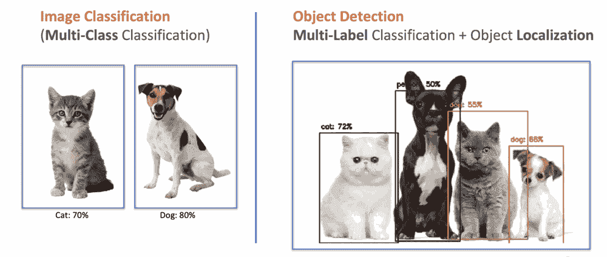

这两种模型都可以在 Arduino Nicla Vision 等小型设备上实现，并用于实际项目。在本章中，我们将涵盖图像分类。

## 图像分类项目目标

任何机器学习项目的第一步是定义目标。在这种情况下，目标是检测和分类一张图像中存在的两个特定物体。对于这个项目，我们将使用两个小玩具：一个机器人和一只小型巴西鹦鹉（名为佩里基托）。我们还将收集一些背景图像，其中这两个物体不存在。

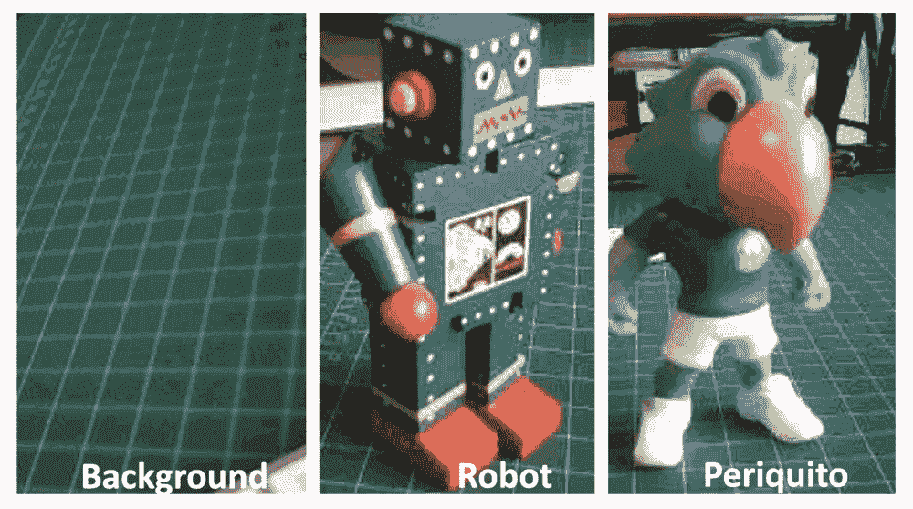

## 数据收集

一旦我们定义了机器学习项目的目标，下一步也是最重要的一步是收集数据集。对于图像捕获，我们可以使用：

+   网络串行摄像头工具，

+   Edge Impulse Studio，

+   OpenMV IDE，

+   一部智能手机。

在这里，我们将使用**OpenMV IDE**。

### 使用 OpenMV IDE 收集数据集

首先，我们应该在电脑上创建一个文件夹来保存数据，例如，“data。”接下来，在 OpenMV IDE 中，我们转到`工具 > 数据集编辑器`并选择`新建数据集`以开始数据集收集：

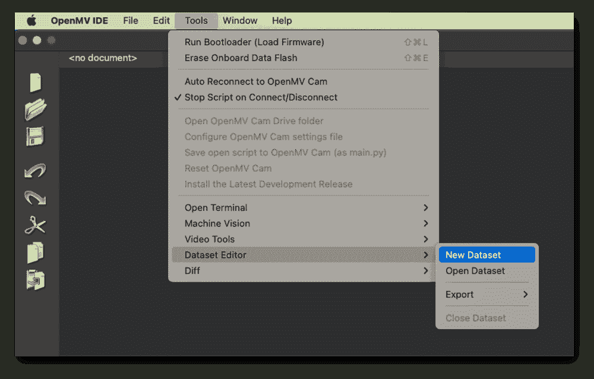

IDE 将要求我们打开保存数据的文件。选择创建的“data”文件夹。注意，左侧面板上会出现新的图标。


使用上面的图标（1），输入第一个类别的名称，例如，“periquito”：

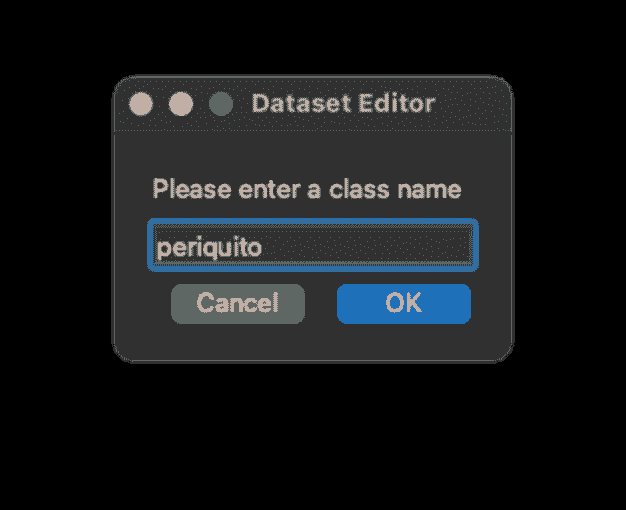

运行`dataset_capture_script.py`并点击相机图标（2）将开始捕获图像：

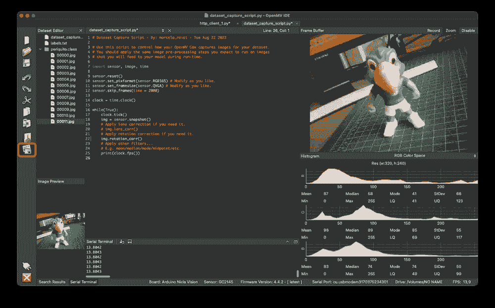

对其他类别重复相同的步骤。

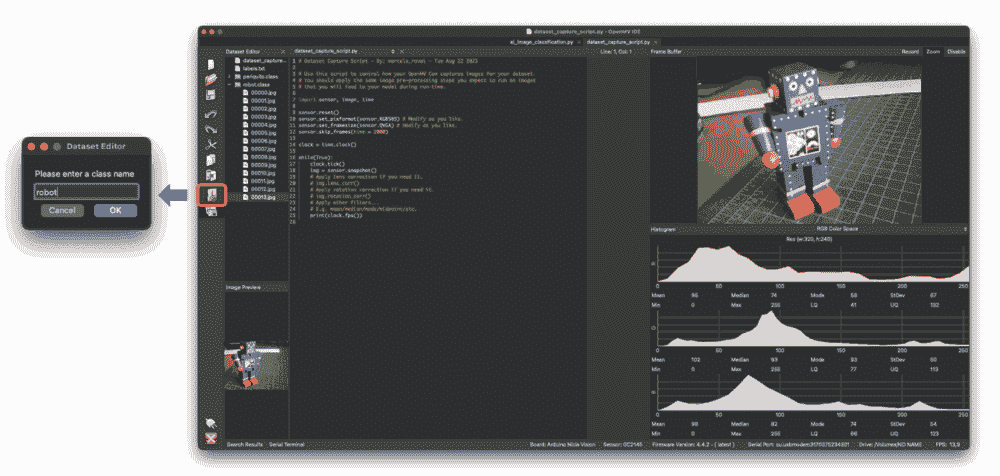

> 我们建议每个类别大约有 50 到 60 张图片。尽量捕捉不同的角度、背景和光照条件。

存储的图像使用 QVGA 帧大小<semantics><mrow><mn>320</mn><mo>×</mo><mn>240</mn></mrow><annotation encoding="application/x-tex">320\times 240</annotation></semantics>和 RGB565（颜色像素格式）。

在收集完数据集后，关闭“工具 > 数据集编辑器”中的数据集编辑器工具。

我们最终会在电脑上得到一个包含三个类别的数据集：**periquito**、**robot**和**background**。

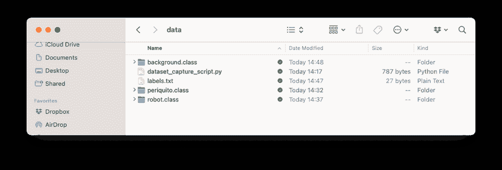

我们应该回到**Edge Impulse Studio**并上传数据集到我们创建的项目。

## 使用 Edge Impulse Studio 训练模型

我们将使用 Edge Impulse Studio 来训练我们的模型。输入账户凭证并创建一个新项目：

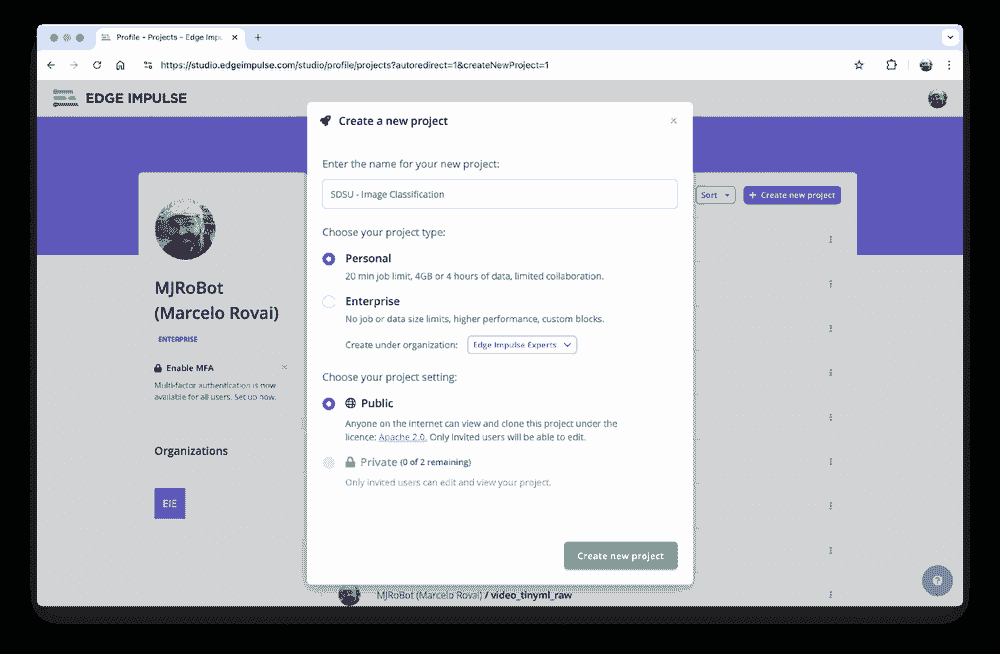

> 这里，您可以克隆一个类似的项目：[NICLA-Vision_Image_Classification](https://studio.edgeimpulse.com/public/273858/latest)。

## 数据集

使用 EI Studio（或**Studio**），我们将完成四个主要步骤，使我们的模型准备好在 Nicla Vision 板上使用：数据集、脉冲、测试和部署（在本例中，是 NiclaV 边缘设备上的部署）。

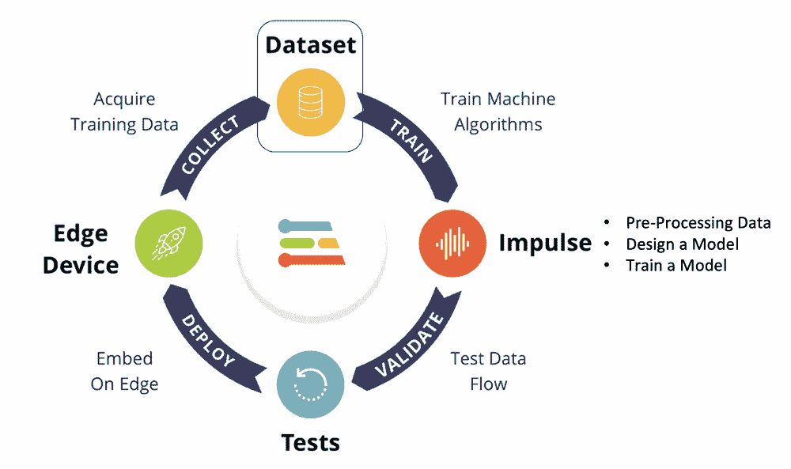

关于数据集，必须指出的是，我们使用 OpenMV IDE 捕获的原始数据集将被分为**训练集**、**验证集**和**测试集**。测试集将从一开始就保留，仅用于训练后的测试阶段。验证集将在训练过程中使用。

> EI Studio 将使用一定比例的训练数据用于验证。

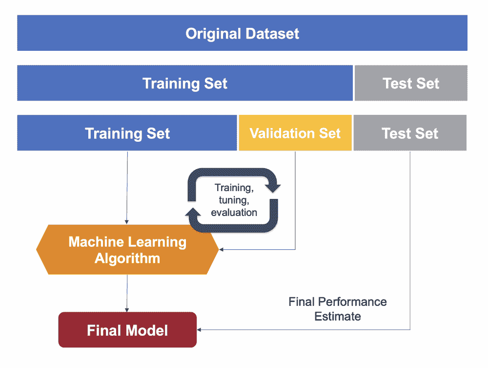

在 Studio 上，转到“数据采集”标签，在“上传数据”部分，从您的电脑上传所选类别的文件：

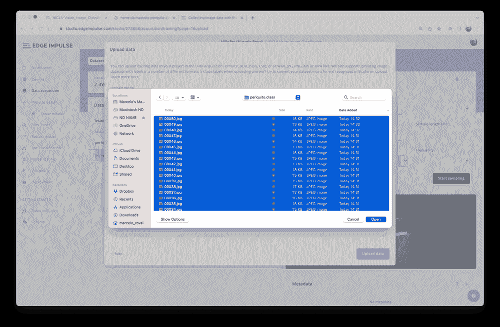

将原始数据集拆分为*训练和测试*的任务留给工作室，并选择关于该特定数据的标签：

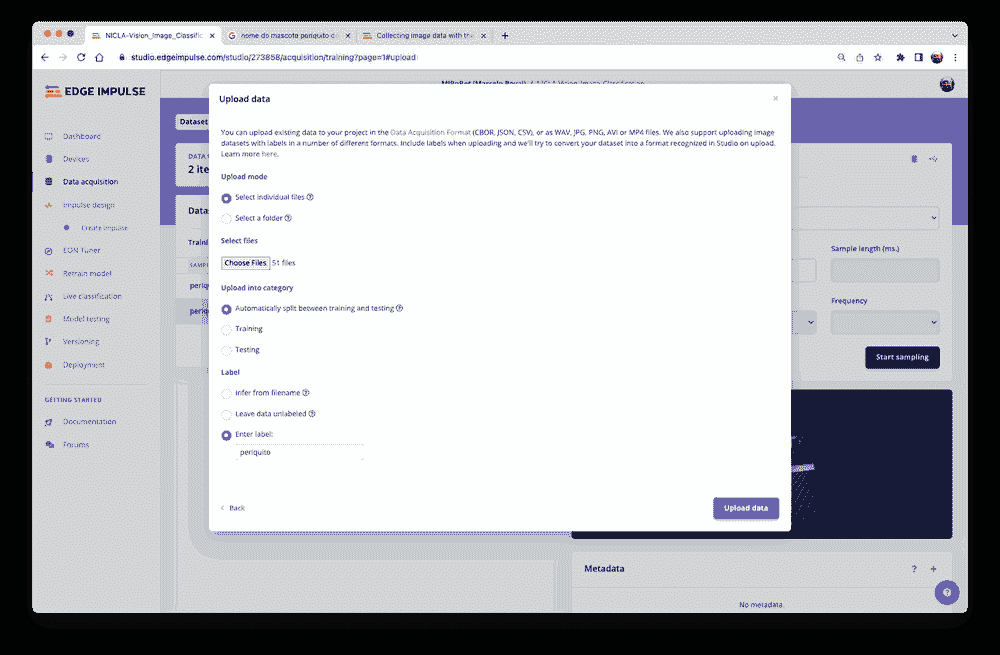

对所有三个类别重复此过程。

> 选择一个文件夹并一次性上传所有文件是可能的。

最后，你应该在工作室中看到你的“原始数据”：

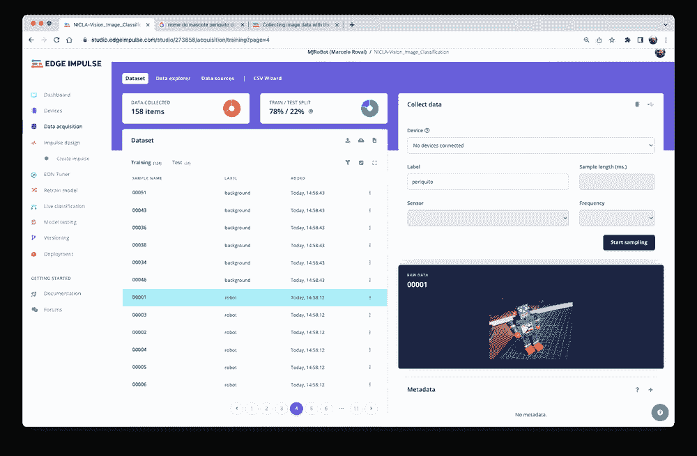

注意，当你开始上传数据时，可能会出现一个弹出窗口，询问你是否在构建一个目标检测项目。选择 `[NO]`。

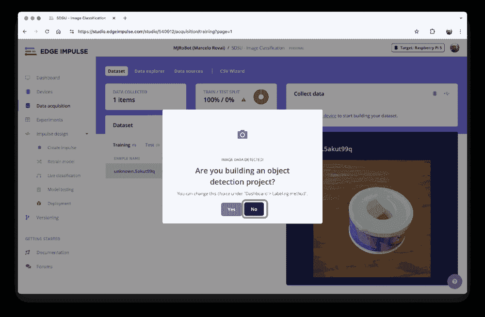

我们可以在仪表板部分进行更改：`每个数据项一个标签`（图像分类）：

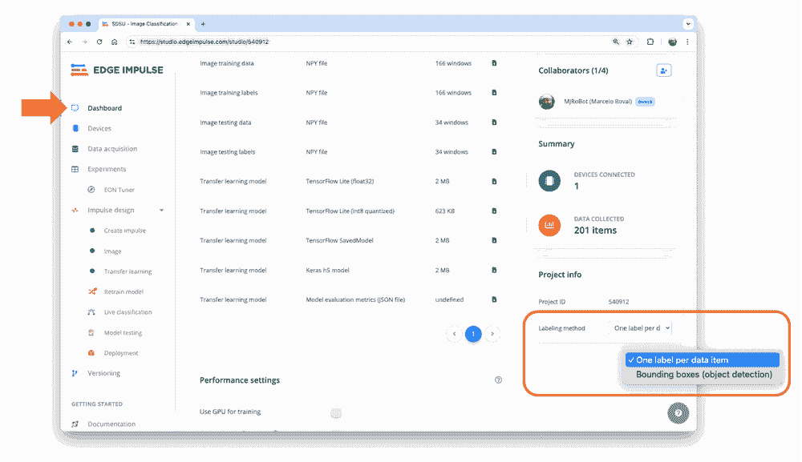

可选地，工作室允许我们探索数据，展示项目中所有数据的完整视图。我们可以通过点击单个数据项来清除、检查或更改标签。在我们的案例中，数据看起来是好的。

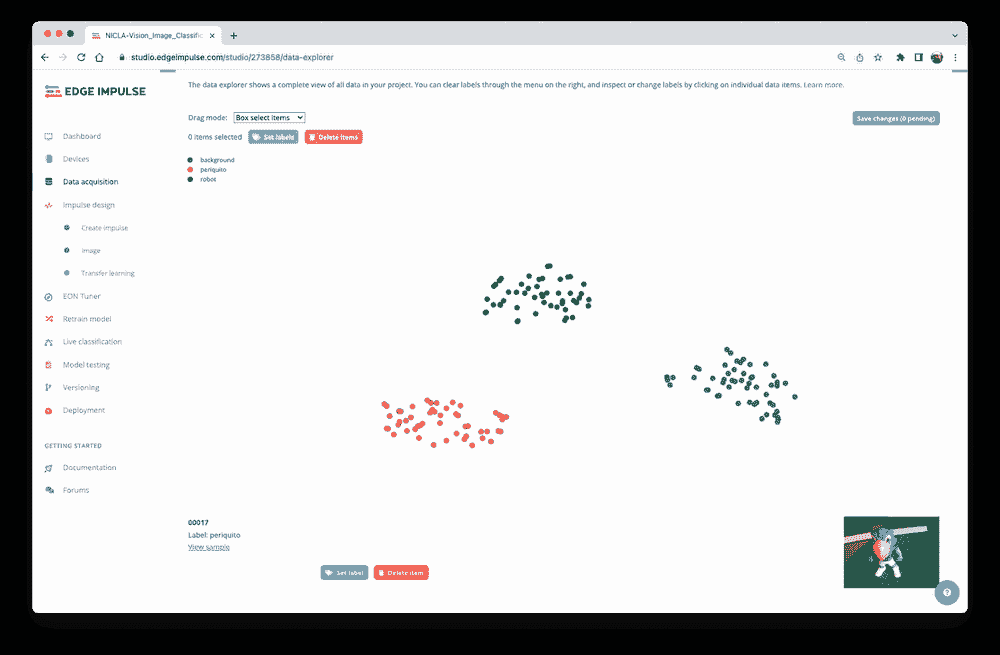

## 冲击设计

在这个阶段，我们应该定义如何：

+   预处理我们的数据，这包括调整单个图像的大小和确定要使用的`颜色深度`（无论是 RGB 还是灰度），

+   指定一个模型，在这种情况下，它将是`迁移学习（图像）`，以在我们的数据上微调预训练的 MobileNet V2 图像分类模型。这种方法即使在相对较小的图像数据集（在我们的案例中约为 150 张图像）中也表现良好。

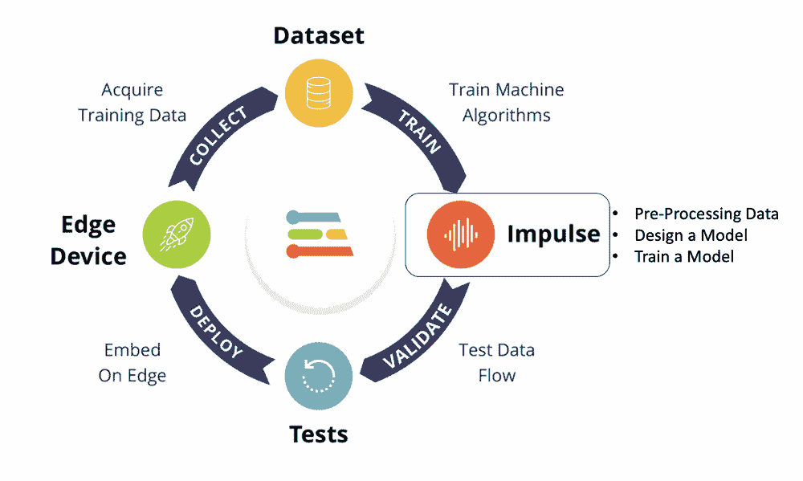

使用 MobileNet 进行迁移学习提供了一种简化的模型训练方法，这对于资源受限的环境和具有有限标记数据的 projekty 特别有益。MobileNet 以其轻量级架构而闻名，是一个已经从大型数据集（ImageNet）中学习到有价值特征的预训练模型。

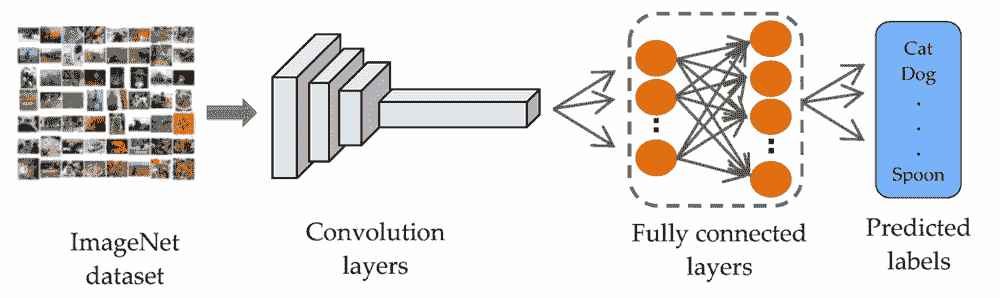

通过利用这些学习到的特征，您可以使用更少的数据和计算资源来训练针对特定任务的新模型，同时仍然达到有竞争力的准确性。

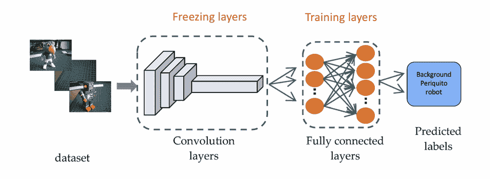

这种方法显著减少了训练时间和计算成本，使其非常适合快速原型设计和在效率至关重要的嵌入式设备上的部署。

转到冲击设计选项卡并创建*冲击*，定义图像大小为 96x96，并压缩它们（方形形式，无需裁剪）。选择图像和迁移学习模块。保存冲击。

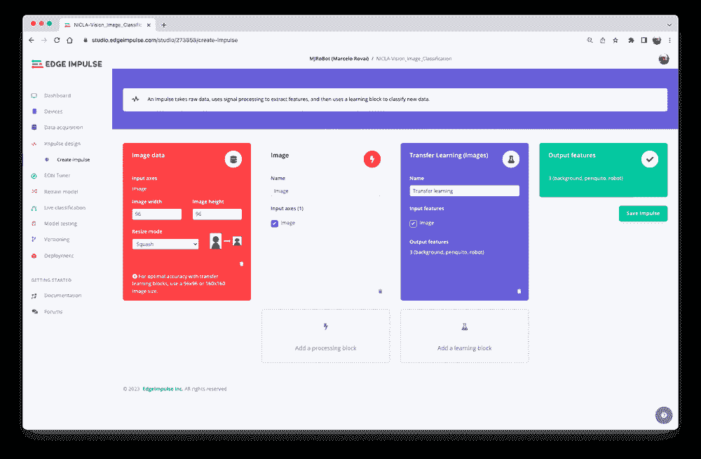

### 图像预处理

所有输入 QVGA/RGB565 图像都将转换为 27,640 个特征 <semantics><mrow><mo stretchy="true" form="prefix">(</mo><mn>96</mn><mo>×</mo><mn>96</mn><mo>×</mo><mn>3</mn><mo stretchy="true" form="postfix">)</mo></mrow><annotation encoding="application/x-tex">(96\times 96\times 3)</annotation></semantics>。

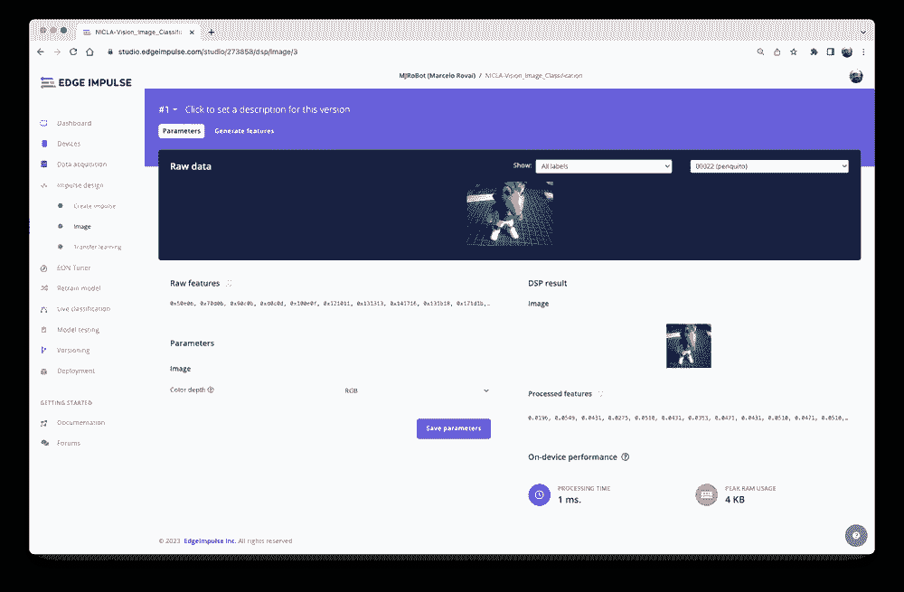

点击 `[保存参数]` 并生成所有特征：

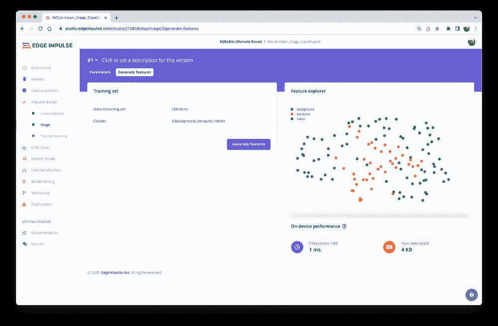

### 模型设计

在 2007 年，谷歌推出了 [MobileNetV1](https://research.googleblog.com/2017/06/mobilenets-open-source-models-for.html)，这是一系列通用计算机视觉神经网络，旨在考虑移动设备，以支持分类、检测等功能。MobileNets 是小型、低延迟、低功耗的模型，参数化以满足各种用例的资源限制。2018 年，谷歌发布了 [MobileNetV2: Inverted Residuals and Linear Bottlenecks](https://arxiv.org/abs/1801.04381)。

MobileNet V1 和 MobileNet V2 致力于移动效率和嵌入式视觉应用，但在架构复杂性和性能方面有所不同。虽然两者都使用深度可分离卷积来降低计算成本，但 MobileNet V2 引入了倒残差块和线性瓶颈来提升性能。这些新特性使得 V2 能够使用更少的参数捕捉更复杂的特征，使其在计算上更加高效，并且通常比其前身更准确。此外，V2 在中间扩展层使用了非线性激活函数。它仍然使用线性激活函数来处理瓶颈层，这种设计选择被发现可以通过网络保留重要信息。MobileNet V2 提供了一种优化的架构，以实现更高的准确性和效率，并将被用于本项目。

尽管基础 MobileNet 架构已经非常小巧且具有低延迟，但很多时候，特定的用例或应用可能需要模型更加小巧和快速。MobileNets 引入了一个简单的参数 <semantics><mi>α</mi><annotation encoding="application/x-tex">\alpha</annotation></semantics>（alpha），称为宽度乘数，用于构建这些更小、计算成本更低的模型。宽度乘数 <semantics><mi>α</mi><annotation encoding="application/x-tex">\alpha</annotation></semantics> 的作用是在每一层均匀地细化网络。

Edge Impulse Studio 可以使用 MobileNetV1 (<semantics><mrow><mn>96</mn><mo>×</mo><mn>96</mn></mrow><annotation encoding="application/x-tex">96\times 96</annotation></semantics>图像) 和 V2 (<semantics><mrow><mn>96</mn><mo>×</mo><mn>96</mn></mrow><annotation encoding="application/x-tex">96\times 96</annotation></semantics>或<semantics><mrow><mn>160</mn><mo>×</mo><mn>160</mn></mrow><annotation encoding="application/x-tex">160\times 160</annotation></semantics>图像)，以及几个不同的**<semantics><mi>α</mi><annotation encoding="application/x-tex">\alpha</annotation></semantics>**值（从 0.05 到 1.0）。例如，使用 V2，<semantics><mrow><mn>160</mn><mo>×</mo><mn>160</mn></mrow><annotation encoding="application/x-tex">160\times 160</annotation></semantics>图像，并且<semantics><mrow><mi>α</mi><mo>=</mo><mn>1.0</mn></mrow><annotation encoding="application/x-tex">\alpha=1.0</annotation></semantics>，你可以获得最高的准确率。当然，这里有一个权衡。准确率越高，运行模型所需的内存（大约 1.3 MB RAM 和 2.6 MB ROM）就越多，这意味着更大的延迟。在另一个极端，使用 MobileNetV1 和<semantics><mrow><mi>α</mi><mo>=</mo><mn>0.10</mn></mrow><annotation encoding="application/x-tex">\alpha=0.10</annotation></semantics>（大约 53.2 K RAM 和 101 K ROM）可以获得更小的内存占用。

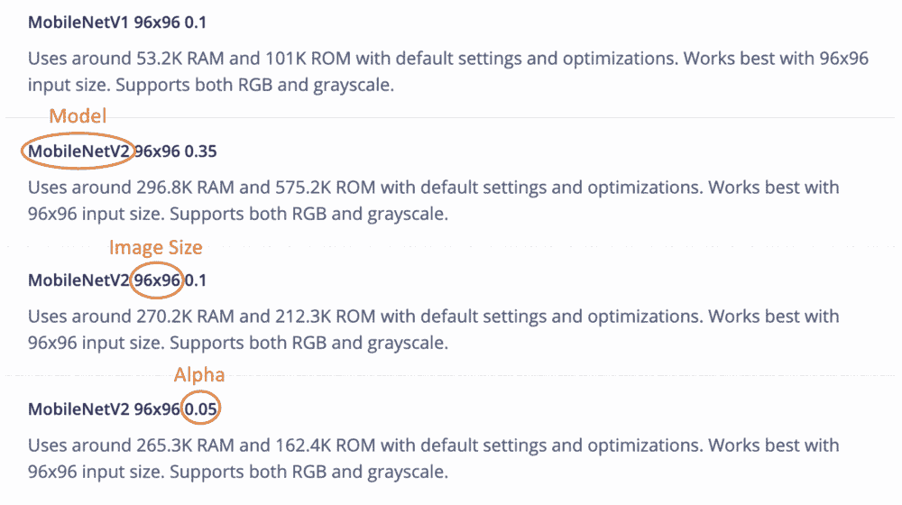

我们将使用**MobileNetV2 96x96 0.1**（**或 0.05**）进行此项目，预计内存占用为 265.3 KB。此模型对于具有 1MB SRAM 的 Nicla Vision 来说应该是合适的。在迁移学习选项卡上选择此模型：


## 模型训练

与深度学习结合使用的另一个有价值的技术是**数据增强**。数据增强是一种通过创建额外的合成数据来提高机器学习模型准确率的方法。数据增强系统在训练过程中对您的训练数据进行小的、随机的更改（例如翻转、裁剪或旋转图像）。

查看内部结构，这里你可以看到 Edge Impulse 是如何在您的数据上实施数据增强策略的：

```py
# Implements the data augmentation policy
def augment_image(image, label):
    # Flips the image randomly
    image = tf.image.random_flip_left_right(image)

    # Increase the image size, then randomly crop it down to
    # the original dimensions
    resize_factor = random.uniform(1, 1.2)
    new_height = math.floor(resize_factor * INPUT_SHAPE[0])
    new_width = math.floor(resize_factor * INPUT_SHAPE[1])
    image = tf.image.resize_with_crop_or_pad(image, new_height,
                                             new_width)
    image = tf.image.random_crop(image, size=INPUT_SHAPE)

    # Vary the brightness of the image
    image = tf.image.random_brightness(image, max_delta=0.2)

    return image, label
```

在训练过程中接触这些变化可以帮助你的模型避免通过“记忆”训练数据中的表面线索来走捷径，这意味着它可能更好地反映数据集中的深层潜在模式。

我们模型的最后一层将有 12 个神经元，并使用 15%的 dropout 来防止过拟合。以下是训练结果：

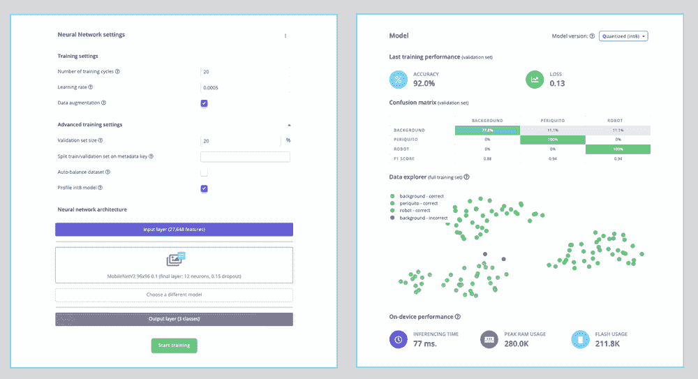

结果非常出色，延迟仅为 77 ms（估计），这意味着在推理过程中应该大约有 13 fps（每秒帧数）。

## 模型测试

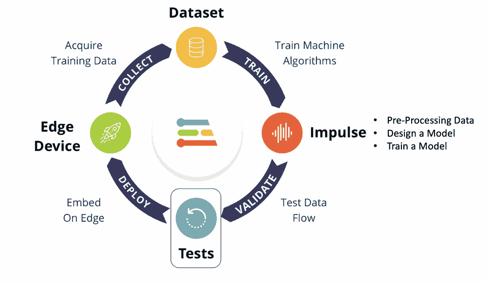

现在，我们应该使用项目开始时放置 aside 的数据集来运行训练好的模型：

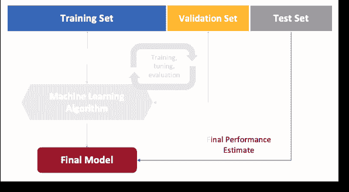

结果再次非常出色。

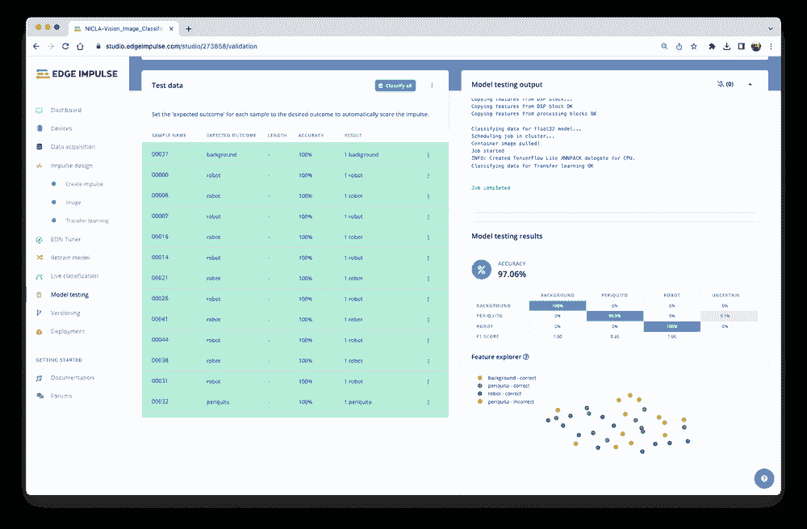

## 模型部署

到目前为止，我们可以将训练好的模型作为固件（FW）部署，并使用 OpenMV IDE 通过 MicroPython 运行它，或者我们可以将其作为 C/C++ 或 Arduino 库部署。

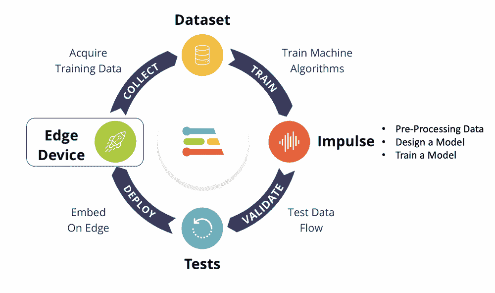

### Arduino 库

首先，让我们将其作为 Arduino 库部署：

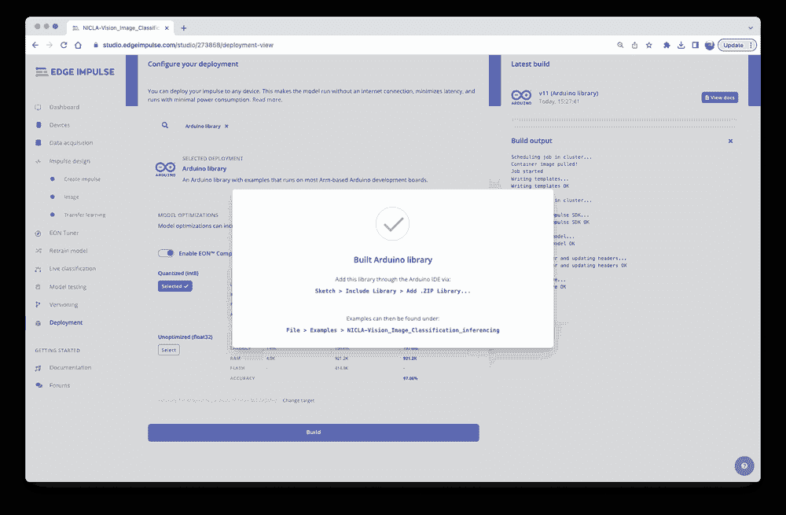

我们应该在 Arduino IDE 中将库安装为 .zip 文件，并运行库下 Examples 中的 *nicla_vision_camera.ino* 脚本。

> 注意，Arduino Nicla Vision 默认为 M7 内核分配了 512 KB 的 RAM，并在 M4 地址空间上额外分配了 244 KB。在代码中，这种分配已被更改为 288 kB，以确保模型可以在设备上运行（`malloc_addblock((void*)0x30000000, 288 * 1024);`）。

结果很好，测量的延迟为 86 毫秒。

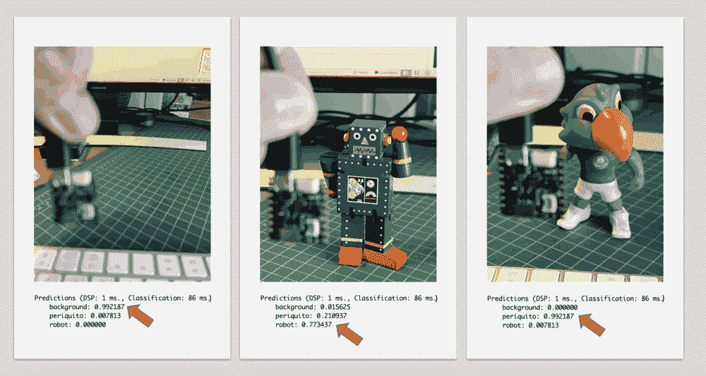

这里有一个展示推理结果的短视频：[`youtu.be/bZPZZJblU-o`](https://youtu.be/bZPZZJblU-o)

### OpenMV

可以以两种方式将训练好的模型部署到 OpenMV 使用：作为库和作为固件（FW）。选择 FW，Edge Impulse Studio 会生成优化模型、库和框架，以便进行推理。让我们探索这个选项。

在 `Deploy Tab` 上选择 `OpenMV Firmware` 并按 `[Build]`。

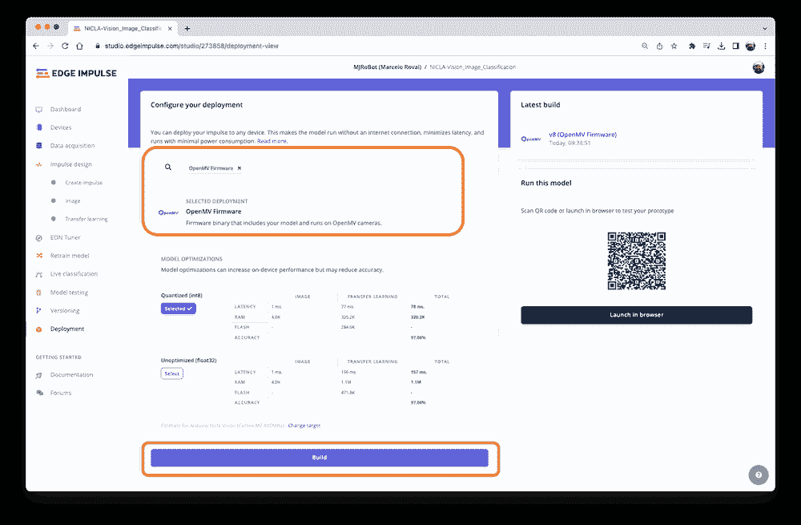

在计算机上，我们将找到一个 ZIP 文件。打开它：

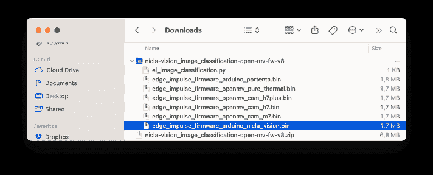

使用 OpenMV IDE 上的 Bootloader 工具将 FW 加载到你的板上（1）：

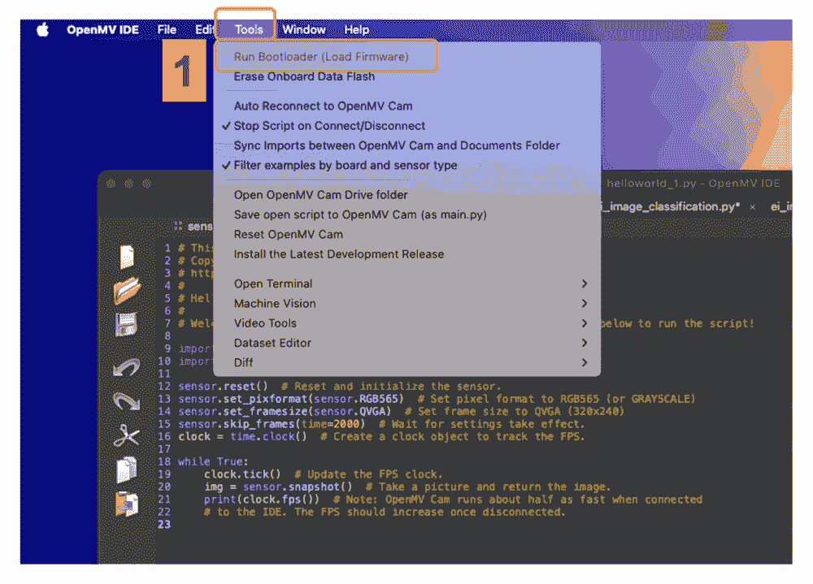

选择合适的文件（Nicla-Vision 的 .bin 文件）：

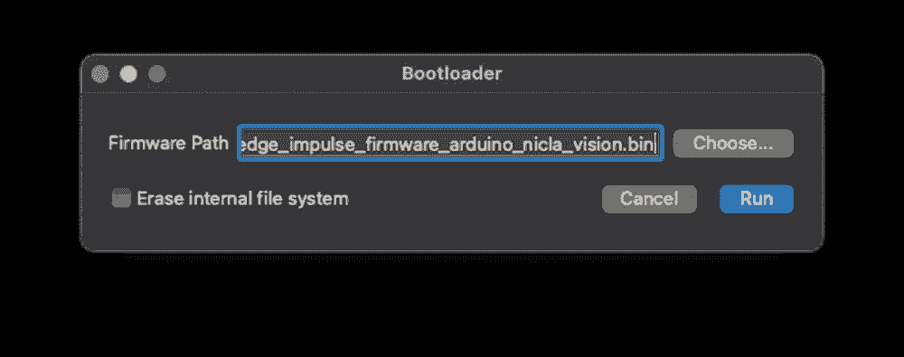

下载完成后，按 OK：

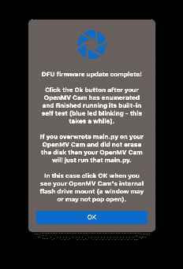

如果出现消息说固件过时，**不要升级**。选择 `[NO]`。


现在，打开从 Studio 下载的 **ei_image_classification.py** 脚本和 Nicla 的 .bin 文件。

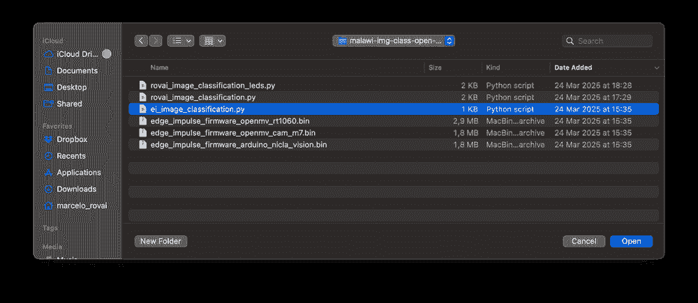

运行它。将摄像头指向我们想要分类的对象，推理结果将在串行终端显示。

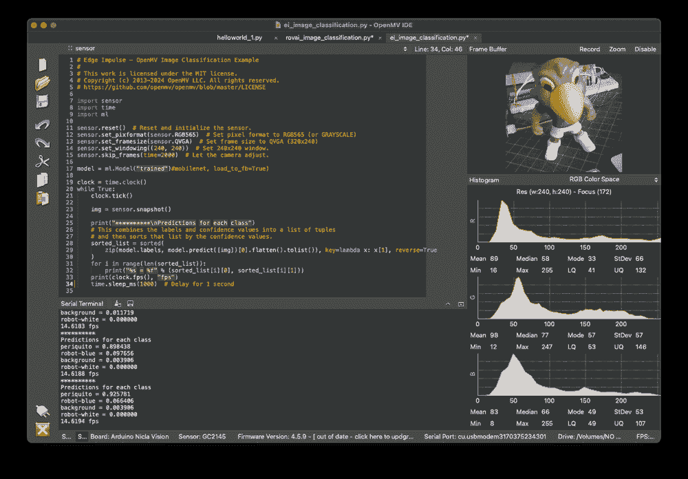

分类结果将出现在串行终端。如果难以阅读结果，请在代码中包含一个新行以添加一些延迟：

```py
import time
While True:
...
    time.sleep_ms(200)  # Delay for .2 second
```

#### 修改代码以添加标签

Edge Impulse 提供的代码可以进行修改，以便我们可以为了测试目的，直接在 OpenMV IDE 显示的图像上看到推理结果。

[从 GitHub 上上传代码](https://github.com/Mjrovai/Arduino_Nicla_Vision/blob/main/Micropython/nicla_image_classification.py)，或者按照以下方式修改：

```py
# Marcelo Rovai - NICLA Vision - Image Classification
# Adapted from Edge Impulse - OpenMV Image Classification Example
# @24March25

import sensor
import time
import ml

sensor.reset()  # Reset and initialize the sensor.
# Set pixel format to RGB565 (or GRAYSCALE)
sensor.set_pixformat(sensor.RGB565)
# Set frame size to QVGA (320x240)
sensor.set_framesize(sensor.QVGA)
sensor.set_windowing((240, 240))  # Set 240x240 window.
sensor.skip_frames(time=2000)  # Let the camera adjust.

model = ml.Model("trained")#mobilenet, load_to_fb=True)

clock = time.clock()

while True:
    clock.tick()
    img = sensor.snapshot()

    fps = clock.fps()
    lat = clock.avg()
    print("**********\nPrediction:")
    # Combines labels & confidence into a list of tuples and then
    # sorts that list by the confidence values.
    sorted_list = sorted(
        zip(model.labels, model.predict([img])[0].flatten().tolist()),
      key=lambda x: x[1], reverse=True
    )

    # Print only the class with the highest probability
    max_val = sorted_list[0][1]
    max_lbl = sorted_list[0][0]

    if max_val < 0.5:
        max_lbl = 'uncertain'

    print("{} with a prob of {:.2f}".format(max_lbl, max_val))
    print("FPS: {:.2f} fps ==> latency: {:.0f} ms".format(fps, lat))

    # Draw the label with the highest probability to the image viewer
    img.draw_string(
    10, 10,
    max_lbl + "\n{:.2f}".format(max_val),
    mono_space = False,
    scale=3
    )

    time.sleep_ms(500)  # Delay for .5 second
```

在这里你可以看到结果：

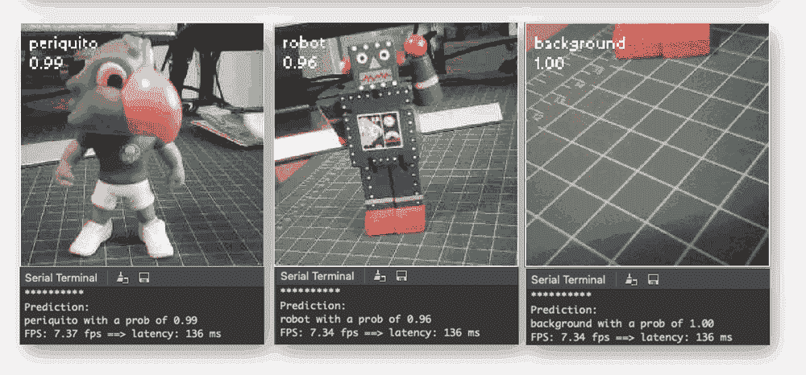

注意，延迟（136 毫秒）几乎是我们在 Arduino IDE 中直接获得的两倍。这是因为我们正在使用 IDE 作为接口，并且还需要等待摄像头准备的时间。如果我们就在推理前启动时钟，延迟应该会降低到大约 70 毫秒。

> 当连接到 IDE 时，NiclaV 的运行速度大约是 IDE 的一半。断开连接后，FPS 应该会增加。

#### 使用 LED 进行后处理

当与嵌入式机器学习一起工作时，我们寻找的是可以持续进行推理和结果，直接在物理世界中采取行动，而不是在连接的计算机上显示结果的设备。为了模拟这一点，我们将为每个可能的推理结果点亮不同的 LED。

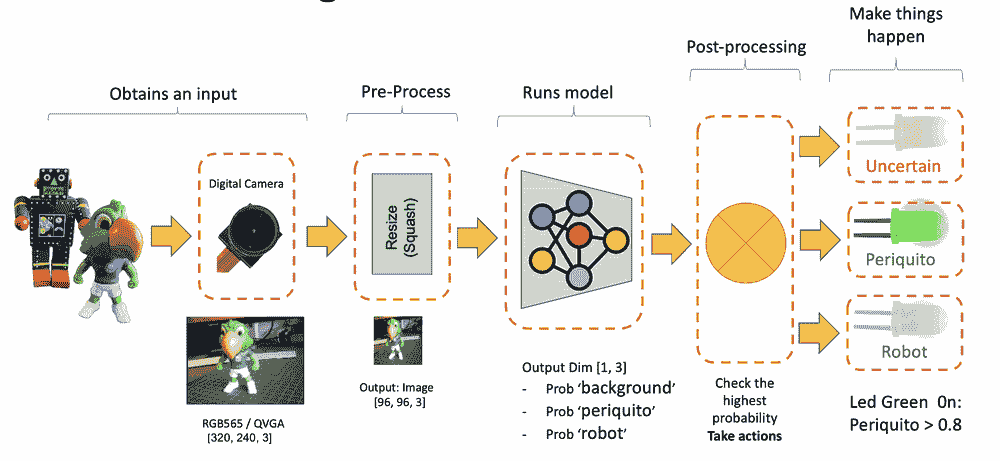

为了实现这一点，我们应该[从 GitHub 上上传代码](https://github.com/Mjrovai/Arduino_Nicla_Vision/blob/main/Micropython/nicla_image_classification_LED.py)或更改最后一段代码以包括 LED：

```py
# Marcelo Rovai - NICLA Vision - Image Classification with LEDs
# Adapted from Edge Impulse - OpenMV Image Classification Example
# @24Aug23

import sensor, time, ml
from machine import LED

ledRed = LED("LED_RED")
ledGre = LED("LED_GREEN")
ledBlu = LED("LED_BLUE")

sensor.reset()  # Reset and initialize the sensor.
# Set pixel format to RGB565 (or GRAYSCALE)
sensor.set_pixformat(sensor.RGB565)
# Set frame size to QVGA (320x240)
sensor.set_framesize(sensor.QVGA)
sensor.set_windowing((240, 240))  # Set 240x240 window.
sensor.skip_frames(time=2000)  # Let the camera adjust.

model = ml.Model("trained")#mobilenet, load_to_fb=True)

ledRed.off()
ledGre.off()
ledBlu.off()

clock = time.clock()

def setLEDs(max_lbl):
    if max_lbl == 'uncertain’:
 ledRed.on()
        ledGre.off()
        ledBlu.off()

    if max_lbl == 'periquito’:
 ledRed.off()
        ledGre.on()
        ledBlu.off()

    if max_lbl == 'robot’:
 ledRed.off()
        ledGre.off()
        ledBlu.on()

    if max_lbl == 'background’:
 ledRed.off()
        ledGre.off()
        ledBlu.off()

  while True:
    img = sensor.snapshot()

    clock.tick()
    fps = clock.fps()
    lat = clock.avg()
    print("**********\nPrediction:")
    sorted_list = sorted(
        zip(model.labels, model.predict([img])[0].flatten().tolist()),
      key=lambda x: x[1], reverse=True
    )

    # Print only the class with the highest probability
    max_val = sorted_list[0][1]
    max_lbl = sorted_list[0][0]

    if max_val < 0.5:
        max_lbl = 'uncertain'

    print("{} with a prob of {:.2f}".format(max_lbl, max_val))
    print("FPS: {:.2f} fps ==> latency: {:.0f} ms".format(fps, lat))

    # Draw the label with the highest probability to the image viewer
    img.draw_string(
    10, 10,
    max_lbl + "\n{:.2f}".format(max_val),
    mono_space = False,
    scale=3
    )

    setLEDs(max_lbl)
    time.sleep_ms(200)  # Delay for .2 second
```

现在，每次某个类别得分超过 0.8 时，相应的 LED 将会点亮：

+   Led 红色开启：不确定（没有类别得分超过 0.8）

+   Led 绿色开启：Periquito > 0.8

+   Led 蓝色开启：Robot > 0.8

+   所有 LED 关闭：背景 > 0.8

这是结果：

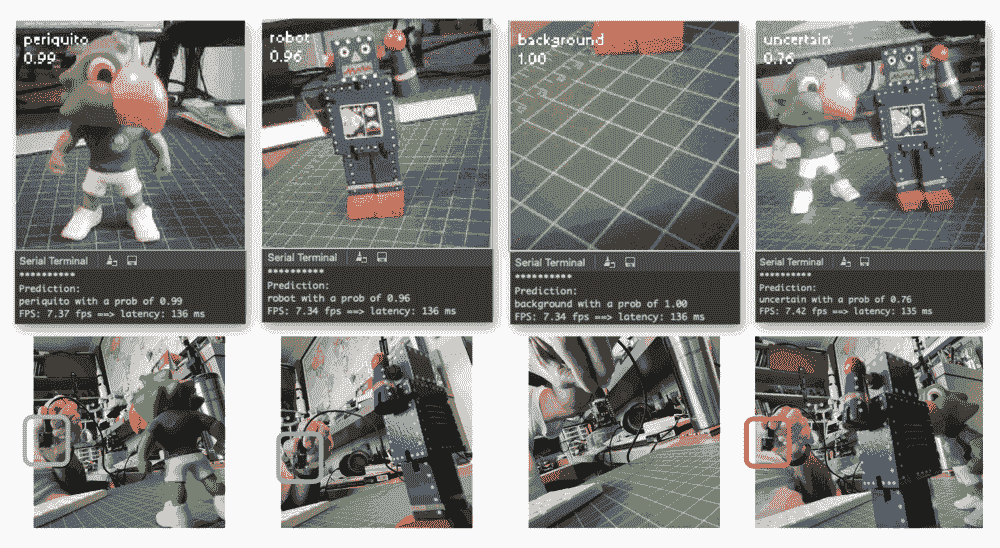

更详细地


## 图像分类（非官方）基准

可以使用多个开发板进行嵌入式机器学习（TinyML），对于计算机视觉应用（消耗低能量）最常见的是 ESP32 CAM、Seeed XIAO ESP32S3 Sense、Arduino Nicla Vison 和 Arduino Portenta。

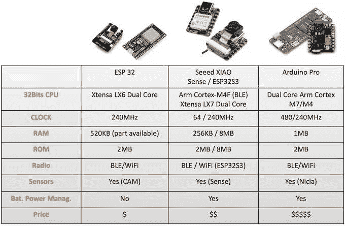

抓住机会，相同的训练模型被部署在 ESP-CAM、XIAO 和 Portenta 上（在这个例子中，模型再次进行了训练，使用灰度图像以兼容其摄像头）。以下是结果，将模型作为 Arduino 库部署：

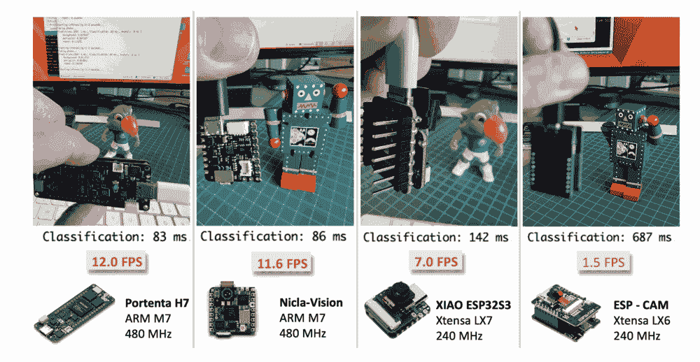

## 摘要

在我们结束之前，考虑一下计算机视觉不仅仅是图像分类。例如，你可以在多个领域的视觉周围开发边缘机器学习项目，例如：

+   **自动驾驶汽车**：使用传感器融合、激光雷达数据和计算机视觉算法进行导航和决策。

+   **医疗保健**：通过 MRI、X 射线和 CT 扫描图像分析自动诊断疾病。

+   **零售**：自动结账系统，在产品通过扫描仪时识别产品。

+   **安全和监控**：实时视频流中的面部识别、异常检测和物体跟踪。

+   **增强现实**：物体检测和分类，以在现实世界中叠加数字信息。

+   **工业自动化**：产品的视觉检查、预测性维护以及机器人和无人机引导。

+   **农业**：基于无人机进行作物监测和自动化收割。

+   **自然语言处理**：图像标题和视觉问答。

+   **手势识别**：用于游戏、手语翻译和人与机器交互。

+   **内容推荐**：基于图像的电子商务推荐系统。

## 资源

+   [Micropython 代码](https://github.com/Mjrovai/Arduino_Nicla_Vision/tree/main/Micropython)

+   [数据集](https://github.com/Mjrovai/Arduino_Nicla_Vision/tree/main/data)

+   [Edge Impulse 项目](https://studio.edgeimpulse.com/public/273858/latest)
