# 关键词检测（KWS）


*DALL·E 3 提示：1950 年代风格的卡通场景，设置在一个复古音频研究室中。两位非裔美国女科学家位于中心。一位手持放大镜，仔细检查古老的电路，而另一位在记笔记。在他们木质桌子上，有多块带有传感器的板，其中特别突出麦克风。在这些板后面，一台带有大圆背的计算机显示 Arduino IDE。IDE 展示了 LED 引脚分配的代码和用于语音命令检测的机器学习推理。IDE 中的一个独特窗口，串行监视器，显示了表示说出的命令“是”和“否”的输出。房间氛围怀旧，有复古灯具、经典音频分析工具和描绘 FFT 图和时间域曲线的图表。*

## 概述

在已经探索了 Nicla Vision 板在*图像分类*和*目标检测*应用中的使用后，我们现在将重点转向语音激活应用，通过一个关于关键词检测（KWS）的项目。

如在*音频分类特征工程*动手教程中介绍的那样，关键词检测（KWS）集成到许多语音识别系统中，使设备能够对特定的单词或短语做出响应。虽然这项技术支撑着像 Google Assistant 或 Amazon Alexa 这样的流行设备，但它同样适用于较小的、低功耗设备。本教程将指导您在配备数字麦克风的 Nicla Vision 开发板上使用 TinyML 实现 KWS 系统。

我们的设计模型将能够识别可以触发设备唤醒或特定动作的关键词，通过语音激活命令使它们活跃起来。

## 语音助手是如何工作的？

正如所说，市场上的*语音助手*，如 Google Home 或 Amazon Echo-Dot，只有在被特定的关键词“唤醒”时才会对人类做出反应，第一个是“嘿，谷歌”，第二个是“Alexa”。

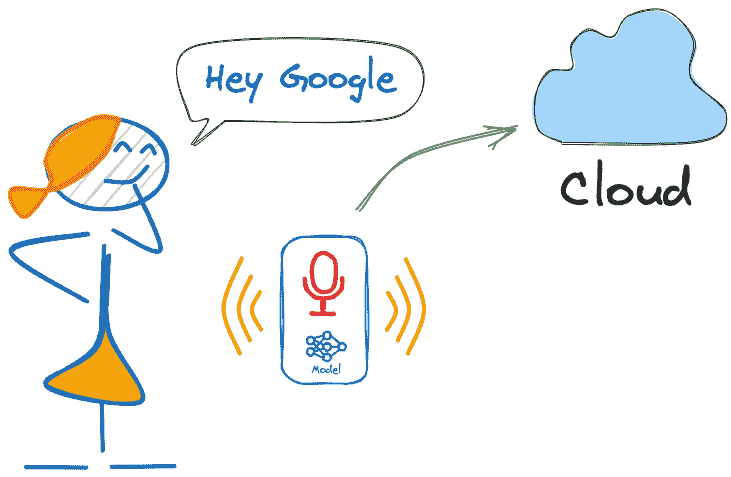

换句话说，语音命令的识别基于多阶段模型或级联检测。

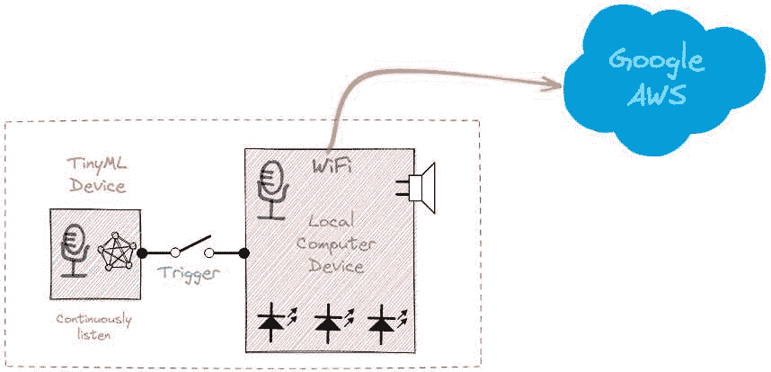

**第一阶段**：Echo Dot 或 Google Home 内部的小型微处理器持续监听，等待检测到关键词，使用边缘的 TinyML 模型（KWS 应用）。

**第二阶段**：只有在第一阶段由 KWS 应用触发后，数据才会被发送到云端并在更大的模型上处理。

下面的视频展示了在 Raspberry Pi 上编程 Google Assistant 的示例（第二阶段），Arduino Nano 33 BLE 作为 TinyML 设备（第一阶段）。

[`youtu.be/e_OPgcnsyvM`](https://youtu.be/e_OPgcnsyvM)

> 要探索上述 Google Assistant 项目，请参阅教程：[从头开始构建智能语音助手](https://www.hackster.io/mjrobot/building-an-intelligent-voice-assistant-from-scratch-2199c3)。

在这个 KWS 项目中，我们将专注于第一阶段（KWS 或关键词检测），我们将使用 Nicla Vision，它有一个数字麦克风，将用于检测关键词。

## KWS 动手项目

下面的图表展示了最终的 KWS 应用应该如何工作（在推理过程中）：

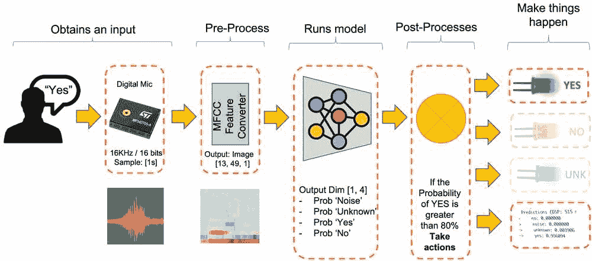

我们的 KWS 应用将识别四种声音类别：

+   **YES**（关键词 1）

+   **NO**（关键词 2）

+   **噪声**（没有说话；只有背景噪声）

+   **未知**（不同于 YES 和 NO 的不同单词的混合）

> 对于现实世界的项目，始终建议除了关键词之外，还包括其他声音，例如“噪声”（或背景）和“未知”。

### 机器学习工作流程

KWS 应用的主要组件是其模型。因此，我们必须使用我们特定的关键词、噪声和其他单词（“未知”）来训练这样的模型：

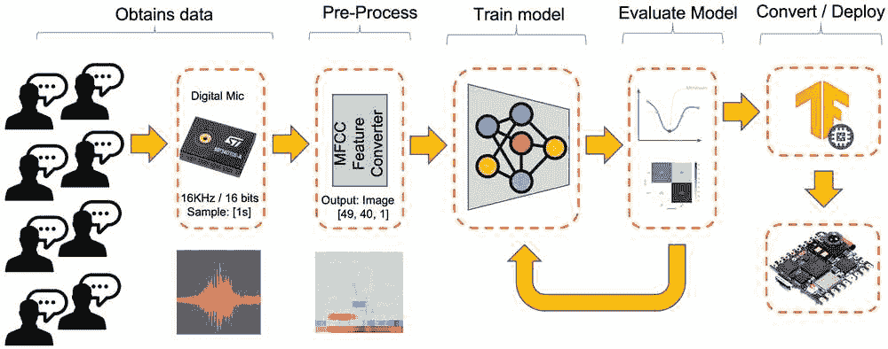

## 数据集

任何机器学习工作流程的关键组件是**数据集**。一旦我们决定了特定的关键词，在我们的案例中是(*YES*和 NO)，我们就可以利用 Pete Warden 开发的数据集，[“Speech Commands: A Dataset for Limited-Vocabulary Speech Recognition](https://arxiv.org/pdf/1804.03209.pdf)。”这个数据集有 35 个关键词（每个有+1,000 个样本），例如 yes、no、stop 和 go。在*yes*和*no*这样的词中，我们可以得到 1,500 个样本。

您可以从 Edge Studio 下载数据集的一部分（[关键词检测预构建数据集](https://docs.edgeimpulse.com/docs/pre-built-datasets/keyword-spotting)），该数据集包括我们将在此项目中使用的四个类别的样本：yes、no、noise 和 background。为此，请按照以下步骤操作：

+   下载[关键词数据集](https://cdn.edgeimpulse.com/datasets/keywords2.zip)

+   将文件解压到您选择的位置。

### 将数据集上传到 Edge Impulse Studio

在 Edge Impulse Studio（EIS）中启动一个新项目，并在“数据获取”部分选择“上传现有数据”工具。选择要上传的文件：

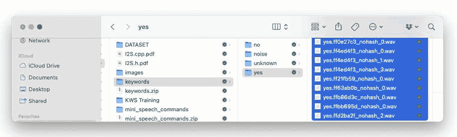

定义标签，选择`自动在训练和测试之间分割`，并`上传数据`到 EIS。为所有类别重复此操作。

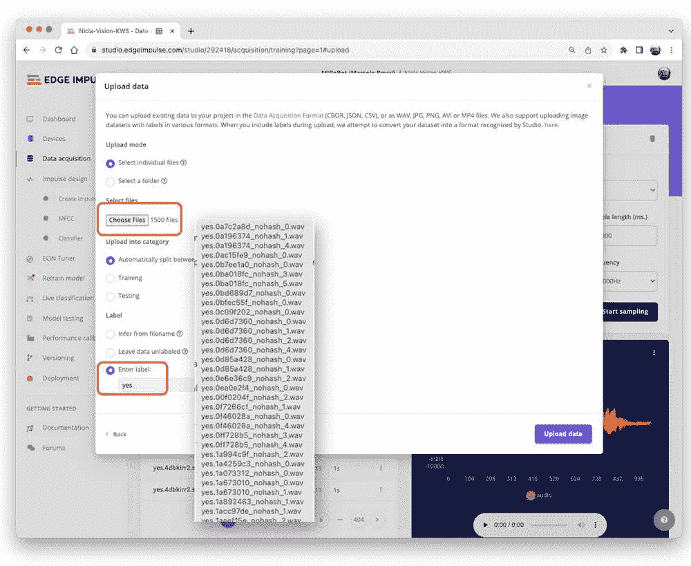

数据集现在将出现在“数据获取”部分。请注意，大约 6,000 个样本（每类 1,500 个）被分为训练集（4,800 个）和测试集（1,200 个）。

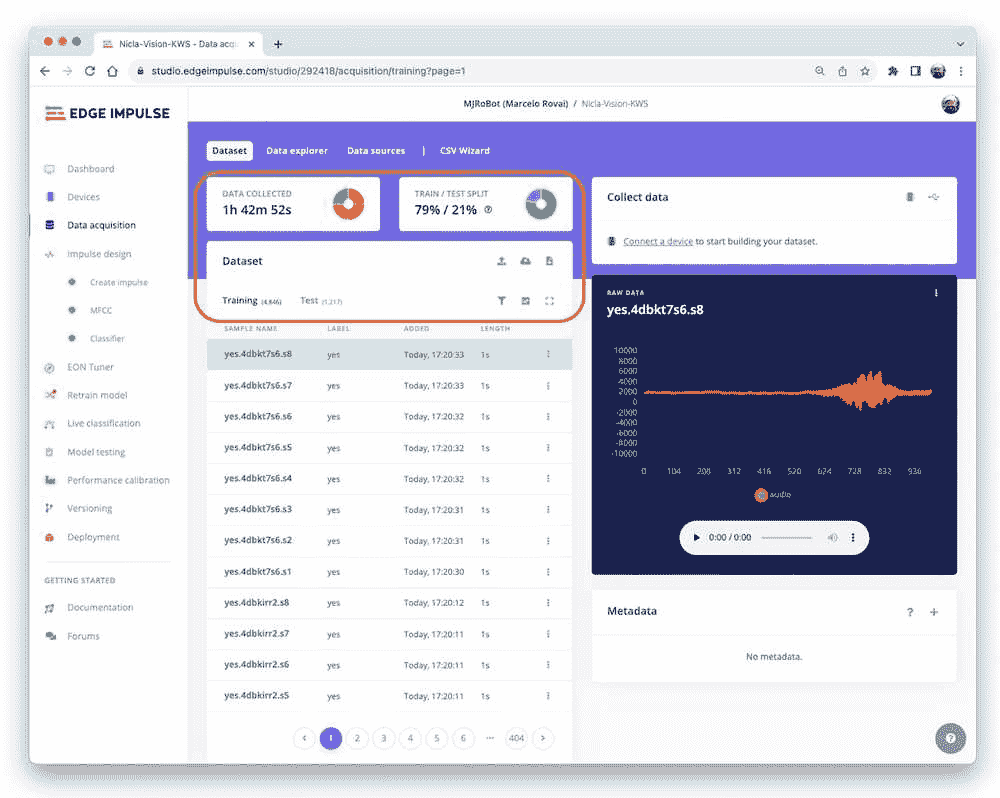

### 捕获额外的音频数据

尽管我们从 Pete 的数据集中获得了大量数据，但收集一些我们自己的说话词是建议的。当与加速度计一起工作时，创建由相同类型的传感器捕获的数据集是至关重要的。在*声音*的情况下，这是可选的，因为我们实际上要分类的是*音频*数据。

> 声音和音频之间的关键区别是能量的类型。声音是机械扰动（纵向声波），通过介质传播，导致其压力变化。音频是表示声音的电气（模拟或数字）信号。

当我们发音一个关键词时，声波应转换为音频数据。转换应通过在 16 KHz 频率下以 16 位每样本幅度采样麦克风产生的信号来完成。

因此，任何可以生成具有此基本规格（16 KHz/16 位）的音频数据的设备都可以正常工作。作为一个 *设备*，我们可以使用 NiclaV、计算机，甚至您的手机。

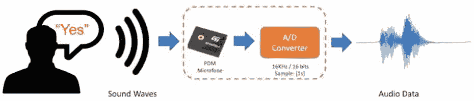

#### 使用 NiclaV 和 Edge Impulse Studio

如我们在 *设置 Nicla Vision* 章节中学到的，EIS 正式支持 Nicla Vision，这简化了从其传感器（包括麦克风）捕获数据的过程。因此，请在 EIS 上创建一个新项目，并将 Nicla 连接到它，按照以下步骤操作：

+   下载最新更新的 [EIS 固件](https://cdn.edgeimpulse.com/firmware/arduino-nicla-vision.zip) 并解压。

+   在您的计算机上打开 zip 文件，并选择对应您操作系统的上传器：

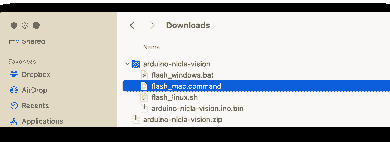

+   通过按重置按钮两次将 NiclaV 放入引导模式。

+   通过运行对应您操作系统的批处理代码，将二进制文件 *arduino-nicla-vision.bin* 上传到您的板子上。

前往您在 EIS 上的项目，并在 `数据采集选项卡` 上选择 `WebUSB`。将弹出一个窗口；选择显示 `Nicla 已配对` 的选项，并按 `[连接]`。

您可以在“数据采集”选项卡上的“收集数据”部分选择要选择哪些传感器数据。选择：`内置麦克风`，定义您的 `标签`（例如，*是*），采样 `频率`[16000Hz]，以及 `样本长度（以毫秒计）`，例如 [10s]。`开始采样`。

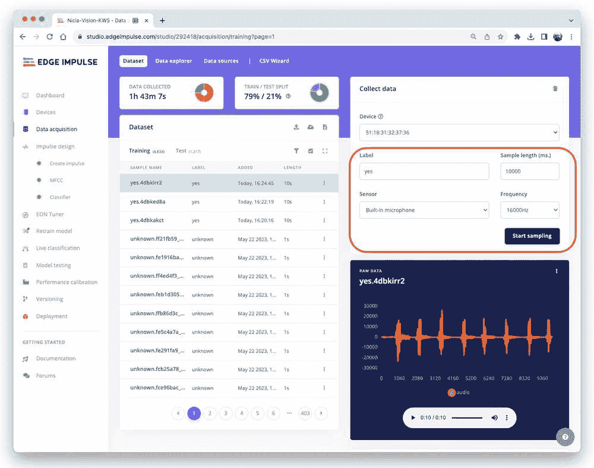

Pete 的数据集中的数据长度为 1 秒，但记录的样本长度为 10 秒，必须分割成 1 秒的样本。在样本名称后面的 `三个点` 上点击，并选择 `分割样本`。

将弹出一个带有分割工具的窗口。

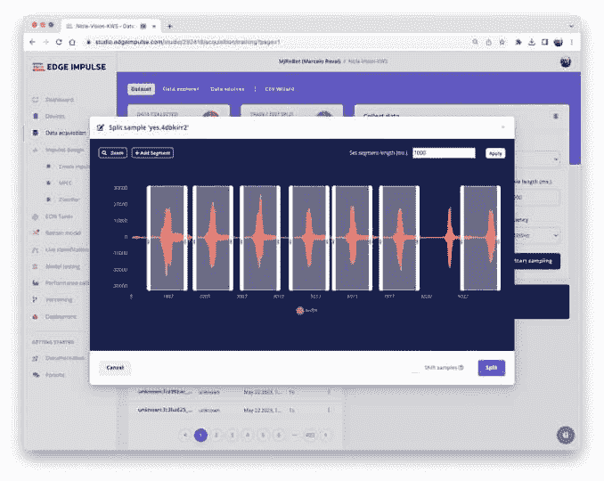

一旦进入工具，将数据分割成 1 秒（1000 毫秒）的记录。如有必要，添加或删除段。此过程应适用于所有新的样本。

#### 使用智能手机和 EI Studio

您还可以使用您的 PC 或智能手机捕获音频数据，使用 16 KHz 的采样频率和 16 位的位深度。

前往 `设备`，使用您的手机扫描 `QR 码`，并点击链接。浏览器中会出现一个数据收集应用程序。选择 `收集音频`，并定义您的 `标签`、数据捕获 `长度` 和 `类别`。

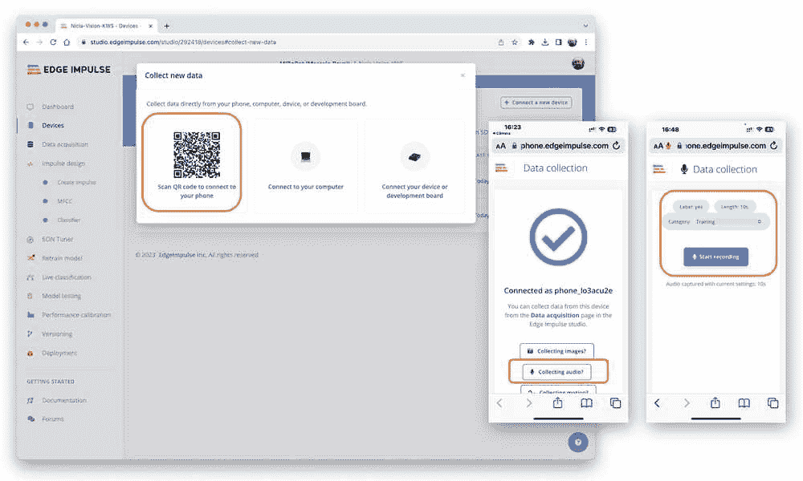

重复与 NiclaV 使用的相同程序。

> 注意，任何应用程序，如 [Audacity](https://www.audacityteam.org/)，都可以用于音频录制，只要您使用 16 KHz/16 位深度的样本。

## 创建 Impulse（预处理/模型定义）

*一个* **冲激** *从原始数据中提取特征，使用信号处理来提取特征，然后使用学习模块来分类新数据。*

### 冲激设计

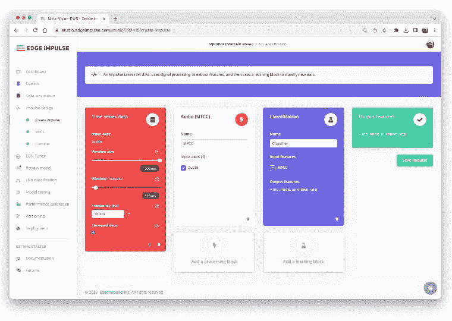

首先，我们将使用 1 秒的窗口获取数据点，以 500 毫秒的间隔增强数据和滑动窗口。请注意，已设置零填充数据的选项。用“零”填充小于 1 秒的样本（在某些情况下，一些样本可以小于分割工具上的 1000 毫秒窗口，以避免噪声和尖峰）是至关重要的。

每个持续 1 秒的音频样本都应该进行预处理并转换为图像（例如，<semantics><mrow><mn>13</mn><mo>×</mo><mn>49</mn><mo>×</mo><mn>1</mn></mrow><annotation encoding="application/x-tex">13\times 49\times 1</annotation></semantics>）。正如在*音频分类特征工程*动手教程中讨论的那样，我们将使用`音频（MFCC）`，它使用[梅尔频率倒谱系数](https://en.wikipedia.org/wiki/Mel-frequency_cepstrum)从音频信号中提取特征，这些特征非常适合人类语音，我们这里的案例。

接下来，我们选择`分类`模块，使用卷积神经网络（CNN）从头开始构建我们的模型。

> 或者，您可以使用`迁移学习（关键词检测）`模块，该模块在您的数据上微调预训练的关键词检测模型。这种方法在相对较小的关键词数据集上具有很好的性能。

### 预处理（MFCC）

下一个步骤是创建下一阶段要训练的特征：

我们可以保留默认参数值，但我们将使用 DSP 的`自动调整参数`选项。

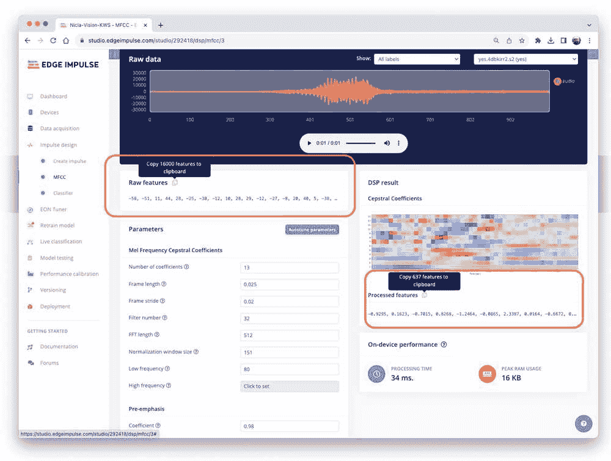

我们将使用`原始特征`（我们的 1 秒，16 KHz 采样音频数据）并使用 MFCC 处理模块来计算`处理特征`。对于每 16,000 个原始特征（16,000 <semantics><mi>×</mi><annotation encoding="application/x-tex">\times</annotation></semantics> 1 秒），我们将得到 637 个处理特征 <semantics><mrow><mo stretchy="true" form="prefix">(</mo><mn>13</mn><mo>×</mo><mn>49</mn><mo stretchy="true" form="postfix">)</mo></mrow><annotation encoding="application/x-tex">(13\times 49)</annotation></semantics>。

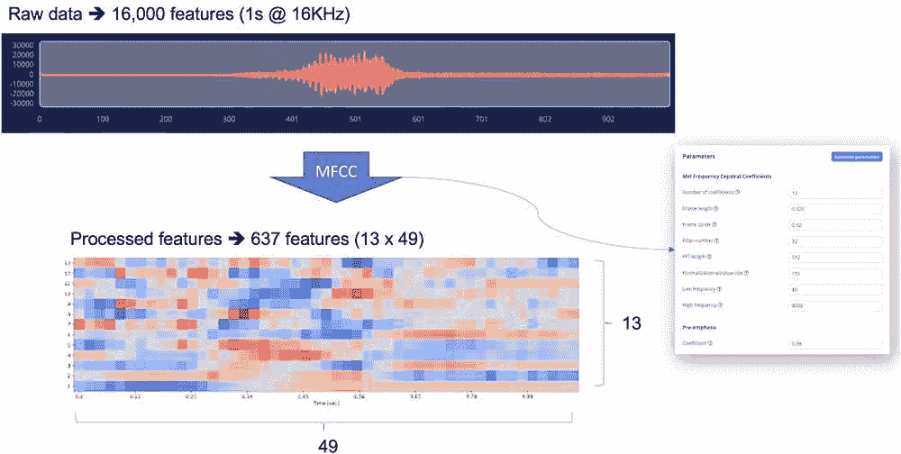

结果显示，我们只使用了少量的内存来预处理数据（16 KB）和 34 毫秒的延迟，这是非常出色的。例如，在 Arduino Nano（Cortex-M4f @ 64 MHz）上，相同的预处理将需要大约 480 毫秒。选择的参数，如`FFT 长度`[512]，将显著影响延迟。

现在，让我们`保存参数`并切换到`生成特征`标签页，在这里将生成实际的特征。使用[UMAP](https://umap-learn.readthedocs.io/en/latest/)，一种降维技术，`特征探索器`显示了特征在二维图上的分布情况。

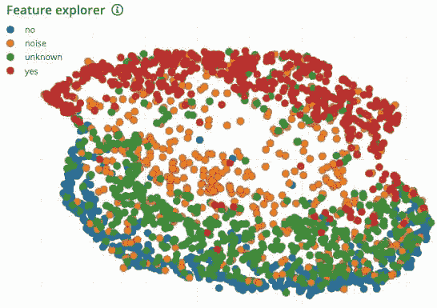

结果看起来不错，*是*特征（红色）和*否*特征（蓝色）之间有明显的视觉分离。*未知*特征似乎比*否*空间更接近*是*。这表明关键字*否*更容易产生误报。

### 深入了解内部结构

要更好地了解原始声音是如何预处理的，请查看*音频分类的特征工程*章节。您可以通过从 GitHub 下载此[notebook](https://github.com/Mjrovai/Arduino_Nicla_Vision/blob/main/KWS/KWS_MFCC_Analysis.ipynb)来尝试 MFCC 特征生成，或[[在 Colab 中打开]](https://colab.research.google.com/github/Mjrovai/Arduino_Nicla_Vision/blob/main/KWS/KWS_MFCC_Analysis.ipynb)。

## 模型设计和训练

我们将使用一个简单的卷积神经网络（CNN）模型，使用一维和二维卷积进行测试。基本架构有两个卷积+最大池化块（[8]和[16]个过滤器，分别）和一个[0.25]的 Dropout 用于一维，[0.5]的 Dropout 用于二维。对于最后一层，在 Flattening 之后，我们有[4]个神经元，每个类别一个：

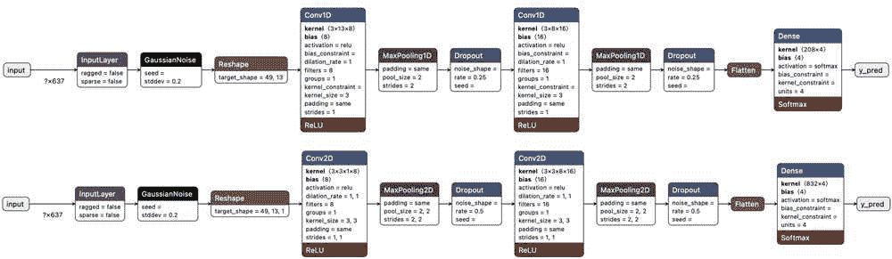

作为超参数，我们将有一个[0.005]的学习率，并通过[100]个 epoch 训练模型。我们还将包括基于[SpecAugment](https://arxiv.org/abs/1904.08779)的数据增强方法。我们使用相同超参数训练了一维和二维模型。一维架构的整体结果更好（与二维的 88%相比，准确率为 90.5%，因此我们将使用一维）。

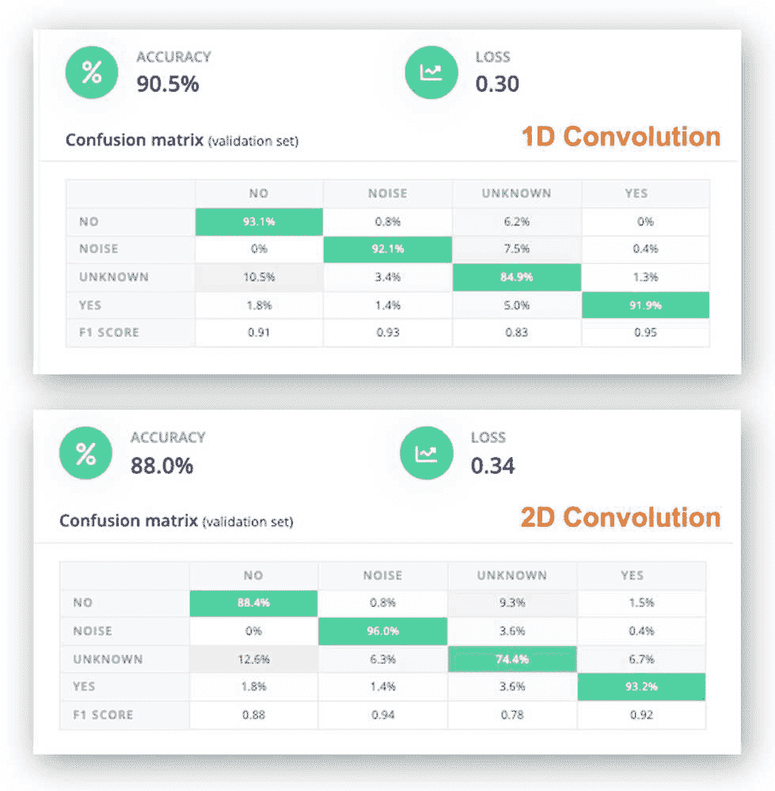

> 使用一维卷积更高效，因为它需要的参数比二维卷积少，这使得它们更适合资源受限的环境。

1D 混淆矩阵也很有趣。`是`的 F1 分数为 95%，`否`为 91%。这与我们在特征探索器中看到的结果相符（`否`和`未知`距离很近）。在尝试提高结果时，您可以仔细检查出错样本的结果。

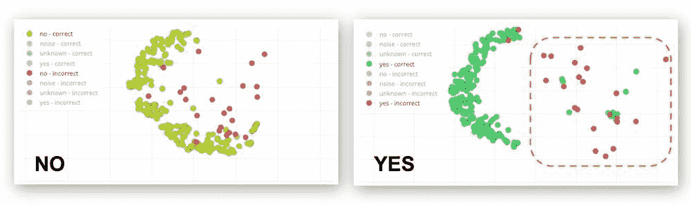

听一下出错的样本。例如，对于“是”，大多数错误都与发音为“耶”的“是”有关。您可以获取更多样本，然后重新训练您的模型。

### 深入了解内部结构

如果您想了解“内部结构”中发生的事情，您可以从“仪表板”选项卡下载预处理的数据集（`MFCC 训练数据`），并运行此[Jupyter Notebook](https://github.com/Mjrovai/Arduino_Nicla_Vision/blob/main/KWS/KWS_CNN_training.ipynb)，通过代码进行操作或[[在 Colab 中打开]](https://colab.research.google.com/github/Mjrovai/Arduino_Nicla_Vision/blob/main/KWS/KWS_CNN_training.ipynb)。例如，您可以按每个 epoch 分析准确率：


## 测试

使用为训练保留的数据（测试数据）测试模型，我们得到了大约 76%的准确率。


检查 F1 分数，我们可以看到对于 YES，我们得到了 0.90，这是一个非常好的结果，因为我们预计将使用这个关键词作为我们 KWS 项目的“触发器”。最差的结果（0.70）是 UNKNOWN，这是可以接受的。

对于 NO，我们得到了 0.72，这是预期的，但为了提高这个结果，我们可以将那些未被正确分类的样本移动到训练数据集中，然后重复训练过程。

### 实时分类

我们可以继续进行项目的下一步，同时考虑使用 NiclaV 或智能手机捕获实时样本进行实时分类，在将训练模型部署到我们的设备之前进行测试。

## 部署和推理

EIS 将打包所有需要的库、预处理函数和训练模型，并将它们下载到你的电脑。转到 `Deployment` 部分，选择 `Arduino Library`，在底部选择 `Quantized (Int8)` 并按 `Build`。

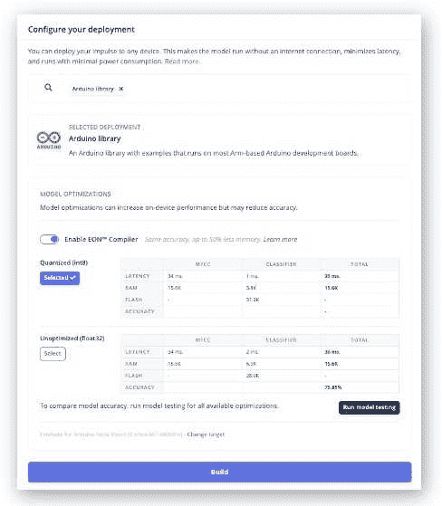

当选择 `Build` 按钮时，将创建一个 zip 文件并下载到你的电脑。在你的 Arduino IDE 中，转到 `Sketch` 选项卡，选择 `Add .ZIP Library` 选项，并选择由 EIS 下载的.zip 文件：

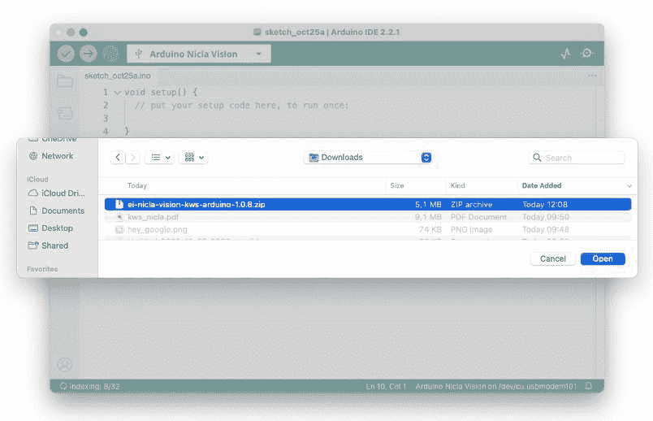

现在，是时候进行实际测试了。我们将完全断开与 EIS 的连接进行推理。让我们使用部署 Arduino Library 时创建的 NiclaV 代码示例。

在你的 Arduino IDE 中，转到 `File/Examples` 选项卡，查找你的项目，并选择 `nicla-vision/nicla-vision_microphone`（或 `nicla-vision_microphone_continuous`）


按下复位按钮两次，将 NiclaV 置于引导模式，将草图上传到你的板子，并测试一些真实的推理：

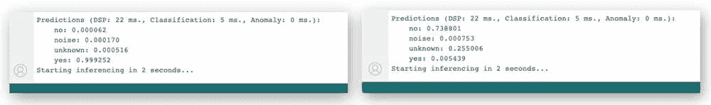

## 后处理

既然我们知道模型正在工作，因为它检测到了我们的关键词，那么让我们修改代码，看看 NiclaV 完全离线（未连接到 PC，由电池、移动电源或独立的 5V 电源供电）的结果。

策略是，每当检测到关键词 YES 时，绿灯将亮起；如果听到 NO，红灯将亮起，如果是 UNKNOWN，蓝灯将亮起；在存在噪声（无关键词）的情况下，LED 将关闭。

我们应该修改其中一个代码示例。现在就让我们用 `nicla-vision_microphone_continuous` 来做吧。

从初始化 LED 开始：

```py
...
void setup()
{
        // Once you finish debugging your code, you can
        // comment or delete the Serial part of the code
    Serial.begin(115200);
    while (!Serial);
    Serial.println("Inferencing - Nicla Vision KWS with LEDs");

    // Pins for the built-in RGB LEDs on the Arduino NiclaV
    pinMode(LEDR, OUTPUT);
    pinMode(LEDG, OUTPUT);
    pinMode(LEDB, OUTPUT);

    // Ensure the LEDs are OFF by default.
    // Note: The RGB LEDs on the Arduino Nicla Vision
    // are ON when the pin is LOW, OFF when HIGH.
    digitalWrite(LEDR, HIGH);
    digitalWrite(LEDG, HIGH);
    digitalWrite(LEDB, HIGH);
...
}
```

创建两个函数，`turn_off_leds()` 函数，用于关闭所有 RGB LED

```py
/*
 * @brief      turn_off_leds function - turn-off all RGB LEDs
 */
void turn_off_leds(){
    digitalWrite(LEDR, HIGH);
    digitalWrite(LEDG, HIGH);
    digitalWrite(LEDB, HIGH);
}
```

另一个 `turn_on_led()` 函数用于根据分类器的最可能结果打开 RGB LED。

```py
/*
 * @brief     turn_on_leds function used to turn on the RGB LEDs
 * @param[in] pred_index
 *            no:       [0] ==> Red ON
 *            noise:    [1] ==> ALL OFF
 *            unknown:  [2] ==> Blue ON
 *            Yes:      [3] ==> Green ON
 */
void turn_on_leds(int pred_index) {
  switch (pred_index)
  {
    case 0:
      turn_off_leds();
      digitalWrite(LEDR, LOW);
      break;

    case 1:
      turn_off_leds();
      break;

    case 2:
      turn_off_leds();
      digitalWrite(LEDB, LOW);
      break;

    case 3:
      turn_off_leds();
      digitalWrite(LEDG, LOW);
      break;
  }
}
```

并且更改 `loop()` 中的 `// 打印预测` 部分的代码：

```py
...

 if (++print_results >= (EI_CLASSIFIER_SLICES_PER_MODEL_WINDOW)) {
     // print the predictions
     ei_printf("Predictions ");
     ei_printf("(DSP: %d ms., Classification: %d ms.,
                 Anomaly: %d ms.)",
         result.timing.dsp, result.timing.classification,
         result.timing.anomaly);
     ei_printf(": \n");
     int pred_index = 0;     // Initialize pred_index
     float pred_value = 0;   // Initialize pred_value
     for (size_t ix = 0; ix < EI_CLASSIFIER_LABEL_COUNT; ix++) {
         if (result.classification[ix].value > pred_value){
             pred_index = ix;
             pred_value = result.classification[ix].value;
         }
         // ei_printf("    %s: ",
         // result.classification[ix].label);
         // ei_printf_float(result.classification[ix].value);
         // ei_printf("\n");
     }
     ei_printf("  PREDICTION: ==> %s with probability %.2f\n",
               result.classification[pred_index].label,
               pred_value);
     turn_on_leds (pred_index);

#if EI_CLASSIFIER_HAS_ANOMALY == 1
        ei_printf("    anomaly score: ");
        ei_printf_float(result.anomaly);
        ei_printf("\n");
#endif

        print_results = 0;
    }
}

...
```

你可以在[项目的 GitHub](https://github.com/Mjrovai/Arduino_Nicla_Vision/tree/main/KWS/nicla_vision_microphone_continuous_LED)上找到完整的代码。

将草图上传到你的板子上并测试一些真实推理。想法是，当检测到关键词 YES 时，绿色 LED 将亮起，红色 LED 将亮起表示 NO，任何其他单词都将点亮蓝色 LED。如果存在寂静或背景噪音，所有 LED 都应关闭。记住，与我们在介绍中看到的一样，相同的程序可以“触发”外部设备执行所需操作，而不是点亮 LED。

[`youtu.be/25Rd76OTXLY`](https://youtu.be/25Rd76OTXLY)

## 摘要

> 你可以在 [GitHub](https://github.com/Mjrovai/Arduino_Nicla_Vision/tree/main/KWS) 仓库中找到本动手教程所使用的笔记本和代码。

在我们结束之前，考虑一下声音分类不仅仅是声音。例如，你可以在多个领域围绕声音开发 TinyML 项目，例如：

+   **安全**（破碎玻璃检测，枪声）

+   **工业**（异常检测）

+   **医疗**（打鼾，咳嗽，肺部疾病）

+   **自然**（蜂箱控制，昆虫声音，包装缓解）

## 资源

+   [Google 语音命令数据集的子集](https://cdn.edgeimpulse.com/datasets/keywords2.zip)

+   [KWS MFCC 分析 Colab 笔记本](https://colab.research.google.com/github/Mjrovai/Arduino_Nicla_Vision/blob/main/KWS/KWS_MFCC_Analysis.ipynb)

+   [KWS_CNN 训练 Colab 笔记本](https://colab.research.google.com/github/Mjrovai/Arduino_Nicla_Vision/blob/main/KWS/KWS_CNN_training.ipynb)

+   [Arduino 后处理代码](https://github.com/Mjrovai/Arduino_Nicla_Vision/tree/main/KWS/nicla_vision_microphone_continuous_LED)

+   [Edge Impulse 项目](https://studio.edgeimpulse.com/public/292418/latest)
