# 运动分类和异常检测


*DALL·E 3 提示：1950 年代风格的卡通插图，描绘一个运动研究室。房间中央有一个用于在卡车、船只和叉车上运输货物的模拟集装箱。集装箱细节丰富，有铆钉和工业货箱典型的标记。集装箱周围，房间内充满了复古设备，包括示波器、各种传感器阵列和大量记录数据的厚纸卷。墙上装饰着关于交通安全和物流的教育海报。整个房间的氛围既怀旧又科学，带有一丝工业风格*。

## 概述

交通运输是全球商业的支柱。每天通过各种方式，如船只、卡车和火车，运输数百万个集装箱到世界各地。确保这些集装箱的安全高效运输是一项艰巨的任务，需要利用现代技术，而 TinyML 无疑是其中之一。

在这个动手教程中，我们将努力解决与交通运输相关的现实世界问题。我们将使用 Arduino Nicla Vision 板、Arduino IDE 和 Edge Impulse Studio 开发运动分类和异常检测系统。这个项目将帮助我们了解集装箱在运输的不同阶段（如陆地和海上运输、通过叉车的垂直运动和仓库中的静止期）所经历的不同力和运动。

**学习目标**

+   设置 Arduino Nicla Vision 板

+   数据收集和预处理

+   构建运动分类模型

+   实施异常检测

+   现实世界测试和分析

到本教程结束时，你将拥有一个可以分类不同类型运动并在集装箱运输过程中检测异常的工作原型。这些知识可以成为进入蓬勃发展的 TinyML 领域，涉及振动等更高级项目的垫脚石。

## IMU 安装和测试

对于这个项目，我们将使用一个加速度计。正如在动手教程“设置 Nicla Vision”中讨论的那样，Nicla Vision 板上有一个板载 **6 轴 IMU**：3D 加速计和 3D 陀螺仪，[LSM6DSOX](https://www.st.com/en/mems-and-sensors/lsm6dsox.html)。让我们验证是否已安装 [LSM6DSOX IMU 库](https://github.com/arduino-libraries/Arduino_LSM6DSOX)。如果没有，请安装它。

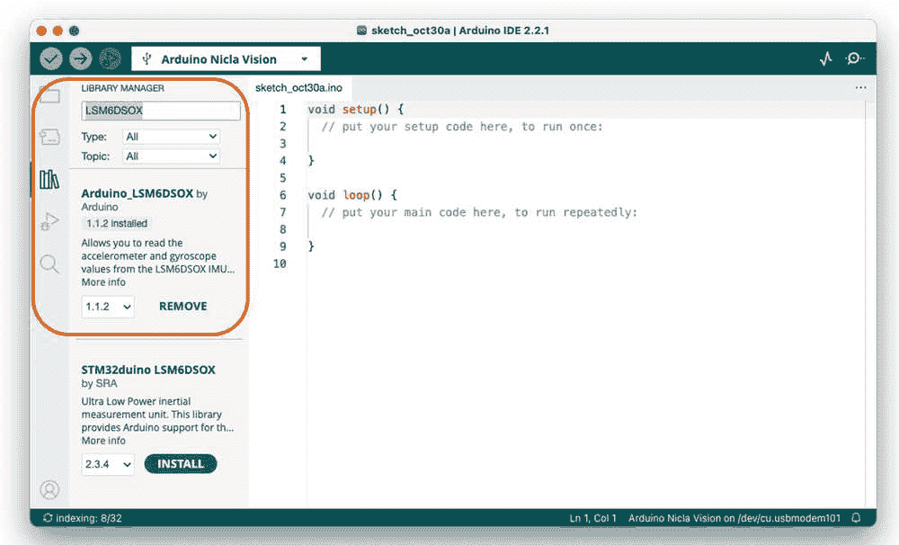

接下来，转到 `Examples > Arduino_LSM6DSOX > SimpleAccelerometer` 并运行加速度计测试。你可以通过打开 IDE 串行监视器或绘图器来检查它是否工作。值以 g（地球重力）为单位，默认范围为 +/- 4g：

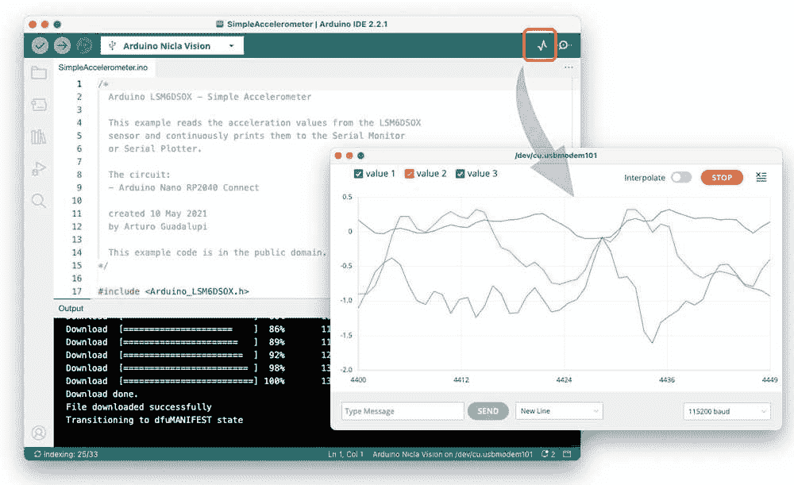

### 定义采样频率：

选择合适的采样频率对于捕捉你感兴趣研究的运动特性至关重要。奈奎斯特-香农采样定理指出，采样率应至少是信号中最高频率分量的两倍，以便正确重建。在运输中的运动分类和异常检测的背景下，采样频率的选择将取决于几个因素：

1.  **运动性质**：不同类型的运输（陆地、海事等）可能涉及不同的运动频率范围。更快的运动可能需要更高的采样频率。

1.  **硬件限制**：Arduino Nicla Vision 板及其相关传感器可能对数据采样速度有限制。

1.  **计算资源**：更高的采样率将生成更多数据，这可能会计算密集，特别是在 TinyML 环境中尤为重要。

1.  **电池寿命**：更高的采样率将消耗更多电力。如果系统是电池供电的，这是一个重要的考虑因素。

1.  **数据存储**：更频繁的采样将需要更多的存储空间，这是对内存有限的嵌入式系统来说另一个重要的考虑因素。

在许多人类活动识别任务中，**大约 50 Hz 到 100 Hz 的采样率**被普遍使用。鉴于我们正在模拟运输场景，这些场景通常不是高频事件，因此在这个范围（50-100 Hz）内的采样率可能是一个合理的起点。

让我们定义一个草图，以便我们可以以定义的采样频率（例如，50 Hz）捕获我们的数据：

```py
/*
 * Based on Edge Impulse Data Forwarder Example (Arduino)
 - https://docs.edgeimpulse.com/docs/cli-data-forwarder
 * Developed by M.Rovai @11May23
 */

/* Include ------------------------------------------- */
#include <Arduino_LSM6DSOX.h>

/* Constant defines ---------------------------------- */
#define CONVERT_G_TO_MS2 9.80665f
#define FREQUENCY_HZ 50
#define INTERVAL_MS (1000  /  (FREQUENCY_HZ  +  1))

static unsigned long last_interval_ms = 0;
float x, y, z;

void setup() {
  Serial.begin(9600);
  while (!Serial);

  if (!IMU.begin()) {
    Serial.println("Failed to initialize IMU!");
    while (1);
  }
}

void loop() {
  if (millis() > last_interval_ms + INTERVAL_MS) {
    last_interval_ms = millis();

    if (IMU.accelerationAvailable()) {
      // Read raw acceleration measurements from the device
      IMU.readAcceleration(x, y, z);

      // converting to m/s2
      float ax_m_s2 = x * CONVERT_G_TO_MS2;
      float ay_m_s2 = y * CONVERT_G_TO_MS2;
      float az_m_s2 = z * CONVERT_G_TO_MS2;

      Serial.print(ax_m_s2);
      Serial.print("\t");
      Serial.print(ay_m_s2);
      Serial.print("\t");
      Serial.println(az_m_s2);
    }
  }
}
```

上传草图并检查串行监视器，我们可以看到我们每秒捕获 50 个样本。

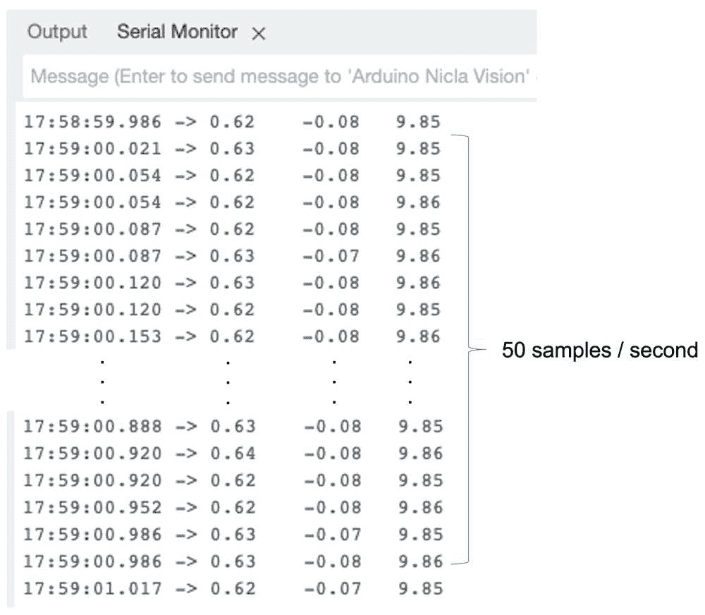

> 注意，当 Nicla 板放在桌子上（摄像头朝下）时，<semantics><mi>z</mi><annotation encoding="application/x-tex">z</annotation></semantics>-轴测得的值约为 9.8 m/s<semantics><msup><mn>2</mn></msup><annotation encoding="application/x-tex">²</annotation></semantics>，这是预期的地球加速度。

## 案例研究：模拟集装箱运输

我们将通过不同的场景模拟集装箱（或更好的包装）运输，使这个教程更具相关性和实用性。使用 Arduino Nicla Vision 板内置的加速度计，我们将通过手动模拟以下条件来捕获运动数据：

1.  **陆地**运输（通过道路或火车）

1.  **海事**相关的运输

1.  通过叉**车**进行垂直移动

1.  仓库中的**静止（空闲）**期

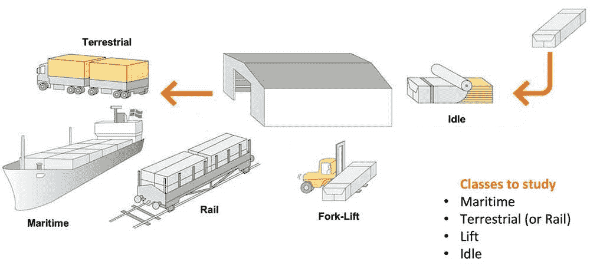

从上述图像中，我们可以为我们的模拟定义，主要水平运动（<semantics><mi>x</mi><annotation encoding="application/x-tex">x</annotation></semantics>或<semantics><mi>y</mi><annotation encoding="application/x-tex">y</annotation></semantics>轴）应与“地面类别”相关联，垂直运动（<semantics><mi>z</mi><annotation encoding="application/x-tex">z</annotation></semantics>-轴）与“提升类别”相关联，无活动与“空闲类别”相关联，三个轴上的运动到[海事类别](https://www.containerhandbuch.de/chb_e/stra/index.html?/chb_e/stra/stra_02_03_03.htm)。


## 数据收集

对于数据收集，我们可以有多种选择。在实际情况下，我们可以将我们的设备直接连接到一个容器上，并将收集到的数据存储在文件中（例如.CSV）并存储在 SD 卡上（通过 SPI 连接）或计算机上的离线仓库。数据也可以通过蓝牙（如本项目中的[传感器数据记录器](https://www.hackster.io/mjrobot/sensor-datalogger-50e44d)）远程发送到附近的仓库，例如手机。一旦您的数据集收集并存储为.CSV 文件，就可以使用[CSV 向导工具](https://docs.edgeimpulse.com/docs/edge-impulse-studio/data-acquisition/csv-wizard)将其上传到 Studio。

> 在这个[视频](https://youtu.be/2KBPq_826WM)中，您可以了解将数据发送到 Edge Impulse Studio 的替代方法。

### 将设备连接到 Edge Impulse

我们将直接将 Nicla 连接到 Edge Impulse Studio，该 Studio 也将用于数据预处理、模型训练、测试和部署。为此，您有两个选项：

1.  下载最新固件并将其直接连接到“数据收集”部分。

1.  使用[CLI 数据转发器](https://docs.edgeimpulse.com/docs/edge-impulse-cli/cli-data-forwarder)工具从传感器捕获传感器数据并发送到 Studio。

选项 1 更为直接，正如我们在*设置 Nicla Vision*的动手实践中所看到的，但选项 2 将为您提供更多关于捕获数据的灵活性，例如采样频率定义。让我们使用最后一个选项来做。

请在 Edge Impulse Studio（EIS）上创建一个新的项目，并将 Nicla 连接到它，按照以下步骤操作：

1.  在您的计算机上安装[Edge Impulse CLI](https://docs.edgeimpulse.com/docs/edge-impulse-cli/cli-installation)和[Node.js](https://nodejs.org/en/)。

1.  上传用于数据捕获的草图（本教程中之前讨论过的那个）。

1.  使用[CLI 数据转发器](https://docs.edgeimpulse.com/docs/edge-impulse-cli/cli-data-forwarder)从 Nicla 的加速度计捕获数据并发送到 Studio，如图所示：

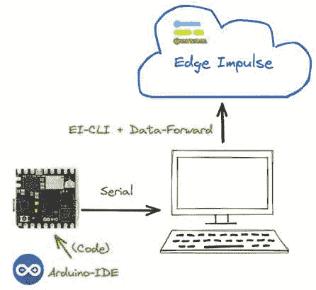

在您的终端上启动[CLI 数据转发器](https://docs.edgeimpulse.com/docs/edge-impulse-cli/cli-data-forwarder)，如果这是第一次使用，请输入以下命令：

```py
$ edge-impulse-data-forwarder --clean
```

接下来，输入你的 EI 凭据并选择你的项目、变量（例如，*accX*、*accY* 和 *accZ*）以及设备名称（例如，*NiclaV*）：

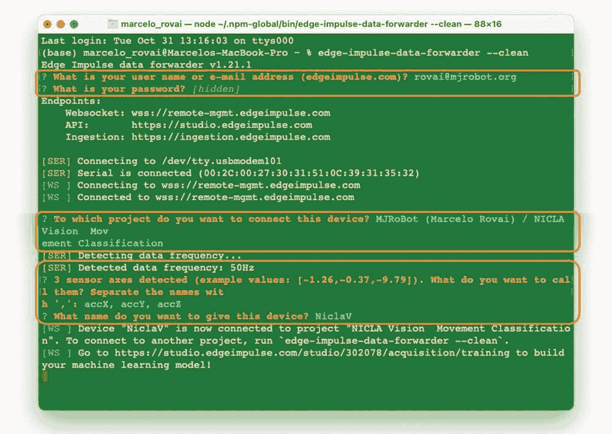

前往你的 EI 项目中的`设备`部分，检查设备是否已连接（点应该是绿色的）：

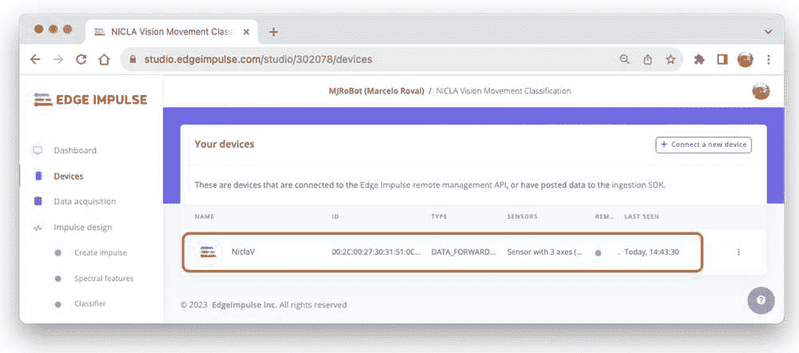

> 你可以克隆为这个动手实践开发的工程：[NICLA Vision Movement Classification](https://studio.edgeimpulse.com/public/302078/latest)。

### 数据收集

在`数据采集`部分，你应该能看到你的板 `[NiclaV]` 已连接。传感器可用： `[具有 3 个轴（accX，accY，accZ）的传感器]`，采样频率为 `[50 Hz]`。工作室建议样本长度为 `[10000]` 毫秒（10 秒）。最后剩下的是定义样本标签。让我们从`[terrestrial]`开始：

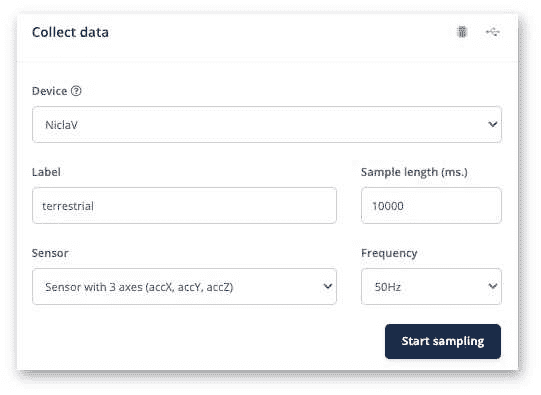

**地面**（卡车或火车上的托盘），水平移动。按 `[开始采样]` 并将你的设备水平移动，保持一个方向在你的桌子上。10 秒后，你的数据将被上传到工作室。以下是样本的收集方式：

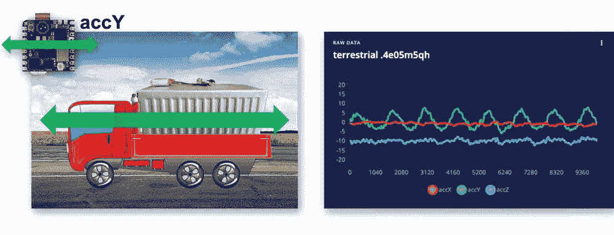

如预期，运动主要被捕捉在<semantics><mi>Y</mi><annotation encoding="application/x-tex">Y</annotation></semantics>轴（绿色）。在蓝色中，我们看到<semantics><mi>Z</mi><annotation encoding="application/x-tex">Z</annotation></semantics>轴，大约在-10 m/s<semantics><msup><mn>2</mn></msup><annotation encoding="application/x-tex">²</annotation></semantics>（Nicla 的摄像头朝上）。

如前所述，我们应该从所有四个运输类别中收集数据。所以，想象一下你有一个内置加速度计的容器，面对以下情况：

**海洋**（愤怒海洋中的船上的托盘）。运动在所有三个轴上被捕捉：

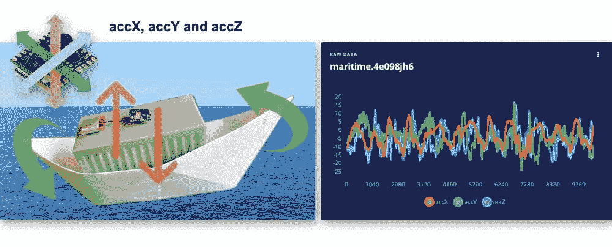

**提升**（托盘被叉车垂直搬运）。运动仅被捕捉在<semantics><mi>Z</mi><annotation encoding="application/x-tex">Z</annotation></semantics>轴：

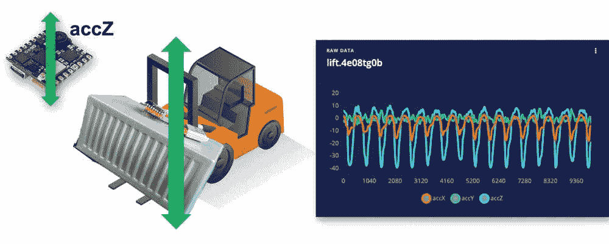

**空闲**（仓库中的托盘）。加速度计未检测到运动：

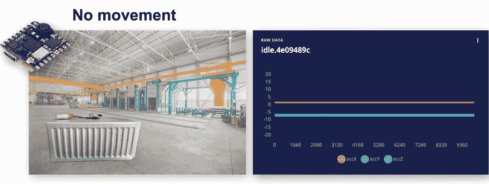

你可以捕捉，例如，2 分钟（12 个 10 秒的样本）的每个四个类别（总共 8 分钟的数据）。在每个样本之后的`三个点`菜单中，选择其中 2 个，为测试集保留。或者，你可以在`仪表板`标签页的`危险区域`使用自动的`训练/测试分割工具`。下面，你可以看到生成的数据集：

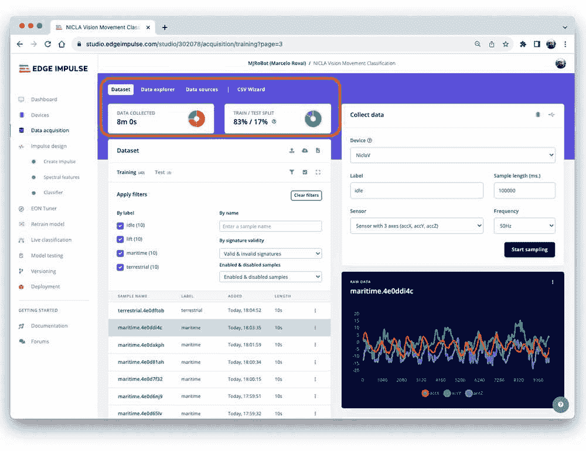

一旦你捕获了你的数据集，你可以使用[数据探索器](https://docs.edgeimpulse.com/docs/edge-impulse-studio/data-acquisition/data-explorer)来更详细地探索它，这是一个可视化工具，用于查找异常值或错误标记的数据（有助于纠正它们）。数据探索器首先尝试从你的数据中提取有意义的特征（通过应用信号处理和神经网络嵌入），然后使用降维算法，如[PCA](https://en.wikipedia.org/wiki/Principal_component_analysis)或[t-SNE](https://en.wikipedia.org/wiki/T-distributed_stochastic_neighbor_embedding)，将这些特征映射到二维空间。这让你可以一目了然地了解你的整个数据集。

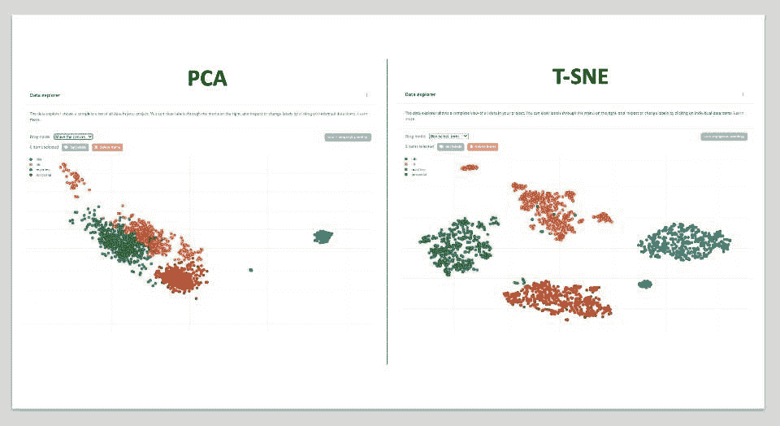

在我们的案例中，数据集看起来不错（良好的分离）。但 PCA 显示，我们可能在海洋（绿色）和提升（橙色）之间存在问题。这是预期的，一旦在船上，有时运动可能只有“垂直”。

## 脉冲设计

下一步是定义我们的脉冲，它将原始数据通过信号处理提取特征，然后将这些特征作为*学习块*的输入张量来对新数据进行分类。前往`脉冲设计`和`创建脉冲`。工作室将建议基本设计。让我们也添加一个用于`异常检测`的第二个*学习块*。

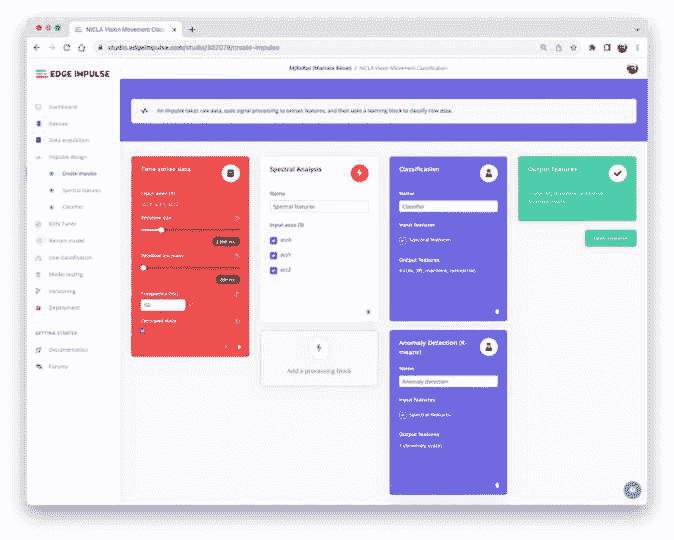

这个第二个模型使用 K-means 模型。如果我们想象我们的已知类别可以作为簇，那么任何无法适应这些簇的样本可能是一个异常值，一个异常，比如一个集装箱从海洋中的船上滚落或从叉车掉落。


采样频率应自动捕获，如果没有，请输入：`[50]`Hz。工作室建议的*窗口大小*为 2 秒（`[2000]`毫秒），带有`[20]`毫秒的*滑动窗口*。我们在这一步定义的是，我们将预处理捕获的数据（时间序列数据），创建一个表格数据集（特征），这将作为神经网络分类器（DNN）和异常检测模型（K-Means）的输入，如下所示：

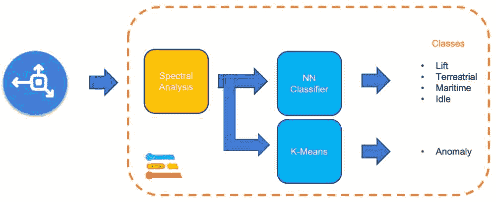

让我们深入了解这些步骤和参数，以更好地理解我们在这里所做的工作。

### 数据预处理概述

数据预处理是从加速度计捕获的数据集中提取特征，这涉及到处理和分析原始数据。加速度计测量物体沿一个或多个轴的加速度（通常是三个，表示为<semantics><mi>X</mi><annotation encoding="application/x-tex">X</annotation></semantics>、<semantics><mi>Y</mi><annotation encoding="application/x-tex">Y</annotation></semantics>和<semantics><mi>Z</mi><annotation encoding="application/x-tex">Z</annotation></semantics>）。这些测量可以用来理解物体的运动的各种方面，如运动模式和振动。

原始加速度计数据可能噪声较大，包含错误或不相关信息。预处理步骤，如滤波和归一化，可以清理和标准化数据，使其更适合特征提取。在我们的案例中，我们应该将数据分成更小的段或**窗口**。这有助于关注数据集中的特定事件或活动，使特征提取更易于管理和有意义。**窗口大小**和重叠（**窗口增加**）的选择取决于应用和感兴趣事件的频率。作为一个经验法则，我们应该尝试捕捉几个“数据周期”。

> 以 50 Hz 的采样率（SR）和 2 秒的窗口大小，我们将得到每个轴 100 个样本，总共 300 个样本（3 轴 <semantics><mi>×</mi><annotation encoding="application/x-tex">\times</annotation></semantics> 2 秒 <semantics><mi>×</mi><annotation encoding="application/x-tex">\times</annotation></semantics> 50 个样本）。我们将每 200 毫秒滑动这个窗口，创建一个更大的数据集，其中每个实例都有 300 个原始特性。

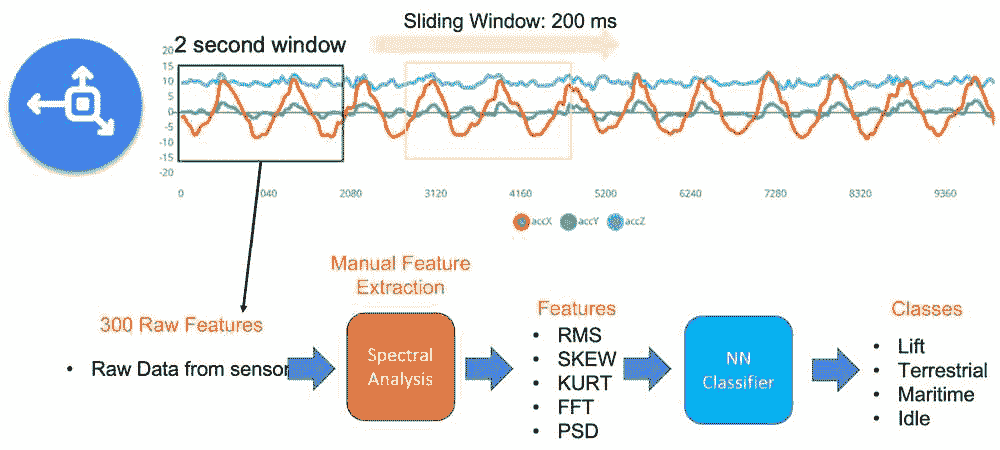

一旦数据经过预处理和分割，你就可以提取描述运动特征的特性。从加速度计数据中提取的一些典型特性包括：

+   **时域**特性描述了每个段内数据的统计特性，例如均值、中位数、标准差、偏度、峰度和零交叉率。

+   **频域**特性是通过使用快速傅里叶变换（FFT）等技术将数据转换到频域获得的。一些典型的频域特性包括功率谱、频谱能量、主导频率（幅度和频率）和频谱熵。

+   **时频域**特性结合了时间和频率域信息，例如短时傅里叶变换（STFT）或离散小波变换（DWT）。它们可以提供对信号频率内容随时间变化的更详细理解。

在许多情况下，提取的特征数量可能很大，这可能导致过拟合或增加计算复杂性。特征选择技术，如互信息、基于相关性的方法或主成分分析（PCA），可以帮助确定给定应用中最相关的特征，并降低数据集的维度。工作室可以帮助进行此类特征重要性计算。

### EI Studio 频谱特性

数据预处理是嵌入式机器学习的一个挑战领域，尽管如此，Edge Impulse 通过其数字信号处理（DSP）预处理步骤以及更具体的[Spectral Features Block](https://docs.edgeimpulse.com/docs/edge-impulse-studio/processing-blocks/spectral-features)帮助克服了这一挑战。

在 Studio 中，收集到的原始数据集将成为频谱分析模块的输入，这对于分析重复运动，如加速度计数据非常出色。此模块将执行数字信号处理（DSP），提取如[快速傅里叶变换](https://en.wikipedia.org/wiki/Fast_Fourier_transform)或[小波](https://en.wikipedia.org/wiki/Digital_signal_processing#Wavelet)等特征。

对于我们的项目，一旦时间信号连续，我们应该使用 FFT，例如长度为`[32]`。

每个轴/通道的**时域统计特征**包括：

+   [均方根](https://en.wikipedia.org/wiki/Root_mean_square): 1 个特征

+   [偏度](https://colab.research.google.com/corgiredirector?site=https%3A%2F%2Fen.wikipedia.org%2Fwiki%2FSkewness): 1 个特征

+   [峰度](https://colab.research.google.com/corgiredirector?site=https%3A%2F%2Fen.wikipedia.org%2Fwiki%2FKurtosis): 1 个特征

每个轴/通道的**频域特征**包括：

+   [频谱功率](https://en.wikipedia.org/wiki/Spectral_density): 16 个特征（FFT 长度/2）

+   偏度: 1 个特征

+   峰度: 1 个特征

因此，对于 32 点的 FFT 长度，频谱分析模块的输出将是每个轴 21 个特征（总共 63 个特征）。

> 你可以通过下载笔记本[Edge Impulse - 频谱特征块分析](https://github.com/Mjrovai/Arduino_Nicla_Vision/blob/main/Motion_Classification/Edge_Impulse_Spectral_Features_Block.ipynb) [TinyML 内部：频谱分析](https://www.hackster.io/mjrobot/tinyml-under-the-hood-spectral-analysis-94676c)或[直接在 Google CoLab 上打开它](https://colab.research.google.com/github/Mjrovai/Arduino_Nicla_Vision/blob/main/Motion_Classification/Edge_Impulse_Spectral_Features_Block.ipynb)来了解更多关于每个特征是如何计算的。

### 生成特征

一旦我们理解了预处理做了什么，就是时候完成工作了。所以，让我们将原始数据（时间序列类型）转换为表格数据。为此，转到`参数`标签页上的`频谱特征`部分，定义主要参数（如前所述的`[FFT]`，长度为`[32]`点），并选择`[保存参数]`：


在顶部菜单中，选择`生成特征`选项和`生成特征`按钮。每个 2 秒窗口的数据将被转换成一个包含 63 个特征的独立数据点。

> 特征探索器将使用[UMAP](https://umap-learn.readthedocs.io/en/latest/)在 2D 中显示这些数据。均匀流形近似和投影（UMAP）是一种降维技术，可以用于可视化，类似于 t-SNE，但也适用于一般的非线性降维。

可视化使得验证在特征生成后，现有的类别保持良好的分离成为可能，这表明分类器应该表现良好。可选地，你可以分析每个特征对于某一类别相对于其他类别的重要性。

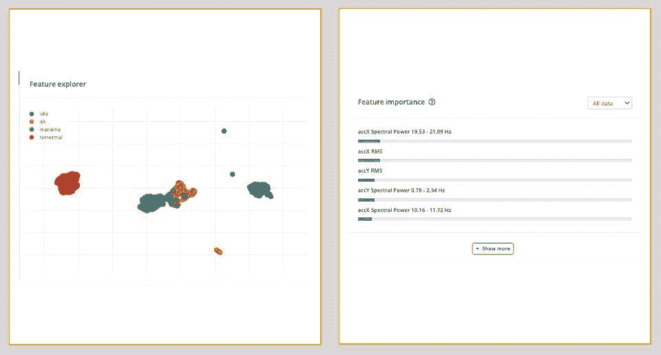

## 模型训练

我们的分类器将是一个密集神经网络（DNN），其输入层将有 63 个神经元，两个隐藏层分别有 20 和 10 个神经元，输出层有四个神经元（每个类别一个），如图所示：

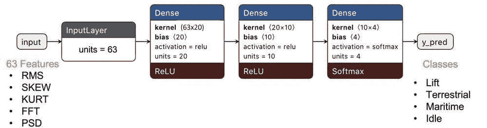

作为超参数，我们将使用学习率为`[0.005]`，批大小为`[32]`，数据验证为`[20]`%，持续`[30]`个 epoch。训练后，我们可以看到准确率为 98.5%。内存和延迟的成本微乎其微。

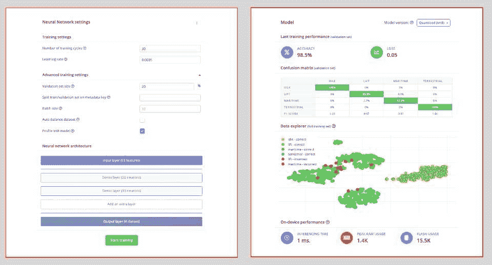

对于异常检测，我们将选择特征提取中精确的最重要特征，再加上 accZ RMS。簇的数量将是`[32]`，正如 Studio 所建议的：

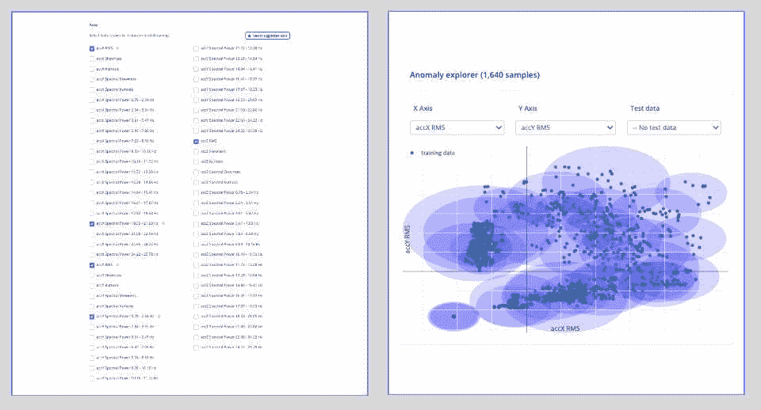

## 测试

我们可以使用在数据捕获阶段留下的 20%的数据来验证我们的模型在未知数据上的表现。结果是几乎 95%，这是很好的。您总是可以努力提高结果，例如，了解一个错误结果中出了什么问题。如果是独特的情况，您可以将其添加到训练数据集中，然后重复它。

对于考虑的不确定结果，默认的最小阈值是分类的`[0.6]`和异常的`[0.3]`。一旦我们有四个类别（它们的输出总和应为 1.0），您也可以为类别设置一个较低的阈值以被视为有效（例如，0.4）。您可以在`三点`菜单上`设置置信度阈值`，除了`分类所有`按钮。

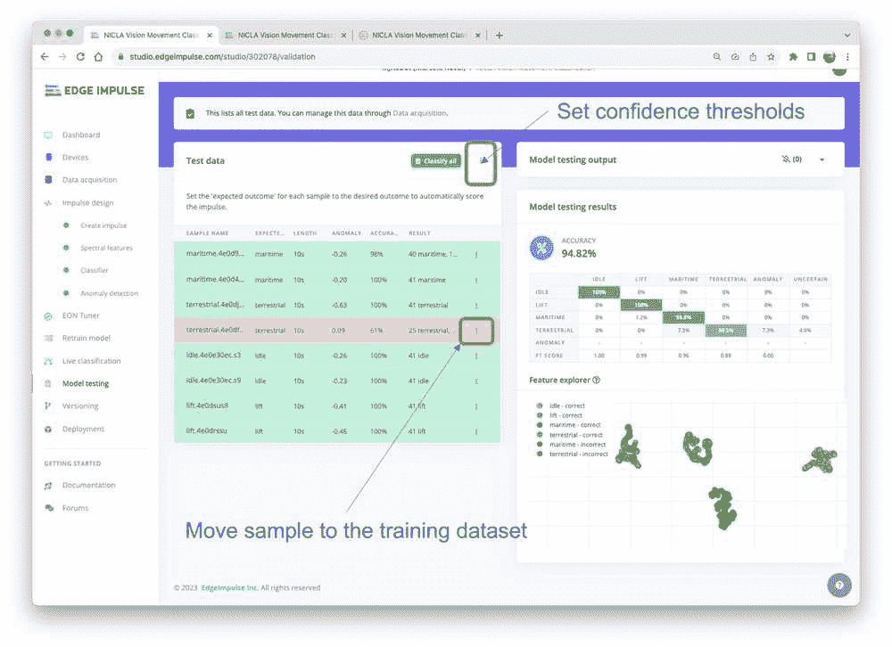

您还可以使用您的设备进行实时分类（设备应仍然连接到 Studio）。

> 请注意，在这里，您将使用您的设备捕获真实数据并将其上传到 Studio，在那里将使用训练好的模型进行推理（但**模型不在您的设备上**）。

## 部署

现在是时候将预处理块和训练好的模型部署到 Nicla 上了。Studio 将打包所有需要的库、预处理函数和训练好的模型，并将它们下载到您的电脑上。您应该选择`Arduino Library`选项，在底部，您可以选择`量化（Int8）`或`未优化（float32）`，然后点击`[构建]`。将创建一个 Zip 文件并下载到您的电脑上。

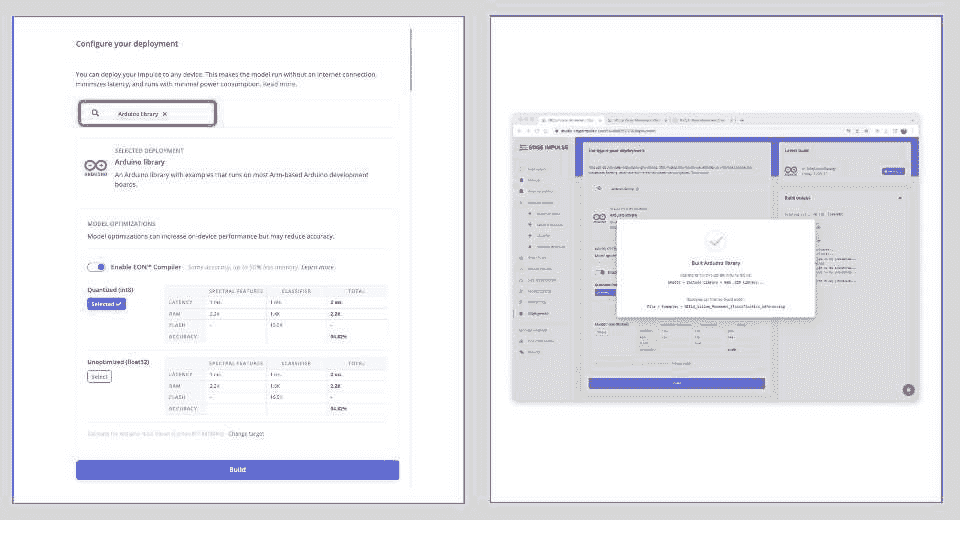

在您的 Arduino IDE 中，转到`草图`标签，选择`添加 ZIP 库`，并选择 Studio 下载的.zip 文件。IDE 终端将出现一条消息：`库已安装`。

### 推理

现在，是时候进行实际测试了。我们将完全脱离 Studio 进行推理。让我们更改您部署 Arduino Library 时创建的一个代码示例。

在您的 Arduino IDE 中，转到`文件/示例`标签，找到您的项目，并在示例中选择`Nicla_vision_fusion`：

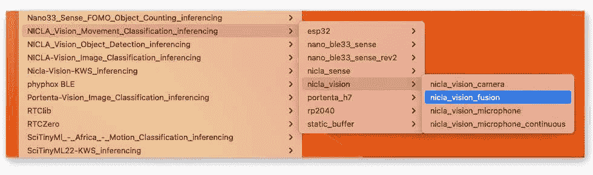

注意，Edge Impulse 创建的代码考虑了一种 *传感器融合* 方法，其中使用了 IMU（加速度计和陀螺仪）和 ToF。在代码的开头，你有与我们项目相关的库，即 IMU 和 ToF：

```py
/* Includes ---------------------------------------------- */
#include <NICLA_Vision_Movement_Classification_inferencing.h>
#include <Arduino_LSM6DSOX.h>  //IMU
#include "VL53L1X.h"  // ToF
```

> 你可以保持代码这种方式进行测试，因为训练好的模型将只使用来自加速度计的预处理特征。但请考虑，你将只使用真实项目中需要的库来编写代码。

就这样！

你现在可以将代码上传到你的设备，并继续进行推理。按下 Nicla 的 `[RESET]` 按钮两次以将其置于引导模式（如果仍然连接，请断开与 Studio 的连接），并将草图上传到你的板子。

现在你应该尝试用你的板子（类似于数据捕获期间所做的动作）进行不同的动作，观察每个类别在串行监视器上的推理结果：

+   **空闲和提升类别**：

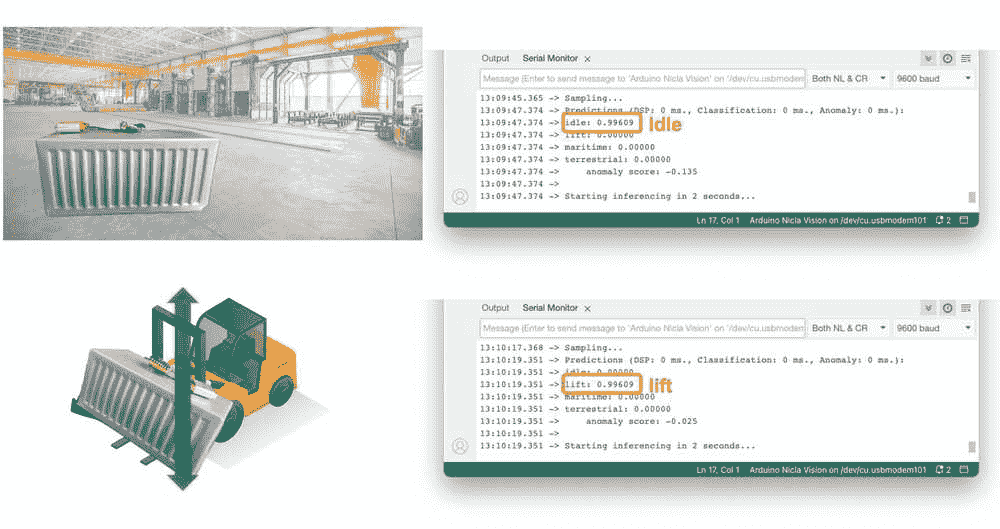

+   **海洋和陆地**：

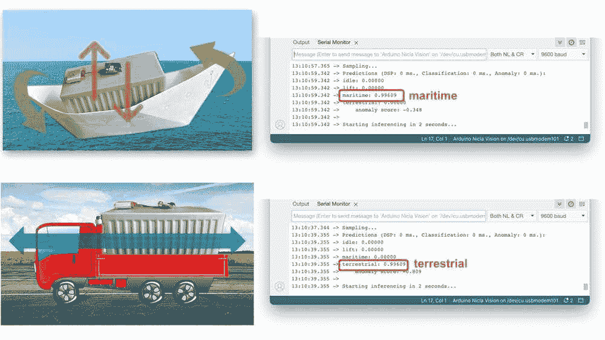

注意，在所有上述情况下，`异常分数` 的值都小于 0.0。尝试一个新的动作，这个动作不是原始数据集的一部分，例如，“滚动” Nicla，摄像头朝下面对，就像一个从船上掉下来的容器或甚至是一次船只事故：

+   **异常检测**：

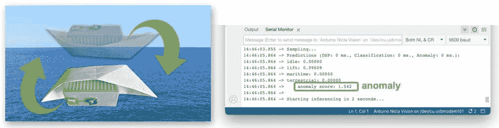

在这种情况下，异常值要大得多，超过 1.00

### 后处理

既然我们知道模型正在工作，因为它检测到了动作，我们建议你修改代码，以查看 NiclaV 完全离线（从 PC 断开连接并由电池、移动电源或独立的 5 V 电源供电）的结果。

策略是和 KWS 项目做同样的事情：如果检测到特定的动作，特定的 LED 就会亮起。例如，如果检测到 *陆地*，绿色 LED 会亮起；如果 *海洋*，红色 LED 会亮起；如果是 *提升*，蓝色 LED 会亮起；如果没有检测到动作 *(空闲*)，LED 将会关闭。你还可以添加一个条件，当检测到异常时，例如，可以使用白色（所有 LED 同时亮起）。

## 摘要

> 在这个动手教程中使用的笔记本和代码可以在 [GitHub](https://github.com/Mjrovai/Arduino_Nicla_Vision/tree/main/Motion_Classification) 仓库中找到。

在我们结束之前，考虑一下，运动分类和目标检测可以在各个领域的许多应用中被利用。以下是一些潜在的应用：

### 应用案例

#### 工业和制造

+   **预测性维护**：在故障发生之前检测机械运动的异常。

+   **质量控制**：监控装配线或机械臂的运动，以进行精度评估和检测与标准运动模式的偏差。

+   **仓储物流**：通过分类不同类型的运动并检测处理过程中的异常，使用自动化系统管理和跟踪货物的移动。

#### 医疗保健

+   **患者监控**：检测老年人或有行动障碍的人的跌倒或异常运动。

+   **康复**：通过分类物理治疗期间的运动模式来监控受伤患者恢复的进展。

+   **活动识别**：为健身应用或患者监控分类身体活动类型。

#### 消费电子产品

+   **手势控制**：通过特定动作来控制设备，例如用手势开关灯。

+   **游戏**：通过动作控制输入增强游戏体验。

#### 交通运输与物流

+   **车辆远程信息处理**：监控车辆运动，以检测异常行为，如急刹车、急转弯或事故。

+   **货物监控**：通过检测可能表明篡改或不当处理的异常运动来确保运输过程中货物的完整性。

#### 智慧城市与基础设施

+   **结构健康监控**：检测结构内部的振动或运动，这些可能表明潜在的故障或维护需求。

+   **交通管理**：分析行人或车辆流量，以改善城市移动性和安全性。

#### 安全与监控

+   **入侵检测**：检测典型的不授权访问或其他安全违规行为的运动模式。

+   **野生动物监控**：在保护区检测偷猎者或异常动物活动。

#### 农业

+   **设备监控**：跟踪农业机械的性能和利用率。

+   **动物行为分析**：监控牲畜运动，以检测表明健康问题或压力的行为。

#### 环境监测

+   **地震活动**：检测地震或其他地质相关事件之前的不规则运动模式。

+   **海洋学**：研究波浪模式或海洋运动，用于研究和安全目的。

### Nicla 3D 外壳

对于实际应用，正如之前所描述的，我们可以在我们的设备上添加一个外壳，来自 Edge Impulse 的 Eoin Jordan 为 Nicla 系列板开发了出色的可穿戴和机器健康外壳。它使用 10mm 磁铁、2M 螺丝和 16mm 带子，适用于人和机器健康用例场景。以下是链接：[Arduino Nicla 语音和视觉可穿戴外壳](https://www.thingiverse.com/thing:5923305)。

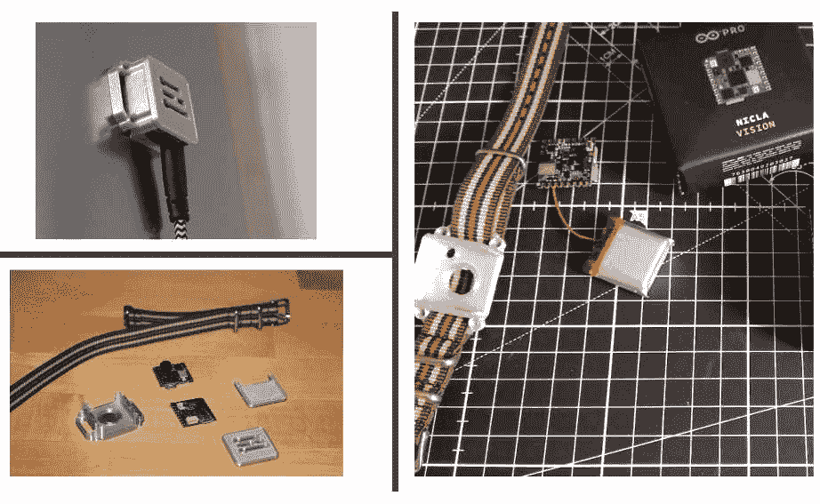

运动分类和异常检测的应用非常广泛，Arduino Nicla Vision 非常适合低功耗和边缘处理的场景。其小巧的尺寸和高效的处理能力使其成为部署便携式和远程应用的理想选择，在这些应用中，实时处理至关重要，而连接性可能有限。

## 资源

+   [Arduino 代码](https://github.com/Mjrovai/Arduino_Nicla_Vision/tree/main/Motion_Classification/Niclav_Acc_Data_Capture)

+   [Edge Impulse 频谱特征块 Colab 笔记本](https://colab.research.google.com/github/Mjrovai/Arduino_Nicla_Vision/blob/main/Motion_Classification/Edge_Impulse_Spectral_Features_Block.ipynb)

+   [Edge Impulse 项目](https://studio.edgeimpulse.com/public/302078/latest)
